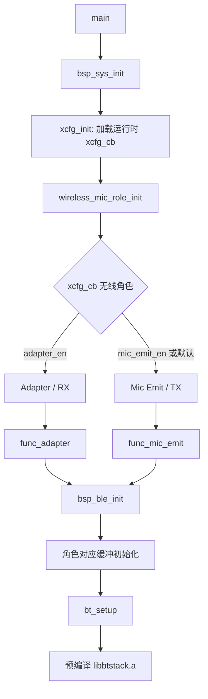
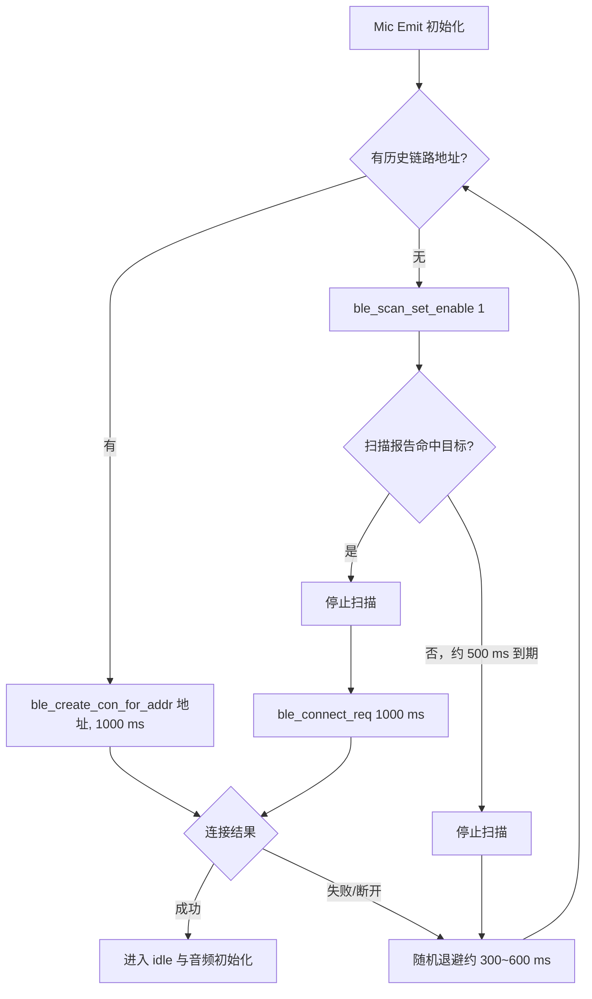
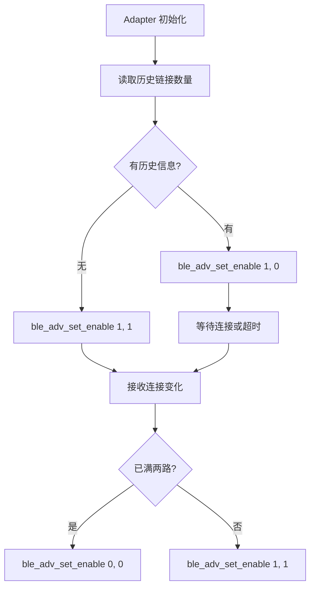
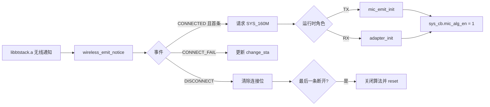
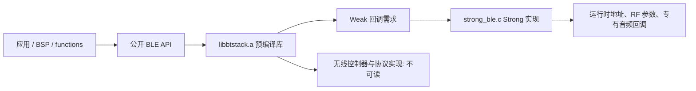

# AB5766 BLE 无线麦克风技术栈：新手入门

> **适用对象**：当前 `CONFIG_AB5766_LE_MIC` 工程的初学者。
>
> **核心结论**：本工程可严格描述为“使用 BLE 连接相关能力与预编译专有无线麦传输机制的低延迟无线麦系统”。它当前明确包含广播、扫描、连接、专有 D2A 音频帧接口和私有控制命令；**不能**仅因使用了 `LC3S` 或链接了 `libbtstack.a`，就写成标准手机蓝牙音频、A2DP/HFP，或完整 Bluetooth SIG LE Audio。
>
> **证据原则**：所有工程事实均以当前可读 C 源码、配置和库公开头文件为准。`libbtstack.a` 内部的空口 PDU、重传、CRC、跳频、控制器/主机状态机和调度实现不可见，本文明确保留边界。

---

## 1. 先分清四类“已知程度”

蓝牙术语很多，最容易犯的错误是“头文件里有 API，所以当前产品正在使用”。本文采用四个等级：

| 等级 | 含义 | 示例 |
|---|---|---|
| **当前明确使用** | 当前配置和应用调用链直接证明 | BLE 广播、扫描、连接；`wireless_d2a_*` 音频接口；私有命令队列 |
| **库 API 可见，应用未证实** | 公开头文件或库能力存在，但未找到当前应用实际启用链 | GATT/ATT 操作、SM、安全、具体 PHY 选择 |
| **当前无启用证据/明确关闭** | 没有当前调用链，或宏为 0 | Classic A2DP/HFP/SPP；LE Audio ISO；USB Speaker 下行 |
| **预编译内部不可确认** | 只有 `libbtstack.a` 边界或回调 | 空口承载、重传次数、CRC、连接事件调度、私有帧格式 |

后续所有结论都应按这四层阅读。

---

## 2. 蓝牙知识地图与本工程对照

### 2.1 基础术语

| 技术/层次 | 通用含义 | 当前工程结论 |
|---|---|---|
| Bluetooth Classic / BR/EDR | 传统蓝牙体系，典型音频 Profile 有 A2DP、HFP、AVRCP | 未发现当前应用启用证据，不能当作当前实现 |
| BLE / LE | 低功耗蓝牙体系，包含广播、扫描、连接和 GATT 等机制 | 当前明确使用连接相关能力 |
| PHY / Link Layer | 无线调制、信道、连接事件、重传等底层机制 | 头文件/库可能支持部分能力；当前实际 PHY、空口过程不可由应用源码确认 |
| GAP | 广播、扫描、可发现、可连接、建立/断开连接等角色行为 | 当前明确可见：`ble_adv_set_enable()`、`ble_scan_set_enable()`、`ble_connect_req()` |
| ATT | BLE 属性访问协议 | 当前无法从应用调用链证明音频或控制实际使用 ATT 承载 |
| GATT | 基于 ATT 的服务、特征、读写、通知/指示模型 | 工程引用过 `profile.gatt`，但当前工作树缺少该文件；不能据此断言当前注册了 GATT Profile |
| SM / Bonding | 配对、加密、密钥和绑定管理 | 库定义可能存在；当前 `WIRELESS_CON_BONDING_EN = 0`，不能说默认链路已启用标准安全/绑定流程 |
| LC3/LC3S | 音频编解码器或厂商/SDK 对应接口 | 当前 `CODEC_LC3S` 明确启用；不等于完整 LE Audio |
| LE Audio | Bluetooth SIG 的 LE 音频体系，通常涉及 ISO、CIS/BIS、BAP/CAP、PACS/ASCS 等 | 未找到可读启用证据，不能写成当前实现 |
| A2DP/HFP/AVRCP/SPP | Classic 常见音频/控制/串口 Profile | 未发现当前应用配置和调用链 |
| USB Microphone | USB Device 音频输入，供主机读取 Adapter 输出 | 当前已开启；这不是 Bluetooth Profile |

### 2.2 关键边界：`LC3S` 不等于 LE Audio

当前 [config_ab5766_le_mic.h:64-84](../../projects/microphone/config_ab5766_le_mic.h#L64-L84) 配置 `WIRELESS_CON_CODEC_SEL = CODEC_LC3S`，而 [mic_proc.c:352-363](../../modules/wireless/mic_proc.c#L352-L363) 与 [mic_proc.c:565-580](../../modules/wireless/mic_proc.c#L565-L580) 分别调用 `lc3s_enc()` 和 `lc3s_dec()`。

这些事实只能证明当前音频编解码路径选用了 LC3S 接口。当前工作树中未发现可读的 ISOAL、CIG/CIS、BIG/BIS、PACS、ASCS、BAP、CAP 或标准 LE Audio Unicast Audio Server/Client 实现。因此正确表述是：

> 当前工程使用 LC3S 编解码和专有无线麦 D2A 传输机制；LC3S 的出现不单独证明使用 Bluetooth SIG LE Audio 的标准 ISO 传输和标准音频 Profile。

---

## 3. 从上电到角色与 BLE 初始化



入口 [main.c:5-20](../../projects/microphone/main.c#L5-L20) 在 `bsp_sys_init()` 后进入 `func_run()`。运行时角色并非由板卡名称、COM 端口或日志标签决定，而是 [wireless_proc.c:5-17](../../modules/wireless/wireless_proc.c#L5-L17) 根据 `xcfg_cb.wireless_adapter_en` 与 `xcfg_cb.wireless_mic_emit_en` 选择：Adapter 优先；否则 Mic Emit；两者皆关时源码默认 Mic Emit。

随后角色函数调用 `bsp_ble_init()`；[wireless.c:223-239](../../modules/wireless/wireless.c#L223-L239) 会先初始化 Adapter 或 Device 的专有无线帧缓冲，再调用 `bt_setup()` 进入预编译 BLE 栈。

---

## 4. TX 与 RX 的 GAP 类行为：扫描、广播与连接

### 4.1 Mic Emit / TX：回连优先，扫描兜底



[func_mic_emit.c:52-139](../../functions/func_mic_emit.c#L52-L139) 展示 TX 状态机：

- 若 `bt_get_link_info_addr()` 找到历史地址，则用 `ble_create_con_for_addr(addr, 1000)` 回连；
- 否则调用 `ble_scan_set_enable(1)`；
- 约 500 ms 后停止扫描，并随机退避约 300–600 ms；
- 连接失败或断开后也进入随机延迟，再重新尝试。

扫描报告如何进入连接请求可见于 [wireless.c:185-215](../../modules/wireless/wireless.c#L185-L215)：`ble_scan_rx_rep_cb()` 停止扫描、保存目标地址、再调用 `ble_connect_req(1000)`。目标地址如何由预编译库筛选、扫描 PDU 如何处理，超出当前源码边界。

### 4.2 Adapter / RX：广播并可接两路 TX



[func_adapter.c:71-120](../../functions/func_adapter.c#L71-L120) 的 Adapter 状态机说明：

- 有历史链接信息时调用 `ble_adv_set_enable(1, 0)`；
- 无历史信息时调用 `ble_adv_set_enable(1, 1)`；
- 连接状态变化后，若已达到 `WIRELESS_MIC_STA_MASK`（当前两路配置的满连接状态），调用 `ble_adv_set_enable(0, 0)`；否则继续允许发现和连接。

[api_wireless_mic.h:64-74](../../libs/ble/api_wireless_mic.h#L64-L74) 注释说明 `ble_adv_set_enable(pscan, iscan)` 的两个参数对应可被连接与可被发现。这是当前可确认的应用层行为；实际广播数据内容、间隔与底层状态机由库和运行参数决定。

---

## 5. 连接事件如何分叉到音频系统



[wireless_proc.c:91-180](../../modules/wireless/wireless_proc.c#L91-L180) 将预编译库通知映射到应用状态：

- 首条连接建立时：申请 160 MHz，调用 `adapter_init()` 或 `mic_emit_init()`，再置 `sys_cb.mic_alg_en = 1`；
- 连接失败：更新角色状态机所读取的 `change_sta`；
- 断开：清除链路位；最后一条断开时关闭算法并执行角色相关 reset。

这也是为什么“出现 `WIRELESS_CONNECTED`”本身不能独立说明角色：同一共享回调会在两个角色里使用；必须结合 `func_mic_emit` 或 `func_adapter` 等实际入口判断。

---

## 6. 音频数据面与控制面是两条不同路径


### 6.1 音频数据面：专有 `wireless_d2a_*` 接口

当前 TX 调 `wireless_d2a_put_tx_frame()` 交出编码帧，RX 由 `wireless_d2a_set_rxpkt_cb()` 接收并在 `wireless_d2a_set_rxdec_cb()` 投递解码线程，见 [wireless_txrx_single.c:250-311](../../modules/wireless/wireless_txrx_single.c#L250-L311)。完整 PCM、编解码、PLC、混音输出可参考 [音频算法与实时处理：新手入门](AB5766_音频算法与实时处理_新手入门.md)。

应用源码能证明这是现有音频数据面，但不能从此确定它在空口上具体使用 ATT Notification、某种 ACL 私有 PDU，或其他预编译库内部承载方式。

### 6.2 控制面：私有命令队列

控制命令走不同于音频的应用通道：

- `wireless_send_cmd()` 保存 `[len | payload]`，打印 `TX_CMDn`，再调用 `ble_con_user_cmd_tx_req(index)`；
- 库回调 `ble_con_user_cmd_rx_cb()` 后，应用用 `pdu[0]` 作为长度、`pdu+1` 作为 payload，打印 `RX_CMDn`；
- 再由 `wireless_rx_cmd()` 按顶层命令和运行时角色分派。

该调用边界在 [wireless_cmd.c:66-118](../../modules/wireless/wireless_cmd.c#L66-L118) 和 [api_wireless_mic.h:71-74](../../libs/ble/api_wireless_mic.h#L71-L74)。`02 01 <level> <boundary>`、`02 03 <mute>` 的逐字节解释见 [无线麦按键消息、TX_CMD 与 RX_CMD：调用链和格式解析](AB5766_无线麦按键消息_TX_CMD_RX_CMD_调用链与格式解析.md)。

`TX_CMD` 只证明应用已入队并请求库发送；`RX_CMD` 只证明对端应用回调已收到 payload。它们均不自动证明空口确认、参数转发、持久化或最终听感。

---

## 7. `libbtstack.a` 与 Strong/Weak Hook 边界

工程链接了预编译库 `libbtstack.a`。应用并非完全不与库交互，而是通过公开 API 与 Strong 覆盖 Weak Hook 进行桥接。



[strong_ble.c:1-29](../../projects/microphone/strong_ble.c#L1-L29) 提供本机 BLE 地址与 RF 参数。当前 `WIRELESS_CON_VERS == 7` 时，[strong_ble.c:128-203](../../projects/microphone/strong_ble.c#L128-L203) 又把 ACL TX/RX 完成、连接事件、anchor 时间戳、音频 init/start/stop、单链路时长和 skip-first 等回调桥接到 `ble_t2r_v8_*` 接口。

这能够证明：应用通过 Strong/Weak 机制为预编译库提供参数和回调入口。它**不能**公开或替代库内实现，也不能把 `WIRELESS_CON_VERS = 7` 误说成 Bluetooth SIG LE Audio 版本；配置注释将其定义为项目“传输机制版本”。

---

## 8. 为什么当前工程采用专有无线麦方案，而不是其他方案

下表的“为什么”是根据可见架构目标做的工程适用性解释，**不是**对 `libbtstack.a` 内部实现的反向证明。

| 方案 | 当前工程状态 | 对本项目的适用性判断 |
|---|---|---|
| BLE 广播/扫描/连接 + 专有 D2A 音频 | 当前明确使用 | 适合固定 TX→Adapter 拓扑、最多两路 TX、低延迟语音处理、RX 直接 DAC/USB Mic 输出 |
| 私有用户命令 | 当前明确使用 | 适合音量、静音等少量紧凑控制 payload；无需依赖手机通用 GATT 客户端交互 |
| GATT Notify 音频流 | 当前未得到可读使用证据 | GATT 适合通用互操作控制/数据，但当前不能说工程用它承载实时音频 |
| 标准 LE Audio ISO/CIS/BIS | 当前未找到可读启用证据 | 标准互操作价值高，但需完整 ISO 和 Profile 体系；当前项目只可确认 LC3S + 私有无线接口 |
| Classic A2DP | 当前无启用证据 | 典型媒体播放场景，不能当作本工程当前低延迟无线麦路径 |
| Classic HFP/HSP | 当前无启用证据 | 典型电话语音场景；未见当前 Profile 实现证据 |
| AVRCP / SPP | 当前无启用证据 | 分别适用于媒体控制/串口数据；未见当前调用链 |
| USB Microphone | 当前明确启用 | Adapter 可向 USB 主机提供接收后的音频；这可作为手机 OTG 或 PC 音频输入路径，但不是蓝牙手机直连 |
| USB Speaker 下行 | `ADAPTER_USB_SPK_TX_EN = 0` | 当前配置注释明确“不支持”，不可与 A2DP 或 TX 音频混淆 |

### 8.1 手机能否直接替代当前 TX/RX？

不应假设手机可直接作为当前专有无线麦链路的对端。当前可读工程没有把音频暴露为手机可发现的 A2DP/HFP/LE Audio/GATT 音频 Profile 的证据。

更符合当前可见架构的主机路径是：

```text
TX 无线麦 -> 专有 BLE 无线麦链路 -> Adapter -> USB Microphone -> PC 或支持 USB-C OTG 的手机
```

是否能被特定手机识别，还取决于 USB 枚举、手机 OTG/供电能力和硬件验证，不能由固件静态分析保证。

---

## 9. 当前工程的风险点与不可推断事项

1. **`profile.gatt` 缺失**：工程文件包含对 `modules/ble/profile.gatt` 的引用，但当前工作树没有该文件。它可能是遗留引用、未纳入仓库的生成物或工程遗漏。没有源文件、生成物或运行镜像证据时，不能声称当前固件注册了某个 GATT 服务或特征。
2. **重传配置注释不一致**：当前宏 `WIRELESS_MIC_RETRY_NB = 3`，同一行注释却写“暂时支持 1/2”，见 [config_ab5766_le_mic.h:76-84](../../projects/microphone/config_ab5766_le_mic.h#L76-L84)。应以厂商库说明、构建结果和实机 PER/日志验证实际生效行为，不能用应用宏反推底层真实重传次数。
3. **`FEAT_A2D` 不等于 Classic A2DP**：[api_wireless_mic.h:31-38](../../libs/ble/api_wireless_mic.h#L31-L38) 的 `FEAT_D2A` / `FEAT_A2D` 是该专有无线麦 API 的方向性 feature 名称。不能仅由缩写把它解释为 Bluetooth A2DP。
4. **库日志不可强行解码**：`tx_cntl`、`rx_cntl`、前导 `ff`、尾随零字节以及括号数字没有可读库实现。请只把它们当诊断线索，而不要为其指定协议字段语义。
5. **RF、声学与端到端时延**：频点范围、功率、RSSI 阈值和时间预算在配置中可见，但最终距离、抗干扰、延迟、音质和量产指标必须实测。

---

## 10. 新手验证路线

1. **确认角色来源**：用 `xcfg_cb -> wireless_mic_role_init() -> func_run()` 判断 Adapter 或 Mic Emit，不依赖开发板名称、串口或日志标签。
2. **确认 GAP 行为**：TX 无历史地址时应进入扫描；RX 应进入广播；检查连接/失败/断开日志和状态机重试。
3. **确认音频面**：建立单路连接后，检查 TX PCM→LC3S→`wireless_d2a_put_tx_frame()` 与 RX `wireless_d2a_*`→LC3S→PLC→DAC/USB Mic 的调用和实机输出。
4. **确认控制面**：按 K1/K2/PP，按文档解析 `TX_CMD` 与对端 `RX_CMD`；不要把它们当作空口确认或最终效果确认。
5. **再测试双路**：两只 TX 同时连接，验证 RX 满两路后是否停止广播，并验证 Mix DRC 的削顶、音量和同步行为。
6. **最后做硬件测试**：用实际主机检查 USB Mic 枚举；用不同距离/遮挡/干扰环境检查丢包、PLC、重连和端到端时延。

---

## 11. 源码速查与配套阅读

| 位置 | 关键内容 | 本文用途 |
|---|---|---|
| [config_ab5766_le_mic.h:61-179](../../projects/microphone/config_ab5766_le_mic.h#L61-L179) | 无线、算法、USB 宏 | 当前产品能力基线 |
| [wireless_proc.c:5-17](../../modules/wireless/wireless_proc.c#L5-L17) | `wireless_mic_role_init()` | 运行时角色判定 |
| [wireless.c:185-239](../../modules/wireless/wireless.c#L185-L239) | 扫描回调、BLE 初始化 | 扫描命中与 `bt_setup()` 边界 |
| [func_mic_emit.c:52-139](../../functions/func_mic_emit.c#L52-L139) | TX 状态机 | 回连、扫描、退避 |
| [func_adapter.c:71-120](../../functions/func_adapter.c#L71-L120) | RX 状态机 | 广播、两路连接策略 |
| [wireless_proc.c:91-180](../../modules/wireless/wireless_proc.c#L91-L180) | 连接通知 | 音频启停与角色分叉 |
| [wireless_txrx_single.c:250-311](../../modules/wireless/wireless_txrx_single.c#L250-L311) | `wireless_d2a_*` | 专有音频数据面边界 |
| [wireless_cmd.c:66-118](../../modules/wireless/wireless_cmd.c#L66-L118) | `TX_CMD/RX_CMD` | 私有控制面边界 |
| [api_wireless_mic.h:55-94](../../libs/ble/api_wireless_mic.h#L55-L94) | BLE 公共 API | 广播、扫描、连接、私有命令请求 |
| [strong_ble.c:11-203](../../projects/microphone/strong_ble.c#L11-L203) | Strong Hook | 预编译库桥接边界 |

配套阅读：

- [音频算法与实时处理：新手入门](AB5766_音频算法与实时处理_新手入门.md)
- [LE Mic 新手开发指南](AB5766_LE_Mic_新手开发指南.md)
- [嵌入式固件 SDK 架构导览](AB5766_嵌入式固件SDK_架构导览.md)
- [TX/RX 角色判定、全调用链与日志验证指南](AB5766_LE_Mic_TX_RX角色判定_全调用链与日志验证指南.md)
- [无线麦按键消息、TX_CMD 与 RX_CMD：调用链和格式解析](AB5766_无线麦按键消息_TX_CMD_RX_CMD_调用链与格式解析.md)
- [发射端 Mic Emit 实现详解](AB5766_发射端_Mic_Emit_实现详解.md)
- [接收端 Adapter 实现详解](AB5766_接收端_Adapter_实现详解.md)

---

## 12. 一句话记忆

```text
本工程：BLE 连接能力 + 专有无线麦音频/命令接口 + LC3S 编解码 + Adapter 的 DAC/USB Mic 输出。

不是已由当前源码证实的：手机标准蓝牙音频、A2DP/HFP、GATT 音频流、完整 LE Audio ISO/BAP/CAP。
```
