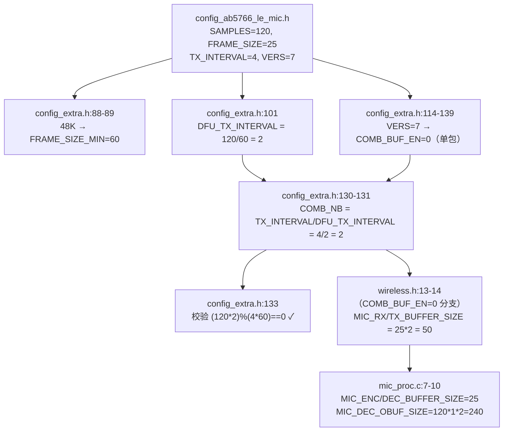
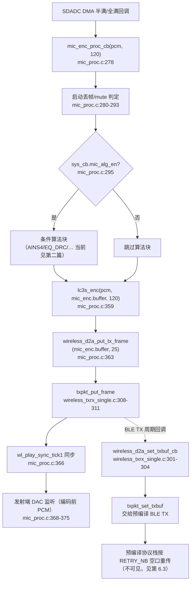
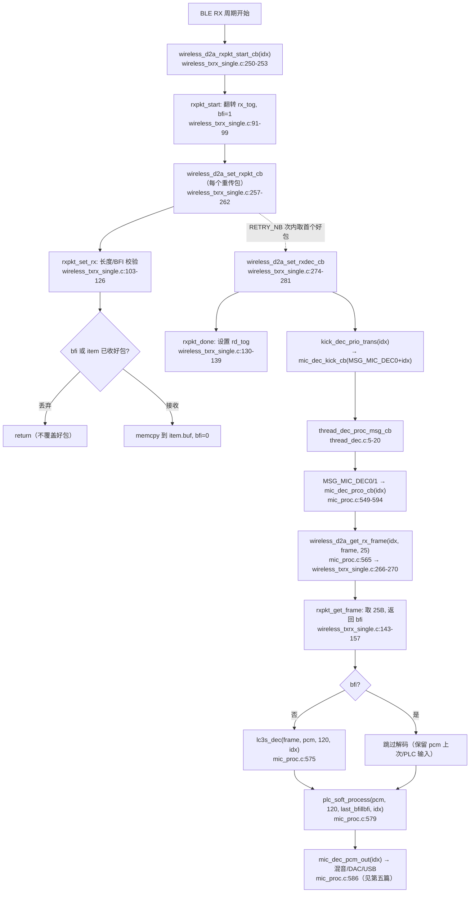

# AB5766 LE Mic LC3S 编码解码与无线帧边界

> **适用范围：** 当前 `CONFIG_AB5766_LE_MIC` 产品配置。本文档以可见 C 源码中的编译条件、调用关系和数据流为依据；不以文件名、宏名或日志文字单独推断功能，也不推断预编译库内部实现。
>
> **与其他文档的关系：** 本文专讲 LC3S 编解码接口与无线帧缓冲边界，是 [系统角色与算法启动门禁](AB5766_LE_Mic_系统角色与算法启动门禁.md) 与 [发射端采集增益与音效链](AB5766_LE_Mic_发射端采集增益与音效链.md) 之后的第三篇专题。门禁、角色、连接初始化等公共前置见第一篇；Soft Gain / Local PACC 等编码前处理见第二篇；接收端 BFI / PLC 细节见第四篇。

## 1. 适用配置与边界

| 项目 | 当前值 | 来源 |
| --- | --- | --- |
| 编解码选择 | `CODEC_LC3S` | [config_ab5766_le_mic.h:64](../../projects/microphone/config_ab5766_le_mic.h#L64) |
| 传输机制版本 | `WIRELESS_CON_VERS=7`（单包路径） | [config_ab5766_le_mic.h:65](../../projects/microphone/config_ab5766_le_mic.h#L65) |
| 采样率 | `SAMPLE_RATE_48K` | [config_ab5766_le_mic.h:77](../../projects/microphone/config_ab5766_le_mic.h#L77) |
| 每帧样点数 | 120 | [config_ab5766_le_mic.h:78](../../projects/microphone/config_ab5766_le_mic.h#L78) |
| 声道数 | 1（单声道） | [config_ab5766_le_mic.h:79](../../projects/microphone/config_ab5766_le_mic.h#L79) |
| 压缩帧长度 | 25 byte | [config_ab5766_le_mic.h:80](../../projects/microphone/config_ab5766_le_mic.h#L80) |
| 重传次数 | `WIRELESS_MIC_RETRY_NB=3`（**见第 6.3 一致性风险**） | [config_ab5766_le_mic.h:81](../../projects/microphone/config_ab5766_le_mic.h#L81) |
| 发送周期 | `4 × 1.25 ms` | [config_ab5766_le_mic.h:82](../../projects/microphone/config_ab5766_le_mic.h#L82) |
| 最大链路数 | 2 | [config_ab5766_le_mic.h:76](../../projects/microphone/config_ab5766_le_mic.h#L76) |
| 组合包数 | `COMB_NB=2`（派生，见第 2 节） | [config_extra.h:130-131](../../projects/microphone/config_extra.h#L130-L131) |

**本文档可确认的事：** LC3S 的初始化入口、编码/解码调用点的参数、25-byte 帧在发射/接收缓冲区中的搬运与 ping-pong 管理、解码线程分派、单包路径下 `RETRY_NB` 在可见层的使用情况。

**本文档不证明的事：** LC3S 的量化、心理声学模型、比特分配、抗误码细节；无线空口实际重传次数与时序；任一参数组合在硬件上的听感或指标。这些属于预编译库与协议栈边界，需 E2（map）+ E3（双板/仪器）证据，见第 9 节。

## 2. 配置快照：参数一致性与派生关系

LC3S 路径的帧参数由 [config_ab5766_le_mic.h:64-84](../../projects/microphone/config_ab5766_le_mic.h#L64-L84) 直接定义，组合包数与缓冲区大小则在 [config_extra.h](../../projects/microphone/config_extra.h) 与 [wireless.h](../../modules/wireless/wireless.h) 中派生。当前配置的推导链如下：



**派生值核对（当前配置）：**

| 派生量 | 公式 | 当前值 | 来源 |
| --- | --- | --- | --- |
| `FRAME_SIZE_MIN` | 48K → 60 样点/1.25 ms | 60 | [config_extra.h:88-89](../../projects/microphone/config_extra.h#L88-L89) |
| `WIRELESS_MIC_DFU_TX_INTERVAL` | `SAMPLES / FRAME_SIZE_MIN` | 2 | [config_extra.h:101](../../projects/microphone/config_extra.h#L101) |
| `WIRELESS_MIC_COMB_NB` | `TX_INTERVAL / DFU_TX_INTERVAL` | 2 | [config_extra.h:130-131](../../projects/microphone/config_extra.h#L130-L131) |
| `WIRELESS_CON_INTERVAL` | TX_INTERVAL 非 12/8 → 60 | 60 | [config_extra.h:120](../../projects/microphone/config_extra.h#L120) |
| `MIC_RX_BUFFER_SIZE` | `FRAME_SIZE * COMB_NB`（单包分支） | 50 | [wireless.h:13](../../modules/wireless/wireless.h#L13) |
| `MIC_TX_BUFFER_SIZE` | `FRAME_SIZE * COMB_NB`（单包分支） | 50 | [wireless.h:14](../../modules/wireless/wireless.h#L14) |
| `MIC_ENC_BUFFER_SIZE` | `WIRELESS_MIC_FRAME_SIZE` | 25 | [mic_proc.c:7](../../modules/wireless/mic_proc.c#L7) |
| `MIC_DEC_BUFFER_SIZE` | `WIRELESS_MIC_FRAME_SIZE` | 25 | [mic_proc.c:8](../../modules/wireless/mic_proc.c#L8) |
| `MIC_DEC_OBUF_SIZE` | `SAMPLES * CHANNEL * 2` | 240 | [mic_proc.c:10](../../modules/wireless/mic_proc.c#L10) |

`config_extra.h:133` 的编译期校验 `(SAMPLES*COMB_NB) % (TX_INTERVAL*FRAME_SIZE_MIN) == 0` 当前为 `(120*2) % (4*60) = 240 % 240 = 0`，通过。这是 E0 层（编译期）的一致性保证，不等于空口时序已验证。

> **关键区分：** `FRAME_SIZE_MIN`（60）是“1.25 ms 对应的样点数”，与 `WIRELESS_MIC_FRAME_SIZE`（25，压缩后字节数）是两个不同量纲的量，命名相近但含义不同。本文档中“帧长度 25 byte”专指压缩后；“120 样点”指 PCM。

## 3. 实际调用链

### 3.1 发射编码时序



发射侧只有一个麦克风，因此只有一个 LC3S 编码器实例。编码入口 `lc3s_enc` 与入队 `wireless_d2a_put_tx_frame` 在 `if(sys_cb.mic_alg_en)` 块**之外**（[mic_proc.c:352-363](../../modules/wireless/mic_proc.c#L352-L363)）：即使算法门禁关闭、条件算法被跳过，只要 SDADC DMA 仍在回调，编码与入队仍会发生。门禁关闭时上游 PCM 已被 mute 清零（[mic_proc.c:291-293](../../modules/wireless/mic_proc.c#L291-L293)），因此编码的是静音帧，不是“不编码”。

### 3.2 接收解码时序



接收侧维护 2 个 LC3S 解码上下文（按 `idx` 区分），但只有一个全局 `lc3s_dec_init`。`mic_dec_prco_cb` 在 `if(sys_cb.mic_alg_en)` 内才取帧/解码/PLC；门禁关闭时直接 `memset(pcm, 0, 240)` 输出静音（[mic_proc.c:582-584](../../modules/wireless/mic_proc.c#L582-L584)），但下游 `mic_dec_pcm_out` 仍会调用（[mic_proc.c:586](../../modules/wireless/mic_proc.c#L586)）。

### 3.3 关键顺序事实

| 顺序事实 | 位置 | 含义 |
| --- | --- | --- |
| 编码与入队在 `mic_alg_en` 块外 | [mic_proc.c:352-363](../../modules/wireless/mic_proc.c#L352-L363) | 门禁关闭时仍编码静音帧并入队，不是“停编码” |
| `lc3s_enc` 输入 120 样点、输出 25 byte | [mic_proc.c:359](../../modules/wireless/mic_proc.c#L359) | 与 `m_lc3s_enc(s16*, u8*, uint)` 接口一致 |
| `lc3s_dec` 带 `idx`、`lc3s_dec_init` 不带 `idx` | [mic_proc.c:719](../../modules/wireless/mic_proc.c#L719) 与 [mic_proc.c:575](../../modules/wireless/mic_proc.c#L575) | 一个全局初始化、按链路解码/退出，库内维护多上下文 |
| 解码耗时移出 BLE 调度 | [wireless_txrx_single.c:280](../../modules/wireless/wireless_txrx_single.c#L280) | `kick_dec_prio_trans` 注释明确，避免堵住 BLE |
| RX 取好包后不再覆盖 | [wireless_txrx_single.c:115](../../modules/wireless/wireless_txrx_single.c#L115) | `item->bfi==0` 时后续重传包直接丢弃 |
| 长度过短强制 BFI | [wireless_txrx_single.c:108-110](../../modules/wireless/wireless_txrx_single.c#L108-L110) | `len/comb_nb < frame_size-8` → bfi=1 |

## 4. 初始化

LC3S 的初始化分发射与接收两条独立路径，均由首次连接事件触发（见第一篇第 5 节）。

### 4.1 发射端编码初始化

`mic_emit_init()` 在 [mic_proc.c:597-675](../../modules/wireless/mic_proc.c#L597-L675)。LC3S 相关行：

- [mic_proc.c:602-603](../../modules/wireless/mic_proc.c#L602-L603)：`memset(&mic_enc, 0, ...)` 后置 `mic_enc.first_pkt = true`。
- [mic_proc.c:620-622](../../modules/wireless/mic_proc.c#L620-L622)：`#elif (WIRELESS_CON_CODEC_SEL == CODEC_LC3S)` 分支调用 `lc3s_enc_init(WIRELESS_MIC_SAMPLE_RATE_SELECT, WIRELESS_MIC_SAMPLES_SELECT)`，即 `lc3s_enc_init(SAMPLE_RATE_48K, 120)`。SBC/ESBC/ADPCM 分支当前不编译。

`lc3s_enc_init` 经 [api_codec.h:140](../../libs/cpu/api_codec.h#L140) 宏展开为 `m_lc3s_enc_init(u8 sample_rate, u16 samples)`，原型见 [api_codec.h:133](../../libs/cpu/api_codec.h#L133)。函数体在预编译库中，不可见。

### 4.2 接收端解码初始化

`adapter_init()` 在 [mic_proc.c:700-734](../../modules/wireless/mic_proc.c#L700-L734)。LC3S 相关行：

- [mic_proc.c:703](../../modules/wireless/mic_proc.c#L703)：先 `adapter_alg_init()`，该函数在 [mic_proc.c:82-86](../../modules/wireless/mic_proc.c#L82-L86) 对 `idx=0/1` 分别 `plc_soft_init`（PLC，见第四篇）。
- [mic_proc.c:706-710](../../modules/wireless/mic_proc.c#L706-L710)：`#if WIRELESS_CON_LINK_NB > 1 && !WIRELESS_CON_COMB_BUF_EN` 计算双链路片段样点 `frag_samples[0]/[1]`（混音对齐用，见第五篇）。
- [mic_proc.c:718-720](../../modules/wireless/mic_proc.c#L718-L720)：`#elif WIRELESS_CON_CODEC_SEL == CODEC_LC3S` 调用 `lc3s_dec_init(WIRELESS_MIC_SAMPLE_RATE_SELECT, WIRELESS_MIC_SAMPLES_SELECT)`，即 `lc3s_dec_init(SAMPLE_RATE_48K, 120)`。

`lc3s_dec_init` 经 [api_codec.h:141](../../libs/cpu/api_codec.h#L141) 展开为 `m_lc3s_dec_init(u8 sample_rate, u16 samples)`，原型见 [api_codec.h:134](../../libs/cpu/api_codec.h#L134)。**注意此初始化不带 `idx`**，与带 `idx` 的 `lc3s_dec` / `m_lc3s_dec_exit` 形成“全局初始化、按链路使用/释放”的接口形态。

### 4.3 接收端解码退出

`adapter_reset(idx, con_sta)` 在 [mic_proc.c:736-750](../../modules/wireless/mic_proc.c#L736-L750)：

- [mic_proc.c:739](../../modules/wireless/mic_proc.c#L739)：`mic_dec_reset(idx)` 清 `last_bfi[idx]` 与 `pcm[idx].buf`（[mic_proc.c:694-698](../../modules/wireless/mic_proc.c#L694-L698)）。
- [mic_proc.c:740](../../modules/wireless/mic_proc.c#L740)：`plc_soft_exit(idx)` 释放该链路 PLC 状态（第四篇）。
- [mic_proc.c:742](../../modules/wireless/mic_proc.c#L742)：`m_lc3s_dec_exit(idx)` 释放该链路 LC3S 解码上下文。注意此处直接调用 `m_lc3s_dec_exit`（原型 [api_codec.h:138](../../libs/cpu/api_codec.h#L138)），未经过宏包装——`api_codec.h` 中没有为 `lc3s_dec_exit` 提供宏，应用层直接用 `m_lc3s_dec_exit`。
- [mic_proc.c:743-748](../../modules/wireless/mic_proc.c#L743-L748)：若 `con_sta==0`（最后一条断开），复位 `obuf_off` 并 `dac0_out_exit()`。

发射端没有对应的 `lc3s_enc_exit`：`mic_emit_reset()`（[mic_proc.c:677-692](../../modules/wireless/mic_proc.c#L677-L692)）只做 SDADC 退出、命令复位、`memset(mic_enc)` 与 DAC 退出，不调用任何 LC3S 编码退出接口。编码器是否需要显式退出，取决于预编译库约定，可见源码未提供该调用点。

## 5. 逐帧处理详解

### 5.1 发射编码：`mic_enc_proc_cb`

入口 [mic_proc.c:278](../../modules/wireless/mic_proc.c#L278)，签名 `mic_enc_proc_cb(s16 *pcm, uint samples)`，由 SDADC DMA 半满/全满回调送入（见第二篇）。

LC3S 相关执行顺序：

1. [mic_proc.c:280-293](../../modules/wireless/mic_proc.c#L280-L293)：`mute_flag` 取 `mic_enc.mute_en`，若 `bsp_sdadc_discard_proc()` 为真则强制 mute；`mute_flag` 为真时 `memset(pcm, 0, samples*2)`。
2. [mic_proc.c:295-345](../../modules/wireless/mic_proc.c#L295-L345)：`if(sys_cb.mic_alg_en)` 包裹所有条件算法（AINS4/Echo/SRC/EQ_DRC/DNR/Magic/Robotization/Reverb/AGC）。当前仅 EQ_DRC（Local PACC，含 Soft Gain）生效，详见第二篇。
3. [mic_proc.c:358-361](../../modules/wireless/mic_proc.c#L358-L361)：`#elif (WIRELESS_CON_CODEC_SEL == CODEC_LC3S)` 分支：
   ```c
   lc3s_enc((s16 *)pcm, mic_enc.buffer, WIRELESS_MIC_SAMPLES_SELECT);
   ```
   输入 `pcm`（120 个 s16），输出 `mic_enc.buffer`（25 byte，`MIC_ENC_BUFFER_SIZE`，[mic_proc.c:7](../../modules/wireless/mic_proc.c#L7)）。被注释的 `memset(mic_enc.buffer, 0, 25)` 是调试残留，不生效。
4. [mic_proc.c:363](../../modules/wireless/mic_proc.c#L363)：`wireless_d2a_put_tx_frame(mic_enc.buffer, WIRELESS_MIC_FRAME_SIZE)` 把 25-byte 帧交给 TX 缓冲。
5. [mic_proc.c:366](../../modules/wireless/mic_proc.c#L366)：`wl_play_sync_tick1(WIRELESS_MIC_TX_INTERVAL*2/WIRELESS_MIC_COMB_NB, SAMPLE_RATE_48K)`，当前即 `wl_play_sync_tick1(4*2/2, ...)=wl_play_sync_tick1(4, ...)`，用于播放同步。
6. [mic_proc.c:368-375](../../modules/wireless/mic_proc.c#L368-L375)：`#if WIRELESS_MIC_DAC_OUT_EN` 发射端 DAC 监听，输入是**编码前 PCM**（非 `mic_enc.buffer`），见第二篇。

### 5.2 接收解码：`mic_dec_prco_cb`

入口 [mic_proc.c:549](../../modules/wireless/mic_proc.c#L549)，签名 `mic_dec_prco_cb(u8 idx)`，由解码线程消息分派触发（第 5.3）。

LC3S 相关执行顺序：

1. [mic_proc.c:552-557](../../modules/wireless/mic_proc.c#L552-L557)：`#if WARNING_TONE_EN` 若提示音正在播放则直接 return，pass 解码流程。
2. [mic_proc.c:559-560](../../modules/wireless/mic_proc.c#L559-L560)：`pcm = mic_dec.pcm[idx].buf`，`samples = 120`。
3. [mic_proc.c:562](../../modules/wireless/mic_proc.c#L562)：`if(sys_cb.mic_alg_en)` 门禁。
4. [mic_proc.c:563-565](../../modules/wireless/mic_proc.c#L563-L565)：`con_status = ble_con_get_status()`，若 `con_status & BIT(idx)`（该链路确实连接）才 `bfi = wireless_d2a_get_rx_frame(idx, mic_dec.frame, 25)`。`mic_dec.frame` 为 25-byte（`MIC_DEC_BUFFER_SIZE`，[mic_proc.c:8](../../modules/wireless/mic_proc.c#L8)）。
5. [mic_proc.c:567-577](../../modules/wireless/mic_proc.c#L567-L577)：`if(!bfi)` 才解码：
   ```c
   #elif WIRELESS_CON_CODEC_SEL == CODEC_LC3S
       lc3s_dec(mic_dec.frame, pcm, samples, idx);
   ```
   即 `m_lc3s_dec(u8 *ibuf, s16 *obuf, uint samples, uint index)`，`index=idx` 选择库内对应链路的解码上下文。`bfi` 为真时跳过解码，`pcm` 保留上一次内容（交由 PLC 处理）。
6. [mic_proc.c:579](../../modules/wireless/mic_proc.c#L579)：`plc_soft_process(pcm, samples, mic_dec.last_bfi[idx]||bfi, idx)`，每帧都调用，BFI 标志为“上一帧 BFI 或本帧 BFI”。PLC 细节见第四篇。
7. [mic_proc.c:580](../../modules/wireless/mic_proc.c#L580)：`mic_dec.last_bfi[idx] = bfi` 保存本帧 BFI 供下一帧使用。
8. [mic_proc.c:582-584](../../modules/wireless/mic_proc.c#L582-L584)：门禁关闭时 `memset(pcm, 0, samples*2)`，输出静音。
9. [mic_proc.c:586](../../modules/wireless/mic_proc.c#L586)：`mic_dec_pcm_out(idx)` 进入混音/DAC/USB 输出（第五篇）。
10. [mic_proc.c:588-591](../../modules/wireless/mic_proc.c#L588-L591)：若 `idx == mic_dec.sync_idx`，调用 `mic_dec_dac_sync_proc()` 做 DAC FIFO 调速（输出观测，见第六篇）。

### 5.3 解码线程分派

`thread_dec_proc_msg_cb` 在 [thread_dec.c:5-20](../../os/thread_dec.c#L5-L20)，段属性 `AT(.com_text.adapter.proc.thread)`：

```c
switch (msg) {
    case MSG_MIC_DEC0:  mic_dec_prco_cb(0); break;
    case MSG_MIC_DEC1:  mic_dec_prco_cb(1); break;
}
```

消息编号定义在 [os_thread.h:6-10](../../os/os_thread.h#L6-L10)：`MSG_MIC_DEC0=0`、`MSG_MIC_DEC1=1`、`MSG_MIC_AINS4_32K=2`。`kick_dec_prio_trans(idx)` 宏在 [os_thread.h:14](../../os/os_thread.h#L14) 展开为 `mic_dec_kick_cb(MSG_MIC_DEC0 + (idx))`，即 `idx=0` 投递 `MSG_MIC_DEC0`、`idx=1` 投递 `MSG_MIC_DEC1`。

触发点在 [wireless_txrx_single.c:280](../../modules/wireless/wireless_txrx_single.c#L280) 的 `wireless_d2a_set_rxdec_cb`：RX 完成后调用 `kick_dec_prio_trans(idx)`，注释明确“dec 流程时间太长，放到线程处理，避免堵住 BLE 调度”。这是把耗时解码移出 BLE ISR 的关键设计。

## 6. 算法原理

### 6.1 LC3S 接口边界：只有 API/调用可见

LC3S 在本工程中**只有 API 原型与调用点可见**，全部实现在预编译静态库中。可见接口集中在 [api_codec.h:133-144](../../libs/cpu/api_codec.h#L133-L144)：

| 可见函数（宏展开后） | 原型 | 调用点 | 含义 |
| --- | --- | --- | --- |
| `m_lc3s_enc_init` | `(u8 sample_rate, u16 samples)` | [mic_proc.c:621](../../modules/wireless/mic_proc.c#L621) | 编码器初始化，无 idx（单实例） |
| `m_lc3s_enc` | `(s16 *ibuf, u8 *obuf, uint samples)` | [mic_proc.c:359](../../modules/wireless/mic_proc.c#L359) | 120 样点 → 25 byte |
| `m_lc3s_dec_init` | `(u8 sample_rate, u16 samples)` | [mic_proc.c:719](../../modules/wireless/mic_proc.c#L719) | 解码器全局初始化，无 idx |
| `m_lc3s_dec` | `(u8 *ibuf, s16 *obuf, uint samples, uint index)` | [mic_proc.c:575](../../modules/wireless/mic_proc.c#L575) | 25 byte → 120 样点，按 index 选上下文 |
| `m_lc3s_dec_exit` | `(uint index)` | [mic_proc.c:742](../../modules/wireless/mic_proc.c#L742) | 释放对应链路解码上下文 |
| `m_lc3s_get_frame_size` | `(uint fs_in, u16 samples, u32 bitrate)` | 可见源码未调用 | 帧大小查询接口，当前未使用 |

宏映射见 [api_codec.h:140-144](../../libs/cpu/api_codec.h#L140-L144)：`lc3s_enc_init(a,b)→m_lc3s_enc_init(a,b)`、`lc3s_dec_init(a,b)→m_lc3s_dec_init(a,b)`、`lc3s_dec(a,b,c,d)→m_lc3s_dec(a,b,c,d)`、`lc3s_enc(a,b,c)→m_lc3s_enc(a,b,c)`。注意没有 `lc3s_dec_exit` 宏，因此 [mic_proc.c:742](../../modules/wireless/mic_proc.c#L742) 直接用 `m_lc3s_dec_exit`。

**不可从可见源码确认的 LC3S 内部细节：** MDCT/量化、心理声学模型、比特分配、帧内/帧间预测、抗误码与内部错误恢复、采样率与帧长组合的合法性强约束。这些都属于预编译库边界，本文档不臆测。

E2 证据（来自已保存构建）：[AB5766_LE_Mic_音频算法调用链与测试快速入门.md](AB5766_LE_Mic_音频算法调用链与测试快速入门.md) 第 6.4 节记录旧 `map.txt` 可见 `libplatform.a(lc3s_enc.o)` 与 `lc3s_dec.o` 被链接。该证据属于“已保存构建”，不能替代下一次改动后的 E2 核验。

### 6.2 单包路径与组合包：`COMB_NB=2` 的含义

当前 `WIRELESS_CON_VERS=7` → `WIRELESS_CON_COMB_BUF_EN=0`（单包路径，[config_extra.h:114-122](../../projects/microphone/config_extra.h#L114-L122)），整个 [wireless_txrx_single.c](../../modules/wireless/wireless_txrx_single.c) 在 `#if !WIRELESS_CON_COMB_BUF_EN`（[line 19](../../modules/wireless/wireless_txrx_single.c#L19)）内编译。文件顶部注释（[line 1-13](../../modules/wireless/wireless_txrx_single.c#L1-L13)）描述单包发射 BUF 管理与重传示意。

`COMB_NB=2` 的作用是把 2 个 25-byte 帧组合进一个 TX/RX 数据包缓冲（`MIC_TX/RX_BUFFER_SIZE = 25*2 = 50`，[wireless.h:13-14](../../modules/wireless/wireless.h#L13-L14)）：

- **TX 侧** `txpkt_ctl_t`（[wireless_txrx_single.c:42-49](../../modules/wireless/wireless_txrx_single.c#L42-L49)）：`buf`（50B 缓存）、`txbuf`（BLE 提供的发射 buffer 指针）、`buf_cnt`、`frame_size=25`、`txbuf_size=50`。`txpkt_put_frame`（[line 198-228](../../modules/wireless/wireless_txrx_single.c#L198-L228)）在关中断下把 25B 帧追加进 `buf`/`txbuf`；`txpkt_set_txbuf`（[line 181-195](../../modules/wireless/wireless_txrx_single.c#L181-L195)）在 `COMB_NB>1` 时用 `if(buf_cnt)` 守卫，处理 set_txbuf 与 put_frame 的先后两种时序。两次 `put_frame` 累积 50B = 1 个完整 TX 包。
- **RX 侧** `rxpkt_ctl_t`（[wireless_txrx_single.c:32-40](../../modules/wireless/wireless_txrx_single.c#L32-L40)）：`item[2]` ping-pong、`rx_tog`/`rd_tog`、`comb_nb=2`、`frame_size=25`、`rxbuf_size=50`。`rxpkt_get_frame`（[line 143-157](../../modules/wireless/wireless_txrx_single.c#L143-L157)）每次取 25B、移动 `buf_ofs`，一个 50B 包取 2 次。

缓冲区段放置：

| 对象 | 段属性 | 位置 |
| --- | --- | --- |
| `device_con`（含 `mic_txbuf[50]`） | `AT(.buf.mic_emit.proc)` | [wireless_txrx_single.c:52-56](../../modules/wireless/wireless_txrx_single.c#L52-L56) |
| `adapter_con`（含 `mic_rxbuf[2][100]`） | `AT(.buf.adapter.proc)` | [wireless_txrx_single.c:59-63](../../modules/wireless/wireless_txrx_single.c#L59-L63) |
| `mic_enc`（含 `buffer[25]`） | `AT(.buf.mic_emit.proc)` | [mic_proc.c:46-47](../../modules/wireless/mic_proc.c#L46-L47) |
| `mic_dec`（含 `frame[25]`、`pcm[2].buf[240]`） | `AT(.buf.adapter.proc)` | [mic_proc.c:49-50](../../modules/wireless/mic_proc.c#L49-L50) |

`adapter_con.mic_rxbuf[WIRELESS_CON_LINK_NB][2*MIC_RX_BUFFER_SIZE]` 即 `mic_rxbuf[2][100]`（[line 62](../../modules/wireless/wireless_txrx_single.c#L62)）：每条链路 2 个 ping-pong item，每个 50B，共 100B。

### 6.3 一致性风险：`RETRY_NB=3` 与注释“暂时支持 1/2”

这是 LC3S 无线帧边界最需要单独记录的风险项，**不能以编译成功替代协议验证**。

**配置事实：**
- [config_ab5766_le_mic.h:81](../../projects/microphone/config_ab5766_le_mic.h#L81)：
  ```c
  #define WIRELESS_MIC_RETRY_NB                   3               //重传次数（暂时支持1/2）
  ```
  宏值为 3，同行注释写着“暂时支持 1/2”。

**可见层的使用情况（核对结论）：**
- `wireless_con_adapter_init`（[wireless_txrx_single.c:329-336](../../modules/wireless/wireless_txrx_single.c#L329-L336)）在循环中对每条链路调用：
  ```c
  rxpkt_init(&adapter_con.mic_rx[i], adapter_con.mic_rxbuf[i],
             WIRELESS_MIC_RETRY_NB, WIRELESS_MIC_COMB_NB,
             WIRELESS_MIC_FRAME_SIZE, MIC_RX_BUFFER_SIZE);
  ```
  即把 `RETRY_NB=3` 作为 `retry_nb` 参数传入 `rxpkt_init`。
- **但 `rxpkt_init` 函数体（[wireless_txrx_single.c:72-87](../../modules/wireless/wireless_txrx_single.c#L72-L87)）从未读取或存储 `retry_nb`**：只设置 `comb_nb`、`frame_size`、`rxbuf_size`、`rx_tog`、`rd_tog` 与两个 `item[].buf/bfi`。`rxpkt_ctl_t` 结构（[line 32-40](../../modules/wireless/wireless_txrx_single.c#L32-L40)）也没有 `retry_nb` 字段。
- TX 侧 `txpkt_init`（[line 170-178](../../modules/wireless/wireless_txrx_single.c#L170-L178)）签名中根本没有 `retry_nb` 参数；`txpkt_ctl_t`（[line 42-49](../../modules/wireless/wireless_txrx_single.c#L42-L49)）也无该字段。

**含义：** 在可见的应用层缓冲管理代码中，`RETRY_NB` 实际未参与任何缓冲大小或状态计算——缓冲大小只由 `FRAME_SIZE * COMB_NB` 决定（[wireless.h:13-14](../../modules/wireless/wireless.h#L13-L14)）。真正的空口重传次数与重传调度由**预编译 BLE 协议栈**根据传入的 `RETRY_NB` 决定，不可见。因此：

1. **不能从可见源码确认空口实际重传 3 次**。`RETRY_NB=3` 是否被协议栈完整接受、对端是否按 3 次重传做合并、是否触发未验证的边界条件，均属预编译边界。
2. **注释“暂时支持 1/2”与宏值 3 直接冲突**。在对丢包、PLC、PER、延迟或压力场景作任何结论前，必须把它作为 P0 一致性项：复查派生宏、当次 `map.txt` 中协议栈相关符号、双方运行日志与实测链路 PER/重传统计。
3. **编译成功不替代协议验证**：`config_extra.h` 的编译期校验只覆盖 `SAMPLES/COMB_NB/TX_INTERVAL` 关系（[config_extra.h:133](../../projects/microphone/config_extra.h#L133)），不校验 `RETRY_NB` 取值范围，因此 `RETRY_NB=3` 不会触发任何编译期错误。

**建议处理：** 在改动 `RETRY_NB` 或对丢包性能下结论前，先在 1 与 2 两个已知注释值上建立基线，再单独、可回滚地试验 3，并保存双方 `map`、固件、PER/RSSI 日志与音频记录。一次只改这一个变量。

## 7. 缓冲区与输入输出

LC3S 路径上各缓冲区的输入输出关系：

| 缓冲区 | 大小 | 输入 | 输出 | 段属性 |
| --- | --- | --- | --- | --- |
| `mic_enc.buffer` | 25 B | `lc3s_enc` 写入 | `wireless_d2a_put_tx_frame` 读出 | `.buf.mic_emit.proc` |
| `device_con.mic_txbuf` | 50 B | `txpkt_put_frame` 累积 2 帧 | `txpkt_set_txbuf` 拷给 BLE TX | `.buf.mic_emit.proc` |
| `adapter_con.mic_rxbuf[idx]` | 100 B（2×50） | `rxpkt_set_rx` 写入 ping-pong | `rxpkt_get_frame` 每次 25 B | `.buf.adapter.proc` |
| `mic_dec.frame` | 25 B | `wireless_d2a_get_rx_frame` 写入 | `lc3s_dec` 读入 | `.buf.adapter.proc` |
| `mic_dec.pcm[idx].buf` | 240 B（120×1×2） | `lc3s_dec`/`memset` 写入 | `plc_soft_process` 原地处理 → `mic_dec_pcm_out` 读出 | `.buf.adapter.proc` |
| `mic_dec.obuf` | 240 B | `mic_dec_pcm_out_samples` 写入 | DAC / USB Mic 读出 | `.buf.adapter.proc` |

**ping-pong 与覆盖语义：**
- RX `item[2]` ping-pong：`rx_tog` 指向当前接收 item，`rd_tog` 指向当前解码读取 item（[wireless_txrx_single.c:32-40](../../modules/wireless/wireless_txrx_single.c#L32-L40)）。`rxpkt_start`（[line 91-99](../../modules/wireless/wireless_txrx_single.c#L91-L99)）翻转 `rx_tog` 并置 `bfi=1`；`rxpkt_done`（[line 130-139](../../modules/wireless/wireless_txrx_single.c#L130-L139)）把 `rd_tog` 对齐到刚收的 item，并在调度冲突时手动翻转。
- “好包不覆盖”语义：`rxpkt_set_rx` 在 `bfi || item->bfi==0` 时直接 return（[line 115](../../modules/wireless/wireless_txrx_single.c#L115)）。即一旦某个 item 已收到正确包（`bfi=0`），后续重传包即使 BFI=0 也不再覆盖，保证解码读到的是首个好包。
- 长度过短判废：`len/comb_nb < frame_size-8` 时强制 `bfi=1`（[line 108-110](../../modules/wireless/wireless_txrx_single.c#L108-L110)）。当前即 `len/2 < 17` → `len < 34` 视为坏包。`-8` 的语义属协议栈约定，不臆测。

**连接断开清理：** `wireless_d2a_end_ind_cb`（[wireless_txrx_single.c:315-326](../../modules/wireless/wireless_txrx_single.c#L315-L326)）按角色调用 `rxpkt_end`（[line 160-166](../../modules/wireless/wireless_txrx_single.c#L160-L166)，清两个 item 的 `buf_ofs` 与 `bfi=1`）或 `txpkt_end`（[line 231-236](../../modules/wireless/wireless_txrx_single.c#L231-L236)，清 `first_pkt`/`buf_cnt`/`txbuf`）。

## 8. 可见源码与预编译边界

| 层 | 可见 | 预编译（不可见） |
| --- | --- | --- |
| LC3S 编解码内核 | 接口原型 [api_codec.h:133-138](../../libs/cpu/api_codec.h#L133-L138) | `m_lc3s_enc/dec` 的 MDCT、量化、比特分配、错误恢复 |
| LC3S 上下文管理 | `lc3s_dec_init` 无 idx、`lc3s_dec`/`m_lc3s_dec_exit` 带 idx | 库内如何按 `idx` 维护多个解码上下文 |
| TX/RX 缓冲搬运 | `txpkt_*` / `rxpkt_*` 全部可见 | — |
| 空口重传调度 | `RETRY_NB` 传入但可见层未使用 | 协议栈按 `RETRY_NB` 实际重传次数与时序 |
| BLE RX 回调时序 | 回调注册与入口可见（`wireless_d2a_*_cb`） | 回调实际触发时序、信道编号、RSSI 计算 |
| 同步 | `wl_play_sync_tick1`、`wl_get_tick1_time` 调用可见 | tick1 机制与播放同步内核 |

**边界纪律：** 写文档或测试结论时，凡涉及“LC3S 量化精度”“重传 3 次的合并增益”“抗误码能力”等，必须标注为预编译边界，不得用可见源码推导。可见源码能确认的只有“调用了哪些接口、传了什么参数、缓冲如何搬运、BFI 如何产生与使用”。

## 9. 当前可达性

| 结论 | 证据等级 | 可达性 |
| --- | --- | --- |
| LC3S 编/解码调用点与参数（48K/120/25B/单声道） | E1 | ✅ 源码可直接确认 |
| `COMB_NB=2`、`MIC_TX/RX_BUFFER_SIZE=50` 派生关系 | E0/E1 | ✅ 配置 + 派生可直接确认 |
| `lc3s_dec_init` 无 idx、`lc3s_dec`/`exit` 带 idx 的接口形态 | E1 | ✅ 源码可直接确认 |
| `RETRY_NB` 在可见缓冲层未被使用 | E1 | ✅ 源码可直接确认 |
| 空口实际重传 3 次且被对端正确合并 | E2/E3 | ⚠️ 需协议栈符号 + 双板 PER/重传统计 |
| `RETRY_NB=3` 与“暂时支持 1/2”无冲突 | E0/E3 | ❌ 注释与宏值冲突，需实测裁定 |
| LC3S 编解码质量/延迟/失真达标 | E3 | ⚠️ 需双板音频/仪器验证 |
| 旧 `map.txt` 中 `lc3s_enc.o`/`lc3s_dec.o` 被链接 | E2 | ⚠️ 仅已保存构建，需下次构建复验 |

## 10. 测试与失败定位

### 10.1 LC3S 专属固定检查项

在通用门禁（见第一篇第 10 节）之外，LC3S 测试额外冻结：

1. `config_ab5766_le_mic.h:64-84` 的 codec/帧/重传/周期宏快照，特别记录 `RETRY_NB` 当前值与注释；
2. `config_extra.h` 派生的 `COMB_NB`、`FRAME_SIZE_MIN`、`DFU_TX_INTERVAL`、`WIRELESS_CON_INTERVAL` 值；
3. 当次 `map.txt` 中 `m_lc3s_enc_init`/`m_lc3s_enc`/`m_lc3s_dec_init`/`m_lc3s_dec`/`m_lc3s_dec_exit` 与 `lc3s_enc.o`/`lc3s_dec.o` 的实际链接记录；
4. 双方 setting/xcfg 中与无线相关的参数（频段、连接 ID、发射功率等）；
5. 若涉及丢包/重传结论，必须有 PER、RSSI、重传统计的原始日志，不能只凭听感。

### 10.2 编解码异常的分层定位

```text
发射 DAC 有声? → 否：采集/静音/Local PACC 问题（见第二篇）
   ↓ 有声
接收 frame/BFI 正常? → 否：无线链路/重传/BFI 判废阈值（见第 6.3）
   ↓ 正常
lc3s_dec 输出 PCM 正常? → 否：LC3S 解码上下文/idx/初始化（预编译边界）
   ↓ 正常
PLC 后 PCM 正常? → 否：PLC（见第四篇）
   ↓ 正常
混音/DAC/USB 输出正常? → 否：混音/Mix PACC/输出（见第五、六篇）
```

**不要把接收端异常直接归因于 LC3S 内核**。先用发射 DAC（编码前 PCM）与接收 frame/BFI 划分“无线前/无线后”，再判断是否进入 LC3S 解码层。LC3S 内核属预编译边界，定位到“解码输入正确但输出异常”时即为可见层终点。

### 10.3 RETRY_NB 专项试验要求

改动或验证 `RETRY_NB` 时，必须：

1. 先在 `RETRY_NB=1`、`RETRY_NB=2` 两个注释明示值上分别建立基线（独立构建、独立 map、独立固件、独立记录）；
2. 再单独切换到 `RETRY_NB=3`，对照 PER、重传统计、延迟与听感；
3. 一次只改 `RETRY_NB`，绝不同时改 codec、帧长、`TX_INTERVAL`、频段或 effect 资源；
4. 若 3 出现异常，回滚到已验收的 1 或 2 基线，不覆盖基线记录。

## 11. 引用表

| 引用 | 位置 | 作用 |
| --- | --- | --- |
| 编解码与帧参数 | [config_ab5766_le_mic.h:64-84](../../projects/microphone/config_ab5766_le_mic.h#L64-L84) | LC3S/采样率/帧长/重传/周期 |
| COMB_NB 派生与校验 | [config_extra.h:88-139](../../projects/microphone/config_extra.h#L88-L139) | 单包路径、组合包数、编译期校验 |
| 缓冲区大小定义 | [wireless.h:9-15](../../modules/wireless/wireless.h#L9-L15) | `MIC_RX/TX_BUFFER_SIZE` |
| LC3S API 原型与宏 | [api_codec.h:133-144](../../libs/cpu/api_codec.h#L133-L144) | `m_lc3s_*` 接口与宏展开 |
| 发射逐帧处理 | [mic_proc.c:278-378](../../modules/wireless/mic_proc.c#L278-L378) | `mic_enc_proc_cb` 含 `lc3s_enc` |
| 接收逐帧处理 | [mic_proc.c:549-594](../../modules/wireless/mic_proc.c#L549-L594) | `mic_dec_prco_cb` 含 `lc3s_dec` |
| 发射初始化 | [mic_proc.c:597-675](../../modules/wireless/mic_proc.c#L597-L675) | `mic_emit_init` 含 `lc3s_enc_init` |
| 接收初始化 | [mic_proc.c:700-734](../../modules/wireless/mic_proc.c#L700-L734) | `adapter_init` 含 `lc3s_dec_init` |
| 接收复位与解码退出 | [mic_proc.c:736-750](../../modules/wireless/mic_proc.c#L736-L750) | `adapter_reset` 含 `m_lc3s_dec_exit` |
| `mic_dec_reset` | [mic_proc.c:694-698](../../modules/wireless/mic_proc.c#L694-L698) | 清 `last_bfi`/`pcm` |
| 编码状态结构与段 | [mic_proc.c:13-47](../../modules/wireless/mic_proc.c#L13-L47) | `mic_enc_t`、`mic_enc` |
| 解码状态结构与段 | [mic_proc.c:29-50](../../modules/wireless/mic_proc.c#L29-L50) | `mic_dec_t`、`mic_dec` |
| TX/RX 缓冲管理 | [wireless_txrx_single.c:19-167](../../modules/wireless/wireless_txrx_single.c#L19-L167) | `txpkt_*`/`rxpkt_*` |
| DEVICE→ADAPTER 回调集 | [wireless_txrx_single.c:242-312](../../modules/wireless/wireless_txrx_single.c#L242-L312) | `wireless_d2a_*_cb` |
| 适配器/设备初始化 | [wireless_txrx_single.c:329-343](../../modules/wireless/wireless_txrx_single.c#L329-L343) | `wireless_con_adapter_init`/`device_init` |
| 断开清理 | [wireless_txrx_single.c:315-326](../../modules/wireless/wireless_txrx_single.c#L315-L326) | `wireless_d2a_end_ind_cb` |
| 解码线程分派 | [thread_dec.c:5-20](../../os/thread_dec.c#L5-L20) | `thread_dec_proc_msg_cb` |
| 消息编号与 kick 宏 | [os_thread.h:6-14](../../os/os_thread.h#L6-L14) | `MSG_MIC_DEC0/1`、`kick_dec_prio_trans` |

## 12. 相邻文档导航

- 上一篇：[AB5766_LE_Mic_发射端采集增益与音效链.md](AB5766_LE_Mic_发射端采集增益与音效链.md)
- 下一篇：[AB5766_LE_Mic_接收端BFI与PLC算法链.md](AB5766_LE_Mic_接收端BFI与PLC算法链.md)
- 总览：[AB5766_LE_Mic_音频算法调用链与测试快速入门.md](AB5766_LE_Mic_音频算法调用链与测试快速入门.md)
