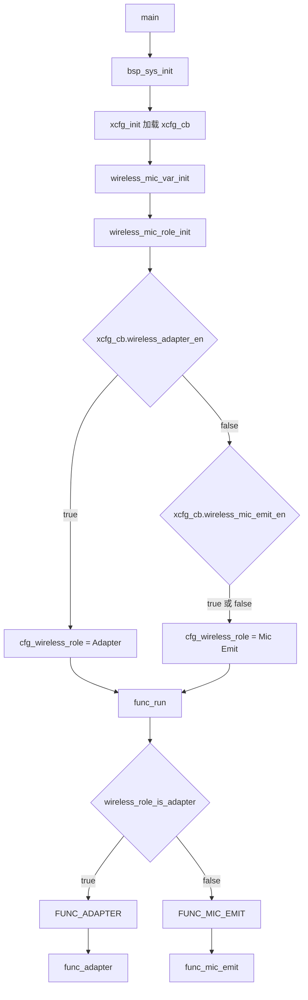
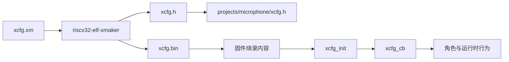
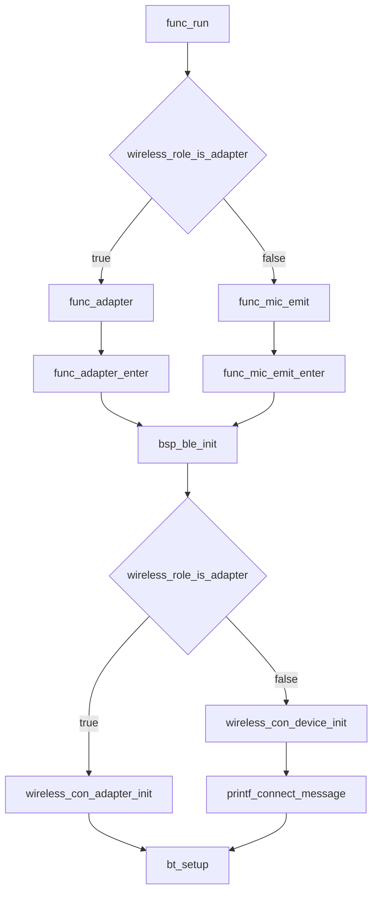
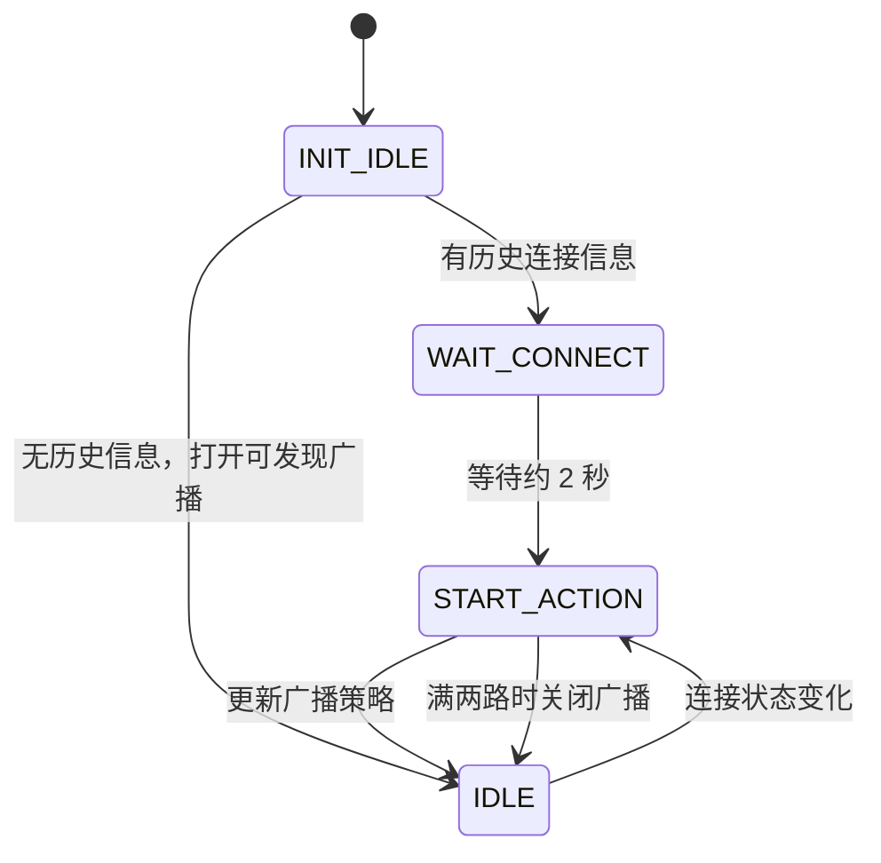
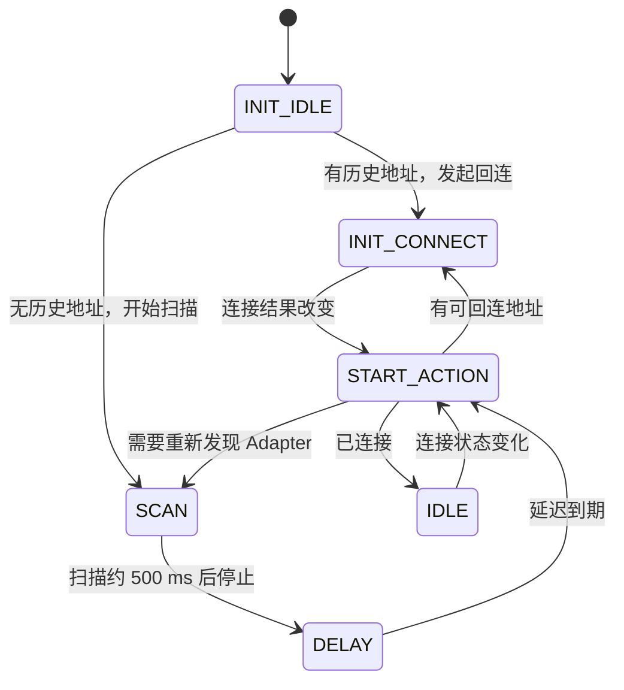
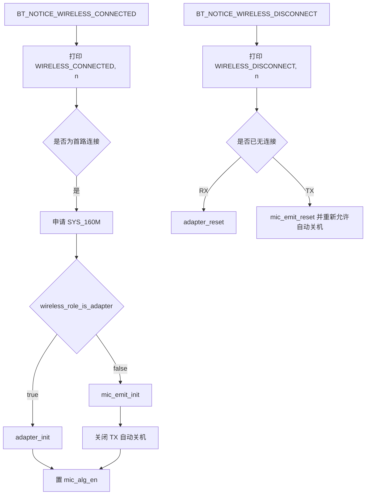
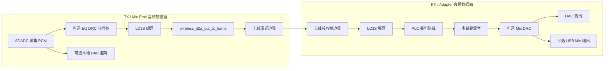
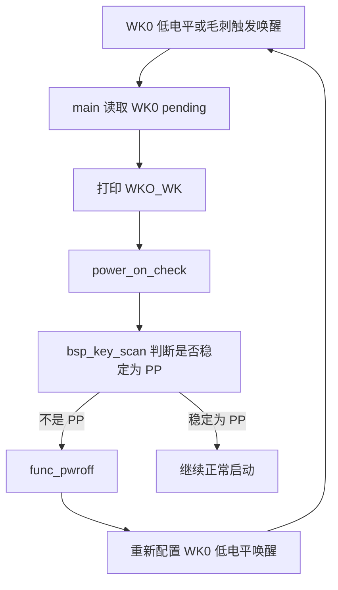

# AB5766 LE Mic：TX/RX 角色判定、全调用链与日志验证指南

> **适用对象**：第一次接触本 SDK、拿到两块板和一串 UART 日志、但不确定哪一块是发射端（TX/Mic Emit）或接收端（RX/Adapter）的开发者。  
> **核心原则**：不根据设备名称、COM 口、文件名、外观或人为标签猜角色；只依据**运行时配置、实际调用链和角色专属日志**确认。  
> **当前工程**：`projects/microphone/config.h` 选择 `CONFIG_AB5766_LE_MIC`。

---

## 目录

1. [先给结论：本次日志的角色](#1-先给结论本次日志的角色)
2. [为什么不能根据名称或单条日志猜角色](#2-为什么不能根据名称或单条日志猜角色)
3. [角色从哪里来：运行时配置到顶层状态机](#3-角色从哪里来运行时配置到顶层状态机)
4. [配置的四层：宏、xcfg 源、生成物、运行时对象](#4-配置的四层宏xcfg-源生成物运行时对象)
5. [日志证据等级与常见打印释义](#5-日志证据等级与常见打印释义)
6. [共同启动与 BLE 初始化调用链](#6-共同启动与-ble-初始化调用链)
7. [RX/Adapter：广播、等待连接和两路连接状态机](#7-rxadapter广播等待连接和两路连接状态机)
8. [TX/Mic Emit：回连、扫描和重试状态机](#8-txmic-emit回连扫描和重试状态机)
9. [连接、断开与音频初始化：共享事件中的角色分叉](#9-连接断开与音频初始化共享事件中的角色分叉)
10. [音频数据链：从麦克风到 DAC/USB](#10-音频数据链从麦克风到-dacusb)
11. [控制数据链：按键、消息和 TX_CMD/RX_CMD](#11-控制数据链按键消息和-tx_cmdrx_cmd)
12. [当前无线/音频参数与阅读风险](#12-当前无线音频参数与阅读风险)
13. [`func_pwroff` 与 `WKO_WK`：已证实路径和排障边界](#13-func_pwroff-与-wko_wk已证实路径和排障边界)
14. [新手双板最小验证闭环](#14-新手双板最小验证闭环)
15. [源码索引与延伸阅读](#15-源码索引与延伸阅读)

---

## 1. 先给结论：本次日志的角色

### 1.1 最新日志是 RX/Adapter

最新日志包含：

```text
func_run
func_adapter
adapter, state: 0
adapter, init(0): 0, 0
adapter, state: 3
WIRELESS_CONNECTED, 0
RX: pdu=(50B, 594), intv=(5000, 594), retry=(3, 3)
```

其中最关键的不是 `RX:`，而是：

```text
func_adapter
adapter, state: ...
adapter, init(...)
```

它们可直接回溯到 [functions/func_adapter.c](../../functions/func_adapter.c)：

- `func_adapter()` 打印 `func_adapter`；
- `func_adapter_process()` 打印 `adapter, state: %d`；
- `func_adapter_process_do()` 打印 `adapter, init(%d): %x, %d`。

而 [functions/func.c](../../functions/func.c) 中，只有 `wireless_role_is_adapter()` 为真时才会设置 `FUNC_ADAPTER`，并调用 `func_adapter()`。所以这是一条完整的源码证据链：

```text
运行时角色为 Adapter
  -> func_cb.sta = FUNC_ADAPTER
  -> func_adapter()
  -> adapter, state / adapter, init 日志
```

因此，**最新日志所对应的实际运行路径是 RX/Adapter**。

### 1.2 先前包含 `func_mic_emit` 的日志是 TX/Mic Emit

若日志中出现：

```text
func_mic_emit
```

则该打印来自 [functions/func_mic_emit.c](../../functions/func_mic_emit.c) 的 `func_mic_emit()`。它同样只能由 [functions/func.c](../../functions/func.c) 中的 `FUNC_MIC_EMIT` 分支进入。

因此，先前两段都出现 `func_mic_emit` 的日志，实际都走 **TX/Mic Emit** 路径；即使其中一段被人工标为“接收端”，也不能改变这个源码事实。

---

## 2. 为什么不能根据名称或单条日志猜角色

下面这些信息都可能有帮助，但**都不能单独作为角色结论**：

| 容易误用的信息 | 为什么不可靠 |
| --- | --- |
| 板卡外观、贴纸或用户口头名称 | 硬件可能刷入不同配置；同一硬件可运行不同角色。 |
| COM 端口号 | COM9/COM10 只是 PC 枚举顺序。 |
| `wireless_adapter.setting` 文件名 | 它是可见构建设置样例，不等于目标板当前烧录内容。 |
| `WIRELESS_CONNECTED, 0` | TX 与 RX 都会走同一个无线事件回调并打印它。 |
| `RX:`、`TX:`、`tx_cntl`、`rx_cntl` | 部分打印来自预编译库；在可读应用 C 源中无法完整定位，不能只靠字符串命名下结论。 |
| “能连接别人”或“有声音” | 这是行为现象，需要结合角色专属入口和链路验证。 |

正确做法是按以下优先级收集证据：

1. **强证据**：`func_adapter` 或 `func_mic_emit`，并能回溯到 `func_run()` 的分派。
2. **配置证据**：实际运行时 `xcfg_cb` 中的角色字段，以及烧录的 `xcfg.bin`。
3. **辅助证据**：Adapter 或 Mic Emit 状态机日志、BLE 初始化分支、连接后的 `adapter_init()` / `mic_emit_init()`。
4. **观察证据**：LED、连接现象、音频效果、预编译库日志。

---

## 3. 角色从哪里来：运行时配置到顶层状态机

角色并非由 `main()`、工程名或单个编译期宏直接决定，而是由启动时加载的 `xcfg_cb` 运行时对象决定。



### 3.1 逐步对应源码

| 步骤 | 源码位置 | 做什么 | 能证明什么 |
| --- | --- | --- | --- |
| 1 | [projects/microphone/main.c](../../projects/microphone/main.c) | `main()` 调 `bsp_sys_init()`，再调 `func_run()` | 固件进入系统初始化和顶层功能循环。 |
| 2 | [bsp/bsp_sys.c](../../bsp/bsp_sys.c) | `xcfg_init(&xcfg_cb, sizeof(xcfg_cb))` | 运行时配置被装入 `xcfg_cb`。 |
| 3 | [bsp/bsp_sys.c](../../bsp/bsp_sys.c) | 调 `wireless_mic_var_init()` | 开始无线角色准备。 |
| 4 | [modules/wireless/wireless_proc.c](../../modules/wireless/wireless_proc.c) | `wireless_mic_role_init()` 设置 `cfg_wireless_role` | 角色由 `xcfg_cb` 字段决定。 |
| 5 | [functions/func.c](../../functions/func.c) | `func_run()` 设置 `FUNC_ADAPTER` 或 `FUNC_MIC_EMIT` | 最终运行哪个顶层功能。 |
| 6 | [functions/func_adapter.c](../../functions/func_adapter.c) / [functions/func_mic_emit.c](../../functions/func_mic_emit.c) | 分别进入各自主循环 | 角色专属运行路径的最强日志锚点。 |

### 3.2 `wireless_mic_role_init()` 的优先级

[modules/wireless/wireless_proc.c](../../modules/wireless/wireless_proc.c) 的逻辑等价于：

```c
if (xcfg_cb.wireless_adapter_en) {
    cfg_wireless_role = true;
} else if (xcfg_cb.wireless_mic_emit_en) {
    cfg_wireless_role = false;
} else {
    cfg_wireless_role = false;
}
```

结论：

- `wireless_adapter_en = 1`：选 Adapter。
- `wireless_adapter_en = 0` 且 `wireless_mic_emit_en = 1`：选 Mic Emit。
- 两者都为 0：代码默认仍选 Mic Emit。
- 两者都为 1：因为先判断 Adapter，**Adapter 有优先级**。

> 这也说明：只看 `wireless_mic_emit_en` 是否开启还不够，必须一起看 `wireless_adapter_en`。

### 3.3 不止顶层循环，角色专属 RAM 代码也会被加载

`wireless_mic_var_init()` 除了判角色，还调用 `wireless_mic_load_code()`。后者按 `xcfg_cb.wireless_adapter_en` 把 Adapter 或 Emit 的公共代码段复制到对应运行地址。

这进一步说明本 SDK 的两种角色是同一应用中可选的实际运行路径，而非仅改一个日志标题。

---

## 4. 配置的四层：宏、xcfg 源、生成物、运行时对象

理解这四层，可以避免“我改了文件但板子行为没变”的常见困惑。

| 层级 | 主要位置 | 作用 | 是否应直接手改 |
| --- | --- | --- | --- |
| 编译期产品配置 | [projects/microphone/config.h](../../projects/microphone/config.h)、[config_ab5766_le_mic.h](../../projects/microphone/config_ab5766_le_mic.h) | 决定功能能力、协议、音频、外设和裁剪宏 | 按设计修改。 |
| xcfg 配置源 | [projects/microphone/Output/bin/xcfg.xm](../../projects/microphone/Output/bin/xcfg.xm) | 描述运行时字段和配置生成逻辑 | 作为配置源修改。 |
| xcfg 生成物 | `Output/bin/xcfg.bin`、`Output/bin/xcfg.h`、[projects/microphone/xcfg.h](../../projects/microphone/xcfg.h) | 烧录/编译所需的二进制和结构定义 | 不应直接修改生成文件。 |
| 运行时对象 | `xcfg_cb` | 设备启动后真正被代码读取的值 | 通过实际烧录内容和日志/调试确认。 |

生成链如下：



构建前脚本 [projects/microphone/Output/bin/prebuild.bat](../../projects/microphone/Output/bin/prebuild.bat) 调用 `riscv32-elf-xmaker -b xcfg.xm`，负责生成这些产物。

### 4.1 `wireless_adapter.setting` 的正确用法

[projects/microphone/Output/bin/Settings/wireless_adapter.setting](../../projects/microphone/Output/bin/Settings/wireless_adapter.setting) 是一个可见的 Adapter 设置样例，其中可见：

```text
wireless_adapter_en=True
wireless_mic_emit_en=False
sys_off_time=0
charge_en=False
pwron_press_time=3
pwroff_press_time=3
```

它适合用来核对**构建意图**，但不能单独证明手中板子的实际角色。要证明实际设备，仍应优先使用：

```text
实际烧录的 xcfg.bin
+ 启动后的 xcfg_cb
+ func_adapter / func_mic_emit 角色专属日志
```

---

## 5. 日志证据等级与常见打印释义

| 日志 | 证据等级 | 可回溯源码 | 正确解释 |
| --- | --- | --- | --- |
| `func_adapter` | 强 | [functions/func_adapter.c](../../functions/func_adapter.c) | 当前进入 RX/Adapter 顶层主循环。 |
| `adapter, state: N` | 强 | [functions/func_adapter.c](../../functions/func_adapter.c) | Adapter 初始化/广播状态机正在运行。 |
| `adapter, init(...): ...` | 强 | [functions/func_adapter.c](../../functions/func_adapter.c) | Adapter 正根据历史连接和当前连接状态配置广播。 |
| `func_mic_emit` | 强 | [functions/func_mic_emit.c](../../functions/func_mic_emit.c) | 当前进入 TX/Mic Emit 顶层主循环。 |
| `WIRELESS_CONNECTED, n` | 共享事件 | [modules/wireless/wireless_proc.c](../../modules/wireless/wireless_proc.c) | 第 `n` 路无线连接成功；**不能单独判角色**。 |
| `WIRELESS_CONNECT_FAIL, n` | 共享事件 | [modules/wireless/wireless_proc.c](../../modules/wireless/wireless_proc.c) | 第 `n` 路连接失败；TX/RX 都可能看到。 |
| `WIRELESS_DISCONNECT, n` | 共享事件 | [modules/wireless/wireless_proc.c](../../modules/wireless/wireless_proc.c) | 第 `n` 路已断开；TX/RX 都可能看到。 |
| `<TX_INTERVAL> ...` 参数组 | 辅助 | [modules/wireless/wireless.c](../../modules/wireless/wireless.c) 的 `printf_connect_message()` | Device/TX 侧 BLE 初始化参数打印；不代表所有 RX 专属参数。 |
| `TX_CMDn` / `RX_CMDn` | 链路辅助 | [modules/wireless/wireless_cmd.c](../../modules/wireless/wireless_cmd.c) | 控制包进入发送队列或到达应用命令处理边界。 |
| `WKO_WK` | 唤醒辅助 | [driver/driver_lowpwr.c](../../driver/driver_lowpwr.c) | WK0 唤醒 pending 被发现；不是“唯一关机原因”。 |
| `RX:`、`tx_cntl`、`rx_cntl`、部分密钥/PDU dump | 库边界 | 仅能定位到应用触发边界 | 可能来自预编译库；不要据此编造库内部协议实现。 |

---

## 6. 共同启动与 BLE 初始化调用链

两种角色共享启动骨架，随后在两处使用相同角色变量分叉：顶层功能和 BLE 初始化。



对应关系：

- [functions/func_adapter.c](../../functions/func_adapter.c) 的 `func_adapter_enter()` 依次清消息队列、初始化 Adapter 状态、调用 `bsp_ble_init()`。
- [functions/func_mic_emit.c](../../functions/func_mic_emit.c) 的 `func_mic_emit_enter()` 启用 TX 自动关机逻辑、清消息队列、初始化 Emit 状态、调用 `bsp_ble_init()`。
- [modules/wireless/wireless.c](../../modules/wireless/wireless.c) 的 `bsp_ble_init()` 再按 `wireless_role_is_adapter()` 选择 Adapter 或 Device 无线初始化，之后进入共同的 `bt_setup()`。

> 因此角色不是只在 `func_run()` 分一次；BLE 初始化也复用同一个运行时角色判定。

---

## 7. RX/Adapter：广播、等待连接和两路连接状态机

Adapter 状态在 [functions/func_adapter.c](../../functions/func_adapter.c) 中定义：

| 状态 | 含义 |
| --- | --- |
| `ADAPTER_STA_INIT_IDLE`（0） | 初始判断是否有历史连接信息。 |
| `ADAPTER_STA_INIT_W4_CONNECT`（1） | 有历史信息时，等待已知 TX 回连。 |
| `ADAPTER_STA_START_ACTION`（2） | 收到连接状态变化后，重新决定广播策略。 |
| `ADAPTER_STA_IDLE`（3） | 当前策略已经生效，等待下一次事件。 |



### 7.1 初始广播策略

`ADAPTER_STA_INIT_IDLE` 会调用 `bt_get_link_info_nb()`：

- 有历史连接信息：`ble_adv_set_enable(1, 0)`，可连接但不开放可发现，等待已知 TX 回连。
- 没有历史连接信息：`ble_adv_set_enable(1, 1)`，允许被发现和连接，等待 TX 扫描到本机。

### 7.2 为什么日志有 `adapter, state: 0` 后很快到 `state: 3`

典型无历史连接路径：

```text
state: 0
  -> adapter, init(..., link_nb = 0)
  -> 打开可发现且可连接广播
  -> state: 3
```

这与最新日志的：

```text
adapter, state: 0
adapter, init(0): 0, 0
adapter, state: 3
```

一致。第三个参数 `0` 来自 `bt_get_link_info_nb()`，表示当时没有历史连接信息。

### 7.3 两路连接上限

当前配置 [config_ab5766_le_mic.h](../../projects/microphone/config_ab5766_le_mic.h) 中：

```c
#define WIRELESS_CON_LINK_NB 2
```

因此 Adapter 设计为最多服务两路无线麦。两路均连上时，状态机调用 `ble_adv_set_enable(0, 0)` 关闭可发现和可连接广播。

---

## 8. TX/Mic Emit：回连、扫描和重试状态机

TX 的状态机在 [functions/func_mic_emit.c](../../functions/func_mic_emit.c)，关键逻辑如下：



### 8.1 初始行为

`MIC_EMIT_STA_INIT_IDLE` 中：

- `bt_get_link_info_addr(addr, 0)` 成功：调用 `ble_create_con_for_addr(addr, 1000)`，尝试回连已知设备。
- 没有历史地址：调用 `ble_scan_set_enable(1)`，开始扫描可连接的 Adapter。

### 8.2 扫描窗口与重试

扫描状态持续约 500 ms，随后停止扫描并进入带随机量的延迟状态，避免持续扫描造成不必要功耗。连接失败和断开也会进入延迟后重试。

### 8.3 为什么 TX 日志中可能没有 `emit, state`

文件顶部当前是：

```c
#define TRACE_EN 0
```

所以 `emit, init`、`emit, state`、`emit, scan_en` 等 TRACE 默认不输出。不能因为没看到这些内部状态日志就断定它不是 TX；`func_mic_emit` 才是更可靠的入口证据。

---

## 9. 连接、断开与音频初始化：共享事件中的角色分叉

无线事件统一进入 [modules/wireless/wireless_proc.c](../../modules/wireless/wireless_proc.c) 的 `wireless_emit_notice()`。



### 9.1 重要结论

`WIRELESS_CONNECTED, 0` 的打印在角色分支**之前**，因此：

```text
WIRELESS_CONNECTED, 0
```

只说明第 0 路连接成功，不说明这块板是 TX 或 RX。

只有其前后结合角色专属入口，或进一步观察连接后调用的是 `adapter_init()` 还是 `mic_emit_init()`，才可得出角色结论。

### 9.2 “进入 Adapter”不等于“已经有音频输出”

`func_adapter()` 只是 RX 顶层功能进入。实际音频解码/输出初始化发生在成功连接后的：

```text
WIRELESS_CONNECTED
  -> wireless_role_is_adapter()
  -> adapter_init()
```

未连接时，Adapter 可以正常处于广播和等待状态，但没有来自 TX 的可播放音频帧。

---

## 10. 音频数据链：从麦克风到 DAC/USB

下面图把音频数据面和控制面分开；实际 BLE 空口、LC3S 与 PLC 的部分实现位于预编译库或库接口之后，文档只描述可见源码能确认的边界。



### 10.1 TX 音频链

连接成功后，`wireless_emit_notice()` 对 TX 调 `mic_emit_init()`。从 [modules/wireless/mic_proc.c](../../modules/wireless/mic_proc.c) 及 [modules/wireless/wireless_txrx_single.c](../../modules/wireless/wireless_txrx_single.c) 可追到如下应用层链路：

```text
mic_emit_init
  -> 编码器和可选音效初始化
  -> lc3s_enc_init
  -> 可选 mic_eq_drc_init
  -> 可选 dac0_out_init（本地监听）
  -> bsp_sdadc_init
  -> PCM 采样、编码
  -> wireless_d2a_put_tx_frame
  -> 无线发送边界
```

当前启用的相关能力：

```c
#define WIRELESS_MIC_DAC_OUT_EN   1
#define WIRELESS_MIC_SOFT_GAIN_EN 1
#define WIRELESS_MIC_EQ_DRC_EN    1
```

### 10.2 RX 音频链

连接成功后，RX 调 `adapter_init()`。可见应用层接口链路为：

```text
adapter_init
  -> LC3S 解码初始化
  -> 接收帧处理
  -> PLC 丢包隐藏
  -> 多路混音
  -> 可选 mix_drc_init
  -> dac0_out_init
  -> 可选 USB Mic 输出
```

当前 RX 侧宏：

```c
#define ADAPTER_DAC_OUTPUT_EN  1
#define ADAPTER_USB_MIC_RX_EN  1
#define ADAPTER_MIX_DRC_EN     1
```

含义是：当前编译配置允许 RX 做 DAC 输出、USB Mic 输出和一拖二混音 DRC。是否真正工作仍取决于实际角色、连接状态、硬件接线和 USB 主机枚举。

### 10.3 预编译库边界

以下内容不能仅凭可读应用代码完全展开：

- BLE 协议栈内部调度、PDU 打包和时序；
- LC3S 编码/解码实现细节；
- PLC 算法细节；
- 部分 `RX:`、`TX:`、`tx_cntl`、`rx_cntl`、密钥 dump 的输出实现。

正确表述是“应用层已调用到某库接口/回调边界”，而不是把库内部算法或协议字段编造为确定事实。

---

## 11. 控制数据链：按键、消息和 TX_CMD/RX_CMD

音频帧和控制命令是两条不同链路。控制链的可见结构如下：


### 11.1 两种角色的按键表不同

[projects/microphone/port/port_key.c](../../projects/microphone/port/port_key.c) 中有两张表：

- `mic_emit_key_msg_tbl`：TX 的 PP 短按可静音，K1/K2 可调增益等。
- `adapter_key_msg_tbl`：RX 当前大部分按键动作是 `MSG_NO`，但 PP 的 `KEY_HOLD` 映射为 `MSG_PWR_HOLD`。

`evt_type_2_msg_idx()` 明确 `KEY_HOLD` 对应表中第 2 列。因此 RX 仍可通过 PP 持续按住进入公共关机流程。

### 11.2 公共关机消息链

[functions/func.c](../../functions/func.c) 的 `func_message()` 中：

```text
MSG_PWR_HOLD
  -> 记录按住开始时间
  -> PWROFF_W4_TIMEOUT
  -> pwroff_process 判断超时
  -> func_cb.sta = FUNC_PWROFF
  -> func_pwroff
```

### 11.3 `TX_CMD` 与 `RX_CMD` 代表什么

在 [modules/wireless/wireless_cmd.c](../../modules/wireless/wireless_cmd.c) 中：

- `TX_CMDn`：某条控制命令已经在应用命令队列中准备发送；
- `RX_CMDn`：某条控制命令已经从无线回调到达应用命令分发层。

它们说明**控制通道到达该层**，但不自动说明：

- 对端业务处理一定已实现；
- 参数一定合法；
- 业务效果一定已经生效；
- 无线库内部一定没有重传或过滤。

---

## 12. 当前无线/音频参数与阅读风险

以下值来自 [projects/microphone/config_ab5766_le_mic.h](../../projects/microphone/config_ab5766_le_mic.h)。

| 项目 | 当前宏和值 | 对新手的含义 |
| --- | --- | --- |
| 编解码 | `WIRELESS_CON_CODEC_SEL = CODEC_LC3S` | 音频使用 LC3S 相关编码/解码路径。 |
| 采样率 | `SAMPLE_RATE_48K` | 48 kHz。 |
| 每帧样点 | `WIRELESS_MIC_SAMPLES_SELECT = 120` | 在 48 kHz 下为 2.5 ms 音频量。 |
| 声道 | `WIRELESS_MIC_CHANNEL_SELECT = 1` | 单声道。 |
| 压缩帧 | `WIRELESS_MIC_FRAME_SIZE = 25` | 配置的每帧压缩数据大小。 |
| 重传次数 | `WIRELESS_MIC_RETRY_NB = 3` | 当前编译值和日志使用 3。 |
| 发送周期 | `WIRELESS_MIC_TX_INTERVAL = 4` | 注释定义为 `n × 1.25 ms`，即约 5 ms。 |
| 最大链路数 | `WIRELESS_CON_LINK_NB = 2` | Adapter 支持两路无线麦。 |
| TX 本地监听 | `WIRELESS_MIC_DAC_OUT_EN = 1` | TX 可初始化本地 DAC 监听。 |
| RX DAC | `ADAPTER_DAC_OUTPUT_EN = 1` | RX 可输出到 DAC。 |
| RX USB Mic | `ADAPTER_USB_MIC_RX_EN = 1` | RX 可作为 USB 麦克风设备能力的一部分。 |
| RX 混音 DRC | `ADAPTER_MIX_DRC_EN = 1` | 两路混音时可使用 DRC。 |

### 12.1 注释与实际配置不一致时，信谁？

当前文件同时存在两类值得警惕的旧注释：

```c
#define WIRELESS_MIC_FRAME_SIZE 25  // 注释中提到 72 byte 限制
#define WIRELESS_MIC_RETRY_NB   3   // 注释中写“暂时支持1/2”
```

按当前数值计算：

```text
25 × 2 × 3 = 150 bytes
```

这与旧注释中的 72 byte 不一致，且当前宏与日志确实使用 retry 3。建议按以下顺序处理：

1. 先承认当前编译配置和运行日志的实际值；
2. 把旧注释当作可能过期的风险提示；
3. 不凭注释断言预编译 BLE 库的最终限制；
4. 用目标固件连接稳定性、PDU 日志和实机测试确认真实边界。

不要为了“匹配一条旧注释”孤立改一个宏；相关缓冲、传输周期、链路数和预编译库能力需要一起验证。

---

## 13. `func_pwroff` 与 `WKO_WK`：已证实路径和排障边界

最新 RX 日志还出现：

```text
func_pwroff
WKO_WK
```

这很容易被误解为“蓝牙一断开就关机”或“电池低电”，但当前源码能证明的内容更具体，也更有限。

### 13.1 `WKO_WK` 的严格含义

启动入口 [projects/microphone/main.c](../../projects/microphone/main.c) 在 `bsp_sys_init()` 前调用：

```c
sys_cb.wakeup_reason = lowpwr_get_wakeup_source();
```

[driver/driver_lowpwr.c](../../driver/driver_lowpwr.c) 的 `lowpwr_get_wakeup_source()` 检测到 `WK_LP_WK0_PENDING` 时打印 `WKO_WK`。

因此它严格表示：

> 低功耗唤醒状态中记录到 **WK0 唤醒 pending**。

它不是：

- 普通蓝牙断连事件；
- 软件直接给出的唯一关机原因；
- 普通 GPIO 按键扫描打印；
- 电池低电的同义词。

### 13.2 当前配置中的关键耦合：ADC 按键和 WK0

当前配置：

```c
#define BSP_ADKEY_EN 1
#define BSP_IOKEY_EN 0
#define SYS_PWROFF_MODE PWROFF_MODE2
```

ADC 按键配置使用 `ADC_CHANNEL_WK0`，PP 键的键值为 `KEY_ID_PP`。与此同时，[functions/func_lowpwr.c](../../functions/func_lowpwr.c) 的 `lowpwr_pwroff_wakeup_config()` 在 `BSP_ADKEY_EN` 下配置：

```c
config.gpio_cfg.edge = GPIO_EDGE_FALLING;
config.source |= WK_LP_WK0;
```

也就是说，同一个 WK0 节点既参与 ADC 电阻梯按键识别，也参与关机后的低电平唤醒。

### 13.3 源码可确认的“唤醒后又关机”链

[bsp/bsp_sys.c](../../bsp/bsp_sys.c) 的 `power_on_check()` 对 WK0/VUSB 唤醒后的启动有按键确认流程：

```text
WK0 唤醒
  -> bsp_key_scan(1)
  -> 必须在开机确认时间内稳定识别为 KEY_ID_PP
  -> 若连续不是 KEY_ID_PP
  -> func_pwroff()
```

当前：

```c
#define PWRON_PRESS_TIME (500 * xcfg_cb.pwron_press_time)
```

可见 Adapter setting 中 `pwron_press_time=3`，对应约 1.5 秒确认窗口。

结合 `PWROFF_MODE2`，可以得到一个有源码闭环支持的机制：



### 13.4 运行期长按关机链

除启动检查外，正常运行时也可能由 PP 长按触发关机：

```text
WK0 ADC
  -> KEY_ID_PP
  -> KEY_HOLD
  -> adapter_key_msg_tbl 中的 MSG_PWR_HOLD
  -> func_message
  -> pwroff_process 超时
  -> FUNC_PWROFF
  -> func_pwroff
```

### 13.5 不应直接归因的事项

对于当前可见 Adapter setting：

```text
sys_off_time=0
charge_en=False
lpwr_off_vbat_level=不关机
```

且当前编译期配置关闭：

```c
#define BSP_CHARGE_EN      0
#define BSP_CHARGE_BOX_EN  0
#define BSP_VBAT_DETECT_EN 0
```

所以不能把这次 `WKO_WK -> func_pwroff` 循环直接归因为：

- 普通无操作自动关机；
- 标准充电流程；
- 已启用的低电关机。

这些路径在当前可见设置/编译条件下都不是首要解释。

### 13.6 仍需硬件验证的物理根因

源码可以确认流程，**不能确认 WK0 为什么变低或为何出现毛刺**。请按下表测量：

| 检查项 | 目的 |
| --- | --- |
| WK0 芯片脚电平与波形 | 确认未按键时是否被拉低、浮空或有短脉冲。 |
| PP 按下、松开、进入关机、唤醒瞬间的波形 | 对比数字唤醒条件和 ADC 按键档位。 |
| ADC 原始值 / `bsp_key_scan(1)` 结果 | 确认唤醒时是否真的稳定识别为 `KEY_ID_PP`。 |
| 电阻梯、上拉、电容、ESD 与焊接 | 排查阻值错误、虚焊、污染和漏电。 |
| 外接 USB、音频、调试器及其他外设 | 排查外部电路对 WK0 的耦合。 |
| 实际烧录的 `xcfg.bin` | 排除板上运行设置与仓库 setting 不一致。 |

另一个判断技巧：`func_pwroff()` 会调用 `pwroff_w4_key_pressed()`；其等待 WK0 释放的循环受 `IO_KEY_WK0_EN` 条件编译控制。当前 [bsp/bsp_io_key.h](../../bsp/bsp_io_key.h) 将该宏定义为 `1`，因此本工程会在进入低功耗前等待 WK0 为高。若某次打印 `func_pwroff` 后不再出现新的启动日志，可能停在“等待 WK0 高电平”的阶段；若持续出现启动日志和 `WKO_WK`，更符合新的 WK0 触发、浮空或毛刺反复出现的情形。

---

## 14. 新手双板最小验证闭环

不要一开始修改宏或怀疑协议。按以下顺序建立最小闭环。

### 步骤 1：确认当前工程和构建输入

1. 打开 [projects/microphone/config.h](../../projects/microphone/config.h)，确认当前选择 `CONFIG_AB5766_LE_MIC`。
2. 查看 [config_ab5766_le_mic.h](../../projects/microphone/config_ab5766_le_mic.h) 中的无线、音频、DAC、USB 和按键宏。
3. 查看 xcfg 源与目标板对应 setting；注意 setting 仅是输入/样例，不替代实际烧录验证。
4. 使用工程 [projects/microphone/app.cbp](../../projects/microphone/app.cbp) 的 Debug 目标构建，确保 `prebuild.bat` 已生成最新 xcfg 产物。

### 步骤 2：分别采集两块板的完整启动日志

每块板都从复位开始记录，至少保留：

```text
Hello AB5766
bsp_sys_init
func_run
func_adapter 或 func_mic_emit
WIRELESS_...
```

不要只截取“连接成功”附近的几行。

### 步骤 3：用强证据标注每块板

| 观察到的入口 | 标注结果 |
| --- | --- |
| `func_adapter` | RX/Adapter 实际路径。 |
| `func_mic_emit` | TX/Mic Emit 实际路径。 |
| 两者都没有 | 日志不完整、串口参数错误、启动未到主循环，或当前版本打印被裁剪；不能猜。 |

### 步骤 4：先验证无线连接，再验证音频

1. RX 无历史记录时，应出现 Adapter 初始状态并开放广播。
2. TX 无历史地址时，应进入扫描逻辑；由于 `TRACE_EN=0`，不一定打印扫描细节。
3. 两边都应在共享回调看到相应 `WIRELESS_CONNECTED`。
4. 连接后，验证 TX 采集输入和 RX DAC 输出；若接入 PC，再验证 USB Mic 枚举与音频输入。
5. 若配置为两路链路，先单路确认，再增加第二个 TX，避免把配对、硬件音频和双路混音问题混在一起。

### 步骤 5：最后再排查 `func_pwroff` / `WKO_WK`

1. 先确认它是启动检查、PP 长按，还是自动关机路径。
2. 对照 `sys_off_time`、充电与 VBAT 宏，排除未启用路径。
3. 记录 `WKO_WK` 前后完整日志。
4. 测 WK0 与 ADC；不要仅根据串口文字判断物理原因。

---

## 15. 源码索引与延伸阅读

### 15.1 本文核心源码

| 主题 | 文件 |
| --- | --- |
| 启动入口、唤醒原因 | [projects/microphone/main.c](../../projects/microphone/main.c) |
| 产品选择和编译期功能 | [projects/microphone/config.h](../../projects/microphone/config.h)、[config_ab5766_le_mic.h](../../projects/microphone/config_ab5766_le_mic.h) |
| xcfg 加载、启动按键检查 | [bsp/bsp_sys.c](../../bsp/bsp_sys.c) |
| 角色选择、连接/断开共享回调 | [modules/wireless/wireless_proc.c](../../modules/wireless/wireless_proc.c) |
| 顶层状态机与公共关机消息 | [functions/func.c](../../functions/func.c) |
| RX Adapter 状态机 | [functions/func_adapter.c](../../functions/func_adapter.c) |
| TX Mic Emit 状态机 | [functions/func_mic_emit.c](../../functions/func_mic_emit.c) |
| BLE 初始化、运行参数 | [modules/wireless/wireless.c](../../modules/wireless/wireless.c) |
| 音频处理边界 | [modules/wireless/mic_proc.c](../../modules/wireless/mic_proc.c)、[modules/wireless/wireless_txrx_single.c](../../modules/wireless/wireless_txrx_single.c) |
| 按键映射 | [projects/microphone/port/port_key.c](../../projects/microphone/port/port_key.c) |
| 低功耗关机和 WK0 唤醒配置 | [functions/func_lowpwr.c](../../functions/func_lowpwr.c)、[driver/driver_lowpwr.c](../../driver/driver_lowpwr.c) |

### 15.2 现有专题文档

- [AB5766 LE Mic 新手开发指南](AB5766_LE_Mic_新手开发指南.md)
- [AB5766 嵌入式固件 SDK 架构导览](AB5766_嵌入式固件SDK_架构导览.md)
- [启动日志：每一行打印的来源与调用链路](AB5766_启动日志_每一行打印的来源与调用链路.md)
- [接收端 Adapter 实现详解](AB5766_接收端_Adapter_实现详解.md)
- [发射端 Mic Emit 实现详解](AB5766_发射端_Mic_Emit_实现详解.md)
- [Adapter 状态机与 func_pwroff 排查指南](AB5766_adapter_状态机与func_pwroff_排查指南.md)
- [按键链路测试与验收指南](AB5766_按键链路测试与验收指南.md)
- [无线麦克风双板连接与 LED 测试指南](AB5766_无线麦克风_双板连接与LED测试指南.md)

---

## 最终记忆口诀

```text
先看 func_adapter / func_mic_emit，确认实际入口；
再看 xcfg_cb 的角色字段，确认运行时来源；
WIRELESS_CONNECTED 只说明连上，不说明谁是 TX/RX；
进入角色主循环不代表已开始音频，连接后才初始化音频链；
WKO_WK 只说明 WK0 唤醒 pending，物理原因必须测脚和 ADC。
```
