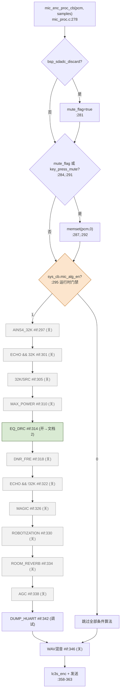
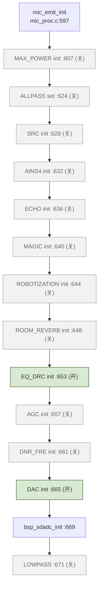
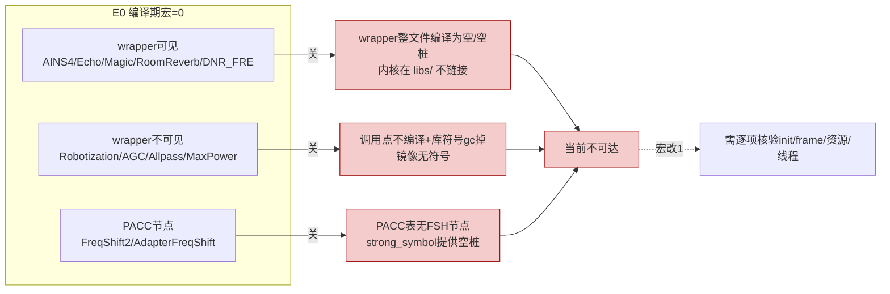

# AB5766 LE Mic 关闭算法与候选路径索引

> 本文是 AB5766 LE Mic 算法文档系列的第 7 篇。前 6 篇分别覆盖系统门禁、发射端采集增益与音效链、LC3S 编解码、接收端 BFI/PLC、双链路混音与 Mix PACC、输出观测点与在线调音。本篇专门盘点**当前配置下宏为 0（关闭）但源码调用关系可确认**的全部候选算法/特性，给出每一项的初始化入口、逐帧入口、控制宏、当前值、可见 wrapper 与预编译库边界，并标注"当前不可达"不等于"算法不存在"。
>
> 证据规则沿用系列约定：E0=配置/编译期宏，E1=可见源码调用链，E2=map.txt/镜像/资源，E3=硬件/日志/仪器。本文只做 E0/E1 核验，E2 仅在能确认时给出，E3 不臆测。

---

## 1. 适用配置与边界

- 适用配置：[projects/microphone/config.h](projects/microphone/config.h) 选定的 `CONFIG_AB5766_LE_MIC`，对应 [projects/microphone/config_ab5766_le_mic.h](projects/microphone/config_ab5766_le_mic.h)。
- 本文聚焦"当前关闭（宏=0）但代码路径可追溯"的算法与特性，不重复展开已在文档 2/5 详述的 **Soft Gain**、**Local EQ/DRC**、**Mix DRC**（它们当前为 1，属已启用项，仅在索引表中列出以便对照）。
- 边界声明：
  - "宏为 0"只代表编译期不编入该 `#if` 分支，**不代表算法内核不存在**——多数算法内核在预编译静态库 `libs/` 中，wrapper 层关闭时只是不调用、不链接（受 `--gc-sections` 影响）。
  - "wrapper 可见"指在 `modules/voice/`、`modules/audio/` 下存在对应 `.c/.h`；"wrapper 不可见"指仅能在 `libs/api_alg.h` 等头文件看到 API 声明，实现位于预编译库，或调用点存在但无任何可见实现。
  - 不通过文件名/宏名猜测功能：下表每一项的"逐帧入口"与"初始化入口"均来自 [modules/wireless/mic_proc.c](modules/wireless/mic_proc.c) 或对应 wrapper 的实际代码行，而非名称推断。

---

## 2. 配置快照

下表为 [projects/microphone/config_ab5766_le_mic.h](projects/microphone/config_ab5766_le_mic.h) 中与候选算法相关的宏及其当前值（行号为该文件内行号）。

| 宏名 | 行号 | 当前值 | 作用 | wrapper 可见 |
|---|---|---|---|---|
| `WIRELESS_MIC_AINS4_32K_EN` | [118](projects/microphone/config_ab5766_le_mic.h#L118) | 0 | 32 kHz DNN_L1 降噪 | 是 [ains4_32k.c](modules/voice/ains4_32k.c) |
| `WIRELESS_MIC_32K_EN` | [116](projects/microphone/config_ab5766_le_mic.h#L116) | 0 | 32 kHz 采样率 + SRC 重采样 | 否（库 `src_*`） |
| `WIRELESS_MIC_ECHO_EN` | [101](projects/microphone/config_ab5766_le_mic.h#L101) | 0 | 回声 | 是 [echo.c](modules/voice/echo.c) |
| `WIRELESS_MIC_MAGIC_EN` | [103](projects/microphone/config_ab5766_le_mic.h#L103) | 0 | 魔音/变调 | 是 [magic.c](modules/voice/magic.c) |
| `WIRELESS_MIC_ROOM_REVERB_EN` | [107](projects/microphone/config_ab5766_le_mic.h#L107) | 0 | 房间混响 | 是 [room_reverb.c](modules/voice/room_reverb.c) |
| `WIRELESS_MIC_DNR_FRE_EN` | [114](projects/microphone/config_ab5766_le_mic.h#L114) | 0 | 轻量频域降噪 | 是 [dnr_fre.c](modules/voice/dnr_fre.c) |
| `ADAPTER_DNR_FRE_EN` | [133](projects/microphone/config_ab5766_le_mic.h#L133) | 0 | 接收端 DNR_FRE（仅参与编译标志） | 同上 |
| `WIRELESS_MIC_AGC_EN` | [109](projects/microphone/config_ab5766_le_mic.h#L109) | 0 | 自动增益（调试中） | 否（库 `agcInit_do`） |
| `WIRELESS_MIC_ROBOTIZATION_EN` | [111](projects/microphone/config_ab5766_le_mic.h#L111) | 0 | 机器人音效（调试中） | 否 |
| `WIRELESS_ALLPASS_FILTER_CHANGE_EN` | [112](projects/microphone/config_ab5766_le_mic.h#L112) | 0 | 随机相位/防啸叫（调试中） | 否（库 `allpass_filter_change*`） |
| `WIRELESS_FREQ_SHIFT2_EN` | [105](projects/microphone/config_ab5766_le_mic.h#L105) | 0 | 发射端移频/防啸叫（PACC FSH 节点） | 否（PACC 库 `pacc_fsh_init`） |
| `ADAPTER_FREQ_SHIFT_EN` | [126](projects/microphone/config_ab5766_le_mic.h#L126) | 0 | 适配器移频（Mix PACC FSH 节点） | 否（同上） |
| `WIRELESS_MAX_POWER_DETECT_EN` | [88](projects/microphone/config_ab5766_le_mic.h#L88) | 0 | 麦能量检测 | 否 |
| `WIRELESS_MIC_LOWPASS_EN` | [89](projects/microphone/config_ab5766_le_mic.h#L89) | 0 | SDADC 硬件低通 | 否（BSP） |
| `WARNING_MIC_MIX_WAV_PLAY_EN` | [95](projects/microphone/config_ab5766_le_mic.h#L95) | 0 | 提示音混入 MIC 数据流 | 是（在 mic_proc.c 内） |
| `WIRELESS_MIC_KEY_PRESS_MUTE_EN` | [92](projects/microphone/config_ab5766_le_mic.h#L92) | 0 | 按键按下/抬起短暂静音 | 是（mic_proc.c 内） |
| `WIRELESS_MIC_SOFT_GAIN_EN` | [98](projects/microphone/config_ab5766_le_mic.h#L98) | **1** | 带保护数字增益（已启用） | 是 [soft_gain.c](modules/audio/soft_gain.c) |
| `WIRELESS_MIC_EQ_DRC_EN` | [99](projects/microphone/config_ab5766_le_mic.h#L99) | **1** | 发射端 EQ/DRC（已启用） | 是 [mic_eq_drc.c](modules/audio/mic_eq_drc.c) |
| `ADAPTER_MIX_DRC_EN` | [124](projects/microphone/config_ab5766_le_mic.h#L124) | **1** | 接收端混音 DRC（已启用） | 是（同上） |

派生宏（[config_ab5766_le_mic.h:138-171](projects/microphone/config_ab5766_le_mic.h#L138-L171)）：`ECHO_EN=(WIRELESS_MIC_ECHO_EN)`=0；`MAGIC_EN=(WIRELESS_MIC_MAGIC_EN)`=0；`ROBOTIZATION_EN=(WIRELESS_MIC_ROBOTIZATION_EN)`=0；`ROOM_REVERB_EN=(WIRELESS_MIC_ROOM_REVERB_EN)`=0；`AGC_EN=(WIRELESS_MIC_AGC_EN)`=0；`DNR_FRE_EN=(WIRELESS_MIC_DNR_FRE_EN || ADAPTER_DNR_FRE_EN)`=0；`AINS4_32K_EN=(WIRELESS_MIC_AINS4_32K_EN)`=0。派生宏是各 wrapper 文件 `#if` 的直接门禁。

---

## 3. 实际调用链

候选算法的调用关系集中在两处：逐帧处理 [modules/wireless/mic_proc.c:278-345](modules/wireless/mic_proc.c#L278-L345)（`mic_enc_proc_cb` 内，受 `sys_cb.mic_alg_en` 运行时门禁包裹于 [mic_proc.c:295](modules/wireless/mic_proc.c#L295)）与初始化 [modules/wireless/mic_proc.c:597-675](modules/wireless/mic_proc.c#L597-L675)（`mic_emit_init` 内）。

### 3.1 逐帧调用块（mic_enc_proc_cb，发射端编码前）

```
mic_enc_proc_cb(pcm, samples)                  // mic_proc.c:278
 ├─ bsp_sdadc_discard_proc() → mute_flag       // :281  启动丢帧
 ├─ #if WIRELESS_MIC_KEY_PRESS_MUTE_EN         // :284  按键静音（当前0）
 ├─ if(mute_flag) memset(pcm,0)                // :291
 ├─ if(sys_cb.mic_alg_en) {                    // :295  运行时门禁
 │   ├─ #if WIRELESS_MIC_AINS4_32K_EN          // :297  ains4_32k_mic_audio_input  (当前0)
 │   ├─ #if WIRELESS_MIC_ECHO_EN && WIRELESS_MIC_32K_EN   // :301  echo(32K路径，当前0)
 │   ├─ #if WIRELESS_MIC_32K_EN                // :305  src_frame_resample 32K→48K  (当前0)
 │   ├─ #if WIRELESS_MAX_POWER_DETECT_EN       // :310  dnr_buf_maxpow  (当前0)
 │   ├─ #if WIRELESS_MIC_EQ_DRC_EN             // :314  mic_eq_drc_audio_input  (当前1，见文档2)
 │   ├─ #if WIRELESS_MIC_DNR_FRE_EN            // :318  dnr_fre_mic_audio_input  (当前0)
 │   ├─ #if WIRELESS_MIC_ECHO_EN && !WIRELESS_MIC_32K_EN  // :322  echo(48K路径，当前0)
 │   ├─ #if WIRELESS_MIC_MAGIC_EN              // :326  magic_audio_process  (当前0)
 │   ├─ #if WIRELESS_MIC_ROBOTIZATION_EN       // :330  robotization_mic_audio_input  (当前0)
 │   ├─ #if WIRELESS_MIC_ROOM_REVERB_EN        // :334  room_reverb_audio_process  (当前0)
 │   ├─ #if WIRELESS_MIC_AGC_EN                // :338  agc_audio_input  (当前0)
 │   └─ #if DUMP_HUART                         // :342  bsp_huart_dump_audio  (调试dump)
 │ }
 ├─ #if WARNING_MIC_MIX_WAV_PLAY_EN            // :346  mic_mix_play_weak 逐点混提示音  (当前0)
 └─ lc3s_enc / wireless_d2a_put_tx_frame       // :358-363  编码+发送（文档3）
```

> 关键：`AINS4`(297)、`ECHO+32K`(301)、`32K/SRC`(305) 是**三个相互独立的 `#if` 块**，编译期不存在依赖关系。不能因名称含"32K"就推断 AINS4 依赖 32K/SRC——详见第 8 节"语义依赖 vs 编译依赖"。

### 3.2 初始化调用块（mic_emit_init，发射端启动）

```
mic_emit_init(void)                            // mic_proc.c:597
 ├─ #if WIRELESS_MAX_POWER_DETECT_EN  mic_max_power_detect_init(0, samples)  // :607-609 (当前0)
 ├─ #if WIRELESS_ALLPASS_FILTER_CHANGE_EN  allpass_filter_change_set(0,100)  // :624-626 (当前0)
 ├─ #if WIRELESS_MIC_32K_EN  src_init(0,32000,48000)                        // :628-630 (当前0)
 ├─ #if WIRELESS_MIC_AINS4_32K_EN  ains4_32k_mic_init(0, samples, 1)        // :632-634 (当前0)
 ├─ #if WIRELESS_MIC_ECHO_EN  echo_audio_init(0, samples, 1)                // :636-638 (当前0)
 ├─ #if WIRELESS_MIC_MAGIC_EN  magic_audio_init(0, samples)                 // :640-642 (当前0)
 ├─ #if WIRELESS_MIC_ROBOTIZATION_EN  robotization_mic_init(0, samples, 1)  // :644-646 (当前0)
 ├─ #if WIRELESS_MIC_ROOM_REVERB_EN  room_reverb_audio_init_cfg/init        // :648-651 (当前0)
 ├─ #if WIRELESS_MIC_EQ_DRC_EN  mic_eq_drc_init(0, samples, 1)             // :653-655 (当前1)
 ├─ #if WIRELESS_MIC_AGC_EN  agc_audio_init(0, samples)                    // :657-659 (当前0)
 ├─ #if WIRELESS_MIC_DNR_FRE_EN  dnr_fre_mic_init(0, samples, 0)           // :661-663 (当前0)
 ├─ #if WIRELESS_MIC_DAC_OUT_EN  dac0_out_init(...)                        // :665-667 (当前1)
 ├─ bsp_sdadc_init()                                                       // :669
 └─ #if WIRELESS_MIC_LOWPASS_EN  bsp_sdadc_lowpass_filter_en()             // :671-673 (当前0)
```

> 注意 `WIRELESS_FREQ_SHIFT2_EN` 与 `ADAPTER_FREQ_SHIFT_EN` **不在此出现**——移频不是独立 init/frame 调用，而是作为 PACC 链表节点（`PACC_FSH`）嵌入 Local/Mix PACC，详见第 5/8 节。

---

## 4. Mermaid 流程图

### 4.1 候选算法在逐帧处理中的相对位置



### 4.2 初始化阶段的候选算法装载



### 4.3 三类候选的可达性模型



---

## 5. 初始化入口逐项

> 仅列出当前关闭项；已启用的 Soft Gain / EQ_DRC / Mix DRC / DAC 见文档 2/5/6。

### 5.1 AINS4_32K（32 kHz DNN_L1 降噪）
- 控制宏：`WIRELESS_MIC_AINS4_32K_EN`=[118](projects/microphone/config_ab5766_le_mic.h#L118)=0；派生 `AINS4_32K_EN`=[171](projects/microphone/config_ab5766_le_mic.h#L171)=0。
- 初始化入口：`ains4_32k_mic_init(0, WIRELESS_MIC_SAMPLES_SELECT, 1)`，调用点 [mic_proc.c:633](modules/wireless/mic_proc.c#L633)，实现 [modules/voice/ains4_32k.c:126](modules/voice/ains4_32k.c#L126)。
- 内部：`ains4_32k_mic_param_set(0)`（[ains4_32k.c:146](modules/voice/ains4_32k.c#L146)）填充 `ains4_cb_t` 后调用预编译 `ains4_init(&ains4_cb)`（[ains4_32k.c:175](modules/voice/ains4_32k.c#L175)）；`tog_buf_init` 建立乒乓缓冲（[ains4_32k.c:130](modules/voice/ains4_32k.c#L130)）。
- 库边界：`ains4_init`/`ains4_process` 仅声明于 [libs/api_alg.h:149-150](libs/api_alg.h#L149-L150)，实现在预编译库。
- 后台线程：`ains4_32k_mic_proc_kick_start()` 宏=[os/os_thread.h:17](os/os_thread.h#L17) → `mic_alg_kick_cb(MSG_MIC_AINS4_32K)`；线程回调 `ains4_32k_mic_proc_cb`=[ains4_32k.c:105](modules/voice/ains4_32k.c#L105)，分派于 [os/thread_alg.c:19-21](os/thread_alg.c#L19-L21)（**该 case 不带 `#if`，无条件引用**）。
- E2 证据：map.txt:3271-3273 显示 `.text.ains4_32k_mic_proc_cb` 段、`ains4_32k_mic_proc_cb @0x1000b104` size **0x2**——这是 [ains4_32k.c:198](modules/voice/ains4_32k.c#L198) 的 `#else` 空桩 `void ains4_32k_mic_proc_cb(void){}`，**不是算法本体**。即：空桩因 thread_alg.c 无条件引用而必须保留，但算法本体因 `AINS4_32K_EN=0` 整体编译为空。

### 5.2 SRC / 32 kHz 重采样
- 控制宏：`WIRELESS_MIC_32K_EN`=[116](projects/microphone/config_ab5766_le_mic.h#L116)=0。
- 初始化入口：`src_init(0, 32000, 48000)`，调用点 [mic_proc.c:629](modules/wireless/mic_proc.c#L629)；声明 [libs/api_alg.h:166](libs/api_alg.h#L166)。
- 逐帧入口：`src_frame_resample(0, pcm, pcm_48k, samples)`，调用点 [mic_proc.c:306](modules/wireless/mic_proc.c#L306)；声明 [libs/api_alg.h:167](libs/api_alg.h#L167)。
- 库边界：wrapper 不可见，`src_*` 全部在预编译库；`extern s16 pcm_48k[130]`=[api_alg.h:165](libs/api_alg.h#L165)。
- E2 证据：map.txt:2486-2487 `src_frame_resample @0x0001327a`、`src_frame_resample_24bit`；map.txt:3927 `src_init @0x1000fb9a`——但这些符号来自库，是否被 `--gc-sections` 保留取决于 `WIRELESS_MIC_32K_EN`。当前 EN=0 时调用点不编译，符号通常被移除；若 map 中仍出现，需结合调用点交叉确认（E1+E2）。

### 5.3 ECHO（回声）
- 控制宏：`WIRELESS_MIC_ECHO_EN`=[101](projects/microphone/config_ab5766_le_mic.h#L101)=0；派生 `ECHO_EN`=[139](projects/microphone/config_ab5766_le_mic.h#L139)=0。
- 初始化入口：`echo_audio_init(0, WIRELESS_MIC_SAMPLES_SELECT, 1)`，调用点 [mic_proc.c:637](modules/wireless/mic_proc.c#L637)，实现 [modules/voice/echo.c:239](modules/voice/echo.c#L239)。
- 内部：`echo_init_16bit(&echo_init_cfg)`（[echo.c:268](modules/voice/echo.c#L268)）调用预编译内核；采样率在 [echo.c:15-21](modules/voice/echo.c#L15-L21) 由 `WIRELESS_MIC_32K_EN` 自动选择（32K→FRAME_LEN 80 / 48K→120）。文件头注释 [echo.c:7](modules/voice/echo.c#L7)："暂时只支持48k采样率"。
- 逐帧入口（两条互斥路径，见第 8.3 节）：[mic_proc.c:302](modules/wireless/mic_proc.c#L302)（32K 路径）与 [mic_proc.c:323](modules/wireless/mic_proc.c#L323)（48K 路径），均调 `echo_audio_process`=[echo.c:39](modules/voice/echo.c#L39)。
- 库边界：`echo_init_16bit`/`echo_update_param_16bit`/`echo_process_16bit` 声明于 [libs/api_alg.h:65-67](libs/api_alg.h#L65-L67)。
- E2 证据：`ECHO_EN=0` 时 echo.c 整文件不编译；map.txt:1239-1244 的 `echo_audio_mute_set`/`room_reverb_audio_mute_set`/`magic_effect_level_set` 来自 [projects/microphone/strong_ble.c:222/230/235](projects/microphone/strong_ble.c#L222) 的空桩（size 0x2），用于满足外部引用。

### 5.4 MAGIC（魔音/变调）
- 控制宏：`WIRELESS_MIC_MAGIC_EN`=[103](projects/microphone/config_ab5766_le_mic.h#L103)=0；派生 `MAGIC_EN`=[148](projects/microphone/config_ab5766_le_mic.h#L148)=0。
- 初始化入口：`magic_audio_init(0, WIRELESS_MIC_SAMPLES_SELECT)`，调用点 [mic_proc.c:641](modules/wireless/mic_proc.c#L641)，实现 [modules/voice/magic.c:43](modules/voice/magic.c#L43)（WEAK）。
- 内部：`pitch_shift2_init(sample_rate, magic_effect_tbl[level], &pitch_shift2_cb)`（[magic.c:54](modules/voice/magic.c#L54)）；效果表 [magic.c:17-23](modules/voice/magic.c#L17-L23)：0原音/1男神/2女神/3娃娃音/4魔兽。
- 逐帧入口：`magic_audio_process(pcm, WIRELESS_MIC_SAMPLES_SELECT)`，调用点 [mic_proc.c:327](modules/wireless/mic_proc.c#L327)，实现 [magic.c:29](modules/voice/magic.c#L29)（WEAK，内部调预编译 `pitch_shift2_process`）。
- 库边界：`pitch_shift2_init`/`pitch_shift2_process` 声明于 [libs/api_alg.h:47-48](libs/api_alg.h#L47-L48)。
- 参数持久化：受 `WIRELESS_MIC_PARAM_MEMORY_EN`=[87](projects/microphone/config_ab5766_le_mic.h#L87)=0 门禁（[magic.c:51-53](modules/voice/magic.c#L51-L53)、[magic.c:61-63](modules/voice/magic.c#L61-L63)）。
- E2 证据：map.txt:3480-3482 `magic_audio_mute_set @0x1000baae` 来自 [strong_ble.c:235](projects/microphone/strong_ble.c#L235) 空桩。

### 5.5 ROOM_REVERB（房间混响）
- 控制宏：`WIRELESS_MIC_ROOM_REVERB_EN`=[107](projects/microphone/config_ab5766_le_mic.h#L107)=0；派生 `ROOM_REVERB_EN`=[155](projects/microphone/config_ab5766_le_mic.h#L155)=0。
- 初始化入口：`room_reverb_audio_init_cfg(0, samples)` + `room_reverb_audio_init(0, samples)`，调用点 [mic_proc.c:649-650](modules/wireless/mic_proc.c#L649-L650)，实现 [modules/voice/room_reverb.c:54](modules/voice/room_reverb.c#L54) 与 [:60](modules/voice/room_reverb.c#L60)。文件头注释 [room_reverb.c:7](modules/voice/room_reverb.c#L7)："当前模块按点计算，配置采样率一项固化48k"。
- 内部：`reverb_buf_init(&user_rvb_t, idx)`（[room_reverb.c:75](modules/voice/room_reverb.c#L75)）。
- 逐帧入口：`room_reverb_audio_process(pcm, WIRELESS_MIC_SAMPLES_SELECT)`，调用点 [mic_proc.c:335](modules/wireless/mic_proc.c#L335)，实现 [room_reverb.c:20](modules/voice/room_reverb.c#L20)（按点调预编译 `room_reverb_process`）。
- 互斥注意：[room_reverb.c:77-79](modules/voice/room_reverb.c#L77-L79) `#if WIRELESS_MIC_ECHO_EN && WIRELESS_MIC_ROOM_REVERB_EN room_reverb_audio_mute_set(1)`——同时开 Echo 与 RoomReverb 时，初始化末尾把 RoomReverb 静音（软互斥）。
- 库边界：`room_reverb_process`/`reverb_buf_init` 声明于 [libs/api_alg.h:81-82](libs/api_alg.h#L81-L82)。
- 旁注：`room_reverb_audio_input`（[room_reverb.c:33-46](modules/voice/room_reverb.c#L33-L46)）与回调设置（[:49-52](modules/voice/room_reverb.c#L49-L52)）函数体被注释，仅 `room_reverb_audio_process` 路径有效。
- E2 证据：map.txt:1125-1132 `room_reverb.o` 的 `.text/.data/.bss` 全 0x0，仅 `.comment` 0x13——`ROOM_REVERB_EN=0` 时整文件编译为空。

### 5.6 DNR_FRE（轻量频域降噪）
- 控制宏：`WIRELESS_MIC_DNR_FRE_EN`=[114](projects/microphone/config_ab5766_le_mic.h#L114)=0；`ADAPTER_DNR_FRE_EN`=[133](projects/microphone/config_ab5766_le_mic.h#L133)=0；派生 `DNR_FRE_EN=(两者或)`=[168](projects/microphone/config_ab5766_le_mic.h#L168)=0。
- 初始化入口：`dnr_fre_mic_init(0, WIRELESS_MIC_SAMPLES_SELECT, 0)`，调用点 [mic_proc.c:662](modules/wireless/mic_proc.c#L662)，实现 [modules/voice/dnr_fre.c:136](modules/voice/dnr_fre.c#L136)。
- 内部：`dnr_fre_mic_param_set(0)`（[dnr_fre.c:156](modules/voice/dnr_fre.c#L156)）填 `dnr_fre_cb_t`（含 `denoiseBound=16384`、`enr_nr_thr=-56dB` 等，[dnr_fre.c:159-172](modules/voice/dnr_fre.c#L159-L172)）后调预编译 `dnr_fre_init`（[dnr_fre.c:173](modules/voice/dnr_fre.c#L173)）。
- 逐帧入口：`dnr_fre_mic_audio_input((u8*)pcm, WIRELESS_MIC_SAMPLES_SELECT, 1, NULL)`，调用点 [mic_proc.c:319](modules/wireless/mic_proc.c#L319)，实现 [dnr_fre.c:57](modules/voice/dnr_fre.c#L57)。
- 处理模式：`TOG_BUF_EN=0`（[dnr_fre.c:23](modules/voice/dnr_fre.c#L23)），即**不使用乒乓/低优先级线程**，直接在 ISR 上下文内联 `dnr_fre_process((s16*)ptr, NULL, 0)`（[dnr_fre.c:89](modules/voice/dnr_fre.c#L89)），仅当 `samples==FRAME_LEN(120)` 时执行。
- 库边界：`dnr_fre_init`/`dnr_fre_process` 声明于 [libs/api_alg.h:130-131](libs/api_alg.h#L130-L131)。
- 接收端差异：`ADAPTER_DNR_FRE_EN` 仅参与 `DNR_FRE_EN` 编译标志，未见接收端（`mic_dec_*`）有独立的 `dnr_fre_*` 调用点——即该宏当前不产生接收端调用链，仅影响 wrapper 是否编译。

### 5.7 ROBOTIZATION（机器人音效，调试中）
- 控制宏：`WIRELESS_MIC_ROBOTIZATION_EN`=[111](projects/microphone/config_ab5766_le_mic.h#L111)=0；派生 `ROBOTIZATION_EN`=[152](projects/microphone/config_ab5766_le_mic.h#L152)=0。
- 初始化入口：`robotization_mic_init(0, WIRELESS_MIC_SAMPLES_SELECT, 1)`，调用点 [mic_proc.c:645](modules/wireless/mic_proc.c#L645)。
- 逐帧入口：`robotization_mic_audio_input(pcm, WIRELESS_MIC_SAMPLES_SELECT, 1, NULL)`，调用点 [mic_proc.c:331](modules/wireless/mic_proc.c#L331)。
- 后台线程：`robotization_mic_proc_kick_start()`=[os/os_thread.h:16](os/os_thread.h#L16) → `MSG_MIC_ROBOTIZATION`；分派 [os/thread_alg.c:23-27](os/thread_alg.c#L23-L27)（**带 `#if ROBOTIZATION_EN` 门禁**，与 AINS4 不同）。
- 库边界：**wrapper 不可见**——`modules/voice/` 下无 `robotization.c/.h`，[modules/modules.h:12](modules/modules.h#L12) `//#include "voice/agc.h"` 等均注释。`robotization_mic_init/audio_input/proc_cb` 实现位于预编译库，当前 EN=0 时调用点不编译、线程 case 不编译，库符号被 `--gc-sections` 移除。
- E2 证据：map.txt 全文检索无 `robotization` 符号 → 当前镜像不含任何机器人音效代码。

### 5.8 AGC（自动增益，调试中）
- 控制宏：`WIRELESS_MIC_AGC_EN`=[109](projects/microphone/config_ab5766_le_mic.h#L109)=0；派生 `AGC_EN`=[165](projects/microphone/config_ab5766_le_mic.h#L165)=0。
- 初始化入口：`agc_audio_init(0, WIRELESS_MIC_SAMPLES_SELECT)`，调用点 [mic_proc.c:658](modules/wireless/mic_proc.c#L658)。
- 逐帧入口：`agc_audio_input(pcm, WIRELESS_MIC_SAMPLES_SELECT, 0, NULL)`，调用点 [mic_proc.c:339](modules/wireless/mic_proc.c#L339)。
- 库边界：[libs/api_alg.h:91-105](libs/api_alg.h#L91-L105) 给出 `agc_cb_t` 结构与 `agcInit_do`/`AgcProcess_do` 声明，但 wrapper 调用的是 `agc_audio_init`/`agc_audio_input`——这层 wrapper 不可见（无 `agc.c/.h` 在 `modules/voice/`，[modules.h:12](modules/modules.h#L12) 注释）。当前 EN=0 时调用点不编译。
- E2 证据：map.txt 无 `agc_audio_*` 符号。

### 5.9 ALLPASS_FILTER_CHANGE（随机相位/防啸叫，调试中）
- 控制宏：`WIRELESS_ALLPASS_FILTER_CHANGE_EN`=[112](projects/microphone/config_ab5766_le_mic.h#L112)=0。
- 初始化入口：`allpass_filter_change_set(0, 100)`，调用点 [mic_proc.c:625](modules/wireless/mic_proc.c#L625)。
- 逐帧入口：**`mic_enc_proc_cb` 内无对 `allpass_filter_change()` 的逐点/逐帧调用**。预编译 API `allpass_filter_change(input, idx)` 声明于 [libs/api_alg.h:87](libs/api_alg.h#L87)、初始化 `allpass_filter_change_init` 于 [:86](libs/api_alg.h#L86)。
- ⚠️ 风险点：即便把 `WIRELESS_ALLPASS_FILTER_CHANGE_EN` 改 1，初始化 `allpass_filter_change_set` 会执行，但**可见源码中没有逐帧把 PCM 喂给 `allpass_filter_change()` 的调用**。除非该逐帧钩子在预编译库内部（例如挂到 PACC 或 SDADC 链），否则启用后不会有音频处理效果。启用前必须先定位 `allpass_filter_change_set` 的实现与逐帧钩子位置，不能因宏存在就假定生效。
- 库边界：wrapper 不可见（[modules.h:15](modules/modules.h#L15) `//#include "voice/allpass_filter_change.h"` 注释）。

### 5.10 FREQ_SHIFT（移频/防啸叫）——PACC FSH 节点
- 发射端宏：`WIRELESS_FREQ_SHIFT2_EN`=[105](projects/microphone/config_ab5766_le_mic.h#L105)=0；适配器宏：`ADAPTER_FREQ_SHIFT_EN`=[126](projects/microphone/config_ab5766_le_mic.h#L126)=0。
- 非独立 init/frame：移频作为 PACC 链表节点 `PACC_FSH`（[libs/cpu/api_pacc.h:177](libs/cpu/api_pacc.h#L177)）嵌入。
  - 发射端：枚举 `LOC_MIC_PACC_FSH_CS`=[modules/effect/mic_effect.h:8-10](modules/effect/mic_effect.h#L8-L10)（`#if WIRELESS_FREQ_SHIFT2_EN`）；PACC 回调表条目 [mic_effect.c:76-78](modules/effect/mic_effect.c#L76-L78)；`mic_fsh` 资源 [:70-72](modules/effect/mic_effect.c#L70-L72)；`cs_en=1` 于 `loc_mic_pacc_set_param` [:120-122](modules/effect/mic_effect.c#L120-L122)。
  - 适配器：枚举 `MIX_MIC_PACC_FSH_CS`=[mic_effect.h:18-20](modules/effect/mic_effect.h#L18-L20)（`#if ADAPTER_FREQ_SHIFT_EN`）；表条目 [mic_effect.c:221-222](modules/effect/mic_effect.c#L221-L222)；`cs_en` [:264-265](modules/effect/mic_effect.c#L264-L265)。
- 库边界：`pacc_fsh_init` 声明 [libs/cpu/api_pacc.h:164](libs/cpu/api_pacc.h#L164)。
- E2 证据：map.txt:3513-3515 `.text.pacc_effect_freq_shift_init`、`pacc_effect_freq_shift_init @0x1000bb1e`——当前两个 FSH 宏均为 0，[projects/microphone/strong_symbol.c:98-99](projects/microphone/strong_symbol.c#L98-L99) 提供空桩 `void pacc_effect_freq_shift_init(...){}`，故镜像中是空桩而非实现。

### 5.11 MAX_POWER_DETECT（麦能量检测）
- 控制宏：`WIRELESS_MAX_POWER_DETECT_EN`=[88](projects/microphone/config_ab5766_le_mic.h#L88)=0。
- 初始化入口：`mic_max_power_detect_init(0, WIRELESS_MIC_SAMPLES_SELECT)`，调用点 [mic_proc.c:608](modules/wireless/mic_proc.c#L608)。
- 逐帧入口：`dnr_buf_maxpow(pcm, samples)`，调用点 [mic_proc.c:311](modules/wireless/mic_proc.c#L311)。
- ⚠️ 名称陷阱：init 用 `mic_max_power_detect_init`，frame 用 `dnr_buf_maxpow`——两个符号名称不一致，**不能据名称推断二者属同一模块**，需以调用点 `#if WIRELESS_MAX_POWER_DETECT_EN` 一致为准。
- 库边界：wrapper 不可见（[modules.h:7](modules/modules.h#L7) `//#include "audio/mic_maxpow_detect.h"` 注释），两符号实现均在预编译库；EN=0 时调用点不编译。
- 用途：能量检测/测量接口，非音效处理。

### 5.12 LOWPASS（SDADC 硬件低通）
- 控制宏：`WIRELESS_MIC_LOWPASS_EN`=[89](projects/microphone/config_ab5766_le_mic.h#L89)=0。
- 入口：`bsp_sdadc_lowpass_filter_en()`，调用点 [mic_proc.c:672](modules/wireless/mic_proc.c#L672)（在 `bsp_sdadc_init()` 之后）。
- 性质：BSP 级 SDADC 硬件滤波配置，无逐帧调用；注释"恢复一些低频信号"。

### 5.13 WAV 提示音混音
- 控制宏：`WARNING_MIC_MIX_WAV_PLAY_EN`=[95](projects/microphone/config_ab5766_le_mic.h#L95)=0。
- 触发接口：`mic_mix_play_wav(addr, len)`，实现 [mic_proc.c:180](modules/wireless/mic_proc.c#L180)（外部调用示例 [functions/msg_mic_emit.c:127-128](functions/msg_mic_emit.c#L127-L128)）；预处理 `mic_mix_process`=[mic_proc.c:201](modules/wireless/mic_proc.c#L201)、`mic_mix_get_current_buf`=[mic_proc.c:233](modules/wireless/mic_proc.c#L233)。
- 逐帧入口：`mic_mix_play_weak(rptr[i])`，逐点混入，调用点 [mic_proc.c:346-351](modules/wireless/mic_proc.c#L346-L351)。
- 原理：16 kHz 单声道 PCM(WAV) 上采样 3 倍混入 48 kHz 数据流（[mic_proc.c:154](modules/wireless/mic_proc.c#L154) 注释）；乒乓缓冲 `kmix.pcm_buf[2]`（[mic_proc.c:169](modules/wireless/mic_proc.c#L169)）；WAV 头 44 字节剥离（[mic_proc.c:186-188](modules/wireless/mic_proc.c#L186-L188)）。
- 边界：该特性整体在 `#if WARNING_MIC_MIX_WAV_PLAY_EN`（[mic_proc.c:151](modules/wireless/mic_proc.c#L151)）内，EN=0 时全部不编译。

### 5.14 KEY_PRESS_MUTE（按键静音，特性门禁）
- 控制宏：`WIRELESS_MIC_KEY_PRESS_MUTE_EN`=[92](projects/microphone/config_ab5766_le_mic.h#L92)=0。
- 入口：`mic_enc_cache_proc(pcm, samples)`=[mic_proc.c:130](modules/wireless/mic_proc.c#L130)，调用点 [mic_proc.c:285](modules/wireless/mic_proc.c#L285)；按下时 `memset(pcm,0)`=[mic_proc.c:287](modules/wireless/mic_proc.c#L287)。
- 性质：非算法，是按键按下/抬起短暂不拾音的特性门禁。

---

## 6. 逐帧处理逐项

逐帧调用全部位于 `mic_enc_proc_cb` 内、`sys_cb.mic_alg_en` 门禁（[mic_proc.c:295](modules/wireless/mic_proc.c#L295)）之下。下表按**源码实际执行顺序**排列（自上而下即数据流方向）。注意：AINS4 在 SRC 之前、ECHO 有两条互斥路径分列 SRC 前后——这决定了各算法看到的采样率。

| 顺序 | 算法 | 宏 | 帧入口行 | 输入采样率 | 处理粒度 |
|---|---|---|---|---|---|
| 1 | AINS4_32K | `WIRELESS_MIC_AINS4_32K_EN` | [298](modules/wireless/mic_proc.c#L298) | **需 32K**（见 8.1） | 乒乓 240 帧、低优先级线程 |
| 2 | ECHO（32K 路径） | `ECHO && 32K` | [302](modules/wireless/mic_proc.c#L302) | 32K（SRC 前） | 按点 |
| 3 | SRC 32K→48K | `WIRELESS_MIC_32K_EN` | [306](modules/wireless/mic_proc.c#L306) | 32K→48K | 整帧 |
| 4 | MAX_POWER | `WIRELESS_MAX_POWER_DETECT_EN` | [311](modules/wireless/mic_proc.c#L311) | 48K | 测量 |
| 5 | EQ_DRC | `WIRELESS_MIC_EQ_DRC_EN`=1 | [315](modules/wireless/mic_proc.c#L315) | 48K | PACC 整帧 |
| 6 | DNR_FRE | `WIRELESS_MIC_DNR_FRE_EN` | [319](modules/wireless/mic_proc.c#L319) | 48K | 内联 120 帧 |
| 7 | ECHO（48K 路径） | `ECHO && !32K` | [323](modules/wireless/mic_proc.c#L323) | 48K（SRC 后） | 按点 |
| 8 | MAGIC | `WIRELESS_MIC_MAGIC_EN` | [327](modules/wireless/mic_proc.c#L327) | 48K | 整帧(120) |
| 9 | ROBOTIZATION | `WIRELESS_MIC_ROBOTIZATION_EN` | [331](modules/wireless/mic_proc.c#L331) | 48K | 低优先级线程 |
| 10 | ROOM_REVERB | `WIRELESS_MIC_ROOM_REVERB_EN` | [335](modules/wireless/mic_proc.c#L335) | 48K（固化） | 按点 |
| 11 | AGC | `WIRELESS_MIC_AGC_EN` | [339](modules/wireless/mic_proc.c#L339) | 48K | 整帧 |
| 12 | DUMP_HUART | `DUMP_HUART` | [343](modules/wireless/mic_proc.c#L343) | 48K | 调试 dump |
| 13 | WAV 混音 | `WARNING_MIC_MIX_WAV_PLAY_EN` | [349](modules/wireless/mic_proc.c#L349) | 48K | 逐点 |

> 顺序要点：AINS4 与 ECHO(32K) 在 SRC 之前对 32K 数据操作；SRC 之后全部对 48K 操作。ECHO 的两条路径由 `WIRELESS_MIC_32K_EN` 互斥，保证任一时刻只有一条 ECHO 路径生效。

---

## 7. 缓冲区/输入输出

各候选算法的资源占用与段放置（来自 wrapper 源码的 `AT(...)` 标注）：

| 算法 | 关键缓冲 | 段标注 | 帧长/粒度 | 备注 |
|---|---|---|---|---|
| AINS4_32K | `ains4_32k_cache_buf[240*2]`、`ains4_32k_tmp_buf[80]`、`ains4_32k_tbuf` | `.buf.ains4_32k` | FRAME_LEN=240（[ains4_32k.c:25](modules/voice/ains4_32k.c#L25)），每次存取 80（[:26](modules/voice/ains4_32k.c#L26)） | 乒乓+低优先级线程 |
| ECHO | `delay_lbuf[ECHO_DELAY_BUF_SIZE=6000]` | `.buf.echo.delay`（[echo.c:36](modules/voice/echo.c#L36)） | 48K→120 / 32K→80 | 内核 `echo_process_16bit` 按点 |
| MAGIC | `magic_cfg`、`pitch_shift2_cb`、`CircleBuf[1536]` | `.buf.pitch_shift.cache`（[magic.c:14-15](modules/voice/magic.c#L14-L15)） | 120 | 内核 `pitch_shift2_process` |
| ROOM_REVERB | `room_reverb_cfg`、`user_rvb_t` | `.buf1.room_reverb`/`.buf.room_reverb`（[room_reverb.c:16-17](modules/voice/room_reverb.c#L16-L17)） | 按点，固化 48K | 内核 `room_reverb_process` |
| DNR_FRE | `dnr_fre_cb`、`dnr_fre_mic_cfg` | `.buf.dnr_fre`（[dnr_fre.c:35-36](modules/voice/dnr_fre.c#L35-L36)） | 120，内联 | `TOG_BUF_EN=0` 无乒乓 |
| SRC | `pcm_48k[130]` | 库内 | 整帧 | 32K→48K |
| WAV 混音 | `kmix.pcm_buf[2][120]` | `.com_text.play.proc`/`.text.func.mic_emit` | 逐点 | 16K→48K 3 倍上采样 |
| FreqShift | `mic_fsh`/`mix_fsh` (`freq_shift_bd_t`) | `.buf.mic_effect` | PACC 节点 | 嵌入 PACC 链 |

> 资源边界：AINS4 需 12K code+rodata、11K buf（[ains4_32k.c:16-18](modules/voice/ains4_32k.c#L16-L18)）；ROOM_REVERB 约 400B code、22K buf（[room_reverb.c:9-11](modules/voice/room_reverb.c#L9-L11)）；DNR_FRE 8.4K code、6.7K buf（[dnr_fre.c:16-18](modules/voice/dnr_fre.c#L16-L18)）；MAGIC 3132B buf（[magic.c:10](modules/voice/magic.c#L10)）。启用任一项前须确认对应 RAM 段在 [projects/microphone/ram.ld](projects/microphone/ram.ld) 中有空间（与已启用的 EQ_DRC/DAC/MIX_DRC 共享 RAM）。

---

## 8. 算法原理

### 8.1 AINS4_32K（语义依赖 vs 编译依赖——重点核对项）
- 编译依赖：**无**。`#if WIRELESS_MIC_AINS4_32K_EN`（[mic_proc.c:297](modules/wireless/mic_proc.c#L297)）与 `#if WIRELESS_MIC_32K_EN`（[:305](modules/wireless/mic_proc.c#L305)）是两个独立块，开 AINS4 不强制开 32K/SRC，反之亦然。**不能据名称"ains4_32k"推断它编译期依赖 `WIRELESS_MIC_32K_EN`。**
- 语义依赖：**有**。wrapper 文件头明确 [ains4_32k.c:14](modules/voice/ains4_32k.c#L14)："需要输入采样率为32000"。若只开 `WIRELESS_MIC_AINS4_32K_EN=1` 而保持 `WIRELESS_MIC_32K_EN=0`，则 SDADC 仍采 48K、SRC 不运行，AINS4 在 [mic_proc.c:298](modules/wireless/mic_proc.c#L298) 收到的是 48K 数据，与其内核期望的 32K 不符——**会编译通过、运行但算法语义错误**。这是典型的"宏为 1 ≠ 行为正确"陷阱。
- 正确启用组合：`WIRELESS_MIC_32K_EN=1` 与 `WIRELESS_MIC_AINS4_32K_EN=1` 同时置 1，使 SDADC 走 32K、SRC 在 AINS4 之后把 32K→48K 还原给后级。
- 原理：DNN_L1 单麦克风降噪，乒乓缓冲（`TOG_BUF_EN=1`）攒满 240 样点后 kick 低优先级线程执行 `ains4_process`（[ains4_32k.c:113](modules/voice/ains4_32k.c#L113)），避免在 ISR 内做重计算；参数 `denoiseBound=1500`、`overdrive=40960`、`delta_k_down=1310720` 等（[ains4_32k.c:151-170](modules/voice/ains4_32k.c#L151-L170)）。

### 8.2 SRC（采样率转换）
- 原理：软件异步重采样，`src_init(ch_index, spr_in=32000, spr_out=48000)` 建立相位累加器（`srccon_t`，[api_alg.h:154-163](libs/api_alg.h#L154-L163)），`src_frame_resample` 按帧把 32K PCM 写入 `pcm_48k[130]` 并返回输出样点数（[mic_proc.c:306-307](modules/wireless/mic_proc.c#L306-L307) 把 `pcm` 重定向到 `pcm_48k`）。
- 独立性：`WIRELESS_MIC_32K_EN` 同时控制 SRC init（[:629](modules/wireless/mic_proc.c#L629)）、SRC frame（[:306](modules/wireless/mic_proc.c#L306)）以及 ECHO 的 32K 分支（[:301](modules/wireless/mic_proc.c#L301)）与 echo.c 内部采样率选择（[echo.c:15-21](modules/voice/echo.c#L15-L21)）。开 32K 会联动影响 ECHO 路径选择，但**不联动 AINS4 的编译**。

### 8.3 ECHO（两条互斥路径）
- 路径 A（32K）：`#if WIRELESS_MIC_ECHO_EN && WIRELESS_MIC_32K_EN`（[mic_proc.c:301](modules/wireless/mic_proc.c#L301)），在 SRC **之前**对 32K 数据调 `echo_audio_process(pcm, samples)`，`samples` 为 32K 帧长。
- 路径 B（48K）：`#if WIRELESS_MIC_ECHO_EN && !WIRELESS_MIC_32K_EN`（[mic_proc.c:322](modules/wireless/mic_proc.c#L322)），在 SRC **之后**对 48K 数据调 `echo_audio_process(pcm, WIRELESS_MIC_SAMPLES_SELECT)`。
- 原理：延迟线 + 衰减反馈 + 可选低通（`echo_init_t`，[api_alg.h:53-63](libs/api_alg.h#L53-L63)）；`echo_process_16bit` 按点处理；参数 `attenuation/delay/dry/wet/cutoff`（[echo.c:207-236](modules/voice/echo.c#L207-L236)）。文件头声明"暂时只支持48k"（[echo.c:7](modules/voice/echo.c#L7)），32K 路径需实测验证。

### 8.4 MAGIC（变调/魔音）
- 原理：基于 `pitch_shift2_cb_t`（环形缓冲 `CircleBuf[1536]` + 相位 `ph1/ph2`，[api_alg.h:33-44](libs/api_alg.h#L33-L44)）的移频变调，`pitch_shift2_process` 按帧处理；效果表 5 档（[magic.c:17-23](modules/voice/magic.c#L17-L23)）。`magic_audio_process` 与 `magic_audio_init` 均标 WEAK（[magic.c:28](modules/voice/magic.c#L28)、[:42](modules/voice/magic.c#L42)），可被 strong_symbol 覆盖。

### 8.5 ROOM_REVERB（房间混响）
- 原理：Schroeder 类混响，`rvb_init_sb`（`damping/decay/wet/dry/samples/hpl`，[api_alg.h:71-79](libs/api_alg.h#L71-L79)），`reverb_buf_init` 建链、`room_reverb_process` 按点处理（[room_reverb.c:20-30](modules/voice/room_reverb.c#L20-L30)）。固化 48K（[room_reverb.c:7](modules/voice/room_reverb.c#L7)）。与 ECHO 软互斥见 5.5。

### 8.6 DNR_FRE（轻量频域降噪）
- 原理：频域降噪，`dnr_fre_cb_t`（`denoiseBound/enr_nr_thr/in_attack/in_release/fs`，[api_alg.h:108-128](libs/api_alg.h#L108-L128)）。`denoiseBound=16384` 相当于降 6dB（[dnr_fre.c:167](modules/voice/dnr_fre.c#L167)），`enr_nr_thr=-56dB` 为噪声门限。内联处理（`TOG_BUF_EN=0`），仅在 `samples==120` 时执行 `dnr_fre_process`。

### 8.7 ROBOTIZATION / AGC / ALLPASS（库边界）
- ROBOTIZATION：机器人音效，wrapper 不可见，仅知走低优先级线程（`MSG_MIC_ROBOTIZATION`）。内核策略不可见，不臆测。
- AGC：`agc_cb_t`（`sampleHz/frameMs/CompressiondB/TargetdBfs/limiterEnable`，[api_alg.h:91-103](libs/api_alg.h#L91-L103)），`agcInit_do`/`AgcProcess_do` 为内核。wrapper `agc_audio_*` 不可见。
- ALLPASS：`allpass_filter_change(input, idx)`（[api_alg.h:87](libs/api_alg.h#L87)）按点全通滤波产生随机相位用于防啸叫。**逐帧钩子缺失风险见 5.9。**

### 8.8 FREQ_SHIFT（PACC 移频）
- 原理：作为 PACC 链节点 `PACC_FSH`，由 `pacc_fsh_init` 初始化（[api_pacc.h:164](libs/cpu/api_pacc.h#L164)），在 Local/Mix PACC 链表中对 PCM 做频移防啸叫。`freq_shift_bd_t`（[api_pacc.h:118-124](libs/cpu/api_pacc.h#L118-L124)）。与 EQ/DRC 共享 PACC0（发射端）或 PACC0（适配器 Mix），须注意 PACC0 分时复用不可并发（见文档 2/5）。

### 8.9 MAX_POWER / LOWPASS / WAV / KEY_PRESS_MUTE
- MAX_POWER：能量测量接口，`mic_max_power_detect_init` 建表、`dnr_buf_maxpow` 逐帧统计峰值/能量。非音效。
- LOWPASS：SDADC 硬件低通，BSP 配置，无逐帧。
- WAV 混音：16K 单声道提示音 3 倍上采样逐点相加进 48K MIC 流。
- KEY_PRESS_MUTE：按键期间 `memset(pcm,0)` 静音，非算法。

---

## 9. 可见源码与预编译边界

| 算法 | wrapper 文件 | 可见度 | 内核 API（预编译） | E2 现状 |
|---|---|---|---|---|
| AINS4_32K | [ains4_32k.c](modules/voice/ains4_32k.c) | 全可见（含乒乓/线程） | `ains4_init`/`ains4_process` | 仅空桩 `ains4_32k_mic_proc_cb`@0x1000b104 size 0x2（map.txt:3273） |
| ECHO | [echo.c](modules/voice/echo.c) | 全可见 | `echo_init_16bit`/`echo_process_16bit` | 整文件空；`echo_audio_mute_set` 空桩@strong_ble（map.txt:1239） |
| MAGIC | [magic.c](modules/voice/magic.c) | 全可见（WEAK） | `pitch_shift2_init`/`pitch_shift2_process` | `magic_audio_mute_set` 空桩@0x1000baae（map.txt:3482） |
| ROOM_REVERB | [room_reverb.c](modules/voice/room_reverb.c) | 全可见 | `room_reverb_process`/`reverb_buf_init` | `.o` 全 0x0（map.txt:1125-1132） |
| DNR_FRE | [dnr_fre.c](modules/voice/dnr_fre.c) | 全可见 | `dnr_fre_init`/`dnr_fre_process` | EN=0 不编译 |
| SRC/32K | 无 | 不可见 | `src_init`/`src_frame_resample` | 库符号（map.txt:2486/3927），调用点不编译则 gc |
| ROBOTIZATION | 无 | 不可见 | 未知 | map.txt 无符号 |
| AGC | 无 | 不可见 | `agcInit_do`/`AgcProcess_do` | map.txt 无 `agc_audio_*` |
| ALLPASS | 无 | 不可见 | `allpass_filter_change_init`/`allpass_filter_change` | map.txt 无符号；且逐帧钩子未见 |
| FREQ_SHIFT2/ADAPTER | 无（PACC 节点） | 不可见 | `pacc_fsh_init` | `pacc_effect_freq_shift_init` 空桩@0x1000bb1e（map.txt:3515） |
| MAX_POWER | 无 | 不可见 | `mic_max_power_detect_init`/`dnr_buf_maxpow` | map.txt 无符号 |
| LOWPASS | 无（BSP） | 不可见 | `bsp_sdadc_lowpass_filter_en` | BSP 库 |
| WAV 混音 | [mic_proc.c:151-256](modules/wireless/mic_proc.c#L151-L256) | 全可见 | 无 | EN=0 整块不编译 |
| KEY_PRESS_MUTE | [mic_proc.c:130-148](modules/wireless/mic_proc.c#L130-L148) | 全可见 | 无 | EN=0 不编译 |

> 已启用项的 E2：`mic_eq_drc_init`@0x1000a96a、`mix_drc_init`@0x1000a99a、`soft_gain_init`@0x1000a9c4（map.txt:3191-3200），`mic_eq_drc_audio_input`@0x000116a2、`mix_drc_audio_input`@0x000116b4、`soft_gain_proc_16bit`@0x000116c0（map.txt:2072-2078）——这些是当前真实存在于镜像的算法符号，与本篇"关闭候选"形成对照。

---

## 10. 当前可达性

"可达"判定链：宏值(E0) → 调用点是否编译(E1) → 运行时门禁 `sys_cb.mic_alg_en`([mic_proc.c:295](modules/wireless/mic_proc.c#L295)) → 镜像是否保留符号(E2) → 硬件执行(E3)。

| 算法 | E0 宏 | E1 调用点 | 运行时门禁 | E2 镜像 | 当前可达？ |
|---|---|---|---|---|---|
| AINS4_32K | 0 | 不编译 | — | 仅空桩 | **否**（空桩非算法） |
| SRC/32K | 0 | 不编译 | — | 库符号可能 gc | 否 |
| ECHO | 0 | 不编译 | — | 空桩 | 否 |
| MAGIC | 0 | 不编译 | — | 空桩 | 否 |
| ROOM_REVERB | 0 | 不编译 | — | .o 全空 | 否 |
| DNR_FRE | 0 | 不编译 | — | 不编译 | 否 |
| ROBOTIZATION | 0 | 不编译+线程case不编译 | — | 无符号 | 否 |
| AGC | 0 | 不编译 | — | 无符号 | 否 |
| ALLPASS | 0 | init 不编译（且逐帧钩子未见） | — | 无符号 | 否（且启用风险高） |
| FREQ_SHIFT2 | 0 | PACC 节点不编入 | — | 空桩 | 否 |
| ADAPTER_FREQ_SHIFT | 0 | 同上 | — | 空桩 | 否 |
| MAX_POWER | 0 | 不编译 | — | 无符号 | 否 |
| LOWPASS | 0 | 不编译 | — | BSP 库 | 否 |
| WAV 混音 | 0 | 不编译 | — | 不编译 | 否 |
| KEY_PRESS_MUTE | 0 | 不编译 | — | 不编译 | 否 |

> 结论：当前配置下，除 Soft Gain / EQ_DRC / Mix DRC / DAC / USB Mic(RX) 外，**所有候选算法均不可达**。但"不可达"是当前配置的快照结论，**不等于算法不存在**——wrapper 可见的 AINS4/ECHO/MAGIC/ROOM_REVERB/DNR_FRE 内核在 `libs/`，wrapper 不可见的 ROBOTIZATION/AGC/ALLPASS/FREQ_SHIFT/MAX_POWER 也在库内，只要按第 11 节流程启用并补齐资源/线程/钩子即可重新引入。

---

## 11. 测试与失败定位

### 11.1 逐项单变量启用与回滚要求

启用原则：**一次只改一个宏**，构建后先做 E1（调用点是否编入）+ E2（map 中该算法符号是否出现）核验，再做 E3（硬件听感/日志）。回滚=宏改回 0 并重新构建。

| 算法 | 单变量启用 | 必须同步检查 | 回滚 |
|---|---|---|---|
| AINS4_32K | `WIRELESS_MIC_AINS4_32K_EN=1` | ⚠️ 需同时 `WIRELESS_MIC_32K_EN=1`（语义依赖，见 8.1）；确认 `.buf.ains4_32k` RAM；确认 `MSG_MIC_AINS4_32K` 线程已启动 | 两宏均回 0 |
| SRC/32K | `WIRELESS_MIC_32K_EN=1` | SDADC 采样率切 32K；ECHO 路径自动切到 32K 分支（[mic_proc.c:301](modules/wireless/mic_proc.c#L301)）；`pcm_48k[130]` 写入；`WIRELESS_MIC_SRC_DELAY` 计入预算 | 回 0，ECHO 路径回 48K |
| ECHO | `WIRELESS_MIC_ECHO_EN=1` | `ECHO_EN` 派生 1；echo.c 编入；若同时 32K=1 走路径 A 否则路径 B；`ECHO_DELAY_BUF_SIZE=6000` RAM；与 ROOM_REVERB 互斥（[room_reverb.c:77](modules/voice/room_reverb.c#L77)） | 回 0 |
| MAGIC | `WIRELESS_MIC_MAGIC_EN=1` | `MAGIC_EN` 派生 1；`.buf.pitch_shift.cache` RAM；`magic_effect_tbl` 索引边界；WEAK 是否被 strong_symbol 覆盖 | 回 0 |
| ROOM_REVERB | `WIRELESS_MIC_ROOM_REVERB_EN=1` | `ROOM_REVERB_EN` 派生 1；22K buf RAM；与 ECHO 互斥（初始化末尾被 mute） | 回 0 |
| DNR_FRE | `WIRELESS_MIC_DNR_FRE_EN=1`（发射）或 `ADAPTER_DNR_FRE_EN=1`（仅编译标志） | `DNR_FRE_EN` 派生 1；6.7K buf；内联处理时间（720us，[config:115](projects/microphone/config_ab5766_le_mic.h#L115)）计入 ISR 预算 | 回 0 |
| ROBOTIZATION | `WIRELESS_MIC_ROBOTIZATION_EN=1` | `ROBOTIZATION_EN` 派生 1；线程 case 编入（[thread_alg.c:24](os/thread_alg.c#L24)）；`MSG_MIC_ROBOTIZATION` 调度；内核在库内须确认符号被链接 | 回 0 |
| AGC | `WIRELESS_MIC_AGC_EN=1` | `AGC_EN` 派生 1；wrapper `agc_audio_*` 须在库内可链接；360us 预算 | 回 0 |
| ALLPASS | `WIRELESS_ALLPASS_FILTER_CHANGE_EN=1` | ⚠️ **先定位逐帧钩子**——`allpass_filter_change()` 在可见源码无逐点/逐帧调用，启用前必须确认库内是否有自动挂载，否则不生效 | 回 0 |
| FREQ_SHIFT2 | `WIRELESS_FREQ_SHIFT2_EN=1` | PACC 链插入 `LOC_MIC_PACC_FSH_CS` 节点（[mic_effect.c:77](modules/effect/mic_effect.c#L77)）；`cs_en=1`（[:121](modules/effect/mic_effect.c#L121)）；PACC0 与 EQ/DRC 分时复用不可并发；strong_symbol 空桩需移除/覆盖 | 回 0，移节点 |
| ADAPTER_FREQ_SHIFT | `ADAPTER_FREQ_SHIFT_EN=1` | Mix PACC 链插入 `MIX_MIC_PACC_FSH_CS`；同上 PACC0 复用 | 回 0 |
| MAX_POWER | `WIRELESS_MAX_POWER_DETECT_EN=1` | init + frame 两调用点编入；库符号 `mic_max_power_detect_init`/`dnr_buf_maxpow` 须可链接 | 回 0 |
| LOWPASS | `WIRELESS_MIC_LOWPASS_EN=1` | BSP SDADC 低通配置；无 RAM/线程 | 回 0 |
| WAV 混音 | `WARNING_MIC_MIX_WAV_PLAY_EN=1` | `mic_mix_play_wav` 触发点（如 [msg_mic_emit.c:128](functions/msg_mic_emit.c#L128)）；`kmix` RAM；主循环 `mic_mix_process` 调度 | 回 0 |
| KEY_PRESS_MUTE | `WIRELESS_MIC_KEY_PRESS_MUTE_EN=1` | `mic_enc_cache_proc` 缓存；按键消息路径 | 回 0 |

### 11.2 失败定位检查表
1. **改宏后构建失败**：检查 wrapper 是否可见；不可见项（ROBOTIZATION/AGC/ALLPASS/FREQ_SHIFT/MAX_POWER）依赖库符号，若库未导出对应符号会链接失败 → 说明该算法在该 SDK 版本不可用。
2. **构建成功但无效果**：优先查运行时门禁 `sys_cb.mic_alg_en`（[mic_proc.c:295](modules/wireless/mic_proc.c#L295)）是否在首次连接后置 1（见文档 1）；再查 map 中算法符号是否真的保留（E2），`--gc-sections` 可能移除未引用符号。
3. **效果异常/杂音**：查采样率匹配（AINS4 需 32K、ROOM_REVERB 固化 48K）；查 PACC0 并发（FreqShift 与 EQ/DRC 共享）；查 RAM 段是否溢出。
4. **启用 ALLPASS 无反应**：按 5.9/8.7 核查逐帧钩子是否真的存在。
5. **ECHO 与 ROOM_REVERB 同时开只剩一个**：[room_reverb.c:77-79](modules/voice/room_reverb.c#L77-L79) 的软互斥会把 RoomReverb mute。

---

## 12. 引用表与相邻文档导航

### 12.1 引用表

| 主题 | 文件:行 |
|---|---|
| 候选算法逐帧块 | [modules/wireless/mic_proc.c:278-345](modules/wireless/mic_proc.c#L278-L345) |
| 候选算法初始化块 | [modules/wireless/mic_proc.c:597-675](modules/wireless/mic_proc.c#L597-L675) |
| 运行时门禁 | [modules/wireless/mic_proc.c:295](modules/wireless/mic_proc.c#L295) |
| AINS4 wrapper | [modules/voice/ains4_32k.c:59,105,126,175,197-199](modules/voice/ains4_32k.c) |
| ECHO wrapper | [modules/voice/echo.c:15-21,39,207,239,268](modules/voice/echo.c) |
| MAGIC wrapper | [modules/voice/magic.c:17-23,29,43,54](modules/voice/magic.c) |
| ROOM_REVERB wrapper | [modules/voice/room_reverb.c:20,54,60,75,77-79](modules/voice/room_reverb.c) |
| DNR_FRE wrapper | [modules/voice/dnr_fre.c:23,57,89,136,156,173](modules/voice/dnr_fre.c) |
| EQ/DRC + Mix DRC wrapper | [modules/audio/mic_eq_drc.c:18,28,61,68](modules/audio/mic_eq_drc.c) |
| Soft Gain wrapper | [modules/audio/soft_gain.c:59,74,110](modules/audio/soft_gain.c) |
| PACC FSH 节点 | [modules/effect/mic_effect.c:70-78,95-97,120-122,215-222,264-265](modules/effect/mic_effect.c)、[modules/effect/mic_effect.h:8-10,18-20](modules/effect/mic_effect.h) |
| FreqShift 空桩 | [projects/microphone/strong_symbol.c:98-99](projects/microphone/strong_symbol.c#L98-L99) |
| ECHO/REVERB/MAGIC 空桩 | [projects/microphone/strong_ble.c:222,230,235](projects/microphone/strong_ble.c#L222) |
| 算法线程分派 | [os/thread_alg.c:19-27](os/thread_alg.c#L19-L27)、[os/os_thread.h:9,16,17](os/os_thread.h) |
| 预编译 API 声明 | [libs/api_alg.h:47-48,65-67,81-82,86-87,91-105,130-131,149-150,166-168](libs/api_alg.h)、[libs/cpu/api_pacc.h:164,177](libs/cpu/api_pacc.h) |
| 模块包含开关 | [modules/modules.h:7,12,15](modules/modules.h) |
| 配置宏 | [projects/microphone/config_ab5766_le_mic.h:82-133,138-171](projects/microphone/config_ab5766_le_mic.h) |
| map 证据 | [projects/microphone/Output/bin/map.txt:1125-1132,1239-1244,2072-2078,2486-2487,2687-2692,3191-3200,3271-3273,3513-3515,3927](projects/microphone/Output/bin/map.txt) |

### 12.2 相邻文档导航
- 上篇：[AB5766_LE_Mic_输出观测点与在线调音调用链.md](AB5766_LE_Mic_输出观测点与在线调音调用链.md)（文档 6，DAC/USB Mic 输出与在线调音）
- 已启用算法链：[AB5766_LE_Mic_发射端采集增益与音效链.md](AB5766_LE_Mic_发射端采集增益与音效链.md)（文档 2，Soft Gain/Local PACC）、[AB5766_LE_Mic_双链路混音与Mix_PACC.md](AB5766_LE_Mic_双链路混音与Mix_PACC.md)（文档 5）
- 运行时门禁：[AB5766_LE_Mic_系统角色与算法启动门禁.md](AB5766_LE_Mic_系统角色与算法启动门禁.md)（文档 1，`sys_cb.mic_alg_en` 与角色装载）
- 编解码与帧边界：[AB5766_LE_Mic_LC3S编码解码与无线帧边界.md](AB5766_LE_Mic_LC3S编码解码与无线帧边界.md)（文档 3）
- 接收端处理：[AB5766_LE_Mic_接收端BFI与PLC算法链.md](AB5766_LE_Mic_接收端BFI与PLC算法链.md)（文档 4）
- 系列总览：[AB5766_LE_Mic_音频算法调用链与测试快速入门.md](AB5766_LE_Mic_音频算法调用链与测试快速入门.md)
