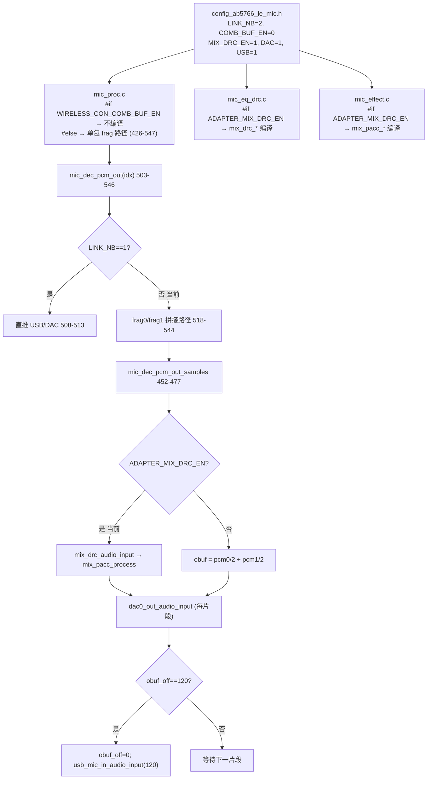
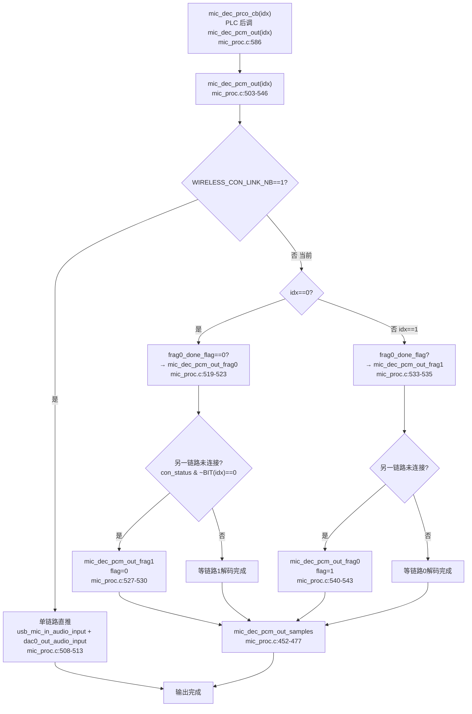
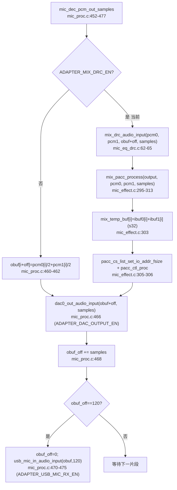

# AB5766 LE Mic 双链路混音与 Mix PACC

> **适用范围：** 当前 `CONFIG_AB5766_LE_MIC` 产品配置，`WIRELESS_CON_LINK_NB=2`、`WIRELESS_CON_COMB_BUF_EN=0`（单包路径）。本文档以可见 C 源码中的编译条件、调用关系和数据流为依据；不以文件名、宏名或日志文字单独推断功能，也不推断预编译库内部实现。
>
> **与其他文档的关系：** 本文专讲两路解码 PCM 如何拼片段、相加、经 Mix PACC 包装链后送 DAC/USB。PLC 产生的单路 PCM 见第四篇；LC3S 解码见第三篇；DAC FIFO 调速与 USB Mic 输出细节见第六篇。发射端 Local PACC（单链路 PACC0 复用）见第二篇。

## 1. 适用配置与边界

| 项目 | 当前值 | 来源 |
| --- | --- | --- |
| 链路数 | 2 | [config_ab5766_le_mic.h:76](../../projects/microphone/config_ab5766_le_mic.h#L76) |
| 单包路径 | `WIRELESS_CON_COMB_BUF_EN=0` | [config_extra.h:122](../../projects/microphone/config_extra.h#L122) |
| 每帧样点 | 120 | [config_ab5766_le_mic.h:78](../../projects/microphone/config_ab5766_le_mic.h#L78) |
| 声道 | 1 | [config_ab5766_le_mic.h:79](../../projects/microphone/config_ab5766_le_mic.h#L79) |
| 采样率 | `SAMPLE_RATE_48K` | [config_ab5766_le_mic.h:77](../../projects/microphone/config_ab5766_le_mic.h#L77) |
| Mix PACC 包装链 | `ADAPTER_MIX_DRC_EN=1` | [config_ab5766_le_mic.h:124](../../projects/microphone/config_ab5766_le_mic.h#L124) |
| 接收 DAC | `ADAPTER_DAC_OUTPUT_EN=1` | [config_ab5766_le_mic.h:121](../../projects/microphone/config_ab5766_le_mic.h#L121) |
| 接收 USB Mic | `ADAPTER_USB_MIC_RX_EN=1` | [config_ab5766_le_mic.h:123](../../projects/microphone/config_ab5766_le_mic.h#L123) |
| Mix effect 索引 | `EFFECT_IDX_MIX_EQ=4, EFFECT_IDX_MIX_DRC=5` | [effect_idx.h:14-15](../../modules/effect/effect_idx.h#L14-L15) |
| `mic_pcm_t` 类型 | `s16` | [mic_eq_drc.h:4](../../modules/audio/mic_eq_drc.h#L4) |

**本文档可确认的事：** 两条 `mic_dec_pcm_out` 路径的存在与编译选择、片段（frag）拆分与对齐逻辑、两路相加的归一化方式、Mix PACC 包装链的资源装载/使能/重链接流程、PACC0 在 Local 与 Mix 之间的分时复用引用计数、DAC 与 USB Mic 的触发点与“每完整 120 样点推一次 USB”的规则。

**本文档不证明的事：** PACC 内部 EQ 滤波器系数、DRC 压缩曲线、饱和规则、硬件实现；`ble_single_link_duration_get()` 返回值的具体单位与空口实际链路时序；EQ/DRC 资源节点是否真正装载成功（取决于 effect 资源与 `pacc_*_set_by_res` 返回值，需 E2 资源身份 + E3 验证）；USB Mic 在主机端的 UAC 行为。这些都属预编译或下游边界，见第 9 节。

## 2. 配置快照



**关键编译分支：** `WIRELESS_CON_COMB_BUF_EN` 决定 `mic_dec_pcm_out` 走哪条实现。当前为 0（[config_extra.h:122](../../projects/microphone/config_extra.h#L122)），走 `#else` 分支的 frag 拼接实现（[mic_proc.c:426-547](../../modules/wireless/mic_proc.c#L426-L547)）；`WIRELESS_CON_COMB_BUF_EN=1` 的另一条实现（[mic_proc.c:392-425](../../modules/wireless/mic_proc.c#L392-L425)）当前不编译，仅作对比，本文不臆测其行为。

**`mic_dec_t` 与本节相关字段**（[mic_proc.c:29-44](../../modules/wireless/mic_proc.c#L29-L44)）：

| 字段 | 大小（当前） | 角色 |
| --- | --- | --- |
| `obuf[MIC_DEC_OBUF_SIZE]` | 240 B | 混音输出缓冲，DAC 与 USB 共用 |
| `pcm[LINK_NB].buf[MIC_DEC_OBUF_SIZE]` | 2×240 B | 两路解码 PCM（PLC 原地处理后的结果） |
| `pcm[LINK_NB].buf_cnt` | 2×2 B | COMB 路径用，单包路径不使用 |
| `frag_samples[2]` | 2 B | frag0/frag1 的样点数，初始化时算定 |
| `frag0_done_flag` | 1 B | frag0 是否已输出标志 |
| `obuf_off` | 1 B | `obuf` 当前写入偏移，累计到 120 触发 USB |
| `sync_idx` | 1 B | DAC FIFO 同步所用链路索引（见第六篇） |

`MIC_DEC_OBUF_SIZE = WIRELESS_MIC_SAMPLES_SELECT * WIRELESS_MIC_CHANNEL_SELECT * 2 = 120*1*2 = 240`（[mic_proc.c:10](../../modules/wireless/mic_proc.c#L10)）。注意 `pcm[idx].buf` 与 `obuf` 都是 240B=120 个 s16 样点，与一帧 PCM 长度一致。

## 3. 实际调用链

### 3.1 从解码完成到混音输出

`mic_dec_prco_cb(idx)`（第四篇）在 PLC 处理后调用 `mic_dec_pcm_out(idx)`（[mic_proc.c:586](../../modules/wireless/mic_proc.c#L586)）。混音链路：



**单包路径的核心设计：两链路解码时刻错开，用 frag 拆分对齐时间轴。** `frag0` 用“通道0前段 + 通道1后段”，`frag1` 用“通道0后段 + 通道1前段”——两片段合起来正好覆盖通道0与通道1各自的完整 120 样点，但通道1相对通道0旋转了 `frag_samples[0]` 个样点。这一旋转量来自两链路的空口时序差，见第 6.2 节。

### 3.2 Mix PACC 包装链调用



## 4. 初始化

混音初始化分两步：`adapter_init` 算 `frag_samples` 并 `mix_drc_init`；`mix_drc_init` 内部 `mix_pacc_init`/`set_param`/`enable` 三步建链。

### 4.1 `frag_samples` 推导（接收端初始化）

`adapter_init()` 见 [mic_proc.c:700-734](../../modules/wireless/mic_proc.c#L700-L734)。与混音相关的是 [mic_proc.c:706-711](../../modules/wireless/mic_proc.c#L706-L711)：

```c
#if WIRELESS_CON_LINK_NB > 1 && !WIRELESS_CON_COMB_BUF_EN
    int temp_frag = mic_dec_us_trans_samples(ble_single_link_duration_get(), WIRELESS_MIC_SAMPLE_RATE_SELECT) % WIRELESS_MIC_SAMPLES_SELECT;
    //寻址WORD对齐
    mic_dec.frag_samples[0] = ((temp_frag%2) ? temp_frag+1 : temp_frag);
    mic_dec.frag_samples[1] = WIRELESS_MIC_SAMPLES_SELECT - mic_dec.frag_samples[0];
#endif
```

- `ble_single_link_duration_get()` 返回单链路时长，原型见 [api_wireless_mic.h:72](../../libs/ble/api_wireless_mic.h#L72)，**实现属预编译协议栈边界**，单位不可从可见源码确认（结合下一函数推断为微秒）。
- `mic_dec_us_trans_samples(us, spr_idx)`（[mic_proc.c:429-450](../../modules/wireless/mic_proc.c#L429-L450)）按采样率把时长换算成样点数：48K→每样点 21us（`samples_duration=21`），16K→62us，返回 `us/samples_duration`。函数名与常量命名“us”暗示入参单位为微秒，但这是命名推断，可见层只能确认“返回值是样点数”。
- `temp_frag` 取模 120 得到“两链路错开的样点数”；`frag_samples[0]` 做字对齐（奇数则 +1），`frag_samples[1] = 120 - frag_samples[0]`。两片段之和恒为 120。
- **边界：** 若 `ble_single_link_duration_get()` 返回 0 或 `temp_frag` 为 0，则 `frag_samples[0]=0, frag_samples[1]=120`，frag0 退化成 0 样点（frag0 实际不输出有效内容），frag1 成完整帧。这一边界行为需在 E3 测试中确认。

### 4.2 `mix_drc_init` 三步建链

[mic_eq_drc.c:67-78](../../modules/audio/mic_eq_drc.c#L67-L78)，段属性 `AT(.text.mix_drc.init)`：

```c
void mix_drc_init(void)
{
    mix_pacc_init();        //1. 初始化 PACC 链路与硬件句柄
    mix_pacc_set_param();   //2. 装载 effect 资源，置 cs_en
    mix_pacc_enable();      //3. 重链接实际节点链 + 设 IO 格式
}
```

`adapter_init` 在 [mic_proc.c:721-723](../../modules/wireless/mic_proc.c#L721-L723) 调用 `mix_drc_init()`，位于 `lc3s_dec_init` 之后、`dac0_out_init` 之前。

### 4.3 `mix_pacc_init`：硬件句柄与候选表

[mic_effect.c:228-247](../../modules/effect/mic_effect.c#L228-L247)：

1. [mic_effect.c:236](../../modules/effect/mic_effect.c#L236)：`memset(mix_pacc.cs_en, 0, ...)`，所有节点初始关闭。
2. [mic_effect.c:239-240](../../modules/effect/mic_effect.c#L239-L240)：`pacc_effect_eq_init` 初始化 EQ 节点（最多 `EQ_BAND_MAX_NB` 段），`pacc_effect_drc_init` 初始化 DRC 节点。系数缓冲 `mix_eq_bd.coef`/`mix_drc_bd.drc_coef` 与状态缓冲 `mix_eq_bd.zx`/`mix_drc_bd.drc_coef` 均在 [mic_effect.c:210-213](../../modules/effect/mic_effect.c#L210-L213) 以 `AT(.buf.mic_mix)` 放置。
3. [mic_effect.c:245](../../modules/effect/mic_effect.c#L245)：`mix_pacc.pacc_ctl = pacc0_ctl_alloc(PACC0_MIX_MIC)` 申请 PACC0 硬件句柄（见 6.3）。
4. [mic_effect.c:246](../../modules/effect/mic_effect.c#L246)：`mix_pacc.start_cs = pacc_effect_link(mix_pacc_cb_tbl, MIX_MIC_PACC_MAX_CS, 120)` 按候选表建链。候选表见 [mic_effect.c:219-226](../../modules/effect/mic_effect.c#L219-L226)，顺序为 EQ →（可选 FSH）→ DRC，`mix_temp_buf`（s32）作输入输出 cache。

### 4.4 `mix_pacc_set_param`：资源装载决定节点使能

[mic_effect.c:249-267](../../modules/effect/mic_effect.c#L249-L267)：

```c
if (pacc_eq_set_by_res(&mix_pacc.pacc_cs[MIX_MIC_PACC_EQ_CS], eq_addr, eq_len) == ERROR_NO) {
    mix_pacc.cs_en[MIX_MIC_PACC_EQ_CS] = 1;
}
if (pacc_drc_set_by_res(&mix_pacc.pacc_cs[MIX_MIC_PACC_DRC_CS], drc_addr, drc_len) == ERROR_NO) {
    mix_pacc.cs_en[MIX_MIC_PACC_DRC_CS] = 1;
}
```

资源地址来自 `effect_res_addr_get(EFFECT_IDX_MIX_EQ)` 与 `EFFECT_IDX_MIX_DRC`（[mic_effect.c:251-254](../../modules/effect/mic_effect.c#L251-L254)），索引见 [effect_idx.h:14-15](../../modules/effect/effect_idx.h#L14-L15)。**只有 `pacc_*_set_by_res` 返回 `ERROR_NO` 才置 `cs_en=1`**——资源不存在或校验失败时节点不使能。`ADAPTER_MIX_DRC_EN=1` 只保证包装链被编译和调用，不保证 EQ/DRC 两节点都进链。实际节点集合需 effect 资源身份（E2）+ 装载返回值（E1）共同确认。

### 4.5 `mix_pacc_enable`：重链接与 IO 格式

[mic_effect.c:279-292](../../modules/effect/mic_effect.c#L279-L292)：

1. [mic_effect.c:284](../../modules/effect/mic_effect.c#L284)：`mix_pacc.start_cs = pacc_effect_relink(mix_pacc.pacc_cs, mix_pacc.cs_en, MIX_MIC_PACC_MAX_CS)` 按 `cs_en` 重链接实际节点链。未使能节点被跳过，`start_cs` 指向第一个使能节点。
2. [mic_effect.c:287-291](../../modules/effect/mic_effect.c#L287-L291)：设链头链尾 IO 格式。当前 `WIRELESS_MIC_24B_PCM_EN=0`，走 `pacc_cs_list_set_io_fmt(start_cs, false, S32_Q15, S16_Q15_SAT)`——输入 s32 Q15（来自 `mix_temp_buf` 相加结果），输出 s16 Q15 饱和。`24B` 开启时改用 `S32_Q23`/`S32_Q23_SAT`。

> **注意：** Mix 链输入是 s32（相加结果需宽位防溢出），而 Local PACC 链输入随 Soft Gain 开关在 s16/s32 间切换（见第二篇）。两条 PACC 链的 IO 格式独立设置。

## 5. 逐帧处理

### 5.1 `mic_dec_pcm_out` 的 frag 调度

单包路径实现见 [mic_proc.c:503-546](../../modules/wireless/mic_proc.c#L503-L546)。`LINK_NB==1` 时（[mic_proc.c:506-513](../../modules/wireless/mic_proc.c#L506-L513)）直接把 `pcm[0].buf` 送 USB 与 DAC，无 frag 拼接。当前 `LINK_NB=2`，走 [mic_proc.c:514-545](../../modules/wireless/mic_proc.c#L514-L545)：

| `idx` | 触发条件 | 动作 | 置 `frag0_done_flag` |
| --- | --- | --- | --- |
| 0 | `frag0_done_flag==0` | `mic_dec_pcm_out_frag0(idx, 0)` | =1（[mic_proc.c:519-523](../../modules/wireless/mic_proc.c#L519-L523)） |
| 0 | 另一链路未连接（`con_status & ~BIT(0)==0`） | `mic_dec_pcm_out_frag1(idx, 0)` | =0（[mic_proc.c:527-530](../../modules/wireless/mic_proc.c#L527-L530)） |
| 1 | `frag0_done_flag==1` | `mic_dec_pcm_out_frag1(idx, 0)` | =0（[mic_proc.c:533-535](../../modules/wireless/mic_proc.c#L533-L535)） |
| 1 | 另一链路未连接（`con_status & ~BIT(1)==0`） | `mic_dec_pcm_out_frag0(idx, 0)` | =1（[mic_proc.c:540-543](../../modules/wireless/mic_proc.c#L540-L543)） |

**调度语义：** 正常双链路时，链路0解码完先输出 frag0（通道0前段+通道1后段）并置标志，链路1解码完再输出 frag1（通道0后段+通道1前段）并清标志——两片段合起来填满 120 样点的 `obuf`。当某一链路未连接时，另一链路独自把 frag0 和 frag1 都输出来凑满一帧（用未连接链路的旧 PCM，配合第四篇的 `mic_dec_reset`/`adapter_reset` 清理语义）。

### 5.2 frag0 / frag1 的指针拼法

`mic_dec_pcm_out_frag0`（[mic_proc.c:479-488](../../modules/wireless/mic_proc.c#L479-L488)）：

```c
uint8_t frag0_samples = mic_dec.frag_samples[0];
s16 *pcm0 = (s16 *)(&mic_dec.pcm[0].buf[0]);                          //通道0 从头
s16 *pcm1 = (s16 *)(&mic_dec.pcm[1].buf[0]) + (120 - frag0_samples);  //通道1 从尾部取 frag0_samples 个
mic_dec_pcm_out_samples(pcm0, pcm1, frag0_samples, dec_flag);
```

`mic_dec_pcm_out_frag1`（[mic_proc.c:491-501](../../modules/wireless/mic_proc.c#L491-L501)）：

```c
uint8_t frag0_samples = mic_dec.frag_samples[0];
uint8_t frag1_samples = mic_dec.frag_samples[1];
s16 *pcm0 = (s16 *)(&mic_dec.pcm[0].buf[0]) + frag0_samples;          //通道0 从 frag0 后取
s16 *pcm1 = (s16 *)(&mic_dec.pcm[1].buf[0]);                          //通道1 从头
mic_dec_pcm_out_samples(pcm0, pcm1, frag1_samples, dec_flag);
```

| 片段 | 通道0 区间 | 通道1 区间 | 样点数 |
| --- | --- | --- | --- |
| frag0 | `[0, frag0_samples)` | `[120-frag0_samples, 120)` | `frag0_samples` |
| frag1 | `[frag0_samples, 120)` | `[0, frag1_samples)` | `frag1_samples` |

两片段对通道0覆盖 `[0,120)`，对通道1也覆盖 `[0,120)`，但通道1相对通道0“旋转”了 `frag0_samples` 个样点——frag0 用通道1的尾，frag1 用通道1的头。这正是第 4.1 节 `frag_samples` 表示的两链路解码时刻错开量。

### 5.3 `mic_dec_pcm_out_samples`：相加与输出

[mic_proc.c:452-477](../../modules/wireless/mic_proc.c#L452-L477)，逐片段执行：

1. [mic_proc.c:457-463](../../modules/wireless/mic_proc.c#L457-L463)：`ADAPTER_MIX_DRC_EN` 时调 `mix_drc_audio_input(pcm0, pcm1, obuf+obuf_off, samples)`；否则 `for` 循环 `obuf[i+off]=pcm0[i]/2+pcm1[i]/2`。
2. [mic_proc.c:465-467](../../modules/wireless/mic_proc.c#L465-L467)：`ADAPTER_DAC_OUTPUT_EN` 时 `dac0_out_audio_input(obuf+obuf_off, samples, 0)` 把本片段送 DAC。
3. [mic_proc.c:468-476](../../modules/wireless/mic_proc.c#L468-L476)：`obuf_off += samples`；若 `obuf_off == 120` 则清零并 `usb_mic_in_audio_input(obuf, 120, 0, 0)`。

**DAC 与 USB 的输出节奏不同：** DAC 每片段（`frag0_samples` 或 `frag1_samples` 样点）就输出一次，是流式；USB Mic 必须累计满完整 120 样点才推一次，是帧式。这是因为 UAC 按完整帧封装，而 DAC FIFO 可接受任意长度灌入。

## 6. 算法原理

### 6.1 两路相加的两种归一化

可见层有两种两路相加实现，归一化方式不同：

| 路径 | 实现 | 归一化 | 来源 |
| --- | --- | --- | --- |
| Mix PACC 开（当前） | `mix_temp_buf[i] = ibuf0[i] + ibuf1[i]`（s32 累加） | 不衰减，全和进 s32 防 s16 溢出；动态由后续 DRC 限制 | [mic_effect.c:303](../../modules/effect/mic_effect.c#L303) |
| Mix PACC 关 | `obuf[i] = pcm0[i]/2 + pcm1[i]/2` | 每路衰减 6dB（÷2）后相加，保证不溢出但单路电平下降 | [mic_proc.c:461](../../modules/wireless/mic_proc.c#L461) |

**含义：** 当前 Mix PACC 开启，相加不做 ÷2 衰减，两路电平叠加可能超过单路满幅，靠 DRC 压制峰值。若 DRC 节点未成功装载（`cs_en[DRC]=0`）但 EQ 装载了，链路只过 EQ 不过 DRC，叠加峰值可能削波——这是 Mix PACC 路径的潜在风险，需 E2 资源身份 + E3 峰值测试确认。Mix PACC 关闭时走 ÷2 路径，单路电平下降 6dB 但安全。

### 6.2 frag 旋转：两链路时间轴对齐

两发射端通过同一适配器接收时，两条 BLE 链路的连接时序、包到达时刻并非严格对齐，存在一个样点级偏移 `frag_samples[0]`。若直接把通道0的 `[0,120)` 与通道1的 `[0,120)` 逐点相加，相当于把两个时间轴错位的信号叠加，会产生相位/时间错位。

frag 拼接通过“通道1 旋转 `frag_samples[0]`”来补偿：frag0 用通道1的尾部 `[120-f, 120)` 对齐通道0的头部 `[0, f)`，frag1 用通道1的头部 `[0, 120-f)` 对齐通道0的尾部 `[f, 120)`。这样两路在时间轴上对齐后相加。`frag_samples[0]` 由 `ble_single_link_duration_get()` 经 `mic_dec_us_trans_samples` 换算得到，是运行时动态值，不是编译期常量。

> **边界：** `ble_single_link_duration_get()` 的返回值与空口实际链路时序属预编译协议栈边界，可见层只能确认“用它的返回值算 frag_samples”。若该值与实际链路时序不一致，frag 旋转量错误，混音会有时间错位。需 E3 双链路同源信号测试验证对齐。

### 6.3 PACC0 分时复用与引用计数

[mic_effect.c:1-13](../../modules/effect/mic_effect.c#L1-L13) 文件头注释明确：PACC0 可分时服务 Local/Mix/SCO 链路，但**禁止多线程同时调用 `pacc_ctl_proc`**。复用通过引用计数管理（[mic_effect.c:25-50](../../modules/effect/mic_effect.c#L25-L50)）：

- `pacc0_ctl_alloc(en_bit)`（[mic_effect.c:33-41](../../modules/effect/mic_effect.c#L33-L41)）：若 `ctl==NULL` 则 `pacc_effect_init(0)` 初始化硬件，`enable |= en_bit` 置位，返回句柄。
- `pacc0_ctl_free(en_bit)`（[mic_effect.c:43-50](../../modules/effect/mic_effect.c#L43-L50)）：`enable &= ~en_bit` 清位，`enable==0` 时 `pacc_effect_exit(0)` 释放硬件、`ctl=NULL`。
- 位定义见 [mic_effect.c:19-23](../../modules/effect/mic_effect.c#L19-L23)：`PACC0_LOC_MIC=BIT(0), PACC0_MIX_MIC=BIT(1), PACC0_SCO_MIC=BIT(2)`。

Local PACC 用 `PACC0_LOC_MIC`（[mic_effect.c:99](../../modules/effect/mic_effect.c#L99)），Mix PACC 用 `PACC0_MIX_MIC`（[mic_effect.c:245](../../modules/effect/mic_effect.c#L245)）。两者可同时持有句柄，但处理接口不能并发调用——Local 在发射端 `mic_enc_proc_cb` 线程调用，Mix 在接收端 `mic_dec_prco_cb` 线程调用，角色互斥（同一镜像只作发射或接收），故当前配置下无并发风险。若未来同角色内多链路并发，需重新评估。

### 6.4 预编译核心涉及的算法组件（仅从结构/宏推断存在）

从 `mix_pacc` 结构、候选表与 init 调用可确认 Mix PACC **涉及**以下组件（存在性确认，非实现确认）：

| 组件 | 证据 | 含义（命名推断，非实现确认） |
| --- | --- | --- |
| EQ（多段均衡） | `mix_eq`/`mix_eq_bd`、`pacc_effect_eq_init`、`PACC_EQ`、`EFFECT_IDX_MIX_EQ` | 多段 IIR/FIR 滤波，段数 ≤ `EQ_BAND_MAX_NB` |
| DRC（动态压缩） | `mix_drc`/`mix_drc_bd`、`pacc_effect_drc_init`、`PACC_DRC`、`EFFECT_IDX_MIX_DRC` | 动态范围压缩，曲线由资源参数定 |
| FSH（频移，当前关） | `ADAPTER_FREQ_SHIFT_EN` 包裹 `mix_fsh`、`MIX_MIC_PACC_FSH_CS` | 频移效果，当前 `ADAPTER_FREQ_SHIFT_EN=0` 不编译 |

EQ/DRC 的具体滤波器结构、压缩曲线、饱和规则、硬件实现均属 PACC 预编译边界，不可从可见源码确认，需 effect 资源文档或 E3 仪器测量。

## 7. 缓冲区与输入输出

| 缓冲区 | 大小（当前） | 角色 | 段属性 |
| --- | --- | --- | --- |
| `mic_dec.obuf` | 240 B | 混音输出，DAC 流式 + USB 帧式共用 | `.buf.adapter.proc`（[mic_proc.c:49-50](../../modules/wireless/mic_proc.c#L49-L50)） |
| `mic_dec.pcm[0].buf` | 240 B | 通道0 解码/PLC 后 PCM | `.buf.adapter.proc` |
| `mic_dec.pcm[1].buf` | 240 B | 通道1 解码/PLC 后 PCM | `.buf.adapter.proc` |
| `mix_temp_buf` | 480 B（120×s32） | Mix 相加 s32 暂存，PACC 输入输出 cache | `.buf.mic_mix`（[mic_effect.c:200](../../modules/effect/mic_effect.c#L200)） |
| `mix_pacc` 结构 | 含 pacc_cs[2] 等 | Mix PACC 链状态 | `.buf.mic_mix.pacc`（[mic_effect.c:208](../../modules/effect/mic_effect.c#L208)） |
| `mix_eq`/`mix_drc`/`*_bd` | — | EQ/DRC 节点系数与状态 | `.buf.mic_mix`（[mic_effect.c:210-213](../../modules/effect/mic_effect.c#L210-L213)） |

**输入输出关系：**

- 输入：`mic_dec.pcm[idx].buf`（两路，各 120 s16 样点，PLC 原地处理后的结果）。
- 混音：frag0/frag1 取出两路对应区间 → `mic_dec_pcm_out_samples` 相加（PACC 或 ÷2）→ 写入 `mic_dec.obuf + obuf_off`。
- 输出：DAC 每片段读 `obuf+obuf_off`；USB 在 `obuf_off==120` 时读完整 `obuf`（120 样点）。
- Mix PACC 内部：两路 s16 相加进 `mix_temp_buf`（s32），PACC 处理后输出 s16 回 `obuf`。`mix_temp_buf` 既是相加结果也是 PACC cache。

**复位语义：**

| 复位点 | 位置 | 对混音的影响 |
| --- | --- | --- |
| `mic_dec_reset(idx)` | [mic_proc.c:694-698](../../modules/wireless/mic_proc.c#L694-L698) | 清 `pcm[idx].buf` 与 `last_bfi[idx]`；**不清 `obuf`/`obuf_off`/`frag0_done_flag`/`frag_samples`** |
| `adapter_reset(idx, con_sta)` | [mic_proc.c:736-750](../../modules/wireless/mic_proc.c#L736-L750) | `con_sta==0`（最后一条断开）时 `obuf_off=0` + `dac0_out_exit()`；调 `mic_dec_reset`、`plc_soft_exit` |
| `mix_drc_exit` | [mic_eq_drc.c:80-84](../../modules/audio/mic_eq_drc.c#L80-L84) | `mix_pacc_exit` → `pacc0_ctl_free(PACC0_MIX_MIC)` 释放 PACC0 句柄引用 |

注意 `adapter_reset` 在 `con_sta==0`（全断开）时才清 `obuf_off` 并 `dac0_out_exit`；单链路断开（`con_sta!=0`）时保留 `obuf_off` 与 DAC，让另一链路继续输出。但 `adapter_reset` 未调用 `mix_drc_exit`——Mix PACC 链状态在单链路断开时不重置，仅在 `adapter_init` 重建（见第 4 节）。`mix_drc_exit` 当前在可见源码中**未被调用**（grep 仅见声明与定义），Mix PACC 的 PACC0 句柄释放依赖 `pacc0_ctl_free` 的引用计数与全断开时硬件复位。

## 8. 可见源码与预编译边界

| 层 | 可见 | 预编译（不可见） |
| --- | --- | --- |
| 混音调度与 frag 拼接 | `mic_dec_pcm_out`/`frag0`/`frag1`/`samples`（[mic_proc.c:452-546](../../modules/wireless/mic_proc.c#L452-L546)） | — |
| 两路相加（÷2 路径） | [mic_proc.c:461](../../modules/wireless/mic_proc.c#L461) | — |
| 两路相加（PACC 路径） | `mix_pacc_process` 内 `mix_temp_buf[i]=ibuf0[i]+ibuf1[i]`（[mic_effect.c:303](../../modules/effect/mic_effect.c#L303)） | PACC 内 EQ/DRC 处理 |
| Mix PACC 建链 | `mix_pacc_init/set_param/enable`（[mic_effect.c:228-292](../../modules/effect/mic_effect.c#L228-L292)） | `pacc_effect_link`/`relink`/`ctl_proc` 内部节点链接与处理 |
| PACC0 引用计数 | `pacc0_ctl_alloc/free`（[mic_effect.c:33-50](../../modules/effect/mic_effect.c#L33-L50)） | `pacc_effect_init/exit` 硬件初始化 |
| EQ/DRC 节点初始化 | `pacc_effect_eq_init`/`pacc_effect_drc_init` 调用与参数（[mic_effect.c:239-240](../../modules/effect/mic_effect.c#L239-L240)） | 滤波器/压缩器内部结构 |
| 资源装载 | `pacc_*_set_by_res` 返回值决定 `cs_en`（[mic_effect.c:256-262](../../modules/effect/mic_effect.c#L256-L262)） | 资源解析、校验、系数装载内部 |
| frag 旋转量 | `frag_samples` 由 `ble_single_link_duration_get` 换算（[mic_proc.c:707-710](../../modules/wireless/mic_proc.c#L707-L710)） | `ble_single_link_duration_get` 实现与单位 |
| DAC 输出 | `dac0_out_audio_input` 调用（[mic_proc.c:466](../../modules/wireless/mic_proc.c#L466)） | DAC FIFO/DMA 内部（见第六篇） |
| USB Mic 输出 | `usb_mic_in_audio_input` 调用（[mic_proc.c:474](../../modules/wireless/mic_proc.c#L474)） | UAC 枚举/封装/主机行为 |

## 9. 当前可达性

| 结论 | 证据等级 | 可达性 |
| --- | --- | --- |
| `LINK_NB=2` 走 frag 拼接路径，`LINK_NB=1` 走直推路径 | E1 | ✅ [mic_proc.c:506-545](../../modules/wireless/mic_proc.c#L506-L545) 可直接确认 |
| frag0=通道0前+通道1后，frag1=通道0后+通道1前 | E1 | ✅ [mic_proc.c:479-501](../../modules/wireless/mic_proc.c#L479-L501) 可直接确认 |
| Mix PACC 开时 s32 全和相加，关时 ÷2 相加 | E1 | ✅ [mic_effect.c:303](../../modules/effect/mic_effect.c#L303) 与 [mic_proc.c:461](../../modules/wireless/mic_proc.c#L461) 可直接确认 |
| DAC 每片段输出，USB 每 120 样点输出 | E1 | ✅ [mic_proc.c:466,470-475](../../modules/wireless/mic_proc.c#L466-L475) 可直接确认 |
| EQ/DRC 节点是否实际进 Mix 链 | E2 | ⚠️ 需 effect 资源身份 + `pacc_*_set_by_res` 返回值 |
| frag 旋转量与实际链路时序一致 | E3 | ⚠️ 需双链路同源信号时间对齐测试 |
| Mix 相加后峰值不削波（DRC 限幅有效） | E3 | ⚠️ 需双路满幅信号峰值测试 |
| PACC0 Local/Mix 并发安全 | E1/E3 | ⚠️ 当前角色互斥无并发；未来同角色多链路需重评 |
| `mix_drc_exit` 是否在某路径被调用 | E1 | ⚠️ 可见源码未发现调用点，依赖引用计数 |

## 10. 测试与失败定位

### 10.1 双链路混音固定检查项

在通用门禁（第一篇第 10 节）之外，混音测试额外冻结：

1. 当次 effect 资源身份（`EFFECT_IDX_MIX_EQ`/`EFFECT_IDX_MIX_DRC` 的地址与长度），见 [mic_effect.c:251-254](../../modules/effect/mic_effect.c#L251-L254)；
2. `mix_pacc_set_param` 运行时 `pacc_eq_set_by_res`/`pacc_drc_set_by_res` 的返回值与最终 `cs_en`（决定实际节点集合）；
3. `ble_single_link_duration_get()` 返回值与算出的 `frag_samples[0]`/`[1]`；
4. 当次 `map.txt` 中 `mix_pacc_process`/`mix_drc_audio_input`/`mic_dec_pcm_out` 与 PACC 硬件符号的链接记录；
5. 两发射端的 setting/xcfg 身份、RF 通道、连接时序日志。

### 10.2 混音异常的分层定位

```text
单链路正常，双链路异常?
   ├─ 只有一路有声 → 查另一路连接/BFI/PLC（第四篇），非混音问题
   ├─ 两路都有声但叠加异常
   │   ├─ 混音后电平过高/削音 → Mix PACC 是否开? DRC 是否装载? (6.1 峰值风险)
   │   ├─ 混音后电平过低(-6dB) → Mix PACC 是否被关成 ÷2 路径?
   │   ├─ 两路时间错位/相位异常 → frag_samples 是否正确? (6.2 frag 旋转)
   │   └─ 任一路断开瞬态异常 → frag0_done_flag/obuf_off 残留? mic_dec_reset 未清这些
   ↓
DAC 有声但 USB 无声或断续?
   ├─ USB 帧不完整 → obuf_off 是否到 120 才推 USB? (5.3 帧式输出)
   └─ UAC 枚举/主机问题 → 下游边界（第六篇）
```

**不要把双链路异常直接归因于 Mix PACC 内部 EQ/DRC。** 先分清是“相加归一化问题（÷2 vs 全和）”“时间对齐问题（frag 旋转）”还是“PACC 节点问题（EQ/DRC 装载）”。三者分层：归一化由 `ADAPTER_MIX_DRC_EN` 决定（E0），时间对齐由 `frag_samples` 决定（E1+E3），节点由 effect 资源决定（E2）。

### 10.3 双链路测试要求

1. **单路基线：** 先各自单独连接一路，确认单路 DAC/USB 正常（走 `LINK_NB==1` 直推或单路 frag 路径）；
2. **双路同源：** 两发射端输入同源信号（如同一信号源分两路），观察相加结果——同相应约 +6dB（全和）或 0dB（÷2），反相应接近抵消；用于验证 frag 时间对齐；
3. **双路异频：** 两路不同频率，观察是否出现互调/混音电平异常，验证 DRC 限幅；
4. **断开瞬态：** 任一路断开时，观察 `frag0_done_flag`/`obuf_off` 残留是否导致前几帧异常；
5. **峰值长稳：** 双路满幅输入长时间运行，观察 DAC/USB 是否削波或 FIFO 异常；
6. 一次只改一个变量（链路数、effect 资源、`ADAPTER_MIX_DRC_EN`），绝不同时改 codec、帧长、`RETRY_NB`、RF。

### 10.4 PACC0 并发与复位检查

若怀疑 PACC0 复用问题：
- 确认当次角色（发射用 Local，接收用 Mix，互斥）；
- 确认 `pacc0_hw.enable` 位图（`PACC0_LOC_MIC`/`PACC0_MIX_MIC`）是否符合预期；
- 确认 `mix_drc_exit`/`loc_mic_pacc_exit` 是否在功能退出时被调用以释放引用（当前 `mix_drc_exit` 未见调用点，见第 7 节）；
- PACC0 硬件不可并发，多线程同时 `pacc_ctl_proc` 会导致链路串扰——当前角色互斥规避，未来改动需复核。

## 11. 引用表

| 引用 | 位置 | 作用 |
| --- | --- | --- |
| `mic_dec_t` 结构 | [mic_proc.c:29-44](../../modules/wireless/mic_proc.c#L29-L44) | `obuf`/`pcm[2]`/`frag_samples`/`obuf_off` 等混音状态 |
| `MIC_DEC_OBUF_SIZE` 定义 | [mic_proc.c:10](../../modules/wireless/mic_proc.c#L10) | 240B=120 样点 |
| COMB 路径（不编译） | [mic_proc.c:392-425](../../modules/wireless/mic_proc.c#L392-L425) | `WIRELESS_CON_COMB_BUF_EN=1` 的另一实现 |
| 单包 frag 路径 | [mic_proc.c:426-547](../../modules/wireless/mic_proc.c#L426-L547) | 当前编译的混音实现 |
| `mic_dec_us_trans_samples` | [mic_proc.c:429-450](../../modules/wireless/mic_proc.c#L429-L450) | 时长→样点数换算 |
| `mic_dec_pcm_out_samples` | [mic_proc.c:452-477](../../modules/wireless/mic_proc.c#L452-L477) | 相加 + DAC + USB 触发 |
| `mic_dec_pcm_out_frag0` | [mic_proc.c:479-488](../../modules/wireless/mic_proc.c#L479-L488) | 通道0前+通道1后 |
| `mic_dec_pcm_out_frag1` | [mic_proc.c:491-501](../../modules/wireless/mic_proc.c#L491-L501) | 通道0后+通道1前 |
| `mic_dec_pcm_out` | [mic_proc.c:503-546](../../modules/wireless/mic_proc.c#L503-L546) | frag 调度 |
| `adapter_init`（frag 推导） | [mic_proc.c:700-734](../../modules/wireless/mic_proc.c#L700-L734) | `frag_samples` 计算 + `mix_drc_init` |
| `adapter_reset` | [mic_proc.c:736-750](../../modules/wireless/mic_proc.c#L736-L750) | 全断开清 `obuf_off` + `dac0_out_exit` |
| `mix_drc_audio_input` | [mic_eq_drc.c:62-65](../../modules/audio/mic_eq_drc.c#L62-L65) | 转 `mix_pacc_process` |
| `mix_drc_init` | [mic_eq_drc.c:67-78](../../modules/audio/mic_eq_drc.c#L67-L78) | 三步建链 |
| `mix_drc_exit` | [mic_eq_drc.c:80-84](../../modules/audio/mic_eq_drc.c#L80-L84) | `mix_pacc_exit`（未见调用点） |
| `mic_pcm_t` 定义 | [mic_eq_drc.h:4](../../modules/audio/mic_eq_drc.h#L4) | `s16` |
| `mix_temp_buf` | [mic_effect.c:200](../../modules/effect/mic_effect.c#L200) | s32 相加暂存/cache |
| `mix_pacc` 结构 | [mic_effect.c:202-208](../../modules/effect/mic_effect.c#L202-L208) | Mix PACC 链状态 |
| Mix 候选表 | [mic_effect.c:219-226](../../modules/effect/mic_effect.c#L219-L226) | EQ→(FSH)→DRC |
| `mix_pacc_init` | [mic_effect.c:228-247](../../modules/effect/mic_effect.c#L228-L247) | 候选表建链 + PACC0 句柄 |
| `mix_pacc_set_param` | [mic_effect.c:249-267](../../modules/effect/mic_effect.c#L249-L267) | 资源装载决定 `cs_en` |
| `mix_pacc_enable` | [mic_effect.c:279-292](../../modules/effect/mic_effect.c#L279-L292) | 重链接 + IO 格式 |
| `mix_pacc_process` | [mic_effect.c:295-313](../../modules/effect/mic_effect.c#L295-L313) | 相加 + PACC 处理 |
| `mix_pacc_exit` | [mic_effect.c:315-319](../../modules/effect/mic_effect.c#L315-L319) | 释放 PACC0 句柄 |
| PACC0 引用计数 | [mic_effect.c:25-50](../../modules/effect/mic_effect.c#L25-L50) | `pacc0_ctl_alloc/free` |
| PACC0 位定义 | [mic_effect.c:19-23](../../modules/effect/mic_effect.c#L19-L23) | `PACC0_LOC_MIC/MIX_MIC/SCO_MIC` |
| effect 索引 | [effect_idx.h:7-18](../../modules/effect/effect_idx.h#L7-L18) | `EFFECT_IDX_MIX_EQ/DRC` |
| Mix PACC 枚举 | [mic_effect.h:16-24](../../modules/effect/mic_effect.h#L16-L24) | `MIX_MIC_PACC_*_CS`/`MAX_CS` |
| `ble_single_link_duration_get` 原型 | [api_wireless_mic.h:72](../../libs/ble/api_wireless_mic.h#L72) | 单链路时长（预编译） |
| 配置：链路/Mix/DAC/USB | [config_ab5766_le_mic.h:76,121,123,124](../../projects/microphone/config_ab5766_le_mic.h#L76) | 当前开关集合 |

## 12. 相邻文档导航

- 上一篇：[AB5766_LE_Mic_接收端BFI与PLC算法链.md](AB5766_LE_Mic_接收端BFI与PLC算法链.md)
- 下一篇：[AB5766_LE_Mic_输出观测点与在线调音调用链.md](AB5766_LE_Mic_输出观测点与在线调音调用链.md)
- 总览：[AB5766_LE_Mic_音频算法调用链与测试快速入门.md](AB5766_LE_Mic_音频算法调用链与测试快速入门.md)
