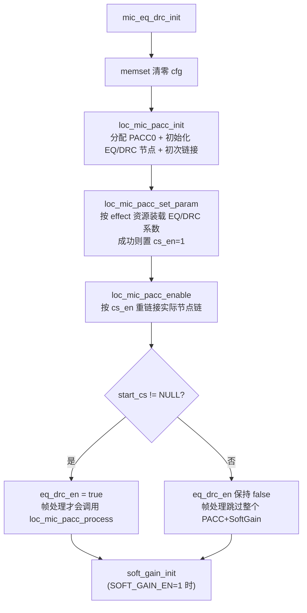

# AB5766 LE Mic 发射端采集增益与音效链

> **适用范围：** 当前 `CONFIG_AB5766_LE_MIC` 产品配置的**发射端（mic_emit）**。以可见 C 源码的编译条件、调用关系和数据流为依据，不以文件名、宏名或日志文字单独推断功能。
>
> **前置阅读：** [AB5766_LE_Mic_系统角色与算法启动门禁.md](AB5766_LE_Mic_系统角色与算法启动门禁.md)。本文假设读者已理解角色选择、连接门禁 `sys_cb.mic_alg_en` 和四层证据（E0-E3）。

## 1. 适用配置与边界

| 项目 | 当前值 | 来源 | 说明 |
| --- | --- | --- | --- |
| SDADC 采样率 | 48 kHz | [config_ab5766_le_mic.h:77](../../projects/microphone/config_ab5766_le_mic.h#L77) | `WIRELESS_MIC_32K_EN=0`，故 SDADC 直接用 48K |
| 每帧样点 | 120 | [config_ab5766_le_mic.h:78](../../projects/microphone/config_ab5766_le_mic.h#L78) | SDADC DMA 半满/全满各送 120 样点 |
| 声道 | 1（单声道） | [config_ab5766_le_mic.h:79](../../projects/microphone/config_ab5766_le_mic.h#L79) | 当前只支持单声道 |
| Soft Gain | 开启，8 级 | [config_ab5766_le_mic.h:98](../../projects/microphone/config_ab5766_le_mic.h#L98), [config_ab5766_le_mic.h:161](../../projects/microphone/config_ab5766_le_mic.h#L161) | `WIRELESS_MIC_SOFT_GAIN_EN=1`，`SOFT_GAIN_MAX_LEVEL=8` |
| Local PACC（EQ/DRC） | 开启 | [config_ab5766_le_mic.h:99](../../projects/microphone/config_ab5766_le_mic.h#L99) | `WIRELESS_MIC_EQ_DRC_EN=1` |
| 发射端 DAC 监听 | 开启 | [config_ab5766_le_mic.h:93](../../projects/microphone/config_ab5766_le_mic.h#L93) | `WIRELESS_MIC_DAC_OUT_EN=1` |
| 编解码 | LC3S | [config_ab5766_le_mic.h:64](../../projects/microphone/config_ab5766_le_mic.h#L64) | 压缩帧 25 byte |

**本文档不证明的事：** EQ/DRC 滤波器系数正确性、Soft Gain 听感线性度、SDADC 模拟通道噪声、LC3S 编码质量。这些属于 E2/E3 范畴。

## 2. 配置快照

发射端采集与音效相关的编译期宏（均来自 [config_ab5766_le_mic.h](../../projects/microphone/config_ab5766_le_mic.h)）：

```text
WIRELESS_MIC_DAC_OUT_EN    = 1   (93行)  发射端侦听麦采集使能
WIRELESS_MIC_SOFT_GAIN_EN  = 1   (98行)  带保护的数字增益
WIRELESS_MIC_EQ_DRC_EN     = 1   (99行)  发射端 EQ_DRC
SOFT_GAIN_MAX_LEVEL        = 8   (161行) 8 级音量表
SOFT_GAIN_DEFAULT_LEVEL    = 0   (162行) 默认等级（等级越大音量越小）
WIRELESS_MIC_LOWPASS_EN    = 0   (89行)  SDADC 低通滤波（关闭）
WIRELESS_MIC_32K_EN        = 0   (116行) 32k 采样率（关闭，影响 SRC）
WIRELESS_MIC_AINS4_32K_EN  = 0   (118行) AINS4 降噪（关闭）
```

运行时模拟/数字增益由 `xcfg_cb` 决定，见 [config_ab5766_le_mic.h:54-59](../../projects/microphone/config_ab5766_le_mic.h#L54-L59)：`MIC_ANA_MODE`、`MIC_DIG_GAIN`、`MIC_ANA_GAIN` 均来自配置工具下发的 `xcfg_cb` 字段。**模拟增益和数字增益（SDADC 寄存器级）在 SDADC 初始化时一次性写入，不参与逐帧算法链**；逐帧数字增益由 Soft Gain 承担。

## 3. 实际调用链

### 3.1 从无线 TX 触发到编码入队

```mermaid
flowchart LR
    A["无线 TX 前回调<br/>wireless_d2a_adc_dma_cb"] --> B["mic_enc_adc_dma_kick"]
    B --> C{"sys_cb.mic_alg_en?"}
    C -->|否| Z["不启动采集<br/>(本帧无 PCM)"]
    C -->|是| D["bsp_sdadc_kick<br/>首次启动 SDADC DMA"]
    D --> E["SDADC DMA 半满/全满 ISR<br/>sdadc_isr_cb"]
    E --> F["sdadc_proc_cb<br/>HALF_DONE/ALL_DONE"]
    F --> G["mic_enc_proc_cb(pcm, 120)"]
    G --> H["启动丢帧/静音判定"]
    H --> I{"sys_cb.mic_alg_en?"}
    I -->|否| J["跳过条件算法"]
    I -->|是| K["条件算法块<br/>(AINS4/Echo/SRC/EQ_DRC/DNR/...)"]
    K --> L["mic_eq_drc_audio_input<br/>→ loc_mic_pacc_process<br/>(含 Soft Gain)"]
    L --> M["lc3s_enc(pcm, buffer, 120)"]
    J --> M
    M --> N["wireless_d2a_put_tx_frame<br/>(25 byte)"]
    N --> O["wl_play_sync_tick1"]
    O --> P["发射端 DAC 监听<br/>dac0_out_audio_input"]
```



| 次序 | 可见函数与位置 | 输入/输出与确认点 |
| --- | --- | --- |
| 1 | [wireless_txrx_single.c:293-297](../../modules/wireless/wireless_txrx_single.c#L293-L297) `wireless_d2a_adc_dma_cb()` | 无线 TX 前回调转入 `mic_enc_adc_dma_kick()` |
| 2 | [mic_proc.c:90-96](../../modules/wireless/mic_proc.c#L90-L96) `mic_enc_adc_dma_kick()` | 仅 `mic_alg_en` 为真才 `bsp_sdadc_kick()` |
| 3 | [bsp_sdadc.c:107-116](../../bsp/bsp_sdadc.c#L107-L116) `bsp_sdadc_kick()` | 首次调用启动 SDADC，置 `sdadc_w4_kick=false` |
| 4 | [bsp_sdadc.c:26-37](../../bsp/bsp_sdadc.c#L26-L37) `sdadc_isr_cb()` | DMA 半满/全满标志触发 `sdadc_done_proc_kick()` |
| 5 | [bsp_sdadc.c:39-53](../../bsp/bsp_sdadc.c#L39-L53) `sdadc_proc_cb()` | 半满送 `sdadc_buf[0]`，全满送 `sdadc_buf[120]`，各调 `mic_enc_proc_cb(rbuf, 120)` |
| 6 | [mic_proc.c:278-293](../../modules/wireless/mic_proc.c#L278-L293) `mic_enc_proc_cb()` 前段 | 启动丢帧/静音判定，必要时清零 PCM |
| 7 | [mic_proc.c:295-345](../../modules/wireless/mic_proc.c#L295-L345) `mic_enc_proc_cb()` 算法块 | `if(mic_alg_en)` 包裹所有条件算法 |
| 8 | [mic_proc.c:314-316](../../modules/wireless/mic_proc.c#L314-L316) | `mic_eq_drc_audio_input()` → Local PACC + Soft Gain |
| 9 | [mic_proc.c:358-360](../../modules/wireless/mic_proc.c#L358-L360) | `lc3s_enc()` 编码，输出到 `mic_enc.buffer` |
| 10 | [mic_proc.c:363](../../modules/wireless/mic_proc.c#L363) | `wireless_d2a_put_tx_frame(mic_enc.buffer, 25)` |
| 11 | [wireless_txrx_single.c:307-311](../../modules/wireless/wireless_txrx_single.c#L307-L311) | `wireless_d2a_put_tx_frame()` → `txpkt_put_frame()` |
| 12 | [mic_proc.c:368-375](../../modules/wireless/mic_proc.c#L368-L375) | 发射端 DAC 监听，输入是**编码前** PCM |

### 3.2 关键顺序事实

1. **SDADC 是按需启动**：`bsp_sdadc_kick()` 仅在 `sdadc_w4_kick==true` 时启动一次（[bsp_sdadc.c:110-115](../../bsp/bsp_sdadc.c#L110-L115)），之后 DMA 连续运转，半满/全满各产生一帧。
2. **SDADC DMA 用乒乓双缓冲**：`sdadc_buf[SDADC_DMA_SIZE]` 大小为 `120*2` 字节（[bsp_sdadc.c:11](../../bsp/bsp_sdadc.c#L11)，`WIRELESS_MIC_32K_EN=0` 分支），半满送前 120 样点，全满送后 120 样点，与 48 kHz/2.5ms 帧周期一致。
3. **编码与入队不在 `mic_alg_en` 门禁内**：`lc3s_enc` 与 `wireless_d2a_put_tx_frame` 位于 [mic_proc.c:352-363](../../modules/wireless/mic_proc.c#L352-L363)，在 `if(sys_cb.mic_alg_en){...}` 块**之外**。即门禁关闭时仍会编码并发送，但此时 PCM 要么是静音清零（mute），要么未经算法处理。结合 [mic_proc.c:295](../../modules/wireless/mic_proc.c#L295) 的门禁，正常连接时算法块才执行。
4. **发射 DAC 监听的是编码前 PCM**：[mic_proc.c:375](../../modules/wireless/mic_proc.c#L375) 的 `dac0_out_audio_input((u8 *)pcm, 120, 0)` 使用的是经过算法处理后的 `pcm` 指针（本地变量），而非编码后的 `mic_enc.buffer`。这是隔离“无线前/后”问题的重要观测点——若发射 DAC 有声而接收端无声，问题在无线链路或接收端，不在发射端采集。

## 4. 初始化

`mic_emit_init()` 由首次连接调用，见 [mic_proc.c:597-675](../../modules/wireless/mic_proc.c#L597-L675)。与采集增益/音效链相关的初始化顺序：

| 次序 | 函数 | 位置 | 当前条件 | 作用 |
| --- | --- | --- | --- | --- |
| 1 | `mic_emit_alg_init()` | [mic_proc.c:58-60](../../modules/wireless/mic_proc.c#L58-L60) | 无条件（空函数） | 占位 |
| 2 | `memset(&mic_enc, 0, ...)` | [mic_proc.c:602](../../modules/wireless/mic_proc.c#L602) | 无条件 | 清零编码状态，`first_pkt=true` |
| 3 | `lc3s_enc_init(48K, 120)` | [mic_proc.c:621](../../modules/wireless/mic_proc.c#L621) | `CODEC_LC3S` | LC3S 编码器初始化 |
| 4 | `mic_eq_drc_init(0, 120, 1)` | [mic_proc.c:654](../../modules/wireless/mic_proc.c#L654) | `EQ_DRC_EN=1` | Local PACC + Soft Gain 初始化 |
| 5 | `dac0_out_init(0, 120, 0)` | [mic_proc.c:666](../../modules/wireless/mic_proc.c#L666) | `DAC_OUT_EN=1` | 发射端 DAC 监听初始化 |
| 6 | `bsp_sdadc_init()` | [mic_proc.c:669](../../modules/wireless/mic_proc.c#L669) | 无条件 | SDADC 初始化（含模拟/数字增益） |
| 7 | `bsp_sdadc_lowpass_filter_en()` | [mic_proc.c:672](../../modules/wireless/mic_proc.c#L672) | `LOWPASS_EN=0` | 当前不编译 |

### 4.1 `mic_eq_drc_init` 的三步装载

见 [mic_eq_drc.c:27-48](../../modules/audio/mic_eq_drc.c#L27-L48)：



**关键耦合（E1 已确认）：** `eq_drc_en` 仅在 `loc_mic_pacc_enable()` 返回 `true` 时才置位（[mic_eq_drc.c:39-42](../../modules/audio/mic_eq_drc.c#L39-L42)）；而 `loc_mic_pacc_enable()` 返回 `(loc_mic_pacc.start_cs != NULL)`（[mic_effect.c:161](../../modules/effect/mic_effect.c#L161)）。`start_cs` 来自 `pacc_effect_relink()`，按 `cs_en` 数组重链接（[mic_effect.c:144](../../modules/effect/mic_effect.c#L144)）。**若 EQ 与 DRC 资源装载都失败（`cs_en` 全 0），重链接返回空链，`eq_drc_en` 保持 false，`mic_eq_drc_audio_input` 不调用 `loc_mic_pacc_process`**——而 Soft Gain 正是在 `loc_mic_pacc_process` 内部执行（见第 6 节）。因此：

> **Soft Gain 的逐帧执行依赖于至少一个 Local PACC 节点（EQ 或 DRC）成功装载并重链接。** 若 effect 资源缺失或装载全部失败，Soft Gain 也不会运行。测试 Soft Gain 前必须先确认 `eq_drc_en==true`（可通过 `mic_eq_drc_init 4` 打印，见 [mic_eq_drc.c:40](../../modules/audio/mic_eq_drc.c#L40)）。

## 5. 逐帧处理详解

`mic_enc_proc_cb(s16 *pcm, uint samples)` 见 [mic_proc.c:277-378](../../modules/wireless/mic_proc.c#L277-L378)，逐帧执行顺序：

### 5.1 第一步：启动丢帧与静音（[mic_proc.c:280-293](../../modules/wireless/mic_proc.c#L280-L293)）

```c
bool mute_flag = mic_enc.mute_en;
if (bsp_sdadc_discard_proc()) {
    mute_flag = true;
}
// ... key_press_mute 分支（当前关闭）...
if(mute_flag) {
    memset(pcm, 0x00, samples*2);
}
```

- `mic_enc.mute_en`：由 `mic_enc_mute_en_set()` 控制（[mic_proc.c:99-105](../../modules/wireless/mic_proc.c#L99-L105)），用户静音。
- `bsp_sdadc_discard_proc()`：见 [bsp_sdadc.c:118-129](../../bsp/bsp_sdadc.c#L118-L129)，启动初期 `sdadc_discard_cnt < 3+4`（即前 7 帧）返回 `true` 强制静音；在第 3 帧（约 7.5ms）时调用 `sdadc_rmdc_restore()` 恢复 RMDC。
- 任一条件成立则 PCM 清零，但**后续算法块和编码仍会执行**（作用于零数据）。

### 5.2 第二步：条件算法块（[mic_proc.c:295-345](../../modules/wireless/mic_proc.c#L295-L345)）

`if(sys_cb.mic_alg_en){...}` 包裹。当前配置下编译并执行的只有 EQ_DRC 一项：

| 算法 | 宏条件 | 当前值 | 位置 | 说明 |
| --- | --- | --- | --- | --- |
| AINS4 | `WIRELESS_MIC_AINS4_32K_EN` | 0 | [mic_proc.c:297-299](../../modules/wireless/mic_proc.c#L297-L299) | 不编译 |
| Echo（32K 前） | `ECHO_EN && 32K_EN` | 0 | [mic_proc.c:301-303](../../modules/wireless/mic_proc.c#L301-L303) | 不编译 |
| SRC | `WIRELESS_MIC_32K_EN` | 0 | [mic_proc.c:305-308](../../modules/wireless/mic_proc.c#L305-L308) | 不编译 |
| 最大能量检测 | `WIRELESS_MAX_POWER_DETECT_EN` | 0 | [mic_proc.c:310-312](../../modules/wireless/mic_proc.c#L310-L312) | 不编译 |
| **EQ/DRC** | `WIRELESS_MIC_EQ_DRC_EN` | **1** | [mic_proc.c:314-316](../../modules/wireless/mic_proc.c#L314-L316) | **当前执行** |
| DNR_FRE | `WIRELESS_MIC_DNR_FRE_EN` | 0 | [mic_proc.c:318-320](../../modules/wireless/mic_proc.c#L318-L320) | 不编译 |
| Echo（非 32K） | `ECHO_EN && !32K_EN` | 0 | [mic_proc.c:322-324](../../modules/wireless/mic_proc.c#L322-L324) | 不编译 |
| Magic | `WIRELESS_MIC_MAGIC_EN` | 0 | [mic_proc.c:326-328](../../modules/wireless/mic_proc.c#L326-L328) | 不编译 |
| Robotization | `WIRELESS_MIC_ROBOTIZATION_EN` | 0 | [mic_proc.c:330-332](../../modules/wireless/mic_proc.c#L330-L332) | 不编译 |
| Room Reverb | `WIRELESS_MIC_ROOM_REVERB_EN` | 0 | [mic_proc.c:334-336](../../modules/wireless/mic_proc.c#L334-L336) | 不编译 |
| AGC | `WIRELESS_MIC_AGC_EN` | 0 | [mic_proc.c:338-340](../../modules/wireless/mic_proc.c#L338-L340) | 不编译 |

`mic_eq_drc_audio_input((u8 *)pcm, 120, 0)` 是当前唯一执行的算法入口，内部见第 6 节。

### 5.3 第三步：编码与入队（[mic_proc.c:352-366](../../modules/wireless/mic_proc.c#L352-L366)）

```c
#if WIRELESS_CON_CODEC_SEL == CODEC_LC3S
    lc3s_enc((s16 *)pcm, mic_enc.buffer, WIRELESS_MIC_SAMPLES_SELECT);
#endif
wireless_d2a_put_tx_frame(mic_enc.buffer, WIRELESS_MIC_FRAME_SIZE);  // 25 byte
wl_play_sync_tick1(WIRELESS_MIC_TX_INTERVAL*2/WIRELESS_MIC_COMB_NB, SAMPLE_RATE_48K);
```

- LC3S 编码：120 样点 16-bit PCM → 25 byte 压缩帧，存入 `mic_enc.buffer`。
- `wireless_d2a_put_tx_frame()` 把 25 byte 交给 TX 缓冲管理（[wireless_txrx_single.c:307-311](../../modules/wireless/wireless_txrx_single.c#L307-L311)）。
- `wl_play_sync_tick1()` 用于播放同步时间戳。

### 5.4 第四步：发射端 DAC 监听（[mic_proc.c:368-376](../../modules/wireless/mic_proc.c#L368-L376)）

```c
#if WIRELESS_MIC_DAC_OUT_EN
    dac0_get_fifocnt(0);
    mic_enc.dac_cnt++;
    if (mic_enc.dac_cnt > 50) {
        mic_enc.dac_cnt = 0;
        dac0_play_sync_fifocnt(50, 30);
    }
    dac0_out_audio_input((u8 *)pcm, WIRELESS_MIC_SAMPLES_SELECT, 0);
#endif
```

- 每 50 帧做一次 FIFO 同步（`dac0_play_sync_fifocnt(50, 30)`），见 [dac0_out.c:55-77](../../modules/audio/dac0_out.c#L55-L77)，通过微调 `DACSRC0PHAI` 相位寄存器补偿播放偏差。
- 每帧把编码前 PCM 送 DAC，这是本地监听点。

## 6. 算法原理

### 6.1 Soft Gain：逐样点数字衰减与渐变

**配置：** 8 级，默认等级 0（音量最大），见 [config_ab5766_le_mic.h:161-162](../../projects/microphone/config_ab5766_le_mic.h#L161-L162)。

**等级表：** `SOFT_GAIN_MAX_LEVEL==8` 分支见 [soft_gain.c:52-56](../../modules/audio/soft_gain.c#L52-L56)：

```c
static const u32 soft_gain_tbl_8[SOFT_GAIN_MAX_LEVEL+1] = {
    SOFT_GAIN_N0DB,  SOFT_GAIN_N2DB,  SOFT_GAIN_N4DB,  SOFT_GAIN_N6DB,  SOFT_GAIN_N8DB,
    SOFT_GAIN_N10DB, SOFT_GAIN_N12DB, SOFT_GAIN_N15DB, SOFT_GAIN_N110DB,
};
```

对应衰减：`0 / -2 / -4 / -6 / -8 / -10 / -12 / -15 / -110 dB`（最后一项 `-110 dB` 实质静音）。**等级越大音量越小**（与注释一致）。

**初始化：** `soft_gain_init()` 见 [soft_gain.c:74-82](../../modules/audio/soft_gain.c#L74-L82)，`memset` 清零后设 `step=1`、`fade_en=1`，并按 `SOFT_GAIN_DEFAULT_LEVEL`（当前 0）调用 `soft_gain_set_level()` 设目标增益。

**目标增益设置：** `soft_gain_set_level(level)` 见 [soft_gain.c:59-72](../../modules/audio/soft_gain.c#L59-L72)，对 level 做上限保护后查表得 `target_gain`。

**逐级调节：** `soft_gain_up()`/`soft_gain_down()` 见 [soft_gain.c:84-94](../../modules/audio/soft_gain.c#L84-L94)，分别将等级减/加 1（up 减小等级 = 增大音量）。

**逐样点处理：** `soft_gain_proc_16bit(s16 data)` 见 [soft_gain.c:110-128](../../modules/audio/soft_gain.c#L110-L128)：

```c
s32 soft_gain_proc_16bit(s16 data) {
    s32 temp = 0;
    if (soft_gain.fade_en) {
        if (soft_gain.target_gain != soft_gain.curr_gain) {
            if (soft_gain.curr_gain > soft_gain.target_gain) {
                soft_gain.curr_gain -= soft_gain.step;     // 步长 1 渐变
            } else if(soft_gain.curr_gain < soft_gain.target_gain) {
                soft_gain.curr_gain += soft_gain.step;
            }
        }
    }
    temp = __builtin_muls_shift15(data, soft_gain.curr_gain);  // Q15 乘法
    return (s32)temp;
}
```

知识点：

- **渐变（fade）**：`curr_gain` 以 `step=1` 向 `target_gain` 逼近，每样点只变化 1 个单位，避免切换爆音。从 0dB 到 -110dB 的渐变长度取决于增益单位，但机制是逐样点步进。
- **Q15 定点乘法**：`__builtin_muls_shift15(data, gain)` 是 RV32 内建函数，等价于 `(s32)data * gain >> 15`，即 Q15 格式的小数乘法。`data` 是 s16，`curr_gain` 是 u32（Q15 定点），乘后右移 15 得到 s32 结果。
- **饱和**：返回 s32，下游 PACC 链头格式 `S32_Q15`（见 [mic_effect.c:151](../../modules/effect/mic_effect.c#L151)）接收，最终链尾 `S16_Q15_SAT`（[mic_effect.c:153](../../modules/effect/mic_effect.c#L153)）做饱和截断到 s16。
- **调用位置（关键）**：Soft Gain **不在 `mic_enc_proc_cb` 中直接调用**，而是在 [mic_effect.c:164-187](../../modules/effect/mic_effect.c#L164-L187) 的 `loc_mic_pacc_process()` 内部，见 [mic_effect.c:170-175](../../modules/effect/mic_effect.c#L170-L175)：

```c
#if WIRELESS_MIC_SOFT_GAIN_EN
    s32* wptr = (s32*)loc_mic_pacc.cache;
    s16* rptr = (s16*)ibuf;
    for (int i=0; i<size; i++) {
        wptr[i] = (s32)soft_gain_proc_16bit(rptr[i]);   // 逐样点 Soft Gain
    }
    pacc_cs_list_set_io_addr_fsize(loc_mic_pacc.start_cs, obuf, loc_mic_pacc.cache, size);
#else
    pacc_cs_list_set_io_addr_fsize(loc_mic_pacc.start_cs, obuf, ibuf, size);
#endif
    pacc_ctl_proc(loc_mic_pacc.pacc_ctl, loc_mic_pacc.start_cs, size);
```

即：Soft Gain 把 s16 输入逐点转成 s32 写入 `cache`，再把 `cache` 作为 PACC 链的输入；PACC 链头格式设为 `S32_Q15`（[mic_effect.c:151](../../modules/effect/mic_effect.c#L151)），链尾 `S16_Q15_SAT`。**Soft Gain 与 Local PACC 共用 `loc_mic_pacc_process` 入口，且都受 `eq_drc_en` 门禁**（见 4.1 关键耦合）。

### 6.2 Local PACC：发射端包装链与候选 EQ/DRC 节点

**PACC0 分时复用：** 见 [mic_effect.c:1-13](../../modules/effect/mic_effect.c#L1-L13) 文件头注释，PACC0 硬件模块可分时服务 music/spk/a2dp/sco/loc_mic/mix_mic 等链路，**但禁止多线程同时调用 `pacc_ctl_proc_cs`**。发射端 Local PACC 与接收端 Mix PACC 共享 PACC0，靠 `pacc0_hw.enable` 位图（[mic_effect.c:25-31](../../modules/effect/mic_effect.c#L25-L31)）和 `pacc0_ctl_alloc/free`（[mic_effect.c:33-50](../../modules/effect/mic_effect.c#L33-L50)）引用计数。Local PACC 使用 `PACC0_LOC_MIC` 位（[mic_effect.c:20](../../modules/effect/mic_effect.c#L20)）。

**候选节点表：** `loc_mic_pacc_cb_tbl` 见 [mic_effect.c:74-80](../../modules/effect/mic_effect.c#L74-L80)：

```c
static const pacc_effect_cb loc_mic_pacc_cb_tbl[LOC_MIC_PACC_MAX_CS] = {
    {LOC_MIC_PACC_EQ_CS,  PACC_EQ,  ..., &loc_mic_pacc.pacc_cs[EQ_CS],  &loc_mic_eq},
#if WIRELESS_FREQ_SHIFT2_EN
    {LOC_MIC_PACC_FSH_CS, PACC_FSH, ..., &loc_mic_pacc.pacc_cs[FSH_CS], &mic_fsh},
#endif
    {LOC_MIC_PACC_DRC_CS, PACC_DRC,  ..., &loc_mic_pacc.pacc_cs[DRC_CS], &loc_mic_drc},
};
```

候选顺序：**EQ →（可选 FSH，当前 `WIRELESS_FREQ_SHIFT2_EN=0` 不编译）→ DRC**。每个节点带 IO 格式：EQ 是 `S16_Q15_SAT → S32_Q23`，DRC 是 `S32_Q23 → S16_Q15_SAT`（中间缓存 `loc_mic_pacc.cache`）。

**初始化三步：**

1. `loc_mic_pacc_init()` 见 [mic_effect.c:82-103](../../modules/effect/mic_effect.c#L82-L103)：清零 cache 与 `cs_en`，调用 `pacc_effect_eq_init`/`pacc_effect_drc_init` 初始化节点 RAM，`pacc0_ctl_alloc(PACC0_LOC_MIC)` 分配 PACC0，`pacc_effect_link` 初次链接。
2. `loc_mic_pacc_set_param()` 见 [mic_effect.c:105-123](../../modules/effect/mic_effect.c#L105-L123)：从 effect 资源取 EQ/DRC 地址与长度（`EFFECT_IDX_LOC_MIC_EQ`/`EFFECT_IDX_LOC_MIC_DRC`），调用 `pacc_drc_set_by_res`/`pacc_eq_set_by_res` 装载系数，**仅当返回 `ERROR_NO` 才置 `cs_en[...]=1`**。
3. `loc_mic_pacc_enable()` 见 [mic_effect.c:139-162](../../modules/effect/mic_effect.c#L139-L162)：`pacc_effect_relink` 按 `cs_en` 重链接实际节点链，设链头链尾格式，返回 `start_cs != NULL`。

**实际节点集合的不确定性：** 默认源码可确认的顺序是：

```text
Soft Gain（若 eq_drc_en）→ 已成功装载并重链接的 Local PACC 节点（EQ / DRC 的实际集合待资源与返回值核验）→ LC3S 编码
```

`EQ_DRC_EN=1` 只能确认包装链被编译和调用，**不能单独证明 EQ、DRC 两个资源节点都已进入处理链**。若某个 `pacc_*_set_by_res` 返回非 `ERROR_NO`（资源缺失、长度不符、校验失败），对应 `cs_en` 保持 0，重链接后该节点不在链中。测试记录必须保存当次 effect 资源身份，并通过装载返回值、`mic_eq_drc_init 4` 打印、map 和硬件观测共同确认实际节点集合。

**PACC 内核边界：** `pacc_effect_init`、`pacc_effect_eq_init`、`pacc_effect_drc_init`、`pacc_eq_set_by_res`、`pacc_drc_set_by_res`、`pacc_effect_relink`、`pacc_cs_list_set_io_fmt`、`pacc_cs_list_set_io_addr_fsize`、`pacc_ctl_proc` 等均属预编译库/硬件抽象层，可见的只有接口与返回值。不能从可见源码确认 PACC 内部滤波器结构、压缩曲线、饱和规则或硬件实现细节。

### 6.3 SDADC 数字增益表

[bsp_sdadc.c:18-24](../../bsp/bsp_sdadc.c#L18-L24) 定义 37 级数字增益表 `dig_gain_tbl[]`，初始化时取 `dig_gain_tbl[MIC_DIG_GAIN]` 写入 SDADC 寄存器（[bsp_sdadc.c:80](../../bsp/bsp_sdadc.c#L80)）。这是**寄存器级一次性增益**，与逐帧 Soft Gain 是两个不同层次：

| 层次 | 机制 | 设置时机 | 粒度 |
| --- | --- | --- | --- |
| 模拟增益 | `MIC_ANA_GAIN`（xcfg_cb） | SDADC 初始化 | 固定（省RC 内部 8.5dB） |
| 数字增益（SDADC） | `dig_gain_tbl[MIC_DIG_GAIN]` | SDADC 初始化 | 37 级，一次性 |
| 软件增益（Soft Gain） | `soft_gain_tbl_8[level]` | 逐帧 Q15 乘法 | 8 级，逐样点渐变 |

测试电平时三者必须区分记录，不能混称"增益"。

## 7. 缓冲区与输入输出

| 缓冲区 | 大小 | 段属性 | 位置 | 作用 |
| --- | --- | --- | --- | --- |
| `sdadc_buf[]` | `120*2` 字节 | `AT(.buf.sdadc)` | [bsp_sdadc.c:14](../../bsp/bsp_sdadc.c#L14) | SDADC DMA 乒乓缓冲 |
| `mic_enc.buffer` | `MIC_ENC_BUFFER_SIZE=25` | `mic_enc_t` 内（`AT(.buf.mic_emit.proc)`） | [mic_proc.c:14](../../modules/wireless/mic_proc.c#L14), [mic_proc.c:47](../../modules/wireless/mic_proc.c#L47) | LC3S 编码输出帧 |
| `loc_mic_pacc.cache` | `120*4` 字节 | `AT(.buf.mic_effect.pacc)` | [mic_effect.c:58](../../modules/effect/mic_effect.c#L58) | PACC 中间缓存，兼 Soft Gain s32 输出 |
| `sddac_aubuf0` | `SDDAC_AUBUF0_SIZE` | — | [dac0_out.c:8](../../modules/audio/dac0_out.c#L8) | 发射 DAC 音频缓冲 |

数据流：`sdadc_buf` → `mic_enc_proc_cb` 的 `pcm` 指针 →（Soft Gain 写入 `loc_mic_pacc.cache`）→ PACC 处理 → 回写 `pcm`（`obuf==ibuf==ptr`，见 [mic_proc.c:315](../../modules/wireless/mic_proc.c#L315) 与 [mic_eq_drc.c:23](../../modules/audio/mic_eq_drc.c#L23)）→ `lc3s_enc` 读 `pcm` 写 `mic_enc.buffer` → `wireless_d2a_put_tx_frame`。发射 DAC 另读 `pcm`。

## 8. 可见源码与预编译边界

| 可见（E1） | 不可见（预编译/硬件边界） |
| --- | --- |
| SDADC 初始化参数、DMA 配置、半满/全满回调路径 | SDADC 模拟前端、RMDC 滤波器硬件实现 |
| Soft Gain 等级表、渐变步长、Q15 乘法调用 | `__builtin_muls_shift15` 的 RV32 指令实现（内建） |
| Local PACC 候选表、`cs_en` 判定、重链接调用、IO 格式设置 | `pacc_effect_*`、`pacc_ctl_proc` 等 PACC 库内部 |
| `pacc_*_set_by_res` 的返回值判定（`ERROR_NO`） | EQ/DRC 系数解析、资源格式、校验细节 |
| LC3S 编码函数调用与参数（采样率、样点数） | `lc3s_enc` 量化、比特分配、心理声学模型 |
| 发射 DAC 初始化、FIFO 同步相位微调逻辑 | SDDAC 模拟通道、`DACSRC0PHAI` 寄存器硬件细节 |

## 9. 当前可达性

| 结论 | 证据等级 | 可达性 |
| --- | --- | --- |
| SDADC 48K/120 样点/乒乓 DMA 路径 | E1 | ✅ 可直接确认 |
| 启动前 7 帧 discard + 第 3 帧 RMDC 恢复 | E1 | ✅ [bsp_sdadc.c:118-129](../../bsp/bsp_sdadc.c#L118-L129) |
| `mic_alg_en` 门禁在采集 kick 与算法块两处生效 | E1 | ✅ |
| Soft Gain 在 `loc_mic_pacc_process` 内逐样点执行 | E1 | ✅ [mic_effect.c:170-175](../../modules/effect/mic_effect.c#L170-L175) |
| Soft Gain 依赖 `eq_drc_en`（即至少一个 PACC 节点装载成功） | E1（逻辑推导） | ✅ 见 4.1 |
| EQ 与 DRC 节点是否都进入实际处理链 | E2/E3 | ⚠️ 需 effect 资源身份 + 装载返回值 + map + 硬件观测 |
| 发射 DAC 监听的是编码前 PCM | E1 | ✅ [mic_proc.c:375](../../modules/wireless/mic_proc.c#L375) |
| SDADC 数字/模拟增益实际值 | E2 | ⚠️ 需当次 xcfg 中 `mic_dig_gain`/`mic_anl_gain` |
| Soft Gain 听感线性、削波、恢复时间 | E3 | ⚠️ 需双板仪器测量 |

## 10. 测试与失败定位

### 10.1 Soft Gain 专项测试

固定 MIC 模拟/数字增益和声源，只通过 `soft_gain_up()`/`soft_gain_down()` 路径逐级变化，测量：

1. **电平单调性**：等级 0→8，输出 RMS 应单调下降；
2. **边界**：等级 0 不削顶，等级 8（-110dB）应近静音；
3. **切换爆音**：切换瞬态是否有 pop/click（验证 `step=1` 渐变）；
4. **恢复时间**：从 -110dB 渐变回 0dB 的样点数/时长；
5. **前置条件**：先确认 `eq_drc_en==true`（`mic_eq_drc_init 4` 打印），否则 Soft Gain 不运行，测得"无变化"是门禁问题而非增益问题。

### 10.2 Local PACC 专项测试

1. 固定 effect 资源身份（哈希/时间戳），先以发射 DAC 观察 EQ/DRC 是否生效；
2. 对照"EQ off / DRC off / EQ on / DRC on"组合（通过资源装载返回值控制），确认实际节点集合；
3. 不能只凭"听到变化"判定 EQ/DRC 都在链：单一节点变化也可能产生可听差异。

### 10.3 无声分层定位（发射端）

```text
mic_alg_en=0? → 检查连接 + 首次 init
   ↓ =1
启动 7 帧内? → 等待 discard 窗口结束
   ↓ 已过
mic_enc.mute_en=1? → 检查用户静音
   ↓ =0
eq_drc_en=0? → effect 资源装载失败，PACC+SoftGain 都不运行（但 LC3S 仍编码发送）
   ↓ =1
发射 DAC 有声? → 采集+算法链正常，问题在无线/接收端
   ↓ 无声
SDADC 数字/模拟增益=0? → 检查 xcfg_cb.mic_dig_gain/mic_anl_gain
```

## 11. 引用表

| 引用 | 位置 | 作用 |
| --- | --- | --- |
| 发射端功能循环 | [func_mic_emit.c:142-227](../../functions/func_mic_emit.c#L142-L227) | `func_mic_emit` 主体 |
| 采集门禁 kick | [mic_proc.c:90-96](../../modules/wireless/mic_proc.c#L90-L96) | `mic_enc_adc_dma_kick` |
| 逐帧处理 | [mic_proc.c:277-378](../../modules/wireless/mic_proc.c#L277-L378) | `mic_enc_proc_cb` |
| 静音/丢帧 | [mic_proc.c:280-293](../../modules/wireless/mic_proc.c#L280-L293) | mute + discard |
| 条件算法块 | [mic_proc.c:295-345](../../modules/wireless/mic_proc.c#L295-L345) | 各音效 `#if` 分支 |
| EQ/DRC 调用 | [mic_proc.c:314-316](../../modules/wireless/mic_proc.c#L314-L316) | `mic_eq_drc_audio_input` |
| LC3S 编码 + 入队 | [mic_proc.c:352-366](../../modules/wireless/mic_proc.c#L352-L366) | `lc3s_enc` + `put_tx_frame` |
| 发射 DAC 监听 | [mic_proc.c:368-376](../../modules/wireless/mic_proc.c#L368-L376) | `dac0_out_audio_input` |
| 发射端初始化 | [mic_proc.c:597-675](../../modules/wireless/mic_proc.c#L597-L675) | `mic_emit_init` |
| SDADC ISR | [bsp_sdadc.c:26-37](../../bsp/bsp_sdadc.c#L26-L37) | `sdadc_isr_cb` |
| SDADC 处理回调 | [bsp_sdadc.c:39-53](../../bsp/bsp_sdadc.c#L39-L53) | `sdadc_proc_cb` |
| SDADC 初始化 | [bsp_sdadc.c:55-105](../../bsp/bsp_sdadc.c#L55-L105) | `bsp_sdadc_init` |
| SDADC 启动 | [bsp_sdadc.c:107-116](../../bsp/bsp_sdadc.c#L107-L116) | `bsp_sdadc_kick` |
| 启动丢帧 | [bsp_sdadc.c:118-129](../../bsp/bsp_sdadc.c#L118-L129) | `bsp_sdadc_discard_proc` |
| 数字增益表 | [bsp_sdadc.c:18-24](../../bsp/bsp_sdadc.c#L18-L24) | `dig_gain_tbl[37]` |
| Soft Gain 8 级表 | [soft_gain.c:52-56](../../modules/audio/soft_gain.c#L52-L56) | `soft_gain_tbl_8` |
| Soft Gain 初始化 | [soft_gain.c:74-82](../../modules/audio/soft_gain.c#L74-L82) | `soft_gain_init` |
| Soft Gain 调节 | [soft_gain.c:84-94](../../modules/audio/soft_gain.c#L84-L94) | `soft_gain_up/down` |
| Soft Gain 逐点处理 | [soft_gain.c:110-128](../../modules/audio/soft_gain.c#L110-L128) | `soft_gain_proc_16bit` |
| EQ/DRC 输入门禁 | [mic_eq_drc.c:18-25](../../modules/audio/mic_eq_drc.c#L18-L25) | `mic_eq_drc_audio_input` |
| EQ/DRC 初始化 | [mic_eq_drc.c:27-48](../../modules/audio/mic_eq_drc.c#L27-L48) | `mic_eq_drc_init` |
| Local PACC 候选表 | [mic_effect.c:74-80](../../modules/effect/mic_effect.c#L74-L80) | `loc_mic_pacc_cb_tbl` |
| Local PACC 初始化 | [mic_effect.c:82-103](../../modules/effect/mic_effect.c#L82-L103) | `loc_mic_pacc_init` |
| Local PACC 装载 | [mic_effect.c:105-123](../../modules/effect/mic_effect.c#L105-L123) | `loc_mic_pacc_set_param` |
| Local PACC 使能 | [mic_effect.c:139-162](../../modules/effect/mic_effect.c#L139-L162) | `loc_mic_pacc_enable` |
| Local PACC 逐帧 + Soft Gain | [mic_effect.c:164-187](../../modules/effect/mic_effect.c#L164-L187) | `loc_mic_pacc_process` |
| PACC0 共享 | [mic_effect.c:1-13,25-50](../../modules/effect/mic_effect.c#L1-L13) | 文件头 + `pacc0_hw` |
| TX 帧入队 | [wireless_txrx_single.c:307-311](../../modules/wireless/wireless_txrx_single.c#L307-L311) | `wireless_d2a_put_tx_frame` |
| DAC 输出 | [dac0_out.c:31-46](../../modules/audio/dac0_out.c#L31-L46) | `dac0_out_audio_input` |
| DAC FIFO 同步 | [dac0_out.c:55-77](../../modules/audio/dac0_out.c#L55-L77) | `dac0_play_sync_fifocnt` |
| DAC 初始化 | [dac0_out.c:89-139](../../modules/audio/dac0_out.c#L89-L139) | `dac0_out_init` |

## 12. 相邻文档导航

- 上一篇：[AB5766_LE_Mic_系统角色与算法启动门禁.md](AB5766_LE_Mic_系统角色与算法启动门禁.md)
- 下一篇：[AB5766_LE_Mic_LC3S编码解码与无线帧边界.md](AB5766_LE_Mic_LC3S编码解码与无线帧边界.md)
- 总览：[AB5766_LE_Mic_音频算法调用链与测试快速入门.md](AB5766_LE_Mic_音频算法调用链与测试快速入门.md)
