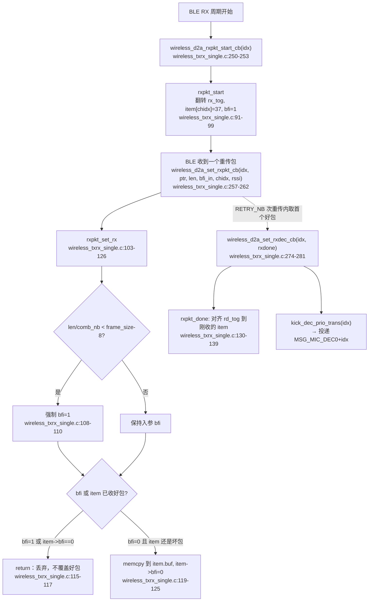
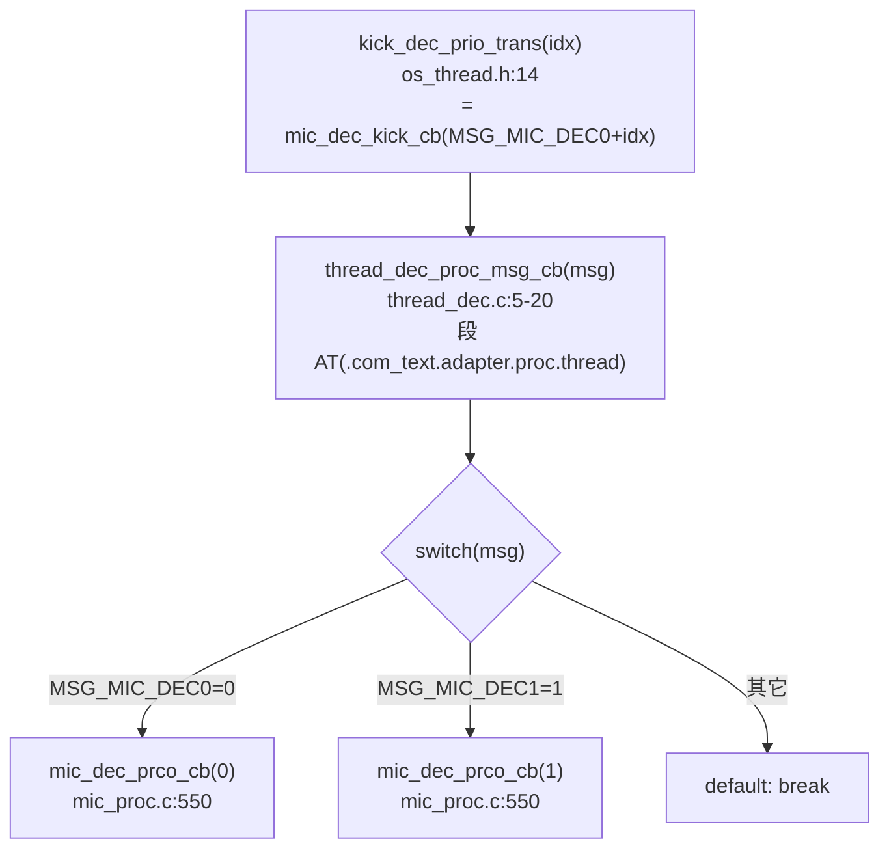
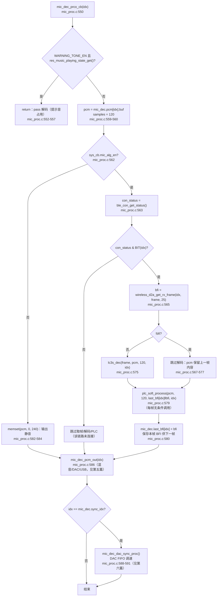
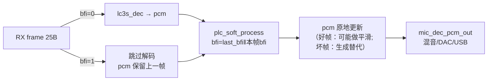

# AB5766 LE Mic 接收端 BFI 与 PLC 算法链

> **适用范围：** 当前 `CONFIG_AB5766_LE_MIC` 产品配置。本文档以可见 C 源码中的编译条件、调用关系和数据流为依据；不以文件名、宏名或日志文字单独推断功能，也不推断预编译库内部实现。
>
> **与其他文档的关系：** 本文专讲接收端的“坏帧指示（BFI）产生与使用”和“丢包隐藏（PLC）算法链”，是 [LC3S 编码解码与无线帧边界](AB5766_LE_Mic_LC3S编码解码与无线帧边界.md) 的下游专题。LC3S 解码、无线帧缓冲、`RETRY_NB` 一致性风险见第三篇；双链路混音与 Mix PACC 见第五篇；DAC 调速与输出观测见第六篇。

## 1. 适用配置与边界

| 项目 | 当前值 | 来源 |
| --- | --- | --- |
| 编解码 | `CODEC_LC3S`（解码见第三篇） | [config_ab5766_le_mic.h:64](../../projects/microphone/config_ab5766_le_mic.h#L64) |
| 最大链路数 | 2（PLC 按链路索引维护两套状态） | [config_ab5766_le_mic.h:76](../../projects/microphone/config_ab5766_le_mic.h#L76) |
| 每帧样点 | 120 | [config_ab5766_le_mic.h:78](../../projects/microphone/config_ab5766_le_mic.h#L78) |
| 压缩帧长 | 25 byte | [config_ab5766_le_mic.h:80](../../projects/microphone/config_ab5766_le_mic.h#L80) |
| 采样率 | `SAMPLE_RATE_48K`（=0） | [config_ab5766_le_mic.h:77](../../projects/microphone/config_ab5766_le_mic.h#L77) |
| 单包路径 | `WIRELESS_CON_COMB_BUF_EN=0` | [config_extra.h:122](../../projects/microphone/config_extra.h#L122) |
| 组合包数 | `COMB_NB=2` | [config_extra.h:131](../../projects/microphone/config_extra.h#L131) |
| 接收 USB Mic | `ADAPTER_USB_MIC_RX_EN=1`（影响 PLC pitch 范围） | [config_ab5766_le_mic.h:123](../../projects/microphone/config_ab5766_le_mic.h#L123) |
| PLC 状态通道数 | `CH_NUM=2` | [plc_soft.c:5](../../modules/voice/plc_soft.c#L5) |

**本文档可确认的事：** BFI 在 RX 缓冲层如何产生、`mic_dec.last_bfi[idx]` 如何跨帧传递、PLC 的初始化/逐帧/退出入口、PLC 状态按 `idx` 维护两套、PLC 参数宏在当前配置下实际选用的 pitch 搜索范围、PLC 逐帧无条件调用且 BFI 标志为“上一帧或本帧”。

**本文档不证明的事：** `plc_soft_process_do()` / `plc_soft_init_do()` / `plc_soft_exit_do()` 三个预编译函数的具体预测、插值、基音估计、LPC 系数计算、重叠相加（OLA）策略；PLC 在不同丢包模式下的听感质量；BFI 与空口实际 PER 的对应关系。这些都属预编译边界，见第 9 节。

## 2. 配置快照：PLC 参数宏在当前配置下的实际取值

PLC 的参数宏集中在 [plc_soft_api.h](../../modules/voice/plc_soft_api.h)。这些宏在编译期选定，且受两个条件影响，必须核对当前配置下实际走哪一支：

**条件 1：`ADAPTER_USB_MIC_RX_EN` 影响 pitch 搜索范围**

[plc_soft_api.h:13-21](../../modules/voice/plc_soft_api.h#L13-L21)：

```c
#if 1
//48k
#if !ADAPTER_USB_MIC_RX_EN
#define PITCH_MIN 160
#define PITCH_MAX 650
#else
#define PITCH_MIN 180
#define PITCH_MAX 460
#endif
```

当前 `ADAPTER_USB_MIC_RX_EN=1`（[config_ab5766_le_mic.h:123](../../projects/microphone/config_ab5766_le_mic.h#L123)），因此实际生效的是 `else` 分支 **`PITCH_MIN=180, PITCH_MAX=460`**，而非注释里 `160/650` 那一组。`PITCHDIFF = 460-180 = 280`（[plc_soft_api.h:23](../../modules/voice/plc_soft_api.h#L23)），`POVERLAPMAX = 460 >> PLC_OLA_WIN`。`PLC_OLA_WIN=2`（[plc_soft_api.h:5](../../modules/voice/plc_soft_api.h#L5)），故 `POVERLAPMAX=115`。`HISTORYLEN = 460*3 + 120 = 1500`（[plc_soft_api.h:25](../../modules/voice/plc_soft_api.h#L25)）。

> **关键提醒：** 若后续把 `ADAPTER_USB_MIC_RX_EN` 改为 0，PLC 的 pitch 搜索范围会从 `180~460` 切到 `160~650`，`HISTORYLEN`、`CORRBUFLEN`、`pitchbuf` 大小全部变化，`plc_proc_t` 结构尺寸变化。这是 `ADAPTER_USB_MIC_RX_EN` 的隐藏耦合，改动它不是只影响 USB 输出。

**条件 2：`plc_soft_init` 内按 `sample_rate` 选参数组**

[plc_soft.c:19-53](../../modules/voice/plc_soft.c#L19-L53) 的 `plc_soft_init(u8 idx, uint pkt_len, u8 sample_rate)`：

```c
if (sample_rate >= SAMPLE_RATE_16K) {
    st->pitch_min   = PITCH_MIN_8K;        // 50
    st->pitch_max   = PITCH_MAX_8K;        // 180
    ...                                   // 全部 _8K 后缀宏
} else {
    st->pitch_min   = PITCH_MIN;           // 180（当前）
    st->pitch_max   = PITCH_MAX;           // 460（当前）
    ...                                   // 无后缀宏
}
```

`sampling_rate` 编码见 [plc_soft_api.h:86-91](../../modules/voice/plc_soft_api.h#L86-L91)：`SAMPLE_RATE_48K=0, 32K=1, 24K=2, 16K=3, 12K=4, 8K=5`。**注意判断是 `sample_rate >= SAMPLE_RATE_16K`（即 `>=3`）**。当前传入 `WIRELESS_MIC_SAMPLE_RATE_SELECT = SAMPLE_RATE_48K = 0`（[mic_proc.c:84-85](../../modules/wireless/mic_proc.c#L84-L85)），`0 >= 3` 为假，走 `else` 分支，使用无后缀宏 `PITCH_MIN=180/PITCH_MAX=460`。

**结论：** 在当前配置（48K + USB Mic 开启）下，PLC 两条链路都用同一组参数：`pitch_min=180, pitch_max=460, pitchdiff=280, historylen=1500`。`plc_soft_api.h` 中带 `_8K` 后缀的那组宏（`PITCH_MIN_8K=50` 等）在当前配置下**不被选中**，仅在 `sample_rate` 传入 `≥16K` 编码值时才用。本文档不臆测这一 `>=` 判断的语义是否与命名一致，只如实记录当前实际走哪支。

| PLC 参数（当前配置下） | 宏来源 | 当前实际值 | 来源 |
| --- | --- | --- | --- |
| `PITCH_MIN` | 无后缀 | 180 | [plc_soft_api.h:20](../../modules/voice/plc_soft_api.h#L20) |
| `PITCH_MAX` | 无后缀 | 460 | [plc_soft_api.h:21](../../modules/voice/plc_soft_api.h#L21) |
| `PITCHDIFF` | `PITCH_MAX-PITCH_MIN` | 280 | [plc_soft_api.h:23](../../modules/voice/plc_soft_api.h#L23) |
| `PLC_OLA_WIN` | — | 2 | [plc_soft_api.h:5](../../modules/voice/plc_soft_api.h#L5) |
| `POVERLAPMAX` | `PITCH_MAX>>PLC_OLA_WIN` | 115 | [plc_soft_api.h:24](../../modules/voice/plc_soft_api.h#L24) |
| `HISTORYLEN` | `PITCH_MAX*3+FRAMESZ` | 1500 | [plc_soft_api.h:25](../../modules/voice/plc_soft_api.h#L25) |
| `FRAMESZ` | — | 120 | [plc_soft_api.h:6](../../modules/voice/plc_soft_api.h#L6) |
| `NDEC` | — | 4 | [plc_soft_api.h:26](../../modules/voice/plc_soft_api.h#L26) |
| `CORRLEN` | — | 280 | [plc_soft_api.h:27](../../modules/voice/plc_soft_api.h#L27) |
| `CORRBUFLEN` | `CORRLEN+PITCH_MAX` | 740 | [plc_soft_api.h:28](../../modules/voice/plc_soft_api.h#L28) |
| `CORRMINPOWER` | — | 250 | [plc_soft_api.h:29](../../modules/voice/plc_soft_api.h#L29) |
| `EOVERLAPINCR` | — | 64 | [plc_soft_api.h:30](../../modules/voice/plc_soft_api.h#L30) |
| `LPCO`（LPC 阶数） | — | 8 | [plc_soft_api.h:10](../../modules/voice/plc_soft_api.h#L10) |
| `OVERLALEN` | — | 52 | [plc_soft_api.h:82](../../modules/voice/plc_soft_api.h#L82) |

## 3. 实际调用链

### 3.1 BFI 产生：从 BLE RX 到 `bfi` 变量



BFI 在可见缓冲层有两个产生来源，二者都写入 `item->bfi`：

1. **入参 `bfi`**：由 BLE 协议栈在 `wireless_d2a_set_rxpkt_cb` 调用时传入（参数声明见 [wireless_txrx_single.c:257](../../modules/wireless/wireless_txrx_single.c#L257)）。该值由协议栈的 CRC/校验决定，**不可见**。
2. **长度判废**：[wireless_txrx_single.c:108-110](../../modules/wireless/wireless_txrx_single.c#L108-L110)，`len/comb_nb < (frame_size-8)` 时强制 `bfi=1`。当前即 `len/2 < 17` → `len < 34` 视为坏包。`-8` 的语义属协议栈约定，不臆测。

“好包不覆盖”语义见 [wireless_txrx_single.c:115](../../modules/wireless/wireless_txrx_single.c#L115)：`bfi || item->bfi==0` 时直接 return。即一旦某 item 已收正确包，后续重传包即使 BFI=0 也不再覆盖，保证解码读到首个好包。ping-pong 与覆盖语义详见第三篇第 7 节，本文不重复。

### 3.2 解码线程分派到 `mic_dec_prco_cb`



消息编号见 [os_thread.h:6-10](../../os/os_thread.h#L6-L10)：`MSG_MIC_DEC0=0, MSG_MIC_DEC1=1, MSG_MIC_AINS4_32K=2`。`kick_dec_prio_trans` 宏见 [os_thread.h:14](../../os/os_thread.h#L14)。触发点在 [wireless_txrx_single.c:280](../../modules/wireless/wireless_txrx_single.c#L280)，注释明确“dec 流程时间太长，放到线程处理，避免堵住 BLE 调度”。这是把耗时解码（含 PLC）移出 BLE ISR 的关键设计。

### 3.3 BFI 使用与 PLC：`mic_dec_prco_cb` 内部



**BFI 在本函数中的三个关键事实：**

| 事实 | 位置 | 含义 |
| --- | --- | --- |
| `bfi` 来自 `wireless_d2a_get_rx_frame` 返回值 | [mic_proc.c:565](../../modules/wireless/mic_proc.c#L565) → [wireless_txrx_single.c:266-270](../../modules/wireless/wireless_txrx_single.c#L266-L270) → [rxpkt_get_frame:143-157](../../modules/wireless/wireless_txrx_single.c#L143-L157) | BFI 是 RX 缓冲层的输出，不是解码层产生 |
| `!bfi` 才解码 | [mic_proc.c:567-577](../../modules/wireless/mic_proc.c#L567-L577) | 坏帧不解码，`pcm` 保留上一次内容 |
| PLC 传入 `last_bfi[idx]‖bfi` | [mic_proc.c:579](../../modules/wireless/mic_proc.c#L579) | 当前帧 BFI 与上一帧 BFI 的“或”，见第 6.2 |
| PLC 每帧无条件调用 | [mic_proc.c:579](../../modules/wireless/mic_proc.c#L579) | 在 `if(!bfi)` 块外，好帧与坏帧都进 PLC |
| `last_bfi[idx]` 保存本帧 BFI | [mic_proc.c:580](../../modules/wireless/mic_proc.c#L580) | 跨帧传递，下一帧 PLC 用 |

## 4. 初始化

PLC 初始化分两层：`adapter_alg_init` 对两条链路分别 `plc_soft_init`，由 `adapter_init` 调用；`plc_soft_init` 内部 memset 状态、按 `sample_rate` 选参数、调用预编译 `plc_soft_init_do`。

### 4.1 接收端算法初始化入口

`adapter_init()` 在 [mic_proc.c:700-734](../../modules/wireless/mic_proc.c#L700-L734)，第一步即 [mic_proc.c:703](../../modules/wireless/mic_proc.c#L703) 调用 `adapter_alg_init()`：

```c
void adapter_alg_init(void)
{
    plc_soft_init(0, WIRELESS_MIC_SAMPLES_SELECT, WIRELESS_MIC_SAMPLE_RATE_SELECT);
    plc_soft_init(1, WIRELESS_MIC_SAMPLES_SELECT, WIRELESS_MIC_SAMPLE_RATE_SELECT);
}
```

见 [mic_proc.c:82-86](../../modules/wireless/mic_proc.c#L82-L86)。即对 `idx=0` 和 `idx=1` 各调一次 `plc_soft_init`，参数为 `pkt_len=120, sample_rate=SAMPLE_RATE_48K(=0)`。`adapter_alg_init` 在 `memset(&mic_dec, 0, ...)`（[mic_proc.c:705](../../modules/wireless/mic_proc.c#L705)）**之前**调用，因此 PLC 状态先清零再被 `mic_dec` 整体清零——`mic_dec.last_bfi[idx]` 在 `memset` 后为 0，与 [mic_proc.c:696](../../modules/wireless/mic_proc.c#L696) `mic_dec_reset` 的清零语义一致。

### 4.2 `plc_soft_init` 内部

[plc_soft.c:18-53](../../modules/voice/plc_soft.c#L18-L53)，段属性 `AT(.text.plc_init)`：

1. [plc_soft.c:21-22](../../modules/voice/plc_soft.c#L21-L22)：`st = &m_st[idx]`，`memset(st, 0, sizeof(plc_proc_t))`。
2. [plc_soft.c:24-46](../../modules/voice/plc_soft.c#L24-L46)：按 `sample_rate >= SAMPLE_RATE_16K` 选参数组写入 `st`（当前走 `else`，见第 2 节）。
3. [plc_soft.c:48-50](../../modules/voice/plc_soft.c#L48-L50)：设置三个内部缓冲指针 `history_ptr/pitchbuf_ptr/lastq_ptr` 指向结构内 `history/pitchbuf/lastq` 数组。
4. [plc_soft.c:51](../../modules/voice/plc_soft.c#L51)：`framesz = pkt_len`（全局变量，供 `plc_soft_exit` 复用，见 [plc_soft.c:7](../../modules/voice/plc_soft.c#L7) 与 [plc_soft.c:63](../../modules/voice/plc_soft.c#L63)）。**注意 `framesz` 是单变量非数组**，两条链路 `plc_soft_init` 的第二次调用会覆盖第一次的值；当前两条链路 `pkt_len` 相同（都是 120），无冲突，但若未来两链路用不同 `pkt_len`，此处有隐患。
5. [plc_soft.c:52](../../modules/voice/plc_soft.c#L52)：`plc_soft_init_do(st, pkt_len)`（预编译，不可见）。

`m_st` 与段放置见 [plc_soft.c:6](../../modules/voice/plc_soft.c#L6)：`static plc_proc_t m_st[CH_NUM] AT(.buf.plc_buf)`，即 `m_st[2]` 在 `.buf.plc_buf` 段。`plc_proc_t` 结构定义见 [plc_soft_api.h:93-133](../../modules/voice/plc_soft_api.h#L93-L133)，含 `history[HISTORYLEN+FRAMESZ+OVERLALEN]`、`pitchbuf[HISTORYLEN]`、`lastq[POVERLAPMAX]` 等大数组，尺寸随 pitch 参数宏变化。

## 5. 逐帧处理

PLC 的逐帧入口是 `plc_soft_process`，由 `mic_dec_prco_cb` 在每帧（无论 BFI 与否）调用。

### 5.1 `plc_soft_process` 包装层

[plc_soft.c:10-16](../../modules/voice/plc_soft.c#L10-L16)，段属性 `AT(.text.plc_proc.pro)`：

```c
void plc_soft_process(s16 *int_data, u32 samples, u8 bfi, u8 idx) // samples需要被FRMESIZE匹配
{
    plc_proc_t *st = &m_st[idx];
    plc_soft_process_do(int_data, samples, bfi, st);
}
```

- `int_data` 即 `mic_dec.pcm[idx].buf`（[mic_proc.c:559](../../modules/wireless/mic_proc.c#L559)），PLC **原地处理**该缓冲。
- `samples = 120`。
- `bfi = mic_dec.last_bfi[idx] || bfi`（[mic_proc.c:579](../../modules/wireless/mic_proc.c#L579) 传入的实参），即“上一帧 BFI 或本帧 BFI”。
- `idx` 选择 `m_st[idx]`，按链路独立状态。
- 注释“samples 需要被 FRMESIZE 匹配”对应 [plc_soft_api.h:6](../../modules/voice/plc_soft_api.h#L6) `FRAMESZ=120`，当前 `samples=120` 一致。

包装层只做“按 idx 选状态 + 调预编译核心”，不含任何算法逻辑。真正的预测/插值/OLA 在 `plc_soft_process_do`（预编译，原型 [plc_soft_api.h:137](../../modules/voice/plc_soft_api.h#L137)）。

### 5.2 BFI 的三种组合与 PLC 行为

PLC 每帧都调用，但传入的 `bfi`（实参 `last_bfi[idx]‖bfi`）有三种典型组合，影响预编译核心的处理路径（核心如何分支不可见，但可见层的 BFI 语义可确认）：

| `last_bfi[idx]` | 本帧 `bfi` | PLC 入参 `bfi` | 解码是否执行 | `pcm` 进入 PLC 时的内容 |
| --- | --- | --- | --- | --- |
| 0 | 0 | 0 | 是（[mic_proc.c:575](../../modules/wireless/mic_proc.c#L575)） | 本帧解码 PCM |
| 0 | 1 | 1 | 否 | 上一帧解码 PCM（未覆盖） |
| 1 | 0 | 1 | 是 | 本帧解码 PCM，但上一帧是坏帧 |
| 1 | 1 | 1 | 否 | 上一帧解码 PCM（连续丢包） |

**“上一帧 BFI”参与 PLC 入参的意义（可见层可确认）：** PLC 不仅看本帧是否丢包，还看上一帧是否丢包。连续丢包（`last_bfi=1, bfi=1`）与单帧丢包（`last_bfi=0, bfi=1`）传入 PLC 的 `bfi` 都是 1，但预编译核心内部可能用 `st->erasecnt`（[plc_soft_api.h:95](../../modules/voice/plc_soft_api.h#L95) `u16 erasecnt; /* consecutive erased frames */`）累计连续丢包数以做衰减——这一行为属预编译边界，不可从可见源码确认具体衰减策略，只能确认结构里**存在** `erasecnt` 字段且注释为“连续丢帧计数”。

### 5.3 门禁关闭时的静音路径

当 `sys_cb.mic_alg_en=0`（见第一篇第 6 节门禁），[mic_proc.c:582-584](../../modules/wireless/mic_proc.c#L582-L584) 直接 `memset(pcm, 0, samples*2)`，**不取帧、不解码、不调 PLC**。随后仍调 `mic_dec_pcm_out`（[mic_proc.c:586](../../modules/wireless/mic_proc.c#L586)）输出静音。注意此时 `mic_dec.last_bfi[idx]` 不会被更新（门禁分支不执行 [mic_proc.c:580](../../modules/wireless/mic_proc.c#L580)），保留旧值。门禁重新打开后第一帧的 `last_bfi` 是历史值，需结合连接复位理解。

## 6. 算法原理

### 6.1 PLC 在音频流水线中的位置与职责

PLC（Packet Loss Concealment，丢包隐藏）位于 LC3S 解码**之后**、混音/输出**之前**，职责是在 BFI=1（坏帧/丢帧）时用历史信号生成替代帧，避免静音割裂。可见层能确认的位置关系：



**“原地处理”含义：** `plc_soft_process` 的 `int_data` 既是输入也是输出（同一 `pcm` 缓冲）。好帧时核心可能做前后帧平滑（如 OLA 重叠相加），坏帧时核心用 `st->history` 生成替代样本写回 `int_data`。具体写回策略不可见。

### 6.2 BFI 双帧语义：为什么传 `last_bfi‖bfi`

[mic_proc.c:579](../../modules/wireless/mic_proc.c#L579) 传入 `mic_dec.last_bfi[idx] || bfi` 而非仅 `bfi`。可见层可确认的语义：**PLC 需要知道“上一帧是否也是坏帧”以区分单帧丢包与连续丢包**。结合 `plc_proc_t.erasecnt`（连续丢帧计数）字段，可推断核心用 `bfi` 输入累计 `erasecnt` 并据此调整衰减/插值强度——但累计规则与衰减曲线属预编译边界，不臆测。

`last_bfi[idx]` 在 [mic_proc.c:580](../../modules/wireless/mic_proc.c#L580) 于 PLC 调用**之后**更新为本帧 `bfi`，因此 PLC 拿到的是“严格的上一帧 BFI”，时序正确。

### 6.3 预编译核心涉及的算法组件（仅从结构/宏推断存在，不臆测实现）

从 `plc_proc_t` 结构字段与参数宏可确认 PLC 核心**涉及**以下组件（存在性确认，非实现确认）：

| 组件 | 结构/宏证据 | 含义（命名推断，非实现确认） |
| --- | --- | --- |
| 基音估计 | `pitch`, `pitchbuf`, `PITCH_MIN/MAX`, `CORRLEN/CORRBUFLEN`, `corrminpower` | 在历史信号中做相关找基音周期 |
| LPC（线性预测） | `LPCO=8`, `al[LPCO+1]`, `stsyml[LPCO]`, `rl[1+LPCO]`, `HAMWINDLEN` | 8 阶 LPC 系数估计与合成 |
| 重叠相加 OLA | `PLC_OLA_WIN=2`, `POVERLAPMAX`, `poverlap`, `poffset`, `EOVERLAPINCR` | 帧间平滑过渡 |
| 历史缓冲 | `history[HISTORYLEN+FRAMESZ+OVERLALEN]`, `pitchbuf[HISTORYLEN]`, `lastq[POVERLAPMAX]` | 保存历史样本供预测/插值 |
| 连续丢帧衰减 | `erasecnt`, `ATTENFAC_DIVIDER=5`, `ATTENINCR=1` | 连续丢包时逐步衰减增益 |
| 抽选 | `NDEC=4` | 相关计算前 2:1 抽选降采样 |

**边界纪律：** 上表只确认这些组件“在结构或宏中存在”，不能据此写出 PLC 的具体预测公式、基音搜索算法、LPC 求解方法、OLA 权重或衰减曲线。任何此类描述都必须标注为预编译边界或需 E3 仪器验证。

## 7. 缓冲区与输入输出

| 缓冲区 | 大小（当前配置） | 角色 | 段属性 |
| --- | --- | --- | --- |
| `mic_dec.pcm[idx].buf` | 240 B（120×1×2） | LC3S 解码输出 / PLC 原地输入输出 | `.buf.adapter.proc`（[mic_proc.c:49-50](../../modules/wireless/mic_proc.c#L49-L50)） |
| `mic_dec.frame` | 25 B | RX 取帧缓冲（PLC 不直接读） | `.buf.adapter.proc` |
| `mic_dec.last_bfi[idx]` | 2×1 B | 跨帧 BFI 状态 | `.buf.adapter.proc` |
| `m_st[idx].history` | 1668 B（1500+120+52） | PLC 历史样本 | `.buf.plc_buf`（[plc_soft.c:6](../../modules/voice/plc_soft.c#L6)） |
| `m_st[idx].pitchbuf` | 1500 B | PLC 基音缓冲 | `.buf.plc_buf` |
| `m_st[idx].lastq` | 115 B（POVERLAPMAX） | 保存最后四分之一波长 | `.buf.plc_buf` |

PLC 输入输出关系：`int_data`（即 `pcm[idx].buf`）既是输入也是输出；`m_st[idx]` 的 history/pitchbuf/lastq 是 PLC 的内部状态，跨帧累积。PLC 不直接读 `mic_dec.frame`（25B 压缩帧），只处理解码后的 PCM。

**复位语义：**

| 复位点 | 位置 | 对 PLC 的影响 |
| --- | --- | --- |
| `mic_dec_reset(idx)` | [mic_proc.c:694-698](../../modules/wireless/mic_proc.c#L694-L698) | 清 `last_bfi[idx]=0` 与 `pcm[idx].buf`；**不清 PLC `m_st[idx]`** |
| `adapter_reset(idx, con_sta)` | [mic_proc.c:736-750](../../modules/wireless/mic_proc.c#L736-L750) | 调 `plc_soft_exit(idx)`（见第 8 节）真正复位 PLC 状态 |
| `plc_soft_init` 的 memset | [plc_soft.c:22](../../modules/voice/plc_soft.c#L22) | 初始化时清零整个 `plc_proc_t` |

注意 `mic_dec_reset` 只清 `mic_dec` 侧状态，不重置 PLC 内部 `m_st`。PLC 的真正复位靠 `plc_soft_exit` → `plc_soft_init_do`（见第 8 节）。若只调 `mic_dec_reset` 不调 `plc_soft_exit`，PLC 的 history/pitchbuf/erasecnt 会保留旧值——但当前 `adapter_reset` 两者都调（[mic_proc.c:739-740](../../modules/wireless/mic_proc.c#L739-L740)），无此问题。

## 8. 可见源码与预编译边界

| 层 | 可见 | 预编译（不可见） |
| --- | --- | --- |
| PLC 状态结构与参数宏 | `plc_proc_t`（[plc_soft_api.h:93-133](../../modules/voice/plc_soft_api.h#L93-L133)）、全部 pitch/LPC/OLA 宏 | — |
| PLC 初始化包装 | `plc_soft_init`（[plc_soft.c:18-53](../../modules/voice/plc_soft.c#L18-L53)）：memset、选参数、设指针 | `plc_soft_init_do(st, pkt_len)`（[plc_soft_api.h:136](../../modules/voice/plc_soft_api.h#L136)） |
| PLC 逐帧包装 | `plc_soft_process`（[plc_soft.c:10-16](../../modules/voice/plc_soft.c#L10-L16)）：按 idx 选状态 | `plc_soft_process_do(int_data, samples, bfi, st)`（[plc_soft_api.h:137](../../modules/voice/plc_soft_api.h#L137)） |
| PLC 退出包装 | `plc_soft_exit`（[plc_soft.c:55-64](../../modules/voice/plc_soft.c#L55-L64)）：enable=false、delay_5ms(2)、再 init_do 复位 | `plc_soft_init_do`（复用）、`plc_soft_exit_do`（[plc_soft_api.h:138](../../modules/voice/plc_soft_api.h#L138) 声明，但 `plc_soft_exit` 未调用它） |
| BFI 产生（入参） | `wireless_d2a_set_rxpkt_cb` 的 `bfi` 形参 | BLE 协议栈如何判定该 `bfi`（CRC/校验） |
| BFI 产生（长度判废） | [wireless_txrx_single.c:108-110](../../modules/wireless/wireless_txrx_single.c#L108-L110) | `frame_size-8` 的 `-8` 语义 |
| BFI 使用 | `mic_dec_prco_cb` 的 `!bfi` 解码门、`last_bfi‖bfi` PLC 入参 | — |
| BLE 实际 PER/重传统计 | 回调时序可见 | 空口实际丢包率、重传合并增益 |

**`plc_soft_exit` 的细节（[plc_soft.c:55-64](../../modules/voice/plc_soft.c#L55-L64)）：**

```c
void plc_soft_exit(u8 idx)
{
    plc_proc_t *st = &m_st[idx];
    st->enable = false;
    delay_5ms(2);       //delay要大于一帧的时间，确保disable时最后一帧已经处理完
    plc_soft_init_do(st, framesz);
}
```

可见层可确认：退出时置 `enable=false`、`delay_5ms(2)`（约 10ms，大于 120 样点 @48K 的 2.5ms 帧时长）、再用 `plc_soft_init_do(st, framesz)` 复位核心状态。注释说明延迟目的是“确保 disable 时最后一帧已处理完”。**`plc_soft_exit_do`（[plc_soft_api.h:138](../../modules/voice/plc_soft_api.h#L138)）已声明但 `plc_soft_exit` 未调用它**——退出靠 `enable=false` + `init_do` 复位，而非 `exit_do`。这一不对称属可见事实，不臆测原因。

## 9. 当前可达性

| 结论 | 证据等级 | 可达性 |
| --- | --- | --- |
| PLC 按链路 idx 维护两套状态（`m_st[2]`） | E1 | ✅ 源码可直接确认 |
| PLC 每帧无条件调用，BFI 入参为 `last_bfi‖bfi` | E1 | ✅ [mic_proc.c:579](../../modules/wireless/mic_proc.c#L579) 可直接确认 |
| `!bfi` 才解码，坏帧保留上一帧 PCM | E1 | ✅ [mic_proc.c:567-577](../../modules/wireless/mic_proc.c#L567-L577) 可直接确认 |
| 当前配置 PLC 用 `PITCH_MIN=180/PITCH_MAX=460`（USB Mic 开 + 48K） | E0 | ✅ 宏条件 + 配置可确认 |
| PLC 核心预测/插值/OLA 策略 | E3/预编译 | ❌ 不可从源码确认，需仪器或库文档 |
| BFI 与空口 PER 的定量对应 | E2/E3 | ⚠️ 需协议栈符号 + PER/重传统计 |
| PLC 在连续丢包下的衰减听感达标 | E3 | ⚠️ 需双板可控丢包测试 |
| `plc_soft_exit` 不调 `exit_do` 而用 `init_do` 复位是有意设计 | E1/E3 | ⚠️ 可见事实，意图需库方确认 |

## 10. 测试与失败定位

### 10.1 PLC 专属固定检查项

在通用门禁（第一篇第 10 节）之外，PLC 测试额外冻结：

1. `ADAPTER_USB_MIC_RX_EN` 当前值（影响 pitch 范围），见 [config_ab5766_le_mic.h:123](../../projects/microphone/config_ab5766_le_mic.h#L123)；
2. `WIRELESS_MIC_SAMPLE_RATE_SELECT` 当前值（影响 `plc_soft_init` 参数组选择）；
3. 当次 `map.txt` 中 `plc_soft_process`/`plc_soft_init`/`plc_soft_exit` 与 `plc_soft_process_do`/`plc_soft_init_do` 的实际链接记录；
4. `m_st` 所在 `.buf.plc_buf` 段尺寸（随 pitch 参数宏变化）；
5. 若涉及丢包结论，必须有 PER、RSSI、BFI/重传统计的原始日志，不能只凭听感。

### 10.2 BFI/PLC 异常的分层定位

```text
接收 frame/BFI 是否正常?
   ├─ BFI 全 0（无丢包）但音频异常 → 不是 PLC 问题，查 LC3S 解码（第三篇）/混音（第五篇）/DAC（第六篇）
   ├─ BFI 频繁为 1 → 无线链路/重传问题（见第三篇 6.3 RETRY_NB 风险）
   ↓ BFI 偶发为 1（正常丢包范围）
PLC 后 PCM 是否平滑无割裂?
   ├─ 是 → PLC 工作正常
   ├─ 否：单帧丢包有割裂 → PLC 平滑策略（预编译边界，需仪器）
   ├─ 否：连续丢包后爆音/能量上升 → erasecnt 衰减策略（预编译边界）
   └─ 否：连接瞬态/复位后异常 → 查 plc_soft_init/exit 时序、last_bfi 残留
```

**不要把接收端音频异常直接归因于 PLC**。先用 BFI 统计划分“无丢包/正常丢包/异常丢包”：
- 无丢包（BFI 全 0）却异常 → 在 PLC 之前或之后查，不在 PLC；
- 正常丢包范围且 PLC 后平滑 → PLC 正常；
- 异常丢包（BFI 持续高频为 1）→ 先查无线链路与 `RETRY_NB`（第三篇 6.3），不是 PLC 责任；
- PLC 后割裂/爆音 → 才进入 PLC 预编译边界排查。

### 10.3 可控丢包测试要求

测试 PLC 必须制造**可控、合规**的丢包，不能用干扰器无差别轰炸：

1. 先取得无丢包基线（BFI 全 0 时的接收 DAC/USB 记录）；
2. 用合规的 RF 衰减/距离/遮挡制造**短时**压力，使 BFI 在 0/1 间随机翻转（单帧丢包）；
3. 再制造**短时连续**丢包（2~4 帧），观察 PLC 衰减与恢复；
4. 记录每次的 PER、RSSI、BFI 序列、接收音频波形；
5. 没有原始 BFI/PER 证据时，只能称为“压力观察”，不能写成“PLC 覆盖率/隐藏率”；
6. 一次只改一个变量（距离/遮挡/重传），绝不同时改 codec、帧长、`RETRY_NB`、effect 资源。

### 10.4 复位时序检查

连接断开时 `adapter_reset` 会调 `plc_soft_exit`（[mic_proc.c:740](../../modules/wireless/mic_proc.c#L740)），含 `delay_5ms(2)`。重新连接时 `adapter_init` → `adapter_alg_init` → `plc_soft_init`。若出现“重连后前几帧异常”，检查：
- `plc_soft_exit` 的 `delay_5ms(2)` 是否被中断/抢占打断；
- `mic_dec.last_bfi[idx]` 是否在 `memset(&mic_dec, 0, ...)`（[mic_proc.c:705](../../modules/wireless/mic_proc.c#L705)）后为 0（应为 0）；
- `m_st[idx]` 是否被 `plc_soft_init` 的 memset 真正清零（`plc_soft_exit` 用 `init_do` 复位核心，但 `plc_soft_init` 才 memset 整个结构）。

## 11. 引用表

| 引用 | 位置 | 作用 |
| --- | --- | --- |
| PLC 包装层源码 | [plc_soft.c:1-65](../../modules/voice/plc_soft.c#L1-L65) | `plc_soft_process/init/exit` |
| PLC 结构与参数宏 | [plc_soft_api.h:1-140](../../modules/voice/plc_soft_api.h#L1-L140) | `plc_proc_t`、pitch/LPC/OLA 宏、预编译核心原型 |
| 接收端逐帧处理 | [mic_proc.c:549-594](../../modules/wireless/mic_proc.c#L549-L594) | `mic_dec_prco_cb` BFI 使用与 PLC 调用 |
| 接收端算法初始化 | [mic_proc.c:82-86](../../modules/wireless/mic_proc.c#L82-L86) | `adapter_alg_init` 对 idx 0/1 调 `plc_soft_init` |
| 接收端初始化 | [mic_proc.c:700-734](../../modules/wireless/mic_proc.c#L700-L734) | `adapter_init` 调 `adapter_alg_init` |
| `mic_dec_reset` | [mic_proc.c:694-698](../../modules/wireless/mic_proc.c#L694-L698) | 清 `last_bfi`/`pcm`（不清 PLC） |
| 接收端复位 | [mic_proc.c:736-750](../../modules/wireless/mic_proc.c#L736-L750) | `adapter_reset` 调 `plc_soft_exit` |
| 解码状态结构 | [mic_proc.c:29-50](../../modules/wireless/mic_proc.c#L29-L50) | `mic_dec_t` 含 `last_bfi[2]`、`pcm[2]` |
| BFI 产生（RX 缓冲） | [wireless_txrx_single.c:103-126](../../modules/wireless/wireless_txrx_single.c#L103-L126) | `rxpkt_set_rx` 长度判废与好包不覆盖 |
| BFI 读取 | [wireless_txrx_single.c:143-157](../../modules/wireless/wireless_txrx_single.c#L143-L157) | `rxpkt_get_frame` 返回 bfi |
| RX 回调集 | [wireless_txrx_single.c:250-281](../../modules/wireless/wireless_txrx_single.c#L250-L281) | `wireless_d2a_rxpkt_start/set_rxpkt/set_rxdec_cb` |
| 取帧接口 | [wireless_txrx_single.c:266-270](../../modules/wireless/wireless_txrx_single.c#L266-L270) | `wireless_d2a_get_rx_frame` |
| 解码线程分派 | [thread_dec.c:5-20](../../os/thread_dec.c#L5-L20) | `thread_dec_proc_msg_cb` |
| 消息编号与 kick 宏 | [os_thread.h:6-14](../../os/os_thread.h#L6-L14) | `MSG_MIC_DEC0/1`、`kick_dec_prio_trans` |
| 影响 pitch 范围的开关 | [config_ab5766_le_mic.h:123](../../projects/microphone/config_ab5766_le_mic.h#L123) | `ADAPTER_USB_MIC_RX_EN=1` |
| 采样率选择 | [config_ab5766_le_mic.h:77](../../projects/microphone/config_ab5766_le_mic.h#L77) | `SAMPLE_RATE_48K` |
| 链路数 | [config_ab5766_le_mic.h:76](../../projects/microphone/config_ab5766_le_mic.h#L76) | `WIRELESS_CON_LINK_NB=2` |

## 12. 相邻文档导航

- 上一篇：[AB5766_LE_Mic_LC3S编码解码与无线帧边界.md](AB5766_LE_Mic_LC3S编码解码与无线帧边界.md)
- 下一篇：[AB5766_LE_Mic_双链路混音与Mix_PACC.md](AB5766_LE_Mic_双链路混音与Mix_PACC.md)
- 总览：[AB5766_LE_Mic_音频算法调用链与测试快速入门.md](AB5766_LE_Mic_音频算法调用链与测试快速入门.md)
