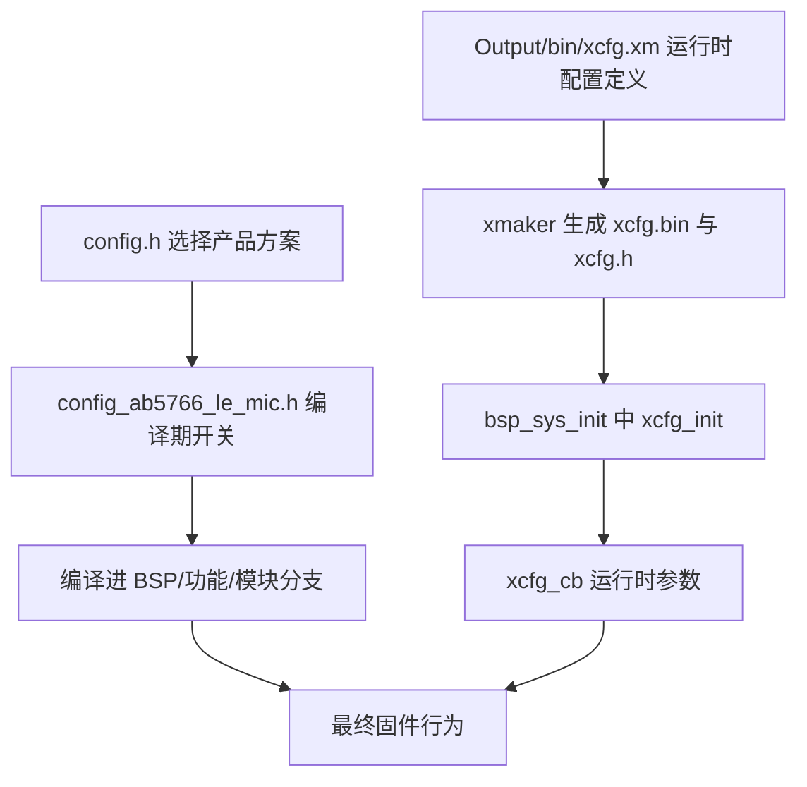
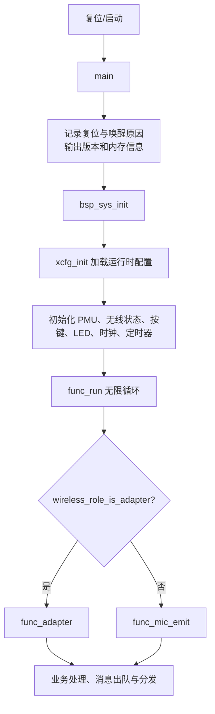
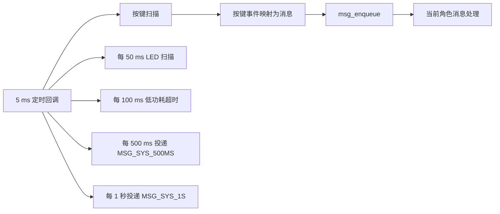
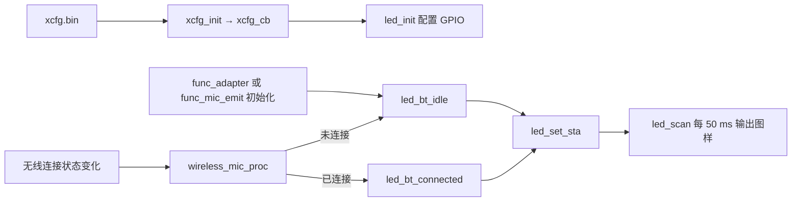
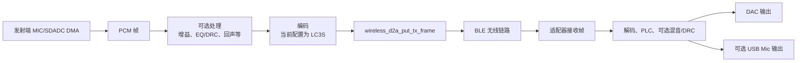
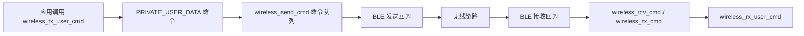

# AB5766 LE Mic SDK 新手开发指南

> 本文以仓库当前的 `projects/microphone` 示例为准，帮助新手理解代码、配置和调试入口。它补充 [SDK开发指南.pdf](SDK开发指南.pdf)，但不替代厂商的硬件资料。

## 1. 先建立正确的认识

本项目是 AB5766 RISC-V 无线麦克风/适配器固件。同一套应用代码可在运行时作为：

- **麦克风发射端（MIC Emit）**：采集麦克风音频，编码并发送到无线适配器。
- **适配器接收端（Adapter）**：接收、解码或混音无线音频，并输出到 DAC 或已启用的 USB Mic。

项目包含可修改的应用、BSP、驱动和模块代码，也依赖 `libs/` 中的预编译平台和蓝牙协议栈库。因此，阅读和修改时要优先从应用层向下追踪，不应假设预编译库内部可直接修改。

当前选择的产品方案是 `CONFIG_AB5766_LE_MIC`，定义在 [../../projects/microphone/config.h](../../projects/microphone/config.h)。当前配置中 LED 与 ADC 按键开启，IO 按键关闭：

```c
#define BSP_ADKEY_EN  1
#define BSP_IOKEY_EN  0
#define BSP_LED_EN    1
#define BSP_DLED_EN   0
```

这些开关位于 [../../projects/microphone/config_ab5766_le_mic.h](../../projects/microphone/config_ab5766_le_mic.h)。

## 2. 目录导航：先知道代码放在哪里

| 目录/文件 | 作用 | 新手优先关注点 |
| --- | --- | --- |
| `projects/microphone/` | Code::Blocks 工程、产品配置、入口、链接脚本 | `app.cbp`、`main.c`、`config.h`、`config_ab5766_le_mic.h` |
| `header/` | 公共类型、宏和聚合头文件 | 从 `include.h` 了解包含顺序 |
| `driver/` | GPIO、时钟、ADC、UART、定时器等寄存器级驱动 | 通常不作为业务功能的第一修改点 |
| `bsp/` | 板级组合逻辑 | 系统初始化、LED、按键、音频 I/O、参数 |
| `functions/` | 顶层状态机、用户消息和角色逻辑 | `func.c`、`func_mic_emit.c`、`func_adapter.c` |
| `modules/wireless/` | 无线角色、音频帧、命令、链路诊断 | 无线连接、音频传输、私有数据命令 |
| `modules/audio/`、`modules/voice/` | 音频处理与语音算法 | EQ/DRC、增益、回声、混响等功能 |
| `libs/` | 预编译平台、C 运行时和蓝牙库 | 通过公开头文件调用，不直接修改库文件 |
| `projects/microphone/Output/` | 配置源、资源、构建与打包产物 | 包含生成文件，不能一律视作手写源代码 |
| `docs/` | SDK 资料、计划和本指南 | 阅读和测试记录的入口 |

`header/include.h` 是应用常用的聚合头文件。它先包含全局定义、生成配置 `xcfg.h` 和产品配置 `config.h`，再包含 SDK API、BSP、功能层、驱动层和模块层。大多数应用源文件从它开始包含。

## 3. 构建、打包与烧录边界

### 3.1 已由工程验证的构建方式

构建入口是 [../../projects/microphone/app.cbp](../../projects/microphone/app.cbp)。该 Code::Blocks 工程只有 `Debug` 目标，并配置使用 `riscv32-v3` 编译器。

在已配置厂商工具链的 Windows 环境中：

1. 打开 `projects/microphone/app.cbp`。
2. 选择并构建 `Debug` 目标。
3. 查看 `projects/microphone/Output/bin/` 中的产物。

工程使用的关键工具包括：

- `riscv32-v3` 编译器；
- `riscv32-elf-xmaker`，用于生成资源和运行时配置；
- `riscv32-elf-objcopy`，用于转换固件二进制。

构建前脚本 [../../projects/microphone/Output/bin/prebuild.bat](../../projects/microphone/Output/bin/prebuild.bat) 会处理 `res.xm` 与 `xcfg.xm`，并复制生成的 `effect.c`、`effect.h`。构建后脚本 [../../projects/microphone/Output/bin/postbuild.bat](../../projects/microphone/Output/bin/postbuild.bat) 会生成和打包固件。

常见输出包括：

- `app.rv32`：链接后的目标；
- `app.bin`：二进制固件；
- `app.dcf`：打包后的下载输入；
- `download.xm`：下载相关打包描述；
- `map.txt`：链接映射，可用于排查空间问题。

### 3.2 关于烧录

后构建脚本仅在本机存在 `C:\upload\upload.bat` 时，才尝试执行：

```bat
C:\upload\upload.bat -D AB5766 app.dcf
```

这只能说明脚本预期以 `app.dcf` 作为 AB5766 的上传输入。仓库没有提供下载器型号、接线、进入下载模式、厂商上传工具安装或命令参数说明；这些步骤必须向板卡或 SDK 提供方确认，不能凭本文推断。

## 4. 三层配置模型

许多新手问题来自混淆“编译期配置”和“运行时配置”。本项目至少有三层：



图中左侧决定哪些代码被编译，右侧决定同一固件镜像运行时使用的设备参数。

### 4.1 产品方案选择

[../../projects/microphone/config.h](../../projects/microphone/config.h) 的 `USER_CONFIG` 决定包含哪个 `config_*.h`。当前值为 `CONFIG_AB5766_LE_MIC`。

### 4.2 编译期开关

[../../projects/microphone/config_ab5766_le_mic.h](../../projects/microphone/config_ab5766_le_mic.h) 定义系统时钟、Flash、外设、无线协议、音频算法、USB 功能和按键行为等。例如：

- `WIRELESS_CON_CODEC_SEL`：当前无线编解码器选择；
- `WIRELESS_MIC_SAMPLE_RATE_SELECT`：当前采样率；
- `BSP_LED_EN`、`BSP_ADKEY_EN`：是否编译 LED、ADC 按键路径；
- `ADAPTER_DAC_OUTPUT_EN`、`ADAPTER_USB_MIC_RX_EN`：适配器输出能力；
- `SW_VERSION`：软件版本字符串。

修改无线帧长、传输周期、编解码和算法开关前，应同时阅读 [../../projects/microphone/config_extra.h](../../projects/microphone/config_extra.h) 中的派生宏和约束，避免只改一个宏导致配置不一致。

### 4.3 运行时 `xcfg` 参数

[../../projects/microphone/Output/bin/xcfg.xm](../../projects/microphone/Output/bin/xcfg.xm) 是配置定义输入。`xmaker` 生成 `xcfg.bin` 和 `xcfg.h`；启动时 [../../bsp/bsp_sys.c](../../bsp/bsp_sys.c) 调用：

```c
xcfg_init(&xcfg_cb, sizeof(xcfg_cb));
```

运行时参数存入 `xcfg_cb`，包括角色、蓝牙名称/地址、RF 功率、MIC 增益、按键时间、LED GPIO 和 LED 闪烁参数等。

> `projects/microphone/xcfg.h` 是生成文件，不应手工修改。应修改配置源并使用既有生成流程。

无线角色也是运行时决定的：适配器标志打开时进入适配器角色；否则发射端标志打开时进入发射端；两者都未开时，代码默认走发射端逻辑。

## 5. 从启动到角色循环：第一条阅读路径

建议首次阅读按以下顺序进行：

1. [../../projects/microphone/main.c](../../projects/microphone/main.c)
2. [../../bsp/bsp_sys.c](../../bsp/bsp_sys.c)
3. [../../functions/func.c](../../functions/func.c)
4. [../../functions/func_mic_emit.c](../../functions/func_mic_emit.c) 与 [../../functions/func_adapter.c](../../functions/func_adapter.c)
5. [../../modules/wireless/wireless.c](../../modules/wireless/wireless.c) 与 `wireless_proc.c`



文字解读：`main()` 不负责具体业务。它完成诊断输出后调用 `bsp_sys_init()`，再进入 `func_run()`。`func_run()` 根据运行时角色选择 `func_adapter()` 或 `func_mic_emit()`。两类角色循环都持续执行业务处理，并从消息队列取得按键和系统消息。

## 6. 定时任务、消息与角色

`bsp_sys_init()` 会启用用户定时回调。[../../bsp/bsp_sys.c](../../bsp/bsp_sys.c) 的 `usr_tmr5ms_thread_do()` 是理解周期任务的关键。



当前 `BSP_DLED_EN=0` 时，LED 在该 5 ms 回调中每 10 次调用一次 `led_scan()`，即以 50 ms 节拍更新。按键正常情况下每个 5 ms 周期执行扫描。上图也说明了一个重要原则：按键逻辑通常不是直接调用业务函数，而是先转换为消息，再由当前角色处理。

## 7. LED：从运行时配置到灯光状态

LED 代码位于 [../../bsp/bsp_led.c](../../bsp/bsp_led.c)。`bsp_sys_init()` 在 LED 功能开启时调用 `led_init()`。



- `led_init()` 根据 `xcfg_cb.bled_disp_en`、`xcfg_cb.rled_disp_en` 和 IO 选择配置 GPIO。
- 若蓝、红灯都启用且配置为同一 IO，代码会使用数字/模拟模式与电平复用一个 IO 驱动两灯。
- `led_bt_idle()` 与 `led_bt_connected()` 会选择“未连接/配对”和“已连接”的灯光状态；状态参数可来自 `xcfg_cb`，否则使用代码默认值。
- 默认图样中，配对状态是蓝灯亮 300 ms、灭 450 ms；已连接状态为蓝灯常亮。

`led_power_up()`、`led_power_down()` 和充电灯接口也存在，但不要仅因函数存在就假定当前产品自动调用或已经启用：当前配置中充电功能关闭，开关机灯接口也需要先确认实际调用点。

## 8. 按键：ADC 输入如何变成业务动作

当前方案启用 ADC 按键、关闭 IO 按键。按键逻辑主要位于 [../../bsp/bsp_key.c](../../bsp/bsp_key.c)、[../../bsp/bsp_saradc_key.c](../../bsp/bsp_saradc_key.c) 和 [../../projects/microphone/port/port_key.c](../../projects/microphone/port/port_key.c)。


`bsp_key_init()` 在当前配置下会调用 `bsp_adkey_init()`。`bsp_key_scan(0)` 先检查 IO 按键路径（当前被关闭），再从 ADC 结果取得键值，随后调用底层事件与多击处理，并通过已安装的消息表入队。

消息表由角色决定：`func_enter()` 调用 `key_set_msg_tbl()` 安装当前功能的表。当前发射端默认表位于 `port_key.c`，包括：

| 物理键 | 事件 | 默认消息/行为 |
| --- | --- | --- |
| PP | 短按 | `MSG_VOL_MUTE`，切换静音 |
| PP | 保持 | `MSG_PWR_HOLD`，进入公共电源保持处理 |
| K1 | 短按 | `MSG_VOL_UP` |
| K2 | 短按 | `MSG_VOL_DOWN` |
| K3 | 默认 | 无动作；特定编译开关下才有魔音/语音相关动作 |

适配器表当前大多数按键均为 `MSG_NO`，PP 保持用于电源保持逻辑。修改按键行为时，应一起检查“物理键/ADC 阈值 → 键 ID → 消息表 → 消息处理函数”这条完整链路，而不是只改其中一个表项。

## 9. 无线音频链路：从 MIC 到输出

当前主要无线音频逻辑分布在 [../../modules/wireless/mic_proc.c](../../modules/wireless/mic_proc.c)、`wireless_txrx_single.c` 和 `wireless_proc.c`。当前配置选择 LC3S、48 kHz、单声道；实际是否启用某个效果还受配置宏控制。



文字解读：无线调度启动发射端采样；SDADC DMA 回调将 PCM 帧交给编码处理；编码后调用 `wireless_d2a_put_tx_frame()` 放入无线发送缓冲。适配器侧接收帧后解码，错误场景可经过 PLC，再根据配置输出到 DAC 或 USB Mic。

连接成功时，无线处理逻辑会按照角色初始化 `mic_emit` 或 `adapter` 的音频相关部分；断开时会执行对应清理。因此，排查“无声音”时，先确认连接状态和音频初始化是否已发生，再检查采样、编码、帧传输、接收和输出。

已有 UART 输出可用于观察启动参数和连接状态。无线健康数据由 `WIRELESS_DUMP_EN` 控制，默认关闭。它可输出 PER、RSSI 等诊断信息，但应仅在后续获批的诊断构建中启用，不应在不了解影响时长期打开。

## 10. 私有用户数据链路：与音频通道不同

音频帧并不是唯一的无线数据。项目还存在私有用户命令通道：



- 发送入口在 [../../modules/wireless/wireless_cmd_api.c](../../modules/wireless/wireless_cmd_api.c) 的 `wireless_tx_user_cmd()`。
- 队列、发送回调、接收日志主要在 [../../modules/wireless/wireless_cmd.c](../../modules/wireless/wireless_cmd.c)。
- 命令 ID 和长度限制位于 `wireless_cmd.h`。
- 最终用户接收钩子在 [../../modules/wireless/wireless_proc.c](../../modules/wireless/wireless_proc.c) 的 `wireless_rx_user_cmd()`。

> 当前 `wireless_rx_user_cmd()` 没有实际的应用层用户载荷处理。因此，出现 `TX_CMDn`/`RX_CMDn` 日志只能说明命令传输与分发到达，不等于业务层已经消费数据。若未来需要端到端数据验证，应先定义并评审最小接收处理、数据格式和可观测输出。

## 11. 推荐的调试顺序

| 现象 | 首先检查 | 依据 |
| --- | --- | --- |
| 没有启动日志 | 当前构建是否启用调试 UART，以及硬件 UART 连接是否符合板级资料 | 当前方案定义了调试 UART；接线资料不在仓库 |
| LED 没有变化 | `BSP_LED_EN`、`xcfg_cb` 的 LED 启用/IO 选择、无线连接状态 | LED 状态由运行时配置和连接路径共同决定 |
| 按键无动作 | 当前是否为 ADC 按键、ADC 键值是否识别、消息表是否有映射、角色是否正确 | 当前 IO 按键关闭，按键先入消息队列 |
| 已连接但无声音 | 角色、连接状态、音频初始化、发射采样/编码、接收解码和 DAC/USB 输出开关 | 音频链路分为发射、传输、接收和输出 |
| 命令有发送但业务无反应 | `TX_CMDn`/`RX_CMDn` 日志及 `wireless_rx_user_cmd()` | 当前接收钩子没有业务处理 |

## 12. 第一次改动前检查表

1. 确认当前选中的产品方案和活动配置头文件。
2. 找到功能对应的编译期开关，并搜索受该开关控制的 `#if` 分支。
3. 判断修改的是编译期配置，还是应通过 `xcfg.xm` 生成运行时参数。
4. 不要手改生成的 `xcfg.h`、`xcfg.bin`、资源输出或构建中间文件。
5. 保留源码中的 `AT(...)` 段标注；它与链接脚本的 RAM/Flash 放置相关。
6. 修改无线参数前，检查 `config_extra.h` 的派生关系和限制。
7. 使用现有 Code::Blocks 工程构建；阅读构建前后脚本输出。
8. 涉及硬件行为时，遵循 `docs/plan/` 的分阶段流程：先审查，再由用户构建、烧录和硬件验证，确认后才提交和进入下一阶段。

## 13. 下一步

建议先沿“启动 → 配置 → 角色循环 → 一个具体功能”的顺序读代码。对于 LED、按键、音频和数据链路任务，请同时参照 [../plan/AB5766_LE_Mic_分阶段实施计划.md](../plan/AB5766_LE_Mic_分阶段实施计划.md)：每个模块都必须独立审查，并在需要时通过真实硬件验证后再继续。
