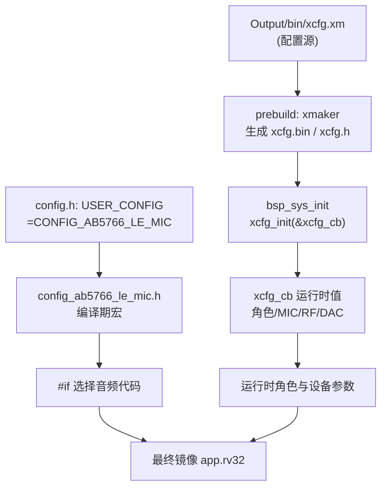
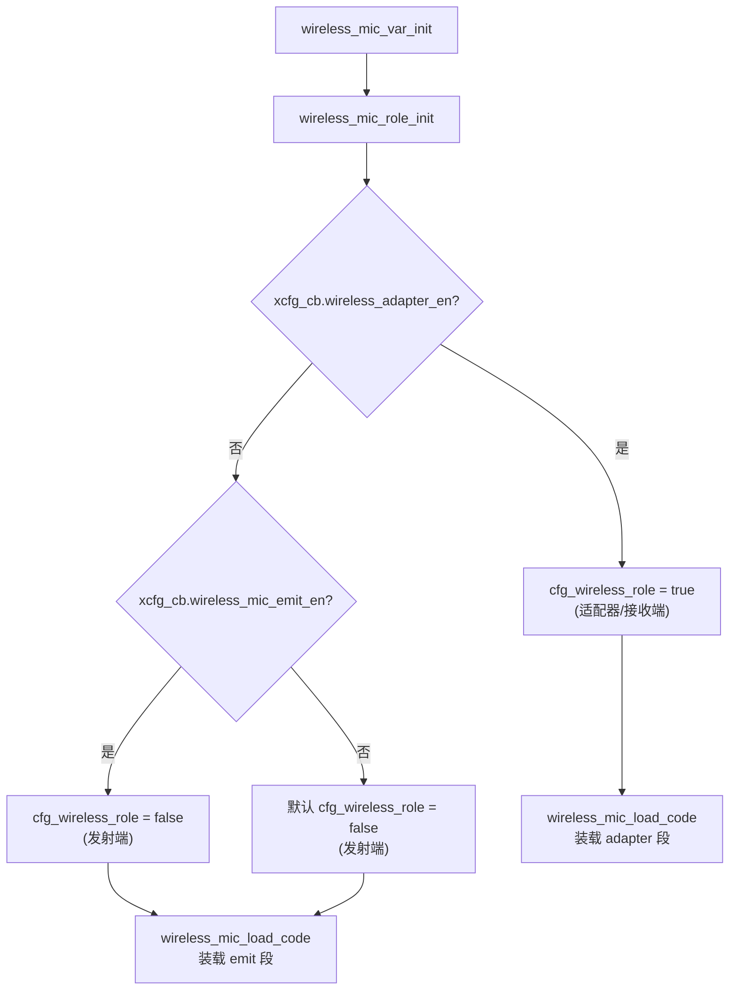
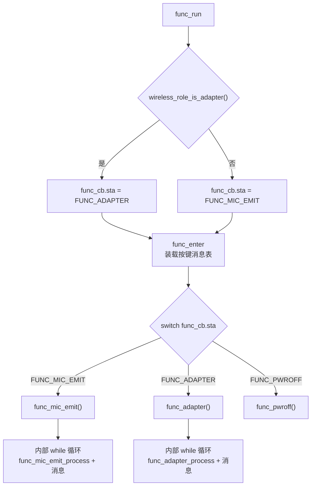
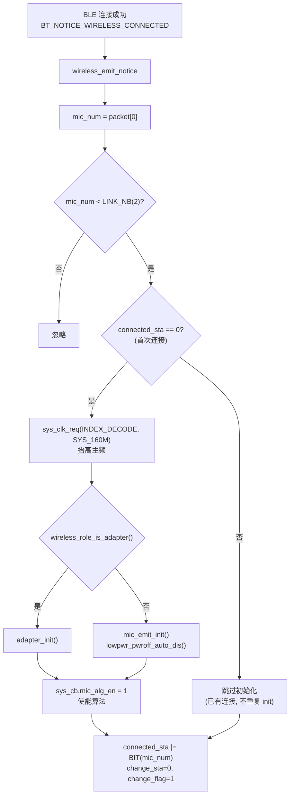
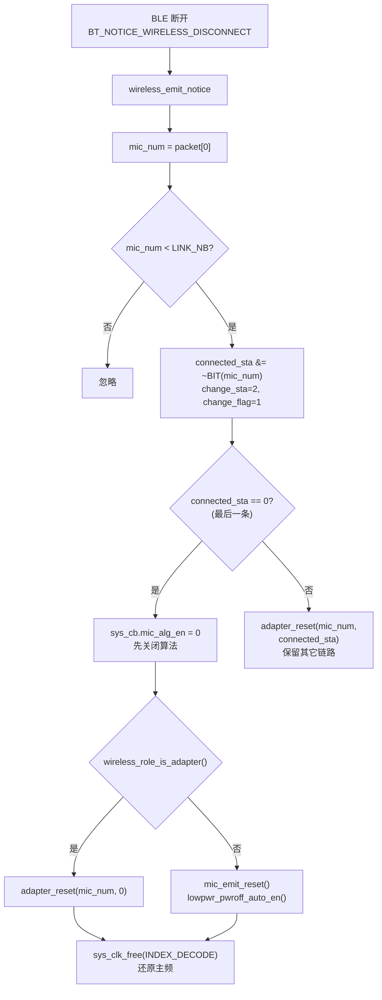

# AB5766 LE Mic 系统角色与算法启动门禁

> **适用范围：** 当前 `CONFIG_AB5766_LE_MIC` 产品配置。本文档以可见 C 源码中的编译条件、调用关系和运行时门禁为依据，不以文件名、宏名或日志文字单独推断功能。
>
> **与其他文档的关系：** 本文是后续 7 篇算法专题的公共前置，统一说明“宏为 1、源码存在、map 有符号、硬件执行”四个证据等级的差异，以及“上电→角色选择→连接→初始化→门禁→断连复位”的主干流程。逐帧算法细节见各专题文档。

## 1. 适用配置与边界

| 项目 | 当前值 | 来源 |
| --- | --- | --- |
| 产品配置选择 | `CONFIG_AB5766_LE_MIC` | [config.h:17](../../projects/microphone/config.h#L17) |
| 当前配置头 | `config_ab5766_le_mic.h` | [config.h:19-20](../../projects/microphone/config.h#L19-L20) |
| 传输机制版本 | `WIRELESS_CON_VERS=7` | [config_ab5766_le_mic.h:65](../../projects/microphone/config_ab5766_le_mic.h#L65) |
| 编解码 | `CODEC_LC3S` | [config_ab5766_le_mic.h:64](../../projects/microphone/config_ab5766_le_mic.h#L64) |
| 最大链路数 | 2 | [config_ab5766_le_mic.h:76](../../projects/microphone/config_ab5766_le_mic.h#L76) |

**本文档不证明的事：** 任何具体音频算法的质量、参数正确性或硬件听感。这些需要 E2（map/镜像）+ E3（双板/仪器）证据，见第 9 节。

## 2. 四层证据：宏、源码、map、硬件不是一回事

工程使用 `--gc-sections` 链接、预编译静态库和运行时门禁。以下四类“证据”互相不等价，任一文档结论必须标明属于哪一层：

| 级别 | 证据来源 | 能确认 | 不能确认 |
| --- | --- | --- | --- |
| E0 | 配置头 `config_ab5766_le_mic.h` 与生成配置 `xcfg` | 某条件分支在本次配置中**应被编译/排除** | 函数一定被执行、资源有效、硬件效果正确 |
| E1 | 可见源码调用链 | 初始化、每帧调用、PCM/帧的上下游位置 | 静态库或硬件内核的内部实现 |
| E2 | 当次构建的 `map.txt`、`app.rv32`、`xcfg.bin`、effect 资源 | 符号被链接、构建身份可追溯 | 真实硬件确实执行、听感或指标达标 |
| E3 | 双板、UART 日志、音频采集、示波器/听音记录 | 指定固件与条件下的实际行为 | 未测条件下仍可靠、库内算法原理 |

**最低文档要求：** 每个结论记录 E0 + E1；声称“已在板上通过”必须附 E2 + E3。当前仓库中的旧 `map.txt` 仅作已保存构建参考，不能替代下一次改动后的 E2 证据。

## 3. 配置快照



- 产品选择见 [config.h:11-17](../../projects/microphone/config.h#L11-L17)，当前 `USER_CONFIG = CONFIG_AB5766_LE_MIC` 决定包含 [config_ab5766_le_mic.h](../../projects/microphone/config_ab5766_le_mic.h)。
- `xcfg.h`、`xcfg.bin`、`effect.c`、`effect.h` 由构建前流程生成，不要手改生成物替代配置源；生成脚本见 [prebuild.bat](../../projects/microphone/Output/bin/prebuild.bat)。
- `bsp_sys_init()` 通过 `xcfg_init(&xcfg_cb, sizeof(xcfg_cb))` 装载运行时参数，见 [bsp_sys.c:199-204](../../bsp/bsp_sys.c#L199-L204)。若返回失败打印 `xcfg init error`。

**关键区分：** `config_ab5766_le_mic.h` 的宏是**编译期**开关，决定哪些源码进入编译；`xcfg_cb` 的字段是**运行时**值，由烧录的 `xcfg.bin` 决定，决定代码运行时走哪条分支。同一份镜像可在不同 `xcfg.bin` 下表现为发射端或接收端。

## 4. 实际调用链：上电到角色分派

### 4.1 上电序列

[main.c](../../projects/microphone/main.c) 是固件入口，记录复位/唤醒状态、输出版本与内存诊断后调用 `bsp_sys_init()`，随后进入不返回的 `func_run()` 状态机循环（见架构说明）。

`bsp_sys_init()` 内与本文相关的顺序：

| 次序 | 位置 | 动作 |
| --- | --- | --- |
| 1 | [bsp_sys.c:202-204](../../bsp/bsp_sys.c#L202-L204) | `xcfg_init(&xcfg_cb, ...)` 装载运行时配置 |
| 2 | [bsp_sys.c:211](../../bsp/bsp_sys.c#L211) | `wireless_mic_var_init()` → 角色初始化 + 装载角色代码 + 命令初始化 |
| 3 | [bsp_sys.c:241](../../bsp/bsp_sys.c#L241) | `sys_clk_set(SYS_CLK_SEL)`（默认 `SYS_24M`，见 [config_ab5766_le_mic.h:19](../../projects/microphone/config_ab5766_le_mic.h#L19)） |
| 4 | [bsp_sys.c:258-262](../../bsp/bsp_sys.c#L258-L262) | `EQ_DRC_DBG_IN_UART` 且 `xcfg_cb.huart_en` 时调用 `eq_drc_dbg_init()` |
| 5 | [bsp_sys.c:266](../../bsp/bsp_sys.c#L266) | `func_cb.sta = FUNC_BT`，随后主循环进入 `func_run()` |

`wireless_mic_var_init()` 见 [wireless_proc.c:342-348](../../modules/wireless/wireless_proc.c#L342-L348)，依次调用 `wireless_mic_role_init()`、`wireless_mic_load_code()`、`wireless_cmd_init()`。

### 4.2 角色由运行时配置选择



`wireless_mic_role_init()` 的判定优先级见 [wireless_proc.c:5-17](../../modules/wireless/wireless_proc.c#L5-L17)：

1. 先检查 `xcfg_cb.wireless_adapter_en` → 置 `cfg_wireless_role = true`（适配器）；
2. 否则检查 `xcfg_cb.wireless_mic_emit_en` → 置 `cfg_wireless_role = false`（发射端）；
3. 两者均未开 → 默认发射端。

随后 [wireless_proc.c:24-32](../../modules/wireless/wireless_proc.c#L24-L32) 的 `wireless_mic_load_code()` 按角色把对应代码段从 Flash 拷到 RAM（`__comm_adapter_*` 或 `__comm_emit_*`）。**角色不同，装载的代码段不同**，这进一步说明不能仅凭配置头宏判断运行身份。

### 4.3 顶层状态机分派

`func_run()` 是不返回的主循环，见 [func.c:134-178](../../functions/func.c#L134-L178)：



要点：

- [func.c:138-142](../../functions/func.c#L138-L142)：`wireless_role_is_adapter()` 返回值决定初始 `func_cb.sta`。
- [func.c:144-146](../../functions/func.c#L144-L146)：`FUNC_LE_DUT_EN`（当前为 0，见 [config_ab5766_le_mic.h:14](../../projects/microphone/config_ab5766_le_mic.h#L14)）可强制覆盖为 `FUNC_LE_DUT`，当前不生效。
- [func.c:148-177](../../functions/func.c#L148-L177)：`while(1)` 内 `func_enter()` 装载按键表，再 `switch` 分派；退出某功能后回到循环顶端重新判定角色。
- `func_info[]` 表见 [func.c:6-20](../../functions/func.c#L6-L20)，`FUNC_ADAPTER`/`FUNC_MIC_EMIT` 分别绑定 `adapter_key_msg_tbl`/`mic_emit_key_msg_tbl`，且受 `!ADAPTER_CLOSE_EN`/`!WIRELESS_MIC_CLOSE_EN` 保护（当前均为 0，即不关闭）。

## 5. 初始化与算法门禁：连接成功才打开

**这是本文档最关键的结论：宏为 1 不代表上电后立即处理 PCM。** 算法帧处理受 `sys_cb.mic_alg_en` 运行时门禁保护，该门禁只在无线连接成功后才置 1，在最后一条连接断开后清 0。

### 5.1 连接成功事件流程



实际代码见 [wireless_proc.c:91-151](../../modules/wireless/wireless_proc.c#L91-L151)，关键行：

- [wireless_proc.c:98-101](../../modules/wireless/wireless_proc.c#L98-L101)：`BT_NOTICE_WIRELESS_CONNECTED` 分支，取 `mic_num`。
- [wireless_proc.c:102-103](../../modules/wireless/wireless_proc.c#L102-L103)：**仅当 `connected_sta == 0`（首条连接）** 才申请 `SYS_160M` 主频。
- [wireless_proc.c:104-109](../../modules/wireless/wireless_proc.c#L104-L109)：按角色调用 `adapter_init()` 或 `mic_emit_init()`；发射端额外调用 `lowpwr_pwroff_auto_dis()` 禁止自动关机。
- [wireless_proc.c:110](../../modules/wireless/wireless_proc.c#L110)：**`sys_cb.mic_alg_en = 1`** —— 算法门禁在此打开，位于 init 之后。
- [wireless_proc.c:123-125](../../modules/wireless/wireless_proc.c#L123-L125)：更新 `connected_sta` 位图与 `change_flag`。

`#if WIRELESS_CON_CODEC_SEL == CODEC_ESBC` 包裹的虚拟数据/音频连接分支（[wireless_proc.c:204-290](../../modules/wireless/wireless_proc.c#L204-L290)）当前 `CODEC_LC3S` 不编译，仅作对比参考：它把“数据通道连接”与“音频通道连接”拆成两个事件，音频连接成功才 init + `mic_alg_en=1`。LC3S 路径使用单一的 `BT_NOTICE_WIRELESS_CONNECTED`。

### 5.2 断开与复位流程



实际代码见 [wireless_proc.c:162-202](../../modules/wireless/wireless_proc.c#L162-L202)，关键行：

- [wireless_proc.c:166](../../modules/wireless/wireless_proc.c#L166)：清除 `connected_sta` 对应 bit。
- [wireless_proc.c:177-178](../../modules/wireless/wireless_proc.c#L177-L178)：**仅当 `connected_sta == 0`（最后一条断开）** 才 `sys_cb.mic_alg_en = 0`。
- [wireless_proc.c:180-186](../../modules/wireless/wireless_proc.c#L180-L186)：按角色调用 `adapter_reset(mic_num, 0)` 或 `mic_emit_reset()`，然后 `sys_clk_free(INDEX_DECODE)` 还原主频。
- [wireless_proc.c:192-194](../../modules/wireless/wireless_proc.c#L192-L194)：若仍有其它链路连接，只调用 `adapter_reset(mic_num, wireless_mic.connected_sta)` 保留剩余链路。

**发射端功能退出也有同样门禁清理**：见 [func_mic_emit.c:190-209](../../functions/func_mic_emit.c#L190-L209) 的 `func_mic_emit_exit()`，在退出功能前若仍连接则发断开命令并等待，随后再次检查 `sys_cb.mic_alg_en` 并清零、`mic_emit_reset()`、还原主频。这是功能级与连接级两道独立复位。

## 6. 逐帧处理中的门禁作用点

`sys_cb.mic_alg_en` 不是只在初始化时用一次，它在每帧处理中都是实际判断点：

| 位置 | 作用 |
| --- | --- |
| [mic_proc.c:90-96](../../modules/wireless/mic_proc.c#L90-L96) `mic_enc_adc_dma_kick()` | 仅当 `mic_alg_en` 为真才 `bsp_sdadc_kick()` 启动采集，否则不触发 SDADC DMA |
| [mic_proc.c:295](../../modules/wireless/mic_proc.c#L295) `mic_enc_proc_cb()` | `if(sys_cb.mic_alg_en)` 包裹所有条件算法（AINS4/Echo/SRC/EQ_DRC/DNR/Magic/Reverb/AGC 等） |
| [mic_proc.c:562](../../modules/wireless/mic_proc.c#L562) `mic_dec_prco_cb()` | `if(sys_cb.mic_alg_en)` 才取帧/解码/PLC；否则 `memset(pcm, 0, samples*2)` 输出静音 |

含义：

- **门禁关闭时发射端不采集、不处理、不编码任何音效**，但 `mic_enc_proc_cb()` 仍可能被 SDADC 回调进入，只是内部算法块被跳过（编码与 `wireless_d2a_put_tx_frame` 在 `if` 块外，见 [mic_proc.c:352-363](../../modules/wireless/mic_proc.c#L352-L363)，需结合连接状态理解）。
- **门禁关闭时接收端直接输出零 PCM**，见 [mic_proc.c:582-584](../../modules/wireless/mic_proc.c#L582-L584)，但 `mic_dec_pcm_out()` 仍会调用（[mic_proc.c:586](../../modules/wireless/mic_proc.c#L586)），下游混音/DAC/USB 仍会收到静音帧。

排查“无声”时，这三个门禁点是第一道检查：先确认角色、连接成功、初始化日志、`mic_alg_en` 是否为 1，再进入具体算法。

## 7. 初始化函数对照表

`mic_emit_init()`（发射端，[mic_proc.c:597-675](../../modules/wireless/mic_proc.c#L597-L675)）与 `adapter_init()`（接收端，[mic_proc.c:700-734](../../modules/wireless/mic_proc.c#L700-L734)）由首次连接调用，各自的条件初始化项：

| 角色 | 初始化函数 | 位置 | 当前生效项 | 关闭项（当前宏=0） |
| --- | --- | --- | --- | --- |
| 发射端 | `mic_emit_alg_init()` | [mic_proc.c:58-60](../../modules/wireless/mic_proc.c#L58-L60) | 空函数 | — |
| 发射端 | `lc3s_enc_init()` | [mic_proc.c:621](../../modules/wireless/mic_proc.c#L621) | ✅ LC3S | SBC/ESBC/ADPCM 不编译 |
| 发射端 | `src_init()` | [mic_proc.c:629](../../modules/wireless/mic_proc.c#L629) | ❌ `WIRELESS_MIC_32K_EN=0` | — |
| 发射端 | `ains4_32k_mic_init()` | [mic_proc.c:633](../../modules/wireless/mic_proc.c#L633) | ❌ `AINS4_32K_EN=0` | — |
| 发射端 | `echo_audio_init()` | [mic_proc.c:637](../../modules/wireless/mic_proc.c#L637) | ❌ `ECHO_EN=0` | — |
| 发射端 | `magic_audio_init()` | [mic_proc.c:641](../../modules/wireless/mic_proc.c#L641) | ❌ `MAGIC_EN=0` | — |
| 发射端 | `robotization_mic_init()` | [mic_proc.c:645](../../modules/wireless/mic_proc.c#L645) | ❌ `ROBOTIZATION_EN=0` | — |
| 发射端 | `room_reverb_audio_init*()` | [mic_proc.c:648-651](../../modules/wireless/mic_proc.c#L648-L651) | ❌ `ROOM_REVERB_EN=0` | — |
| 发射端 | `mic_eq_drc_init()` | [mic_proc.c:654](../../modules/wireless/mic_proc.c#L654) | ✅ `EQ_DRC_EN=1`（含 Soft Gain） | — |
| 发射端 | `agc_audio_init()` | [mic_proc.c:658](../../modules/wireless/mic_proc.c#L658) | ❌ `AGC_EN=0` | — |
| 发射端 | `dnr_fre_mic_init()` | [mic_proc.c:662](../../modules/wireless/mic_proc.c#L662) | ❌ `DNR_FRE_EN=0` | — |
| 发射端 | `dac0_out_init()` | [mic_proc.c:666](../../modules/wireless/mic_proc.c#L666) | ✅ `DAC_OUT_EN=1` | — |
| 发射端 | `bsp_sdadc_init()` | [mic_proc.c:669](../../modules/wireless/mic_proc.c#L669) | ✅ 无条件（在 `!CLOSE_EN` 内） | — |
| 接收端 | `adapter_alg_init()` | [mic_proc.c:82-86](../../modules/wireless/mic_proc.c#L82-L86) | ✅ PLC idx 0/1 初始化 | — |
| 接收端 | `lc3s_dec_init()` | [mic_proc.c:719](../../modules/wireless/mic_proc.c#L719) | ✅ LC3S | — |
| 接收端 | `mix_drc_init()` | [mic_proc.c:722](../../modules/wireless/mic_proc.c#L722) | ✅ `MIX_DRC_EN=1` | — |
| 接收端 | `dac0_out_init()` | [mic_proc.c:729](../../modules/wireless/mic_proc.c#L729) | ✅ `ADAPTER_DAC_OUTPUT_EN=1` | — |

> **注意：** `mic_eq_drc_init()` 内部会同时初始化 Local PACC 与 Soft Gain（Soft Gain 开启时），但 EQ/DRC 节点是否真正进入处理链还取决于 effect 资源装载与重链接结果，详见 [AB5766_LE_Mic_发射端采集增益与音效链.md](AB5766_LE_Mic_发射端采集增益与音效链.md)。表中的 ✅ 仅表示该初始化函数被调用，不等同于算法质量已验证。

## 8. 缓冲区与代码段放置

角色不同不仅决定代码段，也决定缓冲区段放置：

| 对象 | 段属性 | 位置 |
| --- | --- | --- |
| `mic_enc`（发射端编码状态） | `AT(.buf.mic_emit.proc)` | [mic_proc.c:46-47](../../modules/wireless/mic_proc.c#L46-L47) |
| `mic_dec`（接收端解码状态） | `AT(.buf.adapter.proc)` | [mic_proc.c:49-50](../../modules/wireless/mic_proc.c#L49-L50) |
| `device_con`（发射 TX 缓冲） | `AT(.buf.mic_emit.proc)` | [wireless_txrx_single.c:52-56](../../modules/wireless/wireless_txrx_single.c#L52-L56) |
| `adapter_con`（接收 RX 缓冲） | `AT(.buf.adapter.proc)` | [wireless_txrx_single.c:59-63](../../modules/wireless/wireless_txrx_single.c#L59-L63) |
| `loc_mic_pacc`（发射 PACC 缓存） | `AT(.buf.mic_effect.pacc)` | [mic_effect.c:63](../../modules/effect/mic_effect.c#L63) |
| `mix_pacc`（接收混音 PACC） | `AT(.buf.mic_mix.pacc)` | [mic_effect.c:208](../../modules/effect/mic_effect.c#L208) |

`AT(...)` 标注与预处理后的 [ram.ld](../../projects/microphone/ram.ld) 共同协调 RAM/Flash 放置。移动时序或内存敏感代码时必须保留这些标注，详见 CLAUDE.md 架构说明。

## 9. 当前可达性

本文档结论的可达性边界：

| 结论 | 证据等级 | 可达性 |
| --- | --- | --- |
| 角色判定优先级（adapter > emit > 默认 emit） | E1 | ✅ 源码可直接确认 |
| 首次连接抬高 160M、按角色 init、置 `mic_alg_en=1` | E1 | ✅ 源码可直接确认 |
| 最后一条断开清 `mic_alg_en`、复位、还原主频 | E1 | ✅ 源码可直接确认 |
| 逐帧 `mic_alg_en` 门禁在采集/编码/解码三处生效 | E1 | ✅ 源码可直接确认 |
| 当前默认镜像实际以发射端还是接收端运行 | E2/E3 | ⚠️ 需当次 setting/xcfg 身份 + 启动日志 |
| `mic_alg_en=1` 后算法质量/参数正确 | E3 | ⚠️ 需双板音频/仪器验证 |
| `wireless_mic_load_code` 实际装载哪段 | E2 | ⚠️ 需当次 map 核对 `__comm_adapter_*`/`__comm_emit_*` |

## 10. 测试与失败定位

### 10.1 角色与门禁固定检查项

开始任何算法测试前，先冻结以下内容（缺一项记录为 `Blocked`，不输出算法结论）：

1. Git 提交、工作区状态、构建时间、工具链版本；
2. **发射端与接收端各自的 setting / xcfg 身份**（角色不能只看配置头，必须看烧录的 `xcfg.bin`）；
3. 启动 UART 日志中 `func_run`、`wireless_mic_role_init` 相关输出、`bsp_sys_init` 打印；
4. 连接成功日志 `WIRELESS_CONNECTED, %d`（[wireless_proc.c:101](../../modules/wireless/wireless_proc.c#L101)）与断开日志 `WIRELESS_DISCONNECT, %d`（[wireless_proc.c:165](../../modules/wireless/wireless_proc.c#L165)）；
5. `mic_emit_init`/`adapter_init` 内部各 init 的 `printf`（如 `loc_mic_pacc_init`、`mix_pacc_init`，见 [mic_effect.c:84](../../modules/effect/mic_effect.c#L84)、[mic_effect.c:230](../../modules/effect/mic_effect.c#L230)）。

### 10.2 无声的分层定位

```text
角色错误? → 检查 xcfg 角色 + func_run 分派
   ↓ 正确
未连接? → 检查 connected_sta + WIRELESS_CONNECTED 日志
   ↓ 已连接
mic_alg_en=0? → 检查首次连接 init 是否执行、是否被提前断开
   ↓ =1
启动丢帧窗口未过? → 等待 bsp_sdadc_discard_proc 结束
   ↓ 已过
具体算法? → 进入各专题文档
```

**不要把刚连接瞬间的无声直接归因于 LC3S、PLC、EQ 或无线丢包**。应等待启动丢帧窗口结束，再记录 mute 开/关前后的发射 DAC、接收 DAC 与 USB Mic。

## 11. 引用表

| 引用 | 位置 | 作用 |
| --- | --- | --- |
| 产品配置选择 | [config.h:11-27](../../projects/microphone/config.h#L11-L27) | `USER_CONFIG` 决定包含哪个配置头 |
| 当前配置头 | [config_ab5766_le_mic.h](../../projects/microphone/config_ab5766_le_mic.h) | 编译期宏集合 |
| 运行时配置装载 | [bsp_sys.c:199-267](../../bsp/bsp_sys.c#L199-L267) | `bsp_sys_init` + `xcfg_init` |
| HUART 调音初始化 | [bsp_sys.c:258-262](../../bsp/bsp_sys.c#L258-L262) | `eq_drc_dbg_init` 受 `huart_en` 约束 |
| 角色初始化 | [wireless_proc.c:5-17](../../modules/wireless/wireless_proc.c#L5-L17) | `wireless_mic_role_init` 优先级 |
| 角色代码装载 | [wireless_proc.c:24-32](../../modules/wireless/wireless_proc.c#L24-L32) | `wireless_mic_load_code` 按角色拷段 |
| 变量初始化入口 | [wireless_proc.c:342-348](../../modules/wireless/wireless_proc.c#L342-L348) | `wireless_mic_var_init` |
| 连接成功事件 | [wireless_proc.c:91-151](../../modules/wireless/wireless_proc.c#L91-L151) | `wireless_emit_notice` 连接分支 |
| 断开事件 | [wireless_proc.c:162-202](../../modules/wireless/wireless_proc.c#L162-L202) | `wireless_emit_notice` 断开分支 |
| 顶层状态机 | [func.c:134-178](../../functions/func.c#L134-L178) | `func_run` 角色分派 |
| 功能信息表 | [func.c:6-20](../../functions/func.c#L6-L20) | `func_info[]` 按键表绑定 |
| 通用消息处理 | [func.c:72-112](../../functions/func.c#L72-L112) | `func_message` 含在线调音事件 |
| 发射端功能循环 | [func_mic_emit.c:142-227](../../functions/func_mic_emit.c#L142-L227) | `func_mic_emit` 主体 |
| 发射端功能退出 | [func_mic_emit.c:189-209](../../functions/func_mic_emit.c#L189-L209) | `func_mic_emit_exit` 门禁清理 |
| 发射采集门禁 | [mic_proc.c:90-96](../../modules/wireless/mic_proc.c#L90-L96) | `mic_enc_adc_dma_kick` |
| 发射逐帧门禁 | [mic_proc.c:278-345](../../modules/wireless/mic_proc.c#L278-L345) | `mic_enc_proc_cb` |
| 接收逐帧门禁 | [mic_proc.c:549-594](../../modules/wireless/mic_proc.c#L549-L594) | `mic_dec_prco_cb` |
| 发射端初始化 | [mic_proc.c:597-675](../../modules/wireless/mic_proc.c#L597-L675) | `mic_emit_init` |
| 接收端初始化 | [mic_proc.c:700-734](../../modules/wireless/mic_proc.c#L700-L734) | `adapter_init` |
| 接收端复位 | [mic_proc.c:736-750](../../modules/wireless/mic_proc.c#L736-L750) | `adapter_reset` |
| 缓冲区段放置 | [mic_proc.c:46-50](../../modules/wireless/mic_proc.c#L46-L50) | `mic_enc`/`mic_dec` 段属性 |

## 12. 相邻文档导航

- 下一篇：[AB5766_LE_Mic_发射端采集增益与音效链.md](AB5766_LE_Mic_发射端采集增益与音效链.md)
- 总览：[AB5766_LE_Mic_音频算法调用链与测试快速入门.md](AB5766_LE_Mic_音频算法调用链与测试快速入门.md)
