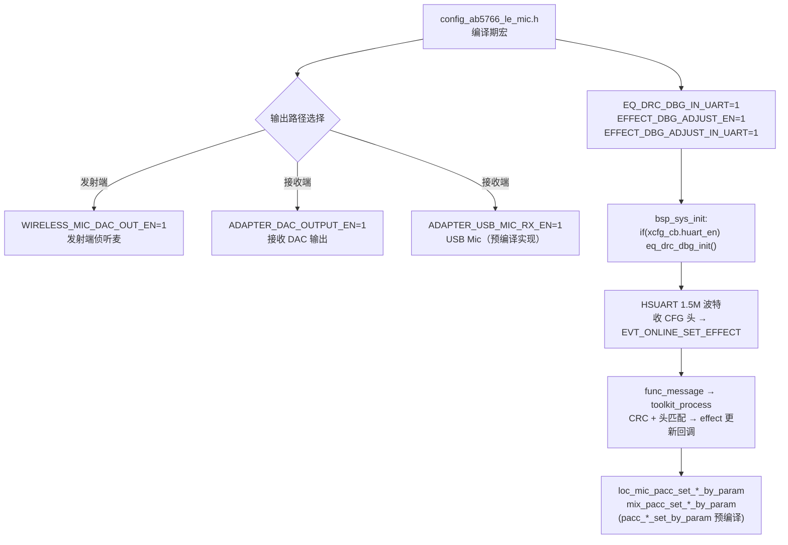
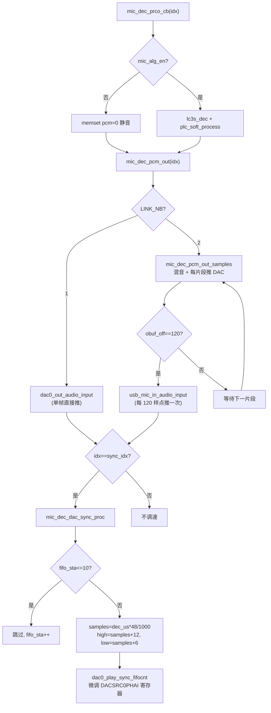
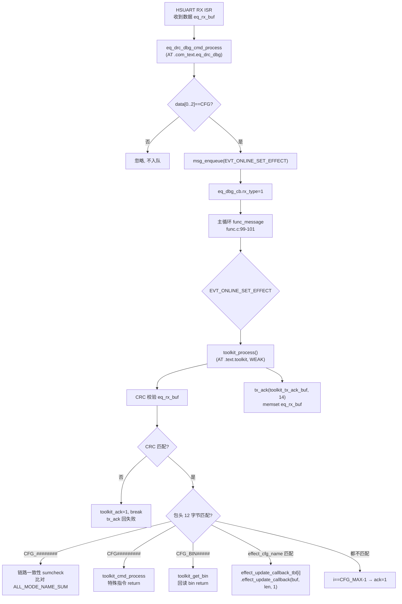

# AB5766 LE Mic 输出观测点与在线调音调用链

> **适用范围：** 当前 `CONFIG_AB5766_LE_MIC` 产品配置。本文档以可见 C 源码中的调用关系、行号与配置宏为依据，不以文件名、宏名或日志文字单独推断功能。
>
> **文档定位：** 本文是 7 篇算法专题的第 6 篇。它把 **三条输出观测点**（发射端 DAC、接收端 DAC、USB Mic）与 **在线调音控制面**（HSUART → 消息 → toolkit → effect 更新回调）作为“观测/控制面”来写，**不把输出驱动和 UART 调度写成语音算法内核**。语音算法内核见 [文档 2 发射端音效链](AB5766_LE_Mic_发射端采集增益与音效链.md)、[文档 5 双链路混音与 Mix PACC](AB5766_LE_Mic_双链路混音与Mix_PACC.md)。

## 1. 适用配置与边界

| 项目 | 当前值 | 来源 |
| --- | --- | --- |
| 发射端 DAC 侦听 | `WIRELESS_MIC_DAC_OUT_EN=1` | [config_ab5766_le_mic.h:93](../../projects/microphone/config_ab5766_le_mic.h#L93) |
| 接收端 DAC 输出 | `ADAPTER_DAC_OUTPUT_EN=1` | [config_ab5766_le_mic.h:121](../../projects/microphone/config_ab5766_le_mic.h#L121) |
| USB Mic 接收 | `ADAPTER_USB_MIC_RX_EN=1` | [config_ab5766_le_mic.h:123](../../projects/microphone/config_ab5766_le_mic.h#L123) |
| USB Mic 在线调音 | `ADAPTER_USB_MIC_EQ_DRC_EN` 未定义 → 0 | 见第 5.4 节 |
| UART 在线调音总开关 | `EQ_DRC_DBG_IN_UART=1` | [config_ab5766_le_mic.h:185](../../projects/microphone/config_ab5766_le_mic.h#L185) |
| 离线音效调试 | `EFFECT_DBG_ADJUST_EN=1` | [config_ab5766_le_mic.h:186](../../projects/microphone/config_ab5766_le_mic.h#L186) |
| UART 在线调试音效 | `EFFECT_DBG_ADJUST_IN_UART=1` | [config_ab5766_le_mic.h:187](../../projects/microphone/config_ab5766_le_mic.h#L187) |
| HUART 运行时使能 | `xcfg_cb.huart_en`（运行时值） | [bsp_sys.c:258-262](../../bsp/bsp_sys.c#L258-L262) |

**本文档不证明的事：**

- `usb_mic_in_audio_input` 的内部实现（预编译，[map.txt:2517](../../projects/microphone/Output/bin/map.txt#L2517) `0x000179b8`，无可见 `.c`）——它把 PCM 推到 USB 端点的细节属于预编译库边界；
- DAC FIFO 调速寄存器微调后的真实听感/长期漂移——需要 E2（map/镜像）+ E3（仪器/听音）证据；
- 在线调音回调最终调用 `pacc_eq_set_by_param`/`pacc_drc_set_by_param` 后的滤波器系数正确性——PACC 内核预编译，见第 9 节。

## 2. 配置快照：输出路径与控制面



**关键区分：** 三条输出路径中，发射 DAC 与接收 DAC 的输入函数 `dac0_out_audio_input` 是**可见源码**（[dac0_out.c:32](../../modules/audio/dac0_out.c#L32)）；USB Mic 的输入函数 `usb_mic_in_audio_input` 是**预编译符号**，仅有声明（[func_adapter.h:21](../../functions/func_adapter.h#L21)）与 map 地址，无可见实现。这是本文档最重要的“可见 vs 预编译”边界之一。

## 3. 实际调用链：三条输出观测点

### 3.1 发射端 DAC（侦听麦）

发射端在编码完成、`wireless_d2a_put_tx_frame` 之后，把同一份 PCM 推一份给本地 DAC，用于“自听”：

```
mic_enc_proc_cb()                              mic_proc.c:295 起逐帧处理
  └─ lc3s_enc(pcm, ...)                        mic_proc.c:359   编码
  └─ wireless_d2a_put_tx_frame(...)            mic_proc.c:363   推无线
  └─ wl_play_sync_tick1(...)                  mic_proc.c:366   发射节拍同步
  └─ #if WIRELESS_MIC_DAC_OUT_EN               mic_proc.c:368   ← 门禁
       ├─ dac0_get_fifocnt(0)                  mic_proc.c:369   读 FIFO 计数
       ├─ mic_enc.dac_cnt++ > 50?              mic_proc.c:370-372 每 50 帧调速一次
       │    └─ dac0_play_sync_fifocnt(50, 30)  mic_proc.c:373   固定阈值 (high=50, low=30)
       └─ dac0_out_audio_input(pcm, samples, 0) mic_proc.c:375  推 DAC
```

- 门禁 `WIRELESS_MIC_DAC_OUT_EN=1` 见 [mic_proc.c:368](../../modules/wireless/mic_proc.c#L368)。
- 发射端调速用**固定阈值** `(high_thr=50, low_thr=30)`，见 [mic_proc.c:373](../../modules/wireless/mic_proc.c#L373)，每 50 帧（`mic_enc.dac_cnt > 50`）调一次。
- `dac0_out_audio_input` 受 `dac0_out_cfg.mute` 门禁，见 [dac0_out.c:38-41](../../modules/audio/dac0_out.c#L38-L41)：mute 时直接丢弃，不 kick DMA。

### 3.2 接收端 DAC（适配器输出）

接收端在双链路混音/片段输出阶段把 PCM 推 DAC。**单链路**与**双链路**两条路径都汇聚到同一函数：

```
mic_dec_prco_cb(idx)                          mic_proc.c:550   逐帧解码回调
  └─ lc3s_dec / plc_soft_process              mic_proc.c:574-580 解码 + PLC
  └─ mic_dec_pcm_out(idx)                    mic_proc.c:586    输出调度
       │  单链路 (LINK_NB==1):                mic_proc.c:506-513
       │    ├─ usb_mic_in_audio_input(...)     mic_proc.c:509   推 USB Mic（预编译）
       │    └─ dac0_out_audio_input(...)       mic_proc.c:512   推 DAC
       │  双链路 (LINK_NB==2):                mic_proc.c:514-545
       │    └─ mic_dec_pcm_out_samples(...)    mic_proc.c:453   混音 + 推 DAC + 累积推 USB
       │         ├─ mix_drc_audio_input / 平均 mic_proc.c:457-462 混音
       │         ├─ dac0_out_audio_input(...)  mic_proc.c:466   ← 每片段推一次 DAC
       │         └─ obuf_off==120?             mic_proc.c:470-476
       │              └─ usb_mic_in_audio_input mic_proc.c:474   ← 每 120 样点推一次 USB
  └─ if(idx==sync_idx) mic_dec_dac_sync_proc() mic_proc.c:588-591 DAC 调速
       └─ dac0_play_sync_fifocnt(high, low)   mic_proc.c:77     动态阈值
```

- 接收端 DAC 推送在 **单链路** 用 [mic_proc.c:512](../../modules/wireless/mic_proc.c#L512)，在 **双链路** 用 [mic_proc.c:466](../../modules/wireless/mic_proc.c#L466)（`mic_dec_pcm_out_samples` 内）。
- 接收端调速用**动态阈值**：`samples = cfg_wireless_d2a_dec_us*48/1000`，`high_thr=samples+12`，`low_thr=samples+6`，见 [mic_proc.c:72-77](../../modules/wireless/mic_proc.c#L72-L77)。
- 调速有 `fifo_sta` 启动计数：前 10 次（`mic_dec.fifo_sta <= 10`）直接跳过不调速，避免启动瞬间抖动，见 [mic_proc.c:67-70](../../modules/wireless/mic_proc.c#L67-L70)。

### 3.3 USB Mic（预编译）

USB Mic 在两条路径都被调用，但实现不可见：

| 调用点 | 位置 | 触发条件 |
| --- | --- | --- |
| 单链路 | [mic_proc.c:509](../../modules/wireless/mic_proc.c#L509) | `ADAPTER_USB_MIC_RX_EN` 且 `LINK_NB==1`，每帧 120 样点 |
| 双链路 | [mic_proc.c:474](../../modules/wireless/mic_proc.c#L474) | `ADAPTER_USB_MIC_RX_EN` 且 `obuf_off==120`，每完整 120 样点 |
| USB 枚举宏 | [config_ab5766_le_mic.h:179](../../projects/microphone/config_ab5766_le_mic.h#L179) | `UDE_MIC_EN=ADAPTER_USB_MIC_RX_EN`，参与 `UDE_ENUM_TYPE` |

- `usb_mic_in_audio_input` 声明在 [func_adapter.h:21](../../functions/func_adapter.h#L21)，签名 `(u8 *ptr, u32 samples, int ch_mode, void *params)`。
- 实现为预编译符号，位于 `libs/cpu/libplatform.a(usb_device_mic_in.o)`，map 地址 `0x000179b8`，大小 `0x40`，见 [map.txt:2515-2517](../../projects/microphone/Output/bin/map.txt#L2515-L2517)；由 `mic_proc.o` 引用。
- 配置注释 [config_ab5766_le_mic.h:123](../../projects/microphone/config_ab5766_le_mic.h#L123) 标注 `ADAPTER_USB_MIC_RX_EN=1` 为“不支持”——即宏为 1 但当前产品未启用 USB Mic 出厂用途，**宏为 1 ≠ 上电后 USB Mic 真正可用**，需结合 USB 枚举状态（E2/E3）确认。

## 4. Mermaid：解码到输出与 FIFO 调速



## 5. 初始化与在线调音链

### 5.1 HUART 运行时初始化

`eq_drc_dbg_init()` 在 `bsp_sys_init` 中受两层门禁：

- 编译期：`#if EQ_DRC_DBG_IN_UART`（=1），见 [bsp_sys.c:258](../../bsp/bsp_sys.c#L258)；
- 运行时：`if (xcfg_cb.huart_en)`，见 [bsp_sys.c:259](../../bsp/bsp_sys.c#L259)。

**这意味着即使配置头开了在线调音，只要烧录的 `xcfg.bin` 中 `huart_en=0`，HSUART 调音通道根本不初始化。** `huart_en` 是运行时值，必须结合烧录的 setting 确认（E2）。

`eq_drc_dbg_init()`（[eq_drc_dbg_in_uart.c:36-51](../../modules/audio/eq_drc_dbg_in_uart.c#L36-L51)）配置 HSUART：

| 项 | 值 | 来源 |
| --- | --- | --- |
| tx/rx GPIO | `xcfg_cb.huart_io_sel`（共用） | [eq_drc_dbg_in_uart.c:41-42](../../modules/audio/eq_drc_dbg_in_uart.c#L41-L42) |
| 波特率 | 1500000（1.5M） | [eq_drc_dbg_in_uart.c:43](../../modules/audio/eq_drc_dbg_in_uart.c#L43) |
| RX ISR 使能 | 1 | [eq_drc_dbg_in_uart.c:44](../../modules/audio/eq_drc_dbg_in_uart.c#L44) |
| RX 缓冲 | `eq_rx_buf[EQ_BUFFER_LEN]`（270B） | [eq_drc_dbg_in_uart.c:45-46](../../modules/audio/eq_drc_dbg_in_uart.c#L45-L46) |
| ISR 回调 | `eq_drc_dbg_cmd_process` | [eq_drc_dbg_in_uart.c:47](../../modules/audio/eq_drc_dbg_in_uart.c#L47) |
| 上下拉 | `pu_pd_en=1` | [eq_drc_dbg_in_uart.c:48](../../modules/audio/eq_drc_dbg_in_uart.c#L48) |

`eq_rx_buf` 大小 `EQ_BUFFER_LEN = 260+10 = 270`，见 [eq_drc_dbg_in_uart.h:7](../../modules/audio/eq_drc_dbg_in_uart.h#L7)。

### 5.2 在线调音事件链



### 5.3 toolkit_process 分支详解

`toolkit_process`（[toolkit.c:104-166](../../modules/tool/toolkit.c#L104-L166)，`AT(.text.toolkit) WEAK`）的完整分支：

1. **CRC 校验**（[toolkit.c:108-110](../../modules/tool/toolkit.c#L108-L110)）：`size=little_endian_read_16(eq_rx_buf,12)`，`cal_crc=calc_crc(eq_rx_buf, size+XTP_EFFECT_FRAME_HEAD_TAG, 0xffff)`，`res_crc=little_endian_read_16(eq_rx_buf, size+XTP_EFFECT_FRAME_HEAD_TAG)`，`XTP_EFFECT_FRAME_HEAD_TAG=12`（[toolkit.h:6](../../modules/tool/toolkit.h#L6)）。不匹配 → `toolkit_ack=1` 后 `break`，见 [toolkit.c:118-121](../../modules/tool/toolkit.c#L118-L121)。

2. **包头匹配**（[toolkit.c:124-135](../../modules/tool/toolkit.c#L124-L135)），三种特殊头：
   - `"CFG_########"`（12 字节，[toolkit.c:124](../../modules/tool/toolkit.c#L124)）：链路一致性检查，比对偏移 14 处的 16 位值与 `ALL_MODE_NAME_SUM=0x00000A68`（[effect.h:37](../../projects/microphone/effect.h#L37)），不匹配 → `ack=1`，见 [toolkit.c:125-127](../../modules/tool/toolkit.c#L125-L127)。
   - `"CFG#########"`（[toolkit.c:129](../../modules/tool/toolkit.c#L129)）：特殊指令 → `toolkit_cmd_process()` 后 `return`（不执行末尾 tx_ack，由 `toolkit_cmd_process` 内部 `tx_ack`）。
   - `"CFG_BIN#####"（[toolkit.c:132](../../modules/tool/toolkit.c#L132)）：回读 bin → `toolkit_get_bin()` 后 `return`。

3. **effect_cfg_name 遍历**（[toolkit.c:138-155](../../modules/tool/toolkit.c#L138-L155)）：`for i<CFG_MAX` 用 `memcmp(eq_rx_buf, effect_info[i].effect_cfg_name, 12)` 匹配；命中则调用 `effect_update_callback_tbl[i].effect_update_callback(eq_rx_buf, little_endian_read_16(eq_rx_buf,12)+14, 1)`（第 3 参数 `1` 表示“更新”）；遍历到 `i==CFG_MAX-1` 仍未命中 → `ack=1`，见 [toolkit.c:152-154](../../modules/tool/toolkit.c#L152-L154)。

4. **回 ACK**（[toolkit.c:160-165](../../modules/tool/toolkit.c#L160-L165)）：`toolkit_tx_ack_buf[12]=toolkit_ack`，`[13]=toolkit_calc_check_sum(toolkit_tx_ack_buf,13)`，`tx_ack(toolkit_tx_ack_buf, 14)`，最后 `memset(eq_rx_buf, 0, EQ_BUFFER_LEN)`。

`tx_ack`（[eq_drc_dbg_in_uart.c:17-25](../../modules/audio/eq_drc_dbg_in_uart.c#L17-L25)）先 `delay_5ms(1)`，再判断 `eq_dbg_cb.rx_type`：为 1 才 `bsp_huart_tx` 回包，随后无论如何 `rx_type=0`。**注意：若 ISR 置 `rx_type=1` 后、`tx_ack` 执行前又来一帧 CFG，ISR 会再次置 `rx_type=1` 与 `msg_enqueue`，存在帧覆盖风险**（`eq_rx_buf` 单缓冲，见第 9 节）。

### 5.4 在线调音回调与角色门禁

6 个回调注册在 `effect_update_callback_tbl[CFG_MAX]`（[effect_table.c:4-11](../../modules/effect/effect_table.c#L4-L11)），各自的角色门禁与编译条件：

| cfg_name（[effect.c:5-12](../../projects/microphone/effect.c#L5-L12)） | 回调（toolkit_effect.c） | 编译门禁 | 角色门禁 | 当前可达 |
| --- | --- | --- | --- | --- |
| `CFG_MIC_EQ##` | `local_mic_eq_effect_update_callback` [:31](../../modules/tool/toolkit_effect.c#L31) | `WIRELESS_MIC_EQ_DRC_EN=1` | `!wireless_role_is_adapter()` [:36-39](../../modules/tool/toolkit_effect.c#L36-L39) | ✅ 仅发射端 |
| `CFG_MIC_DRC#` | `local_mic_drc_effect_update_callback` [:49](../../modules/tool/toolkit_effect.c#L49) | `WIRELESS_MIC_EQ_DRC_EN=1` | `!wireless_role_is_adapter()` [:54-57](../../modules/tool/toolkit_effect.c#L54-L57) | ✅ 仅发射端 |
| `CFG_MIX_EQ##` | `mix_mic_eq_effect_update_callback` [:67](../../modules/tool/toolkit_effect.c#L67) | `ADAPTER_MIX_DRC_EN=1` | `wireless_role_is_adapter()` [:72-75](../../modules/tool/toolkit_effect.c#L72-L75) | ✅ 仅接收端 |
| `CFG_MIX_DRC#` | `mix_mic_drc_effect_update_callback` [:85](../../modules/tool/toolkit_effect.c#L85) | `ADAPTER_MIX_DRC_EN=1` | `wireless_role_is_adapter()` [:91-94](../../modules/tool/toolkit_effect.c#L91-L94) | ✅ 仅接收端 |
| `CFG_ECHO####` | `mic_echo_effect_update_callback` [:123](../../modules/tool/toolkit_effect.c#L123) | `ECHO_EN=0` | — | ❌ 始终 `toolkit_ack_fail` |
| `CFG_MAGIC###` | `mic_magic_effect_update_callback` [:104](../../modules/tool/toolkit_effect.c#L104) | `MAGIC_EN=0` | — | ❌ 始终 `toolkit_ack_fail` |

USB Mic 的 6 个回调（`usb_mic_eq/drc`、`usb_mic1_eq/drc`、`usb_mic0_eq/drc`，[toolkit_effect.c:146-228](../../modules/tool/toolkit_effect.c#L146-L228)）**全部受 `ADAPTER_USB_MIC_EQ_DRC_EN` 门禁**，该宏在当前配置头**未定义**（grep 全仓无 `#define ADAPTER_USB_MIC_EQ_DRC_EN`，等价 `=0`）。因此：

> **USB Mic 在线调音的 6 个回调在当前配置下全部走到 `#else` 分支，恒返回 `toolkit_ack_fail`。** USB Mic 链可“在线调音”的代码确实存在并已编译进镜像（`toolkit_effect.c` 内 `usb_mic_*` 函数体被编译），但当前配置下任何一条 USB Mic 调音命令都会收到失败 ACK——代码存在但当前不可达。

此外，所有回调都有第二道门禁 `params==1 && sys_cb.mic_alg_en`（如 [toolkit_effect.c:35](../../modules/tool/toolkit_effect.c#L35)）：未连接（`mic_alg_en=0`）或非更新命令（`params!=1`）时也 `toolkit_ack_fail`。

### 5.5 effect 资源身份与二级寻址

在线调音只修改 PACC 参数（见第 7 节），不重装资源。但 `toolkit_cmd_process` 的 `TOOL_CMD_GET_BIN` 命令会回读 effect 资源，其寻址是两级：

- `effect_info[CFG_MAX]`（[effect.c:5-12](../../projects/microphone/effect.c#L5-L12)）：每个 cfg_name 带两个偏移 `effect_res_offset` / `effect_len_offset`（如 `BUF_OFS_CFG_MIC_EQ=0x16`、`BUF_LEN_OFS_CFG_MIC_EQ=0x12`，见 [effect.h:5-6](../../projects/microphone/effect.h#L5-L6)）。
- `effect_offset_tbl[EFFECT_IDX_MAX_NB]`（[effect_table.c:13-20](../../modules/effect/effect_table.c#L13-L20)）：把 `EFFECT_IDX_*` 映射到 `CFG_*`。
- `effect_res_addr_get(effect_idx)`（[effect_table.c:32-55](../../modules/effect/effect_table.c#L32-L55)，`AT(.text.effect_res)`）：`EFFECT_IDX_MAX_NB` 返回完整 bin 基址 `RES_BUF_EFFECT_EFFECT_BIN`；否则经 `effect_offset_tbl` → `effect_info[res_offset].effect_res_offset` → 在 bin 内取一个指针 `*res_inbin_addr`，再加回 bin 基址得到真实地址。这是“bin 内偏移表再索引一次”的二级寻址。

`ALL_MODE_NAME_SUM=0x00000A68`（[effect.h:37](../../projects/microphone/effect.h#L37)）是 6 个 cfg_name 字节和的校验，用于 `"CFG_########"` 链路一致性比对。

## 6. 逐帧处理：输出推送与调速时机

### 6.1 发射端 DAC 推送节奏

发射端**每帧**（每 120 样点）都推一次 DAC，但**每 50 帧**才调速一次：

| 动作 | 位置 | 频率 |
| --- | --- | --- |
| `dac0_out_audio_input(pcm, samples, 0)` | [mic_proc.c:375](../../modules/wireless/mic_proc.c#L375) | 每帧 |
| `dac0_get_fifocnt(0)` | [mic_proc.c:369](../../modules/wireless/mic_proc.c#L369) | 每帧（读 FIFO 计数到 `aufifo0_cnt`） |
| `dac0_play_sync_fifocnt(50, 30)` | [mic_proc.c:373](../../modules/wireless/mic_proc.c#L373) | 每 50 帧 |

### 6.2 接收端 DAC 推送节奏

接收端双链路下，**每个片段**（frag0/frag1，通常各 < 120 样点）推一次 DAC；USB Mic **每完整 120 样点**（`obuf_off==120`）推一次：

| 动作 | 位置 | 触发 |
| --- | --- | --- |
| `dac0_out_audio_input` | [mic_proc.c:466](../../modules/wireless/mic_proc.c#L466) | 每片段（在 `mic_dec_pcm_out_samples` 内） |
| `usb_mic_in_audio_input` | [mic_proc.c:474](../../modules/wireless/mic_proc.c#L474) | `obuf_off == WIRELESS_MIC_SAMPLES_SELECT(120)` |
| `dac0_play_sync_fifocnt(high, low)` | [mic_proc.c:77](../../modules/wireless/mic_proc.c#L77) | `idx==sync_idx` 且 `fifo_sta>10` |

**DAC 与 USB 推送节奏不同的根因：** DAC aubuf 阈值 `au0_thr = samples*2/4`（[dac0_out.c:104](../../modules/audio/dac0_out.c#L104)）允许片段级喂入；USB Mic 按 UAC 帧（120 样点）打包，故在 `obuf_off` 攒满 120 才推。

### 6.3 DAC FIFO 调速算法

`dac0_play_sync_fifocnt(high_thr, low_thr)`（[dac0_out.c:55-77](../../modules/audio/dac0_out.c#L55-L77)）原理：

1. 读 `aufifo0_cnt = (AUBUF0FIFOCNT >> 18)`（[dac0_out.c:52](../../modules/audio/dac0_out.c#L52)，右移 18 取高位字段，双声道计数）。
2. 基准 `dacsrcphi_nomal = (SDDAC_SPR_48k << 15)/1000`（[dac0_out.c:62](../../modules/audio/dac0_out.c#L62)）——48 kHz 采样率对应的相位累加基准。
3. 微调步长 `dacsrcphi_tiny = dacsrcphi_nomal/100000`（[dac0_out.c:64](../../modules/audio/dac0_out.c#L64)）——**十万分之一步进**。
4. FIFO 偏低（`fifo_cnt <= low_thr`）→ 减小相位累加（放慢 DAC 消耗，让 FIFO 回填）：`dacsrcphi_nomal -= dacsrcphi_tiny*(low_thr - fifo_cnt)`，见 [dac0_out.c:66-67](../../modules/audio/dac0_out.c#L66-L67)。
5. FIFO 偏高（`fifo_cnt >= high_thr`）→ 增大相位累加（加快 DAC 消耗，排空 FIFO）：`dacsrcphi_nomal += dacsrcphi_tiny*(fifo_cnt - high_thr)`，见 [dac0_out.c:68-69](../../modules/audio/dac0_out.c#L68-L69)。
6. 仅当计算值与当前 `DACSRC0PHAI&0xffffff` 不同时才写寄存器，并置 `bit31`（[dac0_out.c:74-76](../../modules/audio/dac0_out.c#L74-L76)）——`bit31` 应为“更新使能”位。

**发射端 vs 接收端阈值差异：**

| 角色 | 阈值来源 | 计算 | 当前值 |
| --- | --- | --- | --- |
| 发射端 | 固定 | `(high=50, low=30)` 直接传参 | 50 / 30 |
| 接收端 | 动态 | `samples = cfg_wireless_d2a_dec_us*48/1000`，`high=samples+12`，`low=samples+6` | `dec_us=1150` → `samples≈55` → `high≈67`，`low≈61` |

接收端 `cfg_wireless_d2a_dec_us = WIRELESS_MIC_DEC_MAX_US + ADAPTER_MIX_DRC_DELAY = 900 + 250 = 1150us`，见 [wireless.c:22](../../modules/wireless/wireless.c#L22)。`1150*48/1000 = 55.2`，故 `high=67, low=61`。**这是动态值**：若 `MIX_DRC_EN` 关闭（`ADAPTER_MIX_DRC_DELAY=0`），`dec_us` 降为 900us，`samples≈43`，阈值随之变为 55/49——调速阈值与混音 DRC 是否开启耦合，改动时需同步核对。

## 7. 缓冲区与输入输出

| 缓冲/状态 | 段/类型 | 位置 | 作用 |
| --- | --- | --- | --- |
| `sddac_aubuf0[120*2]` | 静态 | [dac0_out.c:8](../../modules/audio/dac0_out.c#L8) | DAC aubuf，`SDDAC_AUBUF0_SIZE=120*2`（[dac0_out.h:7](../../modules/audio/dac0_out.h#L7)） |
| `dac0_out_cfg` | 静态 | [dac0_out.c:10](../../modules/audio/dac0_out.c#L10) | mute/samples/thr/callback |
| `aufifo0_cnt` | 全局 u32 | [dac0_out.c:11](../../modules/audio/dac0_out.c#L11) | FIFO 计数缓存 |
| `eq_rx_buf[270]` | 全局 u8 | [eq_drc_dbg_in_uart.c:13](../../modules/audio/eq_drc_dbg_in_uart.c#L13) | HSUART RX + toolkit 处理共用单缓冲 |
| `toolkit_tx_ack_buf[14]` | `AT(.buf.toolkit)` | [toolkit.c:22](../../modules/tool/toolkit.c#L22) | 回 ACK 包 |
| `eq_dbg_cb.rx_type` | 全局 | [eq_drc_dbg_in_uart.c:15](../../modules/audio/eq_drc_dbg_in_uart.c#L15) | 1=收到 CFG 待回 ack |
| `toolkit_ack` | 静态 | [toolkit.c:24](../../modules/tool/toolkit.c#L24) | 0=ok 1=fail |
| `effect_info[CFG_MAX]` | const | [effect.c:5](../../projects/microphone/effect.c#L5) | cfg_name + 资源偏移 |
| `effect_update_callback_tbl[CFG_MAX]` | const | [effect_table.c:4](../../modules/effect/effect_table.c#L4) | 6 个回调注册 |

段放置：处理代码 `AT(.com_text.dac0_proc)`（[dac0_out.c:31,48,55](../../modules/audio/dac0_out.c#L31)）、ISR `AT(.com_text.sddac.isr)`（[dac0_out.c:15,23](../../modules/audio/dac0_out.c#L15)）、调音命令处理 `AT(.com_text.eq_drc_dbg)`（[eq_drc_dbg_in_uart.c:27](../../modules/audio/eq_drc_dbg_in_uart.c#L27)）、toolkit `AT(.text.toolkit)`（[toolkit.c:26,33,104](../../modules/tool/toolkit.c#L104)）、消息 `AT(.text.func.msg)`（[func.c:71](../../functions/func.c#L71)）、资源 `AT(.text.effect_res)`（[effect_table.c:31,57](../../modules/effect/effect_table.c#L31)）。移动这些函数会破坏 RAM/Flash 放置与时序，必须保留 `AT(...)`。

## 8. 算法原理：在线调音的数据流

在线调音**不重建滤波器结构**，只更新已有 PACC 节点的系数：

1. 上位机发 12 字节 cfg_name + `size`(2B) + 参数 + CRC(2B) 到 HSUART。
2. ISR 只判 `'C''F''G'` 头，置 `rx_type=1` 并入队 `EVT_ONLINE_SET_EFFECT`（[eq_drc_dbg_in_uart.c:30-32](../../modules/audio/eq_drc_dbg_in_uart.c#L30-L32)）——**ISR 不解析参数**，解析延后到主循环 `toolkit_process`，避免堵住 BLE 调度（与 `kick_dec_prio_trans` 同理，见 [wireless_txrx_single.c:280](../../modules/wireless/wireless_txrx_single.c#L280)）。
3. `toolkit_process` 校验 CRC 与 cfg_name，命中后回调以 `params=1`（更新）调用。
4. 回调从 `buf+14` 取出系数结构（如 `tool_eq_coef_t`，[toolkit_effect.h:38-52](../../modules/tool/toolkit_effect.h#L38-L52)，packed，含 `max_bandnum`、`gain`、`coef[6][5]`；DRC 用 `tool_drc_coef_t`，[toolkit_effect.h:71-85](../../modules/tool/toolkit_effect.h#L71-L85)）。
5. 回调最终调用 `loc_mic_pacc_set_eq_by_param`（[mic_effect.c:125-128](../../modules/effect/mic_effect.c#L125-L128)）或 `mix_pacc_set_eq_by_param`（[mic_effect.c:269-272](../../modules/effect/mic_effect.c#L269-L272)），它们转调 `pacc_eq_set_by_param(&pacc_cs, band_cnt, eq_param)`——**PACC 内核预编译**，系数如何写入滤波器状态不可见。

**EQ 与 DRC 的差异：**

- EQ 回调（[mic_effect.c:125](../../modules/effect/mic_effect.c#L125)）直接调 `pacc_eq_set_by_param`，无返回值检查。
- DRC 回调（[mic_effect.c:130-137](../../modules/effect/mic_effect.c#L130-L137)）检查 `pacc_drc_set_by_param` 返回值是否 `ERROR_NO`，但 `if/else` 分支**均为空**——即返回错误也不回 ACK 失败，调用者无感知。`mix_pacc_set_drc_by_param`（[mic_effect.c:274-277](../../modules/effect/mic_effect.c#L274-L277)）则**不检查**返回值。

**这意味着：DRC 参数更新即使内核报错，上位机仍收到成功 ACK**（只要 CRC、角色、`mic_alg_en` 都通过）。这是文档须标注的“静默失败”风险点。

## 9. 可见源码与预编译边界

| 模块 | 可见源码 | 预编译（map/库） | 边界说明 |
| --- | --- | --- | --- |
| DAC 驱动 | `dac0_out_audio_input`、`dac0_play_sync_fifocnt`、`dac0_out_init` | `sddac_aubuf_dma_kick`、`sddac_*`、`DACSRC0PHAI` 寄存器语义 | sddac 底层在 `libplatform`，寄存器位含义见 datasheet |
| USB Mic | 调用点（mic_proc.c）+ 声明（func_adapter.h:21） | `usb_mic_in_audio_input` @ `0x179b8`（`usb_device_mic_in.o`） | 实现不可见，UAC 端点打包逻辑预编译 |
| toolkit | `toolkit_process`、`toolkit_cmd_process`、`toolkit_get_bin` | `calc_crc` | CRC 算法预编译（`toolkit.h:49` 声明，`libs` 实现） |
| effect 回调 | 6 个 voice 回调（toolkit_effect.c） | `pacc_eq_set_by_param`、`pacc_drc_set_by_param` | PACC 内核预编译，系数写入不可见 |
| effect 资源 | `effect_info`、`effect_res_addr_get` | `RES_BUF_EFFECT_EFFECT_BIN` 基址/长度宏 | bin 内容由 prebuild/xmaker 生成 |
| HSUART | `eq_drc_dbg_init`、`eq_drc_dbg_cmd_process` | `bsp_huart_init`、`bsp_huart_tx` | bsp 层封装底层 UART 寄存器 |

`toolkit_process` 标注 `WEAK`（[toolkit.c:104](../../modules/tool/toolkit.c#L104)），可被 [strong_symbol.c](../../projects/microphone/strong_symbol.c) 中的同名强符号覆盖——改动调音协议时优先考虑覆盖 WEAK，不直接改预编译依赖。`toolkit_init`/`toolkit_exit`（[toolkit.c:168-177](../../modules/tool/toolkit.c#L168-L177)）同样 WEAK 且为空。

## 10. 当前可达性

| 结论 | 证据 | 可达性 |
| --- | --- | --- |
| 发射端 DAC 侦听推送（`WIRELESS_MIC_DAC_OUT_EN=1`） | E0+E1 | ✅ 源码可达 |
| 接收端 DAC 推送（`ADAPTER_DAC_OUTPUT_EN=1`） | E0+E1 | ✅ 源码可达 |
| USB Mic 推送调用点（`ADAPTER_USB_MIC_RX_EN=1`） | E0+E1 | ✅ 调用可达 |
| USB Mic 实际 UAC 输出 | E2+E3 | ⚠️ 配置注释“不支持”，需 USB 枚举状态确认 |
| DAC FIFO 调速寄存器微调逻辑 | E1 | ✅ 源码可达 |
| 调速后长期听感无漂移 | E3 | ⚠️ 需仪器/长时间听音 |
| 在线调音初始化（`EQ_DRC_DBG_IN_UART=1`） | E0 | ✅ 编译 |
| `eq_drc_dbg_init` 实际执行 | E2 | ⚠️ 取决于 `xcfg_cb.huart_en`（运行时） |
| local_mic EQ/DRC 在线调音（发射端） | E0+E1 | ✅ `WIRELESS_MIC_EQ_DRC_EN=1` + 非适配器 |
| mix_mic EQ/DRC 在线调音（接收端） | E0+E1 | ✅ `ADAPTER_MIX_DRC_EN=1` + 适配器 |
| echo/magic 在线调音 | E0 | ❌ `ECHO_EN=0`/`MAGIC_EN=0`，恒 ack_fail |
| usb_mic 在线调音（6 回调） | E0 | ❌ `ADAPTER_USB_MIC_EQ_DRC_EN` 未定义=0，恒 ack_fail |
| DRC 参数更新内核报错被吞 | E1 | ⚠️ `if/else` 空分支，静默失败 |

## 11. 测试与失败定位

### 11.1 输出观测点固定检查项

1. 角色与连接状态（见 [文档 1 第 10 节](AB5766_LE_Mic_系统角色与算法启动门禁.md#10-测试与失败定位)），`mic_alg_en` 必须为 1；
2. `dac0_out_cfg.mute` 值——mute 为 1 时 `dac0_out_audio_input` 直接丢弃，**不会推 DMA**，见 [dac0_out.c:38](../../modules/audio/dac0_out.c#L38)。`dac0_out_init` 时 `memset(...,0)` 故初始 mute=0，但 `dac0_out_exit` 会置 1（[dac0_out.c:144](../../modules/audio/dac0_out.c#L144)）；
3. DAC `sddac_fade_inout_set(SDDAC_FADE_IN, 4)` 淡入（[dac0_out.c:138](../../modules/audio/dac0_out.c#L138)），启动瞬间有淡入过程；
4. 接收端 `fifo_sta<=10` 期间不调速（[mic_proc.c:67](../../modules/wireless/mic_proc.c#L67)），前 ~10 帧调速不生效属正常；
5. `xcfg_cb.dac_sel` 决定单端/差分（[dac0_out.c:123-127](../../modules/audio/dac0_out.c#L123-L127)），硬件接线必须匹配。

### 11.2 无声分层定位（输出面）

```text
某输出点无声?
 ├─ 发射端 DAC: mic_alg_en? → mute? → dac0_out_init 已调? → sdadc 采集是否丢帧窗口
 ├─ 接收端 DAC: mic_alg_en? → mute? → LINK_NB 与 frag 调度是否配对?
 │             → fifo_sta 调速是否异常 → DACSRC0PHAI 是否被反复改写
 └─ USB Mic:   UDE_ENUM_TYPE 是否含 UDE_MIC_EN? → usb 枚举是否成功
               → ADAPTER_USB_MIC_RX_EN=1 但配置注释"不支持" → 确认产品是否真启用
```

### 11.3 在线调音失败定位

```text
上位机发命令无 ACK?
 ├─ huart_en=0? → eq_drc_dbg_init 未执行, HSUART 未初始化
 ├─ 收到但无 ACK → rx_type 被 ISR 置 1 后, tx_ack 前 rx_type 被覆盖?
 │                (eq_rx_buf 单缓冲, 连发两帧会覆盖)
 ├─ ACK=FAIL
 │   ├─ CRC 不匹配 → 线路/波特(1.5M)/数据完整性
 │   ├─ "CFG_########" sumcheck ≠ 0x00000A68 → 上位机链路与固件 effect 表不一致
 │   ├─ cfg_name 不匹配 → 名称拼写/未注册
 │   ├─ 角色门禁失败 → 发射端发了 mix_mic 命令, 或接收端发了 local_mic 命令
 │   ├─ mic_alg_en=0 → 未连接
 │   └─ echo/magic/usb_mic → 对应 EN=0, 恒 fail (当前配置预期行为)
 └─ ACK=OK 但听感无变化
     ├─ DRC: pacc_drc_set_by_param 返回非 ERROR_NO 但被静默吞掉 (mic_effect.c:132-136 空分支)
     └─ PACC 节点未 relink / cs_en=0 → 系数写入了未挂载的节点
```

### 11.4 未知二进制命令风险

`toolkit_process` 对**任意**满足 CRC 的命令都会尝试匹配 cfg_name。风险点：

1. **CFG 头宽松**：ISR 只判前 3 字节 `'C''F''G'`（[eq_drc_dbg_in_uart.c:30](../../modules/audio/eq_drc_dbg_in_uart.c#L30)），第 4-12 字节任意只要 CRC 对就会进入 `toolkit_process` 解析。
2. **单缓冲覆盖**：`eq_rx_buf` 只有一个（270B），ISR 与 `toolkit_process` 共用。`toolkit_process` 末尾才 `memset`（[toolkit.c:165](../../modules/tool/toolkit.c#L165)），若处理期间 ISR 又收一帧 CFG 会覆盖正在解析的数据——`delay_5ms(1)` 在 `tx_ack`（[eq_drc_dbg_in_uart.c:19](../../modules/audio/eq_drc_dbg_in_uart.c#L19)）期间窗口更大。
3. **WEAK 可覆盖**：`toolkit_process` 是 WEAK，若被 [strong_symbol.c](../../projects/microphone/strong_symbol.c) 覆盖，行为可能与本文描述不同——改动时核对 strong_symbol 是否提供强符号。
4. **特殊命令 `CFG#########`** 直接 `toolkit_cmd_process` 后 `return`，跳过末尾统一 ACK（[toolkit.c:129-131](../../modules/tool/toolkit.c#L129-L131)）；`CFG_BIN#####` 同理（[toolkit.c:132-134](../../modules/tool/toolkit.c#L132-L134)）。这两类命令的 ACK 由各自内部 `tx_ack` 负责，协议解析时需分别处理。

## 12. 引用表

| 引用 | 位置 | 作用 |
| --- | --- | --- |
| DAC 输出编译门禁 | [dac0_out.c:7](../../modules/audio/dac0_out.c#L7) | `WIRELESS_MIC_DAC_OUT_EN \|\| ADAPTER_DAC_OUTPUT_EN` |
| DAC 推送（mute 门禁） | [dac0_out.c:31-46](../../modules/audio/dac0_out.c#L31-L46) | `dac0_out_audio_input` |
| DAC FIFO 计数读取 | [dac0_out.c:48-53](../../modules/audio/dac0_out.c#L48-L53) | `dac0_get_fifocnt` |
| DAC FIFO 调速 | [dac0_out.c:55-77](../../modules/audio/dac0_out.c#L55-L77) | `dac0_play_sync_fifocnt`（DACSRC0PHAI 微调） |
| DAC 初始化 | [dac0_out.c:89-139](../../modules/audio/dac0_out.c#L89-L139) | `dac0_out_init`（aubuf/sddac 配置） |
| DAC 退出 | [dac0_out.c:141-151](../../modules/audio/dac0_out.c#L141-L151) | `dac0_out_exit`（mute + 排空 + 下电） |
| 发射端 DAC 推送 | [mic_proc.c:368-376](../../modules/wireless/mic_proc.c#L368-L376) | 编码后推 DAC + 每 50 帧调速 |
| 接收端 DAC 调速 | [mic_proc.c:62-80](../../modules/wireless/mic_proc.c#L62-L80) | `mic_dec_dac_sync_proc`（动态阈值） |
| 接收端 DAC 推送（双链路） | [mic_proc.c:452-477](../../modules/wireless/mic_proc.c#L452-L477) | `mic_dec_pcm_out_samples` |
| 接收端 DAC 推送（单链路） | [mic_proc.c:503-513](../../modules/wireless/mic_proc.c#L503-L513) | `mic_dec_pcm_out` LINK_NB==1 |
| 接收端解码回调 | [mic_proc.c:549-594](../../modules/wireless/mic_proc.c#L549-L594) | `mic_dec_prco_cb` |
| RX 回调集 | [wireless_txrx_single.c:244-288](../../modules/wireless/wireless_txrx_single.c#L244-L288) | fifo/rxpkt/get_frame/rxdec/dac_dma |
| 解码时延配置 | [wireless.c:19-22](../../modules/wireless/wireless.c#L19-L22) | `cfg_wireless_d2a_dec_us=1150` |
| HSUART 调音初始化 | [bsp_sys.c:258-262](../../bsp/bsp_sys.c#L258-L262) | `huart_en` 运行时门禁 |
| HSUART 配置 | [eq_drc_dbg_in_uart.c:36-51](../../modules/audio/eq_drc_dbg_in_uart.c#L36-L51) | `eq_drc_dbg_init`（1.5M 波特） |
| CFG 头识别 + 入队 | [eq_drc_dbg_in_uart.c:27-34](../../modules/audio/eq_drc_dbg_in_uart.c#L27-L34) | `eq_drc_dbg_cmd_process` |
| tx_ack | [eq_drc_dbg_in_uart.c:17-25](../../modules/audio/eq_drc_dbg_in_uart.c#L17-L25) | 延时回 ACK |
| 消息分派 | [func.c:98-101](../../functions/func.c#L98-L101) | `EVT_ONLINE_SET_EFFECT → toolkit_process` |
| toolkit 主处理 | [toolkit.c:104-166](../../modules/tool/toolkit.c#L104-L166) | `toolkit_process`（WEAK） |
| toolkit CRC/校验和 | [toolkit.c:33-41](../../modules/tool/toolkit.c#L33-L41) | `toolkit_calc_check_sum` |
| toolkit 特殊命令 | [toolkit.c:43-72](../../modules/tool/toolkit.c#L43-L72) | `toolkit_cmd_process`（GET_BIN） |
| toolkit 回读 bin | [toolkit.c:74-101](../../modules/tool/toolkit.c#L74-L101) | `toolkit_get_bin`（128B 分包） |
| 在线调音回调 | [toolkit_effect.c:29-143](../../modules/tool/toolkit_effect.c#L29-L143) | 6 个 voice 回调 + 角色门禁 |
| USB Mic 在线调音回调 | [toolkit_effect.c:146-228](../../modules/tool/toolkit_effect.c#L146-L228) | 6 个 usb_mic 回调（恒 fail） |
| 回调注册表 | [effect_table.c:4-11](../../modules/effect/effect_table.c#L4-L11) | `effect_update_callback_tbl` |
| effect 偏移映射 | [effect_table.c:13-20](../../modules/effect/effect_table.c#L13-L20) | `effect_offset_tbl` |
| effect 资源二级寻址 | [effect_table.c:31-79](../../modules/effect/effect_table.c#L31-L79) | `effect_res_addr_get`/`len_get` |
| effect 身份表 | [effect.c:5-12](../../projects/microphone/effect.c#L5-L12) | `effect_info`（cfg_name + 偏移） |
| effect 宏/枚举 | [effect.h:5-64](../../projects/microphone/effect.h#L5-L64) | 偏移宏 + `ALL_MODE_NAME_SUM` + 枚举 |
| EQ/DRC 系数结构 | [toolkit_effect.h:38-85](../../modules/tool/toolkit_effect.h#L38-L85) | `tool_eq_coef_t`/`tool_drc_coef_t` |
| PACC 参数更新 | [mic_effect.c:125-137](../../modules/effect/mic_effect.c#L125-L137) | `loc_mic_pacc_set_*_by_param` |
| Mix PACC 参数更新 | [mic_effect.c:269-277](../../modules/effect/mic_effect.c#L269-L277) | `mix_pacc_set_*_by_param` |
| USB Mic 声明 | [func_adapter.h:21](../../functions/func_adapter.h#L21) | `usb_mic_in_audio_input` |
| USB Mic map 证据 | [map.txt:2515-2517](../../projects/microphone/Output/bin/map.txt#L2515-L2517) | `0x179b8` 预编译 |
| 消息枚举 | [msg.h:26](../../functions/msg.h#L26) | `EVT_ONLINE_SET_EFFECT` |
| toolkit 常量 | [toolkit.h:6-8](../../modules/tool/toolkit.h#L6-L8) | `XTP_EFFECT_FRAME_HEAD_TAG=12`、`SEED=0xffff`、`PACKET_LEN=128` |
| 调音配置宏 | [config_ab5766_le_mic.h:185-187](../../projects/microphone/config_ab5766_le_mic.h#L185-L187) | 三个调音开关 |
| USB 枚举宏 | [config_ab5766_le_mic.h:179-180](../../projects/microphone/config_ab5766_le_mic.h#L179-L180) | `UDE_MIC_EN`/`UDE_ENUM_TYPE` |

## 13. 相邻文档导航

- 上一篇：[AB5766_LE_Mic_双链路混音与Mix_PACC.md](AB5766_LE_Mic_双链路混音与Mix_PACC.md)
- 下一篇：[AB5766_LE_Mic_关闭算法与候选路径索引.md](AB5766_LE_Mic_关闭算法与候选路径索引.md)
- 总览：[AB5766_LE_Mic_音频算法调用链与测试快速入门.md](AB5766_LE_Mic_音频算法调用链与测试快速入门.md)
