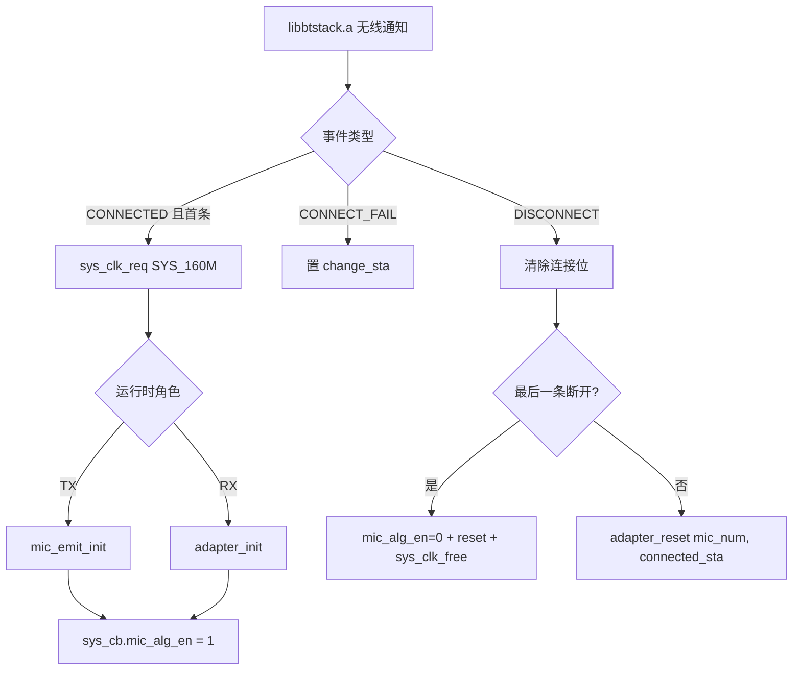

# AB5766 LE Mic 音频算法测试快速入门

> **适用对象**：已经能把本工程跑通「单 TX 采集发送 → 单 RX 接收 → 耳机出声」、准备逐项测试工程内音频算法的工程师。
>
> **本文定位**：只负责「算法发现方法 + 逐模块事实卡片 + 测试方法 + 测试记录规范」。当前 TX/RX 总链路总览见 [AB5766_音频算法与实时处理_新手入门.md](AB5766_音频算法与实时处理_新手入门.md)，不在此重复。
>
> **核心约束**：不把配置宏或函数名直接当成算法原理。每个模块都沿「配置宏 → 条件编译 → init → 每帧 process → reset/exit → 输入输出」的实际调用关系确认；预编译库核心只记录公开 API、包装层、调用时机和输入输出，不推测内部数学实现。

---

## 0. 当前实测结果与执行顺序（必读）

本节记录用户在当前板卡上已经完成的实测，以及后续算法测试的执行顺序。所有后续测试都在本节基线之上展开。

### 0.1 当前板卡与按键

- 当前开发板只有 `KEY_ID_PP`、`KEY_ID_K1`、`KEY_ID_K2` 三个有效按键，**没有 `KEY_ID_K3`**。
- 项目未定义 `WIRELESS_MIC_K12_KEY_EN`，编译使用 [port_key.c:51-57](../../projects/microphone/port/port_key.c#L51-L57) 的**非 K12** 按键表（详见第 10.2 节）。
- MAGIC 入口在当前板卡为 **K2 长按抬起**（`KEY_LONG_UP`，长按后松手触发）→ `MSG_CHANGE_MAGIC`，**不是** K3 单击、也不是双击。K12 配置下才是 K3 单击，当前板卡不适用。

### 0.2 已验证的声学链路

```text
手机外放音乐 → TX 麦克风采集 → 专有无线链路 → RX → 耳机正常听音
```

- 该链路已实测通过，证明 TX 采集、无线传输、RX 解码、DAC/耳机输出路径基本可用。
- **只能证明以上路径**。耳机听音正常 ≠ USB Mic 正常，也不证明算法客观指标（RMS/频谱/失真）已通过。

### 0.3 已完成的算法实测（听感 + 控制面日志证据）

| 算法 | 实测操作 | 听感结果 | 证据等级 | 证据边界 |
|---|---|---|---|---|
| 静音 | `KEY_ID_PP` 单击 → `MSG_VOL_MUTE` | 静音生效，恢复正常 | 听感 + 控制面日志 | 未量化静音期间残留/噪声底/恢复点击声 |
| Soft Gain 等级与渐变 | K1/K2 升降档位 | 等级单调衰减、渐变可辨识 | 听感 + 控制面日志 | 未量化各档 RMS 衰减、fade 时间、切换瞬态 |
| MAGIC | K2 长按抬起 → `MSG_CHANGE_MAGIC` | 档位切换可辨识 | 听感 + 控制面日志 | 测试时 `WIRELESS_MIC_MAGIC_EN` 曾临时改为 1，测后已改回 0 |

> **关键说明**：用户实测 MAGIC 时曾把 `WIRELESS_MIC_MAGIC_EN` 临时改为 1 构建/刷写，测完已改回 0。当前源码 `WIRELESS_MIC_MAGIC_EN=0`、`MAGIC_EFFECT_DEFAULT_LEVEL=3`（娃娃音）。MAGIC 的「按键消息链路」与「算法实际进入处理链」是两件事：`MSG_CHANGE_MAGIC` 总会被分派（见 [msg_mic_emit.c](../../functions/msg_mic_emit.c)），但 `magic_audio_process()` 只在 `WIRELESS_MIC_MAGIC_EN=1` 时进入 TX 音频链（见 [mic_proc.c](../../modules/wireless/mic_proc.c) 第 5 节条件编译顺序）。后续如需复测 MAGIC 算法效果，必须重新把宏改为 1 并构建。

> **ECHO 基线说明**：用户实测上述三项时 `WIRELESS_MIC_ECHO_EN=0`（ECHO 关闭），测后才改为当前的 1。因此「已实测的静音/Soft Gain/MAGIC 听感」是在 **ECHO 关闭** 条件下得到的。当前源码 ECHO=1，若要复现上述听感基线，需注意 ECHO 状态差异；后续按第 12 节顺序测试时，每项单独记录当前 ECHO 状态。

### 0.4 USB Mic 状态

- USB Mic 当前**尚未通过**，是电脑采集输入方向（RX 作为 USB Audio 麦克风端点供电脑录音），不是 USB 播放输出方向。
- **执行顺序**：后续算法先用 **RX 耳机** 完成所有 A/B 测试；USB Mic 故障排查放到算法测试之后，作为第 17 节的独立步骤。算法测试阶段不改动任何 USB 相关宏，不把 USB 未通过作为算法失败依据。
- `ADAPTER_USB_MIC_RX_EN=1` 只是编译期开关，实际运行还需 Adapter 角色 + USB 枚举成立（见第 17 节）。

### 0.5 后续算法执行顺序

先按「**耳机可观测**」原则完成以下顺序，每项只改一个宏/参数，独立构建/刷写/恢复：

1. **T03 TX EQ/DRC/PACC**（当前 `WIRELESS_MIC_EQ_DRC_EN=0`，先开 1）
2. **T05 双 TX Mix DRC**（`ADAPTER_MIX_DRC_EN` 1→0 对照）
3. **T06 PLC**（不改宏，弱信号/遮挡）
4. **T08-1 ECHO**（当前已为 1，先确认当前 ECHO 效果作为基线）
5. **T08-3 Room Reverb**（确认 ECHO 状态后单独开）
6. **T08-4/T08-5 TX/RX 移频**（分别单独开）
7. **T08-8 DNR_FRE**（TX、RX 分别单独开）
8. **T08-6/T08-7 Robotization / Allpass**（分别单独开）
9. **T08-9/T08-10 32k/SRC/AINS4**（需真实 32k 输入前置）
10. **T08-11 AGC**（最后，先验证构建/链接）
11. **第 17 节 USB Mic 分层排查**（算法全部测完后）

> T01 静音、T02 Soft Gain 已完成第一轮听感/控制面实测，如需补录音/RMS 量化证据，可在上述任意阶段穿插进行，不阻塞后续算法。

---


## 1. 证据等级与命名规则

测试结论按以下标签分类。文档中所有断言都应能追溯到对应等级。

| 标签 | 含义 | 典型来源 |
|---|---|---|
| **源码已确认** | C/H 中存在明确调用或实现 | Read 得到的函数体、行号 |
| **配置已确认** | 当前宏或 `xcfg_cb` 明确值 | [config_ab5766_le_mic.h](../../projects/microphone/config_ab5766_le_mic.h) |
| **资源依赖** | 需要 `effect.c/h`、`res.xm` 或参数资源 | prebuild.bat 生成物、`EFFECT_IDX_*` |
| **库边界** | 核心实现来自预编译库，只能描述 API/包装层 | `pacc_ctl_proc`、`lc3s_*`、`plc_soft_process_do` 等 |
| **需构建确认** | 需要编译、链接和 `map.txt` 验证 | Debug 构建、段放置、RAM/Flash 占用 |
| **需硬件确认** | 需要刷机、串口、录音或仪器验证 | 双板实机、示波器、频谱仪 |
| **名称待确认** | 只沿用源码已有名称，不扩写成未经证实的标准算法名 | `DNR_FRE`、`AINS4`、`MAGIC` 等 |

**明确禁止的推断**：

- ECHO 不称为 AEC（声学回声消除）。它是效果回声，见 [echo.c](../../modules/voice/echo.c)。
- Soft Gain 不称为 AGC。它是 table-based 数字衰减级，见 [soft_gain.c](../../modules/audio/soft_gain.c)。
- DNR_FRE / AINS4 / MAGIC 只使用源码名称和已证实入口，不扩写成标准 NS/VAD/Pitch-shift 数学实现。
- PACC 包装层不等于可读的 EQ/DRC 内核：`pacc_ctl_proc` 是库边界，见 [mic_effect.c](../../modules/effect/mic_effect.c)。
- LC3S / PLC 的内部算法不从调用名推断。

---

## 2. 算法在系统中的位置


**每个模块必须从 6 个位置追踪**，缺一不可：

1. **配置宏**：[config_ab5766_le_mic.h](../../projects/microphone/config_ab5766_le_mic.h) 中的 `WIRELESS_MIC_*` / `ADAPTER_*` 开关与参数。
2. **条件编译**：模块 .c 顶部的 `#if xxx_EN`，以及包装层中如 `PACC_FSH` 等链路接入条件。
3. **初始化**：`mic_emit_init()` 或 `adapter_init()` 中按顺序调用的 `*_init()`。
4. **逐帧处理**：`mic_enc_proc_cb()` 或 `mic_dec_prco_cb()` / `mic_dec_pcm_out()` 中的 `*_process()` / `*_audio_input()`。
5. **复位/退出**：`mic_emit_reset()` 或 `adapter_reset()` 中的 `*_exit()` / 重新 init。
6. **资源/API**：`EFFECT_IDX_*` 资源索引、在线调参 `effect_cfg_name`、按键消息、Dump 观测。

---

## 3. 算法总表（按源码调用关系）

下表按「在 TX/RX 主链中实际出现的位置」排列，不按名称猜测。**「当前宏」列以 [config_ab5766_le_mic.h](../../projects/microphone/config_ab5766_le_mic.h) 当前工作树实际值为准**；用户在实测过程中可能临时改过某些宏并在测后改回，以源码现状为准，实测细节见第 4 节。

| # | 模块 | 当前宏 | 角色/位置 | 关键证据 | 证据边界 |
|---|---|---|---|---|---|
| 1 | Soft Gain | `WIRELESS_MIC_SOFT_GAIN_EN=1` | TX，嵌入本地 PACC 链 | [soft_gain.c](../../modules/audio/soft_gain.c)、[mic_effect.c:164-187](../../modules/effect/mic_effect.c#L164-L187) | 可确认等级和渐变，不能称 AGC |
| 2 | TX EQ/DRC | `WIRELESS_MIC_EQ_DRC_EN=0` | TX，PACC 链 | [mic_eq_drc.c:18-48](../../modules/audio/mic_eq_drc.c#L18-L48)、[mic_effect.c:82-187](../../modules/effect/mic_effect.c#L82-L187) | 资源和 PACC 内核需运行时确认 |
| 3 | LC3S 编解码 | `WIRELESS_CON_CODEC_SEL=CODEC_LC3S` | TX 编码 / RX 解码 | `lc3s_enc_init/enc`、`lc3s_dec_init/dec` | 预编译核心不可展开 |
| 4 | PLC | 始终接入 | RX，每路 `bfi` 后 | [plc_soft.c:10-64](../../modules/voice/plc_soft.c#L10-L64) | 只能确认调用点和坏帧输入 |
| 5 | RX Mix DRC | `ADAPTER_MIX_DRC_EN=1` | RX 双路混音后 | [mic_eq_drc.c:57-84](../../modules/audio/mic_eq_drc.c#L57-L84)、[mic_effect.c:196-313](../../modules/effect/mic_effect.c#L196-L313) | 混音参数和内核需实测 |
| 6 | ECHO | `WIRELESS_MIC_ECHO_EN=1` | TX，32k/48k 分支 | [echo.c](../../modules/voice/echo.c) | 效果回声，不是 AEC |
| 7 | MAGIC | `WIRELESS_MIC_MAGIC_EN=0` | TX | [magic.c](../../modules/voice/magic.c) | 不推断变声数学实现 |
| 8 | Room Reverb | `WIRELESS_MIC_ROOM_REVERB_EN=0` | TX | [room_reverb.c](../../modules/voice/room_reverb.c) | 资源/延迟/组合限制需实测 |
| 9 | TX 移频 | `WIRELESS_FREQ_SHIFT2_EN=0` | PACC 链（`PACC_FSH`） | [mic_effect.c:120-122](../../modules/effect/mic_effect.c#L120-L122) | 只确认链路接入 |
| 10 | RX 移频 | `ADAPTER_FREQ_SHIFT_EN=0` | RX PACC 链 | `ADAPTER_FREQ_SHIFT_EN` | 只确认链路接入 |
| 11 | Robotization | `WIRELESS_MIC_ROBOTIZATION_EN=0` | TX 条件分支 | `robotization_mic_*` | 源码标注调试中 |
| 12 | Allpass/随机相位 | `WIRELESS_ALLPASS_FILTER_CHANGE_EN=0` | TX 条件分支 | `allpass_filter_change_set` | 源码标注调试中 |
| 13 | DNR_FRE | `WIRELESS_MIC_DNR_FRE_EN=0` / `ADAPTER_DNR_FRE_EN=0` | TX/RX 条件分支 | [dnr_fre.c](../../modules/voice/dnr_fre.c) | 核心策略需实测 |
| 14 | AINS4 32k | `WIRELESS_MIC_AINS4_32K_EN=0` | TX 32k 条件分支 | [ains4_32k.c](../../modules/voice/ains4_32k.c) | 需 32k 输入与异步前置 |
| 15 | SRC/32k | `WIRELESS_MIC_32K_EN=0` | TX ECHO 后、EQ/DRC 前 | `src_init`、`src_frame_resample` | 不能用 48k 冒充 32k |
| 16 | AGC | `WIRELESS_MIC_AGC_EN=0` | TX | `agc_audio_init` | 内部阈值属库边界 |

> Adapter 端另有 `ADAPTER_DAC_OUTPUT_EN=1`、`ADAPTER_USB_MIC_RX_EN=1`，属输出/USB 路径开关，不在算法表内单独列。

---

## 4. 统一事实卡片模板

每个模块测试时都按此模板记录，避免遗漏和过度推断。

```text
模块名:            （沿用源码名称）
名称依据:          源码已确认 / 名称待确认
当前宏:            xxx_EN = ?（config_ab5766_le_mic.h 行号）
角色:             TX / RX
输入:             采样率、帧长、声道、数据类型
输出:             采样率、帧长、数据类型
调用顺序:          init → 每帧 process → reset/exit（带行号）
资源参数:          EFFECT_IDX_*、默认等级、buf 大小
日志/按键入口:     init printf、MSG_*、在线调参 effect_cfg_name
可测现象:          RMS/频谱/瞬态/尾音/失真
通过标准:          明确的客观判据
恢复方式:          改回哪个宏/参数，是否需重新构建
不可推断内容:      库内核、空口细节、未证实标准算法名
```

---

## 5. TX 主链调用关系

### 5.1 逐帧编码入口 `mic_enc_proc_cb()`

[mic_proc.c:277-378](../../modules/wireless/mic_proc.c#L277-L378)：

1. 静音清零（[291-293](../../modules/wireless/mic_proc.c#L291-L293)）：`mic_enc_mute_en` 生效时 PCM 清零，发生在编码前。
2. 条件算法链（[297-345](../../modules/wireless/mic_proc.c#L297-L345)）：按条件编译顺序调用各 `*_audio_input` / `*_process`。
3. `lc3s_enc()`（[359](../../modules/wireless/mic_proc.c#L359)）。
4. `wireless_d2a_put_tx_frame()`（[363](../../modules/wireless/mic_proc.c#L363)）。
5. TX 本地 DAC 监听（[368-375](../../modules/wireless/mic_proc.c#L368-L375)）。

**TX 算法链条件编译顺序**（按源码实际分支，非按配置默认值）：

```text
AINS4 → ECHO(32k) → SRC → maxpower → EQ/DRC → DNR_FRE → ECHO(48k) → MAGIC → Robotization → Room Reverb → AGC → HUART dump → LC3S enc
```

注意：32k 与 48k 分支互斥，由 `WIRELESS_MIC_32K_EN` 决定；ECHO 在两个采样率下出现在链中不同位置。

### 5.2 TX 初始化 `mic_emit_init()`

[mic_proc.c:597-674](../../modules/wireless/mic_proc.c#L597-L674) 按顺序初始化：

- `lc3s_enc_init()`（[621](../../modules/wireless/mic_proc.c#L621)）
- allpass（[624-626](../../modules/wireless/mic_proc.c#L624-L626)）
- `src_init()`（[629](../../modules/wireless/mic_proc.c#L629)）
- `ains4_32k_mic_init()`（[633](../../modules/wireless/mic_proc.c#L633)）
- `echo_audio_init()`（[637](../../modules/wireless/mic_proc.c#L637)）
- `magic_audio_init()`（[641](../../modules/wireless/mic_proc.c#L641)）
- robotization（[645](../../modules/wireless/mic_proc.c#L645)）
- room_reverb（[649-650](../../modules/wireless/mic_proc.c#L649-L650)）
- `mic_eq_drc_init()`（[654](../../modules/wireless/mic_proc.c#L654)）
- `agc_audio_init()`（[658](../../modules/wireless/mic_proc.c#L658)）
- `dnr_fre_mic_init()`（[662](../../modules/wireless/mic_proc.c#L662)）
- `dac0_out_init()`（[666](../../modules/wireless/mic_proc.c#L666)）
- `bsp_sdadc_init()`（[669](../../modules/wireless/mic_proc.c#L669)）

### 5.3 TX 复位 `mic_emit_reset()`

[mic_proc.c:677-691](../../modules/wireless/mic_proc.c#L677-L691)：由最后一条链路断开触发（见第 9 节）。

---

## 6. RX 主链调用关系

### 6.1 逐帧解码入口 `mic_dec_prco_cb()`

[mic_proc.c:550-594](../../modules/wireless/mic_proc.c#L550-L594)：

1. `wireless_d2a_get_rx_frame()`（[565](../../modules/wireless/mic_proc.c#L565)）取帧并得到 `bfi`。
2. `lc3s_dec()`（[575](../../modules/wireless/mic_proc.c#L575)）（正常帧）。
3. `plc_soft_process(pcm, samples, last_bfi||bfi, idx)`（[579](../../modules/wireless/mic_proc.c#L579)）：坏帧或上一帧坏时进入 PLC。
4. `mic_dec_pcm_out()`（[586](../../modules/wireless/mic_proc.c#L586)）：单路或双路输出。
5. `mic_dec_dac_sync_proc()`（[590](../../modules/wireless/mic_proc.c#L590)）：DAC 调速，避免长时间后播放速度和发射端不匹配（仅 `idx==mic_dec.sync_idx` 时调用）。

### 6.2 RX 输出与混音 `mic_dec_pcm_out()`

[mic_proc.c:394-477](../../modules/wireless/mic_proc.c#L394-L477) 分两套：

- `WIRELESS_CON_COMB_BUF_EN` 分支与非分支两套；
- `mix_drc_audio_input()` 在 [405](../../modules/wireless/mic_proc.c#L405) 与 [458](../../modules/wireless/mic_proc.c#L458) 两处调用，位于双路相加之后。

### 6.3 RX 初始化 `adapter_init()` 与复位 `adapter_reset()`

- [mic_proc.c:700-734](../../modules/wireless/mic_proc.c#L700-L734)：`adapter_alg_init()`（[703](../../modules/wireless/mic_proc.c#L703)，内部调 `plc_soft_init` 0/1）、`lc3s_dec_init()`（[719](../../modules/wireless/mic_proc.c#L719)）、`mix_drc_init()`（[722](../../modules/wireless/mic_proc.c#L722)）、`dac0_out_init()`（[729](../../modules/wireless/mic_proc.c#L729)）。
- [mic_proc.c:736-750](../../modules/wireless/mic_proc.c#L736-L750)：`adapter_reset()` 调 `mic_dec_reset`、`plc_soft_exit`、`wireless_cmd_reset`、`m_lc3s_dec_exit`、`dac0_out_exit`（`con_sta==0` 时）。

---

## 7. TX EQ/DRC 与 Soft Gain 详解

### 7.1 EQ/DRC 包装入口

[mic_eq_drc.c:18-25](../../modules/audio/mic_eq_drc.c#L18-L25)：`mic_eq_drc_audio_input()` 仅当 `eq_drc_en && samples!=0` 时调 `loc_mic_pacc_process`。`eq_drc_en` 在 init 成功后才置位。

[mic_eq_drc.c:27-48](../../modules/audio/mic_eq_drc.c#L27-L48)：`mic_eq_drc_init()` 顺序为 `loc_mic_pacc_init` → `loc_mic_pacc_set_param` → `loc_mic_pacc_enable()`，**只有 enable 成功才置 `eq_drc_en=true`**；`soft_gain_init` 在 [44-46](../../modules/audio/mic_eq_drc.c#L44-L46)。

> 测试含义：UART 上看到 `loc_mic_pacc_init` / `loc_mic_pacc_enable` 不等于 EQ/DRC 参数已生效；只有 enable 返回成功且 `eq_drc_en=true` 才进入处理路径。参数实际效果仍需 A/B 实测。

### 7.2 PACC 链与 120 点分帧

[mic_effect.c:55-193](../../modules/effect/mic_effect.c#L55-L193)：

- `LOC_PACC_FRAME_LEN=120`（[55](../../modules/effect/mic_effect.c#L55)）。
- `loc_mic_pacc_init()`（[82-103](../../modules/effect/mic_effect.c#L82-L103)）：printf 函数名、`pacc_effect_eq_init/drc_init`、`pacc0_ctl_alloc(PACC0_LOC_MIC)`、`pacc_effect_link`。
- `loc_mic_pacc_set_param()`（[105-123](../../modules/effect/mic_effect.c#L105-L123)）：加载 `EFFECT_IDX_LOC_MIC_DRC/EQ` 资源；`PACC_FSH` 条件项在 [120-122](../../modules/effect/mic_effect.c#L120-L122)（TX 移频由此接入链）。
- `loc_mic_pacc_enable()`（[139-162](../../modules/effect/mic_effect.c#L139-L162)）：relink 并设 IO fmt；`SOFT_GAIN` 开启时为 S32_Q15 入、S16_Q15_SAT 出。
- `loc_mic_pacc_process()`（[164-187](../../modules/effect/mic_effect.c#L164-L187)）：120 点分帧、`soft_gain_proc_16bit` 逐点 S16→S32 转换写入 cache、`pacc_cs_list_set_io_addr_fsize`、`pacc_ctl_proc`（**库边界**）。

### 7.3 Soft Gain 是数字衰减级

[soft_gain.c:59-127](../../modules/audio/soft_gain.c#L59-L127)：

- `SOFT_GAIN_MAX_LEVEL==8` 分支：`soft_gain_tbl_8[9] = {N0DB, N2DB, N4DB, N6DB, N8DB, N10DB, N12DB, N15DB, N110DB}`。等级越大，衰减越大，音量越小（`N110DB` 在 index 8 近似静音）。
- `soft_gain_set_level()`（[59-72](../../modules/audio/soft_gain.c#L59-L72)）：clamp 到 `MAX_LEVEL`，选表。
- `soft_gain_init()`（[74-82](../../modules/audio/soft_gain.c#L74-L82)）：`step=1, fade_en=1`，初始 `level=SOFT_GAIN_DEFAULT_LEVEL(0)`。
- `soft_gain_up/down`（[84-94](../../modules/audio/soft_gain.c#L84-L94)）：up=index-1（减小衰减），down=index+1（增大衰减）。
- `soft_gain_proc_16bit()`（[110-128](../../modules/audio/soft_gain.c#L110-L128)）：`fade_en` 时 `curr_gain` 以 `step=1` 渐变逼近 `target_gain`；`temp=__builtin_muls_shift15(data, curr_gain)`。

> **结论**：Soft Gain 是 table-based 数字衰减 + fade 渐变，**不是 AGC**，没有反馈压缩。测试时确认「等级单调衰减」即可，不要写「自动增益」。

### 7.4 按键消息入口

[msg_mic_emit.c:48-123](../../functions/msg_mic_emit.c#L48-L123)：

- `MSG_VOL_MUTE`（[48-55](../../functions/msg_mic_emit.c#L48-L55)）：`mic_enc_mute_en_set(!get())` + `wireless_tx_mic_mute_level`，先检查 `connected_sta`。
- `MSG_VOL_UP`（[57-66](../../functions/msg_mic_emit.c#L57-L66)）：`soft_gain_up()` + `wireless_tx_soft_gain_level`。
- `MSG_VOL_DOWN`（[68-76](../../functions/msg_mic_emit.c#L68-L76)）：`soft_gain_down()` + `wireless_tx_soft_gain_level`。
- `MSG_ECHO_LEVEL_UP/DOWN`（[78-96](../../functions/msg_mic_emit.c#L78-L96)）：`echo_delay_level_up/down` + `wireless_tx_echo_delay_level`。
- `MSG_CHANGE_MAGIC`（[98-109](../../functions/msg_mic_emit.c#L98-L109)）：先 mute → `magic_effect_level_change` → 取消 mute + `wireless_tx_magic_effect_level`。
- `MSG_VOICE_RM`（[111-123](../../functions/msg_mic_emit.c#L111-L123)）：body 注释掉。

> 每个 TX 命令前都检查 `wireless_mic_connected_sta_get()`；未连接时命令不生效。

---

## 8. RX Mix DRC 与 PLC 详解

### 8.1 Mix DRC 包装

[mic_eq_drc.c:57-84](../../modules/audio/mic_eq_drc.c#L57-L84)：`mix_drc_audio_input()`（[62-65](../../modules/audio/mic_eq_drc.c#L62-L65)）、`mix_drc_init()`（[68-78](../../modules/audio/mic_eq_drc.c#L68-L78)）。文件注释：MIX_DRC 约 180us。

### 8.2 Mix PACC 链与双路相加

[mic_effect.c:196-313](../../modules/effect/mic_effect.c#L196-L313)：

- `MIX_PACC_FRAME_LEN=120`（[199](../../modules/effect/mic_effect.c#L199)）。
- `mix_pacc_process()`（[294-313](../../modules/effect/mic_effect.c#L294-L313)）。
- 两路相加：`mix_temp_buf[i]=ibuf0[i]+ibuf1[i]`（[303](../../modules/effect/mic_effect.c#L303)）。

> 测试含义：双路同时输入时，相加后可能削顶，再进 Mix DRC。Mix DRC 的具体压缩参数仍需资源与实测确认，不能凭「调用了 mix_pacc」写「压缩已生效」。

### 8.3 PLC 包装层

[plc_soft.c:10-64](../../modules/voice/plc_soft.c#L10-L64)：

- `CH_NUM=2`，`m_st[CH_NUM]` 放 `AT(.buf.plc_buf)`。
- `plc_soft_process(int_data, samples, bfi, idx)`（[11-16](../../modules/voice/plc_soft.c#L11-L16)）→ `plc_soft_process_do`（**库，不可读**）。
- `plc_soft_init(idx, pkt_len, sample_rate)`（[19-53](../../modules/voice/plc_soft.c#L19-L53)）：`sample_rate>=SAMPLE_RATE_16K` 用 `_8K` 系列参数。
- `plc_soft_exit(idx)`（[56-64](../../modules/voice/plc_soft.c#L56-L64)）：`enable=false`，`delay_5ms(2)`，重新 init。

> 测试含义：只能确认「坏帧进入 PLC」这一调用点，不能凭源码宣称 PLC 的具体预测/波形隐藏策略。

---

## 9. 算法生命周期：连接事件驱动

[wireless_proc.c:90-295](../../modules/wireless/wireless_proc.c#L90-L295) 的 `wireless_emit_notice()`：



- 首条连接（`connected_sta==0`）：[98-111](../../modules/wireless/wireless_proc.c#L98-L111)，申请 160M、调 `adapter_init()`/`mic_emit_init()`、置 `mic_alg_en=1`。
- 断开：[162-202](../../modules/wireless/wireless_proc.c#L162-L202)，清位；最后一条断开时 `mic_alg_en=0`、reset、`sys_clk_free`；否则 `adapter_reset(mic_num, connected_sta)`（[193](../../modules/wireless/wireless_proc.c#L193)）。

> 测试含义：算法 init/reset 与连接状态绑定。测试某个算法前必须确认链路已建立（`connected_sta != 0`）；断连重连后算法会重新 init，参数恢复默认，需在测试记录中标注。

---

## 10. 在线调参、按键与无线观测

### 10.1 在线调参两条入口

**入口 A：EQ/DRC 简易收包**（[eq_drc_dbg_in_uart.c](../../modules/audio/eq_drc_dbg_in_uart.c)，宏 `EQ_DRC_DBG_IN_UART`）：

- `eq_drc_dbg_cmd_process()`（[28-34](../../modules/audio/eq_drc_dbg_in_uart.c#L28-L34)）：`data[0..2]=='C','F','G'` → `msg_enqueue(EVT_ONLINE_SET_EFFECT)`，`rx_type=1`。
- `eq_drc_dbg_init()`（[36-51](../../modules/audio/eq_drc_dbg_in_uart.c#L36-L51)）：`bsp_hsuart_cfg` baud=1500000，`rx_isr_en=1`，isr 指向 `eq_drc_dbg_cmd_process`。
- `tx_ack()`（[17-25](../../modules/audio/eq_drc_dbg_in_uart.c#L17-L25)）：`delay_5ms(1)`，`rx_type` 时 `bsp_huart_tx`。

**入口 B：toolkit 在线调试**（[toolkit.c](../../modules/tool/toolkit.c)，宏 `EFFECT_DBG_ADJUST_IN_UART`，依赖 `EFFECT_DBG_ADJUST_EN`）：

- `toolkit_process()`（[105-166](../../modules/tool/toolkit.c#L105-L166)）：
  - `size` 在偏移 12（[108](../../modules/tool/toolkit.c#L108)）；`cal_crc = calc_crc(eq_rx_buf, size+XTP_EFFECT_FRAME_HEAD_TAG, 0xffff)`（[109](../../modules/tool/toolkit.c#L109)），`res_crc` 在偏移 `size+XTP_EFFECT_FRAME_HEAD_TAG`（[110](../../modules/tool/toolkit.c#L110)）。
  - CRC 不匹配：`toolkit_ack=1`，`printf("-->CRC_ERROR %x %x")`（[118-122](../../modules/tool/toolkit.c#L118-L122)）。
  - 三种 `CFG` 前缀（12 字节 memcmp）：
    - `"CFG_########"`（[124](../../modules/tool/toolkit.c#L124)，带下划线）：链路一致性校验，比对 `ALL_MODE_NAME_SUM`，不匹配 `ack=1`。
    - `"CFG#########"`（[129](../../modules/tool/toolkit.c#L129)）：特殊指令，`toolkit_cmd_process()`（`TOOL_CMD_GET_BIN` 等）。
    - `"CFG_BIN#####"`（[132](../../modules/tool/toolkit.c#L132)）：回读 BIN，`toolkit_get_bin()`。
  - 模块名匹配循环（[138-155](../../modules/tool/toolkit.c#L138-L155)）：遍历 `CFG_MAX`，`memcmp(eq_rx_buf, effect_info[i].effect_cfg_name, 12)`；命中则 `printf("%s Online")`（[143](../../modules/tool/toolkit.c#L143)）并调 `effect_update_callback_tbl[i].effect_update_callback`；无回调则 `TRACE("NO INIT CALLBACK")`（[147](../../modules/tool/toolkit.c#L147)）；全部未命中 `ack=1`。
  - ACK：14 字节 = 12 拷贝 + `toolkit_ack`（[160](../../modules/tool/toolkit.c#L160)）+ `toolkit_calc_check_sum`（[161](../../modules/tool/toolkit.c#L161)），`tx_ack(14)`（[163](../../modules/tool/toolkit.c#L163)）。
- `toolkit_ack_fail()`（[27-31](../../modules/tool/toolkit.c#L27-L31)）：外部置 `toolkit_ack=1`。
- `toolkit_init()/exit()`（[169-177](../../modules/tool/toolkit.c#L169-L177)）：WEAK，空实现。

> **在线调参验证要点**：记录 CRC 校验结果、匹配到的 `effect_cfg_name`、`Online` 日志、ACK 字节、`CRC_ERROR`/`NO INIT CALLBACK` 失败日志。出现函数名日志不等于参数已下发到 DSP 内核，最终效果仍需 A/B 录音确认。

### 10.2 按键映射表

[port_key.c:42-58](../../projects/microphone/port/port_key.c#L42-L58)（`evt_type_2_msg_idx` 见 [6-39](../../projects/microphone/port/port_key.c#L6-L39)）：

`WIRELESS_MIC_K12_KEY_EN` 版（[43-49](../../projects/microphone/port/port_key.c#L43-L49)）：

| 键 | 单击 | 长按下 | HOLD | 双击 | 长按抬起 |
|---|---|---|---|---|---|
| PP | MSG_VOL_MUTE | MSG_NO | MSG_PWR_HOLD | MSG_NO | MSG_NO |
| K1 | MSG_VOL_UP | MSG_NO | MSG_NO | MSG_ECHO_LEVEL_UP | MSG_NO |
| K2 | MSG_VOL_DOWN | MSG_NO | MSG_NO | MSG_ECHO_LEVEL_DOWN | MSG_NO |
| K3 | MSG_CHANGE_MAGIC | MSG_VOICE_RM | MSG_NO | MSG_NO | MSG_NO |

非 K12 版（[51-57](../../projects/microphone/port/port_key.c#L51-L57)）——**当前板卡实际使用此表**：

| 键 | 单击 | 长按下 | HOLD | 长按抬起 | 双击 |
|---|---|---|---|---|---|
| PP | MSG_VOL_MUTE | MSG_NO | MSG_PWR_HOLD | MSG_NO | MSG_NO |
| K1 | MSG_VOL_UP | MSG_NO | MSG_NO | MSG_NO | MSG_NO |
| K2 | MSG_VOL_DOWN | MSG_NO | MSG_NO | **MSG_CHANGE_MAGIC** | MSG_NO |
| K3 | MSG_NO | MSG_NO | MSG_NO | MSG_NO | MSG_NO |

> **当前板卡要点**：当前板卡只有 PP/K1/K2，无 K3。事件索引含义见 [port_key.c:6-39](../../projects/microphone/port/port_key.c#L6-L39)：`KEY_SHORT_UP`=单击(0)、`KEY_LONG`=长按下(1)、`KEY_HOLD`(2)、`KEY_LONG_UP`=**长按抬起**(3，松手时触发)、`KEY_DOUBLE`=双击(4)。因此当前板卡 **MAGIC = K2 长按后松手触发**，不是按下、不是双击、也不是 K3。

Adapter 模式（[61-67](../../projects/microphone/port/port_key.c#L61-L67)）：除 PP 长按 `MSG_PWR_HOLD` 外全 `MSG_NO`，**Adapter 无按键算法消息**。

> 测试含义：当前非 K12 板卡下，ECHO 双击入口（K1/K2 双击）**不可用**，ECHO 延迟档位需改用在线调参或改配置；MAGIC 通过 K2 长按抬起切换；Soft Gain 加减仍为 K1/K2 单击。

### 10.3 无线 PER/RSSI 诊断

[wireless_dump.c](../../modules/wireless/wireless_dump.c)，宏 `WIRELESS_DUMP_EN`（当前默认 0）：

- `wireless_dump_set_rx_status()`（[39-48](../../modules/wireless/wireless_dump.c#L39-L48)）：指数加权 RSSI（`WL_RSSI_WEIGHT=2`）+ PER 计数。
- `wireless_dump_per()`（[70-86](../../modules/wireless/wireless_dump.c#L70-L86)）：`printf("Link%d, PER=%3d%%, total=%3d, err=%3d, rssi=%d")`。
- `wireless_dump_proc()`（[97-107](../../modules/wireless/wireless_dump.c#L97-L107)）：每 1000ms 打印每路 PER。
- `wireless_dump_set_chmap_cb()`：打印 `CHMAP_UPD`。

> `WIRELESS_DUMP_EN` 默认关闭，**需要 PER/RSSI 时必须单独建诊断构建**，测试完成后恢复 0；Dump 输出不得影响实时音频基线。

### 10.4 可选 PCM 观测

- `DUMP_HUART`：TX 编码前后 PCM dump（条件编译）。
- ECHO 的 `UARTDUMP_ECHO_EN=0`（[echo.c:25](../../modules/voice/echo.c#L25)）：ECHO 前后 PCM dump。

> 警告：Dump 带宽可能破坏实时链路；若开 Dump 后基线出现卡顿/溢出，应停止该观测方式并改用录音。

---

## 11. 阶段 0 与阶段 1：建立基线

### 阶段 0：固定基线，不改变算法

保存以下产物作为回归参照：

- 当前 Git commit、[config_ab5766_le_mic.h](../../projects/microphone/config_ab5766_le_mic.h)；
- `effect.c/h`、`xcfg.h`、`map.txt`（prebuild/postbuild 生成物）；
- TX/RX 固件（`app.rv32`、`app.bin`、`app.dcf`、`download.xm`）；
- 版本字符串（`SW_VERSION`，当前 `V0.0.1`）。

确认工程当前状态确实能完成「单 TX → 单 RX → 耳机输出」。

### 阶段 1：无新算法改动的基线观测

1. 单 TX → 单 RX，连续语音 / 1 kHz 正弦；
2. 记录 TX 本地 DAC 与 RX 耳机/USB Mic 的 RMS、峰值、频谱、连续性；
3. 记录连接、初始化、断连、重连日志；
4. 检查 `map.txt`、RAM/Flash、异常复位、DAC FIFO；
5. 此基线作为所有 A/B 测试的参照。

### 测试记录目录格式

```text
Txx_<module>_<configuration>_<date>/
  config_diff.txt      # 相对基线的宏/参数差异
  build_log.txt        # Debug 构建输出
  tx_uart.log          # TX 串口日志
  rx_uart.log          # RX 串口日志
  map.txt              # 本次构建 map
  tx_dac.wav           # TX 本地监听录音
  rx_dac.wav           # RX 耳机/DAC 录音
  rx_usb_mic.wav       # RX USB Mic 录音
  instrument.csv       # 仪器/频谱数据
  result.md            # 五类证据结论
```

---

## 12. 推荐测试顺序（T01–T08）

**每项测试统一流程**：单独改一个宏或一个参数 → Debug 构建 → 刷写目标角色 → 完全断电重启 → 固定输入 → 串口/录音/仪器观测 → 与基线 A/B → 记录结果 → 恢复基线。**未完成当前项或无法恢复时，不进入下一项。**

### T01：静音路径

- **改动**：不改配置，通过既有按键/消息触发静音。
- **代码证据**：[mic_proc.c:291-293](../../modules/wireless/mic_proc.c#L291-L293)（静音在编码前清零 PCM）；[msg_mic_emit.c:48-55](../../functions/msg_mic_emit.c#L48-L55)（`MSG_VOL_MUTE`）。
- **观测**：RX 输出噪声底、静音恢复、点击声；记录 `MSG_VOL_MUTE` 与相关 TX_CMD。
- **通过**：静音期间无原始测试音，取消后恢复，无明显爆音。

> **第一轮实测状态（敲击麦克风）**：已通过 UART 验证 `MSG_VOL_MUTE` → `TX_CMD0: 02 03 01` / `02 03 00` 在 TX/RX 两端逐条一致，`rx_cntl`/`RX_CMD0` 与 TX 端 payload 匹配。**这仅证明控制面命令链路**，未量化静音期间 RX 输出残留、噪声底和恢复点击声。音频效果仍需按下面的「固定输入与录音观测」补测。

### T02：Soft Gain 等级与渐变

- **改动**：`WIRELESS_MIC_SOFT_GAIN_EN=1`（已开），不改其他算法；按 K1/K2 逐档测试 0/1/2/4/8。
- **代码证据**：[soft_gain.c:59-127](../../modules/audio/soft_gain.c#L59-L127)、[mic_effect.c:164-187](../../modules/effect/mic_effect.c#L164-L187)、[msg_mic_emit.c:57-76](../../functions/msg_mic_emit.c#L57-L76)。
- **输入**：固定 1 kHz 正弦。测 TX/RX RMS、频谱、切换瞬态。
- **通过**：等级增大时单调衰减；无明显跳变/新谐波；明确它是数字衰减，不是 AGC。

> **第一轮实测状态（敲击麦克风）**：已通过 UART 验证 `MSG_VOL_DOWN` 起始为 `02 01 08 01`，连续 `MSG_VOL_UP` 经 `07/06/05/04/03/02/01` 回到 `00 01`，再次 `MSG_VOL_UP` 仍保持 `00 01`（level 0 边界 clamp）。TX/RX 两端 `tx_cntl`/`rx_cntl` 逐条一致。**这仅证明控制面命令链路与等级边界**，未量化各档实际 RMS 衰减、fade 渐变时间和切换瞬态。音频效果仍需按下面的「固定输入与录音观测」补测。

### T01/T02 固定输入与录音观测（不改固件、不刷机）

第一轮 UART 验证已完成，但「敲击麦克风」不能量化 Soft Gain 和静音的音频效果。本节给出无示波器、无专业音频仪器的可执行补测方案。**本阶段不修改任何配置宏、不构建、不刷写。**

#### 1. 准备固定 1 kHz 激励（二选一）

- **方案 A（推荐，外部声学激励）**：用电脑或手机外放一段单声道、48 kHz、16-bit PCM WAV，结构为 `2s 静音 + 5s 1 kHz 正弦 + 2s 静音`。仓库已提供生成脚本 [tests/audio/gen_1khz_sine.ps1](../../tests/audio/gen_1khz_sine.ps1)，运行后产出 `1khz_sine_48k_mono_16bit.wav`（幅度默认 0.5 / 约 -6 dBFS，正弦段带 5ms 渐入渐出以避免自身 click）。该文件只作为播放源，不进入固件。
- **方案 B（工程内置正弦，需先确认声学可达）**：`modules/audio/dec/sin_dec.c` 的 `SinData_48k_16bit` 与 `sin_res_play()`/`sin_res_play_proc()` 提供板载 1 kHz 播放路径，但**未确认它能否驱动扬声器/换能器形成麦克风可录到的声学激励**。若需用此路径，必须先确认硬件连接和现有产品调用入口，不能假定它已接入麦克风输入。未确认前使用方案 A。

> 不建议第一轮用歌曲：歌曲含多频率、动态压缩、鼓点和人声，无法清楚判断 Soft Gain 的等级衰减。歌曲只作为后续主观听感补充。

#### 2. 录音方式（按可获取条件，从高到低）

1. **RX USB Mic 直接录入电脑**（当前 `ADAPTER_USB_MIC_RX_EN=1`）：电脑识别 RX 为 USB 音频设备后录音，设为 48 kHz / 单声道 / WAV 或无损，**关闭电脑端软件降噪、AGC、回声消除和重采样**。这是最接近「数字输出」的观测点。
2. **录制 RX 耳机/DAC 输出**：若 USB Mic 不可用，用另一台手机/电脑麦克风对准 RX 耳机，固定距离、角度和播放音量。受声学环境影响，结论标为「声学录制证据」。
3. **仅耳机主观 A/B**：只有耳机时只能做听感比较，结论必须标为「听感证据」，不得升级为音频测量结论。

#### 3. Soft Gain 等级测试序列

固定外放音量、TX 麦克风距离和角度后：

1. 确认连接建立（`connected_sta != 0`），Soft Gain 设到 level 0（开机默认）；
2. 循环播放 1 kHz WAV，录音 ≥ 3 秒稳定段；
3. 依次 `MSG_VOL_DOWN` 到 level 1、2、4、8，每档等待 fade 渐变完成后各录 ≥ 3 秒；
4. 再做 8 → 0 反向 `MSG_VOL_UP`，每档录音；
5. 每档至少重复两次，同时保存 TX UART、RX UART 和对应录音文件。

**观测点**：各档 RMS 是否随等级单调变小；level 8 是否接近静音；切换瞬间是否有 click / 音量跳变；频谱中 1 kHz 是否仍在、是否出现新谐波；RX 输出与 TX 本地 DAC 趋势是否一致。

**通过标准（当前测试条件下）**：等级增大时 RMS 单调衰减，无新谐波，切换无明显爆音。仍属「数字衰减」，不是 AGC。

#### 4. 静音测试序列

稳定播放 1 kHz 后：

1. 录「静音前」3 秒；
2. `MSG_VOL_MUTE` → `02 03 01`，录「静音中」3 秒；
3. `MSG_VOL_MUTE` → `02 03 00`，录「恢复后」3 秒。

**观测点**：静音期间 1 kHz 是否消失；噪声底是否明显下降；恢复时是否有爆音/点击声；TX_CMD/RX_CMD 与音频段是否时间对应。

**通过标准**：静音期间无 1 kHz 残留，恢复后信号恢复，无明显爆音。UART 只能证明命令链路，不能替代音频录音。

#### 5. 结果分级

| 证据 | 可标记结论 |
|---|---|
| 仅 UART 日志 | 「控制面命令链路已验证」「Soft Gain 等级边界已观察」 |
| + 录音波形 | 可判断输出是否随等级单调变化、静音残留 |
| + RMS / 峰值 / 频谱 | 可给出当前条件下 Soft Gain / 静音的音频 A/B 结论 |
| + TX/RX 两端重复记录 | 才可标记「本次测试条件下通过」 |

> **不得**把敲击测试或 TX/RX payload 一致直接写成算法完全通过；**不得**在无音频录音时把 T01/T02 标为「音频效果已验证」。

#### 6. 恢复流程

1. 停止 1 kHz WAV 外放，停止 PC 录音，安全断开 RX USB Mic；
2. 外部扬声器音量恢复原值或静音；
3. 确认配置仍为 48 kHz / 单声道 / 120 samples，`WIRELESS_MIC_SOFT_GAIN_EN=1`、`ADAPTER_USB_MIC_RX_EN=1` 与测试前一致（本阶段未改配置，无需恢复固件）；
4. Soft Gain 回到 level 0，静音状态为关闭；
5. 若 USB 枚举异常或 UART 无响应，正常软件复位/重新上电，**不刷写、不改持久化配置**；
6. 保留所有录音和 UART 日志，尤其是「证据不足」样本，避免把路径响应误报为音频验证。

### T03：TX EQ/DRC 资源与在线调参

- **改动**：保持 `WIRELESS_MIC_EQ_DRC_EN=1`，确认 `effect.c/h` 与资源版本一致。
- **代码证据**：[mic_eq_drc.c:18-48](../../modules/audio/mic_eq_drc.c#L18-L48)、[mic_effect.c:82-187](../../modules/effect/mic_effect.c#L82-L187)、[toolkit.c](../../modules/tool/toolkit.c)、[eq_drc_dbg_in_uart.c](../../modules/audio/eq_drc_dbg_in_uart.c)。
- **步骤**：先确认 init 日志（`loc_mic_pacc_init`、`loc_mic_pacc_enable`、`mic_eq_drc_init`）；再用 1.5 Mbps UART 工具做 EQ/DRC A/B。
- **输入**：扫频/粉红噪声/多电平语音。测频响、RMS、峰值、压缩变化、CPU 实时性。
- **通过**：资源/配置成功、A/B 差异可重复、无卡顿/溢出/重启。**失败时不能把「调用了 PACC」写成「参数已生效」**。

### T04：RX 单路 DAC/USB Mic 输出

- **改动**：保持单 TX 连接，确认 `ADAPTER_DAC_OUTPUT_EN=1`、`ADAPTER_USB_MIC_RX_EN=1`。
- **代码证据**：[mic_proc.c:394-477](../../modules/wireless/mic_proc.c#L394-L477)、[mic_proc.c:736-750](../../modules/wireless/mic_proc.c#L736-L750)。
- **观测**：录耳机/DAC 与 USB Mic，验证采样率、单声道、连续性、重枚举、重连。
- **定位**：此项是输出基准，不是新算法效果判定。

### T05：双 TX 混音与 Mix DRC

- **改动**：连接两台 TX；`WIRELESS_CON_LINK_NB=2`、`ADAPTER_MIX_DRC_EN=1`；最后做 `ADAPTER_MIX_DRC_EN=0` A/B。
- **代码证据**：[mic_effect.c:294-313](../../modules/effect/mic_effect.c#L294-L313)（两路相加进 Mix PACC）、[mic_eq_drc.c:57-84](../../modules/audio/mic_eq_drc.c#L57-L84)。
- **观测**：分别单路、同时不同频率/语音；测削顶、通道错乱、一路断开对另一路的影响。

### T06：可控弱信号/丢包与 PLC

- **改动**：不改源码，用受控距离/遮挡/衰减；若需 PER/RSSI，单独开 `WIRELESS_DUMP_EN` 诊断构建。
- **代码证据**：[mic_proc.c:565-590](../../modules/wireless/mic_proc.c#L565-L590)（`bfi`→`plc_soft_process`）、[plc_soft.c:10-64](../../modules/voice/plc_soft.c#L10-L64)、[wireless_dump.c](../../modules/wireless/wireless_dump.c)。
- **观测**：爆音、静音、重复音、恢复瞬态、双路状态隔离。
- **不可推断**：不能凭源码宣称 PLC 的具体预测/波形隐藏策略。

### T07：重连与长期稳定性

- **改动**：已验证基础效果后，单路/双路分别断开、全部断开、交替重连、至少 2 小时连续运行。
- **观测**：init/reset 次数、残留音频、内存/栈、FIFO、看门狗、参数状态。

### T08：逐个打开当前默认关闭的 TX 算法

**严格一次只开一个宏，每次都以关闭版为直接对照。** 顺序建议：

#### T08-1 ECHO

- **当前宏**：`WIRELESS_MIC_ECHO_EN=1`（[config_ab5766_le_mic.h:101](../../projects/microphone/config_ab5766_le_mic.h#L101)）。**当前源码已为 1**，但第一轮实测静音/Soft Gain/MAGIC 时此宏为 0，测后才改 1（见第 0.3 节）。因此 ECHO 尚未在 `=1` 下做过正式 A/B，需补测。
- **本次只改这一处**：当前已是 1，无需改宏即可测；若要做 `=0` 对照，只把此宏改 0，其他不动。**不得同时改 32k/Room Reverb 等宏**。
- **调用链（TX，`sys_cb.mic_alg_en` 域内）**：
  - init：[mic_proc.c:636-638](../../modules/wireless/mic_proc.c#L636-L638) `echo_audio_init(0, WIRELESS_MIC_SAMPLES_SELECT, 1)`（`#if WIRELESS_MIC_ECHO_EN`，`mic_emit_init` 路径）。
  - process（当前走这条，32k=0）：[mic_proc.c:322-324](../../modules/wireless/mic_proc.c#L322-L324) `echo_audio_process(pcm, WIRELESS_MIC_SAMPLES_SELECT)`（`#if WIRELESS_MIC_ECHO_EN && !WIRELESS_MIC_32K_EN`）。
  - 32k 路径（当前不走）：[mic_proc.c:301-303](../../modules/wireless/mic_proc.c#L301-L303)（`#if WIRELESS_MIC_ECHO_EN && WIRELESS_MIC_32K_EN`）。
  - 源码：[echo.c](../../modules/voice/echo.c)：`echo_audio_init`（[239-287](../../modules/voice/echo.c#L239-L287)）、`echo_audio_process`（[39-47](../../modules/voice/echo.c#L39-L47)）、`echo_audio_param_set`（[207-236](../../modules/voice/echo.c#L207-L236)）。
- **参数宏**（[config:140-146](../../projects/microphone/config_ab5766_le_mic.h#L140-L146)）：`ECHO_LEVEL=70`、`ECHO_DRY_USER=32767`、`ECHO_WET_USER=20000`、`ECHO_DELAY_MAX_LEVEL=9`、`ECHO_DELAY_DEFAULT_LEVEL=8`、`ECHO_DELAY_BUF_SIZE=6000`、`ECHO_ATTENUATION_MAX_LEVEL=16`。
- **前置**：48 kHz / 120 samples / 单声道基线；单 TX→单 RX 已连接（`connected_sta != 0`）；`sys_cb.mic_alg_en=1`。
- **入口（按键调延迟档位）**：K12 配置——K1/K2 双击调延迟档位；**当前非 K12 板卡——K1/K2 双击均为 `MSG_NO`**（[port_key.c:54-55](../../projects/microphone/port/port_key.c#L54-L55)），**按键无法调 ECHO 延迟档位**。需改用在线调参（`echo_audio_param_set`）或改配置宏 `ECHO_DELAY_DEFAULT_LEVEL` 重新构建。
- **输入**：拍手、短脉冲、短词；稳定人声做尾音观察。
- **观测（优先 RX 耳机）**：尾音长度、衰减层次、延迟档位变化、有无自激/金属音；与 `=0` 基线 A/B。
- **预期**：能听到可辨识的回声尾音；延迟档位改变时尾音长度变化；无持续自激。
- **通过**：效果可重复、切换无明显爆音、无卡顿/复位；与基线差异可归因于 ECHO。
- **停止**：出现自激/持续啸叫/削顶/卡顿/复位立即停止。
- **恢复**：若为对照改过 `=0`，测完改回 `=1`（当前基线值）；按键入口在当前板卡不可用，不要为调档位改按键表。
- **库边界**：ECHO 是效果回声，**不得称 AEC/回声消除**；`echo.c` 为可读源码，但其内部滤波/延迟线实现以源码可见函数体为准，不推测未文档化的数学策略。

#### T08-2 MAGIC

- **当前宏**：`WIRELESS_MIC_MAGIC_EN=0`（[config_ab5766_le_mic.h:103](../../projects/microphone/config_ab5766_le_mic.h#L103)）；`MAGIC_EFFECT_DEFAULT_LEVEL=3`（[config:149](../../projects/microphone/config_ab5766_le_mic.h#L149)，娃娃音）。第一轮已实测（曾临时改 1 测后改回 0，见第 0.3 节），本卡片为正式 A/B 复测。
- **本次只改这一处**：`WIRELESS_MIC_MAGIC_EN: 0 → 1`，其他不动。
- **调用链（TX，`sys_cb.mic_alg_en` 域内）**：
  - init：[mic_proc.c:640-642](../../modules/wireless/mic_proc.c#L640-L642) `magic_audio_init(0, WIRELESS_MIC_SAMPLES_SELECT)`（`#if WIRELESS_MIC_MAGIC_EN`，`mic_emit_init` 路径）。
  - process：[mic_proc.c:326-328](../../modules/wireless/mic_proc.c#L326-L328) `magic_audio_process(pcm, WIRELESS_MIC_SAMPLES_SELECT)`（`#if WIRELESS_MIC_MAGIC_EN`）。
  - 源码：[magic.c](../../modules/voice/magic.c)：`magic_effect_tbl[]` 5 档（0 原音 / 5000 男神 / -13500 女神 / -30000 娃娃音 / 15000 魔兽）；`magic_audio_init`（[43-55](../../modules/voice/magic.c#L43-L55)）、`magic_effect_level_change`（[68-75](../../modules/voice/magic.c#L68-L75)）。
- **前置**：48 kHz / 120 samples / 单声道基线；单 TX→单 RX 已连接；`sys_cb.mic_alg_en=1`。
- **入口（按键）**：K12 配置——K3 单击切换档位；**当前非 K12 板卡——K2 长按抬起**（`KEY_LONG_UP`，长按后松手触发）→ `MSG_CHANGE_MAGIC`，见 [port_key.c:55](../../projects/microphone/port/port_key.c#L55)（第 4 列，事件索引 3）。当前板卡无 K3，不能用 K3 入口。
- **入口（消息处理）**：`MSG_CHANGE_MAGIC` → [msg_mic_emit.c:98-109](../../functions/msg_mic_emit.c#L98-L109)（先 mute → `magic_effect_level_change` → 取消 mute + `wireless_tx_magic_effect_level`）。注意：**按键消息触发与算法是否进入每帧 process 链是两件事**——只有 `WIRELESS_MIC_MAGIC_EN=1` 时 `magic_audio_init`/`magic_audio_process` 才进入 TX 音频链；宏=0 时按键消息仍会执行 `magic_effect_level_change`（改等级变量），但不会听到变声效果。
- **输入**：稳定人声（朗读固定短句），便于辨识音高变化。
- **观测（优先 RX 耳机）**：各档音高/音色变化（原音→男神→女神→娃娃音→魔兽），切换瞬态有无爆音（消息处理已先 mute）。
- **预期**：5 档可辨识且互不相同；切换时有短暂 mute，无大爆音。
- **通过**：档位变化可重复、听感与 `magic_effect_tbl` 对应、无卡顿/复位。
- **停止**：出现削顶/爆音/卡顿/复位立即停止。
- **恢复**：测完 `WIRELESS_MIC_MAGIC_EN` 改回 `0`（当前基线值）；`MAGIC_EFFECT_DEFAULT_LEVEL` 不动。
- **库边界**：MAGIC 是变声（pitch shift 类）效果，档位表是源码可见事实；其内部 pitch 算法以可读源码为准，不推测未文档化的实现。

#### T08-3 Room Reverb

- **当前宏**：`WIRELESS_MIC_ROOM_REVERB_EN=0`（[config_ab5766_le_mic.h:107](../../projects/microphone/config_ab5766_le_mic.h#L107)）；`ROOM_REVERB_LEVEL=99`、`ROOM_REVERB_DRY=32767`、`ROOM_REVERB_WET=26000`（[config:156-158](../../projects/microphone/config_ab5766_le_mic.h#L156-L158)）。
- **本次只改这一处**：`WIRELESS_MIC_ROOM_REVERB_EN: 0 → 1`。
- **调用链（TX，`sys_cb.mic_alg_en` 域内）**：
  - init：[mic_proc.c:648-651](../../modules/wireless/mic_proc.c#L648-L651) `room_reverb_audio_init_cfg` + `room_reverb_audio_init`（`#if WIRELESS_MIC_ROOM_REVERB_EN`）。
  - process：[mic_proc.c:334-336](../../modules/wireless/mic_proc.c#L334-L336) `room_reverb_audio_process(pcm, WIRELESS_MIC_SAMPLES_SELECT)`。
  - 源码：[room_reverb.c](../../modules/voice/room_reverb.c)：`room_reverb_audio_init`（[60-80](../../modules/voice/room_reverb.c#L60-L80)，`decay=99, dry=32767, wet=26000, samples=48000`）。
- **前置警告（源码已确认）**：[room_reverb.c:77-79](../../modules/voice/room_reverb.c#L77-L79) 中 `#if WIRELESS_MIC_ECHO_EN && WIRELESS_MIC_ROOM_REVERB_EN` 会自动 `room_reverb_audio_mute_set(1)`——**ECHO 与 Room Reverb 同时开启时，Room Reverb 被自动 mute**。当前 `WIRELESS_MIC_ECHO_EN=1`，若直接开 Room Reverb 将被自动 mute，听不到效果。
- **本次变量控制**：为避免被 mute，测试 Room Reverb 前需把 `WIRELESS_MIC_ECHO_EN: 1 → 0`（只此一处额外改动，与 Room Reverb 开启同次构建）。这违反"一次只改一个宏"的常规纪律，故**必须先单独建一个 `ECHO=0` 基线**（确认耳机仍正常、无其他变化），再在 `ECHO=0` 基线上只改 `ROOM_REVERB_EN: 0 → 1` 做对照。记录两个基线差异。
- **输入**：拍手、短词、稳定人声，听尾部混响衰减。
- **观测（优先 RX 耳机）**：尾音长度、空间感、衰减是否自然；与 `ECHO=0` 基线 A/B。
- **预期**：能听到可辨识的房间混响尾音；若仍无效果，记录为"未接入或被 mute 风险"，不断言算法无效。
- **通过**：效果可重复、无卡顿/复位；与基线差异可归因于 Room Reverb。
- **停止**：出现自激/削顶/卡顿/复位立即停止。
- **恢复**：测完 `WIRELESS_MIC_ROOM_REVERB_EN` 改回 `0`；`WIRELESS_MIC_ECHO_EN` 改回 `1`（当前基线值）。
- **库边界**：`reverb_buf_init` 等为可读源码调用，其内部混响核以源码可见为准，不推测未文档化实现。

#### T08-4 TX 移频

- **当前宏**：`WIRELESS_FREQ_SHIFT2_EN=0`（[config_ab5766_le_mic.h:105](../../projects/microphone/config_ab5766_le_mic.h#L105)）。
- **本次只改这一处**：`WIRELESS_FREQ_SHIFT2_EN: 0 → 1`。**不与 RX 移频（T08-5）同时改变**。
- **调用链（TX，经 loc_mic_pacc PACC 链）**：
  - 接入点：[mic_effect.c:120-122](../../modules/effect/mic_effect.c#L120-L122)（`loc_mic_pacc_set_param` 中 `#if WIRELESS_FREQ_SHIFT2_EN` 置 `cs_en[LOC_MIC_PACC_FSH_CS]=1`）；CS 表项见 [mic_effect.h](../../modules/effect/mic_effect.h) 的 `LOC_MIC_PACC_FSH_CS`（`#if WIRELESS_FREQ_SHIFT2_EN`）。
  - init：[mic_effect.c:95-97](../../modules/effect/mic_effect.c#L95-L97)（`mix_fsh`/`mic_fsh` 清零，`#if WIRELESS_FREQ_SHIFT2_EN`）。
  - 每帧 process：经 loc_mic_pacc 的 `pacc_ctl_proc`，由 TX 算法链驱动（不单独调用 `freq_shift` 函数）。
- **前置**：48 kHz / 120 samples 基线；单 TX→单 RX 已连接。
- **输入**：1 kHz 纯音 + 稳定人声，便于观察频谱偏移。
- **观测（优先 RX 耳机）**：1 kHz 是否产生频谱偏移分量；人声音高是否细微变化；与 `=0` 基线 A/B。
- **预期**：能观测到可归因于移频的频谱/音高变化（通常很小，防啸叫用）；实时性正常。
- **通过**：链路接入成功（init 日志、构建无错）、效果可重复、无卡顿/复位；**只确认链路接入，不推断防啸叫指标**。
- **停止**：出现自激/削顶/卡顿/复位立即停止。
- **恢复**：测完 `WIRELESS_FREQ_SHIFT2_EN` 改回 `0`。
- **库边界**：`PACC_FSH` 是 PACC 链中的一个环节（freq shift），其内部移频核以预编译 PACC 核为准，不从函数名推断防啸叫原理。

#### T08-5 RX 移频

- **当前宏**：`ADAPTER_FREQ_SHIFT_EN=0`（[config_ab5766_le_mic.h:126](../../projects/microphone/config_ab5766_le_mic.h#L126)）。
- **本次只改这一处**：`ADAPTER_FREQ_SHIFT_EN: 0 → 1`。**不与 TX 移频（T08-4）同时改变**。
- **调用链（RX，经 mix_pacc 链）**：
  - CS 表项：[mic_effect.c:221-223](../../modules/effect/mic_effect.c#L221-L223)（`mix_pacc_cb_tbl` 中 `#if ADAPTER_FREQ_SHIFT_EN` 加入 `PACC_FSH`）。
  - 缓冲/init：[mic_effect.c:215-217](../../modules/effect/mic_effect.c#L215-L217)、[241-243](../../modules/effect/mic_effect.c#L241-L243)（`mix_fsh` 清零）。
  - 使能：[mic_effect.c:264-266](../../modules/effect/mic_effect.c#L264-L266)（`mix_pacc_set_param` 中 `#if ADAPTER_FREQ_SHIFT_EN` 置 `cs_en[MIX_MIC_PACC_FSH_CS]=1`）。
  - 每帧 process：经 `mix_pacc_process`（[mic_effect.c:295-313](../../modules/effect/mic_effect.c#L295-L313)）→ `pacc_ctl_proc`，由 `mix_drc_audio_input`（[mic_eq_drc.c:57-65](../../modules/audio/mic_eq_drc.c#L57-L65)）驱动。
- **前置**：单 TX→单 RX 已连接；注意 RX 移频走 mix_pacc 链，需 `ADAPTER_MIX_DRC_EN=1`（当前为 1）才进入该链。
- **输入**：1 kHz 纯音 + 稳定人声。
- **观测（优先 RX 耳机）**：频谱偏移、音高变化；与 `=0` 基线 A/B。
- **预期**：可观测到 RX 侧移频分量；实时性正常。
- **通过**：链路接入成功、效果可重复、无卡顿/复位。
- **停止**：出现自激/削顶/卡顿/复位立即停止。
- **恢复**：测完 `ADAPTER_FREQ_SHIFT_EN` 改回 `0`。
- **库边界**：同 T08-4，RX 移频在 mix_pacc 链中，内部核以预编译 PACC 为准。

#### T08-6 Robotization

- **当前宏**：`WIRELESS_MIC_ROBOTIZATION_EN=0`（[config_ab5766_le_mic.h:111](../../projects/microphone/config_ab5766_le_mic.h#L111)），源码标注"调试中"。
- **本次只改这一处**：`WIRELESS_MIC_ROBOTIZATION_EN: 0 → 1`。
- **调用链（TX，`sys_cb.mic_alg_en` 域内）**：
  - init：[mic_proc.c:644-646](../../modules/wireless/mic_proc.c#L644-L646) `robotization_mic_init(0, WIRELESS_MIC_SAMPLES_SELECT, 1)`（`#if WIRELESS_MIC_ROBOTIZATION_EN`）。
  - process：[mic_proc.c:330-332](../../modules/wireless/mic_proc.c#L330-L332) `robotization_mic_audio_input(pcm, WIRELESS_MIC_SAMPLES_SELECT, 1, NULL)`。
- **前置**：48 kHz / 120 samples 基线；先做 Debug 构建/链接验证（`map.txt` 检查符号），构建成功再刷写。
- **输入**：稳定人声（元音明显），便于辨识机器人音色。
- **观测（优先 RX 耳机）**：音色是否变为机器人/合成音；实时性；与 `=0` 基线 A/B。
- **预期**：若实现完整，能听到可辨识的机器人音色；源码标注调试中，若无效果记录为"未接入或实现不完整"，不断言算法无效。
- **通过**：构建/链接成功、效果可重复、无卡顿/复位。
- **停止**：构建/链接失败、或运行出现削顶/爆音/卡顿/复位立即停止。
- **恢复**：测完 `WIRELESS_MIC_ROBOTIZATION_EN` 改回 `0`。
- **库边界**：源码标注调试中，不预设算法原理；以可读源码和实机输出为准。

#### T08-7 Allpass/随机相位

- **当前宏**：`WIRELESS_ALLPASS_FILTER_CHANGE_EN=0`（[config_ab5766_le_mic.h:112](../../projects/microphone/config_ab5766_le_mic.h#L112)），源码标注"调试中"（防啸叫用）。
- **本次只改这一处**：`WIRELESS_ALLPASS_FILTER_CHANGE_EN: 0 → 1`。
- **调用链（TX init）**：[mic_proc.c:624-626](../../modules/wireless/mic_proc.c#L624-L626) `allpass_filter_change_set(0,100)`（`#if WIRELESS_ALLPASS_FILTER_CHANGE_EN`）。**注意：当前 `mic_proc.c` 每帧 process 路径中未发现 `WIRELESS_ALLPASS_FILTER_CHANGE_EN` 的每帧调用分支**——init 有接入，每帧 process 接入点需在实测时结合 UART/`map.txt` 进一步确认。
- **前置**：48 kHz / 120 samples 基线；先做 Debug 构建/链接验证。
- **输入**：1 kHz 纯音 + 稳定人声。
- **观测（优先 RX 耳机）**：相位/频谱变化、音色变化；与 `=0` 基线 A/B。
- **预期**：若实现完整且有每帧接入，能观测到随机相位相关变化；源码标注调试中，若无效果记录为"未接入或实现不完整"。
- **通过**：构建/链接成功、效果可重复、无卡顿/复位。
- **停止**：构建/链接失败、或运行出现异常立即停止。
- **恢复**：测完 `WIRELESS_ALLPASS_FILTER_CHANGE_EN` 改回 `0`。
- **库边界**：源码标注调试中，不擅自定义算法原理；以可读源码和实机为准。

#### T08-8 DNR_FRE

- **当前宏**：TX `WIRELESS_MIC_DNR_FRE_EN=0`（[config:114](../../projects/microphone/config_ab5766_le_mic.h#L114)）、RX `ADAPTER_DNR_FRE_EN=0`（[config:133](../../projects/microphone/config_ab5766_le_mic.h#L133)）；汇总 `DNR_FRE_EN=(WIRELESS_MIC_DNR_FRE_EN || ADAPTER_DNR_FRE_EN)`（[config:168](../../projects/microphone/config_ab5766_le_mic.h#L168)）。
- **TX 与 RX 分别独立 A/B，不同时开启**。先测 TX 端：`WIRELESS_MIC_DNR_FRE_EN: 0 → 1`（保持 `ADAPTER_DNR_FRE_EN=0`）；测完恢复后，再测 RX 端：`ADAPTER_DNR_FRE_EN: 0 → 1`（保持 `WIRELESS_MIC_DNR_FRE_EN=0`）。
- **调用链（TX，`sys_cb.mic_alg_en` 域内）**：
  - init：[mic_proc.c:661-663](../../modules/wireless/mic_proc.c#L661-L663) `dnr_fre_mic_init(0, WIRELESS_MIC_SAMPLES_SELECT, 0)`（`#if WIRELESS_MIC_DNR_FRE_EN`）。
  - process：[mic_proc.c:318-320](../../modules/wireless/mic_proc.c#L318-L320) `dnr_fre_mic_audio_input((u8 *)pcm, WIRELESS_MIC_SAMPLES_SELECT, 1, NULL)`（`#if WIRELESS_MIC_DNR_FRE_EN`）。
  - 源码：[dnr_fre.c](../../modules/voice/dnr_fre.c)：`dnr_fre_mic_init`（[136-147](../../modules/voice/dnr_fre.c#L136-L147)）、`dnr_fre_mic_param_set`（[156-174](../../modules/voice/dnr_fre.c#L156-L174)，`denoiseBound=16384(6dB), overdrive=32768, fs=48000`）；`FRAME_LEN=120`，`TOG_BUF_EN=0`。
- **RX 端接入**：当前源码中 `adapter_init()`（[mic_proc.c:700-734](../../modules/wireless/mic_proc.c#L700-L734)）与 `adapter_alg_init()`（[mic_proc.c:82-86](../../modules/wireless/mic_proc.c#L82-L86)）**未见 `ADAPTER_DNR_FRE_EN` 的 init/每帧 process 调用**；已找到的 DNR 调用均为 TX 路径 `WIRELESS_MIC_DNR_FRE_EN`。因此 **RX 端 DNR_FRE 的接入点尚未在源码确认**——测 RX 端前需先沿 `ADAPTER_DNR_FRE_EN` 核对是否有接入，若无接入则记录为"RX 端未接入"，不强行测试。
- **前置**：48 kHz / 120 samples 基线（`FRAME_LEN=120` 与帧长一致）。
- **输入**：语音 + 风扇/空调稳态噪声，便于观察噪声底变化。
- **观测（优先 RX 耳机）**：噪声底下降、语音尾音、泵动效应、语音失真、实时性（`DNR_FRE_INFO_PRINT`、任务积压）。
- **预期**：TX 端开启后噪声底明显下降且语音可懂；无严重泵动/失真。
- **通过**：效果可重复、无卡顿/复位；日志仅作辅助，不把日志当音频效果结论。
- **停止**：出现严重语音失真/泵动/卡顿/复位立即停止。
- **恢复**：TX 测完 `WIRELESS_MIC_DNR_FRE_EN` 改回 `0`；RX 测完 `ADAPTER_DNR_FRE_EN` 改回 `0`。
- **库边界**：`dnr_fre.c` 为可读源码，其内部降噪核以源码可见为准；`DNR_FRE_INFO_PRINT` 仅是诊断打印，不推断内部策略。

#### T08-9 AINS4 32k

- **当前宏**：`WIRELESS_MIC_AINS4_32K_EN=0`（[config:118](../../projects/microphone/config_ab5766_le_mic.h#L118)）；`WIRELESS_MIC_32K_EN=0`（[config:116](../../projects/microphone/config_ab5766_le_mic.h#L116)）。
- **前置（必须先满足）**：AINS4 要求真实 32 kHz 输入。**当前 48 kHz 输入不得直接测试 AINS4**。需先确认硬件真实 32 kHz 输入，再按顺序：`WIRELESS_MIC_32K_EN=1`（启用 32k 采样 + SRC）→ 确认 32k 帧边界 → `WIRELESS_MIC_AINS4_32K_EN=1`。
- **本次改动顺序**：先单独建 `WIRELESS_MIC_32K_EN=1` 基线（见 T08-10），确认 32k 路径正常后，再单独改 `WIRELESS_MIC_AINS4_32K_EN: 0 → 1`。
- **调用链（TX，`sys_cb.mic_alg_en` 域内）**：
  - init：[mic_proc.c:632-634](../../modules/wireless/mic_proc.c#L632-L634) `ains4_32k_mic_init(0, WIRELESS_MIC_SAMPLES_SELECT, 1)`（`#if WIRELESS_MIC_AINS4_32K_EN`）。
  - process：[mic_proc.c:297-299](../../modules/wireless/mic_proc.c#L297-L299) `ains4_32k_mic_audio_input((u8 *)pcm, samples, 1, NULL)`（`#if WIRELESS_MIC_AINS4_32K_EN`，在 SRC 之前）。
  - 源码：[ains4_32k.c](../../modules/voice/ains4_32k.c)：`ains4_32k_mic_init`、`ains4_32k_mic_param_set`（[146-176](../../modules/voice/ains4_32k.c#L146-L176)）；`FRAME_LEN=240, PROCESS_OUT_SAMPLES=80, TOG_BUF_EN=1`（异步，与 DNR_FRE 不同）。
- **观测**：采样率、帧边界、异步缓存连续性、降噪效果、实时性。
- **预期**：在真实 32k 输入下噪声降低且无断续。
- **通过**：32k 前置确认 + AINS4 效果可重复 + 无卡顿/复位。
- **停止**：32k 帧边界异常/异步缓存溢出/卡顿/复位立即停止。
- **恢复**：`WIRELESS_MIC_AINS4_32K_EN` 改回 `0`，`WIRELESS_MIC_32K_EN` 改回 `0`，回到 48 kHz 基线。
- **库边界**：AINS4 异步处理（`TOG_BUF_EN=1`）与 DNR_FRE 同步（`TOG_BUF_EN=0`）不同，以源码可见参数为准，不推断内部降噪核。

#### T08-10 SRC/32 kHz

- **当前宏**：`WIRELESS_MIC_32K_EN=0`（[config:116](../../projects/microphone/config_ab5766_le_mic.h#L116)）。
- **本次只改这一处**：`WIRELESS_MIC_32K_EN: 0 → 1`。
- **调用链（TX，`sys_cb.mic_alg_en` 域内）**：
  - init：[mic_proc.c:628-630](../../modules/wireless/mic_proc.c#L628-L630) `src_init(0,32000,48000)`（`#if WIRELESS_MIC_32K_EN`）。
  - process：[mic_proc.c:305-308](../../modules/wireless/mic_proc.c#L305-L308) `samples = src_frame_resample(0,(short *)pcm, (short *)pcm_48k, samples); pcm = pcm_48k;`（`#if WIRELESS_MIC_32K_EN`），把 32k 重采样到 48k 后续处理。
- **前置**：**必须确认硬件输入确为 32 kHz**，否则 SRC 无意义。需先核对硬件 SDADC 配置/采样率来源。
- **输入**：1 kHz 纯音 + 语音，确认 32k 输入真实存在。
- **观测**：输出采样率、帧边界（重采样后 samples 是否正确）、连续性、实时性。
- **预期**：32k→48k 重采样后帧边界正确，无断续/伪影。
- **通过**：硬件 32k 输入确认 + SRC 输出正确 + 无卡顿/复位。
- **停止**：帧边界异常/伪影/卡顿/复位立即停止。
- **恢复**：测完 `WIRELESS_MIC_32K_EN` 改回 `0`，回到 48 kHz 基线。
- **库边界**：`src_init`/`src_frame_resample` 为可读调用，重采样核以预编译为准。

#### T08-11 AGC

- **当前宏**：`WIRELESS_MIC_AGC_EN=0`（[config:109](../../projects/microphone/config_ab5766_le_mic.h#L109)），注释标注"调试中"。**最后才测**。
- **本次只改这一处**：`WIRELESS_MIC_AGC_EN: 0 → 1`。
- **调用链（TX，`sys_cb.mic_alg_en` 域内）**：
  - init：[mic_proc.c:657-659](../../modules/wireless/mic_proc.c#L657-L659) `agc_audio_init(0, WIRELESS_MIC_SAMPLES_SELECT)`（`#if WIRELESS_MIC_AGC_EN`）。
  - process：[mic_proc.c:338-340](../../modules/wireless/mic_proc.c#L338-L340) `agc_audio_input(pcm, WIRELESS_MIC_SAMPLES_SELECT, 0, NULL)`（`#if WIRELESS_MIC_AGC_EN`）。
- **前置（关键）**：当前源码实现可能不完整、存在链接风险。**先只做 Debug 构建/链接和 `map.txt` 符号检查，不刷写**。只有构建/链接成功才刷写。
- **输入**：多电平语音（小声→大声→小声），观察 AGC 压制/抬升。
- **观测（优先 RX 耳机）**：响度变化、attack/release 时间、噪声抬升、失真、实时性。
- **预期**：若实现完整，弱信号被抬升、强信号被压制，响度趋于平稳。
- **通过**：构建/链接成功 + 效果可重复 + 无卡顿/复位。**Soft Gain 结果不能替代 AGC 结论**（Soft Gain 是 table 衰减，非 AGC）。
- **停止**：构建/链接失败、或运行出现削顶/爆音/卡顿/复位立即停止，记录失败现象。
- **恢复**：测完 `WIRELESS_MIC_AGC_EN` 改回 `0`。
- **库边界**：AGC 内部阈值/attack/release 实现属库/预编译边界，只记录应用层调用和可观测现象，不推断内部参数。

> 每个默认关闭模块的测试卡片都必须写清：当前宏、只改哪一处、调用链（init→process）、前置、输入、观测、预期、通过、停止、恢复、库边界。

---

## 13. 统一构建、刷机与观测流程

1. 用 [projects/microphone/app.cbp](../../projects/microphone/app.cbp) 的 `Debug` 目标。
2. 让既有 `prebuild.bat` 生成 `res`/`xcfg` 并复制 `effect.c/h`；**不要手改生成物**。
3. 链接后检查 `Output/bin/app.rv32`、`.bin`、`.dcf`、`download.xm`、`map.txt`。
4. 由用户使用已有厂商下载流程刷写 TX/RX；本任务不假定工具、接线或刷机方式。
5. 每次刷写后完全断电重启，记录版本字符串和 TX/RX 角色。
6. 串口记录算法 init/process/debug 日志、连接/断连、复位原因（`BSP_UART_DEBUG_EN=GPIO_PB3, Baud=1500000`）。
7. 音频至少保存 TX 本地监听、RX 耳机/DAC、RX USB Mic 中实际可用的记录。
8. 需要 PER/RSSI 时建独立诊断构建，测完恢复 `WIRELESS_DUMP_EN=0`。
9. 在线 EQ/DRC/音效调参必须记录 CRC、配置名、ACK、`Online` 或失败日志。
10. 任何 Dump/调试输出不得导致实时音频失真；若影响基线，停止该观测方式。

---

## 14. 停止条件与五类证据结论

**出现以下任一情况，停止进入下一算法**：编译/链接失败、RAM/Flash 超限、初始化失败、持续卡顿、明显削顶/爆音、看门狗/异常复位、重连状态未清理、双路错乱、任务积压、无法恢复已知基线。

**每项结果分为五类证据**：

1. **源码事实**：实际调用关系和条件编译（行号）。
2. **构建事实**：构建产物、资源加载、`map.txt`。
3. **运行事实**：UART 日志、按键/在线调参反馈。
4. **音频事实**：录音、频谱、RMS、峰值、失真、听感。
5. **硬件/RF 事实**：双板、PER/RSSI、丢包、重连、时延。

**只有五类证据一致时，才将模块记录为「本次测试条件下通过」**。不能把成功编译、出现函数日志或 TX 本地监听正常写成算法效果已验证。

---

## 15. 源码速查与配套阅读

| 位置 | 关键内容 | 本文用途 |
|---|---|---|
| [config_ab5766_le_mic.h](../../projects/microphone/config_ab5766_le_mic.h) | 全部算法宏与参数 | 配置基线 |
| [mic_proc.c:277-378](../../modules/wireless/mic_proc.c#L277-L378) | TX 逐帧链 | T01/T02/T03/T08 入口 |
| [mic_proc.c:550-594](../../modules/wireless/mic_proc.c#L550-L594) | RX 逐帧链 | T04/T06 入口 |
| [mic_proc.c:597-691](../../modules/wireless/mic_proc.c#L597-L691) | TX init/reset | 算法生命周期 |
| [mic_proc.c:700-750](../../modules/wireless/mic_proc.c#L700-L750) | RX init/reset | 算法生命周期 |
| [mic_eq_drc.c](../../modules/audio/mic_eq_drc.c) | EQ/DRC、Mix DRC 包装 | T03/T05 |
| [mic_effect.c](../../modules/effect/mic_effect.c) | PACC 链、资源、Soft Gain 接入 | T02/T03/T05 |
| [soft_gain.c](../../modules/audio/soft_gain.c) | 数字衰减级 | T02 |
| [msg_mic_emit.c](../../functions/msg_mic_emit.c) | 按键消息分派 | T01/T02/T08 |
| [plc_soft.c](../../modules/voice/plc_soft.c) | PLC 包装 | T06 |
| [echo.c](../../modules/voice/echo.c) | ECHO 效果 | T08-1 |
| [magic.c](../../modules/voice/magic.c) | MAGIC 变声 | T08-2 |
| [room_reverb.c](../../modules/voice/room_reverb.c) | Room Reverb + 组合限制 | T08-3 |
| [dnr_fre.c](../../modules/voice/dnr_fre.c) | DNR_FRE | T08-8 |
| [ains4_32k.c](../../modules/voice/ains4_32k.c) | AINS4 32k | T08-9 |
| [eq_drc_dbg_in_uart.c](../../modules/audio/eq_drc_dbg_in_uart.c) | 在线调参入口 A | T03 |
| [toolkit.c](../../modules/tool/toolkit.c) | 在线调参 CRC/名匹配/ACK | T03 |
| [port_key.c](../../projects/microphone/port/port_key.c) | 按键映射表 | T01/T02/T08 |
| [wireless_dump.c](../../modules/wireless/wireless_dump.c) | PER/RSSI 诊断 | T06 |
| [wireless_proc.c:90-295](../../modules/wireless/wireless_proc.c#L90-L295) | 连接事件驱动 | 全局生命周期 |

**配套阅读**：

- [AB5766_音频算法与实时处理_新手入门.md](AB5766_音频算法与实时处理_新手入门.md)（TX/RX 总链路总览）
- [AB5766_BLE无线麦克风技术栈_新手入门.md](AB5766_BLE无线麦克风技术栈_新手入门.md)（BLE/无线边界）
- [AB5766_无线麦按键消息_TX_CMD_RX_CMD_调用链与格式解析.md](AB5766_无线麦按键消息_TX_CMD_RX_CMD_调用链与格式解析.md)（控制面）
- [AB5766_LE_Mic_TX_RX角色判定_全调用链与日志验证指南.md](AB5766_LE_Mic_TX_RX角色判定_全调用链与日志验证指南.md)（角色与日志）

---

## 16. 一句话记忆

```text
先沿「宏→条件编译→init→process→reset→IO」六点确认每个算法，
再按 T01→T08 一次只改一个变量做 A/B，
最后用源码/构建/运行/音频/硬件五类证据一致才记为通过。
不把 ECHO 写成 AEC，不把 Soft Gain 写成 AGC，不把库边界写成可读内核。
```

---

## 17. USB Mic 分层排查（算法测试完成后执行，本阶段不改代码/配置/不刷机）

> **执行时机**：本节是算法测试（T01–T08）全部完成后的最后一步。算法测试阶段不以 USB 枚举或 USB 录音作为通过前置条件；RX 耳机是已验证的主要观测路径。本节当前**只做只读核对与证据收集**，不修改固件代码、不改配置宏、不刷机、不加日志，除非用户明确批准。
>
> **方向前提（最重要）**：USB Mic 是**电脑采集输入方向**——电脑把 RX Adapter 识别为 USB 音频输入设备并录音；**不是** USB 播放到耳机。不要期待"USB 接上后耳机从 USB 出声"。耳机走 `ADAPTER_DAC_OUTPUT_EN` 的 DAC 路径，USB Mic 走 `usb_mic_in_audio_input` 的上行采集路径，两者是独立分叉。

按以下故障树分层排查，每层先收集证据再判断是否进入下一层。不要跳层下结论。

### 17.1 第 1 层：方向确认

- 确认测试目的是"电脑录音软件能从 RX 录到音频"，而非"USB 播放"。
- 确认物理连接：USB 线接在 **RX Adapter** 一端（不是 TX）。
- 确认电脑端用的是"录音/输入设备"选择界面，不是"播放/输出设备"。

> 若期望本身是"USB 播放"，则方向错误，无需继续——本工程 `ADAPTER_USB_SPK_TX_EN=0`（[config:122](../../projects/microphone/config_ab5766_le_mic.h#L122)，注释"不支持"），USB 下行播放未启用。

### 17.2 第 2 层：编译/生成配置核对

只读核对以下宏与产物（不改）：

- `ADAPTER_USB_MIC_RX_EN=1`（[config:123](../../projects/microphone/config_ab5766_le_mic.h#L123)）——编译期开关，当前为 1。
- `UDE_MIC_EN=ADAPTER_USB_MIC_RX_EN`（[config:179](../../projects/microphone/config_ab5766_le_mic.h#L179)）= 1。
- `UDE_ENUM_TYPE`（[config:180](../../projects/microphone/config_ab5766_le_mic.h#L180)）= `UDE_STORAGE_EN*0x01 + UDE_SPEAKER_EN*0x02 + UDE_HID_EN*0x04 + UDE_MIC_EN*0x08` = `0 + 0 + 0 + 0x08` = **0x08（仅 MIC 枚举）**。USB 枚举类型由它传给 `usb_device_enter(UDE_ENUM_TYPE)`。
- 角色宏：`xcfg_cb.wireless_adapter_en` 与 `xcfg_cb.wireless_mic_emit_en`（运行时由 [wireless_proc.c:5-17](../../modules/wireless/wireless_proc.c#L5-L17) `wireless_mic_role_init` 判定）。**USB Mic 只在 Adapter/RX 角色下可用**。
- 构建产物：核对 `Output/bin/map.txt` 是否包含 `usb_mic_in_audio_input` 符号——当前 map 显示其实现来自 `libs/cpu/libplatform.a(usb_device_mic_in.o)`（预编译平台库，仓库无 C 源码）。若 map 中无此符号，说明该构建未链接 USB Mic 入口，需回溯构建配置。

> 这一层的结论只能是"编译期配置是否齐备"，不能证明 USB 已枚举或有 PCM。

### 17.3 第 3 层：角色确认

USB 设备初始化受双重条件控制：

- [bsp_sys.c:139-147](../../bsp/bsp_sys.c#L139-L147)：`#if ADAPTER_USB_MIC_RX_EN` 内，`if (xcfg_cb.wireless_adapter_en) { dev_init(1); }`——**只有 Adapter 角色才调用 `dev_init(1)` 初始化 USB 设备**。TX/Mic Emit 角色不会初始化 USB 设备。
- 因此若实际跑的是 TX 角色，USB 永不枚举。

确认方法（只读）：

- 串口日志确认进入 `func_adapter`（而非 `func_mic_emit`）；
- 确认 `wireless_mic_role_init` 的判定结果（`wireless_adapter_en` 是否为真）；
- 若日志显示进入 Mic Emit，则 USB 不枚举是预期行为，需先确认角色配置/xcfg 设置是否正确（这超出本节只读范围，需用户决定是否调整）。

### 17.4 第 4 层：USB 枚举确认

Adapter 角色下，USB 枚举由插拔事件驱动：

- [func_adapter.c:192-200](../../functions/func_adapter.c#L192-L200)：`#if ADAPTER_USB_MIC_RX_EN` 内，`if (xcfg_cb.wireless_adapter_en) usb_detect();`（检测插拔）；`if (adapter_usb_init_flag) usb_device_process();`（已枚举则处理）。
- [msg_adapter.c:17-34](../../functions/msg_adapter.c#L17-L34)：`EVT_PC_INSERT` → 打印 `EVT_PC_INSERT`、`usb_device_enter(UDE_ENUM_TYPE)`、置 `adapter_usb_init_flag=1`；`EVT_PC_REMOVE` → 打印 `EVT_PC_REMOVE`、`usb_device_exit()`、清 `adapter_usb_init_flag=0`。

确认方法（只读）：

- 插拔 USB 时串口是否打印 `EVT_PC_INSERT` / `EVT_PC_REMOVE`；
- Windows 设备管理器"声音、视频和游戏控制器"或"音频输入和输出"下是否出现 USB Audio 设备，且其输入端点存在；
- 若无 `EVT_PC_INSERT` 打印 → 插拔检测未触发（`usb_detect` 未运行，可能是角色不对或 USB 物理层/线缆问题）；
- 若有打印但设备管理器无设备 → 枚举失败（`usb_device_enter` 路径问题，属预编译库边界）；
- 若设备出现但无"录音/输入"项 → 枚举类型 `UDE_ENUM_TYPE=0x08` 未正确暴露 MIC 端点。

### 17.5 第 5 层：PCM 数据确认

确认 USB 已枚举为录音设备后，再核对 RX 解码 PCM 是否持续送到 `usb_mic_in_audio_input`：

- RX 解码主回调：[mic_proc.c:549-594](../../modules/wireless/mic_proc.c#L549-L594) `mic_dec_prco_cb` → 取帧/解码（`!bfi` 时）→ `plc_soft_process` → `mic_dec_pcm_out(idx)`（[586](../../modules/wireless/mic_proc.c#L586)）。
- **单链路输出**（`WIRELESS_CON_LINK_NB == 1`，[mic_proc.c:504-513](../../modules/wireless/mic_proc.c#L504-L513)）：`#if ADAPTER_USB_MIC_RX_EN` → `usb_mic_in_audio_input(...)`（508-510）；`#if ADAPTER_DAC_OUTPUT_EN` → `dac0_out_audio_input(...)`（511-513）。
- **双链路分片输出**（当前 `WIRELESS_CON_LINK_NB=2`，走这条）：[mic_proc.c:453-477](../../modules/wireless/mic_proc.c#L453-L477) `mic_dec_pcm_out_samples` → `#if ADAPTER_DAC_OUTPUT_EN` `dac0_out_audio_input`（465-467，每个分片）；累积到完整帧（`mic_dec.obuf_off == WIRELESS_MIC_SAMPLES_SELECT`）后 `#if ADAPTER_USB_MIC_RX_EN` `usb_mic_in_audio_input`（473-475）。**注意：双链路下 USB Mic 只在完整帧累积完成时才推送，分片阶段不推。**

确认方法（只读，无日志时可结合现象）：

- 串口是否持续有解码/连接日志（`connected_sta` 对应位为 1）；
- `bfi` 是否长期为真（长期丢包会导致 PCM 无更新，但 `plc_soft_process` 仍会输出隐藏帧，USB 仍有数据，只是内容是 PLC 产物）；
- 这一层在没有加日志前难以直接确认 PCM 是否到达 `usb_mic_in_audio_input`——**本节只读阶段不在这里加日志**，先靠第 4 层枚举 + 第 6 层电脑端录音间接判断。

### 17.6 第 6 层：电脑端确认

- Windows 声音设置：将"录音"默认设备选为 RX USB Audio 设备；
- 录音软件：设为 48 kHz / 单声道 / 16-bit（与固件 `WIRELESS_MIC_SAMPLE_RATE_SELECT=SAMPLE_RATE_48K`、`WIRELESS_MIC_CHANNEL_SELECT=1` 一致）；
- **关闭电脑端软件降噪、AGC、回声消除、重采样、空间音效**等增强（否则会掩盖或改变原始 PCM）；
- 确认录音权限（Windows 隐私设置允许应用访问麦克风）；
- 录音时 TX 端用手机音乐/1 kHz 对准麦克风，观察电脑录音波形/电平表是否有输入。

### 17.7 按现象归因（本阶段只收集，不修）

| 现象 | 可能层 | 下一步（需用户批准才做） |
|---|---|---|
| 设备管理器无任何 USB Audio 设备 | 第 3 层（角色）/第 4 层（枚举） | 先确认角色日志；再查 `EVT_PC_INSERT` 是否打印 |
| 有设备但无"录音/输入"端点 | 第 4 层（`UDE_ENUM_TYPE`）/预编译库 | 核对枚举类型与库边界，不擅自改宏 |
| 有录音设备但录不到声音 | 第 5 层（PCM）/第 6 层（电脑设置） | 间接确认连接/解码日志；核对电脑录音设置与增强项 |
| 录到声音但有杂音/断续 | 第 5 层（PLC/丢包）/硬件 | 结合 PER/RSSI 诊断（需独立 Dump 构建，测完恢复） |
| 插拔无 `EVT_PC_INSERT` 打印 | 第 3/4 层（`usb_detect` 未运行） | 确认 `wireless_adapter_en` 与 USB 物理连接/线缆 |

> **本节纪律**：当前只读核对，不修改固件、不改配置、不刷机、不加日志。任何需要加最小日志或改宏的下一步，必须先向用户说明改动范围、风险和恢复方式，经用户确认后再执行。不妄断根因——例如"USB Mic 不工作"可能源于角色、枚举、PCM、电脑设置任一层，必须分层证据到位再下结论。

