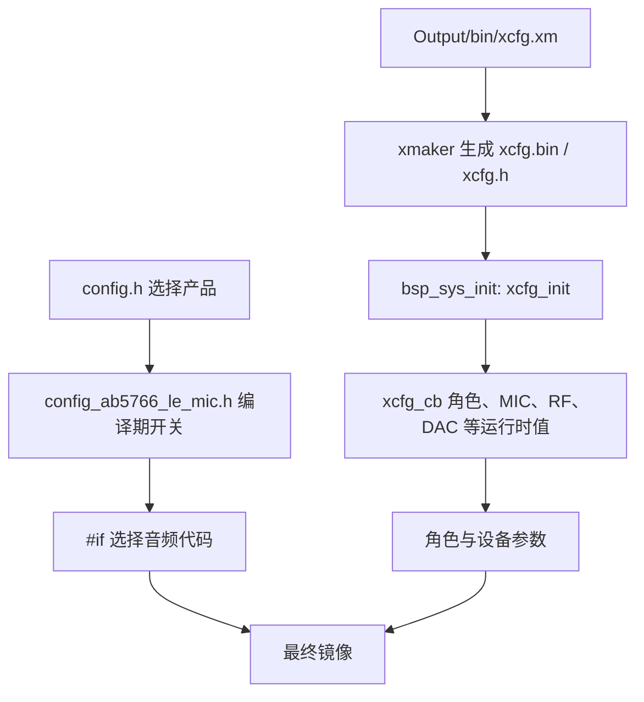
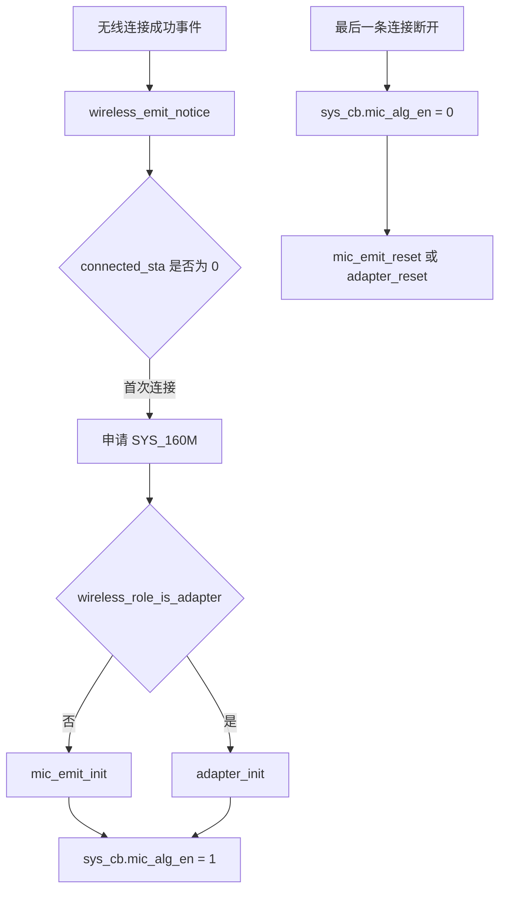
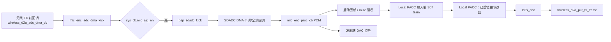

# AB5766 LE Mic 音频算法调用链与测试快速入门

> **适用范围：** 当前 `CONFIG_AB5766_LE_MIC` 产品配置。本专题以可见 C 源码中的编译条件、调用关系和数据流为依据；不以文件名、宏名或日志文字单独推断功能，也不推断预编译库内部实现。
>
> **当前硬件基线：** 已实测发射端麦克风声音可通过无线链路到达接收端，并从接收端耳机座输出。该事实是端到端音频可达的 E3 证据，不等同于任一算法的参数、质量或压力场景已通过测试。

## 1. 先读本章：什么才算“算法已确认”

工程中“存在函数”“宏为 1”“map 中有符号”“听到声音”分别是不同证据，不能互相替代。

| 级别 | 证据 | 能确认什么 | 不能确认什么 |
| --- | --- | --- | --- |
| E0 | 配置头与生成配置 | 某条件分支在本次配置中应被编译/排除 | 函数一定被执行、资源有效或硬件效果正确 |
| E1 | 可见源码调用链 | 初始化、每帧调用、PCM/压缩帧的上下游位置 | 静态库或硬件内核的内部实现 |
| E2 | 本次构建的 `map.txt`、镜像和生成资源 | 符号被链接、构建身份和资源身份可追溯 | 真实硬件确实执行、听感或指标达标 |
| E3 | 双板、日志、音频采集、仪器或听音记录 | 指定固件和条件下的实际行为 | 未测条件下仍可靠、库内算法原理 |

**测试结论最低要求：** 每个结论都记录 E0 + E1；声称“已在板上通过”还必须附 E2 + E3。当前仓库中的旧 `map.txt` 只能作为已保存构建的参考，不能代替下一次改动后的 E2 证据。

## 2. 当前默认音频基线

[config_ab5766_le_mic.h:64-84](../../projects/microphone/config_ab5766_le_mic.h#L64-L84) 定义当前无线音频接口：

| 项目 | 当前值 | 源码事实 |
| --- | --- | --- |
| 编解码接口 | `CODEC_LC3S` | 发射/接收均在 `mic_proc.c` 的 codec 条件分支调用 LC3S API |
| 采样率 | `SAMPLE_RATE_48K` | 初始化参数与 SDADC 默认采样选择使用该宏 |
| 一帧样点数 | 120 | 编码、解码、PACC 帧处理和输出都使用该宏 |
| PCM 声道 | 1 | 配置注释明确当前只支持单声道 |
| 压缩帧长度 | 25 byte | 发射放入 TX 队列、接收取帧时使用该宏 |
| 最大链路数 | 2 | 接收端维护索引 0/1 的 PCM、PLC 和混音路径 |
| 发送周期 | `4 × 1.25 ms` | 仅作为接口配置记录；改变它不属于算法单变量测试 |

当前已启用的处理条件见 [config_ab5766_le_mic.h:93-133](../../projects/microphone/config_ab5766_le_mic.h#L93-L133)：发射端本地 DAC、Soft Gain、Local PACC 包装链、接收端 DAC、USB Mic 与 Mix PACC 包装链的相关编译开关均为 1。该状态只证明包装链条件可参与编译；EQ/DRC 节点是否实际进入 PACC 链仍取决于 effect 资源装载和重链接结果，详见第 6 节。Echo、Magic、Room Reverb、AGC、Robotization、DNR_FRE、移频、32 kHz/SRC 和 AINS4 等为 0。

> `WIRELESS_MIC_RETRY_NB` 当前为 3，但同一行注释写着“暂时支持 1/2”。在对丢包、PLC 或性能作结论前，必须把它作为 P0 一致性项：复查派生宏、当次 map、双方运行日志和实测链路；不能仅以宏值或编译成功认定协议栈完全接受该组合。

## 3. 配置、角色与算法启动门禁

### 3.1 编译期、运行时与生成物不是同一层



- 产品选择见 [config.h](../../projects/microphone/config.h)，当前选择决定包含本专题所述配置头。
- `xcfg.h`、`xcfg.bin`、`effect.c` 与 `effect.h` 由构建前流程生成；不要手改生成物替代配置源。构建前脚本见 [prebuild.bat](../../projects/microphone/Output/bin/prebuild.bat)。
- `bsp_sys_init()` 以 `xcfg_init(&xcfg_cb, sizeof(xcfg_cb))` 装载运行时参数，见 [bsp_sys.c:199-212](../../bsp/bsp_sys.c#L199-L212)。

### 3.2 角色由运行时配置选择

[wireless_proc.c:5-17](../../modules/wireless/wireless_proc.c#L5-L17) 的 `wireless_mic_role_init()` 优先检查 `xcfg_cb.wireless_adapter_en`；否则检查 `xcfg_cb.wireless_mic_emit_en`；两者均未开时默认发射端。顶层 `func_run()` 再通过 `wireless_role_is_adapter()` 分派到 `func_adapter()` 或 `func_mic_emit()`，见 [func.c:134-177](../../functions/func.c#L134-L177)。

因此，**同一应用镜像的发射端/接收端角色不能只由配置头判断**；测试记录必须保存发射端与接收端各自使用的 setting/xcfg 身份和启动日志。

### 3.3 连接成功后，帧算法才会被打开



[wireless_proc.c:91-125](../../modules/wireless/wireless_proc.c#L91-L125) 显示首次连接会按角色调用 `mic_emit_init()` 或 `adapter_init()`，然后置 `sys_cb.mic_alg_en = 1`；最后一条连接断开时会先清零该门控并复位链路，见 [wireless_proc.c:162-180](../../modules/wireless/wireless_proc.c#L162-L180)。

**含义：** 宏为 1 不代表上电后立即处理 PCM。排查无声或测量算法前，先确认角色、连接成功、相应初始化日志和门控后的稳定帧窗口。

## 4. 发射端：从 MIC PCM 到无线帧与本地监听

### 4.1 真实调用链



| 次序 | 可见函数与位置 | 输入/输出与确认点 |
| --- | --- | --- |
| 1 | [wireless_txrx_single.c:294-297](../../modules/wireless/wireless_txrx_single.c#L294-L297) `wireless_d2a_adc_dma_cb()` | 无线 TX 前回调转入 `mic_enc_adc_dma_kick()`。 |
| 2 | [mic_proc.c:90-96](../../modules/wireless/mic_proc.c#L90-L96) `mic_enc_adc_dma_kick()` | 仅 `sys_cb.mic_alg_en` 为真时调用 `bsp_sdadc_kick()`。 |
| 3 | [bsp_sdadc.c](../../bsp/bsp_sdadc.c) `sdadc_proc_cb()` | SDADC DMA 半满/全满分别把对应 PCM 段送入 `mic_enc_proc_cb()`；该回调关系必须在调试时保留。 |
| 4 | [mic_proc.c:278-345](../../modules/wireless/mic_proc.c#L278-L345) `mic_enc_proc_cb()` | 处理启动丢帧、静音、条件算法并持有编码前 PCM。 |
| 5 | [mic_proc.c:352-363](../../modules/wireless/mic_proc.c#L352-L363) | 当前 LC3S 分支调用 `lc3s_enc()`，再调用 `wireless_d2a_put_tx_frame()`。 |
| 6 | [wireless_txrx_single.c:308-311](../../modules/wireless/wireless_txrx_single.c#L308-L311) | `wireless_d2a_put_tx_frame()` 把压缩帧交给 `txpkt_put_frame()`。 |
| 7 | [mic_proc.c:368-375](../../modules/wireless/mic_proc.c#L368-L375) | 发射端 DAC 接收编码前的 PCM；它是隔离“无线前/后”问题的重要观测点。 |

### 4.2 先排除启动静音与人工静音

`mic_enc_proc_cb()` 首先取得 `mic_enc.mute_en`，并调用 `bsp_sdadc_discard_proc()`；任一条件成立就将当前 PCM 清零，见 [mic_proc.c:278-293](../../modules/wireless/mic_proc.c#L278-L293)。`bsp_sdadc_discard_proc()` 在启动早期丢弃若干帧，见 [bsp_sdadc.c](../../bsp/bsp_sdadc.c)。

测试时不要把刚连接瞬间的无声直接归因于 LC3S、PLC、EQ 或无线丢包。应等待启动丢帧窗口结束，再记录 mute 开/关前后的发射 DAC、接收 DAC 与 USB Mic。

### 4.3 发射初始化的条件调用表

`mic_emit_init()` 由首次连接调用，见 [mic_proc.c:597-675](../../modules/wireless/mic_proc.c#L597-L675)。

| 功能 | 当前条件 | 初始化证据 | 帧处理证据 | 位置 |
| --- | --- | --- | --- | --- |
| LC3S 编码 | `WIRELESS_CON_CODEC_SEL == CODEC_LC3S` | `lc3s_enc_init()`，621 行 | `lc3s_enc()`，359 行 | 编码前 PCM → 25-byte 帧 |
| Local PACC | `WIRELESS_MIC_EQ_DRC_EN=1` | `mic_eq_drc_init()`，654 行 | `mic_eq_drc_audio_input()`，315 行 | 编码前 |
| Soft Gain | `WIRELESS_MIC_SOFT_GAIN_EN=1` | `mic_eq_drc_init()` 内 `soft_gain_init()` | `loc_mic_pacc_process()` | Local PACC 输入前 |
| 发射 DAC | `WIRELESS_MIC_DAC_OUT_EN=1` | `dac0_out_init()`，666 行 | `dac0_out_audio_input()`，375 行 | 编码后调用，但输入是编码前 PCM |
| Echo/Magic/Reverb/AGC 等 | 当前为 0 | 条件初始化代码存在 | 条件帧处理代码存在 | **当前默认镜像不可宣称运行** |

## 5. 接收端：从无线帧到 PLC、混音与 DAC/USB

### 5.1 真实调用链

```mermaid
flowchart LR
    A[BLE 接收包] --> B[wireless_d2a_set_rxpkt_cb]
    B --> C[wireless_d2a_set_rxdec_cb]
    C --> D[rxpkt_done / kick_dec_prio_trans]
    D --> E[thread_dec_proc_msg_cb]
    E --> F[MSG_MIC_DEC0 / MSG_MIC_DEC1]
    F --> G[mic_dec_prco_cb idx]
    G --> H[wireless_d2a_get_rx_frame]
    H --> I{BFI?}
    I -->|否| J[lc3s_dec]
    I -->|是| K[跳过解码]
    J --> L[plc_soft_process]
    K --> L
    L --> M[mic_dec_pcm_out]
    M --> N[Mix PACC：PCM0 + PCM1 → 已重链接节点链]
    N --> O[DAC]
    N --> P[完整 120 samples 后 USB Mic]
```



| 次序 | 可见函数与位置 | 事实 |
| --- | --- | --- |
| 接收缓冲 | [wireless_txrx_single.c:257-280](../../modules/wireless/wireless_txrx_single.c#L257-L280) | 接收包送 `rxpkt_set_rx()`；完成后 `rxpkt_done()` 并调用 `kick_dec_prio_trans()`，注释明确将耗时解码移出 BLE 调度。 |
| 线程分派 | [thread_dec.c:5-20](../../os/thread_dec.c#L5-L20) | `MSG_MIC_DEC0/1` 分别调用 `mic_dec_prco_cb(0/1)`。 |
| 取帧/解码/PLC | [mic_proc.c:550-594](../../modules/wireless/mic_proc.c#L550-L594) | `bfi==false` 才调用 `lc3s_dec()`；但每帧都会调用 `plc_soft_process(pcm, samples, last_bfi || bfi, idx)`。 |
| 输出与混音 | [mic_proc.c:453-546](../../modules/wireless/mic_proc.c#L453-L546) | 单链路直接输出 PCM；双链路按片段组合，并在启用 Mix PACC 时调用 `mix_drc_audio_input()`。 |
| DAC/USB | [mic_proc.c:465-476](../../modules/wireless/mic_proc.c#L465-L476) | DAC 在每个片段输出；累计到完整 120 samples 后再推 USB Mic。 |

### 5.2 BFI 与 PLC：可确认和不可确认的边界

[plc_soft.c](../../modules/voice/plc_soft.c) 可见包装层按 `idx` 维护两条状态，并由 `adapter_alg_init()` 初始化；每帧的 BFI 来自接收帧取得结果，见 [mic_proc.c:565-580](../../modules/wireless/mic_proc.c#L565-L580)。

可以确认：PLC 位于解码之后、输出之前；按链路索引维护状态；当前帧和前一帧 BFI 均被传入。不能从可见源码确认 `plc_soft_process_do()` 的具体预测、插补或隐藏策略，因为其内核来自预编译边界。

### 5.3 接收初始化

首次连接时的 `adapter_init()` 见 [mic_proc.c:700-734](../../modules/wireless/mic_proc.c#L700-L734)：先执行 `adapter_alg_init()`，再进行 LC3S 解码初始化、Mix PACC 初始化和 DAC 初始化。`ADAPTER_USB_MIC_RX_EN=1` 决定后续完整 PCM 帧会送到 USB Mic 接口；USB 枚举、封包和主机兼容性仍属于该接口下游边界。

## 6. 当前默认算法的原理、位置与边界

### 6.1 Soft Gain：逐样点数字衰减与渐变

- 配置为 8 级，默认等级 0，见 [config_ab5766_le_mic.h:160-162](../../projects/microphone/config_ab5766_le_mic.h#L160-L162)。
- `soft_gain_init()` 设置渐变和初始目标，见 [soft_gain.c:74-82](../../modules/audio/soft_gain.c#L74-L82)。
- 8 级表的等级 0 至 8 对应 `0/-2/-4/-6/-8/-10/-12/-15/-110 dB` 常量，见 [soft_gain.c:52-56](../../modules/audio/soft_gain.c#L52-L56)。
- 每样点处理将当前增益向目标增益以步长 1 渐变，再执行 Q15 乘法，见 [soft_gain.c:110-128](../../modules/audio/soft_gain.c#L110-L128)。
- 它不是在 `mic_enc_proc_cb()` 中直接调用：实际位置是 [mic_effect.c:165-186](../../modules/effect/mic_effect.c#L165-L186) 的 `loc_mic_pacc_process()`，在送入 PACC 前逐样点处理。

测试应固定 MIC 模拟/数字增益和声源，只通过既有 `soft_gain_up/down()` 路径逐级变化，测量电平单调性、边界、切换爆音、削波和恢复时间。

### 6.2 Local PACC：发射端包装链与候选 EQ/DRC 节点

`mic_eq_drc_init()` 依次初始化 Local PACC、装载参数并调用使能函数；Soft Gain 开启时也在此初始化，见 [mic_eq_drc.c:28-46](../../modules/audio/mic_eq_drc.c#L28-L46)。Local 节点候选表为 EQ →（可选 FSH）→ DRC，见 [mic_effect.c:74-80](../../modules/effect/mic_effect.c#L74-L80)。当前移频宏为 0。

但这**不能直接写成**“EQ 和 DRC 均已生效”：`loc_mic_pacc_set_param()` 只有在对应 `pacc_*_set_by_res()` 返回 `ERROR_NO` 时才置位节点使能标志；`loc_mic_pacc_enable()` 随后以该标志重链接节点链，并且仅在链头非空时才令包装层允许帧处理，见 [mic_effect.c:105-162](../../modules/effect/mic_effect.c#L105-L162)。因此，默认源码可确认的顺序是：

```text
Soft Gain → 已成功装载并重链接的 Local PACC 节点（EQ / DRC 的实际集合待资源与返回值核验）→ LC3S 编码
```

EQ/DRC 参数分别取自 `EFFECT_IDX_LOC_MIC_EQ` 与 `EFFECT_IDX_LOC_MIC_DRC` 的 effect 资源。测试记录必须保存当次 effect 身份，并通过资源装载返回值、重链接结果、map 和硬件观测共同确认实际节点集合；可见源码不能确认 PACC 内部滤波器、压缩曲线、饱和规则或硬件实现。

### 6.3 Mix PACC：接收端混音后的包装链与候选 EQ/DRC 节点

Mix 节点候选表为 EQ →（可选 FSH）→ DRC，见 [mic_effect.c:219-226](../../modules/effect/mic_effect.c#L219-L226)，资源来自 `EFFECT_IDX_MIX_EQ` / `EFFECT_IDX_MIX_DRC`。与 Local PACC 相同，`mix_pacc_set_param()` 仅在相应 `pacc_*_set_by_res()` 返回 `ERROR_NO` 时使能节点，再由 `mix_pacc_enable()` 重链接实际节点集合，见 [mic_effect.c:249-292](../../modules/effect/mic_effect.c#L249-L292)。因此，`ADAPTER_MIX_DRC_EN=1` 只能确认包装链被编译和调用，不能单独证明 EQ、DRC 两个资源节点都已进入处理链。

`mix_pacc_process()` 明确先逐样点相加两路输入，之后调用 PACC，见 [mic_effect.c:295-313](../../modules/effect/mic_effect.c#L295-L313)。

文件顶部明确 PACC0 可分时服务 Local/Mix/SCO 链路，但禁止多线程同时调用其处理接口，见 [mic_effect.c:1-13](../../modules/effect/mic_effect.c#L1-L13)。双链路测试必须覆盖连接/断开瞬态、峰值和长稳，不能只验证“两个麦都有声音”。

### 6.4 LC3S、DAC 与 USB Mic 的边界

- LC3S：可确认初始化和函数接口参数；当前保存的 `map.txt` 可见 `libplatform.a(lc3s_enc.o)` 与 `lc3s_dec.o` 被链接。不能据此推断量化、比特流或心理声学细节。
- DAC：`dac0_out_audio_input()` 在未静音时将 PCM 交给 `sddac_aubuf_dma_kick()`，见 [dac0_out.c:32-46](../../modules/audio/dac0_out.c#L32-L46)；`dac0_play_sync_fifocnt()` 是 FIFO 同步接口，见 [dac0_out.c:56-77](../../modules/audio/dac0_out.c#L56-L77)。它们是算法的观测/输出路径，不是算法内核。
- USB Mic：应用层只确认调用 `usb_mic_in_audio_input()`；UAC 枚举、封装和主机行为不在本调用点中证明。

## 7. 当前默认镜像矩阵

| 编号 | 项目 | 默认状态 | E0/E1 已确认路径 | 后续测试 |
| --- | --- | ---:| --- | --- |
| ALG-CAP | SDADC、启动丢帧、静音分界 | 开启/可达 | DMA → `mic_enc_proc_cb()`；清零见 4.2 | P0 |
| ALG-SG | Soft Gain | 1 | `mic_eq_drc_init()` → `soft_gain_init()`；Local PACC 前逐样点处理 | P0 |
| ALG-LOCAL-PACC | 发射端 Local PACC 包装链 | 1 | `mic_eq_drc_audio_input()` → `loc_mic_pacc_process()`；实际节点待资源/重链接核验 | P0 |
| ALG-LC3S | 编码、无线帧、解码 | 选中 | `lc3s_enc/dec()` 与 TX/RX 调用链 | P0 |
| ALG-PLC | 丢帧隐藏包装 | 可达 | `plc_soft_process()` 每帧调用 | P0 |
| ALG-MIX | 双链路混音与 Mix PACC 包装链 | 1 | `mix_drc_audio_input()` → `mix_pacc_process()`；实际节点待资源/重链接核验 | P1 |
| ALG-OUT | 发射 DAC、接收 DAC、USB Mic | 1 | `dac0_out_audio_input()` / `usb_mic_in_audio_input()` | P1 |
| ALG-EXCLUDE | 当前关闭候选项 | 0 | 均仅有条件初始化/处理路径 | P2 |

`ALG-EXCLUDE` 的目标不是证明这些功能“完全不存在”，而是确认默认配置不会进入它们的条件调用。若 map 中出现共享库符号，只能记录“库或共享依赖存在”，不能写成“功能正在运行”。

## 8. 当前关闭的候选项及启用前限制

[config_ab5766_le_mic.h:97-133](../../projects/microphone/config_ab5766_le_mic.h#L97-L133) 中，Echo、Magic、发射/接收移频、Room Reverb、AGC、Robotization、allpass、发射/接收 DNR_FRE、SDADC 低通、最大能量检测、按键短静音和 WAV 混音当前均关闭。`mic_emit_init()` 和 `mic_enc_proc_cb()` 展示了它们的条件初始化与帧处理位置，见 [mic_proc.c:297-340](../../modules/wireless/mic_proc.c#L297-L340) 与 [mic_proc.c:624-673](../../modules/wireless/mic_proc.c#L624-L673)。

32 kHz/SRC/AINS4 属于高风险相关项，但当前可见条件并未证明 AINS4 必然依赖 32 kHz：`WIRELESS_MIC_AINS4_32K_EN` 独立包围 AINS4 调用；Echo 仅在同时开启 `WIRELESS_MIC_ECHO_EN && WIRELESS_MIC_32K_EN` 时位于 SRC 前；SRC 自身仅由 `WIRELESS_MIC_32K_EN` 条件调用，见 [mic_proc.c:297-340](../../modules/wireless/mic_proc.c#L297-L340)。初始化侧同样分别以 32 kHz 与 AINS4 宏条件调用 `src_init()`、`ains4_32k_mic_init()`，见 [mic_proc.c:628-638](../../modules/wireless/mic_proc.c#L628-L638)。

因此，不能仅凭名称把 AINS4 写成“只能与 32 kHz 一起运行”。启用前应先分别确认采样率、帧长、缓冲区、库接口和派生约束；在不改变其他变量的前提下，先建立并验证 32 kHz + SRC 路径，再对 AINS4 进行独立、可回滚的构建与硬件试验。

## 9. 在线 EQ/DRC 调整：已接入的消息路径，不等于可盲调

当前三个调音宏均为 1，见 [config_ab5766_le_mic.h:183-187](../../projects/microphone/config_ab5766_le_mic.h#L183-L187)。可见路径如下：


- `eq_drc_dbg_init()` 使用 `xcfg_cb.huart_io_sel`，并将接收 ISR 设为 `eq_drc_dbg_cmd_process()`，见 [eq_drc_dbg_in_uart.c:28-51](../../modules/audio/eq_drc_dbg_in_uart.c#L28-L51)。
- 该初始化仍受 `xcfg_cb.huart_en` 约束，见 [bsp_sys.c:258-262](../../bsp/bsp_sys.c#L258-L262)。
- ISR 仅在前三字节为 `CFG` 时投递事件，见 [eq_drc_dbg_in_uart.c:28-34](../../modules/audio/eq_drc_dbg_in_uart.c#L28-L34)。
- `func_message()` 的 `EVT_ONLINE_SET_EFFECT` 分支调用 `toolkit_process()`，见 [func.c:98-101](../../functions/func.c#L98-L101)；后者会校验 CRC、匹配 effect 名称并调用对应更新回调，见 [toolkit.c:105-166](../../modules/tool/toolkit.c#L105-L166)。

在确认 HUART 运行时开关、引脚复用、上位机协议、CRC、effect 资源和角色对应关系前，**不得发送未知二进制命令**。先在默认链稳定时使用已知、小范围、角色对应的参数；发射端和接收端的 effect 资源索引不同。

## 10. 每次硬件测试的固定门禁

开始任一 `ALG-*` 用例前，冻结以下内容；缺一项则记录为 `Blocked`，不输出算法质量结论。

1. Git 提交、工作区状态、构建时间和工具链信息；
2. 发射端/接收端的 setting 或 xcfg 身份、角色、MIC、RF、DAC 参数；
3. `config.h` 与相关算法宏快照；
4. effect 资源、`xcfg.bin`、`app.rv32`、`app.bin`、`app.dcf` 与 `map.txt` 的时间戳和哈希或大小；
5. map 中 `mic_enc_proc_cb`、`mic_dec_prco_cb`、`loc_mic_pacc_process`、`mix_pacc_process`、`plc_soft_process`、LC3S init/处理符号的实际链接记录；
6. 板号、供电、距离、天线方向、环境噪声、连接数量、声源与观测设备；
7. 原始 UART、USB 音频、DAC/示波器或听音记录的保存位置。

工程使用 `--gc-sections` 和预编译库：工程文件中列出源码不等于最终镜像保留该实现，map 通过也不等于硬件行为通过。

## 11. 按风险执行测试

### P0：先建立可解释基线

1. `ALG-BASE`：角色、连接、音频初始化、发射 DAC、接收 DAC、USB Mic 的观测点；使用语音、1 kHz、扫频、静音和短瞬态建立原始记录。
2. `ALG-CAP`：越过启动丢帧后验证采集与 mute PCM 清零；对照发射端 DAC 与接收端输出。
3. `ALG-SG`：只改 Soft Gain 等级；记录 RMS、峰值、削波、爆音、边界和恢复。
4. `ALG-LOCAL-PACC`：固定 effect 资源，先以发射 DAC 观察 EQ/DRC，再以接收端复验。
5. `ALG-LC3S`：近距离低干扰下比较发射 DAC 与接收 DAC/USB 的延迟、失真、断续与静音噪声。
6. `ALG-PLC`：先取得无丢帧基线；仅以合规、可控的 RF 衰减/遮挡制造短时压力。没有 BFI/PER 证据时只称为压力观察，不能称 PLC 覆盖率。

### P1/P2：在 P0 通过且已保存基线后

- `ALG-MIX`：两发射端、不同频率/电平/相位；覆盖单双路、任一路断开、峰值和长稳。
- `ALG-OUT`：不改算法参数，验证发射 DAC、接收 DAC 和 USB Mic 的长时间稳定性、FIFO 同步及并行输出。
- `ALG-EXCLUDE`：逐项排除默认关闭路径。

后续启用候选项时，建议顺序为 Echo、Magic、Room Reverb、Robotization、发射移频、接收移频、allpass、发射/接收 DNR、AGC、SDADC 低通、最大能量检测、按键静音、WAV 混音、32 kHz+SRC、AINS4。每项独立构建、独立 map、独立镜像、独立硬件记录；一次只修改一个逻辑变量，绝不同时改 codec、帧长、重传、发送周期、RF 或 effect 资源。

## 12. 失败定位与回滚

当出现异常时，先用已有观测点划分位置：

```text
采集前/启动静音 → 编码前发射 DAC → 无线后接收帧/BFI → PLC 后 PCM → 混音后 → DAC/USB 输出
```

P0 失败应停止后续算法试验，保存最小复现条件、音频、日志、map、配置与固件，不覆盖已验收基线。回滚对象必须包括源码提交、发射/接收 xcfg、effect 资源、镜像和测试参数。统一记录格式见 [../plan/AB5766_LE_Mic_算法测试执行记录.md](../plan/AB5766_LE_Mic_算法测试执行记录.md)，阶段门禁见 [../plan/AB5766_LE_Mic_分阶段实施计划.md](../plan/AB5766_LE_Mic_分阶段实施计划.md)。
