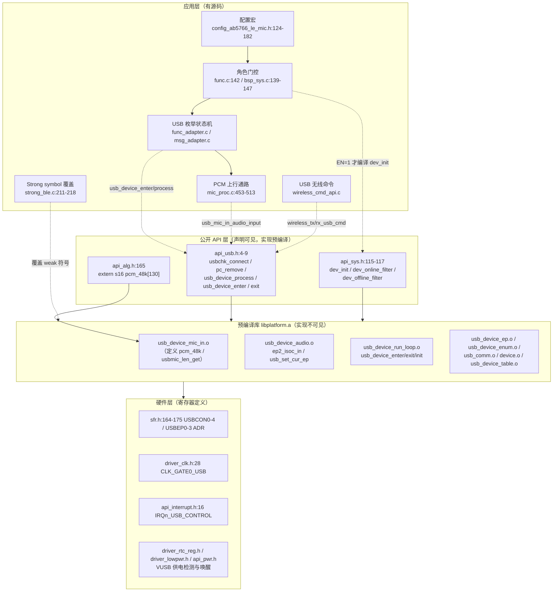
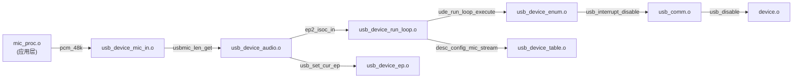
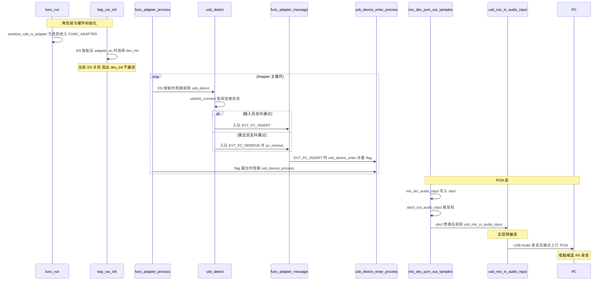
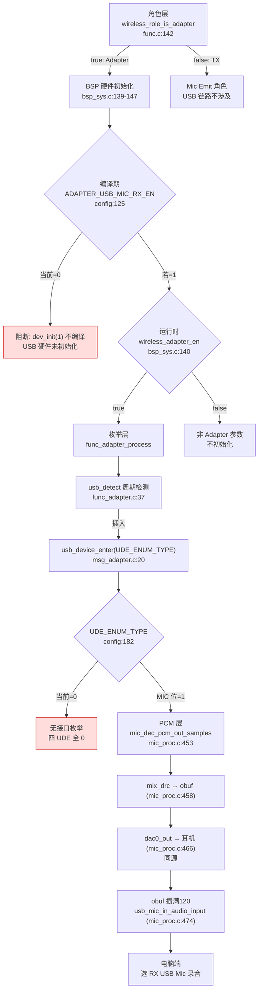

# AB5766 USB 设备与 USB Mic 全链路知识详解

> 本文梳理本 SDK（AB5766 无线麦克风/适配器固件）中**全部与 USB 相关的知识**：配置宏、硬件寄存器层、USB API 层、Strong symbol 覆盖机制、预编译 USB 协议栈结构、角色门控、USB 枚举状态机、PCM 上行数据通路、USB 无线命令体系、链接段放置与 map.txt 证据。所有结论均来自源码**实际引用关系**（文件 + 函数 + 行号），不依赖命名猜测；对预编译库内部实现一律只记录「符号 / 段 / 调用点 / 时机」，不臆断内部数学与协议细节。

> **阅读建议**：先读第 1 节「核心结论速览」建立全局，再按第 2～12 节逐层深入，最后看第 13 节完整调用链与第 15 节实操。

> **关于 map.txt 行号**：`map.txt` 是构建产物，其内部行号会随重编译变化。本文引用的 map.txt 行号/地址基于当前工作区最新一次构建（`branch_01` @ `1d01aa3`，`build.ps1 -Rebuild` 产物，构建成功）。关键结论以**符号名 / 段名 / 成员名**为准，行号仅作定位参考；若你重新构建后行号有偏移，请以符号名为准重新定位。

---

## 1. 核心结论速览

1. **当前 USB 设备功能全部关闭**：`ADAPTER_USB_SPK_TX_EN=0`、`ADAPTER_USB_MIC_RX_EN=0`，四个 `UDE_*_EN` 全为 0，`UDE_ENUM_TYPE=0`（不枚举任何接口）。见 [config_ab5766_le_mic.h:124-125](../../projects/microphone/config_ab5766_le_mic.h#L124-L125)、[config_ab5766_le_mic.h:178-182](../../projects/microphone/config_ab5766_le_mic.h#L178-L182)。
2. **方向前提**：USB Mic 是**电脑采集输入**方向（RX 解码 PCM → USB Audio 麦克风端点 → 电脑录音），**不是** USB 播放输出；USB Speaker（下行）同样关闭。耳机（DAC）与 USB Mic 是两条独立通路。
3. **双重门控**：编译期 `ADAPTER_USB_MIC_RX_EN` + 运行时 `xcfg_cb.wireless_adapter_en`（仅 Adapter/RX 角色）。当前编译期即阻断。
4. **关键修正（本文与旧文档 `算法详解/14_USB_Mic枚举链.md` 不一致处）**：旧文档称「EN=0 时 map.txt 无 USB 符号、USB 模块未链接」。**实际上当前 map.txt 显示 USB 预编译模块链仍被链接**——原因是 `pcm_48k` 这个 SRC 升采样缓冲区**定义在预编译库 `usb_device_mic_in.o` 里**，而当前 `WIRELESS_MIC_32K_EN=1` 使 TX 上行代码引用了它。真正被"关掉"的是 USB 的**功能入口**（`ude_control_flow`/`usb_isr` 等），由 `strong_ble.c` 的空 stub 覆盖。
5. **USB 实现不可见**：`usb_mic_in_audio_input` 等实现全部在预编译 `libplatform.a`，源码树无实现；只能从 `map.txt` 的成员列表、段表、符号表反推架构。

---

## 2. USB 配置宏与当前状态

### 2.1 适配器端私有配置（USB 相关 3 个宏）

[projects/microphone/config_ab5766_le_mic.h:122-125](../../projects/microphone/config_ab5766_le_mic.h#L122-L125)：

```c
//适配器端私有配置
#define ADAPTER_DAC_OUTPUT_EN                   1               //适配器是否支持dac输出MIC音频
#define ADAPTER_USB_SPK_TX_EN                   0               //发射端是否开启usb spk功能（下行音频，不支持）
#define ADAPTER_USB_MIC_RX_EN                   0               //接收端是否开启usb mic功能（上行音频，不支持）
```

| 宏 | 当前值 | 作用 | 方向 |
|---|---|---|---|
| `ADAPTER_DAC_OUTPUT_EN` | `1` | 适配器 DAC 输出（耳机通路，当前启用） | RX 解码 → DAC → 耳机 |
| `ADAPTER_USB_SPK_TX_EN` | `0` | TX 端 USB Speaker（注释"不支持"） | 电脑 → USB → 播放 |
| `ADAPTER_USB_MIC_RX_EN` | `0` | RX 端 USB Mic（注释"不支持"） | RX 解码 → USB → 电脑录音 |

### 2.2 USB device 功能选择与 UDE_ENUM_TYPE

[projects/microphone/config_ab5766_le_mic.h:175-182](../../projects/microphone/config_ab5766_le_mic.h#L175-L182)：

```c
/*****************************************************************************
 * Module    : usb device 功能选择
 *****************************************************************************/
#define UDE_STORAGE_EN                          0               //不支持
#define UDE_SPEAKER_EN                          ADAPTER_USB_SPK_TX_EN
#define UDE_HID_EN                              0
#define UDE_MIC_EN                              ADAPTER_USB_MIC_RX_EN
#define UDE_ENUM_TYPE                           (UDE_STORAGE_EN*0x01 + UDE_SPEAKER_EN*0x02 + UDE_HID_EN*0x04 + UDE_MIC_EN*0x08)
```

`UDE_ENUM_TYPE` 是 USB 枚举接口的**位图**：bit0=storage、bit1=speaker、bit2=HID、bit3=mic。

**当前求值**：四个 `UDE_*_EN` 全为 0，因此

```
UDE_ENUM_TYPE = 0*0x01 + 0*0x02 + 0*0x04 + 0*0x08 = 0
```

即当前 USB 设备**不枚举任何接口**。该位图在插入 PC 时传给 `usb_device_enter(UDE_ENUM_TYPE)`（[msg_adapter.c:20](../../functions/msg_adapter.c#L20)）。

> ⚠️ **CLAUDE.md 表述已过时**：仓库根 `CLAUDE.md` 写「`ADAPTER_USB_MIC_RX_EN=1` 只是编译期开关」，但当前源码 [config_ab5766_le_mic.h:125](../../projects/microphone/config_ab5766_le_mic.h#L125) 实测为 `0`。本文以**代码为准**（`=0`）。

### 2.3 编译期影响范围

`ADAPTER_USB_MIC_RX_EN=0` 使以下 `#if` 块全部**不编译**：

| 文件 | 行 | 不编译内容 |
|---|---|---|
| [bsp_sys.c:139-147](../../bsp/bsp_sys.c#L139-L147) | 139 | `dev_init(1)` USB 硬件初始化 |
| [func_adapter.c:33-54](../../functions/func_adapter.c#L33-L54) | 33 | `adapter_usb_init_flag` 定义、`usb_detect()` 定义 |
| [func_adapter.c:192-200](../../functions/func_adapter.c#L192-L200) | 192 | `usb_detect()` / `usb_device_process()` 周期调用 |
| [msg_adapter.c:17-34](../../functions/msg_adapter.c#L17-L34) | 17 | `EVT_PC_INSERT` / `EVT_PC_REMOVE` 处理分支 |
| [mic_proc.c:473-475](../../modules/wireless/mic_proc.c#L473-L475) | 473 | `usb_mic_in_audio_input()`（双链路 frag 路径） |
| [mic_proc.c:508-510](../../modules/wireless/mic_proc.c#L508-L510) | 508 | `usb_mic_in_audio_input()`（单链路路径） |

`ADAPTER_USB_SPK_TX_EN=0` 使 [wireless_cmd.h:99-113](../../modules/wireless/wireless_cmd.h#L99-L113) 的 `wireless_music_*` 宏展开为空，`USB_MIC_IN_AUDIO_MUTE` 相关 mute 回调不编译。

---

## 3. 知识域总览

下图给出本文覆盖的知识域与彼此关系（自上而下：应用层 → 抽象层 → 预编译库 → 硬件）。



---

## 4. USB 硬件层（寄存器 / 时钟 / 中断 / 电源）

> **诚实边界**：以下寄存器在本 SDK 应用层源码里**只有定义、没有直接的读写操作**（唯一一处 USB 硬件初始化相关代码 [bsp_sys.c:141-144](../../bsp/bsp_sys.c#L141-L144) 已被注释）。真实的寄存器操作全部封装在预编译 `libplatform.a` 里。这里只记录"硬件能力/寄存器定义位置"与"VUSB 供电 vs USB 设备"的区分。

### 4.1 USB 控制器寄存器（SFR Group3）

[header/sfr.h:164-175](../../header/sfr.h#L164-L175)：

```c
#define USBCON0         SFR_RW (SFR3_BASE + 0x00*4)
#define USBCON1         SFR_RW (SFR3_BASE + 0x01*4)
#define USBCON2         SFR_RW (SFR3_BASE + 0x02*4)
#define USBCON3         SFR_RW (SFR3_BASE + 0x03*4)
#define USBCON4         SFR_RW (SFR3_BASE + 0x04*4)
#define USBEP0ADR       SFR_RW (SFR3_BASE + 0x05*4)
#define USBEP1RXADR     SFR_RW (SFR3_BASE + 0x06*4)
#define USBEP1TXADR     SFR_RW (SFR3_BASE + 0x07*4)
#define USBEP2RXADR     SFR_RW (SFR3_BASE + 0x08*4)
#define USBEP2TXADR     SFR_RW (SFR3_BASE + 0x09*4)
#define USBEP3RXADR     SFR_RW (SFR3_BASE + 0x0a*4)
#define USBEP3TXADR     SFR_RW (SFR3_BASE + 0x0b*4)
```

- `USBCON0`～`USBCON4`：USB 控制器控制寄存器组。
- `USBEP0ADR`：端点 0（控制端点）地址寄存器。
- `USBEP1/2/3` 各有 `RXADR` / `TXADR`：端点 1/2/3 的收发地址寄存器。

从寄存器布局可看出硬件 USB 控制器支持 **EP0（控制）+ EP1/EP2/EP3 三个数据端点**（各 RX/TX 双向）。`map.txt` 中 `usb_device_audio.o` 的 `ep2_isoc_in` 符号提示 EP2 用作等时输入端点（麦克风上行）。

### 4.2 USB 时钟门控

[driver/driver_clk.h:28](../../driver/driver_clk.h#L28)：

```c
#define CLK_GATE0_USB                   ((uint32_t)(0x00004000))        /* CLKGAT0[14] */
```

USB 模块时钟受 `CLKGAT0[14]` 门控。

### 4.3 USB 控制中断向量

[libs/cpu/api_interrupt.h:16](../../libs/cpu/api_interrupt.h#L16)：

```c
typedef enum {
    IRQn_SOFT                       = 2,
    IRQn_TMR0,
    IRQn_TMR1,
    IRQn_TMR2,
    IRQn_IR_QDEC_LEDC,
    IRQn_USB_CONTROL,            // = 7
    ...
```

`IRQn_USB_CONTROL` 枚举值 = 7（自 `IRQn_SOFT=2` 起顺序递增），是 USB 控制中断向量号。

### 4.4 VUSB（5V 供电检测）与 USB 设备的区分

**这是本 SDK 最容易混淆的一对概念**，务必区分：

| 概念 | 含义 | 相关定义 | 用途 |
|---|---|---|---|
| **VUSB** | USB 接口的 **5V 供电**检测 | `driver_rtc_reg.h` 的 `RTCCON_VUSB*`、`driver_lowpwr.h` 的 `WK_LP_VUSB`、`api_pwr.h` 的 `PMU_CFG_VUSB_TO_VDDIO` | 充电、开机、低功耗唤醒 |
| **USB 设备** | USB **数据通信**（枚举/端点/音频流） | `sfr.h` 的 `USBCON*`、`api_usb.h` | 被电脑识别为音频设备、传输 PCM |

VUSB 相关定义：

- [driver/driver_rtc_reg.h:23-35](../../driver/driver_rtc_reg.h#L23-L35)：
  - `RTCCON_VUSBRSTEN`（bit6）：VUSB 复位使能
  - `RTCCON_VUSBON_WKSLPEN`（bit9）：VUSB 上电唤醒睡眠使能
  - `RTCCON_VUSBONIE`（bit11）：VUSB 上电中断使能
  - `RTCCON_VUSBONLINE`（bit20）：VUSB 在线状态
  - `RTCCON_VUSBOFF`（bit21）：VUSB 关闭
- [driver/driver_lowpwr.h:27](../../driver/driver_lowpwr.h#L27)：`WK_LP_VUSB = BIT(11)`（唤醒源）；[driver_lowpwr.h:42](../../driver/driver_lowpwr.h#L42)：`WK_LP_VUSB_PENDING = BIT(3)`（唤醒挂起标志）。
- [libs/cpu/api_pwr.h:10](../../libs/cpu/api_pwr.h#L10)：`PMU_CFG_VUSB_TO_VDDIO = BIT(7)`（VUSB 转 VDDIO 供电）。
- [libs/cpu/api_sys.h:38](../../libs/cpu/api_sys.h#L38)：复位源 `BIT(17):VUSB_RST`。

VUSB 的**应用层实际使用点**在 [bsp/bsp_sys.c:152-196](../../bsp/bsp_sys.c#L152-L196) 的 `power_on_check()`：

```c
u32 wakeup_reason = WK_LP_WK0_PENDING | WK_LP_VUSB_PENDING;   // bsp_sys.c:155
...
} else if ((sys_cb.wakeup_reason & WK_LP_VUSB_PENDING) && xcfg_cb.poweron_vusb_out_en){  // bsp_sys.c:163
    return;   // VUSB 退出是否自动开机
```

即 VUSB 用于"插拔 USB 供电时决定是否自动开机"，与"USB 是否被电脑识别为音频设备"是**两回事**。

---

## 5. USB API 层

### 5.1 api_usb.h：6 个 USB 设备函数（预编译）

[libs/cpu/api_usb.h:1-11](../../libs/cpu/api_usb.h#L1-L11) 全文：

```c
#ifndef _USB_API_H
#define _USB_API_H

u8 usbchk_connect(void);
void pc_remove(void);
void usb_device_process(void);
void usb_connected_sync_volume(void);
void usb_device_enter(u8 enum_type);
void usb_device_exit(void);

#endif // _USB_API_H
```

| 函数 | 行 | 参数/返回 | 可记录语义（源码调用点） | 不可推测（预编译） |
|---|---|---|---|---|
| `usbchk_connect()` | 4 | `void` → `u8` | 查询 USB 连接状态（1=已连接），被 `usb_detect()` 调（[func_adapter.c:39](../../functions/func_adapter.c#L39)） | USB PHY 检测机制 |
| `pc_remove()` | 5 | `void` | 拔出时的清理，被 `usb_detect()` 调（[func_adapter.c:48](../../functions/func_adapter.c#L48)） | 内部清理动作 |
| `usb_device_process()` | 6 | `void` | 已枚举后的周期运转，被 `func_adapter_process` 调（[func_adapter.c:198](../../functions/func_adapter.c#L198)） | 端点中断/数据搬运 |
| `usb_connected_sync_volume()` | 7 | `void` | 音量同步；**当前无调用点**（对应 case 已注释，[msg_adapter.c:30-33](../../functions/msg_adapter.c#L30-L33)） | 音量同步机制 |
| `usb_device_enter(u8)` | 8 | `enum_type` | 启动枚举，被 `EVT_PC_INSERT` 调（[msg_adapter.c:20](../../functions/msg_adapter.c#L20)） | 描述符构造/枚举应答 |
| `usb_device_exit()` | 9 | `void` | 退出 USB 设备，被 `EVT_PC_REMOVE` 调（[msg_adapter.c:26](../../functions/msg_adapter.c#L26)） | 状态清理 |

### 5.2 api_sys.h：dev_init / 去抖函数（预编译）

[libs/cpu/api_sys.h:115-117](../../libs/cpu/api_sys.h#L115-L117)：

```c
void dev_init(u8 cfg);
bool dev_online_filter(u8 dev_num);
bool dev_offline_filter(u8 dev_num);
```

- `dev_init(u8 cfg)`：USB 设备硬件初始化，参数 `1` = USB device 模式（见 [bsp_sys.c:145](../../bsp/bsp_sys.c#L145) 调用 `dev_init(1)`）。
- `dev_online_filter(u8)` / `dev_offline_filter(u8)`：设备在线/离线**去抖过滤**（见 [func_adapter.c:41/46](../../functions/func_adapter.c#L41) 调用）。

### 5.3 重要澄清：modules/device/device.c 是死代码

仓库里 `modules/device/device.c` 定义了**同名**函数 `dev_init(u16 online_cnt, u16 offline_cnt)`（[device.c:7-16](../../modules/device/device.c#L7-L16)）、`dev_online_filter`（[device.c:25-43](../../modules/device/device.c#L25-L43)）、`dev_offline_filter`（[device.c:45-63](../../modules/device/device.c#L45-L63)）等，且 `device.h` 声明了它们。

**但这些函数不参与编译**：工程文件 `projects/microphone/app.cbp` 的 `<Unit>` 列表中**没有** `modules/device/device.c`（grep `app.cbp` 的 modules 列表只有 audio/effect/tool/voice/wireless 等，无 device）。因此：

- 实际链接到镜像的 `dev_init(u8)` / `dev_online_filter` / `dev_offline_filter` 来自 `api_sys.h:115-117` 声明的**预编译 libplatform.a**，而非 `modules/device/device.c`。
- `modules/device/device.c` 的 `dev_init(u16,u16)` 与本 SDK 的 `dev_init(u8)` **签名不同、是两码事**，阅读代码时不要被同名误导。

> 印证：`map.txt` 里 grep `dev_init|dev_online_filter|dev_offline_filter` **无符号匹配**——因为 `EN=0` 使 [bsp_sys.c:145](../../bsp/bsp_sys.c#L145) 的 `dev_init(1)` 和 [func_adapter.c:41/46](../../functions/func_adapter.c#L41) 的 `dev_online_filter` 都不编译，无调用点，预编译实现未被拉入链接。

---

## 6. Strong symbol 覆盖机制（关键知识点）

### 6.1 机制原理

[header/macro.h:14-15](../../header/macro.h#L14-L15)：

```c
#define WEAK                    __attribute__((weak))
#define STRONG
```

- 预编译 `libplatform.a` 里的函数以 **weak 符号**（`WEAK`）导出。
- 应用层 [projects/microphone/strong_symbol.c](../../projects/microphone/strong_symbol.c) 与 [projects/microphone/strong_ble.c](../../projects/microphone/strong_ble.c) 用普通函数定义（`STRONG` 宏为空，即强符号）**覆盖**这些 weak 符号，达到"动态关闭库代码、省 Flash"的目的。两文件开头注释均为「定义库里面部分 WEAK 函数的 Strong 函数，动态关闭库代码」（[strong_ble.c:1-5](../../projects/microphone/strong_ble.c#L1-L5)、[strong_symbol.c:1-5](../../projects/microphone/strong_symbol.c#L1-L5)）。

### 6.2 USB 的 6 个 stub

[projects/microphone/strong_ble.c:211-218](../../projects/microphone/strong_ble.c#L211-L218)：

```c
#if !ADAPTER_USB_MIC_RX_EN
void usb_init(void) {}
void ude_control_flow(void) {}
void ude_ep_reset(void) {}
void ude_isoc_tx_process(void) {}
void usb_isr(void) {}
void usb_dev_isr(void) {}
#endif
```

当 `ADAPTER_USB_MIC_RX_EN=0`（当前）时，这 6 个**空函数**覆盖预编译库的对应 weak 符号，使 USB 功能入口失效（即使 USB 模块被链接，这些关键入口也是空操作）。

这 6 个符号**反推**出预编译 USB 协议栈暴露的核心入口（符号名推断，非源码确认）：

| stub 符号 | 推断职责 |
|---|---|
| `usb_init` | USB 设备初始化 |
| `ude_control_flow` | UDE（USB Device）控制流，处理枚举阶段控制传输 SETUP 包 |
| `ude_ep_reset` | 端点复位 |
| `ude_isoc_tx_process` | 等时传输 TX 处理（音频上行数据搬运） |
| `usb_isr` / `usb_dev_isr` | USB 中断服务例程 |

### 6.3 map.txt 符号表证据

[map.txt:3559-3569](../../projects/microphone/Output/bin/map.txt#L3559-L3569)：

```
 .text.ude_control_flow
                 0x1000e25c        0x2 Output\obj\projects\microphone\strong_ble.o
                 0x1000e25c                ude_control_flow
 .text.ude_ep_reset
                 0x1000e25e        0x2 Output\obj\projects\microphone\strong_ble.o
                 0x1000e25e                ude_ep_reset
 .text.ude_isoc_tx_process
                 0x1000e260        0x2 Output\obj\projects\microphone\strong_ble.o
                 0x1000e260                ude_isoc_tx_process
 .text.usb_isr  0x1000e262        0x2 Output\obj\projects\microphone\strong_ble.o
                 0x1000e262                usb_isr
```

地址连续（`0x1000e25c`/`e25e`/`e260`/`e262`）、每个 `0x2` 字节——正是空函数（一条 `ret` 指令）的特征，来自 `strong_ble.o`。这**实锤**了"当前构建用空 stub 覆盖 USB 入口"。

---

## 7. 预编译 USB 协议栈结构（map.txt 反推）

### 7.1 关键发现：USB 模块因 pcm_48k 仍被链接

[map.txt:3-6](../../projects/microphone/Output/bin/map.txt#L3-L6) 的 archive member list：

```
..\..\libs\cpu\libplatform.a(usb_device_mic_in.o)
                              Output\obj\modules\wireless\mic_proc.o (pcm_48k)
..\..\libs\cpu\libplatform.a(usb_device_audio.o)
                              ..\..\libs\cpu\libplatform.a(usb_device_mic_in.o) (usbmic_len_get)
```

含义：`mic_proc.o` 引用了符号 **`pcm_48k`**，该符号由 `usb_device_mic_in.o` 提供，因此 `usb_device_mic_in.o` 被链接；它又引用 `usbmic_len_get`（在 `usb_device_audio.o`），于是 `usb_device_audio.o` 也被链接。

`pcm_48k` 是什么？

- 声明：[libs/api_alg.h:165](../../libs/api_alg.h#L165) `extern s16 pcm_48k[130];`
- 使用：[modules/wireless/mic_proc.c:305-308](../../modules/wireless/mic_proc.c#L305-L308)（`mic_enc_proc_cb`，TX 上行，`#if WIRELESS_MIC_32K_EN`）：

```c
#if WIRELESS_MIC_32K_EN
    samples = src_frame_resample(0,(short *)pcm, (short *)pcm_48k, samples);   // 32K→48K 升采样
    pcm = pcm_48k;
#endif
```

- 定义（map.txt 证据）：[map.txt:4769-4770](../../projects/microphone/Output/bin/map.txt#L4769-L4770) 显示 `.buf.src` 段（地址 `0x0001439c`、大小 `0x104`=260 字节 = 130 个 s16）来自 `usb_device_mic_in.o`，符号 `pcm_48k`。

**结论**：`pcm_48k[130]` 这个通用 SRC 升采样缓冲区**恰好定义在 USB 预编译模块 `usb_device_mic_in.o` 里**。当前 `WIRELESS_MIC_32K_EN=1`（[config:118](../../projects/microphone/config_ab5766_le_mic.h#L118)）使 TX 上行引用它，从而把整个 USB 预编译模块链拉入链接——**这与 `ADAPTER_USB_MIC_RX_EN` 无关**。这是 USB 模块与 32K/SRC 的**隐藏耦合**，旧文档 `14_USB_Mic枚举链.md` 未发现这一点，误判为"EN=0 则 USB 完全不链接"。

### 7.2 完整模块依赖链

[map.txt:101-132](../../projects/microphone/Output/bin/map.txt#L101-L132) 补全依赖链：

| map.txt 行 | 成员 | 因满足哪个符号被拉入 |
|---|---|---|
| 3-4 | `usb_device_mic_in.o` | `mic_proc.o` 的 `pcm_48k` |
| 5-6 | `usb_device_audio.o` | `usb_device_mic_in.o` 的 `usbmic_len_get` |
| 101-102 | `usb_device_run_loop.o` | `usb_device_audio.o` 的 `ep2_isoc_in` |
| 103-104 | `usb_device_ep.o` | `usb_device_audio.o` 的 `usb_set_cur_ep` |
| 105-106 | `usb_device_enum.o` | `usb_device_run_loop.o` 的 `ude_run_loop_execute` |
| 107-108 | `usb_comm.o` | `usb_device_enum.o` 的 `usb_interrupt_disable` |
| 119-120 | `device.o` | `usb_comm.o` 的 `usb_disable` |
| 131-132 | `usb_device_table.o` | `usb_device_run_loop.o` 的 `desc_config_mic_stream` |



### 7.3 各成员职责（仅符号/段推断）

| 成员 | 关键符号 | 关键段 | 推断职责 |
|---|---|---|---|
| `usb_device_mic_in.o` | `pcm_48k`、`usbmic_len_get`、`usb_mic_in_audio_input`（推测） | `.buf.src`、`.com_text.usb_mic_in`、`.usbdev.com.usb_mic_in` | USB 麦克风输入 + 顺带承载 `pcm_48k` 缓冲 |
| `usb_device_audio.o` | `ep2_isoc_in`、`usb_set_cur_ep` | `.usbdev.com`(0x3b8)、`.ude.aubuf`(0x414) | USB Audio 类：等时端点、音频缓冲 |
| `usb_device_run_loop.o` | `usb_device_enter/exit/init`、`ude_run_loop_execute` | `.usbdev.com`(0x174)、`.buf.usb`、`.usb_buf.isoc`(0x80) | 运行循环、进入/退出/初始化 |
| `usb_device_ep.o` | — | `.usbdev.com`(0x2ce) | 端点管理 |
| `usb_device_enum.o` | `usb_interrupt_disable` | `.usbdev.com`(0x722) | USB 枚举 |
| `usb_device_table.o` | `desc_config_mic_stream` | — | 配置描述符（Mic 流） |
| `usb_comm.o` / `device.o` | `usb_disable` | — | USB 通用 / 设备操作 |

> 以上"职责"由**符号名与段名推断**，属合理反推而非源码确认；`usb_mic_in_audio_input` 的归属据此推断为 `usb_device_mic_in.o`，与旧文档"归属未证实"不同——map.txt 第 1228-1237 行确实显示了 `usb_device_mic_in.o` 的 `.com_text.usb_mic_in` / `.usbdev.com.usb_mic_in` 段。

### 7.4 段地址证据：数据被分配、函数被丢弃

- **数据段被分配**：[map.txt:4769-4770](../../projects/microphone/Output/bin/map.txt#L4769-L4770) `pcm_48k` 位于 `0x0001439c`（`.buf.src`）。
- **函数段被丢弃**：[map.txt:1621-1642](../../projects/microphone/Output/bin/map.txt#L1621-L1642) 中 `usb_device_run_loop.o` 的 `.text.usb_device_exit`/`.text.usb_device_init`/`.text.usb_device_enter`/`.usbdev.com` 地址均为 `0x00000000`——这些**函数段未被分配地址**（weak 被 strong_ble.c stub 覆盖后丢弃）。

即：**数据（pcm_48k）留下来了，USB 功能代码（enter/exit/process 等）被空 stub 替代**。

---

## 8. 角色门控与设备初始化

### 8.1 角色判定（宏）

[libs/ble/api_wireless_mic.h:42/52](../../libs/ble/api_wireless_mic.h#L42)：

```c
extern bool cfg_wireless_role;                       // 42
...
#define wireless_role_is_adapter()              cfg_wireless_role   // 52
```

`wireless_role_is_adapter()` 是宏，直接展开为全局 `cfg_wireless_role`（bool）。

[functions/func.c:138-146](../../functions/func.c#L138-L146)（`func_run`）：

```c
AT(.text.func)
void func_run(void)
{
    printf("%s\n", __func__);
    if (wireless_role_is_adapter()) {
        func_cb.sta = FUNC_ADAPTER;
    } else {
        func_cb.sta = FUNC_MIC_EMIT;
    }
    ...
```

随后主循环 [func.c:160-164](../../functions/func.c#L160-L164) 依据 `func_cb.sta` 进入 `func_adapter()`（RX/Adapter）或 `func_mic_emit()`（TX）。**只有 Adapter 角色才可能走 USB Mic 链路**。

### 8.2 USB 硬件初始化：双重门控

[bsp/bsp_sys.c:139-147](../../bsp/bsp_sys.c#L139-L147)（`bsp_var_init` 内，由 `bsp_sys_init` @ [bsp_sys.c:209](../../bsp/bsp_sys.c#L209) 调用）：

```c
#if ADAPTER_USB_MIC_RX_EN
    if (xcfg_cb.wireless_adapter_en) {
//        RSTCON0 |= BIT(0);
//        CLKCON0 |= BIT(15);
//        CLKCON4 &= ~BIT(25);
//        CLKCON1 &= ~BIT(10);             //USB
        dev_init(1);
    }
#endif
```

双重门控：

1. **编译期**：`#if ADAPTER_USB_MIC_RX_EN`（当前 `=0`，整块不编译）。
2. **运行时**：`if (xcfg_cb.wireless_adapter_en)`（Adapter 角色参数为真才执行）。

`dev_init(1)` 参数 `1` = USB device 模式（[api_sys.h:115](../../libs/cpu/api_sys.h#L115)，预编译）。注释里 `RSTCON0/CLKCON0/CLKCON4/CLKCON1` 是原设计的 USB 复位/时钟门控寄存器操作，**当前被注释掉**，其是否在 `dev_init` 内部完成不可见（预编译）。

---

## 9. USB 枚举状态机

### 9.1 主循环周期调用

[functions/func_adapter.c:166-202](../../functions/func_adapter.c#L166-L202)（`func_adapter_process`，由 `func_adapter` 的 while 循环 @ [func_adapter.c:229-234](../../functions/func_adapter.c#L229-L234) 周期调用）：

```c
AT(.text.func.process.adapter)
void func_adapter_process(void)
{
    ...
    func_process();
#if ADAPTER_USB_MIC_RX_EN
    if (xcfg_cb.wireless_adapter_en) {
        usb_detect();
    }
    if (adapter_usb_init_flag) {
        usb_device_process();
    }
#endif
    wireless_dump_proc();
}
```

- `if (xcfg_cb.wireless_adapter_en) usb_detect();` —— 周期做插拔检测。
- `if (adapter_usb_init_flag) usb_device_process();` —— 已枚举后周期维持运转。

**两者分工**：`usb_detect()` 管"插上/拔下"的**状态翻转**；`usb_device_process()` 管"已枚举后"的**持续运转**。

### 9.2 usb_detect：插拔检测与事件发送

[functions/func_adapter.c:33-54](../../functions/func_adapter.c#L33-L54)：

```c
#if ADAPTER_USB_MIC_RX_EN
volatile uint8_t adapter_usb_init_flag = 0;    // 34

AT(.usbdev.com.detect)                          // 36
void usb_detect(void)                           // 37
{
    u8 usb_sta = usbchk_connect();              // 39
    if (usb_sta == 1) {
        if (dev_online_filter(DEV_USBPC)) {     // 41
            msg_enqueue(EVT_PC_INSERT);         // 42
        }
    } else {
        if (dev_offline_filter(DEV_USBPC)) {    // 46
            msg_enqueue(EVT_PC_REMOVE);         // 47
            pc_remove();                        // 48
        }
    }
}
#endif
```

逻辑：

1. `usbchk_connect()`（[api_usb.h:4](../../libs/cpu/api_usb.h#L4)）查询连接状态（1=已连接）。
2. **插入**：`usb_sta==1` 且 `dev_online_filter(DEV_USBPC)` 去抖通过 → `msg_enqueue(EVT_PC_INSERT)`。
3. **拔出**：`usb_sta!=1` 且 `dev_offline_filter(DEV_USBPC)` 通过 → `msg_enqueue(EVT_PC_REMOVE)` + `pc_remove()`。

`DEV_USBPC` 定义在 [func_adapter.c:22-25](../../functions/func_adapter.c#L22-L25)：

```c
enum {
    DEV_USBPC = 0,
    DEV_TOTAL_NUM,
};
```

`dev_online_filter` / `dev_offline_filter`（[api_sys.h:116-117](../../libs/cpu/api_sys.h#L116-L117)，预编译）做插拔**去抖**（防抖动反复发事件）。`adapter_usb_init_flag` 是状态机核心标志（`volatile uint8_t`，extern 声明在 [func_adapter.h:8](../../functions/func_adapter.h#L8)）。

### 9.3 EVT_PC_INSERT / EVT_PC_REMOVE：枚举动作

事件定义在 [functions/msg.h:19-25](../../functions/msg.h#L19-L25)：

```c
    MSG_SYS_1S = 0x700,
    MSG_SYS_500MS,
    EVT_LPWR_OFF,
    EVT_ONLINE_SET_EQ,
    EVT_UART_COMMAND_PROC,
    EVT_PC_INSERT,        // 24
    EVT_PC_REMOVE,        // 25
```

处理函数 [functions/msg_adapter.c:17-34](../../functions/msg_adapter.c#L17-L34)（`func_adapter_message`）：

```c
#if ADAPTER_USB_MIC_RX_EN
    case EVT_PC_INSERT:
        printf("EVT_PC_INSERT\n");              // 19
        usb_device_enter(UDE_ENUM_TYPE);        // 20
        adapter_usb_init_flag = 1;              // 21
        break;

    case EVT_PC_REMOVE:
        printf("EVT_PC_REMOVE\n");              // 25
        usb_device_exit();                      // 26
        adapter_usb_init_flag = 0;              // 27
        break;
#endif
```

- **插入**：打印 `EVT_PC_INSERT`（UART 证据）→ `usb_device_enter(UDE_ENUM_TYPE)` 启动枚举 → `adapter_usb_init_flag=1`。
- **拔出**：打印 `EVT_PC_REMOVE` → `usb_device_exit()` 退出 → `adapter_usb_init_flag=0`。

消息分发路径：`func_adapter()` while 循环 [func_adapter.c:229-234](../../functions/func_adapter.c#L229-L234) → `msg_dequeue()` → `func_adapter_message(msg)`（[msg_adapter.c:6](../../functions/msg_adapter.c#L6)）。

### 9.4 状态机小结

| 状态 | 标志 | 触发 | 动作 |
|---|---|---|---|
| 未连接 | `adapter_usb_init_flag=0` | 初始 / `EVT_PC_REMOVE` | `usb_device_exit()`（拔出时） |
| 已插上 | `usbchk_connect()==1` + 去抖 | `usb_detect()` 周期检测 | `msg_enqueue(EVT_PC_INSERT)` |
| 枚举中 | `EVT_PC_INSERT` 处理 | `func_adapter_message` | `usb_device_enter(UDE_ENUM_TYPE)` + flag=1 |
| 已枚举运转 | `adapter_usb_init_flag==1` | `func_adapter_process` 周期 | `usb_device_process()` |
| 拔出 | `usbchk_connect()!=1` + 去抖 | `usb_detect()` | `EVT_PC_REMOVE` → `usb_device_exit()` + flag=0 |

---

## 10. PCM 上行数据通路

USB Mic 的核心是：RX 解码后的 PCM 经 USB Audio 麦克风端点上行给电脑。该通路在 [modules/wireless/mic_proc.c](../../modules/wireless/mic_proc.c) 的 RX 下行处理中，与 DAC 输出**并行、同源**。

### 10.1 双链路（一拖二，当前配置）

[modules/wireless/mic_proc.c:452-477](../../modules/wireless/mic_proc.c#L452-L477)：

```c
AT(.text.adapter.proc)
static void mic_dec_pcm_out_samples(s16 *pcm0, s16 *pcm1, uint8_t samples, uint8_t adj_dac_flag)
{
    s16 *obuf = (s16 *)mic_dec.obuf;

#if ADAPTER_MIX_DRC_EN
    mix_drc_audio_input(pcm0, pcm1, (obuf+mic_dec.obuf_off), samples);   // 458 混音+PACC
#else
    for(uint i=0; i<(samples); i++) {
        obuf[i+mic_dec.obuf_off] = pcm0[i]/2 + pcm1[i]/2;
    }
#endif

#if ADAPTER_DAC_OUTPUT_EN
    dac0_out_audio_input((u8 *)(obuf+mic_dec.obuf_off), samples, 0);     // 466 推 DAC
#endif
    mic_dec.obuf_off += samples;                                          // 468

    if (mic_dec.obuf_off == WIRELESS_MIC_SAMPLES_SELECT) {                // 470 攒满 120 点
        mic_dec.obuf_off = 0;
#if ADAPTER_USB_MIC_RX_EN
        usb_mic_in_audio_input((u8 *)obuf, WIRELESS_MIC_SAMPLES_SELECT,0,0);  // 474 推 USB Mic
#endif
    }
}
```

关键设计：

1. PCM 先经 `mix_drc_audio_input`（`ADAPTER_MIX_DRC_EN=1`）混音，写入 `mic_dec.obuf`。
2. 每个分片同时 `dac0_out_audio_input` 推 DAC（`ADAPTER_DAC_OUTPUT_EN=1`）——**DAC 与 USB 共用同一 `obuf`**。
3. `obuf_off` 累加到 `WIRELESS_MIC_SAMPLES_SELECT`（120 点）时复位，并 `usb_mic_in_audio_input` 把整 120 点上行。

即 **USB Mic 的 PCM 与 DAC 的 PCM 同源**（都是 mix_drc 后的 `obuf`），只是推送粒度不同：DAC 每 frag 推、USB Mic 攒满 120 点整帧推。因此"DAC 听音正常"可佐证"到达 USB 推送点的 PCM 有数据"，但**不能证明 USB 枚举完成、电脑端能录到**。

### 10.2 单链路

[modules/wireless/mic_proc.c:503-513](../../modules/wireless/mic_proc.c#L503-L513)（`mic_dec_pcm_out`，`WIRELESS_CON_LINK_NB==1` 分支）：

```c
AT(.text.adapter.proc)
static void mic_dec_pcm_out(u8 idx)
{
#if (WIRELESS_CON_LINK_NB == 1)
    //输出到下一级
#if ADAPTER_USB_MIC_RX_EN
    usb_mic_in_audio_input((u8 *)(&mic_dec.pcm[0].buf[0]), WIRELESS_MIC_SAMPLES_SELECT,0,0);  // 509
#endif
#if ADAPTER_DAC_OUTPUT_EN
    dac0_out_audio_input((u8 *)(&mic_dec.pcm[0].buf[0]), WIRELESS_MIC_SAMPLES_SELECT, 0);     // 512
#endif
#else
    ...  // 双链路 frag0/frag1 → mic_dec_pcm_out_samples
#endif
}
```

单链路下 USB Mic 直接从 `mic_dec.pcm[0].buf` 取 120 点推送（不经 mix_drc）。当前 `WIRELESS_CON_LINK_NB=2`（一拖二），实际走 `#else` 双链路路径，单链路分支不编译。

### 10.3 usb_mic_in_audio_input：声明与实现边界

[functions/func_adapter.h:21](../../functions/func_adapter.h#L21)：

```c
void usb_mic_in_audio_input(u8 *ptr, u32 samples, int ch_mode, void *params);
```

- **声明可见**：签名 `(u8 *ptr, u32 samples, int ch_mode, void *params)`。
- **调用点**：[mic_proc.c:474](../../modules/wireless/mic_proc.c#L474)（双链路）、[mic_proc.c:509](../../modules/wireless/mic_proc.c#L509)（单链路），均传 `samples=120, ch_mode=0, params=0`。
- **实现不可见**：源码树无 `.c` 实现；依据 map.txt 段表（[map.txt:1228-1237](../../projects/microphone/Output/bin/map.txt#L1228-L1237) 中 `usb_device_mic_in.o` 的 `.com_text.usb_mic_in`/`.usbdev.com.usb_mic_in` 段）可推断其实现位于预编译 `usb_device_mic_in.o`。

---

## 11. USB 无线命令体系

USB 相关的还有一套**无线麦控制面命令**，用于 TX↔RX 之间传递 USB 播放控制/状态，定义在 [modules/wireless/wireless_cmd.h](../../modules/wireless/wireless_cmd.h)。

### 11.1 命令类型与子命令枚举

[wireless_cmd.h:25-32](../../modules/wireless/wireless_cmd.h#L25-L32)：

```c
typedef enum{
    PRIVATE_WS_MIC_CMD      = 0,
    PRIVATE_USB_CMD,          // 27
    PRIVATE_SYNC_CMD,
    PRIVATE_USER_DATA,
    PRIVATE_PWR_CTR_CMD,
    PRIVATE_AUDIO_CTR_CMD,
} cmd_t;
```

[wireless_cmd.h:74-83](../../modules/wireless/wireless_cmd.h#L74-L83)：

```c
//USB播放控制
typedef enum{
    USB_SET_SPK_VOLUME      = 0,
    USB_CTL_MIC_STA,
    USB_CTL_PLAY_PAUSE,
    USB_CTL_VOLUME_UP,
    USB_CTL_VOLUME_DOWN,
    USB_CTL_PREVFILE,
    USB_CTL_NEXTFILE,
} sub_usb_cmd_t;
```

另有 HID 键码宏 [wireless_cmd.h:6-22](../../modules/wireless/wireless_cmd.h#L6-L22)（`UDE_HID_*`），以及无线麦 mute 命令 `USB_MIC_IN_AUDIO_MUTE`（[wireless_cmd.h:50](../../modules/wireless/wireless_cmd.h#L50)）。

### 11.2 发送：wireless_tx_usb_cmd

[modules/wireless/wireless_cmd_api.c:8-18](../../modules/wireless/wireless_cmd_api.c#L8-L18)：

```c
AT(.text.wireless_cmd.usb)
void wireless_tx_usb_cmd(u8 msg, u8 param)
{
    wireless_cmd_t pdu;
    pdu.cmd = PRIVATE_USB_CMD;
    pdu.buf[0] = msg;
    pdu.buf[1] = param;
    wireless_send_cmd(0, (u8 *)&pdu, 3);
}
```

封装 `PRIVATE_USB_CMD` 类型的无线私有命令发给对端。

### 11.3 宏封装（当前多数被关）

[wireless_cmd.h:98-119](../../modules/wireless/wireless_cmd.h#L98-L119)：

```c
//device <==> adpater USB播放控制api
#if !ADAPTER_USB_SPK_TX_EN
    #define wireless_music_play_pause()
    ...
#else
    #define wireless_music_play_pause()             wireless_tx_usb_cmd(USB_CTL_PLAY_PAUSE, 0)
    ...
#endif

#if !ADAPTER_USB_MIC_RX_EN
    #define wireless_set_usbmic_status(start)
#else
    #define wireless_set_usbmic_status(start)       wireless_tx_usb_cmd(USB_SET_SPK_VOLUME, start)
#endif
```

- `ADAPTER_USB_SPK_TX_EN=0`（当前）→ `wireless_music_*` 全是**空宏**。
- `ADAPTER_USB_MIC_RX_EN=0`（当前）→ `wireless_set_usbmic_status` 是**空宏**。
- 注意 `wireless_set_usbmic_status` 在使能时复用 `USB_SET_SPK_VOLUME` 子命令（命名与实现的错位，如实记录）。

### 11.4 接收：wireless_rx_usb_cmd 与分派

[modules/wireless/wireless_cmd_api.c:206-250](../../modules/wireless/wireless_cmd_api.c#L206-L250)：

```c
#if ADAPTER_USB_SPK_TX_EN || ADAPTER_USB_MIC_RX_EN
AT(.text.wireless_cmd.usb)
void wireless_rx_usb_cmd(wireless_cmd_t *pdu)
{
    u8 sub_cmd = pdu->buf[0];
    u8 param = pdu->buf[1];
    switch(sub_cmd) {
        case USB_SET_SPK_VOLUME:
//            bsp_set_volume(param);
            break;
        case USB_CTL_PLAY_PAUSE:
//            usb_device_hid_send(UDE_HID_PLAYPAUSE, 1);
            break;
        ...
    }
}
#endif
```

`wireless_rx_usb_cmd` 受 `#if ADAPTER_USB_SPK_TX_EN || ADAPTER_USB_MIC_RX_EN` 门禁（当前两宏都 0，不编译），且函数体内各 case 的**实际动作全部被注释**（仅保留骨架）。

分派入口 [wireless_cmd_api.c:257-269](../../modules/wireless/wireless_cmd_api.c#L257-L269)（`wireless_rx_cmd`）：

```c
if (pdu->cmd == PRIVATE_WS_MIC_CMD) {
    ...
#if ADAPTER_USB_SPK_TX_EN || ADAPTER_USB_MIC_RX_EN
} else if(pdu->cmd == PRIVATE_USB_CMD) {
    wireless_rx_usb_cmd(pdu);
#endif
} else if ...
```

即 USB 命令的接收处理当前**整体不编译**。

---

## 12. 段放置与链接（ram.ld）

### 12.1 USB 代码段（无条件收集）

[projects/microphone/ram.ld:97-100](../../projects/microphone/ram.ld#L97-L100)（`.code_adapter` 段内）：

```ld
.code_adapter : {
    __code_start_usbdev = .;
    *(.usbdev.com*)
    __code_end_usbdev = .;
    ...
```

`*(.usbdev.com*)` 收集 USB 设备公共代码（`usb_detect` 用 `AT(.usbdev.com.detect)` 标注，[func_adapter.c:36](../../functions/func_adapter.c#L36)）。

### 12.2 USB 数据段（无条件收集）

[projects/microphone/ram.ld:139-147](../../projects/microphone/ram.ld#L139-L147)（`.data_adapter` 段内）：

```ld
.data_adapter (NOLOAD) : {
    *(.buf.adapter.proc*)
    *(.buf.iis_buf*)
    __buf_start_usbdev = .;
    *(.buf.usb*)
    *(.usb_buf*)
    *(.usb*)
    *(.ude.aubuf*)
    __buf_end_usbdev = .;
    ...
```

收集 USB 缓冲：端点缓冲（`.buf.usb*`）、等时缓冲（`.usb_buf*`）、USB 通用段（`.usb*`）、音频缓冲（`.ude.aubuf*`）。

### 12.3 尺寸符号

[projects/microphone/ram.ld:474-475](../../projects/microphone/ram.ld#L474-L475)：

```ld
__usbdev_code_size  = __code_end_usbdev - __code_start_usbdev;
__usbdev_buf_size   = __buf_end_usbdev - __buf_start_usbdev;
```

> 注意 [ram.ld:87-92](../../projects/microphone/ram.ld#L87-L92) 还有一段 `#if ADAPTER_USB_MIC_RX_EN || WIRELESS_MIC_32K_EN` 的 `.text.src_proc*`（SRC 重采样）——它与 `pcm_48k` 同属"32K/USB 耦合"的段预留。

> USB 代码/数据段**无条件收集**（不在 `#if` 内），说明链接脚本预期 USB 基础设施常驻（供库内部或其他 USB 功能使用），与应用层宏开关解耦。

---

## 13. 完整调用链汇总

### 13.1 时序图（sequenceDiagram）



### 13.2 四层门控流程图（flowchart）



红色节点是当前配置下的断点：`ADAPTER_USB_MIC_RX_EN=0`（编译期阻断）+ `UDE_ENUM_TYPE=0`（即使枚举也无接口）。

---

## 14. 知识点清单

1. **当前 USB 全关闭**：`ADAPTER_USB_SPK_TX_EN=0`、`ADAPTER_USB_MIC_RX_EN=0`（[config:124-125](../../projects/microphone/config_ab5766_le_mic.h#L124-L125)），`UDE_ENUM_TYPE=0`（[config:182](../../projects/microphone/config_ab5766_le_mic.h#L182)）。
2. **方向**：USB Mic 是电脑采集输入方向，不是播放输出；耳机（DAC）与 USB Mic 独立通路（[mic_proc.c:466/474](../../modules/wireless/mic_proc.c#L466) 两条独立 push）。
3. **双重门控**：编译期 `ADAPTER_USB_MIC_RX_EN` + 运行时 `xcfg_cb.wireless_adapter_en`（[bsp_sys.c:139-140](../../bsp/bsp_sys.c#L139-L140)）。
4. **角色判定是宏**：`wireless_role_is_adapter()` = `cfg_wireless_role`（[api_wireless_mic.h:52](../../libs/ble/api_wireless_mic.h#L52)），决定 `func_adapter()` vs `func_mic_emit()`（[func.c:142-146](../../functions/func.c#L142-L146)）。
5. **VUSB ≠ USB 设备**：VUSB 是 5V 供电检测（充电/开机/唤醒，[bsp_sys.c:155-163](../../bsp/bsp_sys.c#L155-L163)），USB 设备是数据通信（[api_usb.h](../../libs/cpu/api_usb.h)）。
6. **`dev_init` 同名陷阱**：`modules/device/device.c` 的 `dev_init(u16,u16)` 是**死代码**（不在 `app.cbp`），实际 `dev_init(u8)` 来自预编译库（[api_sys.h:115](../../libs/cpu/api_sys.h#L115)）。
7. **Strong symbol 覆盖**：`WEAK`=`__attribute__((weak))`、`STRONG` 为空（[macro.h:14-15](../../header/macro.h#L14-L15)）；`strong_ble.c:211-218` 用 6 个空函数覆盖预编译 USB 入口。
8. **USB 模块因 pcm_48k 仍被链接**：`pcm_48k[130]`（[api_alg.h:165](../../libs/api_alg.h#L165)）定义在 `usb_device_mic_in.o`，被 `WIRELESS_MIC_32K_EN=1` 的 SRC 引用（[mic_proc.c:305-308](../../modules/wireless/mic_proc.c#L305-L308)），见 [map.txt:3-4](../../projects/microphone/Output/bin/map.txt#L3-L4)、[map.txt:4769-4770](../../projects/microphone/Output/bin/map.txt#L4769-L4770)。
9. **预编译 USB 八模块**：`usb_device_mic_in/audio/run_loop/ep/enum/table.o` + `usb_comm.o` + `device.o`（[map.txt:3-132](../../projects/microphone/Output/bin/map.txt#L3-L132)）。
10. **数据留、函数弃**：`pcm_48k` 数据段地址 `0x1439c`，USB 函数段地址 `0x00000000`（[map.txt:1621-1642](../../projects/microphone/Output/bin/map.txt#L1621-L1642)、[map.txt:4770](../../projects/microphone/Output/bin/map.txt#L4770)）。
11. **枚举状态机**：`usb_detect`（插拔去抖）→ `EVT_PC_INSERT/REMOVE`（[msg.h:24-25](../../functions/msg.h#L24-L25)）→ `usb_device_enter/exit` + `adapter_usb_init_flag`（[msg_adapter.c:17-34](../../functions/msg_adapter.c#L17-L34)）→ 周期 `usb_device_process`（[func_adapter.c:197-198](../../functions/func_adapter.c#L197-L198)）。
12. **插拔有 printf 证据**：`printf("EVT_PC_INSERT\n")`/`printf("EVT_PC_REMOVE\n")`（[msg_adapter.c:19/25](../../functions/msg_adapter.c#L19)）。
13. **PCM 与 DAC 同源**：`mix_drc` 写 `obuf`，DAC（[mic_proc.c:466](../../modules/wireless/mic_proc.c#L466)）与 USB（[mic_proc.c:474](../../modules/wireless/mic_proc.c#L474)）共用；DAC 听音正常只证 PCM 有数据，不证电脑端能录。
14. **双链路攒满 120 点推送**（[mic_proc.c:470-475](../../modules/wireless/mic_proc.c#L470-L475)）；单链路直推（[mic_proc.c:509](../../modules/wireless/mic_proc.c#L509)）。
15. **USB 命令当前整体关闭**：`wireless_music_*`、`wireless_set_usbmic_status` 为空宏（[wireless_cmd.h:99-119](../../modules/wireless/wireless_cmd.h#L99-L119)）；`wireless_rx_usb_cmd` 不编译且动作全注释（[wireless_cmd_api.c:206-250](../../modules/wireless/wireless_cmd_api.c#L206-L250)）。
16. **段无条件预留**：`.usbdev.com*`/`.buf.usb*`/`.usb_buf*`/`.usb*`/`.ude.aubuf*`（[ram.ld:97-100/139-147](../../projects/microphone/ram.ld#L97-L100)）。
17. **usb_connected_sync_volume 无调用点**：声明在 [api_usb.h:7](../../libs/cpu/api_usb.h#L7)，对应 case 已注释（[msg_adapter.c:30-33](../../functions/msg_adapter.c#L30-L33)）。

---

## 15. 实操：运行代码看现象

> 分三阶段，从纯软件（构建/静态分析）到硬件（刷写/日志）。**阶段 A 可立即做；阶段 B、C 涉及改宏与硬件，需谨慎并遵循 CLAUDE.md 纪律**（不在算法 A/B 中改 USB 宏、每次改动独立构建/恢复、USB Mic 当前尚未通过）。

### 15.1 前置条件

- 工具链：`riscv32-v3`（`build.ps1` 自动从 `%APPDATA%\codeblocks\default.conf` 探测，或 `-ToolchainRoot` / 环境变量 `RV32_TOOLCHAIN_ROOT` 指定）。
- 构建入口：`powershell -ExecutionPolicy Bypass -File projects/microphone/build.ps1`（支持 `-Clean`/`-Rebuild`）。
- 硬件：AB5766 开发板、烧录器（`C:\upload\upload.bat` 会被 `postbuild.bat` 调用）、串口工具（观察 UART 日志）。

### 15.2 阶段 A：当前 EN=0 构建 + map.txt 核对（纯软件）

**目标**：用当前配置（USB 全关）重新构建，验证本文第 6、7 节结论。

1. 重新构建：
   ```
   powershell -ExecutionPolicy Bypass -File projects/microphone/build.ps1 -Rebuild
   ```
2. 核对 `projects/microphone/Output/bin/map.txt`：
   - **预期 A1**：符号表含 `strong_ble.o` 的空 stub（`ude_control_flow`/`ude_ep_reset`/`ude_isoc_tx_process`/`usb_isr`，各 `0x2` 字节）。
   - **预期 A2**：archive member list 含 `usb_device_mic_in.o` ← `mic_proc.o (pcm_48k)`（因 `WIRELESS_MIC_32K_EN=1`）。
   - **预期 A3**：`usb_device_run_loop.o` 的 `.text.usb_device_enter` 等函数段地址 `0x00000000`（被 stub 覆盖丢弃）。
   - **预期 A4**：grep `usb_device_enter|usbchk_connect|usb_detect|usb_mic_in_audio_input` 无最终符号地址（EN=0 应用层调用点不编译）。
3. 若工具链缺失导致构建失败，则退化为"分析仓库现有 map.txt"（本文所有 map.txt 行号即来自现有产物），并如实记录工具链缺失。

### 15.3 阶段 B：临时 EN=1 构建实验（可选，改宏后必须恢复）

**目标**：观察打开 `ADAPTER_USB_MIC_RX_EN` 后链接结果与 Flash 占用变化。

1. 改 [config_ab5766_le_mic.h:125](../../projects/microphone/config_ab5766_le_mic.h#L125) `ADAPTER_USB_MIC_RX_EN 0→1`，保留 `config_diff.txt` 记录改动。
2. 重新构建，核对 map.txt：
   - **预期 B1**：出现 `usb_device_enter`/`usb_device_process`/`usbchk_connect`/`usb_detect`/`usb_mic_in_audio_input` 的最终符号地址（应用层调用点编译，预编译实现被拉入）。
   - **预期 B2**：`strong_ble.c` 的 6 个 USB stub **不再出现**（`#if !ADAPTER_USB_MIC_RX_EN` 不成立）。
   - **预期 B3**：Flash 占用上升（USB 功能代码真正链接）。
   - **风险 B4**：若 `usb_mic_in_audio_input` 预编译归属有误，可能出现 `undefined reference`——这正是验证第 7 节"归属 usb_device_mic_in.o"判断的机会。
3. **测完立即恢复 `0`**，重新构建验证回到基线。

### 15.4 阶段 C：硬件现象观察（需烧录 + 串口 + 电脑）

**目标**：在 EN=1 固件上按「角色 → 枚举 → PCM → 电脑端」分层取证。

1. **角色层**：UART 确认进入 Adapter 角色（`func_adapter` 的 `printf`，[func_adapter.c:225](../../functions/func_adapter.c#L225)），且 `bsp_sys_init` 打印（[bsp_sys.c:269](../../bsp/bsp_sys.c#L269)）。
2. **枚举层**：插拔 USB，观察 UART 是否出现 `EVT_PC_INSERT`/`EVT_PC_REMOVE`（[msg_adapter.c:19/25](../../functions/msg_adapter.c#L19)）；电脑设备管理器是否识别为音频输入设备（`UDE_ENUM_TYPE` 的 MIC 位必须为 1，见 [config:182](../../projects/microphone/config_ab5766_le_mic.h#L182)）。
3. **PCM 层**：确认 RX 已连 TX 并解码（DAC 耳机有声音作为"PCM 有数据"佐证）。
4. **电脑端**：把 RX 选为录音输入设备，48kHz/单声道录制，观察是否录到有效 PCM（非全 0）。

> 按 CLAUDE.md：不得未经证据断定根因——每层单独取证，逐层排除。

### 15.5 USB 音频格式（48 kHz / 16 bit / 1 ch）由什么决定

实测：电脑识别 RX 为 USB 音频输入设备，采样率 **48 kHz、位深 16 位、通道 1（单声道）**。这三项**不是「接收端代码单独决定」的**，而是整条链的编译期配置 + PCM 数据流类型共同决定：

| 格式项 | 决定来源 | 代码证据 |
|---|---|---|
| 48 kHz | 无线 PCM 链路采样率 = `WIRELESS_MIC_SAMPLE_RATE_SELECT=SAMPLE_RATE_48K`（=0） | [config:79](../../projects/microphone/config_ab5766_le_mic.h#L79) |
| 48 kHz（TX 侧采集 32k → SRC → 48k） | `WIRELESS_MIC_32K_EN=1` 时 SDADC 以 32 kHz 采集，经 SRC 升采样到 48 kHz | [bsp_sdadc.c:71-75](../../bsp/bsp_sdadc.c#L71-L75)、[mic_proc.c:305-308](../../modules/wireless/mic_proc.c#L305-L308)、`src_init(0,32000,48000)` [mic_proc.c:629](../../modules/wireless/mic_proc.c#L629) |
| 16 位 | PCM 数据类型 `s16`（`pcm_48k`、`obuf` 均为 s16 数组） | [api_alg.h:165](../../libs/api_alg.h#L165) `extern s16 pcm_48k[130]`；`MIC_DEC_OBUF_SIZE=120*1*2` [mic_proc.c:10](../../modules/wireless/mic_proc.c#L10) |
| 1 通道 | `WIRELESS_MIC_CHANNEL_SELECT=1`（注释「目前只支持单声道」） | [config:81](../../projects/microphone/config_ab5766_le_mic.h#L81) |

数据流：

```text
TX SDADC(32k) → SRC(32k→48k) → LC3S 编码 → 无线 → LC3S 解码(48k/120样点/单声道)
→ usb_mic_in_audio_input(obuf, 120, 0, 0) → USB Audio 端点
```

- 接收端（RX）只是把解码出的 48 kHz / 单声道 s16 PCM **原样**交给 `usb_mic_in_audio_input`（双链路 [mic_proc.c:474](../../modules/wireless/mic_proc.c#L474)，单链路 [mic_proc.c:509](../../modules/wireless/mic_proc.c#L509)），不自行决定采样率。
- USB 端点向主机**声明**的格式（描述符）位于预编译库 `usb_device_table.o`（`desc_config_mic_stream`），应用层不可见；应用层能保证的是「送入的 PCM 是 48k / 单声道 / s16」，与主机看到的格式一致。

---

## 16. 延伸阅读

- [算法详解/14_USB_Mic枚举链.md](算法详解/14_USB_Mic枚举链.md)：聚焦 Mic 上行通路 + 枚举链（注意：其"EN=0 则 USB 完全不链接"的结论已被本文第 7 节修正）。
- [算法详解/13_RX下行解码与MIX_DRC混音.md](算法详解/13_RX下行解码与MIX_DRC混音.md)：RX 下行解码、`mic_dec_pcm_out`/`mic_dec_pcm_out_samples` frag 状态机、`obuf` 共源。
- [算法详解/01_系统初始化与角色调度.md](算法详解/01_系统初始化与角色调度.md)：`bsp_sys_init`/`xcfg_init`/`func_run` 角色分派。
- [算法详解/02_TX上行采集与编码骨架.md](算法详解/02_TX上行采集与编码骨架.md)：`mic_enc_proc_cb`、`pcm_48k` 的 SRC 上下文。
- [AB5766_map文件解析指南.md](AB5766_map文件解析指南.md)：map.txt 结构与 `.usbdev.com*` 段、USB 符号解读。
- [AB5766_接收端_Adapter_实现详解.md](AB5766_接收端_Adapter_实现详解.md)：Adapter 角色实现与 USB 描述。
- [AB5766_LE_Mic_音频算法测试快速入门.md](AB5766_LE_Mic_音频算法测试快速入门.md)：USB Mic 分层排查步骤与实测状态。
