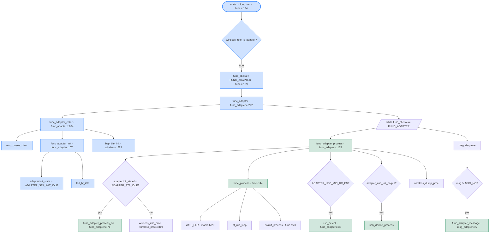
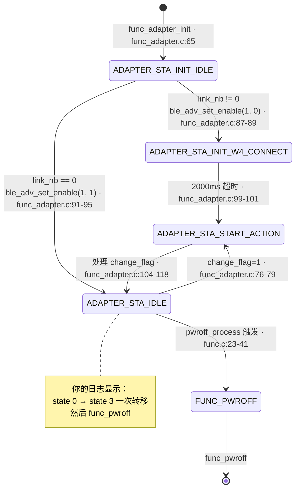
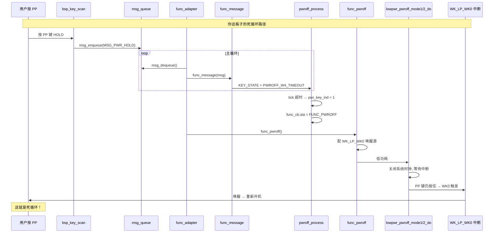
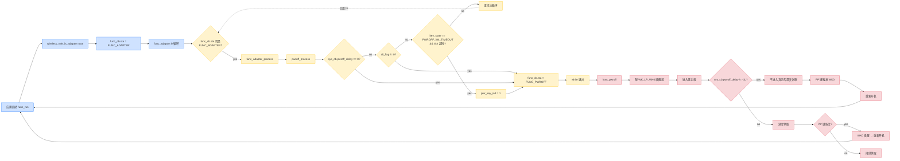

# AB5766 接收端状态机 `func_adapter` 与 `func_pwroff` 完整排查指南

> **本文档**：彻底剖析接收端 (`func_adapter`) 状态机的 4 个状态 + 3 类关机触发路径 + 为什么"开 - 关 - 唤醒 - 再开"循环。
>
> **配套文档**：
> - [`AB5766_启动日志_每一行打印的来源与调用链路.md`](AB5766_启动日志_每一行打印的来源与调用链路.md) — 启动日志完整解读
> - [`AB5766_嵌入式固件SDK_架构导览.md`](AB5766_嵌入式固件SDK_架构导览.md) — 整体架构
> - [`AB5766_接收端_Adapter_实现详解.md`](AB5766_接收端_Adapter_实现详解.md) — 接收端业务
> - [`AB5766_按键链路测试与验收指南.md`](AB5766_按键链路测试与验收指南.md) — 按键验收

---

## 0. 重要前提

**你这板子烧录的是 `wireless_adapter.setting`，跑的是接收端路径**。配置内容如下：

```xml
<!-- projects/microphone/Output/bin/Settings/wireless_adapter.setting -->
<add key="wireless_adapter_en" value="True" />
<add key="wireless_mic_emit_en" value="False" />
<add key="sys_off_time" value="0" />
<add key="bled_disp_en" value="False" />
<add key="charge_en" value="False" />
<add key="pa_gain" value="3" />
<add key="pa_vsel" value="8" />
<add key="pa_mode" value="1" />
```

详细的关键字段含义：
- `wireless_adapter_en = True`：进入 `func_adapter` 路径
- `wireless_mic_emit_en = False`：不进入 `func_mic_emit` 路径
- `sys_off_time = 0`：**无连接自动关机时间 = 0 秒**（但实际有 `if (sys_off_time != 0)` 守护，见 §4.1）

---

## 1. `func_adapter` 状态机全景

### 1.1 4 个状态定义

`functions/func_adapter.c:15-20`：

```c
enum {
    ADAPTER_STA_INIT_IDLE,           // 0 - 初始状态
    ADAPTER_STA_INIT_W4_CONNECT,     // 1 - 等待 2 秒超时
    ADAPTER_STA_START_ACTION,        // 2 - 处理 change_flag
    ADAPTER_STA_IDLE,                // 3 - 稳定运行
};
```

### 1.2 状态机入口与调度



### 1.3 完整状态转移图



### 1.4 状态机核心代码

`functions/func_adapter.c:71-121`：

```c
AT(.text.func.adapter)
static void func_adapter_process_do(void) {
    u8 link_nb;

    if (wireless_mic.change_flag) {                          // 76
        wireless_mic.change_flag = 0;
        adapter.init_state = ADAPTER_STA_START_ACTION;       // 78
    }

    switch (adapter.init_state) {                           // 81
    case ADAPTER_STA_INIT_IDLE:                              // 82
        link_nb = bt_get_link_info_nb();
        TRACE("adapter, init(%d): %x, %d\n", wireless_mic_is_bonding(), wireless_mic.connected_sta, link_nb);
        if (link_nb != 0) {
            ble_adv_set_enable(1, 0);                        // 88 仅可连接
            adapter.init_state  = ADAPTER_STA_INIT_W4_CONNECT;
            adapter.ticks       = tick_get();
        } else {
            ble_adv_set_enable(1, 1);                        // 93 可发现+可连接
            adapter.init_state  = ADAPTER_STA_IDLE;
        }
        break;

    case ADAPTER_STA_INIT_W4_CONNECT:                        // 98
        if (tick_check_expire(adapter.ticks, 2000)) {
            adapter.init_state = ADAPTER_STA_START_ACTION;  // 100
        }
        break;

    case ADAPTER_STA_START_ACTION:                           // 104
        link_nb = bt_get_link_info_nb();
        TRACE("adapter, con_sta(%d): %x, %d\n", wireless_mic_is_bonding(), wireless_mic.connected_sta, link_nb);

        if (wireless_mic.connected_sta == WIRELESS_MIC_STA_MASK) {  // 108 全连
            ble_adv_set_enable(0, 0);                        // 109 关闭 adv
        } else if (wireless_mic_is_bonding() && link_nb >= WIRELESS_CON_LINK_NB) {  // 111
            ble_adv_set_enable(1, 0);                        // 113 等待被连
        } else {
            ble_adv_set_enable(1, 1);                        // 116 可发现 + 可连接
        }
        adapter.init_state = ADAPTER_STA_IDLE;               // 118
        break;
    }
}
```

`functions/func_adapter.c:165-202` —— `func_adapter_process`：

```c
AT(.text.func.process.adapter)
void func_adapter_process(void) {
    // 调试 TRACE
    static u8 sta = 0xff;
    if (sta != adapter.init_state) {
        sta = adapter.init_state;
        TRACE("adapter, state: %d\n", sta);                  // 172 ← "adapter, state: 0/3" 打印
    }

    // 状态机推进
    if (adapter.init_state != ADAPTER_STA_IDLE || wireless_mic.change_flag) {
        func_adapter_process_do();                           // 185
    }

    // 其他处理
    if (wireless_mic.connected_sta != sys_cb.disp_sta) {
        wireless_mic_proc();                                // 189
    }
    func_process();                                          // 191

#if ADAPTER_USB_MIC_RX_EN
    if (xcfg_cb.wireless_adapter_en) {
        usb_detect();                                         // 194
        if (adapter_usb_init_flag) {
            usb_device_process();                            // 198
        }
    }
#endif

    wireless_dump_proc();                                    // 201
}
```

`functions/func_adapter.c:222-239` —— `func_adapter` 主循环：

```c
AT(.text.func.adapter)
void func_adapter(void) {
    printf("%s\n", __func__);                                // 225 ← "func_adapter" 打印

    func_adapter_enter();                                    // 227

    while (func_cb.sta == FUNC_ADAPTER) {
        func_adapter_process();                              // 230
        u16 msg = msg_dequeue();
        if (msg != MSG_NO) {
            func_adapter_message(msg);                       // 233
        }
    }

    func_adapter_exit();                                     // 238
}
```

---

## 2. `func_pwroff` 触发机制详解

### 2.1 三个触发条件

`functions/func.c:23-41` —— `pwroff_process()`：

```c
AT(.text.func.process)
void pwroff_process(void) {
    struct pwroff_tag *pwroff = &sys_cb.pwroff;

    // 条件 1: 长按 PP 键超时
    if (pwroff->key_state == PWROFF_W4_TIMEOUT) {           // 27
        if (tick_check_expire(pwroff->key_ticks, pwroff->delay_ticks)) {
            pwroff->key_state = PWROFF_END;
            pwroff->pwr_key_ind = 1;                          // 30
        }
    }

    // 条件 2: 任意状态标志置位 (低电/过温/USB 插入/用户)
    if (pwroff->all_flag != 0) {                            // 34
        func_cb.sta = FUNC_PWROFF;                           // 35
    }

    // 条件 3: 无连接自动关机计时到 0
    if (sys_cb.pwroff_delay == 0) {                          // 38
        func_cb.sta = FUNC_PWROFF;                           // 39
    }
}
```

### 2.2 触发条件 1 详解：PP 键长按


**关键代码**：

```c
// functions/func.c:77-82
case MSG_PWR_HOLD:
    if (sys_cb.pwroff.key_state == PWROFF_IDLE) {
        sys_cb.pwroff.key_ticks = tick_get();
        sys_cb.pwroff.key_state = PWROFF_W4_TIMEOUT;
    }
    break;
```

### 2.3 触发条件 2 详解：低电/过温/USB 插入

`bsp/bsp_sys.h:11-28` —— `pwroff_tag` 结构：

```c
struct pwroff_tag {
    volatile union {
        struct {
            u8 charge_full_ind  : 1;    // 充电充满
            u8 ntc_ind          : 1;    // NTC 过温
            u8 low_bat_ind      : 1;    // 低电
            u8 aux_insert_ind   : 1;    // AUX 插入
            u8 pwr_key_ind      : 1;    // PP 键按下
            u8 timeout_ind      : 1;    // 超时
            u8 user_ind         : 1;    // 用户主动
        };
        u8 all_flag;                    // union 整体 → 任何 1 bit 触发
    };
    u8 tone_en;
    u8 key_state;
    u32 key_ticks;
    u32 delay_ticks;
};
```

**任何一位被置 1 → `func_cb.sta = FUNC_PWROFF`**。

### 2.4 触发条件 3 详解：无连接自动关机

`bsp/bsp_sys.c:118-126` —— `bsp_var_init()`：

```c
sys_cb.pwroff_time = -1L;                                          // 118
sys_cb.pwroff_delay = -1L;                                         // 119

#if !FUNC_LE_DUT_EN
    if (xcfg_cb.sys_off_time != 0) {                                // 122
        sys_cb.pwroff_time = (u32)xcfg_cb.sys_off_time * 10;        // 123 注: 100ms × 10 = 1s
        sys_cb.pwroff_delay = sys_cb.pwroff_time;                  // 124
    }
#endif
```

`functions/func_lowpwr.c:344-350` —— `lowpwr_tout_ticks()`：

```c
AT(.com_text.sleep_tick)
void lowpwr_tout_ticks(void) {
    if (sys_cb.pwroff_delay != -1L && sys_cb.pwroff_delay > 0) {    // 347
        sys_cb.pwroff_delay--;                                     // 348
    }
}
```

每 100ms（在 `usr_tmr5ms_thread_do` 的 100ms 分支 `bsp_sys.c:84-86`）减 1。

**注意单位**：`xcfg_cb.sys_off_time` 的单位是**秒**，但实际是**乘 10**（line 123），所以 `60` 秒 = `600` 个 100ms = 60 秒 — 注释误导（`xcfg.h:10` 写"30秒钟后: 30"实际是 300 个 100ms = 30 秒）。

### 2.5 三个触发条件汇总表

| 触发条件 | 触发位置 | 触发源 | 你的场景 |
| --- | --- | --- | --- |
| 1. PP 键长按超时 | `func.c:27-32` | 按键扫描 → `MSG_PWR_HOLD` → `PWROFF_W4_TIMEOUT` → 超时 | **高度疑似** |
| 2. `pwroff->all_flag != 0` | `func.c:34-36` | 低电/过温/USB 插入/PP 键/超时/用户 | 需要检查 |
| 3. `sys_cb.pwroff_delay == 0` | `func.c:38-40` | `sys_off_time` 减到 0 | **没触发**（`xcfg_cb.sys_off_time = 0` 时 `pwroff_delay = -1L`，不减） |

---

## 3. `func_pwroff` 进入低功耗流程

### 3.1 `func_pwroff` 主体

`functions/func_lowpwr.c:408-433`：

```c
AT(.text.lowpwr.pwroff)
void func_pwroff(void) {
    printf("%s\n", __func__);                                    // 410 ← "func_pwroff" 打印

    sys_set_tmr_enable(0, 0);                                    // 412 关 5ms 定时器

#if BSP_LED_EN
    bled_set_off();                                                // 415 关蓝灯
#endif
    pwroff_w4_key_pressed();                                      // 417 等 PP 键松开

    GPIOADE = 0;                                                  // 419 关 GPIOA
    GPIOBDE = 0;                                                  // 420 关 GPIOB

    lowpwr_pwroff_wakeup_config();                                // 422 配唤醒源

#if (BSP_IOKEY_EN && IO_KEY_SCAN_MODE)
    bsp_gpio_scan_mode_de_save();
#endif

#if SYS_PWROFF_MODE == PWROFF_MODE1
    lowpwr_pwroff_mode1_do();                                      // 429
#elif SYS_PWROFF_MODE == PWROFF_MODE2
    lowpwr_pwroff_mode2_do();                                      // 431
#endif
}
```

### 3.2 唤醒源配置

`functions/func_lowpwr.c:352-393`：

```c
void lowpwr_pwroff_wakeup_config(void) {
    lowpwr_wakeup_typedef config;

    lowpwr_wakeup_disable();                                       // 356

    config.source = 0;

#if BSP_CHARGE_EN
    if (charge_detect_dc() == CHARGE_DC_STATUS_ONLINE) {
        config.source |=  WK_LP_INBOX;                              // 363
    } else {
        config.source |=  WK_LP_VUSB;                              // 365
    }
#endif

#if BSP_ADKEY_EN
    config.gpio_cfg.edge = GPIO_EDGE_FALLING;                       // 370
    config.source |=  WK_LP_WK0;                                    // 371 ← PP 键被配为唤醒源
#endif

#if BSP_CHARGE_BOX_EN
    if (sys_cb.charge_box_type != CHARGE_BOX_DISABLE) {
        if (CHARGE_INBOX()) {
            config.source |=  WK_LP_INBOX;
            RTCCON8 &= ~(0x03 << 16);
        } else {
            RTCCON8 &= ~(0x07 << 16);
            RTCCON8 |= (0x02 << 16);
        }
    }
#endif

    lowpwr_wakeup_config(&config);                                 // 389

#if BSP_IOKEY_EN
    bsp_gpio_wakeup_config();                                      // 392
#endif
}
```

**关键检测**：
- `BSP_ADKEY_EN = 1`（PD0 AD 按键）→ `WK_LP_WK0` 配为唤醒源
- `edge = GPIO_EDGE_FALLING` → 按下 PP 键触发 WK0 唤醒

### 3.3 完整流程：PP 键反复导致循环



---

## 4. 三大排查方向

### 4.1 方向 A：PP 键物理问题

**可能性**：PP 键的引脚信号线一直保持低电平（按键卡死、上拉电阻失效、引脚虚焊）。

**如何验证**：

1. 用万用表量 PP 键引脚（WK0 ADC 通道）电压：
   - 松开时应该是 VDD 或接近 VDD
   - 按下时是 GND
2. 如果不按时仍为 0 → 物理问题，更换/检修
3. 如果不按时为 1 → 跳到方向 B

### 4.2 方向 B：`MSG_PWR_HOLD` 触发测试

**可能性**：确实是 PP 键被按下，应该接收 PP 键而不是关机。

**为什么接收端有 PP 键的 HOLD 映射关机**：
- `adapter_key_msg_tbl` (port_key.c:61) `KEY_ID_PP` 在第 3 列（HOLD 事件）设了 `MSG_PWR_HOLD`
- 长按 PP 键 → HOLD 事件 → `MSG_PWR_HOLD` → 关机流程

**这是设计意图**，但**单 PP 键 `adapter_key_msg_tbl` 没法去掉 MSG_PWR_HOLD** 因为只有一列定义。

### 4.3 方向 C：长按时间设置

`xcfg.h:48` `pwroff_press_time`：长按 PP 键多少秒触发关机。

默认 `value=3`（参见 `wireless_adapter.setting:77`），但实际值定义在 `xcfg.h`：

```c
u32 pwroff_press_time : 3;   //软关机长按时间选择: 1.5秒: 0, 2秒: 1, 2.5秒: 2, 3秒: 3
```

**`pwroff_press_time` 字段实际值请通过配置工具读出**。

**影响**：
- `pwroff_press_time = 0` → 长按 1.5 秒
- `pwroff_press_time = 3` → 长按 3 秒
- `pwroff_press_time = 7` → 长按 5 秒

**`pwroff.delay_ticks` 计算**（`bsp_sys.c:128`）：

```c
sys_cb.pwroff.delay_ticks = xcfg_cb.pwroff_press_time * 500 + 1500 - (KEY_LONG_TIMES*5);
```

---

## 5. 调试建议

### 5.1 立即可做的修改

按 `Ctrl+G` 跳到 `functions/func.c:23`，在 `pwroff_process()` 顶部加 debug：

```c
void pwroff_process(void) {
    struct pwroff_tag *pwroff = &sys_cb.pwroff;

    // 调试: 打印触发原因
    printf("DBG pwroff: state=%d key_state=%d all_flag=0x%x delay=%u pwr_key_ind=%d\n",
           func_cb.sta, pwroff->key_state, pwroff->all_flag,
           sys_cb.pwroff_delay, pwroff->pwr_key_ind);

    // 原有逻辑
    if (pwroff->key_state == PWROFF_W4_TIMEOUT) {
        if (tick_check_expire(pwroff->key_ticks, pwroff->delay_ticks)) {
            pwroff->key_state = PWROFF_END;
            pwroff->pwr_key_ind = 1;
            printf("DBG: trigger by PP HOLD timeout\n");
        }
    }
    if (pwroff->all_flag != 0) {
        printf("DBG: trigger by all_flag=0x%x\n", pwroff->all_flag);
        func_cb.sta = FUNC_PWROFF;
    }
    if (sys_cb.pwroff_delay == 0) {
        printf("DBG: trigger by pwroff_delay=0\n");
        func_cb.sta = FUNC_PWROFF;
    }
}
```

重新烧录后看哪行 `DBG:` 先打印 → 立即锁定触发原因。

### 5.2 减少 PP 键影响

如果想测试时不让 PP 键关机，临时改 `port_key.c:63`：

```c
// projects/microphone/port/port_key.c:63
[KEY_ID_PP] = {MSG_NO, MSG_NO, MSG_NO, MSG_NO, ...},  // HOLD 改成 MSG_NO
```

### 5.3 物理屏蔽 PP 键

如果想测试按键功能但又不想被长按 PP 干扰：
- 临时拔掉 PP 键跳线
- 或在配置工具里把 `pwroff_press_time` 设到 7（5 秒），然后测试时短按

### 5.4 烧录发射端固件

如果想测试发射端（PP/K1/K2/K3 四个按键），需要：

1. 打开配置工具 → 切换到 `wireless_mic_emit` 方案
2. 重新生成 `xcfg.bin`
3. 烧录发射端固件
4. 测试 PP/K1/K2/K3 四个按键

参考：[`AB5766_按键链路测试与验收指南.md`](AB5766_按键链路测试与验收指南.md)。

---

## 6. 关键行号速查表（接收端 + 关机）

| 关注点 | 文件:行号 |
| --- | --- |
| `func_run` super-loop | `functions/func.c:134-178` |
| `pwroff_process` 三个条件 | `functions/func.c:23-41` |
| `func_message` 处理 MSG_PWR_HOLD | `functions/func.c:72-112` |
| `func_adapter` 入口 | `functions/func_adapter.c:222-239` |
| `func_adapter_enter` | `functions/func_adapter.c:204-213` |
| `func_adapter_init` | `functions/func_adapter.c:57-69` |
| `func_adapter_process` | `functions/func_adapter.c:165-202` |
| `func_adapter_process_do` | `functions/func_adapter.c:71-121` |
| `adapter, state: %d` TRACE | `functions/func_adapter.c:172` |
| `adapter, init(%d): %x, %d` TRACE | `functions/func_adapter.c:84` |
| `adapter, con_sta(%d): %x, %d` TRACE | `functions/func_adapter.c:106` |
| `func_adapter_message` | `functions/msg_adapter.c:5-50` |
| `func_pwroff` | `functions/func_lowpwr.c:408-433` |
| `func_pwroff` 的 printf | `functions/func_lowpwr.c:410` |
| `lowpwr_pwroff_wakeup_config` | `functions/func_lowpwr.c:352-393` |
| `lowpwr_pwroff_mode1_do` | `driver/driver_lowpwr.c:190-241` |
| `lowpwr_pwroff_mode2_do` | `driver/driver_lowpwr.c:313-` |
| `WKO_WK` 中断打印 | `driver/driver_lowpwr.c:52` |
| `pwroff_tag` union | `bsp/bsp_sys.h:11-28` |
| `pwroff_delay` 初始值 | `bsp/bsp_sys.c:118-126` |
| `pwroff_delay` 递减 | `functions/func_lowpwr.c:344-350` |
| `pwroff_delay` 触发 | `functions/func.c:38-40` |
| Wakeup 状态枚举 | `bsp/bsp_sys.h:5-9` |
| 接收端按键表 | `projects/microphone/port/port_key.c:61-67` |
| `sys_off_time` 字段 | `projects/microphone/xcfg.h:10` |
| `pwroff_press_time` 字段 | `projects/microphone/xcfg.h:48` |
| `wireless_role_is_adapter` | `libs/ble/api_wireless_mic.h:52` |
| `wireless_mic_role_init` | `modules/wireless/wireless_proc.c:5-18` |
| `bsp_ble_init` | `modules/wireless/wireless.c:223-239` |
| `MSG_PWR_HOLD` 来源 | `bsp/bsp_key.c:131` |
| `adapter_key_msg_tbl` 装载 | `functions/func_adapter.c:124` (在 func_enter 中) |

---

## 7. 关键图示：完整唤醒循环



---

## 8. 总结表：你的现象与可能原因

| 现象 | 嫌疑 | 优先级 |
| --- | --- | --- |
| 进 `func_pwroff` 立即 | A. PP 键 HOLD 触发 | **高** |
| | B. `pwroff.all_flag` 某位 = 1（低电/过温） | 中 |
| | C. `pwroff_delay == 0`（不可能：`sys_off_time=0` 时为 -1L） | 低 |
| `WKO_WK → func_pwroff` 循环 | A. PP 键持续按住 → 每次唤醒后又触发 | **高** |
| | B. WK0 唤醒源 edge 配置错误 | 低 |
| 按 K1/K2/K3 没反应 | A. 接收端 `adapter_key_msg_tbl` 只映射 PP | **确认** |
| 第一行 `WDT_RST` | A. 第一次烧录或复位时 WDT 超时 | 已知 |

**最可能原因**：你的板子 **PP 键** 一直处于"按住"状态（物理上拉电阻失效，或焊接短路，或软件误触发），每次从低功耗唤醒后又立即触发 `MSG_PWR_HOLD` → `func_pwroff` → 循环。

---

## 9. 立即可执行的验证步骤

1. **物理断开 PP 键**（拔掉跳线或断开排线）
2. **重新烧录** 接收端固件
3. **观察串口**：
   - 如果看到 `func_pwroff` 仍然反复 → 软件问题（all_flag 标志）
   - 如果看到 `WKO_WK` 后**不**再进 `func_pwroff` → **确认是 PP 键物理问题**
4. **解除 PP 键后**逐步接入其他按键测试

如果**第 3 步确认 PP 键物理问题**，请：
- 检查 PP 键的 PCB 焊接
- 检查上拉电阻（通常 10K 上拉到 VDD）
- 检查 ADC 通道 WK0 是否被其他电路占用

---

（本文档基于 `projects/microphone/config_ab5766_le_mic.h` 当前默认配置 + Code::Blocks 工程配置。所有文件:行号引用为仓库当时快照；如有变动请以实际代码为准。）
