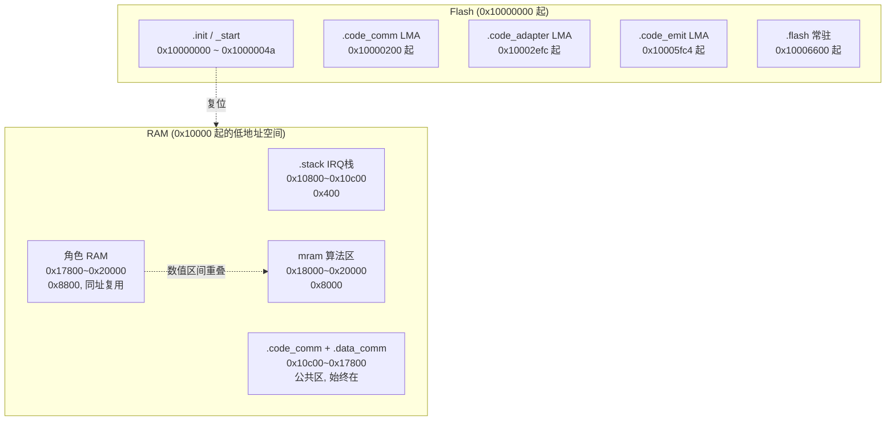
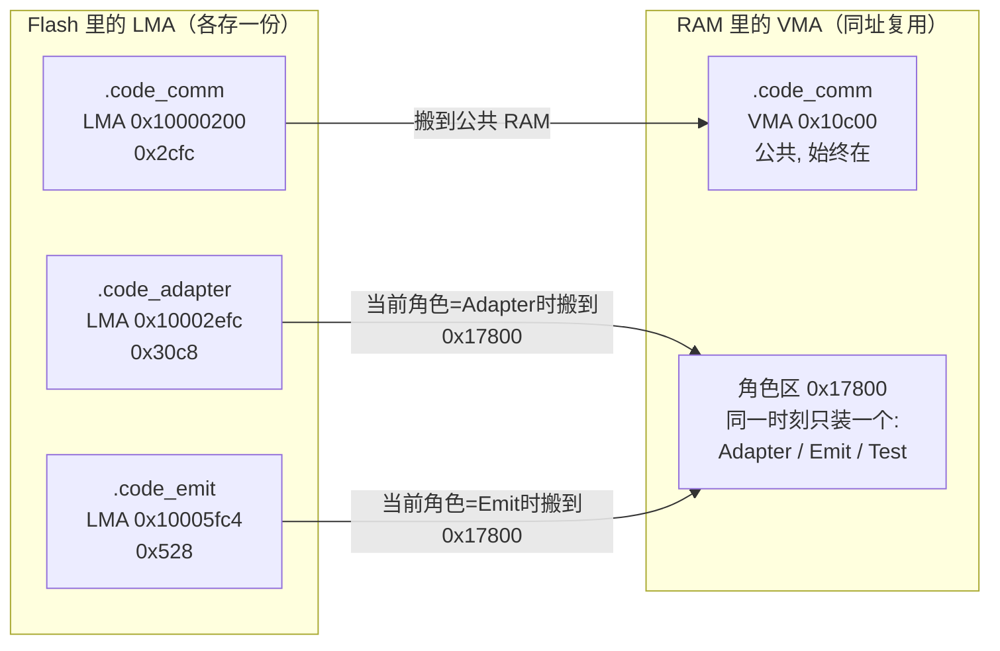
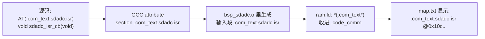
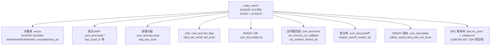
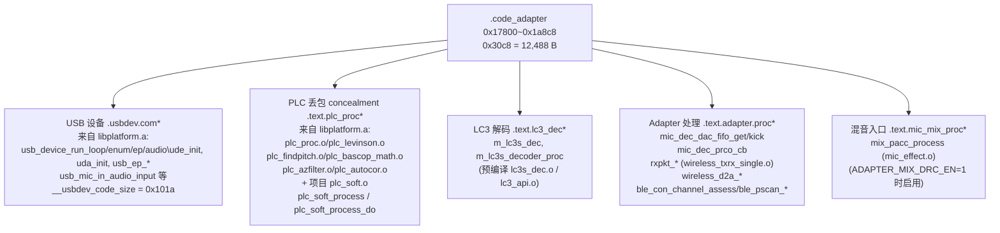
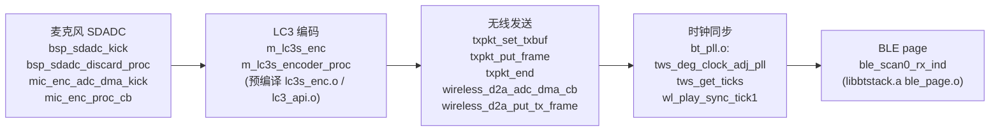

# AB5766 map 文件解析指南

> 本文基于本仓库当前一次具体构建产生的 [map.txt](../../projects/microphone/Output/bin/map.txt)（约 5536 行、309 KB），逐段讲清楚“map 是什么、怎么读、每个 section 代表什么、容量够不够、哪里要当心”。
>
> 读者分两类：
> - **小白**：第一次看 linker map，目标是学会“看懂一行 map、算出一个段用了多少 RAM、判断有没有越界”。
> - **资深开发者**：目标是核对 VMA/LMA、`AT > flash`、`NOLOAD`、角色复用、`--gc-sections` 保留结果和 Flash/RAM 容量，并能拿这份文档去和链接脚本 [ram.ld](../../projects/microphone/ram.ld)、工程文件 [app.cbp](../../projects/microphone/app.cbp) 对照排查。
>
> 配套阅读：[AB5766 嵌入式固件SDK 架构导览](AB5766_嵌入式固件SDK_架构导览.md)、[AB5766_LE_Mic 新手开发指南](AB5766_LE_Mic_新手开发指南.md)、[AB5766 系统角色与算法启动门禁](AB5766_系统角色与算法启动门禁.md)。

---

## 1. 阅读前说明：map 是什么、不是什么

**map 是什么：** map 是链接器（`riscv32-elf-ld`/工具链链接器）在生成最终镜像 `app.rv32` 时，顺便吐出的“链接结果账本”。它记录了：

- 每个**输出 section**（如 `.code_comm`、`.code_adapter`）放在哪个地址、多大、装载地址是多少；
- 每个**输入 section**（来自哪个 `.o` 对象、哪个 `.a` 静态库成员）被放进了哪个输出 section、贡献了多少字节；
- 每个**符号**（函数、变量）的最终地址；
- 链接器算出来的**统计符号**（如 `__bss_size`、`__total_size`）。

**map 不是什么（重要边界）：**

| map 能证明（E2） | map 不能证明（需要更高证据） |
|---|---|
| 哪些 `.o`/`.a` 对象被链接进来 | 这些函数在硬件上**是否真的被执行**（E3） |
| 每个 section 的地址、大小、LMA | 角色**是否成功切换**、连接是否成功（E3） |
| 哪些符号被保留、地址是多少 | 无线重传**实际次数**、音频延迟、功耗（E3） |
| RAM/Flash 容量占用与边界 | 预编译库（`libplatform.a`/`libbtstack.a`）内部算法实现 |
| 链接器有没有报溢出/重叠 | 音频质量、PLC/Echo/Reverb 的主观效果（E3） |

**证据分级口径（贯穿全文）：**

- **E0 配置**：`config_*.h` 里的宏开关，如 `WIRELESS_MIC_ECHO_EN`。
- **E1 源码**：可见的 `.c`/`.h`/`.ld`，能看出“代码是怎么写的”。
- **E2 map/镜像**：map.txt、`app.rv32`、反汇编，能证明“链接结果是什么”。
- **E3 硬件实测**：烧录、双板联调、波形/音频抓取、启动日志，能证明“实际跑起来是什么样”。

> 本文所有结论默认是 **E2**。凡是要把结论升级到“运行时一定如何”，都必须有 E3 佐证，本文不会替你做这个升级。

---

## 2. map 从哪里来

map 不是手写的，是构建工具链按工程配置自动生成的。证据来自 [app.cbp](../../projects/microphone/app.cbp)：

```xml
<Linker>
    <Add option="-T$(TARGET_OBJECT_DIR)ram.o" />
    <Add option="--gc-sections" />
    <Add option="-Map=Output\bin\map.txt" />
    <Add option="--no-warn-rwx-segments" />
    <Add library="../../libs/cpu/libplatform.a" />
    <Add library="../../libs/cpu/libm.a" />
    <Add library="../../libs/cpu/libc.a" />
    <Add library="../../libs/cpu/libgcc.a" />
    <Add library="../../libs/ble/libbtstack.a" />
</Linker>
```

逐条解释：

- `-T$(TARGET_OBJECT_DIR)ram.o`：链接脚本不是直接用 `ram.ld`，而是先用 C 预处理器把 [ram.ld](../../projects/microphone/ram.ld) 处理成 `Output/obj/ram.o`（名字叫 `.o`，本质是预处理后的链接脚本输入），再把它当链接脚本喂给链接器。所以 `ram.ld` 里的 `#include "config.h"`、`#if WIRELESS_CON_CODEC_SEL ...` 这些预处理指令会先展开，再决定内存布局。
- `--gc-sections`：开启“未引用段收集”，没被引用的函数/数据会被丢掉。这就是为什么“源码文件在工程里”不等于“函数真的进了镜像”。详见第 11 节。
- `-Map=Output\bin\map.txt`：把链接账本写到 [map.txt](../../projects/microphone/Output/bin/map.txt)。本文解析的就是这个文件。
- `--no-warn-rwx-segments`：抑制“可读可写可执行段”告警，本项目 RAM 段同时承载代码与数据，属正常设计。
- 五个静态库：`libplatform.a`（平台/驱动/算法）、`libm.a`、`libc.a`、`libgcc.a`（C 运行时与数学库）、`libbtstack.a`（BLE 协议栈）。map 里能看到它们哪些成员被拉进来，但**看不到这些库内部的源码实现**。

> **关键约束**：本文所有数字都来自当前这一次构建的 map.txt。`ram.ld` 里 `__comm_ram_size` 受 `WIRELESS_CON_CODEC_SEL` 控制（选 `CODEC_ESBC` 是 30k，否则 27k），当前配置是 `CODEC_LC3S`，所以是 27k = `0x6c00`。如果你改了编解码选择、改了音效开关、改了 USB 角色，重新构建后 map 数字会变，本文的数字不会自动跟着变。

---

## 3. 小白入门：怎么读一行 map

map 里最核心的一行长这样（来自 map.txt 第 2502 行）：

```text
.code_adapter   0x00017800     0x30c8 load address 0x10002efc
```

从左到右四个字段：

| 字段 | 值 | 含义 |
|---|---|---|
| 输出 section 名 | `.code_adapter` | 这个段的名字，链接脚本里 `.code_adapter : { ... }` 定义 |
| **VMA**（运行地址） | `0x00017800` | 程序运行时，这段代码在 CPU 地址空间里的地址 |
| **size** | `0x30c8` | 这段的大小（字节，十六进制） |
| **LMA**（装载地址） | `load address 0x10002efc` | 这段内容在烧录镜像（Flash）里存放的地址 |

> **VMA vs LMA 是 map 最重要的概念。**
> - **VMA（Virtual Memory Address）**：CPU 执行时“认为”这段在哪个地址。代码里的函数调用、变量访问都按 VMA 编址。
> - **LMA（Load Memory Address）**：这段二进制内容**实际存在 Flash 的哪里**，开机时由启动代码从 LMA 搬到 VMA。
> - 对纯 ROM/Flash 里跑的代码，VMA == LMA；对“存 Flash、跑 RAM”的代码，VMA != LMA，本项目大量使用后者。

**算结束地址**：`end = VMA + size`。十六进制加法：

```text
.code_adapter  VMA=0x17800  size=0x30c8
end = 0x17800 + 0x30c8 = 0x1a8c8
```

手算过程：`0x17800 + 0x3000 = 0x1a800`，`0x1a800 + 0xc8 = 0x1a8c8`。所以这段占用 `0x17800 ~ 0x1a8c8`。

**一行输入 section** 长这样：

```text
 .text.lc3_dec  0x0001a136       0x32 ..\..\libs\cpu\libplatform.a(lc3s_dec.o)
                0x0001a136                m_lc3s_dec
```

- `.text.lc3_dec`：输入 section 名（来自某个 `.o` 的 `.text.lc3_dec` 段）。
- `0x0001a136`：它在输出 section 里的偏移地址。
- `0x32`：这一小段大小。
- `..\..\libs\cpu\libplatform.a(lc3s_dec.o)`：来自静态库 `libplatform.a` 里的成员 `lc3s_dec.o`。
- `m_lc3s_dec`：符号（函数/变量）名，地址 `0x1a136`。

**NOLOAD 是什么**：链接脚本里写 `(NOLOAD)` 的段（如 `.data_adapter (NOLOAD)`），表示“这个段不进装载镜像，不占 Flash，只在 RAM 里占地址、开机后由程序自己初始化或留作 buffer”。map 里它也会显示 `load address`，但那个值是**逻辑占位**，不代表它真的在 Flash 里占空间（详见第 8 节的重点说明）。

---

## 4. Memory Configuration：链接器看到的整片内存

map 第 1879–1890 行是链接器汇总的“内存区”清单，来自 [ram.ld](../../projects/microphone/ram.ld) 第 38–51 行的 `MEMORY` 命令：

```text
Memory Configuration

Name             Origin             Length             Attributes
init             0x10000000         0x00000200
flash            0x10000200         0x0001e000         xr
comm             0x00010c00         0x00006c00         xr
comm_adapter     0x00017800         0x00008800
comm_emit        0x00017800         0x00008800
comm_test        0x00017800         0x00008800
stack            0x00010800         0x00000400
mram             0x00018000         0x00008000
*default*        0x00000000         0xffffffff
```

| 区域名 | Origin（起点） | Length | 十进制 | 属性 | 用途 |
|---|---|---|---|---|---|
| `init` | `0x10000000` | `0x200` | 512 B | — | 复位入口区，放 `.reset`/`_start` |
| `flash` | `0x10000200` | `0x1e000` | 122,880 B | `xr` | 主 Flash，存常驻代码/数据 + 各角色代码的 LMA |
| `comm` | `0x00010c00` | `0x6c00` | 27,648 B | `xr` | **公共 RAM**：公共代码 + 公共数据（BSS/BRAM/heap） |
| `comm_adapter` | `0x00017800` | `0x8800` | 34,816 B | — | **角色 RAM**：Adapter 代码+数据 |
| `comm_emit` | `0x00017800` | `0x8800` | 34,816 B | — | **角色 RAM**：Emit 代码+数据 |
| `comm_test` | `0x00017800` | `0x8800` | 34,816 B | — | **角色 RAM**：产测 DUT 代码+数据 |
| `stack` | `0x00010800` | `0x400` | 1,024 B | — | IRQ 栈 |
| `mram` | `0x00018000` | `0x8000` | 32,768 B | — | 算法复用区（Echo/Reverb） |

**三个最易踩坑的点（小白必看）：**

1. **`comm_adapter`、`comm_emit`、`comm_test` 三个区 Origin 都是 `0x17800`，Length 都是 `0x8800`。** 它们是**同一段 RAM 的三种角色身份**，不是三块独立 RAM。同一时刻只跑一个角色，所以物理 RAM 只有一份 `0x17800 ~ 0x20000`（34,816 B）。**绝对不能把三个 `0x8800` 相加**当成“角色 RAM 一共 104,448 B”。省的是 RAM，不是 Flash。

2. **`comm` 和角色 RAM 在地址上是相邻不重叠的**：`comm` 占 `0x10c00 ~ 0x17800`，角色 RAM 占 `0x17800 ~ 0x20000`，`stack` 在 `0x10800 ~ 0x10c00`。`init` 在 Flash 顶端 `0x10000000`。

3. **`mram` 区 `0x18000 ~ 0x20000` 与角色 RAM 区 `0x17800 ~ 0x20000` 在数值上有重叠区间 `0x18000 ~ 0x20000`。** 这是链接脚本的设计安排（Echo/Reverb 复用），不是笔误，但也是本文需要重点标注的“待复核边界”，详见第 10 节。

用一个内存布局图把地址关系画清楚：



> 说明：`mram` 区 `0x18000~0x20000` 完全落在角色 RAM `0x17800~0x20000` 之内。角色 RAM 是物理 RAM，`mram` 是这段物理 RAM 里专门留给 Echo/Reverb 算法 buffer 的逻辑区。两者不是两块独立 RAM。

---

## 5. 关键链接符号

map 第 1972–1987 行是 [ram.ld](../../projects/microphone/ram.ld) 顶部算出来的“布局符号”。它们决定了上面那些区的起点和大小：

| 符号 | map 里的值 | ram.ld 定义 | 含义 |
|---|---|---|---|
| `__max_flash_size` | `0x1e000` | `FLASH_CODE_SIZE` | Flash 容量上限 |
| `__base` | `0x10000000` | `0x10000000` | Flash 基址 |
| `__cache_stack_vma` | `0x10600` | `0x10600` | loader cache 栈 |
| `__cache_stack_size` | `0x200` | `512` | loader cache 栈大小 |
| `__stack_vma` | `0x10800` | `0x10800` | IRQ 栈起点 |
| `__stack_ram_size` | `0x400` | `1k` | IRQ 栈大小 |
| `__comm_ram_vma` | `0x10c00` | `0x10c00` | 公共 RAM 起点 |
| `__comm_ram_size` | `0x6c00` | `27k`（LC3S）/ `30k`（ESBC） | 公共 RAM 大小 |
| `__adapter_ram_vma` | `0x17800` | `__comm_ram_vma + __comm_ram_size` | **Adapter 运行起点** |
| `__adapter_ram_size` | `0x8800` | `61k - __comm_ram_size` | Adapter RAM 大小 |
| `__emit_ram_vma` | `0x17800` | `= __adapter_ram_vma` | **Emit 运行起点 = Adapter** |
| `__emit_ram_size` | `0x8800` | `= __adapter_ram_size` | Emit RAM 大小 = Adapter |
| `__test_ram_vma` | `0x17800` | `= __adapter_ram_vma` | **Test 运行起点 = Adapter** |
| `__test_ram_size` | `0x8800` | `= __adapter_ram_size` | Test RAM 大小 = Adapter |
| `__mram_vma` | `0x18000` | `0x18000` | MRAM 起点 |
| `__mram_ram_size` | `0x8000` | `32k` | MRAM 大小 |

**结论（资深视角）：** 三个角色 `__adapter_ram_vma`、`__emit_ram_vma`、`__test_ram_vma` 全部等于 `0x17800`，大小全部 `0x8800`。这就是“角色 RAM 同址复用”的硬证据：链接脚本故意把三种角色放在同一片 RAM 上，靠运行时只激活一个角色来互斥。`__adapter_ram_size = 61k - 27k = 34k = 0x8800`，map 里展开成 `(0xf400 - __comm_ram_size)`，即 `0xf400 - 0x6c00 = 0x8800`，与之一致。

> **拼写注意**：[ram.ld](../../projects/microphone/ram.ld) 第 465–466 行把 Adapter 的统计符号写成 `__comm_apapter_lma` / `__comm_apapter_size`（`apapter` 是源码里的拼写，不是 `adapter`）。map 第 4781–4782 行也是 `__comm_apapter_lma = 0x10002efc`、`__comm_apapter_size = 0x30c8`。**本文一律保留源码原拼写，不擅自改成 `adapter`**，否则会和你 grep 源码的结果对不上。

---

## 6. 入口与整体加载流程

### 6.1 复位入口

map 第 1989–1992 行：

```text
.init           0x10000000       0x4a
 *(.reset)
 .reset         0x10000000       0x4a ..\..\libs\cpu\libplatform.a(reset.o)
                0x10000000                _start
```

- `.init` 在 `0x10000000`，大小 `0x4a`（74 B），位于 `init` 区。
- `_start` 符号地址就是 `0x10000000`，是 [ram.ld](../../projects/microphone/ram.ld) 第 3 行 `ENTRY(_start)` 指定的链接入口。
- reset 代码来自预编译平台库 `libplatform.a(reset.o)`，源码不可见。**开机后 `_start` 具体怎么把各角色代码从 LMA 搬到 VMA，属于平台库内部行为，map 只能证明“链接布局要求搬运”，不能证明“搬运代码长什么样、何时执行”**（这需要看启动日志/反汇编，属 E2/E3 之间）。

### 6.2 VMA/LMA 与 `AT > flash`

[ram.ld](../../projects/microphone/ram.ld) 用 `> 区 AT > flash` 语法把“运行区”和“装载区”分开：

```ld
.code_comm    : { ... } > comm        AT > flash
.code_adapter : { ... } > comm_adapter AT > flash
.code_emit    : { ... } > comm_emit    AT > flash
.code_test    : { ... } > comm_test    AT > flash
```

含义：这四段代码的**运行地址（VMA）在各自 RAM 区**，但**内容烧在 Flash（LMA）里**，开机由启动代码搬到 RAM。Flash 里 Adapter、Emit、Test 三套代码**各存一份、LMA 各不相同**；RAM 里它们**共用 `0x17800` 一片、同址复用**。



**一句话记法**：**Flash 各存一份，RAM 同址复用，省的是 RAM 不是 Flash。**

### 6.3 主要输出 section 总览

| 输出 section | VMA | size | end（VMA+size） | LMA | NOLOAD | 所在区 |
|---|---|---|---|---|---|---|
| `.init` | `0x10000000` | `0x4a` | `0x1000004a` | — | 否 | `init` |
| `.code_comm` | `0x10c00` | `0x2cfc` | `0x138fc` | `0x10000200` | 否 | `comm` |
| `.code_adapter` | `0x17800` | `0x30c8` | `0x1a8c8` | `0x10002efc` | 否 | `comm_adapter` |
| `.data_adapter` | `0x1a8c8` | `0x4d90` | `0x1f658` | `0x10005fc4` | **是** | `comm_adapter` |
| `.code_emit` | `0x17800` | `0x528` | `0x17d28` | `0x10005fc4` | 否 | `comm_emit` |
| `.data_emit` | `0x17d28` | `0xfe0` | `0x18d08` | `0x100064ec` | **是** | `comm_emit` |
| `.mram_echo` | `0x18000` | `0x6000` | `0x1e000` | — | **是** | `mram` |
| `.mram_reverb` | `0x18000` | `0x6000` | `0x1e000` | — | **是** | `mram` |
| `.code_test` | `0x17800` | `0x0` | `0x17800` | `0x100064ec` | 否 | `comm_test` |
| `.data_test` | `0x17800` | `0x0` | `0x17800` | `0x100064ec` | **是** | `comm_test` |
| `.flash` | `0x10006600` | `0x12200` | `0x10018800` | `0x10006600` | 否 | `flash` |
| `.stack` | `0x10800` | `0x400` | `0x10c00` | — | **是** | `stack` |
| `.data_comm` | `0x13900` | `0x3b70` | `0x17470` | — | **是** | `comm` |

> **一个容易把小白看懵的现象**：`.data_adapter` 和 `.code_emit` 的 `load address` 都是 `0x10005fc4`，看起来“撞了”。其实没有：`.data_adapter` 是 NOLOAD，**不占 Flash 装载空间**，链接器给它的 `load address` 只是“逻辑上的下一个位置”，并不真正写入镜像；真正占 Flash 的是下一个有内容的 section `.code_emit`，它从 `0x10005fc4` 开始。同理 `.data_emit`（NOLOAD，LMA `0x100064ec`）与 `.code_test`/`.data_test`（size=0）共用同一 LMA。**NOLOAD 段的 `load address` 不是它真正存放数据的地方**——这是读 map 的关键。

Flash LMA 链验证（有内容的段）：

```text
.code_comm   LMA 0x10000200, size 0x2cfc -> end 0x10002efc
.code_adapter LMA 0x10002efc, size 0x30c8 -> end 0x10005fc4   (正好接上)
.code_emit   LMA 0x10005fc4, size 0x528  -> end 0x100064ec   (正好接上)
.flash       LMA 0x10006600                                 (中间 0x114 字节对齐间隙, ALIGN(512))
```

`.code_test` 当前 size=`0x0`（产测 DUT 功能没编进来），所以它“占”的 LMA `0x100064ec` 实际是空的，`.flash` 紧随其后。

### 6.4 `AT(...)`：源码里的 section 名是怎么来的

前面各 section 里装的“输入 section”（如 `.com_text.sdadc.isr`、`.text.mic_emit.proc`、`.usbdev.com.detect`），都不是编译器自动命名的，而是源码里用 `AT(...)` 宏**手动指定**的。

**宏定义**在 [header/macro.h](../../header/macro.h) 第 8–9 行：

```c
#define STR(x)                  #x
#define AT(x)                   __attribute__((section(STR(x))))
```

- `STR(x)` 用 `#` 把参数字符串化，所以 `AT(.com_text.sdadc.isr)` 被展开成 `__attribute__((section(".com_text.sdadc.isr")))`。
- 这个 attribute 告诉 GCC：把这个函数/变量放进 ELF 输入段，段名就是字符串 `".com_text.sdadc.isr"`。
- 链接时，[ram.ld](../../projects/microphone/ram.ld) 里的 `*(.com_text*)` 这种“输入段收集模式”把它收进对应输出段（这里是 `.code_comm`）。

**完整链路**：



**所以“固定模板”不是编译器规定，而是本仓库的一套命名约定**，由 [ram.ld](../../projects/microphone/ram.ld) 的 `*(...)` 收集列表来落实。看 `AT(...)` 的**第一个点分字段**（不是看是否含 `com` 子串）就能判断它会落到哪个区：

| `AT(...)` 第一字段 / 模式 | 含义 | ram.ld 收集者 | 落到输出段 | 所在内存 | NOLOAD | 例子（map 可见符号） |
|---|---|---|---|---|---|---|
| `.com_text.*` / `.bcom_text.*` / `.com_rodata.*` / `.bcom_rodata.*` | **公共代码/常量**，两角色都要用 | `.code_comm`：`*(.com_text*)` 等 | `.code_comm` | comm RAM（AT>flash） | 否 | `.com_text.sdadc.isr`（`sdadc_isr_cb`）、`.com_text.ble.isr.con`、`.com_text.timer`、`.vector` |
| `.text.adapter.proc*` / `.text.plc_proc*` / `.rodata.plc*` / `.text.lc3_dec*` / `.rodata.lc3_dec*` / `.usbdev.com*` / `.text.mic_mix_proc*` | **Adapter 角色热路径** | `.code_adapter`：`*(.text.adapter.proc*)` 等 | `.code_adapter` | comm_adapter RAM（AT>flash） | 否 | `.text.adapter.proc`（`mic_dec_*`）、`.text.plc_proc*`（`plc_soft_process`）、`.usbdev.com.detect`（`usb_detect`）、`.text.mic_mix_proc`（`mix_pacc_process`） |
| `.text.mic_emit.proc*` / `.text.lc3_enc*` / `.rodata.lc3_enc*` | **Emit 角色热路径** | `.code_emit`：`*(.text.mic_emit.proc*)` 等 | `.code_emit` | comm_emit RAM（AT>flash） | 否 | `.text.mic_emit.proc.sdadc`（`bsp_sdadc_kick`）、`.text.mic_emit.proc.bt_pll`、`.text.lc3_enc*`（`m_lc3s_enc`） |
| `.buf.adapter.proc*` / `.buf.lc3_dec*` / `.buf.plc_buf*` / `.buf.mic_mix*` | **Adapter buffer** | `.data_adapter`：`*(.buf.adapter.proc*)` 等 | `.data_adapter` | comm_adapter RAM | **是** | `.buf.adapter.proc`（`mic_dec`）、`.buf.plc_buf`、`.buf.mic_mix.pacc`（`mix_pacc`） |
| `.buf.lc3_enc*` / `.buf.mic_effect*` / `.buf.sdadc` / `.buf.mic_emit.proc*` | **Emit buffer** | `.data_emit`：`*(.buf.lc3_enc*)` 等 | `.data_emit` | comm_emit RAM | **是** | `.buf.lc3_enc`、`.buf.mic_effect`（`loc_mic_eq`）、`.buf.sdadc`（`sdadc_buf`） |
| `.buf.*`（未命中上面具体名）/ `.bss*` / `.sbss*` / COMMON / `.btmem*` / `.ble_cache*` / `.ble_buf*` / `.mem_heap` | **公共数据/BSS/BRAM/heap** | `.data_comm`：`*(.buf*)`/`*(.bss*)`/`*(.btmem*)` 等 | `.data_comm` | comm RAM | **是** | `xcfg_cb`、`ble_adv_env`、`mem_heap` |
| `.text.func.*` / `.com_sleep.*` / `.text.pwroff*` / `.charge_text*` / `.text.ws_mic_com*` / `.bb_test*` / `.text.update*` / `.text.fot.cache*` / `.irq_init.aligned` / `.text.ble.chmap*` / 通用 `.text.*` / `.rodata.*` | **冷路径/常驻 Flash 代码**（状态机、消息、init、FOTA、充电、关机） | `.flash`：`*(.com_sleep*)`/`*(.text.pwroff*)`/`*(.text*)`/`*(.rodata*)` 等 | `.flash` | flash（VMA==LMA） | 否 | `.text.func.adapter`（`func_adapter`）、`.text.func.mic_emit`（`func_mic_emit`）、`.text.func`（`func_run`）、`.com_sleep.lowpwr.sleep`、`.text.pwroff`（`func_pwroff`） |

**为什么有 `com_text` 和 `text` 之分**（核心动机是 RAM 太小）：

- RAM 一共就 27 KB 公共 + 34 KB 角色，必须挑“真正要快、真正每角色都跑”的代码进 RAM，其余留 Flash。
- `com_text.*` = **两种角色都要、开机常驻**的公共热路径（ISR、BSP 按键/LED/UART、定时器回调、BLE ISR 上下文）→ 进 `.code_comm`，永远在 RAM。
- `text.<角色>.proc*` = **某角色专属的热路径**（Adapter 的解码/PLC/混音、Emit 的编码/采集）→ 进 `.code_adapter`/`.code_emit`，只在该角色运行时搬进 RAM，**省的是“另一角色不用时那份 RAM”**。
- 纯 `text.*`（无 `com`、无角色标记，如 `.text.func.*`、`.com_sleep.*`、`.text.pwroff`）= **冷路径**（状态机、消息处理、init、FOTA、充电、关机）→ 进 `.flash`，**不占 RAM**，跑的时候直接在 Flash 取指（`xr` 属性）。

**一个关键陷阱（命名写错就静默落到 Flash）**：[func_adapter.c](../../functions/func_adapter.c) 里的 `AT(.text.func.adapter)`，其点分路径是 `func.adapter`，**不匹配** `.code_adapter` 的收集模式 `*(.text.adapter.proc*)`（要求以 `.text.adapter.proc` 开头），所以 `func_adapter_init`/`func_adapter` 这类函数**不在** `.code_adapter`，而是落到 `.flash` 的 `*(.text*)` 兜底——map 第 3154–3157 行可验证 `.text.func.adapter` 在 `0x1000a26c`（Flash 区）。这是设计如此（func 入口是冷路径，没必要进 RAM），但也说明：**段名必须和 ram.ld 的收集模式精确匹配，写错一个点就会静默落到 `.flash`，原本想放进 RAM 的热代码就变慢了。**

**另外两个易混点**：

1. **`.usbdev.com.detect` 里的 `com` 不是“公共”**。它的第一个字段是 `usbdev`，由 `.code_adapter` 的 `*(.usbdev.com*)` 收集（尾随 `*` 是链接脚本通配），落到 Adapter 角色 RAM。**判断归属看第一个点分字段，不是看名字里有没有 `com` 子串**——只有第一字段是 `com_text`/`bcom_text`/`com_rodata` 等才是公共。
2. **`*(.com_text*)` 的尾随 `*` 是通配**，所以 `AT(.com_text.sdadc.isr)`、`AT(.com_text.ble.isr.con)`、`AT(.com_text.timer)` 都会被 `.code_comm` 收下。同理 `*(.text.mic_emit.proc*)` 收下 `.text.mic_emit.proc.sdadc`、`.text.mic_emit.proc.bt_pll`、`.text.mic_emit.proc.ble_page` 等所有子名。这是为什么源码里能看到一长串带后缀的段名而它们仍归同一输出段。

**具体参考哪里**（当你想确认某个 `AT(...)` 会落到哪）：

1. **宏定义**：[header/macro.h](../../header/macro.h) 第 8–9 行（`AT`/`STR`）。
2. **段名→区映射（唯一权威）**：[ram.ld](../../projects/microphone/ram.ld) `SECTIONS` 里每个输出段的 `*(...)` 收集列表（第 55–449 行）。
3. **源码用法**：在仓库里搜 `AT(\.` 可看全部用法（约 92 个 `.c` 文件、588+ 处），例如 [bsp_sdadc.c](../../bsp/bsp_sdadc.c) 第 14–39 行同时用了 `AT(.buf.sdadc)`（数据）、`AT(.com_text.sdadc.isr)`（公共 ISR）、`AT(.text.mic_emit.proc.sdadc)`（Emit 热路径）三种。
4. **实际落点**：在 [map.txt](../../projects/microphone/Output/bin/map.txt) 里搜对应输入段名（如 `.com_text.sdadc.isr`、`.text.mic_emit.proc.sdadc`、`.usbdev.com.detect`），看它出现在哪个输出段、什么地址。

> **小白记法**：`AT(.xxx.yyy)` = “我点名要这个函数/变量住进名叫 `.xxx.yyy` 的房间”；`ram.ld` 的 `*(.xxx*)` = “把名字以 `.xxx` 开头的房间都归到我这层”。命名是开发者定的，归层是 `ram.ld` 定的，map 是最终账本。改 `AT(...)` 名或改 `ram.ld` 的 `*(...)` 都会改变落点——两者要一起改。

---

## 7. `.code_comm`：公共代码区

map 第 1994 行：

```text
.code_comm      0x00010c00     0x2cfc load address 0x10000200
```

- VMA `0x10c00`、size `0x2cfc`（11,516 B）、end `0x138fc`、LMA `0x10000200`，位于 `comm` 区，**始终在 RAM**（不论哪个角色都跑公共代码）。

里面装的是“所有角色都要用”的公共代码，按 [ram.ld](../../projects/microphone/ram.ld) 第 59–95 行的输入 section 组织，map 里能看到典型内容：



> 这些符号来自 `Output\obj\bsp\*.o`、`Output\obj\driver\*.o` 和 `libplatform.a` 的部分成员。ISR、按键、LED、定时器、低功耗这些“公共基建”放公共区，是因为两种角色都要用；SRC 重采样相关代码只在 `ADAPTER_USB_MIC_RX_EN` 或 `WIRELESS_MIC_32K_EN` 打开时进得来（见 [ram.ld](../../projects/microphone/ram.ld) 第 87–92 行的条件）。

**容量**：`.code_comm` 用了 `0x2cfc`，公共区 `comm` 容量 `0x6c00`，但它还要容纳 `.data_comm`（见第 9 节），不能只看这一段算余量。

---

## 8. `.code_adapter`：接收端代码区

map 第 2502 行：

```text
.code_adapter   0x00017800     0x30c8 load address 0x10002efc
```

- VMA `0x17800`、size `0x30c8`（12,488 B）、end `0x1a8c8`、LMA `0x10002efc`，位于角色 RAM `comm_adapter`，**只在 Adapter 角色时驻留**。

按 [ram.ld](../../projects/microphone/ram.ld) 第 97–137 行的输入 section 组织，map 里可按功能块归类（只列 map 可见的对象和符号，不臆测库内部算法）：



要点：

- **USB 相关**全部来自预编译 `libplatform.a`，map 只能看到 `usb_device_run_loop_execute`、`ude_init`、`uda_init`、`usb_ep_*`、`usb_mic_in_audio_input` 等符号和它们的大小，看不到 USB 协议栈实现。`__usbdev_code_size = 0x101a`（4,122 B）、`__usbdev_buf_size = 0x604`（1,540 B）是 [ram.ld](../../projects/microphone/ram.ld) 第 474–475 行算好的 USB 代码/buffer 统计。
- **PLC** 占了大头：`plc_soft` 起到 `__code_end_plc_soft = 0x1a136`，从 `0x1881a` 到 `0x1a136` 约 `0x191c`（6,428 B）全是 PLC 相关预编译对象（levinson、findpitch、bascop_math、azfilter、autocor 等），符号名被混淆成 `h1573158bd2_...`，**这是预编译库的正常状态，不是错误**。
- **LC3 解码** 很小：`m_lc3s_dec`、`m_lc3s_decoder_proc` 加起来 `0x32 + 0x54 + 0x4a`，真正的工作量在 `.data_adapter` 的解码 buffer 里。
- **Adapter 处理** 里有 `rxpkt_*`（接收包）和 `wireless_d2a_*`（无线到 DAC 的回调），还有 BLE 信道评估 `ble_con_channel_assess`/`ble_pscan_rx_ind`，这部分来自项目自己的 `wireless_txrx_single.o` 和 `libbtstack.a`。
- **混音** `mix_pacc_process` 在最后，`ADAPTER_MIX_DRC_EN=1`（见 [config_ab5766_le_mic.h](../../projects/microphone/config_ab5766_le_mic.h) 第 124 行）所以编进来了。

---

## 9. `.code_emit`：发射端代码区

map 第 2751 行：

```text
.code_emit      0x00017800      0x528 load address 0x10005fc4
```

- VMA `0x17800`、size `0x528`（1,320 B）、end `0x17d28`、LMA `0x10005fc4`，位于角色 RAM `comm_emit`，**只在 Emit 角色时驻留**，且与 `.code_adapter` 同址（都从 `0x17800` 开始）。

按 [ram.ld](../../projects/microphone/ram.ld) 第 175–267 行组织，map 第 2751–2799 行可见内容：



- `.code_emit` 只有 `0x528`（1,320 B），看起来“很小”。**但绝不能据此说“发射端功能很少”**——发射端真正占大头的是：
  - 公共代码 `.code_comm`（两种角色都要用）；
  - 预编译库里的 LC3 编码、SRC、BLE 等被 `--gc-sections` 按引用关系放进 `.flash` 或 `.code_comm` 的部分；
  - `.data_emit` 里的编码/效果 buffer（见下）。
- 当前 [config_ab5766_le_mic.h](../../projects/microphone/config_ab5766_le_mic.h) 里 `WIRELESS_MIC_ECHO_EN=0`、`WIRELESS_MIC_ROOM_REVERB_EN=0`、`WIRELESS_MIC_MAGIC_EN`、`WIRELESS_MIC_AINS4_32K_EN`、`WIRELESS_MIC_DNR_FRE_EN` 等多数音效开关关着（见第 101、107 行等），所以 `.code_emit` 里这些 `#if` 保护的效果处理段都是空的，map 里对应的 `__code_start_*` 和 `__code_end_*` 地址相等，印证“开关关着 → 代码没进来”。

---

## 10. 数据与缓冲区：`.data_adapter` / `.data_emit` / MRAM

### 10.1 `.data_adapter`（接收端数据，NOLOAD）

map 第 2696 行：

```text
.data_adapter   0x0001a8c8     0x4d90 load address 0x10005fc4
```

- VMA `0x1a8c8`（紧接 `.code_adapter` 末尾）、size `0x4d90`（19,856 B）、end `0x1f658`、NOLOAD，位于 `comm_adapter`。

里面是接收端各模块的 buffer（map 第 2697–2749 行 + [ram.ld](../../projects/microphone/ram.ld) 第 139–172 行）：

| 子缓冲 | 来源 | 大小 | 说明 |
|---|---|---|---|
| `.buf.adapter.proc` | `mic_proc.o` | `0x2fc` | `mic_dec` 解码状态 |
| `.buf.iis_buf` + 后续 | `wireless_txrx_single.o` | `0x108` | 接收包缓冲 |
| `.buf.usb*` / `.usb*` | `libplatform.a(usb_device_*)` | `0x604` 总 | `ude_0`/`uda_0`/`ep2_isoc_in/out`/`cfg_desc_buf`/`aumic_cb`/`ude_micbuf` |
| `.buf.plc_buf` | `plc_soft.o` | `0x3648` | **PLC 状态缓冲，最大块** |
| `.buf.lc3_dec` | `libplatform.a(lc3s_dec.o/lc3_api.o)` | `0x330 + 0x640` | LC3 解码工作内存 |
| `.buf.mic_mix` | `mic_effect.o` | `0x37c + 0x54` | 混音 `mix_temp_buf` / PACC |

> 注意 `.buf.plc_buf` 占 `0x3648`（13,896 B），是 `.data_adapter` 的大头，也是为什么 Adapter 数据段比 Emit 数据段大得多。

### 10.2 `.data_emit`（发射端数据，NOLOAD）

map 第 2814 行：

```text
.data_emit      0x00017d28      0xfe0 load address 0x100064ec
```

- VMA `0x17d28`（紧接 `.code_emit` 末尾）、size `0xfe0`（4,064 B）、end `0x18d08`、NOLOAD，位于 `comm_emit`。

里面是发射端编码/采集 buffer（map 第 2815–2851 行 + [ram.ld](../../projects/microphone/ram.ld) 第 269–344 行）：

| 子缓冲 | 来源 | 大小 | 备注 |
|---|---|---|---|
| `.buf.lc3_enc` | `libplatform.a(lc3s_enc.o)` | `0x380` | LC3 编码工作内存 |
| `.buf.lc3_enc` | `libplatform.a(lc3_api.o)` | `0x640` | 编码 API 状态 |
| `.buf.mic_effect` | `mic_effect.o` | `0x19c` | 效果缓冲 |
| `.buf.mic_effect.pacc` | `mic_effect.o` | `0x234` | PACC 缓冲 |
| `.buf.mic_emit.proc` | `func_mic_emit.o` / `mic_proc.o` | `0xc + 0x1d` | `mic_enc` 状态 |
| `.buf.mic_emit.proc` | `wireless_txrx_single.o` | `0x40` | 发送侧 buffer |
| `.buf.sdadc` | `bsp_sdadc.o` | `0x1e4` | `sdadc_buf` 麦克风采集 DMA 缓冲 |

> **“有 buffer 不等于算法已经执行。”** map 只能证明这些 buffer 被链接保留、占了 RAM 地址；至于运行时是否真的被写入数据、算法是否真的跑，要靠 E3。例如 `.buf.mic_effect` 存在，不代表 EQ/DRC 一定在线（要看 `WIRELESS_MIC_EQ_DRC_EN` 和启动门禁，见 [AB5766 系统角色与算法启动门禁](AB5766_系统角色与算法启动门禁.md)）。

### 10.3 `.mram_echo` / `.mram_reverb`：MRAM 算法复用区（NOLOAD）

map 第 2853–2859 行：

```text
.mram_echo      0x00018000     0x6000
                0x00006000                        . = 0x6000
 *fill*         0x00018000     0x6000

.mram_reverb    0x00018000     0x6000
                0x00006000                        . = 0x6000
 *fill*         0x00018000     0x6000
```

- 两个段 **都从 `0x18000` 开始，都 `0x6000`（24,576 B），都 NOLOAD**，对应 [ram.ld](../../projects/microphone/ram.ld) 第 346–354 行：

```ld
.mram_echo __mram_vma (NOLOAD) : { . = 0x6000; } > mram
.mram_reverb __mram_vma (NOLOAD) : { . = 0x6000; } > mram
```

- 这两个段**不收集任何输入 section**，只是用 `. = 0x6000` 把位置指针推到 `0x6000`，相当于“预留 24 KB”。它们**同址**（都从 `0x18000`），所以**不是 `0x6000 + 0x6000 = 0xc000` 两份同时可用空间**，而是一份 `0x18000 ~ 0x1e000` 给 Echo/Reverb **互斥复用**。
- [ram.ld](../../projects/microphone/ram.ld) 第 30–34 行注释说得很清楚：

```ld
/*
    0x18000-0x1e000用来复用处理echo/reverb
    当WIRELESS_MIC_ECHO_EN或者WIRELESS_MIC_ROOM_REVERB_EN打开，就会用这一部分存放算法使用的大部分buf
    当WIRELESS_MIC_ECHO_EN和WIRELESS_MIC_ROOM_REVERB_EN均关闭，释放该部分
*/
```

- 当前 [config_ab5766_le_mic.h](../../projects/microphone/config_ab5766_le_mic.h) 第 101、107 行 `WIRELESS_MIC_ECHO_EN=0`、`WIRELESS_MIC_ROOM_REVERB_EN=0`，**两个都关**。所以这次构建里 Echo/Reverb 的算法 buffer 不应进入 MRAM。但 map 仍显示两个 `0x6000` 占位段存在——这是因为链接脚本里这两个段定义是无条件的 `. = 0x6000`，无论开关与否都会预留位置。**预留不等于使用**，是否真的被算法填充要看 E3。

### 10.4 ⚠️ 待复核边界：`.data_emit` 与 MRAM 的数值地址重叠

这是本文最需要谨慎说明的一处：

- `.data_emit` 区间：`0x17d28 ~ 0x18d08`
- MRAM（`mram` 区）区间：`0x18000 ~ 0x20000`
- `.mram_echo`/`.mram_reverb` 区间：`0x18000 ~ 0x1e000`

**数值上**，`.data_emit` 的后半段 `0x18000 ~ 0x18d08` 与 MRAM 的 `0x18000 ~ 0x1e000` 存在地址区间重叠。具体看 map 第 2820–2822 行：

```text
 .buf.lc3_enc   0x00017d28      0x380 ..\..\libs\cpu\libplatform.a(lc3s_enc.o)
 .buf.lc3_enc   0x000180a8      0x640 ..\..\libs\cpu\libplatform.a(lc3_api.o)
```

第二个 `.buf.lc3_enc` 从 `0x180a8` 开始，**已经跨过 `0x18000` 进入了 MRAM 的数值区间**，并一直延伸到 `0x186e8`。后面 `.buf.mic_effect`、`.buf.sdadc` 也都落在 `0x18000 ~ 0x18d08` 之内。

**如何理解（不要轻易定性）：**

1. **不能直接断言为“链接错误”或“内存冲突”**。MRAM 的 `mram` 内存区和角色 RAM 的 `comm_emit` 内存区在 [ram.ld](../../projects/microphone/ram.ld) `MEMORY` 命令里是两个独立的名字，但它们的物理地址区间在 `0x18000 ~ 0x20000` 上是重合的。链接器把 `.data_emit`（`> comm_emit`）和 `.mram_*`（`> mram`）分别放进了两个名字的区，**链接器不会因为两个 MEMORY 区地址重叠而报错**（它只检查每个 section 是否落在自己声明的区内）。
2. **也不能断言为“运行时安全”**。运行时到底谁先用这片 `0x18000 ~ 0x18d08`，取决于：当前是不是 Emit 角色、Echo/Reverb 开关、算法 buffer 装载顺序。当前 Echo/Reverb 都关，按链接脚本注释“均关闭时释放该部分”，这片 MRAM 逻辑上应可被其他用途（如 Emit 的 `.data_emit` 延伸）使用。
3. **最稳妥的表述**：当前链接结果显示，`.data_emit` 的一部分 buffer 在数值地址上落入了链接脚本为 Echo/Reverb 预留的 MRAM 区。这是否构成运行时冲突，**需要结合角色装载代码、`WIRELESS_MIC_ECHO_EN`/`WIRELESS_MIC_ROOM_REVERB_EN` 配置、启动路径和硬件运行验证进一步确认**，map 静态分析不能给出最终结论。

**给修改者的红线**：

- 在 `WIRELESS_MIC_ECHO_EN` 或 `WIRELESS_MIC_ROOM_REVERB_EN` 从 0 改 1 之前，必须先确认：打开后 Echo/Reverb 算法要用的 `0x18000 ~ 0x1e000`，会不会和 `.data_emit` 已有的 buffer（尤其 `.buf.lc3_enc` 那个跨界的 `0x640`）撞车。
- 增大 `.data_emit` 里的任何 buffer（LC3 编码、mic_effect、sdadc）前，先重算 `0x17d28 + 新size` 是否进一步侵入 `0x1e000`。
- 重新构建后**务必重新核对 map**，看链接器有没有报 `section ... overlaps` 或 `will not fit`，并看 `.data_emit` end 与 `0x1e000` 的关系。

---

## 11. `NOLOAD`、BSS、堆与 BRAM：`.stack` / `.data_comm`

### 11.1 `.stack`（IRQ 栈，NOLOAD）

map 第 4519–4524 行：

```text
.stack          0x00010800      0x400
                0x00010800      __irq_stack_start = .
                0x00000400      . = 0x400
 *fill*         0x00010800      0x400
                0x00010c00      __irq_stack = .
                0x00000400      __irq_stack_size = (__irq_stack - __irq_stack_start)
```

- `0x10800 ~ 0x10c00`，`0x400`（1,024 B），NOLOAD，在 `stack` 区。`__irq_stack_size = 0x400`。

### 11.2 `.data_comm`（公共数据，NOLOAD）

map 第 4526 行：

```text
.data_comm      0x00013900     0x3b70
```

- VMA `0x13900`（紧接 `.code_comm` 的 `0x138fc` 后，4 字节对齐间隙）、size `0x3b70`（15,216 B）、end `0x17470`、NOLOAD，位于 `comm` 区，**始终在 RAM**。

按 [ram.ld](../../projects/microphone/ram.ld) 第 422–449 行，`.data_comm` 内部其实分了几层，**不要统称“BSS”**：

| 子段 | 链接脚本边界 | 内容（map 可见） | 统计符号 |
|---|---|---|---|
| **BSS** | `__bss_start` ~ `__bss_end` | `COMMON`、`.bss*`、`.sbss*`、`.buf*`、`.sdadc_buf`、`.sddac_buf`：`xcfg_cb`、`sddac_cb`、`sddac_aubuf0`、`eq_rx_buf`、`usb_mic_in_config`、`eps` 等 | `__bss_size = 0xc18`（3,096 B） |
| **BRAM** | `__bram_start` ~ `__bram_end` | `.btmem.bthw`、`.btmem*`、`.ble_cache*`、`.ble_buf*`：`ble_adv_env`、`ll_env`、`vs_env` 等 BLE 协议栈 RAM | `__bram_size = 0x1f55`（8,021 B） |
| **SRC buf** | `__buf_start_lib_src` ~ `__buf_end_lib_src` | `.buf.src*`（USB Mic RX/32K 时启用，当前为空） | — |
| **heap** | `__heap_start` ~ `__heap_end` | `.mem_heap`：`mem_heap` 来自 `libplatform.a(startup.o)`，`0x1000`（4,096 B） | `__heap_size = 0x1003`（4,099 B，含对齐填充） |

> 注意 `__heap_size = 0x1003`，而 `.mem_heap` 本身是 `0x1000`，多出的 `0x3` 是 `__heap_start = 0x1646d` 到 `.mem_heap` 起点 `0x16470` 之间 4 字节对齐填充（map 第 4767 行 `*fill* 0x1646d 0x3`）。

### 11.3 统计符号（map 第 4771–4790 行）

| 符号 | 值 | 十进制 | 含义 |
|---|---|---|---|
| `__bank_size` | `0x12200` | 74,240 B | `.flash` 大小 |
| `__sys_size` | `0x400` | 1,024 B | `= __stack_ram_size` |
| `__bss_size` | `0xc18` | 3,096 B | BSS 总量 |
| `__heap_size` | `0x1003` | 4,099 B | heap |
| `__comm_lma` | `0x10000200` | — | `.code_comm` LMA |
| `__comm_size` | `0x2cfc` | 11,516 B | `.code_comm` 大小 |
| `__bram_size` | `0x1f55` | 8,021 B | BRAM（BLE RAM） |
| `__total_size` | `0x5c69` | 23,657 B | `sys + bss + comm + bram` |
| `__comm_apapter_lma` | `0x10002efc` | — | `.code_adapter` LMA（注意拼写） |
| `__comm_apapter_size` | `0x30c8` | 12,488 B | `.code_adapter` 大小 |
| `__comm_emit_lma` | `0x10005fc4` | — | `.code_emit` LMA |
| `__comm_emit_size` | `0x528` | 1,320 B | `.code_emit` 大小 |
| `__comm_test_size` | `0x0` | 0 B | 产测段当前为空 |
| `__usbdev_code_size` | `0x101a` | 4,122 B | USB 设备代码 |
| `__usbdev_buf_size` | `0x604` | 1,540 B | USB 设备 buffer |

`__total_size` 验算：`((0x400 + 0xc18) + 0x2cfc) + 0x1f55 = 0x1018 + 0x2cfc + 0x1f55 = 0x3d14 + 0x1f55 = 0x5c69` ✓。

> `__total_size` 是“公共侧”的常驻 RAM 需求合计（栈 + BSS + 公共代码 + BRAM），**不含角色区** `.code_adapter`/`.data_adapter` 等。角色区大小要单独看 `__comm_apapter_size`、`.data_adapter`、`__comm_emit_size`、`.data_emit`。

---

## 12. `--gc-sections`：源码在工程里 ≠ 函数进了镜像

[app.cbp](../../projects/microphone/app.cbp) 链接选项开了 `--gc-sections`，编译选项开了 `-ffunction-sections`/`-fdata-sections`（后者让每个函数/数据各占一个 section）。合起来效果：

- 每个函数是一个独立 section（如 `.text.mic_mix_proc`）。
- 链接器从 `ENTRY(_start)` 和各 `LOAD` 的根符号出发，**只保留被引用到的 section**，未被引用的全部丢弃。
- 所以“某个 `.c` 文件在 [app.cbp](../../projects/microphone/app.cbp) 的 `<Unit>` 列表里”只保证它被编译成 `.o` 并 `LOAD` 进链接器，**不保证它的函数留在镜像里**。

典型例子：当前 `.code_test` / `.data_test` 大小都是 `0x0`（产测 DUT 功能没有被引用，整体被 GC 掉）；`.code_emit` 里 `WIRELESS_MIC_ECHO_EN=0` 导致 `.text.echo_proc*` 没有输入，对应 `__code_start_echo == __code_end_echo`。

**判断一个功能“到底进没进镜像”的正确方法**：

1. 先看 E0 配置宏开关是开是关；
2. 再看 E1 源码里它有没有被调用、调用是否被 `#if` 保护；
3. 然后看 E2 map 里对应 section 是否非空、对应符号是否存在；
4. 最后要确认“真的运行”，还得 E3。

只看第 1 步或只看 map 都不够。

---

## 13. 预编译库与硬件边界

map 里大量出现 `..\..\libs\cpu\libplatform.a(...)` 和 `..\..\libs\ble\libbtstack.a(...)`，以及被混淆的符号名（如 PLC 里的 `h1573158bd2_...`、LC3 里的 `h712b29a5a7_...`）。**这是预编译库的正常形态**。本文遵循的边界：

- **只描述 map 可见的对象文件、section、符号、地址、大小和外部接口**；
- **不臆测 LC3S、PLC、PACC、USB、BLE/平台库的内部算法**（如 PLC 的 Levinson 递推怎么实现、LC3 量化表长什么样、BLE 连接状态机细节）；
- 混淆符号当“不透明函数”处理，只用它的来源对象（如 `plc_levinson.o`）做归类，不解读名字含义；
- 平台库的 `reset.o`/`startup.o` 等负责的“搬运/初始化”动作，map 只能证明“布局要求搬运”，不能证明“搬运代码的具体实现和时序”——那需要反汇编或启动日志（E2+/E3）。

---

## 14. 容量核算与空间余量

> 所有数字来自当前这一次构建。改配置/开关后需重新构建并重新读 map。

### 14.1 公共区 `comm`

```text
comm 容量 = 0x6c00 = 27,648 B   (0x10c00 ~ 0x17800)
.code_comm  0x2cfc (11,516 B)   占用 0x10c00 ~ 0x138fc
                              (0x138fc -> 0x13900 为 4 B 对齐间隙)
.data_comm  0x3b70 (15,216 B)   占用 0x13900 ~ 0x17470
已用到 0x17470, 端点跨度 = 0x17470 - 0x10c00 = 0x6870 = 26,736 B
余量 = 0x17800 - 0x17470 = 0x390 = 912 B   (到 comm 上限 0x17800)
```

> 说明：按“section 大小之和”算得 `0x2cfc + 0x3b70 = 0x686c`，比端点跨度 `0x6870` 少了那 4 字节对齐间隙；算余量应以**端点**为准（下一个可用地址到区上限），即 **912 B**。公共区目前比较紧，余量仅约 912 B。新增公共代码/公共 BSS 时要重点看这里。

### 14.2 角色区（以 Adapter 为例）

角色 RAM `0x17800 ~ 0x20000`，容量 `0x8800`（34,816 B）。Adapter 角色占用：

```text
.code_adapter  0x30c8 (12,488 B)  0x17800 ~ 0x1a8c8
.data_adapter  0x4d90 (19,856 B)  0x1a8c8 ~ 0x1f658
合计 = 0x30c8 + 0x4d90 = 0x7e58 = 32,344 B
余量 = 0x20000 - 0x1f658 = 0x9a8 = 2,472 B   (到角色区上限 0x20000)
```

> Adapter 余量约 2,472 B。注意这个“上限 `0x20000`”是角色 RAM 的物理顶，但 `0x18000 ~ 0x20000` 这段在 MRAM 复用设计下还有第 10.4 节的重叠问题，**不能用这个 2,472 B 直接当“可随便新增 Adapter buffer”的安全垫**——新增前要确认不与 MRAM 使用冲突。

### 14.3 Emit 角色区

```text
.code_emit  0x528 (1,320 B)   0x17800 ~ 0x17d28
.data_emit  0xfe0 (4,064 B)   0x17d28 ~ 0x18d08
合计 = 0x528 + 0xfe0 = 0x1508 = 5,384 B
余量 = 0x20000 - 0x18d08 = 0x72f8 = 29,432 B   (数值上, 但含 MRAM 重叠区, 不可全用)
```

> Emit 数值余量看起来很大（29 KB），但其中 `0x18000 ~ 0x20000` 是 MRAM 复用区，**打开 Echo/Reverb 后这段会被算法占用**。当前 Echo/Reverb 关着，`.data_emit` 末端已到 `0x18d08`，其中落入 MRAM 区（`0x18000 ~ 0x20000`）的部分为 `0x18d08 - 0x18000 = 0xd08 = 3,336 B`。这正对应第 10.4 节的待复核边界。

### 14.4 MRAM

```text
mram 区容量 = 0x8000 = 32,768 B  (0x18000 ~ 0x20000)
.mram_echo  预留 0x6000 (24,576 B)  0x18000 ~ 0x1e000
.mram_reverb 预留 0x6000 (24,576 B)  0x18000 ~ 0x1e000  (同址, 不相加)
单份复用范围 = 0x18000 ~ 0x1e000 = 0x6000 = 24,576 B
mram 区 0x1e000 ~ 0x20000 这 0x2000 (8,192 B) 未被 .mram_* 预留
```

> `.mram_echo` + `.mram_reverb` **不能相加**成 48 KB，它们同址复用一份 24 KB。

### 14.5 Flash

```text
flash 区容量 = 0x1e000 = 122,880 B  (0x10000200 ~ 0x1001e200)
已用(有内容段 LMA 链):
  .code_comm   0x2cfc
  .code_adapter 0x30c8
  .code_emit   0x528
  + 对齐间隙 0x114
  .flash       0x12200
合计 ≈ 0x2cfc + 0x30c8 + 0x528 + 0x114 + 0x12200 = 0x18600 = 99,840 B
.flash end LMA = 0x10018800
(等价核验: flash 已用 = 0x10018800 - 0x10000200 = 0x18600, 与逐段求和一致)
Flash 余量 ≈ 0x1001e200 - 0x10018800 = 0x5a00 = 23,040 B
```

> Flash 余量约 23 KB。注意 `.code_adapter` 和 `.code_emit` 在 Flash 里**各存一份**（LMA 不同），所以 Adapter+Emit 双角色是按两份代码占 Flash 的；要省 Flash 只能靠关功能/`--gc-sections`，不能靠“同址复用”（同址复用省的是 RAM）。

---

## 15. 实际排查流程

### 15.1 小白十步查找法（“我想确认某功能在不在镜像里”）

1. 打开 [config_ab5766_le_mic.h](../../projects/microphone/config_ab5766_le_mic.h)，找该功能的宏开关，记下是 0 还是 1（E0）。
2. 打开 [map.txt](../../projects/microphone/Output/bin/map.txt)，`Ctrl+F` 搜该功能相关的 section 名（如 `lc3_enc`、`plc`、`mic_mix`、`echo`）。
3. 看搜到的输出 section 的 size 是不是 0；为 0 说明没编进来。
4. 看 `__code_start_xxx` 和 `__code_end_xxx` 是否相等；相等说明该功能代码段为空。
5. 看对应 `.buf.xxx*` 数据段是否存在、size 多少；有 buffer 说明链接保留了空间，但不等于运行。
6. 若要看符号地址，搜符号名（如 `m_lc3s_enc`、`mix_pacc_process`），看它在哪个 section、哪个 `.o`/`.a`。
7. 算 `end = VMA + size`，判断有没有越过所在区上限（对照第 4 节 Memory Configuration）。
8. 对照 [ram.ld](../../projects/microphone/ram.ld) 里该 section 的 `#if` 条件，判断“为什么进/没进”。
9. 若怀疑越界，搜 map 里有没有 `overlaps`、`will not fit`、`section ... loaded at` 等链接器告警。
10. 最终“功能是否真跑”要烧录实测（E3），map 只能回答“链接结果”。

### 15.2 资深开发者构建核验清单（每次构建后过一遍）

- [ ] **Memory Configuration**：`comm` 长度与 `WIRELESS_CON_CODEC_SEL` 一致（LC3S→`0x6c00`，ESBC→`0x7530`）；三个角色区 Origin/Length 一致。
- [ ] **section 边界**：每个 `.code_*`/`.data_*` 的 `end = VMA + size` 是否落在所属 MEMORY 区内。
- [ ] **LMA 顺序与对齐**：有内容段的 LMA 链是否首尾相接（`.code_comm`→`.code_adapter`→`.code_emit`），`.flash` LMA 是否 `ALIGN(512)` 后。
- [ ] **NOLOAD**：`.data_adapter`/`.data_emit`/`.mram_*`/`.stack`/`.data_comm` 标记 NOLOAD，其 `load address` 不应计入 Flash 占用。
- [ ] **角色复用**：`.code_adapter`/`.code_emit`/`.code_test` 的 VMA 是否都从 `0x17800` 起（同址），LMA 是否各不相同（Flash 各存一份）。
- [ ] **MRAM 重叠**：`.data_emit` end 与 `0x1e000` 的关系；打开/关闭 Echo/Reverb 后 `.mram_*` 是否变化、`.data_emit` 是否被压缩。
- [ ] **GC 结果**：`__comm_test_size` 是否为 0（产测未引用）；关掉的音效对应 `__code_start_*==__code_end_*`。
- [ ] **统计符号**：`__total_size`、`__bss_size`、`__heap_size`、`__bram_size` 与手算一致；`__comm_apapter_*` 拼写保留。
- [ ] **链接告警**：map 顶部/底部无 `overlaps`/`will not fit`/`section ... not fit`。
- [ ] **同次保存**：把本次 map.txt、`app.rv32`、`app.bin`、`config_*.h` 快照一起存档，避免日后“map 对不上源码”。

---

## 16. 风险与边界总结

| 项 | 结论 | 证据等级 | 注意事项 |
|---|---|---|---|
| 角色区同址复用 | Adapter/Emit/Test 共用 `0x17800` 一片 RAM | E2（map） | 不能三个 `0x8800` 相加；省的是 RAM 不是 Flash |
| Flash 各存一份 | `.code_adapter`/`.code_emit` LMA 不同 | E2（map） | 双角色按两份占 Flash |
| `.mram_echo`/`.mram_reverb` 同址 | 都从 `0x18000`、各 `0x6000` | E2（map） | 不能相加成 48 KB；单份 24 KB 互斥复用 |
| `.data_emit` 与 MRAM 数值重叠 | `0x17d28~0x18d08` 与 `0x18000~0x1e000` 重叠 | E2（map） | **待复核**，不可断言为冲突或安全，需结合角色装载/配置/E3 |
| `__comm_apapter_lma` 拼写 | 源码原样 `apapter` | E1/E2 | 不要擅自改成 `adapter` |
| NOLOAD 段的 `load address` | 是逻辑占位，不占 Flash | E1（ram.ld）+ E2（map） | 不要把 NOLOAD 的 LMA 当 Flash 占用 |
| `--gc-sections` | 未引用段被丢弃 | E1（app.cbp）+ E2（map） | 源码在工程里 ≠ 函数在镜像里 |
| 预编译库内部 | map 可见对象/符号/大小 | E2（map） | 不臆测 LC3S/PLC/PACC/BLE 内部算法 |
| 功能是否真运行 | map 不能证明 | 需 E3 | 必须烧录/联调/抓波形 |

---

## 17. 一页总结

- **map 是链接账本**，证明“链接结果”，不证明“运行结果”。
- **三个角色 RAM 同址复用** `0x17800 ~ 0x20000`（`0x8800`），不能相加；**Flash 里各存一份**，LMA 不同。
- **公共区** `comm`（`0x10c00`，`0x6c00`）放 `.code_comm` + `.data_comm`，余量约 912 B，偏紧。
- **Adapter** 占 `0x30c8 + 0x4d90 = 0x7e58`，余量约 2,472 B；大头是 PLC buffer `0x3648`。
- **Emit** 占 `0x528 + 0xfe0 = 0x1508`，但 `.data_emit` 末端 `0x18d08` **侵入了 MRAM 数值区**，是打开 Echo/Reverb 前必须复核的边界。
- **MRAM** `0x18000~0x1e000` 单份 `0x6000` 给 Echo/Reverb 互斥复用，当前两开关都关。
- **NOLOAD 段的 `load address` 不占 Flash**；真正占 Flash 的 LMA 链是 `.code_comm`→`.code_adapter`→`.code_emit`→`.flash`。
- **`__comm_apapter_lma` 保留源码拼写**，不要改。
- 判断功能“在不在”要 E0→E1→E2→E3 一路查，只看 map 不够。

> 修改内存布局、增减 buffer、切角色/开关音效后，**务必重新构建并重读 map**，本文数字来自一次具体构建，不会自动跟随你的改动更新。
