# AB5766 无线麦克风 **发射端（Mic Emit）** 实现详解

> **版本**：V0.0.1（基于 `projects/microphone/config_ab5766_le_mic.h`）
> **目标读者**：刚接触 AB5766 LE Mic SDK，希望快速理解"发射端到底在做什么、怎么做的"的固件开发者。
> **范围**：从 `main()` 进入 → 功能分发 → `func_mic_emit()` 状态机 → 麦克风采集 → 音频处理 → 编码 → 无线发送 → 命令/参数同步 → 退出。本文档**所有调用关系均通过实际代码引用验证**，并附"文件路径 + 行号"。

---

## 0. 阅读须知

- 文中所有"X → Y"表示调用关系，箭头右侧若写 `(文件:行号)`，请直接 `Ctrl+G` 跳转。
- 命名约定：发射端代码中 `mic_emit` / `mic_enc` / `device_con` 等指发射端；`mic_dec` / `adapter_con` 指接收端适配器。
- 关键缩略词：

| 缩略词 | 含义 |
| --- | --- |
| SDADC | Sigma-Delta ADC，麦克风采集外设 |
| SDDAC | Sigma-Delta DAC，喇叭输出外设 |
| PACC | 硬件加速音频处理模块（EQ/DRC/MIX） |
| LC3S | 低复杂度通信编解码（small block 尺寸） |
| PLC | Packet Loss Concealment（丢包隐藏） |
| RSSI | 接收信号强度 |
| COMB_BUF | 多个音频帧组合到一个 radio packet 内发射 |
| ROLE | 角色：发射端或接收端，由 `cfg_wireless_role` 决定 |
| LINK_NB | 接收端可同时连接的话筒数量（默认 2） |

---

## 1. 知识地图：发射端在固件中的位置

### 1.1 顶层入口

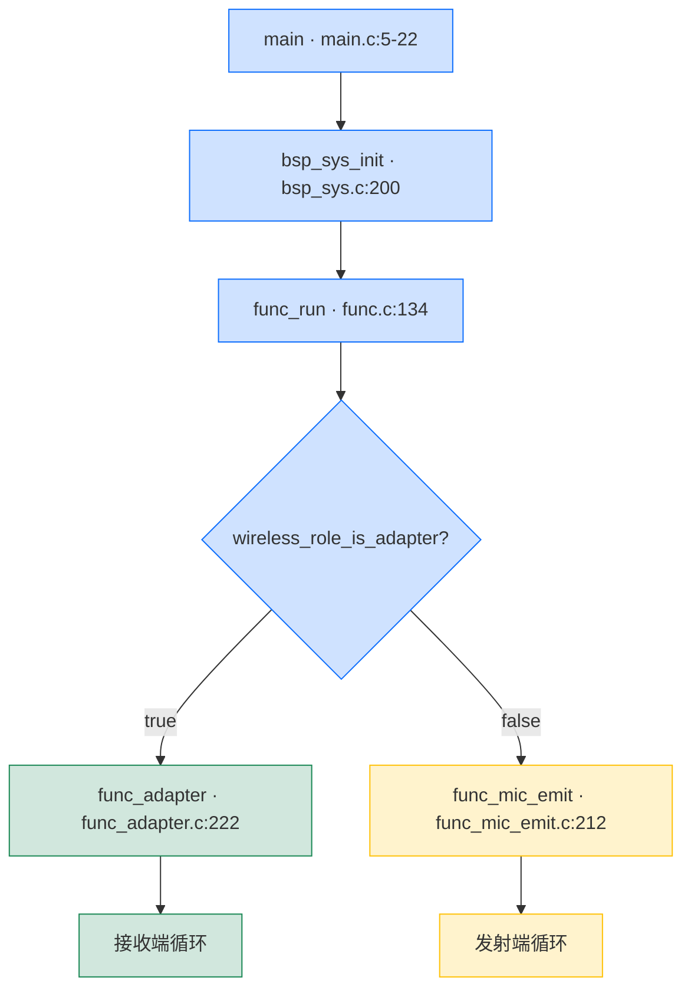

`wireless_role_is_adapter()` 实际等价于 `cfg_wireless_role`（见 `libs/ble/api_wireless_mic.h:52`），而 `cfg_wireless_role` 在 `modules/wireless/wireless.c:25` 定义为 `true`，**实际值由 `wireless_mic_var_init()` 设置**：

| 入口 | `wireless_mic_role_init()` 见 `modules/wireless/wireless_proc.c:5-18` |
| --- | --- |
| `xcfg_cb.wireless_adapter_en` 为真 | `cfg_wireless_role = true` → **接收端** |
| `xcfg_cb.wireless_mic_emit_en` 为真 | `cfg_wireless_role = false` → **发射端** |
| 两者都关 | 默认 `false` → **发射端** |

`xcfg_cb` 由 `xcfg_init()` 从 Flash 加载（`bsp/bsp_sys.c:202`，即 `if (!xcfg_init(&xcfg_cb, sizeof(xcfg_cb)))`），其中 `wireless_adapter_en` / `wireless_mic_emit_en` 是产测写入的标志位，**用于同一份固件烧到不同板子上时自动切换角色**。

### 1.2 角色判定决策图

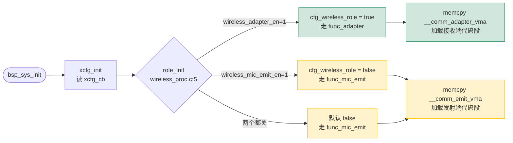

### 1.3 发射端功能入口

```
func_run()  [functions/func.c:134-178]
    └─ switch(func_cb.sta)
        case FUNC_MIC_EMIT:
            func_mic_emit()  [functions/func_mic_emit.c:211-227]
                ├─ func_mic_emit_enter()           [functions/func_mic_emit.c:175-187]
                ├─ while (func_cb.sta == FUNC_MIC_EMIT) {
                │      func_mic_emit_process()     [functions/func_mic_emit.c:143-172]
                │      msg = msg_dequeue()
                │      if (msg) func_mic_emit_message(msg)  [functions/msg_mic_emit.c:5-135]
                │  }
                └─ func_mic_emit_exit()            [functions/func_mic_emit.c:190-209]
```

`func_cb` 是一个全局状态机上下文（`functions/func.c:4`），`func_cb.sta` 在 `func.c` 顶层状态机里切换。

---

## 2. 发射端功能文件清单

| 文件 | 作用 |
| --- | --- |
| `functions/func_mic_emit.c` | 发射端状态机（连接、扫描、退出） |
| `functions/func_mic_emit.h` | 公开 API（`func_mic_emit()`、`mic_init()`、dac0_out、encoder_prio_trans 等） |
| `functions/msg_mic_emit.c` | 发射端消息处理（按键 → 动作） |
| `modules/wireless/wireless.c` | 无线协议栈角色判定、连接管理、广播配置 |
| `modules/wireless/wireless_proc.c` | 蓝牙事件通知与连接状态机、`wireless_mic_var_init()` |
| `modules/wireless/wireless_txrx_single.c` | **单包**模式下的 TX/RX 缓冲管理（默认编译路径） |
| `modules/wireless/wireless_txrx_comb.c` | **组合包**模式下的 TX/RX 缓冲管理（`WIRELESS_CON_COMB_BUF_EN=1` 时编译） |
| `modules/wireless/wireless_cmd.c` | 私有命令收发环形缓冲 |
| `modules/wireless/wireless_cmd_api.c` | 私有命令发送 API（mute/echo/soft gain/magic 等） |
| `modules/wireless/wireless_sync_param.c` | 发射端 ↔ 接收端参数同步机制 |
| `modules/wireless/wireless_pwr_ctr.c` | 自动功率控制（接收端评估 PER，命令发射端调档） |
| `modules/wireless/wireless_dump.c` | PER/RSSI 调试打印 |
| `modules/wireless/mic_proc.c` | 麦克风编码（含算法链）+ 接收端解码回调 |
| `modules/audio/dac0_out.c` | DAC0 输出（发射端做"侦听麦"） |
| `modules/audio/mic_eq_drc.c` | 硬件 EQ/DRC/MIX 算法封装 |
| `modules/audio/soft_gain.c` | 软件淡入淡出增益 |
| `modules/voice/echo.h` `magic.h` 等 | 各种语音算法 |
| `modules/codec/lc3s.c` | LC3S 编码/解码 |
| `bsp/bsp_sdadc.c` | SDADC 初始化与采样驱动（麦克风数据来源） |
| `bsp/bsp_sddac.c` | SDDAC 初始化与播放驱动（喇叭输出） |
| `bsp/bsp_key.c` | ADC/IO 按键事件去抖 |
| `bsp/bsp_led.c` | LED 状态指示 |
| `bsp/bsp_param.c` | Flash 参数读写（链路信息、绑定音量等） |
| `projects/microphone/config_ab5766_le_mic.h` | **当前默认配置**（所有功能开关） |

---

## 3. 启动流程：从 `main()` 到第一次发声

下面是完整启动链路，**每个节点都标注了源文件与行号**。

### 3.1 顶层流程图

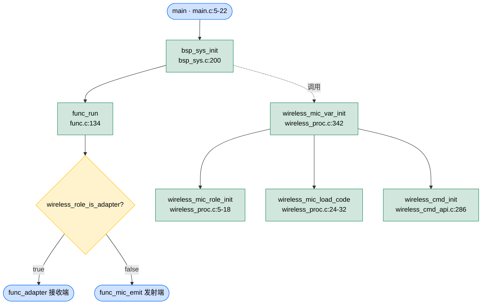

### 3.2 `bsp_sys_init()` 关键调用

`bsp/bsp_sys.c:200-267`：

| 调用 | 行号 | 作用 |
| --- | --- | --- |
| `xcfg_init(&xcfg_cb, sizeof(xcfg_cb))` | 202 | 加载 Flash 产测参数，覆盖 `xcfg_cb` 全局 |
| `sys_get_rand_key_init(rand_seed)` | 207 | 用 `xcfg_cb.le_addr[2..5]` 初始化 BLE 随机种子 |
| `bsp_var_init()` | 209 | 初始化 `sys_cb.pwroff`、`msg_queue` 等运行时 |
| `wireless_mic_var_init()` | 211 | **关键**：调用 `wireless_mic_role_init()` + `wireless_mic_load_code()` + `wireless_cmd_init()` |
| `pmu_init(cfg_pmu_get())` | 213 | 配置 PMU BUCK/LDO |
| `bsp_saradc_init()` / `bsp_key_init()` | 216, 220 | ADC 与按键初始化 |
| `led_init()` | 224 | LED 初始化 |
| `power_on_check()` | 238 | 按住 PWR 才开机的逻辑 |
| `sys_clk_set(SYS_CLK_SEL)` | 241 | 切主频（默认 24M） |
| `bsp_param_init()` | 243 | 初始化参数区管理器（`cm_init()`，仅准备读写接口，不加载 `xcfg_cb`，见 `bsp/bsp_param.c:15-20`） |
| `xosc_init()` | 245 | 晶振校准 |
| `sys_set_tmr_enable(1, 1)` | 248 | 启动 5ms / 1ms 定时器 |

`wireless_mic_var_init()` 定义于 `modules/wireless/wireless_proc.c:342-348`：

```c
void wireless_mic_var_init(void) {
    wireless_mic_role_init();      // [wireless_proc.c:5-18]  决定 cfg_wireless_role
    wireless_mic_load_code();      // [wireless_proc.c:24-32] 从 flash 拷贝发射端/接收端二进制
    wireless_cmd_init();           // [wireless_cmd_api.c:286-292] 初始化命令缓冲
}
```

`wireless_mic_load_code()` 是关键点：固件把发射端和接收端的两份独立二进制一起烧录，启动时根据角色只展开（`memcpy`）其中一份进 RAM（`wireless_proc.c:20-32` 中的 `__comm_emit_vma` / `__comm_adapter_vma` 符号）。

### 3.3 `func_run()` 顶层状态机

`functions/func.c:134-178`：

```c
void func_run(void) {
    if (wireless_role_is_adapter()) {
        func_cb.sta = FUNC_ADAPTER;
    } else {
        func_cb.sta = FUNC_MIC_EMIT;
    }

    while (1) {
        func_enter();                              // [func.c:115-125] 加载当前状态机的按键表
        switch (func_cb.sta) {
            case FUNC_MIC_EMIT: func_mic_emit(); break;     // [func_mic_emit.c:212]
            case FUNC_ADAPTER:  func_adapter();  break;     // [func_adapter.c:223]
            case FUNC_PWROFF:   func_pwroff();   break;     // (电源管理)
            default:             func_exit();     break;
        }
    }
}
```

`func_enter()` 在 `func.c:115-125` 做了三件事：

1. `bsp_param_sync()`：把 RAM 参数持久化到 Flash。
2. `lowpwr_sleep_delay_reset()` / `lowpwr_pwroff_delay_reset()`：复位低功耗计时。
3. **`key_set_msg_tbl(func_info[func_cb.sta].msg_tbl)`**：

`func_info` 是 `functions/func.c:6-20` 的一张表：

```c
[FUNC_MIC_EMIT] = {mic_emit_key_msg_tbl, 0},   // 发射端按键映射表
[FUNC_ADAPTER]  = {adapter_key_msg_tbl,  0},   // 接收端按键映射表
```

`mic_emit_key_msg_tbl` 实际定义在 `projects/microphone/port/port_key.c:43`（K12 分支）与 `:51`（`#else` 分支），并由 `functions/func.h:29` 以 `extern` 声明，**把硬件按键事件映射为 `MSG_VOL_UP` / `MSG_VOL_MUTE` 等应用层消息**（`functions/msg_mic_emit.c:48` 处理 `case MSG_VOL_MUTE:`）。

---

## 4. 发射端状态机：`func_mic_emit()`

### 4.1 函数一览

`functions/func_mic_emit.c:36-227` 提供了 6 个函数：

| 行号 | 函数 | 作用 |
| --- | --- | --- |
| 37-49 | `func_mic_emit_init()` | 初始化 mic_emit 状态字段：`init_state = MIC_EMIT_STA_INIT_IDLE`，LED 设为"待连接" |
| 51-140 | `func_mic_emit_process_do()` | **核心状态机**：处理连接/扫描/重连 |
| 142-172 | `func_mic_emit_process()` | 每次循环调用：状态机 + 无线协议栈 + 公共 process |
| 174-187 | `func_mic_emit_enter()` | 进态：清消息队列、初始化、调用 `bsp_ble_init()` |
| 189-209 | `func_mic_emit_exit()` | 退态：通知接收端断开、关算法、关蓝牙 |
| 211-227 | `func_mic_emit()` | 顶层循环（_enter → process ↔ message → _exit） |

### 4.2 状态机详解

`func_mic_emit_process_do()` 在 `func_mic_emit.c:51-140` 内定义 6 个状态（`enum`，第 17-25 行）：

```
MIC_EMIT_STA_INIT_IDLE       起始：根据绑定信息决定回连还是扫描
MIC_EMIT_STA_INIT_CONNECT    已发起连接请求，等待回调
MIC_EMIT_STA_START_ACTION    已建立或刚刚断开，决定下一步动作
MIC_EMIT_STA_DELAY           等待 tick 超时，给链路切换留缓冲
MIC_EMIT_STA_IDLE            已连接，不处理状态机（仅 process 跑无线协议栈）
MIC_EMIT_STA_SCAN            正在扫描适配器
```

**状态转移图**：

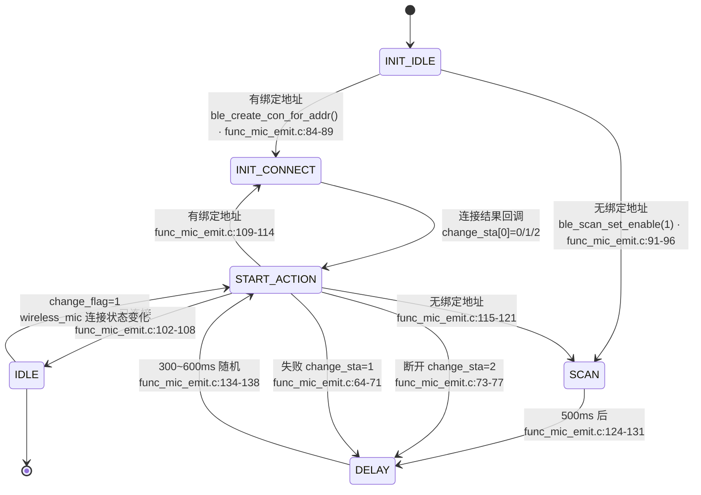

#### 4.2.1 关键转移点（带行号）

| 事件 | 行号 | 行为 |
| --- | --- | --- |
| `wireless_mic.change_flag = 1` (`change_sta[0]=0`) | `func_mic_emit.c:60-62` | 连接成功 → `START_ACTION` |
| `change_sta[0]=1`（连接失败） | `func_mic_emit.c:64-71` | 若非绑定则 `DELAY 100~600ms` 随机 |
| `change_sta[0]=2`（断开） | `func_mic_emit.c:73-77` | `DELAY 500~1000ms` 随机 |
| `INIT_IDLE` 有绑定 | `func_mic_emit.c:84-89` | `ble_create_con_for_addr(addr, 1000)` → `INIT_CONNECT` |
| `INIT_IDLE` 无绑定 | `func_mic_emit.c:91-96` | `ble_scan_set_enable(1)` → `SCAN` |
| `SCAN` 500ms 超时 | `func_mic_emit.c:124-131` | 关闭扫描，`DELAY 300~600ms` 随机 |
| `START_ACTION` 已连接 | `func_mic_emit.c:102-108` | 进入 `IDLE`（停止状态机） |
| `START_ACTION` 未连接 | `func_mic_emit.c:109-121` | 重新尝试回连或扫描 |

### 4.3 主循环

`func_mic_emit()` (`func_mic_emit.c:211-227`)：

```c
void func_mic_emit(void) {
    printf("%s\n", __func__);
    func_mic_emit_enter();          // 174-187: 清队列、调用 bsp_ble_init()
    while (func_cb.sta == FUNC_MIC_EMIT) {
        func_mic_emit_process();    // 143-172: 状态机 + 协议栈 + 公共
        u16 msg = msg_dequeue();
        if (msg != MSG_NO) {
            func_mic_emit_message(msg);   // [msg_mic_emit.c:5]  按键消息分发
        }
    }
    func_mic_emit_exit();           // 190-209: 断开、关算法、关蓝牙
}
```

`func_mic_emit_process()` (`func_mic_emit.c:142-172`) 每次循环做 5 件事：

1. **状态机**（`func_mic_emit_process_do()` 第 51 行）—— 仅在 `init_state != IDLE` 或 `wireless_mic.change_flag=1` 时才执行。
2. **`wireless_mic_proc()`**（`modules/wireless/wireless_proc.c:319-340`）—— 检查连接状态变化并切 LED（`led_bt_idle` / `led_bt_connected`）。
3. **`func_process()`**（`functions/func.c:43-68`）—— 喂看门狗 `WDT_CLR()`、跑 `bt_run_loop()`、跑充电检测 `bsp_charge_process()`。
4. （可选）`mic_mix_process()` —— 提示音混音（`WARNING_MIC_MIX_WAV_PLAY_EN=1` 时启用，目前默认 0）。
5. **`wireless_dump_proc()`**（`modules/wireless/wireless_dump.c:96-107`）—— 每秒打印 PER/RSSI（需 `WIRELESS_DUMP_EN=1`，默认 0）。

### 4.4 进入与退出

**进入**：`func_mic_emit_enter()` (`func_mic_emit.c:175-187`)

```c
lowpwr_pwroff_delay_reset();   // 复位自动关机计时
lowpwr_pwroff_auto_en();       // 允许断开后自动关机
msg_queue_clear();
func_mic_emit_init();          // 状态字段清零
bsp_ble_init();                // [wireless.c:223-239] 蓝牙子系统初始化
```

`bsp_ble_init()`（`modules/wireless/wireless.c:223-239`）会调用 `wireless_con_adapter_init()` 或 `wireless_con_device_init()`，根据 `wireless_role_is_adapter()` 决定初始化 RX 还是 TX 缓冲（见 `wireless_txrx_single.c:329-343` 或 `wireless_txrx_comb.c:223-237`）。

**退出**：`func_mic_emit_exit()` (`func_mic_emit.c:190-209`)

```c
if (wireless_mic_connected_sta_get()) {
    wireless_tx_user_discon_cmd();                     // 通知接收端断开
    do { func_process(); } while (wireless_mic_connected_sta_get());
}
if (sys_cb.mic_alg_en) {
    sys_cb.mic_alg_en = 0;
    mic_emit_reset();                                 // 关闭 SDADC、清 mic_enc
    sys_clk_free(INDEX_DECODE);                       // 还原主频
}
bt_off();                                              // 关蓝牙
func_cb.last = FUNC_MIC_EMIT;
```

> ⚠️ `wireless_tx_user_discon_cmd()` 是宏，定义在 `modules/wireless/wireless_cmd.h:135`，调用 `wireless_tx_user_link_cmd(DISCONNECT_NUM, 1)`（`wireless_cmd_api.c:55-63`），最终通过 `wireless_send_cmd()`（`wireless_cmd.c:73-99`）排队经私有命令发送。

---

## 5. 音频数据通路：麦克风 → 蓝牙 → 喇叭

### 5.1 链路总览

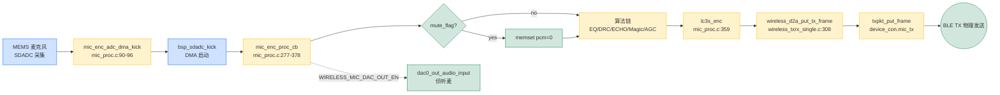

> 上图即发射端音频通路总览：`SDADC 采集 → mic_enc_proc_cb（启动丢帧/静音/算法链）→ LC3S 编码 → wireless_d2a_put_tx_frame → BLE 物理发送`，其中 `WIRELESS_MIC_DAC_OUT_EN=1` 时编码后另有 `dac0_out_audio_input` 侦听麦支路。

### 5.2 关键代码节点

#### 5.2.1 SDADC 初始化

`mic_emit_init()`（`modules/wireless/mic_proc.c:597-675`）按配置开关依次初始化：

```c
mic_emit_alg_init();                                         // 600  ⚠️ 空函数（见下注）
memset(&mic_enc, 0x00, sizeof(mic_enc));                    // 602
mic_enc.first_pkt = true;                                    // 603
#if WIRELESS_MIC_PARAM_MEMORY_EN
    param_mic_mute_level_read((u8 *)&mic_enc.mute_en);     // 605
#endif
#if WIRELESS_MAX_POWER_DETECT_EN
    mic_max_power_detect_init(0, samples);                  // 608
#endif
#if ADAPTER_SYNC_PARAM_EN
    mic_enc.mute_en = 1;   // 受 adapter 同步参数前先 mute  // 611-612
#endif
#if WIRELESS_CON_CODEC_SEL == CODEC_LC3S
    lc3s_enc_init(SAMPLE_RATE, samples);                    // 621  编码器初始化
#endif
#if WIRELESS_ALLPASS_FILTER_CHANGE_EN
    allpass_filter_change_set(0, 100);                      // 625  随机相位(防啸叫)
#endif
#if WIRELESS_MIC_32K_EN
    src_init(0, 32000, 48000);                               // 629   32k → 48k 重采样
#endif
#if WIRELESS_MIC_AINS4_32K_EN
    ains4_32k_mic_init(0, samples, 1);                      // 633
#endif
#if WIRELESS_MIC_ECHO_EN
    echo_audio_init(0, samples, 1);                          // 637
#endif
#if WIRELESS_MIC_MAGIC_EN
    magic_audio_init(0, samples);                           // 641
#endif
#if WIRELESS_MIC_ROBOTIZATION_EN
    robotization_mic_init(0, samples, 1);                   // 645
#endif
#if WIRELESS_MIC_ROOM_REVERB_EN
    room_reverb_audio_init_cfg(0, samples);                 // 649  房间混响参数配置
    room_reverb_audio_init(0, samples);                     // 650  房间混响初始化(两次)
#endif
#if WIRELESS_MIC_EQ_DRC_EN
    mic_eq_drc_init(0, samples, 1);                         // 654  硬件 EQ/DRC + soft_gain
#endif
#if WIRELESS_MIC_AGC_EN
    agc_audio_init(0, samples);                             // 658
#endif
#if WIRELESS_MIC_DNR_FRE_EN
    dnr_fre_mic_init(0, samples, 0);                        // 662
#endif
#if WIRELESS_MIC_DAC_OUT_EN
    dac0_out_init(0, samples, 0);                           // 666  侦听麦
#endif
bsp_sdadc_init();                                            // 669  无条件
#if WIRELESS_MIC_LOWPASS_EN
    bsp_sdadc_lowpass_filter_en();                          // 672  SDADC 低通滤波
#endif
```

> ⚠️ **关键说明（`mic_emit_alg_init()` 为空函数）**：`mic_emit_alg_init()`（`mic_proc.c:58-60`）函数体为空，**不统一初始化任何算法**。所有算法（EQ/DRC、ECHO、MAGIC、AGC、LC3S 编码器、DAC_OUT 等）都在 `mic_emit_init()` 内通过 `#if 宏` 逐项条件编译——**只有宏=1 的初始化调用才会被编译进镜像**。当前默认配置（`config_ab5766_le_mic.h:98-118`）仅 `WIRELESS_MIC_SOFT_GAIN_EN=1`、`WIRELESS_MIC_EQ_DRC_EN=1`、`WIRELESS_MIC_DAC_OUT_EN=1`（及编码器 LC3S）为开启项，其余 `ECHO/MAGIC/AGC/ROOM_REVERB/ROBOTIZATION/DNR_FRE/AINS4_32K` 宏=0，对应初始化调用**不编译**。
>
> **初始化时机与时序**：`mic_emit_init()` 在 `wireless_emit_notice(BT_NOTICE_WIRELESS_CONNECTED)` 中**仅当 `connected_sta==0`（0→1 第一路连接）时调用一次**（`wireless_proc.c:102-107`），第二路连接不会重新初始化。`sys_cb.mic_alg_en = 1` 在 `mic_emit_init()` 返回**之后**才设置（`wireless_proc.c:110`），属时序关键——初始化完成前算法链不被使能。

#### 5.2.2 采样 → 编码 RX 流程

`mic_enc_adc_dma_kick()`（`modules/wireless/mic_proc.c:90-96`）每个 DMA 周期被调用：

```c
void mic_enc_adc_dma_kick(uint tick_cnt) {
    wl_get_tick1_time(tick_cnt);          // 取基准时戳
    if (sys_cb.mic_alg_en) {
        bsp_sdadc_kick();                // 触发 SDADC 采集
    }
}
```

#### 5.2.3 编码回调（**核心算法链**）

`mic_enc_proc_cb()`（`modules/wireless/mic_proc.c:277-378`）：

```c
void mic_enc_proc_cb(s16 *pcm, uint samples) {
    bool mute_flag = mic_enc.mute_en;
    if (bsp_sdadc_discard_proc()) mute_flag = true;          // 281-283 启动时前几帧丢弃

    if (mute_flag) memset(pcm, 0x00, samples*2);              // 292

    if (sys_cb.mic_alg_en) {                                 // 295
        #if WIRELESS_MIC_AINS4_32K_EN
            ains4_32k_mic_audio_input(pcm, samples, 1, NULL);// 298
        #endif
        #if WIRELESS_MIC_ECHO_EN && WIRELESS_MIC_32K_EN
            echo_audio_process(pcm, samples);                // 302
        #endif
        #if WIRELESS_MIC_32K_EN
            samples = src_frame_resample(0, pcm, pcm_48k, samples);  // 306 升采样
            pcm = pcm_48k;
        #endif
        #if WIRELESS_MAX_POWER_DETECT_EN
            dnr_buf_maxpow(pcm, samples);                    // 311
        #endif
        #if WIRELESS_MIC_EQ_DRC_EN
            mic_eq_drc_audio_input(pcm, samples, 0);         // 315 硬件 EQ/DRC
        #endif
        #if WIRELESS_MIC_DNR_FRE_EN
            dnr_fre_mic_audio_input(pcm, samples, 1, NULL);  // 319
        #endif
        #if WIRELESS_MIC_ECHO_EN && !WIRELESS_MIC_32K_EN
            echo_audio_process(pcm, samples);                // 323
        #endif
        #if WIRELESS_MIC_MAGIC_EN
            magic_audio_process(pcm, samples);               // 327
        #endif
        #if WIRELESS_MIC_ROBOTIZATION_EN
            robotization_mic_audio_input(pcm, samples, 1, NULL); // 331
        #endif
        #if WIRELESS_MIC_ROOM_REVERB_EN
            room_reverb_audio_process(pcm, samples);         // 335
        #endif
        #if WIRELESS_MIC_AGC_EN
            agc_audio_input(pcm, samples, 0, NULL);          // 339
        #endif
    }

    // 编码（按 WIRELESS_CON_CODEC_SEL 选择）
    #if WIRELESS_CON_CODEC_SEL == CODEC_LC3S
        lc3s_enc(pcm, mic_enc.buffer, samples);             // 359
    #elif
        sbc_enc / esbc_enc / adpcm_enc ...
    #endif

    wireless_d2a_put_tx_frame(mic_enc.buffer, WIRELESS_MIC_FRAME_SIZE);  // 363 → 发送缓冲
    wl_play_sync_tick1(WIRELESS_MIC_TX_INTERVAL*2/WIRELESS_MIC_COMB_NB, SAMPLE_RATE_48K);  // 366

    #if WIRELESS_MIC_DAC_OUT_EN
        dac0_out_audio_input(pcm, samples, 0);              // 375 侦听麦
    #endif
}
```

#### 5.2.4 帧写入 TX 缓冲

`wireless_d2a_put_tx_frame()`（`modules/wireless/wireless_txrx_single.c:307-311`）：

```c
void wireless_d2a_put_tx_frame(u8 *ptr, u16 size) {
    txpkt_put_frame(&device_con.mic_tx, ptr, size);
}
```

`txpkt_put_frame()`（`wireless_txrx_single.c:197-228`）处理"先 set_txbuf 后 put_frame" vs "先 put_frame 后 set_txbuf"的两种时序，关中断保证拷贝不被打断。

#### 5.2.5 TX 调度回调

`wireless_d2a_set_txbuf_cb()`（`wireless_txrx_single.c:300-304`）：

```c
void wireless_d2a_set_txbuf_cb(u8 *ptr, u16 len) {
    txpkt_set_txbuf(&device_con.mic_tx, ptr);
}
```

`wireless_d2a_adc_dma_cb()`（`wireless_txrx_single.c:293-297`）→ `mic_enc_adc_dma_kick()`（`mic_proc.c:90-96`）→ 触发 SDADC 采集。

#### 5.2.6 编码器选择

由 `WIRELESS_CON_CODEC_SEL`（`projects/microphone/config_ab5766_le_mic.h:64`）决定：

| 宏 | 含义 |
| --- | --- |
| `CODEC_SBC` | SBC 蓝牙经典编码 |
| `CODEC_ESBC` | 增强 SBC |
| `CODEC_ADPCM` | ADPCM |
| `CODEC_LC3S` | **当前默认**（`config_ab5766_le_mic.h:64`） |

LC3S 帧大小：见 `WIRELESS_MIC_FRAME_SIZE`（`config_ab5766_le_mic.h:80`，默认 25 字节），LC3S 距离和码率由 `WIRELESS_MIC_SAMPLES_SELECT`（默认 120 samples，48kHz 下 2.5ms）共同决定。

---

## 6. 消息分发：`func_mic_emit_message()`

`functions/msg_mic_emit.c:5-135` 是 `func_mic_emit()` 循环里处理按键消息的入口。每个 `case` 都对应一个用户操作：

| 消息 | 行号 | 动作 | 关键调用 |
| --- | --- | --- | --- |
| `EVT_CONNECT_BONDDING` | 16-20 | 保存绑定地址 | `param_write_bonding_addr()` → `btstack_ble_reset_hash(1)` |
| `MSG_SYS_1S` | 23-28 | 1 秒低电检测 | `bsp_vbat_proc()` |
| `EVT_LPWR_OFF` | 41-45 | 低电关机 | `func_cb.sta = FUNC_PWROFF` |
| `MSG_VOL_MUTE` | 48-55 | 麦克风静音切换 | `mic_enc_mute_en_set()` → `wireless_tx_mic_mute_level()` |
| `MSG_VOL_UP` | 57-66 | 音量+ | `soft_gain_up()` → `wireless_tx_soft_gain_level()` |
| `MSG_VOL_DOWN` | 68-76 | 音量- | `soft_gain_down()` → `wireless_tx_soft_gain_level()` |
| `MSG_ECHO_LEVEL_UP` | 78-86 | 混响+ | `echo_delay_level_up()` → `wireless_tx_echo_delay_level()` |
| `MSG_ECHO_LEVEL_DOWN` | 88-96 | 混响- | `echo_delay_level_down()` → `wireless_tx_echo_delay_level()` |
| `MSG_CHANGE_MAGIC` | 98-109 | 切换魔音 | `magic_audio_mute_set(1)` → `magic_effect_level_change()` → `wireless_tx_magic_effect_level()` |
| `MSG_VOICE_RM` | 111-123 | 消原音（默认关闭） | — |
| `EVT_TEST_WAV` | 125-129 | 测试 WAV 提示音 | `mic_mix_play_wav()` |

**消息源**：所有 `MSG_*` / `EVT_*` 来自两个地方：

1. **按键事件**：`bsp_key_scan()` → `key_msg_tbl[][]` → `msg_enqueue()`（`bsp/bsp_key.c:71-135`）。
2. **蓝牙内部**：`wireless_emit_notice()`（`modules/wireless/wireless_proc.c:91-295`）在连接成功/失败/断开时设 `wireless_mic.change_flag=1`，被 `func_mic_emit_process_do()` 消费。

### 6.1 一拖二模式专属：`wireless_con_role()`（接收端用）

发射端**不调用** `wireless_con_role()`（`functions/func_adapter.c:133-162`，用于接收端判断主副麦），但当 `WIRELESS_CON_PAIR_MODE=1` 时，发射端会在 `wireless_emit_notice()` 内被记录 `sys_cb.con_role_data[1]/[2]`。

### 6.2 私有命令发送

`wireless_tx_mic_mute_level()` 等最终都调用 `wireless_send_cmd()`（`modules/wireless/wireless_cmd.c:73-99`）：

```c
bool wireless_send_cmd(u8 index, u8 *cmd, u8 len) {
    buf = cmd_buf_alloc(&txcmd[index]);                      // 81  环形缓冲
    if (buf == NULL) return false;
    buf[0] = len; memcpy(buf+1, cmd, len);
    cmd_buf_add(&txcmd[index]);
    if (!ble_con_user_cmd_tx_req(index)) { cmd_buf_get(...); return false; }
    return true;
}
```

`CMD_MAX_NB=4`、`CMD_MAX_SIZE=9`（`wireless_cmd.c:4-5`），所以队列最多 4 条 × 9 字节。

接收端在 `ble_con_user_cmd_rx_cb()`（`wireless_cmd.c:115-118`）收到后调用 `wireless_rcv_cmd()` → `wireless_rx_cmd()`（`wireless_cmd_api.c:257-283`）按 `wireless_cmd_t.cmd` 字段分发。

---

## 7. 蓝牙键路与协议栈

### 7.1 关键连接参数

`modules/wireless/wireless.c:11-32` 定义了 BLE 行为的所有数值：

| 名称 | 值 | 含义 |
| --- | --- | --- |
| `cfg_wireless_con_interval` | `WIRELESS_CON_INTERVAL * WIRELESS_CON_LINK_NB`（`wireless.c:13`）。`WIRELESS_CON_INTERVAL` 定义在 `config_extra.h`（`VERS=7`+`TX_INTERVAL=4` 命中 `#else` 分支 → 60），`WIRELESS_CON_LINK_NB=2`（`config_ab5766_le_mic.h:76`），故 60×2=120，单位 1.25ms = **150ms** | 连接间隔 |
| `cfg_wireless_tx_interval` | `WIRELESS_MIC_TX_INTERVAL`（默认 4，单位 1.25ms = 5ms） | 音频发送周期 |
| `cfg_wireless_tx_retry` | `WIRELESS_MIC_RETRY_NB`（默认 3） | 单包重传次数 |
| `cfg_wireless_d2a_tx_size` | `MIC_TX_BUFFER_SIZE` | 发射 buffer 大小 |
| `cfg_wireless_d2a_enc_us` | 编码 + 所有算法延迟（`wireless.c:19-20`） | 接收端等待补偿 |
| `cfg_wireless_d2a_dec_us` | 解码 + MIX_DRC 延迟（`wireless.c:22`） | 解码侧的预估耗时 |
| `cfg_wireless_feat` | 版本+d2a+hop+bonding+link_nb 位 | 协议特性字 |
| `cfg_wireless_codec[0]` | `CODEC_LC3S | CODEC_MONO` | 编码及单声道 |

### 7.2 关键回调路径

```
BLE 事件 (底层中断)
    |
    v
wireless_emit_notice(evt, params)  [modules/wireless/wireless_proc.c:91-295]
    |  (BT_NOTICE_WIRELESS_CONNECTED)
    |     sys_clk_req(INDEX_DECODE, SYS_160M);   // 103  抬主频
    |     if (adapter) adapter_init(); else mic_emit_init();   // 104-109
    |     sys_cb.mic_alg_en = 1;                  // 110
    |     wireless_mic.connected_sta |= BIT(mic_num);  // 123
    |     wireless_mic.change_flag = 1;           // 125
    v
wireless_mic.change_flag 由 func_mic_emit_process_do() 读取
```

### 7.3 蓝牙连接 — 发射端视角

`func_mic_emit_process_do()` 调用 `ble_create_con_for_addr()`（`modules/wireless/wireless.c:211-215`）：

```c
void ble_create_con_for_addr(uint8_t *addr, uint16_t timeout) {
    memcpy(con_req_addr, addr, 6);
    ble_connect_req(timeout);    // 库 API
}
```

`ble_get_con_req_addr_cb()`（`wireless.c:188-192`）把地址告诉库。

扫描到合法包后库调用 `ble_scan_rx_rep_cb()`（`wireless.c:196-207`）：

```c
bool ble_scan_rx_rep_cb(uint8_t *addr, uint8_t addr_type) {
    ble_scan_set_enable(0);                // 关扫描
    memcpy(con_req_addr, addr, 6);
    ble_connect_req(1000);                 // 1000ms 发起连接
    return true;
}
```

### 7.4 一拖二：双麦连接

`WIRELESS_CON_LINK_NB=2`（`config_ab5766_le_mic.h:76`）代表接收端最多可同时连 2 个话筒。发射端侧只关心是否连接/是否断开：

- `wireless_mic.connected_sta`：bitmask，`BIT(0)`/`BIT(1)` 表示麦 0/麦 1。
- `wireless_mic_is_bonding()`：判断是否在绑定模式（`config_ab5766_le_mic.h:67` `WIRELESS_CON_BONDING_EN`=0 时返回 false）。

绑定地址存在 `bt_bongding_addr[6]`（`wireless.c:58-62`），参数读写通过 `bsp_param_read/write()`。

---

## 8. 自动功率控制（PWR_CTR）

`WIRELESS_CON_PWR_CTR=0`（默认关闭）时本节无关。

开启时由 `modules/wireless/wireless_pwr_ctr.c` 实现：

- `ws_rx_info_str_t`：每条链路的丢包统计（`wireless_pwr_ctr.h:13-19`）。
- `ws_pwr_ctr_rx_process()`（`wireless_pwr_ctr.c:37-73`）：每包一次回调，累加 `rx_cnt/rx_fail_cnt`，达到 `RX_CYCLE_NUM=400` 时计算 PER 并按需调档。
- `ws_pwr_ctr_tx_cmd_process()`（`wireless_pwr_ctr.c:75-84`）：发出 `wireless_tx_pwr_ctr_cmd()` 给发射端。

**档位常量**：`MAX_PWR_LEVEL=0`（最大功率）、`MIN_PWR_LEVEL=4`（最小功率）。INC/DEC 控制加减档（`wireless_pwr_ctr.h:10-11`）。

> 当前默认配置 (`config_ab5766_le_mic.h:69`) 中 `WIRELESS_CON_PWR_CTR=0`，**当前默认不启用**。

---

## 9. 算法模块速查

发射端默认配置启用以下模块（`config_ab5766_le_mic.h:96-118`）：

| 宏 | 默认 | 含义 | 关键调用 |
| --- | --- | --- | --- |
| `WIRELESS_MIC_SOFT_GAIN_EN` | 1 | 带保护数字增益 | `soft_gain_init()`（在 `mic_eq_drc_init` 内 `mic_eq_drc.c:45` 调用）`soft_gain_up/down()` |
| `WIRELESS_MIC_EQ_DRC_EN` | 1 | 硬件 EQ/DRC | `mic_eq_drc_init()` -> `loc_mic_pacc_*`（实现在 `modules/effect/mic_effect.c`） |
| `WIRELESS_MIC_ECHO_EN` | 0 | 混响 | `echo_audio_init()` |
| `WIRELESS_MIC_MAGIC_EN` | 0 | 魔音 | `magic_audio_init()` |
| `WIRELESS_MIC_AGC_EN` | 0 | AGC | `agc_audio_init()` |
| `WIRELESS_MIC_ROOM_REVERB_EN` | 0 | 房间混响 | `room_reverb_audio_init_cfg()` + `room_reverb_audio_init()` |
| `WIRELESS_MIC_ROBOTIZATION_EN` | 0 | 机器人音效 | `robotization_mic_init()` |
| `WIRELESS_MIC_DNR_FRE_EN` | 0 | 频域降噪 | `dnr_fre_mic_init()` |
| `WIRELESS_MIC_AINS4_32K_EN` | 0 | AINS4 降噪(32k) | `ains4_32k_mic_init()` |
| `WIRELESS_ALLPASS_FILTER_CHANGE_EN` | 0 | 随机相位(防啸叫) | `allpass_filter_change_set()` |
| `WIRELESS_MAX_POWER_DETECT_EN` | 0 | 麦能量检测 | `mic_max_power_detect_init()` |
| `WIRELESS_MIC_DAC_OUT_EN` | 1 | 侦听麦 | `dac0_out_init()` `dac0_out_audio_input()` |
| `WIRELESS_MIC_LOWPASS_EN` | 0 | SDADC 低通滤波 | `bsp_sdadc_lowpass_filter_en()` |
| `WIRELESS_MIC_KEY_PRESS_MUTE_EN` | 0 | 按键按下 mute | `mic_enc_key_press_mute_en_set()` |

### 9.1 算法数据流（`mic_enc_proc_cb` 视角）

以下顺序严格对应 `modules/wireless/mic_proc.c:277-378` 的源码排列，行号为 `mic_proc.c` 实际行号。`#if` 宏=0 的节点在当前配置下不编译、不执行，但保留在链路中标注位置。

```
pcm = SDADC 输入（bsp_sdadc 采集）
  ↓
[0] mute_flag 处理（启动丢帧 / 按键 mute）            mic_proc.c:280-293
    ├─ bsp_sdadc_discard_proc() 启动期强制静音         :281
    ├─ #if WIRELESS_MIC_KEY_PRESS_MUTE_EN 按键抬起静音 :284-289
    └─ mute_flag 时 memset 清零                        :291-293
  ↓
─── 以下全部在 if(sys_cb.mic_alg_en) 门禁内（:295）───
  ↓
[1] AINS4_32K 降噪        #if WIRELESS_MIC_AINS4_32K_EN   :297-298
  ↓
[2] ECHO 混响(@32k)      #if ECHO_EN && WIRELESS_MIC_32K_EN  :301-302   ← 仅 32k 模式
  ↓
[3] SRC 32k→48k 重采样    #if WIRELESS_MIC_32K_EN          :305-307   ← 32k 模式才有
  ↓
[4] MAX_POWER_DETECT 麦能量检测  #if WIRELESS_MAX_POWER_DETECT_EN :310-311
  ↓
[5] EQ/DRC（mic_eq_drc_audio_input → loc_mic_pacc_process，含 Soft Gain）
                          #if WIRELESS_MIC_EQ_DRC_EN       :314-315
  ↓
[6] DNR_FRE 频域降噪     #if WIRELESS_MIC_DNR_FRE_EN      :318-319
  ↓
[7] ECHO 混响(@!32k)     #if ECHO_EN && !WIRELESS_MIC_32K_EN :322-323  ← 仅非 32k 模式
  ↓
[8] MAGIC 魔音           #if WIRELESS_MIC_MAGIC_EN        :326-327
  ↓
[9] ROBOTIZATION 机器人音效  #if WIRELESS_MIC_ROBOTIZATION_EN :330-331
  ↓
[10] ROOM_REVERB 房间混响 #if WIRELESS_MIC_ROOM_REVERB_EN :334-335
  ↓
[11] AGC 自动增益        #if WIRELESS_MIC_AGC_EN          :338-339
  ↓
[12] DUMP_HUART 调试打印  #if DUMP_HUART（仅调试）         :342-343
  ↓
─── 退出 mic_alg_en 门禁 ───
  ↓
[13] WARNING 提示音混入   #if WARNING_MIC_MIX_WAV_PLAY_EN  :346-351
  ↓
[14] LC3S 编码           #if CODEC_LC3S                   :358-359
  ↓
[15] wireless_d2a_put_tx_frame() → TX 缓冲                :363
  ↓
[16] wl_play_sync_tick1() 发送节拍同步                   :366
  ↓
[17] DAC 侦听输出         #if WIRELESS_MIC_DAC_OUT_EN      :368-375
```

> 注意 ECHO 的两处位置：`WIRELESS_MIC_32K_EN` 开启时 ECHO 先于重采样（`:302`），因为 ECHO 模块按 32k 设计，先在 32k 域处理再升采样；不开 32k 时 ECHO 在 EQ/DRC 之后（`:323`）。两者互斥，同一镜像最多编译其中一处。
>
> ⚠️ `mic_alg_en` 门禁：步骤 [1]–[12] 全部包在 `if(sys_cb.mic_alg_en)`（`:295`）内。该标志在连接初始化 `mic_emit_init()` 返回后才置 1（`wireless_proc.c:110`），断连时先置 0（`wireless_proc.c:178`）。因此未连接或断连瞬间所有算法被旁路，PCM 直送编码器。
>
> 当前默认配置（`config_ab5766_le_mic.h:96-118`）实际编译节点：[5] EQ/DRC（含 Soft Gain）、[14] LC3S、[15] put_tx_frame、[17] DAC_OUT；其余节点宏=0 不编译。

### 9.2 软件增益

`modules/audio/soft_gain.c:59-108`：

- `soft_gain_set_level(level)`：查表（`soft_gain_tbl_64/32/16/8`）得到目标 Q15 数值。
- `soft_gain_proc_16bit(data)`：淡入淡出 + `__builtin_muls_shift15()` 单指令乘加。
- `soft_gain_up/down()`：索引加减 1，最大 0 最小 max.level。
- `soft_gain_level_is_max_min()`：在按 MSG_VOL_UP/DOWN 时告诉接收端是否到顶/底。

---

## 10. 关键全局变量与数据结构

| 名称 | 文件:行 | 作用 |
| --- | --- | --- |
| `func_cb` | `functions/func.c:4` | 顶层状态机上下文（`func_cb.sta` 控制当前功能） |
| `sys_cb` | `bsp/bsp_sys.c:8` | 系统状态（`pwroff`、`mic_alg_en`、`disp_sta` 等） |
| `xcfg_cb` | `bsp/bsp_sys.c:7` | 产测配置（`wireless_mic_emit_en`、`le_name`、`osc_*` 等） |
| `wireless_mic` | `modules/wireless/wireless.c:37` | 连接状态、变化标志 |
| `mic_enc` | `modules/wireless/mic_proc.c:47` | 发射端编码状态（`mute_en`、`enc_cache_*`） |
| `mic_dec` | `modules/wireless/mic_proc.c:50` | 接收端解码状态（`pcm[LINK_NB]`、`sync_idx`） |
| `device_con` | `modules/wireless/wireless_txrx_single.c:53-56` | TX 缓冲 + 状态 |
| `adapter_con` | `modules/wireless/wireless_txrx_single.c:60-63` | RX 缓冲 + 状态 |
| `txcmd[]` | `modules/wireless/wireless_cmd.c:14` | 私有命令发送队列 |
| `wireless_sync_prarm` | `modules/wireless/wireless_sync_param.c:4` | 同步参数状态（接收端用） |
| `soft_gain` | `modules/audio/soft_gain.c:11-17` | 软件增益状态 |
| `wireless_mic_eq_drc_cfg` | `modules/audio/mic_eq_drc.c:13` | EQ/DRC 状态 |
| `dac0_out_cfg` | `modules/audio/dac0_out.c:10` | DAC0 输出状态 |

---

## 11. 关键回调接口（库 → 应用）

| 回调 | 定义位置 | 触发时机 | 用途 |
| --- | --- | --- | --- |
| `ble_scan_rx_rep_cb` | `wireless.c:196` | 扫描到合法包 | 关闭扫描、记录地址、发起连接 |
| `ble_get_con_req_addr_cb` | `wireless.c:188` | 连接请求 | 把目标地址给库 |
| `wireless_emit_notice` | `wireless_proc.c:91` | 连接/断开/失败 | 状态机转移 + 抬落主频 |
| `wireless_d2a_set_rxpkt_cb` | `wireless_txrx_single.c:256` | 接收 1 包 | 写 RX 缓冲 |
| `wireless_d2a_set_rxdec_cb` | `wireless_txrx_single.c:273` | 接收完成 | 触发解码 |
| `wireless_d2a_dac_dma_cb` | `wireless_txrx_single.c:284` | 解码完成 | 启动 DAC DMA |
| `wireless_d2a_set_txbuf_cb` | `wireless_txrx_single.c:300` | TX 前 | 提供当前 TX buffer |
| `wireless_d2a_put_tx_frame` | 调用方 | 编码 1 帧 | 写入 TX 缓冲 |
| `wireless_d2a_adc_dma_cb` | `wireless_txrx_single.c:293` | TX 前 | 触发 ADC 采集 |
| `wireless_d2a_end_ind_cb` | `wireless_txrx_single.c:314` | 链路断开 | 复位 TX/RX 状态 |
| `ble_con_user_cmd_rx_cb` | `wireless_cmd.c:115` | 收到私有命令 | 分发到 `wireless_rx_cmd()` |
| `ble_con_user_cmd_get_tx_cb` | `wireless_cmd.c:121` | 取要发送的命令 | 队列出队 |
| `ble_con_user_cmd_tx_cfm_cb` | `wireless_cmd.c:127` | 发送完成 | 通知是否还有命令 |
| `bsp_ble_init` | `wireless.c:223` | 应用调用 | 蓝牙协议栈初始化 |
| `mic_enc_proc_cb` | `mic_proc.c:278` | ADC 完成 | 编码 + 发送 |
| `mic_dec_prco_cb` | `mic_proc.c:550` | 解码完成 | 输出到 DAC/USB |

---

## 12. 关键流程图

### 12.1 启动与连上接收端

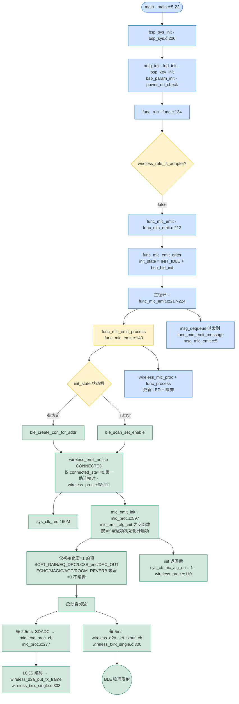

### 12.2 断开与退出

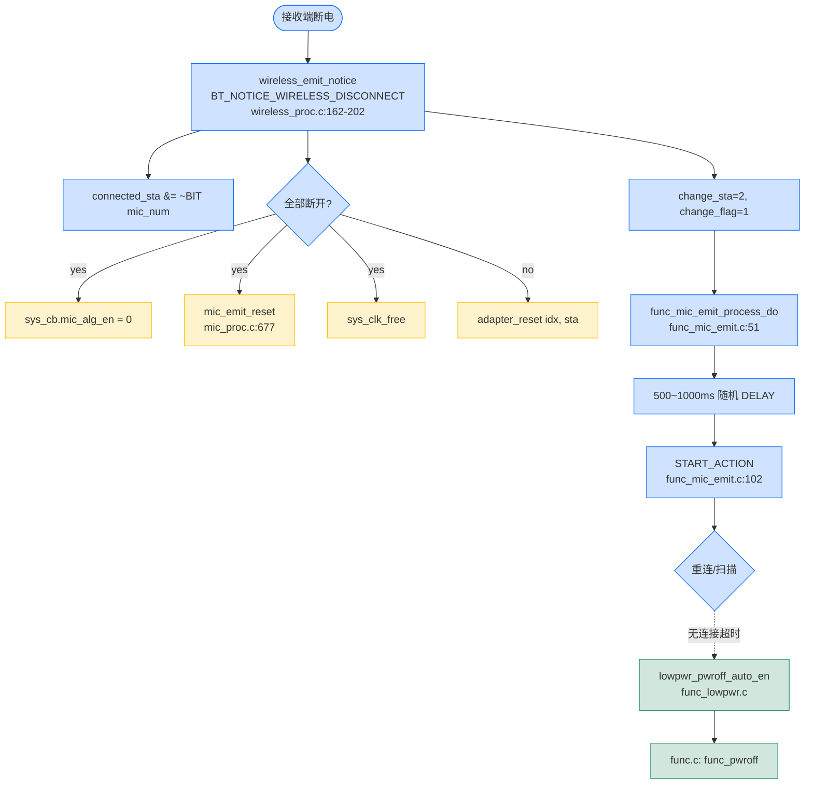

### 12.3 按键音量+ 流程

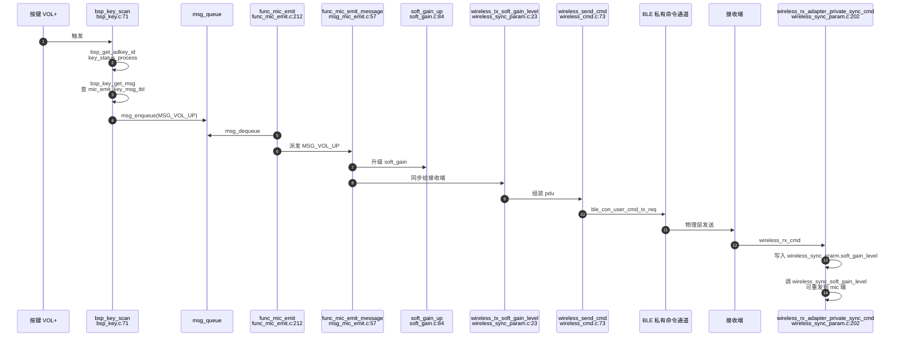

---

## 12.5 发射端全局架构图（Layer View）

### 12.5.1 应用层 + 模块层（核心软件层）

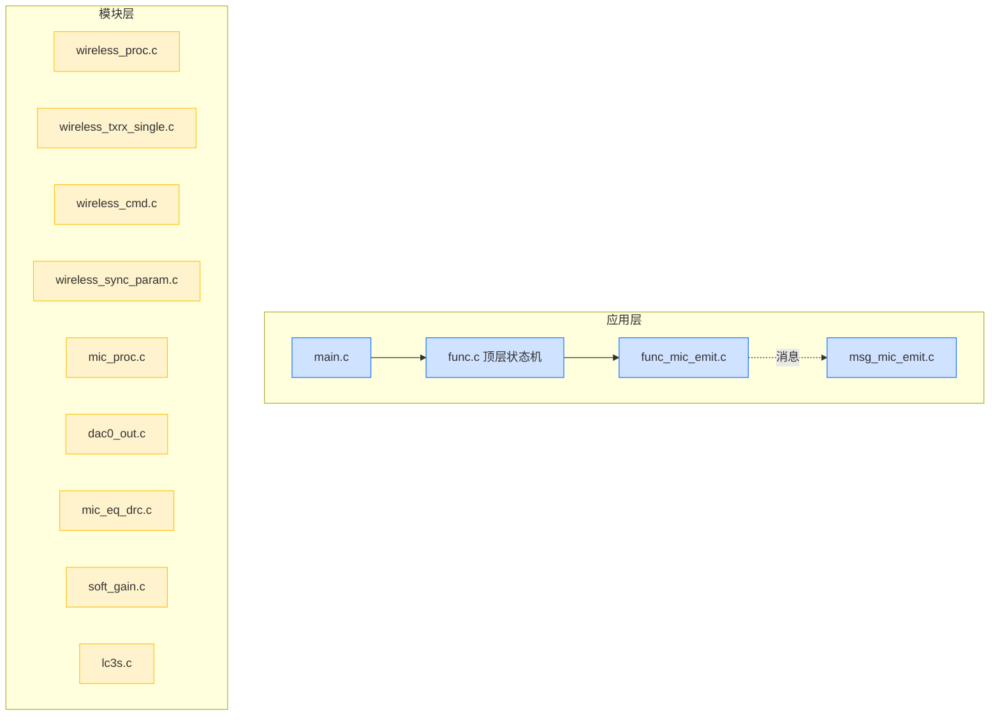

### 12.5.2 BSP 层 + 驱动层 + 硬件层（板级支撑层）

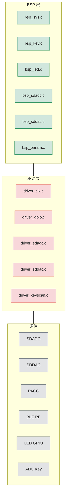

### 12.5.3 模块层 → 硬件层 跨层映射（关键数据通路）

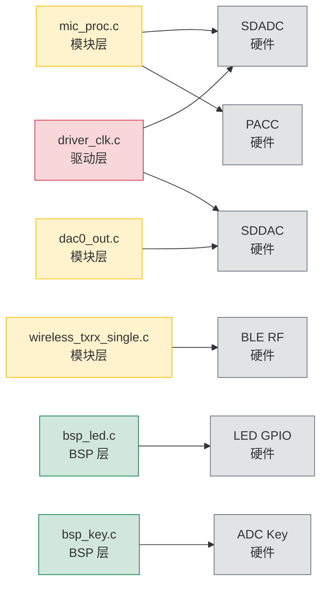

---

## 13. 实战调试清单

| 现象 | 排查路径 |
| --- | --- |
| 一直连不上 | `wireless_mic_role_init()` → `xcfg_cb.wireless_mic_emit_en` 是否为 1；`ble_scan_set_enable` 是否被调用；扫描结果是否有匹配地址 |
| 连接后无声音 | `sys_cb.mic_alg_en` 是否为 1；`WIRELESS_CON_CODEC_SEL` 两端是否一致；`WIRELESS_MIC_FRAME_SIZE` 是否一致 |
| 声音卡顿 | `cfg_wireless_tx_interval` 太小、`EQ_DRC`、`ECHO` 等算法耗时过高；检查 `cfg_wireless_d2a_enc_us` 是否覆盖实际算法耗时 |
| 杂音 | 检查屏蔽与接线；`WIRELESS_MIC_LOWPASS_EN=1`；`MIC_ANA_MODE` 选单端>差分>省RC |
| 麦阻塞 | `wireless_dump_proc()` 打开查 PER，>5% 需调大 `WIRELESS_MIC_TX_INTERVAL` 或开 `WIRELESS_CON_PWR_CTR` |
| LED 不亮 | `BSP_LED_EN=1`；`led_init()` 和 `bsp_led.c` 的配置 IO 是否与 PCB 一致 |
| 按键无响应 | `BSP_ADKEY_EN=1`；`bsp_adkey_init()` 已调用；`mic_emit_key_msg_tbl` 表中是否映射到对应消息 |

---

## 14. 关键代码位置速查表

| 关注点 | 位置 |
| --- | --- |
| 角色判定 | `modules/wireless/wireless_proc.c:5-18` |
| 二进制加载 | `modules/wireless/wireless_proc.c:24-32` |
| BLE 协议栈初始化 | `modules/wireless/wireless.c:223-239` |
| 发射端状态机 | `functions/func_mic_emit.c:51-140` |
| 发射端消息 | `functions/msg_mic_emit.c:5-135` |
| 麦克风算法链 | `modules/wireless/mic_proc.c:277-378` |
| 麦克风算法初始化 | `modules/wireless/mic_proc.c:597-675` |
| TX 帧缓冲 | `modules/wireless/wireless_txrx_single.c:170-236` |
| LC3S 编码 | `modules/codec/lc3s.c` |
| 私有命令队列 | `modules/wireless/wireless_cmd.c:16-99` |
| 私有命令 API | `modules/wireless/wireless_cmd_api.c:8-83` |
| 同步参数 | `modules/wireless/wireless_sync_param.c` |
| LED 切换 | `modules/wireless/wireless_proc.c:319-340` |
| 按键扫描 | `bsp/bsp_key.c:71-135` |
| 系统初始化 | `bsp/bsp_sys.c:200-267` |
| 当前配置 | `projects/microphone/config_ab5766_le_mic.h` |

---

## 15. 给新手的进一步建议

1. **先跑通回连**：烧录两份固件（一个 emitter、一个 adapter），按 `docs/SDK/AB5766_无线麦克风_双板连接与LED测试指南.md` 做回连验证。
2. **打开 dump**：`config_ab5766_le_mic.h:73` 把 `WIRELESS_DUMP_EN=1`，可以看到双方 PER/RSSI。
3. **逐项关闭算法**：从 `WIRELESS_MIC_DAC_OUT_EN=0`、`WIRELESS_MIC_EQ_DRC_EN=0` 开始，逐个关闭以隔离问题。
4. **关注 `AT(.text.*)` 段名**：本固件用 `AT()` 宏把函数放到不同段（`com_text`、`com_rodata` 等），新手不必深究，但要知道这些函数可能因链接器脚本位置不同而被特殊处理（如 `loc_mic_pacc_*`）。
5. **库行为**：所有 `libs/ble/*` 下的 API 都通过头文件调用，**不要直接修改库**；需要换行为时，要么用 `STRONG` 覆盖（如 `strong_symbol.c`），要么配置 `xcfg_cb`。

---

（本文基于 `projects/microphone/config_ab5766_le_mic.h` 当前默认配置。所有行号引用均为仓库当时快照；如有变动请以实际代码为准。）
