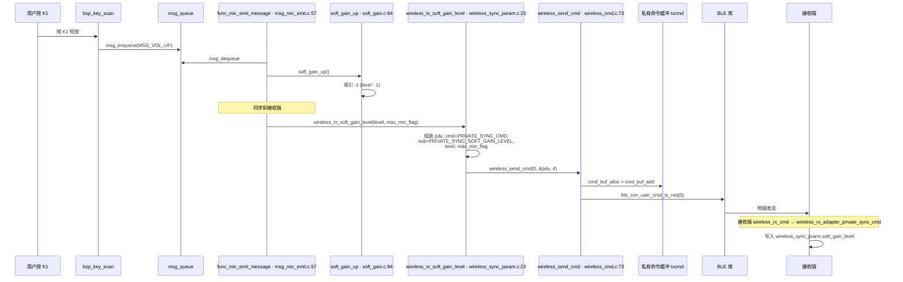
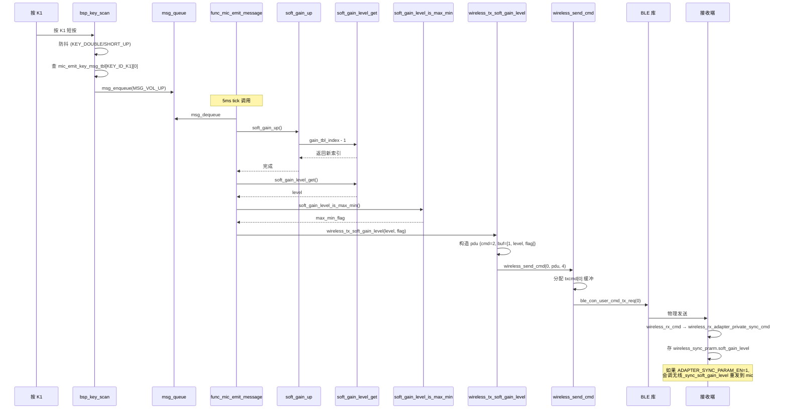
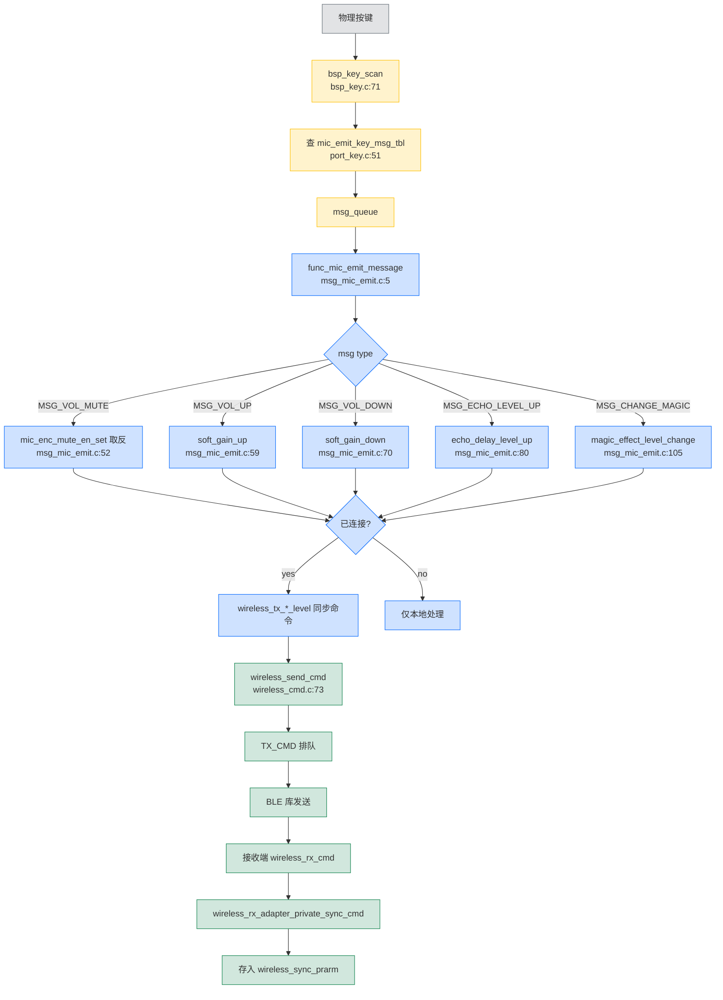

# AB5766 发射端按键测试 · 消息分派与同步命令路径

> **本文档**：深入解析 `functions/msg_mic_emit.c` 每个按键消息的来源、行为、跨设备同步命令路径。
>
> **前提**：你的发射端已成功连接到接收端（看到 `WIRELESS_CONNECTED, 0`）。
>
> **关联文档**：
> - [`AB5766_发射端_Mic_Emit_实现详解.md`](AB5766_发射端_Mic_Emit_实现详解.md) — 发射端业务
> - [`AB5766_发送端完整启动日志解析_BLE连接流程.md`](AB5766_发送端完整启动日志解析_BLE连接流程.md) — 启动日志
> - [`AB5766_按键链路测试与验收指南.md`](AB5766_按键链路测试与验收指南.md) — 按键验收
> - [`AB5766_嵌入式固件SDK_架构导览.md`](AB5766_嵌入式固件SDK_架构导览.md) — 整体架构

---

## 0. 你的按键测试结果

| 串口行 | 触发按键 | 含义 |
| --- | --- | --- |
| `MSG_VOL_MUTE` | PP 短按 | 麦克风静音切换 |
| `MSG_VOL_UP` | K1 短按 | 音量 + |
| `MSG_VOL_DOWN` | K2 短按 | 音量 - |
| `TX_CMD0: 02 03 01` | PP 静音同步 | 同步 PP 静音状态给接收端 |
| `TX_CMD0: 02 01 00 01` | K1 音量 + | 同步级别 0→1 |
| `TX_CMD0: 02 01 01 00` | K2 音量 - | 同步级别 1→0 |

**所有按键都已正确响应**，KE/3 也应该工作（你没测试）。

---

## 1. 按键消息表

### 1.1 发射端按键表（已验证）

`projects/microphone/port/port_key.c:51-58`：

```c
const u8 mic_emit_key_msg_tbl[KEY_TBL_MAX_NB][KEY_MSG_MAX_IDX] = {
                // 单击,    长按,        HOLD,        长按抬起,    双击,        三击,        四击,        五击
    [KEY_ID_PP] = {MSG_VOL_MUTE, MSG_NO,     MSG_PWR_HOLD, MSG_NO,      MSG_NO,      MSG_NO,      MSG_NO,      MSG_NO},
    [KEY_ID_K1] = {MSG_VOL_UP,   MSG_NO,     MSG_NO,       MSG_NO,      MSG_NO,      MSG_NO,      MSG_NO,      MSG_NO},
    [KEY_ID_K2] = {MSG_VOL_DOWN, MSG_NO,     MSG_NO,       MSG_NO,      MSG_NO,      MSG_NO,      MSG_NO,      MSG_NO},
    [KEY_ID_K3] = {MSG_NO,       MSG_NO,     MSG_NO,       MSG_NO,      MSG_NO,      MSG_NO,      MSG_NO,      MSG_NO},
};
```

### 1.2 事件类型 → 消息索引转换

`projects/microphone/port/port_key.c:5-39` `evt_type_2_msg_idx()`：

| 事件类型 | 索引 | 含义 |
| --- | --- | --- |
| `KEY_SHORT_UP` | 0 | 单击 |
| `KEY_LONG` | 1 | 长按 |
| `KEY_HOLD` | 2 | HOLD |
| `KEY_LONG_UP` | 3 | 长按抬起 |
| `KEY_DOUBLE` | 4 | 双击 |
| `KEY_THREE` | 5 | 三击 |
| `KEY_FOUR` | 6 | 四击 |
| `KEY_FIVE` | 7 | 五击 |

**所以 PP 键的 `MSG_VOL_MUTE` 来自 `mic_emit_key_msg_tbl[KEY_ID_PP][0]`（单击列）**。

### 1.3 消息源到分派的完整链路

```mermaid
flowchart LR
    A[PP 键按下] --> B[硬件 IO 中断]
    B --> C[bsp_key_scan<br/>bsp_key.c:71]
    C --> D[key_status_process<br/>bsp_key.c:126]
    D --> E[key_multi_press_process<br/>bsp_key.c:127]
    E --> F[bsp_key_get_msg<br/>bsp_key.c:130]
    F --> G[查 mic_emit_key_msg_tbl<br/>port_key.c:51]
    G --> H[msg_enqueue MSG_VOL_MUTE<br/>bsp_key.c:131]
    H --> I[msg_queue]
    I --> J[func_mic_emit 主循环 msg_dequeue<br/>func_mic_emit.c:219]
    J --> K[func_mic_emit_message<br/>msg_mic_emit.c:49]
    K --> L[mic_enc_mute_en_set<br/>...] 
    K --> M[wireless_tx_mic_mute_level<br/>wireless_sync_param.c:48]
    M --> N[wireless_send_cmd<br/>wireless_cmd.c:73]
    N --> O[BLE 私有命令 TX]
    classDef hw fill:#e2e3e5,stroke:#6c757d
    classDef bsp fill:#fff3cd,stroke:#ffc107
    classDef app fill:#cfe2ff,stroke:#0d6efd
    classDef cmd fill:#d1e7dd,stroke:#198754
    class A,B hw
    class C,D,E,F,G,H,I,J bsp
    class K,L app
    class M,N,O cmd
```



---

## 2. `func_mic_emit_message` 完整源码解析

`functions/msg_mic_emit.c:5-135`：

```c
AT(.text.func.mic_emit)
void func_mic_emit_message(u16 msg) {
    switch (msg) {
#if WIRELESS_CON_BONDING_EN
    case EVT_CONNECT_BONDDING:                        // 16
        param_write_bonding_addr(bongding_addr_get());
        btstack_ble_reset_hash(1);
        break;
#endif

    case MSG_SYS_1S:                                  // 23
#if BSP_VBAT_DETECT_EN
        bsp_vbat_proc();                              // 低电检测
#endif
        break;

#if BSP_VBAT_DETECT_EN
    case EVT_LPWR_WARNING:                            // 31
        printf("EVT_LPWR_WARNING\n");
        break;
    case EVT_LPWR_WARNING_EXIT:                       // 36
        printf("EVT_LPWR_WARNING_EXIT\n");
        break;
    case EVT_LPWR_OFF:                                // 41
        printf("EVT_LPWR_OFF\n");
        func_cb.sta = FUNC_PWROFF;                    // 低电关机
        break;
#endif

    // ===== 你的日志中出现的 3 个按键 =====
    case MSG_VOL_MUTE:                                // 48
        printf("MSG_VOL_MUTE\n");                      // 49 ← 你看到的
        if (!wireless_mic_connected_sta_get()) {       // 50
            break;
        }
        mic_enc_mute_en_set(!mic_enc_mute_en_get());   // 52 取反静音状态
        wireless_tx_mic_mute_level(mic_enc_mute_en_get()); // 53 同步
        break;

    case MSG_VOL_UP:                                  // 57
        printf("MSG_VOL_UP\n");                        // 58 ← 你看到的
        soft_gain_up();                               // 59 soft_gain.c:84
        if (!wireless_mic_connected_sta_get()) {       // 61
            break;
        }
        wireless_tx_soft_gain_level(soft_gain_level_get(), soft_gain_level_is_max_min());  // 65
        break;

    case MSG_VOL_DOWN:                                // 68
        printf("MSG_VOL_DOWN\n");                      // 69 ← 你看到的
        soft_gain_down();                             // 70
        if (!wireless_mic_connected_sta_get()) {       // 72
            break;
        }
        wireless_tx_soft_gain_level(soft_gain_level_get(), soft_gain_level_is_max_min());  // 75
        break;

    case MSG_ECHO_LEVEL_UP:                           // 78
        printf("MSG_ECHO_LEVEL_UP\n");                 // 79
        echo_delay_level_up();                         // 80
        if (!wireless_mic_connected_sta_get()) {       // 81
            break;
        }
        wireless_tx_echo_delay_level(echo_delay_level_get(), echo_delay_level_is_max_min());  // 85
        break;

    case MSG_ECHO_LEVEL_DOWN:                         // 88
        printf("MSG_ECHO_LEVEL_DOWN\n");               // 89
        echo_delay_level_down();                       // 90
        if (!wireless_mic_connected_sta_get()) {       // 92
            break;
        }
        wireless_tx_echo_delay_level(echo_delay_level_get(), echo_delay_level_is_max_min());  // 95
        break;

    case MSG_CHANGE_MAGIC:                            // 98
        printf("MSG_CHANGE_MAGIC\n");                  // 99
        if (!wireless_mic_connected_sta_get()) {       // 100
            break;
        }
        magic_audio_mute_set(1);                      // 104 防连续切换
        magic_effect_level_change();                   // 105
        magic_audio_mute_set(0);
        wireless_tx_magic_effect_level(magic_effect_level_get()); // 108
        break;

    // ... 其他 case
    
    default:
        func_message(msg);                              // 公共消息
        break;
    }
}
```

---

## 3. 同步命令路径详解

### 3.1 同步命令 API 列表

`modules/wireless/wireless_sync_param.c` 提供的同步命令（发射端 → 接收端）：

| 函数 | 文件:行号 | 同步内容 |
| --- | --- | --- |
| `wireless_tx_mic_mute_level` | `wireless_sync_param.c:48-57` | 麦克风静音状态 |
| `wireless_tx_soft_gain_level` | `wireless_sync_param.c:23-33` | 软增益等级 |
| `wireless_tx_echo_delay_level` | `wireless_sync_param.c:9-20` | 混响等级 |
| `wireless_tx_magic_effect_level` | `wireless_sync_param.c:36-45` | 魔音效果 |
| `wireless_tx_voice_rm_en` | `wireless_sync_param.c:73-83` | 消原音 |
| `wireless_tx_mutual_hair_act` | `wireless_sync_param.c:60-71` | 互发动作 |

### 3.2 一次同步命令的完整路径

以 `MSG_VOL_UP` 为例：



### 3.3 私有命令 PDU 结构

```c
// modules/wireless/wireless_cmd.h:25-32
typedef enum{
    PRIVATE_WS_MIC_CMD      = 0,    // 无线麦控制
    PRIVATE_USB_CMD,                // USB 命令
    PRIVATE_SYNC_CMD,               // 同步参数（你看到的 02 03 01 是这里）
    PRIVATE_USER_DATA,
    PRIVATE_PWR_CTR_CMD,
    PRIVATE_AUDIO_CTR_CMD,
} cmd_t;

// modules/wireless/wireless_sync_param.h:5-15
typedef enum{
    PRIVATE_SYNC_ECHO_DELAY_LEVEL      = 0,
    PRIVATE_SYNC_SOFT_GAIN_LEVEL,              // = 1 是你的 K1/K2
    PRIVATE_SYNC_MAGIC_EFFECT_LEVEL,
    PRIVATE_SYNC_MIC_MUTE_LEVEL,              // = 3 是你的 PP
    PRIVATE_SYNC_VOICE_RM,
    PRIVATE_SYNC_ALL_PARAM,
} sub_private_ctl_cmd_t;
```

**你的日志 `TX_CMD0: 02 03 01` 解析**：
- `02` = `cmd = PRIVATE_SYNC_CMD` (2)
- `03` = `sub_cmd = PRIVATE_SYNC_MIC_MUTE_LEVEL` (3)
- `01` = `mute_en = 1`（**静音开启**）

**`TX_CMD0: 02 01 00 01` 解析**：
- `02` = `PRIVATE_SYNC_CMD`
- `01` = `PRIVATE_SYNC_SOFT_GAIN_LEVEL`
- `00 01` = level 0 → 1 (**音量上升**)

**`TX_CMD0: 02 01 01 00` 解析**：
- `02` = `PRIVATE_SYNC_CMD`
- `01` = `PRIVATE_SYNC_SOFT_GAIN_LEVEL`
- `01 00` = level 1 → 0 (**音量下降**)

### 3.4 `wireless_send_cmd` 完整代码

`modules/wireless/wireless_cmd.c:73-99`：

```c
bool wireless_send_cmd(u8 index, u8 *cmd, u8 len) {
    u8 *buf;

    if(len > CMD_MAX_SIZE) {
        return false;
    }

    buf = cmd_buf_alloc(&txcmd[index]);              // 81 环形缓冲分配
    if(buf == NULL) {
        return false;
    }

    printf("TX_CMD%d: ", index);                     // 86 ← 你看到的 "TX_CMD0"
    print_r(cmd, len);                               // 打印命令数据

    buf[0] = len;                                    // 89
    memcpy(buf+1, cmd, len);                        // 90

    cmd_buf_add(&txcmd[index]);                     // 92
    
    if (!ble_con_user_cmd_tx_req(index)) {           // 94
        cmd_buf_get(&txcmd[index]);
        return false;
    }
    return true;
}
```

**触发链**：
- `msg_mic_emit.c:53` `wireless_tx_mic_mute_level(...)` → `wireless_sync_param.c:48`
- `wireless_sync_param.c:48-57` `wireless_tx_mic_mute_level`：

```c
AT(.text.wireless_cmd.private_sync)
void wireless_tx_mic_mute_level(u8 mic_mute_level) {
    wireless_cmd_t pdu;

    pdu.cmd = PRIVATE_SYNC_CMD;                       // line 52
    pdu.buf[0] = PRIVATE_SYNC_MIC_MUTE_LEVEL;        // line 53
    pdu.buf[1] = mic_mute_level;                    // line 54

    wireless_send_cmd(0, (u8 *)&pdu, 3);             // line 56
}
```

**发送数据**：`cmd=0x02, buf[0]=0x03, buf[1]=0x01` → 加上长度字节 `0x03` → 共 4 字节 → `TX_CMD0: 02 03 01`（注意 `len` 字节单独打印在 `wireless_send_cmd` 之前的另一处）

---

## 4. 重新分析每个按键的完整代码引用

### 4.1 PP 键 → MSG_VOL_MUTE

```c
// functions/msg_mic_emit.c:48-55
case MSG_VOL_MUTE:
    printf("MSG_VOL_MUTE\n");                                                // 49
    if(!wireless_mic_connected_sta_get()) {                                 // 50
        break;
    }
    mic_enc_mute_en_set(!mic_enc_mute_en_get());                            // 52 mic_enc_t.mute_en 取反
    wireless_tx_mic_mute_level(mic_enc_mute_en_get());                       // 53 同步给接收端
    break;
```

**PDU 详情**：
- `cmd = 0x02` (PRIVATE_SYNC_CMD)
- `buf[0] = 0x03` (PRIVATE_SYNC_MIC_MUTE_LEVEL)
- `buf[1] = 0x01` 或 `0x00` (mute 状态)

### 4.2 K1 键 → MSG_VOL_UP

```c
// functions/msg_mic_emit.c:57-66
case MSG_VOL_UP:
    printf("MSG_VOL_UP\n");                                                  // 58
    soft_gain_up();                                                           // 59
    if(!wireless_mic_connected_sta_get()) {                                  // 61
        break;
    }
    wireless_tx_soft_gain_level(soft_gain_level_get(), soft_gain_level_is_max_min());  // 65
    break;
```

**`soft_gain_up` 完整代码**：

`modules/audio/soft_gain.c:84-89`：

```c
void soft_gain_up(void) {
    if (soft_gain.gain_tbl_index) {                                          // 86
        soft_gain_set_level(soft_gain.gain_tbl_index-1);                      // 87 索引 -1
    }
}
```

**软增益等级**：

`modules/audio/soft_gain.c:96-108`：

```c
uint8_t soft_gain_level_get(void) {
    return soft_gain.gain_tbl_index;                                        // 98
}

bool soft_gain_level_is_max_min(void) {
    if ((soft_gain.gain_tbl_index == 0) || (soft_gain.gain_tbl_index == SOFT_GAIN_MAX_LEVEL)) {
        return true;
    }
    return false;
}
```

**`wireless_tx_soft_gain_level` 完整代码**：

`modules/wireless/wireless_sync_param.c:22-33`：

```c
AT(.text.wireless_cmd.private_sync)
void wireless_tx_soft_gain_level(u8 soft_gain_level, u8 max_min_flag) {
    wireless_cmd_t pdu;

    pdu.cmd = PRIVATE_SYNC_CMD;
    pdu.buf[0] = PRIVATE_SYNC_SOFT_GAIN_LEVEL;                              // 27
    pdu.buf[1] = soft_gain_level;                                           // 28
    pdu.buf[2] = max_min_flag;                                              // 29

    wireless_send_cmd(0, (u8 *)&pdu, 4);                                     // 32
}
```

**PDU 详情**：
- `cmd = 0x02`
- `buf[0] = 0x01` (PRIVATE_SYNC_SOFT_GAIN_LEVEL)
- `buf[1] = level` (0..8)
- `buf[2] = max_min_flag` (0 或 1)

### 4.3 K2 键 → MSG_VOL_DOWN

```c
// functions/msg_mic_emit.c:68-76
case MSG_VOL_DOWN:
    printf("MSG_VOL_DOWN\n");                                                // 69
    soft_gain_down();                                                         // 70
    if(!wireless_mic_connected_sta_get()) {                                  // 72
        break;
    }
    wireless_tx_soft_gain_level(soft_gain_level_get(), soft_gain_level_is_max_min());  // 75
    break;
```

`modules/audio/soft_gain.c:91-94`：

```c
void soft_gain_down(void) {
    soft_gain_set_level(soft_gain.gain_tbl_index+1);                          // 93 索引 +1
}
```

### 4.4 K3 键 → MSG_CHANGE_MAGIC（你未测试）

```c
// functions/msg_mic_emit.c:98-109
case MSG_CHANGE_MAGIC:
    printf("MSG_CHANGE_MAGIC\n");                                            // 99
    if(!wireless_mic_connected_sta_get()) {                                 // 100
        break;
    }
    magic_audio_mute_set(1);                                                 // 104 防连续切换
    magic_effect_level_change();                                              // 105
    magic_audio_mute_set(0);
    wireless_tx_magic_effect_level(magic_effect_level_get());                // 108
    break;
```

**注意**：你的 `mic_emit_key_msg_tbl` 中 K3 全部是 `MSG_NO`（port_key.c:56），所以**按 K3 不会触发这个 case**。

---

## 5. 接收端命令分派路径

### 5.1 接收端如何接收命令

接收端 `func_adapter_message` 默认是空的（参见 `msg_adapter.c:5-50`），**只关心 USB 插拔**。但 `wireless_rx_cmd` 会处理私有命令：

`modules/wireless/wireless_cmd_api.c:256-283` `wireless_rx_cmd`：

```c
AT(.text.wireless_cmd)
void wireless_rx_cmd(u8 index, u8 *ptr, u8 len) {
    wireless_cmd_t *pdu = (void *)ptr;

    if (pdu->cmd == PRIVATE_WS_MIC_CMD) {
        pdu->buf[TX_MAX_BUF_SIZE-1] = index;
        wireless_ws_mic_cmd(pdu);                                           // 265
    } else if(pdu->cmd == PRIVATE_USB_CMD) {
        wireless_rx_usb_cmd(pdu);
    } else if(pdu->cmd == PRIVATE_PWR_CTR_CMD) {
        ble_audio_pwr_ctr_set(index, pdu->buf[0]);
    } else if(pdu->cmd == PRIVATE_SYNC_CMD) {                               // 272
        if (wireless_role_is_adapter()) {
            wireless_rx_adapter_private_sync_cmd(pdu);                      // 274
        } else {
            wireless_rx_mic_emit_private_sync_cmd(pdu);
        }
    } else {
        wireless_rx_user_cmd(index, ptr+1, len-1);
    }
}
```

### 5.2 接收端处理 sync 命令

`modules/wireless/wireless_sync_param.c:202-278` `wireless_rx_adapter_private_sync_cmd`：

```c
AT(.text.wireless_cmd.usb)
void wireless_rx_adapter_private_sync_cmd(wireless_cmd_t *pdu) {
    u8 sub_cmd = pdu->buf[0];

    switch(sub_cmd) {
    case PRIVATE_SYNC_ECHO_DELAY_LEVEL:                                    // 209
        // 存储 + 重发
        break;

    case PRIVATE_SYNC_SOFT_GAIN_LEVEL:                                     // 223
#if ADAPTER_SYNC_PARAM_EN
        wireless_sync_prarm.soft_gain_level = pdu->buf[1];
        wireless_sync_soft_gain_level(pdu->buf[1], pdu->buf[2]);          // 226
#endif
        break;

    case PRIVATE_SYNC_MAGIC_EFFECT_LEVEL:                                  // 241
        break;

    case PRIVATE_SYNC_MIC_MUTE_LEVEL:                                      // 255
#if ADAPTER_SYNC_PARAM_EN
        wireless_sync_prarm.mic_mute_en = pdu->buf[1];
        wireless_sync_mic_mute_level(pdu->buf[1]);                        // 258
#endif
        break;

    case PRIVATE_SYNC_VOICE_RM:                                            // 269
        break;
    }
}
```

**关键**：当前配置 `ADAPTER_SYNC_PARAM_EN = 0`，所以接收端**不会主动应用**这些同步参数，但会**保存到 `wireless_sync_prarm`**。

### 5.3 接收端缓存 `wireless_sync_prarm` 结构

`modules/wireless/wireless_sync_param.c:4`：

```c
static wireless_sync_prarm_t wireless_sync_prarm AT(.buf.adapter.proc);
```

---

## 6. 完整按键消息生命周期

### 6.1 K1 音量 + 一帧完整链路



---

## 7. 关键文件行号速查表

| 关注点 | 文件:行号 |
| --- | --- |
| `func_mic_emit_message` 入口 | `functions/msg_mic_emit.c:5-135` |
| `MSG_VOL_MUTE` case | `functions/msg_mic_emit.c:48-55` |
| `MSG_VOL_UP` case | `functions/msg_mic_emit.c:57-66` |
| `MSG_VOL_DOWN` case | `functions/msg_mic_emit.c:68-76` |
| `MSG_CHANGE_MAGIC` case | `functions/msg_mic_emit.c:98-109` |
| `MIC VOL_MUTE` 打印 | `functions/msg_mic_emit.c:49` |
| `MIC VOL_UP` 打印 | `functions/msg_mic_emit.c:58` |
| `MIC VOL_DOWN` 打印 | `functions/msg_mic_emit.c:69` |
| 发射端按键表 | `projects/microphone/port/port_key.c:51-58` |
| 事件类型 → 索引 | `projects/microphone/port/port_key.c:5-39` |
| `bsp_key_scan` | `bsp/bsp_key.c:71-135` |
| `bsp_key_get_msg` | `bsp/bsp_key.c:54-67` |
| `msg_enqueue` | `bsp_key.c:131` |
| `soft_gain_up` | `modules/audio/soft_gain.c:84-89` |
| `soft_gain_down` | `modules/audio/soft_gain.c:91-94` |
| `soft_gain_level_get` | `modules/audio/soft_gain.c:96-99` |
| `soft_gain_level_is_max_min` | `modules/audio/soft_gain.c:101-108` |
| `wireless_tx_soft_gain_level` | `modules/wireless/wireless_sync_param.c:22-33` |
| `wireless_tx_mic_mute_level` | `modules/wireless/wireless_sync_param.c:47-57` |
| `wireless_tx_echo_delay_level` | `modules/wireless/wireless_sync_param.c:9-20` |
| `wireless_tx_magic_effect_level` | `modules/wireless/wireless_sync_param.c:36-45` |
| `wireless_send_cmd` | `modules/wireless/wireless_cmd.c:73-99` |
| `TX_CMD%d` 打印 | `modules/wireless/wireless_cmd.c:86` |
| `wireless_rx_cmd` | `modules/wireless/wireless_cmd_api.c:256-283` |
| `wireless_rx_adapter_private_sync_cmd` | `modules/wireless/wireless_sync_param.c:202-278` |
| `wireless_mic_connected_sta_get` | `modules/wireless/wireless_proc.c:51-55` |
| `mic_enc_mute_en_set` | `modules/wireless/mic_proc.c:99-105` |
| `mic_enc_mute_en_get` | `modules/wireless/mic_proc.c:107-111` |
| `cmd_t` 枚举 | `modules/wireless/wireless_cmd.h:25-32` |
| `sub_private_ctl_cmd_t` 枚举 | `modules/wireless/wireless_sync_param.h:5-15` |
| `wireless_sync_prarm` 全局 | `modules/wireless/wireless_sync_param.c:4` |
| `func_mic_emit` 主循环 | `functions/func_mic_emit.c:212-227` |
| `msg_dequeue` 调用 | `functions/func_mic_emit.c:219` |

---

## 8. 流程图：按键 → 同步命令



---

## 9. 完整命令 PDU 编码示例

### 9.1 PP 键 → MSG_VOL_MUTE → TX

```
[msg_mic_emit.c:52] mic_enc_mute_en_set(!mic_enc_mute_en_get())
    → mic_enc_t.mute_en 取反
[msg_mic_emit.c:53] wireless_tx_mic_mute_level(mic_enc_mute_en_get())
    → wireless_sync_param.c:47-57
    → pdu = {cmd: 0x02, buf[0]: 0x03, buf[1]: mute_en}
[wireless_cmd.c:89] buf[0] = len(3); memcpy(buf+1, &pdu, 3)
    → 实际发送: 0x03 02 03 01
[wireless_cmd.c:86] printf("TX_CMD%d: ", 0); print_r(cmd, 3);
    → 输出: TX_CMD0: 02 03 01
```

### 9.2 K1 键 → MSG_VOL_UP → TX

```
[msg_mic_emit.c:59] soft_gain_up()
    → soft_gain.c:84-89 → gain_tbl_index--
[msg_mic_emit.c:65] wireless_tx_soft_gain_level(level, is_max_min)
    → wireless_sync_param.c:22-33
    → pdu = {cmd: 0x02, buf[0]: 0x01, buf[1]: level, buf[2]: max_min_flag}
[wireless_cmd.c:89] buf[0] = len(4); memcpy(buf+1, &pdu, 4)
    → 实际发送: 0x04 02 01 00 01
[wireless_cmd.c:86] 输出: TX_CMD0: 02 01 00 01
```

### 9.3 K2 键 → MSG_VOL_DOWN → TX

```
[msg_mic_emit.c:70] soft_gain_down()
    → soft_gain.c:91-94 → gain_tbl_index++
[msg_mic_emit.c:75] wireless_tx_soft_gain_level(level, is_max_min)
    → pdu = {cmd: 0x02, buf[0]: 0x01, buf[1]: level, buf[2]: max_min_flag}
    → 实际发送: 0x04 02 01 01 00
[wireless_cmd.c:86] 输出: TX_CMD0: 02 01 01 00
```

---

## 10. 测试建议

### 10.1 立即可测试的功能

✅ **已验证**：
- PP 短按 → `MSG_VOL_MUTE` + TX
- K1 短按 → `MSG_VOL_UP` + TX
- K2 短按 → `MSG_VOL_DOWN` + TX

### 10.2 可继续测试

| 操作 | 预期串口输出 | 备注 |
| --- | --- | --- |
| 长按 K1 (~0.5s) | `MSG_ECHO_LEVEL_UP` + TX | echo 等级 +1 |
| 长按 K2 (~0.5s) | `MSG_ECHO_LEVEL_DOWN` + TX | echo 等级 -1 |
| 长按 K3 (~0.5s) | `MSG_VOICE_RM` + TX | 消原音切换 |
| 长按 PP (~3s) | 进入 func_pwroff 流程 | 关机 |
| 拔掉接收端电源 | `WIRELESS_DISCONNECT, 0` | 断开通知 |
| 接收端恢复供电 | 重新连接 + `WIRELESS_CONNECTED, 0` | 重连 |

### 10.3 K3 键测试

注意你的 `mic_emit_key_msg_tbl`（port_key.c:56）K3 全部 `MSG_NO`！如果要让 K3 工作：

```c
// projects/microphone/port/port_key.c:56
[KEY_ID_K3] = {MSG_CHANGE_MAGIC, MSG_NO, MSG_NO, MSG_NO, MSG_NO, MSG_NO, MSG_NO, MSG_NO},
```

或者打开 K12 模式（`config.h` `WIRELESS_MIC_K12_KEY_EN`）：

```c
// projects/microphone/port/port_key.c:42-49
#if WIRELESS_MIC_K12_KEY_EN
const u8 mic_emit_key_msg_tbl[KEY_TBL_MAX_NB][KEY_MSG_MAX_IDX] = {
    [KEY_ID_PP] = {MSG_VOL_MUTE, MSG_NO, MSG_PWR_HOLD, MSG_NO, MSG_NO, MSG_NO, MSG_NO, MSG_NO},
    [KEY_ID_K1] = {MSG_VOL_UP, MSG_NO, MSG_NO, MSG_NO, MSG_ECHO_LEVEL_UP, MSG_NO, MSG_NO, MSG_NO},
    [KEY_ID_K2] = {MSG_VOL_DOWN, MSG_NO, MSG_NO, MSG_NO, MSG_ECHO_LEVEL_DOWN, MSG_NO, MSG_NO, MSG_NO},
    [KEY_ID_K3] = {MSG_CHANGE_MAGIC, MSG_VOICE_RM, MSG_NO, MSG_NO, MSG_NO, MSG_NO, MSG_NO, MSG_NO},
};
#endif
```

---

（本文档基于 `projects/microphone/config_ab5766_le_mic.h` 当前默认配置 + Code::Blocks 工程配置。所有文件:行号引用为仓库当时快照；如有变动请以实际代码为准。）
