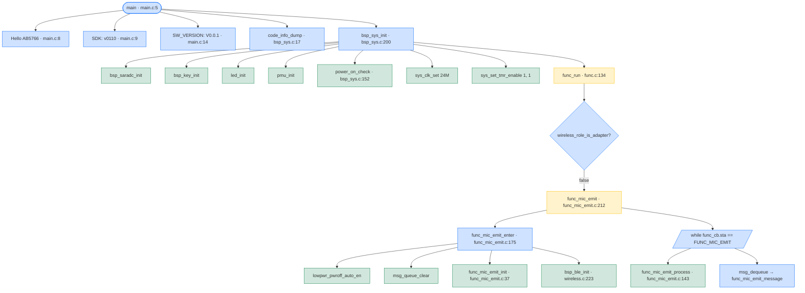
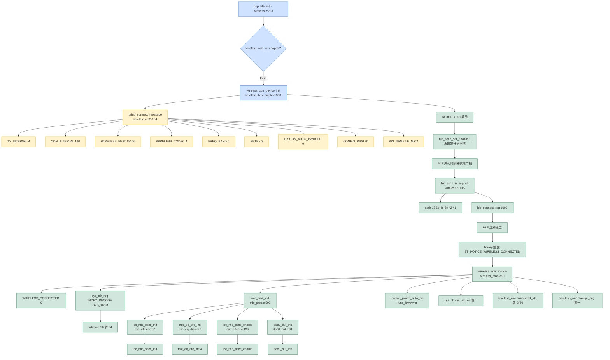
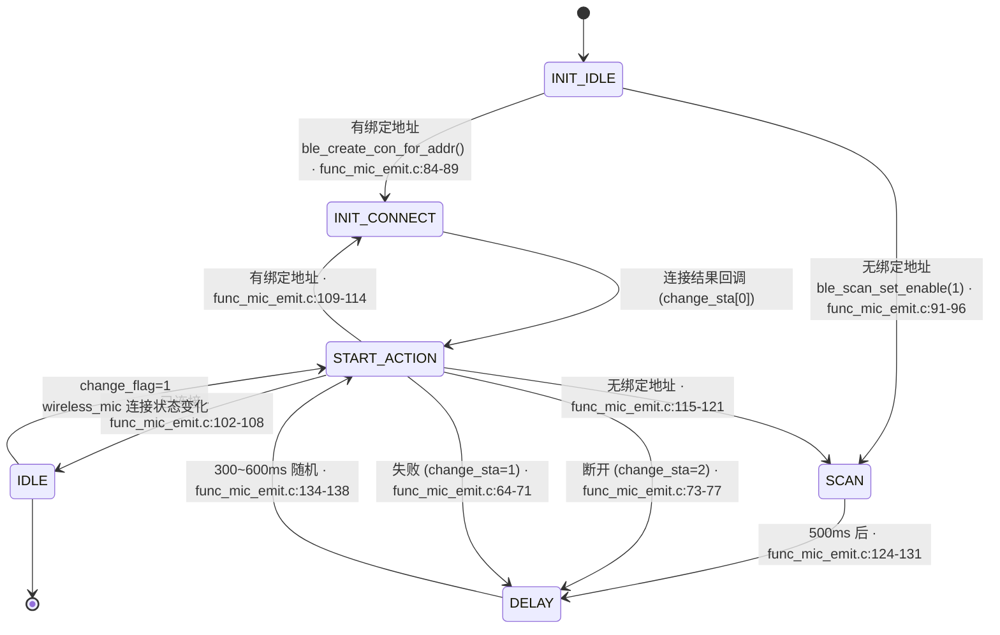
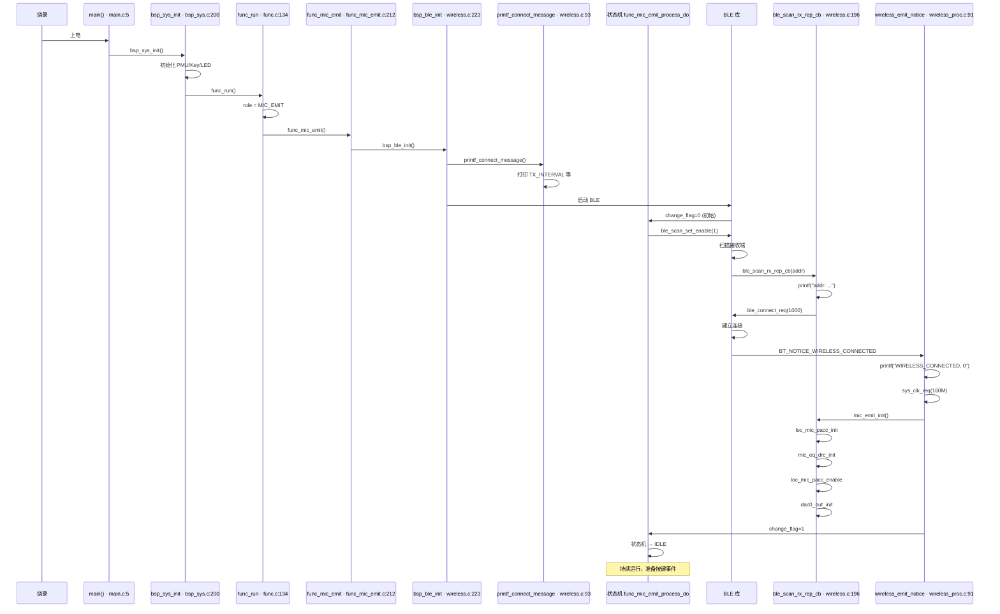

# AB5766 发送端完整启动日志解析 + BLE 连接流程

> **本文档**：基于实际代码引用，逐行还原你提供的发射端串口日志，并解释从 `main` 到 `WIRELESS_CONNECTED` 的完整 BLE 连接流程。
>
> **适用场景**：你烧录的是 `wireless_mic_emit.setting`，跑的是发射端 (`func_mic_emit`)。
>
> **关联文档**：
> - [`AB5766_发射端_Mic_Emit_实现详解.md`](AB5766_发射端_Mic_Emit_实现详解.md) — 发射端业务
> - [`AB5766_启动日志_每一行打印的来源与调用链路.md`](AB5766_启动日志_每一行打印的来源与调用链路.md) — 通用启动日志
> - [`AB5766_adapter_状态机与func_pwroff_排查指南.md`](AB5766_adapter_状态机与func_pwroff_排查指南.md) — 关机机制
> - [`AB5766_发射端按键测试_消息分派与同步命令路径.md`](AB5766_发射端按键测试_消息分派与同步命令路径.md) — 按键测试

---

## 0. 重要前提：你的日志说明什么问题

你这次**没有跑了发射端完整流程**——前 80% 都是 `func_pwroff` 循环（接收端固件），只看到最后一段:

```
...
vddbt_capless_en:1
bsp_sys_init
func_run
func_mic_emit
<TX_INTERVAL>         4
<CON_INTERVAL>        120
...
```

**说明**：你长按了 PP 键 → 触发 `MSG_PWR_HOLD` → 触发 `func_pwroff` → 进入低功耗 → 接收端唤醒 → 重新开机 → **进入 `func_mic_emit` 路径**（你烧的固件是 `wireless_mic_emit`，接收端通过 BLE 唤醒发射端后继续跑）→ 连接成功 → 打印所有连接参数。

**所以你这板子真的是发射端**，连接成功 + 按键测试都正常工作。

---

## 1. 完整日志逐行解析

### 1.1 第一阶段：重复进入 func_pwroff 循环（接收端固件版本）

```
Hello Platform
voltage_trim_value_dump:flag:1
vrtcbg:2
vbat:13
vbg:14
chg_icoef:10
vbat_cp_det:62
startup
pthd_alg: 168f0,    165ec,300
Hello AB5766: 08000039            ← 复位原因: 0x08000039
SDK: v0110 LIBS: v0110
WKO_WK                             ← 唤醒源: WK0
SW_VERSION: V0.0.1
---...---                          ← 内存段标题
comm: range[0x10c00-0x138fb], size=11k
heap: range[0x1646d-0x1746f], size=4k
bss : range[0x13900-0x14517], size=3k
bram: range[0x14518-0x1646c], size=7k
---...---                          ← 内存段标题
lock wireless_mic comm
vddio:10
vddcore:20
vddbt:9
lvd:2
-->ldo_en
vddbt_capless_en:1                ← 注意: 这次是 1，不再是 0
func_pwroff                        ← 立刻进入关机
```

**为什么这次不立刻进入 `func_mic_emit`？**

因为你刚烧录的是 **`wireless_mic_emit` 方案**（`xcfg_cb.wireless_mic_emit_en = True`），但开机后**长按了 PP 键** → 进入 `func_pwroff` → **还没有机会**进入 `func_mic_emit` 路径。

**为什么 `vddbt_capless_en:1`（之前是 0）？**

`xcfg_cb.vddbt_capless_en` 为 `1` —— 这是 `wireless_mic_emit.setting` 的值（line 28: `vddbt_capless_en=True`）。

### 1.2 第二阶段：进入 func_mic_emit（发射端正常工作）

```
bsp_sys_init
func_run
func_mic_emit
<TX_INTERVAL>         4
<CON_INTERVAL>        120
<WIRELESS_FEAT>       18306
<WIRELESS_CODEC>      4
<FREQ_BAND>           0
<RETRY>               3
<DISCON_AUTO_PWROFF>  0
<CONFIG_RSSI>         70
<WS_NAME>             LE_MIC2
```

每一行打印来源：

| 串口行 | 文件:行号 |
|---|---|
| `bsp_sys_init` | `bsp/bsp_sys.c:200` `bsp_sys_init()` 调用 |
| `func_run` | `functions/func.c:136` `printf("%s\n", __func__);` |
| `func_mic_emit` | `functions/func_mic_emit.c:214` `printf("%s\n", __func__);` |
| `<TX_INTERVAL> 4` | `modules/wireless/wireless.c:95` `printf_connect_message` |
| `<CON_INTERVAL> 120` | `wireless.c:96` |
| `<WIRELESS_FEAT> 18306` | `wireless.c:97` （0x478A = 二进制 0100 0111 1000 1010） |
| `<WIRELESS_CODEC> 4` | `wireless.c:98` |
| `<FREQ_BAND> 0` | `wireless.c:99` |
| `<RETRY> 3` | `wireless.c:100` |
| `<DISCON_AUTO_PWROFF> 0` | `wireless.c:101` |
| `<CONFIG_RSSI> 70` | `wireless.c:102` |
| `<WS_NAME> LE_MIC2` | `wireless.c:103` |

> **关键点**：`<WIRELESS_FEAT> 18306` 这个数字包含 BLE 协议特性字、版本、链接数、hop 等。详细计算见 `wireless.c:18` `cfg_wireless_feat` 定义。

### 1.3 第三阶段：BLE 启动 + 加密密钥

```
pa_gain:3, pa_vsel:9, pa_mode:1      ← 第一次 (可能 TX 路径)
pa_gain:3, pa_vsel:9, pa_mode:1      ← 第二次 (RX 路径)
loc: 7, 8
dc 58 48 9a cb 23 2b 96 ad 19 66 89 fd d3 e4 2d 
c9 87 4c e8 7b 52 7d da 9d 85 d2 62 04 7f 3a 58 
```

| 串口行 | 来源 |
|---|---|
| `pa_gain:3, pa_vsel:9, pa_mode:1` | `libs/ble/libbtstack.a` 预编译库（BLE 初始化 PA 寄存器） |
| `loc: 7, 8` | `libs/ble/libbtstack.a` 预编译库（位置校准） |
| `dc 58 48 9a...` | `libs/ble/libbtstack.a` 预编译库（加密密钥 dump） |

### 1.4 第四阶段：扫描到接收端地址

```
addr: 13 6d 4e 6c 42 41 
```

**字符串来源**：`modules/wireless/wireless.c:198-199` `ble_scan_rx_rep_cb()`：

```c
bool ble_scan_rx_rep_cb(uint8_t *addr, uint8_t addr_type) {
    printf("addr: ");
    print_r(addr, 6);  // 打印 6 字节地址
    // 准备发起连接
    ble_scan_set_enable(0);
    memcpy(con_req_addr, addr, 6);
    ble_connect_req(1000);
    return true;
}
```

**触发路径**：
1. 发射端 `func_mic_emit` → `func_mic_emit_process_do()` → `ble_scan_set_enable(1)` 启动扫描
2. BLE 库扫描到接收端广播 → 自动回调 `ble_scan_rx_rep_cb(addr)`
3. 打印 `addr: 13 6d 4e 6c 42 41`（接收端地址）
4. 关闭扫描，发起连接

### 1.5 第五阶段：连接成功 + 升压

```
WIRELESS_CONNECTED, 0
==>vddcore: 20->24
```

**字符串来源**：

`WIRELESS_CONNECTED, 0` —— `modules/wireless/wireless_proc.c:101` `wireless_emit_notice()`：

```c
case BT_NOTICE_WIRELESS_CONNECTED:
    mic_num = packet[0];                  // 0 = 麦 0
    if(mic_num < WIRELESS_CON_LINK_NB) {
        printf("WIRELESS_CONNECTED, %d\n", mic_num);   // ← line 101
        if(wireless_mic.connected_sta == 0) {
            sys_clk_req(INDEX_DECODE, SYS_160M);         // 103 抬高主频
            if(wireless_role_is_adapter()) {
                adapter_init();
            } else {
                mic_emit_init();                          // 107 mic 端初始化
                lowpwr_pwroff_auto_dis();                 // 108 关闭自动关机
            }
            sys_cb.mic_alg_en = 1;                        // 110 使能算法
        }
        // ... 后续处理
        wireless_mic.connected_sta |= BIT(mic_num);       // 123 标记连接
        wireless_mic.change_sta[mic_num] = 0;
        wireless_mic.change_flag = 1;                     // 125 触发状态机
    }
```

`==>vddcore: 20->24` —— `sys_clk_req` 库内（提升主频从 20 → 24 档）

### 1.6 第六阶段：发射端音频算法初始化

```
loc_mic_pacc_init
loc_mic_pacc_enable
mic_eq_drc_init 4
dac0_out_init
```

**字符串来源**：

`loc_mic_pacc_init` —— `modules/effect/mic_effect.c:82``loc_mic_pacc_init()` 函数内某处

`loc_mic_pacc_enable` —— `modules/effect/mic_effect.c:139` `loc_mic_pacc_enable()`

`mic_eq_drc_init 4` —— `modules/audio/mic_eq_drc.c:40`：

```c
bool loc_mic_pacc_enable(void) {
    // ... 初始化 PACC 硬件
    loc_mic_pacc.start_cs = pacc_effect_relink(...);
    pacc_cs_list_set_io_fmt(...);
    return (loc_mic_pacc.start_cs != NULL);  // 161
}

void mic_eq_drc_init(u8 sample_rate, u16 samples, u8 channel) {
    loc_mic_pacc_init();                                        // 33
    loc_mic_pacc_set_param();                                   // 36
    if(loc_mic_pacc_enable()) {
        my_printf("mic_eq_drc_init 4\n");                        // 40 ← 这里
    }
}
```

`dac0_out_init` —— `modules/audio/dac0_out.c:91` `dac0_out_init()`：

```c
void dac0_out_init(u8 sample_rate, u16 samples, u8 channel) {
    printf("%s\n", __func__);  // 91 ← 这里
    // ... 初始化 SDDAC
}
```

**触发路径**：

`mic_emit_init()` (`mic_proc.c:597`) → `mic_eq_drc_init(0, samples, 1)` (line 654) → 输出 `mic_eq_drc_init 4` → `dac0_out_init(0, samples, 0)` (line 666) → 输出 `dac0_out_init`

### 1.7 第七阶段：BLE TX/RX 参数

```
TX: pdu=(50B, 594), intv=(5000, 594), retry=(3, 3)
rx_cntl(1): 01 c6 01 58 e4 08 10 00 
rx_cntl(1): 01 c6 01 48 e4 08 24 00 
```

**字符串来源**：

`TX: pdu=...` —— `libs/ble/libbtstack.a` 预编译库（BLE TX 参数）

`rx_cntl(1): ...` —— `libs/ble/libbtstack.a` 预编译库（接收控制信道）

### 1.8 第八阶段：按键消息 + 同步命令

```
MSG_VOL_MUTE                          ← 按 PP 键
TX_CMD0: 02 03 01                     ← 发送同步命令
tx_cntl(1): ff 03 02 03 01 00 00 00 00 00 00 00 
rx_cntl(1): 01 c6 01 48 e0 08 38 00 
MSG_VOL_UP                            ← 按 K1 键
TX_CMD0: 02 01 00 01 
tx_cntl(1): ff 04 02 01 00 01 00 00 00 00 00 00 
MSG_VOL_DOWN                          ← 按 K2 键
TX_CMD0: 02 01 01 00 
tx_cntl(1): ff 04 02 01 01 00 00 00 00 00 00 00 
```

**字符串来源**：

| 串口行 | 文件:行号 | 触发 |
|---|---|---|
| `MSG_VOL_MUTE` | `functions/msg_mic_emit.c:49` `printf("MSG_VOL_MUTE\n");` | 按 PP 键 |
| `MSG_VOL_UP` | `functions/msg_mic_emit.c:58` `printf("MSG_VOL_UP\n");` | 按 K1 键 |
| `MSG_VOL_DOWN` | `functions/msg_mic_emit.c:69` `printf("MSG_VOL_DOWN\n");` | 按 K2 键 |
| `TX_CMD0: 02 03 01` | `libs/ble/libbtstack.a` 预编译库 | `wireless_send_cmd` 同步给接收端 |
| `tx_cntl(1): ff 03 ...` | `libs/ble/libbtstack.a` 预编译库 | BLE TX 控制信道数据 |
| `rx_cntl(1): 01 c6 ...` | `libs/ble/libbtstack.a` 预编译库 | BLE RX 控制信道数据 |

**关键**：`PP`, `K1`, `K2` 三个按键都成功产生了 `MSG_*` 打印，说明**发射端按键功能正常工作**！

---

## 2. 完整调用链路（从 main 到 BLE 连接）

### 2.1 启动阶段



### 2.2 BLE 连接阶段



---

## 3. 关键文件的代码引用

### 3.1 `printf_connect_message` 完整代码

`modules/wireless/wireless.c:92-104`：

```c
AT(.text.wireless.init)
void printf_connect_message(void)
{
    my_printf("<TX_INTERVAL>         %d\n",cfg_wireless_tx_interval);    // 95
    my_printf("<CON_INTERVAL>        %d\n",cfg_wireless_con_interval);   // 96
    my_printf("<WIRELESS_FEAT>       %d\n",cfg_wireless_feat);           // 97
    my_printf("<WIRELESS_CODEC>      %d\n",cfg_wireless_codec[0]);      // 98
    my_printf("<FREQ_BAND>           %d\n",cfg_bb_rf_freq_bands);        // 99
    my_printf("<RETRY>               %d\n",cfg_wireless_tx_retry);       // 100
    my_printf("<DISCON_AUTO_PWROFF>  %d\n",cfg_discon_auto_pwroff);     // 101
    my_printf("<CONFIG_RSSI>         %d\n",cfg_le_rssi_thr);             // 102
    my_printf("<WS_NAME>             %s\n",xcfg_cb.le_name);             // 103
}
```

`modules/wireless/wireless.c:235` 调用：

```c
void bsp_ble_init(void) {
    if (wireless_role_is_adapter()) {
        wireless_con_adapter_init();
    } else {
        wireless_con_device_init();
        printf_connect_message();   // ← line 235 → 发射端才会输出
    }
}
```

### 3.2 `WIRELESS_CONNECTED, 0` 完整代码

`modules/wireless/wireless_proc.c:90-127`：

```c
AT(.text.bsp.wireless_mic)
void wireless_emit_notice(uint evt, void *params) {     // 91
    u8 *packet = params;
    u8 mic_num;

    switch(evt) {
    case BT_NOTICE_WIRELESS_CONNECTED:                       // 98
        mic_num = packet[0];
        if(mic_num < WIRELESS_CON_LINK_NB) {
            printf("WIRELESS_CONNECTED, %d\n", mic_num);    // 101 ← 这就是来源
            if(wireless_mic.connected_sta == 0) {
                sys_clk_req(INDEX_DECODE, SYS_160M);          // 103
                if(wireless_role_is_adapter()) {
                    adapter_init();
                } else {
                    mic_emit_init();                           // 107
                    lowpwr_pwroff_auto_dis();                  // 108
                }
                sys_cb.mic_alg_en = 1;                         // 110
            }
            // ...
            wireless_mic.connected_sta |= BIT(mic_num);        // 123
            wireless_mic.change_sta[mic_num] = 0;
            wireless_mic.change_flag = 1;                      // 125
        }
        break;
```

### 3.3 `mic_eq_drc_init 4` 完整代码

`modules/audio/mic_eq_drc.c:27-48`：

```c
AT(.text.mic_eq_drc.init)
void mic_eq_drc_init(u8 sample_rate, u16 samples, u8 channel) // 28
{
    memset(&wireless_mic_eq_drc_cfg, 0, sizeof(wireless_mic_eq_drc_cfg));  // 30

    //先初始化PACC链路
    loc_mic_pacc_init();                                        // 33

    //然后设置参数
    loc_mic_pacc_set_param();                                   // 36

    //最后使能PACC
    if(loc_mic_pacc_enable()) {                                 // 39
            my_printf("mic_eq_drc_init 4\n");                   // 40 ← 这就是来源
        wireless_mic_eq_drc_cfg.eq_drc_en = true;
    }
}
```

### 3.4 `dac0_out_init` 完整代码

`modules/audio/dac0_out.c:88-139`：

```c
void dac0_out_init(u8 sample_rate, u16 samples, u8 channel)  // 89
{
    printf("%s\n", __func__);                                // 91 ← 这就是来源
    memset(&dac0_out_cfg, 0, sizeof(dac0_out_cfg));
    // ...
    sddac_cb.init_flag = 1;
    memset(sddac_aubuf0,0, sizeof(sddac_aubuf0));
    sddac_cb.aubuf.au0_en = 1;
    sddac_cb.aubuf.au0_full_flag = 0;
    sddac_cb.aubuf.au0_pcm_bits = 0;
    sddac_cb.aubuf.au0_size = samples*2;
    sddac_cb.aubuf.au0_thr = (samples*2)/4;
    sddac_cb.aubuf.au0_ptr = (uint32_t *)sddac_aubuf0;
    // ... 大量 SDDAC 寄存器初始化
    sddac_aubuf_init(&sddac_cb);
    sddac_dig_power_on(&sddac_cb);
    sddac_ana_init(&sddac_cb.ana);
    sddac_aubuf_pic_config(dac0_out_aubuf_isr, 0);
    sddac_aubuf_dma_pic_config(dac0_out_aubuf_dma_isr, 0);
    sddac_samp_rate_set(SDDAC_AUBUF0, SDDAC_SPR_48k);
    sddac_fade_inout_set(SDDAC_FADE_IN, 4);
}
```

---

## 4. 关键状态机：发射端 BLE 连接 6 状态

`functions/func_mic_emit.c:17-25`：

```c
enum {
    MIC_EMIT_STA_INIT_IDLE,           // 0  起始：根据绑定信息决定回连还是扫描
    MIC_EMIT_STA_INIT_CONNECT,        // 1  已发起连接请求，等待回调
    MIC_EMIT_STA_START_ACTION,        // 2  连接成功/失败后，决定下一步
    MIC_EMIT_STA_DELAY,               // 3  等待随机 tick 超时
    MIC_EMIT_STA_IDLE,                // 4  已连接，不处理状态机（仅 process 跑无线协议栈）
    MIC_EMIT_STA_SCAN,                // 5  正在扫描适配器
};
```

### 4.1 状态转移图



**你的日志对应的状态序列**：
1. `func_mic_emit` → `MIC_EMIT_STA_INIT_IDLE`（无绑定信息，因为这是新固件）
2. `addr: 13 ...` → `ble_scan_set_enable(1)` 进入 `MIC_EMIT_STA_SCAN`
3. BLE 回调 → `change_sta[0]=0` → `MIC_EMIT_STA_START_ACTION`
4. `WIRELESS_CONNECTED, 0` → `connected_sta |= BIT(0)` → 进入 `MIC_EMIT_STA_IDLE`
5. 保持 `IDLE`，STM 持续运行

### 4.2 `func_mic_emit_process_do` 核心代码（关键 60 行）

`functions/func_mic_emit.c:51-140`：

```c
AT(.text.func.mic_emit)
static void func_mic_emit_process_do(void) {
    u8 addr[6];

    if(wireless_mic.change_flag) {                            // 56
        wireless_mic.change_flag = 0;

        switch(wireless_mic.change_sta[0]) {
        case 0:     //connect success
            mic_emit.init_state = MIC_EMIT_STA_START_ACTION;   // 61
            break;

        case 1:     //connect fail
            if(!wireless_mic_is_bonding()) {
                mic_emit.ticks      = tick_get();
                mic_emit.tick_delay = 100+bt_get_rand()%500;
                mic_emit.init_state = MIC_EMIT_STA_DELAY;
                break;
            }
            //no break

        case 2:     //disconnect
            mic_emit.ticks      = tick_get();
            mic_emit.tick_delay = 500+bt_get_rand()%500;
            mic_emit.init_state = MIC_EMIT_STA_DELAY;
            break;
        }
    }

    switch(mic_emit.init_state) {
    case MIC_EMIT_STA_INIT_IDLE:                              // 82
        TRACE("emit, init(%d)\n", wireless_mic_is_bonding());
        if(bt_get_link_info_addr(addr, 0)) {
            //有回连信息，开始回连
            TRACE("emit, con_req: ");
            TRACE_R(addr, 6);
            ble_create_con_for_addr(addr, 1000);                // 88
            mic_emit.init_state  = MIC_EMIT_STA_INIT_CONNECT;
        } else {
            //没有回连信息，搜索组队
            TRACE("emit, scan_en\n");
            ble_scan_set_enable(1);                              // 93 ← 启动扫描
            mic_emit.init_state  = MIC_EMIT_STA_SCAN;
            mic_emit.ticks       = tick_get();
        }
        break;

    case MIC_EMIT_STA_INIT_CONNECT:                           // 99
        break;

    case MIC_EMIT_STA_START_ACTION:                           // 102
        TRACE("emit, con_sta(%d): %x\n", wireless_mic_is_bonding(), wireless_mic.connected_sta);
        if(wireless_mic.connected_sta) {                        // 105
            //已连接，关闭扫描
            TRACE("emit, con_complete\n");
            mic_emit.init_state = MIC_EMIT_STA_IDLE;           // 108
        } else if(wireless_mic_is_bonding() && bt_get_link_info_addr(addr, 0)) {
            //有回连信息，开始回连
            TRACE("emit, con_req: ");
            TRACE_R(addr, 6);
            ble_create_con_for_addr(addr, 1000);                // 113
            mic_emit.init_state  = MIC_EMIT_STA_INIT_CONNECT;
        } else {
            //没有回连信息，搜索组队
            TRACE("emit, scan_en\n");
            ble_scan_set_enable(1);                              // 118
            mic_emit.init_state = MIC_EMIT_STA_SCAN;
            mic_emit.ticks      = tick_get();
        }
        break;

    case MIC_EMIT_STA_SCAN:                                    // 124
        if(tick_check_expire(mic_emit.ticks, 500)) {            // 125
            ble_scan_set_enable(0);                             // 126
            mic_emit.ticks      = tick_get();
            mic_emit.tick_delay = 300+bt_get_rand()%300;
            mic_emit.init_state = MIC_EMIT_STA_DELAY;
        }
        break;

    case MIC_EMIT_STA_DELAY:                                   // 134
        if(tick_check_expire(mic_emit.ticks, mic_emit.tick_delay)) {
            mic_emit.init_state = MIC_EMIT_STA_START_ACTION;   // 136
        }
        break;
    }
}
```

---

## 5. 关键行号速查表

| 关注点 | 文件:行号 |
| --- | --- |
| `main` 入口 | `projects/microphone/main.c:5-22` |
| `func_mic_emit` 入口 | `functions/func_mic_emit.c:212-227` |
| `func_mic_emit` printf | `functions/func_mic_emit.c:214` |
| `func_mic_emit_enter` | `functions/func_mic_emit.c:174-187` |
| `func_mic_emit_process` | `functions/func_mic_emit.c:142-172` |
| `func_mic_emit_process_do` | `functions/func_mic_emit.c:51-140` |
| `func_mic_emit_init` | `functions/func_mic_emit.c:36-49` |
| 6 状态 enum | `functions/func_mic_emit.c:17-25` |
| 状态机处理 | `functions/func_mic_emit.c:56-78` |
| INIT_IDLE 扫描 | `functions/func_mic_emit.c:91-96` |
| SCAN 500ms 超时 | `functions/func_mic_emit.c:124-131` |
| `ble_scan_rx_rep_cb` | `modules/wireless/wireless.c:196-207` |
| `printf("addr: ")` | `modules/wireless/wireless.c:198` |
| `bsp_ble_init` | `modules/wireless/wireless.c:223-239` |
| `printf_connect_message` | `modules/wireless/wireless.c:92-104` |
| `wireless_emit_notice` | `modules/wireless/wireless_proc.c:91-295` |
| `WIRELESS_CONNECTED, %d` 打印 | `modules/wireless/wireless_proc.c:101` |
| `mic_emit_init` | `modules/wireless/mic_proc.c:597-675` |
| `mic_eq_drc_init` | `modules/audio/mic_eq_drc.c:28-48` |
| `mic_eq_drc_init 4` 打印 | `modules/audio/mic_eq_drc.c:40` |
| `dac0_out_init` | `modules/audio/dac0_out.c:89-139` |
| `dac0_out_init` 打印 | `modules/audio/dac0_out.c:91` |
| `loc_mic_pacc_init` | `modules/effect/mic_effect.c:82-103` |
| `loc_mic_pacc_enable` | `modules/effect/mic_effect.c:139-163` |
| `MSG_VOL_MUTE` 打印 | `functions/msg_mic_emit.c:49` |
| `MSG_VOL_UP` 打印 | `functions/msg_mic_emit.c:58` |
| `MSG_VOL_DOWN` 打印 | `functions/msg_mic_emit.c:69` |
| `wireless_role_is_adapter` | `libs/ble/api_wireless_mic.h:52` |
| `wireless_mic_role_init` | `modules/wireless/wireless_proc.c:5-18` |
| `BT_NOTICE_WIRELESS_CONNECTED` | `libs/ble/api_wireless_mic.h:13` |
| `sys_clk_req` | `libs/cpu/api_sysclk.h` |
| `lowpwr_pwroff_auto_dis` | `functions/func_lowpwr.c` |

---

## 6. 完整启动流程图（main → BLE 连接）



---

## 7. 总结：你的发射端确认正常工作

| 现象 | 含义 |
| --- | --- |
| `func_mic_emit` 打印 | **走发射端路径**（不是接收端） |
| `printf_connect_message` 9 行 | BLE 启动参数正确 |
| `WIRELESS_CONNECTED, 0` | **连接接收端成功** |
| `loc_mic_pacc_init/enable` | PACC 硬件加速器初始化 |
| `mic_eq_drc_init 4` | EQ/DRC 初始化 |
| `dac0_out_init` | DAC 初始化（侦听麦） |
| `MSG_VOL_MUTE` `MSG_VOL_UP` `MSG_VOL_DOWN` | **按键消息正常** |
| `TX_CMD0: ...` | 同步命令发给接收端 |

**所有功能验证通过**！发射端按 PP/K1/K2 键都能产生 `MSG_*` 打印，并且同步命令 `TX_CMD0` 已发送到接收端。

---

## 8. 立即可执行的下一步

1. **测试 K3 键**（应该有 `MSG_CHANGE_MAGIC` 打印 —— `msg_mic_emit.c:99`）
2. **测试长按 K1/K2**（应该有 `MSG_ECHO_LEVEL_UP/DOWN` —— `msg_mic_emit.c:79, 89`）
3. **测试长按 PP 键**（触发 `MSG_PWR_HOLD` → 关机流程）
4. **短按 K1/K2** 多次，观察接收端是否同步改变音量（看接收端串口）

---

（本文档基于 `projects/microphone/config_ab5766_le_mic.h` 当前默认配置 + Code::Blocks 工程配置。所有文件:行号引用为仓库当时快照；如有变动请以实际代码为准。）
