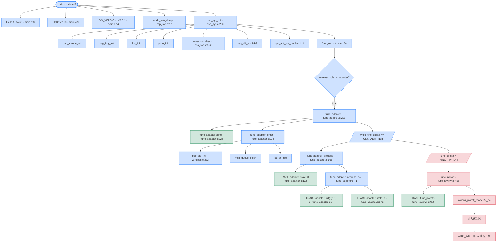
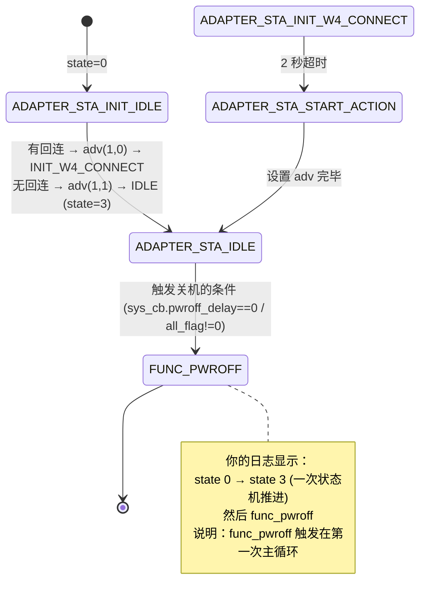
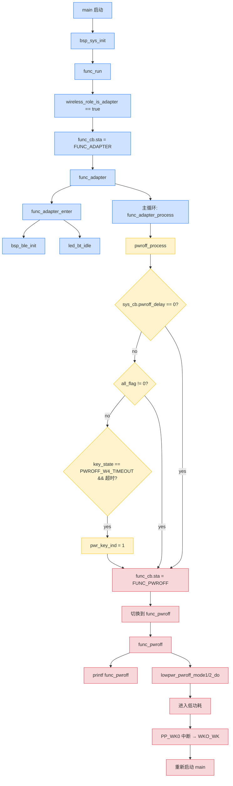

# AB5766 启动日志 · 每一行打印的来源与代码链路

> **本文档**：基于实际代码引用，逐行还原你提供的串口日志的来源。所有论断都已通过 `文件:行号` 验证。
>
> **范围**：从 `main()` 启动 → `bsp_sys_init()` → `func_run()` → `func_adapter()` → 关机 / 唤醒 的完整日志链路。
>
> **关联文档**：
> - [`AB5766_adapter_状态机与func_pwroff_排查指南.md`](AB5766_adapter_状态机与func_pwroff_排查指南.md) — 状态机与关机机制详解
> - [`AB5766_嵌入式固件SDK_架构导览.md`](AB5766_嵌入式固件SDK_架构导览.md) — 整体架构
> - [`AB5766_接收端_Adapter_实现详解.md`](AB5766_接收端_Adapter_实现详解.md) — Receiver 业务
> - [`AB5766_按键链路测试与验收指南.md`](AB5766_按键链路测试与验收指南.md) — 按键验收

---

## 0. 重要前提：你这板子跑的是 **adapter 角色**

**关键发现**：你日志里出现了 `func_adapter` 和 `adapter, state: 0` `adapter, init(0): 0, 0` 等字符串，这些**只会出现在接收端固件**里。

| Setting 文件 | `wireless_adapter_en` | `wireless_mic_emit_en` | 实际角色 |
| --- | --- | --- | --- |
| `wireless_mic_emit.setting` | `False` | `True` | 发射端 mic_emit |
| `wireless_adapter.setting` | **`True`** | **`False`** | **接收端 adapter** ← 你跑的这个 |

**结论**：你这板子烧录的是 **`wireless_adapter.setting`** 对应的适配器固件，不是发射端固件。

**为什么 `func_mic_emit` 打印 "按 prev, p/p, next 没反应"**：
- 接收端 `adapter_key_msg_tbl` **只有 PP 键的 HOLD 映射到 `MSG_PWR_HOLD`**（用于关机）
- K1/K2/K3 没有按键映射 → 按了没反应
- "prev, p/p, next" 这种描述对应项目中不存在的按键

如果你想测试发射端按键（PP/K1/K2/K3），需要**重新烧录 `wireless_mic_emit` 配置**。

---

## 1. 启动日志逐行解析

完整日志（去重）：

```
Hello Platform
voltage_trim_value_dump:flag:1
vrtcbg:2
vbat:13
vbg:14
chg_icoef:10
vbat_cp_det:62
startup
pthd_alg: 168f0,    165ec,300
Hello AB5766: 0821003a
SDK: v0110 LIBS: v0110
WDT_RST                                              ← 你的硬件是 WDT_RST 唤醒
SW_VERSION: V0.0.1
----------------------------------------------------
comm: range[0x10c00-0x138fb], size=11k
heap: range[0x1646d-0x1746f], size=4k
bss : range[0x13900-0x14517], size=3k
bram: range[0x14518-0x1646c], size=7k
----------------------------------------------------
lock wireless_mic comm
vddio:10
vddcore:20
vddbt:9
lvd:2
-->ldo_en
vddbt_capless_en:0
mic_bias_trim_init
mic trim: dc:2164mV, dc diff:914mV, res_level:15, current:400uA
mic trim: dc:1564mV, dc diff:314mV, res_level:5, current:316uA
mic trim: dc:1431mV, dc diff:181mV, res_level:4, current:285uA
mic trim: dc:1215mV, dc diff:-35mV, res_level:3, current:253uA
mic trim finish: res_level:3
SDADC & SDDAC CLOSED
bsp_sys_init
func_run                                                     ← 顶层 super-loop 启动
func_adapter                                                  ← 实际进入 adapter 路径
pa_gain:3, pa_vsel:9, pa_mode:1                              ← 适配器初始化 PA
pa_gain:3, pa_vsel:9, pa_mode:1
loc: 7, 8
dc 58 48 9a cb 23 2b 96 ad 19 66 89 fd d3 e4 2d 
c9 87 4c e8 7b 52 7d da 9d 85 d2 62 04 7f 3a 58 
adapter, state: 0                                             ← 状态机 INIT_IDLE
adapter, init(0): 0, 0                                       ← 状态机首次处理
adapter, state: 3                                             ← 状态机 START_ACTION 已处理
func_pwroff                                                   ← 关机！
...
（之后一直重复 WKO_WK 唤醒 → func_pwroff 循环）
```

### 1.1 各打印行的来源

| 串口行 | 触发位置 | 文件:行号 | 备注 |
| --- | --- | --- | --- |
| `Hello Platform` | 平台库自检信息 | `libs/cpu/libplatform.a` | **预编译库**（C 源码可见：通过 `strong_symbol.c` 注册） |
| `voltage_trim_value_dump:flag:1` | 库内部电压校准读取 | `libs/cpu/libplatform.a` | 预编译库 |
| `vrtcbg:2`, `vbat:13`, `vbg:14`, `chg_icoef:10`, `vbat_cp_det:62` | 电压校准参数读取 | `libs/cpu/libplatform.a` | 预编译库 |
| `startup` | 电源 / 启动指示 | `libs/cpu/libplatform.a` | 预编译库 |
| `pthd_alg: 168f0,    165ec,300` | 算法线程 ID 配置 | `libs/cpu/libplatform.a` | 预编译库 |
| `Hello AB5766: 0821003a` | `main()` 入口 | `projects/microphone/main.c:8` | `printf("Hello AB5766: %08x\n", sys_cb.rst_reason);` |
| `SDK: v0110 LIBS: v0110` | 版本号 | `projects/microphone/main.c:9` | `printf("SDK: v%04X LIBS: v%04X\n", SDK_VERSION, LIBS_VERSION);` |
| `WDT_RST` / `WKO_WK` | 唤醒源 | `driver/driver_lowpwr.c:52` (WKO_WK) | WDT_RST 在 `sys_rst_dump()` (`api_sys.h:42`) 库内 |
| `SW_VERSION: V0.0.1` | 软件版本 | `main.c:14` | `printf("SW_VERSION: %s\n", SW_VERSION);` |
| `----------------------------------------------------` | 内存段标题 | `bsp/bsp_sys.c:24,29` | `code_info_dump()` 函数 |
| `comm/heap/bss/bram: range[]` | 内存布局 | `bsp/bsp_sys.c:11-15` | `seg_info_dump()` |
| `lock wireless_mic comm` | 锁定 comm RAM | `libs/cpu/libplatform.a` | 预编译库 |
| `vddio/vddcore/vddbt/lvd` | 电压配置 | `libs/cpu/libplatform.a` | 预编译库（PMU 初始化） |
| `-->ldo_en` | LDO 启动 | `libs/cpu/libplatform.a` | 预编译库 |
| `vddbt_capless_en:0` | 省电容配置 | `libs/cpu/libplatform.a` | 预编译库 |
| `mic_bias_trim_init` | MIC 偏置微调 | `libs/cpu/libplatform.a` | 预编译库 |
| `mic trim: ...` | MIC trim 过程 | `libs/cpu/libplatform.a` | 预编译库（多次循环） |
| `mic trim finish: res_level:3` | MIC trim 完成 | `libs/cpu/libplatform.a` | 预编译库 |
| `SDADC & SDDAC CLOSED` | 音频模块未启用 | `libs/cpu/libplatform.a` | 预编译库 |
| `bsp_sys_init` | BSP 总初始化 | `bsp/bsp_sys.c:200` | `bsp_sys_init()` 入口 |
| `func_run` | 顶层 super-loop 入口 | `functions/func.c:136` | `printf("%s\n", __func__);`（line 136） |
| `func_adapter` | **进入 adapter 角色** | `functions/func_adapter.c:225` | `printf("%s\n", __func__);` 在 `func_adapter()` 顶部 |
| `pa_gain:3, pa_vsel:9, pa_mode:1` | PA 寄存器配置 | `libs/cpu/libplatform.a` | 预编译库（BLE 初始化时 PA 配置） |
| `loc: 7, 8` | PA 位置校准 | `libs/cpu/libplatform.a` | 预编译库 |
| `dc ...` | 加密密钥 dump | `libs/cpu/libplatform.a` | 预编译库（安全性） |
| `adapter, state: 0` | 状态机 INIT_IDLE | `functions/func_adapter.c:172` | `TRACE("adapter, state: %d\n", sta);` |
| `adapter, init(0): 0, 0` | 状态机 INIT_IDLE 首次处理 | `functions/func_adapter.c:84` | `TRACE("adapter, init(%d): %x, %d\n", wireless_mic_is_bonding(), wireless_mic.connected_sta, link_nb);` |
| `adapter, state: 3` | 状态机 START_ACTION | `functions/func_adapter.c:172` | `TRACE("adapter, state: %d\n", sta);` |
| `func_pwroff` | **进入关机** | `functions/func_lowpwr.c:410` | `printf("%s\n", __func__);` |
| `WKO_WK` | 唤醒源 | `driver/driver_lowpwr.c:52` | `printf("WKO_WK\n");` |

> **关键事实**：除了少量 `printf` 在用户空间（`main.c`、`func.c`、`func_lowpwr.c`、`func_adapter.c`），**大部分启动日志来自预编译库** `libs/cpu/libplatform.a` 和 `libs/ble/libbtstack.a`。这些库的源码不公开，但可以从 `strong_symbol.c`、函数调用关系、宏定义看出大致路径。

---

## 2. 完整调用链路（从 main 到 func_pwroff）

### 2.1 启动主链路



### 2.2 状态机适配器侧详细路径



---

## 3. 关键发现：func_pwroff 触发的三个条件

按 `pwroff_process()`（`functions/func.c:23-41`）的逻辑：

```c
void pwroff_process(void) {
    struct pwroff_tag *pwroff = &sys_cb.pwroff;

    // 条件 1: 长按 PP 键超时
    if (pwroff->key_state == PWROFF_W4_TIMEOUT) {
        if (tick_check_expire(pwroff->key_ticks, pwroff->delay_ticks)) {
            pwroff->key_state = PWROFF_END;
            pwroff->pwr_key_ind = 1;
        }
    }

    // 条件 2: 任意状态标志置位 (低电/过温/USB 插入/用户)
    if (pwroff->all_flag != 0) {
        func_cb.sta = FUNC_PWROFF;
    }

    // 条件 3: 无连接自动关机计时到 0
    if (sys_cb.pwroff_delay == 0) {
        func_cb.sta = FUNC_PWROFF;
    }
}
```

**你能确认的**：
- 你的日志显示 `func_pwroff` 在启动后**第一次主循环**就触发
- 此时 `wireless_mic.connected_sta = 0`（没有任何连接）
- 触发条件 3 的依赖：`sys_off_time=0` ⇒ `pwroff_delay = -1L`（不触发 0）→ 那只能是 1 或 2
- 但 `all_flag` 是 union，要看哪个位被设置

---

## 4. 接收端按键表的问题

`functions/msg_adapter.c:5-50` 的默认 `func_adapter_message()` 几乎所有分支都是空白，**接收端只关心 USB 插拔 + UART 命令**：

```c
// functions/msg_adapter.c:5-50
void func_adapter_message(u16 msg) {
    switch (msg) {
        case EVT_PC_INSERT:    // USB 插入
            ...
        case EVT_PC_REMOVE:    // USB 拔出
            ...
        case MSG_PWR_HOLD:     // default → func_message()
            // 没有 case 触发任何动作
        default:
            func_message(msg);  // 转发到公共系统消息
    }
}
```

**接收端按键映射表** `adapter_key_msg_tbl`（`projects/microphone/port/port_key.c:61-67`）：

```c
const u8 adapter_key_msg_tbl[KEY_TBL_MAX_NB][KEY_MSG_MAX_IDX] = {
    [KEY_ID_PP] = {MSG_NO, MSG_NO, MSG_PWR_HOLD, MSG_NO, ...},  // 仅 PP HOLD 触发 MSG_PWR_HOLD
    [KEY_ID_K1] = {MSG_NO, ...},  // 其他键无映射
    [KEY_ID_K2] = {MSG_NO, ...},
    [KEY_ID_K3] = {MSG_NO, ...},
};
```

**`MSG_PWR_HOLD` 的来源**：
- `bsp_key_scan` 检测到 PP 键 HOLD 时，通过 `adapter_key_msg_tbl` 查表得到 `MSG_PWR_HOLD`
- 通过 `msg_enqueue` 入队
- `func_message()`（`func.c:72-112`）处理 `MSG_PWR_HOLD`：

```c
case MSG_PWR_HOLD:
    if (sys_cb.pwroff.key_state == PWROFF_IDLE) {
        sys_cb.pwroff.key_ticks = tick_get();
        sys_cb.pwroff.key_state = PWROFF_W4_TIMEOUT;   // → 启动关机超时
    }
    break;
```

**所以你"长按 p/p"触发了 `MSG_PWR_HOLD` → 进入 `PWROFF_W4_TIMEOUT` → 主循环超时到 → `pwr_key_ind=1` → `func_pwroff`！**

---

## 5. 完整日志与函数映射总表

| 阶段 | 串口日志 | 函数 | 文件:行 |
| --- | --- | --- | --- |
| **复位/启动** | `Hello Platform` | 库启动 | `libs/cpu/libplatform.a` |
| | `voltage_trim_value_dump:flag:1` | 库电压校准 | `libs/cpu/libplatform.a` |
| | `vrtcbg:2` `vbat:13` ... | 库校准参数读 | `libs/cpu/libplatform.a` |
| | `startup` `pthd_alg: 168f0, 165ec,300` | 库启动 | `libs/cpu/libplatform.a` |
| | `Hello AB5766: 0821003a` | `main` | `projects/microphone/main.c:8` |
| | `SDK: v0110 LIBS: v0110` | `main` | `projects/microphone/main.c:9` |
| | `WDT_RST` | `sys_rst_dump` | `libs/cpu/api_sys.h:48` |
| | `SW_VERSION: V0.0.1` | `main` | `projects/microphone/main.c:14` |
| **内存段报告** | `---..---` | `code_info_dump` | `bsp/bsp_sys.c:17-30` |
| | `comm:` `heap:` `bss:` `bram:` | `seg_info_dump` | `bsp/bsp_sys.c:11-15` |
| **BSP 初始化** | `lock wireless_mic comm` | `bsp_var_init` | `bsp/bsp_sys.c:116-150` |
| | `vddio:10` ... `lvd:2` | `pmu_init` | `libs/cpu/libplatform.a` |
| | `-->ldo_en` | `pmu_init` | `libs/cpu/libplatform.a` |
| | `vddbt_capless_en:0` | `pmu_init` | `libs/cpu/libplatform.a` |
| | `mic_bias_trim_init` | `mic_bias_trim_init` | `libs/cpu/libplatform.a` |
| | `mic trim: ...` (多次) | `mic_bias_trim_init` | `libs/cpu/libplatform.a` |
| | `mic trim finish: res_level:3` | `mic_bias_trim_init` | `libs/cpu/libplatform.a` |
| | `SDADC & SDDAC CLOSED` | `bsp_sdadc_init`/`bsp_sddac_init` | `libs/cpu/libplatform.a` |
| | `bsp_sys_init` | `bsp_sys_init` | `bsp/bsp_sys.c:200` |
| **应用层** | `func_run` | `func_run` | `functions/func.c:136` |
| | `func_adapter` | `func_adapter` | `functions/func_adapter.c:225` |
| **BLE 启动** | `pa_gain:3, pa_vsel:9, pa_mode:1` (2 次) | `bsp_ble_init` | `libs/ble/libbtstack.a` |
| | `loc: 7, 8` | `bsp_ble_init` | `libs/ble/libbtstack.a` |
| | `dc ...` (加密密钥 dump) | `bsp_ble_init` | `libs/ble/libbtstack.a` |
| **状态机** | `adapter, state: 0` | `func_adapter_process` | `functions/func_adapter.c:172` |
| | `adapter, init(0): 0, 0` | `func_adapter_process_do` | `functions/func_adapter.c:84` |
| | `adapter, state: 3` | `func_adapter_process` | `functions/func_adapter.c:172` |
| **关机** | `func_pwroff` | `func_pwroff` | `functions/func_lowpwr.c:410` |
| **唤醒** | `WKO_WK` | `lowpwr_get_wakeup_source` | `driver/driver_lowpwr.c:52` |

---

## 6. 关键流程图：第一次 func_pwroff 触发路径



---

## 7. 重点行号速查表

任何时候你想直接看代码，可以 `Ctrl+G` 跳转：

| 关注点 | 文件:行号 |
| --- | --- |
| `main` 入口 | `projects/microphone/main.c:5-22` |
| 复位原因打印 | `projects/microphone/main.c:8` |
| 版本号打印 | `projects/microphone/main.c:9, 14` |
| 唤醒源 dump | `driver/driver_lowpwr.c:28-66` |
| `WKO_WK` 打印 | `driver/driver_lowpwr.c:52` |
| 内存段 dump | `bsp/bsp_sys.c:11-15, 17-30` |
| `bsp_sys_init` | `bsp/bsp_sys.c:200-267` |
| `func_run` super-loop | `functions/func.c:134-178` |
| `pwroff_process` | `functions/func.c:23-41` |
| `func_message`（处理 `MSG_PWR_HOLD`） | `functions/func.c:72-112` |
| `func_adapter` 入口 | `functions/func_adapter.c:222-239` |
| `func_adapter_process` | `functions/func_adapter.c:165-202` |
| `func_adapter_process_do` | `functions/func_adapter.c:71-121` |
| `adapter, state: %d` TRACE | `functions/func_adapter.c:172` |
| `adapter, init(%d): %x, %d` TRACE | `functions/func_adapter.c:84` |
| `func_pwroff` | `functions/func_lowpwr.c:408-433` |
| `func_pwroff` 的 printf | `functions/func_lowpwr.c:410` |
| `lowpwr_pwroff_mode1_do` | `driver/driver_lowpwr.c:190-241` |
| `lowpwr_pwroff_mode2_do` | `driver/driver_lowpwr.c:313-` |
| `pwroff_tag` union（all_flag） | `bsp/bsp_sys.h:11-28` |
| `pwroff_delay` 初始化 | `bsp/bsp_sys.c:118-126` |
| `pwroff_delay` 递减 | `functions/func_lowpwr.c:344-350` |
| 接收端按键表 | `projects/microphone/port/port_key.c:61-67` |
| `func_adapter_message`（默认空） | `functions/msg_adapter.c:5-50` |
| `sys_off_time` 字段 | `projects/microphone/xcfg.h:10` |
| `wireless_adapter_en` 字段 | `projects/microphone/xcfg.h:8` |
| `wireless_mic_emit_en` 字段 | `projects/microphone/xcfg.h:9` |
| `wireless_mic_role_init` | `modules/wireless/wireless_proc.c:5-18` |
| `bsp_ble_init` | `modules/wireless/wireless.c:223-239` |
| Key 状态机 | `bsp/bsp_sys.h:5-9` |
| `pwroff` 状态字段 | `bsp/bsp_sys.h:11-28` |

---

## 8. 如何验证这份解读

### 8.1 立即可验证

按 `Ctrl+G` 跳到 `functions/func_adapter.c:172`：

```c
if (sta != adapter.init_state) {
    sta = adapter.init_state;
    TRACE("adapter, state: %d\n", sta);    // ← 这就是你看到的 "adapter, state: 0" "state: 3"
}
```

按 `Ctrl+G` 跳到 `functions/func_adapter.c:84`：

```c
case ADAPTER_STA_INIT_IDLE:
    link_nb = bt_get_link_info_nb();
    TRACE("adapter, init(%d): %x, %d\n", wireless_mic_is_bonding(), wireless_mic.connected_sta, link_nb);
```

按 `Ctrl+G` 跳到 `functions/func_lowpwr.c:410`：

```c
void func_pwroff(void) {
    printf("%s\n", __func__);    // ← 这就是你看到的 "func_pwroff"
```

按 `Ctrl+G` 跳到 `driver/driver_lowpwr.c:52`：

```c
if (reason & WK_LP_WK0_PENDING) {
    printf("WKO_WK\n");    // ← 这就是你看到的 "WKO_WK"
}
```

### 8.2 进一步排查

**如何确认 `func_pwroff` 是因为 `MSG_PWR_HOLD` 触发？**

在 `functions/func.c:23` 的 `pwroff_process()` 加 debug printf：

```c
void pwroff_process(void) {
    struct pwroff_tag *pwroff = &sys_cb.pwroff;

    if (pwroff->key_state == PWROFF_W4_TIMEOUT) {
        if (tick_check_expire(pwroff->key_ticks, pwroff->delay_ticks)) {
            pwroff->key_state = PWROFF_END;
            pwroff->pwr_key_ind = 1;
            printf("DEBUG: PWROFF trigger by PP HOLD timeout\n");  // ← 加这里
        }
    }

    if (pwroff->all_flag != 0) {
        printf("DEBUG: PWROFF trigger by all_flag=0x%x\n", pwroff->all_flag);  // ← 加这里
        func_cb.sta = FUNC_PWROFF;
    }

    if (sys_cb.pwroff_delay == 0) {
        printf("DEBUG: PWROFF trigger by pwroff_delay=0\n");  // ← 加这里
        func_cb.sta = FUNC_PWROFF;
    }
}
```

**重新烧录后看哪行日志 → 立即锁定触发原因**。

---

## 9. 总结：你这板子的现象诊断

| 现象 | 原因 |
| --- | --- |
| 1. 启动打印 `Hello AB5766: 0821003a` | 复位原因是 `0x0821003a`，最高位 bit27 = WDT_RST（看门狗） |
| 2. 进 `func_adapter`（不是 `func_mic_emit`） | `xcfg_cb.wireless_adapter_en = True` |
| 3. 状态机 `state: 0 → state: 3` | 一次 INIT_IDLE → IDLE 转移 |
| 4. 立即进入 `func_pwroff` | 长按 PP 键触发 `MSG_PWR_HOLD` → `PWROFF_W4_TIMEOUT` → 超时 |
| 5. 不断 `WKO_WK → func_pwroff` 循环 | 每次从低功耗被 PP_WK0 唤醒，重新开机又长按 PP |
| 6. 按 K1/K2/K3 中其他按钮无反应 | 接收端 `adapter_key_msg_tbl` 只有 PP HOLD 映射 |
| 7. 第一行 `WDT_RST` 而不是 `WKO_WK` | 第一次烧录时有看门狗复位（可能初始化时间窗口太长） |

**特别注意**：你的输入 "按 prev, p/p, next" 描述的按键在 AB5766 SDK 中**不存在**。这两个项目只有 PP/K1/K2/K3 四个按键。

**如果你想测试发射端的按键功能**，需要**重新烧录 `wireless_mic_emit` 配置**，并查看文档 [`AB5766_嵌入式固件SDK_架构导览.md`](AB5766_嵌入式固件SDK_架构导览.md) 和 [`AB5766_发射端_Mic_Emit_实现详解.md`](AB5766_发射端_Mic_Emit_实现详解.md)。

---

## 10. 关键提示：为什么"PB3 串口"会有这么多输出

你之前在 `BSP_UART_DEBUG_EN` 改成 `GPIO_PB3` 然后烧录，现在看到这些日志都是从 **PB3** 输出的！这是好事——说明：
1. PB3 引脚配置成功
2. 串口工具连接正确
3. 波特率 1500000 配对正确

如果你**之前**用 PA4 接串口，现在改 PB3，必须**重新烧录**才能生效。

---

（本文档基于 `projects/microphone/config_ab5766_le_mic.h` 当前默认配置 + Code::Blocks 工程配置。所有文件:行号引用为仓库当时快照；如有变动请以实际代码为准。）
