# AB5766 嵌入式固件 SDK 架构导览（写给小白的分层指南）

> **文档定位**：入门到中级之间，**补足**"导航"(`AB5766_LE_Mic_新手开发指南.md`)与"业务实现"(`AB5766_发射端_Mic_Emit_实现详解.md` / `AB5766_接收端_Adapter_实现详解.md`)之间的空档。
>
> **读完后能**：看懂目录结构、知道每一层做什么、能照葫芦画瓢地修改小功能（新增按键、新增算法、配置新方案）。
>
> **前置知识**：C 语言基础（指针、结构体、宏）+ 一点单片机概念（中断、寄存器）。
>
> **配套文档**：
> - 入门导航：[`AB5766_LE_Mic_新手开发指南.md`](AB5766_LE_Mic_新手开发指南.md)
> - 发射端实现：[`AB5766_发射端_Mic_Emit_实现详解.md`](AB5766_发射端_Mic_Emit_实现详解.md)
> - 接收端实现：[`AB5766_接收端_Adapter_实现详解.md`](AB5766_接收端_Adapter_实现详解.md)
> - 验收：[`AB5766_按键链路测试与验收指南.md`](AB5766_按键链路测试与验收指南.md)、[`AB5766_无线麦克风_双板连接与LED测试指南.md`](AB5766_无线麦克风_双板连接与LED测试指南.md)

---

## 第一篇 开篇与全景图

### 第 1 章 · 写给小白的开场白

**你好，欢迎来到 AB5766 嵌入式固件的世界。**

如果你点开仓库，看到 `header/`、`driver/`、`bsp/`、`modules/`、`functions/`、`os/` 一堆文件夹，**目录路径基本都看不懂**，那么这份文档就是为你准备的。

我会带你：

1. **认识 SDK 的五层架构**（HAL → Driver → BSP → Module → Application）
2. **理解每一层做什么**（用真实的代码片段作为例子）
3. **看清一次按键、一帧音频在 SDK 中如何流转**（带图示）
4. **学会照葫芦画瓢改小功能**（4 个实战示例）

最后会带你了解 **OSAL 操作系统抽象层**、**STRONG/WEAK 符号覆盖**、**AT() 段属性宏**（这些名词听起来高大上，但其实就是解决具体工程问题的工具）。

> **提示**：本教程的所有代码引用都用 `文件:行号` 标注，可以直接 `Ctrl+G` 跳转到源代码阅读。

### 第 2 章 · 嵌入式 SDK 是什么？为什么要分层？

**什么是 SDK？**

SDK（Software Development Kit）是芯片厂商提供的"软件工具箱"。它包含：

- **可重用的代码库**：别人写好的音频处理、蓝牙协议栈、按键扫描等
- **抽象接口**：把"操作寄存器"包装成"调函数"，让上层不用关心硬件细节
- **构建工具**：编译器选项、链接脚本、烧录脚本

**为什么要分层？想象你在搭乐高积木：**

| 不分层 | 分层 |
|---|---|
| 业务代码直接操作寄存器 | 业务代码只调 `bsp_*_init()` 这种高层接口 |
| 换芯片要重写所有业务 | 换芯片只改 `driver/` + `bsp/` |
| 算法代码与硬件耦合 | 算法只调标准 `audio_callback_t` 回调 |
| 不可复用 | 算法可以跨产品复用 |

**分层最大收益**：**换芯片不动业务，换业务不动底层**。

AB5766 这套 SDK 也是按照这套"乐高"思想组织的。你打开 `header/include.h` 就能看到整个 SDK 的"总目录"：

```c
// header/include.h:1-24
#include "global.h"       // 基础类型
#include "xcfg.h"         // 产测配置
#include "config.h"       // 产品配置

#include "api.h"          // SDK 公共 API
#include "bsp.h"          // BSP 层头
#include "func.h"         // 应用层头
#include "driver_com.h"   // 驱动层头
#include "modules.h"      // 模块层头
```

**包含顺序即分层顺序**——这本身就是 SDK 给我们立的"规矩"。

### 第 3 章 · 一张图看懂 AB5766 SDK 的五层架构

打开 `header/include.h`，你会发现 SDK 包含四个核心层 + 一个 OSAL 横向贯穿 + 一套 STRONG/WEAK 横向覆盖机制：

```mermaid
flowchart TB
    subgraph app["应用层 functions/"]
        func_run[func_run<br/>func.c:134]
        func_mic_emit[func_mic_emit<br/>func_mic_emit.c:212]
        func_adapter[func_adapter<br/>func_adapter.c:222]
        msg_dispatch[msg_mic_emit.c / msg_adapter.c<br/>消息分派]
        func_run --> func_mic_emit
        func_run --> func_adapter
        func_mic_emit --> msg_dispatch
        func_adapter --> msg_dispatch
    end
    subgraph mod["模块层 modules/"]
        wireless[wireless/<br/>mic_proc.c 无 mic 编码 + RX 解码]
        audio[audio/<br/>EQ/DRC/soft_gain/dac0_out]
        voice[voice/<br/>echo/magic/plc 等算法]
        codec[codec/<br/>lc3s 编解码]
        wireless --> audio
        wireless --> voice
        wireless --> codec
    end
    subgraph bsp["BSP 层 bsp/"]
        bsp_sdadc[bsp_sdadc.c<br/>SDADC 板级适配]
        bsp_key[bsp_key.c<br/>按键扫描]
        bsp_sys[bsp_sys.c<br/>系统初始化入口]
        bsp_sdadc --> bsp_sys
        bsp_key --> bsp_sys
    end
    subgraph drv["驱动层 driver/"]
        driver_sdadc[driver_sdadc.c<br/>SDADC 寄存器操作]
        driver_keyscan[driver_keyscan.c<br/>KEYSCAN 寄存器操作]
        driver_clk[driver_clk.c<br/>时钟门控]
        driver_sdadc --> driver_clk
        driver_keyscan --> driver_clk
    end
    subgraph hal["HAL 层（最底层）"]
        sfr[sfr.h<br/>SFR 寄存器地址表]
        sdadc_typedef[sdadc_typedef<br/>typedef 结构体包装 SFR]
        driver_sdadc --> sdadc_typedef
        driver_keyscan --> sdadc_typedef
        sdadc_typedef --> sfr
    end
    subgraph osal["OSAL 层 os/ + libs/cpu"]
        os_thread[os_thread.h<br/>thread_alg.c thread_dec.c]
        api_msg[api_msg.h<br/>消息队列]
        api_sdadc[api_sdadc.h<br/>线程 kick 投递]
    end
    app -.调用.-> mod
    app -.调用.-> bsp
    bsp --> drv
    drv --> hal
    mod -.使用.-> osal
    bsp -.使用.-> osal
    classDef appc fill:#cfe2ff,stroke:#0d6efd
    classDef modc fill:#d1e7dd,stroke:#198754
    classDef bspc fill:#fff3cd,stroke:#ffc107
    classDef drvc fill:#f8d7da,stroke:#dc3545
    classDef halc fill:#e2e3e5,stroke:#6c757d
    classDef osalc fill:#fce4ec,stroke:#c2185b
    class func_run,func_mic_emit,func_adapter,msg_dispatch appc
    class wireless,audio,voice,codec modc
    class bsp_sdadc,bsp_key,bsp_sys bspc
    class driver_sdadc,driver_keyscan,driver_clk drvc
    class sfr,sdadc_typedef halc
    class os_thread,api_msg,api_sdadc osalc
```

**怎么读这张图？**

- **纵向箭头 = 依赖方向**：上层只能调下层，不能反过来
- **应用层** 用 `functions/` 下的状态机
- **模块层** 在 `modules/` 下，按"领域"组织（音频、语音、编解码等）
- **BSP 层** 在 `bsp/` 下，把 HAL 封装成"板级功能"
- **驱动层** 在 `driver/` 下，每个外设一个 .c
- **HAL 层** 即 `header/sfr.h` 中的寄存器地址定义 + `driver_xxx.h` 中的 `typedef` 包装
- **OSAL 层**（右侧）横向贯穿，提供消息队列、线程间异步投递

> **新手常见误区**：直接把 `bsp_key_scan()` 当作"最简单的 API"——其实它内部已经调用了 `driver_keyscan.c` + SARADC ADC + 5ms 定时器 + 消息队列 + 状态机分派，是横跨四层的"集成产物"。

### 第 4 章 · 仓库目录速览

下面这张表让你一打开仓库就知道每个文件夹是干什么的。

| 目录 | 职责 | 关键文件举例 |
|---|---|---|
| `header/` | 公共类型、宏、聚合头文件 | `typedef.h`（u8/u16/u32）、`macro.h`（AT() 宏）、`sfr.h`（寄存器地址）、`include.h`（融合头） |
| `driver/` | 寄存器级 HAL（每个外设一个 .c） | `driver_sdadc.c`、`driver_sddac.c`、`driver_uart.c`、`driver_keyscan.c`、`driver_clk.c` 等 24 个 |
| `bsp/` | 板级支持包（组合 driver） | `bsp_sys.c`、`bsp_sdadc.c`、`bsp_key.c`、`bsp_led.c`、`bsp_charge.c` 等 19 个 |
| `modules/` | 可复用协议 + 算法 | `wireless/`（D2A 协议）、`audio/`（EQ/DRC/增益）、`voice/`（7 种语音算法）、`codec/`（lc3s）、`effect/`、`device/`、`tool/` |
| `functions/` | 应用层状态机 | `func.c`（super-loop）、`func_mic_emit.c`、`func_adapter.c`、`msg_mic_emit.c`、`msg_adapter.c` |
| `os/` | 轻量级线程抽象 | `os_thread.h`、`thread_alg.c`、`thread_dec.c` |
| `projects/microphone/` | 项目入口 + 配置 + 链接脚本 | `main.c`、`config.h`、`config_ab5766_le_mic.h`、`xcfg.h`、`ram.ld`、`app.cbp`、`strong_symbol.c`、`strong_ble.c`、`port/port_key.c` |
| `libs/` | 预编译静态库（不要改） | `libbtstack.a`（BLE 协议栈）、`libplatform.a`、`libm.a`、`libc.a`、`libgcc.a` |
| `docs/` | 中文文档 | `SDK/` 5 份文档 + `plan/` 实施计划 |

**`libs/cpu/api_*.h`** 是 HAL 的"墙头"——库对外暴露的 17 个 API 头：
- `api_msg.h`（消息队列）
- `api_sdadc.h` / `api_sddac.h`（音频 ADC/DAC）
- `api_usb.h`（USB Device）
- `api_codec.h`（编解码）
- `api_pwr.h`（功耗）
- `api_flash.h`（Flash 读写）
- `api_sys.h` / `api_sysclk.h`（系统时钟）
- `api_pacc.h`（PACC 硬件加速器）
- `api_interrupt.h`（中断）
- `api_os.h` / `api_key.h`（OS/按键）
- `api_smoke.h`（冒烟测试）
- `api_update.h`（OTA）
- `api_cm.h`（CM 参数区）
- `api_list.h`（链表）

**这 17 个 .h 是 SDK 的"对外合同"**——你的应用代码只能调用这里声明的函数，不能直接访问 SFR。

---

## 第二篇 自底向上：五层逐层拆解

### 第 5 章 · HAL 层：直接和芯片寄存器对话的"指尖"

**HAL（Hardware Abstraction Layer）** 是最底层。它解决两个问题：

1. **把寄存器地址抽象成 C 结构体**——让代码可读
2. **提供一组"只做一件事"的函数**——让上层不用关心寄存器细节

**案例：`driver_sdadc.c`（SDADC = Sigma-Delta ADC，麦克风采样）**

```c
// header/sfr.h:25-30  寄存器地址定义
#define SFR_BASE   0x00000100
#define SFR0_BASE  (SFR_BASE + 0x000)
#define SFR1_BASE  (SFR_BASE + 0x100)
#define SFR2_BASE  (SFR_BASE + 0x200)
...

// driver/driver_sdadc.h:18-30  typedef 把寄存器"打包"成结构
typedef struct {
    volatile unsigned long CON;        // SDADC_CON 寄存器
    volatile unsigned long DMA_ADR;    // SDADC DMA 地址
    volatile unsigned long DMA_CNT;    // SDADC DMA 计数
    volatile unsigned long DMA_PEND;   // SDADC DMA 完成 pending
    // ... 其它字段
} sdadc_typedef;

// driver/driver_sdadc.c:194-201  HAL 函数只做一件事
AT(.com_text.sdadc.isr)
void sdadc0_cmd(SDADC_REG_TYPEDEF *sdadc, u8 en) {
    if (en) {
        sdadc->CON |= SDADC0CON_ADC0_EN;   // 打开 ADC0 通道
    } else {
        sdadc->CON &= ~SDADC0CON_ADC0_EN;  // 关闭 ADC0 通道
    }
}
```

**关键观察**：

| 特征 | 体现 |
|---|---|
| **HAL 不知 OS** | 没有 `delay`、没有 `semaphore`、没有上下文切换 |
| **HAL 不带业务** | `sdadc0_cmd` 只置/清一个 `ADC0_EN` 位，不关心是麦克风还是电子烟 |
| **HAL 不可重入** | `sdadc->CON |= BIT` 不是原子操作，调用方需自行保证临界区 |
| **HAL 一致结构** | 每个 `driver_xxx.h` 都暴露一个 `xxx_typedef *` 结构体 |

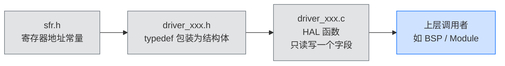

> **新手误区**：在 HAL 函数里调 `printf`！这会调用 UART 驱动，可能形成循环依赖或阻塞 ISR。HAL 必须保持纯净。

### 第 6 章 · Driver 层：29 个驱动的"小工具箱"

**Driver 层** 提供"外设控制台"。本项目里 Driver 和 HAL 合并（每个 .c 既定义 typedef 又写函数），这是嵌入式常见做法。

`driver/` 下 24 个 `.c` 按功能分桶：

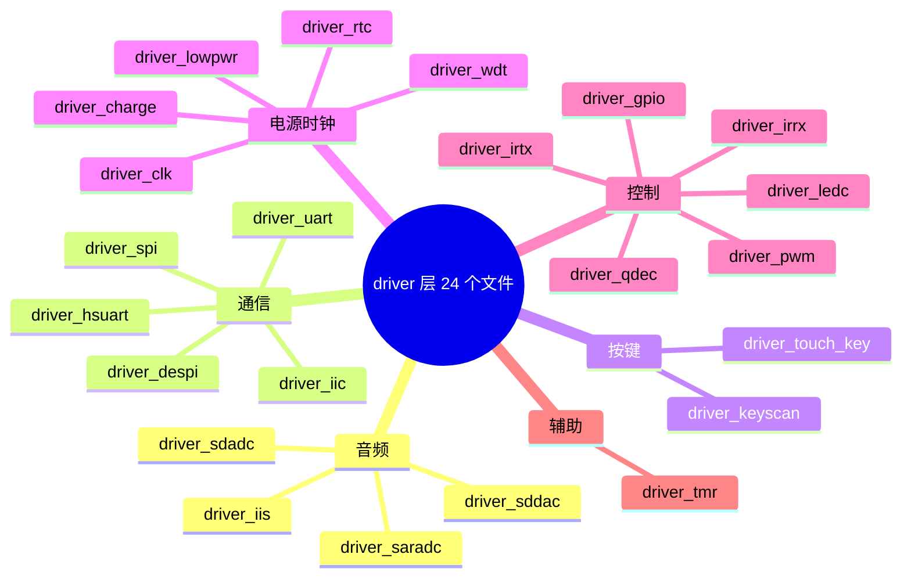

**有哪些"知名"驱动？**

| 驱动 | 作用 | 在 SDK 中出现的位置 |
|---|---|---|
| `driver_sdadc.c` | 麦克风 ADC 采样 | `bsp_sdadc.c` 调 |
| `driver_sddac.c` | 喇叭 DAC 输出 | `bsp_sddac.c` 调 |
| `driver_keyscan.c` | 硬件按键扫描 | `bsp_key.c` 调 |
| `driver_uart.c` | 通用 UART | `bsp_uart_debug.c` 调 |
| `driver_clk.c` | 时钟门控 | 几乎所有驱动调 |

**Driver 层的"风格"：**

```c
// driver/driver_sdadc.c:194-201  典型 Driver 函数
void sdadc0_cmd(SDADC_REG_TYPEDEF *sdadc, u8 en) {
    if (en) {
        sdadc->CON |= SDADC0CON_ADC0_EN;
    } else {
        sdadc->CON &= ~SDADC0CON_ADC0_EN;
    }
}

// driver/driver_sdadc.c:234-264  典型 Driver 初始化
void sdadc_pic_config(SDADC_REG_TYPEDEF *sdadc,
                      sdadc_isr_callback cb,
                      int pr, u32 flags, u8 en) {
    sdadc->CON = (sdadc->CON & ~BIT(1)) | (pr & 0x1) << 1;
    sdadc_isr_cb = cb;                    // 保存 ISR 回调
    // ... 详细 SFR 配置
}
```

每个 Driver 的"标准三件套"：

1. **结构体 typedef**（如 `sdadc_typedef`）
2. **寄存器初始化函数**（如 `sdadc_init` / `sdadc_ana_init`）
3. **运行时操作函数**（如 `sdadc0_cmd` / `sdadc_dma_cmd` / `sdadc_get_flag`）

> **新手建议**：刚开始不要试图读懂所有 Driver 的 SFR 配置。**只关注函数名和参数即可**——能看懂"调哪个函数能做什么"就够了。

### 第 7 章 · BSP 层：把 HAL 装成"功能模块"的工程师

**BSP（Board Support Package）** 是把"裸 Driver"装成"功能模块"的关键。它做三件事：

1. **配置 HAL 时钟**
2. **注册 ISR 回调**
3. **管理 DMA 缓冲**

**教科书案例：`bsp/bsp_sdadc.c:55 bsp_sdadc_init()` 是 5 步标准流程：**

```c
// bsp/bsp_sdadc.c:55-105  完整初始化流程
void bsp_sdadc_init(void) {
    sdadc_init_typedef sdadc_cfg_init;
    sdadc_ana_cfg_typedef sdadc_ana_cfg;

    // 步骤 1: 注册算法回调（"数据采完调我"）
    sdadc_done_callback_set(sdadc_proc_cb);                    // line 60

    // 步骤 2: 开 HAL 时钟
    clk_gate0_cmd(CLK_GATE0_SDADC, CLK_EN);                   // line 62
    clk_sdadda_clk_set(CLK_SDADDA_CLK48_A);                   // line 63

    // 步骤 3: 用 HAL 接口配置参数
    sdadc_cfg_init.adc_mode = SDADC_MODE_MIC;                  // line 65
    sdadc_cfg_init.sample_rate = WIRELESS_MIC_SAMPLE_RATE_SELECT;
    sdadc_cfg_init.dig_gain = dig_gain_tbl[MIC_DIG_GAIN];
    sdadc_init(SDADC_REG, &sdadc_cfg_init);                    // line 88
    sdadc_ana_cfg.adc_mode = MIC_ANA_MODE;
    sdadc_ana_init(&sdadc_ana_cfg);                             // line 96

    // 步骤 4: 启动 DMA + 注册 ISR
    sdadc_w4_kick = true;
    sdadc_pic_config(SDADC_REG, sdadc_isr_cb, 0,
                     SDADC_FLAG_DMA_HALF_DONE | SDADC_FLAG_DMA_ALL_DONE, ENABLE);  // line 100
    sdadc_dma_cmd(SDADC_REG, (u32)sdadc_buf, SDADC_DMA_SIZE-1,
                 DMA_DATA_MODE_16BITS, ENABLE);                // line 101

    // 步骤 5: 启动时基同步
    wl_tick_time_init();                                       // line 102
}
```

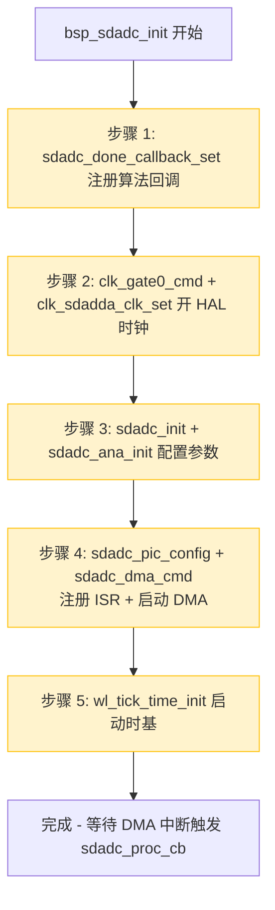

**BSP 全家桶（19 个文件）**

| 文件 | 作用 |
|---|---|
| `bsp_sys.c` | 系统初始化总入口（`bsp_sys_init()`） |
| `bsp_key.c` | 按键扫描 + 消息队列投递 |
| `bsp_sdadc.c` / `bsp_sddac.c` | 麦克风采集 / 喇叭输出 |
| `bsp_saradc.c` / `bsp_saradc_key.c` / `bsp_saradc_vbat.c` | SARADC 通用 / 按键 / 电池电压 |
| `bsp_led.c` / `bsp_pwm.c` / `bsp_tone.c` | LED、蜂鸣器、提示音 |
| `bsp_charge.c` | 充电管理 |
| `bsp_uart_debug.c` / `bsp_uart_transfer.c` | 调试 UART / 数据传输 UART |
| `bsp_param.c` | Flash 参数读写 |
| `bsp_io_key.c` | IO 矩阵按键 |
| `bsp_irrx.c` / `bsp_irtx.c` | 红外接收 / 发射 |
| `bsp_huart.c` | 高速 UART |
| `bsp_le_dut.c` | BLE DUT 测试 |
| `bsp_iis.c` | IIS 音频总线 |

**BSP 与 Driver 的边界**：

```c
// BSP 函数（bsp_sdadc.c）
void bsp_sdadc_init(void);     // 高级、板级初始化
void bsp_sdadc_kick(void);     // 启动 DMA 采集

// Driver 函数（driver_sdadc.c）
void sdadc_init(SDADC_REG_TYPEDEF *sdadc, sdadc_init_typedef *cfg);
void sdadc_ana_init(sdadc_ana_cfg_typedef *cfg);
```

**判断标准**：

- **BSP 函数**：接收"业务级参数"（如 `WIRELESS_MIC_SAMPLE_RATE_SELECT`），内部调多个 HAL/Driver 函数
- **Driver 函数**：只操作一个外设，不关心业务

### 第 8 章 · Module 层：算法的"小工厂"

**Module 层** 是 SDK 的"业务工具箱"。每个 Module 通常是一个"独立问题域"：

| 子目录 | 业务 | 典型 API |
|---|---|---|
| `modules/wireless/` | 无线麦协议（D2A = Device To Adapter） | `bsp_ble_init()`、`mic_emit_init()`、`adapter_init()` |
| `modules/audio/` | 音频处理（DAC、EQ、增益） | `dac0_out_init()`、`soft_gain_init()` |
| `modules/voice/` | 7 种语音算法 | `echo_audio_init()`、`magic_audio_init()` |
| `modules/codec/` | 编解码 | `lc3s_enc()` / `lc3s_dec()` |
| `modules/effect/` | 音效表管理 | `mic_effect_load()` |
| `modules/device/` | 设备去抖 | `dev_init()`、`dev_online_filter()` |
| `modules/tool/` | 工具集（调音、调试） | `toolkit_process()` |

**Module 层**采用统一的 **"init/proc/reset" 三段式 API**：


**这套设计的妙处**：Module 内部所有算法都被统一管理。打开 `modules/wireless/mic_proc.c:597-675`，你看到的是这样：

```c
void mic_emit_init(void) {
    memset(&mic_enc, 0x00, sizeof(mic_enc));           // 602
    mic_enc.first_pkt = true;                          // 603
    param_mic_mute_level_read(&mic_enc.mute_en);       // 605

#if WIRELESS_MIC_32K_EN
    src_init(0, 32000, 48000);                        // 629  32k → 48k 重采样
#endif
#if WIRELESS_MIC_ECHO_EN
    echo_audio_init(0, samples, 1);                   // 637
#endif
#if WIRELESS_MIC_MAGIC_EN
    magic_audio_init(0, samples);                     // 641
#endif
// ... 其它算法 init
    bsp_sdadc_init();                                  // 669
}
```

**每个算法都用 `#if XXX_EN` 宏守护**——关闭特性就不参与编译，节省 Flash 空间。

### 第 9 章 · Application 层：状态机 + super-loop + 消息机制

**Application 层** 是 SDK 的"大脑"。它做四件事：

1. **决定当前工作模式**（发射端 / 接收端 / 低电）
2. **轮询各个模块**（状态机主循环）
3. **接收消息**（按键、低电等事件）
4. **分发消息**（执行具体动作）

**核心：`functions/func.c:134 func_run()` 是永不返回的 super-loop。**

```c
// functions/func.c:134-178  顶层状态机
void func_run(void) {
    if (wireless_role_is_adapter()) {       // 行 138
        func_cb.sta = FUNC_ADAPTER;          // 接收端
    } else {
        func_cb.sta = FUNC_MIC_EMIT;         // 发射端
    }

    while (1) {                              // 死循环
        func_enter();                        // 进入新功能前初始化
        switch (func_cb.sta) {
            case FUNC_MIC_EMIT:  func_mic_emit(); break;   // 行 153
            case FUNC_ADAPTER:   func_adapter();  break;   // 行 158
            case FUNC_PWROFF:    func_pwroff();   break;   // 行 170
            // ... 其他模式
        }
    }
}
```

**进入模式前 = `func_enter()`**：

```c
// functions/func.c:115-125
void func_enter(void) {
    bsp_param_sync();                                   // 同步参数到 Flash
    lowpwr_sleep_delay_reset();                         // 重置睡眠延时
    lowpwr_pwroff_delay_reset();                        // 重置关机延时
    key_set_msg_tbl(func_info[func_cb.sta].msg_tbl);    // 装入该模式的按键表
}
```

注意 `key_set_msg_tbl(...)` —— **不同模式用不同的按键表**！发射端有 PP/K1/K2/K3 四键，接收端只需要 PP 键。

**模式内主循环（以发射端为例）：**

```c
// functions/func_mic_emit.c:212-227
void func_mic_emit(void) {
    func_mic_emit_enter();                  // 初始化（清队列、bsp_ble_init）
    while (func_cb.sta == FUNC_MIC_EMIT) {
        func_mic_emit_process();            // 状态机推进 + 协议栈 tick
        u16 msg = msg_dequeue();           // 取出消息
        if (msg != MSG_NO) {
            func_mic_emit_message(msg);     // 分派消息
        }
    }
    func_mic_emit_exit();                   // 退出清理
}
```

**状态机切换示例**：

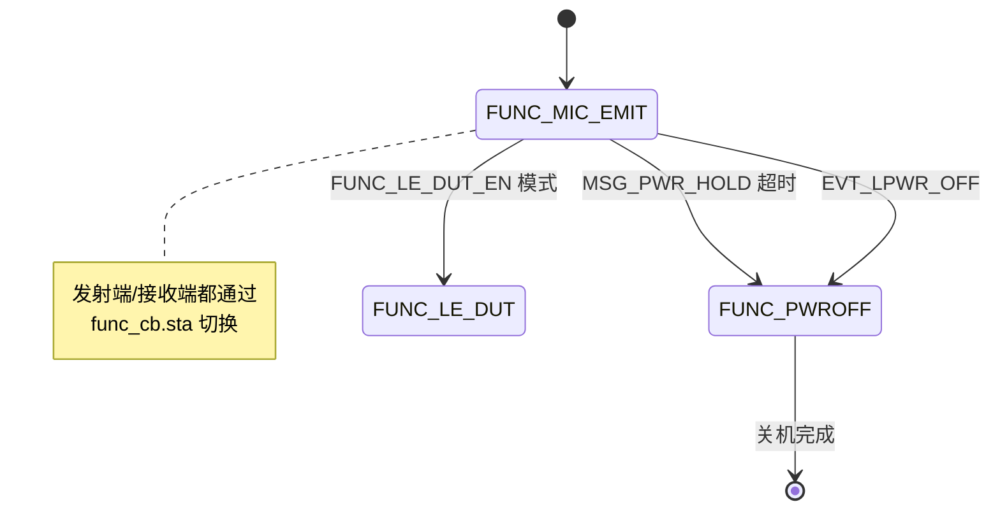

**func_mic_emit_message 消息分派**（`functions/msg_mic_emit.c:5-135`）：

- `MSG_VOL_UP` → `soft_gain_up()` + 同步给接收端
- `MSG_VOL_DOWN` → `soft_gain_down()` + 同步给接收端
- `MSG_PWR_HOLD` → 开始关机计时
- `MSG_ECHO_LEVEL_UP` → `echo_delay_level_up()` + 同步给接收端
- ...

`func_mic_emit_message` 是一个 `switch(msg)` 结构，每个 case 分派一个动作。这种设计叫 **"消息驱动"**。

### 第 10 章 · OSAL 层：两个"伪线程" + kick 宏投递

**OSAL（Operating System Abstraction Layer）** 是嵌入式 SDK 的"伪操作系统"。AB5766 是个 RISC-V 芯片，**没有 RTOS**，但通过 `os/` 目录模拟出"线程"概念。

**伪线程三件套**：

```c
// os/os_thread.h:5-19  消息枚举 + kick 宏
enum {
    MSG_MIC_DEC0 = 0,         // 接收端解码线程消息（第 0 通道）
    MSG_MIC_DEC1,             // 接收端解码线程消息（第 1 通道）
    MSG_MIC_AINS4_32K,        // 算法线程消息
};

void mic_dec_kick_cb(u8 msg);              // 接收端解码 kick 回调
void mic_alg_kick_cb(u8 msg);              // 算法 kick 回调

#define kick_dec_prio_trans(idx)           mic_dec_kick_cb(MSG_MIC_DEC0 + (idx))
#define robotization_mic_proc_kick_start()  mic_alg_kick_cb(MSG_MIC_ROBOTIZATION)
#define ains4_32k_mic_proc_kick_start()     mic_alg_kick_cb(MSG_MIC_AINS4_32K)
```

**两个"线程"是什么？**

```c
// os/thread_dec.c:4-20  接收端解码线程
AT(.com_text.adapter.proc.thread)
void thread_dec_proc_msg_cb(u32 msg) {
    switch (msg) {
        case MSG_MIC_DEC0:
            mic_dec_prco_cb(0);    // 通道 0 解码
            break;
        case MSG_MIC_DEC1:
            mic_dec_prco_cb(1);    // 通道 1 解码
            break;
    }
}

// os/thread_alg.c:4-31  算法线程
AT(.com_text.thread)
void thread_alg_proc_msg_cb(u32 msg) {
    switch (msg) {
        case MSG_MIC_AINS4_32K:
            ains4_32k_mic_proc_cb();
            break;
#if ROBOTIZATION_EN
        case MSG_MIC_ROBOTIZATION:
            robotization_mic_proc_cb();
            break;
#endif
    }
}
```

**为什么需要"伪线程"？**

假设 BLE 中断里调用 `mic_dec_prco_cb()`（这个函数要 LC3S 解码 + PCM 处理 + DAC 输出，耗时 1-2ms）。**中断里跑这么久会阻塞 BLE 调度，让连接断开**。

`os/` 的伪线程机制：

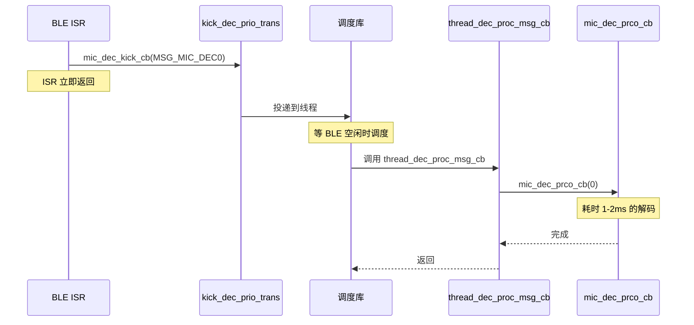

**核心思想**：**ISR 只做"清 pending + kick"，重工作交给线程**。

> **小白理解**：把这想象成"医院分诊"。ISR 是急诊分诊台（立即响应），线程是门诊医生（真正看病）。这样急诊不会卡死。

---

## 第三篇 抽象与接口：代码里的"合同"

### 第 11 章 · 5 种统一"合同"设计模式

AB5766 SDK 里反复使用 **5 种设计模式**。掌握它们，你就掌握了 SDK 的"语法"。

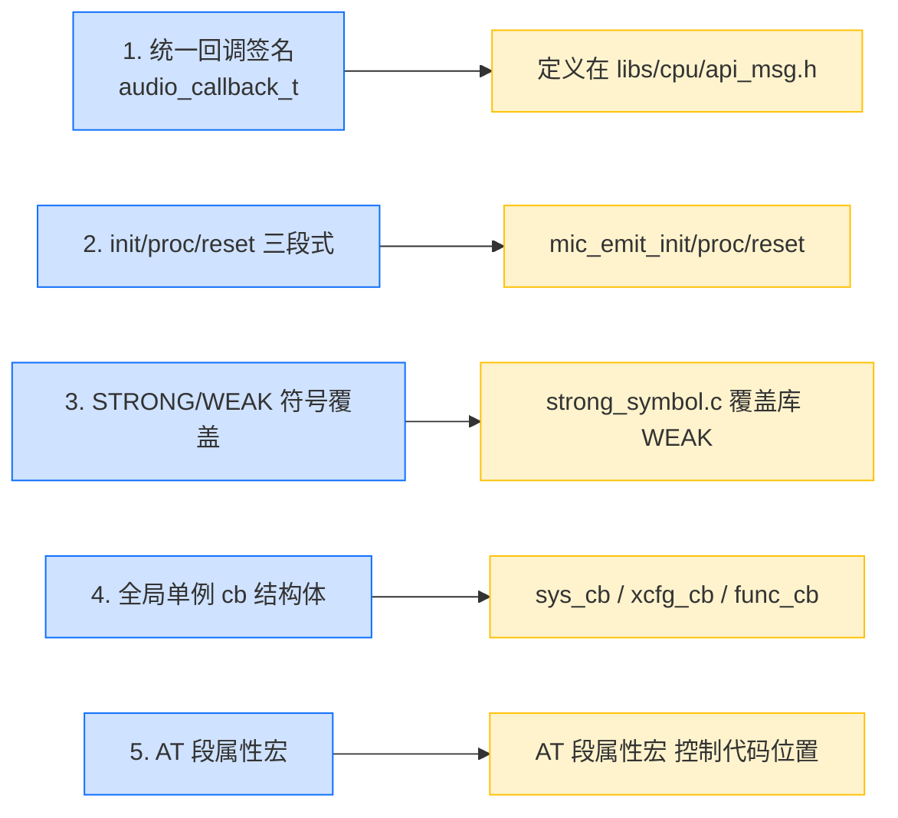

**模式 1：统一回调签名 `audio_callback_t`**

```c
// functions/func_mic_emit.h:11
typedef void (*audio_callback_t)(u8 *ptr, u32 samples, int ch_mode, void *params);
```

所有音频算法都按这个签名注册回调，避免"接口不一"问题。

**模式 2：init/proc/reset 三段式**

| 阶段 | 调用时机 | 作用 |
|---|---|---|
| `init()` | BLE 连接成功后 | 初始化算法、分配缓冲 |
| `proc()` | 每帧音频 | 算法处理 1 帧 PCM |
| `reset()` | BLE 断开时 | 释放缓冲、清状态 |

**模式 3：STRONG/WEAK**

```c
// projects/microphone/strong_symbol.c:54-58
STRONG void usr_tmr5ms_thread_callback(void) {
    usr_tmr5ms_thread_do();        // 库里的 WEAK 默认空实现被覆盖
}
```

库函数声明为 `WEAK`（弱符号），项目用 `STRONG` 重写即可"无缝替换"。

**模式 4：全局单例**

| 单例 | 位置 | 用途 |
|---|---|---|
| `sys_cb` | `bsp/bsp_sys.c:8` | 系统状态（pwroff、mic_alg_en、disp_sta） |
| `xcfg_cb` | `bsp/bsp_sys.c:7` | 产测配置（70+ 字段） |
| `func_cb` | `functions/func.c:4` | 当前/上次工作模式 |
| `wireless_mic` | `modules/wireless/wireless.c:37` | 蓝牙连接状态 |
| `mic_enc` / `mic_dec` | `modules/wireless/mic_proc.c:46-50` | 编码/解码上下文 |

**模式 5：AT() 段属性宏**

```c
// header/macro.h:9
#define AT(x)  __attribute__((section(STR(x))))

// 使用示例
AT(.com_text.sdadc.isr) static void sdadc_isr_cb(void) { ... }
AT(.buf.sdadc) static int16_t sdadc_buf[SDADC_DMA_SIZE];
```

`AT(.xxx)` 把代码/数据放到指定内存段。比如 `AT(.com_text.isr)` 表示"放在 comm 段的 ISR 段"。

### 第 12 章 · 单例与全局变量：SDK 的"共享白板"

**嵌入式为什么大量用全局结构体？**

| 优点 | 说明 |
|---|---|
| 节省栈 | 嵌入式栈通常只有 1-4KB |
| 跨层共享 | 不用层层传指针 |
| 零开销 | 无 malloc/free |
| 易于静态分析 | 编译期确定地址 |

**5 个核心单例详解**

| 单例 | 字段数 | 主要字段 | 生命周期 |
|---|---|---|---|
| `sys_cb` | 多个 | `pwroff`、`mic_alg_en`、`disp_sta` | 整个程序 |
| `xcfg_cb` | 80+ | `wireless_adapter_en`、`wireless_mic_emit_en`、各种 GPIO/电压 | 产测后不变 |
| `func_cb` | 2 | `sta`、`last` | 整个程序 |
| `wireless_mic` | 4-7 | `change_flag`、`connected_sta`、`change_sta[2]` | BLE 生命周期 |
| `mic_enc` / `mic_dec` | 5-10 | `mute_en`、`buffer[]`、`pcm[2]` | BLE 生命周期 |

**`xcfg_cb` 是"产测烧入"的——Flash 中的 71 字段**，由配置工具写入；运行时由 `bsp_sys_init()` 加载到 RAM，覆盖编译期宏。

### 第 13 章 · STRONG/WEAK 符号覆盖：项目定制 SDK 的秘诀

**为什么需要 STRONG/WEAK？**

SDK 库提供"通用默认实现"，但每个产品都要做"客制化"。STRONG/WEAK 提供"项目可覆盖库默认"的能力。

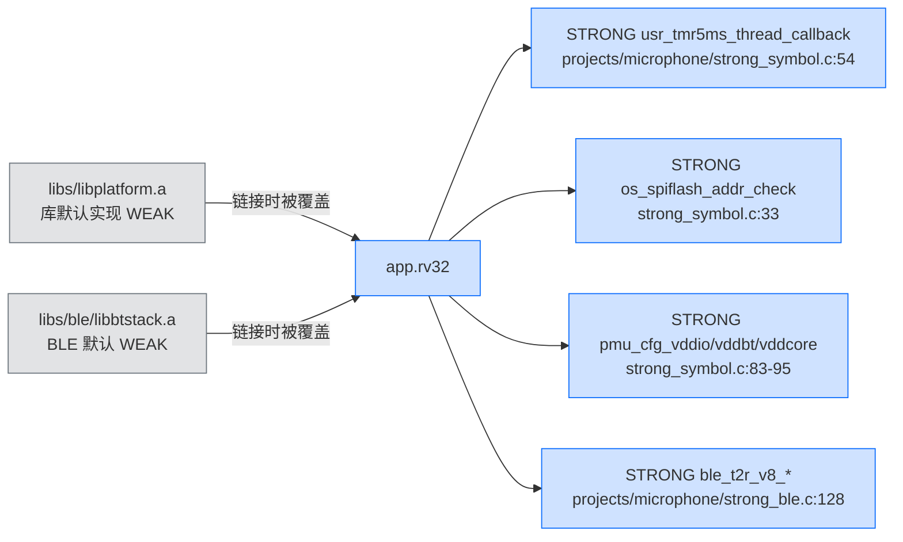

**经典例子 1：5ms 心跳钩子**

```c
// 库端（libs/libplatform.a）声明为 WEAK
WEAK void usr_tmr5ms_thread_callback(void) { /* 默认空 */ }

// 项目端覆盖（strong_symbol.c:54-58）
STRONG void usr_tmr5ms_thread_callback(void) {
    usr_tmr5ms_thread_do();        // 调 BSP 的 5ms tick 钩子
}
```

**经典例子 2：SPI Flash 保护**

```c
// strong_symbol.c:33-51  限制 SPI Flash 写入范围
STRONG bool os_spiflash_addr_check(u32 addr, uint len) {
    if ((addr >= CM_START) && ((addr + len) <= (CM_START + CM_SIZE))) {
        return true;                    // CM 区允许
    }
#if AB_FOT_EN
    if ((addr >= FOT_PACK_START) && ((addr + len) <= (FOT_PACK_START + FOT_PACK_SIZE))) {
        return true;                    // FOT 区允许
    }
#endif
    printf("-->os_spiflash_addr_err:0x%x\n", addr);
    return false;                       // 其它区域禁止
}
```

**经典例子 3：电压配置回调**

```c
// strong_symbol.c:83-95
uint8_t pmu_cfg_vddio(void) { return xcfg_cb.vddio_sel; }
uint8_t pmu_cfg_vddbt(void) { return xcfg_cb.vddbt_sel; }
uint8_t pmu_cfg_vddcore(void) { return xcfg_cb.vddcore_sel; }
```

库要配置 PMU 电压，但库又不知道项目选什么电压——所以通过回调让项目自己决定。

**STRONG/WEAK 使用规则**：

| 规则 | 例子 |
|---|---|
| 库里**默认**实现用 `WEAK` | `WEAK void xxx(void) { }` |
| 项目**要覆盖**时用 `STRONG` | `STRONG void xxx(void) { ... }` |
| 一份项目只能覆盖一次 | 重复覆盖会导致链接错误 |
| 跨模块覆盖很常见 | `strong_symbol.c`（平台）+ `strong_ble.c`（BLE） |

---

## 第四篇 数据流与控制流：让信号在 SDK 里跑一遍

### 第 14 章 · 音频数据流：麦克风 PCM 到 RF 发送的完整路径

跟踪一帧 PCM 数据的生命路径，理解 SDK 是怎么"端到端"协作的。

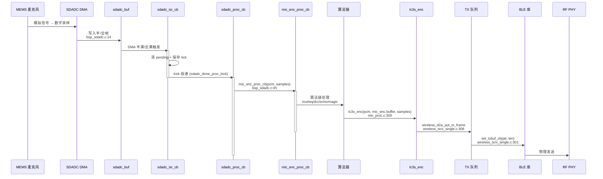

**10 步详解**

| 步 | 文件:行 | 动作 |
|---|---|---|
| 1 | `bsp_sdadc.c:14` | `sdadc_buf[SDADC_DMA_SIZE] AT(.buf.sdadc)` DMA 缓冲 |
| 2 | `driver_sdadc.c:194` | `sdadc0_cmd` 打开 ADC0 |
| 3 | `bsp_sdadc.c:100` | `sdadc_pic_config` 注册 ISR |
| 4 | `bsp_sdadc.c:27-37` | `sdadc_isr_cb` ISR：清 pending + `sdadc_done_proc_kick` 投递 |
| 5 | `bsp_sdadc.c:39-53` | `sdadc_proc_cb` 算法线程回调：从 `sdadc_buf` 取 PCM |
| 6 | `bsp_sdadc.c:45,51` | 调 `mic_enc_proc_cb(rbuf, samples)` |
| 7 | `mic_proc.c:277-378` | `mic_enc_proc_cb`：mute + 算法链 + LC3S 编码 |
| 8 | `mic_proc.c:359` | `lc3s_enc` 编码 |
| 9 | `mic_proc.c:363` | `wireless_d2a_put_tx_frame` 入 TX 队列 |
| 10 | `wireless_txrx_single.c:301` | `wireless_d2a_set_txbuf_cb` 库取走 buffer 发送 |

**关键观察**：

- **DMA 缓冲**绕过 CPU，由硬件自动搬运
- **算法处理**在"线程"里跑（不在 ISR 中），避免阻塞 BLE
- **LC3S 编码**完成后立刻入 TX 队列，再由 BLE 库取出发送

### 第 15 章 · 控制流：按下 VOL+ 后的完整链路

跟踪一次按键事件的生命路径。

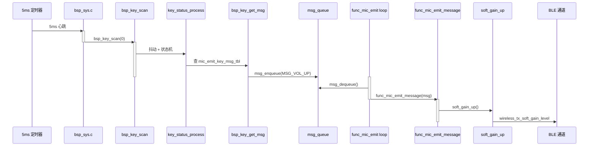

**关键文件:行号**

| 步 | 文件:行 | 动作 |
|---|---|---|
| 1 | `bsp_sys.c:60-97` | `usr_tmr5ms_thread_do` 5ms tick |
| 2 | `bsp_sys.c:79-81` | `bsp_key_scan(0)` |
| 3 | `bsp_key.c:126` | `key_status_process` 区分短/长/双击 |
| 4 | `bsp_key.c:130` | `bsp_key_get_msg` 查 `mic_emit_key_msg_tbl` |
| 5 | `bsp_key.c:131` | `msg_enqueue(MSG_VOL_UP)` |
| 6 | `func_mic_emit.c:219` | `msg_dequeue()` |
| 7 | `func_mic_emit.c:221` | `func_mic_emit_message(msg)` |
| 8 | `msg_mic_emit.c:59` | `soft_gain_up()` |
| 9 | `msg_mic_emit.c:65` | `wireless_tx_soft_gain_level` 同步 |

**关键观察**：

- **按键事件**：5ms 扫描 → 消抖 → 查表 → 入队
- **状态机**：从队列取消息 → 分派 → 执行
- **跨设备同步**：动作执行后通过 BLE 私有命令同步给接收端

### 第 16 章 · 线程间通信：kick 宏与消息队列

**为什么需要线程间通信？**

BLE 中断里不能跑 LC3S 解码（耗时 1-2ms）；但 LC3S 解码又需要**尽快**跑（避免音乐断流）。所以需要"中断 kick 出来，到线程里跑"。

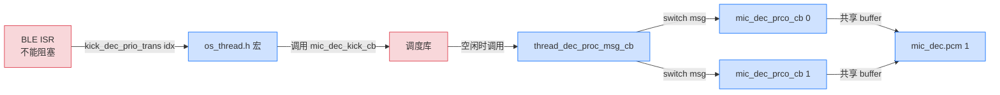

**共享 buffer 模式**

`bsp_sdadc.c:14 sdadc_buf[SDADC_DMA_SIZE]` 是全局共享：

```c
// bsp_sdadc.c:14
int16_t sdadc_buf[SDADC_DMA_SIZE] AT(.buf.sdadc);
```

ISR 写入 → 线程读取 → 处理。这就是"跨线程共享数据"。

**线程间通信的两条规则**：

1. **ISR 永远只 kick**（投递消息），不直接处理
2. **线程共享 buffer**，但要注意**临界区**（用 `GLOBAL_INT_DISABLE` 保护）

```c
// 关键代码：BLE TX 帧缓冲（wireless_txrx_single.c:197-228）
void txpkt_put_frame(txpkt_ctl_t *txpkt, u8 *ptr, u8 size) {
    GLOBAL_INT_DISABLE();   // 关中断
    // ... memcpy 拷贝数据
    GLOBAL_INT_RESTORE();   // 开中断
}
```

---

## 第五篇 配置与构建：把它点亮

### 第 17 章 · 三层配置体系：config.h → config_xxx.h → xcfg

AB5766 有**三层配置**，承担不同角色：

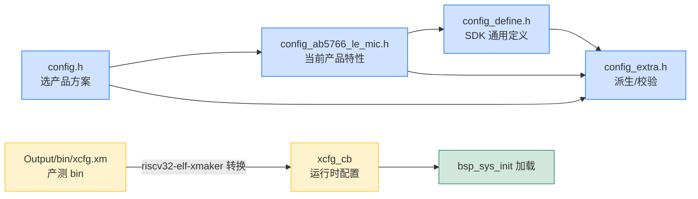

**详细说明**

| 文件 | 编译期/运行期 | 主要内容 |
|---|---|---|
| `config.h` | 编译期 | 选择 `USER_CONFIG = CONFIG_AB5766_LE_MIC` |
| `config_ab5766_le_mic.h` | 编译期 | 特性开关（`WIRELESS_MIC_ECHO_EN=0`）、时钟、GPIO |
| `config_define.h` | 编译期 | SDK 通用定义（Flash 容量、采样率、编解码索引） |
| `config_extra.h` | 编译期 | 派生校验（`FRAME_SIZE_MIN`、`WIRELESS_CON_INTERVAL`） |
| `xcfg.h` | 编译期结构体 + 运行时数据 | 71 个产测字段（`wireless_adapter_en`、`le_name`） |
| `xcfg.xm` | 产测期 | 配置工具生成的 bin，写入 Flash |

**关键了解**：

- **编译期宏**控制代码是否参与编译（如 `WIRELESS_MIC_ECHO_EN` 决定 `echo_audio_init` 是否被调用）
- **xcfg_cb** 是产测烧入的**运行时**配置，可以覆盖编译期默认值

**示例：开关一个特性**

假设你想打开 ECHO 音效：

```c
// projects/microphone/config_ab5766_le_mic.h:101
#define WIRELESS_MIC_ECHO_EN  1    // 0 → 1
```

**重新编译就行**——所有 `#if WIRELESS_MIC_ECHO_EN` 守护的代码会自动参与编译。

### 第 18 章 · xcfg 与产测流程：Flash 里的"调音台"

**xcfg_cb 是怎么"装进"固件的？**

```mermaid
flowchart LR
    A[配置工具<br/>GUI 输入] -->|生成 xcfg.xm| B[Output/bin/xcfg.xm]
    B -->|prebuild.bat 调用<br/>riscv32-elf-xmaker -b| C[Output/bin/xcfg.bin + xcfg.h]
    C -->|编译时 include| D[app.rv32]
    D -->|烧录到 Flash| E[Flash 0x1E000-0x20000 区域]
    E -->|运行时 bsp_sys_init 加载| F[xcfg_cb RAM 副本]
    F -->|后续 wifi_xxx_init 用| G[wireless_pwr_ctr / led / etc]
    classDef tool fill:#cfe2ff,stroke:#0d6efd
    classDef bin fill:#fff3cd,stroke:#ffc107
    classDef flash fill:#d1e7dd,stroke:#198754
    class A tool
    class B,C,D bin
    class E,F,G flash
```

**关键代码**

```c
// bsp/bsp_sys.c:202  加载 xcfg_cb
if (!xcfg_init(&xcfg_cb, sizeof(xcfg_cb))) {
    printf("xcfg init error\n");
}

// projects/microphone/xcfg.h:7-40  xcfg_cb_t 字段示例
typedef struct {
    uint8_t     wireless_adapter_en;   // 决定角色
    uint8_t     wireless_mic_emit_en;
    char        le_name[32];           // 蓝牙广播名
    uint8_t     le_addr[6];            // 蓝牙地址
    uint8_t     rf_tx_pwr;             // 发射功率
    uint8_t     dac_sel;               // 单端/差分
    uint16_t    pwron_press_time;      // 长按开机时间
    uint16_t    pwroff_press_time;     // 长按关机时间
    // ... 60+ 字段
} xcfg_cb_t;
```

**关键了解**：

- `wireless_adapter_en=1` → 烧成接收端
- `wireless_mic_emit_en=1` → 烧成发射端
- 同一份固件烧到不同板子靠 xcfg 切换角色

### 第 19 章 · 构建系统：app.cbp + ram.ld + AT() 段名机制

**构建流程**

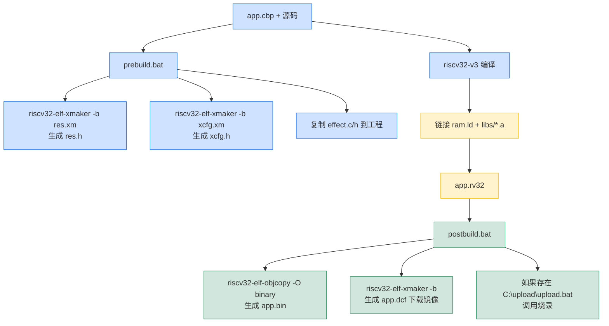

**关键文件**

| 文件 | 作用 |
|---|---|
| `projects/microphone/app.cbp` | Code::Blocks 工程 |
| `projects/microphone/ram.ld` | 链接脚本（内存分段） |
| `Output/bin/prebuild.bat` | 编译前预处理 |
| `Output/bin/postbuild.bat` | 编译后处理（生成 .bin / .dcf） |

**`AT()` 段名机制**

`header/macro.h:9` 定义了 `AT(x)` 宏：

```c
#define AT(x)  __attribute__((section(STR(x))))
```

**作用**：把函数/变量放到指定内存段。

| 段名 | 物理位置 | 用途 |
|---|---|---|
| `AT(.text.mic_emit.proc.sdadc)` | `comm_emit` 区域 | 仅发射端跑的代码 |
| `AT(.text.adapter.proc.sdadc)` | `comm_adapter` 区域 | 仅接收端跑的代码 |
| `AT(.com_text.sdadc.isr)` | `comm` 区域 | ISR 代码 |
| `AT(.buf.sdadc)` | `.data` 区域 | SDADC 音频缓冲 |

**关键了解**：`__comm_emit_vma` / `__comm_adapter_vma` 共享同一 RAM 区域（运行时只装入当前角色那份）。

### 第 20 章 · 角色双烧：一块固件同时支持发射端与接收端

**这是 AB5766 SDK 最巧妙的设计**——同一份固件烧录到不同板子，自动跑发射端或接收端。

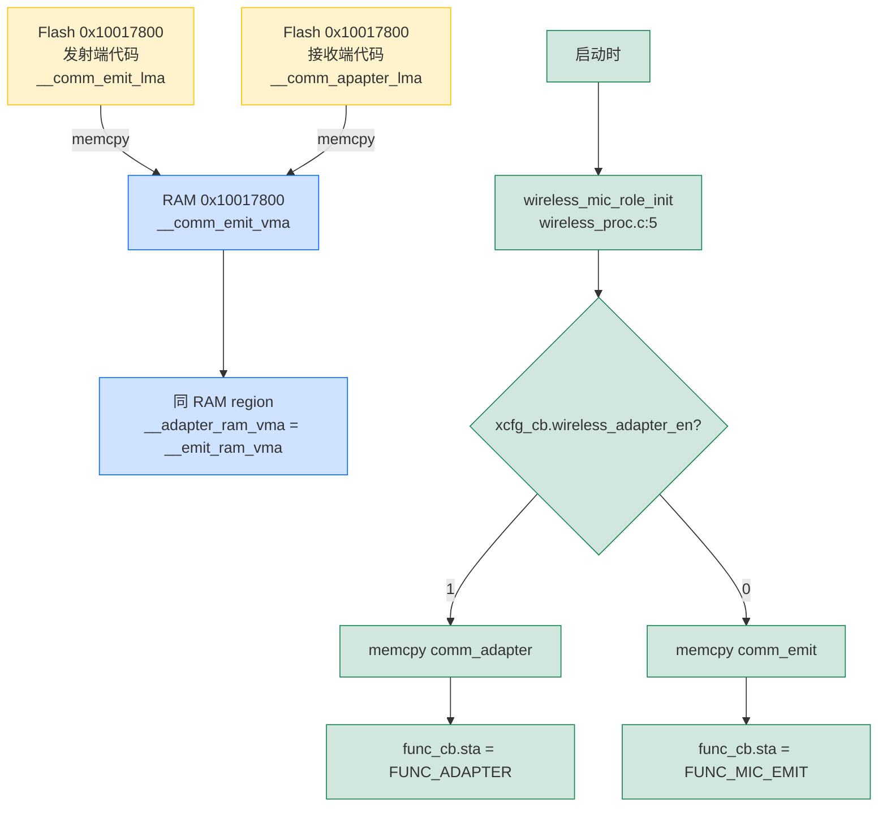

**关键代码**

```c
// modules/wireless/wireless_proc.c:20-32  链接脚本符号
extern u32 __comm_adapter_vma, __comm_apapter_lma, __comm_apapter_size;
extern u32 __comm_emit_vma,    __comm_emit_lma,    __comm_emit_size;

// modules/wireless/wireless_proc.c:24-32  运行时拷贝
void wireless_mic_load_code(void) {
    load_code_wireless_mic();                   // 库函数
    if (xcfg_cb.wireless_adapter_en) {
        memcpy(&__comm_adapter_vma, &__comm_apapter_lma, (u32)&__comm_apapter_size);
    } else {
        memcpy(&__comm_emit_vma,    &__comm_emit_lma,    (u32)&__comm_emit_size);
    }
}
```

**收益**：

- **节省 Flash 空间**：两份代码只用一份 RAM
- **一份固件多种角色**：无需烧两次
- **运行时切换**：换 xcfg 即可

**新手注意**：如果你看到 `__comm_emit_*` 符号或 `AT(.text.mic_emit.proc.*)` 段名，就知道这是发射端专用代码。

---

## 第六篇 设计哲学与实战示例

### 第 21 章 · 高内聚低耦合：依赖方向、接口抽象、回调机制

**依赖方向纪律**：

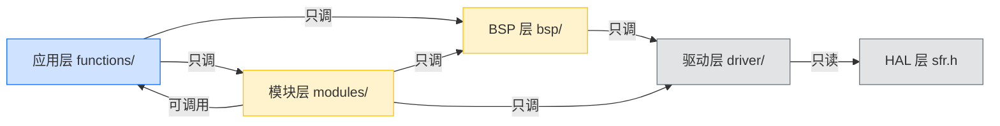

**箭头规则**：

- ✅ 上层能调下层
- ❌ 下层不能调上层
- ✅ 同层之间只通过回调通信，不直接 import

**证据 1：模块层只调 BSP/Driver，绝不调应用层**

```bash
# modules/wireless/mic_proc.c 不 include 任何 functions/ 头
$ grep -r "include.*func" modules/wireless/
# （无输出）
```

**证据 2：Driver 层不调 BSP/Module**

```bash
# driver/driver_sdadc.c 只 include 它需要的头
$ grep "include" driver/driver_sdadc.c
#include "include.h"
#include "driver_sdadc.h"
#include "driver_sdadc_reg.h"
#include "driver_com.h"
```

**证据 3：HAL 不调任何上层**

```c
// driver/driver_sdadc.c 只有 SFR 读写，不会调函数
void sdadc0_cmd(SDADC_REG_TYPEDEF *sdadc, u8 en) {
    if (en) sdadc->CON |= SDADC0CON_ADC0_EN;
    else    sdadc->CON &= ~SDADC0CON_ADC0_EN;
}
```

**抽象与回调机制**

| 抽象 | 文件 | 作用 |
|---|---|---|
| `audio_callback_t` | `functions/func_mic_emit.h:11` | 统一音频回调签名 |
| `sdadc_done_callback` | `libs/cpu/api_sdadc.h:29` | SDADC 完成回调 |
| `wireless_mic_tag` | `modules/wireless/wireless.c:37` | BLE 状态结构 |
| `mic_enc_t` / `mic_dec_t` | `modules/wireless/mic_proc.c:13-44` | 编/解码上下文 |

**3 类通信机制**

1. **全局单例**（共享白板）：`sys_cb`、`xcfg_cb`、`func_cb`
2. **回调函数**（事件驱动）：`sdadc_done_callback_set(...)`
3. **消息队列**（异步通信）：`msg_queue` + `func_mic_emit_message`

### 第 22 章 · 示例 A：新增一个按键 + 消息链路（实测成功案例）

**目标**：在 mic emit 发射端，实现「K1 长按后松手」触发 `MSG_TEST_X`，串口打印 `Test X triggered`。本章按实际板卡实测通过流程记录，包含一次真实踩坑与修复。

> 选 K1 长按抬起的原因：当前开发板只有 `KEY_ID_PP`、`KEY_ID_K1`、`KEY_ID_K2` 三个有效按键；`KEY_ID_K2` 的「长按抬起」列已用于 `MSG_CHANGE_MAGIC`，故选 K1。事件列为 `KEY_LONG_UP`（长按后**松手**触发，索引 3），与 K2 的 MAGIC 一致。

#### 步骤 1：添加消息枚举（关键：值必须 < 0x100）

```c
// functions/msg.h
// 按键消息表是 u8 数组，经 bsp_key.c 的 key_set_msg_tbl 按字节拷贝，
// 再由 bsp_key_get_msg 按 u8 取值返回。因此经按键表分派的消息，
// 其枚举值必须落在 0x00~0xff，否则写入/读取会被截断成低 8 位。
// 放在 MSG_VOL_MUTE 之后（紧接 MSG_VOL_MUTE，自动取下一个值，远小于 0x100）。
enum{
    MSG_NO                  = 0,
    ...
    MSG_VOL_UP,
    MSG_VOL_DOWN,
    MSG_VOL_MUTE,
    MSG_TEST_X,                     //实测新增消息，值 = 11，满足 < 0x100

    MSG_SYS_1S = 0x700,
    ...
};
```

#### 步骤 2：修改按键消息表（mic emit 非 K12 表）

```c
// projects/microphone/port/port_key.c
// 注意：项目未定义 WIRELESS_MIC_K12_KEY_EN，编译走 #else 的非 K12 表。
// KEY_ID_K1 的「长按抬起」列（索引 3，KEY_LONG_UP）填 MSG_TEST_X。
#if WIRELESS_MIC_K12_KEY_EN
... // K12 表略
#else
const u8 mic_emit_key_msg_tbl[KEY_TBL_MAX_NB][KEY_MSG_MAX_IDX] = {
        //单击,      长按下,  HOLD,    长按抬起,      双击,   三击    四击    五击
    [KEY_ID_PP] ={MSG_VOL_MUTE, MSG_NO, MSG_PWR_HOLD, MSG_NO, MSG_NO, MSG_NO, MSG_NO, MSG_NO},
    [KEY_ID_K1] ={MSG_VOL_UP,  MSG_NO, MSG_NO,      MSG_TEST_X, MSG_NO, MSG_NO, MSG_NO, MSG_NO},
    [KEY_ID_K2] ={MSG_VOL_DOWN,MSG_NO, MSG_NO,      MSG_CHANGE_MAGIC, MSG_NO, MSG_NO, MSG_NO, MSG_NO},
    [KEY_ID_K3] ={MSG_NO,      MSG_NO, MSG_NO,      MSG_NO, MSG_NO, MSG_NO, MSG_NO, MSG_NO},
};
#endif
```

#### 步骤 3：处理消息

```c
// functions/msg_mic_emit.c  // 在 func_mic_emit_message 中添加 case
case MSG_TEST_X:
    printf("Test X triggered\n");
    break;
```

#### 步骤 4：构建并测试

```bash
# 1. 用 Code::Blocks 打开 projects/microphone/app.cbp，构建 Debug 目标
# 2. 烧录 Output/bin/app.dcf
# 3. 测试 - 长按 K1 再松手，观察 UART 串口打印
```

实测：长按 K1 后松手，UART 打印 `Test X triggered`，链路打通。


#### 实测踩坑：消息值 ≥ 0x100 被截断，长按抬起不打印

最初把新增消息放在 `MSG_SYS_MAX = 0x7ff` 之后，命名为 `EVT_TEST_X`，结果长按抬起**完全不打印**，而同表里的 `MSG_VOL_MUTE`、`MSG_VOL_UP` 等都正常。

**根因**：`EVT_TEST_X` 紧跟 `0x7ff`，枚举值 = `0x800`（2048），超出 `u8` 范围。

链路断点逐层分析：

1. [port_key.c](projects/microphone/port/port_key.c) 的 `mic_emit_key_msg_tbl` 元素类型是 `u8`。
2. [bsp_key.c:40-53](bsp/bsp_key.c#L40-L53) `key_set_msg_tbl` 用 `memcpy` 按**字节**拷贝整表，`EVT_TEST_X(0x800)` 写入后只剩低 8 位 = `0x00`。
3. [bsp_key.c:55-67](bsp/bsp_key.c#L55-L67) `bsp_key_get_msg` 从 `u8` 元素取值返回，得到的还是 `0x00`。
4. [bsp_key.c:129-132](bsp/bsp_key.c#L129-L132) 仍执行 `msg_enqueue(0)`。
5. [func_mic_emit.c:219-222](functions/func_mic_emit.c#L219-L222) `msg = msg_dequeue()` 得到 `MSG_NO`，`if (msg != MSG_NO)` 不成立 → `func_mic_emit_message` **根本没被调用**，所以不打印。

而 `MSG_VOL_MUTE`(10)、`MSG_VOL_UP`(8) 等都 < 0x100，放 `u8` 表不丢值，因此正常。

**修复**：把测试消息挪到 `MSG_VOL_MUTE` 之后（值 = 11，满足 `< 0x100`），改名 `MSG_TEST_X`，并删除原来位于 `0x800` 的 `EVT_TEST_X`。三处同步：`msg.h` 枚举、`port_key.c` 按键表、`msg_mic_emit.c` case。

**易错点**：

- **经按键表分派的消息，枚举值必须 `< 0x100`**——这是本次踩坑的核心，`port_key.c` 表是 `u8`，`bsp_key.c` 按字节拷贝/读取。放在 `MSG_SYS_MAX = 0x7ff` 之后的 `EVT_*` 不满足此条件，不能进按键表。
- `port_key.c` 的 `KEY_MSG_MAX_IDX` 必须覆盖所有事件类型
- `msg.h` 枚举不能重复
- 按键消息表内的 `MSG_*` 必须在 `functions/msg.h` 中定义
- 注意当前板卡走非 K12 按键表（`WIRELESS_MIC_K12_KEY_EN` 未定义），且只有 PP/K1/K2 三个有效键，无 K3

### 第 23 章 · 示例 B：新增调试打印

**两种风格**：

```c
// 风格 1：直接用 printf（自动路由到 bsp_uart_debug）
// bsp_uart_debug 已在 bsp_sys.c:271 初始化
printf("value=%d state=%d\n", val, state);

// 风格 2：项目内 TRACE 宏（参考 func_mic_emit.c:6-14）
#define TRACE_EN  1
#if TRACE_EN
#define TRACE(...) printf(__VA_ARGS__)
#define TRACE_R(...) print_r(__VA_ARGS__)
#else
#define TRACE(...)
#define TRACE_R(...)
#endif
```

**配置开关**：

```c
// projects/microphone/config_ab5766_le_mic.h:24
#define BSP_UART_DEBUG_EN  GPIO_PA4    // 改 0 关闭
```

**注意**：

- `printf` 在 ISR 中调用会阻塞（不要在 ISR 里用）
- 高频打印会拖慢主循环（避免 1ms 一次）
- 调试完记得关闭 `BSP_UART_DEBUG_EN`

### 第 24 章 · 示例 C：新增音效算法

**目标**：在 `modules/voice/` 加一个 `my_effect.c`，实现"音量减半"。

#### 步骤 1：创建 effect 文件

```c
// modules/voice/my_effect.c
#include "include.h"

static int my_effect_inited = 0;

AT(.com_text.voice.init)
void my_effect_init(u8 sample_rate, u16 samples) {
    my_effect_inited = 1;
    printf("my_effect init: %d Hz, %d samples\n", sample_rate, samples);
}

AT(.text.mic_emit.proc)
void my_effect_process(s16 *pcm, u16 samples) {
    if (!my_effect_inited) return;
    for (u16 i = 0; i < samples; i++) {
        pcm[i] = pcm[i] >> 1;        // 音量减半
    }
}
```

#### 步骤 2：插入算法链

```c
// modules/wireless/mic_proc.c:277-378  在 mic_enc_proc_cb 中
#if WIRELESS_MIC_MY_EFFECT_EN
    my_effect_process(pcm, samples);                  // 选个位置插入
#endif
```

#### 步骤 3：初始化

```c
// modules/wireless/mic_proc.c:597-675  在 mic_emit_init 中
#if WIRELESS_MIC_MY_EFFECT_EN
    my_effect_init(WIRELESS_MIC_SAMPLE_RATE_SELECT, WIRELESS_MIC_SAMPLES_SELECT);
#endif
```

#### 步骤 4：特性开关宏

```c
// projects/microphone/config_ab5766_le_mic.h
#define WIRELESS_MIC_MY_EFFECT_EN  1
```


### 第 25 章 · 示例 D：配置一个新产品方案

**目标**：新增 `CONFIG_MY_PRODUCT = 4`，定义新产品配置。

#### 步骤 1：复制现有配置头

```bash
cp projects/microphone/config_ab5766_le_mic.h \
   projects/microphone/config_my_product.h
```

#### 步骤 2：修改特性开关

```c
// projects/microphone/config_my_product.h
#define WIRELESS_MIC_ECHO_EN  1       // 新产品开 ECHO
#define WIRELESS_MIC_MAGIC_EN  1       // 新产品开 MAGIC
#define SYS_CLK_SEL  SYS_48M           // 新产品用 48M
```

#### 步骤 3：注册到 config.h

```c
// projects/microphone/config.h:13
#define CONFIG_MY_PRODUCT  4

// projects/microphone/config.h:19-27
#if (USER_CONFIG == CONFIG_AB5766_LE_MIC)
    #include "config_ab5766_le_mic.h"
#elif (USER_CONFIG == CONFIG_MY_PRODUCT)
    #include "config_my_product.h"     // 新增
#endif
```

#### 步骤 4：调整按键表和 xcfg

```c
// projects/microphone/port/port_key.c
// 调整 mic_emit_key_msg_tbl 以匹配新硬件按键
```

```bash
# 调整 xcfg_cb 字段
# 烧录新配置到 Flash
```

#### 步骤 5：调整内存布局

```c
// projects/microphone/ram.ld
// 如果新硬件有更大 Flash / RAM，调整 MEMORY 段
```


---

## 第七篇 收尾

### 第 26 章 · 常见陷阱 + 调试技巧 + 配套阅读路线

#### 8-10 个常见陷阱

| 陷阱 | 症状 | 解决方案 |
|---|---|---|
| **双烧 RAM 溢出** | 编译报 `region 'comm_emit' overflowed` | 减小 `WIRELESS_MIC_ECHO_EN` 等特性 |
| **xcfg 与 config 冲突** | 运行时行为与编译期宏不符 | 检查 `xcfg_cb` 是否被正确加载 |
| **AT 段名拼错** | 链接报 `undefined reference` | 核对 `ram.ld` 中的 section 收集 |
| **ISR 中调 printf** | 调试 UART 阻塞，BLE 断连 | 改为 `kick` 给线程 |
| **STRONG 函数未链接** | 5ms tick 不工作 | 检查 `strong_symbol.c` 是否有 `STRONG` 关键字 |
| **`sys_cb` 未初始化** | 系统状态乱 | 在 `bsp_sys_init` 中 memset |
| **消息队列溢出** | 按键无响应 | 队列满时及时 `msg_queue_clear` |
| **算法线程饿死** | 实时音频卡顿 | 减少算法 / 调高主频 |
| **DAC 调速失效** | 播放速度漂移 | 检查 `dac0_play_sync_fifocnt` 阈值 |
| **BLE 连接快速断开** | 接收不到数据 | 检查 `cfg_wireless_role` 和 `xcfg_cb.wireless_adapter_en` |

#### 调试技巧

1. **Printf 大法**：先打开 `BSP_UART_DEBUG_EN=1`，在关键函数加 `printf()`
2. **状态机跟踪**：用 `printf("state: %d\n", func_cb.sta)` 看状态变化
3. **内存使用**：`printf("heap: %d\n`, &__heap_size - &__heap_start)`
4. **PER 监控**：开 `WIRELESS_DUMP_EN=1` 看丢包率
5. **逻辑分析仪**：抓 SDADC/DAC 进出的 PCM 数据
6. **打断点**：在 IDE 中断到 `mic_enc_proc_cb` 看 PCM 是否正确

#### 推荐阅读顺序

```mermaid
flowchart LR
    A[1. AB5766_LE_Mic_新手开发指南.md] --> B[2. 本文档<br/>架构导览]
    B --> C[3. AB5766_发射端_Mic_Emit_实现详解.md]
    B --> D[4. AB5766_接收端_Adapter_实现详解.md]
    C --> E[5. AB5766_按键链路测试与验收指南.md]
    D --> E
    E --> F[6. AB5766_无线麦克风_双板连接与LED测试指南.md]
    classDef lvl fill:#cfe2ff,stroke:#0d6efd
    classDef mid fill:#fff3cd,stroke:#ffc107
    classDef adv fill:#d1e7dd,stroke:#198754
    class A lvl
    class B,C,D mid
    class E,F adv
```

**阅读路径建议**：

1. **先看 1（导航）**：知道有哪些文档，了解仓库长什么样
2. **再看 2（本文档）**：建立"五层架构 + 抽象模式 + 角色双烧"的整体认知
3. **然后 3 或 4**：选择一个角色（发射端/接收端），深入了解实际代码
4. **最后 5、6**：双板烧录测试，验证理解

#### 总结

**学完本文档，你应该能回答这些问题**：

- ✅ AB5766 SDK 的五层是什么？每一层做什么？
- ✅ HAL 和 Driver 的区别是什么？
- ✅ BSP 层在做什么？为什么需要 BSP？
- ✅ Module 层为什么用 init/proc/reset 三段式？
- ✅ Application 层用什么方式处理消息？
- ✅ OSAL 层用什么机制做"伪线程"？
- ✅ 同一个固件怎么分别烧成发射端和接收端？
- ✅ STRONG/WEAK 怎么覆盖库的默认实现？
- ✅ AT() 段名怎么影响代码位置？
- ✅ 一次按键和一帧音频在 SDK 中怎么流转？

**如果你都能回答，恭喜你——你已经从"零基础"进阶到"中级"了**。

继续探索的入口：

- **想深入算法**：`modules/voice/echo.c`（典型 voice 算法）
- **想深入协议**：`modules/wireless/wireless_cmd.c`（蓝牙私有命令）
- **想深入构建**：`projects/microphone/ram.ld`（链接脚本）
- **想实战演练**：编译并烧录一份固件观察 LED 闪烁

祝你在嵌入式 SDK 的世界里玩得开心！🎉

---

（本文档基于 `projects/microphone/config_ab5766_le_mic.h` 当前默认配置 + Code::Blocks 工程配置。所有文件:行号引用为仓库当时快照；如有变动请以实际代码为准。）
