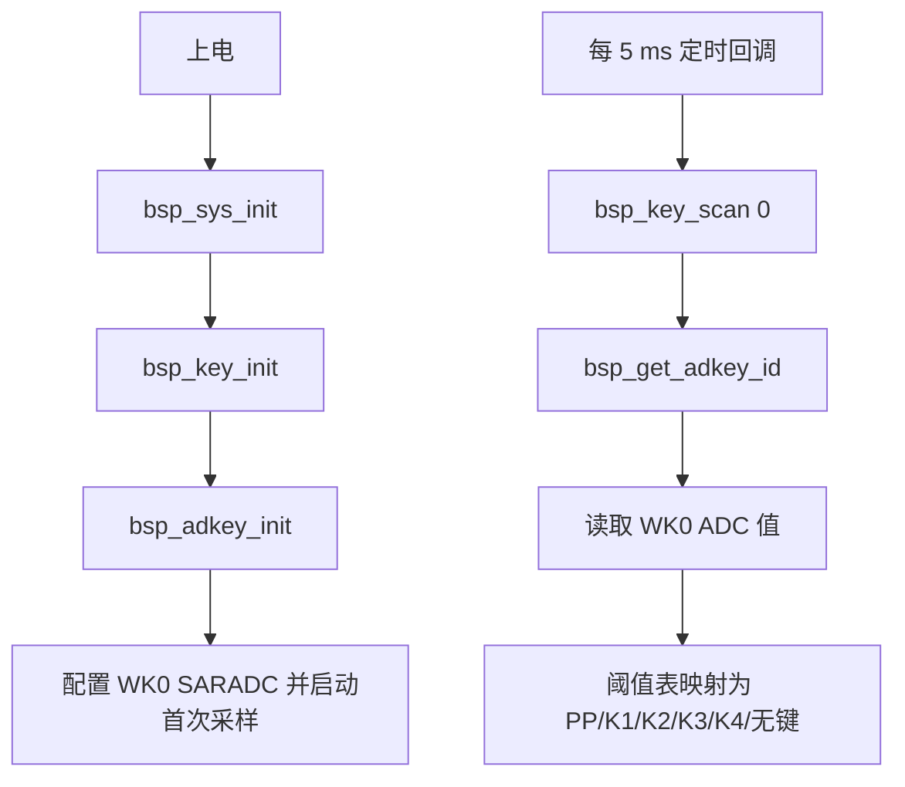

# AB5766 无线麦克风按键链路测试与验收指南

本文面向第一次测试 AB5766 无线麦克风按键的开发者。目标是先利用当前固件已有功能和 PA4 串口日志，验证 ADC 按键从物理按下到无线音频业务处理的现有链路。

> 本阶段不修改 ADC 阈值、按键映射、IO 按键开关或按键时序参数。仓库没有顶板原理图，因此不能从源码确定 WK0 实际连接到哪个引脚、按键电阻网络、物理按键丝印或有效电平；这些信息必须以原理图、板卡资料或实测结果为准。

## 1. 本阶段目标与边界

### 1.1 验证目标

1. 确认当前工程启用的是 ADC 按键而不是 IO 按键。
2. 确认发射端的 PP、K1、K2 按键可以分别产生既有静音、音量增加、音量减少消息。
3. 确认按键在无线已连接和未连接时不会导致异常重启、误关机或无线断开。
4. 确认适配器端的默认按键行为，避免把“没有业务动作”误判为故障。
5. 记录板级按键与逻辑键 ID 的实际对应关系，为后续异常定位提供依据。

### 1.2 本阶段不做的事

本轮只验证已有行为，不做下列改动：

- 不将 `BSP_IOKEY_EN` 从 `0` 改为 `1`；
- 不更换 `ADC_CHANNEL_SEL`，当前固定为 `ADC_CHANNEL_WK0`；
- 不修改 ADC 阈值、去抖时间、长按时间或多击窗口；
- 不改变 PP、K1、K2 的既有消息映射；
- 不为适配器新增音量、静音或配对等按键功能；
- 不启用 `WIRELESS_MIC_K12_KEY_EN` 来测试 K3 的额外功能；
- 不在 5 ms 扫描循环中持续输出 ADC 日志。

持续打印 ADC 值会占用 UART 带宽，并可能干扰无线音频实时性；只有出现可稳定复现的按键异常后，才应单独评审低频、状态变化触发的诊断补丁。

## 2. 当前软件配置

当前编译期配置位于 [../../projects/microphone/config_ab5766_le_mic.h](../../projects/microphone/config_ab5766_le_mic.h)：

```c
#define BSP_ADKEY_EN 1
#define BSP_IOKEY_EN 0
#define BSP_UART_DEBUG_EN GPIO_PA4
```

含义如下：

| 项目 | 当前状态 | 含义 |
| --- | --- | --- |
| ADC 按键 | 启用 | 使用 WK0 的 SARADC 采样识别按键 |
| IO 按键 | 关闭 | 不使用普通 GPIO/WK0 数字按键扫描路径 |
| 调试 UART | PA4 | 用现有 `printf` 观察发射端按键消息 |

调试串口参数：

```text
目标板 PA4 → USB-TTL RX
目标板 GND → USB-TTL GND
波特率：1500000
数据位：8
校验：无
停止位：1
流控：无
```

不要将 USB-TTL 的 5 V 输出连接到 PA4。

## 3. 按键代码流程

### 3.1 初始化与扫描



关键文件：

| 文件 | 作用 |
| --- | --- |
| [../../bsp/bsp_saradc_key.h](../../bsp/bsp_saradc_key.h) | WK0 通道和 ADC 阈值表 |
| [../../bsp/bsp_saradc_key.c](../../bsp/bsp_saradc_key.c) | 初始化 SARADC、读取 ADC 并返回逻辑键 ID |
| [../../bsp/bsp_key.c](../../bsp/bsp_key.c) | 5 ms 扫描、去抖、长按/多击处理、消息入队 |
| [../../bsp/bsp_sys.c](../../bsp/bsp_sys.c) | 调度按键扫描 |

当前阈值是编译期固定值：

| ADC 读数 | 逻辑键 ID |
| --- | --- |
| `0x0000`～`0x0005` | PP |
| `0x0006`～`0x0070` | K1 |
| `0x0071`～`0x0140` | K2 |
| `0x0141`～`0x0200` | K3 |
| `0x0201`～`0x0260` | K4 |
| 大于 `0x0260` | 无键 |

这些数值只说明固件怎样判定 ADC 采样值，**不说明物理按键一定对应某个丝印或某个芯片引脚**。

### 3.2 从按键事件到业务动作


角色由运行时无线配置决定：

- 日志为 `func_mic_emit`：麦克风发射端；
- 日志为 `func_adapter`：无线接收适配器。

`func_enter()` 会根据当前角色装载对应的按键消息表。因此，同一个物理按键在发射端和适配器端可能有不同的结果。

## 4. 当前默认按键映射

### 4.1 发射端

发射端消息表位于 [../../projects/microphone/port/port_key.c](../../projects/microphone/port/port_key.c)，消息处理位于 [../../functions/msg_mic_emit.c](../../functions/msg_mic_emit.c)。

| 逻辑键 | 短按并释放 | 持续按住 | UART 证据 | 已连接后的预期业务现象 |
| --- | --- | --- | --- | --- |
| PP | `MSG_VOL_MUTE` | `MSG_PWR_HOLD` | 短按时 `MSG_VOL_MUTE` | 切换发射端静音状态，并向适配器同步 |
| K1 | `MSG_VOL_UP` | 无 | `MSG_VOL_UP` | 增加发射端软增益，并向适配器同步 |
| K2 | `MSG_VOL_DOWN` | 无 | `MSG_VOL_DOWN` | 降低发射端软增益，并向适配器同步 |
| K3 | 默认无 | 默认无 | 无 | 默认无业务动作 |
| K4 | 表中未配置业务 | 表中未配置业务 | 无 | 默认无业务动作 |

注意事项：

- `MSG_VOL_MUTE`、`MSG_VOL_UP`、`MSG_VOL_DOWN` 会先打印日志；其中静音的实际切换和无线同步需要已建立无线连接。
- K1/K2 的本地软增益调整先发生，向适配器同步需要已连接。
- PP 的 `MSG_PWR_HOLD` 进入通用关机状态机。消息表没有把 PP 的长按释放映射为 `MSG_PWR_RELEASE`，因此必须记录“达到长按阈值后再松开”的实际表现，不应自行假设松手一定取消关机。
- 若实际板上有 K3/K4，其无业务动作是当前默认设计，不应直接判断为按键失效。

### 4.2 适配器端

适配器消息表也在 [../../projects/microphone/port/port_key.c](../../projects/microphone/port/port_key.c)。

| 逻辑键 | 默认行为 |
| --- | --- |
| PP 短按 | 无业务动作 |
| PP 持续按住 | `MSG_PWR_HOLD`，进入通用关机流程 |
| K1/K2/K3/K4 | 无业务动作 |

因此，接收板上短按没有音量或静音效果，属于当前固件的既有设计。适配器端本轮只需要验证 PP 长按关机以及其他按键不会造成异常。

## 5. 测试准备

1. 使用当前工程构建并烧录：
   - 发射板选择 `wireless_mic_AB5769A5_k12`；
   - 接收板选择 `wireless_adapter`。
2. 将两块板放在近距离，确认能建立无线连接。
3. 将发射板 PA4 与 USB-TTL RX 相连，打开 1500000、8N1、无流控的串口助手。
4. 先检查启动角色：

   ```text
   func_mic_emit
   ```

   表示发射端正确；接收板应看到：

   ```text
   func_adapter
   ```

5. 确认双板已连接：两端应出现：

   ```text
   WIRELESS_CONNECTED, 0
   ```

6. 静置 60 秒，不触碰任何按键。
   - 预期：不会持续出现 `MSG_VOL_MUTE`、`MSG_VOL_UP` 或 `MSG_VOL_DOWN`。
   - 若出现，记录完整日志和是否接触按键/线缆；这可能是按键漂移、硬件噪声或其他输入问题。

## 6. 发射端验收步骤

### 6.1 PP、K1、K2 短按

逐个找到板上疑似 PP、K1、K2 的物理按键。每次按下后释放，等待串口输出；不要同时按两个键。

| 编号 | 前置条件 | 操作 | 串口预期 | 业务预期 |
| --- | --- | --- | --- | --- |
| TX-01 | 已连接 | 短按 PP 一次 | `MSG_VOL_MUTE` | 接收端声音变为静音或明显停止 |
| TX-02 | 已连接 | 再短按 PP 一次 | `MSG_VOL_MUTE` | 静音恢复，声音重新出现 |
| TX-03 | 已连接 | 短按 K1 一次 | `MSG_VOL_UP` | 声音音量增加；接近最大值时变化可能不明显 |
| TX-04 | 已连接 | 短按 K2 一次 | `MSG_VOL_DOWN` | 声音音量降低；接近最小值时变化可能不明显 |

如果无法确认物理按键与 PP/K1/K2 的对应关系，可逐个按板上的按键，并以 UART 消息反查对应关系。例如，看到 `MSG_VOL_UP` 的物理按键就是当前固件识别的 K1。

### 6.2 重复性、未连接与重连

| 编号 | 操作 | 预期 |
| --- | --- | --- |
| TX-05 | 每个已识别的 PP/K1/K2 分别连续短按至少 10 次 | 每次只出现对应消息；无漏按、连发、错键或异常重启 |
| TX-06 | 关闭接收板或使两板断开后，分别短按 PP/K1/K2 | 仍可看到对应 UART 消息；不应死机、重启或误关机；记录实际音频结果 |
| TX-07 | 恢复接收板并重新连接后，重复 TX-01～TX-04 | 按键功能应恢复，连接和音频链路不应异常 |
| TX-08 | 若有 K3/K4，短按和长按各一次 | 默认不应产生 PP/K1/K2 的业务日志；若产生，记录为映射异常 |

### 6.3 PP 长按关机

1. 保持无线连接和正常运行。
2. 持续按住 PP，直到设备进入既有关机流程。
3. 记录从开始按下到关机的时间，以及串口是否出现 `func_pwroff` 或其他关机日志。
4. 重新上电，确认系统能正常启动并重新连接。
5. 额外执行一次：长按到接近/达到关机阈值后松手，记录实际结果。

预期：短按 PP 不会关机；只有持续按住达到既有条件时才关机。由于实际关机时长由运行时配置控制，本指南不指定具体秒数。

## 7. 适配器端验收步骤

接收板使用 `wireless_adapter` 配置，确认串口显示 `func_adapter` 后执行。

| 编号 | 操作 | 当前预期 |
| --- | --- | --- |
| AD-01 | PP 短按 | 无发射端静音/音量消息，无业务动作 |
| AD-02 | PP 持续按住至关机条件 | 进入既有通用关机流程 |
| AD-03 | K1/K2/K3/K4 短按或长按 | 默认无业务动作，不应影响已连接发射端的音频或无线连接 |
| AD-04 | 已连接至少一个发射端时重复 AD-01～AD-03 | 不应造成断连、音频中断、重启或错误静音/调音量 |

## 8. 结果记录模板

每个异常或不确定结果都建议按下表记录，避免仅描述“按键没反应”。

| 项目 | 记录内容 |
| --- | --- |
| 固件版本/提交 | 例如提交号、构建日期、烧录设置名称 |
| 测试角色 | 发射端或适配器端 |
| 物理按键 | 丝印、位置、照片编号或自己的编号 |
| 按压动作 | 短按、长按、持续时间、重复次数 |
| 无线状态 | 未连接、已连接、断连重连中 |
| UART 完整片段 | 从按下前到按下后的连续日志 |
| 实际现象 | 音量、静音、关机、重启、断连、无变化等 |
| 复现情况 | 每次发生、偶发、仅某块板发生 |

建议先完成下面的汇总表：

| 物理按键 | 观察到的 UART 消息 | 推定逻辑键 | 已连接时业务结果 | 重复 10 次结果 |
| --- | --- | --- | --- | --- |
| 按键 1 |  |  |  |  |
| 按键 2 |  |  |  |  |
| 按键 3 |  |  |  |  |
| 按键 4（如有） |  |  |  |  |

## 9. 失败现象与下一步

| 现象 | 首先记录和检查 | 当前不应直接做的修改 |
| --- | --- | --- |
| 所有按键都没有 UART 消息 | 角色、PA4 串口、WK0 实际连线、按键电阻网络、完整启动日志 | 不要直接改 ADC 阈值或启用 IO 按键 |
| 一个物理键触发错误消息 | 物理键位置、稳定复现次数、UART 完整片段 | 不要凭一次现象直接换阈值 |
| 同一键偶发漏按/连发 | 静置日志、按压时长、供电/噪声、是否仅某块板发生 | 不要在 5 ms 循环中连续打印 ADC 值 |
| 静置时出现 `MSG_VOL_*` | 记录持续时间、环境、按键是否受压、UART 片段 | 不要先改消息表 |
| PP 短按导致关机 | 记录按压时长和所有日志，确认是否实际触发 HOLD | 不要先改关机时序 |
| 适配器短按无动作 | 核对是否为 `func_adapter` | 不要把默认无映射当作缺陷 |

如果已完成本指南的测试，且能稳定复现无响应、错键、误触发或抖动问题，下一步应先评审一个最小诊断补丁：仅在逻辑键从“无键变为有键”或“有键变为无键”时输出 ADC 原值和逻辑键 ID。该补丁必须默认关闭，且不得改变 ADC 时序、阈值、消息映射或无线流程。

## 10. 本阶段完成条件

满足以下条件后，按键阶段可提交：

1. 用户已确认发射端至少完成 PP/K1/K2 的识别、UART 证据和连接后业务验证；
2. 用户已确认 PP 长按的实际关机行为；
3. 用户已确认适配器端默认无业务按键与 PP 长按关机的预期一致；
4. 已记录物理按键与逻辑键的实际对应，或已提供可复现异常记录；
5. 用户审查本阶段文档、完成构建烧录和硬件测试后，手动提交并推送。

通过后才进入下一阶段：无线音频传输链路的实际输出、断连重连和单/双链路测试。
