# AB5766 无线麦克风 **接收端/适配器（Adapter）** 实现详解

> **版本**：V0.0.1（基于 `projects/microphone/config_ab5766_le_mic.h`）
> **目标读者**：刚接触 AB5766 LE Mic SDK，希望快速理解"接收端到底在做什么、怎么做的"的固件开发者。
> **范围**：从 `main()` 进入 → 功能分发 → `func_adapter()` 状态机 → 蓝牙广播与连接 → 接收两个 mic → 解码 → 混音 → DAC/USB 输出 → 命令路由 → 退出。本文档**所有调用关系均通过实际代码引用验证**，并附"文件路径 + 行号"。

---

## 0. 阅读须知

- 文中所有"X → Y"表示调用关系，箭头右侧若写 `(文件:行号)`，请直接 `Ctrl+G` 跳转。
- 接收端代码中 `adapter` / `mic_dec` / `adapter_con` 指接收端；`mic_emit` / `mic_enc` / `device_con` 指发射端。
- 关键缩略词：

| 缩略词   | 含义                                              |
| -------- | ------------------------------------------------- |
| SDDAC    | Sigma-Delta DAC，喇叭输出外设                     |
| PACC     | 硬件加速音频处理模块（EQ/DRC/MIX）                |
| LC3S     | 低复杂度通信编解码（small frame 尺寸）            |
| PLC      | Packet Loss Concealment（丢包隐藏）               |
| COMB_BUF | 多个音频帧组合到一个 radio packet 内              |
| ROLE     | 角色：发射端或接收端，由 `cfg_wireless_role` 决定 |
| LINK_NB  | 接收端可同时连接的话筒数量（默认 2）              |
| UAC      | USB Audio Class（PC 看到的 USB 麦克风）           |

---

## 1. 知识地图：接收端在固件中的位置

### 1.1 顶层入口

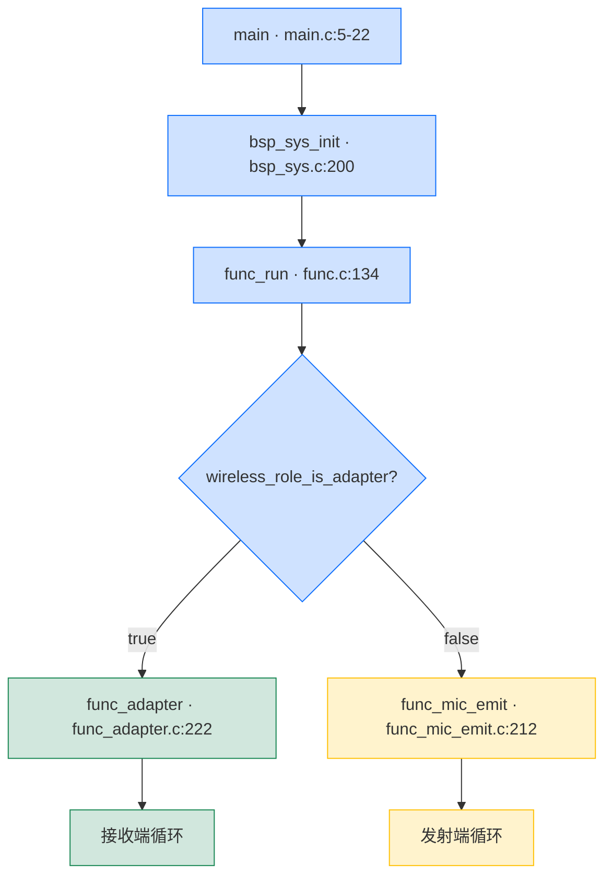

`wireless_role_is_adapter()` 等价于 `cfg_wireless_role`（见 `libs/ble/api_wireless_mic.h:52`），而 `cfg_wireless_role` 在 `modules/wireless/wireless.c:25` 定义为 `true`，**实际值由 `wireless_mic_var_init()` 设置**：

| 入口                                | `wireless_mic_role_init()` 见 `modules/wireless/wireless_proc.c:5-18` |
| ----------------------------------- | ------------------------------------------------------------ |
| `xcfg_cb.wireless_adapter_en` 为真  | `cfg_wireless_role = true` → **接收端**                      |
| `xcfg_cb.wireless_mic_emit_en` 为真 | `cfg_wireless_role = false` → **发射端**                     |
| 两者都关                            | 默认 `false` → **发射端**                                    |

`xcfg_cb` 由 `bsp_param_init()` 从 Flash 加载（`bsp/bsp_sys.c:243`），其中 `wireless_adapter_en` / `wireless_mic_emit_en` 是产测写入的标志位，**用于同一份固件烧到不同板子上时自动切换角色**。

### 1.2 角色判定决策图

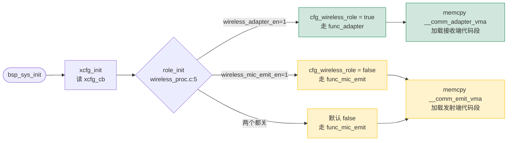

### 1.3 接收端功能入口

```
func_run()  [functions/func.c:148-177]
    └─ switch(func_cb.sta)
        case FUNC_ADAPTER:
            func_adapter()  [functions/func_adapter.c:222-239]
                ├─ func_adapter_enter()       [functions/func_adapter.c:204-213]
                ├─ while (func_cb.sta == FUNC_ADAPTER) {
                │      func_adapter_process()  [functions/func_adapter.c:165-202]
                │      msg = msg_dequeue()
                │      if (msg) func_adapter_message(msg)  [functions/msg_adapter.c:5-50]
                │  }
                └─ func_adapter_exit()        [functions/func_adapter.c:215-220]
```

`func_cb` 是一个全局状态机上下文（`functions/func.c:4`），`func_cb.sta` 在 `func.c` 顶层状态机里切换。

### 1.4 接收端与发射端的关键差异

| 维度     | 接收端 ADAPTER                               | 发射端 MIC_EMIT                                |
| -------- | -------------------------------------------- | ---------------------------------------------- |
| 角色     | 扫描回连的"主机"                             | 主动扫描/连接适配器的"从机"                    |
| 用户接口 | USB 麦克风 / 喇叭 DAC                        | 麦克风采集 + 按键                              |
| 蓝牙角色 | Advertiser（可被发现 + 可被连接）            | Scanner / Initiator                            |
| 音频流   | BLE RX → 解码 → DAC/USB                      | SDADC → 编码 → BLE TX                          |
| 关键全局 | `adapter` / `mic_dec` / `adapter_con`        | `mic_emit` / `mic_enc` / `device_con`          |
| 入口函数 | `func_adapter()` (`func_adapter.c:222`)      | `func_mic_emit()` (`func_mic_emit.c:212`)      |
| 消息入口 | `func_adapter_message()` (`msg_adapter.c:5`) | `func_mic_emit_message()` (`msg_mic_emit.c:5`) |
| 按键表   | `adapter_key_msg_tbl` (port_key.c:61-67)     | `mic_emit_key_msg_tbl` (port_key.c:43-58)      |

---

## 2. 接收端功能文件清单

| 文件                                         | 作用                                                         |
| -------------------------------------------- | ------------------------------------------------------------ |
| `functions/func_adapter.c`                   | 接收端状态机（广播、连接、退出）                             |
| `functions/func_adapter.h`                   | 公开 API（`func_adapter()`、`adapter_init/reset`）           |
| `functions/msg_adapter.c`                    | 接收端消息处理（USB 插拔、UART 命令）                        |
| `modules/wireless/wireless.c`                | 无线协议栈角色判定、连接管理、广播配置                       |
| `modules/wireless/wireless_proc.c`           | 蓝牙事件通知与连接状态机、`wireless_mic_var_init()`          |
| `modules/wireless/wireless_txrx_single.c`    | **单包**模式下的 RX 缓冲管理（默认编译路径）                 |
| `modules/wireless/wireless_txrx_comb.c`      | **组合包**模式下的 RX 缓冲管理（`WIRELESS_CON_COMB_BUF_EN=1` 时编译） |
| `modules/wireless/wireless_cmd.c`            | 私有命令收发环形缓冲                                         |
| `modules/wireless/wireless_cmd_api.c`        | 私有命令发送 API；接收端 `wireless_rx_cmd` 分发              |
| `modules/wireless/wireless_sync_param.c`     | 接收端同步参数（echo/soft_gain/magic/mic_mute）              |
| `modules/wireless/wireless_pwr_ctr.c`        | 自动功率控制（接收端评估 PER，命令发射端调档）               |
| `modules/wireless/wireless_dump.c`           | PER/RSSI 调试打印                                            |
| `modules/wireless/mic_proc.c`                | **接收端解码**（含 MIX_DRC） + 接收端 ADC 关闭               |
| `modules/audio/dac0_out.c`                   | DAC0 输出（接收端扬声器）                                    |
| `modules/audio/mic_eq_drc.c`                 | 硬件 EQ/DRC/MIX 算法封装（接收端用 mix_drc）                 |
| `modules/codec/lc3s.c`                       | LC3S 编码/解码（即时配置）                                   |
| `modules/voice/plc_soft.c`                   | PLC 丢包隐藏（适配器双通道）                                 |
| `bsp/bsp_sddac.c`                            | SDDAC 初始化与播放驱动                                       |
| `bsp/bsp_usb.c`                              | USB Device 框架（UAC MIC）                                   |
| `bsp/bsp_key.c`                              | ADC/IO 按键事件去抖                                          |
| `bsp/bsp_led.c`                              | LED 状态指示                                                 |
| `bsp/bsp_param.c`                            | Flash 参数读写                                               |
| `projects/microphone/config_ab5766_le_mic.h` | **当前默认配置**（所有功能开关）                             |

---

## 3. 启动流程：从 `main()` 到接收音频

下面是完整启动链路，**每个节点都标注了源文件与行号**。

### 3.1 顶层流程图

```
+----------------+      +----------------+      +-------------------+
|  main()        | ---> | bsp_sys_init() | ---> | func_run()        |
| [main.c:5-22]  |      | [bsp_sys.c:200]|      | [func.c:134-178]  |
+----------------+      +----------------+      +-------------------+
                                                          |
                                            wireless_role_is_adapter()
                                                          |
                              +---------------------------+----------------------------+
                              |                                                     |
                              v                                                     v
                    +-----------------+                                       +-----------------+
                    | func_adapter()  |                                       | func_mic_emit()  |
                    | 接收端          |                                       | 发射端          |
                    +-----------------+                                       +-----------------+
```

### 3.2 `bsp_sys_init()` 关键调用

`bsp/bsp_sys.c:200-267`：

| 调用                                   | 行号     | 作用                                                         |
| -------------------------------------- | -------- | ------------------------------------------------------------ |
| `xcfg_init(&xcfg_cb, sizeof(xcfg_cb))` | 202      | 加载 Flash 产测参数，覆盖 `xcfg_cb` 全局                     |
| `sys_get_rand_key_init(rand_seed)`     | 207      | 用 `xcfg_cb.le_addr[2..5]` 初始化 BLE 随机种子               |
| `bsp_var_init()`                       | 209      | 初始化 `sys_cb.pwroff`、`msg_queue` 等运行时                 |
| `wireless_mic_var_init()`              | 211      | **关键**：调用 `wireless_mic_role_init()` + `wireless_mic_load_code()` + `wireless_cmd_init()` |
| `pmu_init(cfg_pmu_get())`              | 213      | 配置 PMU BUCK/LDO                                            |
| `bsp_saradc_init()` / `bsp_key_init()` | 216, 220 | ADC 与按键初始化                                             |
| `led_init()`                           | 224      | LED 初始化                                                   |
| `power_on_check()`                     | 238      | 按住 PWR 才开机的逻辑                                        |
| `sys_clk_set(SYS_CLK_SEL)`             | 241      | 切主频（默认 24M）                                           |
| `bsp_param_init()`                     | 243      | 加载音量、绑定等参数                                         |
| `xosc_init()`                          | 245      | 晶振校准                                                     |
| `sys_set_tmr_enable(1, 1)`             | 248      | 启动 5ms / 1ms 定时器                                        |

`wireless_mic_var_init()` 定义于 `modules/wireless/wireless_proc.c:342-348`：

```c
void wireless_mic_var_init(void) {
    wireless_mic_role_init();      // [wireless_proc.c:5-18]  决定 cfg_wireless_role
    wireless_mic_load_code();      // [wireless_proc.c:24-32] 从 flash 拷贝接收端/发射端二进制
    wireless_cmd_init();           // [wireless_cmd_api.c:286-292] 初始化命令缓冲
}
```

`wireless_mic_load_code()` 是关键点：固件把发射端和接收端的两份独立二进制一起烧录，启动时根据角色只展开（`memcpy`）其中一份进 RAM（`wireless_proc.c:20-32` 中的 `__comm_emit_vma` / `__comm_adapter_vma` 符号）。

### 3.3 `func_run()` 顶层状态机

`functions/func.c:134-178`：

```c
void func_run(void) {
    if (wireless_role_is_adapter()) {
        func_cb.sta = FUNC_ADAPTER;
    } else {
        func_cb.sta = FUNC_MIC_EMIT;
    }

    while (1) {
        func_enter();                              // [func.c:115-125] 加载当前状态机的按键表
        switch (func_cb.sta) {
            case FUNC_MIC_EMIT: func_mic_emit(); break;     // [func_mic_emit.c:212]
            case FUNC_ADAPTER:  func_adapter();  break;     // [func_adapter.c:223]
            case FUNC_PWROFF:   func_pwroff();   break;     // (电源管理)
            default:             func_exit();     break;
        }
    }
}
```

`func_enter()` 在 `func.c:115-125` 做了三件事：

1. `bsp_param_sync()`：把 RAM 参数持久化到 Flash。
2. `lowpwr_sleep_delay_reset()` / `lowpwr_pwroff_delay_reset()`：复位低功耗计时。
3. **`key_set_msg_tbl(func_info[func_cb.sta].msg_tbl)`**：

`func_info` 是 `functions/func.c:6-20` 的一张表：

```c
[FUNC_ADAPTER]  = {adapter_key_msg_tbl,  0},   // 接收端按键映射表
[FUNC_MIC_EMIT] = {mic_emit_key_msg_tbl, 0},   // 发射端按键映射表
```

`adapter_key_msg_tbl` 定义在 `projects/microphone/port/port_key.c:61-67`，**当前默认仅 PP 长按 HOLD 触发 `MSG_PWR_HOLD`（关机）**，其他按键全部 `MSG_NO`。也就是说：**接收端无本地效应调节按键**，所有效应等级由发射端通过蓝牙命令推送。

---

## 4. 接收端状态机：`func_adapter()`

### 4.1 函数一览

`functions/func_adapter.c:36-239` 提供了 7 个函数：

| 行号    | 函数                                       | 作用                                                         |
| ------- | ------------------------------------------ | ------------------------------------------------------------ |
| 36-53   | `usb_detect()`                             | USB 设备插拔检测（`ADAPTER_USB_MIC_RX_EN`）                  |
| 57-69   | `func_adapter_init()`                      | 初始化 adapter 状态字段：`init_state = ADAPTER_STA_INIT_IDLE`，LED 设为"待连接" |
| 71-121  | `func_adapter_process_do()`                | **核心状态机**：处理 adv 切换、连接/断开反馈                 |
| 123-162 | `ble_set_con_id()` / `wireless_con_role()` | 主副麦切换（仅 `WIRELESS_CON_PAIR_MODE`）                    |
| 165-202 | `func_adapter_process()`                   | 每次循环调用：状态机 + 无线协议栈 + 公共 process             |
| 204-213 | `func_adapter_enter()`                     | 进态：清消息队列、初始化、调用 `bsp_ble_init()`              |
| 215-220 | `func_adapter_exit()`                      | 退态：关蓝牙                                                 |
| 222-239 | `func_adapter()`                           | 顶层循环（_enter → process ↔ message → _exit）               |

### 4.2 状态机详解

`func_adapter_process_do()` 在 `func_adapter.c:71-121` 内定义 4 个状态（`enum`，第 15-20 行）：

- `ADAPTER_STA_INIT_IDLE` 起始：决定是否可被发现、可被连接
- `ADAPTER_STA_INIT_W4_CONNECT` 临时态：等待 2 秒后切换到 START_ACTION
- `ADAPTER_STA_START_ACTION` 处理 `wireless_mic.change_flag` 之后的 adv 更新
- `ADAPTER_STA_IDLE` 稳定运行态（绝大多数时间停留）

**状态转移图**：

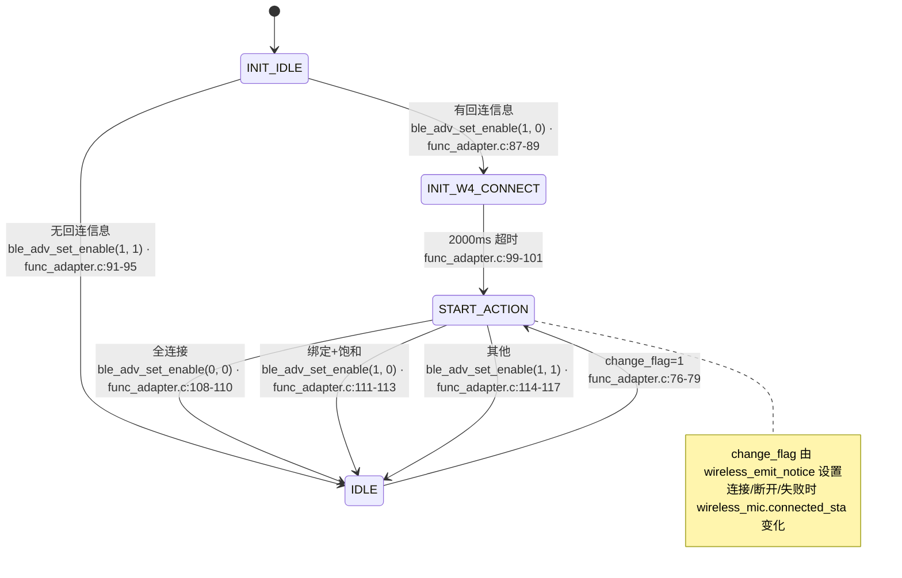

#### 4.2.1 关键转移点（带行号）

| 事件                           | 行号                     | 行为                                                         |
| ------------------------------ | ------------------------ | ------------------------------------------------------------ |
| `wireless_mic.change_flag = 1` | `func_adapter.c:76-79`   | 清 change_flag + 进入 `START_ACTION`                         |
| `INIT_IDLE` 有回连信息         | `func_adapter.c:87-89`   | `ble_adv_set_enable(1, 0)` → `INIT_W4_CONNECT`（可连接，不可发现） |
| `INIT_IDLE` 无回连信息         | `func_adapter.c:91-95`   | `ble_adv_set_enable(1, 1)` → `IDLE`（可连接 + 可发现）       |
| `INIT_W4_CONNECT` 2 秒超时     | `func_adapter.c:99-101`  | → `START_ACTION`                                             |
| `START_ACTION` 全连接          | `func_adapter.c:108-110` | `ble_adv_set_enable(0, 0)`：关闭广播                         |
| `START_ACTION` 绑定 + 配对饱和 | `func_adapter.c:111-113` | `ble_adv_set_enable(1, 0)`：等待被连                         |
| `START_ACTION` 其余情况        | `func_adapter.c:114-116` | `ble_adv_set_enable(1, 1)`：可发现 + 可被连                  |

#### 4.2.2 状态机调度

`func_adapter_process()` (`func_adapter.c:165-202`) 每次循环做：

1. **PAIR_MODE 特例**：调用 `wireless_con_role()`（行 175-183，仅在 `WIRELESS_CON_PAIR_MODE=1` 时编译）。
2. **状态机**：`func_adapter_process_do()`（行 184-186）—— 仅在 `init_state != IDLE` 或 `wireless_mic.change_flag=1` 时执行。
3. **LED 切换**：`wireless_mic_proc()`（行 188-190）—— 当 `connected_sta` 变化时调用，更新 `led_bt_idle()` / `led_bt_connected()`。
4. **公共 process**：`func_process()`（行 191）—— 喂看门狗、跑 `bt_run_loop`、跑充电检测。
5. **USB MIC RX**：`usb_detect()` + `usb_device_process()`（行 192-199，`ADAPTER_USB_MIC_RX_EN=1`）。
6. **调试**：`wireless_dump_proc()`（行 201，`WIRELESS_DUMP_EN=1` 时打印 PER，当前默认 0）。

### 4.3 主循环

`func_adapter()` (`func_adapter.c:222-239`)：

```c
void func_adapter(void) {
    printf("%s\n", __func__);
    func_adapter_enter();          // 204-213: 清队列、调用 bsp_ble_init()
    while (func_cb.sta == FUNC_ADAPTER) {
        func_adapter_process();    // 165-202: 状态机 + 协议栈 + 公共
        u16 msg = msg_dequeue();
        if (msg != MSG_NO) {
            func_adapter_message(msg);   // [msg_adapter.c:5]  按键/事件消息分发
        }
    }
    func_adapter_exit();           // 215-220: 关蓝牙
}
```

### 4.4 进入与退出

**进入**：`func_adapter_enter()` (`func_adapter.c:204-213`)

```c
msg_queue_clear();
#if ADAPTER_UART_COMMAND_EN
    uart_command_init();        // 与 560x 通信（默认关闭）
#endif
func_adapter_init();           // 状态字段清零 + led_bt_idle()
bsp_ble_init();                // [wireless.c:223-239] 蓝牙子系统初始化
```

`bsp_ble_init()`（`modules/wireless/wireless.c:223-239`）会调用 `wireless_con_adapter_init()`（接收端）或 `wireless_con_device_init()`（发射端），根据 `wireless_role_is_adapter()` 决定初始化 RX 还是 TX 缓冲（见 `wireless_txrx_single.c:329-336` 或 `wireless_txrx_comb.c:223-237`）。

**退出**：`func_adapter_exit()` (`func_adapter.c:215-220`)：

```c
bt_off();                                              // 关蓝牙
func_cb.last = FUNC_ADAPTER;
```

> 与发射端不同，接收端**不调用** `adapter_reset` 直接在退出里清理——`wireless_emit_notice` 收到断开消息时已经清理。这里只是关蓝牙协议栈。

---

## 5. 接收端消息分发：`func_adapter_message()`

`functions/msg_adapter.c:5-50` 是 `func_adapter()` 循环里处理消息的入口。**接收端只关心 USB 插拔和 UART 命令**：

| 消息                    | 行号  | 动作        | 关键调用                                                     |
| ----------------------- | ----- | ----------- | ------------------------------------------------------------ |
| `EVT_PC_INSERT`         | 18-22 | PC 插入 USB | `usb_device_enter(UDE_ENUM_TYPE)` → `adapter_usb_init_flag = 1` |
| `EVT_PC_REMOVE`         | 24-28 | PC 拔出 USB | `usb_device_exit()` → `adapter_usb_init_flag = 0`            |
| `EVT_UART_COMMAND_PROC` | 36-38 | UART 命令   | `uart_command_rx_proc()`（`ADAPTER_UART_COMMAND_EN`）        |
| `MSG_SYS_1S`            | 41-45 | 1 秒调试    | `wireless_mic_dump()`（`WIRELESS_MIC_DUMP_PER_BER`）         |
| default                 | 46-48 | 通用消息    | `func_message(msg)`                                          |

**消息源**：

1. **按键事件**：`bsp_key_scan()` → `key_msg_tbl[][]` → `msg_enqueue()`（`bsp/bsp_key.c:71-135`）。当前默认 `adapter_key_msg_tbl` 仅 PP HOLD 触发 `MSG_PWR_HOLD`。
2. **USB 检测**：`usb_detect()`（`func_adapter.c:36-53`）—— 检查 `usbchk_connect()`、`dev_online_filter()`，发 `EVT_PC_INSERT` / `EVT_PC_REMOVE`。
3. **蓝牙内部**：`wireless_emit_notice()`（`modules/wireless/wireless_proc.c:91-295`）在连接成功/失败/断开时设 `wireless_mic.change_flag=1`，被 `func_adapter_process_do()` 消费。

### 5.1 USB 检测（`usb_detect`）

`func_adapter.c:36-53`：

```c
void usb_detect(void) {
    u8 usb_sta = usbchk_connect();
    if (usb_sta == 1) {
        if (dev_online_filter(DEV_USBPC)) {
            msg_enqueue(EVT_PC_INSERT);
        }
    } else {
        if (dev_offline_filter(DEV_USBPC)) {
            msg_enqueue(EVT_PC_REMOVE);
            pc_remove();
        }
    }
}
```

`DEV_USBPC=0`，`DEV_TOTAL_NUM=1`（`func_adapter.c:22-25`）。`DEV_*` 设备去抖由 `modules/device/device.c` 提供。

`adapter_usb_init_flag` 在 `func_adapter_process()`（行 197-199）里决定是否跑 `usb_device_process()`：

```c
if (adapter_usb_init_flag) {
    usb_device_process();
}
```

---

## 6. 音频数据通路：蓝牙 → 解码 → DAC/USB

### 6.1 链路总览

```mermaid
flowchart LR
    TX((蓝牙 RX<br/>远程 mic_emit)) --> get_rx[wireless_d2a_get_rx_frame<br/>wireless_txrx_single.c:266]
    get_rx --> kick[kick_dec_prio_trans<br/>推到工作线程]
    kick --> dec_cb[mic_dec_prco_cb<br/>mic_proc.c:550]
    dec_cb --> bfi{bfi 错包?}
    bfi -->|yes| skip[跳过解码]
    bfi -->|no| decode[lc3s_dec<br/>mic_proc.c:575]
    decode --> plc[plc_soft_process<br/>plc_soft.c:11]
    skip --> plc
    plc --> pcm_out[mic_dec_pcm_out<br/>mic_proc.c:504]
    pcm_out --> mix{mix_drc?}
    mix -->|yes| mixdrc[mix_drc_audio_input<br/>mic_eq_drc.c:62]
    mix -->|no| avg[简单平均 pcm0/2+pcm1/2]
    mixdrc --> dac
    avg --> dac{输出}
    dac --> dac0_out[dac0_out_audio_input<br/>dac0_out.c:32]
    dac --> usb_mic[usb_mic_in_audio_input<br/>mic_proc.c:474]
    dac0_out --> sddac[SDDAC → 喇叭]
    usb_mic --> uac[UAC → PC]
    classDef io fill:#cfe2ff,stroke:#0d6efd
    classDef proc fill:#fff3cd,stroke:#ffc107
    classDef out fill:#d1e7dd,stroke:#198754
    class TX,get_rx,kick io
    class dec_cb,bfi,decode,plc,skip,pcm_out,mix,mixdrc,avg,dac proc
    class dac0_out,usb_mic,sddac,uac out
```

| 缩写    | 全称                               | 中文译名             | 核心作用                     |
| :------ | :--------------------------------- | :------------------- | :--------------------------- |
| **BFI** | Bad Frame Indicator                | 坏帧指示器           | 标记数据包是否有效           |
| **LC3** | Low Complexity Communication Codec | 低复杂度通信编解码器 | 蓝牙 LE Audio 标准音频编解码 |
| **PLC** | Packet Loss Concealment            | 丢包隐藏/补偿        | 修复丢包造成的音频中断       |
| **DRC** | Dynamic Range Compression          | 动态范围压缩         | 自动调节音量，使听感更平稳   |

### 6.2 声波数据流（kick_dec_prio_trans 跨线程切换）

```
BLE 驱动 ISR` → `wireless_d2a_set_rxpkt_cb` → `wireless_d2a_set_rxdec_cb` → `kick_dec_prio_trans(idx)` → 工作线程 `mic_dec_prco_cb(idx)
```

### 6.3 关键代码节点

#### 6.3.1 接收端初始化

`adapter_init()`（`modules/wireless/mic_proc.c:700-734`）按配置开关依次初始化：

```c
adapter_alg_init();                                          // 702  -> plc_soft_init x 2
memset(&mic_dec, 0x00, sizeof(mic_dec));                     // 705
#if WIRELESS_CON_LINK_NB > 1 && !WIRELESS_CON_COMB_BUF_EN
    // 算 frag_samples[0/1] (双链路拆半帧)                   // 706-710
#endif
#if WIRELESS_CON_CODEC_SEL == CODEC_LC3S
    lc3s_dec_init(WIRELESS_MIC_SAMPLE_RATE_SELECT, WIRELESS_MIC_SAMPLES_SELECT);  // 719
#endif
#if ADAPTER_MIX_DRC_EN
    mix_drc_init();                                          // 722 -> loc_mic_pacc_init+enable
#endif
#if ADAPTER_HUART_AUDIO_OUTPUT_EN
    huart_audio_output_init();                               // 725
#endif
#if ADAPTER_DAC_OUTPUT_EN
    dac0_out_init(0, WIRELESS_MIC_SAMPLES_SELECT, 0);         // 729 -> SDDAC 完整初始化
#endif
wireless_host_ch_class_set();                                // 732 -> 设置频段信道图
```

> ⚠️ 注意：`adapter_init` 完全在 `wireless_emit_notice(BT_NOTICE_WIRELESS_CONNECTED)` 第一次连接成功时调用（`wireless_proc.c:104-105`），**不是**在 `func_adapter_enter()` 里——后者只跑 `bsp_ble_init()` 初始化 RX 缓冲。这里区别于发射端，发射端 `mic_emit_init` 也是在连接成功时调用，以节约功耗。

#### 6.3.2 接收端清理

`adapter_reset()`（`modules/wireless/mic_proc.c:736-750`）：

```c
mic_dec_reset(idx);                // 清 last_bfi[idx] + pcm[idx].buf
plc_soft_exit(idx);                // PLC 关闭
wireless_cmd_reset(idx);           // 清 TX 命令队列
m_lc3s_dec_exit(idx);              // LC3S 反初始化
if(con_sta == 0) {                 // 全断
    mic_dec.obuf_off = 0;
#if ADAPTER_DAC_OUTPUT_EN
    dac0_out_exit();               // 关 DAC
#endif
}
```

在 `wireless_emit_notice(BT_NOTICE_WIRELESS_DISCONNECT)` 时调用（`wireless_proc.c:181`）。

#### 6.3.3 接收处理回调（**核心解码链路**）

`mic_dec_prco_cb()`（`modules/wireless/mic_proc.c:550-594`）：

```c
void mic_dec_prco_cb(u8 idx) {
    s16 *pcm = (s16 *)&mic_dec.pcm[idx].buf;
    u32 samples = WIRELESS_MIC_SAMPLES_SELECT;

    if (sys_cb.mic_alg_en) {
        u8 con_status = ble_con_get_status();
        if (con_status & BIT(idx)) {
            bool bfi = wireless_d2a_get_rx_frame(idx, mic_dec.frame, WIRELESS_MIC_FRAME_SIZE);  // 565

            if (!bfi) {
                #if WIRELESS_CON_CODEC_SEL == CODEC_LC3S
                    lc3s_dec(mic_dec.frame, pcm, samples, idx);                                // 575
                #endif
            }
            plc_soft_process(pcm, samples, mic_dec.last_bfi[idx] || bfi, idx);                  // 579
            mic_dec.last_bfi[idx] = bfi;
        }
    } else {
        memset(pcm, 0x00, samples * 2);
    }

    mic_dec_pcm_out(idx);                                                                       // 586

    if (idx == mic_dec.sync_idx) {
        mic_dec_dac_sync_proc();                                                                 // 590  -> 调速
    }
}
```

#### 6.3.4 解码输出双链路处理

`mic_dec_pcm_out()`（`mic_proc.c:504-546`，单包模式）：

```c
void mic_dec_pcm_out(u8 idx) {
    #if (WIRELESS_CON_LINK_NB == 1)
        // 单链路：直接输出
        #if ADAPTER_USB_MIC_RX_EN
            usb_mic_in_audio_input(pcm, samples, 0, 0);                                          // 509
        #endif
        #if ADAPTER_DAC_OUTPUT_EN
            dac0_out_audio_input(pcm, samples, 0);                                              // 512
        #endif
    #else
        // 双链路（前/后半帧拆分）
        if (idx == 0) {
            // 通道 1 前半帧 + 通道 2 后半帧
            mic_dec_pcm_out_frag0(idx, 0);                                                       // 521
            if (con_status & ~BIT(idx)) == 0) {  // 通道 2 未连
                mic_dec_pcm_out_frag1(idx, 0);                                                   // 528
            }
        } else {
            // 通道 2 解码完，再输出 frag0
            if (mic_dec.frag0_done_flag) {
                mic_dec_pcm_out_frag1(idx, 0);                                                   // 534
            }
            if ((con_status & ~BIT(idx)) == 0) {  // 通道 1 未连
                mic_dec_pcm_out_frag0(idx, 0);                                                   // 541
            }
        }
    #endif
}
```

COMB_BUF 模式（`mic_proc.c:393-425`）：两条链路拼成完整双声道，然后整体送 `mix_drc_audio_input` / `callback`。

#### 6.3.5 帧写入 RX 缓冲（链路 → 应用）

`wireless_d2a_get_rx_frame()`（`modules/wireless/wireless_txrx_single.c:265-270`）：

```c
u8 wireless_d2a_get_rx_frame(u8 idx, u8 *buf, uint size) {
    return rxpkt_get_frame(&adapter_con.mic_rx[idx], buf);  // 单包
}
```

组合包版本：`wireless_txrx_comb.c:120-136` 的 `wireless_d2a_get_rx_frame()`。

#### 6.3.6 调度回调

| 回调                        | 定义                             | 作用                            |
| --------------------------- | -------------------------------- | ------------------------------- |
| `wireless_d2a_adc_dma_cb`   | `wireless_txrx_single.c:293-297` | TX 启动 ADC（接收端**不调用**） |
| `wireless_d2a_set_rxpkt_cb` | `wireless_txrx_single.c:256-262` | 收到一包 RX 数据                |
| `wireless_d2a_set_rxdec_cb` | `wireless_txrx_single.c:273-281` | 收完一包，触发解码              |
| `wireless_d2a_dac_dma_cb`   | `wireless_txrx_single.c:284-288` | 解码完成 → 启动 DAC DMA         |
| `wireless_d2a_dac_fifo_cb`  | `wireless_txrx_single.c:243-248` | DAC 取 FIFO 计数                |
| `wireless_d2a_end_ind_cb`   | `wireless_txrx_single.c:314-326` | 链路断开                        |

`wireless_d2a_set_rxdec_cb()` 关键：

```c
void wireless_d2a_set_rxdec_cb(u8 idx, bool rxdone) {
    if (rxdone) {
        rxpkt_done(&adapter_con.mic_rx[idx]);
    }
    kick_dec_prio_trans(idx);   // 推到工作线程，避免阻塞 BLE 调度
}
```

`kick_dec_prio_trans(idx)` 触发 `mic_dec_prco_cb(idx)` 在线程上下文执行。

#### 6.3.7 DAC 调速

`mic_dec_dac_sync_proc()`（`mic_proc.c:64-80`）：

```c
static void mic_dec_dac_sync_proc(void) {
    if (mic_dec.fifo_sta <= 10) {
        mic_dec.fifo_sta++;
        return;
    }
    uint high_thr, low_thr;
    uint samples = cfg_wireless_d2a_dec_us*48/1000;
    high_thr = samples + 12;
    low_thr = samples + 6;
    mic_dec.fifo_sta = 0;
    dac0_play_sync_fifocnt(high_thr, low_thr);   // 调整 DACSRC0PHAI 防止漂移
}
```

调用时机：`mic_dec_prco_cb()` 末尾当 `idx == mic_dec.sync_idx` 时（`mic_proc.c:588-591`）。

#### 6.3.8 编码器选择

`WIRELESS_CON_CODEC_SEL`（`projects/microphone/config_ab5766_le_mic.h:64`）当前默认 `CODEC_LC3S`。

LC3S 帧大小：见 `WIRELESS_MIC_FRAME_SIZE`（`config_ab5766_le_mic.h:80`，默认 25 字节），由 `WIRELESS_MIC_SAMPLES_SELECT`（默认 120 samples，48kHz 下 2.5ms）共同决定。

---

## 7. 蓝牙键路与协议栈

### 7.1 关键连接参数

`modules/wireless/wireless.c:11-32` 定义了 BLE 行为的所有数值：

| 名称                        | 值                                                           | 含义             |
| --------------------------- | ------------------------------------------------------------ | ---------------- |
| `cfg_wireless_con_interval` | `WIRELESS_CON_INTERVAL * LINK_NB`（`config_ab5766_le_mic.h` 默认 2×2=4，单位 1.25ms = 5ms） | 连接间隔         |
| `cfg_wireless_tx_interval`  | `WIRELESS_MIC_TX_INTERVAL`（默认 4，单位 1.25ms = 5ms）      | 音频发送周期     |
| `cfg_wireless_tx_retry`     | `WIRELESS_MIC_RETRY_NB`（默认 3）                            | 单包重传次数     |
| `cfg_wireless_d2a_tx_size`  | `MIC_TX_BUFFER_SIZE`                                         | 发射 buffer 大小 |
| `cfg_wireless_d2a_enc_us`   | 编码 + 所有算法延迟（`wireless.c:19-20`）                    | 接收端等待补偿   |
| `cfg_wireless_d2a_dec_us`   | 解码 + MIX_DRC 延迟（`wireless.c:22`）                       | 解码侧的预估耗时 |
| `cfg_wireless_feat`         | 版本+d2a+hop+bonding+link_nb 位                              | 协议特性字       |
| `cfg_wireless_codec[0]`     | `CODEC_LC3S | CODEC_MONO`                                    | 编码及单声道     |

### 7.2 关键回调路径

```
BLE 事件 (底层中断)
    |
    v
wireless_emit_notice(evt, params)  [modules/wireless/wireless_proc.c:91-295]
    |  (BT_NOTICE_WIRELESS_CONNECTED)
    |     sys_clk_req(INDEX_DECODE, SYS_160M);   // 103  抬主频
    |     if (adapter) adapter_init(); else mic_emit_init();   // 104-109
    |     sys_cb.mic_alg_en = 1;                  // 110
    |     wireless_mic.connected_sta |= BIT(mic_num);  // 123
    |     wireless_mic.change_flag = 1;           // 125
    v
wireless_mic.change_flag 由 func_adapter_process_do() 读取
```

### 7.3 接收端视角的蓝牙流程

`func_adapter_process_do()` 调用 `ble_adv_set_enable()`（`api_wireless_mic.h:64`）：

```c
ble_adv_set_enable(pscan, iscan);  // pscan=可被连接, iscan=可被发现
```

| 状态            | pscan | iscan | 行为                                     |
| --------------- | ----- | ----- | ---------------------------------------- |
| 无绑定回连信息  | 1     | 1     | 可被发现 + 可被连                        |
| 有绑定回连信息  | 1     | 0     | 只可被连（不回连发射端，由发射端主动连） |
| 全连 + 绑定     | 0     | 0     | 关闭广播                                 |
| 全连 + 绑定饱和 | 1     | 0     | 等待下一个发射端连接                     |

### 7.4 一拖二：双麦连接

`WIRELESS_CON_LINK_NB=2`（`config_ab5766_le_mic.h:76`）代表接收端最多可同时连 2 个话筒。接收端侧需要处理：

- `wireless_mic.connected_sta`：bitmask，`BIT(0)`/`BIT(1)` 表示麦 0/麦 1。
- `WIRELESS_MIC_STA_MASK`（`wireless_proc.h:4`）：`(1<<LINK_NB)-1 = 0x03`，用于判断"全连"。

双链路同时解码时，`mic_dec.pcm[0]` / `mic_dec.pcm[1]` 各自缓存 1 帧 PCM，由 `mic_dec_pcm_out()` 拼/混。

`mic_dec_pcm_out()` 在 `LINK_NB == 2` 时按 `frag0/frag1` 分帧处理（`mic_proc.c:516-544`），需要 `usb_con_link_duration_get()` 算 `frag_samples[0/1]` 来对齐麦克风的 1.25ms 周期边界。

### 7.5 配对模式（`WIRELESS_CON_PAIR_MODE`）

`func_adapter.c:123-162` 中：

- `ble_set_con_id(param)`：动态改 `cfg_wireless_con_id` + `btstack_ble_reset_hash(2)` + 重启广播。
- `wireless_con_role()`：未连时每 3 秒切换一次 `ADAPTER_SET_TX1_CON_ID` / `ADAPTER_SET_TX2_CON_ID`，让两个发射端分别连入主麦/副麦。

**当前默认关闭**：`WIRELESS_CON_PAIR_MODE=0`（`config_ab5766_le_mic.h:72`），上述代码不编译。

---

## 8. 私有命令与参数同步

接收端通过蓝牙私有命令通道接收发射端发来的命令。

### 8.1 命令接收路径

```
ble_con_user_cmd_rx_cb(index, pdu)        [wireless_cmd.c:115-118]
    → wireless_rcv_cmd(index, cmd, len)   [wireless_cmd.c:66-71]
    → wireless_rx_cmd(index, ptr, len)    [wireless_cmd_api.c:256-283]
        ├─ PRIVATE_WS_MIC_CMD     → wireless_ws_mic_cmd (含 DISCONNECT_NUM)
        ├─ PRIVATE_USB_CMD        → wireless_rx_usb_cmd (ADB USB 命令)
        ├─ PRIVATE_PWR_CTR_CMD    → ble_audio_pwr_ctr_set
        ├─ PRIVATE_SYNC_CMD       → wireless_rx_adapter_private_sync_cmd
        └─ default                → wireless_rx_user_cmd (adapter 端空)
```

### 8.2 接收端命令 API

`modules/wireless/wireless_cmd_api.c`：

| 行号    | 函数                        | 方向 | 作用                                                         |
| ------- | --------------------------- | ---- | ------------------------------------------------------------ |
| 8-18    | `wireless_tx_usb_cmd`       | TX   | 发送 USB 子命令                                              |
| 20-30   | `wireless_tx_user_cmd`      | TX   | 私有 USER_DATA 发送                                          |
| 32-41   | `wireless_tx_ws_mic_cmd`    | TX   | 发送 WS MIC 命令（mute/等级变化）                            |
| 43-52   | `wireless_tx_audio_ctr_cmd` | TX   | 音频控制（调试）                                             |
| 54-63   | `wireless_tx_user_link_cmd` | TX   | WS MIC 链路命令                                              |
| 65-72   | `wireless_tx_bonding_sync`  | TX   | 发送 BONDING 地址                                            |
| 74-83   | `wireless_tx_pwr_ctr_cmd`   | TX   | 发送功率控制命令                                             |
| 143-204 | `wireless_ws_mic_cmd`       | RX   | 处理 WS MIC 命令（仅 `DISCONNECT_NUM` 有效）                 |
| 207-249 | `wireless_rx_usb_cmd`       | RX   | 处理 USB 子命令（`ADAPTER_USB_SPK_TX_EN` 或 `ADAPTER_USB_MIC_RX_EN`） |
| 256-283 | `wireless_rx_cmd`           | RX   | 统一分发                                                     |
| 285-292 | `wireless_cmd_init`         | 公共 | 初始化命令缓冲                                               |

**接收端 `wireless_ws_mic_cmd` 当前仅一个有效分支**（`wireless_cmd_api.c:197-199`）：

```c
case DISCONNECT_NUM:
    ble_disconnect_req(pdu->buf[TX_MAX_BUF_SIZE-1]);   // 断开指定 idx
    break;
```

其他 case 全部被注释掉（`wireless_cmd_api.c:148-196`）。

### 8.3 同步参数

`modules/wireless/wireless_sync_param.c`：

| 行号    | 函数                                    | 方向         | 作用                               |
| ------- | --------------------------------------- | ------------ | ---------------------------------- |
| 10-20   | `wireless_tx_echo_delay_level`          | TX           | 发送 echo 等级                     |
| 23-33   | `wireless_tx_soft_gain_level`           | TX           | 发送 soft_gain 等级                |
| 36-45   | `wireless_tx_magic_effect_level`        | TX           | 发送 magic 等级                    |
| 48-57   | `wireless_tx_mic_mute_level`            | TX           | 发送 mic_mute                      |
| 61-71   | `wireless_tx_mutual_hair_act`           | TX           | 双链同步动作                       |
| 74-83   | `wireless_tx_voice_rm_en`               | TX           | 发送 voice_rm                      |
| 86-125  | `wireless_rx_mic_emit_private_sync_cmd` | RX (TX 端)   | 接收 TX 同步命令（**当前被注释**） |
| 131-143 | `wireless_sync_echo_delay_level`        | RX (adapter) | 广播 echo 等级给两个 mic           |
| 145-157 | `wireless_sync_soft_gain_level`         | RX (adapter) | 广播 soft_gain                     |
| 159-170 | `wireless_sync_mic_magic_effect_level`  | RX (adapter) | 广播 magic                         |
| 172-183 | `wireless_sync_mic_mute_level`          | RX (adapter) | 广播 mic_mute                      |
| 185-199 | `wireless_sync_all_param`               | RX (adapter) | 连接建立后广播全参数               |
| 202-278 | `wireless_rx_adapter_private_sync_cmd`  | RX (adapter) | 接收 mic 同步命令                  |
| 280-296 | `wireless_sync_param_init`              | RX (adapter) | 初始化同步参数                     |

#### 8.3.1 接收端同步路径

`wireless_rx_adapter_private_sync_cmd()`（`wireless_sync_param.c:202-278`）：

- `PRIVATE_SYNC_ECHO_DELAY_LEVEL` (行 209-221)：
  - 存本地（`ADAPTER_SYNC_PARAM_EN`）
  - 调 `wireless_sync_echo_delay_level`（若 `ADAPTER_SYNC_PARAM_EN`）
  - 写 flash（`ADAPTER_SYNC_PARAM_MEMORY_EN`）
  - UART 上报（`ADAPTER_UART_COMMAND_EN`）
- `PRIVATE_SYNC_SOFT_GAIN_LEVEL` (行 223-239)：同上，根据 `max_min_flag` 上报 `AB_ASK_VOICE` 或 `AB_ASK_VOICE_MAX_MIN`。
- `PRIVATE_SYNC_MAGIC_EFFECT_LEVEL` (行 241-253)：同上。
- `PRIVATE_SYNC_MIC_MUTE_LEVEL` (行 255-267)：同上。
- `PRIVATE_SYNC_VOICE_RM` (行 269-274)：仅 UART 上报。

#### 8.3.2 接收端主动同步

`wireless_sync_all_param()`（`wireless_sync_param.c:185-199`）在 `wireless_emit_notice(BT_NOTICE_WIRELESS_CONNECTED)` 第一次连接成功时调用（`wireless_proc.c:120-121`），把 `wireless_sync_prarm` 全包发给两个 mic：

```c
pdu.cmd = PRIVATE_SYNC_CMD;
pdu.buf[0] = PRIVATE_SYNC_ALL_PARAM;
pdu.buf[1..4] = {echo, magic, soft_gain, mic_mute};
wireless_send_cmd(0, &pdu, 6);
wireless_send_cmd(1, &pdu, 6);
```

#### 8.3.3 同步参数存储

```
wireless_sync_prarm_t {
    u8 echo_delay_level;
    u8 magic_effect_level;
    u8 soft_gain_level;
    u8 mic_mute_en;
}
```

定义在 `wireless_sync_param.h:17-22`。

`wireless_sync_param_init()`（`wireless_sync_param.c:280-296`）：

- 仅 adapter 端执行。
- 读取配置（`ADAPTER_SYNC_PARAM_MEMORY_EN`）或硬默认（`ECHO_DELAY_DEFAULT_LEVEL - 1` 等）。
- **当前默认**：`ADAPTER_SYNC_PARAM_EN=0`、`ADAPTER_SYNC_PARAM_MEMORY_EN=0`，所以"接收端控制两个 mic 的 echo/magic/soft_gain/mic_mute"功能**未启用**——各 mic 端独立控制。

### 8.4 命令环形缓冲

`modules/wireless/wireless_cmd.c:7-14`：

```c
#define CMD_MAX_NB          4
#define CMD_MAX_SIZE        9

struct cmd_tag {
    u8 buf[CMD_MAX_NB][CMD_MAX_SIZE+1];
    u8 w_idx, r_idx, total;
};
static struct cmd_tag txcmd[WIRELESS_CON_LINK_NB];   // 每链路一个
```

收发顺序：`cmd_buf_alloc` → `cmd_buf_add` → `cmd_buf_get`。

`wireless_cmd_reset()`（`wireless_cmd.c:101-109`）在 `adapter_reset()` 时调用（`mic_proc.c:741`），关中断清索引。

---

## 9. 自动功率控制（PWR_CTR）

`WIRELESS_CON_PWR_CTR=0`（默认关闭）时本节无关。

开启时由 `modules/wireless/wireless_pwr_ctr.c` 实现：

- `ws_rx_info_str_t`：每条链路的丢包统计（`wireless_pwr_ctr.h:13-19`）。
- `ws_pwr_ctr_rx_process()`（`wireless_pwr_ctr.c:37-73`）：每包一次回调，累加 `rx_cnt/rx_fail_cnt`，达到 `RX_CYCLE_NUM=400` 时计算 PER 并按需调档。
- `ws_pwr_ctr_tx_cmd_process()`（`wireless_pwr_ctr.c:75-84`）：发出 `wireless_tx_pwr_ctr_cmd()` 给发射端。

**档位常量**：`MAX_PWR_LEVEL=0`（最大功率）、`MIN_PWR_LEVEL=4`（最小功率）。INC/DEC 控制加减档（`wireless_pwr_ctr.h:10-11`）。

> 当前默认配置 (`config_ab5766_le_mic.h:69`) 中 `WIRELESS_CON_PWR_CTR=0`，**当前默认不启用**。

---

## 10. 算法模块速查

接收端默认配置启用以下模块（`config_ab5766_le_mic.h:120-133`）：

| 宏                              | 默认 | 含义                      | 关键调用                                           |
| ------------------------------- | ---- | ------------------------- | -------------------------------------------------- |
| `ADAPTER_DAC_OUTPUT_EN`         | 1    | DAC 喇叭输出              | `dac0_out_init()` `dac0_out_audio_input()`         |
| `ADAPTER_USB_SPK_TX_EN`         | 0    | USB 喇叭输出（下行音频）  | —                                                  |
| `ADAPTER_USB_MIC_RX_EN`         | 1    | USB 麦克风 UAC            | `usb_device_enter/exit` `usb_mic_in_audio_input()` |
| `ADAPTER_MIX_DRC_EN`            | 1    | 一拖二混音 DRC            | `mix_drc_init()` `mix_drc_audio_input()`           |
| `ADAPTER_SYNC_PARAM_EN`         | 0    | 接收端控制两个 mic 的参数 | —                                                  |
| `ADAPTER_FREQ_SHIFT_EN`         | 0    | 防啸叫移频                | —                                                  |
| `ADAPTER_HUART_AUDIO_OUTPUT_EN` | 0    | Huart 音频输出            | —                                                  |
| `ADAPTER_UART_COMMAND_EN`       | 0    | 与 560x UART 命令         | `uart_command_*`                                   |
| `ADAPTER_SYNC_PARAM_MEMORY_EN`  | 0    | 同步参数持久化            | —                                                  |
| `ADAPTER_DNR_FRE_EN`            | 0    | DNR FRE 降噪（调试）      | —                                                  |

### 10.1 接收端算法数据流

```
[LC3S 解码] pcm = full sample
  ↓
[PLC 处理] plc_soft_process(pcm, samples, bfi, idx)
  ↓
[输出到 obuf] mic_dec_pcm_out_samples / mic_dec_pcm_out
  ↓
[混音] mix_drc_audio_input(pcm0, pcm1, obuf, samples)  // ADAPTER_MIX_DRC_EN
  ↓
[DAC] dac0_out_audio_input(obuf, samples, 0)            // ADAPTER_DAC_OUTPUT_EN
  ↓
[USB Mic] usb_mic_in_audio_input(obuf, samples, 0, 0)   // ADAPTER_USB_MIC_RX_EN
```

### 10.2 MIX_DRC（硬件 PACC）

`modules/audio/mic_eq_drc.c:61-78`：

```c
void mix_drc_audio_input(mic_pcm_t *pcm0, mic_pcm_t *pcm1, mic_pcm_t *output, u16 samples) {
    mix_pacc_process(output, pcm0, pcm1, samples);
}

void mix_drc_init(void) {
    mix_pacc_init();
    mix_pacc_set_param();
    mix_pacc_enable();
}
```

`mix_pacc_*` 调用硬件 PACC（Programmable Audio Compute Controller）处理混音后的 DRC。

### 10.3 DAC0 输出

`modules/audio/dac0_out.c`：

- `dac0_out_init()`（行 89-139）：完整 SDDAC 初始化（aubuf、src、mix、ana、pic_config）。
- `dac0_out_audio_input()`（行 32-46）：写入 PCM 到 `SDDAC_AUBUF0`。
- `dac0_play_sync_fifocnt()`（行 56-77）：调整 `DACSRC0PHAI` 防止漂移。
- `dac0_out_exit()`（行 141-151）：wait fifo empty → `dac_power_off()` → `sddac_deinit()`。

接收端调用：

```
adapter_init() → dac0_out_init(0, SAMPLES, 0)        [mic_proc.c:729]
mic_dec_pcm_out_samples() → dac0_out_audio_input()    [mic_proc.c:466]
adapter_reset(con_sta=0) → dac0_out_exit()            [mic_proc.c:746]
```

### 10.4 PLC 丢包隐藏

`modules/voice/plc_soft.c`：

- `plc_soft_init(idx, samples, sample_rate)`（行 19-53）：选 8K/16K 参数。
- `plc_soft_process(pcm, samples, bfi, idx)`（行 11-16）：包丢失时插值。
- `plc_soft_exit(idx)`（行 56-64）：关闭。

接收端调用：

```
adapter_init() → plc_soft_init(0,..) + plc_soft_init(1,..)   [mic_proc.c:84-85]
mic_dec_prco_cb() → plc_soft_process(..., bfi, idx)          [mic_proc.c:579]
adapter_reset() → plc_soft_exit(idx)                          [mic_proc.c:740]
```

### 10.5 soft_gain（接收端不直接调用）

`modules/audio/soft_gain.c` 默认在接收端代码里**不直接使用**——它由发射端在 `mic_enc_proc_cb` 中使用（`mic_proc.c:315` 内的算法链）。接收端只通过 `wireless_sync_param` 同步 soft_gain 等级给 mic 端。

### 10.6 LC3S 编码/解码

`modules/codec/lc3s.c`：

```c
uint8_t cfg_lc3s_frame_len = WIRELESS_MIC_FRAME_SIZE;     // 25 字节
uint8_t cfg_lc3s_bitrate = 80000;                          // 25字节/帧对应 80kbps
```

实际编解码算法实现在库中。

- 接收端：`lc3s_dec_init(SAMPLE_RATE, SAMPLES)` (`mic_proc.c:719`)、`lc3s_dec()` (`mic_proc.c:575`)、`m_lc3s_dec_exit()` (`mic_proc.c:742`)。

---

## 11. 关键全局变量与数据结构

| 名称                    | 文件:行                                         | 作用                                                     |
| ----------------------- | ----------------------------------------------- | -------------------------------------------------------- |
| `func_cb`               | `functions/func.c:4`                            | 顶层状态机上下文（`func_cb.sta` 控制当前功能）           |
| `sys_cb`                | `bsp/bsp_sys.c:8`                               | 系统状态（`pwroff`、`mic_alg_en`、`disp_sta` 等）        |
| `xcfg_cb`               | `bsp/bsp_sys.c:7`                               | 产测配置（`wireless_adapter_en`、`le_name`、`osc_*` 等） |
| `wireless_mic`          | `modules/wireless/wireless.c:37`                | 连接状态、变化标志                                       |
| `mic_dec`               | `modules/wireless/mic_proc.c:50`                | 接收端解码状态（`pcm[LINK_NB]`、`sync_idx`）             |
| `mic_enc`               | `modules/wireless/mic_proc.c:47`                | 发射端编码状态（接收端**不直接用**）                     |
| `adapter_con`           | `modules/wireless/wireless_txrx_single.c:60-63` | RX 缓冲 + 状态                                           |
| `device_con`            | `modules/wireless/wireless_txrx_single.c:53-56` | TX 缓冲（接收端**不直接用**）                            |
| `adapter`               | `functions/func_adapter.c:27-31`                | 接收端状态机本地变量                                     |
| `adapter_usb_init_flag` | `functions/func_adapter.c:34`                   | USB 设备启用标志                                         |
| `txcmd[]`               | `modules/wireless/wireless_cmd.c:14`            | 私有命令发送队列                                         |
| `wireless_sync_prarm`   | `modules/wireless/wireless_sync_param.c:4`      | 同步参数状态（接收端用）                                 |
| `dac0_out_cfg`          | `modules/audio/dac0_out.c:10`                   | DAC0 输出状态                                            |
| `aufifo0_cnt`           | `modules/audio/dac0_out.c:12`                   | DAC FIFO 计数（跨文件）                                  |

### 接收端特有的 `wireless_mic` 字段

```c
struct wireless_mic_tag {
    uint8_t change_flag;        // 连接状态变化置 1
    uint8_t change_sta[2];      // 每个 mic 通道最近事件（0=ok 1=fail 2=disconn）
    uint8_t connected_sta;      // bit mask：BIT(idx) 表示 idx 通道连接
    uint8_t audio_sta;          // audio 通道连接状态（ESBC 虚拟通道）
    uint8_t fifo_sta;
    bool dma_flag;
};
```

---

## 12. 关键回调接口（库 → 应用）

| 回调                         | 定义位置                         | 触发时机       | 用途                       |
| ---------------------------- | -------------------------------- | -------------- | -------------------------- |
| `ble_adv_set_enable`         | `libs/ble/api_wireless_mic.h:64` | 应用调用       | 切换广播（可发现/可连接）  |
| `ble_scan_set_enable`        | `libs/ble/api_wireless_mic.h:65` | 应用调用       | 开启/关闭扫描              |
| `wireless_emit_notice`       | `wireless_proc.c:91`             | 连接/断开/失败 | 状态机转移 + 抬落主频      |
| `wireless_d2a_set_rxpkt_cb`  | `wireless_txrx_single.c:256`     | 接收 1 包      | 写 RX 缓冲                 |
| `wireless_d2a_set_rxdec_cb`  | `wireless_txrx_single.c:273`     | 接收完成       | 触发解码到线程             |
| `wireless_d2a_dac_dma_cb`    | `wireless_txrx_single.c:284`     | 解码完成       | 启动 DAC DMA               |
| `wireless_d2a_dac_fifo_cb`   | `wireless_txrx_single.c:243`     | DAC 取 fifo    | 同步调速                   |
| `wireless_d2a_end_ind_cb`    | `wireless_txrx_single.c:314`     | 链路断开       | 复位 RX 状态               |
| `ble_con_user_cmd_rx_cb`     | `wireless_cmd.c:115`             | 收到私有命令   | 分发到 `wireless_rx_cmd()` |
| `ble_con_user_cmd_get_tx_cb` | `wireless_cmd.c:121`             | 取要发送的命令 | 队列出队                   |
| `ble_con_user_cmd_tx_cfm_cb` | `wireless_cmd.c:127`             | 发送完成       | 通知是否还有命令           |
| `wireless_d2a_get_rx_frame`  | 调用方                           | 接收 1 帧      | 从 RX 缓冲取一帧           |
| `mic_dec_prco_cb`            | `mic_proc.c:550`                 | 解码完成       | 输出到 DAC/USB             |
| `bsp_ble_init`               | `wireless.c:223`                 | 应用调用       | 蓝牙协议栈初始化           |

---

## 13. 关键流程图

### 13.1 启动与等待连接

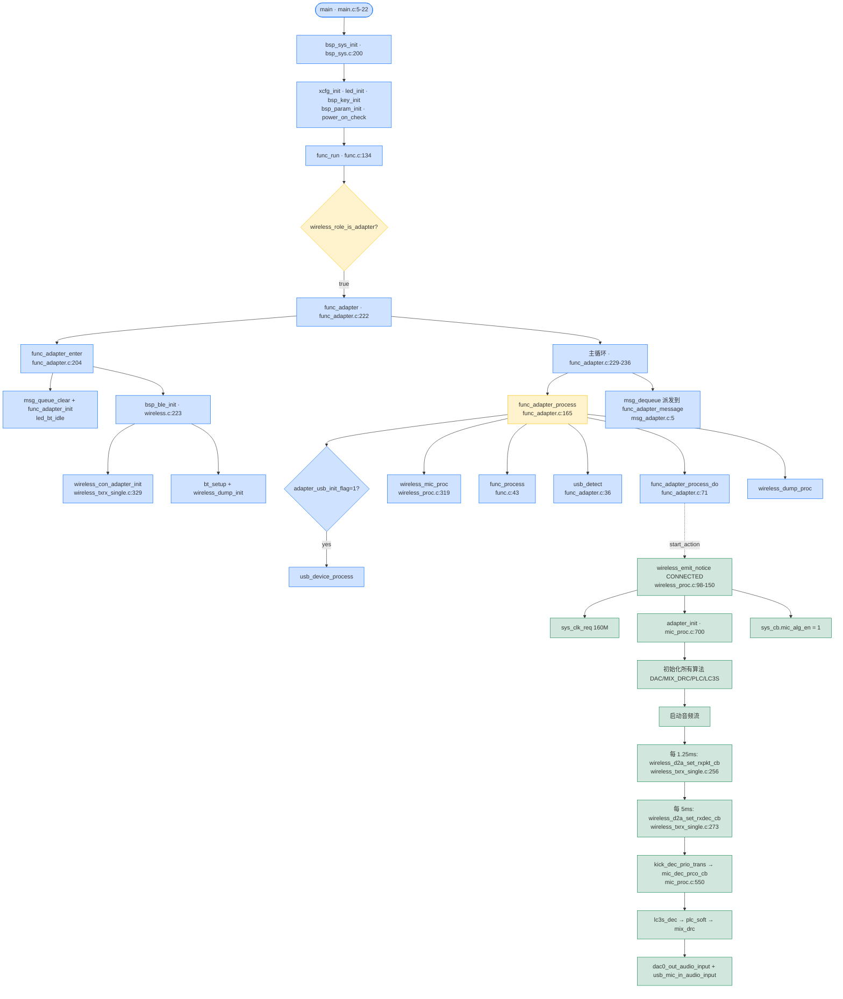

### 13.2 发射端断开后接收端行为

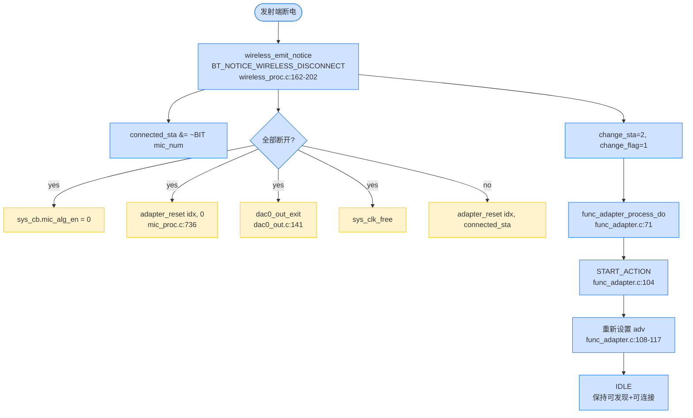

### 13.3 接收端命令路由（PRIVATE_SYNC_CMD 路径）

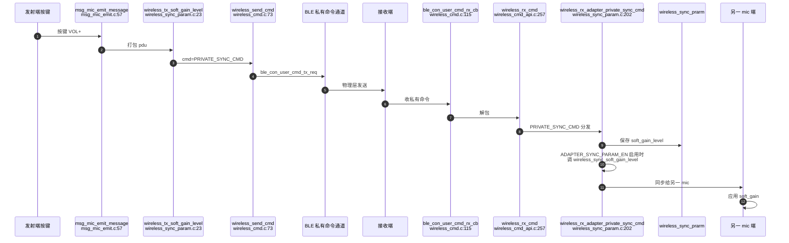

### 13.4 USB 麦克风枚举与去抖动

> 本节改用 flowchart 表达时序，避免 sequenceDiagram 在某些 Mermaid 渲染器上对中英文混合 message text 的解析兼容性问题。

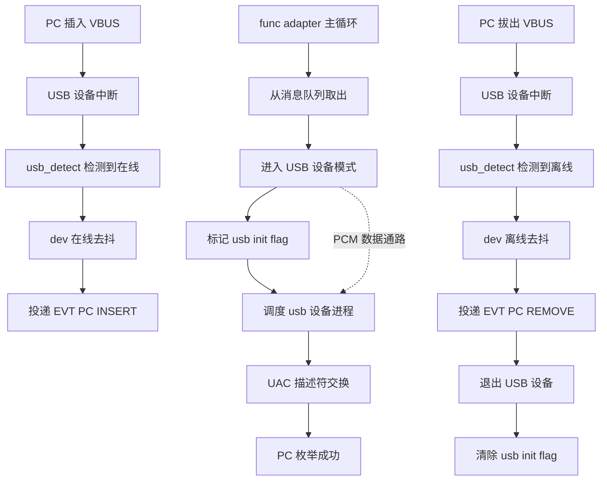

### 13.5 接收端全局架构图（Layer View）

### 13.5 接收端全局架构图（Layer View）

### 13.5.1 应用层 + 模块层（核心软件层）

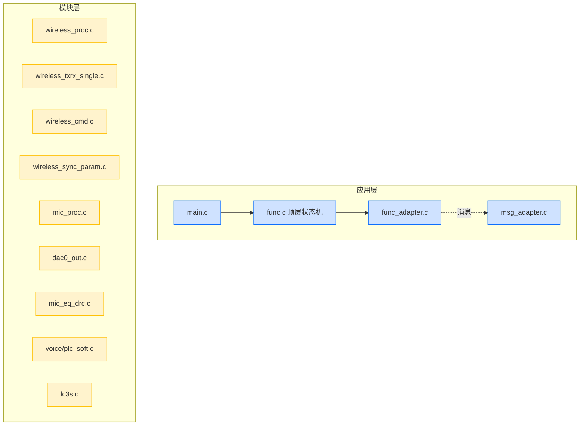

### 13.5.2 BSP 层 + 驱动层 + 硬件层（板级支撑层）

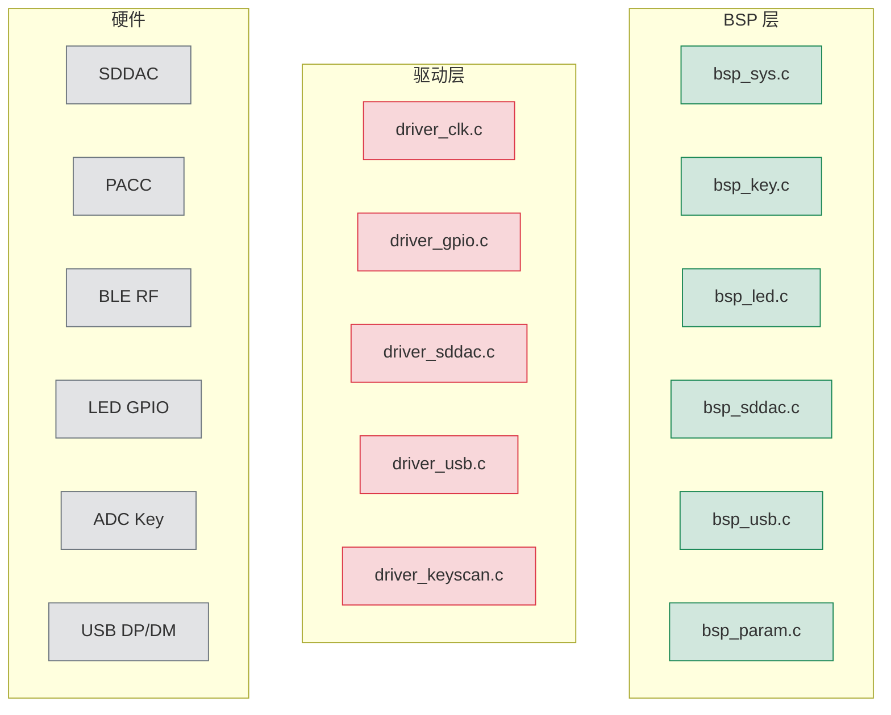

### 13.5.3 模块层 → 硬件层 跨层映射（关键数据通路）

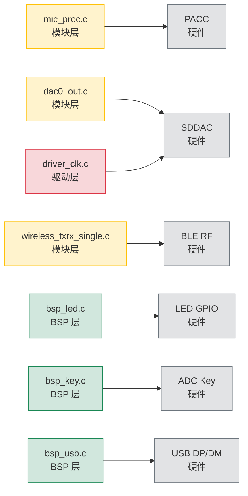

---

## 14. 实战调试清单

| 现象                 | 排查路径                                                     |
| -------------------- | ------------------------------------------------------------ |
| 接收端无法被发现     | `wireless_mic_role_init()` → `xcfg_cb.wireless_adapter_en` 是否为 1；`ble_adv_set_enable(1, 1)` 是否被调用 |
| 接收端被连上但无声音 | `sys_cb.mic_alg_en` 是否为 1；`adapter_init` 是否被调用；`WIRELESS_CON_CODEC_SEL` 两端是否一致；`WIRELESS_MIC_FRAME_SIZE` 是否一致 |
| 声音卡顿             | 调大 `WIRELESS_MIC_TX_INTERVAL`、关闭部分算法；查 `wireless_d2a_dec_us` 是否覆盖实际解码时间 |
| 一拖二只有一侧出声   | `mic_dec.frag_samples[0/1]` 是否正确计算（`adapter_init` 行 706-710）；检查 `ble_con_get_status()` 是否正确 |
| DAC 有噪声           | 检查 `dac_sel`（单端 vs 差分）是否与 PCB 一致；`dac0_play_sync_fifocnt` 高水位/低水位是否合理 |
| USB 插入无反应       | `BSP_USB_EN`；`ADAPTER_USB_MIC_RX_EN`；`UDE_MIC_EN`；`adapter_usb_init_flag` 是否被设 |
| 接收到按键音量无变化 | `adapter_key_msg_tbl` 当前只支持 PP HOLD，按键应改在 mic 端发命令 |
| LED 不亮             | `BSP_LED_EN=1`；`led_init()` 和 `led_set_sta_p` 路径是否有问题 |
| PC 拔出不识别        | 检查 `usb_device_exit()` 是否被调；`adapter_usb_init_flag=0` |

---

## 15. 关键代码位置速查表

| 关注点            | 位置                                             |
| ----------------- | ------------------------------------------------ |
| 角色判定          | `modules/wireless/wireless_proc.c:5-18`          |
| 二进制加载        | `modules/wireless/wireless_proc.c:24-32`         |
| BLE 协议栈初始化  | `modules/wireless/wireless.c:223-239`            |
| 接收端状态机      | `functions/func_adapter.c:71-121`                |
| 接收端消息        | `functions/msg_adapter.c:5-50`                   |
| 一拖二 slice 计算 | `modules/wireless/mic_proc.c:706-710`            |
| 接收端解码入口    | `modules/wireless/mic_proc.c:550-594`            |
| 接收端算法初始化  | `modules/wireless/mic_proc.c:700-734`            |
| 接收端解码输出    | `modules/wireless/mic_proc.c:393-546`            |
| 接收端清理        | `modules/wireless/mic_proc.c:736-750`            |
| RX 帧缓冲         | `modules/wireless/wireless_txrx_single.c:53-167` |
| LC3S 解码         | `modules/codec/lc3s.c`                           |
| DAC 接收端初始化  | `modules/audio/dac0_out.c:89-139`                |
| DAC 调速          | `modules/audio/dac0_out.c:56-77`                 |
| MIX_DRC           | `modules/audio/mic_eq_drc.c:61-78`               |
| PLC               | `modules/voice/plc_soft.c:11-64`                 |
| 私有命令队列      | `modules/wireless/wireless_cmd.c:16-99`          |
| 私有命令 API      | `modules/wireless/wireless_cmd_api.c:8-292`      |
| 同步参数          | `modules/wireless/wireless_sync_param.c`         |
| 接收端消息分发    | `modules/wireless/wireless_cmd_api.c:256-283`    |
| 接收端 sync 处理  | `modules/wireless/wireless_sync_param.c:202-296` |
| LED 切换          | `modules/wireless/wireless_proc.c:319-340`       |
| 按键扫描          | `bsp/bsp_key.c:71-135`                           |
| 系统初始化        | `bsp/bsp_sys.c:200-267`                          |
| USB 检测          | `functions/func_adapter.c:36-53`                 |
| USB 消息          | `functions/msg_adapter.c:17-29`                  |
| 当前配置          | `projects/microphone/config_ab5766_le_mic.h`     |

---

## 16. 给新手的进一步建议

1. **先跑通回连**：烧录两份固件（一个 emitter、一个 adapter），按 `docs/SDK/AB5766_无线麦克风_双板连接与LED测试指南.md` 做回连验证。
2. **打开 dump**：`config_ab5766_le_mic.h:73` 把 `WIRELESS_DUMP_EN=1`（接收端 + 发射端都要），可以看到双方 PER/RSSI。
3. **观察 LED 状态机**：
   - 配对中（可发现）：蓝灯闪
   - 已连接：蓝灯常亮
   - 断开：回到配对闪
4. **用 `wireless_con_role()` 路径**：当前默认关闭 `WIRELESS_CON_PAIR_MODE`；如果需要做一拖二主副麦，先要把 `WIRELESS_CON_LINK_NB=2` 配上。
5. **蓝牙参数微调**：在 `config_ab5766_le_mic.h` 修改 `WIRELESS_MIC_RETRY_NB` / `WIRELESS_MIC_TX_INTERVAL` / `WIRELESS_CON_FREQ_BAND` 后，**两端必须同步**。
6. **混音 DRC 调试**：调 `ADAPTER_MIX_DRC_DELAY`（`config_ab5766_le_mic.h:125`）以匹配 `cfg_wireless_d2a_dec_us`。
7. **USB UAC 描述符**：在 `UDE_ENUM_TYPE`（`config_ab5766_le_mic.h:180`）中由 `UDE_MIC_EN` 决定实际暴露的接口。
8. **库行为**：所有 `libs/ble/*` 下的 API 都通过头文件调用，**不要直接修改库**；需要换行为时，要么用 `STRONG` 覆盖（如 `strong_symbol.c`），要么配置 `xcfg_cb`。

---

## 17. 接收端 vs 发射端对照速查

| 维度         | 接收端 ADAPTER                                               | 发射端 MIC_EMIT                                              |
| ------------ | ------------------------------------------------------------ | ------------------------------------------------------------ |
| 入口函数     | `func_adapter()` (`func_adapter.c:222`)                      | `func_mic_emit()` (`func_mic_emit.c:212`)                    |
| 入口处理     | `func_adapter_enter()` (`func_adapter.c:204`)                | `func_mic_emit_enter()` (`func_mic_emit.c:175`)              |
| 状态机主函数 | `func_adapter_process_do()` (`func_adapter.c:71`)            | `func_mic_emit_process_do()` (`func_mic_emit.c:51`)          |
| 状态机调度   | `func_adapter_process()` (`func_adapter.c:165`)              | `func_mic_emit_process()` (`func_mic_emit.c:143`)            |
| 消息分发     | `func_adapter_message()` (`msg_adapter.c:5`)                 | `func_mic_emit_message()` (`msg_mic_emit.c:5`)               |
| 状态字段     | `adapter` (`func_adapter.c:27`)                              | `mic_emit` (`func_mic_emit.c:27`)                            |
| 按键表       | `adapter_key_msg_tbl` (port_key.c:61)                        | `mic_emit_key_msg_tbl` (port_key.c:43)                       |
| 蓝牙数据缓冲 | `adapter_con` (`wireless_txrx_single.c:60`)                  | `device_con` (`wireless_txrx_single.c:53`)                   |
| 音频缓冲     | `mic_dec` (`mic_proc.c:50`)                                  | `mic_enc` (`mic_proc.c:47`)                                  |
| 蓝牙初始化   | `wireless_con_adapter_init()` (`wireless_txrx_single.c:329`) | `wireless_con_device_init()` (`wireless_txrx_single.c:338`)  |
| 蓝牙事件回调 | `wireless_emit_notice()` 接收端分支 (wireless_proc.c:91-150) | `wireless_emit_notice()` 发射端分支 (wireless_proc.c:91-150) |
| 音频初始化   | `adapter_init()` (`mic_proc.c:700`)                          | `mic_emit_init()` (`mic_proc.c:597`)                         |
| 音频清理     | `adapter_reset()` (`mic_proc.c:736`)                         | `mic_emit_reset()` (`mic_proc.c:677`)                        |
| 算法侧       | 解码 + PLC + MIX_DRC + DAC + USB                             | 编码 + ECHO + EQ/DRC + soft_gain                             |
| 输出         | DAC + USB UAC MIC                                            | SDDAC 侦听麦                                                 |
| 输入         | BLE RX                                                       | SDADC（麦克风）                                              |
| 关闭使能回调 | `wireless_d2a_set_rxpkt_cb`                                  | `wireless_d2a_set_txbuf_cb` `wireless_d2a_put_tx_frame`      |

---

（本文基于 `projects/microphone/config_ab5766_le_mic.h` 当前默认配置。所有行号引用均为仓库当时快照；如有变动请以实际代码为准。配套文档见 `AB5766_发射端_Mic_Emit_实现详解.md`。）