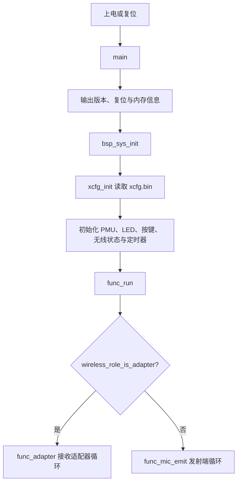
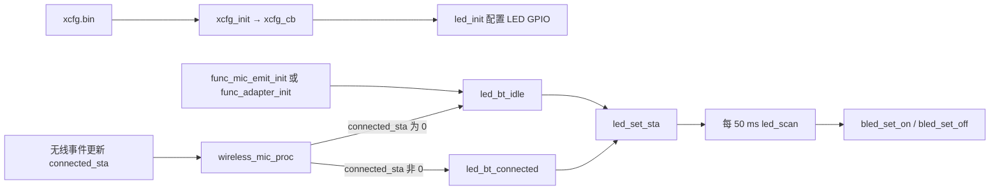
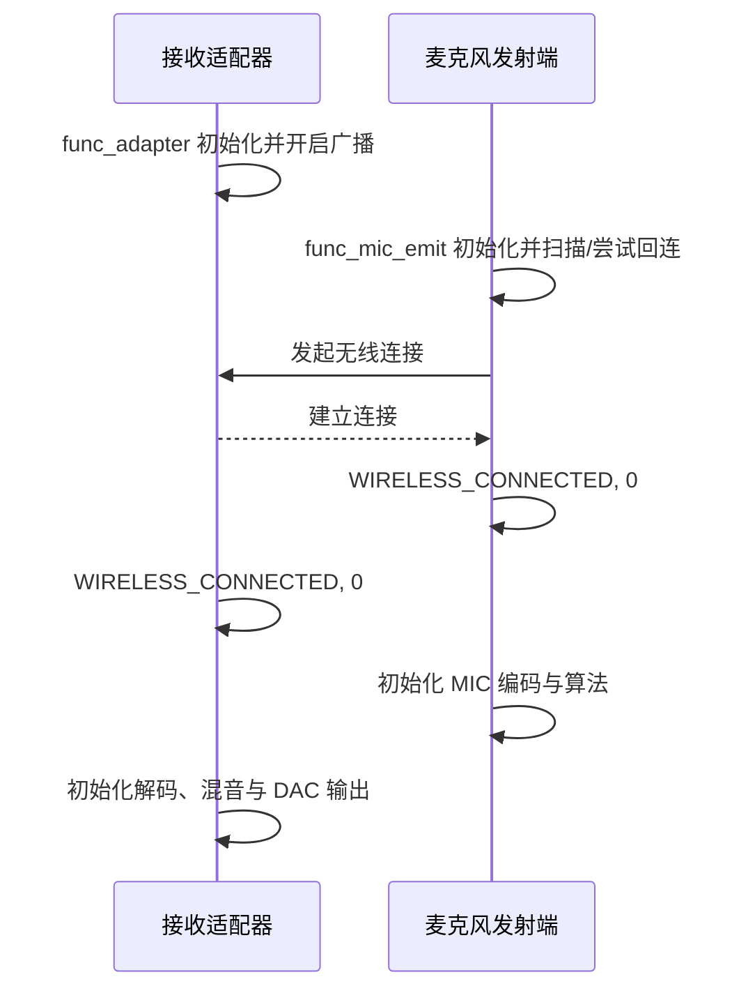
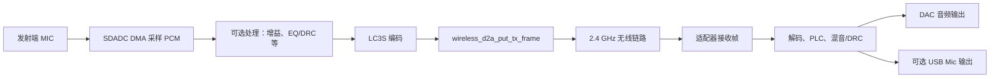

# AB5766 无线麦克风双板连接、LED 与串口测试指南

本文面向第一次接触本 SDK 的开发者，记录当前工程中已完成的改动、双板无线连接的原理、实际测试步骤、预期现象和代码流程。

> 本文基于当前 `projects/microphone` 工程及已验证的两块顶板测试结果编写。下载器接线、下载模式和音频接口位置取决于具体硬件，仓库未提供这些资料，仍应以板卡原理图或厂商说明为准。

## 1. 测试目标

本次验证分为四层：

1. **串口调试可用**：将固件日志从默认 PB9 改到已引出的 PA4，并成功接收启动日志。
2. **角色正确**：一块板运行发射端，另一块板运行接收适配器。
3. **无线连接成功**：两块板建立第 0 路无线连接。
4. **音频链路初始化**：发射端初始化 MIC 采集/编码处理，接收端初始化接收、混音和 DAC 输出处理。

当前日志已确认前 1～4 项的初始化和连接状态正常。是否能实际听到声音，还需要在接收板的 DAC 输出或 USB Mic 输出上进行板级验证。

## 2. 两块板的角色与烧录配置

无线麦克风系统至少需要两块板：发射端和接收端。

| 板子 | 烧录选项 | 运行角色 | 正常启动日志 |
| --- | --- | --- | --- |
| 麦克风板 | `wireless_mic_AB5769A5_k12` | 麦克风发射端 | `func_mic_emit` |
| 接收器板 | `wireless_adapter` | 无线接收适配器 | `func_adapter` |

### 2.1 为什么 K12 板选择 `wireless_mic_AB5769A5_k12`

该配置文件的运行时参数中包含：

```text
wireless_adapter_en=False
wireless_mic_emit_en=True
```

所以它会作为麦克风发射端运行。

该设置还启用了蓝/红 LED，并把蓝、红 LED 配置为 PB3 的共脚双色灯方案：

```text
bled_disp_en=True
rled_disp_en=True
bled_io_sel=179   # PB3
rled_io_sel=179   # PB3
```

共脚双色 LED 的现有驱动规则是：

| PB3 状态 | 双色 LED 现象 |
| --- | --- |
| 数字输出低电平 | 蓝灯亮 |
| 数字输出高电平 | 红灯亮 |
| 模拟模式 | 蓝、红灯均熄灭 |

> PB3 已用于 LED，不应再复用为本次调试打印口。

### 2.2 为什么接收板选择 `wireless_adapter`

该配置文件中：

```text
wireless_adapter_en=True
wireless_mic_emit_en=False
```

固件启动后会进入 `func_adapter()`，开启广播并等待发射端连接。它是无线音频接收端，不应烧录到麦克风发射板。

## 3. 顶板之间是否需要接线

**发射端和接收端之间不需要连接 PA0、PA1、PA2、PA3、PA4、PB1、PB3、PB4 等 GPIO。**

两板通过 2.4 GHz 无线链路传输音频和控制数据。测试连接时，只需要：

```text
发射端：独立供电 + 正常天线/射频电路
接收端：独立供电 + 正常天线/射频电路
两块板放在近距离，例如 0.5～2 米
```

如果需要查看日志，可以分别使用 USB-TTL：

```text
发射端 PA4 → 发射端 USB-TTL RX
发射端 GND → 发射端 USB-TTL GND

接收端 PA4 → 接收端 USB-TTL RX
接收端 GND → 接收端 USB-TTL GND
```

不要将两块板的 PA4 直接相连，也不要把 USB-TTL 的 5 V 输出连接到 PA4。

## 4. 本次代码修改内容

### 4.1 调试串口从 PB9 改为 PA4

修改文件：[../../projects/microphone/config_ab5766_le_mic.h](../../projects/microphone/config_ab5766_le_mic.h)

原配置：

```c
#define BSP_UART_DEBUG_EN GPIO_PB9
```

现配置：

```c
#define BSP_UART_DEBUG_EN GPIO_PA4
```

调试 UART 的实现位于 [../../bsp/bsp_uart_debug.c](../../bsp/bsp_uart_debug.c)。代码使用 UART0，并将 UART0 收发功能映射到 `BSP_UART_DEBUG_EN` 指定的同一个 GPIO；当前工程采用单线收发模式。

串口助手参数：

```text
波特率：1500000
数据位：8
校验：无
停止位：1
流控：无
```

连接方式：

```text
目标板 PA4 → USB-TTL RX
目标板 GND → USB-TTL GND
```

本次已观察到完整启动日志，说明 PA4 调试打印工作正常。

### 4.2 LED 禁用态 GPIO 保护

修改文件：[../../bsp/bsp_led.c](../../bsp/bsp_led.c)

增加了三处运行时保护：

```c
if (!xcfg_cb.bled_disp_en) {
    return;
}
```

保护位置：

- `bled_set_on()`
- `bled_set_off()`
- `led_scan()`

#### 修改原因

`led_init()` 仅在运行时配置 `xcfg_cb.bled_disp_en` 为真时初始化蓝灯 GPIO。但无线角色初始化仍会选择 LED 图样，50 ms 周期扫描也可能调用蓝灯开/关函数。

未增加保护前，如果蓝灯配置关闭，程序仍可能操作默认配置中的蓝灯 GPIO。该 GPIO 不一定连接 LED，可能是其他板级功能，因此存在误操作风险。

修改后，蓝灯未启用时：

```text
不初始化蓝灯 GPIO
不执行蓝灯图样扫描
不通过蓝灯接口写 GPIO
```

该修改不改变无线连接状态机、LED 状态选择、闪烁节拍或已启用 LED 的正常行为。

## 5. 系统启动与角色选择原理



关键文件：

| 文件 | 作用 |
| --- | --- |
| [../../projects/microphone/main.c](../../projects/microphone/main.c) | 固件入口 |
| [../../bsp/bsp_sys.c](../../bsp/bsp_sys.c) | 读取运行时配置并初始化板级模块 |
| [../../functions/func.c](../../functions/func.c) | 根据角色进入发射端或适配器状态机 |
| [../../functions/func_mic_emit.c](../../functions/func_mic_emit.c) | 发射端扫描、连接和业务循环 |
| [../../functions/func_adapter.c](../../functions/func_adapter.c) | 适配器广播、连接和业务循环 |

角色不是仅由编译期宏决定，而是由生成的运行时配置 `xcfg.bin` 中的参数决定：

```text
wireless_adapter_en=True  → 接收适配器
wireless_mic_emit_en=True → 麦克风发射端
```

## 6. LED 状态流程与测试原理

### 6.1 LED 控制流程



### 6.2 状态判断规则

无线连接状态保存在 `wireless_mic.connected_sta` 位图中：

| 状态 | LED 选择 |
| --- | --- |
| `connected_sta == 0` | 未连接/配对图样，通常蓝灯闪烁 |
| `connected_sta != 0` | 已连接图样，通常蓝灯常亮 |

工程当前最多支持两路无线麦克风，但 LED 只区分“没有连接”和“至少有一条连接”：

```text
0 → 1：由闪烁变为常亮
1 → 3：保持常亮
3 → 2：保持常亮
2 → 0：恢复闪烁
```

连接失败不会额外显示单独灯效；如果处于未连接状态，原有闪烁图样继续保持。

### 6.3 当前 LED 测试现象

已验证的 K12 发射端现象：

```text
启动未连接：蓝灯正常闪烁
建立无线连接后：应切换为常亮
```

在测试时应同时观察串口中的连接日志，避免仅靠 LED 判断：

```text
WIRELESS_CONNECTED, 0
WIRELESS_DISCONNECT, 0
WIRELESS_CONNECT_FAIL, 0
```

## 7. 无线连接与音频传输流程

### 7.1 无线连接流程



### 7.2 音频数据流程



发射端的关键实现集中在 [../../modules/wireless/mic_proc.c](../../modules/wireless/mic_proc.c)，无线角色和连接事件处理位于 [../../modules/wireless/wireless_proc.c](../../modules/wireless/wireless_proc.c)。

## 8. 实际双板测试步骤

### 8.1 准备

1. 将当前工程重新编译，确保 PA4 调试串口改动已经进入固件。
2. 为发射板选择：

   ```text
   wireless_mic_AB5769A5_k12
   ```

3. 为接收板选择：

   ```text
   wireless_adapter
   ```

4. 分别烧录两块板。
5. 两板靠近放置，先避免强 2.4 GHz 干扰和金属遮挡。
6. 如需日志，将 PA4 分别接到各自 USB-TTL 的 RX，两个 USB-TTL 的 GND 分别接对应板的 GND。

### 8.2 检查发射端启动

发射端应出现：

```text
func_run
func_mic_emit
<TX_INTERVAL>         4
<CON_INTERVAL>        120
<WIRELESS_CODEC>      4
```

含义：

- `func_mic_emit`：角色正确，是麦克风发射端；
- `TX_INTERVAL=4`：当前无线发送周期配置；
- `WIRELESS_CODEC=4`：当前选择的无线编码配置；
- `WS_NAME=LE_MIC2`：当前无线名称。

启动后偶尔先出现：

```text
WIRELESS_CONNECT_FAIL, 0
```

不一定是故障。若后续出现 `WIRELESS_CONNECTED, 0`，说明重试后已连接成功。

连接成功后的典型发射端日志：

```text
WIRELESS_CONNECTED, 0
==>vddcore: 20->24
loc_mic_pacc_init
loc_mic_pacc_enable
mic_eq_drc_init 4
dac0_out_init
```

解释：

| 日志 | 含义 |
| --- | --- |
| `WIRELESS_CONNECTED, 0` | 第 0 路无线连接成功 |
| `vddcore: 20->24` | 为无线音频处理提高性能/供电档位 |
| `loc_mic_pacc_init`、`loc_mic_pacc_enable` | 启动发射端本地麦克风音频处理 |
| `mic_eq_drc_init 4` | 初始化 EQ/DRC 音频处理 |
| `dac0_out_init` | 初始化当前配置允许的本地 DAC 监听输出 |

### 8.3 检查接收端启动

接收端应出现：

```text
func_run
func_adapter
adapter, state: 0
```

连接成功后的典型日志：

```text
WIRELESS_CONNECTED, 0
==>vddcore: 20->24
mix_pacc_init
mix_pacc_enable
dac0_out_init
RX: pdu=(50B, 594), intv=(5000, 594), retry=(3, 3)
adapter, con_sta(0): 1, 1
```

解释：

| 日志 | 含义 |
| --- | --- |
| `func_adapter` | 角色正确，是接收适配器 |
| `WIRELESS_CONNECTED, 0` | 第 0 路发射端已连入 |
| `mix_pacc_init`、`mix_pacc_enable` | 初始化接收端混音/处理路径 |
| `dac0_out_init` | 初始化接收端 DAC 输出 |
| `RX: pdu=... retry=...` | 已建立接收侧无线数据参数和重传配置 |
| `adapter, con_sta(0): 1, 1` | 适配器确认第 0 路连接处于有效状态 |

### 8.4 LED 验收步骤

1. 仅启动发射端，或确保接收端未启动。
   - 预期：K12 发射端蓝灯闪烁。
2. 启动接收端，再启动/等待发射端连接。
   - 预期：两端出现 `WIRELESS_CONNECTED, 0`。
   - 预期：K12 发射端蓝灯变为常亮。
3. 关闭发射端电源或让发射端远离接收端。
   - 预期：接收端出现 `WIRELESS_DISCONNECT, 0`。
   - 预期：发射端重新上电后可重新连接。
4. 重复 3～5 次连接/断开过程。
   - 预期：连接状态稳定，无重启、无线异常或音频异常。

### 8.5 音频验收步骤

无线连接成功不等于已经确认扬声器/USB 上有声音。继续执行：

1. 对发射端 MIC 说话、轻敲或输入稳定声音。
2. 检查接收端板上可用的输出方式：
   - 有模拟音频接口、耳机或功放时，监听 DAC 输出；
   - 若接收端 USB 连接电脑，检查电脑是否识别 USB 麦克风，并使用录音工具录制。
3. 观察声音是否连续、有无明显断续、失真或无声。
4. 关闭发射端并重新启动，确认断连和重新连接后声音恢复。

> 本仓库能确认固件已初始化 DAC/USB 相关代码路径，但不能从源码确定你的顶板具体把哪一路音频接口引出。因此，“实际听到声音”需要结合板卡接口或原理图完成。

## 9. 当前已验证结果

本次双板日志已经确认：

| 项目 | 结果 |
| --- | --- |
| PA4 调试串口 | 正常，能输出完整启动日志 |
| 发射端角色 | 正常：`func_mic_emit` |
| 接收端角色 | 正常：`func_adapter` |
| 发射端连接 | 正常：`WIRELESS_CONNECTED, 0` |
| 接收端连接 | 正常：`WIRELESS_CONNECTED, 0` |
| 发射端音频初始化 | 正常：MIC 处理、EQ/DRC、DAC 初始化完成 |
| 接收端音频初始化 | 正常：混音处理、DAC 初始化完成 |
| 发射端 K12 蓝灯 | 未连接时已观察到正常闪烁 |

## 10. 常见问题排查

| 现象 | 优先检查项 |
| --- | --- |
| 两板都显示 `func_mic_emit` | 接收板选择错误，应烧录 `wireless_adapter` |
| 接收端没有 `func_adapter` | 检查是否加载了适配器配置文件 |
| 发射端反复 `WIRELESS_CONNECT_FAIL` 且没有成功连接 | 确认接收端已启动、两板靠近、无线名称/连接参数兼容、供电与天线正常 |
| PA4 无日志 | 确认固件已经重新编译烧录；串口为 1500000、8N1、无流控；PA4 接 USB-TTL RX；GND 已共地 |
| 蓝灯不亮 | 确认使用 K12 发射端配置、PB3 对应的 LED 硬件存在、未连接状态是否实际出现；不要将 PB3 与调试串口复用 |
| 已连接但无声音 | 检查接收端 DAC/USB 实际接口、发射端 MIC 硬件、音频输出设备；确认两端均已出现连接和音频初始化日志 |
| 断开后未恢复连接 | 查看两端是否有 `WIRELESS_DISCONNECT, 0`；重新上电接收端后再启动发射端，收集完整日志 |

## 11. 后续工作

本阶段完成后，建议按以下顺序继续：

1. 完成 LED 连接/断开现象的硬件验收；
2. 记录实际音频输出接口和声音验证结果；
3. 手动提交并推送本阶段的代码与文档；
4. 进入按键测试阶段。

提交前请检查改动范围，至少包括：

```text
projects/microphone/config_ab5766_le_mic.h
bsp/bsp_led.c
docs/plan/AB5766_LE_Mic_分阶段实施计划.md
docs/SDK/AB5766_LE_Mic_新手开发指南.md
docs/SDK/AB5766_无线麦克风_双板连接与LED测试指南.md
```
