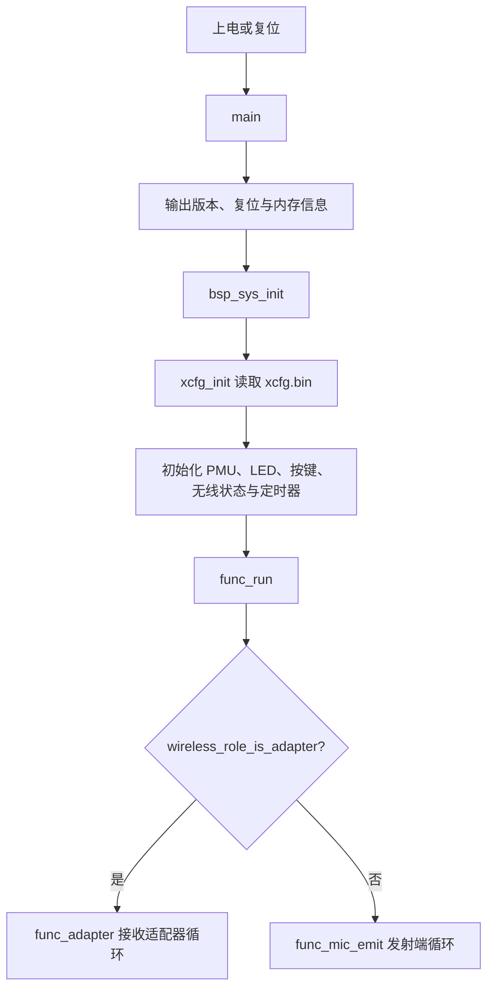
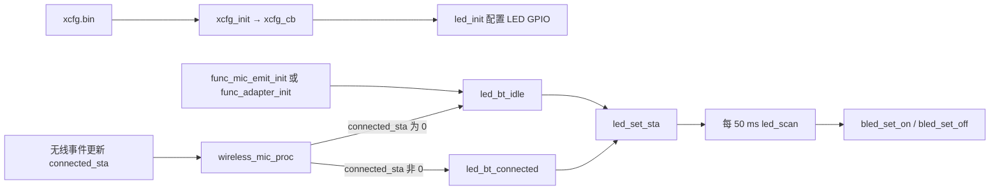
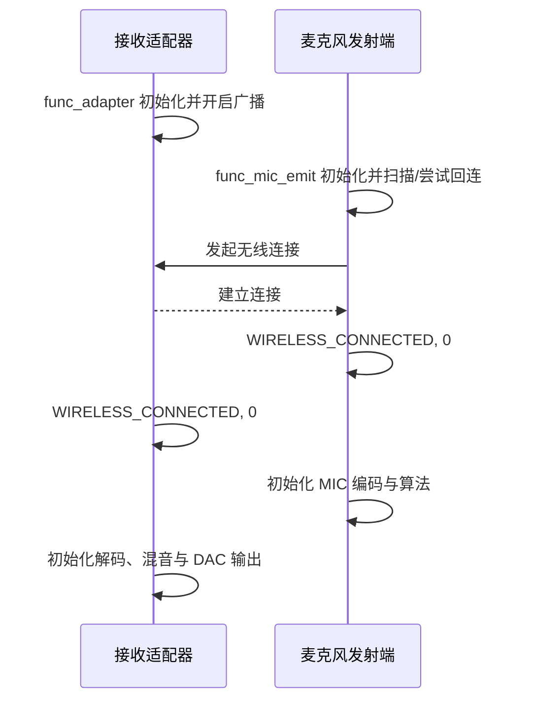
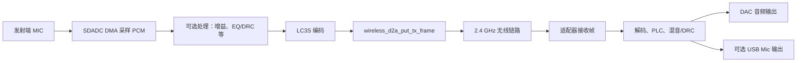
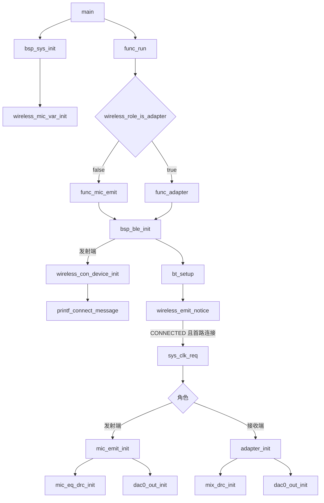
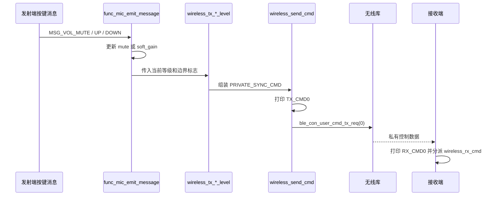
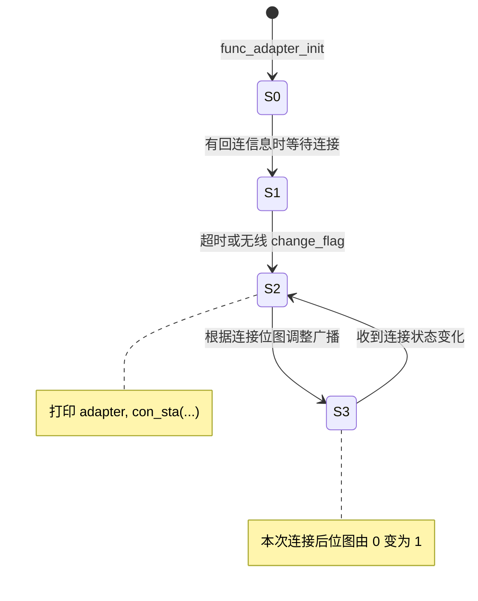

# AB5766 无线麦克风双板连接、LED 与串口测试指南

本文面向第一次接触本 SDK 的开发者，记录当前工程中已完成的改动、双板无线连接的原理、实际测试步骤、预期现象和代码流程。

> 本文基于当前 `projects/microphone` 工程及已验证的两块顶板测试结果编写。下载器接线、下载模式和音频接口位置取决于具体硬件，仓库未提供这些资料，仍应以板卡原理图或厂商说明为准。

## 1. 测试目标

本次验证分为四层：

1. **串口调试可用**：当前固件统一使用 PB3 输出 UART0 单线调试日志，发送端和接收端均已取得完整日志。
2. **角色正确**：一块板运行发射端，另一块板运行接收适配器。
3. **无线连接成功**：两块板建立第 0 路无线连接。
4. **音频链路初始化**：发射端初始化 MIC 采集/编码处理，接收端初始化接收、混音和 DAC 输出处理。
5. **模拟输出实测**：接收端耳机座能够听到声音，但目前只有左声道有声、右声道无声。

当前日志和听音结果已确认无线连接、控制命令收发及音频输出均实际工作。左右声道现象不能仅按“单声道”名称推断：当前无线 PCM 确实配置为单声道，但 DAC 又按运行时 `dac_sel=1` 配置为差分输出；耳机座左右触点如何连接仍需结合原理图或测量确认。

## 2. 两块板的角色与烧录配置

无线麦克风系统至少需要两块板：发射端和接收端。

| 板子 | 烧录选项 | 运行角色 | 正常启动日志 |
| --- | --- | --- | --- |
| 麦克风板 | `wireless_mic_AB5769A5_k12` | 麦克风发射端 | `func_mic_emit` |
| 接收器板 | `wireless_adapter` | 无线接收适配器 | `func_adapter` |

### 2.1 为什么 K12 板选择 `wireless_mic_AB5769A5_k12`

该配置文件的运行时参数中包含：

```text
wireless_adapter_en=False
wireless_mic_emit_en=True
```

所以它会作为麦克风发射端运行。

该设置还启用了蓝/红 LED，并把蓝、红 LED 配置为 PB3 的共脚双色灯方案：

```text
bled_disp_en=True
rled_disp_en=True
bled_io_sel=179   # PB3
rled_io_sel=179   # PB3
```

共脚双色 LED 的现有驱动规则是：

| PB3 状态 | 双色 LED 现象 |
| --- | --- |
| 数字输出低电平 | 蓝灯亮 |
| 数字输出高电平 | 红灯亮 |
| 模拟模式 | 蓝、红灯均熄灭 |

> 当前固件把 PB3 配置为调试 UART，因此测试日志时不得同时用 PB3 驱动共脚双色 LED。虽然 `wireless_mic_AB5769A5_k12.setting` 中仍把 LED IO 配为 PB3，但编译期 `BSP_UART_DEBUG_EN=GPIO_PB3` 会让该引脚承担 UART0 单线收发；本轮测试以串口功能为准，不以 PB3 LED 现象作为验收依据。

### 2.2 为什么接收板选择 `wireless_adapter`

该配置文件中：

```text
wireless_adapter_en=True
wireless_mic_emit_en=False
```

固件启动后会进入 `func_adapter()`，开启广播并等待发射端连接。它是无线音频接收端，不应烧录到麦克风发射板。

## 3. 顶板之间是否需要接线

**发射端和接收端之间不需要连接 PA0、PA1、PA2、PA3、PA4、PB1、PB3、PB4 等 GPIO。**

两板通过 2.4 GHz 无线链路传输音频和控制数据。测试连接时，只需要：

```text
发射端：独立供电 + 正常天线/射频电路
接收端：独立供电 + 正常天线/射频电路
两块板放在近距离，例如 0.5～2 米
```

如果需要查看日志，可以分别使用 USB-TTL：

```text
发射端 PB3 → 发射端 USB-TTL RX
发射端 GND → 发射端 USB-TTL GND

接收端 PB3 → 接收端 USB-TTL RX
接收端 GND → 接收端 USB-TTL GND
```

不要将两块板的 PB3 直接相连，也不要把 USB-TTL 的 5 V 输出连接到 PB3。PB3 是 UART0 单线收发口，监听日志只需连接 USB-TTL RX；若配置文件还把 PB3 分配给 LED，本轮测试必须避免同时使用 LED 功能。

## 4. 本次代码修改内容

### 4.1 调试串口统一使用 PB3

配置文件：[../../projects/microphone/config_ab5766_le_mic.h](../../projects/microphone/config_ab5766_le_mic.h)

当前配置：

```c
#define BSP_UART_DEBUG_EN GPIO_PB3
```

这不是根据宏名称推断：`bsp_uart_debug_init()` 通过 `UART_DEBUG_PORT_SEL` 和 `UART_DEBUG_PIN_SEL` 取得该宏对应的端口/引脚，然后把同一个 GPIO 交叉映射到 `UART0RX` 和 `UART0TX`，并以 `UART_ONE_LINE` 初始化 UART0，见 [../../bsp/bsp_uart_debug.c](../../bsp/bsp_uart_debug.c)。因此 PB3 是当前 UART0 单线收发引脚。

串口助手参数：

```text
波特率：1500000
数据位：8
校验：无
停止位：1
流控：无
```

连接方式：

```text
目标板 PB3 → USB-TTL RX
目标板 GND → USB-TTL GND
```

发送端和接收端均已通过 PB3 取得本文第 8 节记录的完整日志。

> 引脚冲突提醒：K12 设置文件仍将蓝/红 LED 的 IO 配为 PB3。调试 UART 与 LED 不能可靠地同时占用同一引脚；本轮以串口日志为准，后续若要恢复 LED 验收，应将 UART 或 LED 改到硬件实际引出的其他 GPIO。

### 4.2 LED 禁用态 GPIO 保护

修改文件：[../../bsp/bsp_led.c](../../bsp/bsp_led.c)

增加了三处运行时保护：

```c
if (!xcfg_cb.bled_disp_en) {
    return;
}
```

保护位置：

- `bled_set_on()`
- `bled_set_off()`
- `led_scan()`

#### 修改原因

`led_init()` 仅在运行时配置 `xcfg_cb.bled_disp_en` 为真时初始化蓝灯 GPIO。但无线角色初始化仍会选择 LED 图样，50 ms 周期扫描也可能调用蓝灯开/关函数。

未增加保护前，如果蓝灯配置关闭，程序仍可能操作默认配置中的蓝灯 GPIO。该 GPIO 不一定连接 LED，可能是其他板级功能，因此存在误操作风险。

修改后，蓝灯未启用时：

```text
不初始化蓝灯 GPIO
不执行蓝灯图样扫描
不通过蓝灯接口写 GPIO
```

该修改不改变无线连接状态机、LED 状态选择、闪烁节拍或已启用 LED 的正常行为。

## 5. 系统启动与角色选择原理



关键文件：

| 文件 | 作用 |
| --- | --- |
| [../../projects/microphone/main.c](../../projects/microphone/main.c) | 固件入口 |
| [../../bsp/bsp_sys.c](../../bsp/bsp_sys.c) | 读取运行时配置并初始化板级模块 |
| [../../functions/func.c](../../functions/func.c) | 根据角色进入发射端或适配器状态机 |
| [../../functions/func_mic_emit.c](../../functions/func_mic_emit.c) | 发射端扫描、连接和业务循环 |
| [../../functions/func_adapter.c](../../functions/func_adapter.c) | 适配器广播、连接和业务循环 |

角色不是仅由编译期宏决定，而是由生成的运行时配置 `xcfg.bin` 中的参数决定：

```text
wireless_adapter_en=True  → 接收适配器
wireless_mic_emit_en=True → 麦克风发射端
```

## 6. LED 状态流程与测试原理

### 6.1 LED 控制流程



### 6.2 状态判断规则

无线连接状态保存在 `wireless_mic.connected_sta` 位图中：

| 状态 | LED 选择 |
| --- | --- |
| `connected_sta == 0` | 未连接/配对图样，通常蓝灯闪烁 |
| `connected_sta != 0` | 已连接图样，通常蓝灯常亮 |

工程当前最多支持两路无线麦克风，但 LED 只区分“没有连接”和“至少有一条连接”：

```text
0 → 1：由闪烁变为常亮
1 → 3：保持常亮
3 → 2：保持常亮
2 → 0：恢复闪烁
```

连接失败不会额外显示单独灯效；如果处于未连接状态，原有闪烁图样继续保持。

### 6.3 当前 PB3 冲突下的 LED 结论

K12 设置文件把双色 LED 配在 PB3，而当前编译配置也把 PB3 用作 UART0。两种功能不能作为同一轮测试中的独立、可靠证据，因此本文不再把蓝灯闪烁/常亮列为当前验收结果。

调试无线状态时以两端串口事件为准：

```text
WIRELESS_CONNECTED, 0
WIRELESS_DISCONNECT, 0
WIRELESS_CONNECT_FAIL, 0
```

如果后续要验证 LED 图样，应先把 UART 或 LED 迁移到另一个硬件实际引出的 GPIO，再按 6.2 的状态规则测试。

## 7. 无线连接与音频传输流程

### 7.1 无线连接流程



### 7.2 音频数据流程



发射端的关键实现集中在 [../../modules/wireless/mic_proc.c](../../modules/wireless/mic_proc.c)，无线角色和连接事件处理位于 [../../modules/wireless/wireless_proc.c](../../modules/wireless/wireless_proc.c)。

## 8. 实际双板测试步骤与实测日志

### 8.1 准备

1. 重新编译工程，确认 [../../projects/microphone/config_ab5766_le_mic.h](../../projects/microphone/config_ab5766_le_mic.h) 中 `BSP_UART_DEBUG_EN` 为 `GPIO_PB3`。
2. 发射板选择 `wireless_mic_AB5769A5_k12`，接收板选择 `wireless_adapter`，分别烧录。
3. 两板靠近放置，避免强 2.4 GHz 干扰和金属遮挡。
4. 将两块板各自的 PB3 接到对应 USB-TTL RX，并分别共地；串口使用 1500000、8N1、无流控。
5. 接收端插入耳机，初次监听先降低音量并让耳机远离发送端麦克风，避免啸叫。

### 8.2 日志必须按调用关系解释

本文只对能从源码确认的内容下结论。关键调用关系如下：



代码依据：

- `func_run()` 根据 `wireless_role_is_adapter()` 分派到 `func_mic_emit()` 或 `func_adapter()`，见 [../../functions/func.c](../../functions/func.c)。
- 两个角色都从各自 `enter` 路径调用 `bsp_ble_init()`；只有发射端分支调用 `printf_connect_message()`，见 [../../modules/wireless/wireless.c](../../modules/wireless/wireless.c)。因此参数块只出现在发射端日志是代码决定的，不代表接收端没有对应无线参数。
- 协议栈把连接事件交给 `wireless_emit_notice()`；首次连接时它申请高主频，然后按角色调用 `mic_emit_init()` 或 `adapter_init()`，见 [../../modules/wireless/wireless_proc.c](../../modules/wireless/wireless_proc.c)。

### 8.3 发送端实际日志与代码解释

本次 PB3 实测发送端日志如下（重复的按键命令保留代表性样本）：

```text
bsp_sys_init
func_run
func_mic_emit
<TX_INTERVAL>         4
<CON_INTERVAL>        120
<WIRELESS_FEAT>       18306
<WIRELESS_CODEC>      4
<FREQ_BAND>           0
<RETRY>               3
<DISCON_AUTO_PWROFF>  0
<CONFIG_RSSI>         70
<WS_NAME>             LE_MIC2
pa_gain:3, pa_vsel:9, pa_mode:1
pa_gain:3, pa_vsel:9, pa_mode:1
loc: 7, 8
dc 58 48 9a cb 23 2b 96 ad 19 66 89 fd d3 e4 2d
c9 87 4c e8 7b 52 7d da 9d 85 d2 62 04 7f 3a 58

WIRELESS_CONNECT_FAIL, 0
addr: cd f3 f7 c0 42 41
WIRELESS_CONNECTED, 0
==>vddcore: 20->24
loc_mic_pacc_init
loc_mic_pacc_enable
mic_eq_drc_init 4
dac0_out_init
m->res_level:3
TX: pdu=(50B, 594), intv=(5000, 594), retry=(3, 3)
rx_cntl(1): 01 cf 7b d2 86 0d 14 00
MSG_VOL_MUTE
TX_CMD0: 02 03 01
tx_cntl(1): ff 03 02 03 01 00 00 00 00 00 00 00
MSG_VOL_MUTE
TX_CMD0: 02 03 00
MSG_VOL_DOWN
TX_CMD0: 02 01 01 00
MSG_VOL_DOWN
TX_CMD0: 02 01 08 01
MSG_VOL_UP
TX_CMD0: 02 01 07 00
```

| 实测日志 | 经源码确认的含义 |
| --- | --- |
| `bsp_sys_init` → `func_run` → `func_mic_emit` | 进入系统初始化、顶层功能分派和发射端循环。角色分派依据是 `wireless_role_is_adapter()`，不是根据字符串名称猜测。 |
| `<...>` 参数块 | `printf_connect_message()` 逐项打印 `cfg_wireless_*`、`cfg_bb_rf_freq_bands`、`cfg_le_rssi_thr` 和 `xcfg_cb.le_name`。`TX_INTERVAL=4` 来自 `WIRELESS_MIC_TX_INTERVAL`；`CON_INTERVAL=120` 是 `WIRELESS_CON_INTERVAL * WIRELESS_CON_LINK_NB`；`RETRY=3` 来自 `WIRELESS_MIC_RETRY_NB`。 |
| `WIRELESS_CODEC=4` | `cfg_wireless_codec[0]` 由 `WIRELESS_CON_CODEC_SEL | CODEC_MONO` 初始化；当前 `WIRELESS_CON_CODEC_SEL=CODEC_LC3S`，而 `CODEC_LC3S` 的索引值为 4。 |
| `FREQ_BAND=0` | `cfg_bb_rf_freq_bands` 来自 `WIRELESS_CON_FREQ_BAND=0`；配置注释定义 0 为 2402～2480 MHz。 |
| `WIRELESS_FEAT=18306` | 这是 `cfg_wireless_feat` 位字段的十进制打印值，由协议版本、D2A、跳频、绑定开关和链路数按位组合。仅凭十进制值不应再拆出未核实的功能名称。 |
| `pa_gain...`、`loc...`、两行十六进制、`m->res_level:3` | 当前仓库源码中未找到这些格式串；它们来自预编译库或库内对象。文档只记录原始值，不按名称推断语义。 |
| `WIRELESS_CONNECT_FAIL, 0` | `wireless_emit_notice()` 收到 `BT_NOTICE_WIRELESS_CONNECT_FAIL`，其中 `0` 是 `packet[0]` 的链路索引。随后成功日志说明本次失败后又完成了连接。 |
| `addr: ...` | `ble_scan_rx_rep_cb()` 打印扫描报告中的 6 字节地址，并把它复制到连接请求地址缓存。 |
| `WIRELESS_CONNECTED, 0` | `wireless_emit_notice()` 收到连接成功事件；索引 0 小于 `WIRELESS_CON_LINK_NB` 后进入首次连接初始化。 |
| `==>vddcore: 20->24` | 紧接 `sys_clk_req(INDEX_DECODE, SYS_160M)` 出现，但该字符串在当前仓库源码中找不到，应视为预编译时钟/PMU 库日志；只能确认调用时序，不能仅凭字符串断定所有电压细节。 |
| `loc_mic_pacc_init`、`loc_mic_pacc_enable`、`mic_eq_drc_init 4` | `mic_emit_init()` → `mic_eq_drc_init()` → `loc_mic_pacc_init()`/`set_param()`/`enable()`；只有 `enable()` 返回非空链表才打印 `mic_eq_drc_init 4`。 |
| `dac0_out_init` | `WIRELESS_MIC_DAC_OUT_EN=1` 使 `mic_emit_init()` 调用发射端本地 DAC 监听初始化。 |
| `TX: pdu=...`、`rx_cntl(...)`、`tx_cntl(...)` | 当前仓库没有这些格式串，属于预编译无线库诊断。可以把成对出现作为数据/控制链路活动证据，但字段单位与内部结构不能由名称猜测。 |
| `MSG_VOL_MUTE` | `func_mic_emit_message()` 将 `mic_enc.mute_en` 取反，再调用 `wireless_tx_mic_mute_level()`。因此连续命令数据中的最后一字节按 `01 → 00 → 01 → 00` 切换。 |
| `TX_CMD0: 02 03 01/00` | `wireless_send_cmd()` 打印准备从索引 0 发送的 3 字节命令；`02` 是 `PRIVATE_SYNC_CMD`，`03` 是 `PRIVATE_SYNC_MIC_MUTE_LEVEL`，末字节是静音状态。 |
| `MSG_VOL_DOWN/UP` 与 `TX_CMD0: 02 01 level flag` | 消息处理先调用 `soft_gain_down()` 或 `soft_gain_up()`，再由 `wireless_tx_soft_gain_level()` 发送 4 字节同步命令。`02` 是同步命令，`01` 是 `PRIVATE_SYNC_SOFT_GAIN_LEVEL`，随后是等级和最大/最小边界标志。实测下降到 `08 01` 后不再增加，随后上升为 `07 00`，与代码传入的 `level`、`max_min_flag` 对应。 |

按键控制命令的实际调用链：



### 8.4 接收端实际日志与代码解释

本次 PB3 实测接收端日志如下：

```text
bsp_sys_init
func_run
func_adapter
pa_gain:3, pa_vsel:9, pa_mode:1
pa_gain:3, pa_vsel:9, pa_mode:1
loc: 7, 8
dc 58 48 9a cb 23 2b 96 ad 19 66 89 fd d3 e4 2d
c9 87 4c e8 7b 52 7d da 9d 85 d2 62 04 7f 3a 58

adapter, state: 0
adapter, init(0): 0, 1
adapter, state: 1
adapter, state: 2
adapter, con_sta(0): 0, 1
adapter, state: 3
WIRELESS_CONNECTED, 0
==>vddcore: 20->24
mix_pacc_init
mix_pacc_enable
dac0_out_init
RX: pdu=(50B, 594), intv=(5000, 594), retry=(3, 3)
adapter, con_sta(0): 1, 1
tx_cntl(1): 01 cf 7b d2 86 0d 14 00
rx_cntl(1): ff 03 02 03 01 00 00 00 00 00 00 00
RX_CMD0: 02 03 01
rx_cntl(1): ff 03 02 03 00 00 00 00 00 00 00 00
RX_CMD0: 02 03 00
rx_cntl(1): ff 04 02 01 01 00 00 00 00 00 00 00
RX_CMD0: 02 01 01 00
rx_cntl(1): ff 04 02 01 08 01 00 00 00 00 00 00
RX_CMD0: 02 01 08 01
rx_cntl(1): ff 04 02 01 07 00 00 00 00 00 00 00
RX_CMD0: 02 01 07 00
```

| 实测日志 | 经源码确认的含义 |
| --- | --- |
| `func_adapter` | `func_run()` 判定角色为 adapter 后调用 `func_adapter()`。 |
| `adapter, state: 0/1/2/3` | `func_adapter_process()` 仅在 `adapter.init_state` 改变时打印数值。状态转移由 `func_adapter_process_do()` 的实际分支产生；文档保留数值，不以数字自行命名状态。 |
| `adapter, init(0): 0, 1` | 在初始分支依次打印 `wireless_mic_is_bonding()`、`wireless_mic.connected_sta`、`bt_get_link_info_nb()`：本次分别为 0、0、1。 |
| `adapter, con_sta(0): 0, 1` | 在 `ADAPTER_STA_START_ACTION` 分支打印同一组三个量；此时连接位图仍为 0，Flash/库返回的链路信息数量为 1。 |
| `WIRELESS_CONNECTED, 0` | 收到索引 0 的连接成功事件，首次连接触发 `adapter_init()`。 |
| `mix_pacc_init`、`mix_pacc_enable` | `adapter_init()` → `adapter_alg_init()` → `mix_drc_init()`，后者依次调用 `mix_pacc_init()`、设置参数并调用 `mix_pacc_enable()`。混音代码逐样点执行 `ibuf0[i] + ibuf1[i]` 后送入 PACC。 |
| `dac0_out_init` | `ADAPTER_DAC_OUTPUT_EN=1` 使 `adapter_init()` 调用 DAC 输出初始化。 |
| `RX: pdu=...`、`tx_cntl(...)`、`rx_cntl(...)` | 格式串不在当前源码中，属于预编译无线库诊断；仅作为无线数据/控制活动证据，不擅自解释各数字单位。 |
| `adapter, con_sta(0): 1, 1` | 连接事件先把 `connected_sta` 的 bit 0 置 1 并设置 `change_flag`；主循环随后再次执行 START_ACTION，所以打印为绑定 0、连接位图 1、链路信息数 1。 |
| `RX_CMD0: ...` | `ble_con_user_cmd_rx_cb()` 从库 PDU 取长度和负载，`wireless_rcv_cmd()` 打印索引 0 的命令，再调用 `wireless_rx_cmd()` 分派。发送端 `TX_CMD0` 与接收端 `RX_CMD0` 数据逐条一致，直接证明私有控制命令已跨无线链路到达。 |
| `RX_CMD0: 02 03 01/00` | 接收端识别为 `PRIVATE_SYNC_CMD` 下的 `PRIVATE_SYNC_MIC_MUTE_LEVEL`。当前 `ADAPTER_SYNC_PARAM_EN=0`，对应同步到另一发射端/保存等分支未启用；日志证明命令到达，不应写成“接收端 DAC 已执行静音”。 |
| `RX_CMD0: 02 01 level flag` | 接收端识别为软增益等级同步命令；同样因为同步配置关闭，只能确认命令收取和分派，不能把耳机音量变化归因于接收端处理。实际声音大小已在发射端 `soft_gain_up/down()` 修改后进入音频流。 |

接收端状态和连接初始化关系：



> 图中的 `S0`～`S3` 对应实测打印数值，不额外给枚举起业务名称；具体条件以 [../../functions/func_adapter.c](../../functions/func_adapter.c) 的 `switch(adapter.init_state)` 为准。

### 8.5 音频与左右声道实测

本次实际结果：

- 对发送端麦克风说话，接收端耳机座能够听到传输声音；
- 耳机左声道有声，右声道无声；
- 发送端和接收端均已打印连接成功及各自的音频处理、DAC 初始化日志。

已由代码确认的音频路径：


结论边界：

1. [../../projects/microphone/config_ab5766_le_mic.h](../../projects/microphone/config_ab5766_le_mic.h) 明确配置 `WIRELESS_MIC_CHANNEL_SELECT=1`，注释也说明当前只支持单声道；`cfg_wireless_codec[0]` 还显式 OR 入 `CODEC_MONO`。
2. `adapter_init()` 调用 `dac0_out_init(..., 0)`；虽然函数参数名为 `channel`，但 [../../modules/audio/dac0_out.c](../../modules/audio/dac0_out.c) 当前实现并未使用该参数，也没有把单声道 PCM 复制成耳机 L/R 两路。
3. `dac0_out_audio_input()` 只把一份 PCM 写入 `SDDAC_AUBUF0`。模拟输出模式由 `xcfg_cb.dac_sel` 决定：0 为 `SDDAC_CH_SINGLE`，其他值为 `SDDAC_CH_DIFF`。
4. 当前 [wireless_adapter.setting](../../projects/microphone/Output/bin/Settings/wireless_adapter.setting) 配置 `dac_sel=1`，所以固件选择的是**差分 DAC 输出**，并非已在软件中构造的立体声左右输出。
5. 因此“左有声、右无声”与当前单路/差分输出路径相符，但仅凭仓库源码还不能确认耳机座 Tip/Ring/Sleeve 如何接到 DAC 正负端，也不能把右声道无声定性为软件缺陷。下一步应查原理图或用示波器测量耳机座 L、R、GND 对应焊盘；不要直接把差分负端当作普通耳机地线。

建议验收：

1. 用已确认正常的耳机，以低音量监听并记录左/右声道；
2. 断开并重连发送端，确认左声道声音恢复；
3. 同步记录两端 `WIRELESS_CONNECTED, 0`、`TX/RX` 诊断和按键命令；
4. 若产品要求普通立体声耳机两侧都播放相同单声道，先核对原理图和 SDDAC 推荐外围电路，再决定由硬件做单声道分配，还是使用真正支持双通道的输出路径；不能仅修改 `WIRELESS_MIC_CHANNEL_SELECT`，因为配置注释和 codec API 均表明当前只支持 1 声道。

## 9. 当前已验证结果

本次双板日志和听音已经确认：

| 项目 | 结果 |
| --- | --- |
| PB3 调试串口 | 正常，两端均能输出完整启动、连接和控制命令日志 |
| 发射端角色 | 正常：`func_run()` 分派到 `func_mic_emit()` |
| 接收端角色 | 正常：`func_run()` 分派到 `func_adapter()` |
| 发射端连接 | 先出现一次 `WIRELESS_CONNECT_FAIL, 0`，随后 `WIRELESS_CONNECTED, 0` 成功 |
| 接收端连接 | 正常：`WIRELESS_CONNECTED, 0`，连接位图由 0 更新为 1 |
| 发射端音频初始化 | 正常：本地 PACC、EQ/DRC 和 DAC 初始化完成 |
| 接收端音频初始化 | 正常：混音 PACC 和 DAC 初始化完成 |
| 私有控制命令 | 发射端 `TX_CMD0` 与接收端 `RX_CMD0` 的静音、增益命令逐条对应 |
| 接收端耳机座 | 能听到发送端麦克风声音，实际为左声道有声、右声道无声 |
| 左右声道代码结论 | 无线和 PCM 为单声道；接收端 `dac_sel=1` 选择差分 DAC，软件没有构造立体声 L/R 或执行 mono-to-stereo 复制 |
| PB3 LED | 与当前 PB3 UART 配置冲突，本轮不作为可靠验收项 |

## 10. 常见问题排查

| 现象 | 优先检查项 |
| --- | --- |
| 两板都显示 `func_mic_emit` | 接收板选择错误，应烧录 `wireless_adapter` |
| 接收端没有 `func_adapter` | 检查是否加载了适配器配置文件 |
| 发射端反复 `WIRELESS_CONNECT_FAIL` 且没有成功连接 | 确认接收端已启动、两板靠近、无线名称/连接参数兼容、供电与天线正常 |
| PB3 无日志 | 确认固件已经重新编译烧录；串口为 1500000、8N1、无流控；PB3 接 USB-TTL RX；GND 已共地；不要同时让 PB3 承担 LED 驱动 |
| 蓝灯不亮或状态异常 | 当前 PB3 已配置为 UART0，而 K12 设置仍把 LED 配为 PB3，属于引脚冲突；先关闭串口或把其中一个功能迁移到其他实际引出的 GPIO 后再验收 LED |
| 已连接但无声音 | 检查接收端 DAC/USB 实际接口、发射端 MIC 硬件、音频输出设备；确认两端均已出现连接和音频初始化日志 |
| 左声道有声、右声道无声 | 当前无线 PCM 为单声道，`dac_sel=1` 选择差分 DAC，软件没有 mono-to-stereo 复制；核对耳机座原理图及 DAC 正负端连接，不能把差分输出直接当作普通 L/R 立体声 |
| `TX_CMD0` 有而 `RX_CMD0` 无 | 检查接收端是否保持连接；`TX_CMD0` 只表示命令已进入发送队列，接收端 `RX_CMD0` 才是命令到达 `wireless_rcv_cmd()` 的直接证据 |
| 断开后未恢复连接 | 查看两端是否有 `WIRELESS_DISCONNECT, 0`；重新上电接收端后再启动发射端，收集完整日志 |

## 11. 后续工作

本阶段完成后，建议按以下顺序继续：

1. 完成 LED 连接/断开现象的硬件验收；
2. 记录实际音频输出接口和声音验证结果；
3. 手动提交并推送本阶段的代码与文档；
4. 进入按键测试阶段。

提交前请检查改动范围，至少包括：

```text
projects/microphone/config_ab5766_le_mic.h
bsp/bsp_led.c
docs/plan/AB5766_LE_Mic_分阶段实施计划.md
docs/SDK/AB5766_LE_Mic_新手开发指南.md
docs/SDK/AB5766_无线麦克风_双板连接与LED测试指南.md
```
