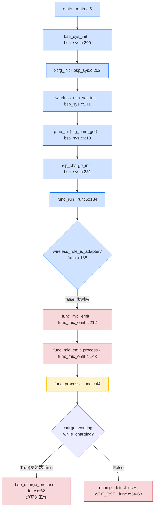

# AB5766 无线麦克风 **发送端（Mic Emit）** 充电功能实现与测试指南

> **版本**：V0.0.1（基于 `projects/microphone/config_ab5766_le_mic.h` 当前源码，`BSP_CHARGE_EN = 1`）
> **目标读者**：刚接触 AB5766 LE Mic SDK、需要在**发射端**验证充电功能的新手固件/硬件工程师。
> **范围**：从开机 → 角色判定为发射端 → 公共充电初始化 → 发射端运行循环中的充电周期处理 → 充电状态机 → LED/低功耗/唤醒/关机 → 接线 → 构建/烧录 → 分阶段测试 → 日志排查。
> **写作原则**：本文档**所有调用关系均通过实际代码引用验证**，不依据文件名或命名猜测功能；凡引用必附"文件 + 函数 + 行号"。`.setting` 取值以**当前工作区文件实际内容**为准。涉及硬件电流/电压/温升的结论一律标注为"需实测"，`map.txt` 仅证明静态链接布局。

---

## 0. 阅读须知与关键缩略词

- 文中"X → Y"表示调用关系，箭头右侧若写 `(文件:行号)`，请直接 `Ctrl+G` 跳转核对。
- **角色判定铁律**：发射端/接收端由运行时 `wireless_role_is_adapter()` 决定，**不能依据文件名 `func_mic_emit.c`/`func_adapter.c` 猜测**。同一份镜像烧到不同板子时，由 `xcfg_cb` 里的角色位自动切换。
- 关键缩略词：

| 缩略词 | 含义 |
| --- | --- |
| VUSB | USB 5V 供电输入（充电输入） |
| VBAT | 电池电压 |
| RTCCON | RTC/PMU 相关配置寄存器，充电状态位、VUSB/INBOX 检测位都在其中 |
| VDDIO | 数字 I/O 供电域，充电时会切换 VUSB→VDDIO LDO |
| DC | 直流电源，此处指 VUSB 5V 输入 |
| INBOX | "在充电仓内"检测位（RTCCON bit22） |
| 涓流/恒流/恒压 | Trickle / Constant Current / Constant Voltage 三段充电阶段 |
| 截止电流/截止电压 | 充满判定的两个判据（I 判据 / V 判据） |
| BSP_CHARGE_EN | 编译期充电总开关（当前 = 1） |
| xcfg_cb.charge_en | 运行时充电开关（由配置文件 `.setting` 写入） |

---

## 1. 定位与快速结论

1. **充电功能在 AB5766 上是公共代码，发送端和接收端共用同一套 BSP/Driver 实现**。发射端没有独立的"发射端充电算法"；充电逻辑全部位于 `bsp/bsp_charge.c` 与 `driver/driver_charge.c`，由公共初始化 `bsp_sys_init()` 和公共周期处理 `func_process()` 调度。
2. **当前源码 `BSP_CHARGE_EN = 1`**（见 [config_ab5766_le_mic.h:27](../../projects/microphone/config_ab5766_le_mic.h#L27)），即充电相关代码被编译进镜像。部分历史文档写的 `BSP_CHARGE_EN = 0` 已与当前源码冲突，**一律以当前源码为准**。
3. **发射端是否真正充电取决于运行时 `xcfg_cb.charge_en`**：即使编译进镜像，若该位为 0，`bsp_charge_process()` 第一行即 `return`（[bsp_charge.c:116-118](../../bsp/bsp_charge.c#L116-L118)）。
4. **发射端当前 `.setting` 实际配置：`charge_en = True`、`charge_working_while_charging = True`**（[wireless_mic_emit.setting:66,69](../../projects/microphone/Output/bin/Settings/wireless_mic_emit.setting#L66)）。即发射端**默认就走"边充边工作"**：主循环每 tick 调 `bsp_charge_process()`，充电与无线/音频并行。这与接收端（默认阻塞充电）相反，详见第 4 节。
5. **`map.txt` 只能证明充电代码被链接、落在哪些段，不能证明充电电流/电压/温升/电池安全**。任何充电安全结论必须用万用表/电流表/温度实测。

> **关于工作区配置差异的说明**：当前 `wireless_mic_emit.setting` 中 `charge_working_while_charging`、`mic_bias_method`、`mic_anl_gain`、`dac_sel` 等字段相对仓库 HEAD 有测试性改动（可 `git diff` 查看）。本文档描述的是**当前工作区实际生效值**；若回退到 HEAD 原始默认，`charge_working_while_charging` 会变为 False（阻塞充电路径），届时参照第 4.2 节理解。

---

## 2. 双角色同镜像：充电代码如何被发射端走到

AB5766 采用**双角色同镜像**方案：发送端和接收端共用一份固件，运行时由 `wireless_role_is_adapter()` 分派。



### 2.1 角色判定证据链（不靠文件名，靠调用关系）

- `wireless_role_is_adapter()` 实际等价于 `cfg_wireless_role`，见 [api_wireless_mic.h:52](../../libs/ble/api_wireless_mic.h#L52)。
- `cfg_wireless_role` 的实际值由 `wireless_mic_role_init()` 设置，见 [wireless_proc.c:5-18](../../modules/wireless/wireless_proc.c#L5-L18)：
  - `xcfg_cb.wireless_adapter_en` 为真 → `cfg_wireless_role = true` → **接收端**；
  - `xcfg_cb.wireless_mic_emit_en` 为真 → `cfg_wireless_role = false` → **发射端**；
  - 两者都关 → 默认 `false` → **发射端**。
- `wireless_mic_role_init()` 由 `wireless_mic_var_init()` 调用，而 `wireless_mic_var_init()` 在 [bsp_sys.c:211](../../bsp/bsp_sys.c#L211) 被调用。
- 发射端 `.setting` 中 `wireless_adapter_en = False`、`wireless_mic_emit_en = True`（[wireless_mic_emit.setting:20-21](../../projects/microphone/Output/bin/Settings/wireless_mic_emit.setting#L20)），因此判定链：`main` → `bsp_sys_init` → `xcfg_init`（加载 `wireless_mic_emit_en=True`）→ `wireless_mic_var_init` → `wireless_mic_role_init`（置 `cfg_wireless_role = false`）→ `func_run` → `wireless_role_is_adapter()` 为 false → `func_mic_emit`。

> **结论**：发射端的充电路径不是 `func_mic_emit.c` 里专属实现的，而是通过 **公共初始化 `bsp_sys_init` → `bsp_charge_init`** 和 **公共周期 `func_process` → `bsp_charge_process`** 进入，与发送端的扫描/回连/音频处理并存。

---

## 3. 公共充电初始化链（开机一次性，发射端走同一份代码）

### 3.1 入口顺序（`bsp_sys_init`）

[bsp_sys.c:200-267](../../bsp/bsp_sys.c#L200) 关键顺序：

| 步骤 | 代码位置 | 作用 |
| --- | --- | --- |
| 1 | `bsp_sys.c:202` `xcfg_init(&xcfg_cb, ...)` | 从 Flash 加载配置到 `xcfg_cb`（含 `charge_en`、`charge_constant_curr` 等） |
| 2 | `bsp_sys.c:209` `bsp_var_init()` | 初始化 `pwroff_time/delay`、充电仓类型（`bsp_sys.c:129-131`） |
| 3 | `bsp_sys.c:211` `wireless_mic_var_init()` | 设定角色（发射端/接收端）+ 装载角色代码 |
| 4 | `bsp_sys.c:213` `pmu_init(cfg_pmu_get())` | **PMU 充电门禁**（见 3.2） |
| 5 | `bsp_sys.c:219-221` `bsp_key_init()` | 按键 |
| 6 | `bsp_sys.c:223-228` `led_init()/dled_init()` | LED 初始化（含充电红灯 IO） |
| 7 | `bsp_sys.c:230-232` `#if BSP_CHARGE_EN bsp_charge_init()` | **充电初始化**（见第 5 节） |
| 8 | `bsp_sys.c:234-236` `#if BSP_VBAT_DETECT_EN bsp_vbat_detect_init()` | VBAT ADC 检测（当前 `BSP_VBAT_DETECT_EN=0`，不编译） |
| 9 | `bsp_sys.c:238` `power_on_check()` | 开机判断（含 VUSB 出仓自动开机等，见第 9 节） |

### 3.2 PMU 充电门禁（`cfg_pmu_get`）

[bsp_sys.c:99-113](../../bsp/bsp_sys.c#L99)：

```c
#if !BSP_CHARGE_EN
    pmu_cfg |= PMU_CFG_CHARGE_DIS;     // bsp_sys.c:109
#endif
```

- 当 `BSP_CHARGE_EN = 0` 时，PMU 被强制 `PMU_CFG_CHARGE_DIS`，充电通路在 PMU 层就被切断，`bsp_charge_*` 代码也不编译。
- 当前 `BSP_CHARGE_EN = 1`，**不置 `PMU_CFG_CHARGE_DIS`**，PMU 充电通路被打开，`bsp_charge_init()` 才有意义。

> **知识点**：这是"编译期两级开关"的第一级——`BSP_CHARGE_EN` 同时控制（a）PMU 硬件通路、（b）`bsp_charge.c`/`driver_charge.c` 整段代码是否编译、（c）`func_process`/`func_lowpwr` 中的 `#if BSP_CHARGE_EN` 分支。三者必须同时为 1，充电才完整可用。

---

## 4. 公共充电周期链（发射端运行循环中）

发射端进入 `func_mic_emit()` 后，主循环每次都调用 `func_mic_emit_process()` → `func_process()`（[func_mic_emit.c:156-157](../../functions/func_mic_emit.c#L156-L157)）。充电的周期处理就在 `func_process()` 里。

[func.c:44-68](../../functions/func.c#L44) 核心片段：

```c
#if BSP_CHARGE_EN
    if (xcfg_cb.charge_working_while_charging) {
        bsp_charge_process();                         // func.c:52 边充边工作
    } else {
        bool charge_in = (charge_detect_dc() == CHARGE_DC_STATUS_ONLINE) ? true : false;
        #if BSP_CHARGE_BOX_EN
        if(sys_cb.charge_box_type != CHARGE_BOX_DISABLE) {
            charge_in = CHARGE_INBOX()? true : false; // func.c:58 充电仓用INBOX
        }
        #endif
        if (charge_in) {
            WDT_RST();                                // func.c:62 仅喂狗+防复位
        }
    }
#endif
```

### 4.1 两种充电工作策略

| `charge_working_while_charging` | 主循环行为 | 充电状态机推进方式 | 当前默认角色 |
| --- | --- | --- | --- |
| **= 1（边充边工作）** | 每 tick 都调 `bsp_charge_process()`（[func.c:52](../../functions/func.c#L52)） | 充电状态机在主循环中持续推进，同时跑无线/音频 | **发射端默认**（mic_emit.setting 当前 = True） |
| **= 0（不边充边工作）** | 主循环只做 `charge_detect_dc()` + `WDT_RST()`（[func.c:54-63](../../functions/func.c#L54)） | 充电状态机推进被**移到 `bsp_charge_init()` 的阻塞 while 循环**（见第 5.2 节） | 接收端默认（adapter.setting = False） |

### 4.2 发射端当前路径：边充边工作（主线）

发射端当前 `charge_working_while_charging = True`（[wireless_mic_emit.setting:69](../../projects/microphone/Output/bin/Settings/wireless_mic_emit.setting#L69)），走 `func.c:52`：

- `bsp_charge_init()` 仅做一次性寄存器初始化（写电流/电压/模式），**不阻塞**。
- 设备正常进入 `func_mic_emit`，无线扫描/回连/音频采集编码与充电周期处理**并行**运行。
- 充电状态机由主循环每 tick 调用 `bsp_charge_process()` 推进（见第 5.3 节）。
- 充满判定与关机也由 `bsp_charge_process` 周期检测（[bsp_charge.c:137-144](../../bsp/bsp_charge.c#L137)），不在初始化阶段处理。

> **若 `charge_working_while_charging = False`（阻塞路径，非发射端当前值）**：`bsp_charge_init()` 会在 `while (charge_detect_dc() == ONLINE)` 循环里**阻塞**专职充电（[bsp_charge.c:64-75](../../bsp/bsp_charge.c#L64)），期间无线/音频不工作；充满或拔出 DC 才退出，再可能 `func_pwroff()`。了解此分支有助于对照接收端行为。

---

## 5. BSP 充电策略层（`bsp_charge.c`）

[bsp_charge.c](../../bsp/bsp_charge.c) 整段受 `#if BSP_CHARGE_EN` 包裹（第 7/171 行）。

### 5.1 编译期常量

[bsp_charge.c:9-10](../../bsp/bsp_charge.c#L9)：
```c
#define RECHARGE_EN              0   // 复充使能：关闭
#define CHARGE_FULL_PWROFF_EN    1   // 充满电是否进关机：开启
```

- `RECHARGE_EN = 0`：充满后**不会**因电池回落自动重新充电（`bsp_charge.c:150-160` 的复充块被 `#if (BSP_VBAT_DETECT_EN && RECHARGE_EN)` 关掉，当前 `BSP_VBAT_DETECT_EN` 也是 0）。
- `CHARGE_FULL_PWROFF_EN = 1`：充满后进入关机流程。在边充边工作路径下，关机由 `bsp_charge_process` 周期触发（[bsp_charge.c:137-144](../../bsp/bsp_charge.c#L137)）。

### 5.2 `bsp_charge_init()`（一次性初始化 + 可选阻塞）

[bsp_charge.c:29-106](../../bsp/bsp_charge.c#L29) 关键步骤：

1. **装载配置**（[bsp_charge.c:46-60](../../bsp/bsp_charge.c#L46)），全部来自 `xcfg_cb`：
   - `const_curr = xcfg_cb.charge_constant_curr`（恒流电流，发射端当前 = 100mA 档）
   - `cutoff_curr = xcfg_cb.charge_stop_curr * 0x800`（截止电流，`0x800` 是档位步长，见第 6.2 节）
   - `cutoff_volt = CHARGE_CUTOFF_VOL_4V35`（**固定 4.35V，不读 xcfg**）
   - `dcin_reset = charge_dc_in_rst ? EN : DIS`（插入 DC 是否复位，发射端当前 = False → DIS，插 DC 不复位）
   - `trick_curr / trick_curr_en = charge_trickle_curr / charge_trick_en`
   - `mode = CHARGE_MODE_FULL_DISCONNECT`（**固定充满断开**，不读 xcfg）
   - `vol_follow = DISABLE`（**固定关闭电压跟随**）
2. **`charge_init(&charge_init_struct)`**（[bsp_charge.c:62](../../bsp/bsp_charge.c#L62)）→ 写底层寄存器，见第 6 节。
3. **阻塞充电判断**（[bsp_charge.c:64-105](../../bsp/bsp_charge.c#L64)，仅 `!charge_working_while_charging` 时执行）：
   ```c
   if (!xcfg_cb.charge_working_while_charging) {
       while (charge_detect_dc() == CHARGE_DC_STATUS_ONLINE) {
           WDT_CLR();
           bsp_charge_process();                 // bsp_charge.c:67 阻塞推进充电
           #if CHARGE_FULL_PWROFF_EN
           if((charge_get_status() == CHARGE_STA_OFF) && func_cb.sta == FUNC_PWROFF) {
               printf("charge exit\n"); break;     // bsp_charge.c:71 充满退出
           }
           #endif
       }
       charge_status_last = CHARGE_STA_OFF;
       led_charge_off();                          // bsp_charge.c:78
       #if CHARGE_FULL_PWROFF_EN
       ... func_pwroff(); ...                     // bsp_charge.c:97/102 充满/入仓关机
       #endif
   }
   ```

> **发射端当前 `charge_working_while_charging = True`，不进入此阻塞块**，`bsp_charge_init` 完成寄存器写入即返回，设备继续往下走 `power_on_check` → `func_run` → `func_mic_emit`。阻塞路径仅当该字段为 False 时生效（对照接收端）。

### 5.3 `bsp_charge_process()`（周期推进，发射端每 tick 调用）

[bsp_charge.c:109-169](../../bsp/bsp_charge.c#L109)，带段标注 `AT(.text.app.proc.charge)`：

1. **运行时总开关**（[bsp_charge.c:116-118](../../bsp/bsp_charge.c#L116)）：`if (!xcfg_cb.charge_en) return;` —— 即使编译进镜像，`charge_en=0` 也不充电。发射端当前 `charge_en = True`，此关放行。
2. **状态变化检测 + LED**（[bsp_charge.c:120-130](../../bsp/bsp_charge.c#L120)）：
   ```c
   charge_status = charge_get_status();
   if (charge_status != charge_status_last) {
       charge_status_last = charge_status;
       printf("charge: %d\n", charge_status);   // bsp_charge.c:123 关键日志
       if (charge_status >= CHARGE_STA_ON_CON_CURR) led_charge_on();   // 进入恒流亮红灯
       else led_charge_off();
   }
   ```
   - **这是新手最该盯的日志**：`charge: 3`/`charge: 4`/`charge: 5`/`charge: 2` 分别对应涓流/恒流/恒压/充满但DC在线（见第 6.1 节枚举值）。
3. **低功耗延时复位**（[bsp_charge.c:132-135](../../bsp/bsp_charge.c#L132)）：充电中（`sta > CHARGE_STA_OFF_BUT_DC_IN`）复位关机/睡眠延时，避免充电中误关机。
4. **充满关机**（[bsp_charge.c:137-144](../../bsp/bsp_charge.c#L137)）：
   ```c
   #if CHARGE_FULL_PWROFF_EN
   if (charge_status_last == CHARGE_STA_OFF_BUT_DC_IN) {
       printf("-->charge full, enter pwroff\n"); // bsp_charge.c:139 充满日志
       charge_status_update(CHARGE_STA_OFF);
       func_cb.sta = FUNC_PWROFF;                // bsp_charge.c:141 触发关机
       return;
   }
   #endif
   ```
   - 充满判据是 `CHARGE_STA_OFF_BUT_DC_IN`（值=2），到达后立即把 `func_cb.sta` 置为 `FUNC_PWROFF`，下一轮 `func_run` switch 会进 `func_pwroff`。
5. **100 tick 推进底层状态机**（[bsp_charge.c:146-161](../../bsp/bsp_charge.c#L146)）：每 100 tick 调一次 `charge_process()`（第 6 节），并处理复充（当前被 `RECHARGE_EN=0` 关掉）。
6. **2000 tick 错误检测**（[bsp_charge.c:163-168](../../bsp/bsp_charge.c#L163)）：每 2s 检查 `charge_detect_dc() == CHARGE_DC_STATUS_ONLINE_BUT_ERR`，打印 `[charge] CHARGE LINE VOLTAGE ERROR!!!`。

---

## 6. Driver 充电状态机（`driver_charge.c` / `driver_charge.h`）

底层寄存器级状态机，由 `bsp_charge_process` 每 100 tick 调用一次。

### 6.1 状态枚举（`driver_charge.h`）

[driver_charge.h:35-42](../../driver/driver_charge.h#L35)：

| 枚举 | 值 | 含义 |
| --- | --- | --- |
| `CHARGE_STA_UNINIT` | 0 | 未初始化 |
| `CHARGE_STA_OFF` | 1 | 充电关闭 |
| **`CHARGE_STA_OFF_BUT_DC_IN`** | **2** | **充满但 DC 仍在线**（触发关机的判据） |
| `CHARGE_STA_ON_TRICKLE` | 3 | 涓流充电 |
| `CHARGE_STA_ON_CON_CURR` | 4 | 恒流充电 |
| `CHARGE_STA_ON_CON_VOL` | 5 | 恒压充电 |

DC 检测枚举 [driver_charge.h:26-30](../../driver/driver_charge.h#L26)：`OFF=0`、`ONLINE_BUT_ERR=1`、`ONLINE=2`。

### 6.2 关键档位枚举

- **截止电压**（[driver_charge.h:163-168](../../driver/driver_charge.h#L163)）：`4V2=0x0000`、`4V35=0x0100`、`4V4=0x0200`、`4V45=0x0300`。当前 BSP 固定用 `CHARGE_CUTOFF_VOL_4V35`。
- **截止电流**（[driver_charge.h:142-158](../../driver/driver_charge.h#L142)）：`0mA=0x0000`、`2.5mA=0x0800`、`5mA=0x1000` … `37.5mA=0x7800`，**步长 `0x0800`**。BSP 用 `xcfg_cb.charge_stop_curr * 0x800` 换算（[bsp_charge.c:47](../../bsp/bsp_charge.c#L47)）；发射端当前 `charge_stop_curr=30mA`（[xcfg.h:31](../../projects/microphone/xcfg.h#L31) 对应档值 12 → 12×0x800=0x6000）。
- **充电电流**（[driver_charge.h:55-136](../../driver/driver_charge.h#L55)）：`5mA=0x0000` … `400mA`，步长 1 档=5mA。发射端当前 `charge_constant_curr=100mA`（档值 19）。
- **涓流电流**（复用 `CHARGE_CUR_TYPEDEF`，但只取低 7 位写入，见 `charge_status_update`）。发射端当前 `charge_trickle_curr=20mA`（档值 3）。

> **安全提示**：发射端当前恒流档为 **100mA**。无线麦通常使用小容量锂电池，100mA 对某些小电池可能偏大。实测前务必核对电池规格书允许的最大充电电流；若不确定，可在配置工具里把 `charge_constant_curr` 调小（如 40mA）再试。

### 6.3 `charge_init()`：写寄存器

[driver_charge.c:58-95](../../driver/driver_charge.c#L58)：

1. `charge_cutoff_curr_trim` / `charge_const_curr_trim`：电流 trim 校准（[driver_charge.c:60-61](../../driver/driver_charge.c#L60)）。
2. 写截止电压到 `RTCCON8`（[driver_charge.c:63-64](../../driver/driver_charge.c#L63)）。
3. 写截止电流到 `RTCCON7`（[driver_charge.c:66-67](../../driver/driver_charge.c#L66)）。
4. 写 DC 插入复位 `RTCCON`（[driver_charge.c:69-70](../../driver/driver_charge.c#L69)），发射端 `charge_dc_in_rst=False` → 不复位。
5. 电压跟随配置 `RTCCON7`（[driver_charge.c:72-78](../../driver/driver_charge.c#L72)），当前 `vol_follow = DISABLE`。
6. VUSB 漏电设置 `RTCCON8`（[driver_charge.c:81-82](../../driver/driver_charge.c#L81)），固定 `(0x02 << 16)`。
7. 清状态、初始 `charge_status.sta = CHARGE_STA_OFF`（[driver_charge.c:84-94](../../driver/driver_charge.c#L84)）。

### 6.4 `charge_process()`：DC 检测 + 分派

[driver_charge.c:115-141](../../driver/driver_charge.c#L115)，带 `AT(.text.app.proc.charge)`：

1. 未初始化直接返回（[driver_charge.c:119-121](../../driver/driver_charge.c#L119)）。
2. **DC 插入去抖**（[driver_charge.c:124-132](../../driver/driver_charge.c#L124)）：`charge_detect_dc()` 与上次不同时，连续 >5 次才更新 `dc_insert`，去抖防抖。
3. `dc_insert == ONLINE` → `charge_DC_online_handle()`（[driver_charge.c:134-135](../../driver/driver_charge.c#L134)）；否则若状态非 OFF → `charge_status_update(CHARGE_STA_OFF)`（[driver_charge.c:137-139](../../driver/driver_charge.c#L137)）。

### 6.5 `charge_DC_online_handle()`：阶段切换

[driver_charge.c:148-186](../../driver/driver_charge.c#L148)：

- **OFF 起始**（[driver_charge.c:151-168](../../driver/driver_charge.c#L151)）：若 `trickle_en == DISABLE` 或 `VBAT_OVER_TRICKLE()`（电池电压已高于涓流阈值）→ 去抖 >10 次进 `CHARGE_STA_ON_CON_CURR`（恒流）；否则进 `CHARGE_STA_ON_TRICKLE`（涓流）。
- **涓流中**（[driver_charge.c:170-179](../../driver/driver_charge.c#L170)）：`VBAT_OVER_TRICKLE()` 去抖 >10 次后切到恒流。
- **恒流/恒压中**（[driver_charge.c:181-185](../../driver/driver_charge.c#L181)）：`sta > ON_TRICKLE` 时调 `charge_detect_off_condition()` 检测充满。

### 6.6 `charge_status_update()`：每阶段寄存器配置

[driver_charge.c:200-268](../../driver/driver_charge.c#L200)，这是**充电最核心的寄存器操作**：

| 状态 | 关键操作 | 代码行 |
| --- | --- | --- |
| `CHARGE_STA_OFF` | 恢复 VDDIO、`VUSB_2_VDDIO_DIS`、`CHARGE_DIS`、`CHARGE_STOP_EN` | [driver_charge.c:205-215](../../driver/driver_charge.c#L205) |
| `CHARGE_STA_OFF_BUT_DC_IN` | `mode==FULL_DISCONNECT` 时 `CHARGE_STOP_EN`（充满断开） | [driver_charge.c:217-221](../../driver/driver_charge.c#L217) |
| `CHARGE_STA_ON_TRICKLE` | `VUSB_2_VDDIO_EN`、VUSB→VDDIO LDO=2.8V、VBAT_VDDIO=2.4V、写涓流电流、`CHARGE_EN`、`CHARGE_STOP_DIS` | [driver_charge.c:223-259](../../driver/driver_charge.c#L223) |
| `CHARGE_STA_ON_CON_CURR` | VUSB→VDDIO LDO=3.3V、VBAT_VDDIO=2.85V、写恒流电流、`CHARGE_EN`、`CHARGE_STOP_DIS` | [driver_charge.c:223-259](../../driver/driver_charge.c#L223) |
| `CHARGE_STA_ON_CON_VOL` | `CHARGE_EN`、`CHARGE_STOP_DIS` | [driver_charge.c:261-264](../../driver/driver_charge.c#L261) |

> **知识点（VUSB→VDDIO LDO）**：充电时芯片不直接从 VUSB 给 VBAT 充，而是先把 VUSB 经 LDO 降到 VDDIO 域（涓流 2.8V/恒流 3.3V），再对 VBAT 充电。`VBAT_VDDIO` 设 2.4V/2.85V 是为保证 `VUSB_VDDIO > VBAT_VDDIO`，让电流方向正确。这是硬件级的安全约束。

### 6.7 `charge_detect_off_condition()`：充满判定

[driver_charge.c:275-323](../../driver/driver_charge.c#L275)：

- **I 判据**（电流判据，[driver_charge.c:280-282](../../driver/driver_charge.c#L280)）：`CHARGE_CUR_LESS_END_CUR()` 为真（充电电流低于截止电流）→ `reach_cutoff_curr_debounce_cnt++`，**累计 ≥ 98 次**返回 true（充满）。
- **V 判据**（电压判据，[driver_charge.c:284-286](../../driver/driver_charge.c#L284)）：`VBAT_OVER_END_VOL()`（电池电压高于截止电压）→ `reach_cutoff_vol_debounce_cnt++`，**≥ 98 次**切到 `CHARGE_STA_ON_CON_VOL`（恒压阶段）。
- **恒压阶段计时停充**（[driver_charge.c:307-313](../../driver/driver_charge.c#L307)）：若设置了 `cutoff_vol_2_stop_time`，恒压计时到达后返回 true 停充。

> **关于 `charge_stop_time`（截止计时）**：`xcfg.h` 有 `charge_stop_time` 字段（[xcfg.h:34](../../projects/microphone/xcfg.h#L34)），`.setting` 也写了 `charge_stop_time = 3`（[wireless_mic_emit.setting:73](../../projects/microphone/Output/bin/Settings/wireless_mic_emit.setting#L73)）。但该字段需要通过 `charge_cutoff_vol_to_stop_time_set()`（[driver_charge.c:424-427](../../driver/driver_charge.c#L424)，单位 100ms）传入 `charge_ctrl.cutoff_vol_2_stop_time` 才生效。**在当前源码中未找到任何地方调用 `charge_cutoff_vol_to_stop_time_set()`**，因此**不能声称 `charge_stop_time=3` 已生效**；它目前只是配置文件里的一个未接线字段。若需要恒压阶段定时停充，必须在 `bsp_charge_init` 里显式调用该函数（这属于改代码，当前任务不执行，仅记录）。

### 6.8 `charge_detect_dc()`：VUSB/INBOX 检测

[driver_charge.c:366-376](../../driver/driver_charge.c#L366)，带 `AT(.com_periph.charge)`：

```c
u8 status = (RTCCON >> 19 & 0x02) | (RTCCON >> 22 & 0x01);  // [20]VUSB online [22]INBOX
if (status > 1) return CHARGE_DC_STATUS_ONLINE;
else return status & 0x03;
```

- **DC 在线检测不是普通 GPIO**，而是读 `RTCCON` 寄存器位：bit20 = VUSB online，bit22 = INBOX。
- `bsp_charge.h:4-5` 提供等价宏 `CHARGE_DC_IN()` / `CHARGE_INBOX()`，分别取 `(RTCCON>>19)&0x02`（即 bit20）和 `(RTCCON>>22)&0x01`（即 bit22）。
- `>1`（即 bit20 或 bit22 任一为 1）判为 `ONLINE`；否则返回低 2 位（0=OFF、1=ONLINE_BUT_ERR）。

> **知识点**：发射端没有充电仓（`BSP_CHARGE_BOX_EN = 0`），实际只用 VUSB 位（bit20）。INBOX 位用于充电仓方案，当前不参与。

---

## 7. 配置来源与加载（`xcfg_cb` vs `.setting`）

充电行为受**两层配置**控制，新手务必分清：

| 层级 | 字段位置 | 改法 | 作用 |
| --- | --- | --- | --- |
| **编译期** | `config_ab5766_le_mic.h` 的 `BSP_CHARGE_EN` 等 | 改 .h 重新编译 | 决定代码是否编译、PMU 通路、寄存器固定值 |
| **运行时** | `xcfg_cb.*`（来自 `.setting` → `xcfg_init`） | 改 `.setting` 用 xmaker 重新打包 `res/xcfg`，或在线调 | 决定充电使能、电流、涓流、DC复位、边充边工作等 |

### 7.1 `xcfg_cb` 充电字段（`xcfg.h`）

[xcfg.h:26-35](../../projects/microphone/xcfg.h#L26)：

| 字段 | 行号 | 含义 | 发射端当前值 |
| --- | --- | --- | --- |
| `charge_en` | 26 | 运行时充电使能 | **True**（mic_emit.setting:66） |
| `charge_trick_en` | 27 | 涓流充电使能 | True（:67） |
| `charge_dc_in_rst` | 28 | 插入DC复位 | **False**（:74）→ 插 DC 不复位 |
| `poweron_vusb_out_en` | 29 | 退出充电自动开机 | False（:24） |
| `charge_working_while_charging` | 30 | 边充边工作使能 | **True**（:69） |
| `charge_stop_curr` | 31 | 截止电流档位 | 30mA（:70） |
| `charge_constant_curr` | 32 | 恒流电流档位 | **100mA**（:71） |
| `charge_trickle_curr` | 33 | 涓流电流档位 | 20mA（:72） |
| `charge_stop_time` | 34 | 截止计时（**未接线，见 6.7**） | 3（未生效） |
| `ch_box_type` | 35 | 充电仓类型 | 0=关闭（:83） |

> **字段名映射注意**：`.setting` 里的键名 `charge_dc_not_pwron` 对应 `xcfg.h` 字段 `charge_dc_in_rst`（[wireless_mic_emit.setting:68](../../projects/microphone/Output/bin/Settings/wireless_mic_emit.setting#L68) vs [xcfg.h:28](../../projects/microphone/xcfg.h#L28)），两者名称不同但是同一配置项（"插入 DC 是否复位/不复位开机"）。

### 7.2 发射端 `.setting` 当前关键值

[wireless_mic_emit.setting:66-74](../../projects/microphone/Output/bin/Settings/wireless_mic_emit.setting#L66)：

```xml
<add key="charge_en" value="True" />                        <!-- 已开启充电 -->
<add key="charge_working_while_charging" value="True" />   <!-- 边充边工作 -->
<add key="charge_stop_curr" value="30mA" />
<add key="charge_constant_curr" value="100mA" />            <!-- 恒流100mA，注意电池规格 -->
<add key="charge_trickle_curr" value="20mA" />
<add key="charge_dc_in_rst" value="False" />                <!-- 插DC不复位 -->
```

> **新手第一坑（发射端版本）**：发射端当前 `charge_en` 已经是 True，代码层面充电已生效。但**若未接电池**，`charge_process` 底层因无电池负载，`VBAT_OVER_TRICKLE()` 等状态异常，通常**不会出现 `charge: 3/4/5` 正常阶段日志**，可能停在 OFF。这是硬件条件不满足，**不能据此判断代码有问题**。要看到完整充电日志，必须接入电池（见第 11 节）。

---

## 8. LED 充电指示（红灯）

充电红灯由 `bsp_charge_process` 状态变化驱动，与连接蓝灯分离。

### 8.1 初始化与共脚判断

[bsp_led.c:36-53](../../bsp/bsp_led.c#L36) `led_init()`：若 `bled_io_sel == rled_io_sel`（蓝红同 IO），置 `led2_flag = 1`，用一个 IO 推两个灯（数字/模拟模式切换）。红蓝灯 IO 由 `xcfg_cb.bled_io_sel`/`rled_io_sel` 运行时决定。

### 8.2 充电红灯 API

[bsp_led.c:111-126](../../bsp/bsp_led.c#L111)：
```c
void led_charge_on(void)  { charge_flag = true; if(!led2_flag) bled_set_off(); rled_set_on(); }
void led_charge_off(void) { rled_set_off(); charge_flag = false; }
```

### 8.3 调用点（状态变化时）

`bsp_charge.c:124-128`：状态变化且 `charge_status >= CHARGE_STA_ON_CON_CURR`（恒流及以上）→ `led_charge_on()`；否则 `led_charge_off()`。

### 8.4 蓝灯扫描不被充电红灯覆盖

[bsp_led.c:229-231](../../bsp/bsp_led.c#L229) `led_scan()`：
```c
if (led_cb.charge_flag) { return; }   // 充电中，蓝灯扫描直接返回，红灯保持
```

> **发射端 LED 默认状态**：发射端 `.setting` 当前 `bled_disp_en = False`、`rled_disp_en = False`（[wireless_mic_emit.setting:79-80](../../projects/microphone/Output/bin/Settings/wireless_mic_emit.setting#L79)），**默认两个灯都不显示**。即使 `led_charge_on()` 被调用，因 `rled_disp_en=False` 红灯 IO 可能未启用，**看不到红灯点亮**。要实测充电红灯，需先在配置工具里把 `rled_disp_en` 改 True 并指定 `rled_io_sel` 对应硬件 IO。
> 发射端连接/配对蓝灯由 `wireless_mic_proc()` → `led_bt_connected/led_bt_idle` 处理（`func_mic_emit.c:47,156`）；充电红灯由 `bsp_charge_process` 处理。两者通过 `charge_flag` 互斥，充电中蓝灯让位红灯。

---

## 9. 低功耗 / 唤醒 / 关机与充电的交互

充电与关机/唤醒深度耦合。发射端当前为边充边工作，关机由 `bsp_charge_process` 周期触发（非阻塞路径）。

### 9.1 充电中防关机/防睡眠

`bsp_charge.c:132-135`：充电中（`sta > OFF_BUT_DC_IN`）复位 `lowpwr_pwroff_delay_reset()` / `lowpwr_sleep_delay_reset()`，避免充电中被自动关机/睡眠。

### 9.2 睡眠唤醒源选择（`lowpwr_sleep_wakeup_config_do`）

[func_lowpwr.c:151-177](../../functions/func_lowpwr.c#L151)：
```c
#if BSP_CHARGE_EN
if (charge_detect_dc() == CHARGE_DC_STATUS_ONLINE){
    config.source |= WK_LP_INBOX;     // DC在线→用INBOX唤醒
} else {
    config.source |= WK_LP_VUSB;      // 否则→用VUSB边沿唤醒
}
#endif
```
- 发射端无仓，`WK_LP_INBOX` 实际仍由 VUSB 位驱动，但语义上"在线时配 INBOX 唤醒"。
- `sfunc_sleep_prepare`（[func_lowpwr.c:200-208](../../functions/func_lowpwr.c#L200)）在进睡眠前再次按 DC 在线状态切换唤醒源。

### 9.3 关机唤醒配置（`lowpwr_pwroff_wakeup_config`）

[func_lowpwr.c:352-394](../../functions/func_lowpwr.c#L352)：
```c
#if BSP_CHARGE_EN
if (charge_detect_dc() == CHARGE_DC_STATUS_ONLINE) config.source |= WK_LP_INBOX;
else config.source |= WK_LP_VUSB;                          // func_lowpwr.c:362-366
#endif
#if BSP_ADKEY_EN
config.source |= WK_LP_WK0;                                // func_lowpwr.c:371 按键唤醒
#endif
```
- 关机后：DC 在线 → 等 INBOX 变化唤醒；DC 不在线 → 等 VUSB 插入唤醒（拔出再插入会唤醒）。
- `func_pwroff`（[func_lowpwr.c:407-433](../../functions/func_lowpwr.c#L407)）：关 LED、配唤醒源、按 `SYS_PWROFF_MODE = PWROFF_MODE2`（[config_ab5766_le_mic.h:23](../../projects/microphone/config_ab5766_le_mic.h#L23)）执行 `lowpwr_pwroff_mode2_do()`（VDDIO 不掉电）。

### 9.4 开机判断（`power_on_check`，与充电相关）

[bsp_sys.c:152-196](../../bsp/bsp_sys.c#L152)：
- `WK_LP_INBOX_PENDING`（出仓唤醒）或 `WK_LP_VUSB_PENDING`（VUSB 唤醒）+ `poweron_vusb_out_en` 为真 → 直接 `return` 开机（[bsp_sys.c:157-164](../../bsp/bsp_sys.c#L157)）。
- 发射端 `poweron_vusb_out_en = False`（mic_emit.setting:24），所以 VUSB 唤醒后还要走按键开机判断（`bsp_sys.c:175-194` while 循环等 `KEY_ID_PP`）。

> **发射端 `lpwr_off_vbat_level = 3.1V`**（[wireless_mic_emit.setting:26](../../projects/microphone/Output/bin/Settings/wireless_mic_emit.setting#L26)）：低电自动关机电压设为 3.1V。但当前 `BSP_VBAT_DETECT_EN = 0`，VBAT ADC 检测代码不编译（[bsp_saradc_vbat.c](../../bsp/bsp_saradc_vbat.c) 整段被排除），因此**该低电关机阈值当前实际不生效**——无电池电压检测就无法触发低电关机。若需低电关机，需同时打开 `BSP_VBAT_DETECT_EN` 并接入 VBAT ADC 路径（属改配置/硬件，当前任务不执行）。

---

## 10. 充电状态机 Mermaid 流程图（发射端边充边工作视角）

```mermaid
flowchart TD
    Start([开机: bsp_sys_init]) --> Init["bsp_charge_init<br/>bsp_charge.c:29<br/>装载xcfg_cb参数→charge_init写寄存器"]
    Init --> Wkwc{"charge_working<br/>_while_charging?<br/>bsp_charge.c:64"}
    Wkwc -->|"True(发射端当前)"| Loop["正常返回→power_on_check→func_run→func_mic_emit<br/>主循环每 tick 调 bsp_charge_process<br/>func.c:52"]
    Wkwc -->|"False(对照接收端)"| Block["阻塞 while: charge_detect_dc==ONLINE<br/>bsp_charge.c:65-75<br/>WDT_CLR+bsp_charge_process"]
    Block --> FullChk{"charge_get_status==OFF<br/>&& func_cb.sta==PWROFF?<br/>bsp_charge.c:70"}
    FullChk -->|是| Break["break→led_charge_off→func_pwroff<br/>bsp_charge.c:71,78,97-102"]
    FullChk -->|否拔出DC| Loop
    Loop --> Proc["bsp_charge_process<br/>bsp_charge.c:109"]
    Proc --> EnChk{"charge_en?<br/>bsp_charge.c:116"}
    EnChk -->|False| RetProc([return 不充电])
    EnChk -->|True| GetSta["charge_get_status<br/>driver_charge.c:330"]
    GetSta --> Chg{"状态变化?"}
    Chg -->|是| Led{"sta>=ON_CON_CURR?"}
    Led -->|是| On["led_charge_on<br/>bsp_led.c:112"]
    Led -->|否| Off["led_charge_off<br/>bsp_led.c:121"]
    Chg -->|否| PwroffChk{"sta==OFF_BUT_DC_IN?<br/>bsp_charge.c:138"}
    On --> PwroffChk
    Off --> PwroffChk
    PwroffChk -->|是| FullPwr["-->charge full enter pwroff<br/>func_cb.sta=FUNC_PWROFF<br/>bsp_charge.c:139-141"]
    PwroffChk -->|否| Tick100{"100 tick到?"}
    Tick100 -->|是| CP["charge_process<br/>driver_charge.c:115"]
    Tick100 -->|否| Tick2k{"2000 tick到?"}
    CP --> DCDetect["charge_detect_dc 去抖<br/>driver_charge.c:124-132"]
    DCDetect -->|"ONLINE"| Online["charge_DC_online_handle<br/>driver_charge.c:148"]
    DCDetect -->|OFF| StaOff["charge_status_update(OFF)<br/>driver_charge.c:138"]
    Online --> StaOff2{"sta==OFF?"}
    StaOff2 -->|"trickle_en且VBAT低"| Trickle["ON_TRICKLE<br/>driver_charge.c:163"]
    StaOff2 -->|"trickle_en=0或VBAT高"| ConCurr["ON_CON_CURR<br/>driver_charge.c:155"]
    Trickle --> VOver{"VBAT_OVER_TRICKLE?<br/>driver_charge.c:171"}
    VOver -->|去抖>10| ConCurr
    ConCurr --> OffCond["charge_detect_off_condition<br/>driver_charge.c:275"]
    OffCond --> ICurr{"I判据去抖>=98?"}
    ICurr -->|是| Done([充满→OFF_BUT_DC_IN])
    OffCond --> VCurr{"V判据去抖>=98?"}
    VCurr -->|是| ConVol["ON_CON_VOL<br/>driver_charge.c:293"]
    ConVol --> Timer{"cutoff_vol_2_stop_time<br/>计时到?"}
    Timer -->|是| Done
    Timer -->|否| OffCond
    Tick2k -->|是| ErrChk{"detect_dc==ONLINE_BUT_ERR?"}
    ErrChk -->|是| ErrLog["[charge] CHARGE LINE VOLTAGE ERROR!!!<br/>bsp_charge.c:166"]
    ErrChk -->|否| Ret([返回])
    ErrLog --> Ret
    Tick2k -->|否| Ret
    FullPwr --> NextLoop["下一轮 func_run→func_pwroff<br/>func.c:169-170"]
    classDef charge fill:#f8d7da,stroke:#dc3545
    classDef led fill:#fff3cd,stroke:#ffc107
    classDef pwroff fill:#d1e7dd,stroke:#198754
    class Block,Loop,Proc,GetSta,CP,DCDetect,Online,StaOff,StaOff2,Trickle,ConCurr,OffCond,ICurr,VCurr,ConVol,Timer,Done,Ret charge
    class On,Off,ErrLog led
    class FullPwr,NextLoop,Break pwroff
```



---

## 11. 接线与硬件准备

### 11.1 发射端充电必需条件

1. **VUSB 5V 输入已引出**（已确认当前板子 VUSB 已引出且有其他 USB 口供电）。
2. **电池已接到 VBAT**（**当前测试板未接电池**——这是之前看不到 `charge:` 正常阶段日志的根因，非代码故障；无电池时 PMU 充电状态机不会进入正常涓流/恒流阶段）。
3. **GND 共地**（USB 供电 GND 与电池 GND 共地）。
4. （可选）**充电红灯 IO**：发射端当前 `rled_disp_en = False`，要看红灯需把 `rled_disp_en = True` 并指定 `rled_io_sel` 对应硬件 IO。

### 11.2 推荐接线

```
USB 5V 电源 ──┬── VUSB（板载 USB 口）
             └── GND
锂电池(3.7V) ─┬── VBAT（需用户接入）
              └── GND
充电指示 LED── rled_io_sel 指定 IO（可选，默认 rled_disp_en=False 不显示）
调试串口    ── PB3（BSP_UART_DEBUG_EN，1500000 baud，看日志）
```

> **安全提示**：发射端当前恒流档为 100mA，接电池前务必用万用表确认电池规格允许该充电电流，且电池电压在涓流阈值以下（如 3.0V 左右）以观察涓流→恒流切换；避免短路。锂电池充电有起火风险，初次测试建议在绝缘环境、有人看护下进行。

### 11.3 不接电池会看到什么

- 插入 USB：设备上电。因发射端 `charge_dc_in_rst = False`，**插拔 USB 不会触发复位**（与接收端不同）。
- `charge_en` 已 True，`bsp_charge_init` 完成寄存器写入（不阻塞）。
- 主循环 `bsp_charge_process` 每 tick 调用，但 `charge_process` 底层因无电池，`VBAT_OVER_TRICKLE()` 等状态可能异常，**通常不会出现 `charge: 3/4/5` 正常日志**，可能停在 `charge: 1`（OFF）或无状态变化日志。
- 这是硬件条件不满足，**不能据此判断代码有问题**。

---

## 12. 新手构建与烧录（用户在已配置的厂商 RV32/Code::Blocks 环境执行）

### 12.1 确认/调整运行时配置

发射端当前 `.setting` 已具备充电条件（`charge_en=True`、`working_while_charging=True`）。若需调整，在配置工具（或直接编辑 `projects/microphone/Output/bin/Settings/wireless_mic_emit.setting`）中：
- `charge_constant_curr` → 按电池规格确认（当前 100mA，小电池建议先调小到 40mA 试）
- `charge_stop_curr` → 30mA（截止电流）
- `charge_trickle_curr` → 20mA，`charge_trick_en` → True
- `charge_dc_in_rst` → False（当前值，插 DC 不复位；若希望插 DC 复位则改 True）
- （可选）`rled_disp_en` → True，`rled_io_sel` → 实际 IO（看红灯）

> 改完 `.setting` 后，需用 `riscv32-elf-xmaker`（prebuild.bat 调用）重新生成 `res/xcfg` 产物，再编译，配置才会进镜像。**直接改 `.setting` 不重新生成是不会生效的**。

### 12.2 编译

在 Code::Blocks 打开 [projects/microphone/app.cbp](../../projects/microphone/app.cbp)，构建 `Debug` 目标。工程会自动执行 `Output/bin/prebuild.bat`（生成 res/xcfg、复制 effect.c/h）和 `Output/bin/postbuild.bat`（生成 app.bin/.dcf、下载镜像、可选反汇编）。

### 12.3 烧录

用厂商下载工具烧录 `Output/bin/app.dcf`（或 `download.xm`）到板子。

### 12.4 验证代码被链接（map 检查，不是硬件验证）

构建后查看 `Output/bin/map.txt`，确认以下符号存在且未被 `--gc-sections` 裁剪：
- `.text.app.proc.charge`（`bsp_charge_process`、`charge_process`）
- `.com_periph.charge`（`charge_get_status`、`charge_detect_dc`）
- `charge_cutoff_vol_to_stop_time_set`（已链接但无调用方，见 6.7）

> **map 只证明代码被链接、段布局正确，不证明充电安全。** 真正验证靠第 13 节硬件实测。

---

## 13. 分阶段测试方案

### 阶段 A：无电池，仅验证上电与日志（安全第一步）

1. 不接电池，仅接 USB 5V。
2. 烧录，打开串口（PB3, 1500000）。
3. 预期：看到 `Hello AB5766`、`bsp_sys_init` 等启动日志；因 `charge_dc_in_rst=False`，插拔 USB 不触发复位。
4. `charge_en` 已 True，若 `charge_detect_dc()` 判 ONLINE，`bsp_charge_process` 会周期运行但无正常阶段日志——**记录现象，不判代码故障**。

### 阶段 B：接电池，观察充电状态机（核心验证）

1. 接入低压电池（约 3.0V，低于涓流阈值）。
2. 上电，串口应依次出现：
   - `charge: 3`（涓流 ON_TRICKLE）→ 红灯亮（若 `rled_disp_en` 已开）
   - 电压上升后 `charge: 4`（恒流 ON_CON_CURR）→ 红灯亮
   - 接近满时 `charge: 5`（恒压 ON_CON_VOL）
   - 充满 `charge: 2`（OFF_BUT_DC_IN）→ `-->charge full, enter pwroff` → 关机
3. **红灯**：恒流及以上常亮，充满后灭（需 `rled_disp_en=True`）。
4. **电流实测**：万用表串入 VUSB，涓流应≈20mA 档，恒流应≈100mA 档（按 `charge_constant_curr`），充满后电流降至截止值以下。
5. **边充边工作验证**：发射端 `working_while_charging=True`，充电期间应同时观察无线扫描/回连日志（`func_mic_emit_process_do` 的 `ble_create_con_for_addr`/`ble_scan_set_enable`，[func_mic_emit.c:66-67](../../functions/func_mic_emit.c#L66)）。确认充电不阻断无线。

### 阶段 C：充满关机与唤醒

1. 充满后设备自动关机（`func_pwroff`，由 `bsp_charge_process` 触发）。
2. 拔出 USB → 再插入：因 `poweron_vusb_out_en = False`，需按键开机（`power_on_check` 等按键）。
3. 若把 `poweron_vusb_out_en` 改 True，VUSB 唤醒会直接开机（[bsp_sys.c:163-164](../../bsp/bsp_sys.c#L163)）。

### 阶段 D：异常与边界

1. **充电错误**：强制 VUSB 电压异常，观察 2s 周期日志 `[charge] CHARGE LINE VOLTAGE ERROR!!!`（[bsp_charge.c:166](../../bsp/bsp_charge.c#L166)）。
2. **快速插拔**：验证 DC 去抖（>5 次，[driver_charge.c:126](../../driver/driver_charge.c#L126)）不误触发状态切换。
3. **温升**：长时间恒流充电（100mA），测温升是否在电池规格内（**必须实测**）。
4. **充电中无线稳定性**：边充边工作模式下，长时间运行观察无线丢帧/重传、音频中断。

---

## 14. 日志与故障排查速查

| 现象 | 可能原因 | 排查点 |
| --- | --- | --- |
| 完全无 `charge:` 日志 | `charge_en = False`（当前发射端为 True，此条多见于接收端） | [wireless_mic_emit.setting:66](../../projects/microphone/Output/bin/Settings/wireless_mic_emit.setting#L66) 确认 True |
| 有上电日志但无 `charge: 3/4/5` | 未接电池 / DC 未判 ONLINE | 接电池；查 `charge_detect_dc`（VUSB 位 bit20） |
| 插拔 USB 触发复位 | `charge_dc_in_rst = True` | 发射端当前 False（[wireless_mic_emit.setting:74](../../projects/microphone/Output/bin/Settings/wireless_mic_emit.setting#L74)），若复位说明被改回 True |
| 只见 `charge: 1`，不进 3/4 | 无电池或电池电压异常 | 确认电池接好、电压正常 |
| 充满不关机 | `CHARGE_FULL_PWROFF_EN` 被改 0 | [bsp_charge.c:10](../../bsp/bsp_charge.c#L10) 确认=1 |
| 红灯不亮 | `rled_disp_en = False` | [wireless_mic_emit.setting:80](../../projects/microphone/Output/bin/Settings/wireless_mic_emit.setting#L80) 改 True 并设 `rled_io_sel` |
| 蓝灯闪烁被红灯压住 | `charge_flag = true` 时 led_scan return | [bsp_led.c:229](../../bsp/bsp_led.c#L229) 正常设计 |
| `[charge] CHARGE LINE VOLTAGE ERROR!!!` | VUSB 电压异常 | 查电源，[bsp_charge.c:166](../../bsp/bsp_charge.c#L166) |
| 充电中无线不工作 | `charge_working_while_charging = False`（阻塞路径） | 发射端当前 True（:69），若不工作说明被改 False，见第 4.2 节 |
| 历史文档说 `BSP_CHARGE_EN=0` | 文档过时 | 以当前源码 [config_ab5766_le_mic.h:27](../../projects/microphone/config_ab5766_le_mic.h#L27) =1 为准 |
| 低电不关机 | `BSP_VBAT_DETECT_EN=0`，VBAT 检测未编译 | 当前低电关机阈值不生效，见第 9.4 节 |

---

## 15. 文件 / 函数 / 行号速查表

| 模块 | 文件 | 函数 | 行号 | 作用 |
| --- | --- | --- | --- | --- |
| 入口 | main.c | main | 5-22 | 复位、bsp_sys_init、func_run |
| 角色分派 | func.c | func_run | 134-178 | wireless_role_is_adapter→func_mic_emit |
| 公共周期 | func.c | func_process | 44-68 | 充电周期/DC检测/喂狗 |
| 公共周期 | func.c | pwroff_process | 22-41 | 关机延时判断 |
| 发射端状态机 | func_mic_emit.c | func_mic_emit | 212-227 | 发射端主循环 |
| 发射端状态机 | func_mic_emit.c | func_mic_emit_process | 143-172 | 调 wireless_mic_proc+func_process |
| 系统初始化 | bsp_sys.c | bsp_sys_init | 200-267 | xcfg_init→pmu_init→bsp_charge_init |
| 系统初始化 | bsp_sys.c | cfg_pmu_get | 99-113 | PMU 充电门禁 |
| 系统初始化 | bsp_sys.c | power_on_check | 152-196 | VUSB/按键开机判断 |
| BSP 充电 | bsp_charge.c | bsp_charge_init | 29-106 | 装载配置+可选阻塞充电 |
| BSP 充电 | bsp_charge.c | bsp_charge_process | 109-169 | 周期推进+LED+充满关机 |
| BSP 充电 | bsp_charge.c | (常量) | 9-10 | RECHARGE_EN=0, FULL_PWROFF=1 |
| BSP 充电 | bsp_charge.h | CHARGE_DC_IN/INBOX 宏 | 4-5 | RTCCON 位检测宏 |
| Driver 充电 | driver_charge.c | charge_init | 58-95 | 写寄存器 |
| Driver 充电 | driver_charge.c | charge_process | 115-141 | DC去抖+分派 |
| Driver 充电 | driver_charge.c | charge_DC_online_handle | 148-186 | 阶段切换 |
| Driver 充电 | driver_charge.c | charge_status_update | 200-268 | 每阶段寄存器配置 |
| Driver 充电 | driver_charge.c | charge_detect_off_condition | 275-323 | I/V判据充满判定 |
| Driver 充电 | driver_charge.c | charge_get_status | 330-334 | 取状态 |
| Driver 充电 | driver_charge.c | charge_detect_dc | 366-376 | VUSB/INBOX 检测 |
| Driver 充电 | driver_charge.c | charge_cutoff_vol_to_stop_time_set | 424-427 | 截止计时设置（**当前未被调用**） |
| Driver 充电 | driver_charge.h | 状态/档位枚举 | 18-201 | 枚举与结构体 |
| 配置 | xcfg.h | xcfg_cb_t 充电字段 | 26-35 | 运行时充电配置 |
| 配置 | config_ab5766_le_mic.h | BSP_CHARGE_EN | 27 | 编译期开关=1 |
| 配置 | wireless_mic_emit.setting | charge_* | 66-74 | 发射端运行时当前值 |
| LED | bsp_led.c | led_charge_on/off | 111-126 | 充电红灯 |
| LED | bsp_led.c | led_scan | 213-259 | charge_flag 互斥 |
| 低功耗 | func_lowpwr.c | lowpwr_sleep_wakeup_config_do | 151-177 | 睡眠唤醒源 |
| 低功耗 | func_lowpwr.c | sfunc_sleep_prepare | 189-227 | 进睡眠前唤醒源切换 |
| 低功耗 | func_lowpwr.c | lowpwr_pwroff_wakeup_config | 352-394 | 关机唤醒源 |
| 低功耗 | func_lowpwr.c | func_pwroff | 407-433 | 关机流程 |
| VBAT 检测 | bsp_saradc_vbat.c | bsp_vbat_proc/bsp_get_vbat_level | 108-154 | 当前 BSP_VBAT_DETECT_EN=0 不编译 |

---

## 16. 代码证据与硬件实测边界（必读）

- **代码证据（已验证）**：充电调用链 `main → bsp_sys_init → bsp_charge_init`（初始化）、`func_mic_emit → func_mic_emit_process → func_process → bsp_charge_process`（周期），全部由实际源码行号确认。发射端与接收端共用此链，**不存在发射端专属充电算法**。
- **当前配置证据**：发射端 `.setting` 当前 `charge_en=True`、`charge_working_while_charging=True`（边充边工作）、`charge_constant_curr=100mA`、`charge_dc_in_rst=False`、`poweron_vusb_out_en=False`，均以 [wireless_mic_emit.setting:66-74](../../projects/microphone/Output/bin/Settings/wireless_mic_emit.setting#L66) 实际内容为准。
- **map 证据**：`map.txt` 可证明 `bsp_charge_process`、`charge_process`、`charge_detect_dc`、`charge_cutoff_vol_to_stop_time_set` 等符号被链接且段标注（`.text.app.proc.charge`、`.com_periph.charge`）正确，但**不能证明充电电流值、电压精度、温升、电池安全**。
- **必须硬件实测**：充电电流（万用表串入 VUSB）、电池电压（达到截止电压 4.35V）、涓流→恒流→恒压→充满各阶段切换、充满关机、温升、长时间稳定性、边充边工作下无线稳定性。
- **未接线的字段**：`charge_stop_time`（[xcfg.h:34](../../projects/microphone/xcfg.h#L34)）虽在配置里，但 `charge_cutoff_vol_to_stop_time_set()` 在当前源码未被调用，**不能声称其已生效**。
- **未生效的低电关机**：发射端 `lpwr_off_vbat_level=3.1V`，但 `BSP_VBAT_DETECT_EN=0` 使 VBAT 检测代码不编译，该阈值当前不生效。
- **历史文档差异**：部分旧文档写 `BSP_CHARGE_EN = 0`，与当前 [config_ab5766_le_mic.h:27](../../projects/microphone/config_ab5766_le_mic.h#L27) =1 冲突，**一律以当前源码为准**。
- **工作区配置差异**：`charge_working_while_charging` 等字段相对仓库 HEAD 有测试性改动（`git diff` 可见），本文档描述当前工作区实际值；恢复 HEAD 默认会切到阻塞充电路径。

> 本文档只描述与验证充电功能。发射端的音频处理（SDADC→算法→LC3S→BLE TX）见 [AB5766_发射端_Mic_Emit_实现详解.md](AB5766_发射端_Mic_Emit_实现详解.md)；本充电文档不重复音频链路。
