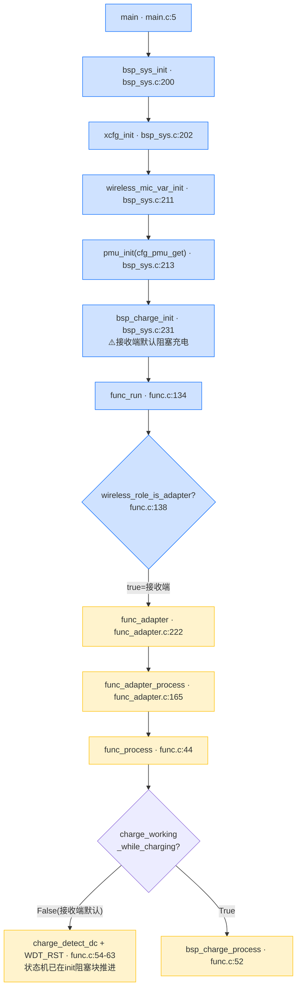
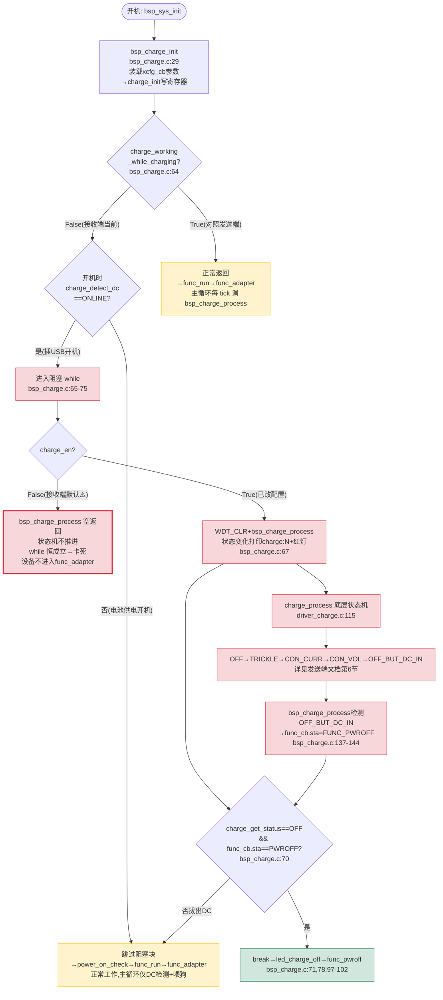
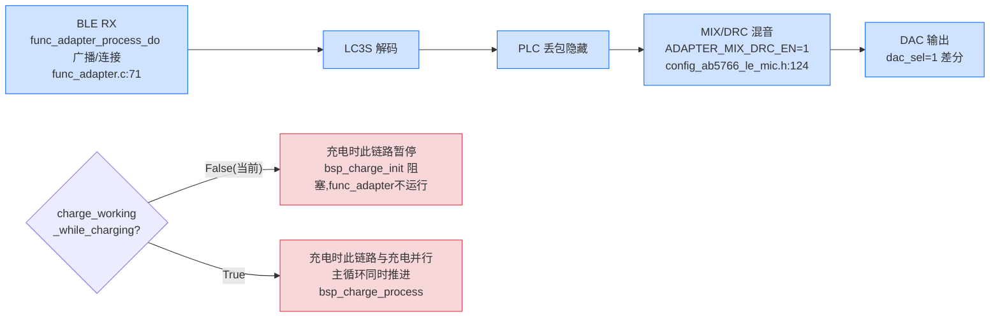

# AB5766 无线麦克风 **接收端（Adapter）** 充电功能实现与测试指南

> **版本**：V0.0.1（基于 `projects/microphone/config_ab5766_le_mic.h` 当前源码，`BSP_CHARGE_EN = 1`）
> **目标读者**：刚接触 AB5766 LE Mic SDK、需要在**接收端/适配器**验证充电功能的新手固件/硬件工程师。
> **范围**：从开机 → 角色判定为接收端 → 公共充电初始化（含阻塞充电主线）→ 接收端运行循环中的充电周期处理 → 充电状态机 → LED/低功耗/唤醒/关机 → 接线 → 构建/烧录 → 分阶段测试 → 日志排查。
> **写作原则**：本文档**所有调用关系均通过实际代码引用验证**，不依据文件名或命名猜测功能；凡引用必附"文件 + 函数 + 行号"。`.setting` 取值以**当前工作区文件实际内容**为准。涉及硬件电流/电压/温升的结论一律标注为"需实测"，`map.txt` 仅证明静态链接布局。
>
> **与发送端文档的关系**：充电底层（`bsp_charge.c`/`driver_charge.c`）发送端与接收端**完全共用**，状态机、寄存器配置、LED、低功耗逻辑均相同。本文档只详述**接收端特有部分**：阻塞充电路径、角色判定、接收端默认配置差异、接收端音频数据流与充电的关系；与发送端相同的底层细节请对照 [AB5766_无线麦克风发送端_充电功能实现与测试指南.md](AB5766_无线麦克风发送端_充电功能实现与测试指南.md) 第 5/6/8 节。

---

## 0. 阅读须知与关键缩略词

- 文中"X → Y"表示调用关系，箭头右侧若写 `(文件:行号)`，请直接 `Ctrl+G` 跳转核对。
- **角色判定铁律**：发射端/接收端由运行时 `wireless_role_is_adapter()` 决定，**不能依据文件名 `func_adapter.c` 猜测**。同一份镜像烧到不同板子时，由 `xcfg_cb` 里的角色位自动切换。
- 关键缩略词：

| 缩略词 | 含义 |
| --- | --- |
| VUSB | USB 5V 供电输入（充电输入） |
| VBAT | 电池电压 |
| RTCCON | RTC/PMU 相关配置寄存器，充电状态位、VUSB/INBOX 检测位都在其中 |
| VDDIO | 数字 I/O 供电域，充电时会切换 VUSB→VDDIO LDO |
| DC | 直流电源，此处指 VUSB 5V 输入 |
| INBOX | "在充电仓内"检测位（RTCCON bit22） |
| 涓流/恒流/恒压 | Trickle / Constant Current / Constant Voltage 三段充电阶段 |
| 截止电流/截止电压 | 充满判定的两个判据（I 判据 / V 判据） |
| BSP_CHARGE_EN | 编译期充电总开关（当前 = 1） |
| xcfg_cb.charge_en | 运行时充电开关（由配置文件 `.setting` 写入） |
| 阻塞充电 | `charge_working_while_charging=0` 时，`bsp_charge_init` 在 while 循环里专职充电，期间无线/音频不工作 |

---

## 1. 定位与快速结论

1. **充电功能在 AB5766 上是公共代码，接收端与发送端共用同一套 BSP/Driver 实现**。接收端没有独立的"接收端充电算法"；充电逻辑全部位于 `bsp/bsp_charge.c` 与 `driver/driver_charge.c`，由公共初始化 `bsp_sys_init()` 和公共周期处理 `func_process()` 调度。
2. **当前源码 `BSP_CHARGE_EN = 1`**（见 [config_ab5766_le_mic.h:27](../../projects/microphone/config_ab5766_le_mic.h#L27)），充电相关代码被编译进镜像。部分历史文档写的 `BSP_CHARGE_EN = 0` 已与当前源码冲突，**一律以当前源码为准**。
3. **接收端当前 `.setting` 实际配置：`charge_en = False`、`charge_working_while_charging = False`**（[wireless_adapter.setting:65,68](../../projects/microphone/Output/bin/Settings/wireless_adapter.setting#L65)）。**接收端默认充电未使能**，且走**阻塞充电**路径。这两点是接收端与发送端最大的差异，详见第 4 节。
4. **⚠️ 接收端默认配置下的关键行为警告**：`charge_en=False` + `charge_working_while_charging=False` + 插着 USB 开机时，`bsp_charge_init()` 会进入 `while (charge_detect_dc()==ONLINE)` 阻塞循环（[bsp_charge.c:64-75](../../bsp/bsp_charge.c#L64)），而 `bsp_charge_process()` 因 `charge_en=False` 第一行即 `return`（[bsp_charge.c:116-118](../../bsp/bsp_charge.c#L116)），状态机不推进，`while` 条件恒成立 → **设备卡在充电阻塞循环，不进入 `func_adapter`，无线/音频不工作**。要正常使用接收端充电，**必须先把 `charge_en` 改为 True**（见第 11/12 节）。
5. **⚠️ 阻塞充电的退出条件（更根本的真相）**：`charge_working_while_charging=False`（接收端默认）时，`bsp_charge_init` 的阻塞 `while` 退出**只有两条路径**——(a) 拔出 DC 使 `charge_detect_dc()!=ONLINE`；(b) 充满且 `func_cb.sta==FUNC_PWROFF` 触发 `break`（[bsp_charge.c:65-75](../../bsp/bsp_charge.c#L65)）。这意味着：**只要插着 USB 且未充满，设备就不进入 `func_adapter`**，这是阻塞充电的设计行为，与 `charge_en` 无关。`charge_en=False` 只是额外让 `bsp_charge_process` 空转无日志；`charge_en=True` 但无电池/未充满时仍卡在 while（只是可能有 `charge:` 日志）。若需要"插着 USB 也能正常工作（边充边工作）"，应改 `charge_working_while_charging=True`（并保持 `charge_en=True` 才会真正充电）。
6. **`map.txt` 只能证明充电代码被链接、落在哪些段，不能证明充电电流/电压/温升/电池安全**。任何充电安全结论必须用万用表/电流表/温度实测。

> **关于工作区配置差异的说明**：当前 `wireless_adapter.setting` 中 `dac_sel`（0→1）、新增 `ch_box_type=0` 相对仓库 HEAD 有测试性改动（`git diff` 可见），但 `charge_en`、`charge_working_while_charging`、`charge_constant_curr`、`charge_dc_in_rst` 等充电字段**均为 HEAD 原始默认值**（未改动）。本文档描述当前工作区实际值。

---

## 2. 双角色同镜像：充电代码如何被接收端走到

AB5766 采用**双角色同镜像**方案。接收端的判定与发送端相反：`wireless_adapter_en=True` → `cfg_wireless_role=true` → `func_adapter`。



### 2.1 角色判定证据链（不靠文件名，靠调用关系）

- `wireless_role_is_adapter()` 实际等价于 `cfg_wireless_role`，见 [api_wireless_mic.h:52](../../libs/ble/api_wireless_mic.h#L52)。
- `cfg_wireless_role` 的实际值由 `wireless_mic_role_init()` 设置，见 [wireless_proc.c:5-18](../../modules/wireless/wireless_proc.c#L5-L18)：
  - `xcfg_cb.wireless_adapter_en` 为真 → `cfg_wireless_role = true` → **接收端**；
  - `xcfg_cb.wireless_mic_emit_en` 为真 → `cfg_wireless_role = false` → **发射端**；
  - 两者都关 → 默认 `false` → **发射端**。
- `wireless_mic_role_init()` 由 `wireless_mic_var_init()` 调用，而 `wireless_mic_var_init()` 在 [bsp_sys.c:211](../../bsp/bsp_sys.c#L211) 被调用。
- 接收端 `.setting` 中 `wireless_adapter_en = True`、`wireless_mic_emit_en = False`（[wireless_adapter.setting:20-21](../../projects/microphone/Output/bin/Settings/wireless_adapter.setting#L20)），因此判定链：`main` → `bsp_sys_init` → `xcfg_init`（加载 `wireless_adapter_en=True`）→ `wireless_mic_var_init` → `wireless_mic_role_init`（置 `cfg_wireless_role = true`）→ `func_run` → `wireless_role_is_adapter()` 为 true → `func_adapter`。

> **结论**：接收端的充电路径不是 `func_adapter.c` 里专属实现的，而是通过 **公共初始化 `bsp_sys_init` → `bsp_charge_init`** 和 **公共周期 `func_process` → bsp_charge_process / DC检测** 进入，与接收端的广播/连接/音频解码并存。

---

## 3. 公共充电初始化链（开机一次性，接收端走同一份代码）

### 3.1 入口顺序（`bsp_sys_init`）

[bsp_sys.c:200-267](../../bsp/bsp_sys.c#L200) 关键顺序：

| 步骤 | 代码位置 | 作用 | 接收端关注点 |
| --- | --- | --- | --- |
| 1 | `bsp_sys.c:202` `xcfg_init(&xcfg_cb, ...)` | 从 Flash 加载配置到 `xcfg_cb` | 加载 `charge_en=False`、`charge_working_while_charging=False` 等 |
| 2 | `bsp_sys.c:209` `bsp_var_init()` | 初始化 `pwroff_time/delay`、充电仓类型 | `charge_box_type`（`bsp_sys.c:129-131`） |
| 3 | `bsp_sys.c:211` `wireless_mic_var_init()` | 设定角色 | 置 `cfg_wireless_role=true`（接收端） |
| 4 | `bsp_sys.c:213` `pmu_init(cfg_pmu_get())` | PMU 充电门禁 | `BSP_CHARGE_EN=1` → 不置 DIS |
| 5 | `bsp_sys.c:223-228` `led_init()` | LED 初始化 | 充电红灯 IO（当前 `rled_disp_en=False`） |
| 6 | `bsp_sys.c:230-232` `bsp_charge_init()` | **充电初始化** | **接收端在此阻塞充电**（见第 5 节） |
| 7 | `bsp_sys.c:234-236` `bsp_vbat_detect_init()` | VBAT ADC | 当前 `BSP_VBAT_DETECT_EN=0` 不编译 |
| 8 | `bsp_sys.c:238` `power_on_check()` | 开机判断 | 接收端 `poweron_vusb_out_en=True`（见第 9 节） |

> **时序关键**：`bsp_charge_init`（第 231 行）在 `power_on_check`（第 238 行）**之前**。若接收端插着 USB 开机且进入阻塞充电，设备在 `bsp_charge_init` 阻塞期间**尚未走到 `power_on_check` 和 `func_run`**，即无线/音频完全不启动。这是接收端"插 USB 就挂起充电"设计的根源。

### 3.2 PMU 充电门禁（`cfg_pmu_get`）

[bsp_sys.c:99-113](../../bsp/bsp_sys.c#L99)：

```c
#if !BSP_CHARGE_EN
    pmu_cfg |= PMU_CFG_CHARGE_DIS;     // bsp_sys.c:109
#endif
```

- 当前 `BSP_CHARGE_EN = 1`，**不置 `PMU_CFG_CHARGE_DIS`**，PMU 充电通路打开，`bsp_charge_init()` 才有意义。此逻辑接收端与发送端完全相同。

> **知识点**：`BSP_CHARGE_EN` 同时控制（a）PMU 硬件通路、（b）`bsp_charge.c`/`driver_charge.c` 是否编译、（c）`func_process`/`func_lowpwr` 中的 `#if BSP_CHARGE_EN` 分支。三者必须同时为 1，充电才完整可用。

---

## 4. 公共充电周期链（接收端运行循环中）

接收端进入 `func_adapter()` 后，主循环调用 `func_adapter_process()` → `func_process()`（[func_adapter.c:189-191](../../functions/func_adapter.c#L189)）。充电周期处理在 `func_process()`。

[func.c:44-68](../../functions/func.c#L44) 核心片段：

```c
#if BSP_CHARGE_EN
    if (xcfg_cb.charge_working_while_charging) {
        bsp_charge_process();                         // func.c:52 边充边工作
    } else {
        bool charge_in = (charge_detect_dc() == CHARGE_DC_STATUS_ONLINE) ? true : false;
        #if BSP_CHARGE_BOX_EN
        if(sys_cb.charge_box_type != CHARGE_BOX_DISABLE) {
            charge_in = CHARGE_INBOX()? true : false; // func.c:58 充电仓用INBOX
        }
        #endif
        if (charge_in) {
            WDT_RST();                                // func.c:62 仅喂狗+防复位
        }
    }
#endif
```

### 4.1 两种充电工作策略

| `charge_working_while_charging` | 主循环行为 | 充电状态机推进方式 | 当前默认角色 |
| --- | --- | --- | --- |
| **= 1（边充边工作）** | 每 tick 调 `bsp_charge_process()`（[func.c:52](../../functions/func.c#L52)） | 状态机在主循环持续推进，同时跑无线/音频 | 发送端默认 |
| **= 0（不边充边工作）** | 主循环只做 `charge_detect_dc()` + `WDT_RST()`（[func.c:54-63](../../functions/func.c#L54)） | 状态机推进**移到 `bsp_charge_init()` 阻塞 while**（见第 5.2 节） | **接收端默认**（adapter.setting = False） |

### 4.2 接收端当前路径：阻塞充电（主线）

接收端当前 `charge_working_while_charging = False`（[wireless_adapter.setting:68](../../projects/microphone/Output/bin/Settings/wireless_adapter.setting#L68)），走 `func.c:54-63` 的 else 分支：

- **主循环不调 `bsp_charge_process`**，只做 `charge_detect_dc()` 检测 + `WDT_RST()` 喂狗防复位。
- 充电状态机推进**不在主循环**，而在开机时 `bsp_charge_init()` 的阻塞 while 循环里完成（见第 5.2 节）。
- 这意味着接收端的设计意图是：**充电期间设备挂起**，无线广播/连接/音频解码都不工作；充满或拔出 DC 后才进入 `func_adapter` 正常运行。

> **若 `charge_working_while_charging = True`（边充边工作，非接收端当前值）**：`bsp_charge_init` 不阻塞，设备正常进入 `func_adapter`，充电状态机由主循环每 tick 调 `bsp_charge_process()` 推进，与广播/连接/音频解码并行。了解此分支可对照发送端行为。

---

## 5. BSP 充电策略层（`bsp_charge.c`）—— 接收端阻塞充电主线

[bsp_charge.c](../../bsp/bsp_charge.c) 整段受 `#if BSP_CHARGE_EN` 包裹。底层状态机/寄存器配置与发送端完全相同（见发送端文档第 6 节），本节聚焦**接收端阻塞路径**。

### 5.1 编译期常量

[bsp_charge.c:9-10](../../bsp/bsp_charge.c#L9)：
```c
#define RECHARGE_EN              0   // 复充使能：关闭
#define CHARGE_FULL_PWROFF_EN    1   // 充满电是否进关机：开启
```

- `CHARGE_FULL_PWROFF_EN = 1`：接收端阻塞充电充满后进入关机流程（[bsp_charge.c:80-104](../../bsp/bsp_charge.c#L80)）。结合接收端 `poweron_vusb_out_en=True`，关机后插拔 USB 可重新唤醒开机。

### 5.2 `bsp_charge_init()` 阻塞充电块（接收端主线）

[bsp_charge.c:29-106](../../bsp/bsp_charge.c#L29)，关键步骤：

1. **装载配置**（[bsp_charge.c:46-60](../../bsp/bsp_charge.c#L46)），全部来自 `xcfg_cb`：
   - `const_curr = xcfg_cb.charge_constant_curr`（恒流电流，接收端当前 = 40mA 档，比发送端 100mA 小）
   - `cutoff_curr = xcfg_cb.charge_stop_curr * 0x800`（截止电流，步长 `0x800`）
   - `cutoff_volt = CHARGE_CUTOFF_VOL_4V35`（**固定 4.35V，不读 xcfg**）
   - `dcin_reset = charge_dc_in_rst ? EN : DIS`（接收端当前 = True → **EN，插 DC 复位**）
   - `mode = CHARGE_MODE_FULL_DISCONNECT`（固定充满断开）
   - `vol_follow = DISABLE`（固定关闭电压跟随）
2. **`charge_init(&charge_init_struct)`**（[bsp_charge.c:62](../../bsp/bsp_charge.c#L62)）→ 写底层寄存器。
3. **⚠️ 阻塞充电判断**（[bsp_charge.c:64-105](../../bsp/bsp_charge.c#L64)，接收端 `charge_working_while_charging=False` 时执行）：
   ```c
   if (!xcfg_cb.charge_working_while_charging) {
       while (charge_detect_dc() == CHARGE_DC_STATUS_ONLINE) {
           WDT_CLR();
           bsp_charge_process();                 // bsp_charge.c:67 阻塞推进充电
           #if CHARGE_FULL_PWROFF_EN
           if((charge_get_status() == CHARGE_STA_OFF) && func_cb.sta == FUNC_PWROFF) {
               printf("charge exit\n"); break;     // bsp_charge.c:71 充满退出
           }
           #endif
       }
       charge_status_last = CHARGE_STA_OFF;
       led_charge_off();                          // bsp_charge.c:78
       #if CHARGE_FULL_PWROFF_EN
       ... func_pwroff(); ...                     // bsp_charge.c:97/102 充满/入仓关机
       #endif
   }
   ```

#### 5.2.1 阻塞循环退出条件

阻塞 `while` 在以下情况退出：
- **拔出 DC**：`charge_detect_dc() != ONLINE` → while 条件不成立 → 退出，继续往下走 `func_run`（此时电池供电，进入 `func_adapter` 正常工作）。
- **充满且 `func_cb.sta==FUNC_PWROFF`**：`charge_get_status()==CHARGE_STA_OFF` + `func_cb.sta==FUNC_PWROFF` → `break` → `led_charge_off()` → `func_pwroff()` 关机。
- **充满由 `bsp_charge_process` 触发**：`bsp_charge_process` 检测到 `CHARGE_STA_OFF_BUT_DC_IN` 后置 `func_cb.sta=FUNC_PWROFF`（[bsp_charge.c:137-144](../../bsp/bsp_charge.c#L137)），下一轮 while 迭代即满足 break 条件。

#### 5.2.2 ⚠️ `charge_en=False` 时的死循环风险（接收端默认配置）

接收端当前 `charge_en = False`。在阻塞循环中：
- `bsp_charge_process()` 第一行 `if (!xcfg_cb.charge_en) return;`（[bsp_charge.c:116-118](../../bsp/bsp_charge.c#L116)）立即返回，**底层状态机 `charge_process` 不被调用**，`charge_status` 永远停留在初始 `CHARGE_STA_OFF`。
- 但 `charge_detect_dc()` 仍判 ONLINE（硬件 VUSB 位），while 条件恒成立。
- `charge_get_status()==CHARGE_STA_OFF` 恒真，但 `func_cb.sta` 此时未被置为 `FUNC_PWROFF`（状态机不推进就不会触发 [bsp_charge.c:141](../../bsp/bsp_charge.c#L141)），break 条件不满足。
- **结果：插着 USB 开机时，接收端卡在 `bsp_charge_init` 的 while 循环无限空转，`bsp_charge_process` 空返回，设备不进入 `func_adapter`，无线/音频不工作，仅持续喂狗。**

> **这是接收端文档最重要的警告**：默认 `charge_en=False` 下，插 USB 开机会使接收端"假死"在充电阻塞循环。**要接收端正常充电，必须先在配置工具里把 `charge_en` 改为 True**（见第 12 节）。若希望插 USB 时不充电也能正常工作，可改 `charge_working_while_charging=True`（边充边工作，但 `charge_en` 仍需 True 才推进状态机；若 `charge_en=False` 则充电彻底不动作，设备正常工作不充电）。

> **澄清**：`charge_en=False` + `charge_working_while_charging=True` 时，`bsp_charge_init` 不阻塞，设备正常进入 `func_adapter`；主循环调 `bsp_charge_process` 但因 `charge_en=False` 直接 return，**不充电也不卡死**。即"边充边工作 + 充电禁用 = 设备正常工作不充电"。而"阻塞 + 充电禁用 + DC 在线 = 卡死"。两者要分清。

### 5.3 `bsp_charge_process()` 周期推进

[bsp_charge.c:109-169](../../bsp/bsp_charge.c#L109)，带 `AT(.text.app.proc.charge)`。接收端阻塞路径中，此函数在 while 循环里被调用；状态变化打印 `charge: %d`、驱动红灯、检测充满关机。完整逻辑见发送端文档第 5.3 节，此处仅列接收端关注点：

- **运行时总开关**（[bsp_charge.c:116-118](../../bsp/bsp_charge.c#L116)）：`if (!xcfg_cb.charge_en) return;` —— 接收端当前 `charge_en=False`，此关立即返回（导致 5.2.2 的卡死）。改 True 后放行。
- **状态变化日志**（[bsp_charge.c:123](../../bsp/bsp_charge.c#L123)）：`printf("charge: %d\n", charge_status)`，`3/4/5/2` 对应涓流/恒流/恒压/充满。
- **充满关机**（[bsp_charge.c:137-144](../../bsp/bsp_charge.c#L137)）：`CHARGE_STA_OFF_BUT_DC_IN` → `func_cb.sta=FUNC_PWROFF` → 触发阻塞循环 break。

---

## 6. Driver 充电状态机（与发送端完全共用）

底层寄存器级状态机 `driver_charge.c`/`driver_charge.h`，接收端与发送端**代码完全相同**，不再重复。请对照发送端文档第 6 节：

- **状态枚举**（[driver_charge.h:35-42](../../driver/driver_charge.h#L35)）：`OFF=1`/`OFF_BUT_DC_IN=2`/`ON_TRICKLE=3`/`ON_CON_CURR=4`/`ON_CON_VOL=5`
- **档位枚举**：截止电压固定 4V35、截止电流步长 0x800、充电电流步长 5mA
- **`charge_init`/`charge_process`/`charge_DC_online_handle`/`charge_status_update`/`charge_detect_off_condition`/`charge_detect_dc`** 全部共用
- **`charge_stop_time` 未接线**：`charge_cutoff_vol_to_stop_time_set()`（[driver_charge.c:424-427](../../driver/driver_charge.c#L424)）在当前源码无调用方，接收端 `charge_stop_time=3`（[wireless_adapter.setting:72](../../projects/microphone/Output/bin/Settings/wireless_adapter.setting#L72)）**同样不生效**。

> **接收端档位差异**：接收端 `charge_constant_curr=40mA`（[wireless_adapter.setting:70](../../projects/microphone/Output/bin/Settings/wireless_adapter.setting#L70)），比发送端 100mA 小。40mA 对小电池更温和，但充电时间更长。

---

## 7. 配置来源与加载（`xcfg_cb` vs `.setting`）

充电行为受**两层配置**控制：

| 层级 | 字段位置 | 改法 | 作用 |
| --- | --- | --- | --- |
| **编译期** | `config_ab5766_le_mic.h` 的 `BSP_CHARGE_EN` 等 | 改 .h 重新编译 | 决定代码是否编译、PMU 通路、寄存器固定值 |
| **运行时** | `xcfg_cb.*`（来自 `.setting` → `xcfg_init`） | 改 `.setting` 用 xmaker 重新打包 `res/xcfg` | 决定充电使能、电流、涓流、DC复位、边充边工作等 |

### 7.1 `xcfg_cb` 充电字段（`xcfg.h`）

[xcfg.h:26-35](../../projects/microphone/xcfg.h#L26)：

| 字段 | 行号 | 含义 | 接收端当前值 | 与发送端对比 |
| --- | --- | --- | --- | --- |
| `charge_en` | 26 | 运行时充电使能 | **False**（adapter.setting:65） | 发送端 True（相反） |
| `charge_trick_en` | 27 | 涓流充电使能 | True（:66） | 相同 |
| `charge_dc_in_rst` | 28 | 插入DC复位 | **True**（:73）→ 插 DC 复位 | 发送端 False（相反） |
| `poweron_vusb_out_en` | 29 | 退出充电自动开机 | **True**（:24）→ VUSB 唤醒直接开机 | 发送端 False（相反） |
| `charge_working_while_charging` | 30 | 边充边工作使能 | **False**（:68）→ 阻塞充电 | 发送端 True（相反） |
| `charge_stop_curr` | 31 | 截止电流档位 | 30mA（:69） | 相同 |
| `charge_constant_curr` | 32 | 恒流电流档位 | **40mA**（:70） | 发送端 100mA（不同） |
| `charge_trickle_curr` | 33 | 涓流电流档位 | 20mA（:71） | 相同 |
| `charge_stop_time` | 34 | 截止计时（**未接线**） | 3（未生效） | 相同（均未生效） |
| `ch_box_type` | 35 | 充电仓类型 | 0=关闭（:82） | 相同 |

> **字段名映射注意**：`.setting` 里同时存在 `charge_dc_not_pwron`（[wireless_adapter.setting:67](../../projects/microphone/Output/bin/Settings/wireless_adapter.setting#L67)）和 `charge_dc_in_rst`（[wireless_adapter.setting:73](../../projects/microphone/Output/bin/Settings/wireless_adapter.setting#L73)）两个键，而 `xcfg.h` 实际字段只有 `charge_dc_in_rst`（[xcfg.h:28](../../projects/microphone/xcfg.h#L28)）。两者语义相关（插 DC 是否复位/不复位开机），具体映射以配置工具生成 `xcfg` 二进制为准；本文档以 `xcfg_cb.charge_dc_in_rst` 为准描述运行时行为。

### 7.2 接收端 `.setting` 当前关键值

[wireless_adapter.setting:65-73](../../projects/microphone/Output/bin/Settings/wireless_adapter.setting#L65)：

```xml
<add key="charge_en" value="False" />                       <!-- ⚠️默认未使能，需改True -->
<add key="charge_working_while_charging" value="False" />   <!-- 阻塞充电 -->
<add key="charge_stop_curr" value="30mA" />
<add key="charge_constant_curr" value="40mA" />              <!-- 恒流40mA -->
<add key="charge_trickle_curr" value="20mA" />
<add key="charge_dc_in_rst" value="True" />                  <!-- 插DC复位 -->
```

> **新手第一坑（接收端版本）**：接收端默认 `charge_en=False`，插 USB 开机会卡在 `bsp_charge_init` 阻塞循环（见 5.2.2），表现为"插 USB 后串口有启动日志但无 `func_adapter` 相关日志、无线不广播、设备假死"。**这不是代码故障，是配置导致**。解决：把 `charge_en` 改 True 重新打包；或临时改 `charge_working_while_charging=True` 让设备先正常工作（但不充电）。

---

## 8. LED 充电指示（红灯）

充电红灯逻辑与发送端完全共用（见发送端文档第 8 节）。接收端关注点：

- [bsp_led.c:111-126](../../bsp/bsp_led.c#L111) `led_charge_on/off`：状态变化且 `>=CHARGE_STA_ON_CON_CURR` 亮红灯。
- [bsp_led.c:229-231](../../bsp/bsp_led.c#L229) `led_scan`：`charge_flag` 为真时蓝灯扫描让位红灯。
- **接收端 LED 默认状态**：`bled_disp_en=False`、`rled_disp_en=False`（[wireless_adapter.setting:74-75](../../projects/microphone/Output/bin/Settings/wireless_adapter.setting#L74)），**默认两个灯都不显示**。要看充电红灯需先开 `rled_disp_en=True` 并设 `rled_io_sel`。
- 接收端连接/配对蓝灯由 `wireless_mic_proc()`（[wireless_proc.c:319-340](../../modules/wireless/wireless_proc.c#L319)）根据 `connected_sta` 切换 `led_bt_idle()`/`led_bt_connected()`（[wireless_proc.c:333-337](../../modules/wireless/wireless_proc.c#L333)）；该函数在接收端由 `func_adapter_process` 的 [func_adapter.c:189](../../functions/func_adapter.c#L189) 调用，初始化时 `func_adapter_init` 直接调 `led_bt_idle()`（[func_adapter.c:67](../../functions/func_adapter.c#L67)）。充电红灯由 `bsp_charge_process` 处理，两者通过 `charge_flag` 互斥。

---

## 9. 低功耗 / 唤醒 / 关机与充电的交互（接收端特有配置）

底层逻辑与发送端共用，本节聚焦接收端特有配置值的影响。

### 9.1 充电中防关机/防睡眠

[bsp_charge.c:132-135](../../bsp/bsp_charge.c#L132)：充电中复位关机/睡眠延时，避免充电中误关机。

### 9.2 睡眠/关机唤醒源选择（`charge_detect_dc`）

[func_lowpwr.c:151-177](../../functions/func_lowpwr.c#L151)（睡眠）、[func_lowpwr.c:352-394](../../functions/func_lowpwr.c#L352)（关机）：
```c
#if BSP_CHARGE_EN
if (charge_detect_dc() == CHARGE_DC_STATUS_ONLINE) config.source |= WK_LP_INBOX;
else config.source |= WK_LP_VUSB;                          // func_lowpwr.c:362-366
#endif
#if BSP_ADKEY_EN
config.source |= WK_LP_WK0;                                // func_lowpwr.c:371 按键唤醒
#endif
```
- 关机后：DC 在线 → 等 INBOX 变化唤醒；DC 不在线 → 等 VUSB 插入唤醒。
- `func_pwroff`（[func_lowpwr.c:407-433](../../functions/func_lowpwr.c#L407)）：按 `SYS_PWROFF_MODE = PWROFF_MODE2`（[config_ab5766_le_mic.h:23](../../projects/microphone/config_ab5766_le_mic.h#L23)）执行 `lowpwr_pwroff_mode2_do()`（VDDIO 不掉电）。

### 9.3 接收端开机判断（`power_on_check`，关键差异）

[bsp_sys.c:152-196](../../bsp/bsp_sys.c#L152)：
- `WK_LP_INBOX_PENDING`（出仓唤醒）或 `WK_LP_VUSB_PENDING`（VUSB 唤醒）+ `poweron_vusb_out_en` 为真 → **直接 `return` 开机**（[bsp_sys.c:157-164](../../bsp/bsp_sys.c#L157)）。
- **接收端 `poweron_vusb_out_en = True`**（[wireless_adapter.setting:24](../../projects/microphone/Output/bin/Settings/wireless_adapter.setting#L24)）：关机后插入 USB → VUSB 唤醒 → **直接开机**，无需按键。这与发送端（False，需按键）相反。
- 结合 `charge_dc_in_rst=True`：插 DC 会触发复位重启。所以接收端"插 USB"既可能复位重启（`charge_dc_in_rst`），也可能从关机唤醒直接开机（`poweron_vusb_out_en`），两者都导致"插 USB 即开机"。

### 9.4 接收端低电关机配置

[wireless_adapter.setting:26](../../projects/microphone/Output/bin/Settings/wireless_adapter.setting#L26)：`lpwr_off_vbat_level = 不关机`。但当前 `BSP_VBAT_DETECT_EN=0`，VBAT ADC 检测代码不编译（[bsp_saradc_vbat.c](../../bsp/bsp_saradc_vbat.c) 整段排除），因此**低电关机阈值当前实际不生效**。接收端设为"不关机"也是合理的——既然 VBAT 检测未启用，低电关机本就无法触发。若需低电关机，需打开 `BSP_VBAT_DETECT_EN` 并接入 VBAT ADC 路径（属改配置/硬件，当前任务不执行）。

---

## 10. 充电状态机 Mermaid 流程图（接收端阻塞充电视角）



---

## 11. 接线与硬件准备

### 11.1 接收端充电必需条件

1. **VUSB 5V 输入已引出**（已确认板子 VUSB 已引出且有 USB 口供电）。
2. **电池已接到 VBAT**（**当前测试板未接电池**——无电池时 PMU 充电状态机不进入正常涓流/恒流阶段，看不到 `charge: 3/4/5` 日志）。
3. **GND 共地**。
4. （可选）**充电红灯 IO**：接收端当前 `rled_disp_en=False`，要看红灯需开 `rled_disp_en=True` 并设 `rled_io_sel`。
5. **⚠️ 配置前置**：接收端默认 `charge_en=False`，**接电池前必须先在配置工具把 `charge_en` 改 True 并重新打包**，否则插 USB 会卡死（见 5.2.2）。

### 11.2 推荐接线

```
USB 5V 电源 ──┬── VUSB（板载 USB 口，接收端常用 USB 供电/充电）
             └── GND
锂电池(3.7V) ─┬── VBAT（需用户接入）
              └── GND
充电指示 LED── rled_io_sel 指定 IO（可选，默认 rled_disp_en=False 不显示）
调试串口    ── PB3（BSP_UART_DEBUG_EN，1500000 baud，看日志）
音频输出    ── DAC（dac_sel=1 差分输出，当前配置）
```

> **安全提示**：接收端当前恒流档为 40mA，比发送端温和。接电池前仍需确认电池规格允许该充电电流，电池电压在涓流阈值以下（如 3.0V）以观察涓流→恒流切换；避免短路。锂电池充电有起火风险，初次测试建议在绝缘环境、有人看护下进行。

### 11.3 不接电池 + 默认配置会看到什么（重要）

- 插入 USB：因 `charge_dc_in_rst=True`，**插 USB 触发复位**（与发送端不复位相反）。
- 复位后 `bsp_charge_init` 检测 DC 在线 → 进入阻塞 while。
- 因 `charge_en=False`，`bsp_charge_process` 空返回，**卡死在 while 循环**：串口可能有 `Hello AB5766`、`bsp_sys_init` 前段日志，但**无 `func_adapter`、无 `charge:` 状态日志、无无线广播**，设备假死。
- 这是 `charge_en=False` + 阻塞充电的配置后果，**不是代码故障**。改 `charge_en=True` 后再测。

---

## 12. 新手构建与烧录（用户在已配置的厂商 RV32/Code::Blocks 环境执行）

### 12.1 修改运行时配置（接收端充电必做）

在配置工具（或直接编辑 `projects/microphone/Output/bin/Settings/wireless_adapter.setting`）中：
- **`charge_en` → `True`**（**最关键**，当前默认 False，不改会卡死）
- `charge_working_while_charging` → 保持 `False`（阻塞充电，接收端设计）或按需改 `True`
- `charge_constant_curr` → 按电池规格（当前 40mA，温和；可按需调整）
- `charge_stop_curr` → 30mA
- `charge_trickle_curr` → 20mA，`charge_trick_en` → True
- `charge_dc_in_rst` → True（当前值，插 DC 复位；若不希望插 DC 复位则改 False）
- （可选）`rled_disp_en` → True，`rled_io_sel` → 实际 IO（看红灯）

> 改完 `.setting` 后，需用 `riscv32-elf-xmaker`（prebuild.bat 调用）重新生成 `res/xcfg` 产物，再编译，配置才会进镜像。**直接改 `.setting` 不重新生成是不会生效的**。

### 12.2 编译

在 Code::Blocks 打开 [projects/microphone/app.cbp](../../projects/microphone/app.cbp)，构建 `Debug` 目标。工程自动执行 `prebuild.bat`（生成 res/xcfg、复制 effect.c/h）和 `postbuild.bat`（生成 app.bin/.dcf、下载镜像、可选反汇编）。

### 12.3 烧录

用厂商下载工具烧录 `Output/bin/app.dcf`（或 `download.xm`）到板子。**注意：发送端和接收端共用同一镜像**，角色由 `.setting` 的 `wireless_adapter_en`/`wireless_mic_emit_en` 决定，烧同一份 `app.dcf` 到不同板子即可。

### 12.4 验证代码被链接（map 检查，不是硬件验证）

构建后查看 `Output/bin/map.txt`，确认以下符号存在且未被 `--gc-sections` 裁剪：
- `.text.app.proc.charge`（`bsp_charge_process`、`charge_process`）
- `.com_periph.charge`（`charge_get_status`、`charge_detect_dc`）
- `charge_cutoff_vol_to_stop_time_set`（已链接但无调用方，未生效）

> **map 只证明代码被链接、段布局正确，不证明充电安全。** 真正验证靠第 13 节硬件实测。

---

## 13. 分阶段测试方案

### 阶段 A：无电池 + 默认配置，验证"卡死"现象（理解配置后果）

1. 不接电池，仅接 USB 5V，烧录默认配置（`charge_en=False`）。
2. 打开串口（PB3, 1500000）。
3. 预期：插 USB 触发复位（`charge_dc_in_rst=True`）；串口有 `Hello AB5766`、`bsp_sys_init` 前段日志；**随后卡死**，无 `func_adapter`、无 `charge:`、无无线广播。
4. **此现象确认 5.2.2 的配置后果**，不判代码故障。记录后进入阶段 B。

### 阶段 B：改 `charge_en=True`，无电池，验证不再卡死

1. 把 `charge_en` 改 True 重新打包烧录。
2. 不接电池，仅接 USB。
3. 预期：插 USB 复位 → `bsp_charge_init` 阻塞 while → `bsp_charge_process` 放行（`charge_en=True`）→ 调 `charge_process`，但因无电池 `VBAT_OVER_TRICKLE` 等异常，**可能停在 `charge: 1`（OFF）或无状态变化**，不进 3/4/5。
4. **不再卡死但无正常充电日志**——硬件条件不满足，记录现象。

### 阶段 C：接电池 + `charge_en=True`，观察充电状态机（核心验证）

1. 接入低压电池（约 3.0V）。
2. 插 USB（触发复位）→ `bsp_charge_init` 阻塞充电。串口应依次出现：
   - `charge: 3`（涓流）→ 红灯亮（若 `rled_disp_en` 已开）
   - 电压上升后 `charge: 4`（恒流 40mA）→ 红灯亮
   - 接近满 `charge: 5`（恒压）
   - 充满 `charge: 2`（OFF_BUT_DC_IN）→ `-->charge full, enter pwroff` → `charge exit` → `func_pwroff` 关机
3. **阻塞期间无线不广播**（接收端挂起充电），充满关机后拔 USB 再用电池开机才进入 `func_adapter`。
4. **电流实测**：万用表串入 VUSB，涓流≈20mA，恒流≈40mA（按 `charge_constant_curr`），充满后电流降至截止值以下。

### 阶段 D：充满关机与唤醒（接收端特有）

1. 充满后设备自动关机（`func_pwroff`）。
2. 拔出 USB → 再插入：因 `poweron_vusb_out_en=True`，VUSB 唤醒**直接开机**（无需按键），又进入阻塞充电（此时电池已满，快速判 OFF_BUT_DC_IN → 关机）。
3. 用电池供电开机（不插 USB）：`bsp_charge_init` 检测 DC 不在线，跳过阻塞块，正常进入 `func_adapter` 广播/连接/音频解码。

### 阶段 E：边充边工作（可选，需改配置）

1. 把 `charge_working_while_charging` 改 True（保持 `charge_en=True`）重新打包。
2. 插 USB + 接电池：设备不再阻塞，正常进入 `func_adapter`，**充电与广播/连接/音频解码并行**。
3. 验证充电期间无线仍能广播/连接、音频解码正常、无丢帧。

### 阶段 F：异常与边界

1. **充电错误**：强制 VUSB 电压异常，观察 2s 周期日志 `[charge] CHARGE LINE VOLTAGE ERROR!!!`（[bsp_charge.c:166](../../bsp/bsp_charge.c#L166)）。
2. **快速插拔**：验证 DC 去抖（>5 次，[driver_charge.c:126](../../driver/driver_charge.c#L126)）。
3. **温升**：长时间恒流充电（40mA），测温升（**必须实测**）。

---

## 14. 日志与故障排查速查

| 现象 | 可能原因 | 排查点 |
| --- | --- | --- |
| 插 USB 后设备假死，无 `func_adapter`/无线日志 | **`charge_en=False` + 阻塞充电卡死**（5.2.2） | [wireless_adapter.setting:65](../../projects/microphone/Output/bin/Settings/wireless_adapter.setting#L65) 改 True |
| 完全无 `charge:` 日志 | `charge_en=False` | [wireless_adapter.setting:65](../../projects/microphone/Output/bin/Settings/wireless_adapter.setting#L65) |
| 有上电日志但无 `charge: 3/4/5` | 未接电池 / DC 未判 ONLINE | 接电池；查 `charge_detect_dc`（VUSB 位 bit20） |
| 插 USB 触发复位 | `charge_dc_in_rst=True` | [wireless_adapter.setting:73](../../projects/microphone/Output/bin/Settings/wireless_adapter.setting#L73) 正常行为（接收端默认） |
| 充电期间无线不广播 | `charge_working_while_charging=False`（阻塞充电，设计行为） | [wireless_adapter.setting:68](../../projects/microphone/Output/bin/Settings/wireless_adapter.setting#L68)；要边充边工作改 True |
| 充满不关机 | `CHARGE_FULL_PWROFF_EN` 被改 0 | [bsp_charge.c:10](../../bsp/bsp_charge.c#L10) 确认=1 |
| 红灯不亮 | `rled_disp_en=False` | [wireless_adapter.setting:75](../../projects/microphone/Output/bin/Settings/wireless_adapter.setting#L75) 改 True 并设 `rled_io_sel` |
| 蓝灯闪烁被红灯压住 | `charge_flag=true` 时 led_scan return | [bsp_led.c:229](../../bsp/bsp_led.c#L229) 正常设计 |
| `[charge] CHARGE LINE VOLTAGE ERROR!!!` | VUSB 电压异常 | 查电源，[bsp_charge.c:166](../../bsp/bsp_charge.c#L166) |
| 关机后插 USB 不开机 | `poweron_vusb_out_en=False` | 接收端当前 True（[wireless_adapter.setting:24](../../projects/microphone/Output/bin/Settings/wireless_adapter.setting#L24)），若不开机说明被改 False |
| 低电不关机 | `BSP_VBAT_DETECT_EN=0`，VBAT 检测未编译 | 当前低电关机阈值不生效，见第 9.4 节 |
| 历史文档说 `BSP_CHARGE_EN=0` | 文档过时 | 以当前源码 [config_ab5766_le_mic.h:27](../../projects/microphone/config_ab5766_le_mic.h#L27) =1 为准 |

---

## 15. 接收端音频数据流与充电的关系（补充）

接收端音频链路为 **BLE RX → LC3S 解码 → PLC → MIX/DRC → DAC 输出**，与充电的关系取决于 `charge_working_while_charging`：



> **接收端连接状态**：`func_adapter_process_do`（[func_adapter.c:71-121](../../functions/func_adapter.c#L71)）管理广播（`ble_adv_set_enable`）与一拖二连接（`WIRELESS_MIC_STA_MASK` 饱和判断，[func_adapter.c:108-110](../../functions/func_adapter.c#L108)）。阻塞充电期间这些都不运行；边充边工作模式下才与充电并行。音频解码/PLC/MIX/DRC 的具体实现属音频模块，不在本充电文档展开。

---

## 16. 文件 / 函数 / 行号速查表

| 模块 | 文件 | 函数 | 行号 | 作用 | 接收端关注 |
| --- | --- | --- | --- | --- | --- |
| 入口 | main.c | main | 5-22 | 复位、bsp_sys_init、func_run | — |
| 角色分派 | func.c | func_run | 134-178 | wireless_role_is_adapter→func_adapter | 接收端走 true 分支 |
| 公共周期 | func.c | func_process | 44-68 | 充电周期/DC检测/喂狗 | 接收端 else 分支（54-63） |
| 接收端状态机 | func_adapter.c | func_adapter | 222-239 | 接收端主循环 | — |
| 接收端状态机 | func_adapter.c | func_adapter_process | 165-202 | 调 func_adapter_process_do+wireless_mic_proc+func_process | 189-191 |
| 接收端状态机 | func_adapter.c | func_adapter_process_do | 71-121 | 广播/一拖二连接管理 | 108-110 饱和判断 |
| 系统初始化 | bsp_sys.c | bsp_sys_init | 200-267 | xcfg_init→pmu_init→bsp_charge_init | 231 阻塞充电入口 |
| 系统初始化 | bsp_sys.c | cfg_pmu_get | 99-113 | PMU 充电门禁 | — |
| 系统初始化 | bsp_sys.c | power_on_check | 152-196 | VUSB/按键开机判断 | 接收端 poweron_vusb_out_en=True 直接开机 |
| BSP 充电 | bsp_charge.c | bsp_charge_init | 29-106 | 装载配置+阻塞充电 | **64-105 接收端阻塞主线** |
| BSP 充电 | bsp_charge.c | bsp_charge_process | 109-169 | 周期推进+LED+充满关机 | 116-118 charge_en 门（False卡死） |
| BSP 充电 | bsp_charge.c | (常量) | 9-10 | RECHARGE_EN=0, FULL_PWROFF=1 | — |
| Driver 充电 | driver_charge.c | (全部) | — | 状态机/寄存器（与发送端共用） | 见发送端文档第 6 节 |
| Driver 充电 | driver_charge.c | charge_cutoff_vol_to_stop_time_set | 424-427 | 截止计时设置（**未被调用**） | 接收端同样未生效 |
| 配置 | xcfg.h | xcfg_cb_t 充电字段 | 26-35 | 运行时充电配置 | charge_en/working_while_charging |
| 配置 | config_ab5766_le_mic.h | BSP_CHARGE_EN | 27 | 编译期开关=1 | — |
| 配置 | wireless_adapter.setting | charge_* | 65-73 | 接收端运行时当前值 | 65 charge_en=False 关键 |
| 配置 | wireless_adapter.setting | poweron_vusb_out_en | 24 | VUSB 唤醒开机 | True |
| LED | bsp_led.c | led_charge_on/off | 111-126 | 充电红灯 | 与发送端共用 |
| 低功耗 | func_lowpwr.c | lowpwr_pwroff_wakeup_config | 352-394 | 关机唤醒源 | — |
| 低功耗 | func_lowpwr.c | func_pwroff | 407-433 | 关机流程 | PWROFF_MODE2 |
| VBAT 检测 | bsp_saradc_vbat.c | (全部) | — | 当前 BSP_VBAT_DETECT_EN=0 不编译 | 低电关机不生效 |

---

## 17. 代码证据与硬件实测边界（必读）

- **代码证据（已验证）**：充电调用链 `main → bsp_sys_init → bsp_charge_init`（初始化，接收端阻塞）、`func_adapter → func_adapter_process → func_process`（周期，接收端 else 分支仅 DC 检测），全部由实际源码行号确认。接收端与发送端共用此链，**不存在接收端专属充电算法**。
- **当前配置证据**：接收端 `.setting` 当前 `charge_en=False`、`charge_working_while_charging=False`（阻塞充电）、`charge_constant_curr=40mA`、`charge_dc_in_rst=True`、`poweron_vusb_out_en=True`、`lpwr_off_vbat_level=不关机`，均以 [wireless_adapter.setting:24-73](../../projects/microphone/Output/bin/Settings/wireless_adapter.setting#L24) 实际内容为准。充电字段均为 HEAD 原始默认值（未随工作区改动）。
- **⚠️ 卡死行为证据**：`charge_en=False` + `charge_working_while_charging=False` + DC 在线时，`bsp_charge_init` 阻塞 while（[bsp_charge.c:64-75](../../bsp/bsp_charge.c#L64)）中 `bsp_charge_process` 因 `charge_en=False` 空返回（[bsp_charge.c:116-118](../../bsp/bsp_charge.c#L116)），状态机不推进，while 恒成立 → 设备卡死不进入 `func_adapter`。此为配置后果，需改 `charge_en=True` 解决。
- **map 证据**：`map.txt` 可证明充电符号被链接且段标注正确，但**不能证明充电电流值、电压精度、温升、电池安全**。
- **必须硬件实测**：充电电流（万用表串入 VUSB）、电池电压（达到截止电压 4.35V）、涓流→恒流→恒压→充满各阶段切换、充满关机、阻塞充电期间无线不工作、边充边工作下无线稳定性、温升、长时间稳定性。
- **未接线的字段**：`charge_stop_time`（[xcfg.h:34](../../projects/microphone/xcfg.h#L34)）在接收端同样未生效（`charge_cutoff_vol_to_stop_time_set()` 无调用方）。
- **未生效的低电关机**：接收端 `lpwr_off_vbat_level=不关机`，且 `BSP_VBAT_DETECT_EN=0` 使 VBAT 检测不编译，低电关机当前不生效。
- **历史文档差异**：部分旧文档写 `BSP_CHARGE_EN = 0`，与当前 [config_ab5766_le_mic.h:27](../../projects/microphone/config_ab5766_le_mic.h#L27) =1 冲突，**一律以当前源码为准**。
- **工作区配置差异**：接收端 `dac_sel`（0→1）、新增 `ch_box_type=0` 相对 HEAD 有改动，但充电字段未改动（均为 HEAD 默认）。

> 本文档只描述与验证充电功能。接收端音频处理（BLE RX→LC3S→PLC→MIX/DRC→DAC）见相关音频文档；本充电文档仅在第 15 节简述与充电的关系。
