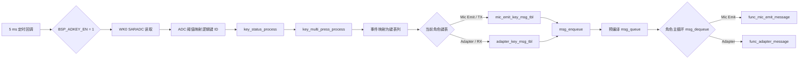
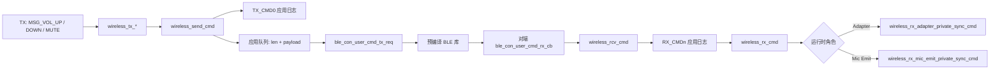

# AB5766 无线麦按键消息、`TX_CMD` 与 `RX_CMD`：调用链和格式解析

> **适用对象**：当前 `CONFIG_AB5766_LE_MIC` 工程的初学者。本文把“按一次键以后，为什么会出现 `MSG_VOL_*`、`TX_CMD0`、`tx_cntl`、`RX_CMD1`、`rx_cntl`”拆成可核查的源码路径。  
> **证据原则**：本文只把可读 C 源码、当前编译宏和链接产物能证明的内容写为事实；预编译 BLE 库内部的字段含义、空口是否成功、最终声音效果，均单独标出边界，绝不由日志名称推测。

---

## 1. 先给结论

用户日志中的两类应用负载可由源码严格解析：

| 应用日志 | 应用 payload 格式 | 直接业务来源 |
|---|---|---|
| `TX_CMD0: 02 01 <level> <boundary>` | `PRIVATE_SYNC_CMD`、软增益子命令、当前等级、边界标记 | TX 的 `MSG_VOL_UP` / `MSG_VOL_DOWN` |
| `TX_CMD0: 02 03 <mute>` | `PRIVATE_SYNC_CMD`、麦克风静音子命令、静音状态 | TX 的 `MSG_VOL_MUTE` |
| `RX_CMD1: 02 01 <level> <boundary>` | 与上行 `02 01 ...` 相同的应用 payload | 对端 BLE 库回调进入 RX 应用代码 |
| `RX_CMD1: 02 03 <mute>` | 与上行 `02 03 ...` 相同的应用 payload | 对端 BLE 库回调进入 RX 应用代码 |

其中：

- `TX_CMD0` 的 `0` 是调用 `wireless_send_cmd(0, ...)` 传入的应用连接槽位索引；不是命令类型。
- `RX_CMD1` 的 `1` 是 BLE 库回调 `ble_con_user_cmd_rx_cb(index, ...)` 传入的 `index`；不是“第 1 条命令”，也不是静音子命令。
- 当前配置 `WIRELESS_CON_LINK_NB = 2`，应用侧命令队列索引只有 `0`、`1` 两个合法值。
- `tx_cntl(1)`、`rx_cntl(3)` 的打印实现不在可读 C 源码内，而在预编译 `libbtstack.a` 中。括号数字、前导 `ff`、尾随零字节的精确定义**不能**从本仓库证明。
- 当前 RX/Adapter 编译配置中 `ADAPTER_SYNC_PARAM_EN = 0`、`ADAPTER_SYNC_PARAM_MEMORY_EN = 0`、`ADAPTER_UART_COMMAND_EN = 0`。所以看见 `RX_CMD` 能证明命令已回调到 Adapter 应用分派边界，**不能单独证明** Adapter 已把参数转发给另一只 TX、持久化保存或通过 UART 上报。

---

## 2. 本文使用的当前配置前提

当前产品配置由 [config.h](../../projects/microphone/config.h#L12-L20) 选择 `CONFIG_AB5766_LE_MIC`。与按键和命令解释直接相关的宏位于 [config_ab5766_le_mic.h](../../projects/microphone/config_ab5766_le_mic.h#L24-L26)、[config_ab5766_le_mic.h](../../projects/microphone/config_ab5766_le_mic.h#L76-L99)、[config_ab5766_le_mic.h](../../projects/microphone/config_ab5766_le_mic.h#L120-L131) 和 [config_ab5766_le_mic.h](../../projects/microphone/config_ab5766_le_mic.h#L160-L162)：

```c
#define BSP_ADKEY_EN                    1
#define BSP_IOKEY_EN                    0
#define WIRELESS_CON_LINK_NB            2
#define WIRELESS_MIC_SOFT_GAIN_EN       1
#define ADAPTER_UART_COMMAND_EN         0
#define ADAPTER_SYNC_PARAM_EN           0
#define ADAPTER_SYNC_PARAM_MEMORY_EN    0
#define SOFT_GAIN_MAX_LEVEL             8
#define SOFT_GAIN_DEFAULT_LEVEL         0
```

这意味着当前固件的按键主路径是 **WK0 SARADC（ADC）采样 + 5 ms 轮询**，而不是 `BSP_IOKEY_EN` 的 IO 按键路径。逻辑键 ID 能由源码确认；实际 PCB 丝印、按键电阻梯数值和接线仍应以原理图或实测为准。

---

## 3. 从物理按键到角色消息队列

### 3.1 调用链总览



### 3.2 每一跳的源码证据

1. [bsp_sys.c](../../bsp/bsp_sys.c#L59-L81) 的 `usr_tmr5ms_thread_do()` 在 `BSP_KEY_EN && !WIRELESS_MIC_KEY_PRESS_MUTE_EN` 条件下每 5 ms 调用 `bsp_key_scan(0)`。当前 `WIRELESS_MIC_KEY_PRESS_MUTE_EN = 0`，因此该路径成立。
2. [bsp_key.c](../../bsp/bsp_key.c#L71-L112) 的 `bsp_key_scan()` 因 `BSP_IOKEY_EN = 0` 跳过 IO 键读取；因 `BSP_ADKEY_EN = 1` 调用 `bsp_get_adkey_id()`。
3. [bsp_saradc_key.c](../../bsp/bsp_saradc_key.c#L19-L31) 初始化 ADC，`bsp_get_adkey_id()` 在 [第 33–53 行](../../bsp/bsp_saradc_key.c#L33-L53) 读取 ADC 数据，并用 `key_val_mapping_table` 将 ADC 档位变成 `KEY_ID_PP`、`KEY_ID_K1`、`KEY_ID_K2`、`KEY_ID_K3` 等逻辑键 ID。
4. `bsp_key_scan()` 在 [第 126–132 行](../../bsp/bsp_key.c#L126-L132) 依次调用 `key_status_process()`、`key_multi_press_process()`，再以 `bsp_key_get_msg()` 查角色键表并 `msg_enqueue(key)`。
5. [port_key.c](../../projects/microphone/port/port_key.c#L6-L39) 的 `evt_type_2_msg_idx()` 定义手势到键表列的映射：短按释放为列 0、长按下为列 1、HOLD 为列 2、长按释放为列 3、双击至五击分别为列 4–7。
6. [func.c](../../functions/func.c#L6-L20) 为 `FUNC_MIC_EMIT` 和 `FUNC_ADAPTER` 绑定不同的键表；`func_enter()` 在 [第 114–125 行](../../functions/func.c#L114-L125) 调用 `key_set_msg_tbl()` 装载该表。`key_set_msg_tbl()` 在 [bsp_key.c 第 40–53 行](../../bsp/bsp_key.c#L40-L53) 临界区复制表，`bsp_key_get_msg()` 在 [第 55–67 行](../../bsp/bsp_key.c#L55-L67) 取出事件对应的消息。
7. TX 的 [func_mic_emit()](../../functions/func_mic_emit.c#L212-L227) 与 RX 的 [func_adapter()](../../functions/func_adapter.c#L223-L239) 都从 `msg_dequeue()` 取消息，不过随后进入各自的消息函数。

`msg_enqueue()`、`msg_dequeue()` 的 API 实现在预编译 CPU 库中。因此源码可确认“按键消息进入并离开队列”的调用边界，不能确认队列长度、满队列策略或底层调度细节。

---

## 4. TX 与 RX 键表不是同一套功能

### 4.1 Mic Emit / TX 键表

[port_key.c](../../projects/microphone/port/port_key.c#L41-L58) 中 `mic_emit_key_msg_tbl` 给出当前 TX 映射。无论 `WIRELESS_MIC_K12_KEY_EN` 的分支如何，三个基础短按映射一致：

| 逻辑键 | 事件 | 消息 | 后续效果 |
|---|---|---|---|
| `KEY_ID_PP` | `KEY_SHORT_UP` | `MSG_VOL_MUTE` | 已连接时翻转 TX 本地编码静音并发送 `02 03 <state>` |
| `KEY_ID_K1` | `KEY_SHORT_UP` | `MSG_VOL_UP` | 先提高 TX 本地软增益，再在已连接时发送 `02 01 <level> <boundary>` |
| `KEY_ID_K2` | `KEY_SHORT_UP` | `MSG_VOL_DOWN` | 先降低 TX 本地软增益，再在已连接时发送 `02 01 <level> <boundary>` |
| `KEY_ID_PP` | `KEY_HOLD` | `MSG_PWR_HOLD` | 进入公共关机按住处理 |

只有在 `WIRELESS_MIC_K12_KEY_EN` 为真时，K1/K2 双击、K3 的映射才会额外生效；当前不能无条件把这些可选行为当作实机功能。

### 4.2 Adapter / RX 键表

[port_key.c](../../projects/microphone/port/port_key.c#L60-L67) 的 `adapter_key_msg_tbl` 明确写出：

- PP 的 `KEY_HOLD` 映射为 `MSG_PWR_HOLD`；
- PP、K1、K2、K3 的普通短按均是 `MSG_NO`。

故在当前默认 RX 键表下，不能根据 TX 的行为推断 RX 的 PP/K1/K2 短按也会静音或调节音量。`MSG_PWR_HOLD` 的公共处理在 [func.c](../../functions/func.c#L70-L112) 的 `func_message()`：它将关机状态切换到等待超时阶段；这与 `TX_CMD`/`RX_CMD` 私有控制命令无关。

---

## 5. TX 三个业务消息实际做了什么

消息定义位于 `functions/msg.h`；实际业务开关由 [msg_mic_emit.c](../../functions/msg_mic_emit.c#L48-L76) 的 `func_mic_emit_message()` 处理。

### 5.1 PP 短按：`MSG_VOL_MUTE`

```c
if(!wireless_mic_connected_sta_get()) {
    break;
}
mic_enc_mute_en_set(!mic_enc_mute_en_get());
wireless_tx_mic_mute_level(mic_enc_mute_en_get());
```

因此：

1. 未连接时仅打印 `MSG_VOL_MUTE`，不会翻转本地静音，也不会发送同步命令。
2. 已连接时，先翻转本地编码静音状态，再调用 `wireless_tx_mic_mute_level()` 组包。
3. 静音不只是日志：`mic_enc_mute_en_set()` 保存编码静音状态；`mic_proc.c` 的编码路径会在静音时清零 PCM。应以当前源码、实际声音和接收输出共同验证最终效果。

### 5.2 K1 短按：`MSG_VOL_UP`

[第 57–66 行](../../functions/msg_mic_emit.c#L57-L66) 先执行 `soft_gain_up()`，随后才检查连接状态。也就是说，K1 即使未连接也会改变 TX 本地软增益；仅“发送同步命令”依赖连接状态。

[soft_gain.c](../../modules/audio/soft_gain.c#L59-L108) 证明：

- `soft_gain_up()` 将等级索引减一；
- `soft_gain_down()` 将等级索引加一；
- `soft_gain_set_level()` 把等级限制在 `0..SOFT_GAIN_MAX_LEVEL`；
- 索引为 `0` 或 `SOFT_GAIN_MAX_LEVEL` 时 `soft_gain_level_is_max_min()` 返回真。

当前 `SOFT_GAIN_DEFAULT_LEVEL = 0` 且注释明确“等级越大音量越小”。因此默认状态按 K1，等级无法再减小，仍可能发送：

```text
02 01 00 01
```

这里最后的 `01` 表示位于等级端点，不是“音量为 1”。

### 5.3 K2 短按：`MSG_VOL_DOWN`

[第 68–76 行](../../functions/msg_mic_emit.c#L68-L76) 同样先执行 `soft_gain_down()`，再检查连接状态并发送更新后的等级。默认等级为 0 时按一次 K2，典型 payload 是：

```text
02 01 01 00
```

即等级变为 1，且未处于两个端点。

软增益样本处理在 [soft_gain.c 第 110–127 行](../../modules/audio/soft_gain.c#L110-L127) 平滑调整 Q15 增益；因此“调音量”有实际 PCM 处理位置，而非只打印一条控制消息。

---

## 6. `TX_CMD0` 的格式、入队和 BLE 库边界

### 6.1 应用命令结构

[wireless_cmd.h](../../modules/wireless/wireless_cmd.h#L24-L37) 定义：

```c
typedef enum {
    PRIVATE_WS_MIC_CMD = 0,
    PRIVATE_USB_CMD,
    PRIVATE_SYNC_CMD,
    ...
} cmd_t;

typedef struct wireless_cmd {
    u8 cmd;
    u8 buf[TX_MAX_BUF_SIZE];
} wireless_cmd_t;
```

所以 `02` 是顶层命令 `PRIVATE_SYNC_CMD`。同步子命令在 [wireless_sync_param.h](../../modules/wireless/wireless_sync_param.h#L5-L15) 中定义：`01` 是 `PRIVATE_SYNC_SOFT_GAIN_LEVEL`，`03` 是 `PRIVATE_SYNC_MIC_MUTE_LEVEL`。

### 6.2 音量 payload：`02 01 <level> <boundary>`

[wireless_sync_param.c](../../modules/wireless/wireless_sync_param.c#L23-L33) 的 `wireless_tx_soft_gain_level()`：

```c
pdu.cmd = PRIVATE_SYNC_CMD;
pdu.buf[0] = PRIVATE_SYNC_SOFT_GAIN_LEVEL;
pdu.buf[1] = soft_gain_level;
pdu.buf[2] = max_min_flag;
wireless_send_cmd(0, (u8 *)&pdu, 4);
```

| 偏移 | 示例 `02 01 03 00` | 可由源码确认的含义 |
|---|---:|---|
| 0 | `02` | 顶层同步命令 `PRIVATE_SYNC_CMD` |
| 1 | `01` | 软增益等级同步 `PRIVATE_SYNC_SOFT_GAIN_LEVEL` |
| 2 | `03` | `soft_gain_level_get()` 读取的当前等级 |
| 3 | `00` | `soft_gain_level_is_max_min()`；非端点为 0 |

例如：

```text
TX_CMD0: 02 01 03 00
```

可证明为“应用将当前软增益等级 3、非端点状态组成同步 payload，并放入索引 0 的发送路径”。它本身并不证明空口已确认、更不自动证明远端有业务效果。

### 6.3 静音 payload：`02 03 <mute>`

[wireless_sync_param.c](../../modules/wireless/wireless_sync_param.c#L48-L57) 的 `wireless_tx_mic_mute_level()`：

```c
pdu.cmd = PRIVATE_SYNC_CMD;
pdu.buf[0] = PRIVATE_SYNC_MIC_MUTE_LEVEL;
pdu.buf[1] = mic_mute_level;
wireless_send_cmd(0, (u8 *)&pdu, 3);
```

| 偏移 | 示例 `02 03 01` | 可由源码确认的含义 |
|---|---:|---|
| 0 | `02` | 顶层同步命令 |
| 1 | `03` | 麦克风静音同步子命令 |
| 2 | `01` | 更新后的 TX 本地静音状态；`01` 为启用，`00` 为关闭 |

### 6.4 `TX_CMD0` 为什么紧邻 `tx_cntl`

[wireless_cmd.c](../../modules/wireless/wireless_cmd.c#L73-L99) 的 `wireless_send_cmd()` 依次：

1. 限制 payload 长度不超过 9 字节；
2. 从 `txcmd[index]` 环形缓冲分配槽；
3. 打印 `TX_CMD%d` 和 payload；
4. 保存为 `[len | payload...]`；
5. 调用 `ble_con_user_cmd_tx_req(index)` 请求 BLE 库调度发送；
6. 如果请求立刻失败，取回刚入队的数据并返回失败。

队列定义在 [wireless_cmd.c 第 4–14 行](../../modules/wireless/wireless_cmd.c#L4-L14)：每个应用索引最多 4 项，每项 payload 最多 9 字节，额外一个字节存长度。

因此：

```text
TX_CMD0:      02 01 03 00
应用队列槽：   04 02 01 03 00
```

与以下库日志中可见的长度和 payload 一致：

```text
tx_cntl(1): ff 04 02 01 03 00 00 00 00 00 00 00
```

可以可靠写出的边界是：`04 02 01 03 00` 对应应用保存的 `[长度 | payload]`。但 `ff`、`tx_cntl(1)` 的括号数字、后续零字节是预编译库的日志/缓冲区表现，当前源码没有其格式串或实现；不可指定其协议字段含义。

---

## 7. 对端 `RX_CMD1`：从 BLE 库回调到 Adapter 分派



### 7.1 先解长度，再打印应用 payload

[wireless_cmd.c](../../modules/wireless/wireless_cmd.c#L114-L118) 的库回调是：

```c
void ble_con_user_cmd_rx_cb(u8 index, u8 *pdu)
{
    wireless_rcv_cmd(index, pdu + 1, pdu[0]);
}
```

而 [wireless_rcv_cmd()](../../modules/wireless/wireless_cmd.c#L66-L71) 打印 `RX_CMD%d`，再调用 `wireless_rx_cmd()`。

由此可严格得出：

- 进入应用回调时 `pdu[0]` 被作为长度；
- `pdu + 1` 才是打印出来和分派出去的 payload；
- `RX_CMD1` 的 `1` 就是回调实参 `index == 1`。

例如：

```text
RX_CMD1: 02 03 01
```

等价于：索引 1 的对端应用回调收到一个长度为 3 的 payload，内容是“同步命令 / 麦克风静音 / 状态 1”。

### 7.2 按顶层命令和角色分派

[wireless_cmd_api.c](../../modules/wireless/wireless_cmd_api.c#L257-L283) 的 `wireless_rx_cmd()` 在 `pdu->cmd == PRIVATE_SYNC_CMD` 时调用：

```c
if (wireless_role_is_adapter()) {
    wireless_rx_adapter_private_sync_cmd(pdu);
} else {
    wireless_rx_mic_emit_private_sync_cmd(pdu);
}
```

Adapter 分支 `wireless_rx_adapter_private_sync_cmd()` 位于 [wireless_sync_param.c 第 203–278 行](../../modules/wireless/wireless_sync_param.c#L203-L278)。其 `PRIVATE_SYNC_SOFT_GAIN_LEVEL`（第 223 行）和 `PRIVATE_SYNC_MIC_MUTE_LEVEL`（第 255 行）均有后续可选动作，但这些动作被 `ADAPTER_SYNC_PARAM_EN`、`ADAPTER_SYNC_PARAM_MEMORY_EN`、`ADAPTER_UART_COMMAND_EN` 条件编译包围。

当前三个宏均为 0，所以本构建中不能宣称 Adapter 会：

- 将接收到的音量或静音参数转发到索引 0 和 1 的两条链路；
- 保存到参数区；
- 使用 UART 上报给外部 560x。

另外，Mic Emit 侧的 `wireless_rx_mic_emit_private_sync_cmd()` 主体代码在 [wireless_sync_param.c 第 85–125 行](../../modules/wireless/wireless_sync_param.c#L85-L125) 被注释，不能把该分支当作当前有效同步实现。

---

## 8. 如何正确阅读你的日志样例

### 8.1 TX 音量样例

```text
TX_CMD0: 02 01 03 00
tx_cntl(1): ff 04 02 01 03 00 00 00 00 00 00 00
MSG_VOL_DOWN
```

可确认：`02 01 03 00` 是 TX 应用已入队的软增益同步 payload；`04` 是应用 payload 长度；K2 消息处理会调用 `soft_gain_down()`，然后发送当前等级。

不可确认：文本相邻的 `tx_cntl` 和 `MSG_VOL_DOWN` 是否构成严格、唯一的一次事务顺序；库日志具体字段及空口确认状态不可见。

### 8.2 TX 在最高音量端再按 K1

```text
TX_CMD0: 02 01 00 01
```

由当前 `SOFT_GAIN_DEFAULT_LEVEL = 0`、`soft_gain_up()` 只在索引非零时递减、`soft_gain_level_is_max_min()` 的端点判断，可以解释为：当前等级为 0，已经位于音量最大端，边界标记为 1。

### 8.3 TX 静音切换

```text
TX_CMD0: 02 03 01
TX_CMD0: 02 03 00
```

两条分别是启用和关闭 TX 本地编码静音后发出的同步 payload。其本地静音状态先由 `mic_enc_mute_en_set()` 更新；它不是 RX 返回的确认帧。

### 8.4 RX 样例

```text
RX_CMD1: 02 01 00 01
rx_cntl(3): ff 04 02 01 01 00 00 00 00 00 00 00
```

前一行可严格解析为索引 1 回调进入应用的 `02 01 00 01`。后一行的 `rx_cntl(3)` 来自库内部，且其可见 payload 与前一行并非同一串字节；没有共同序列号、统一时间戳或可读库实现，不能据“前后相邻”强行断言两者为同一控制帧，亦不能把 `(3)` 等同于 `RX_CMD1` 的索引 1 或子命令 3。

---

## 9. 新手调试与验收清单

1. **先确认角色入口**：捕获启动完整日志。`func_mic_emit` 是 TX 的函数入口；`func_adapter` 是 RX 的函数入口。不要只用 `WIRELESS_CONNECTED` 或 COM 口名称判定角色。
2. **确认按键来源**：当前宏应为 `BSP_ADKEY_EN=1`、`BSP_IOKEY_EN=0`。若实物按键不匹配逻辑键，测量 WK0 ADC 值并核对电阻梯与阈值定义。
3. **单键单次实验**：每次只按一次 K1、K2 或 PP，记录完整 TX 与 RX 日志，避免多条异步日志交织。
4. **验证 TX 本地效果**：未连接时，K1/K2 仍会更新本地软增益；PP 静音不会改变状态。已连接时再验证声音和 `TX_CMD0` 是否同时符合预期。
5. **验证传输边界**：`TX_CMD` 表示应用排队并请求库发送；对端出现对应 `RX_CMD` 才能证明其已进入对端应用回调。若需证明最终动作，应继续检查对应编译宏、后续业务分支和实际声音/状态。
6. **不要过度解释库日志**：将 `tx_cntl`、`rx_cntl` 当作 BLE 库诊断信息；在没有库源码、空口抓包或厂商协议文档前，不为 `ff`、括号数字或尾部填充指定协议意义。

---

## 10. 文件、函数与职责速查

| 位置 | 函数/数据 | 本文用途 |
|---|---|---|
| [bsp/bsp_sys.c](../../bsp/bsp_sys.c#L59-L81) | `usr_tmr5ms_thread_do()` | 5 ms 发起按键扫描 |
| [bsp/bsp_saradc_key.c](../../bsp/bsp_saradc_key.c#L19-L53) | `bsp_adkey_init()`、`bsp_get_adkey_id()` | ADC 初始化、阈值到逻辑键 |
| [bsp/bsp_key.c](../../bsp/bsp_key.c#L40-L134) | `key_set_msg_tbl()`、`bsp_key_scan()` | 手势、查表、消息入队 |
| [projects/microphone/port/port_key.c](../../projects/microphone/port/port_key.c#L6-L67) | `evt_type_2_msg_idx()`、两个键表 | 角色差异的直接证据 |
| [functions/func.c](../../functions/func.c#L6-L20) | `func_info` | 角色和键表绑定 |
| [functions/func_mic_emit.c](../../functions/func_mic_emit.c#L212-L227) | `func_mic_emit()` | TX 消息出队 |
| [functions/func_adapter.c](../../functions/func_adapter.c#L223-L239) | `func_adapter()` | RX 消息出队 |
| [functions/msg_mic_emit.c](../../functions/msg_mic_emit.c#L48-L76) | `func_mic_emit_message()` | TX 音量和静音业务 |
| [modules/audio/soft_gain.c](../../modules/audio/soft_gain.c#L59-L127) | `soft_gain_*()` | 软增益等级和 PCM 处理 |
| [modules/wireless/wireless_sync_param.c](../../modules/wireless/wireless_sync_param.c#L23-L57) | `wireless_tx_*()` | `02 01`、`02 03` 组包 |
| [modules/wireless/wireless_cmd.c](../../modules/wireless/wireless_cmd.c#L66-L131) | `wireless_send_cmd()`、BLE 回调 | `TX_CMD`/`RX_CMD` 直接打印源及库边界 |
| [modules/wireless/wireless_cmd_api.c](../../modules/wireless/wireless_cmd_api.c#L257-L283) | `wireless_rx_cmd()` | 按角色分派收到的 payload |

## 11. 延伸阅读

- [TX/RX 角色判定、连接和日志总览](AB5766_LE_Mic_TX_RX角色判定_全调用链与日志验证指南.md)
- [发射端按键测试、消息分派与同步命令路径](AB5766_发射端按键测试_消息分派与同步命令路径.md)
- [按键链路测试与验收指南](AB5766_按键链路测试与验收指南.md)
- [发射端 Mic Emit 实现详解](AB5766_发射端_Mic_Emit_实现详解.md)
- [接收端 Adapter 实现详解](AB5766_接收端_Adapter_实现详解.md)

---

## 12. 一句话记忆

```text
按键事件 -> 当前角色键表 -> 消息队列 -> TX 本地音频状态
        -> 已连接时组出同步 payload -> TX_CMD -> BLE 预编译库
        -> 对端回调 -> RX_CMD -> 按角色分派
```

`TX_CMD` 证明应用侧已入队并请求发送；`RX_CMD` 证明对端应用侧已收到回调；两者都不应替代对预编译库内部、当前编译开关和最终实机声音的验证。
