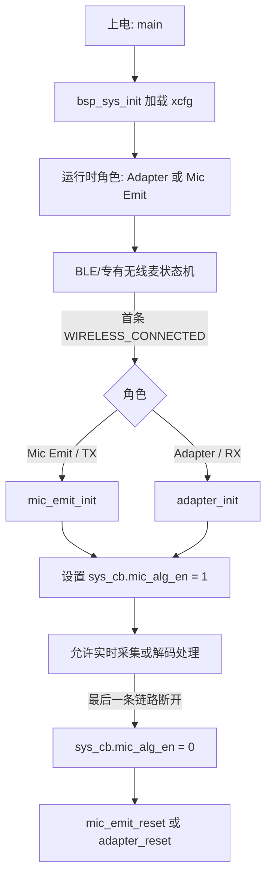
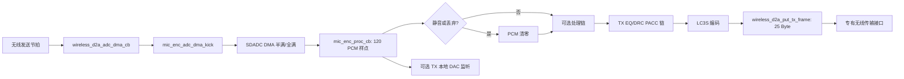
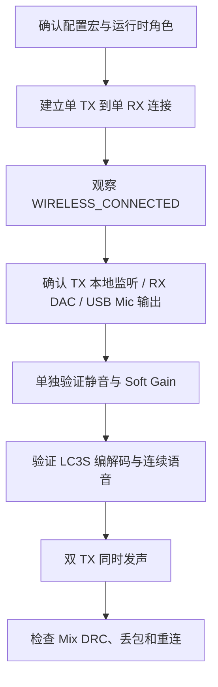

# AB5766 LE Mic 音频算法与实时处理：新手入门

> **适用对象**：当前 `CONFIG_AB5766_LE_MIC` 工程的初学者。
>
> **本文目标**：从实际源码出发，说明声音如何从发射端（Mic Emit / TX）采集、处理、编码、交给无线层，再在接收端（Adapter / RX）解码、丢包隐藏、混音并输出至 DAC 或 USB Microphone。
>
> **证据边界**：本文将可读源码、当前编译宏和公开 API 声明作为事实依据。LC3S、PACC、PLC 等核心实现可能来自预编译库；本文只说明其可验证的调用时机、数据方向和输入输出，**不猜测**其内部比特分配、滤波系数、量化、预测或调度细节。

---

## 1. 先建立正确模型

当前工程不是“上电立即持续跑所有算法”，而是一个**无线连接驱动的实时音频系统**：首条无线链路连接后，才按运行时角色初始化 TX 或 RX 的算法资源；最后一条链路断开后，再停止算法并释放相关资源。



入口 [main.c:5-20](../../projects/microphone/main.c#L5-L20) 先调用 `bsp_sys_init()`，再进入不会返回的 `func_run()`。连接事件处理函数 [wireless_proc.c:91-180](../../modules/wireless/wireless_proc.c#L91-L180) 在第一条连接建立时申请高主频，并按角色调用 `mic_emit_init()` 或 `adapter_init()`，最后才把 `sys_cb.mic_alg_en` 设为 1。故“已连接”和“算法已开始处理”在本工程中有清晰的源码关联。

---

## 2. 当前配置快照：哪些能力真的启用

当前产品选择来自 [config.h](../../projects/microphone/config.h#L12-L20)，具体配置见 [config_ab5766_le_mic.h:61-133](../../projects/microphone/config_ab5766_le_mic.h#L61-L133)。

| 项目 | 当前值 | 对实际链路的意义 |
|---|---:|---|
| 编解码器 | `CODEC_LC3S` | TX 走 `lc3s_enc()`，RX 走 `lc3s_dec()` |
| 采样率 | 48 kHz | 每秒 48000 个 PCM 样点 |
| 每帧样点 | 120 | `120 / 48000 = 2.5 ms` 的单声道 PCM 帧 |
| 通道数 | 1 | 当前配置说明仅支持单声道 |
| 压缩帧大小 | 25 Byte | 交给无线音频接口的一帧编码数据长度 |
| 最大无线麦链路 | 2 | Adapter 可处理两路 TX，并按配置混音 |
| TX Soft Gain | 开启 | 有等级控制与渐变的数字衰减 |
| TX EQ/DRC | 开启 | 初始化本地麦 PACC 链；是否有有效资源段需运行时确认 |
| TX DAC 监听 | 开启 | TX 可把处理后的 PCM 输出到本地 DAC |
| RX PLC | 代码路径启用 | 在解码后、输出前处理坏帧状态 |
| RX Mix DRC | 开启 | 两路音频经混音 PACC 链处理 |
| RX DAC / USB Mic | 开启 / 开启 | Adapter 可输出至本地 DAC 和 USB 麦克风接口 |

### 2.1 25 Byte 不能直接等同于“协议细节已知”

[lc3s.c:4-9](../../modules/codec/lc3s.c#L4-L9) 将当前 `WIRELESS_MIC_FRAME_SIZE == 25` 映射为 `cfg_lc3s_bitrate = 80000`。这能说明**应用配置中的帧长与该公开映射有关**；但 LC3S 核心编码器处于预编译接口之后，不能据此复原帧内字段、量化方式、比特分配或空口封装。

### 2.2 当前关闭但可在工程中看到的功能

| 模块 | 当前宏 | 正确理解 |
|---|---:|---|
| ECHO 音效 | `WIRELESS_MIC_ECHO_EN = 0` | 当前不进入处理链；它是效果回声，不能误称 AEC 声学回声消除 |
| MAGIC 变调 | `WIRELESS_MIC_MAGIC_EN = 0` | 当前关闭 |
| 发端移频 | `WIRELESS_FREQ_SHIFT2_EN = 0` | 当前关闭；注释定位为防啸叫效果 |
| 房间混响 | `WIRELESS_MIC_ROOM_REVERB_EN = 0` | 当前关闭 |
| AGC | `WIRELESS_MIC_AGC_EN = 0` | 当前关闭；Soft Gain 不是 AGC |
| DNR_FRE | TX/RX 均为 0 | 当前关闭 |
| AINS4 32 kHz | 0 | 当前 48 kHz 方案没有启用此分支 |
| 机器人音效 / 随机相位 | 0 / 0 | 当前关闭 |
| WAV 提示音混入主链 | 0 | 当前关闭 |

这些开关与延迟预算定义集中在 [config_ab5766_le_mic.h:97-171](../../projects/microphone/config_ab5766_le_mic.h#L97-L171)。存在源码和 API 不等于当前固件正在运行该算法。

---

## 3. TX：从 SDADC PCM 到无线编码帧

### 3.1 发送数据面



可读代码中的关键跳转如下：

1. [wireless_txrx_single.c:291-311](../../modules/wireless/wireless_txrx_single.c#L291-L311) 定义 `wireless_d2a_adc_dma_cb()` 和 `wireless_d2a_put_tx_frame()`；前者在无线 TX 节拍前触发采样，后者把编码帧放入应用 TX 缓冲。
2. [mic_proc.c:277-378](../../modules/wireless/mic_proc.c#L277-L378) 的 `mic_enc_proc_cb()` 是每帧 TX PCM 处理主入口。
3. 该函数最后在 LC3S 条件分支调用 `lc3s_enc()`，随后调用 `wireless_d2a_put_tx_frame(mic_enc.buffer, WIRELESS_MIC_FRAME_SIZE)`。
4. [wireless_txrx_single.c:306-311](../../modules/wireless/wireless_txrx_single.c#L306-L311) 只能证明应用将帧交给 `txpkt_put_frame()`；其后如何调度、是否上空口、是否重传或被对端接收，属于预编译无线库和实机验证范围。

### 3.2 静音在 PCM 位置生效

`mic_enc_proc_cb()` 先读取 `mic_enc.mute_en`，并在静音或 SDADC 丢弃条件成立时执行 `memset(pcm, 0x00, samples*2)`，见 [mic_proc.c:278-293](../../modules/wireless/mic_proc.c#L278-L293)。

因此，TX 静音不是单纯打印一条控制日志：在当前可读路径中，它在编码前使 PCM 归零。按键怎样修改 `mic_enc.mute_en`、怎样组成 `TX_CMD`，请结合 [无线麦按键消息、TX_CMD 与 RX_CMD：调用链和格式解析](AB5766_无线麦按键消息_TX_CMD_RX_CMD_调用链与格式解析.md)。

### 3.3 Soft Gain：带渐变的数字衰减，不是 AGC

当前 `WIRELESS_MIC_SOFT_GAIN_EN = 1`。实现 [soft_gain.c:59-127](../../modules/audio/soft_gain.c#L59-L127) 显示：

- 等级会限制在 `0..SOFT_GAIN_MAX_LEVEL`；当前最大等级为 8；
- 当前表从 `0 dB` 逐步到更大的负 dB，配置注释亦明确“等级越大音量越小”；
- `soft_gain_up()` 使等级减 1，`soft_gain_down()` 使等级加 1；
- 每样点处理时，当前 Q15 增益向目标增益逐步靠近，减少突然跳变造成的爆音。

它的职责是用户可控的**数字衰减**。AGC 的职责则是根据输入能量自动调节电平；当前 `WIRELESS_MIC_AGC_EN = 0`，不能把 Soft Gain 描述成已启用 AGC。

### 3.4 TX EQ/DRC 与 PACC：开关为 1 不代表固定参数必定生效

当 `WIRELESS_MIC_EQ_DRC_EN = 1` 时：

- [mic_proc.c:314-316](../../modules/wireless/mic_proc.c#L314-L316) 每帧调用 `mic_eq_drc_audio_input()`；
- [mic_eq_drc.c:19-48](../../modules/audio/mic_eq_drc.c#L19-L48) 先初始化 PACC 链、加载参数、确认 `loc_mic_pacc_enable()` 成功后才设置实际启用标志；
- [mic_emit_init:653-655](../../modules/wireless/mic_proc.c#L653-L655) 在 TX 初始化时执行该初始化。

所以能确认“该处理路径会被编译和初始化尝试”，但不能仅凭宏值断言某一组 EQ 频点、Q 值、DRC 阈值、压缩比、attack/release 或资源段一定正在运行。这些依赖效果资源加载和预编译 PACC 实现，应以资源、运行日志和实机听感进一步确认。

### 3.5 LC3S 编码与本地监听

`mic_emit_init()` 在当前编解码宏下调用 `lc3s_enc_init()`，见 [mic_proc.c:597-675](../../modules/wireless/mic_proc.c#L597-L675)。每帧处理函数则调用 `lc3s_enc()`，见 [mic_proc.c:352-363](../../modules/wireless/mic_proc.c#L352-L363)。

当前 `WIRELESS_MIC_DAC_OUT_EN = 1`，同一函数末尾还会调用 `dac0_out_audio_input()`，见 [mic_proc.c:368-376](../../modules/wireless/mic_proc.c#L368-L376)。这是一条本地监听输出路径，不等于 RX 收到的音频已经验证正确。

---

## 4. RX：接收帧、解码、PLC、混音与输出

### 4.1 接收数据面


[wireless_txrx_single.c:250-281](../../modules/wireless/wireless_txrx_single.c#L250-L281) 是接收侧重要边界：

- `wireless_d2a_set_rxpkt_cb()` 接收帧指针、长度、`bfi`、信道索引和 RSSI，并保存到应用缓冲；
- `wireless_d2a_set_rxdec_cb()` 调用 `kick_dec_prio_trans(idx)`；源码注释明确解码流程时间较长，所以放入线程以免阻塞 BLE 调度；
- `wireless_d2a_get_rx_frame()` 从接收缓冲取出一帧供解码。

### 4.2 `bfi` 与 PLC 的位置

在 [mic_proc.c:550-594](../../modules/wireless/mic_proc.c#L550-L594) 中，`mic_dec_prco_cb()`：

1. 调用 `wireless_d2a_get_rx_frame()` 获取帧及 `bfi`；
2. 正常帧时调用 `lc3s_dec()`；
3. 无论正常或坏帧，都调用 `plc_soft_process(pcm, samples, last_bfi || bfi, idx)`；
4. 最后把 PCM 交给输出路径。

`bfi` 在当前调用点被当作坏帧指示参与 PLC 决策。包装层 [plc_soft.c:10-64](../../modules/voice/plc_soft.c#L10-L64) 提供每路状态初始化、处理与退出；实际 `plc_soft_process_do()` 的内部策略不在可读 C 代码中。因此可以说 PLC 位于“解码后、PCM 输出前，用于隐藏坏帧/缺帧造成的中断”，但不能断言它确切使用了基音预测、波形重复或交叉渐变中的哪一种算法。

### 4.3 一路直出与两路混音

当前 `WIRELESS_CON_LINK_NB = 2`。输出函数 [mic_proc.c:453-546](../../modules/wireless/mic_proc.c#L453-L546) 有两个分支：

- 单路配置时，PCM 直接送 `usb_mic_in_audio_input()` 与 `dac0_out_audio_input()`；
- 两路配置时，按片段组织两路 PCM，再进入 `mic_dec_pcm_out_samples()`。

当前 `ADAPTER_MIX_DRC_EN = 1`，所以 [mic_proc.c:453-477](../../modules/wireless/mic_proc.c#L453-L477) 调用 `mix_drc_audio_input()`，再按配置向 DAC 输出，并在积累完整帧时向 USB Mic 输出。

[mic_eq_drc.c:57-84](../../modules/audio/mic_eq_drc.c#L57-L84) 显示 Mix DRC 的包装顺序为 `mix_pacc_init()` → `mix_pacc_set_param()` → `mix_pacc_enable()`，每次输入走 `mix_pacc_process()`。这表明它不是“简单相加”路径；但具体防削顶、压缩和资源参数仍取决于 PACC 内核与资源。

---

## 5. 实时性：怎样读懂配置中的时间预算

当前每帧 120 个 48 kHz 样点，即约 2.5 ms。一帧需要在下一轮实时任务到来前完成采样、处理、编码或解码、缓冲与输出，任何新增效果都会消耗 CPU、RAM 和时延预算。

配置已给出若干工程估算值，例如：

- `WIRELESS_MIC_ENC_MAX_US = 600`；
- `WIRELESS_MIC_DEC_MAX_US = 900`（注释说明开 PLC 时约 900 µs）；
- EQ/DRC、ECHO、MAGIC、移频、混响、AGC、DNR 等也各自带有延迟预算宏。

这些值可在 [config_ab5766_le_mic.h:80-118](../../projects/microphone/config_ab5766_le_mic.h#L80-L118) 查看。它们适合做调参前的风险提示，**不能替代示波器、CPU profile、空口统计和实际端到端时延测量**。

建议一次只启用一个额外模块，并至少验证：

1. 编译后 RAM/Flash 与链接段没有异常；
2. 连续语音是否有爆音、卡顿、音调变化或混音削顶；
3. 弱信号和丢包条件下 PLC 表现是否可接受；
4. 双路同时发声时 DAC 与 USB Mic 输出是否稳定；
5. 连接、断开、重连后算法状态是否干净复位。

---

## 6. 可选算法的接入顺序与常见误区

`mic_enc_proc_cb()` 的条件编译顺序是理解 TX 算法链的可靠入口，见 [mic_proc.c:295-345](../../modules/wireless/mic_proc.c#L295-L345)：AINS4、32 kHz SRC、EQ/DRC、DNR、ECHO、MAGIC、机器人音效、房间混响、AGC 等都在不同宏条件下进入。

### 常见误区

| 误区 | 正确说法 |
|---|---|
| “开了 LC3S 就是 LE Audio” | LC3S 是当前编解码选择；是否实现 ISO/CIS/BIS/BAP 等标准 LE Audio，不能由此推出。见 [BLE 无线麦克风技术栈：新手入门](AB5766_BLE无线麦克风技术栈_新手入门.md)。 |
| “Soft Gain 是自动增益” | Soft Gain 是按等级控制的数字衰减；当前 AGC 关闭。 |
| “ECHO 就是 AEC” | 当前 `ECHO` 命名对应效果回声路径；AEC 需要参考信号、回声路径估计等不同证据，当前不能混同。 |
| “EQ/DRC 宏为 1 就有固定音效参数” | 还要看 PACC 参数/资源是否有效加载。 |
| “交给 `wireless_d2a_put_tx_frame()` 就等于对端已听到” | 该调用只证明应用交付帧至发送接口，不能证明空口成功或对端最终播放。 |
| “RX 有 `bfi` 就能看出无线协议重传细节” | 只能确认应用回调拿到坏帧状态；重传、CRC、链路层调度属于预编译库边界。 |

---

## 7. 新手调试路线



1. **先确定角色**：不要用板卡标签或串口号判断。按 [TX/RX 角色判定、全调用链与日志验证指南](AB5766_LE_Mic_TX_RX角色判定_全调用链与日志验证指南.md) 中的运行时配置和入口函数判断。
2. **核对宏**：先确认采样率、帧样点、帧大小、Soft Gain、EQ/DRC、Mix DRC、DAC 与 USB Mic 的开关。
3. **验证每一层**：TX 本地 DAC 能出声，不代表无线链路正确；RX 收到 PCM，不代表 USB 主机枚举正确；`TX_CMD/RX_CMD` 也不替代最终听感测试。
4. **逐项加算法**：当前默认已关闭的模块应一次只启用一个；对比 CPU、音质、重连、双路混音和弱信号行为。
5. **区分静态分析与实机结论**：本仓库没有可读 LC3S/PACC/PLC 核心源码，也没有提供 RF、声学、时延量产指标；这部分需结合厂商资料、抓包、仪器和硬件测试。

---

## 8. 源码速查与延伸阅读

| 位置 | 关键函数/内容 | 用途 |
|---|---|---|
| [config_ab5766_le_mic.h:61-179](../../projects/microphone/config_ab5766_le_mic.h#L61-L179) | 无线、算法、USB 宏 | 当前配置基线 |
| [wireless_proc.c:91-180](../../modules/wireless/wireless_proc.c#L91-L180) | `wireless_emit_notice()` | 连接驱动的算法生命周期 |
| [wireless_txrx_single.c:250-311](../../modules/wireless/wireless_txrx_single.c#L250-L311) | `wireless_d2a_*` | TX/RX 帧接口及线程边界 |
| [mic_proc.c:277-378](../../modules/wireless/mic_proc.c#L277-L378) | `mic_enc_proc_cb()` | TX 每帧处理、编码、监听 |
| [mic_proc.c:453-594](../../modules/wireless/mic_proc.c#L453-L594) | `mic_dec_prco_cb()` 与输出 | RX 解码、PLC、混音、输出 |
| [mic_proc.c:597-691](../../modules/wireless/mic_proc.c#L597-L691) | `mic_emit_init/reset()` | TX 算法资源生命周期 |
| [soft_gain.c:59-127](../../modules/audio/soft_gain.c#L59-L127) | Soft Gain | 等级、Q15 渐变 |
| [mic_eq_drc.c:19-84](../../modules/audio/mic_eq_drc.c#L19-L84) | EQ/DRC、Mix DRC | PACC 包装层 |
| [plc_soft.c:10-64](../../modules/voice/plc_soft.c#L10-L64) | PLC 包装 | PLC 状态与 API 边界 |

配套阅读：

- [BLE 无线麦克风技术栈：新手入门](AB5766_BLE无线麦克风技术栈_新手入门.md)
- [无线麦按键消息、TX_CMD 与 RX_CMD：调用链和格式解析](AB5766_无线麦按键消息_TX_CMD_RX_CMD_调用链与格式解析.md)
- [发射端 Mic Emit 实现详解](AB5766_发射端_Mic_Emit_实现详解.md)
- [接收端 Adapter 实现详解](AB5766_接收端_Adapter_实现详解.md)

---

## 9. 一句话记忆

```text
TX：SDADC PCM -> 可选处理 -> LC3S -> 专有无线帧接口
RX：专有无线帧接口 -> LC3S -> PLC -> 单路输出或双路 Mix DRC -> DAC / USB Mic
```

真实算法效果必须同时满足：配置已启用、资源/初始化成功、实时预算足够，以及双板实机音频链路验证通过。
