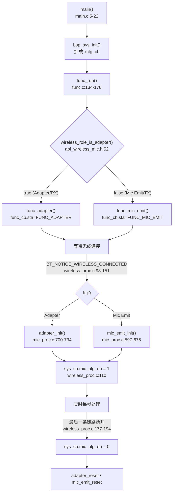
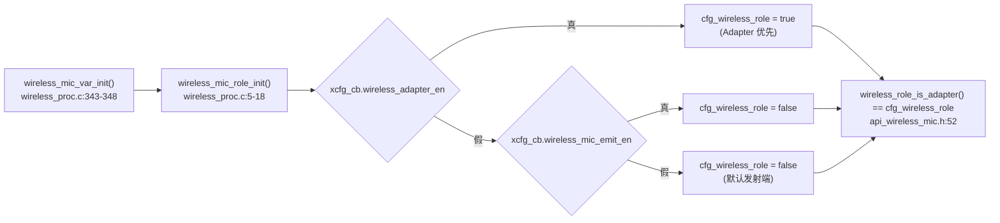
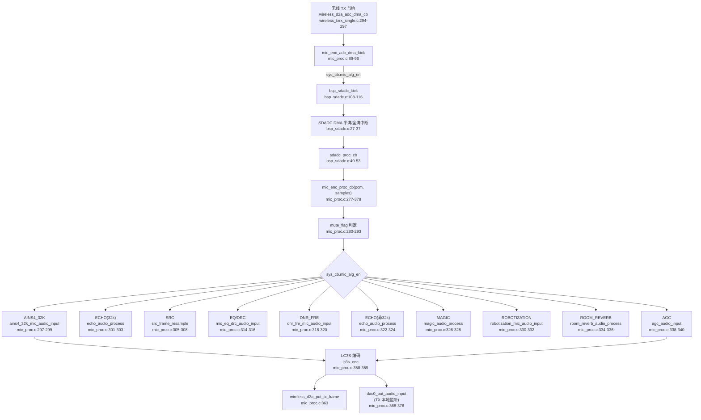
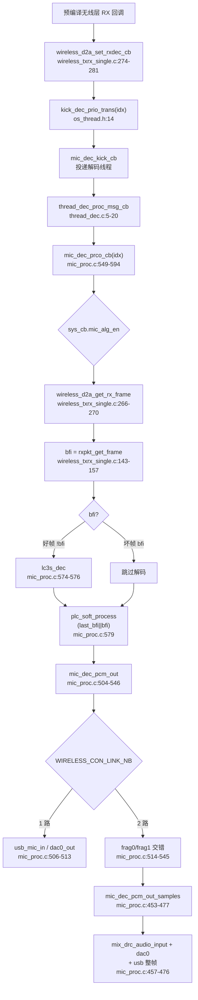
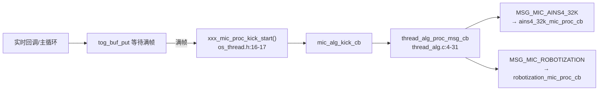

# 00 算法总览与全局调用关系

> 本文是 AB5766 LE Mic 工程音频算法系列的索引与总览。所有结论来自源码实际引用关系（具体文件、函数、行号），不依赖命名猜测算法功能；预编译库核心（LC3S、PACC、PLC、AINS4、DNR、ECHO、MAGIC 等内核）只记录公开 API、包装层、调用时机与输入输出，不推测其内部数学实现。
>
> 当前产品配置为 `CONFIG_AB5766_LE_MIC`，配置入口 [config_ab5766_le_mic.h](../../../projects/microphone/config_ab5766_le_mic.h)。

---

## 1. 系统全景：从上电到实时音频

本工程不是"上电即持续跑全部算法"，而是**无线连接驱动的实时音频系统**：首条无线链路连接后，才按运行时角色初始化 TX 或 RX 的算法资源；最后一条链路断开后再停止并释放资源。

入口 [main.c:5-22](../../../projects/microphone/main.c#L5-L22) 先记录复位原因、打印版本，调用 `bsp_sys_init()`，再进入不返回的 `func_run()`。`func_run()` 在 [func.c:134-178](../../../functions/func.c#L134-L178) 中按 `wireless_role_is_adapter()` 选择 `FUNC_ADAPTER` 或 `FUNC_MIC_EMIT`，进入对应状态机循环。

连接事件处理函数 [wireless_emit_notice()](../../../modules/wireless/wireless_proc.c#L90-L295) 是算法生命周期的核心：
- 首条连接建立时（`wireless_proc.c:102-111`）先 `sys_clk_req(INDEX_DECODE, SYS_160M)` 抬高主频，按角色调 `adapter_init()` 或 `mic_emit_init()`，最后才置 `sys_cb.mic_alg_en = 1`；
- 最后一条链路断开时（`wireless_proc.c:177-194`）先 `sys_cb.mic_alg_en = 0`，再调 `adapter_reset()` 或 `mic_emit_reset()`，最后 `sys_clk_free(INDEX_DECODE)`。

因此"已连接"与"算法已开始处理"在本工程中有清晰的源码先后关系：**先初始化资源，再使能算法标志**。

---

## 2. 角色判定

角色判定是全局调度的根基，必须先看懂它。

- `wireless_role_is_adapter()` 是一个宏，直接取全局变量 `cfg_wireless_role`，见 [api_wireless_mic.h:52](../../../libs/ble/api_wireless_mic.h#L52)：`#define wireless_role_is_adapter() cfg_wireless_role`。`cfg_wireless_role` 声明为 `extern bool`，见 [api_wireless_mic.h:42](../../../libs/ble/api_wireless_mic.h#L42)。
- `cfg_wireless_role` 由 [wireless_mic_role_init()](../../../modules/wireless/wireless_proc.c#L5-L18) 设置：`wireless_adapter_en` 为真时置 `true`（Adapter 优先，直接 return）；否则若 `wireless_mic_emit_en` 为真置 `false`；两者都关时默认 `false`（发射端）。
- `wireless_mic_role_init()` 在 [wireless_mic_var_init()](../../../modules/wireless/wireless_proc.c#L343-L348) 中被调用，后者还调用 `wireless_mic_load_code()`（按角色拷贝对应 comm 代码段，`wireless_proc.c:24-32`）和 `wireless_cmd_init()`。
- 角色一旦确定，`func_run()`（[func.c:138-142](../../../functions/func.c#L138-L142)）、连接生命周期（[wireless_proc.c:104-110](../../../modules/wireless/wireless_proc.c#L104-L110)）和 USB/输出路径都据此分支。

`xcfg_cb.wireless_adapter_en` / `wireless_mic_emit_en` 由 [bsp_sys.c](../../../bsp/bsp_sys.c) 中 `bsp_sys_init()` → `xcfg_init()` 从参数区加载到 `xcfg_cb`。运行时角色以这两个运行时变量为准，不以板卡标签或串口号判断。

---

## 3. 当前配置快照

以下为 [config_ab5766_le_mic.h](../../../projects/microphone/config_ab5766_le_mic.h) 的当前磁盘状态（已逐行核实）。

### 3.1 基础链路参数

| 项目 | 当前值 | 位置 | 意义 |
|---|---:|---|---|
| 编解码器 | `CODEC_LC3S` | [64](../../../projects/microphone/config_ab5766_le_mic.h#L64) | TX 走 `lc3s_enc`，RX 走 `lc3s_dec` |
| 传输版本 | 7 | [65](../../../projects/microphone/config_ab5766_le_mic.h#L65) | v8 传输机制 |
| 采样率 | 48 kHz | [77](../../../projects/microphone/config_ab5766_le_mic.h#L77) | `SAMPLE_RATE_48K` |
| 每帧样点 | 120 | [78](../../../projects/microphone/config_ab5766_le_mic.h#L78) | `120/48000 = 2.5 ms` 单声道帧 |
| 声道 | 1 | [79](../../../projects/microphone/config_ab5766_le_mic.h#L79) | 单声道 |
| 压缩帧大小 | 25 Byte | [80](../../../projects/microphone/config_ab5766_le_mic.h#L80) | 交给无线层的一帧编码数据 |
| 重传次数 | 3 | [81](../../../projects/microphone/config_ab5766_le_mic.h#L81) | `WIRELESS_MIC_RETRY_NB` |
| TX 间隔 | 4×1.25 ms | [82](../../../projects/microphone/config_ab5766_le_mic.h#L82) | `WIRELESS_MIC_TX_INTERVAL` |
| 最大链路数 | 2 | [76](../../../projects/microphone/config_ab5766_le_mic.h#L76) | `WIRELESS_CON_LINK_NB`，Adapter 可处理两路 TX |

### 3.2 算法开关（设备端 TX）

| 算法 | 宏 | 当前值 | 位置 | 说明 |
|---|---|---:|---|---|
| Soft Gain | `WIRELESS_MIC_SOFT_GAIN_EN` | 1 | [98](../../../projects/microphone/config_ab5766_le_mic.h#L98) | 带渐变数字增益，**非 AGC** |
| EQ/DRC | `WIRELESS_MIC_EQ_DRC_EN` | 1 | [99](../../../projects/microphone/config_ab5766_le_mic.h#L99) | PACC 链 EQ→[FSH]→DRC |
| ECHO | `WIRELESS_MIC_ECHO_EN` | 0 | [101](../../../projects/microphone/config_ab5766_le_mic.h#L101) | 效果回声，**非 AEC** |
| MAGIC | `WIRELESS_MIC_MAGIC_EN` | 0 | [103](../../../projects/microphone/config_ab5766_le_mic.h#L103) | 变调 |
| 移频2 | `WIRELESS_FREQ_SHIFT2_EN` | 0 | [105](../../../projects/microphone/config_ab5766_le_mic.h#L105) | 防啸叫 |
| Room Reverb | `WIRELESS_MIC_ROOM_REVERB_EN` | 0 | [107](../../../projects/microphone/config_ab5766_le_mic.h#L107) | 房间混响 |
| AGC | `WIRELESS_MIC_AGC_EN` | 0 | [109](../../../projects/microphone/config_ab5766_le_mic.h#L109) | **调试中**，实现/链接有风险 |
| Robotization | `WIRELESS_MIC_ROBOTIZATION_EN` | 0 | [111](../../../projects/microphone/config_ab5766_le_mic.h#L111) | **调试中** |
| Allpass 随机相位 | `WIRELESS_ALLPASS_FILTER_CHANGE_EN` | 0 | [112](../../../projects/microphone/config_ab5766_le_mic.h#L112) | **调试中** |
| DNR_FRE | `WIRELESS_MIC_DNR_FRE_EN` | 0 | [114](../../../projects/microphone/config_ab5766_le_mic.h#L114) | 轻量降噪 |
| 32K 采样 | `WIRELESS_MIC_32K_EN` | 0 | [116](../../../projects/microphone/config_ab5766_le_mic.h#L116) | 32k 分支，含 SRC |
| AINS4_32K | `WIRELESS_MIC_AINS4_32K_EN` | 1 | [118](../../../projects/microphone/config_ab5766_le_mic.h#L118) | 异步乒乓降噪 |
| TX DAC 监听 | `WIRELESS_MIC_DAC_OUT_EN` | 1 | [93](../../../projects/microphone/config_ab5766_le_mic.h#L93) | TX 本地 DAC 输出 |

### 3.3 算法开关（适配器端 RX）

| 算法 | 宏 | 当前值 | 位置 | 说明 |
|---|---|---:|---|---|
| DAC 输出 | `ADAPTER_DAC_OUTPUT_EN` | 1 | [121](../../../projects/microphone/config_ab5766_le_mic.h#L121) | RX DAC 输出 |
| USB Spk 下行 | `ADAPTER_USB_SPK_TX_EN` | 0 | [122](../../../projects/microphone/config_ab5766_le_mic.h#L122) | 不支持 |
| USB Mic 上行 | `ADAPTER_USB_MIC_RX_EN` | 0 | [123](../../../projects/microphone/config_ab5766_le_mic.h#L123) | 电脑采集输入，**非播放** |
| Mix DRC | `ADAPTER_MIX_DRC_EN` | 1 | [124](../../../projects/microphone/config_ab5766_le_mic.h#L124) | 一拖二混音 DRC |
| 适配器移频 | `ADAPTER_FREQ_SHIFT_EN` | 0 | [126](../../../projects/microphone/config_ab5766_le_mic.h#L126) | 防啸叫 |
| RX DNR_FRE | `ADAPTER_DNR_FRE_EN` | 0 | [133](../../../projects/microphone/config_ab5766_le_mic.h#L133) | **调试中** |

### 3.4 算法参数

| 参数 | 当前值 | 位置 |
|---|---:|---|
| `ECHO_LEVEL`（attenuation 0~90） | 70 | [140](../../../projects/microphone/config_ab5766_le_mic.h#L140) |
| `ECHO_DRY_USER`（0~32767） | 32767 | [141](../../../projects/microphone/config_ab5766_le_mic.h#L141) |
| `ECHO_WET_USER`（0~32768） | 20000 | [142](../../../projects/microphone/config_ab5766_le_mic.h#L142) |
| `ECHO_DELAY_MAX_LEVEL` | 9 | [143](../../../projects/microphone/config_ab5766_le_mic.h#L143) |
| `ECHO_DELAY_DEFAULT_LEVEL` | 8 | [144](../../../projects/microphone/config_ab5766_le_mic.h#L144) |
| `ECHO_DELAY_BUF_SIZE`（样点） | 6000 | [145](../../../projects/microphone/config_ab5766_le_mic.h#L145) |
| `MAGIC_EFFECT_DEFAULT_LEVEL` | 3（娃娃音） | [149](../../../projects/microphone/config_ab5766_le_mic.h#L149) |
| `ROOM_REVERB_LEVEL`（0~100） | 99 | [156](../../../projects/microphone/config_ab5766_le_mic.h#L156) |
| `ROOM_REVERB_DRY`（0~65535） | 32767 | [157](../../../projects/microphone/config_ab5766_le_mic.h#L157) |
| `ROOM_REVERB_WET`（0~32767） | 26000 | [158](../../../projects/microphone/config_ab5766_le_mic.h#L158) |
| `SOFT_GAIN_MAX_LEVEL` | 8 | [161](../../../projects/microphone/config_ab5766_le_mic.h#L161) |
| `SOFT_GAIN_DEFAULT_LEVEL` | 0 | [162](../../../projects/microphone/config_ab5766_le_mic.h#L162) |

派生宏：`DNR_FRE_EN = (WIRELESS_MIC_DNR_FRE_EN || ADAPTER_DNR_FRE_EN)`（[168](../../../projects/microphone/config_ab5766_le_mic.h#L168)），`AINS4_32K_EN = (WIRELESS_MIC_AINS4_32K_EN)`（[171](../../../projects/microphone/config_ab5766_le_mic.h#L171)）。

---

## 4. TX 上行算法链全景

TX 每帧处理入口 [mic_enc_proc_cb()](../../../modules/wireless/mic_proc.c#L277-L378)，由 SDADC DMA 完成回调驱动。调用链与条件编译顺序如下。

> 严格说明：上述 I~R 是 `mic_enc_proc_cb` 内 `#if` 条件分支的**源码出现顺序**，并非每帧全部执行。当前配置下，实际进入处理链的是 AINS4_32K（118=1）、EQ_DRC（99=1）、TX DAC 监听（93=1）；ECHO/MAGIC/ROBOTIZATION/ROOM_REVERB/AGC/DNR_FRE/SRC 均因对应宏为 0 而编译期裁掉。

### TX 每帧链精确顺序（源码行号）

`mic_enc_proc_cb` 内的处理块顺序（[mic_proc.c:295-345](../../../modules/wireless/mic_proc.c#L295-L345)）：

1. `WIRELESS_MIC_AINS4_32K_EN`：`ains4_32k_mic_audio_input((u8 *)pcm, samples, 1, NULL)`（[297-299](../../../modules/wireless/mic_proc.c#L297-L299)）
2. `WIRELESS_MIC_ECHO_EN && WIRELESS_MIC_32K_EN`：`echo_audio_process(pcm, samples)`（[301-303](../../../modules/wireless/mic_proc.c#L301-L303)）
3. `WIRELESS_MIC_32K_EN`：`src_frame_resample`（[305-308](../../../modules/wireless/mic_proc.c#L305-L308)）
4. `WIRELESS_MAX_POWER_DETECT_EN`：`dnr_buf_maxpow`（[310-312](../../../modules/wireless/mic_proc.c#L310-L312)）
5. `WIRELESS_MIC_EQ_DRC_EN`：`mic_eq_drc_audio_input((u8 *)pcm, WIRELESS_MIC_SAMPLES_SELECT, 0)`（[314-316](../../../modules/wireless/mic_proc.c#L314-L316)）
6. `WIRELESS_MIC_DNR_FRE_EN`：`dnr_fre_mic_audio_input(..., 1, NULL)`（[318-320](../../../modules/wireless/mic_proc.c#L318-L320)）
7. `WIRELESS_MIC_ECHO_EN && !WIRELESS_MIC_32K_EN`：`echo_audio_process`（[322-324](../../../modules/wireless/mic_proc.c#L322-L324)）
8. `WIRELESS_MIC_MAGIC_EN`：`magic_audio_process`（[326-328](../../../modules/wireless/mic_proc.c#L326-L328)）
9. `WIRELESS_MIC_ROBOTIZATION_EN`：`robotization_mic_audio_input`（[330-332](../../../modules/wireless/mic_proc.c#L330-L332)）
10. `WIRELESS_MIC_ROOM_REVERB_EN`：`room_reverb_audio_process`（[334-336](../../../modules/wireless/mic_proc.c#L334-L336)）
11. `WIRELESS_MIC_AGC_EN`：`agc_audio_input`（[338-340](../../../modules/wireless/mic_proc.c#L338-L340)）

编码与发送（[mic_proc.c:352-376](../../../modules/wireless/mic_proc.c#L352-L376)）：
- `CODEC_LC3S` 分支：`lc3s_enc((s16 *)pcm, mic_enc.buffer, WIRELESS_MIC_SAMPLES_SELECT)`（[358-359](../../../modules/wireless/mic_proc.c#L358-L359)）
- `wireless_d2a_put_tx_frame(mic_enc.buffer, WIRELESS_MIC_FRAME_SIZE)`（[363](../../../modules/wireless/mic_proc.c#L363)）
- `WIRELESS_MIC_DAC_OUT_EN`：`dac0_out_audio_input`（[368-376](../../../modules/wireless/mic_proc.c#L368-L376)）

### TX init 顺序

[mic_emit_init()](../../../modules/wireless/mic_proc.c#L597-L675) 的初始化顺序（与每帧链顺序基本对应但不完全一致）：

1. `mic_emit_alg_init()`（[600](../../../modules/wireless/mic_proc.c#L600)，空函数 [58-60](../../../modules/wireless/mic_proc.c#L58-L60)）
2. `memset(&mic_enc, ...)` + `first_pkt=true`（[602-603](../../../modules/wireless/mic_proc.c#L602-L603)）
3. `lc3s_enc_init`（[621](../../../modules/wireless/mic_proc.c#L621)）
4. `allpass_filter_change_set(0,100)`（[624-626](../../../modules/wireless/mic_proc.c#L624-L626)，`WIRELESS_ALLPASS_FILTER_CHANGE_EN`）
5. `src_init(0,32000,48000)`（[628-630](../../../modules/wireless/mic_proc.c#L628-L630)，`WIRELESS_MIC_32K_EN`）
6. `ains4_32k_mic_init(0, WIRELESS_MIC_SAMPLES_SELECT, 1)`（[632-634](../../../modules/wireless/mic_proc.c#L632-L634)）
7. `echo_audio_init`（[636-638](../../../modules/wireless/mic_proc.c#L636-L638)）
8. `magic_audio_init`（[640-642](../../../modules/wireless/mic_proc.c#L640-L642)）
9. `robotization_mic_init`（[644-646](../../../modules/wireless/mic_proc.c#L644-L646)）
10. `room_reverb_audio_init_cfg` + `room_reverb_audio_init`（[648-651](../../../modules/wireless/mic_proc.c#L648-L651)）
11. `mic_eq_drc_init(0, WIRELESS_MIC_SAMPLES_SELECT, 1)`（[653-655](../../../modules/wireless/mic_proc.c#L653-L655)，内含 `soft_gain_init`）
12. `agc_audio_init`（[657-659](../../../modules/wireless/mic_proc.c#L657-L659)）
13. `dnr_fre_mic_init(0, WIRELESS_MIC_SAMPLES_SELECT, 0)`（[661-663](../../../modules/wireless/mic_proc.c#L661-L663)）
14. `dac0_out_init`（[665-667](../../../modules/wireless/mic_proc.c#L665-L667)）
15. `bsp_sdadc_init()`（[669](../../../modules/wireless/mic_proc.c#L669)）

> 注意 init 顺序与每帧链顺序的差异：`allpass_filter_change_set` 在 init 中出现（[624-626](../../../modules/wireless/mic_proc.c#L624-L626)），但 `mic_enc_proc_cb` 每帧链中**没有** `allpass_filter_change` 的每帧调用点（全仓未找到其每帧调用证据），不能断言预编译库按点回调。详见 [11 防啸叫_移频与随机相位.md](11_防啸叫_移频与随机相位.md)。

`mic_emit_reset()`（[677-692](../../../modules/wireless/mic_proc.c#L677-L692)）只调 `bsp_sdadc_exit`、`wireless_cmd_reset`、清 `mic_enc`、`dac0_out_exit`，**不调用任何算法的 exit 函数**。

---

## 5. RX 下行算法链全景

RX 解码入口 [mic_dec_prco_cb()](../../../modules/wireless/mic_proc.c#L549-L594)，由 BLE RX 完成回调经解码线程驱动。

### RX 解码链精确行号

[mic_dec_prco_cb()](../../../modules/wireless/mic_proc.c#L549-L594)：
- 提示音播放中直接 return（[552-557](../../../modules/wireless/mic_proc.c#L552-L557)）
- `sys_cb.mic_alg_en` 时取帧：`bool bfi = wireless_d2a_get_rx_frame(idx, mic_dec.frame, WIRELESS_MIC_FRAME_SIZE)`（[565](../../../modules/wireless/mic_proc.c#L565)）
- `!bfi` 时按 CODEC 解码，LC3S：`lc3s_dec(mic_dec.frame, pcm, samples, idx)`（[567-576](../../../modules/wireless/mic_proc.c#L567-L576)）
- 无论好坏帧都调 `plc_soft_process(pcm, samples, mic_dec.last_bfi[idx]||bfi, idx)`（[579](../../../modules/wireless/mic_proc.c#L579)），并更新 `last_bfi`（[580](../../../modules/wireless/mic_proc.c#L580)）
- `mic_dec_pcm_out(idx)`（[586](../../../modules/wireless/mic_proc.c#L586)）
- DAC 调速：`mic_dec_dac_sync_proc()`（[588-591](../../../modules/wireless/mic_proc.c#L588-L591)）

`bfi` 语义（[wireless_txrx_single.c:143-157](../../../modules/wireless/wireless_txrx_single.c#L143-L157) `rxpkt_get_frame`）：读 `item->bfi`，仅 `!bfi` 才拷贝有效帧，返回 `bfi`。**`true/非零 = 坏帧；false/0 = 好帧`**。PLC 传入 `last_bfi||bfi`，即上一帧或当前帧任一为坏帧则触发 PLC 补偿。

### RX 输出路径

[mic_dec_pcm_out()](../../../modules/wireless/mic_proc.c#L504-L546) 两个分支：
- `WIRELESS_CON_LINK_NB == 1`（[506-513](../../../modules/wireless/mic_proc.c#L506-L513)）：PCM 直接送 `usb_mic_in_audio_input` 与 `dac0_out_audio_input`
- `WIRELESS_CON_LINK_NB == 2`（[514-545](../../../modules/wireless/mic_proc.c#L514-L545)）：按 frag 交错，调 `mic_dec_pcm_out_frag0` / `mic_dec_pcm_out_frag1`

[mic_dec_pcm_out_samples()](../../../modules/wireless/mic_proc.c#L453-L477)：
- `ADAPTER_MIX_DRC_EN`：`mix_drc_audio_input(pcm0, pcm1, obuf+obuf_off, samples)`（[457-458](../../../modules/wireless/mic_proc.c#L457-L458)）
- `ADAPTER_DAC_OUTPUT_EN`：`dac0_out_audio_input`（[465-467](../../../modules/wireless/mic_proc.c#L465-L467)）
- 积满整帧 `WIRELESS_MIC_SAMPLES_SELECT` 时清 `obuf_off` 并送 USB（[470-476](../../../modules/wireless/mic_proc.c#L470-L476)）：`usb_mic_in_audio_input((u8 *)obuf, WIRELESS_MIC_SAMPLES_SELECT, 0, 0)`（[474](../../../modules/wireless/mic_proc.c#L474)）

### RX init 顺序

[adapter_init()](../../../modules/wireless/mic_proc.c#L700-L734)：
1. `adapter_alg_init()`（[703](../../../modules/wireless/mic_proc.c#L703)）→ `plc_soft_init(0,...)` + `plc_soft_init(1,...)`（[82-86](../../../modules/wireless/mic_proc.c#L82-L86)）
2. `memset(&mic_dec,...)`（[705](../../../modules/wireless/mic_proc.c#L705)）
3. frag_samples 计算（[706-711](../../../modules/wireless/mic_proc.c#L706-L711)）
4. `lc3s_dec_init`（[719](../../../modules/wireless/mic_proc.c#L719)）
5. `mix_drc_init()`（[721-723](../../../modules/wireless/mic_proc.c#L721-L723)）
6. `dac0_out_init`（[728-730](../../../modules/wireless/mic_proc.c#L728-L730)）
7. `wireless_host_ch_class_set()`（[732](../../../modules/wireless/mic_proc.c#L732)）

---

## 6. 预编译库边界声明

以下内核实现预编译于 `libs/` 下静态库（如 `libplatform.a`），源码树中**无**可读 C 实现，本文档系列只记录其公开 API、包装层调用时机与输入输出，**不推测内部数学实现**：

| 内核 | 公开 API 声明 | 包装层 | 边界说明 |
|---|---|---|---|
| LC3S | `lc3s_enc_init`/`lc3s_enc`/`lc3s_dec_init`/`lc3s_dec` | [lc3s.c](../../../modules/codec/lc3s.c) | 只能确认帧长↔比特率映射，不复原帧内字段/量化 |
| PACC EQ/DRC | `pacc_effect_*`/`pacc_eq_*`/`pacc_drc_*` | [mic_effect.c](../../../modules/effect/mic_effect.c) | 不可读 EQ 频点/Q 值、DRC 阈值/压缩比内核 |
| PLC | `plc_soft_*_do` | [plc_soft.c](../../../modules/voice/plc_soft.c) | 不知具体基音预测/波形重复策略 |
| AINS4 | `ains4_init`/`ains4_process` | [ains4_32k.c](../../../modules/voice/ains4_32k.c) | 不推测降噪内部数学 |
| DNR_FRE | `dnr_fre_init`/`dnr_fre_process` | [dnr_fre.c](../../../modules/voice/dnr_fre.c) | 同上 |
| ECHO | `echo_init_16bit`/`echo_process_16bit` | [echo.c](../../../modules/voice/echo.c) | 不推测滤波器结构 |
| MAGIC | `pitch_shift2_init`/`pitch_shift2_process` | [magic.c](../../../modules/voice/magic.c) | 不推测时域/频域变调内部 |
| Room Reverb | `room_reverb_process`/`reverb_buf_init` | [room_reverb.c](../../../modules/voice/room_reverb.c) | 只能引用文件头"buf : 22K"注释 |
| AGC | `agcInit_do`/`AgcProcess_do` | **包装源码未纳入仓库** | 仅有调用点与内核声明 |
| Robotization | `robotization_mic_*` | **包装源码未纳入仓库** | 仅有调用点与线程注册 |
| Allpass | `allpass_filter_change_set`/`allpass_filter_change` | 无独立包装 | 每帧调用点全仓未找到 |

### 诚实标注的"未找到"

- **ROBOTIZATION / AGC 包装源码缺失**：仓库中未找到定义 `robotization_mic_init`/`agc_audio_init` 等包装函数的 `.c` 文件，仅有 [mic_proc.c](../../../modules/wireless/mic_proc.c) 中的调用点和 [api_alg.h](../../../libs/api_alg.h) 中的内核声明。相关分篇只记录调用点与内核声明，不推测内部实现或参数赋值。
- **ALLPATH_FILTER_CHANGE 无每帧调用证据**：`allpass_filter_change_set(0,100)` 仅在 [mic_emit_init:624-626](../../../modules/wireless/mic_proc.c#L624-L626) 出现；`allpass_filter_change` 的每帧调用点全仓未找到，无回调注册证据，不能断言预编译库按点回调。
- **`usb_mic_in_audio_input` 实现未在源码树找到**：声明在 [func_adapter.h:21](../../../functions/func_adapter.h#L21)，调用在 [mic_proc.c:474](../../../modules/wireless/mic_proc.c#L474)/[509](../../../modules/wireless/mic_proc.c#L509)，但实现未在 `.c/.h/.S` 中找到，应预编译于库中。

---

## 7. 命名与功能纠偏（重要）

为避免望文生义，以下命名与功能的关系以源码为准：

| 误区 | 正确说法 |
|---|---|
| "Soft Gain 是 AGC" | Soft Gain 是按等级控制的逐样点数字衰减（带渐变），见 [soft_gain.c](../../../modules/audio/soft_gain.c)；AGC 是按输入能量自动调节，当前 `WIRELESS_MIC_AGC_EN=0`。两者不同。 |
| "ECHO 是 AEC" | ECHO 是效果回声（干湿混合 + 延时反馈），见 [echo.c](../../../modules/voice/echo.c)；AEC 需参考信号与回声路径估计，当前无相关证据，不可混同。 |
| "LC3S = LE Audio" | LC3S 是当前编解码选择，[config:64](../../../projects/microphone/config_ab5766_le_mic.h#L64)；是否实现 ISO/CIS/BIS/BAP 等标准 LE Audio 不能由此推出。 |
| "PACC 包装层 = EQ/DRC 内核" | [mic_effect.c](../../../modules/effect/mic_effect.c) 只是 PACC0 的复用与链表包装层，EQ/DRC 内核预编译于库，不可读。 |
| "FREQ_SHIFT2 是独立每帧函数" | FREQ_SHIFT2 是 PACC 链中的 `LOC_MIC_PACC_FSH_CS` CS 节点，见 [mic_effect.h:8-10](../../../modules/effect/mic_effect.h#L8-L10)，不是独立每帧函数。 |
| "Room Reverb 与 ECHO 可同开" | 同开时 Room Reverb 会被自动 mute，见 [room_reverb.c:77-79](../../../modules/voice/room_reverb.c#L77-L79)。测试 Room Reverb 须先确认 ECHO 关闭。 |

---

## 8. 异步线程与同步处理

部分算法通过低优先级线程异步处理，避免阻塞实时音频回调：

- 低优先级消息枚举见 [os_thread.h:6-10](../../../os/os_thread.h#L6-L10)：`MSG_MIC_DEC0`、`MSG_MIC_DEC1`、`MSG_MIC_AINS4_32K`。
- kick 宏见 [os_thread.h:14-17](../../../os/os_thread.h#L14-L17)：`kick_dec_prio_trans(idx)` = `mic_dec_kick_cb(MSG_MIC_DEC0 + idx)`；`robotization_mic_proc_kick_start()` = `mic_alg_kick_cb(MSG_MIC_ROBOTIZATION)`；`ains4_32k_mic_proc_kick_start()` = `mic_alg_kick_cb(MSG_MIC_AINS4_32K)`。
- 算法线程分发 [thread_alg.c:4-31](../../../os/thread_alg.c#L4-L31)：`MSG_MIC_AINS4_32K` → `ains4_32k_mic_proc_cb()`（[19-21](../../../os/thread_alg.c#L19-L21)）；`MSG_MIC_ROBOTIZATION` → `robotization_mic_proc_cb()`（[23-27](../../../os/thread_alg.c#L23-L27)）。
- 解码线程分发 [thread_dec.c:5-20](../../../os/thread_dec.c#L5-L20)：`MSG_MIC_DEC0` → `mic_dec_prco_cb(0)`；`MSG_MIC_DEC1` → `mic_dec_prco_cb(1)`。

异步与同步的区分：
- **AINS4_32K**：`TOG_BUF_EN=1`，异步乒乓，满帧后才 kick 低优先级线程处理，见 [ains4_32k.c](../../../modules/voice/ains4_32k.c)。
- **DNR_FRE**：`TOG_BUF_EN=0`，同步原地处理，每帧直接调 `dnr_fre_process`，不走线程，见 [dnr_fre.c](../../../modules/voice/dnr_fre.c)。
- **解码（LC3S+PLC）**：经 `kick_dec_prio_trans` 投递解码线程，避免阻塞 BLE 调度，见 [wireless_txrx_single.c:274-281](../../../modules/wireless/wireless_txrx_single.c#L274-L281)。

---

## 9. 内存与链接段

算法缓冲通过 `AT(...)` 段标注放置，移动时序或内存敏感代码须保留这些标注：

| 模块 | 结构 | AT 段 | 位置 |
|---|---|---|---|
| TX 处理状态 | `mic_enc_t mic_enc` | `.buf.mic_emit.proc` | [mic_proc.c:46-47](../../../modules/wireless/mic_proc.c#L46-L47) |
| RX 处理状态 | `mic_dec_t mic_dec` | `.buf.adapter.proc` | [mic_proc.c:49-50](../../../modules/wireless/mic_proc.c#L49-L50) |
| ECHO 延时缓冲 | `delay_lbuf[6000]` | `.buf.echo.delay` | [echo.c:36](../../../modules/voice/echo.c#L36) |
| PACC 本地麦 | `loc_mic_pacc` / cache | `.buf.mic_effect.pacc` | [mic_effect.c:57-63](../../../modules/effect/mic_effect.c#L57-L63) |
| PACC 混音 | `mix_pacc` / `mix_temp_buf` | `.buf.mic_mix.pacc` / `.buf.mic_mix` | [mic_effect.c:200-208](../../../modules/effect/mic_effect.c#L200-L208) |
| MAGIC | `magic_cfg` / `pitch_shift2_cb` | `.buf.pitch_shift.cache` | [magic.c:14-15](../../../modules/voice/magic.c#L14-L15) |
| Room Reverb | `room_reverb_cfg` / `user_rvb_t` | `.buf1.room_reverb` / `.buf.room_reverb` | [room_reverb.c:16-17](../../../modules/voice/room_reverb.c#L16-L17) |
| AINS4_32K | `ains4_32k_cache_buf` 等 | `.buf.ains4_32k` | [ains4_32k.c:29-35](../../../modules/voice/ains4_32k.c#L29-L35) |
| PLC | `m_st[2]` | `.buf.plc_buf` | [plc_soft.c:6-7](../../../modules/voice/plc_soft.c#L6-L7) |

每帧处理函数也带 `AT(.com_text.*)` 或 `AT(.text.*)` 标注，与 [ram.ld](../../../projects/microphone/ram.ld) 预处理结果共同协调 RAM/Flash 放置。

---

## 10. 文档索引

| 编号 | 文档 | 主题 |
|---|---|---|
| 00 | 本文 | 算法总览与全局调用关系 |
| 01 | [01_系统初始化与角色调度.md](01_系统初始化与角色调度.md) | main/bsp_sys_init/角色判定/连接生命周期 |
| 02 | [02_TX上行采集与编码骨架.md](02_TX上行采集与编码骨架.md) | SDADC→mic_enc_proc_cb→LC3S→无线发送 |
| 03 | [03_AINS4_32K降噪.md](03_AINS4_32K降噪.md) | 异步乒乓降噪 |
| 04 | [04_DNR_FRE轻量降噪.md](04_DNR_FRE轻量降噪.md) | 同步轻量降噪 |
| 05 | [05_PLC丢包隐藏.md](05_PLC丢包隐藏.md) | 丢包隐藏与 bfi |
| 06 | [06_EQ_DRC_PACC框架与SoftGain.md](06_EQ_DRC_PACC框架与SoftGain.md) | PACC 复用框架与 Soft Gain |
| 07 | [07_ECHO混响.md](07_ECHO混响.md) | 效果回声 |
| 08 | [08_ROOM_REVERB房间混响.md](08_ROOM_REVERB房间混响.md) | 房间混响与 ECHO 互斥 |
| 09 | [09_MAGIC魔音变调.md](09_MAGIC魔音变调.md) | 变调音效 |
| 10 | [10_ROBOTIZATION机器人音效.md](10_ROBOTIZATION机器人音效.md) | 机器人音效（包装源码缺失） |
| 11 | [11_防啸叫_移频与随机相位.md](11_防啸叫_移频与随机相位.md) | FREQ_SHIFT2 / Allpass / FREQ_SHIFT |
| 12 | [12_AGC自动增益.md](12_AGC自动增益.md) | AGC（调试中，包装源码缺失） |
| 13 | [13_RX下行解码与MIX_DRC混音.md](13_RX下行解码与MIX_DRC混音.md) | 解码/PLC/混音/输出 |
| 14 | [14_USB_Mic枚举链.md](14_USB_Mic枚举链.md) | USB Mic 枚举与 PCM 推送 |
| 15 | [15_按键控制面.md](15_按键控制面.md) | 按键消息→算法参数控制 |

---

## 11. 阅读约定

1. 所有"文件:行号"引用均来自实际源码，可点击跳转核对。
2. `#if` 条件分支以当前 [config_ab5766_le_mic.h](../../../projects/microphone/config_ab5766_le_mic.h) 的宏值裁剪；当前实际进入处理链的算法见第 3、4 节标注。
3. 预编译库内核不推测内部实现，只记录 API、包装层、调用时机、输入输出。
4. 涉及"调试中"或"包装源码缺失"的算法，分篇中如实标注，不补全猜测。
5. 测试纪律：每次只改一个宏或参数，独立构建/刷写/恢复，详见 [快速入门](../AB5766_LE_Mic_音频算法测试快速入门.md)。
