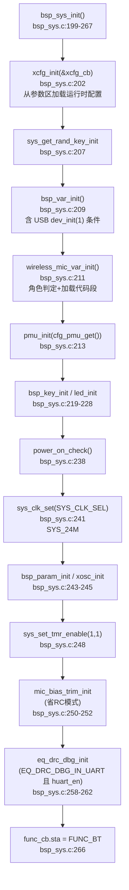
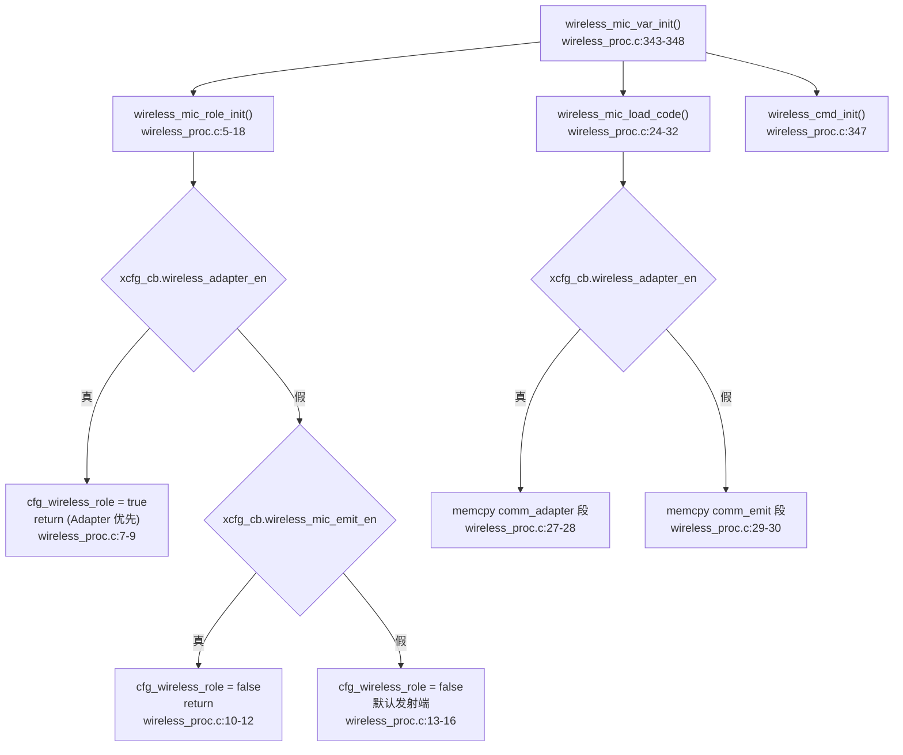
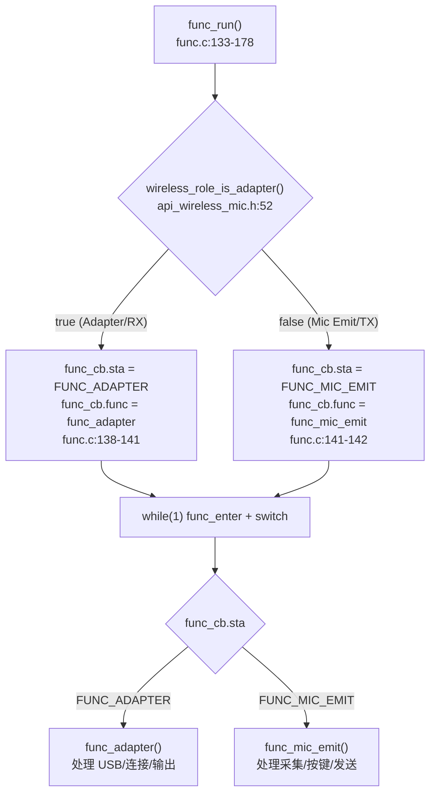
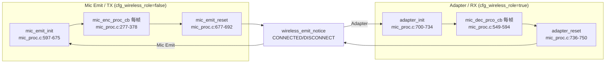

# 01 系统初始化与角色调度

> 本文梳理从上电到进入实时算法处理的全过程：`main` → `bsp_sys_init` → 角色判定 → `func_run` → 连接驱动的算法生命周期。所有结论来自源码实际引用关系（文件、函数、行号）。

---

## 1. 上电入口

[main.c:5-22](../../../projects/microphone/main.c#L5-L22) 是固件入口：

```c
int main(void)
{
    sys_rst_init();                 // 复位/唤醒状态记录
    printf("hello Ab5766\n");
    printf("SDK: %s\n", ...);
    printf("SW_VERSION: %s\n", SW_VERSION);
    code_info_dump();              // 内存段信息
    bsp_sys_init();
    func_run();                     // 不返回的状态机循环
}
```

复位原因、版本、内存诊断信息先打印，随后 `bsp_sys_init()` 完成板级与运行时配置初始化，最后进入不返回的 `func_run()`。`SW_VERSION` 定义在 [config_ab5766_le_mic.h:201](../../../projects/microphone/config_ab5766_le_mic.h#L201) 为 `"V0.0.1"`。

`code_info_dump()` 在 [bsp_sys.c:17-30](../../../bsp/bsp_sys.c#L17-L30) 打印 `comm`/`heap`/`bss`/`bram` 四个段范围，用于核对链接放置。

---

## 2. bsp_sys_init：板级与配置初始化

[bsp_sys_init()](../../../bsp/bsp_sys.c#L199-L267) 的初始化顺序：



关键点逐条说明：

1. **`xcfg_init`（[bsp_sys.c:202](../../../bsp/bsp_sys.c#L202)）**：从 Flash 参数区加载 `xcfg_cb`。`xcfg_cb` 是全局运行时配置结构，定义于 [bsp_sys.c:7](../../../bsp/bsp_sys.c#L7) `xcfg_cb_t xcfg_cb`。角色判定、USB 使能、MIC 偏置、按键双击时间等都来自这里。`xcfg_init` 失败会打印 `xcfg init error`。
2. **随机种子（[bsp_sys.c:206-207](../../../bsp/bsp_sys.c#L206-L207)）**：取 `xcfg_cb.le_addr[2]` 作种子初始化随机密钥。
3. **`bsp_var_init`（[bsp_sys.c:116-150](../../../bsp/bsp_sys.c#L116-L150)）**：设置关机时间、按键长按时间、OSC 电容；其中 [bsp_sys.c:139-147](../../../bsp/bsp_sys.c#L139-L147) 是 USB Mic 的早期入口：

   ```c
   #if ADAPTER_USB_MIC_RX_EN
       if (xcfg_cb.wireless_adapter_en) {
           dev_init(1);          // USB 设备初始化
       }
   #endif
   ```

   即 `dev_init(1)` 仅在 `ADAPTER_USB_MIC_RX_EN` 编译期使能 **且** 运行时 `wireless_adapter_en` 为真（Adapter 角色）时才执行。这印证 CLAUDE.md 的约束：`ADAPTER_USB_MIC_RX_EN=1` 只是编译开关，实际还受角色限制。当前配置该宏为 0（[config:123](../../../projects/microphone/config_ab5766_le_mic.h#L123)），此分支不进入。

4. **`wireless_mic_var_init`（[bsp_sys.c:211](../../../bsp/bsp_sys.c#L211)）**：调用角色判定、加载代码段、初始化无线命令，详见第 3 节。
5. **`pmu_init(cfg_pmu_get())`（[bsp_sys.c:213](../../../bsp/bsp_sys.c#L213)）**：`cfg_pmu_get()`（[bsp_sys.c:99-113](../../../bsp/bsp_sys.c#L99-L113)）按 `BUCK_MODE_EN`、`PMU_CFG_VBAT`、充电使能等组合 PMU 配置。
6. **按键与 LED（[bsp_sys.c:219-228](../../../bsp/bsp_sys.c#L219-L228)）**：`BSP_KEY_EN=1`（[config:25](../../../projects/microphone/config_ab5766_le_mic.h#L25) AD 按键）、`BSP_LED_EN=1`（[config:30](../../../projects/microphone/config_ab5766_le_mic.h#L30)）。
7. **`power_on_check`（[bsp_sys.c:152-196](../../../bsp/bsp_sys.c#L152-L196)）**：按 `PWRON_PRESS_TIME`（[config:195](../../../projects/microphone/config_ab5766_le_mic.h#L195)）等待开机按键确认，5 次非 PP 键超时则 `func_pwroff()`。
8. **时钟（[bsp_sys.c:241](../../../bsp/bsp_sys.c#L241)）**：`sys_clk_set(SYS_CLK_SEL)`，`SYS_CLK_SEL=SYS_24M`（[config:19](../../../projects/microphone/config_ab5766_le_mic.h#L19)）。注意这是基础主频，连接后会被抬到 `SYS_160M`（见第 5 节）。
9. **MIC 偏置 trim（[bsp_sys.c:250-252](../../../bsp/bsp_sys.c#L250-L252)）**：仅 `MIC_ANA_MODE == MIC_MODE_NOT_RC` 时调 `mic_bias_trim_init`。`MIC_ANA_MODE` 来自 `xcfg_cb.mic_bias_method`（[config:54](../../../projects/microphone/config_ab5766_le_mic.h#L54)）。
10. **EQ/DRC 在线调试（[bsp_sys.c:258-262](../../../bsp/bsp_sys.c#L258-L262)）**：`EQ_DRC_DBG_IN_UART=1`（[config:185](../../../projects/microphone/config_ab5766_le_mic.h#L185)）且 `xcfg_cb.huart_en` 时调 `eq_drc_dbg_init`。
11. **末尾 `func_cb.sta = FUNC_BT`（[bsp_sys.c:266](../../../bsp/bsp_sys.c#L266)）**：初始功能态设为 `FUNC_BT`，进入 `func_run` 后会按角色切换到 `FUNC_ADAPTER` 或 `FUNC_MIC_EMIT`。

### 定时器回调

`bsp_sys_init` 通过 `sys_set_tmr_enable(1, 1)`（[bsp_sys.c:248](../../../bsp/bsp_sys.c#L248)）使能用户定时器回调。两个回调：
- `usr_tmr1ms_isr_callback`（[bsp_sys.c:47-58](../../../bsp/bsp_sys.c#L47-L58)）：1ms 中断，`WIRELESS_MIC_KEY_PRESS_MUTE_EN` 时每 2ms 扫一次键。
- `usr_tmr5ms_thread_do`（[bsp_sys.c:60-97](../../../bsp/bsp_sys.c#L60-L97)）：5ms 线程，按周期分发：10ms `dled_scan`、50ms `led_scan`、`bsp_key_scan`（非 press-mute 模式）、100ms `lowpwr_tout_ticks`、500ms `MSG_SYS_500MS`、1s `MSG_SYS_1S`。

当前 `WIRELESS_MIC_KEY_PRESS_MUTE_EN=0`（[config:92](../../../projects/microphone/config_ab5766_le_mic.h#L92)），按键扫描走 5ms 线程的 [bsp_sys.c:79-81](../../../bsp/bsp_sys.c#L79-L81) 分支。

---

## 3. 角色判定

角色判定发生在 `wireless_mic_var_init` 内，是后续所有调度的根基。



### 3.1 wireless_mic_role_init

[wireless_proc.c:5-18](../../../modules/wireless/wireless_proc.c#L5-L18)：

```c
static void wireless_mic_role_init(void)
{
    if (xcfg_cb.wireless_adapter_en) {
        cfg_wireless_role = true;       // Adapter 优先
        return;
    } else if (xcfg_cb.wireless_mic_emit_en) {
        cfg_wireless_role = false;
        return;
    } else {
        cfg_wireless_role = false;      // 默认发射端
        return;
    }
}
```

判定优先级：`wireless_adapter_en` 真即 Adapter（直接 return，不看 emit_en）；否则看 `wireless_mic_emit_en`；两者都关则默认发射端。`wireless_adapter_en` 优先于 `wireless_mic_emit_en`。

### 3.2 wireless_role_is_adapter 宏

[api_wireless_mic.h:52](../../../libs/ble/api_wireless_mic.h#L52)：

```c
#define wireless_role_is_adapter() cfg_wireless_role
```

`cfg_wireless_role` 声明为 `extern bool`（[api_wireless_mic.h:42](../../../libs/ble/api_wireless_mic.h#L42)），全局唯一角色标志。全工程所有按角色分支的地方都读它，而不是每次重新判定配置。

### 3.3 代码段加载

[wireless_mic_load_code()](../../../modules/wireless/wireless_proc.c#L24-L32) 先调 `load_code_wireless_mic()`（预编译，加载公共无线代码），再按角色拷贝对应 comm 代码段：

- Adapter：`memcpy(&__comm_adapter_vma, &__comm_apapter_lma, &__comm_apapter_size)`
- Emit：`memcpy(&__comm_emit_vma, &__comm_emit_lma, &__comm_emit_size)`

这些段符号来自链接脚本（`__comm_adapter_vma` 等），对应 TX/RX 各自的运行时代码区。注意源码注释里 `__comm_apapter_lma`/`__comm_apapter_size` 拼写为 "apapter"（疑似笔误），引用时保持原样。

---

## 4. func_run：状态机分派

[func.c:133-178](../../../functions/func.c#L133-L178) 的 `func_run` 按 `wireless_role_is_adapter()` 选择功能态：



`func_info[]` 表（[func.c:9-20](../../../functions/func.c#L9-L20)）登记每个功能态的按键消息表：
- `FUNC_ADAPTER` → `adapter_key_msg_tbl`
- `FUNC_MIC_EMIT` → `mic_emit_key_msg_tbl`

主循环 `while(1)` 内：`func_enter()` 进入态、`switch(func_cb.sta)` 分派到 `func_mic_emit` 或 `func_adapter`，二者内部都调 `func_process()`（[func.c:43-68](../../../functions/func.c#L43-L68)）做公共周期工作（WDT 清零、`bt_run_loop`、充电、关机处理），并经 `func_message()`（[func.c:70-112](../../../functions/func.c#L70-L112)）处理全局消息（如 `EVT_ONLINE_SET_EFFECT` 在 `EQ_DRC_DBG_IN_UART` 下转 `toolkit_process`）。

`func_process` 公共周期（[func.c:43-68](../../../functions/func.c#L43-L68)）：
- `WDT_CLR()`
- `bt_run_loop()`（BLE 调度）
- 充电/关机处理

> 角色"Adapter/RX"与"Mic Emit/TX"是运行时概念，不以板卡硬件标识或串口号判断。同一块板卡烧不同 `xcfg_cb` 配置即可改角色。

---

## 5. 连接驱动的算法生命周期

这是本工程最关键的设计：**算法资源由无线连接事件按需创建与释放**，而非上电常驻。核心函数 [wireless_emit_notice()](../../../modules/wireless/wireless_proc.c#L90-L295)。

### 5.1 连接建立

`BT_NOTICE_WIRELESS_CONNECTED` 分支（[wireless_proc.c:98-151](../../../modules/wireless/wireless_proc.c#L98-L151)）：

```c
case BT_NOTICE_WIRELESS_CONNECTED:
    mic_num = packet[0];
    if (mic_num < WIRELESS_CON_LINK_NB) {
        if (wireless_mic.connected_sta == 0) {        // 首条链路
            sys_clk_req(INDEX_DECODE, SYS_160M);       // ① 抬高主频
            if (wireless_role_is_adapter()) {
                adapter_init();                        // ② Adapter 算法资源初始化
            } else {
                mic_emit_init();                       // ② Mic Emit 算法资源初始化
                lowpwr_pwroff_auto_dis();
            }
            sys_cb.mic_alg_en = 1;                     // ③ 最后才使能算法
        }
        ...
        wireless_mic.connected_sta |= BIT(mic_num);     // ④ 标记该链路已连接
    }
```

顺序严格：**① 抬主频 → ② 初始化算法资源 → ③ 使能算法标志 → ④ 标记链路**。`mic_alg_en` 在资源就绪后才置 1，每帧处理函数（`mic_enc_proc_cb`/`mic_dec_prco_cb`）都先判 `mic_alg_en`，未就绪不处理。

`sys_clk_req(INDEX_DECODE, SYS_160M)` 把解码/算法所需的主频从默认 `SYS_24M` 抬到 160 MHz，与 [config:83-84](../../../projects/microphone/config_ab5766_le_mic.h#L83-L84) 的 `ENC_MAX_US=600`/`DEC_MAX_US=900` 运算预算对应。

### 5.2 连接断开

`BT_NOTICE_WIRELESS_DISCONNECT` 分支（[wireless_proc.c:162-202](../../../modules/wireless/wireless_proc.c#L162-L202)）：

```c
case BT_NOTICE_WIRELESS_DISCONNECT:
    mic_num = packet[0];
    wireless_mic.connected_sta &= ~BIT(mic_num);       // 清除该链路
    ...
    if (wireless_mic.connected_sta == 0) {              // 最后一条链路
        sys_cb.mic_alg_en = 0;                          // ① 先关闭算法
        if (wireless_role_is_adapter()) {
            adapter_reset(mic_num, 0);                  // ② 释放 Adapter 资源
        } else {
            mic_emit_reset();
            lowpwr_pwroff_auto_en();
        }
        sys_clk_free(INDEX_DECODE);                     // ③ 再还原主频
    } else {
        adapter_reset(mic_num, wireless_mic.connected_sta); // 非最后一条：仅部分复位
    }
```

断开顺序与建立**对称相反**：**① 先关算法标志 → ② 释放资源 → ③ 还原主频**。`mic_alg_en=0` 先于 reset，保证 reset 期间不会有新帧进入处理。

非最后一条链路断开（一拖二场景）时，Adapter 调 `adapter_reset(mic_num, connected_sta)` 保留剩余链路状态，不全量复位。

### 5.3 一拖二状态位

`wireless_mic.connected_sta` 是位图，每位代表一条链路（`WIRELESS_CON_LINK_NB=2`，[config:76](../../../projects/microphone/config_ab5766_le_mic.h#L76)）。建立时 `|= BIT(mic_num)`（[wireless_proc.c:123](../../../modules/wireless/wireless_proc.c#L123)），断开时 `&= ~BIT(mic_num)`（[wireless_proc.c:166](../../../modules/wireless/wireless_proc.c#L166)）。`mic_num` 来自 `packet[0]`，即蓝牙通知携带的链路索引。

`wireless_mic.change_sta[mic_num]` 记录每条链路的状态变化（0=稳定、1=连接失败、2=断开），`change_flag=1` 通知上层刷新 LED 等。

### 5.4 虚拟通道（CODEC_ESBC 分支，当前不适用）

[wireless_proc.c:204-290](../../../modules/wireless/wireless_proc.c#L204-L290) 的 `VIRTUAL_DATA/AUDIO_CONNECTED/DISCONNECTED` 四个分支仅在 `CODEC_ESBC` 时编译。当前 `CODEC_LC3S`（[config:64](../../../projects/microphone/config_ab5766_le_mic.h#L64)），**这些分支不进入编译**，仅作完整性记录。其生命周期与主连接分支同理：`VIRTUAL_AUDIO_CONNECTED` 调 `adapter_init`/`mic_emit_init` 并置 `mic_alg_en=1`；`VIRTUAL_AUDIO_DISCONNECT` 在最后一条断开时置 `mic_alg_en=0` 并 reset。

### 5.5 BT_NOTICE 事件枚举

[api_wireless_mic.h:12-23](../../../libs/ble/api_wireless_mic.h#L12-L23) 定义通知事件：

| 事件 | 值 | 含义 |
|---|---|---|
| `BT_NOTICE_WIRELESS_CONNECTED` | 0x80 | 链路连接 |
| `BT_NOTICE_WIRELESS_DISCONNECT` | — | 链路断开 |
| `BT_NOTICE_WIRELESS_CONNECT_FAIL` | — | 连接失败 |
| `BT_NOTICE_WIRELESS_RX_BUF` | — | RX 缓冲 |
| `BT_NOTICE_WIRELESS_VIRTUAL_DATA_(DIS)CONNECTED` | — | 虚拟数据通道（ESBC） |
| `BT_NOTICE_WIRELESS_VIRTUAL_AUDIO_(DIS)CONNECTED` | — | 虚拟音频通道（ESBC） |

`wireless_emit_notice` 是这些通知的总入口，由预编译蓝牙协议栈回调。

---

## 6. 角色与算法资源的对应关系



- TX 角色：连接→`mic_emit_init`→每帧 `mic_enc_proc_cb`（采集+上行算法链+LC3S 编码+发送）→断开→`mic_emit_reset`。详见 [02_TX上行采集与编码骨架.md](02_TX上行采集与编码骨架.md)。
- RX 角色：连接→`adapter_init`→每帧 `mic_dec_prco_cb`（取帧+解码+PLC+输出）→断开→`adapter_reset`。详见 [13_RX下行解码与MIX_DRC混音.md](13_RX下行解码与MIX_DRC混音.md)。

`mic_emit_init` 与 `adapter_init` 内部各自初始化本角色的算法资源（LC3S、PACC、AINS4、ECHO、MAGIC、PLC 等），互不重叠。`mic_emit_reset`（[mic_proc.c:677-692](../../../modules/wireless/mic_proc.c#L677-L692)）只做 SDADC exit、命令复位、清状态、DAC exit，**不调用任何算法 exit**——算法资源依赖断开主频下降后的整体复位。

---

## 7. LED 状态指示

[wireless_mic_proc()](../../../modules/wireless/wireless_proc.c#L319-L340) 在 `func_process` 周期调用，对比 `connected_sta` 与 `disp_sta`，变化时刷新 LED：

```c
if (wireless_mic.connected_sta != sys_cb.disp_sta) {
    sys_cb.disp_sta = wireless_mic.connected_sta;
    if (sys_cb.disp_sta == 0) led_bt_idle();
    else led_bt_connected();
}
```

即无连接 `led_bt_idle`，有连接 `led_bt_connected`，不区分几路。LED 扫描由 5ms 定时器的 50ms 分支驱动（[bsp_sys.c:71-77](../../../bsp/bsp_sys.c#L71-L77)）。

---

## 8. 关键全局变量速查

| 变量 | 类型 | 定义 | 作用 |
|---|---|---|---|
| `xcfg_cb` | `xcfg_cb_t` | [bsp_sys.c:7](../../../bsp/bsp_sys.c#L7) | 运行时配置，含角色使能、MIC 参数等 |
| `sys_cb` | `sys_cb_t` | [bsp_sys.c:8](../../../bsp/bsp_sys.c#L8) AT(.buf.bsp.sys_cb) | 系统状态，含 `mic_alg_en`、关机时间等 |
| `cfg_wireless_role` | `bool` | extern [api_wireless_mic.h:42](../../../libs/ble/api_wireless_mic.h#L42) | 全局角色标志，`wireless_role_is_adapter()` 直接读它 |
| `wireless_mic` | — | [wireless_proc.c](../../../modules/wireless/wireless_proc.c) | `connected_sta`/`audio_sta`/`change_sta`/`change_flag` |
| `func_cb` | — | [func.c](../../../functions/func.c) | `sta`=当前功能态，`func`=功能函数指针 |
| `mic_enc` | `mic_enc_t` | [mic_proc.c:46-47](../../../modules/wireless/mic_proc.c#L46-L47) AT(.buf.mic_emit.proc) | TX 每帧处理状态 |
| `mic_dec` | `mic_dec_t` | [mic_proc.c:49-50](../../../modules/wireless/mic_proc.c#L49-L50) AT(.buf.adapter.proc) | RX 每帧处理状态 |

---

## 9. 知识点小结

1. **连接驱动而非上电常驻**：算法资源在首条无线连接时初始化，最后一条断开时释放，主频也随之升降。这降低空闲功耗，但意味着"上电不等于算法在跑"。
2. **角色优先级**：`wireless_adapter_en` 优先于 `wireless_mic_emit_en`；都关默认发射端。
3. **`mic_alg_en` 是每帧处理的总闸**：所有每帧回调（采集/解码）都先判它，未连接或已断开时不处理。
4. **主频分级**：空闲 `SYS_24M`，连接后 `SYS_160M`（`sys_clk_req(INDEX_DECODE)`），断开 `sys_clk_free(INDEX_DECODE)`。
5. **代码段按角色加载**：`comm_adapter`/`comm_emit` 段在初始化时按角色 memcpy 到 VMA，节省 RAM（只加载本角色代码）。
6. **对称的建立/断开**：建立抬频→init→使能；断开禁能→reset→降频，顺序严格相反，避免 reset 期间新帧进入。
7. **USB Mic 早期入口**：`dev_init(1)` 在 `bsp_var_init` 中，受 `ADAPTER_USB_MIC_RX_EN && wireless_adapter_en` 双重门控。当前两个条件都不满足（宏=0），不进入。详见 [14_USB_Mic枚举链.md](14_USB_Mic枚举链.md)。

---

## 10. 延伸阅读

- [00 算法总览与全局调用关系.md](00_算法总览与全局调用关系.md)
- [02_TX上行采集与编码骨架.md](02_TX上行采集与编码骨架.md)（mic_emit_init / mic_enc_proc_cb 详解）
- [13_RX下行解码与MIX_DRC混音.md](13_RX下行解码与MIX_DRC混音.md)（adapter_init / mic_dec_prco_cb 详解）
- [14_USB_Mic枚举链.md](14_USB_Mic枚举链.md)（dev_init(1) 与 USB 枚举）
- [15_按键控制面.md](15_按键控制面.md)（按键消息与功能态切换）
