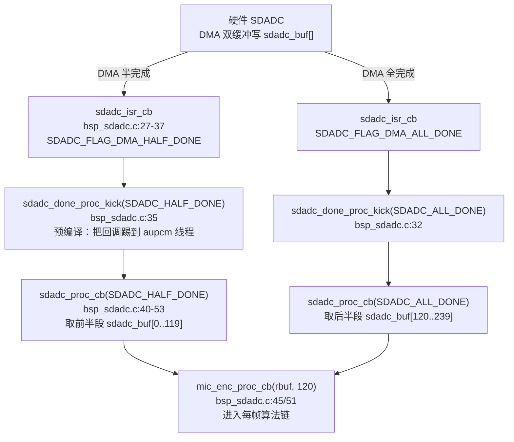
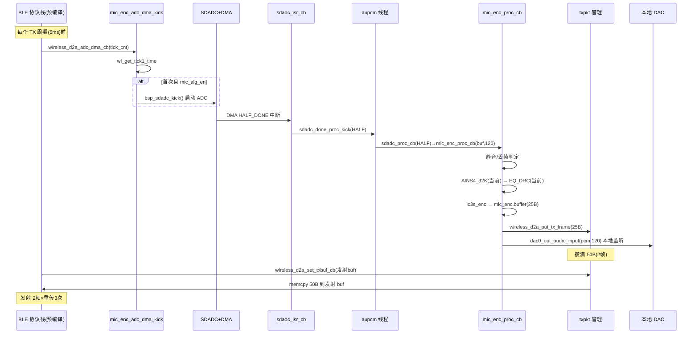

# 02 TX 上行采集与编码骨架

> 本文梳理 **Mic Emit / TX 角色** 从模拟采集到无线发送的完整数据通路：SDADC DMA 双缓冲采集 → 节拍驱动 → `mic_enc_proc_cb` 每帧算法链 → LC3S 编码 → TX 帧管理 → 本地 DAC 监听。所有结论来自源码实际引用关系（文件、函数、行号），预编译库内核仅记录公开 API、调用时机与输入输出，不推测内部数学实现。

角色判定、连接驱动的生命周期（`mic_emit_init` 何时被调、`mic_alg_en` 何时置位）见 [01_系统初始化与角色调度.md](01_系统初始化与角色调度.md)。本文聚焦 TX 角色进入运行态之后的每帧处理细节。

---

## 1. 关键配置与派生参数（当前实测配置）

编写/阅读本文前需先锁定当前编译期参数，避免把"宏=0 编译期裁掉的分支"当作运行时通路。下表以 [config_ab5766_le_mic.h](../../../projects/microphone/config_ab5766_le_mic.h) 与 [config_extra.h](../../../projects/microphone/config_extra.h) 实际取值为准。

### 1.1 基础无线参数

| 宏 | 值 | 行号 | 含义 |
|---|---|---|---|
| `WIRELESS_CON_CODEC_SEL` | `CODEC_LC3S` | [config:64](../../../projects/microphone/config_ab5766_le_mic.h#L64) | 编解码选 LC3S |
| `WIRELESS_CON_VERS` | 7 | [config:65](../../../projects/microphone/config_ab5766_le_mic.h#L65) | 传输机制版本（v8），决定走 `VERS==2\|\|7` 分支 |
| `WIRELESS_MIC_SAMPLE_RATE_SELECT` | `SAMPLE_RATE_48K` | [config:77](../../../projects/microphone/config_ab5766_le_mic.h#L77) | 采样率 48k |
| `WIRELESS_MIC_SAMPLES_SELECT` | 120 | [config:78](../../../projects/microphone/config_ab5766_le_mic.h#L78) | 每帧样点数 |
| `WIRELESS_MIC_CHANNEL_SELECT` | 1 | [config:79](../../../projects/microphone/config_ab5766_le_mic.h#L79) | 单声道（当前只支持单声道） |
| `WIRELESS_MIC_FRAME_SIZE` | 25 | [config:80](../../../projects/microphone/config_ab5766_le_mic.h#L80) | 压缩后每帧字节数 |
| `WIRELESS_MIC_RETRY_NB` | 3 | [config:81](../../../projects/microphone/config_ab5766_le_mic.h#L81) | 重传次数 |
| `WIRELESS_MIC_TX_INTERVAL` | 4 | [config:82](../../../projects/microphone/config_ab5766_le_mic.h#L82) | 传输周期 = n×1.25ms |
| `WIRELESS_MIC_ENC_MAX_US` | 600 | [config:83](../../../projects/microphone/config_ab5766_le_mic.h#L83) | 编码运算预算 |
| `WIRELESS_CON_LINK_NB` | 2 | [config:76](../../../projects/microphone/config_ab5766_le_mic.h#L76) | 最多连两路麦 |

### 1.2 派生参数（config_extra.h 推导）

`WIRELESS_MIC_SAMPLE_RATE_SELECT == SAMPLE_RATE_48K` → `FRAME_SIZE_MIN = 60`（[config_extra.h:89](../../../projects/microphone/config_extra.h#L89)，即 1.25ms 对应 60 个 48k 样点）。校验要求 `WIRELESS_MIC_SAMPLES_SELECT % FRAME_SIZE_MIN == 0`（[config_extra.h:97](../../../projects/microphone/config_extra.h#L97)），`120 % 60 == 0` 通过。

```
WIRELESS_MIC_DFU_TX_INTERVAL = WIRELESS_MIC_SAMPLES_SELECT / FRAME_SIZE_MIN = 120/60 = 2
                           // config_extra.h:101
```

[config:82](../../../projects/microphone/config_ab5766_le_mic.h#L82) 已显式定义 `WIRELESS_MIC_TX_INTERVAL=4`，故 [config_extra.h:102-104](../../../projects/microphone/config_extra.h#L102-L104) 的 `#ifndef` 保护不生效，保持 4。

`WIRELESS_CON_VERS==7` 走 [config_extra.h:114](../../../projects/microphone/config_extra.h#L114) 分支：
- `WIRELESS_CON_COMB_BUF_EN = 0`（[config_extra.h:122](../../../projects/microphone/config_extra.h#L122)，**单包模式**，不走组合包缓冲）
- `WIRELESS_MIC_TX_INTERVAL=4`，非 0/12/8/1，走 [config_extra.h:131](../../../projects/microphone/config_extra.h#L131)：`WIRELESS_MIC_COMB_NB = WIRELESS_MIC_TX_INTERVAL / WIRELESS_MIC_DFU_TX_INTERVAL = 4/2 = 2`
- `WIRELESS_CON_INTERVAL = 60`（[config_extra.h:120](../../../projects/microphone/config_extra.h#L120)）

校验：`WIRELESS_MIC_SAMPLES_SELECT * WIRELESS_MIC_COMB_NB = 120*2 = 240`，`WIRELESS_MIC_TX_INTERVAL * FRAME_SIZE_MIN = 4*60 = 240`，`240 % 240 == 0` 通过（[config_extra.h:133](../../../projects/microphone/config_extra.h#L133)）；`WIRELESS_CON_INTERVAL % WIRELESS_MIC_TX_INTERVAL = 60 % 4 == 0` 通过（[config_extra.h:136](../../../projects/microphone/config_extra.h#L136)）。

> **结论：当前配置为"单包 + COMB_NB=2"模式。** 每个 TX 周期（4×1.25ms=5ms）发射 2 个组合帧，每帧 25 字节，故 `MIC_TX_BUFFER_SIZE = 25×2 = 50` 字节（见 §6）。

### 1.3 TX 算法链开关（当前实测值）

| 宏 | 值 | 行号 | TX 链是否进入 |
|---|---|---|---|
| `WIRELESS_MIC_AINS4_32K_EN` | 1 | [config:118](../../../projects/microphone/config_ab5766_le_mic.h#L118) | **进入**（mic_proc.c:297-299） |
| `WIRELESS_MIC_32K_EN` | 0 | [config:116](../../../projects/microphone/config_ab5766_le_mic.h#L116) | 不进入（SRC/ECHO-32k 分支裁掉） |
| `WIRELESS_MIC_ECHO_EN` | 0 | [config:101](../../../projects/microphone/config_ab5766_le_mic.h#L101) | 不进入 |
| `WIRELESS_MIC_EQ_DRC_EN` | 1 | [config:99](../../../projects/microphone/config_ab5766_le_mic.h#L99) | **进入**（mic_proc.c:314-316） |
| `WIRELESS_MIC_DNR_FRE_EN` | 0 | [config:114](../../../projects/microphone/config_ab5766_le_mic.h#L114) | 不进入 |
| `WIRELESS_MIC_MAGIC_EN` | 0 | [config:103](../../../projects/microphone/config_ab5766_le_mic.h#L103) | 不进入 |
| `WIRELESS_MIC_ROBOTIZATION_EN` | 0 | [config:111](../../../projects/microphone/config_ab5766_le_mic.h#L111) | 不进入 |
| `WIRELESS_MIC_ROOM_REVERB_EN` | 0 | [config:107](../../../projects/microphone/config_ab5766_le_mic.h#L107) | 不进入 |
| `WIRELESS_MIC_AGC_EN` | 0 | [config:109](../../../projects/microphone/config_ab5766_le_mic.h#L109) | 不进入 |
| `WIRELESS_MIC_DAC_OUT_EN` | 1 | [config:93](../../../projects/microphone/config_ab5766_le_mic.h#L93) | **进入**（本地监听，mic_proc.c:368-376） |
| `WIRELESS_MIC_SOFT_GAIN_EN` | 1 | [config:98](../../../projects/microphone/config_ab5766_le_mic.h#L98) | 经 EQ_DRC/PACC 路径（详见 06） |
| `WIRELESS_MIC_KEY_PRESS_MUTE_EN` | 0 | [config:92](../../../projects/microphone/config_ab5766_le_mic.h#L92) | 按键静音缓存裁掉 |
| `WIRELESS_MAX_POWER_DETECT_EN` | 0 | [config:88](../../../projects/microphone/config_ab5766_le_mic.h#L88) | 能量检测裁掉 |
| `WIRELESS_ALLPASS_FILTER_CHANGE_EN` | 0 | [config:112](../../../projects/microphone/config_ab5766_le_mic.h#L112) | Allpass 仅 init 分支裁掉 |
| `WARNING_MIC_MIX_WAV_PLAY_EN` | 0 | [config:95](../../../projects/microphone/config_ab5766_le_mic.h#L95) | 提示音混音裁掉 |

> 当前实测进入 TX 每帧算法链的只有：**AINS4_32K → EQ_DRC**（AINS4_32K 在 48k 输入下的行为见 [03_AINS4_32K降噪.md](03_AINS4_32K降噪.md)，需单独核实），其余算法宏为 0，编译期裁掉，**运行时不存在该分支代码**。LC3S 编码与 DAC 监听不受算法宏控制，始终进入。

---

## 2. mic_enc_t 状态结构与内存放置

[mic_proc.c:13-27](../../../modules/wireless/mic_proc.c#L13-L27) 定义 TX 每帧处理状态：

```c
typedef struct {
    u8 buffer[MIC_ENC_BUFFER_SIZE];          // LC3S 编码输出缓冲，= WIRELESS_MIC_FRAME_SIZE = 25 字节
#if WIRELESS_MIC_KEY_PRESS_MUTE_EN           // 当前=0，以下三成员不编译
    u8 enc_cache_buf[MIC_DEC_OBUF_SIZE*MIC_CACHE_BUF_NUM];
    u8 enc_cache_cnt;
    u8 key_press_mute_en;
#endif
    bool kick_flag;
    uint8_t mute_en;                         // 控制 mic 端是否静音
    uint8_t first_pkt;
#if WIRELESS_MIC_DAC_OUT_EN                  // 当前=1，编译
    uint8_t dac_cnt;                         // DAC 监听同步计数
#endif
} mic_enc_t;
```

- `MIC_ENC_BUFFER_SIZE = WIRELESS_MIC_FRAME_SIZE = 25`（[mic_proc.c:7](../../../modules/wireless/mic_proc.c#L7)），即 LC3S 编码一帧产出 25 字节。
- `MIC_DEC_OBUF_SIZE = WIRELESS_MIC_SAMPLES_SELECT * WIRELESS_MIC_CHANNEL_SELECT * 2 = 120*1*2 = 240`（[mic_proc.c:10](../../../modules/wireless/mic_proc.c#L10)），单帧 PCM 字节数。
- `MIC_CACHE_BUF_NUM = 2`（[mic_proc.c:11](../../../modules/wireless/mic_proc.c#L11)），按键静音乒乓缓冲数。

全局实例 [mic_proc.c:46-47](../../../modules/wireless/mic_proc.c#L46-L47)：

```c
AT(.buf.mic_emit.proc)
mic_enc_t mic_enc;
```

`AT(.buf.mic_emit.proc)` 把该结构放进 TX 专属 RAM 段。与之对应 RX 用 `AT(.buf.adapter.proc)`（[mic_proc.c:49-50](../../../modules/wireless/mic_proc.c#L49-L50)）。两段不重叠，按角色加载（见 [01 §3.3](01_系统初始化与角色调度.md)）。

`mute_en` 通过 [mic_enc_mute_en_set](../../../modules/wireless/mic_proc.c#L99-L105)/[mic_enc_mute_en_get](../../../modules/wireless/mic_proc.c#L107-L111) 读写，按键消息触发静音（见 [15_按键控制面.md](15_按键控制面.md)）。`WIRELESS_MIC_PARAM_MEMORY_EN=0`（[config:87](../../../projects/microphone/config_ab5766_le_mic.h#L87)），关机不保存 mute 等级。

---

## 3. SDADC 采集驱动链

SDADC（Sigma-Delta ADC）是 TX 的数据源头，整条采集链在 [bsp_sdadc.c](../../../bsp/bsp_sdadc.c)。

### 3.1 全景



### 3.2 DMA 双缓冲与采样率

[bsp_sdadc.c:6-13](../../../bsp/bsp_sdadc.c#L6-L13)：

```c
#if WIRELESS_MIC_32K_EN
    #define SDADC_DMA_SIZE                    (80*2)        // 32k: 80 样点×2 半缓冲
    #define WIRELESS_MIC_SAMPLES_RESELECT_SIZE 80
#else
    #define SDADC_DMA_SIZE                    (WIRELESS_MIC_SAMPLES_SELECT*2)   // 当前=240
    #define WIRELESS_MIC_SAMPLES_RESELECT_SIZE WIRELESS_MIC_SAMPLES_SELECT     // 当前=120
#endif
int16_t sdadc_buf[SDADC_DMA_SIZE] AT(.buf.sdadc);            // 当前 int16_t[240]
```

当前 `WIRELESS_MIC_32K_EN=0`，故 `SDADC_DMA_SIZE=240`，`sdadc_buf` 是 `int16_t[240]`。DMA 把它当作一个连续缓冲，半完成中断在写到第 120 个样点时触发（前半段就绪），全完成在写满 240 时触发（后半段就绪）。每次中断取出 120 个样点交给算法链——正好等于 `WIRELESS_MIC_SAMPLES_SELECT=120`。

> **双缓冲的意义**：DMA 在写后半段时，CPU 可以同时处理前半段，反之亦然。`HALF_DONE` 取 `sdadc_buf[0..119]`，`ALL_DONE` 取 `sdadc_buf[120..239]`，两段交替，采集不中断。

### 3.3 中断与回调线程化

[sdadc_isr_cb](../../../bsp/bsp_sdadc.c#L27-L37)（`AT(.com_text.sdadc.isr)`）在中断里只做标志判断与清 flag，然后调 `sdadc_done_proc_kick(type)`：

```c
if (sdadc_get_flag(SDADC_REG, SDADC_FLAG_DMA_ALL_DONE) != RESET) {
    sdadc_clear_flag(SDADC_REG, SDADC_FLAG_DMA_ALL_DONE);
    sdadc_done_proc_kick(SDADC_ALL_DONE);
} else if (sdadc_get_flag(SDADC_REG, SDADC_FLAG_DMA_HALF_DONE) != RESET) {
    sdadc_clear_flag(SDADC_REG, SDADC_FLAG_DMA_HALF_DONE);
    sdadc_done_proc_kick(SDADC_HALF_DONE);
}
```

`sdadc_done_proc_kick` 是**预编译库函数**（[api_sdadc.h:43](../../../libs/cpu/api_sdadc.h#L43)），其文档注释明确：

> "Triggers the aupcm thread to handle the sdadc callback function, which will be set by `sdadc_done_callback_set`. This function is usually called inside the sdadc interrupt function."

即它**不在中断里直接跑算法**，而是把 `sdadc_proc_cb` 调度到 `aupcm` 线程执行。这是关键设计：每帧 120 点的算法链（AINS4/EQ_DRC/LC3S）耗时数百 us（见各算法文件头注释），放中断里会堵住其它高优先级中断，故线程化。

回调注册在 [bsp_sdadc_init:60](../../../bsp/bsp_sdadc.c#L60)：`sdadc_done_callback_set(sdadc_proc_cb)`，即 `sdadc_proc_cb` 是被踢到线程里执行的实际处理函数。

### 3.4 sdadc_proc_cb 取段

[sdadc_proc_cb](../../../bsp/bsp_sdadc.c#L40-L53)（`AT(.text.mic_emit.proc.sdadc)`）：

```c
if(type == SDADC_ALL_DONE){
    void *rbuf = &sdadc_buf[WIRELESS_MIC_SAMPLES_RESELECT_SIZE];   // 后半段起点 sdadc_buf[120]
    mic_enc_proc_cb(rbuf, WIRELESS_MIC_SAMPLES_RESELECT_SIZE);    // 120 点
}
if(type == SDADC_HALF_DONE){
    void *rbuf = sdadc_buf;                                        // 前半段起点 sdadc_buf[0]
    mic_enc_proc_cb(rbuf, WIRELESS_MIC_SAMPLES_RESELECT_SIZE);
}
```

无论哪种完成类型，都调 `mic_enc_proc_cb(rbuf, 120)`，区别仅在前半/后半段地址。`mic_enc_proc_cb` 即 §4 的每帧算法链主函数。

### 3.5 bsp_sdadc_init 配置

[bsp_sdadc_init](../../../bsp/bsp_sdadc.c#L55-L105) 关键步骤：

1. **回调注册**（[bsp_sdadc.c:60](../../../bsp/bsp_sdadc.c#L60)）：`sdadc_done_callback_set(sdadc_proc_cb)`。
2. **时钟**（[bsp_sdadc.c:62-63](../../../bsp/bsp_sdadc.c#L62-L63)）：开 `CLK_GATE0_SDADC`，`clk_sdadda_clk_set(CLK_SDADDA_CLK48_A)`（48M ADC 时钟）。
3. **采样率**（[bsp_sdadc.c:71-75](../../../bsp/bsp_sdadc.c#L71-L75)）：`WIRELESS_MIC_32K_EN` 时 `SAMPLE_RATE_32K`，否则 `WIRELESS_MIC_SAMPLE_RATE_SELECT`（当前 48k）。
4. **数字增益**（[bsp_sdadc.c:80](../../../bsp/bsp_sdadc.c#L80)）：`dig_gain = dig_gain_tbl[MIC_DIG_GAIN]`。`dig_gain_tbl[37]`（[bsp_sdadc.c:18-24](../../../bsp/bsp_sdadc.c#L18-L24)）是 37 档增益表（1024~64610），`MIC_DIG_GAIN = xcfg_cb.mic_dig_gain`（[config:58](../../../projects/microphone/config_ab5766_le_mic.h#L58)），运行时可配。
5. **RMDC 直流去除**（[bsp_sdadc.c:82-87](../../../bsp/bsp_sdadc.c#L82-L87)）：`rmdc_en=ENABLE`、`rmdc_order=RMDC_ORDER_1`、`rmdc_sel=RMDC_SEL_11BIT`。RMDC 是硬件级直流滤波，启动初几帧用粗档，第 3 帧后 `sdadc_rmdc_restore` 恢复正常精度（见 §3.7）。
6. **模拟配置**（[bsp_sdadc.c:91-96](../../../bsp/bsp_sdadc.c#L91-L96)）：`mic_mode=MIC_ANA_MODE`（[config:54](../../../projects/microphone/config_ab5766_le_mic.h#L54)，省RC/单端/差分）、`lv_mode_en=MIC_VDD_LVMODE`、`mic_bias_res_level=MIC_BIAS_RES_LEVEL`、`ana_gain=MIC_ANA_GAIN`。
7. **kick 预备**（[bsp_sdadc.c:99-101](../../../bsp/bsp_sdadc.c#L99-L101)）：`sdadc_w4_kick=true`，注册中断 `sdadc_pic_config`，启动 DMA `sdadc_dma_cmd`。**注意此处并未 `sdadc0_cmd(ENABLE)`**（注释掉，[bsp_sdadc.c:103-104](../../../bsp/bsp_sdadc.c#L103-L104)），真正启动采集由 `bsp_sdadc_kick` 触发（见 §3.6）。
8. **时间戳初始化**（[bsp_sdadc.c:102](../../../bsp/bsp_sdadc.c#L102)）：`wl_tick_time_init()`（预编译无线库，TX/RX 时间对齐基础）。

### 3.6 bsp_sdadc_kick：真正的启动门

[bsp_sdadc_kick](../../../bsp/bsp_sdadc.c#L108-L116)（`AT(.text.mic_emit.proc.sdadc)`）：

```c
void bsp_sdadc_kick(void)
{
    if(sdadc_w4_kick) {
        sdadc_w4_kick = false;
        sdadc_discard_cnt = 0;
        sdadc0_cmd(SDADC_REG, ENABLE);          // 真正开 ADC
        sdadc_total_cmd(SDADC_REG, ENABLE);     // 开总计
    }
}
```

只在 `sdadc_w4_kick` 为真时启动一次，启动后清标志，避免重复启动。`bsp_sdadc_kick` 由 TX 节拍驱动 `mic_enc_adc_dma_kick` 调用（见 §4.1），而后者**先判 `sys_cb.mic_alg_en`**——未连接（算法未使能）时根本不 kick，采集不启动。

### 3.7 bsp_sdadc_discard_proc：启动丢帧

[bsp_sdadc_discard_proc](../../../bsp/bsp_sdadc.c#L118-L129)（`AT(.text.mic_emit.proc.sdadc)`）：

```c
bool bsp_sdadc_discard_proc(void)
{
    if (sdadc_discard_cnt < 3+4) {     // 跳过开始的 7 帧
        sdadc_discard_cnt++;
        if (sdadc_discard_cnt == 3) {  // 第 3 帧（约 7.5ms 后）恢复正常 RMDC
            sdadc_rmdc_restore();
        }
        return true;                   // true = 本帧丢弃
    }
    return false;                      // false = 本帧正常处理
}
```

ADC 启动初期有建立瞬态（直流偏置未稳定、RMDC 粗档），前 7 帧（约 7×2.5ms ≈ 17.5ms，按半缓冲周期算）直接丢弃，第 3 帧恢复 RMDC 正常精度。`mic_enc_proc_cb` 在每帧开头调它，返回 true 时把本帧当静音处理（见 §4.2）。这是"上电瞬间杂音"的硬件抑制手段。

---

## 4. TX 节拍驱动与 mic_enc_proc_cb 每帧链

### 4.1 节拍入口：wireless_d2a_adc_dma_cb → mic_enc_adc_dma_kick

TX 采集由无线协议栈的 TX 周期节拍驱动。预编译 BLE 库在每个 TX 周期前回调 [wireless_d2a_adc_dma_cb](../../../modules/wireless/wireless_txrx_single.c#L293-L297)：

```c
AT(.text.mic_emit.proc)
void wireless_d2a_adc_dma_cb(uint tick_cnt)
{
    mic_enc_adc_dma_kick(tick_cnt);
}
```

[mic_enc_adc_dma_kick](../../../modules/wireless/mic_proc.c#L89-L96)（`AT(.text.mic_emit.proc)`）：

```c
void mic_enc_adc_dma_kick(uint tick_cnt)
{
    wl_get_tick1_time(tick_cnt);          // 预编译：记录时间戳用于 TX/RX 同步
    if(sys_cb.mic_alg_en) {
        bsp_sdadc_kick();                  // 仅算法使能时启动/推进采集
    }
}
```

> 注意：`bsp_sdadc_kick` 内部有 `sdadc_w4_kick` 单次门（§3.6），首次调用启动 ADC，后续调用因 `sdadc_w4_kick=false` 直接返回。所以"每个 TX 周期回调"实际只在第一次起作用，之后 ADC 自持续 DMA，节拍回调只用来打时间戳 `wl_get_tick1_time`。

`sys_cb.mic_alg_en` 是总闸（[01 §5](01_系统初始化与角色调度.md)）：连接建立后置 1，断开后置 0。未连接时 `mic_enc_adc_dma_kick` 不 kick 采集，且 `mic_enc_proc_cb` 内部算法链也不执行（见 §4.2）。

### 4.2 mic_enc_proc_cb：每帧算法链主函数

[mic_enc_proc_cb](../../../modules/wireless/mic_proc.c#L277-L378)（`AT(.text.mic_emit.proc)`）是 TX 的核心。完整结构：

```mermaid
flowchart TD
    A["mic_enc_proc_cb(pcm, 120)<br/>mic_proc.c:278"] --> B["mute_flag = mic_enc.mute_en<br/>:280"]
    B --> C{"bsp_sdadc_discard_proc()<br/>:281"}
    C -- "true(前7帧丢弃)" --> D["mute_flag = true<br/>:282"]
    C -- "false" --> E
    D --> E["KEY_PRESS_MUTE 缓存(当前裁掉)<br/>:284-289"]
    E --> F{"mute_flag"}
    F -- "true" --> G["memset(pcm,0,120*2)<br/>:292"]
    F -- "false" --> H
    G --> H{"sys_cb.mic_alg_en<br/>:295"}
    H -- "false" --> Z
    H -- "true" --> I["AINS4_32K(当前进入)<br/>:297-299"]
    I --> J["ECHO@32k(裁掉)<br/>:301-303"]
    J --> K["SRC 32k→48k(裁掉)<br/>:305-308"]
    K --> L["maxpow(裁掉)<br/>:310-312"]
    L --> M["EQ_DRC(当前进入)<br/>:314-316"]
    M --> N["DNR_FRE(裁掉)<br/>:318-320"]
    N --> O["ECHO@非32k(裁掉)<br/>:322-324"]
    O --> P["MAGIC(裁掉)<br/>:326-328"]
    P --> Q["ROBOTIZATION(裁掉)<br/>:330-332"]
    Q --> R["ROOM_REVERB(裁掉)<br/>:334-336"]
    R --> S["AGC(裁掉)<br/>:338-340"]
    S --> T["DUMP_HUART(裁掉)<br/>:342-344"]
    T --> Z
    Z["WARNING_MIX(裁掉)<br/>:346-351"] --> AA["LC3S enc<br/>:358-359<br/>pcm(120点)→mic_enc.buffer(25B)"]
    AA --> AB["wireless_d2a_put_tx_frame<br/>:363<br/>送入 TX 帧管理"]
    AB --> AC["wl_play_sync_tick1<br/>:366<br/>TX/RX 播放同步"]
    AC --> AD{"WIRELESS_MIC_DAC_OUT_EN<br/>:368"}
    AD -- "1(当前)" --> AE["dac0_get_fifocnt + dac_cnt++<br/>每50帧 dac0_play_sync_fifocnt(50,30)<br/>:369-374"]
    AE --> AF["dac0_out_audio_input(pcm,120)<br/>:375<br/>本地 DAC 监听"]
    AD -- "0" --> AG["结束"]
    AF --> AG
```



#### 4.2.1 静音与丢帧前置（:280-293）

```c
bool mute_flag = mic_enc.mute_en;             // 用户按键静音
if (bsp_sdadc_discard_proc()) {               // 启动前 7 帧
    mute_flag = true;
}
#if WIRELESS_MIC_KEY_PRESS_MUTE_EN            // 当前=0 裁掉
    mic_enc_cache_proc(pcm, samples);
    ...
#endif
if(mute_flag) {
    memset(pcm, 0x00, samples*2);             // 静音：清零 PCM
}
```

两层静音源叠加：用户静音（`mic_enc.mute_en`）+ 启动丢帧（`bsp_sdadc_discard_proc` 返回 true）。任一为真就把本帧 PCM 清零，但**清零后仍继续走算法链与编码**（只是输入是静音），保证编码帧不中断、无线帧率稳定。

#### 4.2.2 算法链（:295-345）

整条链被 `if(sys_cb.mic_alg_en)` 包住（:295）。**未连接时 `mic_alg_en=0`，整条算法链跳过**，直接到编码。这是节省功耗的第二道闸（第一道是 §4.1 的不 kick 采集）。

链内顺序与宏门控（逐行核实）：

| 顺序 | 行号 | 宏门控 | 调用 | 当前是否编译 |
|---|---|---|---|---|
| ① | [297-299](../../../modules/wireless/mic_proc.c#L297-L299) | `WIRELESS_MIC_AINS4_32K_EN`(1) | `ains4_32k_mic_audio_input((u8*)pcm, samples, 1, NULL)` | **是** |
| ② | [301-303](../../../modules/wireless/mic_proc.c#L301-L303) | `WIRELESS_MIC_ECHO_EN && WIRELESS_MIC_32K_EN`(0&&0) | `echo_audio_process(pcm, samples)` | 否 |
| ③ | [305-308](../../../modules/wireless/mic_proc.c#L305-L308) | `WIRELESS_MIC_32K_EN`(0) | `src_frame_resample(0,pcm,pcm_48k,samples); pcm=pcm_48k` | 否 |
| ④ | [310-312](../../../modules/wireless/mic_proc.c#L310-L312) | `WIRELESS_MAX_POWER_DETECT_EN`(0) | `dnr_buf_maxpow(pcm,samples)` | 否 |
| ⑤ | [314-316](../../../modules/wireless/mic_proc.c#L314-L316) | `WIRELESS_MIC_EQ_DRC_EN`(1) | `mic_eq_drc_audio_input((u8*)pcm, WIRELESS_MIC_SAMPLES_SELECT, 0)` | **是** |
| ⑥ | [318-320](../../../modules/wireless/mic_proc.c#L318-L320) | `WIRELESS_MIC_DNR_FRE_EN`(0) | `dnr_fre_mic_audio_input(...)` | 否 |
| ⑦ | [322-324](../../../modules/wireless/mic_proc.c#L322-L324) | `WIRELESS_MIC_ECHO_EN && !WIRELESS_MIC_32K_EN`(0&&1) | `echo_audio_process(pcm, 120)` | 否 |
| ⑧ | [326-328](../../../modules/wireless/mic_proc.c#L326-L328) | `WIRELESS_MIC_MAGIC_EN`(0) | `magic_audio_process(pcm, 120)` | 否 |
| ⑨ | [330-332](../../../modules/wireless/mic_proc.c#L330-L332) | `WIRELESS_MIC_ROBOTIZATION_EN`(0) | `robotization_mic_audio_input(...)` | 否 |
| ⑩ | [334-336](../../../modules/wireless/mic_proc.c#L334-L336) | `WIRELESS_MIC_ROOM_REVERB_EN`(0) | `room_reverb_audio_process(pcm, 120)` | 否 |
| ⑪ | [338-340](../../../modules/wireless/mic_proc.c#L338-L340) | `WIRELESS_MIC_AGC_EN`(0) | `agc_audio_input(pcm, 120, 0, NULL)` | 否 |
| ⑫ | [342-344](../../../modules/wireless/mic_proc.c#L342-L344) | `DUMP_HUART` | `bsp_huart_dump_audio(...)` | 否 |

> **链顺序的语义**：AINS4_32K 在最前（原始采集降噪）→ 32k 路径的 ECHO → SRC 升采样到 48k（之后所有处理都在 48k）→ 能量检测 → EQ_DRC（含 SoftGain，详见 [06](06_EQ_DRC_PACC框架与SoftGain.md)）→ DNR_FRE → 非32k 路径 ECHO → MAGIC → ROBOTIZATION → ROOM_REVERB → AGC → dump。**ECHO 被拆成两处**（:301 32k 前、:322 非32k 后）是因为 32k 模式下 SRC 升采样会改变样点数，ECHO 必须在 SRC 之前用原始 samples、或在 SRC 之后用 `WIRELESS_MIC_SAMPLES_SELECT`。当前 32k=0，两处 ECHO 都因 `ECHO_EN=0` 裁掉。

`pcm_48k` 是预编译库提供的升采样输出缓冲，声明 [api_alg.h:165](../../../libs/api_alg.h#L165) `extern s16 pcm_48k[130]`（130 容量容纳 120 点升采样余量）。仅 `WIRELESS_MIC_32K_EN=1` 时使用，当前裁掉。

#### 4.2.3 编码（:352-361）

```c
#if WIRELESS_CON_CODEC_SEL == CODEC_SBC
    sbc_enc(pcm, mic_enc.buffer, WIRELESS_MIC_SAMPLES_SELECT);
#elif WIRELESS_CON_CODEC_SEL == CODEC_ESBC
    ...
#elif (WIRELESS_CON_CODEC_SEL == CODEC_LC3S)
    lc3s_enc((s16 *)pcm, mic_enc.buffer, WIRELESS_MIC_SAMPLES_SELECT);
#endif
```

当前 `CODEC_LC3S`，调 `lc3s_enc((s16*)pcm, mic_enc.buffer, 120)`：输入 120 个 s16 PCM 样点，输出 25 字节压缩帧到 `mic_enc.buffer`。**编码不受 `mic_alg_en` 门控**——即使未连接，只要 `mic_enc_proc_cb` 被调就会编码（但未连接时采集不 kick，`mic_enc_proc_cb` 不会被调，见 §3.6/§4.1）。

`lc3s_enc` 是预编译库函数，内部数学实现不推测，仅记录：输入 `s16* pcm` + `u8* out` + `u16 samples`，产出 `WIRELESS_MIC_FRAME_SIZE=25` 字节。详见各算法文档的"预编译库边界"声明。

#### 4.2.4 发送与同步（:363-366）

```c
wireless_d2a_put_tx_frame(mic_enc.buffer, WIRELESS_MIC_FRAME_SIZE);   // 25B 送 TX 帧管理
wl_play_sync_tick1(WIRELESS_MIC_TX_INTERVAL*2/WIRELESS_MIC_COMB_NB, SAMPLE_RATE_48K);
```

`wireless_d2a_put_tx_frame` 把 25 字节帧存入 TX 乒乓管理（§5）。`wl_play_sync_tick1`（预编译）用 `TX_INTERVAL*2/COMB_NB = 4*2/2 = 4`（即 5ms×... 的同步参数）与 48k 采样率做 TX/RX 播放同步，保证 RX 端 DAC 速率与 TX 端采样速率长期一致，避免累积漂移（RX 端对应 `mic_dec_dac_sync_proc`，见 [13](13_RX下行解码与MIX_DRC混音.md)）。

#### 4.2.5 本地 DAC 监听（:368-376）

```c
#if WIRELESS_MIC_DAC_OUT_EN            // 当前=1
    dac0_get_fifocnt(0);
    mic_enc.dac_cnt++;
    if (mic_enc.dac_cnt > 50) {
        mic_enc.dac_cnt = 0;
        dac0_play_sync_fifocnt(50, 30);   // 每 50 帧做一次 DAC FIFO 同步
    }
    dac0_out_audio_input((u8 *)pcm, WIRELESS_MIC_SAMPLES_SELECT, 0);
#endif
```

TX 端把**编码前的 PCM**（即算法链处理后的 120 点）直接送本地 DAC 输出，供发射端耳机实时监听自己采集的声音。`dac0_play_sync_fifocnt(50, 30)` 每 50 帧（约 50×2.5ms=125ms）调一次 DAC FIFO 高低水位同步，防止长时间后本地播放速率与采集漂移。`dac0_out_audio_input` 是 DAC 输出包装（预编译）。

> **注意**：TX 本地监听的是编码**前**的 PCM，不是无线回环。RX 端听到的才是经无线传输+解码后的声音。两者路径不同，TX 本地监听正常 ≠ RX 听到正常。

---

## 5. TX 帧管理：乒乓缓冲与关中断保护

编码后的 25 字节帧要交给 BLE 协议栈在每个 TX 周期发射。由于"编码产生帧"与"BLE 取帧发射"是两个异步事件，且当前 `COMB_NB=2`（每周期发 2 帧），需要乒乓缓冲管理。实现在 [wireless_txrx_single.c](../../../modules/wireless/wireless_txrx_single.c)。

### 5.1 txpkt_ctl_t 与 device_con

[wireless_txrx_single.c:42-49](../../../modules/wireless/wireless_txrx_single.c#L42-L49)：

```c
typedef struct txpkt_ctl_tag {
    u8 *txbuf;            // BLE 当前提供的发射 buffer
    u8 *buf;              // 本地缓存（put 早于 set 时暂存）
    u8 frame_size;        // 25
    u8 txbuf_size;        // MIC_TX_BUFFER_SIZE = 50（COMB_NB=2）
    u8 buf_cnt;           // 缓存已用字节
    u8 first_pkt;
} txpkt_ctl_t;
```

[wireless_txrx_single.c:52-57](../../../modules/wireless/wireless_txrx_single.c#L52-L57)：

```c
AT(.buf.mic_emit.proc)
static struct {
    txpkt_ctl_t mic_tx;
    u8 mic_txbuf[MIC_TX_BUFFER_SIZE];      // 50 字节本地缓存
} device_con;
```

### 5.2 put_frame 与 set_txbuf 的时序竞争

TX 帧管理核心难点：编码端 `wireless_d2a_put_tx_frame`（产生帧）与 BLE 端 `wireless_d2a_set_txbuf_cb`（提供发射 buffer）的先后顺序不固定。两种时序：

**时序 A：put 晚于 set**（BLE 先给了 txbuf，编码才产生帧）
- `set_txbuf` 时 `txpkt->txbuf = txbuf`（记录 BLE 提供的地址，[wireless_txrx_single.c:192](../../../modules/wireless/wireless_txrx_single.c#L192)）
- `put_frame` 时 `txbuf != NULL`，直接 `memcpy(txbuf, ptr, size)` 写入 BLE buffer（[wireless_txrx_single.c:205-214](../../../modules/wireless/wireless_txrx_single.c#L205-L214)）

**时序 B：put 早于 set**（编码先产生帧，BLE 还没给 txbuf）
- `put_frame` 时 `txbuf == NULL`，把帧暂存到本地 `buf`（[wireless_txrx_single.c:215-225](../../../modules/wireless/wireless_txrx_single.c#L215-L225)），`buf_cnt += size`
- `set_txbuf` 时检测到 `buf_cnt >= txbuf_size`（已攒满 50 字节=2 帧），从 `buf` 拷到 BLE 提供的 txbuf（[wireless_txrx_single.c:187-190](../../../modules/wireless/wireless_txrx_single.c#L187-L190)）

[txpkt_set_txbuf](../../../modules/wireless/wireless_txrx_single.c#L181-L195)（`AT(.text.mic_emit.proc)`）：

```c
void txpkt_set_txbuf(txpkt_ctl_t *txpkt, u8 *txbuf)
{
    {
        if(txpkt->buf_cnt >= txpkt->txbuf_size) {
            // set_txbuf 比 put_frame 来得晚，需要从 buf 中 copy 出来
            memcpy(txbuf, txpkt->buf, txpkt->txbuf_size);
            txpkt->buf_cnt = 0;
        } else {
            txpkt->txbuf = txbuf;          // 记录 txbuf，等 put_frame 来直接写
        }
    }
}
```

[txpkt_put_frame](../../../modules/wireless/wireless_txrx_single.c#L197-L228)（`AT(.text.mic_emit.proc)`）：

```c
void txpkt_put_frame(txpkt_ctl_t *txpkt, u8 *ptr, u8 size)
{
    GLOBAL_INT_DISABLE();                  // 关中断：memcpy 数据太长时有风险
    u8 *txbuf = txpkt->txbuf;
    ...
    if(txbuf != NULL) {
        // put_frame 比 set_txbuf 来得晚，直接保存到 txbuf 中
        if(buf_cnt > 0 && buf_cnt < txpkt->txbuf_size) {
            memcpy(txbuf, buf, buf_cnt);   // 先把之前攒的补上
            txbuf += buf_cnt;
        }
        memcpy(txbuf, ptr, size);          // 再写新帧
        txpkt->buf_cnt = 0;
        txpkt->txbuf = NULL;
    } else {
        // put_frame 比 set_txbuf 来得早，先保存到 buf 中
        ...
        memcpy(buf, ptr, size);
        txpkt->buf_cnt = buf_cnt;
    }
    GLOBAL_INT_RESTORE();
}
```

> **关中断的必要性**：`put_frame` 用 `GLOBAL_INT_DISABLE/RESTORE` 保护，因为编码端（aupcm 线程）调 `put_frame` 与 BLE 中断调 `set_txbuf` 可能并发访问 `txpkt->buf_cnt`/`txbuf`。注释明确"关中断 memcpy 数据太长时有风险"——即关中断时间受 memcpy 长度限制，25~50 字节的 memcpy 在 RV32 上很短，可接受。

### 5.3 BLE 回调入口

BLE 协议栈两个回调（[wireless_txrx_single.c:301-311](../../../modules/wireless/wireless_txrx_single.c#L301-L311)）：

```c
// 每个 TX 周期前回调一次设置当前 TX_BUF
AT(.text.mic_emit.proc)
void wireless_d2a_set_txbuf_cb(u8 *ptr, u16 len)
{
    txpkt_set_txbuf(&device_con.mic_tx, ptr);
}

// 保存一个数据帧到 txbuf（编码端调用）
AT(.text.mic_emit.proc)
void wireless_d2a_put_tx_frame(u8 *ptr, u16 size)
{
    txpkt_put_frame(&device_con.mic_tx, ptr, size);
}
```

`mic_enc_proc_cb:363` 调 `wireless_d2a_put_tx_frame(mic_enc.buffer, 25)`，即每编码一帧就存一次。BLE 在每个 TX 周期前调 `wireless_d2a_set_txbuf_cb` 取走 50 字节（2 帧）。因为 `COMB_NB=2`、`RETRY_NB=3`，单包模式下每周期发射 2 帧组合、重传 3 次（见文件头注释 [wireless_txrx_single.c:1-14](../../../modules/wireless/wireless_txrx_single.c#L1-L14)）。

### 5.4 初始化与复位

- 初始化 [wireless_con_device_init](../../../modules/wireless/wireless_txrx_single.c#L338-L343)：`txpkt_init(&device_con.mic_tx, device_con.mic_txbuf, 25, 50)`。
- 断开复位 [wireless_d2a_end_ind_cb](../../../modules/wireless/wireless_txrx_single.c#L315-L326)：TX 角色调 `txpkt_end`（[wireless_txrx_single.c:231-236](../../../modules/wireless/wireless_txrx_single.c#L231-L236)），清 `first_pkt`/`buf_cnt`/`txbuf`。

---

## 6. mic_emit_init：初始化顺序

[mic_emit_init](../../../modules/wireless/mic_proc.c#L597-L675) 在首条无线连接建立时被 `wireless_emit_notice` 调用（[01 §5.1](01_系统初始化与角色调度.md)）。完整顺序：

```mermaid
flowchart TD
    A["mic_emit_init()<br/>mic_proc.c:597"] --> B["mic_emit_alg_init() 空函数<br/>:600"]
    B --> C["memset(mic_enc,0)<br/>:602"]
    C --> D["first_pkt=true<br/>:603"]
    D --> E["PARAM_MEMORY mute 读(裁掉)<br/>:604-606"]
    E --> F["MAX_POWER_DETECT init(裁掉)<br/>:607-609"]
    F --> G["SYNC_PARAM mute(裁掉)<br/>:610-613"]
    G --> H["lc3s_enc_init(48k,120)<br/>:621"]
    H --> I["ALLPASS_FILTER_CHANGE set(裁掉)<br/>:624-626"]
    I --> J["SRC init(裁掉,32k=0)<br/>:628-630"]
    J --> K["AINS4_32K init(当前进入)<br/>:632-634<br/>ains4_32k_mic_init(0,120,1)"]
    K --> L["ECHO init(裁掉)<br/>:636-638"]
    L --> M["MAGIC init(裁掉)<br/>:640-642"]
    M --> N["ROBOTIZATION init(裁掉)<br/>:644-646"]
    N --> O["ROOM_REVERB init(裁掉)<br/>:648-651"]
    O --> P["EQ_DRC init(当前进入)<br/>:653-655<br/>mic_eq_drc_init(0,120,1)"]
    P --> Q["AGC init(裁掉)<br/>:657-659"]
    Q --> R["DNR_FRE init(裁掉)<br/>:661-663"]
    R --> S["DAC_OUT init(当前进入)<br/>:665-667<br/>dac0_out_init(0,120,0)"]
    S --> T["bsp_sdadc_init()<br/>:669<br/>配置 SDADC+DMA+中断"]
    T --> U["LOWPASS(裁掉)<br/>:671-673"]
```



当前配置下实际执行的初始化只有：
1. `memset(&mic_enc, 0)` + `first_pkt=true`（:602-603）
2. `lc3s_enc_init(WIRELESS_MIC_SAMPLE_RATE_SELECT, 120)`（:621）——LC3S 编码器初始化（预编译库，输入采样率+帧长）
3. `ains4_32k_mic_init(0, 120, 1)`（:633）——AINS4_32K 降噪初始化（详见 [03](03_AINS4_32K降噪.md)）
4. `mic_eq_drc_init(0, 120, 1)`（:654）——EQ_DRC/PACC + SoftGain 初始化（详见 [06](06_EQ_DRC_PACC框架与SoftGain.md)）
5. `dac0_out_init(0, 120, 0)`（:666）——本地 DAC 监听输出初始化
6. `bsp_sdadc_init()`（:669）——SDADC 采集初始化（§3.5）

> **初始化顺序与每帧链顺序不同**：init 按 LC3S→AINS4→EQ_DRC→DAC→SDADC（资源准备顺序），process 按 AINS4→EQ_DRC→LC3S→发送（数据流顺序）。两者独立，init 只分配资源、设参数，process 按数据流串联。**Allpass 不在每帧链中**，仅 `WIRELESS_ALLPASS_FILTER_CHANGE_EN=1` 时在 init 调一次 `allpass_filter_change_set(0,100)`（:624-626），当前裁掉。`allpass_filter_change` 的每帧调用点全仓未找到，不能断言预编译库按点回调（详见 [11_防啸叫_移频与随机相位.md](11_防啸叫_移频与随机相位.md)）。

---

## 7. mic_emit_reset：断开复位

[mic_emit_reset](../../../modules/wireless/mic_proc.c#L677-L692) 在最后一条链路断开时被 `wireless_emit_notice` 调用（[01 §5.2](01_系统初始化与角色调度.md)），在 `sys_cb.mic_alg_en=0` 之后：

```c
void mic_emit_reset(void)
{
#if !WIRELESS_MIC_CLOSE_EN
    bsp_sdadc_exit();              // 关 SDADC
    wireless_cmd_reset(0);        // 复位无线命令
    memset(&mic_enc, 0x00, sizeof(mic_enc));   // 清 TX 状态
#if WIRELESS_MIC_PARAM_MEMORY_EN   // 当前=0 裁掉
    param_mic_mute_level_read(...);
#endif
#if WIRELESS_MIC_DAC_OUT_EN       // 当前=1
    dac0_out_exit();              // 关本地 DAC 监听
#endif
#endif
}
```

> **关键事实：`mic_emit_reset` 不调用任何算法 exit**。对比 RX 的 `adapter_reset`（[mic_proc.c:736-750](../../../modules/wireless/mic_proc.c#L736-L750)）有 `plc_soft_exit`/`m_lc3s_dec_exit`，TX 端 reset 只做 SDADC exit、命令复位、清状态、DAC exit。算法资源（AINS4/EQ_DRC/LC3S enc 等）依赖断开后主频下降（`sys_clk_free`）与下次连接的 `mic_emit_init` 重新初始化，**没有显式逐个 exit**。这是 TX 与 RX 资源管理的不对称点。

---

## 8. TX 通路全景与一帧的生命周期



一帧 120 点 PCM 的完整生命周期：
1. **采集**：SDADC DMA 把模拟麦信号采到 `sdadc_buf`，半/全完成中断触发。
2. **线程化**：`sdadc_done_proc_kick` 把处理踢到 aupcm 线程，避免中断里跑算法。
3. **每帧链**：`mic_enc_proc_cb` 判静音/丢帧 → AINS4_32K → EQ_DRC（当前实际进入的两级）→ LC3S 编码（120 点→25 字节）。
4. **发送**：25 字节帧经 `wireless_d2a_put_tx_frame` 进乒乓管理，BLE 每周期取 50 字节（2 帧）发射，重传 3 次。
5. **监听**：编码前 PCM 同时送本地 DAC，供 TX 端耳机实时听自己。
6. **同步**：`wl_play_sync_tick1` 与本地 DAC `dac0_play_sync_fifocnt` 维持 TX 采样率与播放速率不漂移。

---

## 9. 预编译库边界声明（TX 通路）

下列函数/符号的实现预编译于 `libs/`，本文仅记录公开 API、调用时机与输入输出，**不推测内部数学实现**：

| 符号 | 声明位置 | 调用时机 | 输入→输出 | 边界说明 |
|---|---|---|---|---|
| `sdadc_done_proc_kick` | [api_sdadc.h:43](../../../libs/cpu/api_sdadc.h#L43) | SDADC 中断内 | `SDADC_DONE_TYPEDEF` | 把回调踢到 aupcm 线程，不在中断执行 |
| `sdadc_done_callback_set` | [api_sdadc.h:36](../../../libs/cpu/api_sdadc.h#L36) | `bsp_sdadc_init:60` | 回调函数指针 | 注册 `sdadc_proc_cb` |
| `sdadc0_cmd`/`sdadc_total_cmd` | 驱动层 | `bsp_sdadc_kick:113-114` | ENABLE | 启动 ADC 与总计 |
| `sdadc_rmdc_restore` | [bsp_sdadc.h:12](../../../bsp/bsp_sdadc.h#L12) | `bsp_sdadc_discard_proc:124` 第 3 帧 | — | 恢复 RMDC 正常精度 |
| `lc3s_enc` | [api_alg.h](../../../libs/api_alg.h) | `mic_enc_proc_cb:359` | `s16* pcm, u8* out, u16 samples`→25B | LC3S 编码内核，不推测算法 |
| `lc3s_enc_init` | [api_alg.h](../../../libs/api_alg.h) | `mic_emit_init:621` | 采样率,帧长 | LC3S 编码器初始化 |
| `ains4_32k_mic_audio_input` | [api_alg.h](../../../libs/api_alg.h) | `mic_enc_proc_cb:298` | `u8* pcm, samples, 1, NULL` | AINS4_32K 内核，详见 [03](03_AINS4_32K降噪.md) |
| `ains4_32k_mic_init` | [api_alg.h](../../../libs/api_alg.h) | `mic_emit_init:633` | `0,120,1` | AINS4_32K 初始化 |
| `mic_eq_drc_audio_input` | [api_alg.h](../../../libs/api_alg.h) | `mic_enc_proc_cb:315` | `u8* pcm, 120, 0` | EQ_DRC/PACC+SoftGain，详见 [06](06_EQ_DRC_PACC框架与SoftGain.md) |
| `mic_eq_drc_init` | [api_alg.h](../../../libs/api_alg.h) | `mic_emit_init:654` | `0,120,1` | EQ_DRC 初始化 |
| `dac0_out_audio_input`/`dac0_out_init`/`dac0_out_exit` | 驱动层 | `mic_enc_proc_cb:375`/init/reset | PCM→DAC | 本地 DAC 监听输出 |
| `dac0_play_sync_fifocnt`/`dac0_get_fifocnt` | 驱动层 | `mic_enc_proc_cb:369,373` | 高低水位 | DAC FIFO 同步 |
| `wl_get_tick1_time`/`wl_save_tick1_time`/`wl_tick_time_init`/`wl_play_sync_tick1` | 预编译无线库 | `mic_enc_adc_dma_kick:92`/`sdadc_isr_cb:29`/`bsp_sdadc_init:102`/`mic_enc_proc_cb:366` | tick_cnt | TX/RX 时间戳与播放同步 |
| `pcm_48k` | [api_alg.h:165](../../../libs/api_alg.h#L165) `extern s16 pcm_48k[130]` | `mic_enc_proc_cb:306-307`(32k 分支，当前裁掉) | — | SRC 升采样输出缓冲，预编译提供 |

**全仓未找到实现、不得补全或推测**：
- `allpass_filter_change` 每帧调用点：仅 `allpass_filter_change_set(0,100)` 在 `mic_emit_init:625`（init 一次性，当前宏=0 裁掉），每帧回调注册点全仓未找到。详见 [11](11_防啸叫_移频与随机相位.md)。

---

## 10. 知识点小结

1. **采集线程化**：SDADC 中断只清 flag + `sdadc_done_proc_kick`，真正的算法链在 aupcm 线程跑，避免长耗时算法堵中断。这是嵌入式实时音频的常见模式。
2. **DMA 双缓冲**：`sdadc_buf[240]` 分前后半段，HALF_DONE/ALL_DONE 交替取 120 点，采集与处理并行不中断。
3. **双重静音门**：用户静音 `mute_en` + 启动丢帧 `bsp_sdadc_discard_proc`，任一为真清零 PCM 但仍编码发送，保证帧率稳定。
4. **启动丢帧**：前 7 帧丢弃、第 3 帧恢复 RMDC，抑制 ADC 建立瞬态杂音。
5. **算法链顺序与 32k 分流**：ECHO 拆两处因 SRC 改变样点数；当前 48k 模式只走 AINS4_32K→EQ_DRC 两级。
6. **`mic_alg_en` 双闸**：既控制采集 kick（§4.1），又控制每帧算法链执行（§4.2.2），未连接时完全不跑算法、不采集，省功耗。
7. **乒乓帧管理**：`put_frame`/`set_txbuf` 时序不固定，用 `txbuf`/`buf` 双指针 + `buf_cnt` 处理两种时序，关中断保护并发。
8. **COMB_NB=2 单包模式**：每 TX 周期发 2 帧（50 字节）、重传 3 次，平衡带宽与可靠性。
9. **TX 本地监听 ≠ RX 回环**：TX DAC 听的是编码前 PCM，RX 听的是无线传输+解码后，路径不同，不能互相证明。
10. **TX reset 无算法 exit**：与 RX 不对称，TX 算法资源靠下次 init 重建，无显式逐个释放。

---

## 11. 延伸阅读

- [00 算法总览与全局调用关系.md](00_算法总览与全局调用关系.md)
- [01_系统初始化与角色调度.md](01_系统初始化与角色调度.md)（`mic_emit_init` 何时被调、`mic_alg_en` 生命周期）
- [03_AINS4_32K降噪.md](03_AINS4_32K降噪.md)（AINS4_32K 内核与包装层）
- [06_EQ_DRC_PACC框架与SoftGain.md](06_EQ_DRC_PACC框架与SoftGain.md)（EQ_DRC/PACC + SoftGain 详解）
- [07_ECHO混响.md](07_ECHO混响.md)（ECHO 两处调用点的 32k 分流原理）
- [11_防啸叫_移频与随机相位.md](11_防啸叫_移频与随机相位.md)（Allpass "无每帧调用证据"说明）
- [13_RX下行解码与MIX_DRC混音.md](13_RX下行解码与MIX_DRC混音.md)（RX 对称通路）
