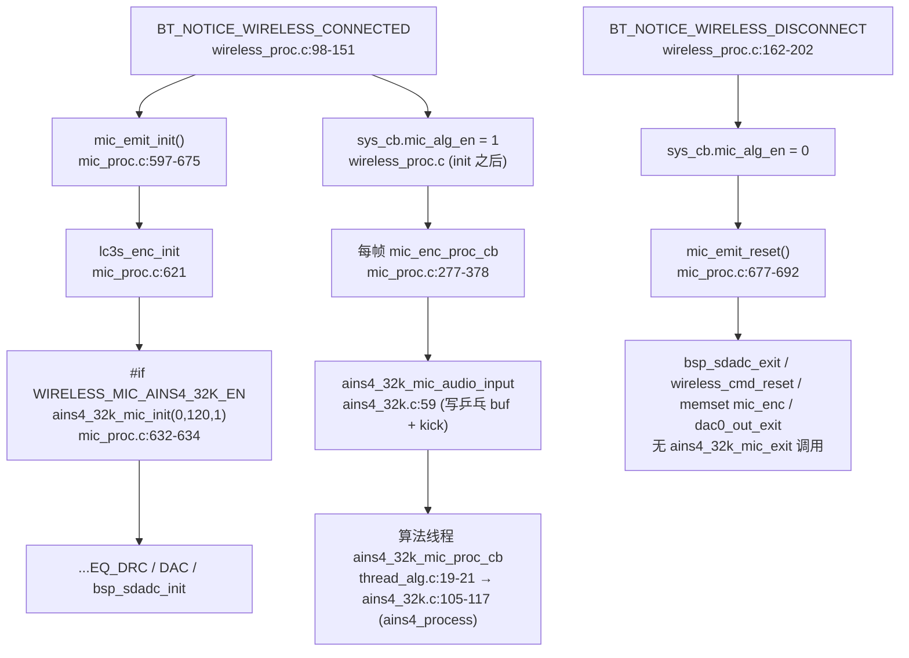

# 03 AINS4_32K 降噪

> 本文梳理 TX 发射端 AINS4_32K 降噪算法的配置宏、调用链、乒乓缓冲异步框架、算法线程分发、参数结构体与生命周期。所有结论来自源码实际引用关系（文件、函数、行号）。AINS4_32K 的包装源码（`modules/voice/ains4_32k.c`）已纳入仓库，可读可引；但其内核 `ains4_init`/`ains4_process` 来自预编译库 `libs/`，内部数学实现不推测。

---

## 1. 配置宏与编译开关

### 1.1 宏定义链

AINS4_32K 的使能经过两层宏：

- 设备端私有配置 [config_ab5766_le_mic.h:118](../../../projects/microphone/config_ab5766_le_mic.h#L118)：

  ```c
  #define WIRELESS_MIC_AINS4_32K_EN               1
  ```

- 算法参数区派生宏 [config_ab5766_le_mic.h:171](../../../projects/microphone/config_ab5766_le_mic.h#L171)：

  ```c
  #define AINS4_32K_EN                            (WIRELESS_MIC_AINS4_32K_EN)
  ```

`AINS4_32K_EN` 是包装层 [ains4_32k.c:21](../../../modules/voice/ains4_32k.c#L21) `#if AINS4_32K_EN` 的编译开关。当前 `WIRELESS_MIC_AINS4_32K_EN=1`，因此该模块**编译并进入运行时链**。

> 注意：此处 `WIRELESS_MIC_AINS4_32K_EN` 与 `WIRELESS_MIC_32K_EN`（[config:116](../../../projects/microphone/config_ab5766_le_mic.h#L116)）是两个独立宏。后者控制 32 kHz 采样率与 SRC 重采样（[config:117](../../../projects/microphone/config_ab5766_le_mic.h#L117) `WIRELESS_MIC_SRC_DELAY`、[mic_proc.c:305-308](../../../modules/wireless/mic_proc.c#L305-L308) `src_frame_resample`），当前为 0。AINS4_32K 降噪的使能不依赖 `WIRELESS_MIC_32K_EN`，二者命名相近但语义不同，不得混用。

### 1.2 在每帧链中的位置

[mic_enc_proc_cb](../../../modules/wireless/mic_proc.c#L277-L378)（TX 每帧处理回调）的算法链顺序中，AINS4_32K 是**第一个**算法节点（[mic_proc.c:295-299](../../../modules/wireless/mic_proc.c#L295-L299)）：

```c
if(sys_cb.mic_alg_en) {
#if WIRELESS_MIC_AINS4_32K_EN
    ains4_32k_mic_audio_input((u8 *)pcm, samples, 1, NULL);   // 297-299，SRC 之前
#endif
#if WIRELESS_MIC_ECHO_EN && WIRELESS_MIC_32K_EN
    echo_audio_process(pcm, samples);                           // 301-303（当前不进入）
#endif
#if WIRELESS_MIC_32K_EN
    samples = src_frame_resample(...);                          // 305-308（当前不进入）
#endif
    ...
#if WIRELESS_MIC_EQ_DRC_EN
    mic_eq_drc_audio_input((u8 *)pcm, WIRELESS_MIC_SAMPLES_SELECT, 0);  // 314-316
#endif
    ...
}
```

关键事实：
1. AINS4_32K 在 `if(sys_cb.mic_alg_en)` 总闸之内（[mic_proc.c:295](../../../modules/wireless/mic_proc.c#L295)），未连接或已断开时不处理。
2. AINS4_32K 在 SRC 之前执行。当前 `WIRELESS_MIC_32K_EN=0`，SRC 分支不进入，AINS4_32K 直接对 SDADC 原始 PCM（48 kHz/120 点）处理；其内部再按 32 kHz 帧长攒帧（见第 4 节）。
3. AINS4_32K 是**异步**算法：`ains4_32k_mic_audio_input` 本身不调用降噪内核，而是把数据写入乒乓缓冲、再 kick 低优先级算法线程；真正的 `ains4_process` 在算法线程中执行（见第 5 节）。这与 EQ_DRC、MAGIC 等同步算法的处理模型不同。

---

## 2. 生命周期：init / process / reset 时机

AINS4_32K 的资源在无线连接建立时初始化，但 reset 时**不被显式释放**（与 TX 整体不对称设计一致）。



### 2.1 init

[mic_emit_init](../../../modules/wireless/mic_proc.c#L597-L675) 在 LC3S 编码器初始化（[621](../../../modules/wireless/mic_proc.c#L621)）之后、EQ_DRC（[654](../../../modules/wireless/mic_proc.c#L654)）之前调用 AINS4_32K 初始化：

```c
#if WIRELESS_MIC_AINS4_32K_EN
    ains4_32k_mic_init(0, WIRELESS_MIC_SAMPLES_SELECT, 1);   // mic_proc.c:632-634
#endif
```

三个参数：`sample_rate=0`、`samples=WIRELESS_MIC_SAMPLES_SELECT=120`（[config:78](../../../projects/microphone/config_ab5766_le_mic.h#L78)）、`channel=1`。注意传入的 `samples=120`，但 AINS4_32K 内部实际处理帧长 `FRAME_LEN=240`（见 4.1），由乒乓缓冲把多次 120 点攒成 240 点。

### 2.2 process

每帧由 `mic_enc_proc_cb`（[mic_proc.c:297-299](../../../modules/wireless/mic_proc.c#L297-L299)）调用 `ains4_32k_mic_audio_input`。该函数只做"入队 + kick"，真正的降噪内核 `ains4_process` 在算法线程的 `ains4_32k_mic_proc_cb` 中执行（见第 4、5 节）。

### 2.3 reset / exit

[mic_emit_reset](../../../modules/wireless/mic_proc.c#L677-L692) 的全部内容：

```c
void mic_emit_reset(void)
{
#if !WIRELESS_MIC_CLOSE_EN
    bsp_sdadc_exit();
    wireless_cmd_reset(0);
    memset(&mic_enc, 0x00, sizeof(mic_enc));
    ...
#if WIRELESS_MIC_DAC_OUT_EN
    dac0_out_exit();
#endif
#endif
}
```

**`mic_emit_reset` 不调用 `ains4_32k_mic_exit`**。虽然 [ains4_32k.c:139-143](../../../modules/wireless/ains4_32k.c#L139-L143) 定义了 `ains4_32k_mic_exit`（空函数体），但全仓 Grep 仅在 `ains4_32k.c` 自身找到其定义与声明，**无任何调用点**。这与 01 号文档记录的"TX reset 无算法 exit、与 RX `adapter_reset` 不对称"一致：TX 侧算法资源依赖断开后主频下降与整体复位回收，而非逐算法 exit。

### 2.4 mute 接口

`ains4_32k_mic_mute_set`/`ains4_32k_mic_mute_get`（[ains4_32k.c:178-196](../../../modules/voice/ains4_32k.c#L178-L196)）是包装层提供的静音接口。全仓 Grep 显示除 `ains4_32k.c` 自身外**无外部调用点**（[ains4_32k.c:135](../../../modules/voice/ains4_32k.c#L135) 有一行被注释掉的 `ains4_32k_mic_mute_set(1)`）。因此当前运行时 mute 由上层 `mic_enc.mute_en`（[mic_proc.c:280-293](../../../modules/wireless/mic_proc.c#L280-L293)）的 `memset(pcm,0,...)` 实现，而非走 AINS4_32K 的内部 mute。这点如实记录，不得宣称 AINS4_32K mute 已接入控制面。

---

## 3. 包装层结构与段放置

[ains4_32k.c:5-19](../../../modules/voice/ains4_32k.c#L5-L19) 文件头注释规定了段放置与资源预算：

```
AT(.buf.ains4_32k);
AT(.rodata.ains4_32k)
AT(.text.ains4_32k_proc)
AT(.text.ains4_32k_init)
注意 mic_pcm_t 实际配置类型
需要输入采样率为 32000
code + rodata : 12k
buf           : 11k
```

源码中实际使用的 AT 段标注：
- `AT(.text.ains4_32k_proc)`：[ains4_32k.c:58](../../../modules/voice/ains4_32k.c#L58)（`ains4_32k_mic_audio_input`）、[104](../../../modules/voice/ains4_32k.c#L104)（`ains4_32k_mic_proc_cb`）、[44](../../../modules/voice/ains4_32k.c#L44)（`info_printf`，调试用）。
- `AT(.text.ains4_32k_init)`：[125](../../../modules/voice/ains4_32k.c#L125)（`ains4_32k_mic_init`）。
- `AT(.text.ains4_32k_exit)`：[139](../../../modules/voice/ains4_32k.c#L139)（`ains4_32k_mic_exit`）。
- `AT(.text.ains4_32k_set)`：[119](../../../modules/voice/ains4_32k.c#L119)（`ains4_32k_mic_output_callback_set`）。
- `AT(.text.ains4_32k_set.param)`：[145](../../../modules/voice/ains4_32k.c#L145)（`ains4_32k_mic_param_set`）。
- `AT(.text.ains4_32k_set.mute)`/`AT(.text.ains4_32k_get.mute)`：[178](../../../modules/voice/ains4_32k.c#L178)/[192](../../../modules/voice/ains4_32k.c#L192)。
- `AT(.buf.ains4_32k)`：所有静态缓冲与控制结构（见 4.1）。

`mic_pcm_t` 实际类型在 [ains4_32k.c:22](../../../modules/voice/ains4_32k.c#L22) 定义为 `typedef s16 mic_pcm_t`，即 16 位 PCM，与 TX 链 `mic_enc_proc_cb(s16 *pcm, ...)` 一致。

> 文件头注释"需要输入采样率为 32000"与"32k ains4"命名指向 32 kHz 应用场景。但当前工程 `WIRELESS_MIC_SAMPLE_RATE_SELECT=SAMPLE_RATE_48K`（[config:77](../../../projects/microphone/config_ab5766_le_mic.h#L77)），SDADC 实际以 48 kHz 采集后取 120 点送入。此处采样率名义（32k）与实际输入（48k/120 点）存在差异，属于厂商算法封装约定，**不从命名推断其内部重采样或子带划分逻辑**，仅记录"传入 48 kHz/120 点、内核以 240 点帧处理"这一可观测事实。CLAUDE.md 测试纪律要求真实 32 kHz 输入下的 AINS4 测试需先确认硬件 32k 通路，本节不替代该测试结论。

---

## 4. 异步乒乓缓冲框架

AINS4_32K 采用 `TOG_BUF_EN=1`（[ains4_32k.c:23](../../../modules/voice/ains4_32k.c#L23)）的乒乓缓冲异步模型。这是它与 EQ_DRC、MAGIC 等同步算法的本质区别。

### 4.1 静态缓冲与控制结构

[ains4_32k.c:25-38](../../../modules/voice/ains4_32k.c#L25-L38)（`TOG_BUF_EN` 分支内）：

```c
#define TOG_BUF_EN                   1
#define FRAME_LEN                    240      //算法处理帧长
#define PROCESS_OUT_SAMPLES          80       //每次存取帧长

static struct tog_bug_tag ains4_32k_tbuf AT(.buf.ains4_32k);                  //乒乓buf控制
static mic_pcm_t ains4_32k_cache_buf[FRAME_LEN*2] AT(.buf.ains4_32k);         //乒乓buf缓存
static mic_pcm_t ains4_32k_tmp_buf[PROCESS_OUT_SAMPLES] AT(.buf.ains4_32k);   //输出buf中转缓存
static void *ains4_32k_proc_ptr = ains4_32k_cache_buf;
```

- `FRAME_LEN=240`：算法内核一次处理的样点数。
- `PROCESS_OUT_SAMPLES=80`：每次回调从乒乓缓冲存取的样点数。
- `ains4_32k_cache_buf[480]`：乒乓双 block，每个 block = `FRAME_LEN*sizeof(s16)` = 480 字节，共 960 字节。
- `ains4_32k_tmp_buf[80]`：输出中转，存放从读 block 取出的 80 点。
- `ains4_32k_proc_ptr`：当前写满待处理的 block 指针，传给算法线程。

### 4.2 tog_bug_tag 结构

[api_alg.h:5-16](../../../libs/api_alg.h#L5-L16)：

```c
struct rw_tog {
    u8 *buf;
    u16 w_cnt;
    u16 r_cnt;
};
struct tog_bug_tag {
    u16 block_size;
    bool w_idx;
    bool r_idx;
    struct rw_tog tog[2];
};
```

`tog[2]` 是两个等大 block，`w_idx`/`r_idx` 标识当前写/读 block。相关 API（[api_alg.h:18-27](../../../libs/api_alg.h#L18-L27)）：

| 函数/宏 | 作用 |
|---|---|
| `tog_buf_init(tbuf, buffer, block_size)` | 初始化，`buffer` 大小需 = `2*block_size` |
| `tog_buf_put(tbuf, ptr, size)` | 写入 `w_idx` block，`w_cnt` 累加，≥`block_size` 返回 true |
| `tog_buf_get(tbuf, ptr, size)` | 读取 `r_idx` block，`r_cnt` 累加，≥`block_size` 返回 true |
| `tog_buf_wr_toggle(tbuf)` | 手动翻转写指针 `w_idx` |
| `tog_buf_rd_toggle(tbuf)` | 手动翻转读指针 `r_idx` |
| `tog_bug_get_w_block(tbuf)` | 宏，取当前写 block 的 `buf` 指针 |

初始化在 `ains4_32k_mic_init`（[ains4_32k.c:130](../../../modules/voice/ains4_32k.c#L130)）：

```c
tog_buf_init(&ains4_32k_tbuf, ains4_32k_cache_buf, FRAME_LEN*sizeof(mic_pcm_t));
```

`block_size = 240*2 = 480` 字节，`ains4_32k_cache_buf` = 960 字节 = `2*block_size`，满足注释约束。

### 4.3 audio_input：入队 + kick

[ains4_32k_mic_audio_input](../../../modules/voice/ains4_32k.c#L58-L101) 是实时线程侧的入口（由 `mic_enc_proc_cb` 每帧调用）：

```c
AT(.text.ains4_32k_proc)
void ains4_32k_mic_audio_input(u8 *ptr, u32 samples, int ch_mode, void *params)
{
    if (!ains4_32k_mic_cfg.mute /*&& wireless_cb.alg_en*/) {
#if TOG_BUF_EN
        while(samples > 0) {
            uint rlen = (samples > PROCESS_OUT_SAMPLES)? PROCESS_OUT_SAMPLES : samples;
            // 1) 先从读 block 取上一帧已降噪的输出
            if(tog_buf_get(&ains4_32k_tbuf, (u8 *)ains4_32k_tmp_buf, rlen*sizeof(mic_pcm_t))) {
                tog_buf_rd_toggle(&ains4_32k_tbuf);          // 读完翻转读指针
            }
            // 2) 把本次输入写入写 block；写满(≥block_size)返回 true → 攒帧完毕
            if(tog_buf_put(&ains4_32k_tbuf, ptr, rlen*sizeof(mic_pcm_t))) {
                ains4_32k_proc_ptr = tog_bug_get_w_block(&ains4_32k_tbuf);
                tog_buf_wr_toggle(&ains4_32k_tbuf);          // 写满翻转写指针
                ains4_32k_mic_cfg.kick_proc_done++;
                ains4_32k_mic_proc_kick_start();             // kick 算法线程
            }
            // 3) 用上一帧降噪结果回填 ptr，再回调下游
            memcpy(ptr, ains4_32k_tmp_buf, rlen*sizeof(mic_pcm_t));
            if(ains4_32k_mic_cfg.callback) {
                ains4_32k_mic_cfg.callback((void *)ptr, rlen, ch_mode, params);
            }
            samples -= rlen;
        }
#else
        ...  // 同步分支（当前 TOG_BUF_EN=1 不编译）
#endif
    } else {
        // mute 分支：直接回调，不做降噪
        if(ains4_32k_mic_cfg.callback) {
            ains4_32k_mic_cfg.callback((void *)ptr, samples, ch_mode, params);
        }
    }
}
```

关键机制：
1. **每次最多处理 `PROCESS_OUT_SAMPLES=80` 点**。当前 `mic_enc_proc_cb` 每帧传入 `samples=120`，循环分两次：80 + 40（`rlen = min(samples, 80)`）。
2. **读写分离**：先 `tog_buf_get` 从读 block 取上一次降噪输出到 `tmp_buf`，再 `tog_buf_put` 把新输入写入写 block，最后 `memcpy` 把 `tmp_buf` 回填到 `ptr`。这意味着每次回调输出的是**之前**攒满帧的降噪结果，存在帧延迟（典型异步降噪延迟）。
3. **攒帧触发**：`tog_buf_put` 返回 true 表示写 block 累计达到 `block_size`（240 点），此时取出写 block 指针存入 `ains4_32k_proc_ptr`、翻转写指针、`kick_proc_done++`、`ains4_32k_mic_proc_kick_start()` 向算法线程发消息。
4. **callback 下游**：`ains4_32k_mic_cfg.callback` 在 `ains4_32k_mic_output_callback_set`（[ains4_32k.c:120-123](../../../modules/voice/ains4_32k.c#L120-L123)）中设置。但当前 `mic_emit_init` 与每帧链**均未调用** `ains4_32k_mic_output_callback_set`（全仓 Grep 仅 `ains4_32k.c` 自身引用），因此 `callback` 保持 init 时 memset 的 NULL，`if(callback)` 分支不进入。AINS4_32K 的输出靠 `memcpy(ptr, tmp_buf, ...)` 原地回填，下游算法（EQ_DRC 等）继续用同一 `pcm` 缓冲。如实记录此调用缺失，不得宣称 callback 链已接通。

### 4.4 proc_cb：算法线程侧

`ains4_32k_mic_proc_kick_start()` 的定义见 [os_thread.h:17](../../../os/os_thread.h#L17)：

```c
#define ains4_32k_mic_proc_kick_start()   mic_alg_kick_cb(MSG_MIC_AINS4_32K)
```

`mic_alg_kick_cb` 是预编译 OS 接口，把 `MSG_MIC_AINS4_32K` 投递到低优先级算法线程。算法线程的消息分发在 [thread_alg.c:4-31](../../../os/thread_alg.c#L4-L31)：

```c
AT(.com_text.thread)
void thread_alg_proc_msg_cb(u32 msg)
{
    switch (msg) {
//        case MSG_MIC_AINS4:           // 旧 AINS4（非 32k），已注释禁用
//            ains4_mic_proc_cb();
//            break;
        case MSG_MIC_AINS4_32K:
            ains4_32k_mic_proc_cb();   // 19-21
            break;
#if ROBOTIZATION_EN
        case MSG_MIC_ROBOTIZATION:
            robotization_mic_proc_cb();
            break;
#endif
        default:
            break;
    }
}
```

`ains4_32k_mic_proc_cb`（[ains4_32k.c:104-117](../../../modules/voice/ains4_32k.c#L104-L117)）在算法线程执行真正的内核：

```c
AT(.text.ains4_32k_proc)
void ains4_32k_mic_proc_cb(void)
{
#if TOG_BUF_EN
    mic_pcm_t *rptr = ains4_32k_proc_ptr;
#if AINS4_32K_INFO_PRINT
    info_printf();
#endif
    ains4_process(rptr);              // 预编译内核，处理 240 点
    ains4_32k_mic_cfg.kick_proc_done--;
#endif
}
```

- `rptr = ains4_32k_proc_ptr`：取 `audio_input` 攒帧完毕时记录的写 block 指针（240 点）。
- `ains4_process(rptr)`：调用预编译库内核（[api_alg.h:150](../../../libs/api_alg.h#L150) `void ains4_process(s16 *data)`），对 240 点就地处理。
- `kick_proc_done--`：配对 `audio_input` 中的 `kick_proc_done++`，用于 mute 时等待排空（见 4.5）。

> 注：`thread_alg.c` 中 `MSG_MIC_AINS4`（旧 AINS4，非 32k）分支已被注释（[15-17](../../../os/thread_alg.c#L15-L17)），当前只激活 `MSG_MIC_AINS4_32K`。这与包装层只编译 `ains4_32k.c` 一致。

### 4.5 mute 时的排空保护

`ains4_32k_mic_mute_set(1)`（[ains4_32k.c:179-190](../../../modules/voice/ains4_32k.c#L179-L190)）：

```c
void ains4_32k_mic_mute_set(uint8_t mute)
{
    ains4_32k_mic_cfg.mute = mute;
    if (mute) {
        while(ains4_32k_mic_cfg.kick_proc_done){   // 等待已 kick 的算法全部处理完
            printf("#");
        }
#if TOG_BUF_EN
        tog_buf_init(&ains4_32k_tbuf, ains4_32k_cache_buf, FRAME_LEN*sizeof(mic_pcm_t));  // 重置乒乓
#endif
    }
}
```

mute 时先自旋等 `kick_proc_done` 归零（保证算法线程把已 kick 的帧处理完），再重新初始化乒乓缓冲，避免 mute 期间残留数据。如前所述，该函数当前无外部调用点。

---

## 5. 参数结构体与内核边界

### 5.1 ains4_cb_t

[api_alg.h:134-150](../../../libs/api_alg.h#L134-L150) 是预编译库暴露的 AINS4 参数结构体与 API：

```c
///32k ains4 算法结构体以及相关API声明
typedef struct {
    //s32 nr_suppress;
    s16 denoiseBound;
    s32 overdrive;
    u8  smooth_en;
    u8  modelUpdatePars0;
    u8  delta_k_up;
    s32 delta_k_down;
    s16 prior_opt_idx;
    u8  low_fre_range;
    s32 enr_thres;
    u8  spp_en;
    u16 high_gain_len;
} ains4_cb_t;
void ains4_init(ains4_cb_t *ains4_cb);
void ains4_process(s16 *data);
```

字段语义来自命名与包装层赋值注释，**不从字段名推断内部数学实现**（CLAUDE.md 约束）。仅记录可观测赋值。

### 5.2 ains4_32k_mic_param_set 默认参数

[ains4_32k_mic_param_set](../../../modules/voice/ains4_32k.c#L145-L176) 在 `ains4_32k_mic_init`（[132](../../../modules/voice/ains4_32k.c#L132)）中调用，设置默认参数后调 `ains4_init(&ains4_cb)`：

```c
void ains4_32k_mic_param_set(s16 ains4_32k_nt)
{
    memset((uint8_t *)&ains4_cb, 0, sizeof(ains4_cb_t));
    //ains4_cb.nr_suppress          = 7;       // 注释掉
    ains4_cb.denoiseBound          = 1500;
    ains4_cb.overdrive             = 40960;
    ains4_cb.smooth_en             = 1;
    ains4_cb.modelUpdatePars0      = 2;        //0:no use HIST 1:only update one time first 2：always update
    //ains4_cb.gainHB_rd           = 32767;    // 注释掉
    ains4_cb.delta_k_up            = 0;
    ains4_cb.delta_k_down          = 1310720; // 两个 #if 分支同值
    ains4_cb.prior_opt_idx         = 0;
    ains4_cb.low_fre_range         = 16;
    //ains4_cb.denoiseBound_fix    = 5;       // 注释掉
    //ains4_cb.yuan_en             = 0;       // 注释掉
    ains4_cb.enr_thres             = 0;
    ains4_cb.spp_en                = 1;
    ains4_cb.high_gain_len         = 64;       // #if 1 分支生效，#if 0 的 128 不编译
    ains4_init(&ains4_cb);
}
```

| 字段 | 默认值 | 包装层注释/可观测含义 |
|---|---|---|
| `denoiseBound` | 1500 | 降噪边界（命名推断，不展开数学） |
| `overdrive` | 40960 | 过驱动量 |
| `smooth_en` | 1 | 平滑使能 |
| `modelUpdatePars0` | 2 | 注释：0=不用 HIST，1=仅首次更新，2=始终更新 |
| `delta_k_up` | 0 | 上升步进 |
| `delta_k_down` | 1310720 | 下降步进 |
| `prior_opt_idx` | 0 | 先验选项索引 |
| `low_fre_range` | 16 | 低频范围 |
| `enr_thres` | 0 | 能量阈值 |
| `spp_en` | 1 | spp 使能 |
| `high_gain_len` | 64 | 高增益长度（`#if 1` 生效，128 分支不编译） |

入参 `ains4_32k_nt` 在当前实现中**未被使用**（函数体未引用该参数），调用方 `ains4_32k_mic_init` 传入 `0`（[132](../../../modules/voice/ains4_32k.c#L132)）。如实记录。

### 5.3 预编译库边界

| 项目 | 来源 | 可记录内容 | 不可推测 |
|---|---|---|---|
| `ains4_init(ains4_cb_t *)` | [api_alg.h:149](../../../libs/api_alg.h#L149) | 公开 API、参数结构体字段、调用时机（init 一次性） | 内部状态初始化数学 |
| `ains4_process(s16 *data)` | [api_alg.h:150](../../../libs/api_alg.h#L150) | 公开 API、输入 240 点 s16、就地处理、调用时机（算法线程每攒满帧） | 降噪/子带/维纳等内部算法 |
| `tog_buf_*` 系列 | [api_alg.h:18-27](../../../libs/api_alg.h#L18-L27) | 乒乓缓冲读写翻转语义、block_size 约束 | 内部计数实现 |
| `mic_alg_kick_cb` | [os_thread.h:13](../../../os/os_thread.h#L13) | 投递消息到算法线程 | 线程调度内部 |

`ains4_process` 的内核实现位于 `libs/` 预编译静态库，源码不可见。本节只记录"输入 240 点 s16、就地输出、在算法线程被 `ains4_32k_mic_proc_cb` 调用"，不推测其降噪算法（如谱减、维纳、MMSE、DNN 等）。文件头注释"软件 dnn_L1 处理模块"（[ains4_32k.c:7](../../../modules/voice/ains4_32k.c#L7)）是厂商命名提示，不作为算法已验证结论。

---

## 6. 完整调用链时序

```mermaid
sequenceDiagram
    participant ISR as SDADC ISR<br/>sdadc_isr_cb
    participant RT as 实时线程<br/>mic_enc_proc_cb
    participant AIN as ains4_32k_mic_audio_input
    participant TOG as tog_buf 乒乓
    participant KICK as mic_alg_kick_cb
    participant ALG as 算法线程<br/>thread_alg_proc_msg_cb
    participant PROC as ains4_32k_mic_proc_cb
    participant KERN as ains4_process (预编译)

    Note over ISR: 连接建立后 mic_alg_en=1,<br/>bsp_sdadc_kick 启动采集
    ISR->>RT: sdadc_done_proc_kick → sdadc_proc_cb → mic_enc_proc_cb(pcm,120)
    RT->>AIN: ains4_32k_mic_audio_input(pcm,120,1,NULL)  (mic_proc.c:298)
    loop samples=120 → 80 + 40
        AIN->>TOG: tog_buf_get(tmp, 80*2)  取上一帧降噪输出
        AIN->>TOG: tog_buf_put(ptr, 80*2)   写新输入
        alt 写满 ≥ 240 点
            AIN->>AIN: ains4_32k_proc_ptr = 写 block 指针
            AIN->>TOG: tog_buf_wr_toggle()
            AIN->>KICK: kick_proc_done++; ains4_32k_mic_proc_kick_start()
            KICK->>ALG: 投递 MSG_MIC_AINS4_32K (os_thread.h:17)
        end
        AIN->>AIN: memcpy(ptr, tmp, 80*2)  回填降噪结果
        AIN->>RT: (callback=NULL, 不进入)
    end
    RT->>RT: 继续 EQ_DRC 等下游算法 (mic_proc.c:314+)
    Note over ALG: 低优先级算法线程异步调度
    ALG->>PROC: case MSG_MIC_AINS4_32K → ains4_32k_mic_proc_cb() (thread_alg.c:19-21)
    PROC->>KERN: ains4_process(ains4_32k_proc_ptr)  处理 240 点
    PROC->>PROC: kick_proc_done--
```

---

## 7. 知识点小结

1. **异步 vs 同步算法**：AINS4_32K 是 TX 链中唯一的异步算法（`TOG_BUF_EN=1` + 算法线程）。`ains4_32k_mic_audio_input` 只入队 + kick，内核 `ains4_process` 在低优先级算法线程执行；EQ_DRC、MAGIC 等在实时线程就地处理。异步模型把重计算移出实时音频节拍，但引入帧延迟。
2. **乒乓缓冲的三段式握手**：每次回调"先读上一帧输出 → 再写新输入 → 回填输出到原缓冲"。读写 block 分离，写满翻转写指针、读完翻转读指针，构成双 block 轮转。
3. **攒帧粒度不等于回调粒度**：回调每帧 120 点，内核帧长 240 点，单次存取 80 点。120 点回调经 `while` 分成 80+40，需多次回调攒满一个 240 点内核帧。这是可观测的帧边界关系，不等于内部子带划分。
4. **kick_proc_done 计数配对**：`audio_input` 中 `++`、`proc_cb` 中 `--`，mute 时自旋等其归零，保证静音不残留异步在途帧。
5. **算法线程分发**：`MSG_MIC_AINS4_32K`（[os_thread.h:9](../../../os/os_thread.h#L9)）经 `ains4_32k_mic_proc_kick_start`（[os_thread.h:17](../../../os/os_thread.h#L17)）→ `mic_alg_kick_cb` → `thread_alg_proc_msg_cb`（[thread_alg.c:19-21](../../../os/thread_alg.c#L19-L21)）→ `ains4_32k_mic_proc_cb`。旧 `MSG_MIC_AINS4` 分支已注释禁用。
6. **reset 不对称**：`mic_emit_reset` 不调 `ains4_32k_mic_exit`，且 `ains4_32k_mic_exit` 全仓无调用点（空函数体）。TX 侧算法资源靠断开+降频+整体复位回收，无逐算法显式释放。这与 RX `adapter_reset` 不同（见 13 号文档）。
7. **callback 未接通**：`ains4_32k_mic_output_callback_set` 无外部调用点，`ains4_32k_mic_cfg.callback` 保持 NULL。AINS4_32K 输出靠 `memcpy` 原地回填，不走回调链。如实记录，不宣称回调已接。
8. **内部 mute 未接控制面**：`ains4_32k_mic_mute_set` 无外部调用点（仅一行被注释）。运行时静音由上层 `mic_enc.mute_en` 的 `memset(pcm,0,...)` 实现（[mic_proc.c:291-293](../../../modules/wireless/mic_proc.c#L291-L293)），AINS4_32K 内部 mute 路径当前未启用。
9. **两宏区分**：`WIRELESS_MIC_AINS4_32K_EN`（降噪使能，=1）≠ `WIRELESS_MIC_32K_EN`（32k 采样率/SRC，=0）。AINS4_32K 降噪当前在 48 kHz/120 点输入下运行，SRC 分支不进入。
10. **内核边界**：`ains4_init`/`ains4_process` 来自 `libs/` 预编译库，只记录 API、参数结构体字段、调用时机与输入输出（240 点 s16 就地），不推测降噪内部数学（谱减/维纳/DNN 等）。文件头"dnn_L1"为厂商命名提示，非已验证结论。

---

## 8. 延伸阅读

- [00 算法总览与全局调用关系.md](00_算法总览与全局调用关系.md)（异步算法线程与 tog_buf 全局模式）
- [01_系统初始化与角色调度.md](01_系统初始化与角色调度.md)（连接驱动的算法生命周期、mic_alg_en 总闸）
- [02_TX上行采集与编码骨架.md](02_TX上行采集与编码骨架.md)（mic_enc_proc_cb 每帧链、mic_emit_init/reset）
- [04_DNR_FRE轻量降噪.md](04_DNR_FRE轻量降噪.md)（同属异步 tog_buf 框架的另一降噪算法，可对比）
- [06_EQ_DRC_PACC框架与SoftGain.md](06_EQ_DRC_PACC框架与SoftGain.md)（同步算法对比）
