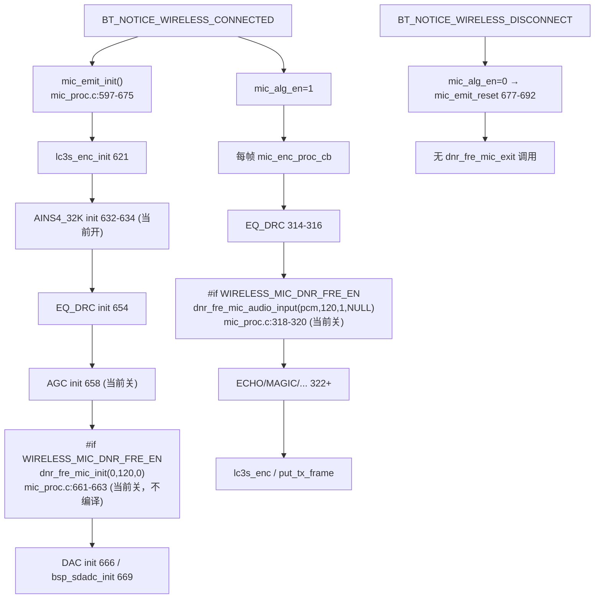
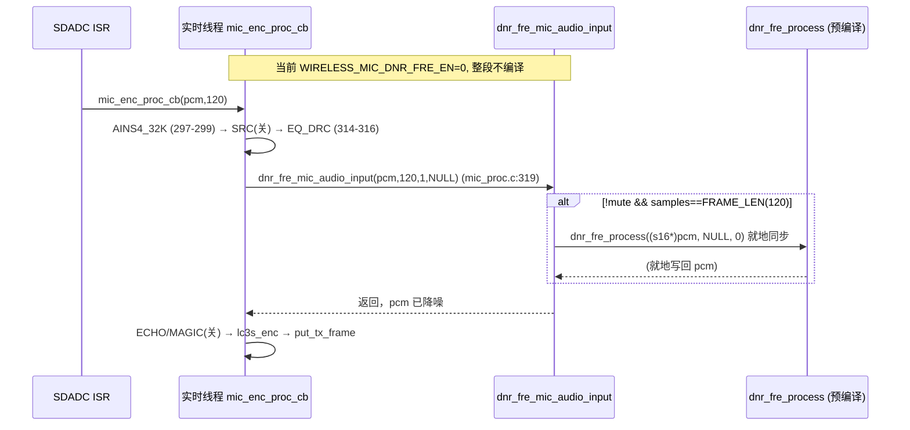

# 04 DNR_FRE 轻量降噪

> 本文梳理 DNR_FRE（轻量降噪）的配置宏、调用链、同步处理框架、参数结构体与生命周期，并与 AINS4_32K 异步框架对比。所有结论来自源码实际引用关系（文件、函数、行号）。DNR_FRE 包装源码（`modules/voice/dnr_fre.c`）已纳入仓库；内核 `dnr_fre_init`/`dnr_fre_process` 来自预编译库 `libs/`，内部数学不推测。

---

## 1. 配置宏与当前编译状态

### 1.1 宏定义链

DNR_FRE 有两个独立使能宏，经一个派生宏汇总：

- 设备端（TX） [config_ab5766_le_mic.h:114](../../../projects/microphone/config_ab5766_le_mic.h#L114)：

  ```c
  #define WIRELESS_MIC_DNR_FRE_EN                 0
  #define WIRELESS_MIC_DNR_FRE_DELAY              WIRELESS_MIC_DNR_FRE_EN * 720   //发射端DNR_FRE运算时间
  ```

- 适配器端（RX） [config_ab5766_le_mic.h:133](../../../projects/microphone/config_ab5766_le_mic.h#L133)：

  ```c
  #define ADAPTER_DNR_FRE_EN                      0               //接收端是否打开 DNR_FRE  (调试中)
  ```

- 派生汇总宏 [config_ab5766_le_mic.h:168](../../../projects/microphone/config_ab5766_le_mic.h#L168)：

  ```c
  #define DNR_FRE_EN                              (WIRELESS_MIC_DNR_FRE_EN || ADAPTER_DNR_FRE_EN)
  ```

`DNR_FRE_EN` 是包装层 [dnr_fre.c:21](../../../modules/voice/dnr_fre.c#L21) `#if DNR_FRE_EN` 的编译开关。当前 `0 || 0 = 0`，**整个 DNR_FRE 模块不编译**，运行时链不进入。本篇记录其设计供后续测试（P6）参考，但当前不是活跃通路。

### 1.2 两端使能宏的语义差异（重要）

`DNR_FRE_EN = TX宏 || RX宏` 只决定**是否编译**。但两端的**运行时接线**并不对称：

- **TX 侧**：`WIRELESS_MIC_DNR_FRE_EN` 既控制编译，也控制运行时调用——`mic_emit_init`（[mic_proc.c:661-663](../../../modules/wireless/mic_proc.c#L661-L663)）调 `dnr_fre_mic_init`，`mic_enc_proc_cb`（[mic_proc.c:318-320](../../../modules/wireless/mic_proc.c#L318-L320)）调 `dnr_fre_mic_audio_input`。两者都在 `#if WIRELESS_MIC_DNR_FRE_EN` 下。
- **RX 侧**：全仓 Grep 显示 `adapter_init`（[mic_proc.c:700-734](../../../modules/wireless/mic_proc.c#L700-L734)）**不调** `dnr_fre_mic_init`，`mic_dec_prco_cb`（[mic_proc.c:549-594](../../../modules/wireless/mic_proc.c#L549-L594)）**不调** `dnr_fre_mic_audio_input`。即 `ADAPTER_DNR_FRE_EN` 只让模块编译，**RX 侧无可见的每帧调用接线**。

如实记录：若仅置 `ADAPTER_DNR_FRE_EN=1` 而不动其它代码，DNR_FRE 模块被编译但 RX 运行时不会进入处理（无 init、无 per-frame input）。CLAUDE.md 测试纪律要求"按配置宏→条件编译→init→每帧 process→reset/exit→输入输出"确认调用链，此处 RX 侧 init/process 均缺失，属于接线未完成或由预编译库内部另接（不可见）。不得宣称 `ADAPTER_DNR_FRE_EN=1` 即 RX 降噪生效。后续 P6 测试若要做 RX DNR_FRE，需先确认这条接线是否存在于预编译库或需补包装调用。

---

## 2. 同步处理框架（与 AINS4_32K 的核心差异）

DNR_FRE 与 AINS4_32K 源码结构几乎同构（同为"mic_audio_input + proc_cb + tog_buf"模板），但 `TOG_BUF_EN` 取值相反，导致执行模型完全不同。

### 2.1 关键宏对比

| 项 | AINS4_32K ([ains4_32k.c](../../../modules/voice/ains4_32k.c)) | DNR_FRE ([dnr_fre.c](../../../modules/voice/dnr_fre.c)) |
|---|---|---|
| `TOG_BUF_EN` | 1（[23](../../../modules/voice/ains4_32k.c#L23)）异步 | 0（[23](../../../modules/voice/dnr_fre.c#L23)）同步 |
| `FRAME_LEN` | 240（[25](../../../modules/voice/ains4_32k.c#L25)） | 120（[25](../../../modules/voice/dnr_fre.c#L25)） |
| `PROCESS_OUT_SAMPLES` | 80（[26](../../../modules/voice/ains4_32k.c#L26)） | 120（[26](../../../modules/voice/dnr_fre.c#L26)） |
| 内核调用位置 | 算法线程 `ains4_32k_mic_proc_cb` | 实时线程 `dnr_fre_mic_audio_input` 内 |
| 帧延迟 | 有（乒乓异步） | 无（就地同步） |
| 资源（文件头注释） | code+rodata 12k / buf 11k | code+rodata 8.4k / buf 6.7k / time 500us·2.5ms@240M |

### 2.2 同步分支（当前生效分支）

`TOG_BUF_EN=0` 时，[dnr_fre_mic_audio_input](../../../modules/voice/dnr_fre.c#L56-L99) 的 `#else` 分支（[83-92](../../../modules/voice/dnr_fre.c#L83-L92)）生效：

```c
AT(.text.dnr_fre_proc)
void dnr_fre_mic_audio_input(u8 *ptr, u32 samples, int ch_mode, void *params)
{
    if (!dnr_fre_mic_cfg.mute /*&& wireless_cb.alg_en*/) {
#if TOG_BUF_EN
        ...  // 异步分支（不编译）
#else
        if (samples == FRAME_LEN) {                 // 120 点整帧才处理
        #if DNR_FRE_INFO_PRINT
            info_printf();
        #endif
            dnr_fre_process((s16 *)ptr, NULL, 0);   // 就地同步降噪
        }
#endif
    } else {
        if(dnr_fre_mic_cfg.callback) {
            dnr_fre_mic_cfg.callback((void *)ptr, samples, ch_mode, params);
        }
    }
}
```

要点：
1. **就地同步**：`dnr_fre_process((s16*)ptr, NULL, 0)` 直接对输入缓冲 `ptr` 就地处理，无乒乓、无 kick、无算法线程参与。处理完即返回，下游算法（ECHO/MAGIC 等）继续用同一 `pcm`。
2. **整帧门控**：`if (samples == FRAME_LEN)`（120）才调用内核。当前 TX 链每帧传入 `WIRELESS_MIC_SAMPLES_SELECT=120`（[mic_proc.c:319](../../../modules/wireless/mic_proc.c#L319)），恰等于 `FRAME_LEN`，条件满足。若某次传入非 120 点则该帧跳过降噪（不报错），这是可观测的帧边界约束。
3. **第三参数 `in_24bits_en=0`**：`dnr_fre_process(s16 *data, s32 *data_32bits, u8 in_24bits_en)`（[api_alg.h:131](../../../libs/api_alg.h#L131)）支持 24 bit 输入路径，此处传 `NULL, 0` 走 16 bit 路径，与 `mic_pcm_t=s16`（[dnr_fre.c:22](../../../modules/voice/dnr_fre.c#L22)）一致。

### 2.3 异步分支（当前不编译）

`TOG_BUF_EN=1` 分支（[61-82](../../../modules/voice/dnr_fre.c#L61-L82)）与 AINS4_32K 完全同构：`tog_buf_get`/`tog_buf_put`/`tog_buf_wr_toggle` + `dnr_fre_mic_proc_kick_start`。但 `TOG_BUF_EN=0` 决定了：
- 静态乒乓缓冲 `dnr_fre_tbuf`/`dnr_fre_cache_buf[240]`/`dnr_fre_tmp_buf[120]`/`dnr_fre_proc_ptr`（[29-33](../../../modules/voice/dnr_fre.c#L29-L33)）在 `#if TOG_BUF_EN` 内，**不编译、不分配**。
- `dnr_fre_mic_proc_cb`（[103-127](../../../modules/voice/dnr_fre.c#L103-L127)）的内核调用在 `#if TOG_BUF_EN` 内，不编译。其函数体在 `#else`（[196](../../../modules/voice/dnr_fre.c#L196)）提供空实现 `void dnr_fre_mic_proc_cb(void){}`，以满足 `thread_alg.c` 可能的链接引用。

> `thread_alg.c`（[4-31](../../../os/thread_alg.c#L4-L31)）当前**没有** `MSG_MIC_DNR_FRE` 分支（只有 AINS4_32K 与 ROBOTIZATION），且 `os_thread.h` 无 `dnr_fre_mic_proc_kick_start` 宏定义。即使把 `TOG_BUF_EN` 改 1，异步路径的 kick 宏与线程分发也缺失，需另行接线。如实记录：异步路径当前不可用，同步路径是设计选型。

---

## 3. 生命周期：init / process / reset



### 3.1 init

`mic_emit_init` 中 DNR_FRE 初始化位于 AGC（[658](../../../modules/wireless/mic_proc.c#L658)）之后、DAC（[666](../../../modules/wireless/mic_proc.c#L666)）之前（[mic_proc.c:661-663](../../../modules/wireless/mic_proc.c#L661-L663)）：

```c
#if WIRELESS_MIC_DNR_FRE_EN
    dnr_fre_mic_init(0, WIRELESS_MIC_SAMPLES_SELECT, 0);
#endif
```

参数：`sample_rate=0`、`samples=120`、`channel=0`（注意 AINS4_32K 传 `channel=1`，DNR_FRE 传 `0`，这是源码实际差异，不从 channel 值推断内部声道处理）。

`dnr_fre_mic_init`（[dnr_fre.c:135-147](../../../modules/voice/dnr_fre.c#L135-L147)）：
```c
memset(&dnr_fre_mic_cfg, 0, sizeof(dnr_fre_mic_cfg));
#if TOG_BUF_EN
    tog_buf_init(...);   // 不编译
#endif
dnr_fre_mic_param_set(0);   // 设默认参数 + dnr_fre_init
```

### 3.2 process

`mic_enc_proc_cb` 中 DNR_FRE 位于 EQ_DRC（[314-316](../../../modules/wireless/mic_proc.c#L314-L316)）之后、ECHO 非 32k 分支（[322-324](../../../modules/wireless/mic_proc.c#L322-L324)）之前（[mic_proc.c:318-320](../../../modules/wireless/mic_proc.c#L318-L320)）：

```c
#if WIRELESS_MIC_DNR_FRE_EN
    dnr_fre_mic_audio_input((u8 *)pcm, WIRELESS_MIC_SAMPLES_SELECT, 1, NULL);
#endif
```

即 TX 链顺序：AINS4_32K → SRC → EQ_DRC → **DNR_FRE** → ECHO → MAGIC → ROBOTIZATION → ROOM_REVERB → AGC。DNR_FRE 在 EQ_DRC 之后，意味着它处理的是已过 EQ/DRC 的信号。此顺序对降噪效果有影响（先 EQ 再降噪 vs 先降噪再 EQ），属于可观测设计，不从顺序推断最优性。

### 3.3 reset / exit

`mic_emit_reset`（[mic_proc.c:677-692](../../../modules/wireless/mic_proc.c#L677-L692)）**不调** `dnr_fre_mic_exit`。`dnr_fre_mic_exit`（[dnr_fre.c:149-153](../../../modules/voice/dnr_fre.c#L149-L153)）为空函数体，全仓无调用点（与 AINS4_32K 同模式）。TX 侧算法资源靠断开+降频+整体复位回收。

### 3.4 mute / callback 未接

- `dnr_fre_mic_mute_set`/`get`（[dnr_fre.c:176-194](../../../modules/voice/dnr_fre.c#L176-L194)）：全仓除 `dnr_fre.c` 自身外无外部调用点（[145](../../../modules/voice/dnr_fre.c#L145) 有一行被注释的 `dnr_fre_mic_mute_set(1)`）。内部 mute 路径未接控制面，运行时静音由上层 `mic_enc.mute_en` 实现。
- `dnr_fre_mic_output_callback_set`（[129-133](../../../modules/voice/dnr_fre.c#L129-L133)）：全仓无外部调用点，`callback` 保持 NULL，`if(callback)` 分支不进入。输出靠就地回填（同步分支直接处理 `ptr`，无需 memcpy）。

---

## 4. 参数结构体与默认值

### 4.1 dnr_fre_cb_t

[api_alg.h:108-131](../../../libs/api_alg.h#L108-L131)：

```c
///dnr fre 算法结构体以及相关API声明
typedef struct {
    s16 denoiseBound;
    s32 overdrive;
    u8  smooth_en;
    s64 enr_thres;
    s16 smooth_v;
    u8  enr_mean_max_en;
    s16 music_lev;
    s32 enr_nr_thr;
    s16 low_fre_range;
    s16 prior_opt_idx;
    s32 in_attack;
    s32 in_release;
    s32 fs;
    s32 noise_init;
} dnr_fre_cb_t;
void dnr_fre_init(dnr_fre_cb_t *dnr_fre_cb);
int  dnr_fre_process(s16 *data, s32 *data_32bits, u8 in_24bits_en);
```

### 4.2 dnr_fre_mic_param_set 默认参数

[dnr_fre_mic_param_set](../../../modules/voice/dnr_fre.c#L155-L174)（在 `dnr_fre_mic_init` [142](../../../modules/voice/dnr_fre.c#L142) 调用）：

```c
void dnr_fre_mic_param_set(s16 dnr_fre_nt)
{
    memset((uint8_t *)&dnr_fre_cb, 0, sizeof(dnr_fre_cb));
    dnr_fre_cb.overdrive       = 32768;
    dnr_fre_cb.smooth_en       = 1;
    dnr_fre_cb.enr_thres       = 0;
    dnr_fre_cb.prior_opt_idx   = 10;
    dnr_fre_cb.low_fre_range   = 0;
    dnr_fre_cb.smooth_v        = 31129;        // 注释: 0.9f
    dnr_fre_cb.music_lev       = 11;
    dnr_fre_cb.denoiseBound    = 16384;         // 注释: 20*log10(denoiseBound/32768), 16384 相当于噪声降 6dB
    dnr_fre_cb.enr_nr_thr      = -56;          // 注释: dB 门限, 低于此门限为噪声
    dnr_fre_cb.in_attack       = 32768;        // 注释: Q15 ms 检测 attack 时间, peak, 32768=1ms
    dnr_fre_cb.in_release      = 3276800;      // 注释: Q15 ms 检测 release 时间, peak, 32768=1ms → 100ms
    dnr_fre_cb.fs              = 48000;
    dnr_fre_cb.noise_init      = 1;
    dnr_fre_init(&dnr_fre_cb);
}
```

| 字段 | 默认值 | 包装层注释（可记录，不展开内部数学） |
|---|---|---|
| `overdrive` | 32768 | 过驱动量 |
| `smooth_en` | 1 | 平滑使能 |
| `enr_thres` | 0 | 能量阈值 |
| `prior_opt_idx` | 10 | 先验选项索引 |
| `low_fre_range` | 0 | 低频范围 |
| `smooth_v` | 31129 | 注释 `0.9f`，平滑系数 |
| `music_lev` | 11 | 音乐电平 |
| `denoiseBound` | 16384 | 注释：降噪量 `20*log10(denoiseBound/32768)`，16384 ≈ 噪声降 6 dB |
| `enr_nr_thr` | -56 | 注释：dB 门限，低于此为噪声 |
| `in_attack` | 32768 | 注释：Q15 ms，peak 检测 attack，`32768=1ms` → 1 ms |
| `in_release` | 3276800 | 注释：Q15 ms，peak 检测 release，`32768=1ms` → 100 ms |
| `fs` | 48000 | 采样率 |
| `noise_init` | 1 | 噪声初始化标志 |

`enr_mean_max_en` 字段未在 `param_set` 中赋值（memset 0）。入参 `dnr_fre_nt` 未被函数体使用，调用方传 `0`。

> `denoiseBound`/`enr_nr_thr`/`in_attack`/`in_release` 的注释给出了可核对的物理含义（6 dB、-56 dB、1 ms、100 ms）。这是包装层注释而非内核源码，记录为"厂商注释的可观测语义"，不据此推断内部 NR 曲线数学。

---

## 5. 段放置与资源

[dnr_fre.c:5-19](../../../modules/voice/dnr_fre.c#L5-L19) 文件头：

```
AT(.buf.dnr_fre);
AT(.rodata.dnr_fre)
AT(.text.dnr_fre_proc)
AT(.text.dnr_fre_init)
注意 mic_pcm_t 实际配置类型
code + rodata : 8.4k
buf           : 6.7k
time          : 500us /2.5ms   240M
```

实际 AT 标注：`AT(.text.dnr_fre_proc)`（[56](../../../modules/voice/dnr_fre.c#L56) audio_input、[102](../../../modules/voice/dnr_fre.c#L102) proc_cb、[42](../../../modules/voice/dnr_fre.c#L42) info_printf）、`AT(.text.dnr_fre_init)`（[135](../../../modules/voice/dnr_fre.c#L135)）、`AT(.text.dnr_fre_exit)`（[149](../../../modules/voice/dnr_fre.c#L149)）、`AT(.text.dnr_fre_set)`（[129](../../../modules/voice/dnr_fre.c#L129)）、`AT(.text.dnr_fre_set.param)`（[155](../../../modules/voice/dnr_fre.c#L155)）、`AT(.text.dnr_fre_set.mute)`/`AT(.text.dnr_fre_get.mute)`（[176](../../../modules/voice/dnr_fre.c#L176)/[190](../../../modules/voice/dnr_fre.c#L190)）、`AT(.buf.dnr_fre)`（静态变量）。文件头"time 500us/2.5ms @240M"暗示单帧预算约 500 µs，与 [config:115](../../../projects/microphone/config_ab5766_le_mic.h#L115) `WIRELESS_MIC_DNR_FRE_DELAY=720`（µs 量级预算）同阶。

---

## 6. 完整调用链（TX 侧，当前关闭）



---

## 7. 预编译库边界

| 项目 | 来源 | 可记录 | 不可推测 |
|---|---|---|---|
| `dnr_fre_init(dnr_fre_cb_t *)` | [api_alg.h:130](../../../libs/api_alg.h#L130) | API、参数字段、调用时机（init 一次性） | 内部状态/噪声估计初始化 |
| `dnr_fre_process(s16*, s32*, u8)` | [api_alg.h:131](../../../libs/api_alg.h#L131) | API、16/24bit 路径、120 点就地、返回 int | 谱减/维纳/MMSE 等内部数学 |
| `tog_buf_*` | [api_alg.h:18-27](../../../libs/api_alg.h#L18-L27) | 乒乓语义（仅异步分支，当前不编译） | 计数实现 |

`dnr_fre_process` 内核在 `libs/` 预编译库，源码不可见。文件头"软件 dnn_L1 处理模块"（[dnr_fre.c:7](../../../modules/voice/dnr_fre.c#L7)）为厂商命名提示（与 AINS4_32K 文件头同文案），不作为算法已验证结论。本节只记录输入输出与调用时机。

---

## 8. 知识点小结

1. **同步 vs 异步**：DNR_FRE `TOG_BUF_EN=0` 同步就地处理，无帧延迟；AINS4_32K `TOG_BUF_EN=1` 异步乒乓，有帧延迟。二者源码同构但执行模型相反，是同一包装模板的两种配置。
2. **当前关闭**：`WIRELESS_MIC_DNR_FRE_EN=0` 且 `ADAPTER_DNR_FRE_EN=0`，`DNR_FRE_EN=0`，模块不编译、不进入运行时链。本篇为设计记录。
3. **两端不对称接线**：`ADAPTER_DNR_FRE_EN` 只控制编译，RX 侧（`adapter_init`/`mic_dec_prco_cb`）无可见的 init/process 调用。置 `ADAPTER_DNR_FRE_EN=1` 不会让 RX 自动降噪，需先确认接线。
4. **整帧门控**：同步分支 `if (samples == FRAME_LEN)`（120）才处理，非整帧跳过。当前 TX 每帧恰 120 点，满足。
5. **链路位置**：DNR_FRE 在 EQ_DRC 之后、ECHO 之前（[mic_proc.c:318-320](../../../modules/wireless/mic_proc.c#L318-L320)），处理已过 EQ/DRC 的信号。
6. **参数可观测语义**：`denoiseBound=16384`（≈6 dB）、`enr_nr_thr=-56 dB`、`in_attack=1ms`、`in_release=100ms`、`fs=48000`、`noise_init=1`，均为包装层注释给出的物理量，可作测试观测参考，非内核数学证明。
7. **reset 不对称**：`mic_emit_reset` 不调 `dnr_fre_mic_exit`（空函数，无调用点），与 TX 整体设计一致。
8. **mute/callback 未接**：内部 mute 与 callback 均无外部调用点，运行时静音靠上层 `mic_enc.mute_en`，输出靠就地处理。
9. **异步路径不可用**：`TOG_BUF_EN=1` 分支虽存在源码，但 `os_thread.h` 无 `dnr_fre_mic_proc_kick_start` 宏、`thread_alg.c` 无 `MSG_MIC_DNR_FRE` 分支，改 `TOG_BUF_EN=1` 需另接 kick/分发，当前不可用。
10. **内核边界**：`dnr_fre_init`/`dnr_fre_process` 来自 `libs/`，只记 API、参数、时机、输入输出，不推测内部 NR 数学。"dnn_L1"为厂商命名提示。

---

## 9. 延伸阅读

- [00 算法总览与全局调用关系.md](00_算法总览与全局调用关系.md)（TX 算法链全貌）
- [01_系统初始化与角色调度.md](01_系统初始化与角色调度.md)（连接驱动生命周期）
- [02_TX上行采集与编码骨架.md](02_TX上行采集与编码骨架.md)（mic_enc_proc_cb 每帧链、mic_emit_init/reset）
- [03_AINS4_32K降噪.md](03_AINS4_32K降噪.md)（异步乒乓框架对比，同模板 TOG_BUF_EN=1）
- [13_RX下行解码与MIX_DRC混音.md](13_RX下行解码与MIX_DRC混音.md)（RX 侧 adapter_init/mic_dec_prco_cb，确认 DNR_FRE RX 接线缺失）
