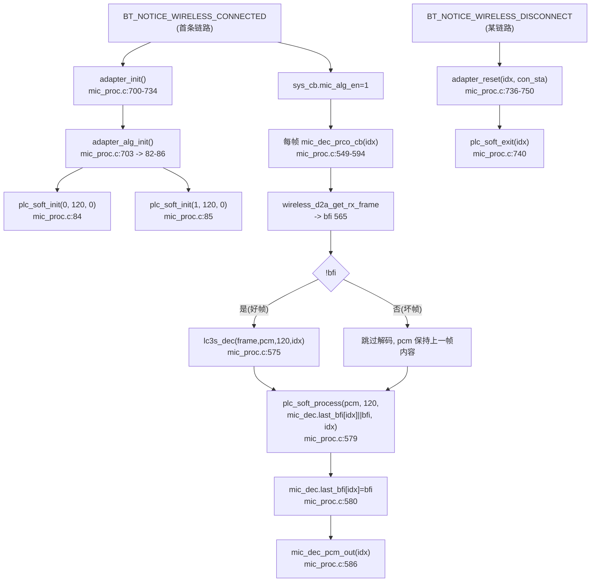
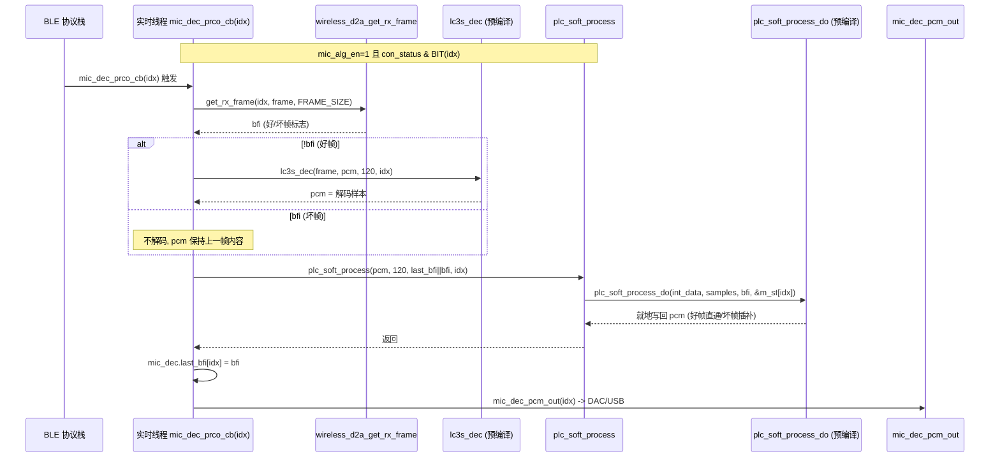

# 05 PLC 丢包隐藏

> 本文梳理 PLC（Packet Loss Concealment，丢包隐藏）的配置、调用链、双路状态结构、参数组选择与生命周期。所有结论来自源码实际引用关系（文件、函数、行号）。PLC 包装源码（`modules/voice/plc_soft.c`、`plc_soft_api.h`）已纳入仓库；内核 `plc_soft_process_do`/`plc_soft_init_do`/`plc_soft_exit_do` 来自预编译库 `libs/`（见 `map.txt` 符号），内部策略不推测。

---

## 1. 配置与编译状态

### 1.1 无独立使能宏（固定模块）

与 AINS4_32K/DNR_FRE 不同，PLC **没有独立的编译期使能宏**。`modules/voice/plc_soft.c` 与 `plc_soft_api.h` 全文不被任何 `#if xxx_EN` 包裹，`adapter_alg_init()`（[mic_proc.c:82-86](../../../modules/wireless/mic_proc.c#L82-L86)）也无条件地调 `plc_soft_init`。即：

- PLC 是 **RX/Adapter 侧的固定模块**，只要进入 Adapter 角色、建立无线连接，就会初始化并每帧运行。
- PLC 仅作用于 RX 解码侧，**TX 侧无 PLC**（`mic_emit_init`/`mic_enc_proc_cb` 不含 `plc_soft_*` 调用，全仓 Grep 确认）。这与 PLC 的语义一致：丢包发生在下行（TX→RX 传输），隐藏也在下行解码后做。

### 1.2 采样率与帧参数

PLC 参数随采样率分组，但入口参数来自统一配置：

- `WIRELESS_MIC_SAMPLE_RATE_SELECT = SAMPLE_RATE_48K`（[config:77](../../../projects/microphone/config_ab5766_le_mic.h#L77)）。
- `WIRELESS_MIC_SAMPLES_SELECT = 120`（[config:78](../../../projects/microphone/config_ab5766_le_mic.h#L78)），即 `FRAMESZ`（[plc_soft_api.h:6](../../../modules/voice/plc_soft_api.h#L6)）。
- `adapter_alg_init` 调 `plc_soft_init(0/1, WIRELESS_MIC_SAMPLES_SELECT, WIRELESS_MIC_SAMPLE_RATE_SELECT)`（[mic_proc.c:84-85](../../../modules/wireless/mic_proc.c#L84-L85)），传入 `pkt_len=120`、`sample_rate=SAMPLE_RATE_48K=0`。

采样率枚举（[plc_soft_api.h:86-91](../../../modules/voice/plc_soft_api.h#L86-L91)，与 [config_define.h:42-45](../../../projects/microphone/config_define.h#L42-L45) 同值）：

| 枚举 | 值 |
|---|---|
| `SAMPLE_RATE_48K` | 0 |
| `SAMPLE_RATE_32K` | 1 |
| `SAMPLE_RATE_24K` | 2 |
| `SAMPLE_RATE_16K` | 3 |
| `SAMPLE_RATE_12K` | 4 |
| `SAMPLE_RATE_8K` | 5 |

---

## 2. 调用链：init / process / exit



### 2.1 init：adapter_alg_init

[adapter_alg_init()](../../../modules/wireless/mic_proc.c#L82-L86)：

```c
void adapter_alg_init(void)
{
    plc_soft_init(0, WIRELESS_MIC_SAMPLES_SELECT, WIRELESS_MIC_SAMPLE_RATE_SELECT);
    plc_soft_init(1, WIRELESS_MIC_SAMPLES_SELECT, WIRELESS_MIC_SAMPLE_RATE_SELECT);
}
```

`adapter_alg_init` 在 `adapter_init`（[703](../../../modules/wireless/mic_proc.c#L703)）最前面调用，先于 `lc3s_dec_init`（[719](../../../modules/wireless/mic_proc.c#L719)）、`mix_drc_init`（[722](../../../modules/wireless/mic_proc.c#L722)）、`dac0_out_init`（[729](../../../modules/wireless/mic_proc.c#L729)）。两路（idx=0/1）独立初始化，对应一拖二场景。

`plc_soft_init`（[plc_soft.c:18-53](../../../modules/voice/plc_soft.c#L18-L53)）：
```c
plc_proc_t *st = &m_st[idx];
memset((u8 *)st, 0, sizeof(plc_proc_t));
if (sample_rate >= SAMPLE_RATE_16K) {      // 16k/12k/8k 走 _8K 参数组
    st->pitch_min = PITCH_MIN_8K; ... 8K 系列赋值 ...
} else {                                    // 48k/32k/24k 走默认参数组
    st->pitch_min = PITCH_MIN; ... 默认系列赋值 ...
}
st->history_ptr = st->history;
st->pitchbuf_ptr = st->pitchbuf;
st->lastq_ptr = st->lastq;
framesz = pkt_len;
plc_soft_init_do(st, pkt_len);             // 预编译内核
```

> **参数组命名陷阱**：源码以 `if (sample_rate >= SAMPLE_RATE_16K)`（[24](../../../modules/voice/plc_soft.c#L24)）分支，`>=3` 即 16k/12k/8k 走 `*_8K` 后缀参数组（`PITCH_MIN_8K` 等），48k/32k/24k 走无后缀默认组。**默认组上方注释写 `//48k`**（[plc_soft_api.h:14](../../../modules/voice/plc_soft_api.h#L14)），`_8K` 组并非仅用于 8k 而是用于全部低采样率。当前 48k 传入 `0`，走 else（默认/48k 组），符合。不从 `_8K` 命名反推 8k 专用。

### 2.2 process：每帧 mic_dec_prco_cb

[mic_dec_prco_cb(idx)](../../../modules/wireless/mic_proc.c#L549-L594) 核心段（[562-586](../../../modules/wireless/mic_proc.c#L562-L586)）：

```c
if(sys_cb.mic_alg_en) {
    u8 con_status = ble_con_get_status();
    if(con_status & BIT(idx)) {
        bool bfi = wireless_d2a_get_rx_frame(idx, mic_dec.frame, WIRELESS_MIC_FRAME_SIZE);  // 565
        if(!bfi) {                                                                         // 567
            // CODEC_LC3S:
            lc3s_dec(mic_dec.frame, pcm, samples, idx);                                    // 575
        }
        plc_soft_process(pcm, samples, mic_dec.last_bfi[idx]||bfi, idx);                   // 579
        mic_dec.last_bfi[idx] = bfi;                                                       // 580
    }
} else {
    memset(pcm, 0x00, samples*2);
}
mic_dec_pcm_out(idx);                                                                     // 586
```

逐行说明：
1. **总闸 `mic_alg_en`**（[562](../../../modules/wireless/mic_proc.c#L562)）：未连接/已断开时不处理，`pcm` 清零输出静音。这与全局生命周期一致（见 [01_系统初始化与角色调度.md](01_系统初始化与角色调度.md) 第 5 节）。
2. **链路有效位**（[564](../../../modules/wireless/mic_proc.c#L564)）：`con_status & BIT(idx)` 确认本路仍在连接，才取帧/解码/PLC。
3. **取帧与 bfi**（[565](../../../modules/wireless/mic_proc.c#L565)）：`wireless_d2a_get_rx_frame` 返回 `bfi`（bad frame indicator）。`bfi=true` 表示该帧丢失/坏。
4. **条件解码**（[567](../../../modules/wireless/mic_proc.c#L567)）：仅 `!bfi`（好帧）才调 `lc3s_dec` 把 `frame` 解成 `pcm`；坏帧不解码，`pcm` 内容保持上一帧（或上次 PLC 输出）。
5. **PLC 输入标志**（[579](../../../modules/wireless/mic_proc.c#L579)）：第三参数 `mic_dec.last_bfi[idx]||bfi`，即"上一帧坏 **或** 本帧坏"。无论好坏帧都调 `plc_soft_process`，由内核决定是否插补。
6. **更新 last_bfi**（[580](../../../modules/wireless/mic_proc.c#L580)）：保存本帧 bfi 供下一帧决策。
7. **输出**（[586](../../../modules/wireless/mic_proc.c#L586)）：`mic_dec_pcm_out(idx)` 把处理后的 PCM 送往 DAC/USB。

### 2.3 exit：adapter_reset

[adapter_reset(idx, con_sta)](../../../modules/wireless/mic_proc.c#L736-L750)（[740](../../../modules/wireless/mic_proc.c#L740)）调 `plc_soft_exit(idx)`：

```c
void adapter_reset(u8 idx, u8 con_sta)
{
    mic_dec_reset(idx);          // 739: last_bfi[idx]=0 + 清 pcm buf
    plc_soft_exit(idx);          // 740
    wireless_cmd_reset(idx);
    m_lc3s_dec_exit(idx);
    if(con_sta == 0) {           // 最后一条链路
        mic_dec.obuf_off = 0;
        dac0_out_exit();
    }
}
```

`plc_soft_exit`（[plc_soft.c:55-64](../../../modules/voice/plc_soft.c#L55-L64)）是"复位式退出"：

```c
void plc_soft_exit(u8 idx)
{
    plc_proc_t *st = &m_st[idx];
    st->enable = false;
    delay_5ms(2);                // 等一帧时间，确保 disable 时上一帧已处理完
    plc_soft_init_do(st, framesz);   // 重新 init 回到初始状态
}
```

`delay_5ms(2)`（约 10 ms）保证 disable 期间不会与正在处理的帧冲突，随后调 `plc_soft_init_do` 把状态复位。注意 `exit` 后没有再调 `plc_soft_init` 的参数组赋值分支——它复用 `framesz`（[plc_soft.c:7](../../../modules/voice/plc_soft.c#L7) 静态 `u8 framesz`，在 `plc_soft_init` 的 [51](../../../modules/voice/plc_soft.c#L51) 记录）做纯内核复位。如实记录：`framesz` 是文件级静态变量，两路共用，第二次 `plc_soft_init(1,...)` 会覆盖 `framesz`，但两路 `pkt_len` 相同（都 120），无实际冲突。

---

## 3. 双路状态结构

### 3.1 静态状态数组

[plc_soft.c:5-7](../../../modules/voice/plc_soft.c#L5-L7)：

```c
#define CH_NUM          2    // 支持的通道数
static plc_proc_t m_st[CH_NUM] AT(.buf.plc_buf);
static u8 framesz;
```

`CH_NUM=2` 与 `WIRELESS_CON_LINK_NB=2`（[config:76](../../../projects/microphone/config_ab5766_le_mic.h#L76)）一致，支持一拖二。每路独立 `plc_proc_t` 状态，`idx` 为链路索引。状态数组置于 `AT(.buf.plc_buf)` 段。

### 3.2 plc_proc_t 结构体

[plc_soft_api.h:93-133](../../../modules/voice/plc_soft_api.h#L93-L133)：

```c
typedef struct {
    u16 erasecnt;          // 连续丢帧计数
    s16 poverlap;          // 基音重叠
    s16 poffset;           // 基音周期内偏移
    s16 pitch;             // 基音估计
    s16 pitchblen;         // 当前基音缓冲长度
    s32 PitchCnt;
    s32 overlapcnt;
    s16 *histrybufend;     // history 缓冲尾
    s16 *histrybufstart;   // history 缓冲头
    s16 *pitchbufend;      // pitch 缓冲尾
    s16 *pitchbufstart;    // pitch 缓冲头
    s16 *outbuf;           // 语音周期输出缓冲
    s16 *history_ptr;
    s16 *pitchbuf_ptr;
    s16 *lastq_ptr;

    s16 al[LPCO+1];        // 保存的最后 1/4 波长 (LPCO=8)
    s16 stsyml[LPCO];
    s32 rl[1+LPCO];
    s16 ltring[OVERLALEN];         // 临时环形缓冲 (OVERLALEN=52)
    s16 ring[OVERLALEN+LPCO];      // 临时环形缓冲 (52+8=60)
    s16 *pring;
    bool enable;
    bool lats_save_bfi;

    u16 pitch_min;
    u16 pitch_max;
    u16 pitchdiff;
    u16 poverlapmax;
    u16 historylen;
    u8  ndec;
    u16 corrlen;
    u16 corrbuflen;
    u16 corrminpower;
    u16 eoverlapincr;
    s16 history[HISTORYLEN+FRAMESZ+OVERLALEN];   // history 缓冲
    s16 pitchbuf[HISTORYLEN];                     // 基音周期缓冲
    s16 lastq[POVERLAPMAX];                      // 保存的最后 1/4 波长
} plc_proc_t;
```

字段分类：
- **算法运行态**：`erasecnt`（连续丢帧计数）、`pitch`（基音估计）、`poverlap`/`poffset`（基音重叠与偏移）、`PitchCnt`/`overlapcnt`（计数器）、`enable`/`lats_save_bfi`。
- **缓冲指针**：`history_ptr`/`pitchbuf_ptr`/`lastq_ptr`（init 时指向静态缓冲）。
- **静态缓冲**：`history[...]`（历史，含 `HISTORYLEN+FRAMESZ+OVERLALEN`）、`pitchbuf[HISTORYLEN]`、`lastq[POVERLAPMAX]`、`ltring[OVERLALEN]`、`ring[OVERLALEN+LPCO]`、`al[LPCO+1]`、`stsyml[LPCO]`、`rl[1+LPCO]`。
- **参数组**（init 时按采样率赋值）：`pitch_min`/`pitch_max`/`pitchdiff`/`poverlapmax`/`historylen`/`ndec`/`corrlen`/`corrbuflen`/`corrminpower`/`eoverlapincr`。

> 结构体字段命名（`pitch`/`history`/`pitchbuf`/`lastq`/`al`/`LPCO`/`overlap`）提示内核涉及基音估计、历史缓冲、LPC（线性预测，阶数 `LPCO=8`）、OLA（overlap-add，`OVERLALEN=52`）等概念，但**这些只是字段名与宏名，不是已验证的内部算法**。`plc_soft_process_do` 内核在预编译库（`map.txt:2478`），策略不可读，不据此断言具体用基音预测/波形重复/交叉渐变中的哪一种。记录为"字段命名暗示的可观测线索"。

---

## 4. 参数组：48k 默认组与 _8K 组

### 4.1 48k 默认组（当前生效）

[plc_soft_api.h:13-30](../../../modules/voice/plc_soft_api.h#L13-L30)：

```c
//48k
#if !ADAPTER_USB_MIC_RX_EN
#define PITCH_MIN 160       // minimum allowed pitch, 200 Hz   //480 ->300 Hz
#define PITCH_MAX 650       // maximum allowed pitch, 66 Hz    //480 ->100 Hz
#else
#define PITCH_MIN 180
#define PITCH_MAX 460
#endif
#define PITCHDIFF      (PITCH_MAX - PITCH_MIN)
#define POVERLAPMAX    (PITCH_MAX >> PLC_OLA_WIN)     // PLC_OLA_WIN=2
#define HISTORYLEN     (PITCH_MAX * 3 + FRAMESZ)
#define NDEC           4                               // 2:1 decimation
#define CORRLEN        280                             // multiple of 8, correlation length
#define CORRBUFLEN     (CORRLEN + PITCH_MAX)
#define CORRMINPOWER   250                             // minimum power
#define EOVERLAPINCR   (64)                            // end OLA increment per frame, 4 ms
```

当前 `ADAPTER_USB_MIC_RX_EN=0`（[config:123](../../../projects/microphone/config_ab5766_le_mic.h#L123)），故 `PITCH_MIN=160`/`PITCH_MAX=650`。注释 `//480 ->300 Hz` 暗示这些值是相对于 480 点某基准的缩放（48k 下 160 点 ≈ 300 Hz 基音下限），属厂商注释的可观测语义，不展开内部换算。

`ADAPTER_USB_MIC_RX_EN` 分支：若置 1，`PITCH_MIN=180`/`PITCH_MAX=460`，基音搜索范围收窄。这是 USB Mic 开启对 PLC 参数的副作用。**按 CLAUDE.md 测试纪律，算法 A/B 测试不改动 USB 相关宏**；此处仅记录该耦合关系，不在算法测试中切换 `ADAPTER_USB_MIC_RX_EN` 来观察 PLC。

### 4.2 _8K 组（低采样率，当前不生效）

[plc_soft_api.h:32-41](../../../modules/voice/plc_soft_api.h#L32-L41)：

```c
#define PITCH_MIN_8K      50
#define PITCH_MAX_8K      180
#define PITCHDIFF_8K      (PITCH_MAX_8K - PITCH_MIN_8K)
#define POVERLAPMAX_8K    (PITCH_MAX_8K >> PLC_OLA_WIN)
#define HISTORYLEN_8K     (PITCH_MAX_8K * 3 + FRAMESZ)
#define NDEC_8K           4
#define CORRLEN_8K        64
#define CORRBUFLEN_8K     (CORRLEN_8K + PITCH_MAX_8K)
#define CORRMINPOWER_8K   64
#define EOVERLAPINCR_8K   (32)
```

`_8K` 后缀组用于 `sample_rate >= SAMPLE_RATE_16K`（即 16k/12k/8k）。当前 48k 不进入此分支。源码还保留了 32k/24k/16k 的注释掉参数组（[plc_soft_api.h:43-80](../../../modules/voice/plc_soft_api.h#L43-L80)），属历史配置，当前不编译，仅作完整性记录。

### 4.3 全局常量

[plc_soft_api.h:5-8](../../../modules/voice/plc_soft_api.h#L5-L8)、[82-84](../../../modules/voice/plc_soft_api.h#L82-L84)：

```c
#define PLC_OLA_WIN    2     // smart 下为 2（内存优化），非 smart 应为 0
#define FRAMESZ        120   // 帧长
#define FRAMENUM        5    // 3 帧为分界
#define LPCO           8     // LPC 阶数
#define HAMWINDLEN     FRAMESZ   // 汉明窗长
#define OVERLALEN      52
#define ATTENFAC_DIVIDER 5
#define ATTENINCR      1
```

`FRAMESZ=120` 与 `WIRELESS_MIC_SAMPLES_SELECT=120` 一致；`plc_soft_process` 注释（[plc_soft.c:11](../../../modules/voice/plc_soft.c#L11)）也写"samples 长度必须与 FRMESIZE 匹配"。当前每帧传 120，匹配。

---

## 5. 段放置与资源

`plc_soft.c` 的 AT 标注：
- `AT(.buf.plc_buf)`：`m_st[2]` 状态数组（[plc_soft.c:6](../../../modules/voice/plc_soft.c#L6)）。每个 `plc_proc_t` 含 `history[HISTORYLEN+FRAMESZ+OVERLALEN]`（HISTORYLEN=650*3+120=2070，加 120+52 → ~2242 个 s16 ≈ 4.5 KB）+ `pitchbuf[2070]`（~4.1 KB）+ `lastq[162]` + 其它，单路约 9 KB，两路约 18 KB。
- `AT(.text.plc_proc.pro)`：`plc_soft_process`（[10](../../../modules/voice/plc_soft.c#L10)）。
- `AT(.text.plc_init)`：`plc_soft_init`（[18](../../../modules/voice/plc_soft.c#L18)）。
- `AT(.text.plc_exit)`：`plc_soft_exit`（[55](../../../modules/voice/plc_soft.c#L55)）。

`map.txt` 符号（验证内核来自预编译库）：
- `plc_soft_process` @ `0x00017800`（[map.txt:2475](../../../projects/microphone/Output/bin/map.txt#L2475)）。
- `plc_soft_process_do` @ `0x00017ace`（[map.txt:2478](../../../projects/microphone/Output/bin/map.txt#L2478)，来自 `plc_soft.o`）。
- `plc_soft_init` @ `0x1000c90a`（[map.txt:3210](../../../projects/microphone/Output/bin/map.txt#L3210)）。
- `plc_soft_exit` @ `0x1000c9e6`（[map.txt:3213](../../../projects/microphone/Output/bin/map.txt#L3213)）。
- `plc_soft_init_do` @ `0x10011062`（[map.txt:3853](../../../projects/microphone/Output/bin/map.txt#L3853)）。

`plc_soft_process`（0x00017800，前 64K RAM 区）与 `plc_soft_process_do`（0x00017ace，紧随其后）地址相邻，说明包装层 `plc_soft_process` 内联调用内核 `plc_soft_process_do`；而 `init`/`exit`/`init_do` 在 0x1000c... 高地址（Flash/ROM 区）。`plc_soft_process_do` 是实时每帧热路径。

---

## 6. 完整调用链（RX 侧，当前运行）



---

## 7. 预编译库边界

| 项目 | 来源 | 可记录 | 不可推测 |
|---|---|---|---|
| `plc_soft_init_do(st, pkt_len)` | [plc_soft_api.h:136](../../../modules/voice/plc_soft_api.h#L136)，符号 `map.txt:3853` | API、参数组赋值时机、`pkt_len=120` | 内部状态初始化细节 |
| `plc_soft_process_do(int_data, samples, bfi, st)` | [plc_soft_api.h:137](../../../modules/voice/plc_soft_api.h#L137)，符号 `map.txt:2478` | API、就地处理、bfi 输入语义、120 点 | 基音预测/波形重复/OLA 内部策略 |
| `plc_soft_exit_do(st)` | [plc_soft_api.h:138](../../../modules/voice/plc_soft_api.h#L138) | 声明存在 | 实现细节（包装层 exit 实际调 `init_do` 复位） |

`plc_soft_process_do` 是 PLC 真正内核，源码不可读。结构体字段名（`pitch`/`history`/`pitchbuf`/`lastq`/`al`/`LPCO`/`overlap`）与宏名（`PITCH_MIN/MAX`/`CORRLEN`/`EOVERLAPINCR`）暗示基音估计 + 相关 + OLA 的技术线索，但**不据此断言确切算法**。CLAUDE.md 测试纪律：PLC 测试用"受控遮挡/拉远制造弱信号 + 听爆音/重复音/短静音/恢复"观测，不推断内部策略。

---

## 8. 知识点小结

1. **RX 侧固定模块**：PLC 无独立使能宏，Adapter 角色 + 连接后必运行；TX 侧无 PLC。这是与 AINS4_32K/DNR_FRE 的根本差异。
2. **bfi 语义**：`wireless_d2a_get_rx_frame` 返回 `bfi`（坏帧标志），`!bfi` 才 `lc3s_dec`；PLC 第三参数 `last_bfi||bfi`，"上一帧坏或本帧坏"时触发隐藏决策，由内核决定是否插补。
3. **好坏帧都进 PLC**：`plc_soft_process` 无条件调用（[579](../../../modules/wireless/mic_proc.c#L579)），好帧时内核通常直通/更新历史，坏帧时插补。不在包装层做好坏帧分支。
4. **双路独立**：`m_st[CH_NUM=2]`，一拖二两路独立状态与历史缓冲，`idx` 区分。`CH_NUM` 与 `WIRELESS_CON_LINK_NB` 必须一致。
5. **参数组陷阱**：`if (sample_rate >= SAMPLE_RATE_16K)` 走 `_8K` 后缀组（用于 16k/12k/8k），48k/32k/24k 走无后缀默认组（注释标 `//48k`）。`_8K` 命名不等于"仅 8k"。当前 48k 走默认组。
6. **USB Mic 耦合**：`ADAPTER_USB_MIC_RX_EN` 改变 48k 组的 `PITCH_MIN/MAX`（160/650 → 180/460），基音范围收窄。算法 A/B 不动此宏（CLAUDE.md）。
7. **复位式退出**：`plc_soft_exit` = `enable=false` + `delay_5ms(2)` + `plc_soft_init_do` 复位，不是释放资源。`delay_5ms` 防止与在处理帧冲突。
8. **`framesz` 静态共享**：`plc_soft.c:7` 的 `framesz` 是文件级静态，两路共用；因两路 `pkt_len` 都 120，无冲突，但设计上非线程安全的多路共用，记录为可观测事实。
9. **`FRAMESZ` 匹配约束**：`plc_soft_process` 要求 `samples == FRAMESZ`（120），当前每帧恰 120。若帧长改（如 32k 下不同点数），需同步改 `FRAMESZ`。
10. **内核边界**：`plc_soft_process_do`/`init_do`/`exit_do` 来自 `libs/`（`map.txt` 证实），只记 API、参数、时机、输入输出，不推测基音/相关/OLA 内部数学。字段名与宏名是线索非结论。

---

## 9. 延伸阅读

- [00 算法总览与全局调用关系.md](00_算法总览与全局调用关系.md)（RX 解码链全貌）
- [01_系统初始化与角色调度.md](01_系统初始化与角色调度.md)（连接驱动生命周期、`mic_alg_en` 总闸）
- [02_TX上行采集与编码骨架.md](02_TX上行采集与编码骨架.md)（TX 侧无 PLC 的对照、`lc3s_enc` 编码侧）
- [13_RX下行解码与MIX_DRC混音.md](13_RX下行解码与MIX_DRC混音.md)（`adapter_init`/`mic_dec_prco_cb`/`adapter_reset` 完整 RX 链、`mic_dec_pcm_out` 输出分流）
- [14_USB_Mic枚举链.md](14_USB_Mic枚举链.md)（`ADAPTER_USB_MIC_RX_EN` 对 `PITCH_MIN/MAX` 的耦合影响）
