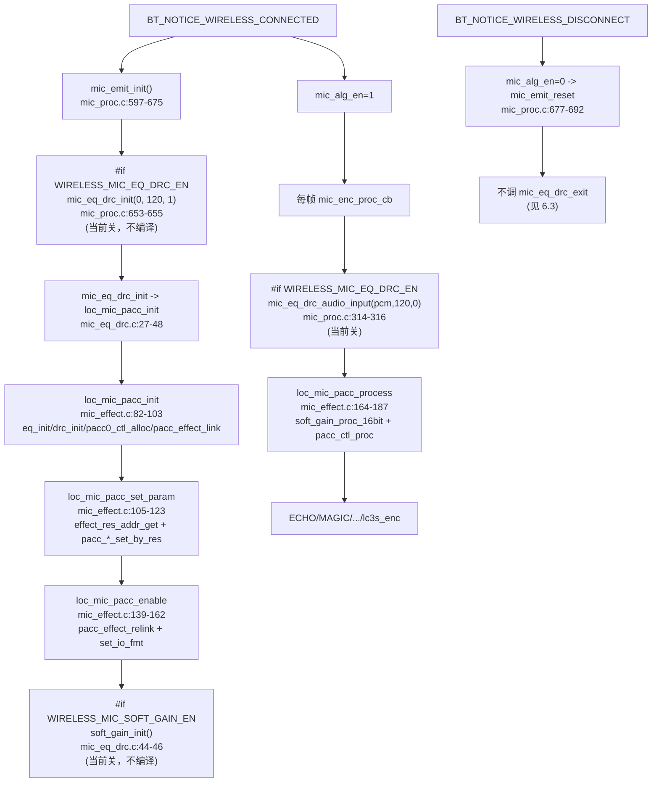
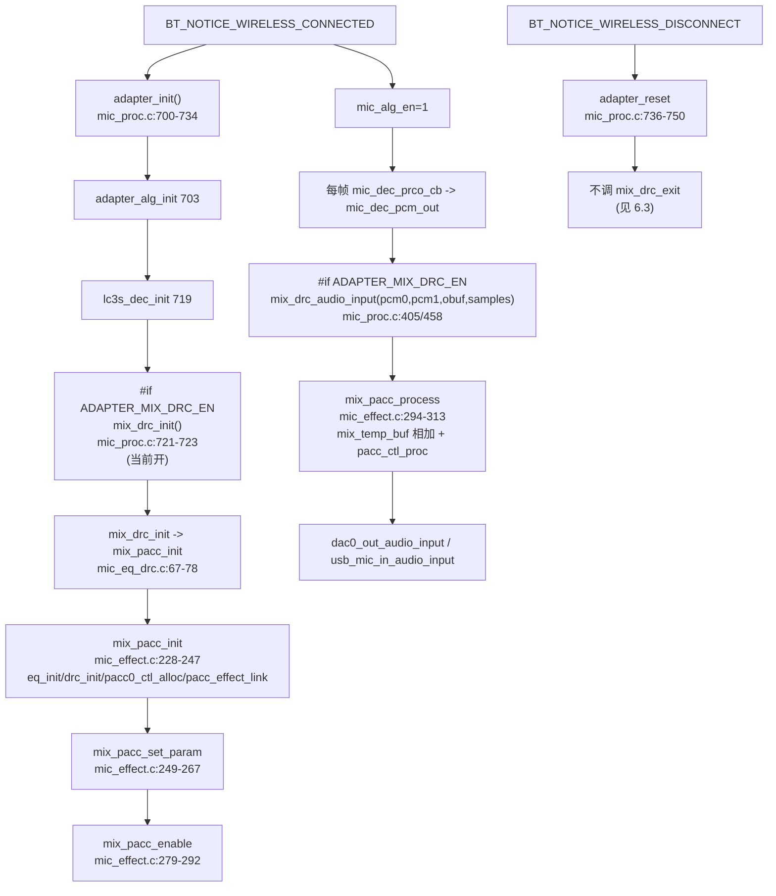
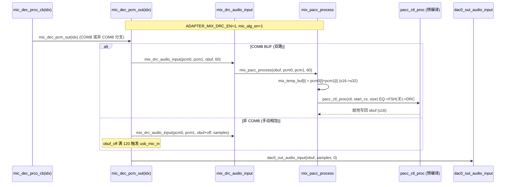

# 06 EQ/DRC/PACC 框架与 Soft Gain

> 本文梳理 AB5766 无线麦克风固件中 EQ/DRC 的 PACC（可编程音频算法加速器）复用框架、CS（Control State）链表模型、IO 格式与资源加载，以及与之紧耦合的 Soft Gain（带保护数字增益）包装层。所有结论来自源码实际引用关系（文件、函数、行号）。PACC 包装层类型与 API 在 [libs/cpu/api_pacc.h](../../../libs/cpu/api_pacc.h) **完全可读**；处理内核 `pacc_ctl_proc`/`pacc_effect_link`/`pacc_effect_relink`/`pacc_eq_set_by_res`/`pacc_drc_set_by_res` 来自预编译库 `libs/cpu/libplatform.a`（`map.txt` 符号证实 `pacc_effect.o`/`pacc.o` 来自该库），内部数学不推测。

---

## 1. 配置宏与当前编译状态

### 1.1 宏定义链（当前值）

| 宏 | 当前值 | 位置 | 语义 |
|---|---|---|---|
| `WIRELESS_MIC_EQ_DRC_EN` | **0** | [config:99](../../../projects/microphone/config_ab5766_le_mic.h#L99) | TX（发射端）EQ/DRC 总开关 |
| `WIRELESS_MIC_EQ_DRC_DELAY` | `EQ_DRC_EN*200`=0 | [config:100](../../../projects/microphone/config_ab5766_le_mic.h#L100) | EQ/DRC 运算时间预算（µs 量级） |
| `WIRELESS_MIC_SOFT_GAIN_EN` | **1** | [config:98](../../../projects/microphone/config_ab5766_le_mic.h#L98) | Soft Gain（带保护数字增益）开关 |
| `SOFT_GAIN_MAX_LEVEL` | 8 | [config:161](../../../projects/microphone/config_ab5766_le_mic.h#L161) | 64/32/16/8 级音量表选 8 级 |
| `SOFT_GAIN_DEFAULT_LEVEL` | 0 | [config:162](../../../projects/microphone/config_ab5766_le_mic.h#L162) | 上电默认等级（0=最大音量） |
| `WIRELESS_FREQ_SHIFT2_EN` | **0** | [config:105](../../../projects/microphone/config_ab5766_le_mic.h#L105) | TX 移频（防啸叫）开关 |
| `ADAPTER_MIX_DRC_EN` | **1** | [config:124](../../../projects/microphone/config_ab5766_le_mic.h#L124) | RX（适配器端）混音 DRC 开关 |
| `ADAPTER_FREQ_SHIFT_EN` | **0** | [config:126](../../../projects/microphone/config_ab5766_le_mic.h#L126) | RX 移频开关 |
| `WIRELESS_MIC_24B_PCM_EN` | **未定义** | 全仓 Grep 无匹配 | 24 位 PCM 分支不编译，走 SOFT_GAIN 分支 |

> `WIRELESS_MIC_24B_PCM_EN` 不在 `config_ab5766_le_mic.h` 中，也未在 `config_extra.h` 与 `config_define.h` 中匹配到。当前各 `#if WIRELESS_MIC_24B_PCM_EN` 分支**均不编译**，统一走 `#else`。

### 1.2 当前生效路径

- **TX 侧（LOC_MIC 链）**：`WIRELESS_MIC_EQ_DRC_EN=0` → [mic_eq_drc.c](../../../modules/audio/mic_eq_drc.c) 全文在 `#if WIRELESS_MIC_EQ_DRC_EN` 下，**整个 TX EQ/DRC/Soft Gain 包装不编译**，TX 运行时链不进入 EQ/DRC，Soft Gain 也因门控耦合不进入运行时音频链（见第 8 节）。
- **RX 侧（MIX_MIC 链）**：`ADAPTER_MIX_DRC_EN=1` → [mic_eq_drc.c](../../../modules/audio/mic_eq_drc.c) 的 `mix_drc_*` 包装编译并进入运行时链（`adapter_init` 调 `mix_drc_init`，`mic_dec_pcm_out` 调 `mix_drc_audio_input`）。

### 1.3 CS 链表的编译开关与 frame len

- `LOC_PACC_FRAME_LEN = 120`（[mic_effect.c:55](../../../modules/effect/mic_effect.c#L55)）与 `WIRELESS_MIC_SAMPLES_SELECT=120` 一致。
- `MIX_PACC_FRAME_LEN = 120`（[mic_effect.c:199](../../../modules/effect/mic_effect.c#L199)）与 RX 每帧点数一致。
- `WIRELESS_FREQ_SHIFT2_EN` 与 `ADAPTER_FREQ_SHIFT_EN` 通过 `#if` 控制 FSH_CS 是否加入 `cb_tbl` 数组与 `cs_en[FSH_CS]=1`，即移频经 PACC CS 链接入（非独立每帧调用，见第 7 节）。

---

## 2. PACC 硬件加速器复用框架

### 2.1 PACC0 共享与按位图分时复用

AB5766 有一个 PACC0 硬件加速器，由 TX 的 `loc_mic`（EQ/DRC）链与 RX 的 `mix_pacc`（混音 EQ/DRC）链共享。复用框架定义在 [mic_effect.c:19-50](../../../modules/effect/mic_effect.c#L19-L50)：

```c
enum { PACC0_LOC_MIC = BIT(0), PACC0_MIX_MIC = BIT(1), PACC0_SCO_MIC = BIT(2) };  // 19-23

typedef struct {
    void *ctl;       // PACC 控制句柄（pacc_effect_init 返回）
    u8   enable;     // 位图：记录当前哪些链在使用 PACC0
} pacc0_hw;

static pacc0_hw pacc0_hw_ctx;     // 共享单例

// 申请使用 PACC0（首次申请时初始化）
void *pacc0_ctl_alloc(uint en_bit) {
    if (pacc0_hw_ctx.ctl == NULL) {
        pacc0_hw_ctx.ctl = pacc_effect_init(0);    // 预编译库：建立 PACC0 控制实例
    }
    pacc0_hw_ctx.enable |= en_bit;
    return pacc0_hw_ctx.ctl;
}

// 释放使用 PACC0（最后一个使用者退出时才真正销毁）
void pacc0_ctl_free(uint en_bit) {
    pacc0_hw_ctx.enable &= ~en_bit;
    if (pacc0_hw_ctx.enable == 0) {
        pacc_effect_exit(0);      // 预编译库：销毁 PACC0 控制实例
        pacc0_hw_ctx.ctl = NULL;
    }
}
```

要点：
1. **按位图复用**：`enable` 位图记录使用者（`BIT(0)`=LOC_MIC，`BIT(1)`=MIX_MIC，`BIT(2)`=SCO_MIC）。申请时 `|=en_bit`，释放时 `&=~en_bit`。
2. **惰性初始化**：首次 `pacc0_ctl_alloc`（ctl==NULL）才调 `pacc_effect_init(0)` 建立 PACC0 控制实例；最后一个使用者释放（enable==0）才调 `pacc_effect_exit(0)` 销毁。
3. **避免并发**：[mic_effect.c:1-13](../../../modules/effect/mic_effect.c#L1-L13) 文件头明确注释"复用 PACC0 处理 EQ/DRC，注意避免多线程同时调用 `pacc_ctl_proc_cs`"。即 PACC0 是共享资源，`pacc_ctl_proc` 调用需串行化，不在 TX 实时线程与 RX 实时线程同时进入。
4. 复用场景表（[mic_effect.c:6-13](../../../modules/effect/mic_effect.c#L6-L13)）：music/spk/a2dp/sco/loc_mic/mix_mic/sco_mic。当前固件只用 loc_mic（TX）与 mix_mic（RX）。

### 2.2 PACC 类型与 API（libs/cpu/api_pacc.h，可读）

PACC 包装层的类型、格式宏与 API 声明在 [libs/cpu/api_pacc.h](../../../libs/cpu/api_pacc.h) **完全可读**（本次会话读全 256 行确认）。关键定义：

**数据格式枚举** [api_pacc.h:20-25](../../../libs/cpu/api_pacc.h#L20-L25)：

```c
typedef enum {
    S16_Q15_SAT = 0,   // 16 位 Q15，饱和
    S32_Q23_SAT,       // 32 位 Q23，饱和
    S32_Q15,           // 32 位 Q15（高 16 位有效，低 16 位小数）
    S32_Q23,           // 32 位 Q23（无饱和标记）
} pacc_fmt_t;
```

**CS（Control State）类型** [api_pacc.h:27-29](../../../libs/cpu/api_pacc.h#L27-L29)：

```c
typedef struct pacc_cs_tag {
    u8 buf[36];        // 36 字节不透明控制状态块
} pacc_cs_t;
```

`pacc_cs_t` 是 36 字节的不透明块，包装层不直接读写其字段；链表通过 `pacc_cs_set_next` 串联。

**EQ/DRC/FSH 工作结构体**：
- `pacc_eq_t` [api_pacc.h:195-204](../../../libs/cpu/api_pacc.h#L195-L204)：`{cs, drc_coef, eq_zx, eq_coef, max_band_cnt, band_cnt, mode, change_en}`。
- `pacc_drc_t` [api_pacc.h:207-214](../../../libs/cpu/api_pacc.h#L207-L214)：`{cs, drc_coef, eq_zx, eq_coef, eq_band, mode}`。
- `pacc_eq_bd_t` [api_pacc.h:56-63](../../../libs/cpu/api_pacc.h#L56-L63)：`{zx{buf[1][2*(10+1)]}, coef{buf[1][5*10+1]}}`（工作缓冲）。
- `pacc_drc_bd_t` [api_pacc.h:68-70](../../../libs/cpu/api_pacc.h#L68-L70)：`{drc_coef_t drc_coef}`。
- `freq_shift_bd_t` [api_pacc.h:118-124](../../../libs/cpu/api_pacc.h#L118-L124)：`{s32 zx[160], s32 Hilbert_hcoef[160], s32 phase_step}`，`HIBERT_ORDER=160`。

**effect 模式枚举** [api_pacc.h:170-179](../../../libs/cpu/api_pacc.h#L170-L179)：

```c
typedef enum {
    PACC_EQ     = 0x0,   // mode0：biquad EQ
    PACC_EQ_DRC = 0x1,  // mode1：EQ -> DRC
    PACC_DRC    = 0x0,  // mode0：DRC
    PACC_DRC_EQ = 0x1,  // mode1：DRC -> EQ
    PACC_MDRC   = 0x2,  // mode2：multiband DRC
    PACC_DYEQ,
    PACC_FSH    = 0x..., // freq_shift
    PACC_FIR,            // fir filter
} pacc_effect;
```

> 注意：`PACC_EQ` 与 `PACC_DRC` 的枚举数值都是 `0x0`（`acc_mode` 字段，区分"纯 EQ/纯 DRC"），`PACC_EQ_DRC`/`PACC_DRC_EQ` 都是 `0x1`（"EQ→DRC"/"DRC→EQ"级联）。`acc_id`（效果类型）与 `acc_mode`（级联模式）是 `pacc_effect_cb` 的两个字段。`cb_tbl` 数组项首字段是 `acc_id`（即 `PACC_EQ`/`PACC_FSH`/`PACC_DRC` 这些效果类型），由预编译 `pacc_effect_link` 解释。

**pacc_effect_cb（CS 链表节点描述）** [api_pacc.h:181-192](../../../libs/cpu/api_pacc.h#L181-L192)：

```c
typedef struct {
    u8        acc_id;          // 效果类型（PACC_EQ/PACC_DRC/PACC_FSH/...）
    u8        acc_mode;        // 级联模式（0/1/2）
    bool      stereo;          // 立体声
    bool      right_channel;   // 右声道
    void     *data_in;         // 输入缓冲
    pacc_fmt_t fmt_in;         // 输入格式
    void     *data_out;        // 输出缓冲
    pacc_fmt_t fmt_out;        // 输出格式
    void     *pacc_cs;         // 指向 pacc_cs_t（链表节点）
    void     *pacc_sb;         // 指向工作结构（pacc_eq_t/pacc_drc_t/freq_shift_bd_t）
} pacc_effect_cb;
```

**API 分组**：
- 控制实例：`pacc_effect_init(link)`/`pacc_effect_exit(link)`、`pacc_ctl_set_done_callback`（[api_pacc.h:127-135](../../../libs/cpu/api_pacc.h#L127-L135)）。
- CS 链表：`pacc_effect_link(cb_tbl, max_cs, frame_len)`/`pacc_effect_relink(cs_tbl, pacc_en, max_cs)`/`pacc_effect_process(ctl, start_cs)`（[api_pacc.h:234-253](../../../libs/cpu/api_pacc.h#L234-L253)）。
- CS 节点：`pacc_cs_set_next`/`pacc_cs_set_buf_addr`/`pacc_cs_set_io_fmt`/`pacc_cs_set_io_addr_fsize`/`pacc_cs_list_set_io_addr_fsize` 等（[api_pacc.h:138-146](../../../libs/cpu/api_pacc.h#L138-L146)）。
- 内核执行：`pacc_ctl_proc(ctl, start_cs, samples)`/`pacc_ctl_proc_kick`/`pacc_ctl_proc_wait`（[api_pacc.h:127-135](../../../libs/cpu/api_pacc.h#L127-L135)）。
- EQ/DRC/FSH 参数：`pacc_eq_set_by_param`/`pacc_eq_set_by_res`/`pacc_eq_set_post_gain`/`pacc_drc_set_by_res`/`pacc_drc_set_by_param`/`pacc_fsh_init`/`pacc_fsh_set_param`/`pacc_fsh_off`（[api_pacc.h:151-166](../../../libs/cpu/api_pacc.h#L151-L166)）。
- effect 初始化：`pacc_effect_eq_init`/`pacc_effect_drc_init`/`pacc_effect_set_eq_param`/`pacc_effect_set_drc_param`/`pacc_effect_set_mdrc_param`/`pacc_effect_dyeq_init`/`pacc_effect_fir_init`（[api_pacc.h:234-253](../../../libs/cpu/api_pacc.h#L234-L253)）。

### 2.3 预编译库边界（处理内核不可读）

`map.txt` 证实 PACC 处理内核来自 `libs/cpu/libplatform.a`：

| 符号 | 地址 | 段 | 来源 |
|---|---|---|---|
| `pacc_effect_init` | `0x1000edb0` | `.text.pacc_effect_init` | `libplatform.a(pacc_effect.o)` [map.txt:3587](../../../projects/microphone/Output/bin/map.txt#L3587) |
| `pacc_effect_link` | `0x1000ef20` | `.text.pacc_effect_link` | `libplatform.a(pacc_effect.o)` [map.txt:3596](../../../projects/microphone/Output/bin/map.txt#L3596) |
| `pacc_effect_relink` | `0x1000f152` | `.text.pacc_effect_relink` | `libplatform.a(pacc_effect.o)` [map.txt:3599](../../../projects/microphone/Output/bin/map.txt#L3599) |
| `pacc_ctl_proc` | `0x00011d52` | （RAM 区，热路径） | `libplatform.a(pacc_effect.o)` [map.txt:2174](../../../projects/microphone/Output/bin/map.txt#L2174) |
| `pacc_ctl_proc_kick` | `0x00011d48` | （RAM 区） | [map.txt:2171](../../../projects/microphone/Output/bin/map.txt#L2171) |
| `bsp_pacc_init` | — | — | `libplatform.a(pacc.o)` [map.txt:40](../../../projects/microphone/Output/bin/map.txt#L40) |
| `tool_drc_coef_format` | — | — | `libplatform.a(pacc_effect.o)` [map.txt:44](../../../projects/microphone/Output/bin/map.txt#L44) |

`pacc_effect.o` 与 `pacc.o` 整体来自预编译库（[map.txt:37-39](../../../projects/microphone/Output/bin/map.txt#L37-L39)）。`pacc_ctl_proc` 在 `0x00011d52`（前 64K RAM 区，热路径），而 `pacc_effect_init/link/relink` 在 `0x1000c...`/`0x1000e...`/`0x1000f...`（Flash/ROM 区，初始化路径）。

**可记录**：API 签名、参数、调用时机、输入输出格式、链表节点描述。**不可推测**：`pacc_ctl_proc` 内部如何遍历 CS 链、`pacc_effect_link` 如何按 `cb_tbl` 组链、EQ biquad 系数数学、DRC 压缩曲线数学、FSH Hilbert 滤波数学。

---

## 3. TX 链（LOC_MIC）：EQ → FSH → DRC

### 3.1 静态状态与缓冲

[mic_effect.c:52-80](../../../modules/effect/mic_effect.c#L52-L80)（`#if WIRELESS_MIC_EQ_DRC_EN` 下，当前不编译，记录设计）：

```c
#define LOC_PACC_FRAME_LEN  120

typedef struct {
    s32   cache[LOC_PACC_FRAME_LEN*4];   // 480 个 s32，约 1.9 KB，帧缓冲
    void *pacc_ctl;                       // PACC0 控制句柄
    void *start_cs;                       // 链表头 CS
    pacc_cs_t pacc_cs[LOC_MIC_PACC_MAX_CS];
    u8    cs_en[LOC_MIC_PACC_MAX_CS];     // 各 CS 是否启用
} loc_mic_pacc;

static loc_mic_pacc loc_mic_pacc_cb AT(.buf.mic_effect.pacc);
static pacc_eq_t  loc_mic_eq;   static pacc_eq_bd_t  loc_mic_eq_bd;   AT(.buf.mic_effect)
static pacc_drc_t loc_mic_drc;  static pacc_drc_bd_t loc_mic_drc_bd;  AT(.buf.mic_effect)
#if WIRELESS_FREQ_SHIFT2_EN
static freq_shift_bd_t mic_fsh;   AT(.buf.mic_effect)
#endif
```

### 3.2 CS 枚举（链序索引）

[mic_effect.h:6-14](../../../modules/effect/mic_effect.h#L6-L14)：

```c
enum {
    LOC_MIC_PACC_EQ_CS = 0,
#if WIRELESS_FREQ_SHIFT2_EN
    LOC_MIC_PACC_FSH_CS,
#endif
    LOC_MIC_PACC_DRC_CS,
    LOC_MIC_PACC_MAX_CS,
};
```

当前 `WIRELESS_FREQ_SHIFT2_EN=0`，故 `LOC_MIC_PACC_FSH_CS` 不存在，`LOC_MIC_PACC_DRC_CS=1`，`LOC_MIC_PACC_MAX_CS=2`。即 TX 链只有 EQ 与 DRC 两个 CS。

### 3.3 cb_tbl 数组（物理顺序与 IO 格式）

[loc_mic_pacc_cb_tbl](../../../modules/effect/mic_effect.c#L74-L80)：

```c
static const pacc_effect_cb loc_mic_pacc_cb_tbl[LOC_MIC_PACC_MAX_CS] = {
    // EQ_CS
    { PACC_EQ,  0, false, false, NULL, S16_Q15_SAT, NULL, S32_Q23,   &loc_mic_eq,  NULL },
#if WIRELESS_FREQ_SHIFT2_EN
    // FSH_CS（可选）
    { PACC_FSH, 0, false, false, NULL, S32_Q23,     NULL, S32_Q23,   &mic_fsh,     NULL },
#endif
    // DRC_CS
    { PACC_DRC, 0, false, false, NULL, S32_Q23,     NULL, S16_Q15_SAT, &loc_mic_drc, NULL },
};
```

**数组物理顺序**：`EQ_CS` → `FSH_CS`（可选）→ `DRC_CS`。

**IO 格式递进（揭示链序）**：
- EQ：`S16_Q15_SAT`（入）→ `S32_Q23`（出）
- FSH：`S32_Q23`（入）→ `S32_Q23`（出）
- DRC：`S32_Q23`（入）→ `S16_Q15_SAT`（出）

输入输出格式的衔接（EQ 出 `S32_Q23` = FSH 入 `S32_Q23` = DRC 入 `S32_Q23`）揭示链序为 **EQ → FSH → DRC**。链头（EQ 入）为 `S16_Q15_SAT`（与上游 `mic_pcm_t=s16` 一致），链尾（DRC 出）为 `S16_Q15_SAT`（与下游 16 bit PCM 一致）。

### 3.4 init / set_param / enable / process / exit

**`loc_mic_pacc_init`** [mic_effect.c:82-103](../../../modules/effect/mic_effect.c#L82-L103)：

```c
void loc_mic_pacc_init(void)
{
    printf("loc_mic_pacc_init\n");
    memset((u8 *)&loc_mic_pacc_cb, 0, sizeof(loc_mic_pacc_cb));
    pacc_effect_eq_init(&loc_mic_eq, &loc_mic_pacc_cb.pacc_cs[EQ_CS], 0,
                        EQ_BAND_MAX_NB, 0, &loc_mic_eq_bd.coef, EQ_COEF_BUF_SIZE,
                        &loc_mic_eq_bd.zx, EQ_ZX_BUF_SIZE);
    pacc_effect_drc_init(&loc_mic_drc, &loc_mic_pacc_cb.pacc_cs[DRC_CS], 0, 0,
                         NULL, DRC_COEF_BUF_SIZE, &loc_mic_drc_bd.drc_coef, DRC_ZX_BUF_SIZE);
#if WIRELESS_FREQ_SHIFT2_EN
    memset(&mic_fsh, 0, sizeof(mic_fsh));
#endif
    loc_mic_pacc_cb.pacc_ctl = pacc0_ctl_alloc(PACC0_LOC_MIC);
    loc_mic_pacc_cb.start_cs = pacc_effect_link(loc_mic_pacc_cb_tbl, LOC_MIC_PACC_MAX_CS, LOC_PACC_FRAME_LEN);
}
```

要点：
1. `memset` 清零状态。
2. `pacc_effect_eq_init` 初始化 EQ 工作结构（`max_band_cnt=EQ_BAND_MAX_NB=10`，`mode=0` 纯 EQ）。
3. `pacc_effect_drc_init` 初始化 DRC 工作结构（`mode=0` 纯 DRC）。
4. FSH 仅 `memset`（参数由 `pacc_fsh_init`/`set_param` 另设，当前关）。
5. `pacc0_ctl_alloc(PACC0_LOC_MIC)` 申请 PACC0（首次会 `pacc_effect_init`）。
6. `pacc_effect_link(cb_tbl, MAX_CS, 120)` 按 `cb_tbl` 组 CS 链表，返回链头 `start_cs`。**链序由预编译 `pacc_effect_link` 决定**（见第 6 节边界）。

**`loc_mic_pacc_set_param`** [mic_effect.c:105-123](../../../modules/effect/mic_effect.c#L105-L123)：

```c
void loc_mic_pacc_set_param(void)
{
    u32 res_addr = effect_res_addr_get(EFFECT_IDX_LOC_MIC_DRC);
    u32 res_len  = effect_res_len_get(EFFECT_IDX_LOC_MIC_DRC);
    if (res_len && pacc_drc_set_by_res(&loc_mic_drc, res_addr, res_len)) {
        loc_mic_pacc_cb.cs_en[DRC_CS] = 1;
    }
    res_addr = effect_res_addr_get(EFFECT_IDX_LOC_MIC_EQ);
    res_len  = effect_res_len_get(EFFECT_IDX_LOC_MIC_EQ);
    if (res_len && pacc_eq_set_by_res(&loc_mic_eq, res_addr, res_len)) {
        loc_mic_pacc_cb.cs_en[EQ_CS] = 1;
    }
#if WIRELESS_FREQ_SHIFT2_EN
    loc_mic_pacc_cb.cs_en[FSH_CS] = 1;
#endif
}
```

要点：
1. 通过 `effect_res_addr_get/len_get`（见第 5 节）从资源区读 EQ/DRC 参数地址与长度。
2. `pacc_drc_set_by_res`/`pacc_eq_set_by_res`（预编译库）按资源索引加载参数到工作结构；成功则置 `cs_en[CS]=1`（启用该 CS）。
3. FSH 不从资源加载（`effect_idx.h` 无 FSH 索引，见第 5 节），开启时直接 `cs_en[FSH_CS]=1`，参数由 `pacc_fsh_set_param` 另设。

**`loc_mic_pacc_enable`** [mic_effect.c:139-162](../../../modules/effect/mic_effect.c#L139-L162)：

```c
bool loc_mic_pacc_enable(void)
{
    loc_mic_pacc_cb.start_cs = pacc_effect_relink(loc_mic_pacc_cb.pacc_cs, loc_mic_pacc_cb.cs_en, LOC_MIC_PACC_MAX_CS);
#if WIRELESS_MIC_24B_PCM_EN
    pacc_cs_list_set_io_fmt(start_cs, false, S32_Q23_SAT, S32_Q23_SAT);
#elif WIRELESS_MIC_SOFT_GAIN_EN
    pacc_cs_list_set_io_fmt(start_cs, false, S32_Q15, S16_Q15_SAT);
#else
    pacc_cs_list_set_io_fmt(start_cs, false, S16_Q15_SAT, S16_Q15_SAT);
#endif
    return (loc_mic_pacc_cb.start_cs != NULL);
}
```

要点：
1. `pacc_effect_relink` 按 `cs_en[]` 位图重新组链（只接启用的 CS），返回新链头。
2. **链头尾 IO 格式由 PCM 位宽分支决定**（覆盖 cb_tbl 中的 `fmt_in/fmt_out`）：
   - `WIRELESS_MIC_24B_PCM_EN`（未定义，不编译）：链头 `S32_Q23_SAT`，链尾 `S32_Q23_SAT`。
   - `WIRELESS_MIC_SOFT_GAIN_EN=1`（当前生效）：链头 `S32_Q15`，链尾 `S16_Q15_SAT`。
   - 两者都关：链头 `S16_Q15_SAT`，链尾 `S16_Q15_SAT`。
3. 返回 `start_cs != NULL` 表示链非空（至少有一个 CS 启用）。

> **Soft Gain 与 PACC 链头的耦合**：当前 `WIRELESS_MIC_SOFT_GAIN_EN=1`，链头格式设为 `S32_Q15`。这是因为 Soft Gain 的 `soft_gain_proc_16bit` 把 `s16` 转成 `s32`（Q15）写入 cache（见第 8 节），PACC EQ 的输入需匹配 `S32_Q15`。若 Soft Gain 关，链头应回到 `S16_Q15_SAT`。

**`loc_mic_pacc_process`** [mic_effect.c:164-187](../../../modules/effect/mic_effect.c#L164-L187) `AT(.com_text.loc_mic)`：

```c
void loc_mic_pacc_process(s16 *obuf, s16 *ibuf, u32 samples)
{
    s32 *wptr = loc_mic_pacc_cb.cache;
    s32 *rptr = (s32 *)ibuf;   // 注意：把 s16* ibuf 当 s32* 读
    u32 size = samples * 2;    // s32 字节数
    while (samples) {
        u32 n = (samples > LOC_PACC_FRAME_LEN) ? LOC_PACC_FRAME_LEN : samples;
        samples -= n;
#if WIRELESS_MIC_SOFT_GAIN_EN
        for (u32 i = 0; i < n; i++) {
            wptr[i] = (s32)soft_gain_proc_16bit(ibuf[i]);  // S16 -> S32_Q15，带增益
        }
        pacc_cs_list_set_io_addr_fsize(start_cs, obuf, cache, size);
        pacc_ctl_proc(pacc_ctl, start_cs, size);   // 预编译内核：执行 EQ->FSH->DRC 链
#else
        pacc_cs_list_set_io_addr_fsize(start_cs, obuf, ibuf, size);
        pacc_ctl_proc(pacc_ctl, start_cs, size);
#endif
        // 推进指针/计数...
    }
}
```

要点：
1. `AT(.com_text.loc_mic)`：TX 每帧热路径，放 RAM 区快速执行。
2. 按 120 点分帧循环处理（`LOC_PACC_FRAME_LEN`）。
3. `WIRELESS_MIC_SOFT_GAIN_EN=1` 分支：逐点 `soft_gain_proc_16bit(ibuf[i])` 把 `s16` 转成 `s32`（Q15）并施加增益，写入 `cache`；然后 `pacc_cs_list_set_io_addr_fsize` 把链头 IO 地址设为 `cache`（输入）与 `obuf`（输出），调 `pacc_ctl_proc` 执行整条 CS 链。
4. `#else` 分支：直接以 `ibuf` 为输入（无 Soft Gain），`obuf` 为输出。
5. `pacc_ctl_proc(ctl, start_cs, size)` 是预编译内核，就地执行 EQ→FSH→DRC，结果写回 `obuf`。

**`loc_mic_pacc_exit`** [mic_effect.c:189-193](../../../modules/effect/mic_effect.c#L189-L193)：

```c
void loc_mic_pacc_exit(void)
{
    loc_mic_pacc_cb.pacc_ctl = NULL;
    pacc0_ctl_free(PACC0_LOC_MIC);
}
```

置空 ctl，释放 PACC0 使用位（最后一个使用者退出才真正 `pacc_effect_exit`）。

---

## 4. RX 链（MIX_MIC）：混音 EQ → DRC

### 4.1 静态状态与缓冲

[mic_effect.c:196-226](../../../modules/effect/mic_effect.c#L196-L226)（`#if ADAPTER_MIX_DRC_EN` 下，当前编译）：

```c
#define MIX_PACC_FRAME_LEN  120

static s32 mix_temp_buf[MIX_PACC_FRAME_LEN] AT(.buf.mic_mix);   // 混音累加缓冲

typedef struct {
    void *pacc_ctl;
    void *start_cs;
    pacc_cs_t pacc_cs[MIX_MIC_PACC_MAX_CS];
    u8    cs_en[MIX_MIC_PACC_MAX_CS];
} mix_pacc;                                  // 注意：无 cache 字段

static mix_pacc mix_pacc_cb AT(.buf.mic_mix.pacc);
static pacc_eq_t  mix_eq;   static pacc_eq_bd_t  mix_eq_bd;   AT(.buf.mic_mix)
static pacc_drc_t mix_drc;  static pacc_drc_bd_t mix_drc_bd;  AT(.buf.mic_mix)
#if ADAPTER_FREQ_SHIFT_EN
static freq_shift_bd_t mix_fsh;   AT(.buf.mic_mix)
#endif
```

> **与 LOC 链差异**：`mix_pacc` 结构**无 `cache` 字段**，用独立的 `mix_temp_buf[120]` 做混音累加；`mix_pacc_process` 直接以 `mix_temp_buf` 为 PACC 输入，无 Soft Gain 逐点转换（RX 侧无 Soft Gain）。

### 4.2 CS 枚举（链序索引）

[mic_effect.h:16-24](../../../modules/effect/mic_effect.h#L16-L24)：

```c
enum {
    MIX_MIC_PACC_DRC_CS = 0,    // 注意：DRC 在前
#if ADAPTER_FREQ_SHIFT_EN
    MIX_MIC_PACC_FSH_CS,
#endif
    MIX_MIC_PACC_EQ_CS,
    MIX_MIC_PACC_MAX_CS,
};
```

> **枚举编号与 LOC 相反**：LOC 是 `EQ_CS=0`，MIX 是 `DRC_CS=0`。**但枚举值仅用于索引 `cs_en[]`/`pacc_cs[]` 数组，不代表链序**。链序由 `cb_tbl` 数组物理顺序 + 预编译 `pacc_effect_link` 决定（见 4.3、第 6 节）。

### 4.3 cb_tbl 数组（物理顺序与 IO 格式，核心确认）

[mix_pacc_cb_tbl](../../../modules/effect/mic_effect.c#L219-L226)：

```c
static const pacc_effect_cb mix_pacc_cb_tbl[MIX_MIC_PACC_MAX_CS] = {
    // EQ_CS（注意：数组第 0 项是 EQ，不是 DRC）
    { PACC_EQ,  0, false, false, NULL, S32_Q23, NULL, S32_Q23, &mix_eq,  NULL },
#if ADAPTER_FREQ_SHIFT_EN
    // FSH_CS（可选）
    { PACC_FSH, 0, false, false, NULL, S32_Q23, NULL, S32_Q23, &mix_fsh, NULL },
#endif
    // DRC_CS
    { PACC_DRC, 0, false, false, NULL, S32_Q23, NULL, S32_Q23, &mix_drc, NULL },
};
```

**数组物理顺序**：`EQ_CS` → `FSH_CS`（可选）→ `DRC_CS`，**与 LOC 的 cb_tbl 数组顺序相同**（都是 EQ, FSH, DRC）。

**IO 格式差异（不揭示链序）**：MIX 链各项中间格式全为 `S32_Q23`→`S32_Q23`，不像 LOC 那样有 `S16_Q15_SAT`→`S32_Q23`→`S32_Q23`→`S16_Q15_SAT` 的格式递进。因此 **MIX 链序无法从 cb_tbl 的 IO 格式推断**，链序由预编译 `pacc_effect_link` 按 `acc_id` 决定。

> **重要纠偏**：不得断言"MIX 链序为 DRC→FSH→EQ（与 LOC 相反）"。`cb_tbl` 数组物理顺序两端相同（EQ, FSH, DRC），仅枚举编号相反（LOC: EQ=0；MIX: DRC=0），而枚举编号只用于索引 `cs_en[]`/`pacc_cs[]`，不影响 `pacc_effect_link` 的组链顺序。链序是预编译内核行为，不可从源码断言。

### 4.4 init / set_param / enable / process / exit

**`mix_pacc_init`** [mic_effect.c:228-247](../../../modules/effect/mic_effect.c#L228-L247)：

```c
void mix_pacc_init(void)
{
    printf("mix_pacc_init\n");
    memset((u8 *)&mix_pacc_cb, 0, sizeof(mix_pacc_cb));
    pacc_effect_eq_init(&mix_eq, &mix_pacc_cb.pacc_cs[MIX_MIC_PACC_EQ_CS], 0,
                        EQ_BAND_MAX_NB, 0, &mix_eq_bd.coef, EQ_COEF_BUF_SIZE,
                        &mix_eq_bd.zx, EQ_ZX_BUF_SIZE);
    pacc_effect_drc_init(&mix_drc, &mix_pacc_cb.pacc_cs[MIX_MIC_PACC_DRC_CS], 0, 0,
                         NULL, DRC_COEF_BUF_SIZE, &mix_drc_bd.drc_coef, DRC_ZX_BUF_SIZE);
#if ADAPTER_FREQ_SHIFT_EN
    memset(&mix_fsh, 0, sizeof(mix_fsh));
#endif
    mix_pacc_cb.pacc_ctl = pacc0_ctl_alloc(PACC0_MIX_MIC);
    mix_pacc_cb.start_cs = pacc_effect_link(mix_pacc_cb_tbl, MIX_MIC_PACC_MAX_CS, MIX_PACC_FRAME_LEN);
}
```

**`mix_pacc_set_param`** [mic_effect.c:249-267](../../../modules/effect/mic_effect.c#L249-L267)：通过 `EFFECT_IDX_MIX_DRC`/`EFFECT_IDX_MIX_EQ` 加载资源，成功则 `cs_en=1`；FSH 同样直接 `cs_en[FSH_CS]=1`。

**`mix_pacc_enable`** [mic_effect.c:279-292](../../../modules/effect/mic_effect.c#L279-L292)：

```c
bool mix_pacc_enable(void)
{
    mix_pacc_cb.start_cs = pacc_effect_relink(mix_pacc_cb.pacc_cs, mix_pacc_cb.cs_en, MIX_MIC_PACC_MAX_CS);
#if WIRELESS_MIC_24B_PCM_EN
    pacc_cs_list_set_io_fmt(start_cs, false, S32_Q23, S32_Q23_SAT);
#else
    pacc_cs_list_set_io_fmt(start_cs, false, S32_Q15, S16_Q15_SAT);   // 注意：MIX 无 SOFT_GAIN 分支
#endif
    return (mix_pacc_cb.start_cs != NULL);
}
```

> **与 LOC 链差异**：MIX 的 `enable` 只有 `WIRELESS_MIC_24B_PCM_EN` 与 `#else` 两个分支，**无 `WIRELESS_MIC_SOFT_GAIN_EN` 分支**（RX 侧无 Soft Gain）。当前走 `#else`，链头 `S32_Q15`，链尾 `S16_Q15_SAT`。

**`mix_pacc_process`** [mic_effect.c:294-313](../../../modules/effect/mic_effect.c#L294-L313) `AT(.text.mic_mix_proc)`：

```c
void mix_pacc_process(s16 *obuf, s16 *ibuf0, s16 *ibuf1, u32 samples)
{
    s16 *out = (obuf == NULL) ? ibuf0 : obuf;
    u32 size = samples * 2;
    while (samples) {
        u32 n = (samples > MIX_PACC_FRAME_LEN) ? MIX_PACC_FRAME_LEN : samples;
        samples -= n;
        for (u32 i = 0; i < n; i++) {
            mix_temp_buf[i] = ibuf0[i] + ibuf1[i];   // 直接相加混音，无 soft_gain
        }
        pacc_cs_list_set_io_addr_fsize(start_cs, out, mix_temp_buf, size);
        pacc_ctl_proc(pacc_ctl, start_cs, size);     // 预编译内核
        // 推进指针/计数...
    }
}
```

要点：
1. `AT(.text.mic_mix_proc)`：RX 每帧热路径。
2. `obuf==NULL` 时 `out=ibuf0`（就地处理双路 PCM）。
3. **混音方式**：`mix_temp_buf[i] = ibuf0[i] + ibuf1[i]`，直接相加（两路 s16 相加为 s32 存入 `mix_temp_buf`），无 Soft Gain 逐点转换、无除 2（与 `mic_proc.c` 的非 MIX_DRC 分支 `obuf[i]=pcm0[i]/2+pcm1[i]/2` 不同）。
4. PACC 输入为 `mix_temp_buf`（s32），输出为 `out`（s16）。
5. `pacc_ctl_proc` 执行整条 CS 链。

**`mix_pacc_exit`** [mic_effect.c:315-319](../../../modules/effect/mic_effect.c#L315-L319)：

```c
void mix_pacc_exit(void)
{
    mix_pacc_cb.pacc_ctl = NULL;
    pacc0_ctl_free(PACC0_MIX_MIC);
}
```

---

## 5. 资源加载：effect_idx → CFG → RES_BIN

### 5.1 资源索引枚举

[effect_idx.h](../../../modules/effect/effect_idx.h)（读全 21 行）：

```c
enum {
    EFFECT_IDX_LOC_MIC_EQ,      // 0
    EFFECT_IDX_LOC_MIC_DRC,     // 1
    EFFECT_IDX_LOC_MIC_ECHO,    // 2
    EFFECT_IDX_LOC_MIC_MAGIC,   // 3
    EFFECT_IDX_MIX_EQ,          // 4
    EFFECT_IDX_MIX_DRC,         // 5
    EFFECT_IDX_MAX_NB,
};
```

> **无 FSH 索引**：FSH 不从资源区加载参数，`effect_idx.h` 无 `EFFECT_IDX_*_FSH`。FSH 参数由 `pacc_fsh_init`/`pacc_fsh_set_param` 设置（当前关，无调用点）。

### 5.2 effect_offset_tbl：索引 → CFG

[effect_table.c:13-20](../../../modules/effect/effect_table.c#L13-L20)：

```c
static const u8 effect_offset_tbl[EFFECT_IDX_MAX_NB] = {
    CFG_MIC_EQ,    // EFFECT_IDX_LOC_MIC_EQ
    CFG_MIC_DRC,   // EFFECT_IDX_LOC_MIC_DRC
    CFG_ECHO,      // EFFECT_IDX_LOC_MIC_ECHO
    CFG_MAGIC,     // EFFECT_IDX_LOC_MIC_MAGIC
    CFG_MIX_EQ,    // EFFECT_IDX_MIX_EQ
    CFG_MIX_DRC,   // EFFECT_IDX_MIX_DRC
};
```

`effect_info_offset_get(idx)`（[effect_table.c:22-29](../../../modules/effect/effect_table.c#L22-L29)）越界返回 `CFG_MAX`。

### 5.3 effect_res_addr_get / len_get

[effect_table.c:31-79](../../../modules/effect/effect_table.c#L31-L79) `AT(.text.effect_res)`：

```c
u32 effect_res_addr_get(u8 res_offset)
{
    if (res_offset >= EFFECT_IDX_MAX_NB) {
        return (u32)RES_BUF_EFFECT_EFFECT_BIN;   // 越界返回资源 bin 基址
    }
    u8 res_cfg = effect_info_offset_get(res_offset);   // idx -> CFG_*
    // ... effect_info[res_cfg].effect_res_offset ...
    u32 res_real_addr = *(u32 *)(RES_BUF_EFFECT_EFFECT_BIN + effect_res_offset);
    return res_real_addr;
}
```

`effect_res_len_get` 同理用 `effect_len_offset`。

调用链：`effect_res_addr_get(EFFECT_IDX_LOC_MIC_DRC)` → `effect_info_offset_get` → `CFG_MIC_DRC` → 从 `RES_BUF_EFFECT_EFFECT_BIN` 内的偏移读出实际资源地址/长度 → 传给 `pacc_drc_set_by_res`。

### 5.4 effect_update_callback_tbl

[effect_table.c:4-11](../../../modules/effect/effect_table.c#L4-L11)：

```c
static const effect_update_callback effect_update_callback_tbl[CFG_MAX] = {
    local_mic_eq_effect_update_callback,   // CFG_MIC_EQ
    local_mic_drc,                         // CFG_MIC_DRC
    mic_echo,                              // CFG_ECHO
    mic_magic,                             // CFG_MAGIC
    mix_mic_eq,                            // CFG_MIX_EQ
    mix_mic_drc,                           // CFG_MIX_DRC
};
```

这是 UART 在线调试 EQ/DRC 时（`EQ_DRC_DBG_IN_UART=1`，[config:185](../../../projects/microphone/config_ab5766_le_mic.h#L185)）的更新回调表，按 CFG 索引分发到对应模块。

---

## 6. 完整调用链与生命周期

### 6.1 TX 侧（LOC_MIC，当前 EQ_DRC_EN=0 不编译）



### 6.2 RX 侧（MIX_MIC，当前 MIX_DRC_EN=1 编译运行）



### 6.3 reset 不对称（重要）

- **TX 侧**：`mic_emit_reset`（[mic_proc.c:677-692](../../../modules/wireless/mic_proc.c#L677-L692)）调 `bsp_sdadc_exit`、`wireless_cmd_reset(0)`、`memset mic_enc`、参数读取、`dac0_out_exit`，**不调 `mic_eq_drc_exit`**。TX EQ/DRC 资源靠断开 + 降频 + 整体复位回收，无显式 `loc_mic_pacc_exit`。
- **RX 侧**：`adapter_reset`（[mic_proc.c:736-750](../../../modules/wireless/mic_proc.c#L736-L750)）调 `mic_dec_reset`、`plc_soft_exit`、`wireless_cmd_reset`、`m_lc3s_dec_exit`，若 `con_sta==0`（最后一条链）调 `dac0_out_exit`，**不调 `mix_drc_exit`**。

即 TX/RX 的 `*_exit`（`loc_mic_pacc_exit`/`mix_pacc_exit`）当前无调用点，`pacc0_ctl_free` 不会在断开时执行，PACC0 控制实例的生命周期与连接解耦。如实记录：这与 PLC（`plc_soft_exit` 在 `adapter_reset` 中调用）不同，PACC 链无逐连接 reset。

### 6.4 使能门控：eq_drc_en

[mic_eq_drc.c:27-48](../../../modules/audio/mic_eq_drc.c#L27-L48) 的 `mic_eq_drc_init`：

```c
void mic_eq_drc_init(u8 sample_rate, u16 samples, u8 en)
{
    memset(&wireless_mic_eq_drc_cfg, 0, sizeof(wireless_mic_eq_drc_cfg));
    wireless_mic_eq_drc_cfg.sample_rate = sample_rate;
    wireless_mic_eq_drc_cfg.samples = samples;
    loc_mic_pacc_init();          // 33
    loc_mic_pacc_set_param();     // 36
    if (loc_mic_pacc_enable()) {  // 39-42
        wireless_mic_eq_drc_cfg.eq_drc_en = true;
    }
#if WIRELESS_MIC_SOFT_GAIN_EN
    soft_gain_init();             // 44-46
#endif
}
```

[mic_eq_drc.c:18-25](../../../modules/audio/mic_eq_drc.c#L18-L25) 的 `mic_eq_drc_audio_input`：

```c
AT(.com_text.mic_eq_drc.input)
void mic_eq_drc_audio_input(u8 *ptr, u32 samples, int ch_mode, void *params)
{
    if (wireless_mic_eq_drc_cfg.eq_drc_en && samples != 0) {
        loc_mic_pacc_process((s16 *)ptr, (s16 *)ptr, samples);
    }
}
```

`eq_drc_en` 是运行时使能闸：只有 `loc_mic_pacc_enable()` 返回 true（链非空）才置 true，每帧才真正进入 `loc_mic_pacc_process`。**UART 看到 `loc_mic_pacc_init` 的 printf 不等于参数生效**——需确认 `eq_drc_en=true` 与 `cs_en` 非零。

### 6.5 RX mix_drc 的入口与分流

[mic_eq_drc.c:61-65](../../../modules/audio/mic_eq_drc.c#L61-L65) 的 `mix_drc_audio_input`：

```c
AT(.com_text.mix_drc.input)
void mix_drc_audio_input(s16 *pcm0, s16 *pcm1, s16 *obuf, u32 samples)
{
    mix_pacc_process(obuf, pcm0, pcm1, samples);
}
```

`mic_dec_pcm_out` 的两个调用点（[mic_proc.c](../../../modules/wireless/mic_proc.c)）：
- COMB BUF 分支（[405](../../../modules/wireless/mic_proc.c#L405)）：`samples=WIRELESS_MIC_SAMPLES_SELECT/2=60`，`mix_drc_audio_input(pcm0,pcm1,obuf,samples)`，否则 `obuf[i]=pcm0[i]/2+pcm1[i]/2`。
- 非 COMB 分支（[458](../../../modules/wireless/mic_proc.c#L458)）：`mix_drc_audio_input(pcm0,pcm1,obuf+obuf_off,samples)`，否则手动相加；`obuf_off` 满 120 时触发 `usb_mic_in_audio_input`。

---

## 7. 移频（FSH）经 CS 链接入

### 7.1 非独立每帧调用

TX 移频 `WIRELESS_FREQ_SHIFT2_EN` 与 RX 移频 `ADAPTER_FREQ_SHIFT_EN` 不通过独立函数每帧调用，而是经 PACC CS 链的 `cs_en` 接入：

- `cb_tbl` 数组中 FSH_CS 项由 `#if WIRELESS_*FREQ_SHIFT*_EN` 条件加入（[mic_effect.c:70-72](../../../modules/effect/mic_effect.c#L70-L72)、[215-217](../../../modules/effect/mic_effect.c#L215-L217)）。
- `set_param` 中 `cs_en[FSH_CS]=1`（[mic_effect.c:108](../../../modules/effect/mic_effect.c#L108)、[263](../../../modules/effect/mic_effect.c#L263)），不从资源加载（`effect_idx.h` 无 FSH 索引）。
- `enable` 的 `pacc_effect_relink` 按 `cs_en` 把 FSH_CS 接入链表。
- 每帧 `pacc_ctl_proc` 执行整条链（含 FSH）。

> 即移频是 PACC 链的一个环节，不是独立算法函数。当前 TX/RX 移频均关（`WIRELESS_FREQ_SHIFT2_EN=0`、`ADAPTER_FREQ_SHIFT_EN=0`），FSH_CS 不加入 cb_tbl，不接入链。

### 7.2 与 Allpass 随机相位的关系

`WIRELESS_ALLPASS_FILTER_CHANGE_EN=0`（[config:112](../../../projects/microphone/config_ab5766_le_mic.h#L112)，调试中）是另一防啸叫机制（随机相位）。`allpass_filter_change_set(0,100)` 仅在 `mic_emit_init`（[mic_proc.c:624-626](../../../modules/wireless/mic_proc.c#L624-L626)）出现（初始化时设置一次），`allpass_filter_change` 每帧调用点全仓未找到。详见 [11_防啸叫_移频与随机相位.md](11_防啸叫_移频与随机相位.md)。

---

## 8. Soft Gain（带保护数字增益）

### 8.1 增益表与 Q 值

[soft_gain.c:19-57](../../../modules/audio/soft_gain.c#L19-L57) 按 `SOFT_GAIN_MAX_LEVEL` 选表（`soft_gain_tbl_64/32/16/8`）。当前 `SOFT_GAIN_MAX_LEVEL=8`，用 `soft_gain_tbl_8[9]`：

```c
static const u32 soft_gain_tbl_8[9] = {
    SOFT_GAIN_N0DB,    // 索引 0：0 dB（最大音量）
    SOFT_GAIN_N2DB,    // 索引 1：-2 dB
    SOFT_GAIN_N4DB,    // 索引 2：-4 dB
    SOFT_GAIN_N6DB,    // 索引 3：-6 dB
    SOFT_GAIN_N8DB,    // 索引 4：-8 dB
    SOFT_GAIN_N10DB,   // 索引 5：-10 dB
    SOFT_GAIN_N12DB,   // 索引 6：-12 dB
    SOFT_GAIN_N15DB,   // 索引 7：-15 dB
    SOFT_GAIN_N110DB,  // 索引 8：-110 dB（最小音量/近静音）
};
```

索引 0 = 0 dB（最大），索引 8 = -110 dB（最小）。`SOFT_GAIN_DEFAULT_LEVEL=0` 即上电最大音量。

### 8.2 Q 值差异（重要，诚实标注）

[soft_gain.h:71-73](../../../modules/audio/soft_gain.h#L71-L73)：

```c
#define SOFT_GAIN_P0_0DB   (SOFT_GAIN_Q13_VAL*1.000000)   // 8192
#define SOFT_GAIN_Q13_VAL   (1<<SOFT_GAIN_Q)
#define SOFT_GAIN_Q         15
```

- `SOFT_GAIN_Q=15`，故 `SOFT_GAIN_Q13_VAL = 1<<15 = 32768`，`SOFT_GAIN_P0_0DB = 32768`（即 Q15 的 1.0）。
- 但**注释写 `// 8192`**，且宏名是 `SOFT_GAIN_Q13_VAL`（"Q13"），与实际 `Q=15` 不符。
- `soft_gain_proc_16bit` 用 `__builtin_muls_shift15`（Q15 乘法），与 `Q=15` 一致。

> **诚实记录**：宏命名 `SOFT_GAIN_Q13_VAL` 与注释 `// 8192` 是 Q13 残留（应为 8192=1<<13），但实际 `SOFT_GAIN_Q=15` 使 `Q13_VAL=32768`。即命名/注释为 Q13，实际按 Q15 运算。记录此差异，不臆断是 bug 还是历史遗留。`__builtin_muls_shift15` 与 `SOFT_GAIN_Q=15` 一致，运算自洽。

### 8.3 soft_gain 结构体与 API

[soft_gain.c:11-17](../../../modules/audio/soft_gain.c#L11-L17)：

```c
typedef struct {
    uint8_t  fade_en;          // 渐变使能
    uint8_t  step;             // 渐变步长
    uint8_t  gain_tbl_index;   // 当前增益表索引
    uint32_t curr_gain;        // 当前实际增益（渐变逼近 target）
    uint32_t target_gain;      // 目标增益（set_level 设置）
} soft_gain;
static soft_gain soft_gain_ctx;
```

API（[soft_gain.h:140-146](../../../modules/audio/soft_gain.h#L140-L146)）：
- `soft_gain_init(void)`：memset 清零，`step=1`，`fade_en=1`，`first_level=clamp(SOFT_GAIN_DEFAULT_LEVEL, MAX_LEVEL)`，`set_level(first_level)`。
- `soft_gain_set_level(level)`：clamp 到 `0..MAX_LEVEL`，按 `MAX_LEVEL` 选表，设 `target_gain`。
- `soft_gain_up()`：`if(gain_tbl_index) set_level(index-1)`（减小衰减，音量+）。
- `soft_gain_down()`：`set_level(index+1)`（增大衰减，音量-）。
- `soft_gain_level_get()`：返回 `gain_tbl_index`。
- `soft_gain_level_is_max_min()`：`index==0 || index==MAX_LEVEL` 返回 true。

### 8.4 soft_gain_proc_16bit（每帧热路径）

[soft_gain.c:110-128](../../../modules/audio/soft_gain.c#L110-L128) `AT(.com_text.soft_gain)`：

```c
s32 soft_gain_proc_16bit(s16 data)
{
    if (soft_gain_ctx.fade_en && soft_gain_ctx.target_gain != soft_gain_ctx.curr_gain) {
        if (soft_gain_ctx.target_gain > soft_gain_ctx.curr_gain) {
            soft_gain_ctx.curr_gain += soft_gain_ctx.step;   // 渐增
        } else {
            soft_gain_ctx.curr_gain -= soft_gain_ctx.step;   // 渐减
        }
    }
    s32 temp = __builtin_muls_shift15(data, soft_gain_ctx.curr_gain);  // Q15 乘
    return (s32)temp;   // 返回 s32（Q15），供 PACC S32_Q15 输入
}
```

要点：
1. `fade_en=1` 且 `target != curr` 时，`curr` 以 `step=1` 逐步逼近 `target`（每点步进 1，实现渐变，避免增益突变爆音）。
2. `__builtin_muls_shift15(data, curr_gain)`：`s16 * u32` 后右移 15 位（Q15 定点乘法），结果为 `s32`（Q15 格式）。
3. 返回 `s32`（Q15），正是 PACC EQ 链头 `S32_Q15` 输入格式（见 3.4 `WIRELESS_MIC_SOFT_GAIN_EN` 分支）。

> **Soft Gain ≠ AGC**：Soft Gain 是**固定查表增益 + 渐变保护**，不根据信号电平自适应；AGC 才是自适应增益。当前 `WIRELESS_MIC_AGC_EN=0`（调试中），详见 [12_AGC自动增益.md](12_AGC自动增益.md)。

### 8.5 Soft Gain 的控制面与同步

按键 `MSG_VOL_UP`/`MSG_VOL_DOWN`（[msg_mic_emit.c:57-66](../../../functions/msg_mic_emit.c#L57-L66)、[68-76](../../../functions/msg_mic_emit.c#L68-L76)）：

```c
// MSG_VOL_UP
soft_gain_up();                                                    // 59
wireless_tx_soft_gain_level(soft_gain_level_get(), soft_gain_level_is_max_min());   // 65

// MSG_VOL_DOWN
soft_gain_down();                                                  // 70
wireless_tx_soft_gain_level(soft_gain_level_get(), soft_gain_level_is_max_min());   // 75
```

`wireless_tx_soft_gain_level`（@ `0x1000d44c`，[map.txt:3327](../../../projects/microphone/Output/bin/map.txt#L3327)）把当前等级与端点标志经 `PRIVATE_SYNC_CMD` 发给 RX（双链路），供 RX 同步显示。详见 [15_按键控制面.md](15_按键控制面.md)。

### 8.6 门控耦合（重要，诚实标注）

**`soft_gain_init()` 唯一调用点**在 [mic_eq_drc.c:44-46](../../../modules/audio/mic_eq_drc.c#L44-L46)，受双重门控：

```c
#if WIRELESS_MIC_EQ_DRC_EN            // L11：TX EQ/DRC 总开关
void mic_eq_drc_init(...)
{
    ...
#if WIRELESS_MIC_SOFT_GAIN_EN          // L44：Soft Gain 开关
    soft_gain_init();                  // L45
#endif
}
#endif
```

当前 `WIRELESS_MIC_EQ_DRC_EN=0`（[config:99](../../../projects/microphone/config_ab5766_le_mic.h#L99)），**整个 `mic_eq_drc.c` 的 `#if` 块不编译**，`soft_gain_init()` 不被调用。

**map.txt 证据**：
- `soft_gain.o` 的 `.text.soft_gain_init` 段地址 `0x00000000`、size `0x30`（[map.txt:1044-1045](../../../projects/microphone/Output/bin/map.txt#L1044-L1045)）。
- `.com_text.soft_gain` 段地址 `0x00000000`、size `0x32`（[map.txt:1046-1047](../../../projects/microphone/Output/bin/map.txt#L1046-L1047)）。

地址 `0x00000000` 表示这些段**未被链接进最终镜像**（符号未实际定位）——因为唯一引用点 `soft_gain_init`（在 `mic_eq_drc.c`）与 `soft_gain_proc_16bit`（在 `loc_mic_pacc_process` 内）都在 `#if WIRELESS_MIC_EQ_DRC_EN` 下不编译，链接器丢弃了 `soft_gain_init` 与 `soft_gain_proc_16bit`。

> 而控制面 API `soft_gain_up/down/set_level/level_get/level_is_max_min` 在 `.text.soft_gain_*` 段有实际地址（`0x1000c5xx`，[map.txt:3129-3141](../../../projects/microphone/Output/bin/map.txt#L3129-L3141)），因为它们被 [msg_mic_emit.c](../../../functions/msg_mic_emit.c) 引用而链接。

**后果（当前配置下）**：
1. `soft_gain_init` 不调用 → `soft_gain` 静态结构保持 BSS 零值（`curr_gain=0`、`fade_en=0`、`step=0`、`gain_tbl_index=0`、`target_gain=0`）。
2. `soft_gain_up/down`（按键触发）仍编译运行，更新 `gain_tbl_index`/`target_gain`，但 `curr_gain` 永远为 0（无 `init` 设 `fade_en=1`/`step=1`，渐变逻辑不启动）。
3. `soft_gain_proc_16bit` 唯一每帧调用点在 `loc_mic_pacc_process`（[mic_effect.c:174](../../../modules/effect/mic_effect.c#L174)）也在 `#if WIRELESS_MIC_EQ_DRC_EN` 下不编译 → **Soft Gain 不进入运行时音频链，不对音频施加任何增益**。

**与实测记录的张力**：CLAUDE.md 记录"Soft Gain 等级与渐变在听感上可辨识"。这与上述源码分析存在路径耦合张力——若当前配置 `WIRELESS_MIC_EQ_DRC_EN=0`，Soft Gain 不应生效。可能解释：
- 实测时 `WIRELESS_MIC_EQ_DRC_EN` 曾为 1；
- 或存在未在本次 grep 范围内的其它 `soft_gain_init`/`soft_gain_proc_16bit` 调用路径。

**不得臆断**。按 CLAUDE.md 测试纪律，算法 A/B 中须独立确认：开 `WIRELESS_MIC_EQ_DRC_EN=1` 后 Soft Gain 是否进入运行时链，再用 UART/听感验证渐变。当前配置（EQ_DRC_EN=0）下，Soft Gain 在音频链中无实际作用。

### 8.7 Soft Gain 与 PACC 链头格式的耦合

如 3.4 所述，`loc_mic_pacc_enable` 在 `WIRELESS_MIC_SOFT_GAIN_EN=1` 时设链头 IO 格式为 `S32_Q15`（入）/`S16_Q15_SAT`（出）。这是因为 `soft_gain_proc_16bit` 返回 `s32`（Q15）写入 `cache`，PACC EQ 以 `cache` 为输入需匹配 `S32_Q15`。若 Soft Gain 不生效（如当前 EQ_DRC_EN=0 不编译），此分支也不编译，链头格式回到 `#else` 的 `S16_Q15_SAT`→`S16_Q15_SAT`。即 Soft Gain 与 PACC 链头格式是编译期耦合的。

---

## 9. 段放置与资源

### 9.1 AT 段标注汇总

| 段 | 内容 | 位置 |
|---|---|---|
| `.buf.mic_effect.pacc` | `loc_mic_pacc_cb` 状态（含 cache/pacc_cs/cs_en） | [mic_effect.c:62](../../../modules/effect/mic_effect.c#L62) |
| `.buf.mic_effect` | `loc_mic_eq/eq_bd/drc/drc_bd`、`mic_fsh` | [mic_effect.c:65-72](../../../modules/effect/mic_effect.c#L65-L72) |
| `.buf.mic_mix` | `mix_temp_buf[120]` | [mic_effect.c:200](../../../modules/effect/mic_effect.c#L200) |
| `.buf.mic_mix.pacc` | `mix_pacc_cb` 状态 | [mic_effect.c:208](../../../modules/effect/mic_effect.c#L208) |
| `.buf.mic_mix` | `mix_eq/eq_bd/drc/drc_bd`、`mix_fsh` | [mic_effect.c:210-217](../../../modules/effect/mic_effect.c#L210-L217) |
| `.com_text.loc_mic` | `loc_mic_pacc_process`（TX 热路径） | [mic_effect.c:164](../../../modules/effect/mic_effect.c#L164) |
| `.text.mic_mix_proc` | `mix_pacc_process`（RX 热路径） | [mic_effect.c:294](../../../modules/effect/mic_effect.c#L294) |
| `.com_text.soft_gain` | `soft_gain_proc_16bit` | [soft_gain.c:110](../../../modules/audio/soft_gain.c#L110) |
| `.text.soft_gain_init` | `soft_gain_init` | [soft_gain.c:74](../../../modules/audio/soft_gain.c#L74) |
| `.text.soft_gain_set_level/up/down/level_get/level_is_max_min` | 控制面 API | [soft_gain.c:59-108](../../../modules/audio/soft_gain.c#L59-L108) |
| `.com_text.mic_eq_drc.input` | `mic_eq_drc_audio_input` | [mic_eq_drc.c:18](../../../modules/audio/mic_eq_drc.c#L18) |
| `.text.mic_eq_drc.init` | `mic_eq_drc_init` | [mic_eq_drc.c:27](../../../modules/audio/mic_eq_drc.c#L27) |
| `.com_text.mix_drc.input` | `mix_drc_audio_input` | [mic_eq_drc.c:61](../../../modules/audio/mic_eq_drc.c#L61) |
| `.text.mix_drc.init` | `mix_drc_init` | [mic_eq_drc.c:67](../../../modules/audio/mic_eq_drc.c#L67) |
| `.text.mix_drc.exit` | `mix_drc_exit` | [mic_eq_drc.c:80](../../../modules/audio/mic_eq_drc.c#L80) |
| `.text.effect_res` | `effect_res_addr_get/len_get` | [effect_table.c:31](../../../modules/effect/effect_table.c#L31) |

> `.com_text.*` 是 RAM 区热路径（每帧调用），`.text.*` 多在 Flash/ROM 区。`.buf.*` 是数据缓冲区。移动时序敏感代码（`loc_mic_pacc_process`/`mix_pacc_process`/`soft_gain_proc_16bit`）须保留 `.com_text`/`.text.*_proc` 标注。

### 9.2 map.txt 符号

| 符号 | 地址 | 段 | 链接状态 |
|---|---|---|---|
| `mix_drc_audio_input` | `0x000116a2` | `.com_text.mix_drc.input` | 链接（RX 当前运行） |
| `mix_drc_init` | `0x1000c4f6` | `.text.mix_drc.init` | 链接 |
| `mix_pacc_process` | `0x00019826` | `.text.mic_mix_proc` | 链接 |
| `pacc_ctl_proc` | `0x00011d52` | RAM 区 | 链接（预编译库） |
| `pacc_ctl_proc_kick` | `0x00011d48` | RAM 区 | 链接（预编译库） |
| `pacc_effect_init` | `0x1000edb0` | `.text.pacc_effect_init` | 链接（预编译库） |
| `pacc_effect_link` | `0x1000ef20` | `.text.pacc_effect_link` | 链接（预编译库） |
| `pacc_effect_relink` | `0x1000f152` | `.text.pacc_effect_relink` | 链接（预编译库） |
| `wireless_tx_soft_gain_level` | `0x1000d44c` | — | 链接（同步命令） |
| `soft_gain_init` | `0x00000000` | `.text.soft_gain_init` size 0x30 | **未链接**（EQ_DRC_EN=0 丢弃） |
| `soft_gain_proc_16bit` | `0x00000000` | `.com_text.soft_gain` size 0x32 | **未链接**（EQ_DRC_EN=0 丢弃） |
| `soft_gain_set_level` | `0x1000c500` | `.text.soft_gain_set_level` | 链接 |
| `soft_gain_up` | `0x1000c520` | `.text.soft_gain_up` | 链接 |
| `soft_gain_down` | `0x1000c530` | `.text.soft_gain_down` | 链接 |
| `soft_gain_level_get` | `0x1000c53c` | `.text.soft_gain_level_get` | 链接 |
| `soft_gain_level_is_max_min` | `0x1000c544` | `.text.soft_gain_level_is_max_min` | 链接 |

`mic_eq_drc_init`/`loc_mic_pacc_*`/`mic_eq_drc_audio_input` 在当前 `WIRELESS_MIC_EQ_DRC_EN=0` 下未链接（map.txt 无对应段，与 soft_gain_init 同理）。

---

## 10. 完整调用链（RX MIX_DRC，当前运行）



---

## 11. 预编译库边界

| 项目 | 来源 | 可记录 | 不可推测 |
|---|---|---|---|
| `pacc_effect_init(0)` | [api_pacc.h:234](../../../libs/cpu/api_pacc.h#L234)，符号 `map.txt:3587` | 建立 PACC0 控制实例，返回 ctl | 内部状态分配 |
| `pacc_effect_link(cb_tbl, max_cs, frame_len)` | [api_pacc.h:244](../../../libs/cpu/api_pacc.h#L244)，符号 `map.txt:3596` | 按 cb_tbl 组 CS 链表，返回链头 | 组链顺序（EQ/FSH/DRC 的连接顺序） |
| `pacc_effect_relink(cs_tbl, pacc_en, max_cs)` | [api_pacc.h:245](../../../libs/cpu/api_pacc.h#L245)，符号 `map.txt:3599` | 按 cs_en 位图重组链 | 重组算法 |
| `pacc_ctl_proc(ctl, start_cs, samples)` | [api_pacc.h:129](../../../libs/cpu/api_pacc.h#L129)，符号 `map.txt:2174` | 执行整条 CS 链，就地处理 | EQ biquad 数学、DRC 压缩曲线、FSH Hilbert 数学 |
| `pacc_eq_set_by_res(pacc_eq_t*, res_addr, res_len)` | [api_pacc.h:152](../../../libs/cpu/api_pacc.h#L152) | 按资源加载 EQ 参数，返回成功/失败 | 系数格式解析、biquad 类型 |
| `pacc_drc_set_by_res(pacc_drc_t*, res_addr, res_len)` | [api_pacc.h:155](../../../libs/cpu/api_pacc.h#L155) | 按资源加载 DRC 参数 | 系数格式解析 |
| `pacc_fsh_init`/`pacc_fsh_set_param`/`pacc_fsh_off` | [api_pacc.h:162-164](../../../libs/cpu/api_pacc.h#L162-L164) | FSH 初始化/参数/关闭 API | Hilbert 滤波数学 |
| `pacc_cs_list_set_io_addr_fsize`/`set_io_fmt` | [api_pacc.h:146](../../../libs/cpu/api_pacc.h#L146) | 设链 IO 地址/大小/格式 | — |
| `pacc_effect_eq_init`/`pacc_effect_drc_init` | [api_pacc.h:236-242](../../../libs/cpu/api_pacc.h#L236-L242) | 初始化 EQ/DRC 工作结构 | — |

> **PACC 包装层类型/API 在 libs/cpu/api_pacc.h 可读**（本次会话读全 256 行确认，更正前次"PACC 类型/格式宏源码不可见"的结论）。`pacc_fmt_t`/`pacc_cs_t`/`pacc_effect_cb`/`pacc_eq_t`/`pacc_drc_t`/`pacc_eq_bd_t`/`pacc_drc_bd_t`/`freq_shift_bd_t`/`pacc_effect` 枚举与所有 `pacc_ctl_*`/`pacc_cs_*`/`pacc_effect_*` API 声明均在 `api_pacc.h` 中。**只有处理内核 `pacc_ctl_proc`/`pacc_effect_link`/`relink`/`pacc_eq_set_by_res`/`pacc_drc_set_by_res` 来自预编译库**（map.txt 证实 `pacc_effect.o`/`pacc.o` 来自 `libplatform.a`），内部数学不推测。

---

## 12. 知识点小结

1. **PACC0 共享复用**：单硬件加速器按 `enable` 位图分时复用（LOC_MIC/MIX_MIC/SCO_MIC），惰性初始化 + 最后释放销毁，调用须串行化。
2. **CS 链表模型**：`pacc_effect_cb` 描述节点（acc_id/acc_mode/IO 格式/pacc_cs/pacc_sb），`pacc_effect_link` 按 `cb_tbl` 组链，`pacc_effect_relink` 按 `cs_en` 重组，`pacc_ctl_proc` 执行整链。
3. **IO 格式递进揭示链序（TX）**：LOC 链 EQ(`S16_Q15_SAT`→`S32_Q23`)→FSH(`S32_Q23`→`S32_Q23`)→DRC(`S32_Q23`→`S16_Q15_SAT`)，链头尾匹配 16bit PCM。
4. **MIX 链序不可断言相反**：MIX `cb_tbl` 数组物理顺序与 LOC 相同（EQ, FSH, DRC），仅枚举编号相反（LOC: EQ=0；MIX: DRC=0），枚举只用于索引 `cs_en[]`/`pacc_cs[]`。MIX 中间 IO 格式全 `S32_Q23` 不揭示链序。**链序由预编译 `pacc_effect_link` 决定，不可从源码断言"MIX 相反"**。
5. **资源加载链**：`EFFECT_IDX_*` → `effect_offset_tbl` → `CFG_*` → `RES_BUF_EFFECT_EFFECT_BIN` 偏移 → 实际资源地址/长度 → `pacc_*_set_by_res`。FSH 无索引（不从资源加载）。
6. **移频经 CS 链接入**：FSH 是 PACC 链一环（`cs_en[FSH_CS]=1`），非独立每帧调用；当前 TX/RX 移频均关。
7. **Soft Gain 是固定查表增益 + 渐变保护**：`soft_gain_proc_16bit` 用 `__builtin_muls_shift15`（Q15 乘），`fade_en` 时 `curr` 以 `step=1` 渐变逼近 `target`。**非 AGC**（不自适应电平）。
8. **Soft Gain 与 PACC 链头格式耦合**：`WIRELESS_MIC_SOFT_GAIN_EN=1` 时链头设 `S32_Q15`（匹配 `soft_gain_proc_16bit` 返回的 s32 Q15）。
9. **门控耦合（重要）**：`soft_gain_init` 唯一调用点受 `WIRELESS_MIC_EQ_DRC_EN`+`WIRELESS_MIC_SOFT_GAIN_EN` 双重门控；当前 `EQ_DRC_EN=0` 使 `soft_gain_init`/`soft_gain_proc_16bit` 未链接（map.txt 地址 0），Soft Gain 不进入运行时音频链。控制面 API 仍链接运行但 `curr_gain` 恒 0。与实测记录存在张力，须 A/B 确认。
10. **Q 值命名/注释差异**：`SOFT_GAIN_Q=15`（实际），但宏名 `SOFT_GAIN_Q13_VAL` 与注释 `// 8192` 是 Q13 残留；`P0_0DB` 实际=32768。运算自洽（`__builtin_muls_shift15`），记录差异不臆断。
11. **reset 不对称**：TX `mic_emit_reset` 不调 `mic_eq_drc_exit`，RX `adapter_reset` 不调 `mix_drc_exit`；PACC 链无逐连接 reset，与 PLC（有 `plc_soft_exit`）不同。
12. **eq_drc_en 使能门控**：UART 见 `loc_mic_pacc_init` printf ≠ 参数生效；须确认 `eq_drc_en=true` 与 `cs_en` 非零。
13. **预编译库边界**：PACC 类型/API 在 `libs/cpu/api_pacc.h` 可读；处理内核 `pacc_ctl_proc`/`link`/`relink`/`set_by_res` 来自 `libplatform.a`，内部数学不推测。
14. **PACC 复用场景**：`mic_effect.c` 文件头列出 music/spk/a2dp/sco/loc_mic/mix_mic/sco_mic 七场景，当前固件只用 loc_mic（TX）与 mix_mic（RX）。

---

## 13. 延伸阅读

- [00_算法总览与全局调用关系.md](00_算法总览与全局调用关系.md)（TX/RX 算法链全貌、PACC 在链中位置）
- [01_系统初始化与角色调度.md](01_系统初始化与角色调度.md)（连接驱动生命周期、`mic_alg_en` 总闸、抬频/降频）
- [02_TX上行采集与编码骨架.md](02_TX上行采集与编码骨架.md)（`mic_emit_init`/`mic_enc_proc_cb`/`mic_emit_reset` 完整 TX 链）
- [13_RX下行解码与MIX_DRC混音.md](13_RX下行解码与MIX_DRC混音.md)（`adapter_init`/`mic_dec_pcm_out`/`adapter_reset` 完整 RX 链、混音分流）
- [11_防啸叫_移频与随机相位.md](11_防啸叫_移频与随机相位.md)（FSH 经 CS 链接入、Allpass 随机相位、`WIRELESS_FREQ_SHIFT2_EN`/`ADAPTER_FREQ_SHIFT_EN`/`WIRELESS_ALLPASS_FILTER_CHANGE_EN`）
- [12_AGC自动增益.md](12_AGC自动增益.md)（Soft Gain ≠ AGC 的对照、`WIRELESS_MIC_AGC_EN` 调试中）
- [15_按键控制面.md](15_按键控制面.md)（`MSG_VOL_UP`/`DOWN` → `soft_gain_up/down` + `wireless_tx_soft_gain_level` 同步）
