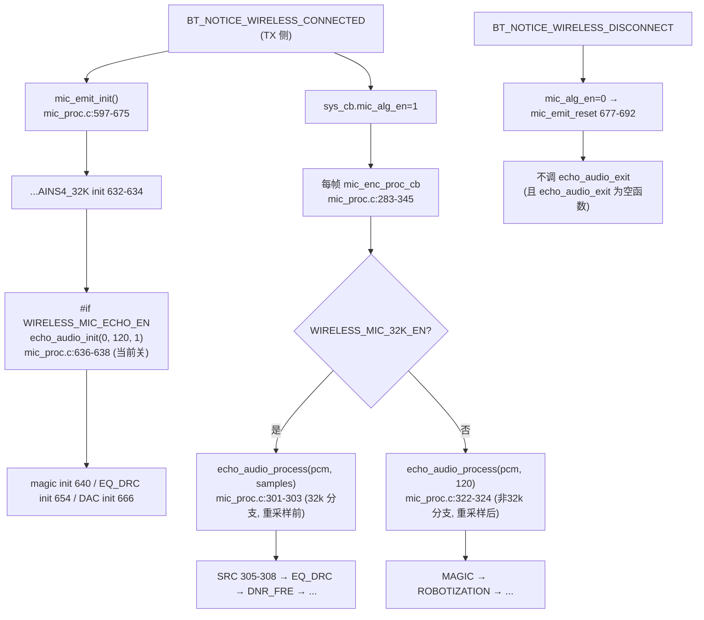
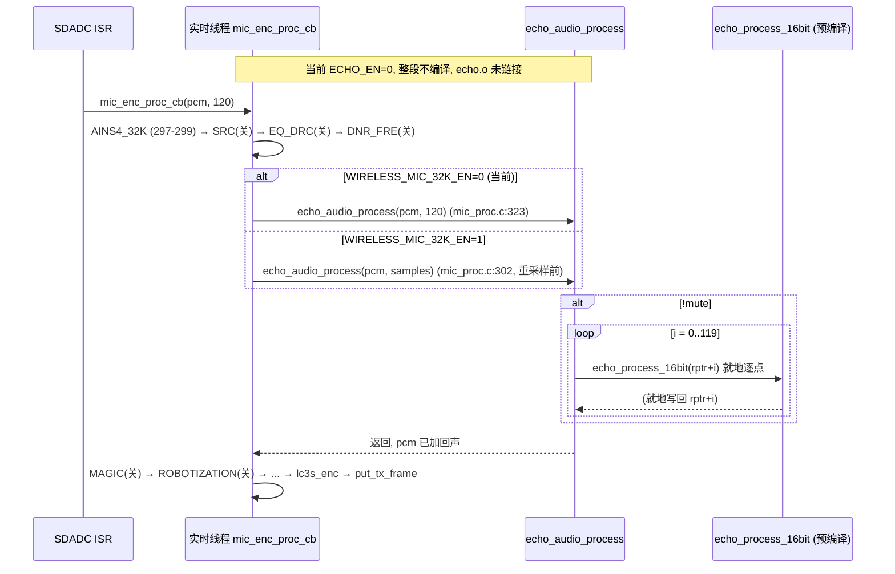

# 07 ECHO 混响

> 本文梳理 ECHO（回声/混响音效）的配置宏、强弱符号空 stub 机制、调用链、参数结构体、控制面等级与 RX 同步、在线调试回调、段放置与互斥预留。所有结论来自源码实际引用关系（文件、函数、行号）。ECHO 包装源码（`modules/voice/echo.c`、`echo.h`）已纳入仓库；内核 `echo_init_16bit`/`echo_process_16bit`/`echo_update_param_16bit` 来自预编译库 `libs/`（`api_alg.h` 声明），内部数学不推测。当前 `ECHO_EN=0`，模块不编译、不链接、不进入运行时链，本篇为设计记录。

---

## 1. 配置宏与当前编译状态

### 1.1 宏定义链

ECHO 的编译期开关由两层宏控制：

- 设备端使能（TX） [config_ab5766_le_mic.h:101-102](../../../projects/microphone/config_ab5766_le_mic.h#L101-L102)：

  ```c
  #define WIRELESS_MIC_ECHO_EN                    0               //发射端是否开启 ECHO音效
  #define WIRELESS_MIC_ECHO_DELAY                 WIRELESS_MIC_ECHO_EN*200//ECHO运算时间
  ```

- 算法参数区派生宏 [config_ab5766_le_mic.h:139](../../../projects/microphone/config_ab5766_le_mic.h#L139)：

  ```c
  #define ECHO_EN                                 (WIRELESS_MIC_ECHO_EN)
  ```

`ECHO_EN` 是包装层 [echo.c:13](../../../modules/voice/echo.c#L13) `#if ECHO_EN` 的编译开关。当前 `WIRELESS_MIC_ECHO_EN=0` → `ECHO_EN=0`，**整个 ECHO 模块不编译**。

### 1.2 ECHO 参数宏

[config_ab5766_le_mic.h:139-146](../../../projects/microphone/config_ab5766_le_mic.h#L139-L146)：

```c
#define ECHO_EN                                 (WIRELESS_MIC_ECHO_EN)
#define ECHO_LEVEL			                    70              //attenuation  range:0-90
#define ECHO_DRY_USER                           32767           //干度 range:0-32767
#define ECHO_WET_USER                           20000           //湿度 range:0-32767
#define ECHO_DELAY_MAX_LEVEL                    9               //echo延迟等级划分
#define ECHO_DELAY_DEFAULT_LEVEL                8               //echo第一次上电默认等级 range:1-ECHO_DELAY_MAX_LEVEL
#define ECHO_DELAY_BUF_SIZE                     6000            //echo缓存大小（单位：样点数）
#define ECHO_ATTENUATION_MAX_LEVEL              16
```

| 宏 | 值 | 语义（厂商注释） |
|---|---|---|
| `ECHO_LEVEL` | 70 | attenuation 初始值，范围 0~90 |
| `ECHO_DRY_USER` | 32767 | 干声增益 |
| `ECHO_WET_USER` | 20000 | 湿声（回声）增益 |
| `ECHO_DELAY_MAX_LEVEL` | 9 | delay 等级数（0~8 共 9 档） |
| `ECHO_DELAY_DEFAULT_LEVEL` | 8 | 上电默认 delay 等级 |
| `ECHO_DELAY_BUF_SIZE` | 6000 | delay 缓冲样点数 |
| `ECHO_ATTENUATION_MAX_LEVEL` | 16 | attenuation 等级数（0~15 共 16 档） |

### 1.3 采样率与帧长（编译期分支）

[echo.c:15-23](../../../modules/voice/echo.c#L15-L23)：

```c
#if WIRELESS_MIC_32K_EN
#define ECHO_SAMPLE_RATE             32000
#define FRAME_LEN		             80
#else
#define ECHO_SAMPLE_RATE             48000
#define FRAME_LEN		             120
#endif

#define MAX_DELAY_LENGTH             (ECHO_DELAY_BUF_SIZE/((ECHO_SAMPLE_RATE >> 1) * 0.001f))
```

当前 `WIRELESS_MIC_32K_EN=0`（[config:116](../../../projects/microphone/config_ab5766_le_mic.h#L116)），走 else：`ECHO_SAMPLE_RATE=48000`、`FRAME_LEN=120`，与全局 `WIRELESS_MIC_SAMPLES_SELECT=120`（[config:78](../../../projects/microphone/config_ab5766_le_mic.h#L78)）一致。

`MAX_DELAY_LENGTH = 6000 / ((48000>>1) * 0.001) = 6000 / 24 = 250`。即 delay 缓冲支持的最大 delay 时间为 250（单位由内核定义，注释标"最大delay时间"）。注意 [echo.h:24](../../../modules/voice/echo.h#L24) 参数 doc 写 `delay_length 0~400`，但 `MAX_DELAY_LENGTH` 实际算出 250——`echo_audio_param_set` 会 clamp `delay_length` 到 `max_delay_len`（[echo.c:215](../../../modules/voice/echo.c#L215) 附近）。**这是可观测约束：注释标称 0~400，实际 buf 只支持到 250**，记录为事实，不据此推断内核时间单位。

---

## 2. 强弱符号与空 stub 机制（重要）

ECHO 的控制面函数（delay 等级增减/查询、mute）在 `ECHO_EN=0` 时并非"不存在"，而是被 [strong_ble.c:220-227](../../../projects/microphone/strong_ble.c#L220-L227) 的 `#if !ECHO_EN` 空 stub 替代：

```c
#if !ECHO_EN
void echo_delay_level_set(u8 delay_level){}
void echo_audio_mute_set(uint8_t mute){}
void echo_delay_level_down(void){}
void echo_delay_level_up(void){}
u8 echo_delay_level_get(void){ return 0; }
bool echo_delay_level_is_max_min(void){ return false; }
#endif
```

这是与 Soft Gain 不同的机制（Soft Gain 的 `up/down/set_level` 在 `EQ_DRC_EN=0` 时仍链接有实现版本，因无此 stub 保护）。ECHO 的控制面函数在 `ECHO_EN=0` 时**全部退化为空函数或返回固定值**：

- `echo_delay_level_up/down`：空函数体，`echo_cfg.delay_level` 不存在（echo.c 未编译），等级不变化。
- `echo_delay_level_get`：恒返回 0。
- `echo_delay_level_is_max_min`：恒返回 `false`。
- `echo_audio_mute_set`：空函数。

### 2.1 map.txt 证据（验证 stub 与未链接状态）

**echo.o 整体未链接**（[map.txt:1107-1114](../../../projects/microphone/Output/bin/map.txt#L1107-L1114)）：

```
 .text          0x00000000        0x0 Output\obj\modules\voice\echo.o
 .data          0x00000000        0x0 Output\obj\modules\voice\echo.o
 .bss           0x00000000        0x0 Output\obj\modules\voice\echo.o
```

`.text/.data/.bss` 全为 0 大小，证实 `echo_audio_init`/`echo_audio_process`/`echo_audio_input`/`echo_audio_param_set`/`echo_audio_exit`（均在 `#if ECHO_EN` 内）**全部未链接**。

**控制面空 stub 已链接**（来自 strong_ble.o）：

- [map.txt:1241-1244](../../../projects/microphone/Output/bin/map.txt#L1241-L1244)：`.text.echo_delay_level_set` 与 `.text.echo_audio_mute_set`，地址 `0x00000000`（未分配运行地址，0x2 字节 stub）。
- [map.txt:3410-3421](../../../projects/microphone/Output/bin/map.txt#L3410-L3421)：
  - `echo_delay_level_down` @ `0x1000d626`（0x2 字节，strong_ble.o）
  - `echo_delay_level_up` @ `0x1000d628`（0x2 字节，strong_ble.o）
  - `echo_delay_level_get` @ `0x1000d62a`（0x4 字节，strong_ble.o）
  - `echo_delay_level_is_max_min` @ `0x1000d62e`（0x4 字节，strong_ble.o）

这些符号地址在 `0x1000d6xx`（Flash/ROM 区），大小 0x2/0x4 字节，正是空 stub 的特征（`{}` 或 `return 0`/`return false` 的极小函数体）。

**RX 同步函数已链接**：[map.txt:3326](../../../projects/microphone/Output/bin/map.txt#L3326) `wireless_tx_echo_delay_level` @ `0x1000d430`。该函数将 echo 等级同步给 RX，当前因 stub 返回 0/false，实际同步的是"等级 0、未到极值"。

**在线调试回调已链接但走失败分支**：[map.txt:3182-3184](../../../projects/microphone/Output/bin/map.txt#L3182-L3184) `mic_echo_effect_update_callback` @ `0x1000cad6`。该函数体在 `#if ECHO_EN` 的 `#else` 提供失败分支 `toolkit_ack_fail()`（[toolkit_effect.c:141](../../../modules/tool/toolkit_effect.c#L141)），即在线调音工具下发 ECHO 参数时收到 ACK 失败。

---

## 3. 调用链：init / process / exit

> 以下调用点均在 `#if WIRELESS_MIC_ECHO_EN`（=0）内，**当前不编译**。本节为设计记录，描述 `ECHO_EN=1` 时的接线。



### 3.1 init：mic_emit_init

[mic_emit_init()](../../../modules/wireless/mic_proc.c#L636-L638) 中 ECHO 初始化位于 AINS4_32K（[632-634](../../../modules/wireless/mic_proc.c#L632-L634)）之后、MAGIC（[640](../../../modules/wireless/mic_proc.c#L640)）之前：

```c
#if WIRELESS_MIC_ECHO_EN
    echo_audio_init(0, WIRELESS_MIC_SAMPLES_SELECT, 1);
#endif
```

参数：`sample_rate=0`（即 `SAMPLE_RATE_48K`，见 [05_PLC丢包隐藏.md](05_PLC丢包隐藏.md) 第 1.2 节枚举表）、`samples=120`、`channel=1`。

[echo_audio_init](../../../modules/voice/echo.c#L238-L287)（`AT(.text.echo_set)`）核心：

```c
memset(&echo_cfg, 0, sizeof(echo_cfg_t));
memset(&echo_init_cfg, 0, sizeof(echo_init_t));
memset(delay_lbuf, 0, sizeof(delay_lbuf));

echo_cfg.sample_rate   = sample_rate;                 // 校验 48k/32k
echo_cfg.max_delay_len = MAX_DELAY_LENGTH;            // 250
echo_cfg.delay_len_step= echo_cfg.max_delay_len/(ECHO_DELAY_MAX_LEVEL - 1);  // 250/8≈31
echo_cfg.delay_level   = ECHO_DELAY_DEFAULT_LEVEL - 1; // 8-1=7

echo_init_cfg.skip_flag       = 1;                   // 开启后相同 buf 最大 delay 可多一倍
echo_init_cfg.lp_filter_en    = 0;
echo_init_cfg.attenuation_set = ECHO_LEVEL;           // 70
echo_init_cfg.delay_set       = echo_cfg.delay_level * echo_cfg.delay_len_step;  // 7*31=217
echo_init_cfg.dry             = ECHO_DRY_USER;        // 32767
echo_init_cfg.wet             = ECHO_WET_USER;        // 20000
echo_init_cfg.cutoffFreq_set  = 1000;
echo_init_cfg.delay_lbuf_set  = delay_lbuf;
echo_init_cfg.sample_rate     = SAMPLE_RATE_48K;      // #else 分支
echo_init_16bit(&echo_init_cfg);                     // 预编译内核
```

要点：
1. **三段 memset**：清 `echo_cfg`（管理态）、`echo_init_cfg`（内核参数）、`delay_lbuf`（延迟缓冲）。
2. **delay 等级步进**：`max_delay_len/(MAX_LEVEL-1) = 250/8 ≈ 31`，每档约 31 单位。默认等级 7（`DEFAULT_LEVEL-1`）对应 delay ≈ 217。
3. **skip_flag=1**：[echo_init_t](../../../libs/api_alg.h#L53-L63) 注释"开启后相同 buf 最大 delay 可多一倍"，即让 delay_lbuf 复用实现双倍最大 delay。这是内核参数，不展开内部实现。
4. **调 `echo_init_16bit`**：预编译内核，传入完整的 `echo_init_t`。

### 3.2 process：每帧 mic_enc_proc_cb

ECHO 的每帧调用分两个条件分支（取决于 `WIRELESS_MIC_32K_EN`）：

**32k 分支**（[mic_proc.c:301-303](../../../modules/wireless/mic_proc.c#L301-L303)，重采样**前**）：

```c
#if WIRELESS_MIC_ECHO_EN && WIRELESS_MIC_32K_EN
    echo_audio_process(pcm, samples);
#endif
```

**非 32k 分支**（[mic_proc.c:322-324](../../../modules/wireless/mic_proc.c#L322-L324)，重采样**后**）：

```c
#if WIRELESS_MIC_ECHO_EN && !WIRELESS_MIC_32K_EN
    echo_audio_process(pcm, WIRELESS_MIC_SAMPLES_SELECT);
#endif
```

当前 `WIRELESS_MIC_32K_EN=0`，走非 32k 分支（[322-324](../../../modules/wireless/mic_proc.c#L322-L324)）。该分支位于 SRC（[305-308](../../../modules/wireless/mic_proc.c#L305-L308)，当前关）、EQ_DRC（[314-316](../../../modules/wireless/mic_proc.c#L314-L316)，当前关）、DNR_FRE（[318-320](../../../modules/wireless/mic_proc.c#L318-L320)，当前关）之后，MAGIC（[326-328](../../../modules/wireless/mic_proc.c#L326-L328)）之前。

即 TX 链顺序（当前生效部分）：AINS4_32K → (SRC 关) → (EQ_DRC 关) → (DNR_FRE 关) → **ECHO** → MAGIC → ROBOTIZATION → ROOM_REVERB → AGC。

[echo_audio_process](../../../modules/voice/echo.c#L38-L47)（`AT(.text.echo_proc.input)`）：

```c
void echo_audio_process(s16 *ptr, u32 samples)
{
    s16 *rptr = ptr;
    if(!echo_cfg.mute){
        for(u8 i=0;i<samples;i++){
            echo_process_16bit(rptr+i);
        }
    }
}
```

逐点调用预编译内核 `echo_process_16bit(rptr+i)`，**就地处理**（写回原缓冲）。`mute` 时整段跳过（不memset，区别于 `echo_audio_mute_set` 的 mute 时清 delay_lbuf）。

> 另有 [alg_echo_audio_input](../../../modules/voice/echo.c#L50-L76)（`AT(.text.echo_proc.input)`），注释"只有本地麦在线，没有无线麦链接时在此接口处理echo音效"，含 UARTDUMP 逻辑。全仓 Grep 确认 `alg_echo_audio_input` 无外部调用点（当前不被接入链路），记录为"已实现但未接线"。
>
> [echo_audio_input](../../../modules/voice/echo.c#L78-L93)（带 callback 版本）同样无外部调用点（mic_proc.c 调的是 `echo_audio_process` 不是 `echo_audio_input`）。`echo_audio_output_callback_set` 无调用点，`callback` 保持 NULL。记录这些为"已实现但未接入运行时链"。

### 3.3 exit / reset（不对称）

[echo_audio_exit](../../../modules/voice/echo.c#L289-L292)（`AT(.text.echo_exit)`）是**空函数**：

```c
void echo_audio_exit(void)
{
}
```

且 [mic_emit_reset](../../../modules/wireless/mic_proc.c#L677-L692) **不调** `echo_audio_exit`（Grep 确认 mic_proc.c 无 `echo_audio_exit` 调用）。即 ECHO 无逐连接 reset，与 PLC（有 `plc_soft_exit` 复位式退出）不同。TX 侧 ECHO 资源靠断开 + `mic_alg_en=0` + 整体复位回收。

---

## 4. 参数结构体与默认值

### 4.1 echo_init_t（内核初始化参数）

[api_alg.h:52-63](../../../libs/api_alg.h#L52-L63)：

```c
///ECHO 算法结构体以及相关API声明
/*初始化参数结构体*/
typedef struct {
    u8   skip_flag;			/*开启后相同buf最大delay可多一倍*/
    u8   lp_filter_en;       /*滤波器使能*/
    u8   attenuation_set;    /*1-9 ->10percent-90percent*/
    u16  delay_set;          /*1-500ms*/
    u16  dry;
    u16  wet;
    s16 *delay_lbuf_set;
    u32  cutoffFreq_set;     /*截至频率选择*/
    u8 sample_rate;   //采样率
} echo_init_t;
```

| 字段 | 类型 | 厂商注释（可记录，不展开内部数学） |
|---|---|---|
| `skip_flag` | u8 | 开启后相同 buf 最大 delay 可多一倍 |
| `lp_filter_en` | u8 | 低通滤波器使能（0/1） |
| `attenuation_set` | u8 | 注释"1-9 ->10percent-90percent"（但 `ECHO_LEVEL=70`，与注释范围不符，属厂商注释与实际配置的差异，记录为事实） |
| `delay_set` | u16 | 注释"1-500ms"（但 MAX_DELAY_LENGTH=250，实际受 buf 上限约束） |
| `dry` | u16 | 干声增益 |
| `wet` | u16 | 湿声（回声）增益 |
| `delay_lbuf_set` | s16* | 延迟缓冲指针（指向 `delay_lbuf[6000]`） |
| `cutoffFreq_set` | u32 | 低通截止频率 |
| `sample_rate` | u8 | 采样率（48k/32k） |

> `attenuation_set` 的注释"1-9 ->10percent-90percent"与实际 `ECHO_LEVEL=70` 存在差异。可能内核对 `attenuation` 的解释在 `echo_audio_param_set`（0~90 范围）与 `echo_init_t.attenuation_set`（注释 1-9）之间有映射，但内核源码不可读，**不据此断言**。记录为"字段注释与配置值存在可观测差异"。

### 4.2 echo_cfg_t（管理模块结构体）

[echo.h:6-15](../../../modules/voice/echo.h#L6-L15)：

```c
typedef struct {
    u8 mute;
    u8 sample_rate;
    u16 samples;
    u16 max_delay_len;
    u16 delay_len_step;
    u16 delay_level;
    u16 attenuation_level;
    audio_callback_t callback;
} echo_cfg_t;
```

字段：`mute`（静音标志）、`sample_rate`/`samples`（帧参数）、`max_delay_len`/`delay_len_step`/`delay_level`（delay 等级管理）、`attenuation_level`（attenuation 等级管理）、`callback`（输出回调，未接）。

> `echo.h` **不声明** `echo_init_t` 结构体（在 `api_alg.h`）与内核函数（`echo_process_16bit`/`echo_init_16bit`/`echo_update_param_16bit`，在 `api_alg.h:65-67`）。包装层与内核边界清晰。

### 4.3 echo_audio_param_set 参数语义

[echo.h:23-30](../../../modules/voice/echo.h#L23-L30) 厂商参数 doc：

```c
/// attenuation:    混响次数  0~90
/// delay_length:   每一声混响之间的间隔  0~400
/// cutoffFreq_set: 低通滤波器的截止频率  1~4000
/// lp_filter_en:   低通滤波器的开关      0：关 1：开
/// dry_set:        原始声音               0~49152（Q15即0~1.5）
/// wet_set:        回声湿度，越大所占比例越大  0~32768（Q15 即0~1.0）
/// 默认配置 echo_audio_param_set(55,250,1000,1,32768,15000)
```

| 参数 | 范围（注释） | 语义 |
|---|---|---|
| `attenuation` | 0~90 | 混响次数 |
| `delay_length` | 0~400 | 每一声混响间隔（实际受 MAX=250 约束） |
| `cutoffFreq_set` | 1~4000 | 低通截止频率 |
| `lp_filter_en` | 0/1 | 低通开关 |
| `dry_set` | 0~49152 | 干声（Q15 0~1.5） |
| `wet_set` | 0~32768 | 湿声（Q15 0~1.0） |

[echo_audio_param_set](../../../modules/voice/echo.c#L206-L236)（`AT(.text.echo_set.param)`）核心：clamp `attenuation<90`、`delay_length<max_delay_len`，填充 `echo_init_cfg`，调 `echo_update_param_16bit(&echo_init_cfg, 0)`（预编译内核，第二参数 `fade_en=0` 不渐变）。

> 这些是厂商注释给出的可观测物理含义（混响次数、截止频率、Q15 比例），作测试观测参考，**非内核数学证明**。`dry/wet` 的 Q15 标注与 [06_EQ_DRC_PACC框架与SoftGain.md](06_EQ_DRC_PACC框架与SoftGain.md) Soft Gain 的 Q15 一致。

---

## 5. 控制面：delay/attenuation 等级与 RX 同步

### 5.1 delay 等级控制

[msg_mic_emit.c:78-96](../../../functions/msg_mic_emit.c#L78-L96)：

```c
case MSG_ECHO_LEVEL_UP:
    printf("MSG_ECHO_LEVEL_UP\n");
    if(!wireless_mic_connected_sta_get()) { break; }
    echo_delay_level_up();             //混响音量VOL+
    wireless_tx_echo_delay_level(echo_delay_level_get(),echo_delay_level_is_max_min());
    break;

case MSG_ECHO_LEVEL_DOWN:
    printf("MSG_ECHO_LEVEL_DOWN\n");
    echo_delay_level_down();            //混响音量VOL-
    if(!wireless_mic_connected_sta_get()) { break; }
    wireless_tx_echo_delay_level(echo_delay_level_get(),echo_delay_level_is_max_min());
    break;
```

控制面流程：MSG 触发 → `echo_delay_level_up/down` 更新本地 `echo_cfg.delay_level`（0~8 循环）→ `echo_delay_len_set` 转 `echo_audio_param_set` 下发给内核 → `wireless_tx_echo_delay_level` 把等级与极值标志同步给 RX。

[echo_delay_level_up](../../../modules/voice/echo.c#L129-L136) 等（均在 `#if ECHO_EN` 内，当前不编译）：

```c
void echo_delay_level_up(void) {
    if (echo_cfg.delay_level < (ECHO_DELAY_MAX_LEVEL - 1)) echo_cfg.delay_level += 1;
    echo_delay_len_set(echo_cfg.delay_level * echo_cfg.delay_len_step);
}
```

等级在 0..8 间增减，每档步进 ≈31，转成 delay_len 后下发。

### 5.2 attenuation 等级控制

[echo.c:172-197](../../../modules/voice/echo.c#L172-L197)：`echo_attenuation_level_set` 把 0..15 的等级映射成 `level * (90/(16-1)) = level*6` 的 attenuation 值（0~90），再 `echo_attenuation_set` → `echo_audio_param_set`。

`echo_attenuation_level_change` 在 0..16 间循环（[192-196](../../../modules/voice/echo.c#L192-L196)）。

> **attenuation 控制面未接消息**：Grep 确认 `msg_mic_emit.c` 只处理 `MSG_ECHO_LEVEL_UP/DOWN`（delay 等级），**无** attenuation 的 MSG 入口。`echo_attenuation_level_change/set` 全仓除 echo.c 自身外无外部调用点。即 attenuation 只能通过在线调音工具（`mic_echo_effect_update_callback`）或 init 默认值设置，无按键入口。记录为"attenuation 控制面未接消息"。

### 5.3 当前 stub 下的实际行为（重要）

当前 `ECHO_EN=0`，`echo_delay_level_up/down/get/is_max_min` 是 [strong_ble.c](../../../projects/microphone/strong_ble.c#L220-L227) 的空 stub。故：

- `MSG_ECHO_LEVEL_UP/DOWN` 触发后：`echo_delay_level_up/down` 是空函数（等级不变化）→ `echo_delay_level_get` 返回 0 → `echo_delay_level_is_max_min` 返回 false → `wireless_tx_echo_delay_level(0, false)` 同步给 RX 的是"等级 0、未到极值"。
- 即按键事件被 printf 记录、同步命令发出，但 echo 等级实际未变化、echo 音效实际不生效（因 `echo_audio_process` 也未链接）。

这与 [06_EQ_DRC_PACC框架与SoftGain.md](06_EQ_DRC_PACC框架与SoftGain.md) Soft Gain 的情况**类似但有区别**：Soft Gain 的 `up/down` 是有实现的（无 stub 保护），故等级会变化但 `proc` 未链接致对音频无作用；ECHO 的 `up/down` 是空 stub，等级都不变化。两者都属"控制面动作但算法不生效"。

---

## 6. 在线调试回调：CFG_ECHO → mic_echo_effect_update_callback

### 6.1 effect_table 映射

[effect_table.c:4-20](../../../modules/effect/effect_table.c#L4-L20)：

```c
const effect_update_callback_t effect_update_callback_tbl[CFG_MAX] = {
    [CFG_MIC_EQ]   = {local_mic_eq_effect_update_callback},
    [CFG_MIC_DRC]  = {local_mic_drc_effect_update_callback},
    [CFG_ECHO]     = {mic_echo_effect_update_callback},
    [CFG_MAGIC]    = {mic_magic_effect_update_callback},
    [CFG_MIX_EQ]   = {mix_mic_eq_effect_update_callback},
    [CFG_MIX_DRC]  = {mix_mic_drc_effect_update_callback},
};

const u8 effect_offset_tbl[EFFECT_IDX_MAX_NB] = {
    [EFFECT_IDX_LOC_MIC_ECHO]   = CFG_ECHO,
    ...
};
```

`EFFECT_IDX_LOC_MIC_ECHO` → `CFG_ECHO` → `mic_echo_effect_update_callback`。即在线调音工具下发 ECHO 参数时，经 effect_table 分发到此回调。

### 6.2 mic_echo_effect_update_callback

[toolkit_effect.c:123-143](../../../modules/tool/toolkit_effect.c#L123-L143)：

```c
void mic_echo_effect_update_callback(u8 *buf, u32 len, u8 params)
{
#if ECHO_EN
    tool_echo_pitch_coef_t *tool_echo_pitch_coef = (tool_echo_pitch_coef_t *)(buf + 14);//去掉包头
    if(params == 1 && (sys_cb.mic_alg_en)){//update
        TRACE("channel %d\n", ...);
        TRACE("enable %d\n", ...);
        TRACE("lp_filter_en %d\n", ...);
        TRACE("attention %d\n", ...);
        TRACE("delay %d\n", ...);
        TRACE("cutoff_freq %d\n", ...);
        TRACE("dry %d\n", ...);
        TRACE("wet %d\n", ...);
        echo_audio_param_set(tool_echo_pitch_coef->attention, tool_echo_pitch_coef->delay,
                             tool_echo_pitch_coef->cutoff_freq, tool_echo_pitch_coef->lp_filter_en,
                             tool_echo_pitch_coef->dry, tool_echo_pitch_coef->wet);
    } else {
        toolkit_ack_fail();
    }
#else
    toolkit_ack_fail();
#endif
}
```

当前 `ECHO_EN=0` 走 `#else` 的 `toolkit_ack_fail()`，即在线调音工具下发 ECHO 参数收到 ACK 失败。`ECHO_EN=1` 时：校验 `params==1 && mic_alg_en`，解析包头后 14 字节的 `tool_echo_pitch_coef_t`（含 channel/enable/lp_filter_en/attention/delay/cutoff_freq/dry/wet），TRACE 打印后调 `echo_audio_param_set` 下发内核。

> 参数名 `attention`（回调字段）与 `attenuation`（echo_audio_param_set 形参）拼写不同，疑为同一概念的不同拼写，记录为事实，不臆断是否笔误。

---

## 7. 段放置与资源

### 7.1 AT 标注

[echo.c](../../../modules/voice/echo.c) 的 AT 标注（均在 `#if ECHO_EN` 内，当前不编译、不分配）：

- `AT(.buf.echo)`：`echo_init_cfg`（[34](../../../modules/voice/echo.c#L34)）、`echo_cfg`（[35](../../../modules/voice/echo.c#L35)）、UARTDUMP 相关 buf（[28-31](../../../modules/voice/echo.c#L28-L31)，`UARTDUMP_ECHO_EN=0` 不编译）。
- `AT(.buf.echo.delay)`：`delay_lbuf[ECHO_DELAY_BUF_SIZE=6000]`（[36](../../../modules/voice/echo.c#L36)），6000 个 s16 = 12000 字节。
- `AT(.text.echo_proc.input)`：`echo_audio_process`（[38](../../../modules/voice/echo.c#L38)）、`alg_echo_audio_input`（[50](../../../modules/voice/echo.c#L50)）、`echo_audio_input`（[78](../../../modules/voice/echo.c#L78)）。
- `AT(.text.echo_set)`：`echo_delay_len_set`/`echo_delay_level_*`/`echo_attenuation_*`/`echo_audio_init`（[113](../../../modules/voice/echo.c#L113) 等）。
- `AT(.text.echo_set.param)`：`echo_audio_param_set`（[206](../../../modules/voice/echo.c#L206)）。
- `AT(.text.echo_set.mute)`：`echo_audio_mute_set`（[101](../../../modules/voice/echo.c#L101)）。
- `AT(.text.echo_set.callback)`：`echo_audio_output_callback_set`（[95](../../../modules/voice/echo.c#L95)）。
- `AT(.text.echo_get)`：`echo_delay_level_get`/`is_max_min`（[147](../../../modules/voice/echo.c#L147)/[153](../../../modules/voice/echo.c#L153)）。
- `AT(.text.echo_exit)`：`echo_audio_exit`（[289](../../../modules/voice/echo.c#L289)）。

### 7.2 文件头资源注释

[echo.c:4-12](../../../modules/voice/echo.c#L4-L12)：

```
功能描述: 本文件为软件ECHO处理模块
暂时只支持48k采样率
code :
buf  : 10000*2 Bytes
time : 160M 下 120 个点处理 147us
```

`buf 10000*2 = 20000` 字节包含 `delay_lbuf[6000]`(12000) + `echo_init_cfg`/`echo_cfg` + UARTDUMP buf。`time 147us@160M` 是单帧预算，与 [config:102](../../../projects/microphone/config_ab5766_le_mic.h#L102) `WIRELESS_MIC_ECHO_DELAY = ECHO_EN*200`（µs 量级预算）同阶。注意"暂时只支持48k采样率"——但源码有 32k 分支（[15-21](../../../modules/voice/echo.c#L15-L21)），文件头注释与代码存在张力，记录为事实。

### 7.3 .mram_echo 与 .mram_reverb 互斥预留（重要）

[map.txt:2788-2794](../../../projects/microphone/Output/bin/map.txt#L2788-L2794)：

```
.mram_echo      0x00018000     0x6000
                0x00006000                        . = 0x6000
 *fill*         0x00018000     0x6000

.mram_reverb    0x00018000     0x6000
                0x00006000                        . = 0x6000
 *fill*         0x00018000     0x6000
```

**`.mram_echo` 与 `.mram_reverb` 同地址 `0x00018000`、同大小 `0x6000`（24KB）**。二者当前都是 `*fill*`（填充，因 `ECHO_EN=0` 且 `ROOM_REVERB_EN=0`，无实际数据落入）。但段定义本身揭示：**ECHO 与 ROOM_REVERB 共用同一块 MRAM 区域（0x18000 起 24KB），同一时刻只能有一个算法占用**。

这是 ECHO 与 ROOM_REVERB 不能同时开启的**内存层面证据**，与 [CLAUDE.md](../../../CLAUDE.md) 记录的"Room Reverb 与 ECHO 同时开启时，源码中 Room Reverb 会被自动 mute（见 [modules/voice/room_reverb.c](../../../modules/voice/room_reverb.c)）"互为印证——既有源码层 mute 保护，又有链接器层段互斥预留。详见 [08_ROOM_REVERB房间混响.md](08_ROOM_REVERB房间混响.md)。

---

## 8. 完整调用链（TX 侧，当前关闭）



---

## 9. 预编译库边界

| 项目 | 来源 | 可记录 | 不可推测 |
|---|---|---|---|
| `echo_init_16bit(echo_init_t *p)` | [api_alg.h:65](../../../libs/api_alg.h#L65) | API、参数字段、调用时机（init 一次性） | 内部状态/延迟线初始化 |
| `echo_update_param_16bit(echo_init_t *p, u8 fade_en)` | [api_alg.h:66](../../../libs/api_alg.h#L66) | API、参数字段、`fade_en` 语义（0 不渐变） | 渐变实现、参数映射内部 |
| `echo_process_16bit(s16 *ldata)` | [api_alg.h:67](../../../libs/api_alg.h#L67) | API、逐点就地处理、16bit 单声道 | 反馈延迟线/低通/干湿混合内部数学 |

`echo_init_16bit`/`echo_process_16bit`/`echo_update_param_16bit` 内核在 `libs/` 预编译库，源码不可见。文件头"软件ECHO处理模块"为厂商命名，不作为算法已验证结论。从字段名（`delay_lbuf`/`dry`/`wet`/`cutoffFreq`/`attenuation`/`lp_filter_en`）可推断涉及**延迟线 + 干湿混合 + 低通滤波 + 衰减反馈**的经典回声结构，但**这是结构线索非内核验证**，不据此断言具体滤波器阶数/反馈系数实现。ECHO 是回声音效，**不是回声消除 AEC**（AEC 用于消去扬声器回采到麦克风的回声，方向与目的相反）。

---

## 10. 知识点小结

1. **当前不编译**：`WIRELESS_MIC_ECHO_EN=0` → `ECHO_EN=0`，`echo.c` 全文在 `#if ECHO_EN` 内不编译，`echo.o` 的 .text/.data/.bss 全 0（[map.txt:1107-1114](../../../projects/microphone/Output/bin/map.txt#L1107-L1114)），`echo_audio_init/process/input/param_set/exit` 全部未链接。本篇为设计记录。
2. **空 stub 机制**：`strong_ble.c:220-227` 的 `#if !ECHO_EN` 提供 `echo_delay_level_up/down/get/is_max_min`/`echo_audio_mute_set`/`echo_delay_level_set` 的空实现。当前这些控制面函数退化为空函数/返回固定值（[map.txt:3410-3421](../../../projects/microphone/Output/bin/map.txt#L3410-L3421) 来自 strong_ble.o，0x2/0x4 字节）。与 Soft Gain 不同（Soft Gain 的 up/down 无 stub 保护，仍链接有实现版本）。
3. **控制面动作但算法不生效**：`MSG_ECHO_LEVEL_UP/DOWN` 触发后 `echo_delay_level_up/down` 是空 stub（等级不变），`get` 返回 0，`wireless_tx_echo_delay_level(0, false)` 同步给 RX 的是空值。按键事件被 printf 记录、同步命令发出，但 echo 等级与音效均不实际变化。
4. **ECHO ≠ AEC**：ECHO 是回声/混响音效（在 TX 麦克风信号上叠加延迟回声），AEC（Acoustic Echo Cancellation）是回声消除（消去扬声器回采回声）。方向与目的相反，不混用术语。
5. **逐点就地处理**：`echo_audio_process` 逐点调 `echo_process_16bit(rptr+i)`，就地写回原缓冲，无乒乓、无帧延迟（与 AINS4_32K 异步不同）。
6. **两个 process 分支**：32k 分支（[301-303](../../../modules/wireless/mic_proc.c#L301-L303)，重采样前）与非 32k 分支（[322-324](../../../modules/wireless/mic_proc.c#L322-L324)，重采样后）。当前 `WIRELESS_MIC_32K_EN=0` 走非 32k 分支。两分支互斥（`&& WIRELESS_MIC_32K_EN` 与 `&& !WIRELESS_MIC_32K_EN`）。
7. **链路位置**：ECHO 在 DNR_FRE 之后、MAGIC 之前（[mic_proc.c:322-324](../../../modules/wireless/mic_proc.c#L322-L324)），处理已过 AINS4_32K/SRC/EQ_DRC/DNR_FRE 的信号。
8. **纯 TX 模块**：ECHO 仅在 TX 侧（`mic_emit_init`/`mic_enc_proc_cb`）接线，RX 侧（`adapter_init`/`mic_dec_prco_cb`）无 echo 调用。echo 是发射端音效。
9. **delay 上限约束**：`MAX_DELAY_LENGTH = ECHO_DELAY_BUF_SIZE/((SR>>1)*0.001) = 6000/24 = 250`。注释标 `delay_length 0~400`，但 buf 实际只支持到 250，`echo_audio_param_set` 会 clamp。可观测约束。
10. **attenuation 控制面未接消息**：`msg_mic_emit.c` 只处理 delay 等级（`MSG_ECHO_LEVEL_UP/DOWN`），无 attenuation 的 MSG 入口。attenuation 只能经在线调音工具或 init 默认值设置。
11. **空 exit + reset 不对称**：`echo_audio_exit` 是空函数，且 `mic_emit_reset` 不调它。ECHO 无逐连接 reset，与 PLC（复位式 exit）不同。
12. **MRAM 互斥预留**：`.mram_echo` 与 `.mram_reverb` 同地址 `0x18000`、同大小 `0x6000`，ECHO 与 ROOM_REVERB 共用同一块 MRAM，内存层面互斥。与源码层 mute 保护（ECHO 同开时 Room Reverb 自动 mute）双重约束。
13. **未接线函数**：`alg_echo_audio_input`（本地麦无连接时处理 echo，无外部调用点）、`echo_audio_input`（带 callback 版本，mic_proc 调的是 `echo_audio_process`）、`echo_audio_output_callback_set`（callback 保持 NULL）。已实现但未接入运行时链。
14. **内核边界**：`echo_init_16bit`/`echo_process_16bit`/`echo_update_param_16bit` 来自 `libs/`，只记 API、参数、时机、输入输出，不推测延迟线/低通/干湿混合内部数学。字段名是结构线索非结论。

---

## 11. 延伸阅读

- [00_算法总览与全局调用关系.md](00_算法总览与全局调用关系.md)（TX 算法链全貌）
- [01_系统初始化与角色调度.md](01_系统初始化与角色调度.md)（连接驱动生命周期、`mic_alg_en` 总闸）
- [02_TX上行采集与编码骨架.md](02_TX上行采集与编码骨架.md)（`mic_enc_proc_cb` 每帧链、`mic_emit_init`/`reset`）
- [06_EQ_DRC_PACC框架与SoftGain.md](06_EQ_DRC_PACC框架与SoftGain.md)（Soft Gain 的"控制面动作但算法不生效"对照、空 stub 与无 stub 的差异、Q15 一致性）
- [08_ROOM_REVERB房间混响.md](08_ROOM_REVERB房间混响.md)（`.mram_echo`/`.mram_reverb` 互斥预留、ECHO 同开时 mute 保护、回声音效与房间混响的对照）
- [15_按键控制面.md](15_按键控制面.md)（`MSG_ECHO_LEVEL_UP/DOWN` 按键映射、`wireless_tx_echo_delay_level` RX 同步）
