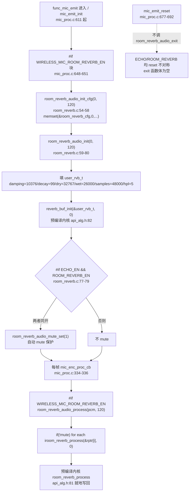

# 08 ROOM_REVERB 房间混响

> 本文梳理 ROOM_REVERB（房间混响）模块的配置宏、调用链、init/process/exit 时机、参数结构体与默认值、MRAM 互斥预留、ECHO 同开 mute 保护、在线调试缺失等。所有结论来自源码实际引用关系（文件、函数、行号）。包装层源码 `modules/voice/room_reverb.c` 已纳入仓库（全 109 行，当前 `#if ROOM_REVERB_EN` 不编译）；内核 `room_reverb_process`/`reverb_buf_init` 来自预编译库 `libs/`（声明见 [api_alg.h:81-82](../../../libs/api_alg.h#L81-L82)，符号见 `map.txt`），内部滤波器结构不可读，不推测内部数学实现。

---

## 1. 配置宏与编译状态

### 1.1 使能宏链

ROOM_REVERB 的编译期开关由两层宏组成（[config_ab5766_le_mic.h:107-108](../../../projects/microphone/config_ab5766_le_mic.h#L107-L108)、[155](../../../projects/microphone/config_ab5766_le_mic.h#L155)）：

| 宏 | 定义 | 当前值 | 作用 |
|---|---|---|---|
| `WIRELESS_MIC_ROOM_REVERB_EN` | `[config:107]` | `0` | 发射端是否开启房间混响（顶层开关） |
| `ROOM_REVERB_EN` | `(WIRELESS_MIC_ROOM_REVERB_EN)` `[config:155]` | `0` | 模块内 `#if` 包裹用的实际门控 |
| `WIRELESS_MIC_ROOM_REVERB_DELAY` | `WIRELESS_MIC_ROOM_REVERB_EN*390` `[config:108]` | `0` | 房间混响运算时间预算（us） |

与 ECHO 完全对称的结构：顶层 `WIRELESS_MIC_*_EN` → 模块层 `*_EN` 取值相同。当前均为 0，不编译。

### 1.2 参数宏

[config_ab5766_le_mic.h:156-158](../../../projects/microphone/config_ab5766_le_mic.h#L156-L158)：

```c
#define ROOM_REVERB_LEVEL                        99   //衰减率range:0-100
#define ROOM_REVERB_DRY                          32767 //干度 range:0-65535 数值越大人声音越突出
#define ROOM_REVERB_WET                          26000 //湿度 range:0-32767 数值越大人混响效果越突出
```

这三项在 `room_reverb_audio_init`/`room_reverb_audio_set_param` 中填入 `user_rvb_t`（见第 4 节）。`damping_set=10376`（低通滤波器系数）与 `hpl=5`（高通等级）是源码内固定值（[room_reverb.c:69](../../../modules/voice/room_reverb.c#L69)、[74](../../../modules/voice/room_reverb.c#L74)），不经过 config 宏，不属于可配置项。

### 1.3 当前编译状态（不编译，未链接）

`room_reverb.c` 全文（L14 `#if ROOM_REVERB_EN` 到 L108 `#endif`）被 `ROOM_REVERB_EN=0` 包裹，不编译。`map.txt` 证实 `room_reverb.o` 未链接：

```
.text   0x00000000  0x0  Output\obj\modules\voice\room_reverb.o   (map.txt:1125)
.data   0x00000000  0x0  Output\obj\modules\voice\room_reverb.o   (map.txt:1126)
.bss    0x00000000  0x0  Output\obj\modules\voice\room_reverb.o   (map.txt:1127)
```

三个段全 0，意味着 `room_reverb_audio_process`/`init`/`set_param`/`exit` 等实现体均未进入最终镜像。当前 `mic_proc.c:334-336` 与 `648-651` 的 `#if WIRELESS_MIC_ROOM_REVERB_EN` 块也不会编译。

### 1.4 空 stub 机制（仅 mute_set）

[strong_ble.c:229-230](../../../projects/microphone/strong_ble.c#L229-L230)：

```c
#if !ROOM_REVERB_EN
void room_reverb_audio_mute_set(uint8_t mute){}
#endif
```

`ROOM_REVERB_EN=0` 时，仅 `room_reverb_audio_mute_set` 提供空 stub。`map.txt:1245` 证实：

```
.text.room_reverb_audio_mute_set  0x00000000  0x2  Output\obj\projects\microphone\strong_ble.o
```

> **与 ECHO 的关键差异**：ECHO 在 `#if !ECHO_EN` 下提供了 `echo_delay_level_set/down/up/get/is_max_min` + `echo_audio_mute_set` 共 6 个空 stub（[strong_ble.c:220-227](../../../projects/microphone/strong_ble.c#L220-L227)，见 [07_ECHO混响.md](07_ECHO混响.md) 第 2 节），因为 ECHO 有控制面消息（`MSG_ECHO_LEVEL_UP/DOWN`）驱动等级函数。**ROOM_REVERB 本身没有等级控制函数**（无 `level_up/down/get`），因此也没有对应 stub。当前 ROOM_REVERB 唯一会被外部调用的函数是 `room_reverb_audio_mute_set`，故 stub 只此一个。这是模块设计的根本差异，不据此断言 ROOM_REVERB 控制面"缺失"——它本来就没有运行时等级控制面。

---

## 2. 段放置与 MRAM 互斥预留

### 2.1 源码 AT 段标注

[room_reverb.c](../../../modules/voice/room_reverb.c) 的段标注：

| 段 | 函数/变量 | 行号 |
|---|---|---|
| `AT(.buf1.room_reverb)` | `static room_reverb_cfg_t room_reverb_cfg` | [16](../../../modules/voice/room_reverb.c#L16) |
| `AT(.buf.room_reverb)` | `static rvb_init_sb user_rvb_t` | [17](../../../modules/voice/room_reverb.c#L17) |
| `AT(.text.room_reverb_proc)` | `room_reverb_audio_process` | [19](../../../modules/voice/room_reverb.c#L19) |
| `AT(.text.room_reverb_proc)` | `room_reverb_audio_input`（体注释） | [32](../../../modules/voice/room_reverb.c#L32) |
| `AT(.text.room_reverb_set.callback)` | `room_reverb_audio_output_callback_set`（体注释） | [48](../../../modules/voice/room_reverb.c#L48) |
| `AT(.text.room_reverb_init)` | `room_reverb_audio_init_cfg` | [53](../../../modules/voice/room_reverb.c#L53) |
| `AT(.text.room_reverb_init)` | `room_reverb_audio_init` | [59](../../../modules/voice/room_reverb.c#L59) |
| `AT(.text.room_reverb_set.param)` | `room_reverb_audio_set_param` | [82](../../../modules/voice/room_reverb.c#L82) |
| `AT(.text.room_reverb_set.mute)` | `room_reverb_audio_mute_set` | [97](../../../modules/voice/room_reverb.c#L97) |
| `AT(.text.room_reverb_exit)` | `room_reverb_audio_exit` | [103](../../../modules/voice/room_reverb.c#L103) |

`room_reverb_cfg` 与 `user_rvb_t` 分属 `.buf1.room_reverb` 与 `.buf.room_reverb` 两段（注意 `.buf1` 与 `.buf` 前缀不同）。

### 2.2 MRAM 互斥预留（关键内存约束）

[map.txt:2788-2794](../../../projects/microphone/Output/bin/map.txt#L2788-L2794)：

```
.mram_echo      0x00018000     0x6000
.mram_reverb    0x00018000     0x6000
```

`.mram_echo` 与 `.mram_reverb` **同起始地址 `0x00018000`、同大小 `0x6000`（24 KB）**。这是 ECHO 与 ROOM_REVERB 在 MRAM 层面的互斥预留：两模块共用同一块 24 KB MRAM 区。当前两者均不编译，该区域空闲；若同时使能，运行期会有内存冲突风险——这正是源码层 mute 保护（第 5 节）存在的根因之一。

> **诚实边界**：`room_reverb.c` 文件头注释（[4-12](../../../modules/voice/room_reverb.c#L4-L12)）写 `buf : 22K`，即模块宣称占用约 22 KB 缓冲。`.mram_reverb` 段预留 24 KB（`0x6000`），与注释量级吻合。但 `room_reverb.c` 内部只定义了 `room_reverb_cfg_t`（3 字节级）和 `rvb_init_sb`（结构体本身很小）两个静态变量，真正的 22 KB 缓冲在内核 `reverb_buf_init`/`room_reverb_process` 中分配（来自预编译库，不可读）。**不得在文档中沿用 `comb_sb`/`allpass_sb`/`highpass_sb`/`pred_sb` 等变量名**——`room_reverb.c` 中无可核实的此类变量定义（全文只有 `room_reverb_cfg` 和 `user_rvb_t`），只能引用文件头 `buf:22K` 注释与 `.mram_reverb` 段大小作为缓冲量级证据。

---

## 3. 调用链：init / process / exit



### 3.1 init：mic_emit_init 内

[mic_proc.c:648-651](../../../modules/wireless/mic_proc.c#L648-L651)：

```c
#if WIRELESS_MIC_ROOM_REVERB_EN
    room_reverb_audio_init_cfg(0, WIRELESS_MIC_SAMPLES_SELECT);
    room_reverb_audio_init(0, WIRELESS_MIC_SAMPLES_SELECT);
#endif
```

调用位置在 TX 上行算法 init 序列中：
- `ains4_32k_mic_init`（[632-634](../../../modules/wireless/mic_proc.c#L632-L634)）→ `echo_audio_init`（[636-638](../../../modules/wireless/mic_proc.c#L636-L638)）→ `magic_audio_init`（[640-642](../../../modules/wireless/mic_proc.c#L640-L642)）→ `robotization_mic_init`（[644-646](../../../modules/wireless/mic_proc.c#L644-L646)）→ **`room_reverb_audio_init_cfg` + `room_reverb_audio_init`（648-651）** → `mic_eq_drc_init`（[653-655](../../../modules/wireless/mic_proc.c#L653-L655)）→ `agc_audio_init`（[657-659](../../../modules/wireless/mic_proc.c#L657-L659)）→ `dnr_fre_mic_init`（[661-663](../../../modules/wireless/mic_proc.c#L661-L663)）→ `dac0_out_init`（[665-667](../../../modules/wireless/mic_proc.c#L665-L667)）。

init 序列在 ECHO 之后、EQ_DRC 之前。`room_reverb_audio_init_cfg`（[room_reverb.c:53-58](../../../modules/voice/room_reverb.c#L53-L58)）只 `memset(&room_reverb_cfg, 0, sizeof(room_reverb_cfg_t))` 清零管理结构；`room_reverb_audio_init`（[59-80](../../../modules/voice/room_reverb.c#L59-L80)）才填参数并调内核 `reverb_buf_init`。

### 3.2 process：每帧 mic_enc_proc_cb

[mic_proc.c:334-336](../../../modules/wireless/mic_proc.c#L334-L336)：

```c
#if WIRELESS_MIC_ROOM_REVERB_EN
        room_reverb_audio_process(pcm, WIRELESS_MIC_SAMPLES_SELECT);
#endif
```

链路位置（[mic_proc.c:326-340](../../../modules/wireless/mic_proc.c#L326-L340)）：

```
magic_audio_process(pcm,120)      [327]  #if WIRELESS_MIC_MAGIC_EN
robotization_mic_audio_input(pcm,120,1,NULL) [331]  #if WIRELESS_MIC_ROBOTIZATION_EN
room_reverb_audio_process(pcm,120) [335]  #if WIRELESS_MIC_ROOM_REVERB_EN   ← 本模块
agc_audio_input(pcm,120,0,NULL)   [339]  #if WIRELESS_MIC_AGC_EN
```

即 ROOM_REVERB 在 robotization 之后、AGC 之前。`room_reverb_audio_process`（[room_reverb.c:19-30](../../../modules/voice/room_reverb.c#L19-L30)）：

```c
AT(.text.room_reverb_proc)
void room_reverb_audio_process(s16 *ptr, u32 samples)
{
    s16 *rptr = (s16 *)ptr;
    if(!room_reverb_cfg.mute){
        for(u16 i = 0;i < samples; i++){
            room_reverb_process(&rptr[i],0);    // 逐点调内核，就地写回
        }
    }
}
```

逐点调预编译内核 `room_reverb_process(&rptr[i], 0)`（[api_alg.h:81](../../../libs/api_alg.h#L81)），`idx=0` 固定左声道。与 ECHO 的 `echo_audio_process`（逐点 `echo_process_16bit`）模式一致：无乒乓、无帧延迟、就地处理。`mute` 时整段跳过（不调内核，PCM 直通不变）。

### 3.3 exit：空函数，且 reset 不调

[room_reverb.c:103-107](../../../modules/voice/room_reverb.c#L103-L107)：

```c
AT(.text.room_reverb_exit)
void room_reverb_audio_exit(void)
{

}
```

`room_reverb_audio_exit` 是空函数。`mic_emit_reset`（[mic_proc.c:677-692](../../../modules/wireless/mic_proc.c#L677-L692)）只调 `bsp_sdadc_exit`/`wireless_cmd_reset`/`dac0_out_exit`，**不调 `room_reverb_audio_exit`**（也不调 `echo_audio_exit`）。全仓 Grep 确认 `room_reverb_audio_exit` 无任何外部调用点。即 ROOM_REVERB 无逐连接/逐会话的 reset/exit 语义，init 只在 `mic_emit_init` 进入 TX 模式时执行一次。

---

## 4. 参数结构体与默认值

### 4.1 管理结构 room_reverb_cfg_t

[room_reverb.h:7-12](../../../modules/voice/room_reverb.h#L7-L12)：

```c
typedef struct {
    u8 mute;
    u8 sample_rate;
    u16 samples;
//    audio_callback_t callback;   // 已注释，未启用
} room_reverb_cfg_t;
```

注意 `audio_callback_t callback` 字段在头文件中已被注释（[11](../../../modules/voice/room_reverb.h#L11)），即 callback 机制在类型层就未启用。`room_reverb_audio_init` 中设 `sample_rate=0`、`samples=120`（[63-64](../../../modules/voice/room_reverb.c#L63-L64)）。

### 4.2 内核结构体 rvb_init_sb

[api_alg.h:71-79](../../../libs/api_alg.h#L71-L79)：

```c
typedef struct
{
    u16 damping_set;   /*高频阻尼，去除高频部分的齿音，擦类的刺耳声*/
    u16 decay_set;     /*衰减率*/
    u16 wet;
    u16 dry;
    u32 samples;
    u8 hpl;            /*高通滤波器等级0表示关闭,1-10:50hz-500hz,步进50hz*/
}rvb_init_sb;
```

`rvb_init_sb` 本身可读（在 `libs/api_alg.h`），但**内部滤波器结构变量（内核中如何组织 comb/allpass/highpass 等延迟线）不可引用**——`room_reverb.c` 中只声明了一个 `user_rvb_t` 实例，真正的滤波器状态在预编译内核里。

### 4.3 默认参数（init 时填入）

[room_reverb.c:60-75](../../../modules/voice/room_reverb.c#L60-L75)：

```c
room_reverb_cfg.sample_rate = sample_rate;   // 0 (48k 枚举值)
room_reverb_cfg.samples     = samples;       // 120

memset(&user_rvb_t, 0, sizeof(user_rvb_t));
u8 idx                 = 0;
user_rvb_t.damping_set = 10376;              // 低通滤波器系数，越大截至频率越低（源码内固定）
user_rvb_t.decay_set   = ROOM_REVERB_LEVEL;  // 99（衰减率 range:0-100）
user_rvb_t.dry         = ROOM_REVERB_DRY;    // 32767（干度 range:0-65535）
user_rvb_t.wet         = ROOM_REVERB_WET;   // 26000（湿度 range:0-32767）
user_rvb_t.samples     = 48000;              // 采样点（硬编码 48000，非传入值）
user_rvb_t.hpl         = 5;                  // 高通等级 5 → 250Hz（源码内固定）
reverb_buf_init(&user_rvb_t, idx);
```

| 字段 | 来源 | 当前值 | 语义（厂商注释） |
|---|---|---|---|
| `damping_set` | 源码内固定 | `10376` | 低通滤波器系数，越大截至频率越低 |
| `decay_set` | `ROOM_REVERB_LEVEL` `[config:156]` | `99` | 衰减率 range:0-100 |
| `dry` | `ROOM_REVERB_DRY` `[config:157]` | `32767` | 干度 range:0-65535，越大人声越突出 |
| `wet` | `ROOM_REVERB_WET` `[config:158]` | `26000` | 湿度 range:0-32767，越大混响越突出 |
| `samples` | 源码内固定 | `48000` | 采样点（注意：硬编码 48000，与传入 `samples=120` 不同，是内核内 reverb 缓冲配置点数） |
| `hpl` | 源码内固定 | `5` | 高通等级 5 → 250Hz（`1-10:50Hz-500Hz 步进 50Hz`） |

> **量级与语义说明**：`damping_set=10376`、`decay_set=99`、`dry=32767`、`wet=26000` 是厂商注释的可观测语义（"越大截止频率越低""衰减率""干度""湿度"），不是内核数学证明。`dry` 注释 range 写 `0-65535`（u16 全量程）而 `wet` 写 `0-32767`（Q15 上限），与 ECHO 的 `dry 0-49152`/`wet 0-32768` 量级接近但不完全相同——记录差异，不据此断言内部定点数格式。

### 4.4 set_param 路径（当前无调用点）

[room_reverb.c:82-95](../../../modules/voice/room_reverb.c#L82-L95) `room_reverb_audio_set_param(room_decay_set, room_dry, room_wet)` 与 init 类似，但 `damping_set`/`samples`/`hpl` 同样固定，只 `decay_set`/`dry`/`wet` 来自参数。全仓 Grep 确认：**`room_reverb_audio_set_param` 无任何外部调用点**（仅在 room_reverb.c 内定义）。即运行期无法经此函数动态改参，参数只在 init 时固化。

---

## 5. ECHO 同开 mute 保护机制

[room_reverb.c:77-79](../../../modules/voice/room_reverb.c#L77-L79)：

```c
#if WIRELESS_MIC_ECHO_EN && WIRELESS_MIC_ROOM_REVERB_EN
    room_reverb_audio_mute_set(1);
#endif
```

这是源码层的组合约束：**ECHO 与 ROOM_REVERB 同时开启时，`room_reverb_audio_init` 末尾会自动把 ROOM_REVERB mute 掉**（`mute_set(1)`）。结合第 2.2 节的 `.mram_echo`/`.mram_reverb` 同地址互斥预留，这是双重保护：

1. **内存层互斥**（`map.txt:2788-2794`）：两模块共用 24 KB MRAM，不可同时占用。
2. **运行层 mute**（`room_reverb.c:77-79`）：即便两者都编译，ROOM_REVERB 也被 mute，`room_reverb_audio_process` 中 `if(!mute)` 判定为假，整段跳过不调内核。

> **CLAUDE.md 测试纪律直接对应**：CLAUDE.md「测试纪律与算法边界」明确写"Room Reverb 与 ECHO 同时开启时，源码中 Room Reverb 会被自动 mute；测试 Room Reverb 必须先确认 ECHO 关闭"。本节是该约束的源码与 map 证据。测试 ROOM_REVERB 时必须 `WIRELESS_MIC_ECHO_EN=0`，否则 ROOM_REVERB 被强制 mute，无效果且不可归因。

---

## 6. 在线调试缺失说明

### 6.1 不在 effect_table（无在线调试回调）

[effect_table.c:4-11](../../../modules/effect/effect_table.c#L4-L11)：

```c
const effect_update_callback_t effect_update_callback_tbl[CFG_MAX] = {
    [CFG_MIC_EQ]   = {local_mic_eq_effect_update_callback},
    [CFG_MIC_DRC]  = {local_mic_drc_effect_update_callback},
    [CFG_ECHO]     = {mic_echo_effect_update_callback},
    [CFG_MAGIC]    = {mic_magic_effect_update_callback},
    [CFG_MIX_EQ]   = {mix_mic_eq_effect_update_callback},
    [CFG_MIX_DRC]  = {mix_mic_drc_effect_update_callback},
};
```

表中只有 `CFG_MIC_EQ`/`CFG_MIC_DRC`/`CFG_ECHO`/`CFG_MAGIC`/`CFG_MIX_EQ`/`CFG_MIX_DRC` 六项。**无 `CFG_ROOM_REVERB`**。全仓 Grep `CFG_ROOM|ROOM_REVERB|EFFECT_IDX_ROOM` 在 `effect_table.c` 无匹配。即 ROOM_REVERB 不在在线调试表，无法经 UART 在线调音工具动态改参——这与第 4.4 节"`room_reverb_audio_set_param` 无调用点"一致。

> **与 ECHO/MAGIC 的对比**：ECHO 有 `mic_echo_effect_update_callback`（[toolkit_effect.c:123-143](../../../modules/tool/toolkit_effect.c#L123-L143)，当前 `#else toolkit_ack_fail()`）；MAGIC 有 `mic_magic_effect_update_callback`；EQ/DRC 有各自回调。ROOM_REVERB 既无 effect_table 表项也无 toolkit 回调函数，是 TX 算法中**唯一既无控制面消息、又无在线调试回调**的混响类模块。参数完全由 config 宏 + init 固化。

### 6.2 无控制面消息

`functions/msg_mic_emit.c` 全文 Grep `REVERB|reverb|ROOM` 无匹配。即没有 `MSG_ROOM_REVERB_*` 类消息，按键不触发 ROOM_REVERB 等级变化（它也没有等级概念）。ROOM_REVERB 的使能/参数只能通过修改 config 宏 + 重新构建刷写改变，无运行时入口。

---

## 7. 完整调用链（TX 侧，当前不编译）

```mermaid
sequenceDiagram
    participant CFG as config 宏
    participant INIT as mic_emit_init
    participant WRAP as room_reverb_audio_init<br/>(包装层)
    participant KERN1 as reverb_buf_init<br/>(预编译内核)
    participant LOOP as mic_enc_proc_cb<br/>每帧
    participant PROC as room_reverb_audio_process
    participant KERN2 as room_reverb_process<br/>(预编译内核)
    Note over CFG,INIT: #if WIRELESS_MIC_ROOM_REVERB_EN (=0 当前不编译)
    CFG->>INIT: ROOM_REVERB_EN=1 时进入块
    INIT->>WRAP: room_reverb_audio_init_cfg(0, 120)
    WRAP->>WRAP: memset(&room_reverb_cfg,0,...)
    INIT->>WRAP: room_reverb_audio_init(0, 120)
    WRAP->>WRAP: 填 user_rvb_t(damping=10376/decay=99/dry=32767/wet=26000/samples=48000/hpl=5)
    WRAP->>KERN1: reverb_buf_init(&user_rvb_t, 0)
    KERN1-->>WRAP: 内核初始化 reverb 缓冲(不可读)
    alt ECHO_EN && ROOM_REVERB_EN 同开
        WRAP->>WRAP: room_reverb_audio_mute_set(1) 强制 mute
    end
    loop 每帧 120 点
        LOOP->>PROC: room_reverb_audio_process(pcm, 120)
        alt !mute
            loop i = 0..119
                PROC->>KERN2: room_reverb_process(&rptr[i], 0)
                KERN2-->>PROC: 就地写回 rptr[i]
            end
        else mute
            Note over PROC: 整段跳过, PCM 直通不变
        end
    end
    Note over INIT,PROC: mic_emit_reset 不调 room_reverb_audio_exit; exit 函数体为空, 无逐会话 reset
```

---

## 8. 预编译库边界

| 项目 | 来源 | 可记录 | 不可推测 |
|---|---|---|---|
| `reverb_buf_init(rvb_init_sb *p, u8 idx)` | [api_alg.h:82](../../../libs/api_alg.h#L82) | API、参数结构体 `rvb_init_sb`、调用时机（init/set_param）、`idx=0` 左声道 | 内部 comb/allpass/highpass 延迟线组织、22 KB 缓冲如何分配、滤波器系数数学 |
| `room_reverb_process(s16 *sample, u8 idx)` | [api_alg.h:81](../../../libs/api_alg.h#L81) | API、逐点就地处理、`idx=0`、输入输出同地址 | 内部 Schroeder/Freeverb/FDN 等具体拓扑、反馈/前馈结构、`damping_set=10376` 的滤波器系数换算 |

`rvb_init_sb` 结构体本身可读（[api_alg.h:71-79](../../../libs/api_alg.h#L71-L79)），但其字段值如何被内核解释为滤波器参数不可读。`damping_set` 注释"低通滤波器系数，越大截止频率越低"、`decay_set` 注释"衰减率"、`hpl` 注释"高通等级 1-10:50Hz-500Hz 步进 50Hz"是厂商注释的可观测语义，不是内核数学证明。

> **纠偏记录（须遵守）**：`room_reverb.c` 中**无可核实的 `comb_sb`/`allpass_sb`/`highpass_sb`/`pred_sb` 变量定义**（文件只有 `room_reverb_cfg` 和 `user_rvb_t` 两个静态变量）。不得在文档中沿用此类变量名描述内部结构，只能引用文件头 `buf:22K` 注释与 `.mram_reverb` 段大小作为缓冲量级证据。`rvb_init_sb` 结构体可读，但内部滤波器结构变量不可引用。

---

## 9. 知识点小结

1. **TX-only 模块**：ROOM_REVERB 仅在 `mic_emit_init`（TX 上行）init、`mic_enc_proc_cb`（TX 每帧）process，RX/Adapter 侧（`adapter_init`/`mic_dec_prco_cb`）无 `room_reverb_*` 调用，全仓 Grep 确认。与 ECHO 同为 TX 侧音效。
2. **当前不编译**：`ROOM_REVERB_EN=0`，`room_reverb.c` 全文 `#if` 不编译，`room_reverb.o` 三段全 0（`map.txt:1125-1127`）。所有 init/process 代码不进入镜像。
3. **仅 mute_set stub**：`#if !ROOM_REVERB_EN` 下只提供 `room_reverb_audio_mute_set` 空 stub（[strong_ble.c:230](../../../projects/microphone/strong_ble.c#L230)，`map.txt:1245`），**无 level_up/down/get stub**。与 ECHO 的 6 个 stub 不同——ROOM_REVERB 本身没有等级控制函数，故无需 stub。不据此断言控制面"缺失"，是模块设计差异。
4. **MRAM 同地址互斥**：`.mram_echo` 与 `.mram_reverb` 同 `0x00018000`/`0x6000`（`map.txt:2788-2794`），24 KB MRAM 共用。内存层互斥是源码 mute 保护的根因之一。
5. **ECHO 同开自动 mute**：`room_reverb_audio_init` 末尾 `#if WIRELESS_MIC_ECHO_EN && WIRELESS_MIC_ROOM_REVERB_EN room_reverb_audio_mute_set(1)`（[room_reverb.c:77-79](../../../modules/voice/room_reverb.c#L77-L79)）。CLAUDE.md 测试纪律直接对应：测 ROOM_REVERB 必须先确认 ECHO 关闭。
6. **无在线调试回调**：`effect_table.c` 无 `CFG_ROOM_REVERB`，无 toolkit 回调函数。参数只经 config 宏 + init 固化，无 UART 在线调参入口。与 ECHO/MAGIC/EQ/DRC 均不同。
7. **无控制面消息**：`msg_mic_emit.c` 无 `MSG_ROOM_REVERB_*`。ROOM_REVERB 无运行时等级/开关控制面，使能/改参只能改宏 + 重建刷写。
8. **`set_param` 无调用点**：`room_reverb_audio_set_param` 全仓无外部调用点（仅 room_reverb.c 内定义）。运行期无法动态改 decay/dry/wet。
9. **input/callback_set 体注释**：`room_reverb_audio_input`（[33-46](../../../modules/voice/room_reverb.c#L33-L46)）与 `room_reverb_audio_output_callback_set`（[48-52](../../../modules/voice/room_reverb.c#L48-L52)）函数体全被注释。`room_reverb_cfg_t` 的 `callback` 字段在头文件也已注释（[room_reverb.h:11](../../../modules/voice/room_reverb.h#L11)）。callback 机制未接线，当前无作用。
10. **exit 空函数 + reset 不调**：`room_reverb_audio_exit` 空函数（[103-107](../../../modules/voice/room_reverb.c#L103-L107)），`mic_emit_reset` 不调它。ROOM_REVERB 无逐会话 reset 语义，与 ECHO 一致（`echo_audio_exit` 也空、reset 不调）。
11. **逐点就地处理**：`room_reverb_audio_process` 逐点 `room_reverb_process(&rptr[i],0)` 就地写回，无乒乓无帧延迟，与 ECHO 的 `echo_process_16bit` 模式一致。
12. **链路位置**：process 在 `mic_enc_proc_cb` 中位于 robotization 之后（[331](../../../modules/wireless/mic_proc.c#L331)）、AGC 之前（[339](../../../modules/wireless/mic_proc.c#L339)）。init 在 ECHO 之后（[636-638](../../../modules/wireless/mic_proc.c#L636-L638)）、EQ_DRC 之前（[653-655](../../../modules/wireless/mic_proc.c#L653-L655)）。
13. **samples 硬编码 48000**：`user_rvb_t.samples=48000` 是源码内硬编码（[73](../../../modules/voice/room_reverb.c#L73)），与传入的 `samples=120`（每帧点数）不同，是内核 reverb 缓冲配置点数。文件头注释"配置采样率一项固化48k"（[7](../../../modules/voice/room_reverb.c#L7)）与此一致：模块固定 48k。
14. **内核边界**：`room_reverb_process`/`reverb_buf_init` 来自预编译库，只记 API、`rvb_init_sb` 参数、调用时机、逐点就地输入输出。`damping_set=10376`/`decay_set=99` 等是厂商注释可观测语义，不推测内部 comb/allpass/FDN 拓扑与系数数学。

---

## 10. 延伸阅读

- [00 算法总览与全局调用关系.md](00_算法总览与全局调用关系.md)（TX 上行算法链全貌、init/process 序列）
- [02_TX上行采集与编码骨架.md](02_TX上行采集与编码骨架.md)（`mic_emit_init`/`mic_enc_proc_cb` 完整 TX 链）
- [07_ECHO混响.md](07_ECHO混响.md)（ECHO 模块对照：同为 TX 混响、同样逐点就地处理、同样 exit 空且 reset 不调、同样 `.mram_echo` 互斥预留；差异在 ECHO 有等级控制面 + stub、ROOM_REVERB 无）
- [06_EQ_DRC_PACC框架与SoftGain.md](06_EQ_DRC_PACC框架与SoftGain.md)（TX 算法 init 序列中 ROOM_REVERB 的相邻模块 EQ_DRC）
- [09_MAGIC魔音变调.md](09_MAGIC魔音变调.md)（同为 TX 音效模块、有控制面消息与在线调试回调的对照）
