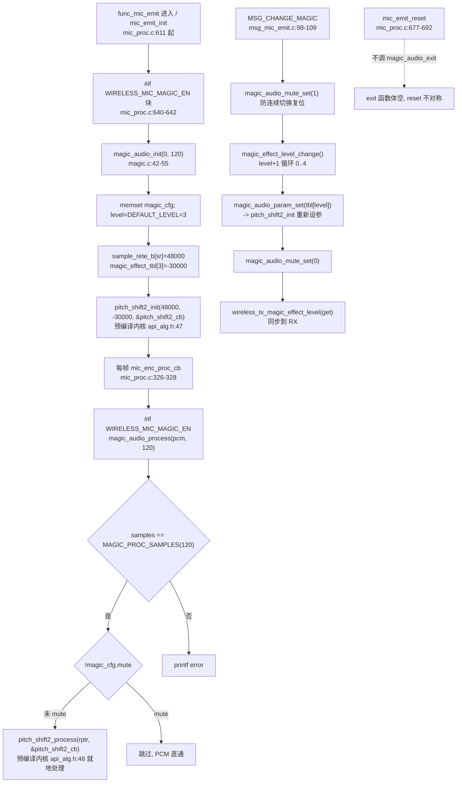

# 09 MAGIC 魔音变调

> 本文梳理 MAGIC（魔音/变调）模块的配置宏、调用链、init/process/exit 时机、参数表与等级循环、控制面消息、按键映射、在线调试回调、强弱符号与 WEAK 机制。所有结论来自源码实际引用关系（文件、函数、行号）。包装层源码 `modules/voice/magic.c` 已纳入仓库（全 111 行，当前 `MAGIC_EN=1` 编译且链接）；内核 `pitch_shift2_init`/`pitch_shift2_process` 来自预编译库 `libs/cpu/libplatform.a(pitch_shift2.o)`（声明见 [api_alg.h:47-48](../../../libs/api_alg.h#L47-L48)，符号见 `map.txt`），内部策略不推测。

> **当前实测状态（CLAUDE.md）**：MAGIC 是当前板卡已实测的 TX 音效之一——非 K12 按键表下 `KEY_ID_K2` 长按抬起（`KEY_LONG_UP`，松手触发）映射到 `MSG_CHANGE_MAGIC`，切换档位在听感上可辨识。证据等级为"听感证据 + 控制面日志证据"，未量化频谱/基频偏移。

---

## 1. 配置宏与编译状态

### 1.1 使能宏链（当前启用）

[config_ab5766_le_mic.h:103-104](../../../projects/microphone/config_ab5766_le_mic.h#L103-L104)、[148](../../../projects/microphone/config_ab5766_le_mic.h#L148)：

| 宏 | 定义 | 当前值 | 作用 |
|---|---|---|---|
| `WIRELESS_MIC_MAGIC_EN` | `[config:103]` | `1` | 发射端是否开启 MAGIC 音效（顶层开关） |
| `MAGIC_EN` | `(WIRELESS_MIC_MAGIC_EN)` `[config:148]` | `1` | 模块内 `#if` 包裹用的实际门控 |
| `WIRELESS_MIC_MAGIC_DELAY` | `WIRELESS_MIC_MAGIC_EN*300` `[config:104]` | `300` | MAGIC 运算时间预算（us） |

**MAGIC 是当前唯一 `*_EN=1` 启用并实测的 TX 音效模块**（ECHO=0、ROOM_REVERB=0、ROBOTIZATION=0、AGC=0、FREQ_SHIFT2=0、ALLPASS=0）。与 ECHO/ROOM_REVERB 的"不编译/未链接"状态根本不同。

### 1.2 参数宏

[config_ab5766_le_mic.h:149](../../../projects/microphone/config_ab5766_le_mic.h#L149)：

```c
#define MAGIC_EFFECT_DEFAULT_LEVEL              3   //magic第一次上电默认效果等级，0:原声，1:男神，2:女神，3:娃娃音，4:魔兽
```

默认上电等级 3（娃娃音）。5 档语义见第 4 节。

### 1.3 当前编译状态（编译且链接）

`magic.c` 全文（L13 `#if MAGIC_EN` 到 L110 `#endif`）在 `MAGIC_EN=1` 下编译。`map.txt` 证实 magic.o 链接且有实际体积：

```
.text.pitch_shift2_proc.input
        0x0001a7f4      0x26 Output\obj\modules\voice\magic.o    (map.txt:2683-2685)
                0x0001a7f4      magic_audio_process
.buf.pitch_shift.cache
        0x0001e588     0xc24 Output\obj\modules\voice\magic.o     (map.txt:2763-2764)
                0x10019730      magic_effect_tbl                   (map.txt:4273)
```

`magic_audio_process` @ `0x0001a7f4`（前 64K RAM 区，实时热路径），`magic_effect_tbl` @ `0x10019730`（Flash rodata 区），`.buf.pitch_shift.cache` 段 `0xc24`=3108 字节（与文件头 `buf:3132Bytes` 注释接近，差异为对齐填充）。内核 `pitch_shift2_process` @ `0x0001a8ee`（紧随 magic_audio_process 之后，来自 `libplatform.a(pitch_shift2.o)`，`map.txt:2688-2690`）。

### 1.4 强弱符号与 WEAK 机制

`magic.c` 中三个函数带 `WEAK` 标注：

| 函数 | 行号 | 段标注 | WEAK |
|---|---|---|---|
| `magic_audio_process` | [28-40](../../../modules/voice/magic.c#L28-L40) | `AT(.text.pitch_shift2_proc.input)` | WEAK |
| `magic_audio_init` | [42-55](../../../modules/voice/magic.c#L42-L55) | `AT(.text.pitch_shift2_init)` | WEAK |
| `magic_effect_level_set` | [77-85](../../../modules/voice/magic.c#L77-L85) | `AT(.text.pitch_shift2_set.param)` | WEAK |

`WEAK` 表示这些符号可被其它翻译单元的 strong（强）符号覆盖。当前 `MAGIC_EN=1`，[strong_ble.c:233-237](../../../projects/microphone/strong_ble.c#L233-L237) 的 `#if !MAGIC_EN` stub 块不编译，故 magic.c 的 WEAK 实现生效。

[strong_ble.c:233-237](../../../projects/microphone/strong_ble.c#L233-L237) 的 stub（当前不编译）：

```c
#if !MAGIC_EN
void magic_effect_level_set(u8 effect_level){}
void magic_audio_mute_set(uint8_t mute){}
void magic_effect_level_change(void){}
u8 magic_effect_level_get(void){ return 0; }
#endif
```

注意 stub 只覆盖 `level_set`/`mute_set`/`level_change`/`level_get` 四个——即**控制面消息会调用的函数**。`magic_audio_process`/`init`/`param_set`/`exit` 无 stub，因为 `MAGIC_EN=0` 时 `mic_proc.c` 中对应 `#if WIRELESS_MIC_MAGIC_EN` 调用也不编译，无需 stub 兜底。这与 ECHO 的 stub 覆盖策略相同（ECHO stub 覆盖控制面调用的 level 函数，不覆盖 process/init）。

> **机制区分**：`WEAK`（链接期可被 strong 覆盖）与 `#if !MAGIC_EN` stub（编译期条件替代）是两套机制。当前 MAGIC_EN=1，WEAK 实现生效、stub 不编译；若 MAGIC_EN=0，magic.c 全文不编译、stub 生效。两者不会同时存在。

---

## 2. 调用链：init / process / exit



### 2.1 init：mic_emit_init 内

[mic_proc.c:640-642](../../../modules/wireless/mic_proc.c#L640-L642)：

```c
#if WIRELESS_MIC_MAGIC_EN
    magic_audio_init(0, WIRELESS_MIC_SAMPLES_SELECT);
#endif
```

调用位置在 TX 上行算法 init 序列中：
- `ains4_32k_mic_init`（[632-634](../../../modules/wireless/mic_proc.c#L632-L634)）→ `echo_audio_init`（[636-638](../../../modules/wireless/mic_proc.c#L636-L638)）→ **`magic_audio_init`（640-642）** → `robotization_mic_init`（[644-646](../../../modules/wireless/mic_proc.c#L644-L646)）→ `room_reverb_audio_init`（[648-651](../../../modules/wireless/mic_proc.c#L648-L651)）→ `mic_eq_drc_init`（[653-655](../../../modules/wireless/mic_proc.c#L653-L655)）→ ...

init 序列在 ECHO 之后、robotization 之前。

`magic_audio_init`（[magic.c:42-55](../../../modules/voice/magic.c#L42-L55)）：

```c
AT(.text.pitch_shift2_init)WEAK
void magic_audio_init(u8 sample_rate, u16 samples)
{
    u16 sample_rete_b[5] = {48000,44100,38000,32000,24000};
    memset(&magic_cfg, 0, sizeof(magic_cfg_t));
    magic_cfg.sample_rate = sample_rate;          // 0 (48k 枚举)
    magic_cfg.samples = samples;                  // 120
    magic_cfg.magic_effect_level = MAGIC_EFFECT_DEFAULT_LEVEL;  // 3
#if WIRELESS_MIC_PARAM_MEMORY_EN
    param_magic_effect_level_read((u8 *)&magic_cfg.magic_effect_level);
#endif
    pitch_shift2_init(sample_rete_b[magic_cfg.sample_rate], magic_effect_tbl[magic_cfg.magic_effect_level], &pitch_shift2_cb);
}
```

逐行说明：
1. `sample_rete_b[5]={48000,44100,38000,32000,24000}`：采样率枚举值（0..4）→ 实际 Hz 映射表。当前 `sample_rate=0`（48k 枚举），取 `[0]=48000`。
2. `magic_cfg.magic_effect_level = MAGIC_EFFECT_DEFAULT_LEVEL = 3`（娃娃音）。
3. `#if WIRELESS_MIC_PARAM_MEMORY_EN`（当前 `WIRELESS_MIC_PARAM_MEMORY_EN=0`，[config:87](../../../projects/microphone/config_ab5766_le_mic.h#L87)）：等级关机保存当前不编译，`param_magic_effect_level_read` 不调用，上电固定为默认等级 3。
4. `pitch_shift2_init(48000, magic_effect_tbl[3]=-30000, &pitch_shift2_cb)`：调预编译内核初始化，传入实际采样率 Hz、移频系数（-30000，对应娃娃音）、状态结构体指针。

### 2.2 process：每帧 mic_enc_proc_cb

[mic_proc.c:326-328](../../../modules/wireless/mic_proc.c#L326-L328)：

```c
#if WIRELESS_MIC_MAGIC_EN
        magic_audio_process(pcm, WIRELESS_MIC_SAMPLES_SELECT);
#endif
```

链路位置（[mic_proc.c:322-339](../../../modules/wireless/mic_proc.c#L322-L339)）：

```
echo_audio_process(pcm,120)        [322-324]  #if WIRELESS_MIC_ECHO_EN && !WIRELESS_MIC_32K_EN  (当前 ECHO=0 不编译)
magic_audio_process(pcm,120)       [327]      #if WIRELESS_MIC_MAGIC_EN           ← 本模块（当前编译）
robotization_mic_audio_input(...)  [331]      #if WIRELESS_MIC_ROBOTIZATION_EN
room_reverb_audio_process(pcm,120) [335]      #if WIRELESS_MIC_ROOM_REVERB_EN
agc_audio_input(...)               [339]      #if WIRELESS_MIC_AGC_EN
```

MAGIC 在 ECHO 之后、robotization 之前。

`magic_audio_process`（[magic.c:28-40](../../../modules/voice/magic.c#L28-L40)）：

```c
AT(.text.pitch_shift2_proc.input)WEAK
void magic_audio_process(s16 *ptr, u32 samples)
{
    s16 *rptr = (s16 *)ptr;
    if (samples == MAGIC_PROC_SAMPLES) {        // MAGIC_PROC_SAMPLES=120
        if (!magic_cfg.mute) {
            pitch_shift2_process(rptr, &pitch_shift2_cb);
        }
    } else {
        printf("magic_input_samples error\n");
    }
}
```

逐行说明：
1. **samples 校验**（[33](../../../modules/voice/magic.c#L33)）：`samples == MAGIC_PROC_SAMPLES`（`MAGIC_PROC_SAMPLES=120`，[magic.h:4](../../../modules/voice/magic.h#L4)）。不匹配打印 error 但不处理（PCM 直通不变）。当前每帧传 120，匹配。
2. **mute 判定**（[34](../../../modules/voice/magic.c#L34)）：`!magic_cfg.mute` 才调内核。mute 时 PCM 直通不变（不调 `pitch_shift2_process`）。
3. **内核调用**（[35](../../../modules/voice/magic.c#L35)）：`pitch_shift2_process(rptr, &pitch_shift2_cb)` —— 注意与 ECHO/ROOM_REVERB 的逐点调用不同，MAGIC **一次性传入整帧指针** `rptr` 与状态结构体 `&pitch_shift2_cb`，由内核内部遍历 120 点。就地处理（输入输出同地址 `rptr`）。

### 2.3 exit：空函数，且 reset 不调

[magic.c:105-108](../../../modules/voice/magic.c#L105-L108)：

```c
AT(.text.pitch_shift2_exit)
void magic_audio_exit(void)
{
}
```

`magic_audio_exit` 是空函数。`mic_emit_reset`（[mic_proc.c:677-692](../../../modules/wireless/mic_proc.c#L677-L692)）不调它（全仓 Grep 确认 `magic_audio_exit` 无外部调用点）。与 ECHO/ROOM_REVERB 一致：TX 音效模块均无逐会话 reset/exit 语义，init 只在 `mic_emit_init` 进入 TX 模式时执行一次。

---

## 3. 参数表与等级循环

### 3.1 magic_effect_tbl（5 档移频系数）

[magic.c:17-23](../../../modules/voice/magic.c#L17-L23)：

```c
const s32 magic_effect_tbl[] = {
    0,              ///原音
    5000,           ///男神
    -13500,         ///女神
    -30000,         ///娃娃音
    15000,          ///魔兽
};
```

5 档（`s32` 移频系数，符号+量级决定变调方向与程度）：

| 索引 | 系数 | 语义（厂商注释） | 默认 |
|---|---|---|---|
| 0 | `0` | 原音（不移频） | |
| 1 | `5000` | 男神（正移频，低沉？） | |
| 2 | `-13500` | 女神（负移频） | |
| 3 | `-30000` | 娃娃音（更大负移频） | ★ 默认（`MAGIC_EFFECT_DEFAULT_LEVEL=3`） |
| 4 | `15000` | 魔兽（正移频） | |

> **诚实边界**：系数值（5000/-13500/-30000/15000）是 `s32` 移频参数，传入 `pitch_shift2_init` 第二参数 `shift`。厂商注释标注语义档位（原音/男神/女神/娃娃音/魔兽），但**不展开系数到实际基频偏移 Hz 的内部换算**——换算在预编译内核 `pitch_shift2_init`/`pitch_shift2_process` 中，不可读。"男神/女神/娃娃音/魔兽"是听感档位命名，正负与量级只是可观测线索（负系数→变高？正系数→变低？方向不据此断言，需实测确认）。

### 3.2 等级循环：magic_effect_level_change

[magic.c:67-75](../../../modules/voice/magic.c#L67-L75)：

```c
AT(.text.pitch_shift2_set.param)
void magic_effect_level_change(void)
{
    magic_cfg.magic_effect_level += 1;
    if (magic_cfg.magic_effect_level >= (sizeof(magic_effect_tbl)/4)) {   // 5
        magic_cfg.magic_effect_level = 0;
    }
    magic_audio_param_set(magic_effect_tbl[magic_cfg.magic_effect_level]);
}
```

`sizeof(magic_effect_tbl)/4`：`magic_effect_tbl` 是 `s32` 数组（每元素 4 字节），5 个元素 → `20/4=5`。等级 `0..4` 循环：每次 `+1`，到 5 归 0。调 `magic_audio_param_set(tbl[new_level])` 重新设参。

`magic_audio_param_set`（[magic.c:57-65](../../../modules/voice/magic.c#L57-L65)）：

```c
AT(.text.pitch_shift2_set.param)
void magic_audio_param_set(s32 magic_param)
{
    u16 sample_rete_b[5] = {48000,44100,38000,32000,24000};
#if WIRELESS_MIC_PARAM_MEMORY_EN
    param_magic_effect_level_write((u8 *)&magic_cfg.magic_effect_level);
#endif
    pitch_shift2_init(sample_rete_b[magic_cfg.sample_rate],magic_param, &pitch_shift2_cb);
}
```

`magic_audio_param_set` 重调 `pitch_shift2_init`（用新 `magic_param`）——即**运行期切换档位 = 重新 init 内核**，而非增量更新。`#if WIRELESS_MIC_PARAM_MEMORY_EN`（当前 0）下会持久化等级，当前不编译，等级不保存，关机复位回默认 3。

### 3.3 直接设等级：magic_effect_level_set

[magic.c:77-85](../../../modules/voice/magic.c#L77-L85)：

```c
AT(.text.pitch_shift2_set.param) WEAK
void magic_effect_level_set(u8 effect_level)
{
    if (effect_level >= (sizeof(magic_effect_tbl)/4)) {   // 5
        effect_level = 0;
    }
    magic_cfg.magic_effect_level = effect_level;
    magic_audio_param_set(magic_effect_tbl[magic_cfg.magic_effect_level]);
}
```

与 `level_change` 类似，但直接设指定等级（边界保护：`>=5` 归 0）。当前无控制面消息直接调 `level_set`（控制面只调 `level_change` 循环切换），但在线调试回调可能经此路径（见第 6 节，实际调 `param_set`）。

### 3.4 等级查询：magic_effect_level_get

[magic.c:87-91](../../../modules/voice/magic.c#L87-L91)：

```c
AT(.text.pitch_shift2_get)
u8 magic_effect_level_get(void)
{
    return magic_cfg.magic_effect_level;
}
```

返回当前等级 `0..4`。控制面切换后用于 `wireless_tx_magic_effect_level` 同步到 RX。

---

## 4. 内核结构体 pitch_shift2_cb_t

[api_alg.h:31-44](../../../libs/api_alg.h#L31-L44)：

```c
#define CircleBufo_Len       1536    //0.032*Fs

typedef struct {
//Common use
    s32 fre_shift;          // 移频
    u32 Fs;                 // 采样率
    u32 pitch_levels;       // 基音等级
    s32 ph1;                // 相位1
    s32 ph2;                // 相位2
    s16 pWtie1;             // 写指针1
    s16 pRead1;             // 读指针1
    s16 pRead2;             // 读指针2
    s16 CircleBuf[CircleBufo_Len];   // 环形缓冲 1536
} pitch_shift2_cb_t;
```

字段分类：
- **配置态**：`fre_shift`（移频）、`Fs`（采样率）、`pitch_levels`（基音等级）——由 `pitch_shift2_init` 写入。
- **运行态**：`ph1`/`ph2`（相位）、`pWtie1`/`pRead1`/`pRead2`（环形缓冲读写指针）——由 `pitch_shift2_process` 每帧更新。
- **缓冲**：`CircleBuf[1536]`（环形缓冲，`CircleBufo_Len=1536=0.032*48000`，32ms 延迟线）。

`magic.c` 静态实例（[14-15](../../../modules/voice/magic.c#L14-L15)）：

```c
static magic_cfg_t magic_cfg AT(.buf.pitch_shift.cache);
static pitch_shift2_cb_t pitch_shift2_cb AT(.buf.pitch_shift.cache);
```

两者均置于 `.buf.pitch_shift.cache` 段（`map.txt:2763-2764`，该段 `0xc24`=3108 字节，含 `pitch_shift2_cb_t` 的 `CircleBuf[1536]` 即 3072 字节 + `magic_cfg_t` 4 字节 + 对齐）。

> **结构体字段命名暗示**：`fre_shift`/`ph1`/`ph2`/`CircleBuf`/`pWtie1`/`pRead1`/`pRead2` 提示内核涉及环形缓冲 + 双相位 + 移频的技术线索（可能与 PSOLA/TD-PSOLA/重叠相加类时域变调有关），但**不据此断言确切算法**。`pitch_shift2_process`/`pitch_shift2_init` 在预编译库（`libplatform.a(pitch_shift2.o)`），内部策略不可读。`CircleBufo_Len=1536` 注释 `0.032*Fs` 是可观测的缓冲长度线索（32ms @ 48k）。

---

## 5. 控制面消息与按键映射

### 5.1 MSG_CHANGE_MAGIC 处理

[msg_mic_emit.c:98-109](../../../functions/msg_mic_emit.c#L98-L109)：

```c
case MSG_CHANGE_MAGIC:
    printf("MSG_CHANGE_MAGIC\n");

    if(!wireless_mic_connected_sta_get()) {
        break;                          // 未连接不处理
    }
    magic_audio_mute_set(1);            // mute 魔音，防连续切换导致复位关机
    magic_effect_level_change();        // 设置魔音效果
    magic_audio_mute_set(0);

    wireless_tx_magic_effect_level(magic_effect_level_get());
    break;
```

逐行说明：
1. **连接判定**（[101-103](../../../functions/msg_mic_emit.c#L101-L103)）：`!wireless_mic_connected_sta_get()` 时直接 break，未连接不切换（与 `MSG_ECHO_LEVEL_*` 同样的前置条件）。
2. **mute→change→unmute**（[104-106](../../../functions/msg_mic_emit.c#L104-L106)）：切换前先 `mute_set(1)`，调 `magic_effect_level_change()` 重新 init 内核，再 `mute_set(0)`。注释（[104](../../../functions/msg_mic_emit.c#L104)）"防连续切换导致复位关机"——切换瞬间内核 reinit 可能产生瞬态，mute 遮蔽。
3. **同步到 RX**（[108](../../../functions/msg_mic_emit.c#L108)）：`wireless_tx_magic_effect_level(get)` 把新等级经无线协议同步到 RX。`wireless_tx_magic_effect_level` @ `0x1000d46a`（`map.txt:3328`）。**RX 侧无 magic 处理**（magic 是 TX-only），此同步用于 RX 端显示/保存等级（若 `ADAPTER_SYNC_PARAM_EN` 等开启）。

### 5.2 按键映射（非 K12 vs K12）

[port_key.c:42-58](../../../projects/microphone/port/port_key.c#L42-L58)：

**K12 配置**（`#if WIRELESS_MIC_K12_KEY_EN`，当前未定义，不编译）[port_key.c:42-49](../../../projects/microphone/port/port_key.c#L42-L49)：

```
              单击      长按下   HOLD    长按抬起  双击       三击    四击   五击
[KEY_ID_K3] ={MSG_CHANGE_MAGIC, MSG_VOICE_RM, MSG_NO, MSG_NO, MSG_NO, ...}
```

K12 配置下，`KEY_ID_K3` **单击**（msg_idx=0）触发 `MSG_CHANGE_MAGIC`。

**非 K12 配置**（`#else`，当前生效）[port_key.c:51-57](../../../projects/microphone/port/port_key.c#L51-L57)：

```
              单击      长按下   HOLD    长按抬起  双击   三击   四击   五击
[KEY_ID_K2] ={MSG_VOL_DOWN, MSG_NO, MSG_NO, MSG_CHANGE_MAGIC, MSG_NO, ...}
```

非 K12 配置下，`KEY_ID_K2` **长按抬起**（`KEY_LONG_UP`，msg_idx=3，即长按后松手时触发）映射到 `MSG_CHANGE_MAGIC`。

事件索引（[port_key.c:10-36](../../../projects/microphone/port/port_key.c#L10-L36) `evt_type_2_msg_idx`）：

| 事件 | msg_idx |
|---|---|
| `KEY_SHORT_UP`（单击抬起） | 0 |
| `KEY_LONG`（长按下） | 1 |
| `KEY_HOLD`（持续按住） | 2 |
| `KEY_LONG_UP`（长按抬起） | 3 |
| `KEY_DOUBLE`（双击） | 4 |

> **CLAUDE.md 实测事实直接对应**：当前板卡只有 `KEY_ID_PP`/`KEY_ID_K1`/`KEY_ID_K2` 三键，无 `KEY_ID_K3`；项目未定义 `WIRELESS_MIC_K12_KEY_EN`，使用非 K12 表。故 MAGIC 入口是 `KEY_ID_K2` 长按抬起（`KEY_LONG_UP`，松手时触发），不是按下时、也不是双击，更不是 K3 单击（K3 在当前板卡无映射，[port_key.c:56](../../../projects/microphone/port/port_key.c#L56) `KEY_ID_K3` 全 `MSG_NO`）。修改或引用按键入口时以非 K12 表为准。

### 5.3 mute_set/mute_get

[magic.c:93-103](../../../modules/voice/magic.c#L93-L103)：

```c
AT(.text.pitch_shift2_set.mute)
void magic_audio_mute_set(uint8_t mute)
{
    magic_cfg.mute = mute;
}

AT(.text.pitch_shift2_get.mute)
u8 magic_audio_mute_get(void)
{
    return magic_cfg.mute;
}
```

`mute` 只置 `magic_cfg.mute` 标志，`magic_audio_process` 中 `if(!mute)` 判定。mute 时跳过 `pitch_shift2_process`，PCM 直通不变（原音）。与 ECHO/ROOM_REVERB 的 mute 语义一致。注意 MAGIC 的 mute 不清缓冲（ECHO 的 `echo_audio_mute_set` mute 时会 `memset delay_lbuf 0`，MAGIC 无此操作）。

---

## 6. 在线调试回调

### 6.1 effect_table 表项

[effect_table.c:4-11](../../../modules/effect/effect_table.c#L4-L11)：

```c
const effect_update_callback_t effect_update_callback_tbl[CFG_MAX] = {
    [CFG_MIC_EQ]   = {local_mic_eq_effect_update_callback},
    [CFG_MIC_DRC]  = {local_mic_drc_effect_update_callback},
    [CFG_ECHO]     = {mic_echo_effect_update_callback},
    [CFG_MAGIC]    = {mic_magic_effect_update_callback},
    [CFG_MIX_EQ]   = {mix_mic_eq_effect_update_callback},
    [CFG_MIX_DRC]  = {mix_mic_drc_effect_update_callback},
};
```

`[CFG_MAGIC] = {mic_magic_effect_update_callback}`（[8](../../../modules/effect/effect_table.c#L8)）。MAGIC 在在线调试表中，有 UART 在线调参入口——与 ROOM_REVERB（无表项）不同，与 ECHO（有表项）对称。

### 6.2 mic_magic_effect_update_callback

[toolkit_effect.c:104-121](../../../modules/tool/toolkit_effect.c#L104-L121)：

```c
void mic_magic_effect_update_callback(u8 *buf, u32 len, u8 params)
{
#if MAGIC_EN
    tool_magic_pitch_coef_t *tool_magic_pitch_coef = (tool_magic_pitch_coef_t *)(buf + 14);//去掉包头
    if(params == 1 && (sys_cb.mic_alg_en)) {//update
        TRACE("channel %d\n", tool_magic_pitch_coef->channel);
        TRACE("enable %d\n", tool_magic_pitch_coef->enable);
        TRACE("shfit_hz %d\n", tool_magic_pitch_coef->shfit_hz);

        magic_audio_mute_set(!tool_magic_pitch_coef->enable);
        magic_audio_param_set(tool_magic_pitch_coef->shfit_hz);
    } else {
        toolkit_ack_fail();
    }
#else
    toolkit_ack_fail();
#endif
}
```

逐行说明：
1. **`#if MAGIC_EN`**（[106](../../../modules/tool/toolkit_effect.c#L106)）：当前 `MAGIC_EN=1`，进入 `#if` 分支（**与 ECHO 的 `#else toolkit_ack_fail()` 不同**——ECHO 当前 `ECHO_EN=0` 走 `#else` 失败应答，MAGIC 当前生效）。
2. **解析参数**（[107](../../../modules/tool/toolkit_effect.c#L107)）：`buf+14` 去包头，强转 `tool_magic_pitch_coef_t*`。字段：`channel`/`enable`/`shfit_hz`。
3. **条件**（[108](../../../modules/tool/toolkit_effect.c#L108)）：`params == 1 && sys_cb.mic_alg_en`——必须是 update 命令且算法总闸开启。
4. **应用**（[113-114](../../../modules/tool/toolkit_effect.c#L113-L114)）：`magic_audio_mute_set(!enable)`（enable=0 则 mute）+ `magic_audio_param_set(shfit_hz)`（直接传 `shfit_hz` 作为移频系数，**绕过 `magic_effect_tbl` 5 档**，可设任意 s32 移频值）。
5. **失败应答**（[115-116](../../../modules/tool/toolkit_effect.c#L115-L116)）：条件不满足时 `toolkit_ack_fail()`。

> **在线调试 vs 控制面差异**：控制面 `MSG_CHANGE_MAGIC` 经 `magic_effect_level_change` 在 5 档间循环切换；在线调试经 `magic_audio_param_set(shfit_hz)` 可设任意移频系数（不受 5 档限制）。两者都最终调 `pitch_shift2_init` 重新设参，但参数来源不同（档位表 vs 工具下发 `shfit_hz`）。

`mic_magic_effect_update_callback` @ `0x1000caa2`（`map.txt:3181`）。

---

## 7. 段放置与资源

### 7.1 源码 AT 段标注

[magic.c](../../../modules/voice/magic.c) 的段标注：

| 段 | 函数/变量 | 行号 |
|---|---|---|
| `AT(.buf.pitch_shift.cache)` | `static magic_cfg_t magic_cfg` | [14](../../../modules/voice/magic.c#L14) |
| `AT(.buf.pitch_shift.cache)` | `static pitch_shift2_cb_t pitch_shift2_cb` | [15](../../../modules/voice/magic.c#L15) |
| `AT(.text.pitch_shift2_proc.input)` | `magic_audio_process` (WEAK) | [28](../../../modules/voice/magic.c#L28) |
| `AT(.text.pitch_shift2_init)` | `magic_audio_init` (WEAK) | [42](../../../modules/voice/magic.c#L42) |
| `AT(.text.pitch_shift2_set.param)` | `magic_audio_param_set` | [57](../../../modules/voice/magic.c#L57) |
| `AT(.text.pitch_shift2_set.param)` | `magic_effect_level_change` | [67](../../../modules/voice/magic.c#L67) |
| `AT(.text.pitch_shift2_set.param)` | `magic_effect_level_set` (WEAK) | [77](../../../modules/voice/magic.c#L77) |
| `AT(.text.pitch_shift2_get)` | `magic_effect_level_get` | [87](../../../modules/voice/magic.c#L87) |
| `AT(.text.pitch_shift2_set.mute)` | `magic_audio_mute_set` | [93](../../../modules/voice/magic.c#L93) |
| `AT(.text.pitch_shift2_get.mute)` | `magic_audio_mute_get` | [99](../../../modules/voice/magic.c#L99) |
| `AT(.text.pitch_shift2_exit)` | `magic_audio_exit`（空） | [105](../../../modules/voice/magic.c#L105) |

`magic_effect_tbl`（`const s32[]`）无显式 AT，落入默认 rodata，`map.txt:4273` @ `0x10019730`。

### 7.2 map.txt 符号验证

| 符号 | 地址 | 来源 | map.txt 行 |
|---|---|---|---|
| `magic_audio_process` | `0x0001a7f4` (0x26) | magic.o | 2685 |
| `pitch_shift2_process` | `0x0001a8ee` (0x23e) | libplatform.a(pitch_shift2.o) | 2690 |
| `pitch_shift2_process` 前的 `.text.pitch_shift2_proc.cos` | `0x0001a81a` (0xd4) | libplatform.a | 2687 |
| `magic_audio_init` | — | magic.o | 3193 |
| `magic_audio_param_set` | — | magic.o | 3196 |
| `magic_effect_level_change` | — | magic.o | 3197 |
| `magic_effect_level_set` | — | magic.o | 3198 |
| `magic_effect_level_get` | — | magic.o | 3201 |
| `magic_audio_mute_set` | — | magic.o | 3204 |
| `mic_magic_effect_update_callback` | `0x1000caa2` | toolkit_effect.o | 3181 |
| `wireless_tx_magic_effect_level` | `0x1000d46a` | — | 3328 |
| `pitch_shift2_init` | `0x10011462` (0x2e) | libplatform.a | 3841 |
| `magic_effect_tbl` | `0x10019730` | magic.o | 4273 |
| `.buf.pitch_shift.cache` | `0x0001e588` (0xc24=3108) | magic.o | 2764 |

地址分布观察：
- `magic_audio_process`（`0x0001a7f4`）与 `pitch_shift2_process`（`0x0001a8ee`）均在 `0x0001a...` 前 64K RAM 区且地址相邻，中间夹 `.text.pitch_shift2_proc.cos`（`0x0001a81a`，余弦表？）——说明包装层 `magic_audio_process` 内联调用内核 `pitch_shift2_process`，是实时每帧热路径（与 PLC 的 `plc_soft_process`/`plc_soft_process_do` 相邻同理）。
- `pitch_shift2_init`（`0x10011462`）在 `0x10011...` Flash/ROM 区，只在 init/换档时调用，非热路径。
- `.buf.pitch_shift.cache`（`0x0001e588`）在 `0x0001e...` RAM 数据区，紧随 ains4_32k 缓冲之后（`map.txt:2760-2764` `__buf_end_ains4_32k = .` → `__buf_start_pitch = .`）。

---

## 8. 完整调用链（TX 侧，当前运行）

```mermaid
sequenceDiagram
    participant INIT as mic_emit_init
    participant WRAP as magic_audio_init<br/>(包装层 WEAK)
    participant KERN1 as pitch_shift2_init<br/>(预编译内核)
    participant LOOP as mic_enc_proc_cb<br/>每帧
    participant PROC as magic_audio_process
    participant KERN2 as pitch_shift2_process<br/>(预编译内核)
    participant MSG as MSG_CHANGE_MAGIC
    participant TX as wireless_tx_magic_effect_level
    Note over INIT,WRAP: #if WIRELESS_MIC_MAGIC_EN (=1 当前编译)
    INIT->>WRAP: magic_audio_init(0, 120)
    WRAP->>WRAP: memset magic_cfg; level=3(娃娃音)
    WRAP->>KERN1: pitch_shift2_init(48000, tbl[3]=-30000, &cb)
    KERN1-->>WRAP: 内核初始化 cb (不可读)
    loop 每帧 120 点
        LOOP->>PROC: magic_audio_process(pcm, 120)
        PROC->>PROC: samples==120? && !mute?
        alt 匹配且未 mute
            PROC->>KERN2: pitch_shift2_process(rptr, &cb)
            KERN2-->>PROC: 就地写回整帧 rptr
        else mute 或 samples 不匹配
            Note over PROC: 跳过, PCM 直通不变
        end
    end
    MSG->>PROC: mute_set(1) 遮蔽瞬态
    MSG->>WRAP: magic_effect_level_change() level+1 循环 0..4
    WRAP->>KERN1: pitch_shift2_init(..., tbl[new_level], &cb) 重新设参
    MSG->>PROC: mute_set(0)
    MSG->>TX: wireless_tx_magic_effect_level(get) 同步到 RX(仅等级, RX 无 magic 处理)
    Note over INIT,PROC: mic_emit_reset 不调 magic_audio_exit; exit 函数体空, 无逐会话 reset
```

---

## 9. 预编译库边界

| 项目 | 来源 | 可记录 | 不可推测 |
|---|---|---|---|
| `pitch_shift2_init(s32 SampleRate, s32 shift, pitch_shift2_cb_t *st)` | [api_alg.h:47](../../../libs/api_alg.h#L47)，符号 `map.txt:3841`（libplatform.a） | API、参数（实际 Hz 采样率、s32 移频系数、状态指针）、调用时机（init/换档/在线调试） | 内部如何把 `shift` 转为基频偏移、`CircleBuf` 如何初始化 |
| `pitch_shift2_process(s16 *data, pitch_shift2_cb_t *st)` | [api_alg.h:48](../../../libs/api_alg.h#L48)，符号 `map.txt:2690`（libplatform.a） | API、整帧就地处理、输入输出同地址、状态结构体 `pitch_shift2_cb_t` | 内部 PSOLA/TD-PSOLA/重叠相加/相位重构具体策略、`ph1`/`ph2`/`pRead1`/`pRead2` 如何驱动 `CircleBuf` |

`pitch_shift2_cb_t` 结构体本身可读（[api_alg.h:33-44](../../../libs/api_alg.h#L33-L44)），字段命名（`fre_shift`/`ph1`/`ph2`/`CircleBuf`/`pWtie1`/`pRead1`/`pRead2`）暗示环形缓冲 + 双相位 + 移频的技术线索，`CircleBufo_Len=1536=0.032*Fs`（32ms @ 48k）是可观测缓冲长度。但**不据此断言确切算法**（PSOLA/TD-PSOLA/相位声码器等），内核策略不可读。

> **CLAUDE.md 测试纪律对应**：MAGIC 实测证据等级为"听感证据 + 控制面日志证据"（切换档位在听感上可辨识），未量化频谱/基频偏移。不把控制面日志或听感写成"算法客观指标已通过"。若需客观验证，应采集 TX PCM（dump 或 DAC 输出录音）做基频/频谱分析，对比 5 档系数与实际偏移。

---

## 10. 知识点小结

1. **当前唯一启用并实测的 TX 音效**：`MAGIC_EN=1`（[config:103/148](../../../projects/microphone/config_ab5766_le_mic.h#L103)），magic.o 链接且有实际体积（`map.txt:2685` `magic_audio_process`@0x0001a7f4）。与 ECHO/ROOM_REVERB（EN=0 不编译）根本不同。
2. **5 档移频系数表**：`magic_effect_tbl[]={0,5000,-13500,-30000,15000}`，s32 系数，语义档位（原音/男神/女神/娃娃音/魔兽）是厂商注释，不展开系数到 Hz 换算。
3. **默认等级 3（娃娃音）**：`MAGIC_EFFECT_DEFAULT_LEVEL=3`（[config:149](../../../projects/microphone/config_ab5766_le_mic.h#L149)），上电固定为此档。
4. **等级循环**：`magic_effect_level_change` 在 `0..4` 循环（`sizeof(tbl)/4=5`），每次 +1 到 5 归 0。控制面 `MSG_CHANGE_MAGIC` 走此路径。
5. **整帧处理（非逐点）**：`magic_audio_process` 一次性传 `rptr` 与 `&pitch_shift2_cb` 给 `pitch_shift2_process`，由内核内部遍历 120 点。与 ECHO/ROOM_REVERB 的逐点调用不同。
6. **samples 校验**：`samples == MAGIC_PROC_SAMPLES`（120）才处理，不匹配打印 error 但不处理（PCM 直通）。当前每帧 120，匹配。
7. **运行期换档 = 重新 init**：`magic_audio_param_set`/`level_change`/`level_set` 均调 `pitch_shift2_init` 用新系数重新初始化内核，非增量更新。
8. **mute 遮蔽瞬态**：`MSG_CHANGE_MAGIC` 处理是 `mute_set(1)→level_change→mute_set(0)`，注释"防连续切换导致复位关机"——reinit 瞬间 mute 遮蔽。MAGIC 的 mute 不清缓冲（与 ECHO 的 `memset delay_lbuf` 不同）。
9. **按键入口（非 K12）**：当前板卡 `KEY_ID_K2` 长按抬起（`KEY_LONG_UP`，松手触发，msg_idx=3）→ `MSG_CHANGE_MAGIC`（[port_key.c:55](../../../projects/microphone/port/port_key.c#L55)）。K12 配置才是 `KEY_ID_K3` 单击。CLAUDE.md 已实测。
10. **TX-only + RX 同步**：magic 仅 TX 处理（`mic_emit_init`/`mic_enc_proc_cb`），RX 无 magic。`wireless_tx_magic_effect_level` 把等级同步到 RX（用于显示/保存，非 RX 重做变调）。
11. **在线调试回调生效**：`mic_magic_effect_update_callback`（[toolkit_effect.c:104-121](../../../modules/tool/toolkit_effect.c#L104-L121)），当前 `MAGIC_EN=1` 走 `#if` 分支，解析 `tool_magic_pitch_coef_t.shfit_hz` 直接 `param_set`（绕过 5 档表，可设任意移频）。与 ECHO 当前 `#else toolkit_ack_fail()` 不同。
12. **WEAK 机制**：`magic_audio_process`/`init`/`level_set` 标 WEAK，可被 strong 覆盖。当前无 strong 覆盖，用 magic.c 实现。`#if !MAGIC_EN` stub（strong_ble.c:233-237）只覆盖控制面函数（set/mute_set/change/get），不覆盖 process/init（因 `MAGIC_EN=0` 时调用也不编译）。
13. **PARAM_MEMORY 不编译**：`WIRELESS_MIC_PARAM_MEMORY_EN=0`（[config:87](../../../projects/microphone/config_ab5766_le_mic.h#L87)），`param_magic_effect_level_read/write` 不编译，等级不持久化，关机复位回默认 3。
14. **exit 空且 reset 不调**：`magic_audio_exit` 空函数（[105-108](../../../modules/voice/magic.c#L105-L108)），`mic_emit_reset` 不调。与 ECHO/ROOM_REVERB 一致，TX 音效模块无逐会话 reset。
15. **内核边界**：`pitch_shift2_init`/`pitch_shift2_process` 来自 `libplatform.a(pitch_shift2.o)`（`map.txt:2690/3841`），只记 API、`pitch_shift2_cb_t` 参数、调用时机、整帧就地输入输出。`CircleBuf[1536]`/`ph1`/`ph2` 字段是线索，不推测内部 PSOLA/相位声码器具体策略。

---

## 11. 延伸阅读

- [00 算法总览与全局调用关系.md](00_算法总览与全局调用关系.md)（TX 上行算法链全貌、init/process 序列）
- [02_TX上行采集与编码骨架.md](02_TX上行采集与编码骨架.md)（`mic_emit_init`/`mic_enc_proc_cb` 完整 TX 链、MAGIC 在其中的位置）
- [07_ECHO混响.md](07_ECHO混响.md)（ECHO 对照：同为 TX 音效、同样 exit 空且 reset 不调、同样有在线调试表项；差异在 ECHO 当前 EN=0 不编译/走 stub，MAGIC EN=1 启用；ECHO 逐点 `echo_process_16bit`，MAGIC 整帧 `pitch_shift2_process`）
- [08_ROOM_REVERB房间混响.md](08_ROOM_REVERB房间混响.md)（ROOM_REVERB 对照：无控制面消息、无在线调试表项、无等级循环，与 MAGIC 的"5 档循环 + 消息 + 在线调试"三重控制面根本不同）
- [15_按键控制面.md](15_按键控制面.md)（`MSG_CHANGE_MAGIC` 按键映射、非 K12 vs K12 表、`KEY_LONG_UP` 事件索引）
