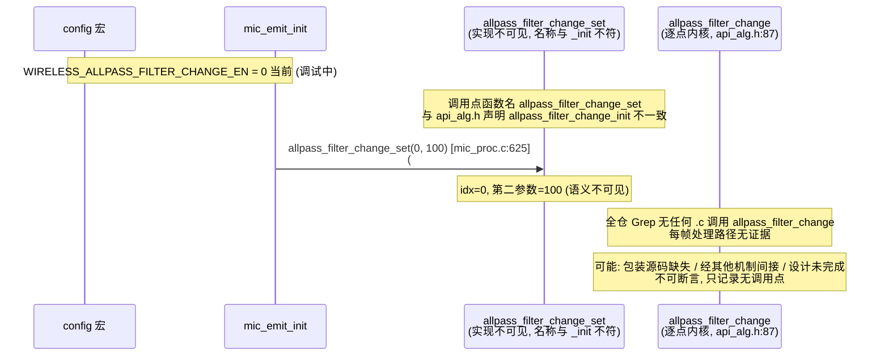

# 11 防啸叫：移频与随机相位

> 本文梳理两个"防啸叫"相关机制——**移频（FREQ_SHIFT / FREQ_SHIFT2）**与**随机相位（ALLPASS_FILTER_CHANGE）**——的配置宏、接入方式、调用点与段状态。所有结论来自源码实际引用关系（文件、函数、行号）。

> **两条核心诚实标注**：
> 1. **TX 移频 `WIRELESS_FREQ_SHIFT2_EN` 与 RX 移频 `ADAPTER_FREQ_SHIFT_EN` 不通过独立函数每帧调用**，而是经 PACC CS 链的 `PACC_FSH` 节点接入（[mic_effect.c:77](../../../modules/effect/mic_effect.c#L77)、[222](../../../modules/effect/mic_effect.c#L222)），由预编译 PACC 核 `pacc_ctl_proc` 在链内处理。当前两宏均 0，FSH 节点不加入 `cb_tbl`，不接入链。
> 2. **ALLPASS_FILTER_CHANGE 仅有 init 一次性调用 `allpass_filter_change_set(0,100)`（[mic_proc.c:625](../../../modules/wireless/mic_proc.c#L625)），其每帧处理函数 `allpass_filter_change` 的调用点全仓未找到**。不能断言预编译库按点回调或接入了每帧链。

> **当前实测状态（CLAUDE.md）**：TX 移频（FREQ_SHIFT2）、RX 移频（ADAPTER_FREQ_SHIFT）、ALLPASS 三者当前均 `EN=0`。ALLPASS 注释标注"调试中"。CLAUDE.md 测试纪律：源码标注"调试中"的算法应先做构建/链接验证再决定是否刷写，不预设防啸叫原理。"防啸叫"是功能注释（厂商对移频/随机相位用途的标注），不等于已验证的啸叫抑制效果。

---

## 1. 两条防啸叫路径与三组配置宏

仓库中与"防啸叫"相关的宏有三组，分属两种机制：

| 机制 | 宏 | 定义 | 当前值 | 注释定位 | 侧（TX/RX） |
|---|---|---|---|---|---|
| **移频** | `WIRELESS_FREQ_SHIFT2_EN` | `[config:105]` | `0` | "发射端是否开启移频（防啸叫）" | TX |
| **移频** | `ADAPTER_FREQ_SHIFT_EN` | `[config:126]` | `0` | "适配器是否开启 移频（防啸叫）" | RX |
| **随机相位** | `WIRELESS_ALLPASS_FILTER_CHANGE_EN` | `[config:112]` | `0` | "发射端是否开启 随机相位(防啸叫) (调试中)" | TX |

时间预算宏：

| 宏 | 定义 | 当前值 |
|---|---|---|
| `WIRELESS_FREQ_SHIFT2_DELAY` | `WIRELESS_FREQ_SHIFT2_EN*170` `[config:106]` | `0` |
| `WIRELESS_ALLPASS_FILTER_CHANGE_DELAY` | `WIRELESS_ALLPASS_FILTER_CHANGE_EN*200` `[config:113]` | `0` |

两组 DELAY 宏在 `cfg_wireless_d2a_enc_us`（[wireless.c:19-20](../../../modules/wireless/wireless.c#L19-L20)）的 TX 编码时间预算求和中被累加：

```c
uint16_t cfg_wireless_d2a_enc_us = (WIRELESS_MIC_ENC_MAX_US + ... + WIRELESS_FREQ_SHIFT2_DELAY
                                    + ... + WIRELESS_ALLPASS_FILTER_CHANGE_DELAY + ...);
```

当前三者全 0，对时间预算无贡献。

### 1.1 注意：无 `ADAPTER_FREQ_SHIFT_DELAY`

`WIRELESS_FREQ_SHIFT2_DELAY`（TX）与 `WIRELESS_ALLPASS_FILTER_CHANGE_DELAY`（TX）存在，但**没有 `ADAPTER_FREQ_SHIFT_DELAY`**（RX 移频无独立时间预算宏）。这与 RX 侧时间预算在 `cfg_wireless_d2a_dec_us` 中可能用不同方式核算有关，此处只记录宏缺失事实，不臆断 RX 预算方式。

---

## 2. 移频（FREQ_SHIFT）：经 PACC CS 链接入

### 2.1 机制定位

TX 移频与 RX 移频**都不通过独立函数每帧调用**。它们作为 PACC（可编程音频计算通道）CS（链表节点）链中的一个 `PACC_FSH` 节点，由预编译 PACC 核 `pacc_ctl_proc`（[api_pacc.h:131](../../../libs/cpu/api_pacc.h#L131)）在遍历 CS 链时处理。

### 2.2 TX 移频：loc_mic_pacc 链中的 FSH_CS

**CS 索引枚举**（[mic_effect.h:6-14](../../../modules/effect/mic_effect.h#L6-L14)）：

```c
enum {
    LOC_MIC_PACC_EQ_CS          = 0,
#if WIRELESS_FREQ_SHIFT2_EN
    LOC_MIC_PACC_FSH_CS,            // ← TX 移频节点（当前 EN=0 不存在）
#endif
    LOC_MIC_PACC_DRC_CS,
    LOC_MIC_PACC_MAX_CS,
};
```

当前 `WIRELESS_FREQ_SHIFT2_EN=0`，`LOC_MIC_PACC_FSH_CS` 不存在，`LOC_MIC_PACC_DRC_CS=1`，`LOC_MIC_PACC_MAX_CS=2`。即 TX 链只有 EQ 与 DRC 两个 CS。

**cb_tbl 表项**（[mic_effect.c:74-80](../../../modules/effect/mic_effect.c#L74-L80)）：

```c
static const pacc_effect_cb loc_mic_pacc_cb_tbl[LOC_MIC_PACC_MAX_CS] = {
    {LOC_MIC_PACC_EQ_CS,  PACC_EQ,  ..., &loc_mic_pacc.pacc_cs[LOC_MIC_PACC_EQ_CS],  &loc_mic_eq},
#if WIRELESS_FREQ_SHIFT2_EN
    {LOC_MIC_PACC_FSH_CS, PACC_FSH, ..., &loc_mic_pacc.pacc_cs[LOC_MIC_PACC_FSH_CS], &mic_fsh},   // ← TX 移频表项
#endif
    {LOC_MIC_PACC_DRC_CS, PACC_DRC, ..., &loc_mic_pacc.pacc_cs[LOC_MIC_PACC_DRC_CS], &loc_mic_drc},
};
```

**工作结构**（[mic_effect.c:70-72](../../../modules/effect/mic_effect.c#L70-L72)）：

```c
#if WIRELESS_FREQ_SHIFT2_EN
static freq_shift_bd_t mic_fsh AT(.buf.mic_effect);   // FSH 状态结构
#endif
```

`freq_shift_bd_t`（[api_pacc.h:119-124](../../../libs/cpu/api_pacc.h#L119-L124)）：

```c
#define HIBERT_ORDER 160
typedef struct {
    s32 zx[HIBERT_ORDER];           // 160 阶延迟线
    s32 Hilbert_hcoef[HIBERT_ORDER]; // Hilbert 滤波器系数
    s32 phase_step;                  // 相位步进（移频量）
} freq_shift_bd_t;
```

`HIBERT_ORDER=160` 暗示 FSH 内核基于 160 阶 Hilbert 变换实现复调制（解析信号 × e^{jω}），但这是从结构体字段名与阶数的合理推断线索，**内核数学来自预编译 PACC 核，不推测**。

**init/set_param 时机**（[mic_effect.c:82-123](../../../modules/effect/mic_effect.c#L82-L123)）：

- `loc_mic_pacc_init`（[95-97](../../../modules/effect/mic_effect.c#L95-L97)）：`#if WIRELESS_FREQ_SHIFT2_EN memset(&mic_fsh, 0, sizeof(freq_shift_bd_t))`。**注意：init 中只 memset 清零，不调 `pacc_fsh_init`/`pacc_fsh_set_param`**。FSH 的真正参数（`phase_step`）设置函数 `pacc_fsh_set_param`（[api_pacc.h:165](../../../libs/cpu/api_pacc.h#L165)）在仓库中**无任何调用点**（Grep 确认）。即即使 `EN=1`，FSH 节点也只是清零状态加入链，移频量 `phase_step=0`，效果等于不移频——除非另有未纳入仓库的代码调 `pacc_fsh_set_param`。
- `loc_mic_pacc_set_param`（[120-122](../../../modules/effect/mic_effect.c#L120-L122)）：`#if WIRELESS_FREQ_SHIFT2_EN loc_mic_pacc.cs_en[LOC_MIC_PACC_FSH_CS] = 1`。即开启时把 FSH 节点使能位写 1，供 `loc_mic_pacc_enable` 中的 `pacc_effect_relink` 重新链接时纳入链。

### 2.3 RX 移频：mix_pacc 链中的 FSH_CS

**CS 索引枚举**（[mic_effect.h:16-24](../../../modules/effect/mic_effect.h#L16-L24)）：

```c
enum {
    MIX_MIC_PACC_DRC_CS = 0,
#if ADAPTER_FREQ_SHIFT_EN
    MIX_MIC_PACC_FSH_CS,            // ← RX 移频节点（当前 EN=0 不存在）
#endif
    MIX_MIC_PACC_EQ_CS,
    MIX_MIC_PACC_MAX_CS,
};
```

**cb_tbl 表项**（[mic_effect.c:219-226](../../../modules/effect/mic_effect.c#L219-L226)）：

```c
static const pacc_effect_cb mix_pacc_cb_tbl[MIX_MIC_PACC_MAX_CS] = {
    {MIX_MIC_PACC_EQ_CS,  PACC_EQ,  ..., &mix_pacc.pacc_cs[MIX_MIC_PACC_EQ_CS],  &mix_eq},
#if ADAPTER_FREQ_SHIFT_EN
    {MIX_MIC_PACC_FSH_CS, PACC_FSH, ..., &mix_pacc.pacc_cs[MIX_MIC_PACC_FSH_CS], &mix_fsh},   // ← RX 移频表项
#endif
    {MIX_MIC_PACC_DRC_CS, PACC_DRC, ..., &mix_pacc.pacc_cs[MIX_MIC_PACC_DRC_CS], &mix_drc},
};
```

**工作结构**（[mic_effect.c:215-217](../../../modules/effect/mic_effect.c#L215-L217)）：`static freq_shift_bd_t mix_fsh AT(.buf.mic_mix)`。

**init/set_param 时机**（[mic_effect.c:228-247](../../../modules/effect/mic_effect.c#L228-L247)、[249-266](../../../modules/effect/mic_effect.c#L249-L266)）：

- `mix_pacc_init`（[241-243](../../../modules/effect/mic_effect.c#L241-L243)）：`#if ADAPTER_FREQ_SHIFT_EN memset(&mix_fsh, 0, ...)`。同样只 memset，不调 `pacc_fsh_set_param`。
- `mix_pacc_set_param`（[264-266](../../../modules/effect/mic_effect.c#L264-L266)）：`#if ADAPTER_FREQ_SHIFT_EN mix_pacc.cs_en[MIX_MIC_PACC_FSH_CS] = 1`。

### 2.4 移频接入链的完整时机

```mermaid
flowchart TD
    A["mic_emit_init / adapter_init"] --> B["loc_mic_pacc_init / mix_pacc_init<br/>mic_effect.c:82 / 228"]
    B --> C{"#if WIRELESS_FREQ_SHIFT2_EN / ADAPTER_FREQ_SHIFT_EN"}
    C -- "EN=0 当前" --> D["FSH 节点不加入 cb_tbl<br/>cs_en 不置位"]
    C -- "EN=1" --> E["memset(&mic_fsh/mix_fsh, 0, ...)<br/>FSH 节点加入 cb_tbl"]
    A --> F["loc_mic_pacc_set_param / mix_pacc_set_param<br/>mic_effect.c:105 / 249"]
    F --> G{"#if *_FREQ_SHIFT_EN"}
    G -- "EN=1" --> H["cs_en[FSH_CS] = 1<br/>使能 FSH 节点"]
    A --> I["loc_mic_pacc_enable / mix_pacc_enable<br/>mic_effect.c:139 / ..."]
    I --> J["pacc_effect_relink(pacc_cs, cs_en, MAX_CS)<br/>按 cs_en 重新链接 CS 链"]
    J --> K["pacc_cs_list_set_io_fmt 设置链头链尾格式"]
    A --> L["每帧 loc_mic_pacc_process / mix_pacc_process"]
    L --> M["pacc_ctl_proc(pacc_ctl, start_cs, samples)<br/>预编译 PACC 核遍历 CS 链"]
    M --> N{"链中是否含 PACC_FSH 节点"}
    N -- "含 FSH" --> O["PACC 核内执行移频<br/>freq_shift_bd_t: Hilbert 160 阶"]
    N -- "不含 FSH 当前" --> P["无移频环节"]
    Note over E,H: pacc_fsh_set_param 无调用点<br/>phase_step 当前无设置入口
```

### 2.5 关键纠偏：移频不是独立每帧函数

| 误读 | 实际 |
|---|---|
| "FREQ_SHIFT2 有独立 init/process 函数被每帧调用" | FREQ_SHIFT2 是 PACC 链中的 `LOC_MIC_PACC_FSH_CS` CS 节点（[mic_effect.h:8-10](../../../modules/effect/mic_effect.h#L8-L10)），不是独立每帧函数。每帧由 `pacc_ctl_proc` 统一遍历链处理。 |
| "移频有独立包装层 .c" | 无 `freq_shift2.c` 包装层。FSH 节点的 init/使能/链接全在 `mic_effect.c` 内，状态结构 `freq_shift_bd_t` 来自预编译库头 `api_pacc.h`。 |
| "开启 `WIRELESS_FREQ_SHIFT2_EN=1` 即可移频" | `EN=1` 只让 FSH 节点清零加入链，`phase_step` 无设置入口（`pacc_fsh_set_param` 无调用点），移频量=0。需另补 `pacc_fsh_set_param` 调用才有实际移频。 |

---

## 3. 随机相位（ALLPASS_FILTER_CHANGE）：init 一次性，每帧无证据

### 3.1 内核声明

[api_alg.h:85-87](../../../libs/api_alg.h#L85-L87)：

```c
///allpass_filter_change算法结构体以及相关API声明
void allpass_filter_change_init(u8 idx, s32 change_time);
s32 allpass_filter_change(s32 input, u8 idx);
```

两个内核函数来自预编译库（`libs/`），内部算法不可读。"随机相位"是厂商注释（[config:112](../../../projects/microphone/config_ab5766_le_mic.h#L112)），不等于已验证的相位调制算法类型。

> **注意函数名差异**：声明的是 `allpass_filter_change_init`（[api_alg.h:86](../../../libs/api_alg.h#L86)），但调用点用的是 `allpass_filter_change_set`（[mic_proc.c:625](../../../modules/wireless/mic_proc.c#L625)）。`_set` 与 `_init` 名称不同。全仓 Grep `allpass_filter_change_set` 只在 [mic_proc.c:625](../../../modules/wireless/mic_proc.c#L625) 出现，无其他声明或定义——`allpass_filter_change_set` 可能是 `allpass_filter_change_init` 的别名/包装，或在某未纳入仓库的头/源中定义。如实记录：**调用点函数名 `allpass_filter_change_set` 与 api_alg.h 声明 `allpass_filter_change_init` 不一致，定义点不可见**。

### 3.2 唯一调用点（init 一次性）

[mic_proc.c:624-626](../../../modules/wireless/mic_proc.c#L624-L626)：

```c
#if WIRELESS_ALLPASS_FILTER_CHANGE_EN
    allpass_filter_change_set(0, 100);
#endif
```

位于 TX `mic_emit_init` 算法 init 序列中，在 LC3S 编码 init（[620-622](../../../modules/wireless/mic_proc.c#L620-L622)）之后、SRC（[628-630](../../../modules/wireless/mic_proc.c#L628-L630)）之前。当前 `EN=0`，此调用不编译。

`allpass_filter_change_set(0, 100)` 的两个参数：`idx=0`（链路索引，左声道），`100`（`change_time`？参数语义不可见——`allpass_filter_change_set` 无声明，只能从 `allpass_filter_change_init(u8 idx, s32 change_time)` 的签名类比推断第二个参数是"变更时间/周期"类语义，不展开）。

### 3.3 每帧处理调用点：全仓未找到（关键纠偏）

`allpass_filter_change(s32 input, u8 idx)`（[api_alg.h:87](../../../libs/api_alg.h#L87)）是逐点处理函数（单 `s32 input` 进、`s32` 出，与 ECHO/ROOM_REVERB 的逐点 `echo_process_16bit`/`room_reverb_process` 同模式）。但全仓 Grep `allpass_filter_change\b`（作为函数调用，排除 `_init`/`_set`/段名）**无任何 `.c` 调用点**。

即：
- `allpass_filter_change_set` 仅 init 调一次（配置）。
- `allpass_filter_change`（逐点处理）**无任何显式调用点**。

可能的解释（均不可断言，只列线索）：
1. **包装源码缺失**：与 ROBOTIZATION 类似，可能存在未纳入仓库的 `allpass_filter_change.c` 包装层，其内部每帧调 `allpass_filter_change`，只是 Grep 不到。但与 ROBOTIZATION 不同，ALLPASS 的 init 调用点 `allpass_filter_change_set` 在仓库内（说明至少部分包装存在或被宏裁掉）。
2. **经 PACC 或其他机制间接调用**：但 ALLPASS 不在 PACC `cb_tbl`（`PACC_FSH` 是移频不是 allpass），无 CS 节点证据。
3. **设计未完成**：init 配了参数但每帧处理未接线，与"调试中"标注一致。

> **诚实结论**：当前仓库**无法证实** ALLPASS 有每帧处理路径。init 一次性 `set(0,100)` 存在，每帧 `allpass_filter_change` 调用点无证据。不据此断言"算法不生效"或"设计断线"，只记录"每帧调用点全仓未找到"。

### 3.4 头文件引用已注释

[modules.h:15](../../../modules/modules.h#L15)：

```c
//#include "voice/allpass_filter_change.h"
```

`allpass_filter_change.h` 的 include 已被注释，说明该头文件可能不存在或当前不纳入编译。与"包装源码/头可能缺失"的判断一致。

### 3.5 段预留与链接状态

[ram.ld:222-226](../../../projects/microphone/ram.ld#L222-L226)（代码段，`#if WIRELESS_ALLPASS_FILTER_CHANGE_EN`）：

```ld
__code_start_allpass_filter_change = .;
*(.text.allpass_filter_change_proc*)
__code_end_allpass_filter_change = .;
```

[ram.ld:302-306](../../../projects/microphone/ram.ld#L302-L306)（缓冲段，`#if WIRELESS_ALLPASS_FILTER_CHANGE_EN`）：

```ld
__buf_start_allpass_filter_change = .;
*(.buf.allpass_filter_change*)
__buf_end_allpass_filter_change = .;
```

当前 `EN=0`，段不收集。`map.txt` Grep `allpass` 无匹配，即无 `allpass_filter_change.o` 翻译单元参与链接（与 ROBOTIZATION 同理，无 `.o`）。

> **无独立 stub**：`strong_ble.c` Grep `allpass|freq_shift|FSH` 无匹配。即 `#if !WIRELESS_ALLPASS_FILTER_CHANGE_EN` 下无 allpass stub（与 ROBOTIZATION 同，因调用点 `mic_proc.c:625` 自包裹在 `#if` 内，`EN=0` 时不编译，无需 stub）。移频也无 stub（FSH 经 PACC 接入，`EN=0` 时 cb_tbl 表项不加入，无 undefined 风险）。

> **`pacc_effect_freq_shift_init` 的 stub**：[strong_symbol.c:98-100](../../../projects/microphone/strong_symbol.c#L98-L100)：

```c
#if (!WIRELESS_FREQ_SHIFT2_EN && !ADAPTER_FREQ_SHIFT_EN)
void pacc_effect_freq_shift_init(pacc_effect_cb pacc_tbl, pacc_cs_t* next_cs, u16 frame_len) {}
#endif
```

当 TX 与 RX 移频**都关闭**时，预编译库的 `pacc_effect_freq_shift_init` 被此空 stub 覆盖（strong 覆盖 weak）。`map.txt:3448` 证实 `pacc_effect_freq_shift_init` 链接在 `0x1000d69a`（strong_symbol.o），即当前生效的是空 stub。这个 stub 是 PACC 链构建时的 FSH 节点初始化钩子，当前为空意味着即便 PACC 链构建时遇到 FSH 类型也不做实际初始化（与 `EN=0` 一致）。**注意：这是 `pacc_effect_freq_shift_init`（PACC 层钩子），不是 `pacc_fsh_init`（FSH 节点 API）**——两者不同，`pacc_fsh_init`（[api_pacc.h:164](../../../libs/cpu/api_pacc.h#L164)）无 stub 也无调用点。

---

## 4. 段放置与资源

### 4.1 移频段（freq_shift2）

[ram.ld:210-213](../../../projects/microphone/ram.ld#L210-L213)（代码段）：

```ld
__code_start_freq_shift2 = .;
*(.text.freq_shift2_proc*)
*(.rodata.freq_shift2*)
__code_end_freq_shift2 = .;
```

[ram.ld:318-320](../../../projects/microphone/ram.ld#L318-L320)（缓冲段）：

```ld
__buf_start_freq_shift2 = .;
*(.buf.freq_shift2*)
__buf_end_freq_shift2 = .;
```

**注意：freq_shift2 段无 `#if WIRELESS_FREQ_SHIFT2_EN` 包裹**——与 dnr_fre/echo/room_reverb/robotization/allpass（均有 `#if` 包裹）不同。`map.txt:2723-2726` 证实段存在但三段全 0：

```
0x0001afe8  __code_start_freq_shift2 = .
*(.text.freq_shift2_proc*)        ← 无收集
*(.rodata.freq_shift2*)           ← 无收集
0x0001afe8  __code_end_freq_shift2 = .   ← start==end，长度 0
```

即 `freq_shift2` 段**无条件预留且当前为空**。这是因为移频的实际状态结构 `mic_fsh`/`mix_fsh` 用的是 `AT(.buf.mic_effect)`/`AT(.buf.mic_mix)` 段（[mic_effect.c:71](../../../modules/effect/mic_effect.c#L71)、[216](../../../modules/effect/mic_effect.c#L216)），不是 `.buf.freq_shift2`。`.buf.freq_shift2`/`.text.freq_shift2_proc` 段是**为独立包装层 `freq_shift2.c` 预留**的（该包装层未纳入仓库），当前无内容收集。

### 4.2 ALLPASS 段

见第 3.5 节，`#if` 包裹，当前为空，无 `.o`。

### 4.3 段对比

| 机制 | 代码段 | 缓冲段 | `#if` 包裹 | 当前状态 |
|---|---|---|---|---|
| 移频（独立包装预留） | `.text.freq_shift2_proc` | `.buf.freq_shift2` | **否** | 段存在但空（包装层未纳入） |
| 移频（PACC 内状态） | — | `.buf.mic_effect`/`.buf.mic_mix`（`mic_fsh`/`mix_fsh`） | 是（`#if *_FREQ_SHIFT_EN`） | 状态结构当前不编译 |
| ALLPASS | `.text.allpass_filter_change_proc` | `.buf.allpass_filter_change` | 是 | 段不收集，无 .o |

---

## 5. 控制面与按键映射

### 5.1 无控制面消息

`functions/` Grep `FREQ_SHIFT|freq_shift|ALLPASS|allpass|防啸叫` 无匹配。[msg_mic_emit.c](../../../functions/msg_mic_emit.c) 与 [msg_adapter.c](../../../functions/msg_adapter.c) 均无 `MSG_FREQ_SHIFT_*`/`MSG_ALLPASS_*` 类消息。即移频与随机相位均无运行时开关/等级控制面，使能/改参只能改 config 宏 + 重建刷写。

### 5.2 无按键映射

[port_key.c](../../../projects/microphone/port/port_key.c) Grep 无匹配。无按键触发移频/随机相位切换。

### 5.3 无在线调试

[effect_table.c:4-11](../../../modules/effect/effect_table.c#L4-L11) 的 `effect_update_callback_tbl` 只有 `CFG_MIC_EQ`/`CFG_MIC_DRC`/`CFG_ECHO`/`CFG_MAGIC`/`CFG_MIX_EQ`/`CFG_MIX_DRC` 六项，无 `CFG_FREQ_SHIFT`/`CFG_ALLPASS`。无 UART 在线调参入口。

> **与 ECHO/MAGIC 对比**：ECHO 有 `MSG_ECHO_LEVEL_*` + `CFG_ECHO`，MAGIC 有 `MSG_CHANGE_MAGIC` + `CFG_MAGIC`。移频/随机相位是"三无"模块（无控制面/无按键/无在线调试），与 ROOM_REVERB/ROBOTIZATION 同类。参数完全由 config 宏 + init 固化，且移频的 `phase_step` 连设置入口都没有（`pacc_fsh_set_param` 无调用点）。

---

## 6. 完整调用链

### 6.1 移频（TX+RX，经 PACC，当前不接入）

```mermaid
sequenceDiagram
    participant CFG as config 宏
    participant INIT as mic_emit_init / adapter_init
    participant PACC_INIT as loc_mic_pacc_init / mix_pacc_init<br/>mic_effect.c:82 / 228
    participant SET as loc_mic_pacc_set_param / mix_pacc_set_param<br/>mic_effect.c:105 / 249
    participant EN as loc_mic_pacc_enable / mix_pacc_enable<br/>mic_effect.c:139 / ...
    participant LOOP as 每帧 loc_mic_pacc_process / mix_pacc_process
    participant KERN as pacc_ctl_proc<br/>(预编译 PACC 核)
    participant FSH as PACC_FSH 节点<br/>freq_shift_bd_t
    Note over CFG,INIT: WIRELESS_FREQ_SHIFT2_EN / ADAPTER_FREQ_SHIFT_EN = 0 当前
    Note over PACC_INIT: EN=1 时: memset(&mic_fsh/mix_fsh,0) 加入 cb_tbl<br/>但不调 pacc_fsh_set_param (无调用点)
    INIT->>PACC_INIT: loc_mic_pacc_init() / mix_pacc_init()
    INIT->>SET: loc_mic_pacc_set_param() / mix_pacc_set_param()
    Note over SET: EN=1 时: cs_en[FSH_CS]=1
    INIT->>EN: loc_mic_pacc_enable() / mix_pacc_enable()
    EN->>EN: pacc_effect_relink(pacc_cs, cs_en, MAX_CS)
    Note over EN: 按 cs_en 重新链接, FSH 节点入链(若 EN=1)
    loop 每帧 120 点
        LOOP->>KERN: pacc_ctl_proc(pacc_ctl, start_cs, samples)
        alt 链含 PACC_FSH (EN=1)
            KERN->>FSH: PACC 核内执行移频 (Hilbert 160 阶)
            Note over FSH: phase_step=0 (无设置入口) → 等效不移频
        else 链不含 PACC_FSH (当前 EN=0)
            Note over KERN: 无移频环节
        end
    end
```

### 6.2 ALLPASS（init 一次性，每帧无证据）



---

## 7. 预编译库边界

### 7.1 移频（PACC_FSH）

| 项目 | 来源 | 可记录 | 不可推测 |
|---|---|---|---|
| `freq_shift_bd_t` | [api_pacc.h:119-124](../../../libs/cpu/api_pacc.h#L119-L124) | 结构体字段（`zx[160]`/`Hilbert_hcoef[160]`/`phase_step`）、`HIBERT_ORDER=160` | 内部 Hilbert 变换与复调制的具体数学实现 |
| `PACC_FSH` 枚举 | [api_pacc.h:177](../../../libs/cpu/api_pacc.h#L177) | 效果类型 ID | PACC 核如何解释该 ID 并调度移频核 |
| `pacc_fsh_init`/`pacc_fsh_set_param`/`pacc_fsh_off` | [api_pacc.h:164-166](../../../libs/cpu/api_pacc.h#L164-L166) | API 签名；**`pacc_fsh_set_param` 无调用点** | 内部实现 |
| `pacc_effect_freq_shift_init` | [strong_symbol.c:99](../../../projects/microphone/strong_symbol.c#L99)（空 stub）+ [map.txt:3448](../../../projects/microphone/Output/bin/map.txt#L3448) | PACC 层 FSH 钩子，当前空 stub 覆盖 | 钩子本应做的初始化（因 EN=0 无意义） |
| `pacc_ctl_proc` | [api_pacc.h:131](../../../libs/cpu/api_pacc.h#L131) | 遍历 CS 链处理入口、每帧由 `loc_mic_pacc_process`/`mix_pacc_process` 调用 | 内部如何分派到各 CS 节点类型 |

### 7.2 随机相位（ALLPASS）

| 项目 | 来源 | 可记录 | 不可推测 |
|---|---|---|---|
| `allpass_filter_change_init(u8 idx, s32 change_time)` | [api_alg.h:86](../../../libs/api_alg.h#L86) | API 签名、参数名（`idx`/`change_time`） | 内部 allpass 滤波器结构与相位调制数学 |
| `allpass_filter_change(s32 input, u8 idx)` | [api_alg.h:87](../../../libs/api_alg.h#L87) | 逐点处理 API、`idx` 参数、**无调用点** | 内部 allpass 系数如何随 `change_time` 变化 |
| `allpass_filter_change_set` | [mic_proc.c:625](../../../modules/wireless/mic_proc.c#L625)（调用点） | 唯一调用点、参数 `(0,100)` | **定义点不可见**，与 `allpass_filter_change_init` 关系不明 |

> **ALLPASS 内核声明在 api_alg.h（与 ains4/pitch_shift2/room_reverb 同文件）**，但 `allpass_filter_change` 每帧调用点无证据——这与 ains4（有 `ains4_32k.c` 包装每帧调 `ains4_process`）、pitch_shift2（有 `magic.c` 包装每帧调 `pitch_shift2_process`）、room_reverb（有 `room_reverb.c` 包装每帧调 `room_reverb_process`）根本不同。ALLPASS 是 api_alg.h 中**唯一声明了逐点处理 API 但仓库内无任何调用点**的算法。

---

## 8. 知识点小结

1. **两条防啸叫路径**：移频（FREQ_SHIFT2/ADAPTER_FREQ_SHIFT，经 PACC FSH 节点）与随机相位（ALLPASS_FILTER_CHANGE，独立 init+逐点内核）。当前三者全 `EN=0`。
2. **移频经 PACC CS 链接入**：TX `LOC_MIC_PACC_FSH_CS`（[mic_effect.h:8-10](../../../modules/effect/mic_effect.h#L8-L10)）、RX `MIX_MIC_PACC_FSH_CS`（[mic_effect.h:18-20](../../../modules/effect/mic_effect.h#L18-L20)）。由 `pacc_ctl_proc` 每帧遍历链处理，不是独立每帧函数。
3. **移频状态结构 `freq_shift_bd_t`**：`{s32 zx[160], s32 Hilbert_hcoef[160], s32 phase_step}`（[api_pacc.h:119-124](../../../libs/cpu/api_pacc.h#L119-L124)），`HIBERT_ORDER=160`。Hilbert 变换线索但不推测内部数学。
4. **移频 `pacc_fsh_set_param` 无调用点**：`EN=1` 只让 FSH 节点清零（`phase_step=0`）入链，移频量无设置入口。需另补 `pacc_fsh_set_param` 调用才有实际移频。
5. **移频无独立包装层 .c**：FSH 节点的 init/使能/链接全在 `mic_effect.c` 内。`.text.freq_shift2_proc`/`.buf.freq_shift2` 段为独立包装预留但空（无 `#if` 包裹，[ram.ld:210-213](../../../projects/microphone/ram.ld#L210-L213)、[318-320](../../../projects/microphone/ram.ld#L318-L320)）。
6. **`pacc_effect_freq_shift_init` 空 stub**：TX+RX 移频都关时，[strong_symbol.c:98-100](../../../projects/microphone/strong_symbol.c#L98-L100) 空 stub 覆盖预编译库该函数，`map.txt:3448` 证实链接 strong 版本。注意这是 PACC 层钩子，非 `pacc_fsh_init`。
7. **ALLPASS init 唯一调用点**：`allpass_filter_change_set(0,100)`（[mic_proc.c:625](../../../modules/wireless/mic_proc.c#L625)，`#if WIRELESS_ALLPASS_FILTER_CHANGE_EN`，当前不编译）。
8. **ALLPASS 每帧调用点全仓未找到**：`allpass_filter_change`（[api_alg.h:87](../../../libs/api_alg.h#L87)）逐点处理无任何 `.c` 调用。是 api_alg.h 中唯一声明逐点 API 但无调用点的算法。不据此断言设计断线，只记录无证据。
9. **ALLPASS 函数名不一致**：调用点 `allpass_filter_change_set` 与声明 `allpass_filter_change_init`（[api_alg.h:86](../../../libs/api_alg.h#L86)）名称不同，定义点不可见。
10. **ALLPASS 头文件已注释**：[modules.h:15](../../../modules/modules.h#L15) `//#include "voice/allpass_filter_change.h"`，头可能缺失或不纳入编译。
11. **ALLPASS 段 `#if` 包裹且无 .o**：[ram.ld:222-226](../../../projects/microphone/ram.ld#L222-L226)/[302-306](../../../projects/microphone/ram.ld#L302-L306)，当前不收集，`map.txt` 无 allpass 符号。
12. **无 stub（移频+ALLPASS）**：strong_ble.c 无 freq_shift/allpass stub。移频因经 PACC（`EN=0` 表项不加入无 undefined 风险），ALLPASS 因调用点自包裹（`#if` 内不编译）。
13. **无控制面/无按键/无在线调试**：三者均无 `MSG_*` 消息、无按键映射、无 `CFG_*` 表项。参数只由 config 宏 + init 固化，移频连 `phase_step` 设置入口都没有。
14. **"防啸叫"是功能注释非已验证效果**：config 注释把移频/随机相位标注为"防啸叫"用途，但不等于已验证的啸叫抑制效果。ALLPASS 标"调试中"。CLAUDE.md 测试纪律：先构建/链接验证再刷写，不预设防啸叫原理。
15. **链路位置**：ALLPASS init 在 LC3S 编码 init 后、SRC 前（[mic_proc.c:624-630](../../../modules/wireless/mic_proc.c#L624-L630)）；移频经 PACC，其处理时机由 `loc_mic_pacc_process`/`mix_pacc_process` 在 EQ_DRC 阶段统一完成（[mic_proc.c:315](../../../modules/wireless/mic_proc.c#L315) TX、RX 侧 mix_pacc_process）。

---

## 9. 延伸阅读

- [00_算法总览与全局调用关系.md](00_算法总览与全局调用关系.md)（防啸叫三宏总览、移频经 PACC、ALLPASS 无每帧调用证据）
- [06_EQ_DRC_PACC框架与SoftGain.md](06_EQ_DRC_PACC框架与SoftGain.md)（PACC CS 链机制、`PACC_FSH` 节点、`freq_shift_bd_t`、`pacc_effect_relink`、FSH 经 CS 链接入而非独立函数）
- [02_TX上行采集与编码骨架.md](02_TX上行采集与编码骨架.md)（`mic_emit_init` 中 ALLPASS init 调用点 [624-626](../../../modules/wireless/mic_proc.c#L624-L626)、TX 算法链全貌）
- [10_ROBOTIZATION机器人音效.md](10_ROBOTIZATION机器人音效.md)（ROBOTIZATION 对照：同为"三无"+源码缺失+段预留空+无 stub；ALLPASS 与其类似但 init 调用点存在、每帧无证据）
- [08_ROOM_REVERB房间混响.md](08_ROOM_REVERB房间混响.md)（ROOM_REVERB 对照：同为"三无"模块但包装源码在仓库只是 EN=0；ALLPASS 每帧调用点缺失比 ROOM_REVERB 更深一层）
