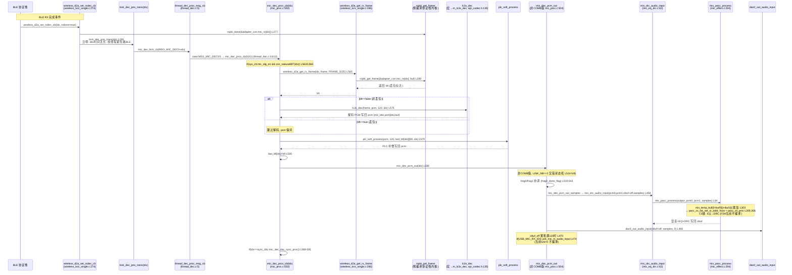
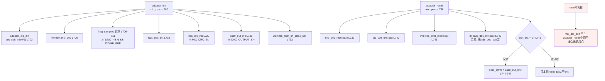

# 13 RX 下行解码与 MIX_DRC 混音

> 本文梳理 RX（Adapter/适配器）侧的下行解码链路：BLE RX 帧取出 → LC3S 解码 → PLC 丢包隐藏 → 双路混音输出（MIX_DRC 或软混）→ DAC/USB 推送，以及异步解码线程分发机制。所有结论来自源码实际引用关系（文件、函数、行号）。

> **核心事实**：当前产品配置下 **`WIRELESS_CON_VERS=7`**（传输机制 v8）经 [config_extra.h](../../../projects/microphone/config_extra.h) 派生出 **`WIRELESS_CON_COMB_BUF_EN=0`（单包模式）**，因此 `mic_proc.c` 中存在**两套 `mic_dec_pcm_out`**，当前编译生效的是**非 COMB 版**（L426-595），COMB 版（L392-425）不编译。一拖二（`WIRELESS_CON_LINK_NB=2`）下混音经 **MIX_DRC（`ADAPTER_MIX_DRC_EN=1` 当前启用）**，非软混。

> **三重诚实标注**：
> 1. **LC3S 内核声明可见但内部不可读**：`m_lc3s_dec`/`m_lc3s_dec_init`/`m_lc3s_dec_exit` 声明在 [libs/cpu/api_codec.h:133-144](../../../libs/cpu/api_codec.h#L133-L144)，包装宏 `lc3s_dec(a,b,c,d)=m_lc3s_dec(a,b,c,d)`（L142）；但 LC3S 是预编译库内核，内部解码数学不可推测。**注意 `m_lc3s_dec_exit` 无对应 `lc3s_dec_exit` 宏**，`adapter_reset` 直接调 `m_lc3s_dec_exit(idx)`（[mic_proc.c:742](../../../modules/wireless/mic_proc.c#L742)）。
> 2. **`wireless_d2a_get_rx_frame` 是包装层，实现可见**：在 [wireless_txrx_single.c:266](../../../modules/wireless/wireless_txrx_single.c#L266)，内部调预编译协议栈内核 `rxpkt_get_frame`（不可读）。即"取 RX 帧"有可见包装实现，"协议栈 RX 缓冲如何组织"不可读。
> 3. **`usb_mic_in_audio_input` 实现缺失**：仅有 [func_adapter.h](../../../functions/func_adapter.h) 声明，全仓无定义。在 `mic_dec_pcm_out_samples`（[mic_proc.c:474](../../../modules/wireless/mic_proc.c#L474)）与 `mic_dec_pcm_out`（[509](../../../modules/wireless/mic_proc.c#L509)）被调，均由 `#if ADAPTER_USB_MIC_RX_EN`（当前 `=0`）包裹，不编译。详见 [14_USB_Mic枚举链.md](14_USB_Mic枚举链.md)。

> **当前实测状态（CLAUDE.md）**：已验证声学链路「手机外放音乐 → TX 麦克风采集 → 无线链路 → RX → 耳机正常听音」，证明本条 RX 解码→DAC/耳机输出路径基本可用。但 **USB Mic 方向（RX 作为 USB Audio 麦克风端点供电脑录音）尚未通过**，不影响本条耳机链路结论。本文只记录有据可查的调用点与内核边界，不推测 LC3S 内部解码算法。

---

## 1. 配置宏与编译状态

### 1.1 传输机制版本与单包/组合缓冲模式

[config_ab5766_le_mic.h:65](../../../projects/microphone/config_ab5766_le_mic.h#L65)：

```c
#define WIRELESS_CON_VERS                       7    //传输机制版本（2=v3，7=v8）
```

`WIRELESS_CON_VERS` 在 [config_extra.h:114-122](../../../projects/microphone/config_extra.h#L114-L122) 经 `#elif VERS==2 || VERS==7` 分支派生出：

```c
#define WIRELESS_CON_COMB_BUF_EN                 0    //单包模式（当前生效）
```

即 `VERS=7` → `COMB_BUF_EN=0`。这决定 `mic_proc.c` 中 **两套 `mic_dec_pcm_out`** 哪套编译：

| 宏分支 | 代码位置 | 编译状态 | 说明 |
|---|---|---|---|
| `#if WIRELESS_CON_COMB_BUF_EN` | [mic_proc.c:392-425](../../../modules/wireless/mic_proc.c#L392-L425) | **不编译**（COMB_BUF_EN=0） | COMB 版 `mic_dec_pcm_out`，samples=60，软混/混音后 callback |
| `#else`（非 COMB） | [mic_proc.c:426-547](../../../modules/wireless/mic_proc.c#L426-L547) | **编译生效** | 非 COMB 版，含 `mic_dec_us_trans_samples`/`mic_dec_pcm_out_samples`/`frag0`/`frag1`/`mic_dec_pcm_out` |

> **不可混淆**：引用 `mic_dec_pcm_out` 时必须标注当前生效的是非 COMB 版（L504-546）。COMB 版（L394-424）当前不参与编译，仅供历史/对照参考。

### 1.2 RX 侧使能宏

[config_ab5766_le_mic.h:76](../../../projects/microphone/config_ab5766_le_mic.h#L76)、[84](../../../projects/microphone/config_ab5766_le_mic.h#L84)、[121-126](../../../projects/microphone/config_ab5766_le_mic.h#L121-L126)、[179](../../../projects/microphone/config_ab5766_le_mic.h#L179)：

| 宏 | 当前值 | 作用 |
|---|---|---|
| `WIRELESS_CON_LINK_NB` | `2` | 支持连几路无线麦（一拖二） |
| `WIRELESS_MIC_DEC_MAX_US` | `900` | 解码运算时长（开 PLC 时约 900us） |
| `ADAPTER_DAC_OUTPUT_EN` | `1` | 适配器是否支持 DAC 输出 MIC 音频（当前启用） |
| `ADAPTER_USB_MIC_RX_EN` | `0` | 接收端是否开启 USB Mic 功能（上行音频，**不支持**） |
| `ADAPTER_MIX_DRC_EN` | `1` | 混音 DRC 功能（用于一拖二混音，**当前启用**） |
| `ADAPTER_MIX_DRC_DELAY` | `ADAPTER_MIX_DRC_EN*250`=`250` | MIX DRC 运算时间预算（us） |
| `ADAPTER_FREQ_SHIFT_EN` | `0` | 适配器是否开启移频（防啸叫） |
| `UDE_MIC_EN` | `ADAPTER_USB_MIC_RX_EN`=`0` | USB 设备 Mic 使能（跟随 USB_MIC_RX_EN） |

`WIRELESS_CON_CODEC_SEL == CODEC_LC3S`（LC3S 编解码），决定解码走 `lc3s_dec`（[mic_proc.c:575](../../../modules/wireless/mic_proc.c#L575)）。

### 1.3 RX 解码时间预算

[wireless.c:22](../../../modules/wireless/wireless.c#L22)：

```c
uint16_t cfg_wireless_d2a_dec_us = (WIRELESS_MIC_DEC_MAX_US + ADAPTER_MIX_DRC_DELAY);
//                                 = 900 + 250 = 1150
```

`cfg_wireless_d2a_dec_us=1150`（us）是 RX 单帧解码时间预算，包含 LC3S 解码 + PLC + MIX_DRC。该值在 `mic_dec_dac_sync_proc`（[mic_proc.c:72](../../../modules/wireless/mic_proc.c#L72)）用于估算 DAC 同步 samples（`cfg_wireless_d2a_dec_us*48/1000`）。

### 1.4 MIX_DRC 当前启用

`ADAPTER_MIX_DRC_EN=1`，因此：
- `mic_dec_pcm_out_samples`（[L457-458](../../../modules/wireless/mic_proc.c#L457-L458)）的 `#if ADAPTER_MIX_DRC_EN mix_drc_audio_input(...)` **编译生效**，软混 `#else` 分支不编译。
- `adapter_init`（[L721-723](../../../modules/wireless/mic_proc.c#L721-L723)）的 `#if ADAPTER_MIX_DRC_EN mix_drc_init()` **编译生效**。
- mix_drc/mix_pacc 包装层（[mic_eq_drc.c:57-85](../../../modules/audio/mic_eq_drc.c#L57-L85)、[mic_effect.c:198-320](../../../modules/effect/mic_effect.c#L198-L320)）**参与链接**（map.txt 有符号，见第 8 节）。

---

## 2. 段放置与资源

### 2.1 mic_dec_t 结构体与实例

[mic_proc.c:10-11](../../../modules/wireless/mic_proc.c#L10-L11)：

```c
#define MIC_DEC_OBUF_SIZE  (WIRELESS_MIC_SAMPLES_SELECT*WIRELESS_MIC_CHANNEL_SELECT*2)
//                     = 120 * 1 * 2 = 240  （单帧 PCM 字节数，s16 单声道 120 点）
#define MIC_CACHE_BUF_NUM  2
```

[mic_proc.c:29-50](../../../modules/wireless/mic_proc.c#L29-L50)：

```c
typedef struct {
    audio_callback_t callback;
    u8 obuf[MIC_DEC_OBUF_SIZE];                 // 240B 输出缓冲
    struct {
        u8 buf[MIC_DEC_OBUF_SIZE];              // 240B 单路 PCM
        u16 buf_cnt;
    } pcm[WIRELESS_CON_LINK_NB];                // pcm[0]/pcm[1] 双链路
    u8 frame[MIC_DEC_BUFFER_SIZE];              // 解码输入帧缓冲
    u8 last_bfi[WIRELESS_CON_LINK_NB];          // 双链路上一帧丢包标志
    u8 frag_samples[2];                          // 非COMB版分片对齐点数
    bool frag0_done_flag;                        // frag0 完成标志
    uint8_t obuf_off;                           // obuf 写偏移（单包累积）
    u8 sync_idx;                                // DAC 同步链路索引
    u8 fifo_sta;                                // DAC FIFO 计数
} mic_dec_t;

AT(.buf.adapter.proc)
mic_dec_t mic_dec;                              // L49-50，RX 解码全局实例
```

- `mic_dec` 实例在 `AT(.buf.adapter.proc)`（[L49-50](../../../modules/wireless/mic_proc.c#L49-L50)），与 TX `mic_enc`（`AT(.buf.mic_emit.proc)` L46-47）对称。
- `pcm[WIRELESS_CON_LINK_NB]` 即 `pcm[2]`，分别缓存两路 RX 解码后的 PCM。
- `obuf[240]` 是混音输出缓冲，单包模式下用 `obuf_off` 累积分片直到 `==120` 才推送 USB（见第 4.2 节）。

### 2.2 相关段标注

| 函数/变量 | 段 | 行号 |
|---|---|---|
| `mic_dec` 实例 | `.buf.adapter.proc` | [mic_proc.c:49](../../../modules/wireless/mic_proc.c#L49) |
| `mic_dec_dac_sync_proc` | `.text.adapter.mic_dec` | [mic_proc.c:63](../../../modules/wireless/mic_proc.c#L63) |
| `mic_dec_us_trans_samples` | `.text.adapter.proc` | [mic_proc.c:428](../../../modules/wireless/mic_proc.c#L428) |
| `mic_dec_pcm_out_samples` | `.text.adapter.proc` | [mic_proc.c:452](../../../modules/wireless/mic_proc.c#L452) |
| `mic_dec_pcm_out_frag0`/`frag1` | `.text.adapter.proc` | [mic_proc.c:480/492](../../../modules/wireless/mic_proc.c#L480) |
| `mic_dec_pcm_out`（非COMB） | `.text.adapter.proc` | [mic_proc.c:503](../../../modules/wireless/mic_proc.c#L503) |
| `mic_dec_prco_cb` | `.text.adapter.proc` | [mic_proc.c:549](../../../modules/wireless/mic_proc.c#L549) |
| `wireless_d2a_get_rx_frame` | `.text.adapter.proc` | [wireless_txrx_single.c:265](../../../modules/wireless/wireless_txrx_single.c#L265) |
| `wireless_d2a_set_rxdec_cb` | `.text.adapter.proc` | [wireless_txrx_single.c:273](../../../modules/wireless/wireless_txrx_single.c#L273) |
| `mix_drc_audio_input` | `.com_text.mix_drc.input` | [mic_eq_drc.c:61](../../../modules/audio/mic_eq_drc.c#L61) |
| `mix_drc_init` | `.text.mix_drc.init` | [mic_eq_drc.c:67](../../../modules/audio/mic_eq_drc.c#L67) |
| `mix_drc_exit` | `.text.mix_drc.exit` | [mic_eq_drc.c:80](../../../modules/audio/mic_eq_drc.c#L80) |
| `mix_pacc_process` | `.text.mic_mix_proc` | [mic_effect.c:294](../../../modules/effect/mic_effect.c#L294) |
| `mix_temp_buf`/`mix_pacc` 结构体 | `.buf.mic_mix`/`.buf.mic_mix.pacc` | [mic_effect.c:200/208](../../../modules/effect/mic_effect.c#L200) |

---

## 3. 调用链：init / process / exit

### 3.1 adapter_init（连接时初始化）

[mic_proc.c:700-734](../../../modules/wireless/mic_proc.c#L700-L734)：

```c
void adapter_init(void)
{
    adapter_alg_init();                          // L703: PLC 双链路 init
    memset(&mic_dec, 0x00, sizeof(mic_dec));     // L705: 清零解码实例
#if WIRELESS_CON_LINK_NB > 1 && !WIRELESS_CON_COMB_BUF_EN
    int temp_frag = mic_dec_us_trans_samples(ble_single_link_duration_get(),
                                             WIRELESS_MIC_SAMPLE_RATE_SELECT) % WIRELESS_MIC_SAMPLES_SELECT;
    mic_dec.frag_samples[0] = ((temp_frag%2) ? temp_frag+1 : temp_frag);   // WORD对齐
    mic_dec.frag_samples[1] = WIRELESS_MIC_SAMPLES_SELECT - mic_dec.frag_samples[0];  // L710
#endif
    // codec dec init
    lc3s_dec_init(WIRELESS_MIC_SAMPLE_RATE_SELECT, WIRELESS_MIC_SAMPLES_SELECT);  // L719
#if ADAPTER_MIX_DRC_EN
    mix_drc_init();                              // L722
#endif
#if ADAPTER_HUART_AUDIO_OUTPUT_EN
    huart_audio_output_init();                   // L725
#endif
#if ADAPTER_DAC_OUTPUT_EN
    dac0_out_init(0, WIRELESS_MIC_SAMPLES_SELECT, 0);  // L729
#endif
    wireless_host_ch_class_set();                // L732
}
```

init 序列要点：
1. **`adapter_alg_init()`**（[L703](../../../modules/wireless/mic_proc.c#L703)）：见 [3.1.1](#311-adapter_alg-init--plc-双链路)。
2. **`memset(&mic_dec, 0, ...)`**（[L705](../../../modules/wireless/mic_proc.c#L705)）：清零整个 `mic_dec_t`，包括 `last_bfi`/`obuf_off`/`frag0_done_flag`/`pcm[].buf_cnt`。
3. **frag_samples 计算**（[L706-711](../../../modules/wireless/mic_proc.c#L706-L711)）：`#if LINK_NB>1 && !COMB_BUF_EN`（当前 LINK_NB=2 且 COMB_BUF_EN=0，**编译生效**）。用 `ble_single_link_duration_get()`（BLE 单链路持续时间，us）经 `mic_dec_us_trans_samples` 换算成 samples，`%120` 取余后做 WORD 对齐，得到 `frag_samples[0]`，`frag_samples[1]=120-frag_samples[0]`。这是**双路交错对齐**的关键参数（见第 4.3 节）。
4. **`lc3s_dec_init(SAMPLE_RATE, 120)`**（[L719](../../../modules/wireless/mic_proc.c#L719)）：LC3S 解码内核 init，当前 `CODEC_LC3S` 分支。
5. **`mix_drc_init()`**（[L722](../../../modules/wireless/mic_proc.c#L722)）：MIX_DRC 包装层 init，`#if ADAPTER_MIX_DRC_EN`（当前=1 编译）。
6. **`dac0_out_init(0, 120, 0)`**（[L729](../../../modules/wireless/mic_proc.c#L729)）：DAC 输出 init，`#if ADAPTER_DAC_OUTPUT_EN`（当前=1 编译）。

#### 3.1.1 adapter_alg_init — PLC 双链路

[mic_proc.c:82-86](../../../modules/wireless/mic_proc.c#L82-L86)：

```c
void adapter_alg_init(void)
{
    plc_soft_init(0, WIRELESS_MIC_SAMPLES_SELECT, WIRELESS_MIC_SAMPLE_RATE_SELECT);
    plc_soft_init(1, WIRELESS_MIC_SAMPLES_SELECT, WIRELESS_MIC_SAMPLE_RATE_SELECT);
}
```

对 `idx=0` 与 `idx=1` **双链路分别初始化 PLC**（丢包隐藏）。PLC 详见 [05_PLC丢包隐藏.md](05_PLC丢包隐藏.md)。注意 `adapter_alg_init` 只 init PLC，不 init LC3S——LC3S init 在 `adapter_init` 主流程 L719 单独调。

### 3.2 每帧 RX 处理 mic_dec_prco_cb

[mic_proc.c:549-595](../../../modules/wireless/mic_proc.c#L549-L595)（当前非 COMB 版，`#endif` 在 L595）：

```c
AT(.text.adapter.proc)
void mic_dec_prco_cb(u8 idx)
{
#if WARNING_TONE_EN
    if(res_music_playing_state_get()){ return; }   // MP3 提示音播放中跳过解码  L554-556
#endif
    s16 *pcm = (s16 *)&mic_dec.pcm[idx].buf;         // L559: 取本链路 PCM 缓冲
    u32 samples = WIRELESS_MIC_SAMPLES_SELECT;        // L560: 120

    if(sys_cb.mic_alg_en) {                          // L562: 算法使能门控
        u8 con_status = ble_con_get_status();        // L563: 取连接状态位图
        if(con_status & BIT(idx)) {                  // L564: 本链路已连接
            bool bfi = wireless_d2a_get_rx_frame(idx, mic_dec.frame, WIRELESS_MIC_FRAME_SIZE);  // L565
            if(!bfi) {                               // L567: 非丢包才解码
#if WIRELESS_CON_CODEC_SEL == CODEC_LC3S
                lc3s_dec(mic_dec.frame, pcm, samples, idx);   // L575: LC3S 解码
#endif
            }
            plc_soft_process(pcm, samples, mic_dec.last_bfi[idx]||bfi, idx);  // L579: PLC
            mic_dec.last_bfi[idx] = bfi;             // L580: 保存本帧 bfi
        }
    } else {
        memset(pcm, 0x00, samples*2);                 // L583: 未使能算法则静音
    }

    mic_dec_pcm_out(idx);                            // L586: 混音输出

    if(idx == mic_dec.sync_idx) {                    // L588: 同步链路
        mic_dec_dac_sync_proc();                     // L590: DAC 播放偏差处理
    }
}
```

每帧 RX 处理链（`mic_alg_en=1` 且本链路已连接时）：

```
wireless_d2a_get_rx_frame(idx, frame, FRAME_SIZE) → bfi   L565
  ├─ bfi==false: lc3s_dec(frame, pcm, 120, idx)           L575  (LC3S 内核)
  └─ (bfi==true: 跳过解码, pcm 保持上一帧或零)
plc_soft_process(pcm, 120, last_bfi[idx]||bfi, idx)        L579  (PLC 内核)
last_bfi[idx] = bfi                                        L580
mic_dec_pcm_out(idx)                                      L586  (混音输出, 见第4节)
if(idx==sync_idx) mic_dec_dac_sync_proc()                 L588-591
```

> **PLC 触发条件**：`plc_soft_process` 的第三参数 `bfi` 实为 `last_bfi[idx]||bfi`——即**上一帧或本帧任一丢包**都触发 PLC 补偿。`last_bfi[idx]` 在 L580 更新为本帧 bfi，跨帧记忆丢包状态。详见 [05_PLC丢包隐藏.md](05_PLC丢包隐藏.md)。

> **WARNING_TONE 旁路**（[L552-556](../../../modules/wireless/mic_proc.c#L552-L556)）：MP3 提示音播放期间整段跳过解码流程，直接 `return`，不更新 `pcm`/不调 `mic_dec_pcm_out`。

### 3.3 mic_dec_dac_sync_proc — DAC 播放偏差处理

[mic_proc.c:63-80](../../../modules/wireless/mic_proc.c#L63-L80)：

```c
AT(.text.adapter.mic_dec)
static void mic_dec_dac_sync_proc(void)
{
#if ADAPTER_DAC_OUTPUT_EN
    if(mic_dec.fifo_sta <= 10) {
        mic_dec.fifo_sta++;
        return;                                    // 前10帧不调速
    } else {
        uint high_thr, low_thr;
        uint samples = cfg_wireless_d2a_dec_us*48/1000;   // 1150*48/1000 = 55
        high_thr = samples + 12;                    // 67
        low_thr = samples + 6;                      // 61
        mic_dec.fifo_sta = 0;
        dac0_play_sync_fifocnt(high_thr, low_thr);  // DAC FIFO 计数同步
    }
#endif
}
```

在 `mic_dec_prco_cb` 末尾 `if(idx==mic_dec.sync_idx)` 时调（[L588-591](../../../modules/wireless/mic_proc.c#L588-L591)）。`fifo_sta` 计数达 10 后，用 `cfg_wireless_d2a_dec_us*48/1000`（=1150*48/1000=55 samples）算高低阈值，调 `dac0_play_sync_fifocnt` 调速，避免长时间播放速度与发射端不匹配（注释 L589）。

### 3.4 mic_dec_reset 与 adapter_reset

[mic_proc.c:694-698](../../../modules/wireless/mic_proc.c#L694-L698)：

```c
void mic_dec_reset(u8 idx)
{
    mic_dec.last_bfi[idx] = 0;
    memset(mic_dec.pcm[idx].buf, 0, MIC_DEC_OBUF_SIZE);   // 清零本路 PCM
}
```

[mic_proc.c:736-750](../../../modules/wireless/mic_proc.c#L736-L750)：

```c
void adapter_reset(u8 idx, u8 con_sta)
{
    mic_dec_reset(idx);                  // L739: 清零本路 last_bfi + pcm
    plc_soft_exit(idx);                  // L740: PLC 本路 exit
    wireless_cmd_reset(idx);             // L741: 无线命令本路 reset
    m_lc3s_dec_exit(idx);               // L742: LC3S 本路 exit（注意: 调 m_ 原始符号, 无 lc3s_dec_exit 宏）
    if(con_sta == 0) {                   // L743: 全断
        mic_dec.obuf_off = 0;
    #if ADAPTER_DAC_OUTPUT_EN
        dac0_out_exit();                 // L746: DAC exit（仅全断时）
    #endif
    }
}
```

**reset 不对称（重要）**：`adapter_reset` 调 `mic_dec_reset`/`plc_soft_exit`/`wireless_cmd_reset`/`m_lc3s_dec_exit`/（全断）`dac0_out_exit`，**但不调 `mix_drc_exit`**。这与 PACC 链 reset 不对称一致——MIX_DRC 的 PACC 资源（`pacc0_ctl_alloc(PACC0_MIX_MIC)`）在 init 时分配，reset 时不释放，仅在下次 init 时由 `mix_pacc_init` 重新链接。即 MIX_DRC 生命周期跟随 `adapter_init`（连接），但 reset 不对称地不 exit。`mix_drc_exit`（[mic_eq_drc.c:80-84](../../../modules/audio/mic_eq_drc.c#L80-L84)）全仓 Grep 无调用点。

> **m_lc3s_dec_exit 无宏**：[api_codec.h:138](../../../libs/cpu/api_codec.h#L138) 声明 `m_lc3s_dec_exit(uint index)`，但 L140-144 的宏只覆盖 `lc3s_enc_init`/`dec_init`/`dec`/`enc`/`get_frame_size`，**没有 `lc3s_dec_exit` 宏**。`adapter_reset` 直接调原始符号 `m_lc3s_dec_exit(idx)`（[L742](../../../modules/wireless/mic_proc.c#L742)）。这是 LC3S API 命名的不对称，记录此事实，不臆断原因。

### 3.5 adapter_init/reset 调用时机（wireless_proc.c）

`adapter_init`/`adapter_reset` 在 BLE 连接事件回调中调用，[wireless_proc.c:97-289](../../../modules/wireless/wireless_proc.c#L97-L289)：

| 事件 | init/reset | 行号 | 条件 |
|---|---|---|---|
| `BT_NOTICE_WIRELESS_CONNECTED` | `adapter_init()` | [L105](../../../modules/wireless/wireless_proc.c#L105) | `wireless_role_is_adapter()` 且 `connected_sta==0`（首连） |
| `BT_NOTICE_WIRELESS_VIRTUAL_AUDIO_CONNECTED` | `adapter_init()` | [L228](../../../modules/wireless/wireless_proc.c#L228) | `wireless_role_is_adapter()`（ESBC 虚拟音频连接） |
| `BT_NOTICE_WIRELESS_DISCONNECT` | `adapter_reset(mic_num, 0)` | [L181](../../../modules/wireless/wireless_proc.c#L181) | 全断（`connected_sta==0`） |
| `BT_NOTICE_WIRELESS_DISCONNECT` | `adapter_reset(mic_num, connected_sta)` | [L193](../../../modules/wireless/wireless_proc.c#L193) | 部分断（`connected_sta!=0`） |
| `BT_NOTICE_WIRELESS_VIRTUAL_AUDIO_DISCONNECT` | `adapter_reset(mic_num, 0)` | [L275](../../../modules/wireless/wireless_proc.c#L275) | 全断（`audio_sta==0`） |
| `BT_NOTICE_WIRELESS_VIRTUAL_AUDIO_DISCONNECT` | `adapter_reset(mic_num, audio_sta)` | [L280](../../../modules/wireless/wireless_proc.c#L280) | 部分断 |

流程严格（CONNECTED 为例，[L102-110](../../../modules/wireless/wireless_proc.c#L102-L110)）：
1. **抬主频** `sys_clk_req(INDEX_DECODE, SYS_160M)`（[L103](../../../modules/wireless/wireless_proc.c#L103)）；
2. **init/reset 算法资源** `adapter_init()`（[L105](../../../modules/wireless/wireless_proc.c#L105)）；
3. **使能算法** `sys_cb.mic_alg_en = 1`（[L110](../../../modules/wireless/wireless_proc.c#L110)）；
4. **标记链路** `connected_sta |= BIT(mic_num)`（[L123](../../../modules/wireless/wireless_proc.c#L123)）。

DISCONNECT 流程相反（[L177-186](../../../modules/wireless/wireless_proc.c#L177-L186)）：先 `mic_alg_en=0`（L178）→ `adapter_reset`（L181/L193）→ `sys_clk_free`（L186 还原主频）。

---

## 4. 混音输出链（两套 mic_dec_pcm_out 条件编译）

### 4.1 条件编译关系总览

`mic_proc.c` 中 `mic_dec_pcm_out` 有两套，由 `WIRELESS_CON_COMB_BUF_EN` 选择：

```c
#if WIRELESS_CON_COMB_BUF_EN               // L392，COMB 版（当前 COMB_BUF_EN=0 不编译）
void mic_dec_pcm_out(u8 idx) { ... }       // L394-424，samples=60，软混/MIX_DRC，callback
#else                                      // L426，非 COMB 版（当前编译生效）
static uint16_t mic_dec_us_trans_samples(...);   // L429-450
static void mic_dec_pcm_out_samples(...);         // L453-477
static void mic_dec_pcm_out_frag0(...);           // L480-488
static void mic_dec_pcm_out_frag1(...);           // L492-501
static void mic_dec_pcm_out(u8 idx) { ... }       // L504-546
#endif                                     // L547
```

### 4.2 非 COMB 版 mic_dec_pcm_out_samples（当前生效）

[mic_proc.c:452-477](../../../modules/wireless/mic_proc.c#L452-L477)：

```c
AT(.text.adapter.proc)
static void mic_dec_pcm_out_samples(s16 *pcm0, s16 *pcm1, uint8_t samples, uint8_t adj_dac_flag)
{
    s16 *obuf = (s16 *)mic_dec.obuf;
#if ADAPTER_MIX_DRC_EN
    mix_drc_audio_input(pcm0, pcm1, (obuf+mic_dec.obuf_off), samples);   // L458: MIX_DRC（当前生效）
#else
    for(uint i=0; i<(samples); i++) {
        obuf[i+mic_dec.obuf_off] = pcm0[i]/2 + pcm1[i]/2;                // L461: 软混（当前不编译）
    }
#endif
#if ADAPTER_DAC_OUTPUT_EN
    dac0_out_audio_input((u8 *)(obuf+mic_dec.obuf_off), samples, 0);     // L466: DAC 输出
#endif
    mic_dec.obuf_off += samples;                                         // L468

    if (mic_dec.obuf_off == WIRELESS_MIC_SAMPLES_SELECT) {              // L470: 累积满120
        mic_dec.obuf_off = 0;
#if ADAPTER_USB_MIC_RX_EN
        usb_mic_in_audio_input((u8 *)obuf, WIRELESS_MIC_SAMPLES_SELECT, 0, 0);  // L474: USB推送
#endif
    }
}
```

要点：
- **MIX_DRC ≠ 软混**（核心）：`#if ADAPTER_MIX_DRC_EN`（当前=1）走 `mix_drc_audio_input(pcm0, pcm1, obuf+off, samples)`（L458），经 PACC CS 链（EQ/FSH/DRC）处理（见第 5 节）；`#else` 才是软混 `pcm0[i]/2+pcm1[i]/2`（L461，当前不编译）。即当前一拖二混音是**经 MIX_DRC 的 PACC 混音**，不是简单相加除 2。
- **DAC 每分片推送**：`dac0_out_audio_input` 在每次 `mic_dec_pcm_out_samples` 调用时推送（L466），不分片等待。
- **USB Mic 只在完整帧累积完成时推送**：`usb_mic_in_audio_input` 在 `obuf_off==120`（完整一帧）时才调（L470-475），分片阶段不推。`#if ADAPTER_USB_MIC_RX_EN`（当前=0）包裹，**不编译**。即双链路下 USB Mic 路径当前完全缺席。

### 4.3 非 COMB 版 mic_dec_pcm_out（双链路交错状态机）

[mic_proc.c:503-546](../../../modules/wireless/mic_proc.c#L503-L546)：

```c
AT(.text.adapter.proc)
static void mic_dec_pcm_out(u8 idx)
{
#if (WIRELESS_CON_LINK_NB == 1)
    // 单路直出（当前 LINK_NB=2 不编译）
#if ADAPTER_USB_MIC_RX_EN
    usb_mic_in_audio_input((u8 *)(&mic_dec.pcm[0].buf[0]), WIRELESS_MIC_SAMPLES_SELECT, 0, 0);  // L509
#endif
#if ADAPTER_DAC_OUTPUT_EN
    dac0_out_audio_input((u8 *)(&mic_dec.pcm[0].buf[0]), WIRELESS_MIC_SAMPLES_SELECT, 0);          // L512
#endif
#else
    // 双链路交错（当前 LINK_NB=2 编译生效）
    u8 con_status;
    u8 dec_flag = 0;
    if(idx == 0) {
        if (mic_dec.frag0_done_flag == 0) {
            mic_dec_pcm_out_frag0(idx, dec_flag);      // L521: ch0前半帧 + ch1后半帧
            mic_dec.frag0_done_flag = 1;
        }
        con_status = ble_con_get_status();
        if((con_status & ~BIT(idx)) == 0) {            // ch1未连接
            mic_dec_pcm_out_frag1(idx, 0);             // L528: 把frag1也转
            mic_dec.frag0_done_flag = 0;
        }
    } else {
        if(mic_dec.frag0_done_flag) {
            mic_dec_pcm_out_frag1(idx, dec_flag);      // L534: ch0后半帧 + ch1前半帧
            mic_dec.frag0_done_flag = 0;
        }
        con_status = ble_con_get_status();
        if((con_status & ~BIT(idx)) == 0) {            // ch0未连接
            mic_dec_pcm_out_frag0(idx, 0);            // L541: 把frag0也转
            mic_dec.frag0_done_flag = 1;
        }
    }
#endif
}
```

**双链路交错对齐**（一拖二核心）：

`frag_samples[0]`/`[1]` 在 `adapter_init`（L706-711）按 BLE 单链路持续时间换算，把每路 120 点帧切成前后两段。两路到达时刻错开（BLE 调度），用 `frag0_done_flag` 协调：

| 函数 | 组合 | 行号 | 说明 |
|---|---|---|---|
| `mic_dec_pcm_out_frag0` | ch0 前 `frag0_samples` 点 + ch1 后 `frag0_samples` 点 | [L480-488](../../../modules/wireless/mic_proc.c#L480-L488) | `pcm0=&pcm[0].buf[0]`, `pcm1=&pcm[1].buf[120-frag0]` |
| `mic_dec_pcm_out_frag1` | ch0 后 `frag1_samples` 点 + ch1 前 `frag1_samples` 点 | [L492-501](../../../modules/wireless/mic_proc.c#L492-L501) | `pcm0=&pcm[0].buf[frag0]`, `pcm1=&pcm[1].buf[0]` |

- **ch0 解码完**（idx==0）：先 `frag0`（ch0前半+ch1后半），置 `frag0_done_flag=1`；若 ch1 未连接，把 `frag1` 也转（保证单路也输出完整帧）。
- **ch1 解码完**（idx==1）：若 `frag0_done_flag`，转 `frag1`（ch0后半+ch1前半），清 `frag0_done_flag`；若 ch0 未连接，把 `frag0` 也转。

这样两路交错到达时，每段都经 `mic_dec_pcm_out_samples` 做 MIX_DRC 混音 + DAC 推送 + obuf 累积，最终在 `obuf_off==120` 时整帧推送 USB。

### 4.4 COMB 版 mic_dec_pcm_out（当前不编译，对照）

[mic_proc.c:392-425](../../../modules/wireless/mic_proc.c#L392-L425)（`#if WIRELESS_CON_COMB_BUF_EN`，当前=0 不编译）：

```c
AT(.text.adapter.proc)
void mic_dec_pcm_out(u8 idx)
{
    s16 *obuf = (s16 *)mic_dec.obuf;
    u8 samples = WIRELESS_MIC_SAMPLES_SELECT/2;        // 60（COMB 版用半帧）
    mic_dec.pcm[idx].buf_cnt = 0;
    s16 *pcm0 = (s16 *)(mic_dec.pcm[0].buf + mic_dec.pcm[0].buf_cnt);
    s16 *pcm1 = (s16 *)(mic_dec.pcm[1].buf + mic_dec.pcm[1].buf_cnt);
#if ADAPTER_MIX_DRC_EN
    mix_drc_audio_input(pcm0, pcm1, obuf, samples);    // L405
#else
    for(uint i=0; i<samples; i++) {
        obuf[i] = pcm0[i]/2 + pcm1[i]/2;               // L408
    }
#endif
    // buf_cnt 推进 ...
    if (mic_dec.callback) {
        mic_dec.callback((void *)obuf, samples, 1, NULL);  // L422-423: callback 输出
    }
}
```

COMB 版差异：samples=60（半帧）、用 `buf_cnt` 推进而非 `obuf_off`、用 `callback` 输出而非直接 `dac0_out`/`usb_mic_in`。**当前不编译，仅供对照**。

---

## 5. MIX_DRC 包装层（双层：mic_eq_drc → mic_pacc）

### 5.1 第一层：mix_drc（mic_eq_drc.c）

[mic_eq_drc.c:57-85](../../../modules/audio/mic_eq_drc.c#L57-L85)（`#if ADAPTER_MIX_DRC_EN`，当前=1 编译）：

```c
#if ADAPTER_MIX_DRC_EN
//若output = NULL, MIX_DRC处理输出到pcm0
AT(.com_text.mix_drc.input)
void mix_drc_audio_input(mic_pcm_t *pcm0, mic_pcm_t *pcm1, mic_pcm_t *output, u16 samples)
{
    mix_pacc_process(output, pcm0, pcm1, samples);      // L64: 仅转调 mix_pacc_process
}

AT(.text.mix_drc.init)
void mix_drc_init(void)
{
    mix_pacc_init();         // L71
    mix_pacc_set_param();    // L74
    mix_pacc_enable();       // L77
}

AT(.text.mix_drc.exit)
void mix_drc_exit(void)
{
    mix_pacc_exit();         // L83
}
#endif
```

`mix_drc_audio_input` 是**纯转发层**，只调 `mix_pacc_process(output, pcm0, pcm1, samples)`，无独立逻辑。`mix_drc_init` 三步：`mix_pacc_init`→`set_param`→`enable`。

> **mic_pcm_t = s16**：[mic_eq_drc.h:4](../../../modules/audio/mic_eq_drc.h#L4) `typedef s16 mic_pcm_t;`（与 ains4_32k/dnr_fre 一致）。

### 5.2 第二层：mix_pacc（mic_effect.c）

[mic_effect.c:198-320](../../../modules/effect/mic_effect.c#L198-L320)（`#if ADAPTER_MIX_DRC_EN` 整段包裹，L320 `#endif`）：

**资源定义**：

```c
#define MIX_PACC_FRAME_LEN   120                 // L199
s32 mix_temp_buf[MIX_PACC_FRAME_LEN] AT(.buf.mic_mix);   // L200: 混音累加缓冲 s32[120]

static struct {
    void *pacc_ctl;                              // PACC 硬件模块控制句柄
    pacc_cs_t *start_cs;                         // PACC 链表表头
    pacc_cs_t pacc_cs[MIX_MIC_PACC_MAX_CS];      // CS 列表
    u8 cs_en[MIX_MIC_PACC_MAX_CS];              // CS 使能标志
} mix_pacc AT(.buf.mic_mix.pacc);               // L202-208

static pacc_eq_t mix_eq AT(.buf.mic_mix);        // L210
static pacc_eq_bd_t mix_eq_bd AT(.buf.mic_mix);  // L211
static pacc_drc_t mix_drc AT(.buf.mic_mix);      // L212
static pacc_drc_bd_t mix_drc_bd AT(.buf.mic_mix);// L213
#if ADAPTER_FREQ_SHIFT_EN
static freq_shift_bd_t mix_fsh AT(.buf.mic_mix);// L216
#endif
```

**CS 链表（与 TX loc_macc 对称，含 EQ/FSH/DRC 三项）**：

[mic_effect.c:219-226](../../../modules/effect/mic_effect.c#L219-L226)：

```c
static const pacc_effect_cb mix_pacc_cb_tbl[MIX_MIC_PACC_MAX_CS] = {
    {MIX_MIC_PACC_EQ_CS,  PACC_EQ,  false, false, mix_temp_buf, S32_Q23, mix_temp_buf, S32_Q23, &mix_pacc.pacc_cs[MIX_MIC_PACC_EQ_CS],  &mix_eq},
#if ADAPTER_FREQ_SHIFT_EN
    {MIX_MIC_PACC_FSH_CS, PACC_FSH, false, false, mix_temp_buf, S32_Q23, mix_temp_buf, S32_Q23, &mix_pacc.pacc_cs[MIX_MIC_PACC_FSH_CS], &mix_fsh},
#endif
    {MIX_MIC_PACC_DRC_CS, PACC_DRC, false, false, mix_temp_buf, S32_Q23, mix_temp_buf, S32_Q23, &mix_pacc.pacc_cs[MIX_MIC_PACC_DRC_CS], &mix_drc},
};
```

[mic_effect.h:16-24](../../../modules/effect/mic_effect.h#L16-L24) 的 enum 决定 CS 顺序：

```c
enum {
    MIX_MIC_PACC_DRC_CS = 0,        // DRC 在前
#if ADAPTER_FREQ_SHIFT_EN
    MIX_MIC_PACC_FSH_CS,            // FSH 中（当前 FREQ_SHIFT=0 不编译）
#endif
    MIX_MIC_PACC_EQ_CS,             // EQ 在后
    MIX_MIC_PACC_MAX_CS,
};
```

> **MIX_DRC 的 PACC CS 链含 EQ/FSH/DRC，不是简单相加**（核心）：即 `mix_drc_audio_input` 名字虽叫 "DRC"，实际经 `mix_pacc_process` → PACC CS 链，链上挂 EQ（+可选 FSH）+ DRC 三项处理，不是只做 DRC。这与 TX 的 `loc_mic_pacc`（[mic_effect.h:6-14](../../../modules/effect/mic_effect.h#L6-L14)，EQ/FSH/DRC 顺序）对称。当前 `ADAPTER_FREQ_SHIFT_EN=0`，FSH CS 不编译，链上实际只有 EQ+DRC。

**mix_pacc_init**（[L228-247](../../../modules/effect/mic_effect.c#L228-L247)）：

```c
void mix_pacc_init(void)
{
    memset(mix_pacc.cs_en, 0x0, MIX_MIC_PACC_MAX_CS);    // 清使能
    pacc_effect_eq_init(&mix_eq, &mix_pacc.pacc_cs[MIX_MIC_PACC_EQ_CS], 0, EQ_BAND_MAX_NB, 0, &mix_eq_bd.coef, EQ_COEF_BUF_SIZE, &mix_eq_bd.zx, EQ_ZX_BUF_SIZE);   // L239
    pacc_effect_drc_init(&mix_drc, &mix_pacc.pacc_cs[MIX_MIC_PACC_DRC_CS], 0, 0, NULL, DRC_COEF_BUF_SIZE, &mix_drc_bd.drc_coef, DRC_ZX_BUF_SIZE);   // L240
#if ADAPTER_FREQ_SHIFT_EN
    memset(&mix_fsh, 0, sizeof(freq_shift_bd_t));
#endif
    mix_pacc.pacc_ctl = pacc0_ctl_alloc(PACC0_MIX_MIC);   // L245: 麦使用 PACC0
    mix_pacc.start_cs = pacc_effect_link((void*)mix_pacc_cb_tbl, MIX_MIC_PACC_MAX_CS, MIX_PACC_FRAME_LEN);  // L246
}
```

**mix_pacc_set_param**（[L249-267](../../../modules/effect/mic_effect.c#L249-L267)）：从 effect 资源取 EQ/DRC 参数，`pacc_eq_set_by_res`/`pacc_drc_set_by_res` 成功则置 `cs_en=1`。

**mix_pacc_enable**（[L279-292](../../../modules/effect/mic_effect.c#L279-L292)）：`pacc_effect_relink` 重链 + `pacc_cs_list_set_io_fmt`（`#if WIRELESS_MIC_24B_PCM_EN S32_Q23_SAT` 否则 `S16_Q15_SAT`，当前 24B 取决于配置）。

**mix_pacc_process**（[L294-313](../../../modules/effect/mic_effect.c#L294-L313)，`AT(.text.mic_mix_proc)`）：

```c
AT(.text.mic_mix_proc)
void mix_pacc_process(mic_pcm_t *obuf, mic_pcm_t *ibuf0, mic_pcm_t *ibuf1, u32 samples)
{
    mic_pcm_t *out = (obuf == NULL)? ibuf0 : obuf;
    while(samples > 0) {
        u32 size = (samples > MIX_PACC_FRAME_LEN)? MIX_PACC_FRAME_LEN : samples;   // 分段120
        for(uint i=0; i<size; i++) {
            mix_temp_buf[i] = ibuf0[i] + ibuf1[i];      // L303: 混音累加到 s32
        }
        pacc_cs_list_set_io_addr_fsize(mix_pacc.start_cs, out, mix_temp_buf, size);  // L305
        pacc_ctl_proc(mix_pacc.pacc_ctl, mix_pacc.start_cs, size);                   // L306: PACC 处理
        samples -= size;
        ibuf0 += size; ibuf1 += size; out += size;
    }
}
```

**处理原理**：`mix_temp_buf[i]=ibuf0[i]+ibuf1[i]`（s16 累加到 s32，避免溢出），然后 `pacc_cs_list_set_io_addr_fsize` 设置输入输出地址 + `pacc_ctl_proc` 跑 PACC CS 链（EQ→DRC）。即**先混音累加，再过 PACC 处理链**，不是简单 `pcm0/2+pcm1/2`。

**mix_pacc_exit**（[L315-319](../../../modules/effect/mic_effect.c#L315-L319)）：`pacc_ctl=NULL` + `pacc0_ctl_free(PACC0_MIX_MIC)`。全仓无调用点（与 `mix_drc_exit` 一致，reset 不对称）。

---

## 6. 在线调试（MIX_EQ/MIX_DRC）

### 6.1 effect_table 在线调试入口

[effect_table.c:9-10](../../../modules/effect/effect_table.c#L9-L10)、[18-19](../../../modules/effect/effect_table.c#L18-L19)：

```c
[CFG_MIX_EQ]  = {mix_mic_eq_effect_update_callback},
[CFG_MIX_DRC] = {mix_mic_drc_effect_update_callback},
...
EFFECT_IDX_MIX_EQ  → CFG_MIX_EQ
EFFECT_IDX_MIX_DRC → CFG_MIX_DRC
```

### 6.2 toolkit 在线调参回调

[toolkit_effect.c:67-95](../../../modules/tool/toolkit_effect.c#L67-L95)：

```c
#if ADAPTER_MIX_DRC_EN
void mix_mic_eq_effect_update_callback(...)
{
    if(!wireless_role_is_adapter()) { toolkit_ack_fail(); return; }   // 门控: 必须RX角色
    mix_pacc_set_eq_by_param(band_cnt, eq_param);                     // L76
}
void mix_mic_drc_effect_update_callback(...)
{
    if(!wireless_role_is_adapter()) { toolkit_ack_fail(); return; }   // 门控
    mix_pacc_set_drc_by_param(band_cnt, drc_param);                   // L95
}
#endif
```

门控：`wireless_role_is_adapter()` 必须成立（即当前在 RX 角色），否则 `toolkit_ack_fail` 拒绝。这与 MIX_DRC 是 RX 侧混音一致——TX 角色下不调 MIX。调 `mix_pacc_set_eq_by_param`/`mix_pacc_set_drc_by_param`（[mic_effect.c:269-277](../../../modules/effect/mic_effect.c#L269-L277)）经 UART 在线改 EQ/DRC 参数。

> **PACC 包装层 ≠ 可读的 EQ/DRC 内核**：`mix_pacc_set_eq_by_param`/`set_drc_by_param` 是包装层，内部调 `pacc_eq_set_by_param`/`pacc_drc_set_by_param`（预编译库），EQ/DRC 系数如何被内核解释不可读。详见 [06_EQ_DRC_PACC框架与SoftGain.md](06_EQ_DRC_PACC框架与SoftGain.md)。

---

## 7. 异步解码线程分发

### 7.1 解码线程 ≠ 算法线程（关键）

RX 解码不走 `thread_alg.c`，而走独立的 `thread_dec.c`：

**解码线程分发（ACTIVE）** — [os/thread_dec.c:5-20](../../../os/thread_dec.c#L5-L20)：

```c
AT(.com_text.adapter.proc.thread)
void thread_dec_proc_msg_cb(u32 msg)
{
#if !ADAPTER_CLOSE_EN
    switch (msg) {
        case MSG_MIC_DEC0:
            mic_dec_prco_cb(0);      // L10: 链路0 解码
            break;
        case MSG_MIC_DEC1:
            mic_dec_prco_cb(1);      // L13: 链路1 解码
            break;
        default:
            break;
    }
#endif
}
```

**算法线程（thread_alg.c，MSG_MIC_DEC0/1 已注释禁用）** — [os/thread_alg.c:4-31](../../../os/thread_alg.c#L4-L31)：

```c
AT(.com_text.thread)
void thread_alg_proc_msg_cb(u32 msg)
{
    switch (msg) {
//        case MSG_MIC_DEC0:           // L8-10: 已注释
//            mic_dec_prco_cb(0);
//            break;
//        case MSG_MIC_DEC1:           // L11-13: 已注释
//            mic_dec_prco_cb(1);
//            break;
        case MSG_MIC_AINS4_32K:       // L19-21: 仍ACTIVE
            ains4_32k_mic_proc_cb();
            break;
#if ROBOTIZATION_EN
        case MSG_MIC_ROBOTIZATION:    // L23-27: ROBOTIZATION_EN=0不编译
            robotization_mic_proc_cb();
            break;
#endif
        default:
            break;
    }
}
```

> **关键纠正**：早期版本/总结曾把解码分发归到 `thread_alg.c`。实际 `thread_alg.c:8-12` 的 `MSG_MIC_DEC0/1` case **已被注释禁用**，解码分发 ACTIVE 在 [thread_dec.c:10/13](../../../os/thread_dec.c#L10)。`thread_alg.c` 当前只剩 `MSG_MIC_AINS4_32K`（L19）与 `#if ROBOTIZATION_EN MSG_MIC_ROBOTIZATION`（L23）。即**解码线程 ≠ 算法线程**：RX 解码走 `thread_dec.c`，AINS4_32K/ROBOTIZATION 走 `thread_alg.c`。

### 7.2 消息定义与 kick 宏

[os_thread.h:4-19](../../../os/os_thread.h#L4-L19)：

```c
enum {
    MSG_MIC_DEC0 = 0,
    MSG_MIC_DEC1,
    MSG_MIC_AINS4_32K,
};

void mic_dec_kick_cb(u8 msg);
void mic_alg_kick_cb(u8 msg);
#define kick_dec_prio_trans(idx)    mic_dec_kick_cb(MSG_MIC_DEC0 + (idx))   // L14
```

`kick_dec_prio_trans(idx)` = `mic_dec_kick_cb(MSG_MIC_DEC0+idx)`，即 `kick_dec_prio_trans(0)` 发 `MSG_MIC_DEC0`，`kick_dec_prio_trans(1)` 发 `MSG_MIC_DEC1`，由 `thread_dec_proc_msg_cb` 接收分发到 `mic_dec_prco_cb(0)/(1)`。

### 7.3 BLE RX 完成触发解码

[wireless_txrx_single.c:273-281](../../../modules/wireless/wireless_txrx_single.c#L273-L281)：

```c
//BLE RX完成，开始触发解码
AT(.text.adapter.proc)
void wireless_d2a_set_rxdec_cb(u8 idx, bool rxdone)
{
    if(rxdone) {
        rxpkt_done(&adapter_con.mic_rx[idx]);      // L277: 通知协议栈本帧RX完成
    }
    kick_dec_prio_trans(idx);      // L280: 触发解码线程
    // 注释: dec流程时间太长，放到线程处理，避免堵住BLE调度
}
```

`wireless_d2a_set_rxdec_cb` 在 BLE RX 完成时被协议栈调用，`kick_dec_prio_trans(idx)` 把解码工作丢到低优先级 `thread_dec` 线程，避免解码（LC3S+PLC+MIX_DRC，~1150us）堵住 BLE 调度。这是 RX 解码异步化的设计点。

### 7.4 RX 帧取出（包装实现可见）

[wireless_txrx_single.c:264-270](../../../modules/wireless/wireless_txrx_single.c#L264-L270)：

```c
//从rxbuf获取一个数据帧
AT(.text.adapter.proc)
u8 wireless_d2a_get_rx_frame(u8 idx, u8 *buf, uint size)
{
    //从RX数据包里面取出一帧数据，进行解码
    return rxpkt_get_frame(&adapter_con.mic_rx[idx], buf);   // 包装: 调预编译协议栈内核
}
```

> **包装实现可见**：`wireless_d2a_get_rx_frame` 实现在 [wireless_txrx_single.c:266](../../../modules/wireless/wireless_txrx_single.c#L266)，是包装层，内部调 `rxpkt_get_frame(&adapter_con.mic_rx[idx], buf)`。`rxpkt_get_frame` 才是预编译协议栈内核（不可读）。返回 `bfi`（Bad Frame Indicator，丢包标志）。`size` 参数未在包装体内使用（仅签名保留），实际帧大小由协议栈内部管理。

---

## 8. 预编译库边界

| 项目 | 来源 | 可记录 | 不可推测 |
|---|---|---|---|
| `m_lc3s_dec_init(u8 sample_rate, u16 samples)` | [api_codec.h:134](../../../libs/cpu/api_codec.h#L134) | API、参数（48k/120）、调用时机（adapter_init L719） | 内部 LC3S 解码算法（MDCT/量化/位分配） |
| `m_lc3s_dec(u8 *ibuf, s16 *obuf, uint samples, uint index)` | [api_codec.h:135](../../../libs/cpu/api_codec.h#L135) | API、输入压缩帧→输出 PCM、`index` 双链路、调用点（mic_dec_prco_cb L575） | 内部解码数学 |
| `m_lc3s_dec_exit(uint index)` | [api_codec.h:138](../../../libs/cpu/api_codec.h#L138) | API、`index` 双链路、调用点（adapter_reset L742）、**无 lc3s_dec_exit 宏** | 内部状态释放 |
| `rxpkt_get_frame(...)` | 预编译协议栈内核（wireless_txrx_single.c:269 调用） | 调用点、返回 bfi、参数 `&adapter_con.mic_rx[idx]` | 内部 RX 缓冲组织、重排序、jitter buffer |
| `rxpkt_done(...)` | 预编译协议栈内核（wireless_txrx_single.c:277 调用） | 调用点、通知 RX 完成 | 内部协议栈状态机 |
| `pacc_ctl_proc`/`pacc_effect_link`/`pacc_eq_set_by_res`/`pacc_drc_set_by_res` | 预编译 PACC 库 | 包装层调用（mic_effect.c）、CS 链结构、资源地址 | EQ/DRC 系数内部定点数学、PACC 硬件引擎细节 |
| `dac0_out_audio_input`/`dac0_out_init`/`dac0_play_sync_fifocnt` | BSP/DAC 驱动 | 调用点、参数 | DAC 硬件配置 |
| `usb_mic_in_audio_input` | [func_adapter.h](../../../functions/func_adapter.h) 声明 | 调用点（mic_proc.c:474/509）、**实现缺失** | **一切**（当前 EN=0 不编译，实现未纳入仓库） |

> **LC3S ≠ 完整 Bluetooth SIG LE Audio**：`lc3s_dec` 是厂商 LC3S 编解码（命名形似 LC3），不等同于 Bluetooth SIG LE Audio 标准的 LC3 codec。只记录公开 API、包装层、调用时机和输入输出，不从函数名推断内部数学实现。

---

## 9. 完整调用链（RX 侧）





---

## 10. 知识点小结

1. **RX-only 模块**：本条解码链（`mic_dec_prco_cb`/`mic_dec_pcm_out`/`adapter_init`/`adapter_reset`/`wireless_d2a_*`）仅在 RX/Adapter 侧调用，TX 侧（`mic_emit_init`/`mic_enc_proc_cb`）无这些调用。全仓 Grep 确认 `adapter_init`/`adapter_reset` 只在 `wireless_proc.c` + `mic_proc.c`。
2. **传输机制版本决定编译分支**：`WIRELESS_CON_VERS=7`→`COMB_BUF_EN=0`（单包），当前生效**非 COMB 版**（L426-547），COMB 版（L392-425）不编译。引用 `mic_dec_pcm_out` 必须标注当前是非 COMB 版。
3. **两套 mic_dec_pcm_out 条件编译**：COMB 版（L392-425，`#if COMB_BUF_EN`，samples=60，callback 输出，不编译）vs 非 COMB 版（L426-547，`#else`，`obuf_off` 累积 + `dac0_out`/`usb_mic_in` 直接推送，编译生效）。
4. **mic_dec_t 结构体**：`MIC_DEC_OBUF_SIZE=240`（120 点 s16 单声道），`pcm[2]` 双链路，`obuf[240]`+`obuf_off` 单包累积，`frag_samples[2]`+`frag0_done_flag` 双路交错，`last_bfi[2]` 跨帧丢包记忆。实例 `mic_dec` 在 `AT(.buf.adapter.proc)`（L49）。
5. **每帧 RX 处理链 mic_dec_prco_cb**（L550-594）：`wireless_d2a_get_rx_frame`→bfi→`lc3s_dec`（非丢包）→`plc_soft_process`（`last_bfi||bfi` 触发）→`mic_dec_pcm_out`（混音输出）→`mic_dec_dac_sync_proc`（sync_idx）。
6. **MIX_DRC ≠ 软混**（核心）：`#if ADAPTER_MIX_DRC_EN`（当前=1）走 `mix_drc_audio_input`→`mix_pacc_process`→PACC CS 链（EQ/FSH/DRC），`mix_temp_buf[i]=ibuf0[i]+ibuf1[i]` 累加后过 PACC；`#else` 才是 `pcm0/2+pcm1/2` 软混（不编译）。即当前一拖二混音是 PACC 混音，非简单相加。
7. **MIX_DRC 是双层包装**：第一层 `mix_drc_*`（[mic_eq_drc.c:57-85](../../../modules/audio/mic_eq_drc.c#L57-L85)，纯转发）→ 第二层 `mix_pacc_*`（[mic_effect.c:198-320](../../../modules/effect/mic_effect.c#L198-L320)，PACC CS 链）。CS 链含 EQ/FSH/DRC（[mic_effect.h:16-24](../../../modules/effect/mic_effect.h#L16-L24)），当前 FREQ_SHIFT=0 故 FSH 不编译，链上实际 EQ+DRC。
8. **mix_pacc_process 逐段处理**：`while(samples>0)` 按 `MIX_PACC_FRAME_LEN=120` 分段，每段先 `mix_temp_buf[i]=ibuf0[i]+ibuf1[i]`（s16→s32 累加避免溢出），再 `pacc_ctl_proc` 跑 CS 链。
9. **lc3s_dec 内核声明**：`m_lc3s_dec`/`init`/`exit` 在 [api_codec.h:134-138](../../../libs/cpu/api_codec.h#L134-L138)，宏 `lc3s_dec(a,b,c,d)=m_lc3s_dec(...)`（L142）。**m_lc3s_dec_exit 无对应 lc3s_dec_exit 宏**，`adapter_reset` 直接调 `m_lc3s_dec_exit(idx)`（L742）。LC3S 是预编译库内核，内部解码算法不可推测。LC3S ≠ 完整 Bluetooth SIG LE Audio。
10. **wireless_d2a_get_rx_frame 包装实现可见**：[wireless_txrx_single.c:266](../../../modules/wireless/wireless_txrx_single.c#L266)，调 `rxpkt_get_frame(&adapter_con.mic_rx[idx], buf)`（预编译协议栈内核）。返回 bfi。`size` 参数未在包装体内使用。
11. **解码线程 ≠ 算法线程**（关键纠正）：解码分发 ACTIVE 在 [thread_dec.c:10/13](../../../os/thread_dec.c#L10)（`case MSG_MIC_DEC0/1: mic_dec_prco_cb(0)/(1)`），`thread_alg.c:8-12` 的 `MSG_MIC_DEC0/1` case **已注释禁用**。`thread_alg.c` 当前只剩 `MSG_MIC_AINS4_32K`（L19）+ `#if ROBOTIZATION_EN MSG_MIC_ROBOTIZATION`（L23）。解码走 thread_dec，AINS4_32K/ROBOTIZATION 走 thread_alg。
12. **kick 触发链**：BLE RX 完成 → `wireless_d2a_set_rxdec_cb`（L274）→ `rxpkt_done`（L277）+ `kick_dec_prio_trans(idx)`（L280，注释"dec时间太长放线程"）→ `mic_dec_kick_cb(MSG_MIC_DEC0+idx)` → `thread_dec_proc_msg_cb` → `mic_dec_prco_cb(idx)`。
13. **双链路交错对齐**：非 COMB 版 `mic_dec_pcm_out`（L504-546）用 `frag_samples[0/1]`（adapter_init L706-711 按 `ble_single_link_duration_get` 换算）+ `frag0_done_flag` 协调 ch0/ch1 交错到达。`frag0`=ch0前半+ch1后半，`frag1`=ch0后半+ch1前半。单路连接时把另一 frag 也转。
14. **USB Mic 只在完整帧累积时推送**：`usb_mic_in_audio_input` 在 `obuf_off==120` 时才调（L470-475），分片阶段不推。`#if ADAPTER_USB_MIC_RX_EN`（当前=0）不编译。双链路下 USB Mic 路径当前完全缺席。
15. **usb_mic_in_audio_input 实现缺失**：仅有 [func_adapter.h](../../../functions/func_adapter.h) 声明，全仓无定义。当前 EN=0 不编译，无 undefined reference。详见 [14_USB_Mic枚举链.md](14_USB_Mic枚举链.md)。
16. **adapter_init 序列**（L700-734）：`adapter_alg_init`（PLC 双路）→ `memset mic_dec` → `frag_samples`（非COMB双路）→ `lc3s_dec_init` → `mix_drc_init`（MIX_DRC）→ `huart_audio_output_init`（可选）→ `dac0_out_init`（DAC）→ `wireless_host_ch_class_set`。
17. **adapter_reset 不对称**（L736-750）：调 `mic_dec_reset`/`plc_soft_exit`/`wireless_cmd_reset`/`m_lc3s_dec_exit`/（全断）`dac0_out_exit`，**不调 `mix_drc_exit`**。`mix_drc_exit`/`mix_pacc_exit` 全仓无调用点。MIX_DRC PACC 资源（`pacc0_ctl_alloc(PACC0_MIX_MIC)`）reset 时不释放，下次 init 重新链接。
18. **adapter_init/reset 调用时机**：CONNECTED（L105，首连）、VIRTUAL_AUDIO_CONNECTED（L228）、DISCONNECTED（全断 L181/部分 L193）、VIRTUAL_AUDIO_DISCONNECTED（全断 L275/部分 L280）。流程：抬主频→init/reset→mic_alg_en→标记链路。
19. **cfg_wireless_d2a_dec_us=1150**：`WIRELESS_MIC_DEC_MAX_US(900)+ADAPTER_MIX_DRC_DELAY(250)`（wireless.c:22），RX 单帧解码时间预算，含 LC3S+PLC+MIX_DRC。用于 `mic_dec_dac_sync_proc` 估算 DAC 同步 samples（1150*48/1000=55）。
20. **在线调试 MIX_EQ/MIX_DRC**：`effect_table.c` 有 `CFG_MIX_EQ/MIX_DRC`，`toolkit_effect.c:67/85` 回调门控 `wireless_role_is_adapter()`，调 `mix_pacc_set_eq/drc_by_param` 在线改参。PACC 包装层 ≠ 可读 EQ/DRC 内核。
21. **当前实测状态**：手机→TX→无线→RX→耳机链路已验证可用（CLAUDE.md），证明本条 RX 解码→DAC/耳机路径基本可用。USB Mic 方向（电脑采集）尚未通过，不影响耳机链路结论。本文不推测 LC3S 内部解码算法。

---

## 11. 延伸阅读

- [00_算法总览与全局调用关系.md](00_算法总览与全局调用关系.md)（RX 下行解码链全貌、adapter_init/reset 在全局的位置）
- [01_系统初始化与角色调度.md](01_系统初始化与角色调度.md)（`wireless_role_is_adapter()` 角色判定、`func_adapter` 状态机）
- [02_TX上行采集与编码骨架.md](02_TX上行采集与编码骨架.md)（TX 侧对照：`mic_emit_init`/`mic_enc_proc_cb`，`mic_enc` 实例对称）
- [05_PLC丢包隐藏.md](05_PLC丢包隐藏.md)（`plc_soft_init`/`plc_soft_process`/`plc_soft_exit` 内核，`bfi` 触发条件，`last_bfi` 跨帧记忆）
- [06_EQ_DRC_PACC框架与SoftGain.md](06_EQ_DRC_PACC框架与SoftGain.md)（PACC CS 链框架、`loc_mic_pacc` TX 对照、`pacc_ctl_proc`/`pacc_effect_link` 包装层边界、Soft Gain ≠ AGC）
- [14_USB_Mic枚举链.md](14_USB_Mic枚举链.md)（`usb_mic_in_audio_input` 实现缺失、`ADAPTER_USB_MIC_RX_EN`、USB 枚举分层排查）
- [15_按键控制面.md](15_按键控制面.md)（按键消息→`mic_dec_*` 控制面映射对照）
