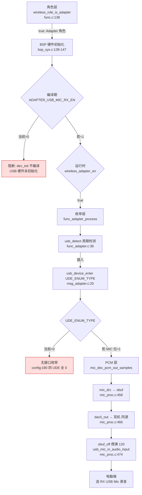

# 14 USB Mic 枚举链与上行通路

> 本文梳理 USB Mic（RX 作为 USB Audio 麦克风端点，供电脑录音）的配置宏、角色门控、USB 枚举状态机、PCM 上行数据通路与段预留。所有结论来自源码实际引用关系（文件、函数、行号）。

> **核心诚实标注**：
> 1. **当前 `ADAPTER_USB_MIC_RX_EN=0`，整条 USB Mic 链路不编译**——[config_ab5766_le_mic.h:123](../../../projects/microphone/config_ab5766_le_mic.h#L123) 实测值为 `0`（注释"接收端是否开启usb mic功能（上行音频，不支持）"）。下文所有 `#if ADAPTER_USB_MIC_RX_EN` 包裹的代码（`usb_detect`/`usb_device_enter`/`usb_mic_in_audio_input` 调用点）当前**均不编译**。
> 2. **`usb_mic_in_audio_input` 实现不可见**——仅有声明 [func_adapter.h:21](../../../functions/func_adapter.h#L21) `void usb_mic_in_audio_input(u8 *ptr, u32 samples, int ch_mode, void *params);`，调用点在 [mic_proc.c:474](../../../modules/wireless/mic_proc.c#L474)/[509](../../../modules/wireless/mic_proc.c#L509)（均在 `#if ADAPTER_USB_MIC_RX_EN` 内）。**实现不在源码树**，且因当前 `EN=0` 未参与链接，`map.txt` 无 `usb_mic_in` / `usb_device_mic_in` 符号可确认其预编译归属（`libplatform.a` 列表中亦未见独立 `usb_device_mic_in.o` 条目）。即：实现缺失 + 预编译归属未能通过 map.txt 直接证实，**不臆断其位于 `libplatform.a(usb_device_mic_in.o)`**。
> 3. **`UDE_ENUM_TYPE` 当前 = 0**——`UDE_STORAGE_EN=0`、`UDE_SPEAKER_EN=ADAPTER_USB_SPK_TX_EN=0`、`UDE_HID_EN=0`、`UDE_MIC_EN=ADAPTER_USB_MIC_RX_EN=0`（[config:176-180](../../../projects/microphone/config_ab5766_le_mic.h#L176-L180)），即当前 USB 设备**不枚举任何接口**（storage/speaker/hid/mic 全 0）。

> **当前实测状态（CLAUDE.md）**：USB Mic **尚未通过**。CLAUDE.md「USB Mic 已知限制」明确："USB Mic 是电脑采集输入方向（RX 作为 USB Audio 麦克风端点，供电脑录音），不是 USB 播放输出方向"；"`ADAPTER_USB_MIC_RX_EN=1` 只是编译期开关，实际运行还需 `xcfg_cb.wireless_adapter_en` 成立（进入 Adapter/RX 角色）并完成 USB 枚举"；"当前用户 USB Mic 尚未通过，后续算法测试先用 RX 耳机完成，USB Mic 故障排查放到算法测试之后，作为独立步骤；不在算法 A/B 中改动 USB 相关宏"。排查时按「角色 → 枚举 → PCM → 电脑端」分层收集证据，不得未经证据断定根因。

> **方向纠偏**：USB Mic 是**电脑端采集输入**方向（RX 把解码后的 PCM 经 USB Audio 麦克风端点上行给电脑录音），**不是** USB 播放输出方向（不要期待从 USB 播放到耳机）。耳机听音正常 ≠ USB Mic 正常。

---

## 1. 配置宏与编译状态

### 1.1 使能宏链（当前全部关闭）

[config_ab5766_le_mic.h:120-134](../../../projects/microphone/config_ab5766_le_mic.h#L120-L134)（适配器端私有配置）、[176-180](../../../projects/microphone/config_ab5766_le_mic.h#L176-L180)（USB device 功能选择）：

```c
#define ADAPTER_DAC_OUTPUT_EN                   1               //适配器是否支持dac输出MIC音频
#define ADAPTER_USB_SPK_TX_EN                   0               //发射端是否开启usb spk功能（下行音频，不支持）
#define ADAPTER_USB_MIC_RX_EN                   0               //接收端是否开启usb mic功能（上行音频，不支持）
#define ADAPTER_MIX_DRC_EN                      1               //混音DRC功能(用于一拖二混音)
...
#define UDE_STORAGE_EN                          0               //不支持
#define UDE_SPEAKER_EN                          ADAPTER_USB_SPK_TX_EN
#define UDE_HID_EN                              0
#define UDE_MIC_EN                              ADAPTER_USB_MIC_RX_EN
#define UDE_ENUM_TYPE    (UDE_STORAGE_EN*0x01 + UDE_SPEAKER_EN*0x02 + UDE_HID_EN*0x04 + UDE_MIC_EN*0x08)
```

| 宏 | 定义 | 当前值 | 作用 |
|---|---|---|---|
| `ADAPTER_USB_MIC_RX_EN` | `[config:123]` | `0` | RX 端 USB Mic 上行音频总开关（USB Audio 麦克风端点） |
| `ADAPTER_USB_SPK_TX_EN` | `[config:122]` | `0` | TX 端 USB Speaker 下行音频（注释"不支持"） |
| `ADAPTER_DAC_OUTPUT_EN` | `[config:121]` | `1` | 适配器 DAC 输出 MIC 音频（耳机通路，当前启用） |
| `UDE_STORAGE_EN` | `[config:176]` | `0` | USB 大容量存储接口 |
| `UDE_SPEAKER_EN` | `=ADAPTER_USB_SPK_TX_EN` `[config:177]` | `0` | USB Audio 扬声器接口 |
| `UDE_HID_EN` | `[config:178]` | `0` | USB HID 接口 |
| `UDE_MIC_EN` | `=ADAPTER_USB_MIC_RX_EN` `[config:179]` | `0` | USB Audio 麦克风接口 |
| `UDE_ENUM_TYPE` | 位组合 `[config:180]` | `0` | USB 枚举接口位图（bit0 storage/bit1 speaker/bit2 hid/bit3 mic） |

### 1.2 当前 UDE_ENUM_TYPE 求值

当前四个 `UDE_*_EN` 全为 0，故：

```
UDE_ENUM_TYPE = 0*0x01 + 0*0x02 + 0*0x04 + 0*0x08 = 0
```

即当前 USB 设备**不枚举任何接口**。这意味着即使其他条件满足并调用 `usb_device_enter(UDE_ENUM_TYPE)`，传入的枚举类型也是 0（无 storage/speaker/hid/mic）。但实际由于 `ADAPTER_USB_MIC_RX_EN=0`，`usb_device_enter` 的调用点（[msg_adapter.c:20](../../../functions/msg_adapter.c#L20)）本身在 `#if` 内不编译，不会被调用。如实记录此求值结果，不臆断 `UDE_ENUM_TYPE=0` 时 `usb_device_enter` 的内部行为（预编译实现不可见）。

### 1.3 编译状态：整条链路不编译

`ADAPTER_USB_MIC_RX_EN=0` 使以下 `#if` 块全部不编译：

| 文件 | 行 | `#if` 块 | 不编译内容 |
|---|---|---|---|
| [bsp_sys.c:139-147](../../../bsp/bsp_sys.c#L139-L147) | 139 | `#if ADAPTER_USB_MIC_RX_EN` | `dev_init(1)` USB 硬件初始化 |
| [func_adapter.c:33-54](../../../functions/func_adapter.c#L33-L54) | 33 | `#if ADAPTER_USB_MIC_RX_EN` | `adapter_usb_init_flag` 定义、`usb_detect()` 定义 |
| [func_adapter.c:192-200](../../../functions/func_adapter.c#L192-L200) | 192 | `#if ADAPTER_USB_MIC_RX_EN` | `usb_detect()` 调用、`usb_device_process()` 调用 |
| [msg_adapter.c:17-34](../../../functions/msg_adapter.c#L17-L34) | 17 | `#if ADAPTER_USB_MIC_RX_EN` | `EVT_PC_INSERT`/`EVT_PC_REMOVE` case 分支 |
| [mic_proc.c:473-475](../../../modules/wireless/mic_proc.c#L473-L475) | 473 | `#if ADAPTER_USB_MIC_RX_EN` | `usb_mic_in_audio_input()` 调用（双链路 frag 路径） |
| [mic_proc.c:508-510](../../../modules/wireless/mic_proc.c#L508-L510) | 508 | `#if ADAPTER_USB_MIC_RX_EN` | `usb_mic_in_audio_input()` 调用（单链路路径） |

即从 USB 硬件初始化、枚举状态机到 PCM 上行推送，**整条链路在当前编译配置下不存在**。

### 1.4 与 DAC 输出通路的关键差异

`ADAPTER_DAC_OUTPUT_EN=1`（当前启用）与 `ADAPTER_USB_MIC_RX_EN=0`（当前关闭）形成对照：

| 通路 | 宏 | 当前值 | 输出方向 | 当前状态 |
|---|---|---|---|---|
| DAC/耳机 | `ADAPTER_DAC_OUTPUT_EN` | `1` | RX 解码 PCM → DAC0 → 耳机 | **启用**（实测链路已验证听音正常） |
| USB Mic | `ADAPTER_USB_MIC_RX_EN` | `0` | RX 解码 PCM → USB Audio 麦克风端点 → 电脑录音 | **关闭**（不编译） |
| USB Speaker | `ADAPTER_USB_SPK_TX_EN` | `0` | 电脑音频 → USB → RX → DAC | **关闭**（注释"不支持"） |

> **耳机听音正常 ≠ USB Mic 正常**：DAC 通路（`ADAPTER_DAC_OUTPUT_EN=1`）已验证，但 USB Mic 通路（`ADAPTER_USB_MIC_RX_EN=0`）根本未编译，两者是独立通路，前者通过不能证明后者可用。这正是 CLAUDE.md「USB Mic 已知限制」强调的边界。

---

## 2. 角色门控与 USB 硬件初始化（角色层）

USB Mic 仅在 RX/Adapter 角色下才有意义。角色判定与 USB 硬件初始化构成「角色层」门控。

### 2.1 角色判定

[api_wireless_mic.h:42](../../../libs/ble/api_wireless_mic.h#L42)、[52](../../../libs/ble/api_wireless_mic.h#L52)：

```c
extern bool cfg_wireless_role;
...
#define wireless_role_is_adapter()              cfg_wireless_role
```

`wireless_role_is_adapter()` 是宏，直接展开为全局 `cfg_wireless_role`（bool）。`cfg_wireless_role` 在运行时由 `xcfg_init()` 加载（见 [01_系统初始化与角色调度.md](01_系统初始化与角色调度.md)），取值来自 `xcfg_cb.wireless_adapter_en` 对应的参数存储。

[func.c:138](../../../functions/func.c#L138)/[158](../../../functions/func.c#L158)：

```c
if (wireless_role_is_adapter()) {
    ...
    func_adapter();      // RX/Adapter 角色 → 进入适配器状态机
} else {
    func_mic_emit();     // TX 角色 → 进入发射端状态机
}
```

即只有 `cfg_wireless_role==true`（Adapter/RX 角色）才会进入 `func_adapter()`，USB Mic 链路才有可能被走到。TX 角色（`func_mic_emit`）下 USB Mic 链路不涉及。

### 2.2 USB 硬件初始化：双重门控

[bsp_sys.c:139-147](../../../bsp/bsp_sys.c#L139-L147)（`bsp_sys_init` 内）：

```c
#if ADAPTER_USB_MIC_RX_EN
    if (xcfg_cb.wireless_adapter_en) {
//        RSTCON0 |= BIT(0);
//        CLKCON0 |= BIT(15);
//        CLKCON4 &= ~BIT(25);
//        CLKCON1 &= ~BIT(10);             //USB
        dev_init(1);
    }
#endif
```

**双重门控**：
1. **编译期**：`#if ADAPTER_USB_MIC_RX_EN`——当前 `EN=0`，整块不编译。
2. **运行时**：`if (xcfg_cb.wireless_adapter_en)`——即使编译期通过，运行时还需 `xcfg_cb.wireless_adapter_en` 为真（与 `cfg_wireless_role` 对应的 Adapter 角色参数）。

`dev_init(1)` 是 USB 设备硬件初始化（参数 `1` 指示 USB device 模式）。注释行（RSTCON0/CLKCON0/CLKCON4/CLKCON1）显示原设计涉及 USB 复位与时钟门控寄存器配置，但当前被注释掉——如实记录此注释状态，不臆断这些寄存器是否在 `dev_init` 内部被配置（`dev_init` 实现预编译不可见）。

> **CLAUDE.md 直接对应**：CLAUDE.md「USB Mic 已知限制」明确"`ADAPTER_USB_MIC_RX_EN=1` 只是编译期开关。实际运行还需 `xcfg_cb.wireless_adapter_en` 成立（进入 Adapter/RX 角色）并完成 USB 枚举，见 bsp_sys.c 中 `dev_init(1)` 的条件"。本文以 [bsp_sys.c:139-147](../../../bsp/bsp_sys.c#L139-L147) 证实此双重门控。

### 2.3 角色层小结

| 门控 | 来源 | 类型 | 当前状态 |
|---|---|---|---|
| `ADAPTER_USB_MIC_RX_EN` | config:123 | 编译期 | `0`（不编译，第一道阻断） |
| `xcfg_cb.wireless_adapter_en` | bsp_sys.c:140 | 运行时 | 需 Adapter 角色参数为真 |
| `wireless_role_is_adapter()` | func.c:138 | 运行时角色分派 | 决定进入 `func_adapter()` |

当前 `EN=0` 已在编译期阻断，后两道运行时门控根本不会被执行到。

---

## 3. USB 枚举状态机（枚举层）

进入 `func_adapter()` 运行循环后，USB 插拔检测与枚举由「枚举层」处理。当前 `EN=0` 此层不编译，但源码逻辑可读，记录其设计。

### 3.1 运行循环中的插拔检测

[func_adapter.c:166-202](../../../functions/func_adapter.c#L166-L202)（`func_adapter_process`）：

```c
AT(.text.func.adapter)
void func_adapter_process(void)
{
    ...
    if(adapter.init_state != ADAPTER_STA_IDLE || wireless_mic.change_flag) {
        func_adapter_process_do();
    }
    if(wireless_mic.connected_sta != sys_cb.disp_sta) {
        wireless_mic_proc();
    }
    func_process();
#if ADAPTER_USB_MIC_RX_EN
    if (xcfg_cb.wireless_adapter_en) {
        usb_detect();
    }

    if (adapter_usb_init_flag) {
        usb_device_process();
    }
#endif
    wireless_dump_proc();
}
```

`func_adapter_process()` 是 Adapter 角色的主循环周期函数（被 `func_adapter()` 的 `while` 循环调用，[func_adapter.c:223-231](../../../functions/func_adapter.c#L223-L231)）。USB 部分逻辑：

1. `if (xcfg_cb.wireless_adapter_en) usb_detect();`——运行时再次检查角色参数，调用 `usb_detect()` 做 USB 插拔检测（轮询）。
2. `if (adapter_usb_init_flag) usb_device_process();`——若已枚举（`adapter_usb_init_flag==1`），周期调用 `usb_device_process()` 维持 USB 设备运转（处理端点中断/数据搬运等）。

> **`usb_device_process()` 与 `usb_detect()` 的分工**：`usb_detect()` 负责"是否插上/拔下"的状态翻转检测，发事件消息；`usb_device_process()` 负责"已枚举后"的持续运转。两者都是周期调用，但触发条件不同。

### 3.2 usb_detect：插拔检测与事件发送

[func_adapter.c:33-54](../../../functions/func_adapter.c#L33-L54)：

```c
#if ADAPTER_USB_MIC_RX_EN
volatile uint8_t adapter_usb_init_flag = 0;

AT(.usbdev.com.detect)
void usb_detect(void)
{
    u8 usb_sta = usbchk_connect();
    if (usb_sta == 1) {
        if (dev_online_filter(DEV_USBPC)) {
            msg_enqueue(EVT_PC_INSERT);
//            printf("pc insert\n");
        }
    } else {
        if (dev_offline_filter(DEV_USBPC)) {
            msg_enqueue(EVT_PC_REMOVE);
            pc_remove();
//            printf("pc remove\n");
        }
    }
}
#endif
```

**逻辑**：
1. `usbchk_connect()`（[api_usb.h:4](../../../libs/cpu/api_usb.h#L4)，预编译）查询 USB 连接状态，返回 `usb_sta`（1=已连接，其他=未连接）。
2. **插入**：`usb_sta==1` 且 `dev_online_filter(DEV_USBPC)`（去抖/边沿过滤，`DEV_USBPC=0` 见 [func_adapter.c:22-25](../../../functions/func_adapter.c#L22-L25) 的 enum）通过 → `msg_enqueue(EVT_PC_INSERT)` 发"PC 插入"事件。
3. **拔出**：`usb_sta!=1` 且 `dev_offline_filter(DEV_USBPC)` 通过 → `msg_enqueue(EVT_PC_REMOVE)` 发"PC 拔出"事件 + `pc_remove()`（[api_usb.h:5](../../../libs/cpu/api_usb.h#L5)，预编译清理）。

`dev_online_filter`/`dev_offline_filter` 是预编译的去抖过滤函数（防止插拔抖动反复发事件），实现在 `libplatform.a`，不可读。`adapter_usb_init_flag` 定义在此块内（`volatile uint8_t = 0`），AT 段标注 `.usbdev.com.detect`。

### 3.3 EVT_PC_INSERT / EVT_PC_REMOVE：枚举动作

[msg_adapter.c:17-34](../../../functions/msg_adapter.c#L17-L34)（`func_adapter_message`）：

```c
#if ADAPTER_USB_MIC_RX_EN
    case EVT_PC_INSERT:
        printf("EVT_PC_INSERT\n");
        usb_device_enter(UDE_ENUM_TYPE);
        adapter_usb_init_flag = 1;
        break;

    case EVT_PC_REMOVE:
        printf("EVT_PC_REMOVE\n");
        usb_device_exit();
        adapter_usb_init_flag = 0;
        break;
...
#endif
```

事件定义在 [functions/msg.h:23-24](../../../functions/msg.h#L23-L24)（enum）：`EVT_PC_INSERT, EVT_PC_REMOVE,`。

**插入处理**：
1. `printf("EVT_PC_INSERT\n")`——UART 打印（排查时可作"枚举事件已到达"的证据）。
2. `usb_device_enter(UDE_ENUM_TYPE)`（[api_usb.h:8](../../../libs/cpu/api_usb.h#L8)，预编译）——启动 USB 设备枚举，`UDE_ENUM_TYPE` 决定枚举哪些接口。当前 `UDE_ENUM_TYPE=0`（见第 1 节）。
3. `adapter_usb_init_flag = 1`——标记"已枚举"，后续 `func_adapter_process` 据此周期调 `usb_device_process()`。

**拔出处理**：
1. `printf("EVT_PC_REMOVE\n")`。
2. `usb_device_exit()`（[api_usb.h:9](../../../libs/cpu/api_usb.h#L9)，预编译）——退出 USB 设备。
3. `adapter_usb_init_flag = 0`——清除标记。

`func_adapter_message` 被 `func_message()` 经由消息循环调用（`func_adapter_process` → `func_process` → 消息分发，见 [01_系统初始化与角色调度.md](01_系统初始化与角色调度.md)）。

### 3.4 枚举层小结：状态机

| 状态 | 标志 | 触发 | 动作 |
|---|---|---|---|
| 未连接 | `adapter_usb_init_flag=0` | 初始 / `EVT_PC_REMOVE` | `usb_device_exit()`（拔出时） |
| 已插上 | `usbchk_connect()==1` + filter | `usb_detect()` 周期检测 | `msg_enqueue(EVT_PC_INSERT)` |
| 枚举中 | `EVT_PC_INSERT` 处理 | `func_adapter_message` | `usb_device_enter(UDE_ENUM_TYPE)` + flag=1 |
| 已枚举运转 | `adapter_usb_init_flag==1` | `func_adapter_process` 周期 | `usb_device_process()` |
| 拔出 | `usbchk_connect()!=1` + filter | `usb_detect()` | `msg_enqueue(EVT_PC_REMOVE)` → `usb_device_exit()` + flag=0 |

> **诚实边界**：`usb_device_enter`/`usb_device_exit`/`usb_device_process`/`usbchk_connect`/`pc_remove`/`dev_online_filter`/`dev_offline_filter` 全部预编译在 `libplatform.a`，实现不可见。本文只记录调用点、参数、时机与输入输出语义，不推测 USB 协议栈内部（描述符构造、端点配置、枚举应答等）。

---

## 4. PCM 上行数据通路（PCM 层）

USB Mic 的核心是把 RX 解码后的 PCM 经 USB Audio 麦克风端点上行给电脑。这条 PCM 通路在 [modules/wireless/mic_proc.c](../../../modules/wireless/mic_proc.c) 的 RX 下行处理中，与 DAC 输出并行。

### 4.1 与 RX 解码链的关系

USB Mic 的 PCM 来源是 RX 解码后的帧（LC3S 解码 + PLC 后的 PCM），详见 [13_RX下行解码与MIX_DRC混音.md](13_RX下行解码与MIX_DRC混音.md)。`mic_dec_prco_cb`（[mic_proc.c:550](../../../modules/wireless/mic_proc.c#L550)）每帧解码后调 `mic_dec_pcm_out(idx)`（[586](../../../modules/wireless/mic_proc.c#L586)），后者负责把 PCM 推向下一级（DAC + USB Mic）。

### 4.2 双链路（一拖二）PCM 推送：mic_dec_pcm_out_samples

[mic_proc.c:452-477](../../../modules/wireless/mic_proc.c#L452-L477)（`WIRELESS_CON_LINK_NB==2` 时经 frag0/frag1 调用）：

```c
AT(.text.adapter.proc)
static void mic_dec_pcm_out_samples(s16 *pcm0, s16 *pcm1, uint8_t samples, uint8_t adj_dac_flag)
{
    s16 *obuf = (s16 *)mic_dec.obuf;

#if ADAPTER_MIX_DRC_EN
    mix_drc_audio_input(pcm0, pcm1, (obuf+mic_dec.obuf_off), samples);   // 混音 + PACC（EQ/FSH/DRC）
#else
    for(uint i=0; i<(samples); i++) {
        obuf[i+mic_dec.obuf_off] = pcm0[i]/2 + pcm1[i]/2;                // 软混（不编译）
    }
#endif

#if ADAPTER_DAC_OUTPUT_EN
    dac0_out_audio_input((u8 *)(obuf+mic_dec.obuf_off), samples, 0);     // DAC/耳机
#endif
    mic_dec.obuf_off += samples;

    if (mic_dec.obuf_off == WIRELESS_MIC_SAMPLES_SELECT) {               // 攒满 120 点
        mic_dec.obuf_off = 0;
        ///在这里推dac/usb输出
#if ADAPTER_USB_MIC_RX_EN
        usb_mic_in_audio_input((u8 *)obuf, WIRELESS_MIC_SAMPLES_SELECT,0,0);  // USB Mic 上行
#endif
    }
}
```

**关键设计**：
1. PCM 先经 `mix_drc_audio_input`（`ADAPTER_MIX_DRC_EN=1` 当前启用）做混音 + PACC（EQ/FSH/DRC），写入 `mic_dec.obuf`。
2. 同时（每 frag）调 `dac0_out_audio_input` 推 DAC（`ADAPTER_DAC_OUTPUT_EN=1` 当前启用）——**DAC 与 USB 共用同一 obuf**。
3. `obuf_off` 累加到 `WIRELESS_MIC_SAMPLES_SELECT`（120 点）时复位为 0，并调用 `usb_mic_in_audio_input` 把整 120 点 obuf 上行。

即 USB Mic 的 PCM 与 DAC 的 PCM **同源**（都是 mix_drc 处理后的 `mic_dec.obuf`），只是推送目标不同（DAC 每 frag 推、USB Mic 攒满 120 点整帧推）。这意味着：**如果 DAC 听音正常（PCM 有数据），则到达 `usb_mic_in_audio_input` 调用点的 PCM 也应有数据**——前提是 `EN=1` 且 USB 枚举完成。当前 `EN=0`，`usb_mic_in_audio_input` 调用点不编译。

### 4.3 单链路 PCM 推送：mic_dec_pcm_out

[mic_proc.c:503-546](../../../modules/wireless/mic_proc.c#L503-L546)（`WIRELESS_CON_LINK_NB==1` 分支）：

```c
AT(.text.adapter.proc)
static void mic_dec_pcm_out(u8 idx)
{
#if (WIRELESS_CON_LINK_NB == 1)
    //输出到下一级
#if ADAPTER_USB_MIC_RX_EN
    usb_mic_in_audio_input((u8 *)(&mic_dec.pcm[0].buf[0]), WIRELESS_MIC_SAMPLES_SELECT,0,0);
#endif
#if ADAPTER_DAC_OUTPUT_EN
    dac0_out_audio_input((u8 *)(&mic_dec.pcm[0].buf[0]), WIRELESS_MIC_SAMPLES_SELECT, 0);
#endif
#else
    ...  // 双链路 frag0/frag1 逻辑（经 mic_dec_pcm_out_samples）
#endif
}
```

单链路（`LINK_NB==1`）下，`usb_mic_in_audio_input` 直接从 `mic_dec.pcm[0].buf` 取 120 点推送（不经 mix_drc，因单链路无需混音），与 `dac0_out_audio_input` 并行。当前 `WIRELESS_CON_LINK_NB=2`（一拖二），故实际走 `#else` 双链路 frag 路径（4.2 节），单链路分支不编译。

> **当前配置实际路径**：`WIRELESS_CON_LINK_NB=2` + `ADAPTER_MIX_DRC_EN=1` → `mic_dec_pcm_out` 走 `#else` → `mic_dec_pcm_out_frag0`/`frag1` → `mic_dec_pcm_out_samples` → `mix_drc_audio_input` + `dac0_out_audio_input` + 攒满 120 点 → `usb_mic_in_audio_input`（当前 `EN=0` 不编译）。

### 4.4 usb_mic_in_audio_input：实现缺失边界

[func_adapter.h:21](../../../functions/func_adapter.h#L21)：

```c
void usb_mic_in_audio_input(u8 *ptr, u32 samples, int ch_mode, void *params);
```

- **声明可见**：`func_adapter.h:21` 有声明，参数签名 `(u8 *ptr, u32 samples, int ch_mode, void *params)`。
- **调用点**：[mic_proc.c:474](../../../modules/wireless/mic_proc.c#L474)（双链路 `usb_mic_in_audio_input((u8 *)obuf, 120, 0, 0)`）、[mic_proc.c:509](../../../modules/wireless/mic_proc.c#L509)（单链路 `usb_mic_in_audio_input((u8 *)(&mic_dec.pcm[0].buf[0]), 120, 0, 0)`）。
- **参数**：`ptr`=PCM 缓冲指针（s16 数据），`samples=120`，`ch_mode=0`，`params=0`（调用点传 `0` 而非 `NULL`，语义同空）。
- **实现不可见**：全仓 `Glob **/usb_mic_in*` 无源文件匹配，实现不在源码树。
- **预编译归属未能证实**：因当前 `EN=0` 未参与链接，`map.txt` Grep `usb_mic_in|usb_device_mic_in` 无匹配；`libplatform.a` 在 `map.txt` 的成员列表中未见独立 `usb_device_mic_in.o` 条目（见第 6 节）。**不臆断其位于 `libplatform.a(usb_device_mic_in.o)`**，只记录"实现缺失 + 预编译归属未证实"。

### 4.5 PCM 层小结

| 路径 | 条件 | PCM 来源 | USB Mic 调用点 | 当前状态 |
|---|---|---|---|---|
| 双链路 frag | `LINK_NB==2`（当前） | `mic_dec.obuf`（mix_drc 后） | mic_proc.c:474 | EN=0 不编译 |
| 单链路直推 | `LINK_NB==1` | `mic_dec.pcm[0].buf` | mic_proc.c:509 | EN=0 不编译 + LINK_NB=2 不走此分支 |

> **PCM 与 DAC 同源**：`mic_dec_pcm_out_samples` 中 DAC 与 USB 共用 `obuf`，故"DAC 听音正常"可佐证"到达 USB 推送点的 PCM 有数据"，但**不能证明 USB 枚举完成、电脑端能录到**。这正是 CLAUDE.md「角色 → 枚举 → PCM → 电脑端」分层排查的依据：PCM 层有数据不代表电脑端能录音。

---

## 5. 段放置与资源预留

### 5.1 ram.ld USB 设备段

[ram.ld:96-100](../../../projects/microphone/ram.ld#L96-L100)（代码段）：

```ld
__code_start_usbdev = .;
*(.usbdev.com*)
__code_end_usbdev = .;
```

[ram.ld:142-147](../../../projects/microphone/ram.ld#L142-L147)（数据段）：

```ld
__buf_start_usbdev = .;
*(.buf.usb*)
*(.usb_buf*)
*(.usb*)
__buf_end_usbdev = .;
```

[ram.ld:474-475](../../../projects/microphone/ram.ld#L474-L475)（尺寸符号）：

```ld
__usbdev_code_size  = __code_end_usbdev - __code_start_usbdev;
__usbdev_buf_size   = __buf_end_usbdev - __buf_start_usbdev;
```

- **代码段 `.usbdev.com*`**：收集 USB 设备公共代码。`usb_detect` 用 `AT(.usbdev.com.detect)` 标注（[func_adapter.c:36](../../../functions/func_adapter.c#L36)），归属此段。
- **数据段 `.buf.usb*`/`.usb_buf*`/`.usb*`**：收集 USB 缓冲（端点缓冲、描述符等）。
- 两段都**无条件收集**（不在 `#if ADAPTER_USB_MIC_RX_EN` 内），即段定义始终存在；但当前 `EN=0`，`usb_detect` 等函数不编译，`.usbdev.com.detect` 段为空，`__usbdev_code_size`/`__usbdev_buf_size` 可能为 0 或仅含预编译库拉入的少量 USB 基础设施。

### 5.2 map.txt 证实

[map.txt:2463](../../../projects/microphone/Output/bin/map.txt#L2463)：

```
*(.usbdev.com*)
```

即 `map.txt` 中 `.usbdev.com*` 段收集规则存在（与 ram.ld:99 对应）。但 Grep `usb_device_enter|usb_device_process|usbchk_connect|usb_detect` 在 map.txt **无符号匹配**——因当前 `EN=0`，`usb_detect` 不编译（无符号），预编译 USB 设备函数也未被调用点拉入链接。如实记录：段预留存在，但当前无应用层 USB 符号被链接。

### 5.3 与同类段预留对比

| 段 | ram.ld 行 | 收集模式 | 当前状态 |
|---|---|---|---|
| `.usbdev.com*` | 98-100 | 无条件 | 段在，应用层符号空（EN=0） |
| `.buf.usb*`/`.usb*` | 142-147 | 无条件 | 段在，缓冲空（EN=0） |
| `.text.adapter.proc` | （见 13 号） | 无条件 | RX 处理代码，启用 |

USB 段与算法模块段（`.text.agc_proc` 等在 `#if` 内）不同——USB 段是无条件预留的，说明 USB 设备基础设施在设计上预期常驻（可能供其他 USB 功能或库内部使用），而非仅 Mic 用。

---

## 6. 预编译库边界与实现缺失

### 6.1 可记录 vs 不可推测

| 项目 | 来源 | 可记录 | 不可推测 |
|---|---|---|---|
| `usbchk_connect()` | [api_usb.h:4](../../../libs/cpu/api_usb.h#L4) | 返回 u8（1=连接），无参 | 内部 USB PHY 检测机制 |
| `pc_remove()` | [api_usb.h:5](../../../libs/cpu/api_usb.h#L5) | 无参，拔出时清理 | 内部清理动作 |
| `usb_device_process()` | [api_usb.h:6](../../../libs/cpu/api_usb.h#L6) | 无参，已枚举后周期调用维持运转 | 端点中断处理、数据搬运 |
| `usb_connected_sync_volume()` | [api_usb.h:7](../../../libs/cpu/api_usb.h#L7) | 无参（当前无调用点，见下） | 音量同步机制 |
| `usb_device_enter(u8 enum_type)` | [api_usb.h:8](../../../libs/cpu/api_usb.h#L8) | 参数 `enum_type`=接口位图，启动枚举 | 描述符构造、端点配置、枚举应答 |
| `usb_device_exit()` | [api_usb.h:9](../../../libs/cpu/api_usb.h#L9) | 无参，退出 USB 设备 | 内部状态清理 |
| `dev_online_filter`/`dev_offline_filter` | func_adapter.c:41/46 调用 | 参数 `DEV_USBPC=0`，去抖过滤 | 去抖算法、filter 状态机 |
| `usb_mic_in_audio_input` | func_adapter.h:21 声明 | 签名 `(u8*,u32,int,void*)`，调用点 mic_proc.c:474/509 | **实现不可见**，USB Audio 麦克风端点如何把 PCM 上行给电脑（等时端点传输、采样率反馈等） |

### 6.2 usb_connected_sync_volume 无调用点

[api_usb.h:7](../../../libs/cpu/api_usb.h#L7) 声明 `usb_connected_sync_volume()`，但 [msg_adapter.c:30-33](../../../functions/msg_adapter.c#L30-L33) 中对应 case `EVT_USB_SYNC_VOL` **已被注释**：

```c
//    case EVT_USB_SYNC_VOL:
////        my_printf("EVT_USB_SYNC_VOL\n");
//        usb_connected_sync_volume();
//        break;
```

即 `usb_connected_sync_volume` 有声明但当前无调用点（与 `m_lc3s_dec_exit` 类似的"声明可见无调用点"情形，见 [13_RX下行解码与MIX_DRC混音.md](13_RX下行解码与MIX_DRC混音.md)）。

### 6.3 map.txt libplatform.a 成员

[map.txt:3-63](../../../projects/microphone/Output/bin/map.txt#L3-L63) 列出 `libplatform.a` 参与链接的成员 `.o`（voltage_trim/tog_buf/sys_clk/sys/sleep/lock/key/reset/pmu/pll/freq_det/thread_timer/thread_auppm/thread_alg/startup/interrupt/main/pacc_effect/pacc/audio_eq/audio_drc/lc3s_enc/lc3s_dec/xcfg/os_flash/cm/rf_wish/complex/bt_pll/bt_dbg/sddac...）。**未见 `usb_device_mic_in.o` 或类似 USB Mic 专属成员**。如实记录：因 `EN=0`，USB Mic 相关预编译符号未被拉入链接，无法从 map.txt 证实 `usb_mic_in_audio_input` 的预编译归属 .o。**不臆断其位于哪个 .o**。

### 6.4 不可推测项

由于实现缺失 + 预编译不可见，以下均**不可推测**：
- `usb_mic_in_audio_input` 内部是否检查 USB 枚举状态（若未枚举时调用是否安全丢弃）、是否做采样率转换（USB Audio 标称采样率 vs LC3S 解码 48k）、声道格式转换（`ch_mode=0` 的语义）。
- `usb_device_enter(0)`（`UDE_ENUM_TYPE=0`）时是否枚举空设备、是否报错、是否什么也不做。
- USB Audio 麦克风端点的等时传输机制（反馈端点、同步类型）。
- `usb_device_process` 的周期调用是否满足 USB 等时传输的实时性要求（与音频帧率 48k/120 点 = 4000 帧/s 的匹配）。
- 当前 `EN=0` 下 `dev_init(1)` 不调用，USB PHY 是否完全未上电/未复位（注释行 RSTCON0/CLKCON0 被注释，但 `dev_init` 内部行为不可见）。

---

## 7. 完整调用链（当前 EN=0 全不编译，记录设计链路）

### 7.1 角色层 → 枚举层 → PCM 层 → 电脑端（sequenceDiagram）

```mermaid
sequenceDiagram
    participant ROLE as func.c<br/>wireless_role_is_adapter
    participant BSP as bsp_sys.c<br/>bsp_sys_init
    participant LOOP as func_adapter_process<br/>(主循环)
    participant DET as usb_detect<br/>(func_adapter.c:36)
    participant MSG as func_adapter_message<br/>(msg_adapter.c:17)
    participant DEV as usb_device_enter/process<br/>(预编译 api_usb.h)
    participant PCM as mic_dec_pcm_out_samples<br/>(mic_proc.c:452)
    participant USBMIC as usb_mic_in_audio_input<br/>(func_adapter.h:21, 实现缺失)
    participant PC as 电脑端录音设备
    Note over ROLE,BSP: 角色层 (编译期 EN=0 当前全不编译)
    Note over DET,USBMIC: 枚举层 + PCM 层 (EN=0 不编译)
    ROLE->>LOOP: cfg_wireless_role==true → func_adapter() [func.c:158]
    BSP->>BSP: #if ADAPTER_USB_MIC_RX_EN (EN=0 阻断)<br/>if(wireless_adapter_en) dev_init(1) [bsp_sys.c:139-145]
    Note over BSP: 当前 EN=0, dev_init(1) 不编译, USB 硬件未初始化
    loop 主循环周期
        LOOP->>DET: if(wireless_adapter_en) usb_detect() [func_adapter.c:193-194]
        DET->>DET: usbchk_connect() [api_usb.h:4 预编译]
        alt 插入 (usb_sta==1 + dev_online_filter)
            DET->>MSG: msg_enqueue(EVT_PC_INSERT) [func_adapter.c:42]
        else 拔出 (usb_sta!=1 + dev_offline_filter)
            DET->>MSG: msg_enqueue(EVT_PC_REMOVE) + pc_remove() [func_adapter.c:47-48]
        end
        MSG->>DEV: EVT_PC_INSERT: usb_device_enter(UDE_ENUM_TYPE) [msg_adapter.c:20]<br/>adapter_usb_init_flag=1
        Note over DEV: UDE_ENUM_TYPE 当前=0 (无接口) [config:180]
        LOOP->>DEV: if(adapter_usb_init_flag) usb_device_process() [func_adapter.c:197-198]
    end
    Note over PCM,PC: PCM 层 (每帧 RX 解码后)
    PCM->>PCM: mix_drc_audio_input → obuf [mic_proc.c:458]
    PCM->>PCM: dac0_out_audio_input → DAC/耳机 [mic_proc.c:466]
    Note over PCM: obuf_off 攒满 120 点
    PCM->>USBMIC: usb_mic_in_audio_input(obuf, 120, 0, 0) [mic_proc.c:474]
    Note over USBMIC: 实现不可见 (不在源码树, map.txt 无符号)
    USBMIC->>PC: (设计预期) USB Audio 麦克风端点上行 PCM
    Note over PC: 电脑端选 RX USB Mic 作录音输入
    Note over PCM,PC: 当前 EN=0, usb_mic_in_audio_input 调用点不编译, PCM→电脑链路断开
```

### 7.2 四层门控与当前断点（flowchart）



红色节点为当前配置下的断点：`ADAPTER_USB_MIC_RX_EN=0` 在编译期即阻断 `dev_init`，`UDE_ENUM_TYPE=0` 即使枚举也无接口。

---

## 8. 知识点小结

1. **当前 EN=0 整链不编译（核心事实）**：`ADAPTER_USB_MIC_RX_EN=0`（[config:123](../../../projects/microphone/config_ab5766_le_mic.h#L123)），`bsp_sys.c:139`/`func_adapter.c:33,192`/`msg_adapter.c:17`/`mic_proc.c:473,508` 的 `#if` 块全不编译。USB 硬件初始化、枚举状态机、PCM 上行推送整条链路不存在。
2. **方向纠偏**：USB Mic 是电脑采集输入方向（RX PCM → USB Audio 麦克风端点 → 电脑录音），不是 USB 播放输出。耳机听音正常（DAC 通路）≠ USB Mic 正常（独立通路）。
3. **双重门控**：编译期 `ADAPTER_USB_MIC_RX_EN` + 运行时 `xcfg_cb.wireless_adapter_en`（[bsp_sys.c:139-140](../../../bsp/bsp_sys.c#L139-L140)）。当前编译期已阻断。
4. **UDE_ENUM_TYPE 当前=0**：`UDE_STORAGE_EN=0`/`UDE_SPEAKER_EN=ADAPTER_USB_SPK_TX_EN=0`/`UDE_HID_EN=0`/`UDE_MIC_EN=ADAPTER_USB_MIC_RX_EN=0`（[config:176-180](../../../projects/microphone/config_ab5766_le_mic.h#L176-L180)），位组合全 0，当前 USB 设备不枚举任何接口。
5. **角色判定是宏**：`wireless_role_is_adapter()`（[api_wireless_mic.h:52](../../../libs/ble/api_wireless_mic.h#L52)）= `cfg_wireless_role`（extern bool，[api_wireless_mic.h:42](../../../libs/ble/api_wireless_mic.h#L42)），在 [func.c:138](../../../functions/func.c#L138) 决定进入 `func_adapter()` 还是 `func_mic_emit()`。
6. **USB 硬件初始化 dev_init(1)**：[bsp_sys.c:145](../../../bsp/bsp_sys.c#L145)，参数 `1`=USB device 模式。注释行 RSTCON0/CLKCON0/CLKCON4/CLKCON1（USB 复位/时钟）被注释，但 `dev_init` 内部行为预编译不可见。
7. **枚举状态机四状态**：未连接（flag=0）→ 插上（`usb_detect` 发 `EVT_PC_INSERT`）→ 枚举（`usb_device_enter`+flag=1）→ 运转（`usb_device_process` 周期）→ 拔出（`EVT_PC_REMOVE`+`usb_device_exit`+flag=0）。`adapter_usb_init_flag`（[func_adapter.c:34](../../../functions/func_adapter.c#L34) `volatile uint8_t`，extern [func_adapter.h:8](../../../functions/func_adapter.h#L8)）是状态机核心标志。
8. **usb_detect 去抖**：`dev_online_filter`/`dev_offline_filter`（[func_adapter.c:41/46](../../../functions/func_adapter.c#L41)）做插拔去抖，防抖动反复发事件。`DEV_USBPC=0`（[func_adapter.c:22-25](../../../functions/func_adapter.c#L22-L25) enum）。去抖实现预编译不可见。
9. **usb_detect 段标注**：`AT(.usbdev.com.detect)`（[func_adapter.c:36](../../../functions/func_adapter.c#L36)），归 `.usbdev.com*` 段（[ram.ld:98-100](../../../projects/microphone/ram.ld#L98-L100)）。当前 EN=0 不编译，该段为空。
10. **PCM 与 DAC 同源**：`mic_dec_pcm_out_samples`（[mic_proc.c:452](../../../modules/wireless/mic_proc.c#L452)）中 `mix_drc` 写 `obuf`，DAC（`dac0_out_audio_input` L466）与 USB Mic（`usb_mic_in_audio_input` L474，攒满 120 点）共用 `obuf`。DAC 听音正常可佐证 PCM 层有数据，但不证明电脑端能录到。
11. **双链路攒满 120 点推送**：`obuf_off` 累加到 `WIRELESS_MIC_SAMPLES_SELECT`（120）才调 `usb_mic_in_audio_input`（[mic_proc.c:470-475](../../../modules/wireless/mic_proc.c#L470-L475)），整帧推送。DAC 则每 frag 推。当前 `LINK_NB=2` 走此路径。
12. **单链路直推**：`LINK_NB==1` 时 `usb_mic_in_audio_input` 直接从 `mic_dec.pcm[0].buf` 取 120 点（[mic_proc.c:509](../../../modules/wireless/mic_proc.c#L509)），不经 mix_drc。当前 `LINK_NB=2` 不走此分支。
13. **usb_mic_in_audio_input 实现缺失**：声明 [func_adapter.h:21](../../../functions/func_adapter.h#L21)，调用点 mic_proc.c:474/509，**实现不在源码树**，`map.txt` 无符号（EN=0 未链接），`libplatform.a` 成员列表未见 `usb_device_mic_in.o`。**不臆断预编译归属**。
14. **usb_connected_sync_volume 无调用点**：[api_usb.h:7](../../../libs/cpu/api_usb.h#L7) 声明，但 [msg_adapter.c:30-33](../../../functions/msg_adapter.c#L30-L33) 对应 case 已注释。与 `m_lc3s_dec_exit` 类似"声明可见无调用点"。
15. **ram.ld USB 段无条件预留**：`.usbdev.com*`/`.buf.usb*`/`.usb_buf*`/`.usb*`（[ram.ld:98-100/142-147](../../../projects/microphone/ram.ld#L98-L100)），不在 `#if` 内，段定义常驻；当前 EN=0 应用层符号空。与算法模块段（`#if` 内）不同，USB 段预期常驻基础设施。
16. **map.txt 仅见段规则**：[map.txt:2463](../../../projects/microphone/Output/bin/map.txt#L2463) `*(.usbdev.com*)` 段规则在，但 Grep `usb_device_enter|usb_device_process|usbchk_connect|usb_detect` 无符号（EN=0 未链接）。
17. **CLAUDE.md 排查分层对应**：本文「角色（§2）→ 枚举（§3）→ PCM（§4）→ 电脑端（§7.1 末）」正对应 CLAUDE.md「角色 → 枚举 → PCM → 电脑端」分层排查要求。每层证据独立收集，不得未经证据断定根因。
18. **当前 USB Mic 尚未通过**：CLAUDE.md 实测状态明确。后续算法测试先用 RX 耳机完成，USB Mic 故障排查放算法测试之后，作为独立步骤；**不在算法 A/B 中改动 USB 相关宏**。
19. **启用前的必要条件**：`EN: 0→1` 仅改宏可能不够——需同时确保 `xcfg_cb.wireless_adapter_en` 运行时为真、`UDE_ENUM_TYPE` 的 MIC 位（bit3）为 1（即 `UDE_MIC_EN=1`）、`usb_mic_in_audio_input` 实现可链接（当前预编译归属未证实，若库中无则 undefined reference）。CLAUDE.md 要求排查时先只读核对，不改固件。
20. **EVT_PC_INSERT/REMOVE 有 printf 证据**：[msg_adapter.c:19/25](../../../functions/msg_adapter.c#L19) `printf("EVT_PC_INSERT\n")`/`printf("EVT_PC_REMOVE\n")`，排查时 UART 见此打印可证"枚举事件已到达消息处理"，属枚举层证据。
21. **USB Speaker 同样关闭**：`ADAPTER_USB_SPK_TX_EN=0`（[config:122](../../../projects/microphone/config_ab5766_le_mic.h#L122) 注释"不支持"），`UDE_SPEAKER_EN=ADAPTER_USB_SPK_TX_EN=0`，即 USB 下行播放也不支持。当前 USB 仅作 Mic 上行设计，且 Mic 也关闭。

---

## 9. 延伸阅读

- [00_算法总览与全局调用关系.md](00_算法总览与全局调用关系.md)（全局调用关系、USB Mic 在 RX 下行链中的位置）
- [01_系统初始化与角色调度.md](01_系统初始化与角色调度.md)（`bsp_sys_init`/`xcfg_init`/`func_run` 角色分派、`cfg_wireless_role` 加载）
- [13_RX下行解码与MIX_DRC混音.md](13_RX下行解码与MIX_DRC混音.md)（RX 下行解码链、`mic_dec_pcm_out`/`mic_dec_pcm_out_samples` 完整 frag 状态机、`mic_dec.obuf` 与 DAC/USB 共源）
- [06_EQ_DRC_PACC框架与SoftGain.md](06_EQ_DRC_PACC框架与SoftGain.md)（`mix_drc_audio_input`→PACC CS 链，USB Mic 的 PCM 在推送前经此混音处理）
- [docs/SDK/AB5766_LE_Mic_音频算法测试快速入门.md](../AB5766_LE_Mic_音频算法测试快速入门.md)（USB Mic 分层排查详节、P0 输出基线、实测状态）
- [docs/SDK/AB5766_接收端_Adapter_实现详解.md](../AB5766_接收端_Adapter_实现详解.md)（Adapter 角色实现，含 USB 描述；注意其中若标注 `ADAPTER_USB_MIC_RX_EN=1` 需以本文 config:123 实测 `=0` 为准）
