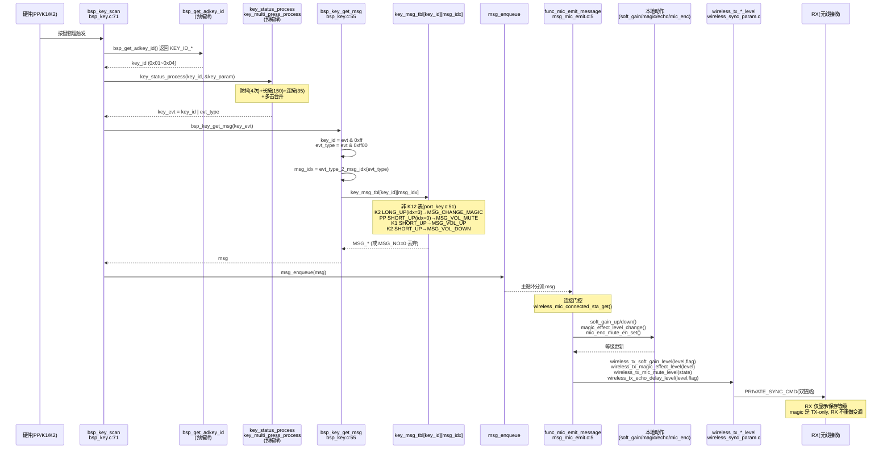
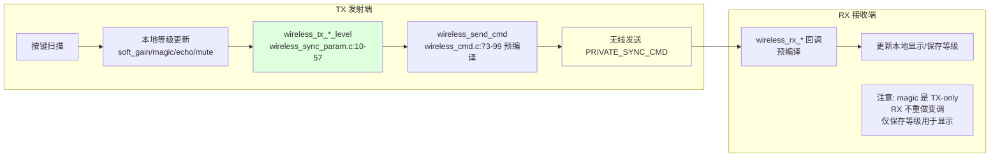

# 15 按键控制面

> 本文梳理按键从硬件扫描到消息分派、本地动作与 RX 参数同步的完整控制面。所有结论来自源码实际引用关系（文件、函数、行号）。

> **核心诚实标注（四重边界）**：
> 1. **当前板卡仅 `KEY_ID_PP`/`KEY_ID_K1`/`KEY_ID_K2` 三键，无 `KEY_ID_K3`**（CLAUDE.md「当前板卡按键硬件」）。项目未定义 `WIRELESS_MIC_K12_KEY_EN`，故编译使用 [port_key.c:50-58](../../../projects/microphone/port/port_key.c#L50-L58) 的**非 K12 按键表**。
> 2. **MAGIC 入口是非 K12 表中 `KEY_ID_K2` 的「长按抬起」列**（事件索引 3，`KEY_LONG_UP`，即长按后**松手**触发）映射到 `MSG_CHANGE_MAGIC`（[port_key.c:55](../../../projects/microphone/port/port_key.c#L55)）。**不是按下时、不是双击、也不是 K3 单击**。K12 配置下才是 K3 单击切 MAGIC（[port_key.c:48](../../../projects/microphone/port/port_key.c#L48)），当前板卡不适用 K3 描述。
> 3. **`MSG_VOICE_RM` 实现已注释**：[msg_mic_emit.c:117-122](../../../functions/msg_mic_emit.c#L117-L122) 中 `user_private_ctl_flag.voice_rm_en` 翻转与 `wireless_tx_voice_rm_en` 调用全被注释，case 体只剩 `printf` 与连接检查。
> 4. **Soft Gain ≠ AGC**：Soft Gain 是经 PACC CS 链的等级化增益（见 [06_EQ_DRC_PACC框架与SoftGain.md](06_EQ_DRC_PACC框架与SoftGain.md)），有 `MSG_VOL_UP/DOWN` 控制面、当前启用；AGC 是独立自动增益反馈环，当前 `EN=0` 不编译、无控制面（见 [12_AGC自动增益.md](12_AGC自动增益.md)）。两者机制不同，**Soft Gain 结果不能替代 AGC 结论**。同样，**ECHO 不称 AEC**（见 [07_ECHO混响.md](07_ECHO混响.md)）。

---

## 1. 配置宏与编译状态

### 1.1 按键表选择宏（当前未定义→非 K12 表编译）

[config_ab5766_le_mic.h](../../../projects/microphone/config_ab5766_le_mic.h) 中 `WIRELESS_MIC_K12_KEY_EN` **未定义**（全仓 Grep 该宏只见于 [port_key.c:42](../../../projects/microphone/port/port_key.c#L42) 与 [port_key.c:50](../../../projects/microphone/port/port_key.c#L50) 的 `#if`/`#else`，无 `#define` 落点）。预处理器对未定义宏按 0 处理，故 `#if WIRELESS_MIC_K12_KEY_EN` 为假，编译 **`#else` 分支即非 K12 表**（[port_key.c:50-58](../../../projects/microphone/port/port_key.c#L50-L58)）。

| 宏 | 状态 | 编译分支 | 生效按键表 |
|---|---|---|---|
| `WIRELESS_MIC_K12_KEY_EN` | 未定义（按 0） | `#else` | 非 K12 `mic_emit_key_msg_tbl`（port_key.c:51-57） |
| `WIRELESS_MIC_K12_KEY_EN` | 若定义为 1 | `#if` | K12 `mic_emit_key_msg_tbl`（port_key.c:43-49） |

`adapter_key_msg_tbl`（[port_key.c:61-67](../../../projects/microphone/port/port_key.c#L61-L67)）**不受 `WIRELESS_MIC_K12_KEY_EN` 影响**，无论 K12 与否都只有 PP HOLD→`MSG_PWR_HOLD`，其余全 `MSG_NO`。

### 1.2 按键按下静音宏（当前关闭）

[config_ab5766_le_mic.h:92](../../../projects/microphone/config_ab5766_le_mic.h#L92)：

```c
#define WIRELESS_MIC_KEY_PRESS_MUTE_EN          0   //发射端按键按下抬起时，是否短暂mute掉对应声音，不拾音
```

当前 `=0`，[bsp_key.c:8](../../../bsp/bsp_key.c#L8) 的 `#if WIRELESS_MIC_KEY_PRESS_MUTE_EN` 块不编译，`key_press_mute_str` 结构体与扫描中的 `mic_enc_key_press_mute_en_set` 分支不生效。同时影响防抖参数（见 1.3）与 `bsp_key_init` 的 `multiple_key_init` 时间参数（[bsp_key.c:140-146](../../../bsp/bsp_key.c#L140-L146)）。

### 1.3 防抖参数（受 PRESS_MUTE 影响）

[bsp_key.h:6-17](../../../bsp/bsp_key.h#L6-L17)：

```c
#if WIRELESS_MIC_KEY_PRESS_MUTE_EN
#define KEY_SCAN_TIMES          15          //按键防抖的扫描次数
#define KEY_UP_TIMES            15          //抬键防抖的扫描次数
#define KEY_LONG_TIMES          375         //长按键的次数
#define KEY_HOLD_TIMES          87          //连按的频率次数
#else
#define KEY_SCAN_TIMES          4           //按键防抖的扫描次数
#define KEY_UP_TIMES            4           //抬键防抖的扫描次数
#define KEY_LONG_TIMES          150         //长按键的次数
#define KEY_HOLD_TIMES          35          //连按的频率次数
#endif
#define KEY_LONG_HOLD_TIMES     (KEY_LONG_TIMES + KEY_HOLD_TIMES)
```

当前 `PRESS_MUTE=0`，生效 `#else`：扫描防抖 4 次、抬键防抖 4 次、长按 150 次、连按 35 次。这些值经 [bsp_key.c:32-37](../../../bsp/bsp_key.c#L32-L37) `key_param` 结构体传给预编译的 `key_status_process`/`key_multi_press_process`（驱动层，实现不可见）。

### 1.4 Soft Gain 等级宏

[config_ab5766_le_mic.h:161-162](../../../projects/microphone/config_ab5766_le_mic.h#L161-L162)：

```c
#define SOFT_GAIN_MAX_LEVEL                     8   // 64/32/16/8级音量表
#define SOFT_GAIN_DEFAULT_LEVEL                 0   //第一次上电默认等级，等级越大音量越小
```

| 宏 | 当前值 | 作用 |
|---|---|---|
| `SOFT_GAIN_MAX_LEVEL` | `8` | 等级数，决定编译 `soft_gain_tbl_8`（[soft_gain.c:52-56](../../../modules/audio/soft_gain.c#L52-L56)） |
| `SOFT_GAIN_DEFAULT_LEVEL` | `0` | 上电默认等级（= 0dB = 最大音量） |

注意注释"等级越大音量越小"：增益表从 `SOFT_GAIN_N0DB`（0dB）递减到 `SOFT_GAIN_N110DB`（-110dB 衰减），故 `soft_gain_up`（index-1）是音量+，`soft_gain_down`（index+1）是音量-。

---

## 2. 按键 ID 与事件类型编码

### 2.1 按键 ID（bsp_key.h）

[bsp_key.h:19-26](../../../bsp/bsp_key.h#L19-L26)：

```c
#define KEY_ID_NO               0x00
#define KEY_ID_PP               0x01
#define KEY_ID_K1               0x02
#define KEY_ID_K2               0x03
#define KEY_ID_K3               0x04
#define KEY_ID_K4               0x05
#define KEY_ID_MASK             0xff
```

`KEY_ID_MASK=0xff` 用于 [bsp_key.c:57-58](../../../bsp/bsp_key.c#L57-L58) 从 `key_evt` 中拆出低 8 位 `key_id`，高 8 位为 `evt_type`（`key_evt & 0xff00`）。

[bsp_key.h:28-29](../../../bsp/bsp_key.h#L28-L29)：

```c
#define KEY_TBL_MAX_NB          (KEY_MAX_NB+1)
#define KEY_MSG_MAX_IDX         8           //需要响应的按键消息
```

`KEY_TBL_MAX_NB` 是按键表第一维（`KEY_MAX_NB` 来自驱动层预编译，当前板卡用到 PP/K1/K2/K3 即 0x01~0x04，表大小足以索引）。`KEY_MSG_MAX_IDX=8` 对应 8 种事件（单击/长按下/HOLD/长按抬起/双击/三击/四击/五击）。

### 2.2 事件类型（api_key.h，预编译）

[api_key.h:6-13](../../../libs/cpu/api_key.h#L6-L13)：

```c
#define KEY_SHORT_UP            0x0800
#define KEY_LONG                0x0A00
#define KEY_LONG_UP             0x0C00
#define KEY_HOLD                0x0E00
#define KEY_DOUBLE              0x1800
#define KEY_THREE               0x1900
#define KEY_FOUR                0x1A00
#define KEY_FIVE                0x1B00
```

事件类型占 `key_evt` 高 8 位（`& 0xff00`），低 8 位为 `key_id`。例如 `KEY_ID_K2 | KEY_LONG_UP` = `0x03 | 0x0C00` = `0x0C03`，拆分得 `key_id=0x03`(K2)、`evt_type=0x0C00`(LONG_UP)。

### 2.3 事件类型→消息索引映射（evt_type_2_msg_idx）

[port_key.c:5-39](../../../projects/microphone/port/port_key.c#L5-L39)：

```c
AT(.com_text.bsp.key)
uint8_t evt_type_2_msg_idx(uint16_t evt_type)
{
    uint8_t msg_idx = 0xff;
    switch(evt_type) {
        case KEY_SHORT_UP:  msg_idx = 0; break;
        case KEY_LONG:      msg_idx = 1; break;
        case KEY_HOLD:      msg_idx = 2; break;
        case KEY_LONG_UP:   msg_idx = 3; break;
        case KEY_DOUBLE:    msg_idx = 4; break;
        case KEY_THREE:     msg_idx = 5; break;
        case KEY_FOUR:      msg_idx = 6; break;
        case KEY_FIVE:      msg_idx = 7; break;
    }
    return msg_idx;
}
```

| 事件类型 | 值 | msg_idx | 语义 |
|---|---|---|---|
| `KEY_SHORT_UP` | 0x0800 | 0 | 单击（短按抬起） |
| `KEY_LONG` | 0x0A00 | 1 | 长按到达阈值（按下持续） |
| `KEY_HOLD` | 0x0E00 | 2 | 连按（长按后的重复触发） |
| `KEY_LONG_UP` | 0x0C00 | 3 | 长按后**松手**抬起 |
| `KEY_DOUBLE` | 0x1800 | 4 | 双击 |
| `KEY_THREE` | 0x1900 | 5 | 三击 |
| `KEY_FOUR` | 0x1A00 | 6 | 四击 |
| `KEY_FIVE` | 0x1B00 | 7 | 五击 |

> **关键区分 `KEY_LONG`(idx=1) 与 `KEY_LONG_UP`(idx=3)**：`KEY_LONG` 是长按到达阈值时**按下持续**触发，`KEY_LONG_UP` 是长按后**松手**才触发。当前板卡 MAGIC 入口用的是 idx=3（`KEY_LONG_UP`，松手触发），不是 idx=1。

---

## 3. 按键扫描链

### 3.1 按键表装载（func_enter → key_set_msg_tbl）

[func.c:6-20](../../../functions/func.c#L6-L20) 把按键表与功能模式绑定：

```c
static const struct {
    const void *msg_tbl;
    u8 dev_online;      //0=不检查，!0=检查对应bit的dev_online
} func_info[] = {
    [FUNC_BT]       = {NULL,    0},
#if !ADAPTER_CLOSE_EN
    [FUNC_ADAPTER]  = {adapter_key_msg_tbl,     0},
#endif
#if !WIRELESS_MIC_CLOSE_EN
    [FUNC_MIC_EMIT] = {mic_emit_key_msg_tbl,      0},
#endif
    [FUNC_LE_DUT]   = {mic_emit_key_msg_tbl,      0},
    [FUNC_PWROFF]   = {NULL, 0},
    [FUNC_IDLE]     = {NULL, 0},
};
```

- `FUNC_MIC_EMIT`（TX 发射端）→ `mic_emit_key_msg_tbl`（[port_key.c:51](../../../projects/microphone/port/port_key.c#L51)）
- `FUNC_ADAPTER`（RX 接收端）→ `adapter_key_msg_tbl`（[port_key.c:61](../../../projects/microphone/port/port_key.c#L61)）
- `FUNC_LE_DUT`（蓝牙 DUT 测试）→ 复用 `mic_emit_key_msg_tbl`
- 所有 `dev_online=0`，即不检查设备在线

[func.c:114-125](../../../functions/func.c#L114-L125) `func_enter()` 在进入每个功能模式时装载对应表：

```c
void func_enter(void)
{
    bsp_param_sync();
    lowpwr_sleep_delay_reset();
    lowpwr_pwroff_delay_reset();
    key_set_msg_tbl(func_info[func_cb.sta].msg_tbl);
}
```

`key_set_msg_tbl`（[bsp_key.c:40-53](../../../bsp/bsp_key.c#L40-L53)）在临界区把外部 `msg_tbl` 拷入静态 `key_msg_tbl`：

```c
AT(.text.bsp.key.init) ALIGNED(128)
void key_set_msg_tbl(const void *msg_tbl)
{
    u8 msg_buf[KEY_TBL_MAX_NB*KEY_MSG_MAX_IDX];
    if(msg_tbl == NULL) {
        memset(msg_buf, MSG_NO, KEY_TBL_MAX_NB*KEY_MSG_MAX_IDX);
    } else {
        memcpy(msg_buf, msg_tbl, KEY_TBL_MAX_NB*KEY_MSG_MAX_IDX);
    }
    GLOBAL_INT_DISABLE();
    memcpy(key_msg_tbl, msg_buf, KEY_TBL_MAX_NB*KEY_MSG_MAX_IDX);
    GLOBAL_INT_RESTORE();
}
```

`msg_tbl==NULL` 时全填 `MSG_NO`（如 `FUNC_PWROFF`/`FUNC_IDLE`）。`GLOBAL_INT_DISABLE/RESTORE` 保证拷贝原子性。`key_msg_tbl` 是静态二维数组（[bsp_key.c:20](../../../bsp/bsp_key.c#L20)）：

```c
static u8 key_msg_tbl[KEY_TBL_MAX_NB][KEY_MSG_MAX_IDX];
```

### 3.2 扫描主循环（bsp_key_scan）

[bsp_key.c:70-135](../../../bsp/bsp_key.c#L70-L135) `bsp_key_scan`（`AT(.com_text.key.scan)`）：

```c
u16 bsp_key_scan(u8 mode)
{
    u16 key, key_id = KEY_ID_NO;

#if BSP_IOKEY_EN
    key_id = bsp_get_io_key_id();
#endif

#if BSP_ADKEY_EN
    if (key_id == KEY_ID_NO) {
        key_id = bsp_get_adkey_id();            // 根据ADC采样值返回键值
#if WIRELESS_MIC_KEY_PRESS_MUTE_EN
        // ... press_mute 分支（当前 EN=0 不编译）
#endif
    }
#endif

    if (mode) {
        return key_id;      // mode=1 仅返回状态，不分派消息
    }

    if (bsp_key_get_power_on_flag()) {
        if (key_id == KEY_ID_PP) {
            key_id = KEY_ID_NO;        // 开机期间屏蔽 PP
        } else {
            bsp_key_set_power_on_flag(false);
        }
    }

    key = key_status_process(key_id, &key_param);      // 短按、长按、连按处理
    key = key_multi_press_process(key);               // 多击处理

    if(key){
        key = bsp_key_get_msg(key);      // 查表
        msg_enqueue(key);                // 入队
    }

    return key;
}
```

扫描链步骤：
1. **取键值**：`bsp_get_io_key_id()`（IO 键）→ `bsp_get_adkey_id()`（ADC 键，根据分压返回 `KEY_ID_*`）。当前板卡 PP/K1/K2 的物理通道由 `BSP_IOKEY_EN`/`BSP_ADKEY_EN` 决定（驱动层预编译）。
2. **开机屏蔽**：`power_on_flag` 期间 PP 被屏蔽（[bsp_key.c:118-124](../../../bsp/bsp_key.c#L118-L124)），避免开机按键误触发。
3. **状态机**：`key_status_process(key_id, &key_param)`（预编译，实现不可见）把原始 `key_id` 经防抖（`KEY_SCAN_TIMES`/`KEY_LONG_TIMES`/`KEY_HOLD_TIMES`）转为 `KEY_SHORT_UP`/`KEY_LONG`/`KEY_HOLD`/`KEY_LONG_UP` 事件，返回 `key_id | evt_type`。
4. **多击**：`key_multi_press_process(key)`（预编译）把连续短按合并为 `KEY_DOUBLE`/`KEY_THREE`/`KEY_FOUR`/`KEY_FIVE`。
5. **查表**：`bsp_key_get_msg(key)`（见 3.3）把 `key_evt` 映射为 `MSG_*`。
6. **入队**：`msg_enqueue(key)` 把消息塞入系统消息队列，等主循环 `func_mic_emit_message`/`func_message` 分派。

### 3.3 查表（bsp_key_get_msg）

[bsp_key.c:54-67](../../../bsp/bsp_key.c#L54-L67)：

```c
AT(.com_text.bsp.key)
static u16 bsp_key_get_msg(u16 key_evt)
{
    u16 key_id  = key_evt & KEY_ID_MASK;       // 低 8 位
    u16 evt_type = key_evt & 0xff00;           // 高 8 位
    if(key_id < KEY_TBL_MAX_NB) {
        u8 msg_idx = evt_type_2_msg_idx(evt_type);
        if(msg_idx < KEY_MSG_MAX_IDX) {
            return key_msg_tbl[key_id][msg_idx];
        }
    }
    return NO_KEY;      // 0x0000
}
```

- `key_id` 越界（`>= KEY_TBL_MAX_NB`）→ 返回 `NO_KEY`，不分派。
- `evt_type` 未识别（`evt_type_2_msg_idx` 返回 `0xff`）→ `msg_idx >= KEY_MSG_MAX_IDX`，返回 `NO_KEY`。
- 正常路径：`key_msg_tbl[key_id][msg_idx]` 返回 `MSG_*`（或 `MSG_NO=0`，`bsp_key_scan` 中 `if(key)` 对 `MSG_NO=0` 判假，不入队——即 `MSG_NO` 静默丢弃）。

> **`MSG_NO` 的处理**：`MSG_NO=0`（[msg.h:6](../../../functions/msg.h#L6)），`bsp_key_scan` 的 `if(key)` 对 0 判假，故映射到 `MSG_NO` 的事件**不入队、不分派**，等同于"无操作"。这是 adapter 模式下 K1/K2/K3 按键无反应的直接原因。

### 3.4 初始化（bsp_key_init）

[bsp_key.c:137-155](../../../bsp/bsp_key.c#L137-L155)：

```c
void bsp_key_init(void)
{
#if WIRELESS_MIC_KEY_PRESS_MUTE_EN
    multiple_key_init(250, allow_multiple_key_table, sizeof(allow_multiple_key_table)/sizeof(u16));
    memset(&key_press_mute_str, 0, sizeof(key_press_mute_str));
    key_press_mute_str.key_hold_cnt = KEY_HOLD_CNT;        // 100
#else
    multiple_key_init(((DOUBLE_KEY_TIME*100)/5), allow_multiple_key_table, sizeof(allow_multiple_key_table)/sizeof(u16));
#endif
#if BSP_ADKEY_EN
    bsp_adkey_init();
#endif
#if BSP_IOKEY_EN
    bsp_iokey_init();
#endif
}
```

`allow_multiple_key_table`（[bsp_key.c:22-29](../../../bsp/bsp_key.c#L22-L29)）列出允许并发识别的键（PP/K1/K2/K3/K4 的 `SHORT_UP`），供预编译 `multiple_key_init` 使用。当前 `PRESS_MUTE=0` 走 `#else`，多击窗口为 `DOUBLE_KEY_TIME*100/5`。

---

## 4. 消息映射表

### 4.1 非 K12 发射端表（当前编译生效）

[port_key.c:50-58](../../../projects/microphone/port/port_key.c#L50-L58)（`#else` 分支，`WIRELESS_MIC_K12_KEY_EN` 未定义时编译）：

```c
const u8 mic_emit_key_msg_tbl[KEY_TBL_MAX_NB][KEY_MSG_MAX_IDX] = {
                //单击,           长按下,         HOLD,           长按抬起,        双击,      三击       四击       五击
    [KEY_ID_PP] ={MSG_VOL_MUTE,   MSG_NO,         MSG_PWR_HOLD,   MSG_NO,         MSG_NO,    MSG_NO,    MSG_NO,    MSG_NO},
    [KEY_ID_K1] ={MSG_VOL_UP,     MSG_NO,         MSG_NO,         MSG_NO,         MSG_NO,    MSG_NO,    MSG_NO,    MSG_NO},
    [KEY_ID_K2] ={MSG_VOL_DOWN,   MSG_NO,         MSG_NO,         MSG_CHANGE_MAGIC,MSG_NO,   MSG_NO,    MSG_NO,    MSG_NO},
    [KEY_ID_K3] ={MSG_NO,         MSG_NO,         MSG_NO,         MSG_NO,         MSG_NO,    MSG_NO,    MSG_NO,    MSG_NO},
};
```

逐键逐事件表格（列 = msg_idx，事件语义见 §2.3）：

| 键 \ idx | 0 单击 | 1 长按下 | 2 HOLD | 3 长按抬起 | 4 双击 | 5 三击 | 6 四击 | 7 五击 |
|---|---|---|---|---|---|---|---|---|
| **PP** (0x01) | `MSG_VOL_MUTE` | `MSG_NO` | `MSG_PWR_HOLD` | `MSG_NO` | `MSG_NO` | `MSG_NO` | `MSG_NO` | `MSG_NO` |
| **K1** (0x02) | `MSG_VOL_UP` | `MSG_NO` | `MSG_NO` | `MSG_NO` | `MSG_NO` | `MSG_NO` | `MSG_NO` | `MSG_NO` |
| **K2** (0x03) | `MSG_VOL_DOWN` | `MSG_NO` | `MSG_NO` | **`MSG_CHANGE_MAGIC`** | `MSG_NO` | `MSG_NO` | `MSG_NO` | `MSG_NO` |
| **K3** (0x04) | `MSG_NO` | `MSG_NO` | `MSG_NO` | `MSG_NO` | `MSG_NO` | `MSG_NO` | `MSG_NO` | `MSG_NO` |

**当前板卡可用操作（PP/K1/K2 三键）**：
- **PP 单击** → `MSG_VOL_MUTE`（静音切换）
- **PP HOLD** → `MSG_PWR_HOLD`（关机流程，见 [func.c:77-82](../../../functions/func.c#L77-L82)）
- **K1 单击** → `MSG_VOL_UP`（音量+）
- **K2 单击** → `MSG_VOL_DOWN`（音量-）
- **K2 长按抬起**（松手）→ `MSG_CHANGE_MAGIC`（切魔音）
- K3 全 `MSG_NO`（无反应，且当前板卡无 K3 物理键）

### 4.2 K12 发射端表（当前不编译，对照参考）

[port_key.c:42-49](../../../projects/microphone/port/port_key.c#L42-L49)（`#if WIRELESS_MIC_K12_KEY_EN` 分支，当前不编译）：

| 键 \ idx | 0 单击 | 1 长按下 | 2 HOLD | 3 长按抬起 | 4 双击 | 5 三击 | 6 四击 | 7 五击 |
|---|---|---|---|---|---|---|---|---|
| **PP** | `MSG_VOL_MUTE` | `MSG_NO` | `MSG_PWR_HOLD` | `MSG_NO` | `MSG_NO` | `MSG_NO` | `MSG_NO` | `MSG_NO` |
| **K1** | `MSG_VOL_UP` | `MSG_NO` | `MSG_NO` | `MSG_NO` | `MSG_ECHO_LEVEL_UP` | `MSG_NO` | `MSG_NO` | `MSG_NO` |
| **K2** | `MSG_VOL_DOWN` | `MSG_NO` | `MSG_NO` | `MSG_NO` | `MSG_ECHO_LEVEL_DOWN` | `MSG_NO` | `MSG_NO` | `MSG_NO` |
| **K3** | **`MSG_CHANGE_MAGIC`** | `MSG_VOICE_RM` | `MSG_NO` | `MSG_NO` | `MSG_NO` | `MSG_NO` | `MSG_NO` | `MSG_NO` |

K12 与非 K12 的关键差异：
- **ECHO 等级**：K12 用 K1/K2 **双击**（idx=4），非 K12 表**无 ECHO 按键映射**。
- **MAGIC 入口**：K12 用 K3 **单击**（idx=0），非 K12 改用 K2 **长按抬起**（idx=3）。
- **VOICE_RM**：K12 用 K3 **长按下**（idx=1），非 K12 表无映射。

> 当前板卡非 K12 配置下，**ECHO 等级无按键入口**（`MSG_ECHO_LEVEL_UP/DOWN` 在非 K12 表中无任何键映射），只能通过 UART 在线调试（`CFG_ECHO`，见 [07_ECHO混响.md](07_ECHO混响.md)）触发。

### 4.3 接收端表（adapter_key_msg_tbl）

[port_key.c:61-67](../../../projects/microphone/port/port_key.c#L61-L67)（不受 K12 影响，始终编译）：

| 键 \ idx | 0 单击 | 1 长按下 | 2 HOLD | 3 长按抬起 | 4 双击 | 5 三击 | 6 四击 | 7 五击 |
|---|---|---|---|---|---|---|---|---|
| **PP** | `MSG_NO` | `MSG_NO` | `MSG_PWR_HOLD` | `MSG_NO` | `MSG_NO` | `MSG_NO` | `MSG_NO` | `MSG_NO` |
| **K1** | `MSG_NO` | `MSG_NO` | `MSG_NO` | `MSG_NO` | `MSG_NO` | `MSG_NO` | `MSG_NO` | `MSG_NO` |
| **K2** | `MSG_NO` | `MSG_NO` | `MSG_NO` | `MSG_NO` | `MSG_NO` | `MSG_NO` | `MSG_NO` | `MSG_NO` |
| **K3** | `MSG_NO` | `MSG_NO` | `MSG_NO` | `MSG_NO` | `MSG_NO` | `MSG_NO` | `MSG_NO` | `MSG_NO` |

**接收端仅 PP HOLD→`MSG_PWR_HOLD`（关机），其余全 `MSG_NO`**。即 RX 端无本地效应调节按键，所有效应等级由 TX 通过无线命令推送（见 §5 同步函数）。

### 4.4 消息枚举（msg.h）

[msg.h:6-16](../../../functions/msg.h#L6-L16)：

```c
enum {
    MSG_NO = 0,
    MSG_PWR_OFF,
    MSG_PWR_HOLD,
    MSG_PWR_RELEASE,
    MSG_CHANGE_MAGIC,
    MSG_ECHO_LEVEL_UP,
    MSG_ECHO_LEVEL_DOWN,
    MSG_VOICE_RM,
    MSG_VOL_UP,
    MSG_VOL_DOWN,
    MSG_VOL_MUTE,
};
```

系统事件枚举 [msg.h:18-31](../../../functions/msg.h#L18-L31)：`MSG_SYS_1S=0x700`、`EVT_PC_INSERT`、`EVT_PC_REMOVE`、`EVT_USB_SYNC_VOL`、`EVT_TEST_WAV`、`EVT_LPWR_WARNING` 等（见 [14_USB_Mic枚举链.md](14_USB_Mic枚举链.md)）。

---

## 5. TX 消息处理（func_mic_emit_message）

[msg_mic_emit.c:4-135](../../../functions/msg_mic_emit.c#L4-L135) `func_mic_emit_message`（`AT(.text.func.mic_emit)`）处理 TX 模式的所有按键消息。每个效应类消息有统一的「连接门控」模式：`wireless_mic_connected_sta_get()` 检查无线是否连接，未连接则只做本地动作或直接 break。

### 5.1 MSG_VOL_MUTE（静音切换）

[msg_mic_emit.c:48-55](../../../functions/msg_mic_emit.c#L48-L55)：

```c
case MSG_VOL_MUTE:
    printf("MSG_VOL_MUTE\n");
    if(!wireless_mic_connected_sta_get()) {
        break;
    }
    mic_enc_mute_en_set(!mic_enc_mute_en_get());    //mic mute 异或/取反
    wireless_tx_mic_mute_level(mic_enc_mute_en_get());
    break;
```

- **门控**：未连接 → break（不切换静音）。
- **本地动作**：`mic_enc_mute_en_set(!get())` 翻转 TX 编码静音标志（预编译，实现不可见）。
- **RX 同步**：`wireless_tx_mic_mute_level(get)` 把新静音状态经无线命令发给 RX（§7.4）。

### 5.2 MSG_VOL_UP / MSG_VOL_DOWN（Soft Gain ±）

[msg_mic_emit.c:57-76](../../../functions/msg_mic_emit.c#L57-L76)：

```c
case MSG_VOL_UP:
    printf("MSG_VOL_UP\n");
    soft_gain_up();                    //话筒音量VOL+
    if(!wireless_mic_connected_sta_get()) {
        break;
    }
    wireless_tx_soft_gain_level(soft_gain_level_get(),soft_gain_level_is_max_min());
    break;

case MSG_VOL_DOWN:
    printf("MSG_VOL_DOWN\n");
    soft_gain_down();                  //话筒音量VOL-
    if(!wireless_mic_connected_sta_get()) {
        break;
    }
    wireless_tx_soft_gain_level(soft_gain_level_get(),soft_gain_level_is_max_min());
    break;
```

- **本地动作先于连接检查**：`soft_gain_up/down()` 无条件执行（即使未连接也改本地等级），未连接则跳过同步。
- **本地动作**：`soft_gain_up/down` 改 `soft_gain.gain_tbl_index`（§6.2）。
- **RX 同步**：`wireless_tx_soft_gain_level(level, is_max_min)` 把等级与极值标志发给 RX（§7.2）。

### 5.3 MSG_ECHO_LEVEL_UP / MSG_ECHO_LEVEL_DOWN（ECHO 混响 ±）

[msg_mic_emit.c:78-96](../../../functions/msg_mic_emit.c#L78-L96)：

```c
case MSG_ECHO_LEVEL_UP:
    printf("MSG_ECHO_LEVEL_UP\n");
    if(!wireless_mic_connected_sta_get()) {
        break;
    }
    echo_delay_level_up();             //混响音量VOL+
    wireless_tx_echo_delay_level(echo_delay_level_get(),echo_delay_level_is_max_min());
    break;

case MSG_ECHO_LEVEL_DOWN:
    printf("MSG_ECHO_LEVEL_DOWN\n");
    echo_delay_level_down();            //混响音量VOL-
    if(!wireless_mic_connected_sta_get()) {
        break;
    }
    wireless_tx_echo_delay_level(echo_delay_level_get(),echo_delay_level_is_max_min());
    break;
```

- `MSG_ECHO_LEVEL_UP` 先检查连接再 `level_up`；`MSG_ECHO_LEVEL_DOWN` 先 `level_down` 再检查连接（顺序不一致，但效果类似）。
- 当前 `WIRELESS_MIC_ECHO_EN=0`，`echo_delay_level_up/down/get/is_max_min` 是空 stub（见 [07_ECHO混响.md](07_ECHO混响.md)），等级不变化，同步给 RX 的是"等级 0、未到极值"。
- **当前板卡非 K12 表无 ECHO 按键映射**（§4.1），这两个 case 实际不会被按键触发，只能通过 UART 在线调试。

### 5.4 MSG_CHANGE_MAGIC（魔音切换）

[msg_mic_emit.c:98-109](../../../functions/msg_mic_emit.c#L98-L109)：

```c
case MSG_CHANGE_MAGIC:
    printf("MSG_CHANGE_MAGIC\n");
    if(!wireless_mic_connected_sta_get()) {
        break;
    }
    magic_audio_mute_set(1);             //mute 魔音，防连续切换导致复位关机
    magic_effect_level_change();         //设置魔音效果
    magic_audio_mute_set(0);

    wireless_tx_magic_effect_level(magic_effect_level_get());
    break;
```

- **门控**：未连接 → break。
- **mute 保护**：切换前 `magic_audio_mute_set(1)` 静音魔音输出，防止切换瞬间连续触发导致复位关机；切换后 `magic_audio_mute_set(0)` 恢复。
- **本地动作**：`magic_effect_level_change()` 循环切换魔音等级（0~4，见 [09_MAGIC魔音变调.md](09_MAGIC魔音变调.md)）。
- **RX 同步**：`wireless_tx_magic_effect_level(get)` 把新等级发给 RX（§7.3）。magic 是 TX-only，RX 无 magic 处理，此同步用于 RX 端显示/保存等级。

> **当前板卡 MAGIC 入口是 K2 长按抬起（松手触发）**，不是 K3 单击（K3 单击是 K12 配置）。松手触发意味着：长按 K2 期间无动作，松手瞬间才切魔音。

### 5.5 MSG_VOICE_RM（消原音，已注释）

[msg_mic_emit.c:111-123](../../../functions/msg_mic_emit.c#L111-L123)：

```c
case MSG_VOICE_RM:
    printf("MSG_VOICE_RM\n");
    if(!wireless_mic_connected_sta_get()) {
        break;
    }

//        if (user_private_ctl_flag.voice_rm_en){
//            user_private_ctl_flag.voice_rm_en = false;
//        } else {
//            user_private_ctl_flag.voice_rm_en = true;
//        }
//        wireless_tx_voice_rm_en(user_private_ctl_flag.voice_rm_en); //消原音
    break;
```

- **实现已注释**：`voice_rm_en` 翻转与 `wireless_tx_voice_rm_en` 调用全被注释，case 体只剩 `printf` 与连接检查。
- 当前非 K12 表无 `MSG_VOICE_RM` 映射（K12 表 K3 长按下才映射，但 K12 不编译且 K3 不存在），故此 case 实际不可达。

### 5.6 其他事件

[msg_mic_emit.c:23-46](../../../functions/msg_mic_emit.c#L23-L46)：
- `MSG_SYS_1S` → `bsp_vbat_proc()`（低电检测，1s 一次，仅 TX）。
- `EVT_LPWR_WARNING/EXIT/OFF` → 低电提醒/恢复/关机（`EVT_LPWR_OFF` 设 `FUNC_PWROFF`）。
- `EVT_CONNECT_BONDDING`（`#if WIRELESS_CON_BONDING_EN`）→ 保存绑定地址 + 重置 hash。
- `EVT_TEST_WAV`（`#if WARNING_MIC_MIX_WAV_PLAY_EN`）→ 播放测试 wav。
- `default` → `func_message(msg)`（公共处理，如 `MSG_PWR_HOLD` 关机流程，见 [func.c:72-112](../../../functions/func.c#L72-L112)）。

---

## 6. Soft Gain 控制面 API

### 6.1 模块结构与增益表

[soft_gain.c:9-17](../../../modules/audio/soft_gain.c#L9-L17)：

```c
#if WIRELESS_MIC_SOFT_GAIN_EN

static struct {
    uint8_t fade_en;                        //淡入淡出使能
    uint8_t step;                           //淡入淡出步进
    uint8_t gain_tbl_index;                 //tbl index
    uint32_t curr_gain;                     //当前gain换算的数字量
    uint32_t target_gain;                   //目标gain换算的数字量
} soft_gain;
```

当前 `SOFT_GAIN_MAX_LEVEL=8`，编译 [soft_gain.c:52-56](../../../modules/audio/soft_gain.c#L52-L56) 的 `soft_gain_tbl_8`（9 个条目，index 0~8）：

```c
#elif (SOFT_GAIN_MAX_LEVEL == 8)
static const u32 soft_gain_tbl_8[SOFT_GAIN_MAX_LEVEL+1] = {
    SOFT_GAIN_N0DB,  SOFT_GAIN_N2DB,  SOFT_GAIN_N4DB,  SOFT_GAIN_N6DB,  SOFT_GAIN_N8DB,
    SOFT_GAIN_N10DB, SOFT_GAIN_N12DB, SOFT_GAIN_N15DB, SOFT_GAIN_N110DB,
};
```

| index | 增益宏 | 语义 |
|---|---|---|
| 0 | `SOFT_GAIN_N0DB` | 0dB（最大音量，上电默认） |
| 1 | `SOFT_GAIN_N2DB` | -2dB |
| 2 | `SOFT_GAIN_N4DB` | -4dB |
| 3 | `SOFT_GAIN_N6DB` | -6dB |
| 4 | `SOFT_GAIN_N8DB` | -8dB |
| 5 | `SOFT_GAIN_N10DB` | -10dB |
| 6 | `SOFT_GAIN_N12DB` | -12dB |
| 7 | `SOFT_GAIN_N15DB` | -15dB |
| 8 | `SOFT_GAIN_N110DB` | -110dB（近似静音，最小音量） |

> `SOFT_GAIN_N*DB` 宏定义在预编译头（定点 Q15 定标），具体数值不可见。`__builtin_muls_shift15`（[soft_gain.c:125](../../../modules/audio/soft_gain.c#L125)）是 RISC-V 乘法右移 15 指令，对应 Q15 定点乘法。

### 6.2 控制面 API 实现

[soft_gain.c:59-108](../../../modules/audio/soft_gain.c#L59-L108)：

```c
void soft_gain_set_level(uint level)
{
    soft_gain.gain_tbl_index = (level > SOFT_GAIN_MAX_LEVEL)? SOFT_GAIN_MAX_LEVEL : level;
    // 按 MAX_LEVEL 选表
    soft_gain.target_gain = soft_gain_tbl_8[soft_gain.gain_tbl_index];
}

void soft_gain_init(void)
{
    memset(&soft_gain, 0, sizeof(soft_gain));
    soft_gain.step      = 1;
    soft_gain.fade_en   = 1;
    uint first_level = (SOFT_GAIN_DEFAULT_LEVEL > SOFT_GAIN_MAX_LEVEL)? SOFT_GAIN_MAX_LEVEL : SOFT_GAIN_DEFAULT_LEVEL;
    soft_gain_set_level(first_level);      // DEFAULT=0 → index=0 → N0DB
}

void soft_gain_up(void)        // 音量+
{
    if (soft_gain.gain_tbl_index) {
        soft_gain_set_level(soft_gain.gain_tbl_index-1);   // index-1 → 接近 0dB
    }
}

void soft_gain_down(void)      // 音量-
{
    soft_gain_set_level(soft_gain.gain_tbl_index+1);        // index+1 → 接近 -110dB
}

uint8_t soft_gain_level_get(void)
{
    return soft_gain.gain_tbl_index;
}

bool soft_gain_level_is_max_min(void)
{
    if ((soft_gain.gain_tbl_index == 0) || (soft_gain.gain_tbl_index == SOFT_GAIN_MAX_LEVEL)) {
        return true;        // 到达最大(0dB)或最小(-110dB)
    }
    return false;
}
```

- `soft_gain_up` 有边界检查（`if(index)`，index=0 时不再减），`soft_gain_down` 无显式检查（`set_level` 内 clamp 到 `MAX_LEVEL`）。
- `soft_gain_level_is_max_min` 返回是否到极值（index=0 最大或 index=MAX 最小），此 flag 经 `wireless_tx_soft_gain_level` 同步给 RX 用于显示。

### 6.3 逐点处理（soft_gain_proc_16bit）

[soft_gain.c:110-128](../../../modules/audio/soft_gain.c#L110-L128)：

```c
AT(.com_text.soft_gain)
s32 soft_gain_proc_16bit(s16 data)
{
    s32 temp = 0;
    if (soft_gain.fade_en) {
        if (soft_gain.target_gain != soft_gain.curr_gain) {
            if (soft_gain.curr_gain > soft_gain.target_gain) {
                soft_gain.curr_gain -= soft_gain.step;      // 渐减
            } else if(soft_gain.curr_gain < soft_gain.target_gain) {
                soft_gain.curr_gain += soft_gain.step;      // 渐增
            }
        }
    }
    temp = __builtin_muls_shift15(data, soft_gain.curr_gain);   // Q15 乘法
    return (s32)temp;
}
```

- **淡入淡出**：`fade_en=1` 时，`curr_gain` 以 `step=1` 步进逼近 `target_gain`，避免等级切换时的瞬态爆音。
- **逐点增益**：每个 16bit 样点乘 `curr_gain`（Q15 定标），右移 15 得结果。此函数在 PACC CS 链中被调用（见 [06_EQ_DRC_PACC框架与SoftGain.md](06_EQ_DRC_PACC框架与SoftGain.md)）。

### 6.4 空 stub（EN=0 时）

[soft_gain.c:129-133](../../../modules/audio/soft_gain.c#L129-L133)：

```c
#else
uint8_t soft_gain_level_get(void){return 0;}
void soft_gain_down(void){}
void soft_gain_up(void){}
bool soft_gain_level_is_max_min(void){return false;}
```

当前 `WIRELESS_MIC_SOFT_GAIN_EN=1`（Soft Gain 启用，map.txt 有链接地址），编译非 stub 版本。

### 6.5 链接地址（map.txt）

| 函数 | 地址 | 来源 |
|---|---|---|
| `soft_gain_up` | `0x1000c520` | [map.txt:3130](../../../projects/microphone/Output/bin/map.txt#L3130) |
| `soft_gain_down` | `0x1000c530` | [map.txt:3131](../../../projects/microphone/Output/bin/map.txt#L3131) |
| `soft_gain_level_get` | `0x1000c53c` | [map.txt:3132](../../../projects/microphone/Output/bin/map.txt#L3132) |
| `soft_gain_level_is_max_min` | `0x1000c544` | [map.txt:3133](../../../projects/microphone/Output/bin/map.txt#L3133) |
| `soft_gain_proc_16bit` | — | 链接有体积（`AT(.com_text.soft_gain)`） |

---

## 7. RX 参数同步（wireless_tx_*_level）

按键触发的本地等级变化通过 `wireless_tx_*_level` 系列函数经无线命令同步到 RX。

### 7.1 声明（wireless_cmd.h）

[wireless_cmd.h:91-94](../../../modules/wireless/wireless_cmd.h#L91-L94)：

```c
void wireless_tx_echo_delay_level(u8 echo_delay_level, u8 max_min_flag);
void wireless_tx_soft_gain_level(u8 soft_gain_level, u8 max_min_flag);
void wireless_tx_magic_effect_level(u8 magic_level);
void wireless_tx_mic_mute_level(u8 mic_mute_level);
```

### 7.2 实现（wireless_sync_param.c）

[wireless_sync_param.c:10-57](../../../modules/wireless/wireless_sync_param.c#L10-L57)（四个函数实现可见）：

| 函数 | 行号 | 参数 | 语义 |
|---|---|---|---|
| `wireless_tx_echo_delay_level` | 10-20 | `(echo_delay_level, max_min_flag)` | 同步 ECHO 等级与极值标志 |
| `wireless_tx_soft_gain_level` | 23-33 | `(soft_gain_level, max_min_flag)` | 同步 Soft Gain 等级与极值标志 |
| `wireless_tx_magic_effect_level` | 36-45 | `(magic_level)` | 同步魔音等级 |
| `wireless_tx_mic_mute_level` | 48-57 | `(mic_mute_level)` | 同步静音状态 |

这些函数内部最终调用 `wireless_send_cmd()`（[wireless_cmd.c:73-99](../../../modules/wireless/wireless_cmd.c#L73-L99)，预编译）经 `PRIVATE_SYNC_CMD` 把参数打包发给 RX（双链路 `WIRELESS_CON_LINK_NB=2`）。RX 侧由对应 `wireless_rx_*` 回调接收并更新本地状态/显示。实现细节见 [09_MAGIC魔音变调.md](09_MAGIC魔音变调.md) 与 [07_ECHO混响.md](07_ECHO混响.md)。

### 7.3 链接地址（map.txt）

| 函数 | 地址 | 来源 |
|---|---|---|
| `wireless_tx_echo_delay_level` | `0x1000d430` | [map.txt:3326](../../../projects/microphone/Output/bin/map.txt#L3326) |
| `wireless_tx_soft_gain_level` | `0x1000d44c` | [map.txt:3327](../../../projects/microphone/Output/bin/map.txt#L3327) |
| `wireless_tx_magic_effect_level` | `0x1000d46a` | [map.txt:3328](../../../projects/microphone/Output/bin/map.txt#L3328) |
| `wireless_tx_mic_mute_level` | `0x1000d484` | [map.txt:3329](../../../projects/microphone/Output/bin/map.txt#L3329) |

### 7.4 按键表与同步函数链接地址

| 符号 | 地址 | 来源 |
|---|---|---|
| `key_set_msg_tbl` | `0x1000a680` | [map.txt:2897](../../../projects/microphone/Output/bin/map.txt#L2897) |
| `adapter_key_msg_tbl` | `0x100197bc` | [map.txt:4285](../../../projects/microphone/Output/bin/map.txt#L4285) |
| `mic_emit_key_msg_tbl` | `0x100197e4` | [map.txt:4286](../../../projects/microphone/Output/bin/map.txt#L4286) |

---

## 8. 完整调用链与流程图

### 8.1 按键扫描→消息分派→本地动作+RX 同步



### 8.2 按键事件→消息映射决策流（非 K12 表）

```mermaid
flowchart TD
    START[按键事件 key_evt] --> SPLIT["key_id = evt & 0xff<br/>evt_type = evt & 0xff00<br/>bsp_key.c:57-58"]
    SPLIT --> IDX{evt_type_2_msg_idx<br/>port_key.c:6}
    IDX -->|SHORT_UP idx=0| TBL["key_msg_tbl[key_id][0]"]
    IDX -->|LONG idx=1| TBL1["key_msg_tbl[key_id][1]"]
    IDX -->|HOLD idx=2| TBL2["key_msg_tbl[key_id][2]"]
    IDX -->|LONG_UP idx=3| TBL3["key_msg_tbl[key_id][3]"]
    IDX -->|DOUBLE+ idx>=4| TBLN["key_msg_tbl[key_id][4..7]"]

    TBL --> DISPATCH
    TBL1 --> DISPATCH
    TBL2 --> DISPATCH
    TBL3 --> DISPATCH
    TBLN --> DISPATCH

    DISPATCH{查表结果} -->|MSG_NO=0| DROP[if(key)判假<br/>不入队 丢弃]
    DISPATCH -->|MSG_VOL_MUTE| M_MUTE["PP 单击<br/>→mic_enc_mute_en_set<br/>→wireless_tx_mic_mute_level"]
    DISPATCH -->|MSG_VOL_UP| M_UP["K1 单击<br/>→soft_gain_up<br/>→wireless_tx_soft_gain_level"]
    DISPATCH -->|MSG_VOL_DOWN| M_DOWN["K2 单击<br/>→soft_gain_down<br/>→wireless_tx_soft_gain_level"]
    DISPATCH -->|MSG_CHANGE_MAGIC| M_MAGIC["K2 长按抬起 松手<br/>→magic_mute(1)<br/>→magic_effect_level_change<br/>→magic_mute(0)<br/>→wireless_tx_magic_effect_level"]
    DISPATCH -->|MSG_PWR_HOLD| M_PWR["PP HOLD<br/>→func_message<br/>→pwroff_process"]

    style DROP fill:#fdd,stroke:#900
    style M_MAGIC fill:#dfd,stroke:#090
```

### 8.3 RX 同步命令路径



---

## 9. 知识点小结

1. **三键板卡**：当前开发板仅 `KEY_ID_PP`/`KEY_ID_K1`/`KEY_ID_K2` 三键，无 `KEY_ID_K3`（CLAUDE.md「当前板卡按键硬件」）。
2. **非 K12 表编译**：`WIRELESS_MIC_K12_KEY_EN` 未定义（按 0），编译 [port_key.c:50-58](../../../projects/microphone/port/port_key.c#L50-L58) 非 K12 `mic_emit_key_msg_tbl`。
3. **MAGIC 入口是 K2 长按抬起**：非 K12 表 `KEY_ID_K2` 的 idx=3 列（`KEY_LONG_UP`，松手触发）→ `MSG_CHANGE_MAGIC`（[port_key.c:55](../../../projects/microphone/port/port_key.c#L55)）。不是按下、不是双击、不是 K3 单击。K3 单击切 MAGIC 是 K12 配置（[port_key.c:48](../../../projects/microphone/port/port_key.c#L48)），当前不适用。
4. **KEY_LONG vs KEY_LONG_UP**：`KEY_LONG`(idx=1) 是长按到达阈值**按下持续**触发；`KEY_LONG_UP`(idx=3) 是长按后**松手**触发。MAGIC 用的是后者。
5. **key_evt 编码**：低 8 位 `key_id`（`& KEY_ID_MASK=0xff`），高 8 位 `evt_type`（`& 0xff00`）。`bsp_key_get_msg` 拆分后查表（[bsp_key.c:57-58](../../../bsp/bsp_key.c#L57-L58)）。
6. **MSG_NO 静默丢弃**：`MSG_NO=0`，`bsp_key_scan` 的 `if(key)` 对 0 判假，映射到 `MSG_NO` 的事件不入队、不分派。这是 adapter 模式 K1/K2/K3 无反应的原因。
7. **按键表按模式装载**：`func_enter` 调 `key_set_msg_tbl(func_info[func_cb.sta].msg_tbl)`（[func.c:124](../../../functions/func.c#L124)）。TX→`mic_emit_key_msg_tbl`，RX→`adapter_key_msg_tbl`，在临界区拷入静态 `key_msg_tbl`（[bsp_key.c:40-53](../../../bsp/bsp_key.c#L40-L53)）。
8. **接收端仅 PP HOLD**：`adapter_key_msg_tbl`（[port_key.c:61-67](../../../projects/microphone/port/port_key.c#L61-L67)）只有 PP HOLD→`MSG_PWR_HOLD`，其余全 `MSG_NO`。RX 无本地效应调节按键，等级由 TX 推送。
9. **连接门控**：`wireless_mic_connected_sta_get()` 检查无线连接，未连接时静音/magic/echo 不执行，soft_gain 只改本地不同步（[msg_mic_emit.c:50/61/72/81/92/101](../../../functions/msg_mic_emit.c#L50)）。
10. **Soft Gain 等级表**：当前 `SOFT_GAIN_MAX_LEVEL=8`，编译 `soft_gain_tbl_8`（9 条目，0dB~-110dB），`DEFAULT_LEVEL=0`（上电最大音量）。`up` 是 index-1（音量+），`down` 是 index+1（音量-）（[soft_gain.c:84-93](../../../modules/audio/soft_gain.c#L84-L93)）。
11. **Soft Gain 淡入淡出**：`soft_gain_proc_16bit`（[soft_gain.c:110-128](../../../modules/audio/soft_gain.c#L110-L128)）以 `step=1` 渐进逼近 `target_gain`，避免切换瞬态爆音。逐点 Q15 乘法（`__builtin_muls_shift15`）。
12. **RX 同步四函数**：`wireless_tx_echo_delay_level`/`soft_gain_level`/`magic_effect_level`/`mic_mute_level`（[wireless_sync_param.c:10-57](../../../modules/wireless/wireless_sync_param.c#L10-L57)），声明 [wireless_cmd.h:91-94](../../../modules/wireless/wireless_cmd.h#L91-L94)，经 `wireless_send_cmd` 打包 `PRIVATE_SYNC_CMD` 发给 RX。
13. **magic 是 TX-only**：`wireless_tx_magic_effect_level` 把等级同步到 RX，但 RX 无 magic 处理（不重做变调），同步仅用于 RX 显示/保存等级（见 [09_MAGIC魔音变调.md](09_MAGIC魔音变调.md)）。
14. **ECHO 当前无按键入口**：非 K12 表无 `MSG_ECHO_LEVEL_UP/DOWN` 映射（K12 用 K1/K2 双击，但 K12 不编译），只能通过 UART 在线调试 `CFG_ECHO` 触发。且 `WIRELESS_MIC_ECHO_EN=0`，stub 返回 0，同步给 RX 的是空值（见 [07_ECHO混响.md](07_ECHO混响.md)）。
15. **MSG_VOICE_RM 已注释**：[msg_mic_emit.c:117-122](../../../functions/msg_mic_emit.c#L117-L122) 实现全注释，case 体只剩 printf+连接检查。且非 K12 表无此消息映射，实际不可达。
16. **防抖参数**：当前 `PRESS_MUTE=0`，`KEY_SCAN_TIMES=4`/`KEY_UP_TIMES=4`/`KEY_LONG_TIMES=150`/`KEY_HOLD_TIMES=35`（[bsp_key.h:12-15](../../../bsp/bsp_key.h#L12-L15)）。这些传给预编译 `key_status_process`（实现不可见）。
17. **开机屏蔽 PP**：`power_on_flag` 期间 PP 被屏蔽（[bsp_key.c:118-124](../../../bsp/bsp_key.c#L118-L124)），避免开机按键误触发关机。
18. **Soft Gain ≠ AGC**：Soft Gain 经 PACC CS 链等级化增益（当前启用，有 `MSG_VOL_*`）；AGC 是独立自动增益反馈环（`EN=0`，无控制面）。机制不同，Soft Gain 结果不能替代 AGC 结论（见 [12_AGC自动增益.md](12_AGC自动增益.md)）。
19. **ECHO 不称 AEC**：ECHO 是混响/回声效果（`echo_delay_level`），不是回声消除 AEC（见 [07_ECHO混响.md](07_ECHO混响.md)）。
20. **当前实测状态（CLAUDE.md）**：静音、Soft Gain 等级与渐变、MAGIC 切换档位三项已到「听感证据 + 控制面日志证据」等级，未量化 RMS/频谱。不要把控制面日志或听感写成「算法客观指标已通过」。
21. **按键表链接地址可查**：`mic_emit_key_msg_tbl`@0x100197e4、`adapter_key_msg_tbl`@0x100197bc（[map.txt:4285-4286](../../../projects/microphone/Output/bin/map.txt#L4285-L4286)），`key_set_msg_tbl`@0x1000a680（[map.txt:2897](../../../projects/microphone/Output/bin/map.txt#L2897)）。

---

## 10. 延伸阅读

- [00_算法总览与全局调用关系.md](00_算法总览与全局调用关系.md)（全局调用关系、按键控制面在系统中的位置）
- [01_系统初始化与角色调度.md](01_系统初始化与角色调度.md)（`func_enter`/`func_run`/角色判定、按键表按模式装载）
- [06_EQ_DRC_PACC框架与SoftGain.md](06_EQ_DRC_PACC框架与SoftGain.md)（Soft Gain 内核：`soft_gain_proc_16bit` 在 PACC CS 链中的逐点处理、增益表与定点 Q15 乘法）
- [07_ECHO混响.md](07_ECHO混响.md)（`MSG_ECHO_LEVEL_UP/DOWN`→`echo_delay_level_up/down`→`wireless_tx_echo_delay_level`，当前 stub 与空值同步）
- [09_MAGIC魔音变调.md](09_MAGIC魔音变调.md)（`MSG_CHANGE_MAGIC`→`magic_effect_level_change`→`wireless_tx_magic_effect_level`，mute 保护与 TX-only 语义）
- [12_AGC自动增益.md](12_AGC自动增益.md)（Soft Gain ≠ AGC 边界：Soft Gain 有控制面且启用，AGC 无控制面且 EN=0）
- [14_USB_Mic枚举链.md](14_USB_Mic枚举链.md)（`EVT_PC_INSERT/REMOVE` 系统事件、USB 枚举状态机，与按键消息同属消息队列但不同源）
