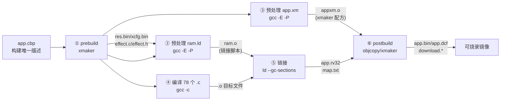
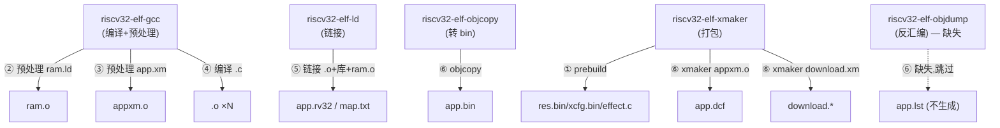
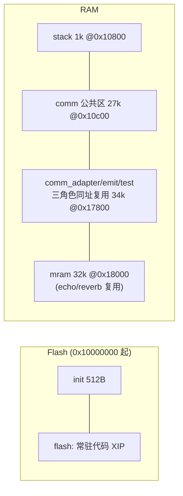
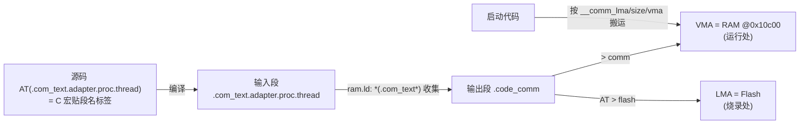
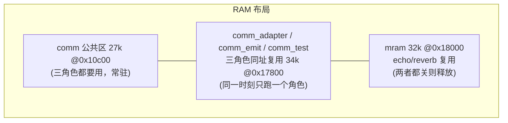
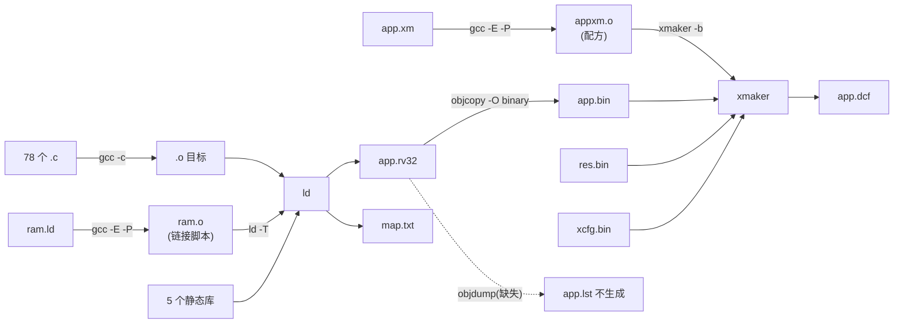

# AB5766 SDK 编译原理详解

> 本文面向第一次接触这份固件的**嵌入式新手**，目标是讲清楚一件事：**从源码到可烧录镜像，中间到底发生了什么、为什么这么设计。**
>
> 阅读本文不需要你预先懂链接脚本，但需要你大致知道"编译→链接→烧录"这条常识。我们会按"构建流程时间线"一步步展开，每一步都告诉你它在做什么、用什么工具、产出什么、新手最容易在哪里犯错。
>
> 配套阅读：本文的姊妹篇 [AB5766 build 脚本原理与使用指南](AB5766_build脚本原理与使用指南.md)（讲命令行 `build.ps1` 怎么用）、[AB5766 map 文件解析指南](../SDK/AB5766_map文件解析指南.md)（讲链接账本怎么读）、[AB5766 LE Mic 新手开发指南](../SDK/AB5766_LE_Mic_新手开发指南.md)（讲代码与配置怎么读）。

---

## 1. 读完这篇你能做到什么

读完本文，你应该能回答下面三个问题：

1. **这份固件的构建分成几步？每一步用什么工具、吃什么输入、吐什么产物？**（第 2 节给全景，第 5–10 节逐步展开）
2. **为什么链接脚本 `ram.ld` 要先用 C 预处理器跑一遍？为什么产物名字叫 `ram.o` 却不是目标文件？**（第 6 节）
3. **源码里到处出现的 `AT(...)` 标注，和链接脚本里 `AT > flash` 里的 `AT`，是同一个东西吗？RAM 又为什么能"一区三用"？**（第 9.3、9.4 节，本文的高潮难点节）

> **证据分级口径**：本文沿用 [map 指南](../SDK/AB5766_map文件解析指南.md) 的 E0–E3 分级——E0 配置（`config_*.h` 宏）、E1 源码（`.c`/`.h`/`.ld`）、E2 map/镜像（`map.txt`/`app.rv32`）、E3 硬件实测（烧录联调）。本文结论默认 **E1**（"代码/脚本是这么写的"）；一旦引到 map.txt 的具体地址、大小，标记为 **E2**（"链接结果是这样"）。本文不会替你把结论升级到"运行时一定如何"——那需要 E3。

---

## 2. 构建全景：7 步流水线一览

很多新手以为"编译 = 点一下构建按钮"，其实这份固件的构建是一条**严格的 7 步流水线**，顺序不能乱，少一步或乱序都会失败或产出错误镜像。

### 2.1 流水线总图



图里有两个"反直觉"的设计，是新手最容易卡住的地方，本文后面会专章讲：

- **链接脚本 `ram.ld` 居然要先过一遍 C 预处理器**（第 6 节）；
- **有个产物叫 `ram.o`，但它根本不是目标文件**（第 6 节）。

### 2.2 7 步对照表

| 步骤 | 名字 | 输入 | 工具 | 产物 | 详见 |
| --- | --- | --- | --- | --- | --- |
| ① | prebuild | `res.xm`/`xcfg.xm`/`effect.c`/`effect.h`（位于 Output/bin） | `riscv32-elf-xmaker` + `copy` | `res.bin`/`xcfg.bin`/`res.h`/`xcfg.h`；`effect.c`/`effect.h` 复制到工程根 | 第 5 节 |
| ② | 预处理链接脚本 | `ram.ld`（含 `#include "config.h"`） | `riscv32-elf-gcc -E -P` | `ram.o`（实为展开宏后的链接脚本文本） | 第 6 节 |
| ③ | 预处理 xmaker 配方 | `app.xm`（含 `#include "config.h"`） | `riscv32-elf-gcc -E -P` | `appxm.o`（实为展开宏后的 xmaker 配方文本） | 第 7 节 |
| ④ | 编译 | 78 个 `.c` 源文件 | `riscv32-elf-gcc -c` | 78 个 `.o`（ELF 目标文件） | 第 8 节 |
| ⑤ | 链接 | 全部 `.o` + `ram.o` + 5 个静态库 | `riscv32-elf-ld` | `app.rv32`（ELF32）+ `map.txt` | 第 9 节 |
| ⑥ | postbuild | `app.rv32` + `appxm.o` + `download.xm` | `objcopy` + `xmaker` | `app.bin`/`app.dcf`/`download.*`（可烧录镜像） | 第 10 节 |

> **为什么是 7 步而不是 3 步？** 因为这份固件有"资源/配置打包"（xmaker）和"链接脚本宏化"两个非常规设计，它们各自需要一次预处理或生成步骤，硬生生插在"编译→链接"之间。新手记住这张表，后面每节都在解释表里某一行。

> 想知道这 7 步在命令行脚本里具体怎么一行行落地的，看姊妹篇 [build 脚本原理与使用指南](AB5766_build脚本原理与使用指南.md) 第 5 节——它和本文一一对应。

---

## 3. 构建唯一描述：app.cbp 是什么

### 3.1 为什么靠一个 .cbp 文件

这份固件**没有 Makefile、没有 CMakeLists.txt、没有 Ninja**。整个构建的唯一描述就是 Code::Blocks 的工程文件 [app.cbp](../../projects/microphone/app.cbp)。这意味着：

- 在 GUI 里，你用 Code::Blocks 打开它点"构建"；
- 在命令行里，`build.ps1` 自己**解析这个 XML 文件**来复现同样的构建（见姊妹篇第 5.2 节）。

所以 `app.cbp` 是新手理解构建的起点：它定义了"用什么编译器、编译哪些文件、加什么选项、链接什么库、构建前后跑什么脚本"。

### 3.2 app.cbp 的关键结构

`app.cbp` 是一个 XML，文件头声明 `FileVersion` 为 `1.6`，工程名 `app`，编译器选 `riscv32-v3`，并且**只有一个 `Debug` 目标**：

```xml
<FileVersion major="1" minor="6" />
<Project>
    <Option title="app" />
    <Option compiler="riscv32-v3" />
    <Build>
        <Target title="Debug">
            <Option output="Output/bin/app.rv32" .../>
            <Option object_output="Output/obj/" />
            <Option type="1" />
            <Option compiler="riscv32-v3" />
        </Target>
    </Build>
    ...
</Project>
```

它的主体可以分成 5 块，对应构建的 5 个方面：

| 块 | 在 app.cbp 里 | 作用 |
| --- | --- | --- |
| Compiler 选项 | `<Compiler>` 下 7 个 `<Add option="..."/>` + 18 个 `<Add directory="..."/>` | 7 个编译选项（`-Os`/`-Wall`/`-march=...` 等）+ 18 个头文件搜索路径 |
| Linker 选项 | `<Linker>` 下 `-T ram.o`/`--gc-sections`/`-Map=...`/`--no-warn-rwx-segments` + 5 个 `<Add library>` | 链接脚本、段清除、map 输出、5 个静态库 |
| 构建前后脚本 | `<ExtraCommands>` 的 `before=prebuild.bat` / `after=postbuild.bat` | 就是流水线的第①步和第⑥步 |
| 源文件清单 | 大量 `<Unit filename="...">` | 告诉工程"这些文件参与构建" |
| 特殊 Unit | 4 个带 `buildCommand` 的 Unit | 链接脚本、xmaker 配方等"非常规"文件 |

### 3.3 Unit 分两类：普通源文件 vs 特殊文件

`<Unit>` 是 app.cbp 里数量最多的元素，新手一定要分清两类：

**第一类：普通 `.c` 源文件（78 个）**——带 `<Option compilerVar="CC" />`，意思是"用 C 编译器编译它"。例如：

```xml
<Unit filename="../../bsp/bsp_charge.c">
    <Option compilerVar="CC" />
</Unit>
```

只有标了 `compilerVar="CC"` 的 Unit 才走"编译→.o"流程。经核对，全工程**正好 78 个**这样的 Unit，**全部是 `.c`**——没有一个 `.h` 带 CC（`.h` 在 cbp 里只是登记给 IDE 索引用的，不带 CC）。

> 提示：78 = 78 个 `.c` 源文件，每个都会编译成一个 `.o`。姊妹篇第 5.2 节会讲脚本如何用"`compilerVar == "CC"`"这一条规则把它们挑出来。

**第二类：不带 `compilerVar="CC"` 的其余 Unit**——它们不参与标准编译流程，分两种：

(a) **带 `compile="1"` + 自定义 `buildCommand` 的特殊构建文件（4 个）**：

| Unit | buildCommand 里的动作 | 真正由谁执行 |
| --- | --- | --- |
| `ram.ld` | `$compiler $options $includes -E -P -x c -c $file -o ram.o` | gcc 预处理 → 链接脚本（第 6 节） |
| `Output/bin/app.xm` | `... -E -P -x c -c $file -o appxm.o` | gcc 预处理 → xmaker 配方（第 7 节） |
| `Output/bin/download.xm` | `buildCommand=" "`（空命令） | 由 postbuild 里的 `xmaker -b download.xm` 执行（第 10 节） |
| `Output/bin/xcfg.xm` | `buildCommand=" "`（空命令） | 由 prebuild 里的 `xmaker -b xcfg.xm` 执行（第 5 节） |

(b) **纯登记文件**：120 个 `.h`（头文件，给 IDE 索引）和 1 个 `profile.gatt`（BLE GATT 配置文件），既不带 CC 也不带 buildCommand，Code::Blocks 和脚本都不"编译"它们。

这 4 个特殊构建文件（`ram.ld` + 3 个 `.xm`）的存在，正是流水线里"预处理 ram.ld / app.xm"和"prebuild / postbuild"这几步的根源。新手看到 app.cbp 里 `buildCommand=" "`（一个空格）会以为写错了——其实不是，它的意思是"这个文件由别的步骤处理，Code::Blocks 自身不直接动它"。

> 这一小节是给姊妹篇第 5.2 节"XML 过滤"埋的伏笔：脚本要复现构建，关键就是"如何用一条规则（`compilerVar == "CC"`）把 78 个普通 `.c` 源文件和其余不带 CC 的文件一刀切开"。

---

## 4. 工具链：RV32 四件套与一个缺失

### 4.1 四件套

这份固件的目标是 AB5766 这颗 RISC-V 芯片，编译/链接/转换用的是厂商提供的 RV32 工具链。整条流水线只用到 4 个可执行文件：

| 工具 | 作用 | 在流水线哪步用 |
| --- | --- | --- |
| `riscv32-elf-gcc` | C 编译器，**兼任 C 预处理器前端**（`-E -P`） | ②③④ 预处理 ram.ld/app.xm、编译 .c |
| `riscv32-elf-ld` | 链接器，把 .o 和库拼成 `app.rv32` | ⑤ 链接 |
| `riscv32-elf-objcopy` | 格式转换，把 ELF 抽成裸二进制 `.bin` | ⑥ postbuild |
| `riscv32-elf-xmaker` | **厂商专有打包器**（不是 binutils 的一部分），按 `.xm` 配方把各产物打包成 `.dcf` 等镜像 | ① prebuild、⑥ postbuild |

新手最容易混淆的是 `xmaker`：它**不属于标准 GNU binutils**，是芯片厂商自己写的工具，专门负责"资源打包"和"生成可烧录镜像"。`xmaker` 读的"配方"就是 `.xm` 文本文件（第 5、7、10 节都会见到）。

### 4.2 一个缺失：没有 objdump

工具链里**没有 `riscv32-elf-objdump`**（postbuild 里会探测它，路径不存在就跳过）。后果是：**不会生成反汇编文件 `app.lst`**。

这点要特别强调，因为新手常把"没有 app.lst"误判为"构建失败"——其实它是非致命的，构建照样成功。详见第 10 节和第 12 节 FAQ。

### 4.3 -march 与 5 个静态库

编译选项里最显眼的是这一长串架构串：

```
-march=rv32imc_zba_zbb_zbc_zbs_zca_zcb_zcmp_xbs1
```

它的意思是：基础 `rv32imc`（32 位整数+乘除+压缩指令）之上，再启用一批 Zb* 位操作扩展、Zc/Zcmp 压缩扩展，以及厂商自定义的 `xbs1` 扩展。新手不需要背每个字母，只要知道"这是告诉编译器这颗芯片支持哪些指令"。

链接阶段会吃 5 个预编译静态库（来自 `libs/`）：

| 库 | 路径 | 提供什么 |
| --- | --- | --- |
| `libplatform.a` | `libs/cpu/` | 平台/底层驱动支持 |
| `libm.a` | `libs/cpu/` | 数学库 |
| `libc.a` | `libs/cpu/` | C 运行时 |
| `libgcc.a` | `libs/cpu/` | gcc 软浮点/辅助函数 |
| `libbtstack.a` | `libs/ble/` | 蓝牙协议栈 |

这些库是**预编译的，源码不可见**。应用层通过 `libs/` 下公开的头文件（如 `api.h`、`api_btstack.h`）调用它们。新手不要试图改库内部，要挂接行为请在 [strong_symbol.c](../../projects/microphone/strong_symbol.c) 里覆盖弱函数（见 [新手开发指南](../SDK/AB5766_LE_Mic_新手开发指南.md) 第 1 节）。

### 4.4 工具与各步的调用关系



---

## 5. prebuild：xmaker 生成资源与 effect.c

### 5.1 为什么 prebuild 必须最先跑

流水线第①步 `prebuild` 必须在"编译"之前完成，原因很直接：**`effect.c` 既是 prebuild 的产物，又是 78 个待编译源文件之一**。

如果 prebuild 没跑，`effect.c` 就不存在，第④步编译到 `effect.c` 时直接报"找不到文件"。所以构建顺序里 prebuild 永远在最前。

### 5.2 读 prebuild.bat

[prebuild.bat](../../projects/microphone/Output/bin/prebuild.bat) 只有十几行：

```bat
@echo off
cd /d %~dp0
@echo on
riscv32-elf-xmaker -b res.xm || goto err
riscv32-elf-xmaker -b xcfg.xm || goto err
copy effect.c ..\..\effect.c || goto err
copy effect.h ..\..\effect.h || goto err
exit /b 0
:err
@echo off
if "%1"=="" pause
exit /b 1
```

逐行解读：

1. `cd /d %~dp0`：切到脚本自身所在目录（`Output/bin`），使后面的相对路径基准固定。
2. `xmaker -b res.xm`：按 `res.xm` 配方生成资源相关产物（`res.bin`、`res.h` 等）。
3. `xmaker -b xcfg.xm`：按 `xcfg.xm` 配方生成运行时配置产物（`xcfg.bin`、`xcfg.h`）。`res.h`/`xcfg.h` 是由 `.xm` 内部的 `xcopy` 指令复制到位的，不在 prebuild.bat 显式出现。
4. `copy effect.c ..\..\effect.c`：把 `Output/bin/effect.c`（xmaker 生成）复制到工程根 `projects/microphone/effect.c`，让它能被第④步编译。
5. `if "%1"=="" pause`：**只有没传参数时**才 `pause` 挂起等人按键；传了参数（构建时传 `app`）就不挂起，直接返回错误码。这正是命令行脚本调用时传 `app` 的原因（见姊妹篇第 5.1 节）。

### 5.3 输入→工具→产物→落位

| 输入（位于 Output/bin） | 工具 | 产物 | 最终落位 |
| --- | --- | --- | --- |
| `res.xm` | `xmaker -b res.xm` | `res.bin`、`res.h` | `Output/bin/`（res.h 同时被复制供引用） |
| `xcfg.xm` | `xmaker -b xcfg.xm` | `xcfg.bin`、`xcfg.h` | `Output/bin/` 及工程根 `xcfg.h` |
| （xmaker 内部生成）`effect.c`/`effect.h` | `copy` | 同名文件 | 工程根 `projects/microphone/effect.c`/`effect.h` |

> **重要提醒**：`effect.c`、`effect.h`、`res.h`、`xcfg.h` 都是**生成文件**，不要手工修改。要改音效/资源/运行时配置，应改对应的源（`effect` 相关源、`res.xm`、`xcfg.xm`），再走既有生成流程。这呼应了 [新手开发指南](../SDK/AB5766_LE_Mic_新手开发指南.md) 第 4 节的"三层配置模型"：prebuild 产出的 `xcfg.bin`/`xcfg.h` 属于"运行时配置"那一层，和编译期 `config_*.h` 是两回事。

---

## 6. 预处理链接脚本：ram.ld → ram.o  `[难点节]`

这是新手最容易被绊倒的一步。请耐心读完。

### 6.1 为什么要用 C 预处理器跑链接脚本

正常情况下，链接脚本（`.ld`）是直接喂给链接器 `ld` 的纯文本。但本工程的链接脚本 [ram.ld](../../projects/microphone/ram.ld) 第 1 行是：

```c
#include "config.h"
```

它**用了 C 预处理语法**！为什么？因为作者希望**链接脚本能共享 `config.h` 里的宏**，这样改一个配置宏，内存布局就自动跟着变，不用再去手改链接脚本里的地址和大小。

看 ram.ld 里的这几行（节选）：

```c
#include "config.h"          // 第 1 行
__max_flash_size = FLASH_CODE_SIZE;   // 第 6 行，FLASH_CODE_SIZE 来自 config
__comm_ram_vma  = 0x10c00;            // 第 15 行
#if WIRELESS_CON_CODEC_SEL == CODEC_ESBC
__comm_ram_size = 30k;                // 第 17 行
#else
__comm_ram_size = 27k;                // 第 19 行
#endif
```

`FLASH_CODE_SIZE`、`WIRELESS_CON_CODEC_SEL`、`CODEC_ESBC` 这些都是 `config.h`（最终展开到 [config_ab5766_le_mic.h](../../projects/microphone/config_ab5766_le_mic.h)）里的宏。链接脚本里能直接 `#if` 判断它们——这就是"宏化链接脚本"的好处：**改配置 → 重新预处理 ram.ld → 内存布局自动重算**。

> 当前配置 `WIRELESS_CON_CODEC_SEL == CODEC_LC3S`（见 config_ab5766_le_mic.h 第 66 行），**不是** `CODEC_ESBC`，所以走 `#else` 分支，`__comm_ram_size = 27k`。这个值会一路影响第 9 节的 RAM 三角色布局，记住它。

### 6.2 预处理命令逐参数

app.cbp 里 ram.ld 的 buildCommand 是：

```
$compiler $options $includes -E -P -x c -c $file -o $(TARGET_OBJECT_DIR)ram.o
```

展开后大致是：

```
riscv32-elf-gcc <CFLAGS> <INCLUDES> -E -P -x c -c ram.ld -o Output/obj/ram.o
```

逐参数解释：

| 参数 | 含义 |
| --- | --- |
| `<CFLAGS> <INCLUDES>` | 复用编译选项和 18 个头文件路径，保证预处理 ram.ld 时能找到 `config.h` 链 |
| `-E` | **只做预处理**，不编译、不汇编、不链接 |
| `-P` | 预处理时**去掉行号标注**（`# line` 之类的标记），输出更干净 |
| `-x c` | 强制把输入文件按 **C 语言**对待（因为 `.ld` 不是 gcc 默认认识的扩展名） |
| `-c` | 配合 `-E`，表示只到预处理这一步 |
| `-o Output/obj/ram.o` | 输出文件名叫 `ram.o` |

### 6.3 名字陷阱：ram.o 不是目标文件 `[核心难点]`

注意 `-o ...ram.o`：**产物名字叫 `ram.o`，但它根本不是 ELF 目标文件！** 它的本质是"展开过宏、去掉了 `#if`/`#include` 之后的**链接脚本文本**"。

> **类比**：就像把一份"带批注和条件分支的剧本草稿"交给编辑，编辑把所有批注展开、把不需要的分支删掉，最后给你一份"干净的正式剧本"。这份正式剧本文件名恰好叫 `ram.o`，但它内容是剧本，不是演员。

证据：这个 `ram.o` 随后被链接器当 `-T`（链接脚本）输入用（见第 9.1 节 app.cbp 的 `-T$(TARGET_OBJECT_DIR)ram.o`），而不是当普通目标文件参与链接。它名字里的 `.o` 只是 Code::Blocks 的"产物命名习惯"（让它落在 `Output/obj/` 下），和"目标文件"的 `.o` 是**两码事**。

> 这是本文第一个高频误区，第 12 节 FAQ 会再强调一遍：**"ram.o 是不是目标文件？"——不是。**

### 6.4 产物表条目

| 产物 | 真实身份 | 后续用途 |
| --- | --- | --- |
| `Output/obj/ram.o` | 预处理后的**链接脚本文本**（不是 ELF） | 第⑤步链接时作为 `-T ram.o` 的脚本输入 |

预处理完后，ram.ld 里那些 `#include`、`#if`、`FLASH_CODE_SIZE` 全都没了，只剩纯链接脚本语法（`MEMORY`/`SECTIONS` 等）。链接器拿这份干净脚本去布局。想看链接后每个段最终落在哪、多大，去读 [map 指南](../SDK/AB5766_map文件解析指南.md)（E2）。

---

## 7. 预处理 app.xm → appxm.o

### 7.1 和 ram.ld 同形但用途不同

流水线第③步预处理 [app.xm](../../projects/microphone/Output/bin/app.xm)，命令和 ram.ld 几乎一模一样（`-E -P -x c -c`），因为 app.xm 第 1 行也是 `#include "config.h"`，同样需要宏展开。

但产物 `appxm.o` 的用途和 `ram.o` **完全不同**：

- `ram.o` → 喂给**链接器** `ld`，当链接脚本用；
- `appxm.o` → 喂给**打包器** `xmaker`，当打包配方用（第⑥步 postbuild 里 `xmaker -b appxm.o`，最终生成 `app.dcf`）。

### 7.2 读 app.xm

app.xm 只有十几行：

```c
#include "config.h"
depend(0x01010200);
setflash(1, FLASH_SIZE, FLASH_ERASE_4K, FLASH_DUAL_READ, FLASH_QUAD_READ);
setspace(FLASH_RESERVE_SIZE);
#if (AB_FOT_EN)
setunpack(unpack.bin);
setpkgarea(FOT_PACK_START, FOT_PACK_SIZE);
#endif
#if DONGLE_AUTH_EN
setauth(0xDDE05A0D, dongle_soft_key);
#endif
make(dcf_buf, header.bin, app.bin, res.bin, xcfg.bin, updater.bin);
save(dcf_buf, app.dcf);
```

这是 `xmaker` 的"配方语言"：`depend` 设依赖版本、`setflash` 描述 flash 参数、`setspace` 预留空间、`make(...)` 把 `header.bin`/`app.bin`/`res.bin`/`xcfg.bin`/`updater.bin` 拼成一个 `dcf_buf`，最后 `save` 成 `app.dcf`。这里同样用 `#if` 按 `AB_FOT_EN`/`DONGLE_AUTH_EN` 决定是否加 FOTA/加密——又是一个"宏化配置文件"的例子。

### 7.3 app.xm / download.xm / xcfg.xm 在 cbp 里是"空命令"Unit

回忆第 3.3 节，`app.xm`/`download.xm`/`xcfg.xm` 这三个文件在 app.cbp 里都是 `compile="1"` 但 `buildCommand=" "`（空格）的特殊 Unit。意思是：**Code::Blocks 自己不直接执行它们**，它们由别的步骤驱动：

- `app.xm` → 第③步预处理成 `appxm.o`，再由第⑥步 `xmaker -b appxm.o` 执行；
- `xcfg.xm` → 第①步 prebuild 里 `xmaker -b xcfg.xm` 执行；
- `download.xm` → 第⑥步 postbuild 里 `xmaker -b download.xm` 执行（它内容只有一行 `download`，用于生成出厂下载包）。

新手不要被"空 buildCommand"吓到，它只是"占位登记 + 交给别的步骤"的意思。

---

## 8. 编译：78 个 .c → .o

### 8.1 编译选项（CFLAGS）

来自 app.cbp `<Compiler>` 段的 7 个选项：

| 选项 | 作用 | 新手要点 |
| --- | --- | --- |
| `-Os` | 优化代码体积 | 嵌入式常用，优先小 |
| `-Wall` | 打开常用警告 | 帮你发现问题 |
| `-march=rv32imc_zba_zbb_zbc_zbs_zca_zcb_zcmp_xbs1` | 目指令集架构 | 见第 4.3 节 |
| `-Wno-array-bounds` | 关掉数组越界误报 | 厂商代码触发的已知误报 |
| `-Wno-address-of-packed-member` | 关掉 packed 成员取址警告 | 嵌入式协议栈常用 packed 结构 |
| `-ffunction-sections` | **每个函数单独放一个段** | 见 8.2，本节重点 |
| `-mjump-tables-in-text` | 跳转表放进 text 段 | 与放置策略相关 |

### 8.2 重点：-ffunction-sections 配合 --gc-sections  `[难点]`

新手常以为"加进工程的源文件，里面的函数都会进镜像"。**不对。** 这里有一对配合：

- 编译期 `-ffunction-sections`：把**每个函数**各自放进一个独立的输入段（名为 `.text.<函数名>`）。

  > **类比**：把每个函数各放进一个带名牌的小抽屉，而不是全部倒进一个大筐。

- 链接期 `--gc-sections`（见第 9.1 节）：链接器从入口（`_start`）开始，**只保留被引用到的函数段**，没被任何代码引用的段直接丢掉。

  > **类比续**：搬家时只搬"被点名要"的抽屉，没人要的抽屉留在原地丢弃。

合起来的效果：**"源文件在工程里" ≠ "里面的函数真进了镜像"**。一个 `.c` 里可能有大半个文件因为没被调用而被 `--gc-sections` 清掉。这就是为什么看"某个算法有没有进固件"不能只看源码，要看 [map.txt](../../projects/microphone/Output/bin/map.txt)（E2）——map 里才列出真正被保留的段。详见 [map 指南第 11 节](../SDK/AB5766_map文件解析指南.md)（gc-sections 保留结果）。

### 8.3 18 个头文件路径

app.cbp `<Compiler>` 里还有 18 个 `<Add directory>`，即 `-I` 头文件搜索路径。分组看更清楚：

| 组别 | 路径（相对 projects/microphone） |
| --- | --- |
| 工程自身 | `.`、`production_test`、`production_test/iodm`、`production_test/tbox` |
| header | `../../header` |
| libs | `../../libs`、`../../libs/ble`、`../../libs/cpu`、`../../libs/usb` |
| driver | `../../driver` |
| functions | `../../functions` |
| bsp | `../../bsp` |
| modules | `../../modules`、`../../modules/fota`、`../../modules/utils`、`../../modules/ble`、`../../modules/audio/dec`、`../../modules/wireless` |

这些路径和 [c_cpp_properties.json](../../.vscode/c_cpp_properties.json) 里的 18 个 `includePath` 一一对应（姊妹篇第 7 节会讲）。

### 8.4 产物：.o 是真目标文件

第④步的产物是 78 个 `.o`（确切说是其中 `.c` 对应的那些），它们是**真正的 ELF 目标文件**（和第6节那个"假的" ram.o 不同）。每个 `.o` 里带着 `.text`/`.rodata`/`.data`/`.bss` 等输入段，等待第⑤步链接。

> 这一步在命令行脚本里怎么逐个编译、`.o` 路径怎么算出来，看姊妹篇第 5.3 节（.o 路径映射算法，本文最大的工程化细节之一）。

---

## 9. 链接与段布局：ld → app.rv32（ram.ld 深讲）

这是本文的高潮。第⑤步链接是"把所有 `.o` + 库 + 链接脚本 `ram.o` 喂给 `ld`，产出 `app.rv32` 和 `map.txt`"，而**真正的难点全在 ram.ld 这个链接脚本里**。本节分 6 个小节。

### 9.1 链接命令与产物

app.cbp 的 `<Linker>` 段定义了链接参数：

```xml
<Linker>
    <Add option="-T$(TARGET_OBJECT_DIR)ram.o" />
    <Add option="--gc-sections" />
    <Add option="-Map=Output\bin\map.txt" />
    <Add option="--no-warn-rwx-segments" />
    <Add library="../../libs/cpu/libplatform.a" />
    ... (共 5 个库)
</Linker>
```

逐参数：

| 参数 | 含义 |
| --- | --- |
| `-T Output/obj/ram.o` | 指定链接脚本（就是第②步预处理出来的那个"假 .o"，实为脚本） |
| `--gc-sections` | 段级垃圾回收，见第 8.2 节 |
| `-Map=Output/bin/map.txt` | 输出 map 账本（E2，约 5600 行，随构建浮动） |
| `--no-warn-rwx-segments` | 关掉"可读写可执行段"的警告（本工程有故意 RWX 的段） |
| 5 个 `<Add library>` | 5 个静态库，见第 4.3 节 |

产物：

- **`app.rv32`**：ELF32 格式的链接结果，含段地址、符号、调试信息等。本机构建约 192 KB（随配置变）。
- **`map.txt`**：链接账本，记录每个输出段/输入段/符号的地址与大小，约 5600 行。读懂它见 [map 指南](../SDK/AB5766_map文件解析指南.md)。

### 9.2 MEMORY 块：8 个内存区

ram.ld 的 `MEMORY` 块（第 38–51 行）把芯片可寻址空间切成 8 个区：

```c
MEMORY
{
    init            : org = __base,             len = 512
    flash(rx)       : org = __base + 512,       len = __max_flash_size
    comm(rx)        : org = __comm_ram_vma,     len = __comm_ram_size

    comm_adapter    : org = __adapter_ram_vma,  len = __adapter_ram_size
    comm_emit       : org = __emit_ram_vma,     len = __emit_ram_size
    comm_test       : org = __test_ram_vma,     len = __test_ram_size

    stack           : org = __stack_vma,        len = __stack_ram_size
    mram            : org = __mram_vma,         len = __mram_ram_size
}
```

每区说明（`__base = 0x10000000`）：

| 区名 | Origin | Length | 属性 | 用途 |
| --- | --- | --- | --- | --- |
| `init` | `0x10000000` | 512 | — | 复位入口 `.reset` |
| `flash` | `0x10000200` | `FLASH_CODE_SIZE` | rx | 常驻 Flash 代码（XIP） |
| `comm` | `0x10c00` | 27k（当前 LC3S） | rx | 公共 RAM 区，三角色都要用的代码 |
| `comm_adapter` | `0x17800` | 34k(0x8800) | — | 适配器角色代码/数据区 |
| `comm_emit` | `0x17800` | 34k(0x8800) | — | 发射端角色代码/数据区 |
| `comm_test` | `0x17800` | 34k(0x8800) | — | 测试角色代码/数据区 |
| `stack` | `0x10800` | 1k | — | IRQ 栈 |
| `mram` | `0x18000` | 32k | — | 复用给 echo/reverb 的算法 buf 区 |

> 注意 `comm_adapter`/`comm_emit`/`comm_test` 三行的 Origin 和 Length **完全相同**——这不是笔误，这是本文第二个核心难点"RAM 三角色复用"，第 9.4 节专讲。

地址布局示意：



### 9.3 AT 的两层语义  `[核心难点节]`

这是新手最容易混淆的点：**源码里的 `AT(...)` 和链接脚本里的 `AT > flash`，名字都叫 AT，却是两个完全不同的东西。**

#### (A) 链接脚本里的 `AT > flash`：段级 LMA ≠ VMA

看 ram.ld 第 59–95 行的 `.code_comm` 段（节选）：

```c
.code_comm : {
    *(.vector)
    *(.com_text*)
    ...
} > comm AT > flash
```

这里有两个放置约束：

- `> comm`：这段的 **VMA**（虚拟/运行地址）在 `comm` 区，也就是 RAM 里 `0x10c00` 起——**代码运行时在这里执行**。
- `AT > flash`：这段的 **LMA**（装载地址）在 `flash` 区——**代码烧录时存在 Flash 里**。

> **类比**：剧本原件存放在档案室（Flash=LMA），演出时演员手里拿的是从档案室复印出来带到舞台（RAM=VMA）的副本。开机时，启动代码负责把剧本从档案室"复印"到舞台，然后 CPU 才能在舞台上演。

ram.ld 末尾（第 459 行）有统计符号记录这个 LMA：

```c
__comm_lma = LOADADDR(.code_comm);   // .code_comm 的装载地址（Flash 里）
```

`LOADADDR()` 是链接脚本函数，取段的 LMA。启动代码靠 `__comm_lma`（从哪拷）、`__comm_size`（拷多大）、`__comm_vma`（拷到哪）这三个符号，把 `.code_comm` 从 Flash 搬到 RAM。同理 `.code_adapter`/`.code_emit`/`.code_code_test` 各自都有 `AT > flash` 和对应的 `__xxx_lma`/`__xxx_size`（见第 9.6 节）。

#### (B) 源码里的 `AT(x)` 宏：符号级自定义段名

现在看源码里满地都是的 `AT(...)`。它定义在 [header/macro.h](../../header/macro.h) 第 8–9 行：

```c
#define STR(x) #x
#define AT(x)  __attribute__((section(STR(x))))
```

这是一个 **C 宏**：`AT(.com_text.ble.isr.con)` 会展开成 `__attribute__((section(".com_text.ble.isr.con")))`，作用是**把被标注的函数/变量放进名为 `.com_text.ble.isr.con` 的自定义输入段**。

真实例子（已核对）：

- [strong_ble.c](../../projects/microphone/strong_ble.c) 第 61 行起多处 `AT(.com_text.ble.isr.con)`——把蓝牙 ISR 相关函数放进 `.com_text.ble.isr.con` 段；
- [os/thread_dec.c](../../os/thread_dec.c) 第 4 行 `AT(.com_text.adapter.proc.thread)`——把适配器线程函数放进 `.com_text.adapter.proc.thread` 段。

这些自定义段随后被 ram.ld 里 `*(.com_text*)` 这样的通配符**收集**进 `.code_comm` 输出段（见 ram.ld 第 61 行 `*(.com_text*)`）。也就是说：源码用 `AT(x)` 宏"给函数贴段名标签"，链接脚本用 `*(.xxx*)` "按标签把函数收进对应输出段"。

#### (C) 对比表：同名 AT，两个世界

| | 链接脚本里的 `AT > flash` | C 宏 `AT(x)` |
| --- | --- | --- |
| 出现位置 | ram.ld 段定义里 | `.c` 源码函数/变量标注 |
| 是什么 | 链接脚本**语法关键字**（`AT` 指定 LMA） | C 宏（`__attribute__((section(...)))` 的语法糖） |
| 作用对象 | **输出段**（整段代码） | **单个符号**（函数/变量） |
| 解决的问题 | "这段代码运行在 RAM、烧录在 Flash" | "把这个函数放进指定名字的段" |
| 两者关系 | 链接脚本的 `*(.text.xxx*)` 负责**收集** C 宏 `AT(x)` 产生的自定义段 | C 宏 `AT(x)` 负责**产生**那些自定义段 |

> 一句话总结：**源码 `AT(x)` 是"贴标签"，链接脚本 `AT > flash` 是"定搬法"**。它们字面撞名纯属英文缩写重名，语义毫无关系。新手千万别看到源码 `AT(.com_text...)` 就以为它在"搬 Flash"。

一条链看清楚两层 AT 如何配合：



### 9.4 RAM 三角色复用  `[核心难点节]`

第 9.2 节看到 `comm_adapter`/`comm_emit`/`comm_test` 三个区 Origin 和 Length 完全一样。看 ram.ld 第 22–29 行怎么算出来的：

```c
__adapter_ram_vma   = __comm_ram_vma + __comm_ram_size;   // 0x10c00 + 27k = 0x17800
__adapter_ram_size  = (61k - __comm_ram_size);            // 61k - 27k = 34k = 0x8800

__emit_ram_vma      = __adapter_ram_vma;                 // = 0x17800
__emit_ram_size     = __adapter_ram_size;                 // = 34k

__test_ram_vma      = __adapter_ram_vma;                  // = 0x17800
__test_ram_size     = __adapter_ram_size;                 // = 34k
```

三角色的 VMA 和 size 都直接等于 adapter 的值。**这意味着：adapter、emit、test 三种角色共用同一段物理 RAM**（`0x17800` 起，长 `0x8800`=34k）。当前 `__comm_ram_size=27k`，所以三角色区都是 `0x17800` / `0x8800`。

> **类比**：一间会议室，上午销售部用、下午市场部用、晚上测试部用。同一个物理空间，三个部门各有一套"桌椅布局"（各自的代码/数据），但**同一时刻只有一个部门在用**，不会撞车。

**关键结论（新手高频误区）**：因为三角色复用同一段 RAM，**绝对不能把三个 `0x8800` 加起来算 RAM 占用**。三角色代码同时刻只跑一个，它们在 RAM 里是"叠"在一起的，物理上只占一份 34k。

> 为什么能这么干？因为运行时角色是**唯一**的：固件启动后根据运行时配置要么是适配器、要么是发射端、要么是测试模式，不会同时是两个。所以三套代码可以共用同一块 RAM，谁在岗谁用自己的那一套。

RAM 布局示意（条状图）：



各角色的代码段和数据段分别怎么放（节选 ram.ld）：

| 段 | 放哪个区 | VMA | LMA | 备注 |
| --- | --- | --- | --- | --- |
| `.code_comm` | comm | 0x10c00 | flash | 公共代码，三角色共用 |
| `.code_adapter` | comm_adapter | 0x17800 | flash | 适配器代码，`AT > flash` |
| `.data_adapter` (NOLOAD) | comm_adapter | 0x17800 | — | 适配器 buf，不占 Flash |
| `.code_emit` | comm_emit | 0x17800 | flash | 发射端代码，`AT > flash` |
| `.data_emit` (NOLOAD) | comm_emit | 0x17800 | — | 发射端 buf |
| `.code_test` | comm_test | 0x17800 | flash | 测试代码 |
| `.data_test` (NOLOAD) | comm_test | 0x17800 | — | 测试 buf |

可以看到三角色的 `.code_*` 都是 `AT > flash`（烧在 Flash，开机搬到 `0x17800`），`.data_*` 都是 `NOLOAD`（见 9.5）。它们地址相同，靠"运行时只激活一个角色"保证不冲突。

另外 `mram` 区（`0x18000`，32k）是给 echo/reverb 算法复用的——当 `WIRELESS_MIC_ECHO_EN` 或 `WIRELESS_MIC_ROOM_REVERB_EN` 打开，这段 RAM 存算法 buf；两个都关则释放（见 ram.ld 第 30–36 行注释）。它和三角色区在地址上还有重叠区间（`0x18000` 落在 `0x17800+0x8800=0x20000` 之内），靠功能互斥使用。

### 9.5 NOLOAD 段与 .flash XIP

#### NOLOAD 段

ram.ld 里有一批标了 `(NOLOAD)` 的段：

| NOLOAD 段 | 所在区 | 内容 |
| --- | --- | --- |
| `.data_adapter` | comm_adapter | 适配器运行时 buf（usb/sbc_dec/plc/lc3_dec 等） |
| `.data_emit` | comm_emit | 发射端运行时 buf（sbc_enc/lc3_enc/echo/reverb 等） |
| `.data_test` | comm_test | 测试 buf |
| `.stack` | stack | IRQ 栈，固定 `0x400`(1k) |
| `.data_comm` | comm | 公共 bss/heap/蓝牙缓存等 |

`(NOLOAD)` 的含义：**这段不生成 Flash 镜像内容，只在 RAM 里占空间**。它本质是 bss/缓冲，开机时清零或由代码初始化即可，不需要从 Flash 搬运。所以这些段**不占 Flash 容量**，只占 RAM 容量。

> 结合第 9.3 节理解：`.code_adapter` 是 `AT > flash`（要搬，占 Flash），而 `.data_adapter` 是 `NOLOAD`（不搬，只占 RAM）。一个角色的"代码"在 Flash 里存着、"运行"在 RAM 里；"数据缓冲"只在 RAM 里。

#### .flash 段：常驻 Flash 的 XIP 代码

`.flash` 段（ram.ld 第 369–413 行）放的是**常驻 Flash、直接在 Flash 里执行（XIP）的代码**，不需要搬到 RAM：

- `*(.text.ws_mic_com*)`：无线麦克风公共低功耗相关；
- `*(.com_sleep*)`：睡眠/唤醒；
- `*(.charge_text*)` / `*(.text.bsp.charge)` / `*(.text.bsp.tkey)`：充电/触摸按键；
- `*(.text.pwroff*)`：关机；
- `*(.text.update*)` / `*(.text.fot.cache*)`：升级/FOTA；
- 末尾兜底 `*(.text*)`、`*(.rodata*)` 等：未被前面段收集的"普通"代码/只读数据。

`.flash` 段末尾有两个值得注意的操作（第 410–411 行）：

```c
LONG(0)
. = ALIGN(512);
```

`LONG(0)` 写一个 4 字节的 0（常作结束标记/哨兵），`ALIGN(512)` 把段对齐到 512 边界（便于 flash 分页/擦除对齐）。

> 这段代码为什么留在 Flash XIP？因为关机/睡眠/充电/升级这些路径必须在 RAM 代码不可用时也能跑（比如刚唤醒 RAM 还没搬好），所以它们常驻 Flash。这是嵌入式低功耗固件的常见手法。

### 9.6 统计符号：启动搬运的依据

ram.ld 末尾（第 452–475 行）算了一批统计符号，它们是**启动代码搬运各段、检查容量的依据**：

```c
__bank_size = SIZEOF(.flash);
__sys_size = __stack_ram_size;
__bss_size = __bss_end - __bss_start;
__heap_size = __heap_end - __heap_start;
__comm_vma = __comm_ram_vma;
__comm_lma = LOADADDR(.code_comm);
__comm_size = SIZEOF(.code_comm);
...
__comm_adapter_vma = __adapter_ram_vma;
__comm_apapter_lma = LOADADDR(.code_adapter);     // 注意源文件里 adapter 拼成 apapter，保持原样
__comm_apapter_size = SIZEOF(.code_adapter);
__comm_emit_vma = __emit_ram_vma;
__comm_emit_lma = LOADADDR(.code_emit);
__comm_emit_size = SIZEOF(.code_emit);
__comm_test_vma = __test_ram_vma;
__comm_test_lma = LOADADDR(.code_test);
__comm_test_size = SIZEOF(.code_test);
```

每个符号 = 一个表达式 = 一个用途：

| 符号 | 表达式 | 用途 |
| --- | --- | --- |
| `__comm_lma` | `LOADADDR(.code_comm)` | 公共代码在 Flash 的起始地址（从哪搬） |
| `__comm_vma` | `__comm_ram_vma` | 公共代码搬到 RAM 的目标地址（搬到哪） |
| `__comm_size` | `SIZEOF(.code_comm)` | 公共代码大小（搬多少） |
| `__comm_*_lma` / `__comm_*_vma` / `__comm_*_size` | 对应 adapter/emit/test | 同上，按角色搬各角色的代码 |
| `__bss_size` / `__heap_size` | 区间差 | bss/堆大小，供清零和堆管理 |
| `__total_size` | sys+bss+comm+bram | 公共区总占用，便于容量核对 |

> 启动代码的工作模式就是：**按角色**，从 Flash 的 `__xxx_lma` 拷 `__xxx_size` 字节到 RAM 的 `__xxx_vma`。比如当前是发射端角色，就搬 `.code_comm`（必搬）+ `.code_emit`，不搬 `.code_adapter`。这就是"三角色复用 RAM"能在运行时落地的机制——谁在岗搬谁的代码。

这些符号的最终数值都能在 [map.txt](../../projects/microphone/Output/bin/map.txt) 末尾查到（E2）。详见 [map 指南](../SDK/AB5766_map文件解析指南.md)。

---

## 10. postbuild：objcopy/xmaker 生成烧录镜像

### 10.1 读 postbuild.bat

[postbuild.bat](../../projects/microphone/Output/bin/postbuild.bat) 做的事比 prebuild 多：

```bat
@echo off
cd /d %~dp0
set proj_name=app
cd ..\..\
for %%a in ("%cd%") do (
echo 1 > "%cd%\Output\obj\projects\%%~nxa\ram.o"
echo 1 > "%cd%\Output\obj\projects\%%~nxa\Output\bin\app.o"
echo 1 > "%cd%\Output\obj\projects\%%~nxa\Output\bin\download.o"
echo 1 > "%cd%\Output\obj\projects\%%~nxa\Output\bin\res.o"
echo 1 > "%cd%\Output\obj\projects\%%~nxa\Output\bin\xcfg.o"
)
cd Output\bin\
@echo on
riscv32-elf-objcopy -O binary %proj_name%.rv32 %proj_name%.bin || goto err
riscv32-elf-xmaker -b appxm.o || goto err
if exist C:\upload\upload.bat (call C:\upload\upload.bat -D AB5766 %proj_name%.dcf)
if exist "C:\Program Files (x86)\RV32-Toolchain\RV32-V3\bin\riscv32-elf-objdump.exe" (riscv32-elf-objdump -h -d -t %proj_name%.rv32 > %proj_name%.lst || goto err)
riscv32-elf-xmaker -b download.xm || goto err
```

它分成三件事：

1. **写占位 .o**（开头的 `for` 循环 + `echo 1 > ...`）——见 10.2，新手最容易误解的部分。
2. **生成烧录镜像**：
   - `objcopy -O binary app.rv32 app.bin`：把 ELF `app.rv32` 抽成裸二进制 `app.bin`（约 108 KB，只含可烧录内容，不含 ELF 头/调试信息）。
   - `xmaker -b appxm.o`：按第③步预处理出的配方 `appxm.o`，把 `app.bin`/`res.bin`/`xcfg.bin`/`header.bin`/`updater.bin` 拼成 `app.dcf`（约 174 KB，厂商镜像，首 4 字节 ASCII `DCF\0`）。
   - `xmaker -b download.xm`：按 `download.xm`（内容仅一行 `download`）生成出厂下载包 `download.*`。
3. **两个条件动作**：
   - `if exist C:\upload\upload.bat`：若本机有上传工具，则 `call upload.bat -D AB5766 app.dcf` 尝试上传。**仓库不提供下载器型号/接线/参数**，烧录边界见 [新手开发指南 3.2 节](../SDK/AB5766_LE_Mic_新手开发指南.md)。
   - `if exist "...\riscv32-elf-objdump.exe"`：若工具链里有 objdump，则生成反汇编 `app.lst`。**本工具链缺 objdump，此条件为假，`app.lst` 不生成**（非致命，见第 12 节 FAQ）。

### 10.2 澄清占位 .o：那不是目标文件  `[难点]`

postbuild 一开头向 `Output\obj\projects\microphone\` 下写了 5 个文件：`ram.o`/`app.o`/`download.o`/`res.o`/`xcfg.o`，内容只有字符 `1`（`echo 1 > ...`）。

这些是 **Code::Blocks 依赖检查用的占位文件，不是 ELF 目标文件！** 它们存在的意义是让 Code::Blocks 的依赖追踪认为"这些特殊文件已经'构建'过了"，避免 GUI 反复重跑对应步骤。

| | 占位 .o（postbuild 写的） | 真 .o（编译产生的） |
| --- | --- | --- |
| 内容 | 字符 `1`（1 字节文本） | ELF 目标文件（含段/符号/重定位） |
| 谁生成 | postbuild.bat 的 `echo 1 >` | `gcc -c` |
| 用途 | 骗过 Code::Blocks 依赖检查 | 真参与链接 |
| 能否链接 | 不能（不是 ELF） | 能 |

> 别被名字骗了：`Output\obj\projects\microphone\ram.o`（占位）和 `Output\obj\ram.o`（第②步预处理出的链接脚本）是**两个不同路径下的不同文件**，前者是占位，后者是真链接脚本。第 12 节 FAQ 会再点这个坑。

### 10.3 DCF 是什么

`app.dcf` 是最终给烧录工具用的厂商镜像。它的结构由 `app.xm` 的 `make(dcf_buf, header.bin, app.bin, res.bin, xcfg.bin, updater.bin)` 决定——把头、程序、资源、运行时配置、升级器拼到一起。经核对，本机 `app.dcf` 首字节是 ASCII `DCF\0`（十六进制 `44 43 46 00`），是一个带魔术字的容器格式。

> **澄清一个常见误读**：有人以为 `app.dcf` 里有"CODE SIZE 120KB"这样的 ASCII 字段。**没有。** "CODE SIZE xxx" 是构建日志里打印的一行报告，不是 DCF 文件内部的字段。经核对本机 `app.dcf` 内**不含** ASCII `CODE SIZE` 字样。新手别去 DCF 里搜这个字符串。

---

## 11. 产物清单：格式与用途

### 11.1 产物大表

| 产物 | 生成阶段 | 格式/真实身份 | 用途 | 本机是否生成 | 证据等级 |
| --- | --- | --- | --- | --- | --- |
| `Output/obj/ram.o` | ② 预处理 | **链接脚本文本**（非 ELF） | 链接器 `-T` 输入 | 是 | E1 |
| `Output/obj/**/*.o` | ④ 编译 | ELF 目标文件 | 喂链接 | 是 | E1 |
| `Output/bin/appxm.o` | ③ 预处理 | **xmaker 配方文本**（非 ELF） | postbuild `xmaker -b` 输入 | 是 | E1 |
| `Output/bin/app.rv32` | ⑤ 链接 | ELF32 | 链接结果，含全部门道 | 是（约 192KB） | E2 |
| `Output/bin/map.txt` | ⑤ 链接 | 文本账本 | 查段地址/大小/容量 | 是（约 5600 行） | E2 |
| `Output/bin/app.bin` | ⑥ postbuild | 裸二进制 | 烧录原始镜像 | 是（约 108KB） | E2 |
| `Output/bin/app.dcf` | ⑥ postbuild | 厂商镜像（`DCF\0` 头） | 烧录工具输入 | 是（约 174KB） | E2 |
| `Output/bin/download.*` | ⑥ postbuild | 出厂下载包 | 出厂烧录 | 是 | E2 |
| `Output/bin/app.lst` | ⑥ postbuild | 反汇编 | 调试/核对 | **否**（缺 objdump） | — |
| `Output/bin/res.bin`/`xcfg.bin`/`res.h`/`xcfg.h` | ① prebuild | 资源/运行时配置 | 被后续打包 | 是 | E1 |
| `effect.c`/`effect.h` | ① prebuild | 生成源 | 参与编译 | 是 | E1 |
| 占位 `Output/obj/projects/microphone/*.o` | ⑥ postbuild | 1 字节文本占位 | Code::Blocks 依赖检查 | 是 | E1 |

> 表里 `app.rv32`/`map.txt` 等是 E2（链接结果），但要确认"烧上去真能跑"必须 E3（硬件实测）。本文不替你做这个升级。

### 11.2 产物依赖图



---

## 12. 常见误区与 FAQ

| # | 现象 / 疑问 | 原因 | 正确做法 |
| --- | --- | --- | --- |
| 1 | "构建没生成 app.lst，是不是失败了？" | 工具链缺 objdump，postbuild 里该步被跳过 | 不是失败。`app.lst` 非必需，构建照常成功（第 4.2、10.1 节） |
| 2 | "ram.o 是目标文件吗？能链接吗？" | 它是预处理后的**链接脚本文本**，不是 ELF | 它当 `-T` 脚本用，不是当目标链接。别拿它喂 `ld` 当 .o（第 6.3 节） |
| 3 | "78 个 .c 都进镜像了吗？" | `-ffunction-sections` + `--gc-sections` 只保留被引用的函数 | 看 map.txt 才知道哪些真保留（E2），源码在工程 ≠ 进镜像（第 8.2 节） |
| 4 | "源码里的 `AT(...)` 和链接脚本 `AT > flash` 是一回事吗？" | 字面撞名，语义无关：一个是 C 宏贴段名，一个是链接脚本定 LMA | 分清"贴标签"和"定搬法"（第 9.3 节） |
| 5 | "三个角色 RAM 能加起来算总占用吗？" | 三角色同址复用同一段物理 RAM，同时刻只跑一个 | 不能相加，只算一份 34k（第 9.4 节） |
| 6 | "我改了 config.h 的宏，为什么要重新构建 ram.o？" | ram.ld `#include "config.h"`，宏决定内存布局 | 改配置后必须重跑预处理 ram.ld（第 6 节），否则链接脚本布局是旧的 |
| 7 | "编译报找不到 effect.c" | effect.c 是 prebuild 产物，prebuild 没先跑 | 确保 prebuild 先执行；命令行脚本会自动先跑 prebuild（第 5 节） |
| 8 | "`Output\obj\projects\microphone\ram.o` 和 `Output\obj\ram.o` 是同一个吗？" | 不是：前者是 postbuild 占位（1 字节），后者是预处理出的链接脚本 | 看清路径，别混用（第 10.2 节） |
| 9 | "app.dcf 里能搜到 'CODE SIZE 120KB' 吗？" | 不能。那是构建日志报告行，不是 DCF 字段 | 别在 DCF 里找这个字符串（第 10.3 节） |
| 10 | "120KB 上限从哪来的？" | `FLASH_CODE_SIZE = FLASH_SIZE - FLASH_RESERVE_SIZE`（128K 减去保留区） | 看 config_ab5766_le_mic.h 第 39–41 行（E0） |

---

## 13. 延伸阅读

- [AB5766 build 脚本原理与使用指南](AB5766_build脚本原理与使用指南.md)：本文的姊妹篇，讲怎么脱离 GUI 用 `build.ps1` 命令行复现这 7 步，以及脚本每一步的工程细节。
- [AB5766 map 文件解析指南](../SDK/AB5766_map文件解析指南.md)：读懂链接账本 `map.txt`，核对段地址/大小/容量（E2）。
- [AB5766 LE Mic 新手开发指南](../SDK/AB5766_LE_Mic_新手开发指南.md)：从代码和配置角度入门，含三层配置模型、烧录边界声明。
- [docs/plan/build-with-vscode.md](../plan/build-with-vscode.md)：命令行构建与 VSCode 集成的设计记录（偏工程实现，可与本文互补）。
