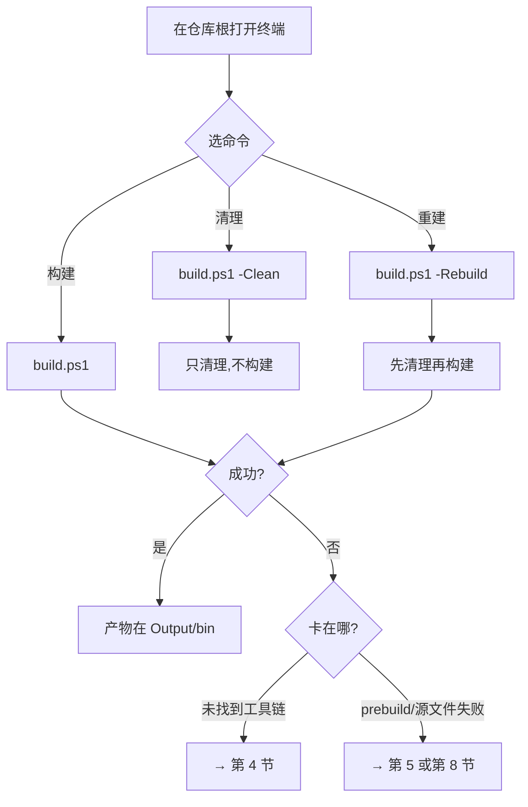
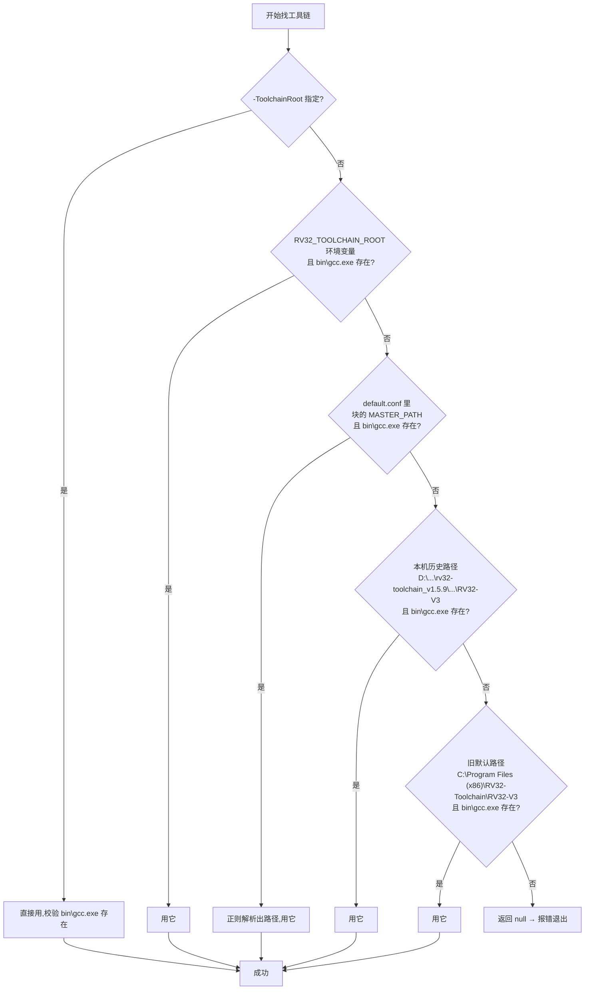
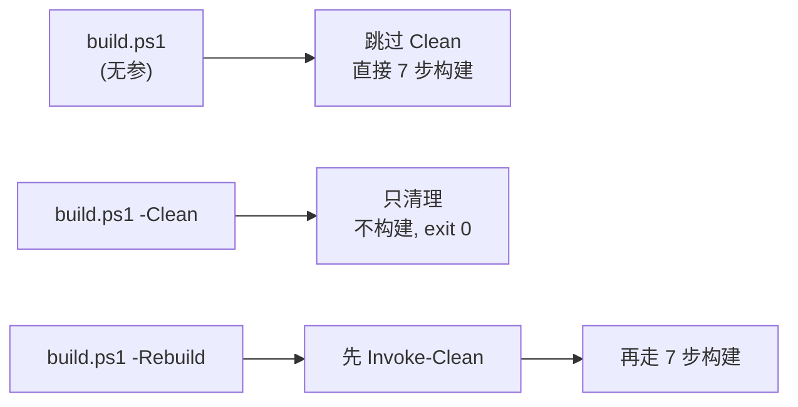
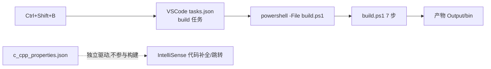

# AB5766 build 脚本原理与使用指南

> 本文面向想在 Code::Blocks GUI 之外、用命令行构建这份固件的**新手**。它讲两件事：**`build.ps1` 怎么用**，以及**它每一步在干什么、为什么这么写**。
>
> 假设你已读过姊妹篇 [AB5766 SDK 编译原理详解](AB5766_SDK编译原理详解.md) 的第 2 节（7 步流水线全景），知道构建大致分 7 步。本文会和那一篇一一对应地讲脚本如何落地这 7 步。
>
> 配套阅读：[docs/plan/build-with-vscode.md](../plan/build-with-vscode.md) 是命令行构建与 VSCode 集成的"设计记录"（偏工程取舍），本文是面向新手的"原理 + 使用"教学，两者互补；遇链接账本看 [map 指南](../SDK/AB5766_map文件解析指南.md)。

---

## 1. 读完这篇你能做到什么

读完本文，你应该能回答：

1. **第一次怎么把固件构建出来？**（第 2 节，30 秒上手）
2. **`build.ps1` 三个参数（`-ToolchainRoot`/`-Clean`/`-Rebuild`）各做什么？工具链找不到怎么办？**（第 3、4 节）
3. **脚本里"解析 XML 算出 .o 路径""为什么链接要用相对路径""为什么不用 `&&` 连命令"这几个怪写法到底为什么？**（第 5 节，本文的原理深讲）

> **定位**：`build.ps1` 的产物路径与 Code::Blocks GUI **完全一致**，两者可混用——你今天用 GUI 构建，明天用脚本构建，产物落在同一处，互不冲突。它不是另一套构建系统，而是"复现 app.cbp 描述的 Debug 构建"的命令行实现。

> **证据分级**：沿用 [map 指南](../SDK/AB5766_map文件解析指南.md) 的 E0–E3。本文讲"脚本是怎么写的"默认 E1；引到具体产物大小/地址为 E2。

---

## 2. 30 秒上手：第一次跑构建

### 2.1 前置条件

- Windows + PowerShell（本机是 Windows PowerShell 5.1，脚本也兼容它）；
- 已安装 RV32 工具链，并在 Code::Blocks 全局配置里登记过（或设置环境变量，见第 4 节）；
- 在仓库根目录打开终端。

### 2.2 三条命令速查

| 目的 | 命令（在仓库根运行） |
| --- | --- |
| 构建 | `powershell -ExecutionPolicy Bypass -File projects/microphone/build.ps1` |
| 清理（不构建） | `powershell -ExecutionPolicy Bypass -File projects/microphone/build.ps1 -Clean` |
| 重新构建（先清再建） | `powershell -ExecutionPolicy Bypass -File projects/microphone/build.ps1 -Rebuild` |

> 在 VSCode 里，`Ctrl+Shift+B` 已绑定到"构建"任务（见第 7 节），不必手敲命令。

### 2.3 期望输出（示意）

成功时你会看到类似这样的进度（每步用 `==== 标题 ====` 分隔）：

```
工具链: D:\...\RV32-V3
工程目录: ...\projects\microphone

==== Prebuild ====
  [OK] prebuild 完成

==== 解析 app.cbp ====
  [OK] 共 78 个源文件待编译

==== 预处理链接脚本 ram.ld -> ram.o ====
  [OK] ram.o 已生成

==== 预处理 app.xm -> appxm.o ====
  [OK] appxm.o 已生成

==== 编译 78 个源文件 ====
  [  1/78] bsp/bsp_charge.c
  ...
  [OK] 全部源文件编译完成

==== 链接 app.rv32 ====
  [OK] app.rv32 已生成 (xxx.xx KB)

==== Postbuild ====

==== 构建成功 ====
  产物: app.rv32 (xxx.xx KB)
        app.bin (xxx.xx KB)
        app.dcf (xxx.xx KB)
  提示: objdump 缺失时不生成 app.lst（非致命）
```

### 2.4 用户旅程



> **第一次跑就失败？** 一句话指引：报"未找到 RV32 工具链" → 看第 4 节；报 "prebuild 失败" 或 "源文件不存在" → 看第 5.1 / 5.2 节或第 8 节排错。

---

## 3. 参数与行为：三个开关

### 3.1 三个参数

| 参数 | 类型 | 作用 | 不传时 |
| --- | --- | --- | --- |
| `-ToolchainRoot` | 字符串 | 指定 RV32 工具链根目录（含 `bin\riscv32-elf-gcc.exe`） | 走 4 级自动探测（第 4 节） |
| `-Clean` | 开关 | 删除中间与产物，**只清理不构建** | 不清理 |
| `-Rebuild` | 开关 | 先清理再构建 | 不重建 |

定义在 [build.ps1](../../projects/microphone/build.ps1) 第 30–35 行：

```powershell
[CmdletBinding()]
param(
    [string]$ToolchainRoot,
    [switch]$Clean,
    [switch]$Rebuild
)
```

### 3.2 关键行为：Set-Location 到工程目录

第 37–44 行：

```powershell
$ErrorActionPreference = 'Stop'
$ProjDir = $PSScriptRoot
Set-Location $ProjDir
$CbpFile  = Join-Path $ProjDir 'app.cbp'
$ObjDir   = Join-Path $ProjDir 'Output\obj'
$BinDir   = Join-Path $ProjDir 'Output\bin'
```

**为什么必须 `Set-Location` 到 `projects\microphone`？** 因为 app.cbp 里所有路径（18 个 `-I`、源文件 `../../bsp/...`、链接库 `../../libs/...`）都以 **`projects\microphone` 为基准**。脚本把自己切到这个目录，后续才能用和 app.cbp 一致的相对路径，保证产物落位和 GUI 完全相同（可混用的前提）。`$PSScriptRoot` 是脚本自身所在目录，即 `projects\microphone`。

`$ErrorActionPreference = 'Stop'` 让 cmdlet 出错时立即抛出终止性错误（脚本里另有用 `$LASTEXITCODE` 手动检查 native exe 的退出码，两者分工不同，见第 5.8 节）。

### 3.3 PowerShell 基础补注

- `-ExecutionPolicy Bypass`：临时绕过执行策略，允许直接跑未签名脚本（仅本次进程有效，不改系统策略）。
- `-NoProfile`：不加载用户 PowerShell 配置文件，避免本机 profile 干扰（tasks.json 里用了，命令行手跑可加可不加）。
- `$RepoRoot`（第 113 行）：仓库根（`projects\microphone` 的上两级），专门用来推算 `.o` 输出路径——见第 5.3 节，这是脚本的工程核心之一。

```powershell
$RepoRoot = (Resolve-Path (Join-Path $ProjDir '..\..')).Path
```

---

## 4. 工具链探测：4 级优先级

### 4.1 为什么要探测

RV32 工具链的安装路径不在仓库里，而在**用户机器上**——具体登记在 Code::Blocks 的全局配置 `%APPDATA%\codeblocks\default.conf`。不同机器路径不同，脚本不能写死，必须探测。`Find-ToolchainRoot` 函数（[build.ps1:60-93](../../projects/microphone/build.ps1)）按 4 级优先级找：



### 4.2 第 2 级：正则解析 default.conf

最值得讲的是第 2 级——从 Code::Blocks 配置 XML 里把安装路径"挖"出来。看 [build.ps1:69-82](../../projects/microphone/build.ps1)：

```powershell
$cbConf = Join-Path $env:APPDATA 'codeblocks\default.conf'
if (Test-Path $cbConf) {
    $conf = Get-Content $cbConf -Raw
    if ($conf -match '(?s)<riscv32_v3>(.*?)</riscv32_v3>') {
        $block = $Matches[1]
        if ($block -match '<MASTER_PATH>\s*<str>\s*<!\[CDATA\[(.*?)\]\]>\s*</str>') {
            $mp = $Matches[1].Trim()
            if ($mp -and (Test-Path (Join-Path $mp 'bin\riscv32-elf-gcc.exe'))) {
                return $mp
            }
        }
    }
}
```

两段正则：

1. `(?s)<riscv32_v3>(.*?)</riscv32_v3>`：用 `(?s)` 让 `.` 匹配换行，截取整个 `<riscv32_v3>...</riscv32_v3>` 块内容。
2. `<MASTER_PATH>\s*<str>\s*<!\[CDATA\[(.*?)\]\]>\s*</str>`：在块内找 `MASTER_PATH` 的 `CDATA` 值，即工具链安装路径。

挖出后还要 `Test-Path ...\bin\riscv32-elf-gcc.exe` 校验"真有这个 gcc"，避免配了一个失效路径。这一级是"无参数时最可能命中"的探测方式，因为正常装好工具链的开发者都登记过 Code::Blocks 编译器。

### 4.3 探测成功后：把 bin 前置进 PATH

第 108 行：

```powershell
$env:Path = $BinToolchain + [System.IO.Path]::PathSeparator + $env:Path
```

为什么？因为 prebuild.bat / postbuild.bat 里调用的是**裸名**工具（`riscv32-elf-xmaker`、`riscv32-elf-objcopy`，不带完整路径）。把工具链 `bin` 前置到 `PATH`，这些裸名才能被系统解析到。脚本自己用的是绝对路径变量（`$Gcc`/`$Ld`/`$Objcopy`/`$Xmaker`，第 102–105 行），不依赖 PATH；前置 PATH 是为了照顾那两个 .bat。

### 4.4 全失败时的报错

4 级全找不到，第 96–100 行报错退出：

```powershell
if (-not $ToolchainRoot -or -not (Test-Path (Join-Path $ToolchainRoot 'bin\riscv32-elf-gcc.exe'))) {
    Write-Host "未找到 RV32 工具链。请用 -ToolchainRoot 指定，或设置环境变量 RV32_TOOLCHAIN_ROOT。" -ForegroundColor Red
    Write-Host "示例: ./build.ps1 -ToolchainRoot D:\...\RV32-V3" -ForegroundColor Yellow
    exit 1
}
```

> 排错见第 8 节第 1 条。最常见解法：要么 `-ToolchainRoot` 直接指，要么设 `$env:RV32_TOOLCHAIN_ROOT`，要么在 Code::Blocks 里把 `riscv32-v3` 编译器的 `MASTER_PATH` 设对。

---

## 5. 脚本每阶段在做什么（7 步对齐篇一）—— 原理深讲

本节是本文核心，按 7 步逐段拆脚本，每步回链姊妹篇同名概念节。

### 5.1 Prebuild

[build.ps1:162-168](../../projects/microphone/build.ps1)：

```powershell
Write-Stage 'Prebuild'
$prebuild = Join-Path $BinDir 'prebuild.bat'
if (-not (Test-Path $prebuild)) { Fail "缺少 $prebuild" }
cmd /c "`"$prebuild`" app"
if ($LASTEXITCODE -ne 0) { Fail "prebuild 失败 (exit $LASTEXITCODE)" }
Write-OK 'prebuild 完成'
```

要点：

- `cmd /c "...\prebuild.bat app"`：用 `cmd` 跑那个批处理，并传参数 `app`。传 `app` 很关键——prebuild.bat 末尾 `if "%1"=="" pause`，**只有没传参才会 pause 挂起**；传了 `app` 就不挂起，构建才不会卡死等人按键。
- 为什么 prebuild 必须先于 cbp 解析？因为 `effect.c` 是 prebuild 生成的，而它又是 78 个待编译源之一（见姊妹篇第 5 节）。脚本先跑 prebuild 再解析 cbp，顺序不能反。

> 回链姊妹篇 [第 5 节](AB5766_SDK编译原理详解.md)：prebuild 用 xmaker 生成 res/xcfg/effect.c。

### 5.2 XML 解析提取源文件  `[难点节]`

这是脚本最巧妙的一段：**如何从 app.cbp 里把"要编译的源文件"挑出来**。看 [build.ps1:174-200](../../projects/microphone/build.ps1)：

```powershell
[xml]$cbp = Get-Content $CbpFile
$units = $cbp.CodeBlocks_project_file.Project.Unit
...
foreach ($u in $units) {
    $isCC = $false
    if ($u.Option) {
        foreach ($opt in @($u.Option)) {
            if ($opt.compilerVar -eq 'CC') { $isCC = $true; break }
        }
    }
    if (-not $isCC) { continue }
    $rel = $u.filename
    ...
    $Sources.Add([pscustomobject]@{ Src = $srcAbs; Obj = $objPath; Rel = $relRoot })
}
```

#### 一条规则过滤掉 4 个特殊 Unit

回忆姊妹篇第 3.3 节：app.cbp 里有 78 个普通源文件（带 `compilerVar="CC"`）和 4 个特殊 Unit（`ram.ld`/`app.xm`/`download.xm`/`xcfg.xm`，带 `buildCommand` 但**没有** `compilerVar="CC"`）。

脚本只认 `compilerVar == "CC"`（第 185 行 `if ($opt.compilerVar -eq 'CC')`），**一条规则就一刀把 4 个特殊 Unit 排除在外**——它们没有 `compilerVar="CC"`，`continue` 跳过。这比逐个文件名判断优雅得多。

5 类 Unit 在脚本眼里的待遇：

| Unit 类型 | 有 `compilerVar="CC"`? | 脚本如何处理 |
| --- | --- | --- |
| 普通 `.c` 源文件 | 是 | 进 `$Sources` 列表，待编译 |
| 普通 `.h` 头文件 | 否（无 CC） | 跳过（IDE 用，脚本不管） |
| `ram.ld` | 否 | 跳过（由第 3 步预处理单独处理） |
| `app.xm`/`download.xm`/`xcfg.xm` | 否 | 跳过（由 prebuild/postbuild 单独处理） |
| `config.h`/`config_*.h` 等 | 否 | 跳过（被 `-I` 引用，不单独编译） |

> **类比**：Code::Blocks 对每个特殊 Unit 写了一条自定义 `buildCommand` 来调度它；脚本不抄那 4 条自定义命令，而是用"只挑 `compilerVar="CC"`"这一条通用规则，等价地复现了"编译哪些文件"。这是脚本比 GUI 更简洁的地方。

> 回链姊妹篇 [第 3 节](AB5766_SDK编译原理详解.md)：app.cbp 的 Unit 两类划分。

### 5.3 .o 路径映射算法  `[难点节]`

挑出源文件后，下一个难题：**每个 `.c` 编出来的 `.o` 该放哪？** 脚本用 6 步算出来，看 [build.ps1:192-198](../../projects/microphone/build.ps1)：

```powershell
$srcAbs = [System.IO.Path]::GetFullPath((Join-Path $ProjDir $rel))
if (-not (Test-Path $srcAbs)) { Fail "源文件不存在: $rel (-> $srcAbs)" }
$relRoot = $srcAbs.Substring($RepoRoot.Length + 1)
$objRel  = $relRoot -replace '\.c$', '.o'
$objPath = Join-Path $ObjDir $objRel
```

#### 6 步逐步拆

| 步骤 | 代码 | 作用 |
| --- | --- | --- |
| 1. 拿 filename | `$rel = $u.filename` | 从 cbp 取相对 `projects\microphone` 的路径，如 `../../bsp/bsp_charge.c` |
| 2. 词法归一化 | `GetFullPath(Join-Path $ProjDir $rel)` | 拼成绝对路径并消解 `../`，**不要求文件已存在**也能算 |
| 3. 校验存在 | `Test-Path $srcAbs` | 文件不存在就 `Fail`，早报错 |
| 4. 相对仓库根 | `$srcAbs.Substring($RepoRoot.Length + 1)` | 剥掉仓库根前缀，得到相对仓库根的路径 |
| 5. 改后缀 | `-replace '\.c$','.o'` | `.c` → `.o` |
| 6. 拼 obj 路径 | `Join-Path $ObjDir $objRel` | 放到 `Output\obj\` 下，保持相对仓库根的目录结构 |

> **类比**：就像给每个源文件"换算一个抽屉地址"——先把它的绝对位置算清楚，再换算成"相对仓库大门走几步能到"的抽屉编号，最后把抽屉建在 `Output\obj\` 这排柜子里。抽屉（目录）不存在时，编译循环里会先 `New-Item` 造出来（第 232 行）。

#### 两个例子逐步演算

**例 1：`../../bsp/bsp_charge.c`**（bsp 目录下的文件）

| 步骤 | 值 |
| --- | --- |
| 1. filename | `../../bsp/bsp_charge.c` |
| 2. GetFullPath（基准 `projects\microphone`） | `<仓库根>\bsp\bsp_charge.c` |
| 3. Test-Path | 通过 |
| 4. 相对仓库根 | `bsp\bsp_charge.c` |
| 5. 改后缀 | `bsp\bsp_charge.o` |
| 6. Join-Path ObjDir | `Output\obj\bsp\bsp_charge.o` |

**例 2：`main.c`**（工程根下的文件）

| 步骤 | 值 |
| --- | --- |
| 1. filename | `main.c` |
| 2. GetFullPath（基准 `projects\microphone`） | `<仓库根>\projects\microphone\main.c` |
| 3. Test-Path | 通过 |
| 4. 相对仓库根 | `projects\microphone\main.c` |
| 5. 改后缀 | `projects\microphone\main.o` |
| 6. Join-Path ObjDir | `Output\obj\projects\microphone\main.o` |

#### 为什么用"相对仓库根"而不是"相对工程目录"

这是和 Code::Blocks 产物路径对齐的关键。Code::Blocks 的 `object_output="Output/obj/"` 配合它的源文件路径解析，最终 `.o` 的落位结构就是"相对仓库根保持目录 + 放进 `Output\obj\`"。脚本用 `$RepoRoot`（仓库根，不是 `$ProjDir` 工程目录）来剥前缀，才能算出和 GUI **一模一样**的 `.o` 路径——这是"脚本与 GUI 可混用"的根基。如果用相对工程目录，`bsp_charge.o` 会落错地方，和 GUI 构建的产物对不上。

> 回链姊妹篇 [第 8.4 节](AB5766_SDK编译原理详解.md)：.o 是真目标文件，喂链接。

### 5.4 预处理 ram.ld / app.xm

[build.ps1:205-222](../../projects/microphone/build.ps1)，两段几乎同形：

```powershell
# ram.ld -> ram.o
& $Gcc $CFLAGS $INCLUDES '-E' '-P' '-x' 'c' '-c' $ramLd '-o' $ramObj

# app.xm -> appxm.o
& $Gcc $CFLAGS $INCLUDES '-E' '-P' '-x' 'c' '-c' $appXm '-o' $appxmO
```

注意它**复用了 `$CFLAGS $INCLUDES`**——编译选项和 18 个头文件路径。这样预处理 ram.ld/app.xm 时能找到 `config.h` 链，宏展开结果和编译期一致。这是脚本比手敲命令省心的地方：一套选项/路径，预处理和编译共用。

> 回链姊妹篇 [第 6、7 节](AB5766_SDK编译原理详解.md)：ram.o 是链接脚本而非目标文件；appxm.o 是 xmaker 配方。

### 5.5 编译所有 .c

[build.ps1:227-237](../../projects/microphone/build.ps1)：

```powershell
$idx = 0
foreach ($s in $Sources) {
    $idx++
    $dir = Split-Path $s.Obj -Parent
    if (-not (Test-Path $dir)) { New-Item -ItemType Directory -Force -Path $dir | Out-Null }
    Write-Host ("  [{0,3}/{1}] {2}" -f $idx, $Sources.Count, $s.Rel) -ForegroundColor DarkGray
    & $Gcc $CFLAGS $INCLUDES '-c' $s.Src '-o' $s.Obj
    if ($LASTEXITCODE -ne 0) { Fail "编译失败: $($s.Rel) (exit $LASTEXITCODE)" }
}
```

要点：

- 每个文件先 `Split-Path ... -Parent` 取 `.o` 的父目录，不存在就 `New-Item` 造（呼应 5.3 的"抽屉不存在先造"）；
- 打印进度 `[  1/78] bsp/bsp_charge.c`，新手能看清编到哪；
- 每个文件编译后**立即查 `$LASTEXITCODE`**，非 0 就 `Fail` 退出（见 5.8 为什么不用 `$?`）。

> 回链姊妹篇 [第 8 节](AB5766_SDK编译原理详解.md)：CFLAGS 各选项含义，尤其 `-ffunction-sections`。

### 5.6 链接 → app.rv32  `[难点节]`

[build.ps1:242-249](../../projects/microphone/build.ps1)：

```powershell
Write-Stage '链接 app.rv32'
$objListRel = $Sources | ForEach-Object { Join-Path 'Output\obj' ($_.Rel -replace '\.c$','.o') }
& $Ld '-o' 'Output\bin\app.rv32' $objListRel '-TOutput\obj\ram.o' '--gc-sections' '-Map=Output\bin\map.txt' '--no-warn-rwx-segments' $LIBS
if ($LASTEXITCODE -ne 0) { Fail "链接失败 (exit $LASTEXITCODE)" }
$size = (Get-Item $AppRv32).Length / 1KB
Write-OK ("app.rv32 已生成 ({0:N2} KB)" -f $size)
```

#### 为什么链接要用相对路径

注意 `$objListRel`（第 244 行）把每个 `.o` 的绝对路径**转回相对 `projects\microphone` 的路径**（`Output\obj\bsp\bsp_charge.o` 这样），连 `-TOutput\obj\ram.o`、`-Map=Output\bin\map.txt` 也都是相对路径。

**为什么费这事？** 因为链接器会把"命令行里出现的路径"原样写进 `map.txt`。如果用绝对路径，map.txt 里每个 `.o` 都是一长串本机绝对路径，换台机器或跟别人对照就乱。用相对路径，map.txt 里的路径表现就和 Code::Blocks 编译 log **完全一致**，便于：

- 和 GUI 构建的 map 对照（混用前提）；
- 被 [map 指南](../SDK/AB5766_map文件解析指南.md) 这类文档引用（路径稳定、可读）。

#### 参数顺序对齐编译 log

第 246 行参数顺序：`<.o 列表> -T ram.o --gc-sections -Map=... --no-warn-rwx-segments <libs>`，与 app.cbp `<Linker>` 段及 Code::Blocks 实际调用顺序一致。链接器对库顺序敏感（被引用的库要放在引用者之后），这里 5 个库放最后，符合惯例。

> 回链姊妹篇 [第 9.1 节](AB5766_SDK编译原理详解.md)：链接参数逐项含义。

### 5.7 Postbuild

[build.ps1:254-267](../../projects/microphone/build.ps1)：

```powershell
$postbuild = Join-Path $BinDir 'postbuild.bat'
if (-not (Test-Path $postbuild)) { Fail "缺少 $postbuild" }
cmd /c "`"$postbuild`" app"
if ($LASTEXITCODE -ne 0) { Fail "postbuild 失败 (exit $LASTEXITCODE)" }
...
Write-Host '  提示: objdump 缺失时不生成 app.lst（非致命）' -ForegroundColor DarkGray
```

同样 `cmd /c "...\postbuild.bat app"` 传 `app` 避 pause 挂起。postbuild 内部动作（objcopy→bin、xmaker→dcf、条件 upload、条件 objdump、xmaker download）见姊妹篇第 10 节，脚本只负责调用并查退出码。结尾打印三产物（rv32/bin/dcf）大小，并提示 `app.lst` 缺 objdump 不生成（非致命）。

> 回链姊妹篇 [第 10 节](AB5766_SDK编译原理详解.md)：postbuild 详解与占位 .o 澄清。

### 5.8 错误处理：PS 5.1 无 &&  `[难点节]`

新手从 bash 过来会问：为什么不写成 `gcc ... && ld ... && postbuild`？因为**本机的 Windows PowerShell 5.1 没有 `&&` 操作符**（`&&`/`||` 管道链是 PowerShell 7+ 才有，5.1 里写 `&&` 会直接语法报错）。

#### bash `&&` 链 vs PS 5.1 逐步查 `$LASTEXITCODE`

| bash | Windows PowerShell 5.1 | 说明 |
| --- | --- | --- |
| `cmd1 && cmd2` | `cmd1; if ($LASTEXITCODE -eq 0) { cmd2 }` | 5.1 无 `&&`，要手写条件 |
| `cmd1 \|\| cmd2` | `cmd1; if ($LASTEXITCODE -ne 0) { cmd2 }` | 同理 |
| 链式多步 | 每步后 `if ($LASTEXITCODE -ne 0) { Fail ... }` | 脚本采用的模式 |

脚本里每个 native exe（gcc/ld/objcopy/xmaker/cmd）调用后都紧跟 `if ($LASTEXITCODE -ne 0) { Fail ... }`（见 5.1、5.4、5.5、5.6、5.7 各节）。`Fail` 函数（第 52–55 行）打印红色 `[FAIL]` 并 `exit 1`，实现"一步失败立即停"。

#### 为什么查 `$LASTEXITCODE` 而不是 `$?`

这是 PowerShell 5.1 一个著名的坑：**调用 native exe（.exe）后，`$?` 可能被 stderr 误判为 `$false`**。5.1 里 native exe 往 stderr 写任何东西（哪怕是正常进度信息），PowerShell 会把每行 stderr 包成 ErrorRecord，导致 `$?` 变 `$false`——但程序其实成功了（`$LASTEXITCODE` 是 0）。

所以脚本一律用 `$LASTEXITCODE`（进程真实退出码）判断，绝不依赖 `$?`。这是写 PowerShell 调 native 工具的稳健做法。

> 这也是为什么脚本里多处 `2>&1` 要小心——本工具的 PowerShell 环境已为 native exe 捕获 stderr，不要随意加重定向。脚本本身没加 `2>&1`，正是为了避开这个坑。

---

## 6. Clean 与 Rebuild：保留什么、删什么

### 6.1 Invoke-Clean 删什么、留什么

[build.ps1:118-135](../../projects/microphone/build.ps1)：

```powershell
function Invoke-Clean {
    Write-Stage 'Clean'
    if (Test-Path $ObjDir) {
        Remove-Item $ObjDir -Recurse -Force
        Write-OK "已删除 Output\obj"
    } ...
    $binCleanups = @('app.rv32','app.bin','app.dcf','app.lst','appxm.o','map.txt')
    foreach ($f in $binCleanups) {
        $p = Join-Path $BinDir $f
        if (Test-Path $p) { Remove-Item $p -Force; Write-OK "已删除 $f" }
    }
    Write-Host '保留: res.bin/xcfg.bin/res.h/xcfg.h/effect.c/effect.h/*.xm/header.bin/updater.bin/unpack.bin/res\/*.bat/ringtone.*' -ForegroundColor DarkGray
}
```

| 删除（清理） | 保留 |
| --- | --- |
| `Output\obj\` 整个目录（所有 `.o`、`ram.o`、占位 .o） | `Output\bin\res.bin`/`xcfg.bin`/`res.h`/`xcfg.h` |
| `Output\bin\app.rv32`/`app.bin`/`app.dcf`/`app.lst`/`appxm.o`/`map.txt` | `effect.c`/`effect.h`（工程根，prebuild 产物） |
|  | `*.xm`（配方源，手维护） |
|  | `header.bin`/`updater.bin`/`unpack.bin`/`ringtone.*`/`res\` 下资源 |

### 6.2 为什么保留 prebuild 产物

`-Clean` **不删** `res.bin`/`xcfg.bin`/`effect.c` 等 prebuild 产物。原因：这些是 xmaker 按 `.xm` 生成的，重新生成要跑 prebuild（较慢且有外部依赖）。保留它们意味着 `-Clean` 后下次构建可跳过"没变化的资源重生成"，加快迭代。要彻底重来请用 `-Rebuild`（它会先 `-Clean`，再构建——构建时第 1 步 prebuild 会再跑一遍刷新它们）。

### 6.3 三种调用状态



第 134–135 行：

```powershell
if ($Clean) { Invoke-Clean; exit 0 }
if ($Rebuild) { Invoke-Clean }
```

`-Clean` 清完即 `exit 0`（不构建）；`-Rebuild` 清完**不退出**，继续往下走构建流程。

---

## 7. VSCode 集成

### 7.1 为什么讲这个

新手日常编辑代码在 VSCode，构建也想在 VSCode 里一键完成。仓库已配好 `.vscode/` 两文件：[tasks.json](../../.vscode/tasks.json)（构建任务）和 [c_cpp_properties.json](../../.vscode/c_cpp_properties.json)（IntelliSense）。

### 7.2 tasks.json：3 个任务

| 任务 label | 命令 | 默认绑定 | problemMatcher |
| --- | --- | --- | --- |
| `build` | `powershell -ExecutionPolicy Bypass -NoProfile -File build.ps1` | **`Ctrl+Shift+B`**（默认构建） | `$gcc`（解析编译错误跳转） |
| `clean` | 同上 + `-Clean` | 无（手动 Run Task） | 无 |
| `rebuild` | 同上 + `-Rebuild` | 无 | `$gcc` |

`$gcc` problemMatcher 会扫编译输出里的 `file:line:col: error: ...` 格式，自动在"问题"面板列出错误并支持点跳。`-NoProfile` 避免本机 PowerShell profile 干扰。

### 7.3 c_cpp_properties.json：IntelliSense

要点（逐项见 [c_cpp_properties.json](../../.vscode/c_cpp_properties.json)）：

| 配置项 | 值 | 说明 |
| --- | --- | --- |
| `name` | `AB5766` | 配置名 |
| `includePath` | 18 条 `${workspaceFolder}/...` | 与 app.cbp 的 18 个 `-I` 一一对应 |
| `compilerPath` | `D:/.../RV32-V3/bin/riscv32-elf-gcc.exe` | **本机绝对路径，换机要改** |
| `compilerArgs` | `-march=...` / `-ffunction-sections` / `-mjump-tables-in-text` | 让 IntelliSense 按相同架构解析 |
| `intelliSenseMode` | `gcc-x86` | **注意**：选 x86 不是错——RV32 是 32 位 ilp32，IntelliSense 没有专用 riscv 模式，用 gcc-x86 能正常解析 32 位目标 |
| `cStandard` / `cppStandard` | `c11` | C 标准 |

### 7.4 Ctrl+Shift+B 全链路



> **提醒**：`compilerPath` 是本机绝对路径（本机是 `D:\software_download\work\rv32-toolchain_v1.5.9\...`）。换台机器或工具链装别处，要手动改这个值，否则 IntelliSense 报"找不到编译器"。构建脚本（build.ps1）不受这个影响——它自己探测工具链（第 4 节）。

---

## 8. 排错 FAQ

| # | 现象 | 可能原因 | 处理步骤 | 相关章节 |
| --- | --- | --- | --- | --- |
| 1 | `未找到 RV32 工具链` | 4 级探测全失败 | ①确认装了 RV32 工具链且 `bin\riscv32-elf-gcc.exe` 存在；②用 `-ToolchainRoot` 显式指；③或设 `$env:RV32_TOOLCHAIN_ROOT`；④或在 Code::Blocks 设好 `riscv32-v3` 的 `MASTER_PATH` | 第 4 节 |
| 2 | `prebuild 失败` | xmaker 缺失/`.xm` 配方损坏/`effect.c` 源缺失 | ①确认工具链 bin 已进 PATH（脚本会前置）；②检查 `Output\bin\res.xm`/`xcfg.xm` 存在且未被改坏；③单独跑 `cmd /c Output\bin\prebuild.bat app` 看具体错 | 第 5.1 节 |
| 3 | `源文件不存在: xxx (-> ...)` | cbp 里有文件但磁盘没有（常见于切分支后未拉全） | 看报错里的路径，`git status` 确认文件在；可能是生成文件（effect.c 等）prebuild 没跑成功 | 第 5.2 节 |
| 4 | `编译失败: xxx (exit N)` | 源码语法错/缺头文件/宏不一致 | 看终端里 gcc 的具体报错行（`$gcc` matcher 也会在"问题"面板列出）；若是改了 config.h 后大面积报错，先 `-Rebuild` 让 ram.o 重新预处理 | 第 5.5 节、姊妹篇第 6 节 |
| 5 | `链接失败 (exit N)` | 段溢出/重叠/未定义符号/库顺序 | 看 ld 报错：`section ... will not fit` 是 RAM/Flash 容量不够；`undefined reference` 是缺库或函数被 gc 掉；查 map.txt 上次布局对照 | 第 5.6 节、[map 指南](../SDK/AB5766_map文件解析指南.md) |
| 6 | `postbuild 失败` | objcopy/xmaker 失败/`appxm.o` 缺失 | ①确认第 3 步预处理 app.xm 成功（`appxm.o` 在）；②单独跑 `cmd /c Output\bin\postbuild.bat app` 看错 | 第 5.7 节、姊妹篇第 10 节 |
| 7 | `没生成 app.lst` | 工具链缺 objdump | 正常，非致命。要反汇编请装 objdump 到工具链 bin（脚本/ postbuild 会自动探测） | 姊妹篇第 4.2、10.1 节 |
| 8 | `map.txt 里路径和 GUI 构建的不一样` | 链接时用了绝对路径 | 脚本已用相对路径（`$objListRel`），应一致；若不一致检查是否改过 build.ps1 第 244–246 行 | 第 5.6 节 |
| 9 | 终端中文乱码 | PowerShell 5.1 默认编码/脚本是 BOM-UTF-8 | 用 `powershell -ExecutionPolicy Bypass -File ...` 标准方式调用；不要把脚本转成无 BOM 的 UTF-8 | 第 3、5.8 节 |
| 10 | `Ctrl+Shift+B` 无反应 | tasks.json 未被识别/不是默认构建任务 | 确认 `.vscode/tasks.json` 存在且 `build` 任务的 `group.isDefault=true`；必要时 `Run Build Task` 手选 | 第 7 节 |

---

## 9. 延伸阅读

- [AB5766 SDK 编译原理详解](AB5766_SDK编译原理详解.md)：本文姊妹篇，讲清"源码到镜像中间发生什么、为什么这么设计"，本文第 5 节每步都回链它的同名概念节。
- [docs/plan/build-with-vscode.md](../plan/build-with-vscode.md)：命令行构建与 VSCode 集成的设计记录（build.ps1/tasks.json/c_cpp_properties.json 的取舍缘由），偏工程实现。
- [AB5766 map 文件解析指南](../SDK/AB5766_map文件解析指南.md)：读懂链接账本 map.txt，核对段地址/大小/容量（E2），排错链接问题时必备。
- [AB5766 LE Mic 新手开发指南](../SDK/AB5766_LE_Mic_新手开发指南.md)：从代码与配置角度入门，含三层配置模型、烧录边界声明。
