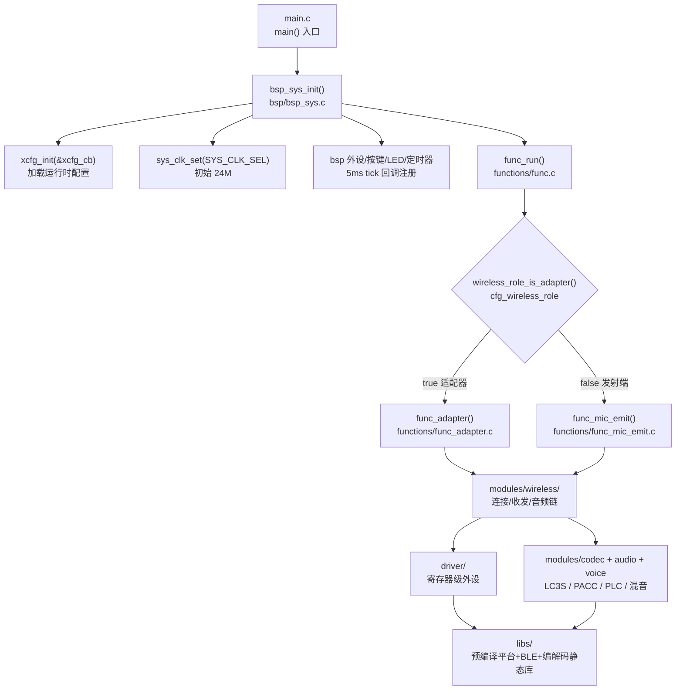
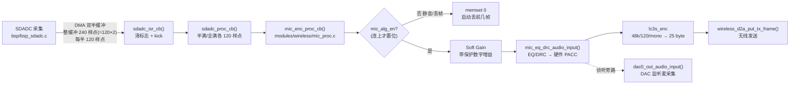
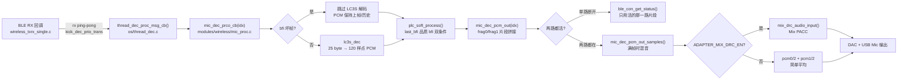

# 00 项目基础与面试表达（四篇题库共用底座）

> 本文档是 `01_嵌入式架构与启动`、`02_无线协议与双角色`、`03_音频算法与数据流`、`04_工程化调试与验证` 四篇题库共用的项目背景和表达底座。
>
> 四篇专题题库默认你已经读过本文档的「项目定位、关键数字速查、证据等级、预编译库边界、表达边界」这五节，不再重复解释。
>
> 写作原则：**所有内容都假设你要用中文连续口头讲给面试官听，面试官看不到你的代码。** 代码和源码路径主要给你自己复习和定位用，不是为了让面试官读。

---

## 0. 怎么用这份文档（先读这一节）

- **面试现场**：你只会用到「先说结论」「大白话解释」和「面试收尾句」三段。源码路径、行号、map 是你脑子里用来保证自己不撒谎的，不是念给面试官听的。
- **复习阶段**：按「推荐复习顺序」一节走，先把这份底座读透，再按 01→02→03→04 的顺序过题库。
- **事实分级**：凡是引用结论，心里要清楚它是 E0（配置宏）、E1（可见源码）、E2（map/镜像）、E3（硬件实测）哪一级。面试里能说「这个我在 map 里看过符号、在板子上抓过波形」就比只能说「配置宏写着」强很多。
- **边界意识**：LC3S 编解码、PLC、PACC 硬件音效、BLE/平台协议栈都是**预编译静态库**，内部实现看不到。问到这些，说接口和外部行为，不要编内部算法。

---

## 1. 项目一句话定位

> 一句话版本（背熟，张口就来）：
>
> **这是一个跑在 AB5766 RISC-V 芯片上的低功耗无线麦克风固件，发射端（麦）和接收端（适配器）共用一套固件、一个烧录镜像，靠运行时配置位在两个角色之间切换，上行用 LC3S 编码传数字音频，支持一拖二双麦。**

展开成三句话（面试官追问「详细说说」时用）：
1. 芯片是 AB5766，RISC-V 32 位内核，厂商给了 RV32 工具链和一套预编译的平台/BLE/编解码静态库，我们在 SDK 上做产品化开发。
2. 同一个二进制镜像既能当无线麦发射端（采集 → 算法 → LC3S 编码 → 无线发送），又能当适配器接收端（无线接收 → 解码 → PLC → 双麦混音 → DAC/USB Mic 输出），运行时按 `cfg_wireless_role` 选。
3. 当前配置：48 kHz 采样、120 样点一帧、LC3S 压成 25 字节、80 kbps、双链路（一拖二）、发射端开 Soft Gain + EQ/DRC、接收端开混音 DRC。

产品形态和技术栈一句话：
- **产品形态**：2.4G 无线麦克风（K 歌/直播/会议类场景），发射端是带麦的电池小设备，接收端是插 PC/手机的 USB 适配器（USB Mic 上行）+ DAC 输出。
- **技术栈**：C 语言、裸机 super-loop + 功能状态机、RISC-V RV32 工具链、Code::Blocks 工程构建、厂商预编译静态库、链接脚本手动分区 RAM/Flash、硬件 PACC 做 EQ/DRC、SDADC + DMA 做采集、BLE 私有无线链路做音频传输。

---

## 2. 项目简历描述（三档，按简历空间挑）

> 写简历时**不要把厂商 SDK 写成自己从零写的**。诚实表述是「基于厂商 SDK 做产品化、角色集成、音频链路搭建、算法接入和验证」。下面三档都是这个口径。

### 一行版（简历项目栏一句话）

```
基于 AB5766 RISC-V 平台（厂商 SDK）开发低功耗无线麦克风固件，发射端/接收端共用一套镜像、运行时切换双角色，上行 LC3S 编码，支持一拖二双麦、EQ/DRC 与混音处理。
```

### 三行版（简历项目栏带要点）

```
· 基于 AB5766 RISC-V 芯片与厂商 SDK，开发低功耗无线麦克风/适配器固件，单镜像运行时按配置位切换发射端/接收端双角色，支持一拖二双麦。
· 负责音频数据链路搭建与算法接入：SDADC+DMA 双半缓冲采集、Soft Gain/EQ-DRC（硬件 PACC）/LC3S 编码、接收端 BFI+PLC 丢包补偿、双链路 PCM 拼接与混音 DRC，输出 DAC 与 USB Mic。
· 参与双角色状态机、连接/重连/扫描退避、链接事件驱动的算法与时钟资源装载/释放设计；通过 map、反汇编、串口日志、双板联调与音频抓取验证改动。
```

### 面试展开版（项目介绍口述 30~40 秒，可衔接自我介绍）

> 这个项目我做的是 AB5766 平台的无线麦克风固件。芯片是 RISC-V 32 位，厂商提供了 RV32 工具链和平台、蓝牙、编解码的静态库，我们在这套 SDK 上做产品化。
>
> 比较有意思的一点是，发射端和接收端**共用一套固件、一个烧录镜像**，靠运行时的配置位 `cfg_wireless_role` 在两个角色之间切，省一套代码维护成本，也省一次烧录管理。镜像里发射端和接收端的代码在 Flash 各占一段 LMA（各存一份），但运行时在 RAM 里同址复用同一段 VMA（`__emit_ram_vma = __adapter_ram_vma`），启动时按当前角色只把对应那套从 Flash 搬到这段 RAM——省的是 RAM，不是 Flash。
>
> 音频链路是这条：发射端 SDADC 采集，DMA 双半缓冲，中断只清标志再 kick，重活放回算法回调里做；先过 Soft Gain，再过 EQ/DRC（走的是硬件 PACC），然后 LC3S 编码成 25 字节一帧，无线发出去。接收端拿到帧先看 BFI（坏帧标志），没坏帧才解码，然后逐帧做 PLC，两路麦的 PCM 片段拼接后过混音 DRC，输出到 DAC 和 USB Mic。
>
> 配置上是 48 kHz 采样、120 样点一帧、80 kbps、双链路一拖二。发射端当前开了 Soft Gain 和 EQ/DRC，接收端开了混音 DRC 和 USB Mic 上行。
>
> 验证这块，我主要靠 map 和反汇编看符号和段有没有进镜像、串口日志看启动和连接流程、双板联调看音频和丢包表现，改动前改动后对比。

---

## 3. 自我介绍模板（三档时长）

> 自我介绍不要背稿子一样平铺，要有「我是谁→我做过什么→我想做什么」的结构。下面三档是从短到长的骨架，按面试给的时间挑。

### 1 分钟版（电话面/初面）

> 面试官您好，我是 XXX，主要做嵌入式软件开发，方向是低功耗无线音频和 RISC-V 平台。
>
> 我最近一直在做 AB5766 这个 RISC-V 芯片的无线麦克风固件。这个项目我比较深的参与是音频数据链路和双角色架构：发射端和接收端共用一套固件、一个镜像，运行时切角色；上行用 LC3S 编码，支持一拖二双麦，发射端做了 Soft Gain 和 EQ/DRC，接收端做了丢包补偿和双麦混音。
>
> 我比较擅长的是把一个 SDK 在产品上跑通、把音频链路从采集到输出整条串起来、然后通过 map、反汇编和双板调试把问题定位到根因。我对这个岗位很感兴趣，也想了解一下贵团队在音频或无线方向的产品规划。

### 3 分钟版（现场技术面开场）

> 面试官您好，我是 XXX，做嵌入式软件开发大概 X 年，方向偏低功耗无线音频，最近主攻 RISC-V 平台。
>
> 我先说下技术栈。我比较熟的是裸机 super-loop 加状态机这种架构，不是那种跑 RTOS 的；外设这块 SDADC、DMA、定时器、IIS、UART、GPIO、电源管理都自己接过；构建这块我是在 RISC-V 的 RV32 工具链下，用链接脚本手动分区 RAM 和 Flash、调段放置和 `--gc-sections` 这些；调试这块我习惯用 map、反汇编、串口日志、再加示波器和双板联调来定位问题。
>
> 我重点讲一个项目，就是 AB5766 的无线麦克风固件。芯片是 RISC-V 32 位，厂商给了平台、蓝牙、编解码的预编译静态库，我们做产品化。这个项目我自己觉得做得比较有意思的有三点：
>
> 第一点是双角色共用镜像。发射端和接收端不是两套代码，而是一套固件、一个烧录镜像，靠运行时配置位 `cfg_wireless_role` 切角色。镜像里两套角色的代码在 Flash 里各占一段 LMA（各存一份），但运行时搬到同一段 RAM 复用（VMA 相同，`__emit_ram_vma = __adapter_ram_vma`），启动时按当前角色只把对应那套搬进 RAM——省的是 RAM（同址复用只占一份），Flash 里两套都还在，所以省的是一套代码维护和一次烧录管理，不是省 Flash 空间。
>
> 第二点是音频链路。发射端 SDADC 采集、DMA 双半缓冲，中断只清标志加 kick，重活回到算法回调里；先 Soft Gain，再 EQ/DRC 走硬件 PACC，再 LC3S 编码成 25 字节一帧发出去。接收端看 BFI 决定要不要解码，逐帧做 PLC 丢包补偿，两路麦 PCM 片段拼接后过混音 DRC，输出 DAC 和 USB Mic。
>
> 第三点是工程化验证。我比较坚持改动要能追溯到证据：配置宏是 E0、可见源码是 E1、map/镜像是 E2、板上实测是 E3。我改完一个东西，会从 map 符号、串口日志、到双板音频抓取这条链都走一遍。
>
> 我对贵团队的方向很感兴趣，特别想了解你们在无线音频或者 RISC-V 平台上目前最需要解决的问题。

### 5 分钟版（技术深聊/主管面，可加技术细节展开）

> 前 3 分钟和上面一致，到「第三点是工程化验证」之后继续展开：
>
> ……我再多说两点技术细节，方便您判断我掌握的深度。
>
> 一个是无线传输的时序。当前用的是传输机制版本 7，连接间隔算下来是 120，单位 1.25 毫秒，也就是 150 毫秒一个连接间隔；发射周期是 4 个 1.25 毫秒即 5 毫秒发一次，重传次数配的是 3。组合缓冲是关掉的，单包模式，所以一个 TX 间隔里实际组合帧数是 2。这些数字之间是有耦合的，比如帧大小乘链路数乘重传数，配置里有个注释说暂时不能超过 72 字节，但当前 25×2×3 是 150，这一点我现在标记成待和协议侧/双板验证的边界，没当它是 bug。
>
> 另一个是连接驱动的资源生命周期。连接刚建上的时候，我们会把系统时钟从默认的 24M 拉到 160M，因为解码和算法要算力；断开以后再释放。算法使能位 `mic_alg_en` 也是跟着连接状态走的——连上置位、全断开清零。这种「资源跟着连接生命周期走」的设计，好处是空闲省功耗，风险是状态机和资源装载一旦不同步就会出问题，所以我特别关注连接事件回调和状态机之间的时序。
>
> 这套东西对我来说比较自然的延伸就是更高链路数、更低延迟、或者换更新的编解码，我也想往这个方向继续深入。

---

## 4. 项目整体架构图

> 这张图给你的脑子建一个「目录分层 + 启动链」的骨架。口头讲的时候你不需要画出来，但心里要有这个结构，面试官问「你项目怎么分层」你就沿着这张图从上往下说。



口头讲法（顺着图说）：
- 「入口是 `main.c` 的 `main()`，复位原因和版本先打印出来，然后调 `bsp_sys_init()` 做板级初始化——这里会把运行时配置 `xcfg_cb` 通过 `xcfg_init()` 加载进来、把系统时钟设成 24M、注册 5 毫秒的 tick 回调，最后进 `func_run()`。」
- 「`func_run()` 是个不返回的 while 循环，靠 `wireless_role_is_adapter()` 这个宏——本质就是读 `cfg_wireless_role`——决定进 `func_adapter()` 还是 `func_mic_emit()`。」
- 「再往下就是 modules 里的无线、编解码、音频、音效，和 driver 里的寄存器级外设。最底层是 libs 里的预编译静态库，平台、BLE、编解码都在里面，我们对它的扩展靠 STRONG/WEAK 符号覆盖。」

---

## 5. 端到端数据流图

### 5.1 发射端（Mic Emit）数据流



口头讲法：
- 「发射端从 SDADC 采集开始，DMA 是双半缓冲，整个 DMA 缓冲 240 个样点（`SDADC_DMA_SIZE = 120×2`，`bsp_sdadc.c` 第 11 行），半满给前 120 样点、全满给后 120 样点——所以是『整缓冲 240、每半 120』，别把 240 当成半缓冲大小。」
- 「中断 `sdadc_isr_cb()` 非常轻，只判断全满还是半满、清标志、然后 kick 一下把活儿派出去，重活全在 `sdadc_proc_cb()` 里。半满给前 120 样点、全满给后 120 样点。」
- 「进到 `mic_enc_proc_cb()`，先看 `mic_alg_en`，这个位是连上才置位的，没连上就静音或丢帧。连上了依次过 Soft Gain、EQ/DRC（走硬件 PACC），然后 LC3S 编码成 25 字节，调 `wireless_d2a_put_tx_frame()` 发出去。EQ/DRC 后还有一路 DAC 监听旁路，方便调试时听麦采进来的声音。」

### 5.2 接收端（Adapter）数据流



口头讲法：
- 「接收端从 BLE 的 RX 回调进来，回调里把数据放进 rx 的 ping-pong buffer，然后 kick 一下解码优先级事务。」
- 「解码回调 `mic_dec_prco_cb(idx)` 先看 BFI，BFI 为真就不解码、PCM 保持，然后**不管解不解码都要做 PLC**——PLC 的触发条件是 `last_bfi[idx] || bfi`，意思是上一帧也坏或者这帧坏都要做补偿，避免只用单帧坏帧判断导致补偿抖动。」
- 「然后是双麦的 PCM 片段拼接 `mic_dec_pcm_out()`，两路交替拼。如果只有一路活，靠 `ble_con_get_status()` 判断，只用活的那路片段。凑满一帧后进 `mic_dec_pcm_out_samples()` 做混音，开了 Mix DRC 就走 `mix_drc_audio_input()` 即 Mix PACC，没开就简单平均 `pcm0/2 + pcm1/2`，最后输出 DAC 和 USB Mic。」

---

## 6. 关键数字速查（务必背熟，张口就来）

| 项目 | 值 | 出处 / 备注 |
|---|---|---|
| 芯片内核 | RISC-V 32 位（RV32IMC + 扩展） | `-march=rv32imc_zba_zbb_zbc_zbs_zca_zcb_zcmp_xbs1` |
| 构建工具链 | `riscv32-v3`，Code::Blocks `.cbp` | 仅 `Debug` 目标 |
| 系统初始时钟 | 24M（`SYS_CLK_SEL = SYS_24M`） | 连接后拉到 160M |
| 连接后系统时钟 | 160M（`sys_clk_req(INDEX_DECODE, SYS_160M)`） | 断开释放 |
| 采样率 | 48 kHz | `WIRELESS_MIC_SAMPLE_RATE_SELECT` |
| 每帧样点数 | 120 | `WIRELESS_MIC_SAMPLES_SELECT` |
| 声道 | 单声道（mono） | `WIRELESS_MIC_CHANNEL_SELECT = 1` |
| LC3S 压缩后帧大小 | 25 字节 | `WIRELESS_MIC_FRAME_SIZE` |
| LC3S 码率 | 80 kbps | `cfg_lc3s_bitrate`（25 字节分支） |
| 链路数 | 2（一拖二） | `WIRELESS_CON_LINK_NB` |
| 重传次数 | 3 | `WIRELESS_MIC_RETRY_NB` |
| 传输机制版本 | 7 | `WIRELESS_CON_VERS` |
| 连接间隔 | 120（×1.25 ms = 150 ms） | `cfg_wireless_con_interval = WIRELESS_CON_INTERVAL*WIRELESS_CON_LINK_NB = 60*2` |
| 发射周期 | 4（×1.25 ms = 5 ms） | `WIRELESS_MIC_TX_INTERVAL` |
| 组合帧数 | 2 | `WIRELESS_MIC_COMB_NB = TX_INTERVAL/DFU_TX_INTERVAL = 4/2` |
| 组合缓冲 | 关（单包） | `WIRELESS_CON_COMB_BUF_EN = 0` |
| SDADC DMA 整缓冲 | 240 样点（`SDADC_DMA_SIZE`，每半 120） | `WIRELESS_MIC_SAMPLES_SELECT*2` |
| 启动丢帧 | 前 7 帧（3 + 4） | `bsp_sdadc_discard_proc()` |
| 软件版本 | `V0.0.1` | `SW_VERSION` |
| SDK 版本 | `0x0110` | `SDK_VERSION` |

**当前开启的功能**（`config_ab5766_le_mic.h`）：`WIRELESS_MIC_SOFT_GAIN_EN=1`、`WIRELESS_MIC_EQ_DRC_EN=1`、`WIRELESS_MIC_DAC_OUT_EN=1`（发射端 DAC 监听）、`ADAPTER_DAC_OUTPUT_EN=1`、`ADAPTER_USB_MIC_RX_EN=1`、`ADAPTER_MIX_DRC_EN=1`。

**当前关闭的功能**（默认 0）：ECHO、MAGIC、AGC、DNR_FRE、AINS4_32K、ROOM_REVERB、ROBOTIZATION、FREQ_SHIFT2、ALLPASS_FILTER_CHANGE、BONDING、PAIR_MODE、`WIRELESS_CON_PWR_CTR`。

> 背诵口径：「48k 采样、120 样点一帧、单声道、LC3S 压成 25 字节、80 kbps、双链路一拖二、重传 3 次、连接间隔 150 毫秒、5 毫秒发一次、单包模式组合帧数 2。」

---

## 7. 证据等级规范（E0–E3）

> 这是给自己用的「防吹牛」机制。面试里你说任何一句结论，心里要清楚它是哪一级。能往高级说就往高级说，但**不要把 E0 说成 E3**。

| 等级 | 含义 | 举例（本项目） | 可信度 |
|---|---|---|---|
| **E0** | 配置宏 / 文档注释 | `config_ab5766_le_mic.h` 里 `WIRELESS_MIC_RETRY_NB = 3`；注释「暂时支持 1/2」 | 最低，只是「设计意图」 |
| **E1** | 可见源码（函数体、调用关系） | `mic_dec_prco_cb()` 里 `plc_soft_process(..., last_bfi[idx]||bfi, idx)` | 中，逻辑看得见但运行时取值要测 |
| **E2** | map / 反汇编 / 链接段 / 符号 | `map.txt` 看符号、`app.lst` 看反汇编、`ram.ld` 段放置 | 中高，证明「确实进镜像了」 |
| **E3** | 硬件实测 / 双板联调 / 波形抓取 | 串口日志看到连接事件、示波器看 DAC 输出、音频采集卡抓 USB Mic、双板丢包测试 | 最高，证明「实际跑起来是这样」 |

用法示例：
- ❌ 错误说法：「重传次数配置成 3 就一定重传 3 次，我验证过。」（把 E0 当 E3）
- ✅ 正确说法：「重传次数配置宏写的是 3，这是 E0；运行时实际重传几次要看协议栈和丢包情况，我得双板抓包才能给你 E3 的结论。」

---

## 8. 预编译库边界（哪些不能吹、哪些只能说到接口）

> 这些是**预编译静态库**，源码看不到，只能看到头文件和链接符号。面试里问到这些，说「接口和外部行为」，**不要编内部算法**。

| 模块 | 能说的 | 不能说的（除非你真看过源码） |
|---|---|---|
| **LC3S 编解码** | 接口：`lc3s_enc`/`lc3s_dec`；外部参数：48k/120/mono/25 byte/80 kbps；调用时机；耗时预算 `WIRELESS_MIC_ENC_MAX_US=600`、`DEC_MAX_US=900` | LC3S 内部时域/频域变换、量化表、码本结构 |
| **PLC（`plc_soft`）** | 接口：`plc_soft_process/init/exit`；外部行为：坏帧补偿、按采样率设音高参数、双通道 `m_st[2]` | PLC 内部基音估计、波形拼接算法实现 |
| **PACC（硬件 EQ/DRC/Mix）** | 接口：`loc_mic_pacc_process`、`mix_pacc_process`、`pacc_*_init/set_param/enable`；注释里的耗时（EQ≈250µs、DRC≈180µs @160M） | PACC 硬件加速器内部寄存器序列、滤波器系数格式 |
| **BLE / 平台协议栈** | 接口：`ble_*`、`bt_*`、`wireless_d2a_*` 回调；连接事件枚举；feature 位定义 | 协议栈内部状态机、链路层调度、RF 前端实现 |

> 万能话术（被问到内部实现时）：「这块是厂商预编译的静态库，源码我看不到，我能说的是它的接口和我们在外面的调用方式、以及它在板子上的实际表现；内部算法我如果不确定就不会编。」

---

## 9. 表达边界（「我负责 / 我深入分析 / 源码可证 / 硬件已验证」）

> 这套话术防止你把「读过 SDK」说成「从零造轮子」，也防止你把「配置能跑」说成「已验证」。面试官里很多人对 SDK 类项目的贡献边界很敏感。

四个层次，从低到高：

1. **我负责的**：你亲手写过、改过、提过代码的功能。例如「我接了 Soft Gain 到发射端链路」「我调了连接间隔和重传的配置」。
2. **我深入分析的**：你没写但读过源码、能讲清楚机制的功能。例如「我深入分析过 PLC 的触发条件为什么是 `last_bfi||bfi` 双条件」「我看过链接脚本里两套角色代码怎么分区」。
3. **源码可证的**：你能指着源码路径和行号说「这里就是这么写的」。这一层是 E1/E2。
4. **硬件已验证的**：你在板子上跑过、抓过数据、对比过的。这一层是 E3。

面试里建议这样说：
- 「**这块是我深入分析过的**，不是我从零写的——厂商 SDK 已经有这套链路，我做的把算法接到链路上、调配置、然后验证。」（诚实 + 展示深度）
- 「**这个结论我有 E2 的证据**，map 里能看到符号；但 E3 我还没做完整双板测试，所以我跟你说的是『应该如此』不是『已验证如此』。」（分级表达）

> 不要说的：
> - 「这个编码器是我写的。」（除非真是）
> - 「我优化了 LC3S 算法。」（除非真改了库内部）
> - 「这个功能一定没问题，我验证过。」（如果只是编译过）

---

## 10. 面试官常见项目追问 + 直接回答模板

> 这些是面试官最爱在听完项目介绍后追的几个点。每个都给你「先说结论 + 一句展开」的模板，背熟。

### Q1「你这个项目难点在哪？」
> 难点不在某一段算法，而在**整条链路的时序耦合**：采样率、帧大小、连接间隔、重传次数、组合帧数这几个数字是互相咬死的，动一个要顺着推其他几个；再加上算法使能和时钟都是跟着连接生命周期走的，状态机和资源装载一旦不同步就会出无声或爆音。

### Q2「发射端和接收端共用一套固件，怎么做到的？」
> 靠运行时配置位 `cfg_wireless_role`。代码层面用 `wireless_role_is_adapter()` 这个宏判断，本质就是读这个位。镜像层面，两套角色的代码在 Flash 里各占一段 LMA（各存一份）、运行时在 RAM 里同址复用同一段 VMA（`__emit_ram_vma = __adapter_ram_vma`），启动时按当前角色只把对应那套从 Flash 搬进这段 RAM。省的是 RAM（同址复用只占一份），加上省一套代码维护和一次烧录管理；Flash 里两套各占一段，不省 Flash 空间。

### Q3「丢包了怎么办？」
> 接收端每帧有个 BFI 坏帧标志。BFI 为真就跳过 LC3S 解码，PCM 保持上一帧的数据，然后**不管解不解码都做 PLC**——PLC 的触发条件是 `last_bfi[idx] || bfi`，也就是上一帧坏或者这一帧坏都触发，避免只用单帧判断导致补偿抖动。

### Q4「双麦怎么混的？」
> 两路麦的 PCM 在接收端做片段拼接，frag0 和 frag1 交替拼。两路都活就正常拼；只有一路活就靠 `ble_con_get_status()` 判断，只用活的那路片段，另一路断开不强行补零。凑满一帧后，开了 Mix DRC 就走 `mix_pacc_process` 即 Mix PACC，没开就简单平均 `pcm0/2 + pcm1/2`。

### Q5「为什么不用 RTOS？」
> 这是一个功能边界很明确、实时性主要靠中断 + DMA + 轻量 kick 调度的音频设备。重活在连接后才跑、且由 5 毫秒 tick 和 kick 驱动，super-loop 加状态机足够，引入 RTOS 反而要管任务优先级和共享资源锁，对这种规模是过度设计。RTOS 的价值在多任务并发抢占，这个项目并发性主要来自中断，用 ISR + 工作回调解耦就够了。

### Q6「你怎么验证改动的？」
> 分四级。E0 看配置宏改没改对；E1 看源码调用关系对不对；E2 看 map 和反汇编确认符号和段进了镜像、`--gc-sections` 没把需要的函数删掉；E3 上双板抓串口日志、音频采集卡抓 USB Mic、必要时示波器看 DAC。我特别重视 E2 这一步，因为编译过不等于进了镜像。

### Q7「预编译库出问题怎么办？」
> 先确认问题在不在库的边界以内。我能控制的是对它的调用方式、参数、时序。如果现象指向库内部，我会先用 map 和反汇编看符号、用串口日志看调用时机，把问题收敛到「是不是我调用错了」还是「确实是库的行为」；确实是库的问题就提工单给厂商、附上可复现的最小用例和日志，而不是去猜库内部。

---

## 11. 反问面试官（高级岗位向）

> 反问要展示你对这个岗位的判断力，不要问「你们加班多吗」。挑 2~3 个，根据面试气氛选。

**关于团队和方向：**
1. 「贵团队目前在无线音频这块，最想解决的技术问题是什么——是延迟、链路稳定性、功耗，还是多设备并发？」（判断对方技术诉求，也展示你的关注点）
2. 「团队现在是更偏平台 SDK 自研，还是在厂商 SDK 上做产品化？这两种路径我都有经验，想了解你们的重心。」

**关于技术栈和挑战：**
3. 「你们现在音频链路是从采集到输出自己全做，还是有硬件加速器（像我们这边用 PACC）配合？算法和硬件加速的分工是怎样的？」
4. 「低功耗这块，你们是更关心连接态功耗还是待机/休眠功耗？休眠唤醒的时序在你们产品里是不是一个常见难点？」

**关于工程化：**
5. 「你们的构建和回归测试是怎么组织的？嵌入式这种没法跑 CI 单测的环境，你们靠什么保证改动不退化？」
6. 「现场问题复盘这块，你们有没有比较成型的流程——从日志到根因到回滚？」

**关于岗位本身（收尾用）：**
7. 「如果我入职，前三个月您期望我先把哪块啃下来？这能帮我判断自己是不是合适。」
8. 「这个岗位是更偏算法集成、偏平台 BSP，还是偏协议？我想确认和我想发展的方向是不是对得上。」

---

## 12. 推荐复习顺序

1. **本文档（00）先读透**：定位、架构图、数据流图、关键数字表、证据等级、库边界。这一层不稳，后面四篇题库讲起来会漏底。
2. **01 嵌入式架构与启动**：这是地基，启动链、状态机、内存分区是后面三篇都引用的概念。
3. **03 音频算法与数据流**：和 02 互相引用，但音频链路是项目最有技术含量的部分，建议紧跟 01 之后。
4. **02 无线协议与双角色**：依赖 01 的状态机概念和 03 的帧/时序概念，放在中间偏后。
5. **04 工程化调试与验证**：最后看，它是把前三篇的结论落到「怎么证明」上，也是高级岗位最拉开差距的部分。

每篇读法：先看每题的「先说结论」和「大白话解释」，能在脑子里复述出来，再看「项目证据」核对行号，最后看「追问与回答」练应变。

---

## 13. 面试表达禁忌（自我提醒）

1. **别念路径行号给面试官听**。`modules/wireless/mic_proc.c 第 579 行` 是给你自己定位的，面试官要的是「解码回调里 PLC 每帧都做、触发条件是上一帧或这一帧坏」。路径行号在心里。
2. **别把配置当事实**。「配了重传 3 次」是 E0，「实际重传 3 次」要 E3。没测过就说没测过。
3. **别编预编译库内部**。LC3S、PLC、PACC、BLE 内部没看过就说没看过，说接口和外部行为。
4. **别夸大个人贡献**。SDK 类项目，说「负责/深入分析/源码可证/硬件已验证」哪个层次就是哪个层次。
5. **别回避不确定**。不确定的就明说「这个我没有 E3 的验证，我判断应该是如此，理由是……」，比硬编一个答案强。
6. **别只讲不收**。每讲完一块用「面试收尾句」自然转场，给面试官追问的空间，别一口气讲到底。
7. **别忽视数字耦合**。提到 48k/120/25byte 的时候要能解释它们怎么咬合，别只报数字不报关系。
8. **别说「都搞定了」**。留一两个「这个我还在验证」「这块有个边界我没确认」的诚实点，面试官反而更信任你。

---

## 14. 四篇题库导航

| 文档 | 重点 | 题量 |
|---|---|---|
| [01_嵌入式架构与启动](01_嵌入式架构与启动/AB5766_嵌入式架构与启动面试题库.md) | 目录分层、启动链、状态机、内存分区、STRONG/WEAK、AT/VMA/LMA | ~35 |
| [02_无线协议与双角色](02_无线协议与双角色/AB5766_无线协议与双角色面试题库.md) | 运行时角色、连接/重连/扫描退避、双链路、BFI/重传、临界区 | ~40 |
| [03_音频算法与数据流](03_音频算法与数据流/AB5766_音频算法与数据流面试题库.md) | SDADC/DMA/kick、编码链、解码/BFI/PLC、双麦混音、FIFO 同步 | ~45 |
| [04_工程化调试与验证](04_工程化调试与验证/AB5766_工程化调试与验证面试题库.md) | 构建/链接/段、map/反汇编、证据链、双板测试、故障树、回滚 | ~35 |

> 四篇都假设你已读完本 00 文档，不再重复解释证据等级、库边界和表达边界。

---

*本文档基于 AB5766 LE Mic 固件源码整理，用于面试复习与表达。所有源码引用以当前 `branch_02` 为准；预编译库内部不臆测；标注「待验证」的边界以双板/协议侧实测为准。*
