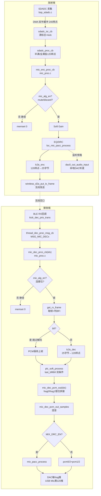

# AB5766 音频算法与数据流 面试题库（03）

> 本题库依赖 [00_项目基础与面试表达](../00_项目基础与面试表达.md) 和 [01_嵌入式架构与启动](../01_嵌入式架构与启动/AB5766_嵌入式架构与启动面试题库.md)。证据等级（E0–E3）、预编译库边界、表达边界不再重复。
>
> 写作原则同前：**假设你要用中文连续口头讲给面试官听，面试官看不到代码。** 路径行号给你自己定位用。

每题统一八段：① 面试官问题 ② 先说结论 ③ 大白话解释 ④ 项目证据 ⑤ 设计取舍 ⑥ 追问与回答 ⑦ 事实边界 ⑧ 面试收尾句。

---

## 〇、音频链路总图（先建脑内骨架）

> 口头讲法：发射端「采 → kick → 算法 → 编码 → 发」五步；接收端「收 → kick → 解码或PLC → 片段拼接 → 混音 → 输出」六步。两端的 kick 都是让 ISR 轻、把重活放到工作回调。

---

## 一、SDADC 采集与 DMA 双半缓冲

### Q3.1.1 SDADC 怎么采集音频？为什么用 DMA 双半缓冲？

**② 先说结论：**
SDADC 是 sigma-delta ADC，配 MIC 模式采单声道 48k。DMA 配成双半缓冲，整个缓冲 240 个样点（每半 120），半满和全满各触发一次中断。中断只清标志、判断是半满还是全满、kick 出去，重活全在工作回调里。双半缓冲让采集和前一段处理并行——收后半缓冲时，前半缓冲正在被处理。

**③ 大白话解释：**
麦的声音进 ADC 变成数字采样值，这些值要存起来给后面用。如果用 CPU 一个个读太慢也费电，所以用 DMA——硬件自动把 ADC 的采样值搬到内存缓冲里。这个缓冲是「双半缓冲」结构：整个缓冲 240 个样点，前 120 是前半、后 120 是后半。DMA 搬到一半（填满前 120）触发一次「半满中断」，搬到全部（填满 240）触发一次「全满中断」。所以每个采样周期产生两次中断，每次给后端 120 个样点——正好是一帧的量。双半缓冲的好处是：DMA 在搬后半缓冲的数据时，前半缓冲的 120 个样点可以被算法处理，采集和处理并行，不互相等。中断本身做得极轻，只判断这次是半满还是全满、清标志、然后 kick 一下把活儿派出去，真正干活在工作回调里。

**④ 项目证据：**
- DMA 大小：`bsp_sdadc.c` 的 `#define SDADC_DMA_SIZE (WIRELESS_MIC_SAMPLES_SELECT*2)` → 120×2 = 240 样点。
- 双中断：`sdadc_isr_cb()` 判断 `SDADC_FLAG_DMA_ALL_DONE` 或 `SDADC_FLAG_DMA_HALF_DONE`，各自清标志 + `sdadc_done_proc_kick()`。
- 工作回调：`sdadc_proc_cb(SDADC_DONE_TYPEDEF type)` 全满给 `&sdadc_buf[120]`、半满给 `sdadc_buf`，各调 `mic_enc_proc_cb(rbuf, 120)`。
- 配置：`bsp_sdadc_init()` 设 `SDADC_MODE_MIC`、`sample_rate = WIRELESS_MIC_SAMPLE_RATE_SELECT`（48k）、数字增益查 `dig_gain_tbl[MIC_DIG_GAIN]`、RMDC 去直流使能。
- 中断注册：`sdadc_pic_config(SDADC_REG, sdadc_isr_cb, 0, HALF_DONE|ALL_DONE, ENABLE)`。

**⑤ 设计取舍：**
DMA 双半缓冲省 CPU、采集与处理并行。代价是缓冲占内存、且半满/全满判断要正确——如果只配全满中断会浪费一半缓冲、降低一倍处理时间。120 样点对齐帧大小（一帧 120 样点）是刻意设计，让每次中断正好给一帧。

**⑥ 追问与回答：**
- 追问：240 样点是「样点数」还是「字节数」？
  - 答：是样点数。每个样点 16 位即 2 字节，所以缓冲字节数是 240×2=480 字节。DMA 配的是 `SDADC_DMA_SIZE-1` 个传输，模式 `DMA_DATA_MODE_16BITS`，所以是 240 个 16 位传输。这个「样点 vs 字节」 distinction 在调试时要分清，否则算缓冲大小会错。
- 追问：为什么半满给前 120、全满给后 120，不是反过来？
  - 答：因为 DMA 线性填充——先填满前半（0~119），半满中断时前 120 可用；继续填后半（120~239），全满中断时后 120 可用。然后 DMA 环回重填前半。所以半满→前半、全满→后半是自然顺序，配合双半缓冲无缝衔接。

**⑦ 事实边界：**
DMA 配置和中断是 E1；实际 ADC 精度/噪声 E3 待测。

**⑧ 面试收尾句：**
「SDADC 用 DMA 双半缓冲采 48k 单声道，整个缓冲 240 样点、半满全满各给 120 正好一帧，中断只清标志 kick、采集和处理并行，这是发射端音频链的起点。」

---

### Q3.1.2 SDADC 中断为什么做得这么轻？kick 是什么机制？

**② 先说结论：**
中断里只做三件极轻的事：存时间戳、清 DMA 标志、kick。kick 是把「该处理这一帧」这个任务派到一个轻量调度队列里，真正的编码和算法在工作回调（`sdadc_proc_cb` → `mic_enc_proc_cb`）里做。这样中断快速返回不堵住其他中断，重活在主循环/调度上下文里跑。

**③ 大白话解释：**
中断里干重活是大忌——如果在中断里跑 LC3S 编码（要几百微秒），期间所有同级或低级中断都不响应，系统卡顿。所以这里的中断只做「最快能做的事」：存个时间戳、清掉 DMA 的中断标志（不清的话会反复进中断）、然后 kick 一下——kick 就是发个消息说「有活儿来了，你安排处理一下」，具体的处理函数（`sdadc_proc_cb`）被调度到主循环或专用线程里跑。这和上一题的「ISR 与工作回调解耦」是同一个思想：中断只通知、不干活。重活在能被抢占、能被延后的上下文里跑，系统响应性才好。

**④ 项目证据：**
- 中断轻：`sdadc_isr_cb()` 只 `wl_save_tick1_time()` + 清标志 + `sdadc_done_proc_kick(SDADC_ALL_DONE/HALF_DONE)`，没有计算。
- kick 派发：`sdadc_done_proc_kick` 把任务投递给调度（在 `mic_enc_adc_dma_kick` → `bsp_sdadc_kick` 这条线），`mic_enc_proc_cb` 才是重活。
- 段放置：`sdadc_isr_cb` 在 `AT(.com_text.sdadc.isr)` 段，`sdadc_proc_cb` 在 `AT(.text.mic_emit.proc.sdadc)` 段——分离便于链接优化。

**⑤ 设计取舍：**
kick 解耦让中断短、重活可调度。代价是处理有微小延迟（kick 到实际执行有几微秒），但音频帧是 2.5ms 量级，这点延迟可忽略。另一代价是调度系统要可靠——如果 kick 发了但工作回调没跑，会丢帧。

**⑥ 追问与回答：**
- 追问：如果工作回调跑得比中断快还慢会怎样？
  - 答：如果一帧的处理时间超过下一帧到达间隔（2.5ms），会积压，最终丢帧或 kick 被覆盖。所以编码和算法有严格时间预算——`WIRELESS_MIC_ENC_MAX_US=600`，意味着编码必须在 600µs 内完成，远小于 2.5ms，留足余量。这是时间预算设计的意义。
- 追问：kick 用的是消息队列还是直接函数调用？
  - 答：从代码看是轻量调度事务（kick），最终触发 `mic_enc_proc_cb` 被调用。具体是消息队列还是其他调度机制，部分在 `os/` 调度层。接收端是明确的消息队列（`thread_dec_proc_msg_cb` 的 `MSG_MIC_DEC0/1`），发射端是 kick 事务。这是 E1（接收端）+ 部分调度内部（库/OS 边界）。

**⑦ 事实边界：**
中断和 kick 逻辑是 E1；底层调度实现部分在 OS 库。

**⑧ 面试收尾句：**
「中断只存时间戳清标志 kick，重活全在工作回调里，kick 把任务派给调度避免中断里跑长任务，靠的是 ISR 与工作回调解耦，时间预算 600µs 保证不积压。」

---

### Q3.1.3 SDADC 启动时为什么要丢掉前几帧？丢多少帧？

**② 先说结论：**
启动时丢前 7 帧（3+4）。`bsp_sdadc_discard_proc()` 在 `sdadc_discard_cnt < 3+4` 时返回真（静音丢弃），第 3 帧（7.5ms）时调 `sdadc_rmdc_restore()` 恢复正常 RMDC。丢帧是因为 ADC 刚启动时数据不稳定、去直流滤波器在收敛，前面几帧是脏数据。

**③ 大白话解释：**
ADC 刚开机的头几个毫秒，内部电路在稳定、去直流滤波器（RMDC）在收敛，这时候采到的样点不是真实音频——可能有直流偏移、瞬态。如果直接编码发出去，接收端会听到「噗」一声或爆音。所以启动时把前面几帧静音丢掉，等 ADC 稳定了再用。这里丢 7 帧，每帧 2.5ms（120 样点/48k），所以约 17.5ms 的启动丢弃。特别注意第 3 帧（7.5ms）时调 `sdadc_rmdc_restore`——这是把去直流滤波器从「收敛模式」切回「正常模式」，说明前 3 帧是让 RMDC 快速收敛，后 4 帧是等数据稳定。这是个分阶段的启动去噪。

**④ 项目证据：**
- 丢帧判断：`bsp_sdadc.c` 的 `bsp_sdadc_discard_proc()`，`if (sdadc_discard_cnt < 3+4) { sdadc_discard_cnt++; ... return true; }`。
- 分阶段恢复：`if (sdadc_discard_cnt == 3) { sdadc_rmdc_restore(); }`。
- 调用点：`mic_enc_proc_cb` 开头 `if (bsp_sdadc_discard_proc()) mute_flag = true;`——丢弃帧直接静音。
- 计数复位：`bsp_sdadc_kick()` 里 `sdadc_discard_cnt = 0`——每次启动 kick 都重新计数。

**⑤ 设计取舍：**
启动丢帧防爆音，代价是开机有 ~17.5ms 静音（用户基本无感）。分阶段（3 帧收敛 RMDC + 4 帧稳定）比一刀切更精细。阈值 3+4 是经验值，调试时可调。

**⑥ 追问与回答：**
- 追问：丢 7 帧够不够？怎么定的？
  - 答：这是经验值，3+4=7 帧 ≈17.5ms。一般 ADC 稳定在 10~20ms 量级，7 帧覆盖。如果实测还有启动杂音，可以加；如果实测早就稳了，可以减省延迟。这是 E3 可调优的参数。
- 追问：丢弃帧是静音还是不编码？
  - 答：是静音——`mute_flag=true` 让 PCM 清零，但后面的 `mic_alg_en` 分支仍会跑（如果连上了），编码也照做，只是编的是静音帧。所以不是「跳过编码」而是「编码静音」，接收端收到的是静音帧。这样保持链路时序不乱。

**⑦ 事实边界：**
丢帧逻辑是 E1；7 帧阈值是否足够是 E3 听感。

**⑧ 面试收尾句：**
「启动丢前 7 帧防爆音，前 3 帧让 RMDC 收敛、后 4 帧等稳定，丢弃帧静音但不跳过编码以保持时序，这是发射端启动去噪的分阶段设计。」

---

### Q3.1.4 SDADC 的数字增益是怎么配的？`dig_gain_tbl` 是什么？

**② 先说结论：**
数字增益用一张 37 项的查找表 `dig_gain_tbl`，按 `MIC_DIG_GAIN` 索引取一个增益系数，在 `sdadc_init` 里设进 ADC 的数字增益寄存器。系数从 1024（约 0dB）到 64610（约 +36dB）递增。用查找表而不是现算，是为了省运行时计算和保证增益曲线可控。

**③ 大白话解释：**
麦采进来的信号太小或太大都要调——这就是增益。增益分模拟增益（`MIC_ANA_GAIN`，硬件电路放大）和数字增益（`dig_gain`，数字域乘系数）。数字增益这里用一张表：37 个值，从 1024 一路涨到 64610。1024 大约是 0dB（不放大），64610 大约是 +36dB（放大 63 倍）。代码用 `MIC_DIG_GAIN` 这个索引去表里取对应系数设给 ADC。为什么用表不现算？因为增益曲线往往是定制的（非线性、按听觉平滑过渡），存成表既省算力又保证每次取值一致。表里相邻值的比值是 1.122 倍（约 1dB 步进），所以是每级约 1dB 的精细增益控制。

**④ 项目证据：**
- 增益表：`bsp_sdadc.c` 的 `static const u16 dig_gain_tbl[37]`，37 项。
- 索引配置：`sdadc_cfg_init.dig_gain = dig_gain_tbl[MIC_DIG_GAIN];`。
- 模拟增益：`sdadc_ana_cfg.ana_gain = MIC_ANA_GAIN;`（模拟域）。
- 表首项 1024（2^10，定点 0dB 参考）、末项 64610。

**⑤ 设计取舍：**
查找表省算力、增益曲线可控（定制非线性的话表最方便）。代价是表占 Flash（37×2=74 字节，可忽略），且改增益曲线要改表。37 项约 1dB 步进够精细。

**⑥ 追问与回答：**
- 追问：1024 为什么是 0dB？
  - 答：增益系数 1024 = 2^10，如果 ADC 用 Q10 定点（输出乘系数再右移 10 位），那 1024 就是乘 1，即 0dB。64610/1024 ≈ 63 ≈ 2^6 即 +36dB。这是定点增益的常见表示。
- 追问：模拟增益和数字增益有什么区别？先调哪个？
  - 答：模拟增益在硬件电路放大原始信号，噪声也放大但信噪比主要由模拟级决定；数字增益在数字域乘系数，不放大模拟噪声但会放大量化噪声。一般先尽量用模拟增益把信号拉到合适电平（信噪比最优），数字增益做精细微调。这是音频前端的增益分级原则。

**⑦ 事实边界：**
增益表和配置是 E1；1024 对应 0dB 的定点解释是推理（E1 推理）。

**⑧ 面试收尾句：**
「数字增益用 37 项查找表，1024 是 0dB、64610 约 +36dB，约 1dB 步进，用表省算力又保证增益曲线可控，模拟增益管信噪比、数字增益管微调，这是音频前端的增益分级。」

---

## 二、发射端编码链：静音门禁、Soft Gain、EQ/DRC、编码、发送

### Q3.2.1 `mic_enc_proc_cb` 的处理顺序是什么？为什么是这个顺序？

**② 先说结论：**
顺序是：① 判静音（mute 或启动丢帧 → 清零）② `mic_alg_en` 门控 → ③ Soft Gain → ④ EQ/DRC（PACC）→ ⑤ LC3S 编码 → ⑥ `wireless_d2a_put_tx_frame` 发送 → ⑦ 同步 tick → ⑧ DAC 监听旁路。顺序原则是「先增益、后频域处理、最后压缩、发送」。

**③ 大白话解释：**
发射端拿到 120 个 PCM 样点后，按固定流水线处理。第一步先看要不要静音——如果用户按了 mute 或者还在启动丢帧期，直接清零，后面流程照走但处理的是静音。第二步是 `mic_alg_en` 大门——没连上时这个位是 0，算法整个跳过（但编码和发送还做，保证链路时序）。连上后依次：Soft Gain 做带保护的数字增益（防削顶），然后 EQ/DRC 走硬件 PACC 做频域均衡和动态压缩，然后 LC3S 把 120 样点压成 25 字节，调 `wireless_d2a_put_tx_frame` 发出去。发送后还有个同步 tick 用于接收端对齐。最后 DAC 监听旁路——把处理后的 PCM 也送到本地 DAC，方便调试时直接听麦采集的声音。这个顺序「增益→频域→压缩→发送」是标准音频处理链，增益放最前是为了给后级合适电平，压缩放最后是因为要按码率打包。

**④ 项目证据：**
- 静音：`mic_enc_proc_cb` 开头 `bool mute_flag = mic_enc.mute_en; if(bsp_sdadc_discard_proc()) mute_flag=true;` → `if(mute_flag) memset(pcm, 0, samples*2);`。
- 算法门禁：`if(sys_cb.mic_alg_en) { ... 各种算法 ... }`。
- 算法顺序（门禁内）：`AINS4_32K` → `ECHO`(32K) → `src resample`(32K) → `MAX_POWER_DETECT` → `EQ_DRC` → `DNR_FRE` → `ECHO`(非32K) → `MAGIC` → `ROBOTIZATION` → `ROOM_REVERB` → `AGC` → `DUMP_HUART`。当前只开 `EQ_DRC`。
- 编码：`lc3s_enc((s16 *)pcm, mic_enc.buffer, WIRELESS_MIC_SAMPLES_SELECT)`。
- 发送：`wireless_d2a_put_tx_frame(mic_enc.buffer, WIRELESS_MIC_FRAME_SIZE)`。
- 同步：`wl_play_sync_tick1(WIRELESS_MIC_TX_INTERVAL*2/WIRELESS_MIC_COMB_NB, SAMPLE_RATE_48K)`。
- DAC 监听：`#if WIRELESS_MIC_DAC_OUT_EN` 块，`dac0_out_audio_input((u8 *)pcm, WIRELESS_MIC_SAMPLES_SELECT, 0)`。

**⑤ 设计取舍：**
固定流水线清晰、每级 `#if` 守卫便于开关。顺序符合音频处理原则。代价是顺序写死，要换顺序得改代码；好处是确定性，便于时间预算和调试。

**⑥ 追问与回答：**
- 追问：Soft Gain 和 EQ/DRC 顺序能换吗？
  - 答：一般增益在前、EQ/DRC 在后。因为增益把电平拉到合适范围，EQ/DRC 在合适电平下才能正确工作（DRC 的阈值是按电平设的，电平不对 DRC 行为会错）。换顺序可能导致 DRC 阈值失效。所以不能随便换。
- 追问：那些 `#if` 关闭的算法（ECHO/MAGIC/AGC 等）编译进去吗？
  - 答：不编译。每个算法调用都被 `#if XXX_EN` 守卫，`XXX_EN=0` 时预处理器直接删掉，不占 Flash、不占 RAM。这就是 `--gc-sections` 配合 `#if` 的好处——关闭的功能彻底移除。当前只编译 `EQ_DRC`（和 Soft Gain，Soft Gain 在 `mic_eq_drc_init` 里初始化）。

**⑦ 事实边界：**
流水线顺序是 E1；各算法开关是 E0（配置宏）。

**⑧ 面试收尾句：**
「发射端处理链是静音判别、算法门禁、Soft Gain、EQ/DRC、LC3S 编码、发送、同步 tick、DAC 监听，顺序按增益→频域→压缩→发送的音频原则定死，关闭的算法靠 #if 彻底移除不占资源。」

---

### Q3.2.2 `mic_alg_en` 这个门禁位的作用和生命周期是什么？

**② 先说结论：**
`mic_alg_en` 是发射端和接收端共用的算法总开关。连上时置 1、全断开清 0、退出模式清 0。它门控编码链（`mic_enc_proc_cb`）和解码链（`mic_dec_prco_cb`）里所有算法。没置位时编码链静音、解码链静音，但编解码和收发仍跑，保证链路时序不乱。

**③ 大白话解释：**
`mic_alg_en` 是「有没有麦在用」的标志。没连接时它为 0，意思是「现在没有活跃音频，别白费算力跑算法」。这时编码链会把 PCM 清零（静音）再编码发送——发的是静音帧，保持时序；解码链也清零——收到的数据不处理直接静音。连上时它置 1，算法真正开始跑。这个设计的好处是：没连接时省算力（算法不跑）、但链路时序不停（静音帧照发照收），一旦连上立即出声不会有时序错位。它的生命周期严格跟随连接——连上置位、全断开清零、退出模式清零。所以它是「连接驱动的算力门禁」。

**④ 项目证据：**
- 编码门禁：`mic_enc_proc_cb` 的 `if(sys_cb.mic_alg_en) { ...EQ/DRC... }`，门禁外是 memset 静音（隐含在 mute_flag 逻辑，非门禁时算法跳过但编码照做）。
- 解码门禁：`mic_dec_prco_cb` 的 `if(sys_cb.mic_alg_en) { ...解码+PLC... } else { memset(pcm,0,samples*2); }`。
- 置位：连接事件回调 `wireless_proc.c` CONNECTED 分支 `sys_cb.mic_alg_en = 1`（02 题库 Q2.4.1）。
- 清零：全断开 `if(connected_sta==0) mic_alg_en=0`、退出模式 `func_mic_emit_exit`。

**⑤ 设计取舍：**
门禁省算力、保持时序。代价是门禁位的置位/清零必须和连接状态严格同步——如果连上了但门禁没置位，会静音（无声 bug）；如果断了但门禁没清，会空跑算法费电。这是状态机和资源生命周期的同步点，要重点测。

**⑥ 追问与回答：**
- 追问：为什么没连接还要发静音帧，不直接停？
  - 答：保持链路时序。如果没连接就停发，接收端的时间基准会丢，重连后要重新同步有延迟。发静音帧让接收端始终有时间基准，重连即出声。这是「保持时序优于省这点发送功耗」的取舍——发送静音帧功耗极低。
- 追问：门禁位是全局变量，多个回调读它安全吗？
  - 答：读是原子的（单字节/单 word 读写基本原子），且它的变化频率低（只随连接变化），所以多回调读没问题。写只在连接事件和退出时发生，不在高频回调里。所以没有竞态风险。这是设计上就考虑了的。

**⑦ 事实边界：**
门禁逻辑是 E1；连接同步是 E3 待测时序点。

**⑧ 面试收尾句：**
「mic_alg_en 是连接驱动的算力门禁，没连静音省算力但链路时序不停，连上立即出声，它的置位清零必须和连接严格同步是重点测的时序点。」

---

### Q3.2.3 Soft Gain 是什么？为什么说「带保护」？

**② 先说结论：**
Soft Gain 是软件数字增益，在 EQ/DRC 之前对 PCM 做带限幅保护的增益调整。「带保护」指增益后有削顶保护——超过满量程（±32768）的样点被钳位到满量程，避免后级溢出产生爆音。它在 `mic_eq_drc_init` 里初始化（`soft_gain_init`），是发射端 EQ/DRC 模块的一部分。

**③ 大白话解释：**
Soft Gain 就是软件里把 PCM 样点乘个增益系数放大或缩小。麦采进来的信号电平不一定合适，可能偏小要放大、可能偏大要缩小。纯放大有个问题：如果放大后超过 16 位有符号数的范围（-32768~32767），就会溢出——溢出的样点值会突变（比如从大正数跳到大负数），变成刺耳爆音。所以「带保护」的增益会在放大后检查，超了就钳到满量程（clip），这样虽然削顶失真但不会爆音，削顶失真人耳能容忍，爆音不能。这是音频处理的「宁可削顶不要溢出」原则。Soft Gain 放在 EQ/DRC 前，是先给后级合适电平。它具体增益值和限幅实现细节部分在预编译库，我说外部行为：放大、限幅防溢出。

**④ 项目证据：**
- 初始化：`mic_eq_drc.c` 的 `mic_eq_drc_init` 里 `#if WIRELESS_MIC_SOFT_GAIN_EN` → `soft_gain_init();`。
- 配置开关：`WIRELESS_MIC_SOFT_GAIN_EN=1`（当前开启）。
- 在流水线位置：Soft Gain 在 EQ/DRC 之前（`mic_enc_proc_cb` 里增益类处理先于 `mic_eq_drc_audio_input`）——具体 Soft Gain 调用点在 `soft_gain` 模块内（预编译接口），由 `mic_eq_drc` 流程触发。
- 限幅保护：soft_gain 实现在预编译库，外部行为是带 clip 的增益。

**⑤ 设计取舍：**
软件增益灵活（可调系数）、带保护防溢出。代价是占 CPU（每样点乘法+比较），但 120 样点开销很小。相比纯模拟增益，软件增益可程序动态调、可做复杂限幅曲线。

**⑥ 追问与回答：**
- 追问：Soft Gain 和数字增益（`dig_gain_tbl`）有什么区别？
  - 答：`dig_gain_tbl` 是 ADC 硬件数字增益，在采集时就放大，设进寄存器，不动 CPU；Soft Gain 是软件增益，在 PCM 拿到后软件乘系数，占 CPU 但更灵活、可动态调、可带复杂限幅。一般硬件增益管粗调、Soft Gain 管细调和动态。
- 追问：限幅（clip）和压缩（DRC）有什么区别？
  - 答：限幅是硬钳——超过阈值直接截断，失真明显但简单；DRC 是软压缩——超过阈值按比例降低增益，失真小但更复杂。Soft Gain 的保护是硬限幅防溢出，EQ/DRC 里的 DRC 是软压缩管动态范围。两者层次不同：限幅是最后防线防溢出，DRC 是听感优化。

**⑦ 事实边界：**
配置和初始化是 E1/E0；Soft Gain 内部限幅实现是预编译库边界。

**⑧ 面试收尾句：**
「Soft Gain 是 EQ/DRC 前的软件增益带限幅保护，超满量程钳位防溢出爆音，宁可削顶不要溢出，和硬件数字增益分级——硬件管粗调、软件管细调和动态。」

---

### Q3.2.4 EQ/DRC 为什么走硬件 PACC？软硬分工是什么？

**② 先说结论：**
EQ/DRC 走硬件加速器 PACC（`loc_mic_pacc_process`），不占主 CPU。PACC 是芯片内的专用音频处理硬件，做频域均衡（EQ）和动态范围压缩（DRC）。软硬分工是：软件负责配置参数（`loc_mic_pacc_set_param`）和控制使能，硬件负责实际滤波计算。这样 120 样点的 EQ+DRC 在 160MHz 主频下只要 ~250µs+180µs，且不占 CPU。

**③ 大白话解释：**
EQ（均衡）和 DRC（动态压缩）是计算密集的——EQ 要做频域滤波（FFT/卷积），DRC 要逐样点算增益包络。如果纯软件跑，120 样点要占不少 CPU，可能挤占编解码和无线调度的预算。这颗芯片有个硬件加速器叫 PACC，专门做这类音频处理，软件把 PCM 喂给它、设好参数，它硬件算完返回结果，主 CPU 那段时间可以干别的。注释里写了耗时：EQ 约 250µs、DRC 约 180µs（@160MHz, 120样点），这个耗时是硬件处理的，主 CPU 在等 PACC 期间理论上能做别的（具体是否并行取决于 PACC 是否异步，从接口看是同步调用 `loc_mic_pacc_process(ptr, ptr, samples)`，但计算在硬件里）。软硬分工：软件管「设什么参数、什么时候调」，硬件管「怎么算」。这比纯软件快得多、省 CPU。

**④ 项目证据：**
- 硬件调用：`mic_eq_drc.c` 的 `mic_eq_drc_audio_input` 里 `loc_mic_pacc_process(ptr, ptr, samples)`（输入输出同地址）。
- 初始化三步：`mic_eq_drc_init` → `loc_mic_pacc_init()` → `loc_mic_pacc_set_param()` → `loc_mic_pacc_enable()`。
- 使能判断：`if(wireless_mic_eq_drc_cfg.eq_drc_en && samples != 0)` 才调 PACC。
- 耗时注释：`mic_eq_drc.c` 文件头「主频160M，120个点，EQ和DRC算法时间分别为250us和180us左右」。
- 关闭：`mic_eq_drc_exit` → `loc_mic_pacc_exit()`。

**⑤ 设计取舍：**
硬件加速省 CPU、快。代价是 PACC 内部是黑盒（预编译/硬件），参数格式、滤波器系数要按厂商接口设，不能自己改算法；且 PACC 是共享资源（发射端 EQ/DRC 和接收端 Mix DRC 都用它），要避免冲突。输入输出同地址（原地处理）省缓冲。

**⑥ 追问与回答：**
- 追问：PACC 是同步还是异步？主 CPU 等的时候能干别的吗？
  - 答：从接口 `loc_mic_pacc_process(ptr, ptr, samples)` 同步调用看，主 CPU 调用后会等结果返回。PACC 内部硬件计算期间，主 CPU 是否能做别的取决于 PACC 是否支持异步/中断通知。从代码看是同步等待模式（调用完直接拿到结果），所以那段等待时间主 CPU 基本在等。但即便同步，硬件算比软件算快得多（µs 级 vs 可能 ms 级），仍划算。这是 E1（接口）+ 硬件内部细节库边界。
- 追问：发射端 EQ/DRC 和接收端 Mix DRC 都用 PACC，会冲突吗？
  - 答：发射端用 `loc_mic_pacc_process`、接收端用 `mix_pacc_process`，是 PACC 的不同功能/通道。同一时刻只有一个角色在跑（双角色不并发），所以不冲突。但要注意初始化和退出要配对，别让上一个角色的 PACC 状态残留影响下一个。这是双角色资源管理要注意的。

**⑦ 事实边界：**
接口和耗时注释是 E1；PACC 内部硬件实现是库/硬件边界。

**⑧ 面试收尾句：**
「EQ/DRC 走硬件 PACC 省主 CPU，软件管参数配置硬件管计算，120点 EQ+DRC 约 430µs，软硬分工清晰，代价是 PACC 黑盒和双角色共享要管好初始化退出。」

---

### Q3.2.5 LC3S 编码的输入输出是什么？时间预算多少？

**② 先说结论：**
LC3S 编码输入 120 个 16 位单声道 PCM 样点（48k），输出 25 字节压缩帧。码率 80 kbps（`cfg_lc3s_bitrate=80000`，由 25 字节帧大小决定）。编码时间预算 `WIRELESS_MIC_ENC_MAX_US=600`，即每帧编码必须在 600µs 内完成。

**③ 大白话解释：**
LC3S 是低复杂度音频编码器（LC3 的简单变体）。它把 120 个 PCM 样点（2.5ms 的 48k 音频）压成 25 字节。算码率：一帧 25 字节、一帧 2.5ms，所以每秒 25×(1000/2.5)×8 = 80000 bit/s = 80kbps。这个码率由帧大小决定——代码里 `cfg_lc3s_bitrate` 按 `WIRELESS_MIC_FRAME_SIZE` 选：25 字节→80kbps、30 字节→96kbps。时间预算 600µs 是硬约束：编码必须在 600µs 内完成，远小于帧间隔 2.5ms（2500µs），留足余量给其他处理和调度。如果编码超 600µs，会挤占预算、可能丢帧。这个预算是设计时给编解码库的「合同」——库要在这时间内完成。

**④ 项目证据：**
- 输入输出：`mic_enc_proc_cb` 的 `lc3s_enc((s16 *)pcm, mic_enc.buffer, WIRELESS_MIC_SAMPLES_SELECT)`——pcm 进、mic_enc.buffer 出。
- 帧大小：`#define MIC_ENC_BUFFER_SIZE WIRELESS_MIC_FRAME_SIZE`（25）。
- 码率配置：`lc3s.c` 的 `cfg_lc3s_bitrate = 80000`（`WIRELESS_MIC_FRAME_SIZE==25` 分支）、`cfg_lc3s_frame_len = WIRELESS_MIC_FRAME_SIZE`。
- 时间预算：`config_ab5766_le_mic.h` 的 `WIRELESS_MIC_ENC_MAX_US 600`、`WIRELESS_MIC_DEC_MAX_US 900`。
- 编码初始化：`mic_emit_init` 的 `lc3s_enc_init(WIRELESS_MIC_SAMPLE_RATE_SELECT, WIRELESS_MIC_SAMPLES_SELECT)`。

**⑤ 设计取舍：**
25 字节/80kbps 是音质和带宽的平衡——更小帧更省带宽但音质降，更大帧音质好但占空口。600µs 预算给库明确约束。代价是 LC3S 内部是预编译库，不能改算法，只能调外部参数（采样率、样点数、码率）。

**⑥ 追问与回答：**
- 追问：80kbps 单声道音质怎么样？
  - 答：80kbps 对单声道语音/一般音乐是中等偏上质量，语音几乎透明、音乐有轻微损失但可接受。LC3 系列在低码率效率高，80kbps 单声道接近 CD 音质的感知透明度边界。实际听感 E3 验证。
- 追问：如果帧大小从 25 改成 30（96kbps），链路要改什么？
  - 答：改 `WIRELESS_MIC_FRAME_SIZE=30`，`cfg_lc3s_bitrate` 自动走 96000 分支。但要检查无线缓冲（`MIC_RX_BUFFER_SIZE`）、`FRAME_SIZE×LINK_NB×RETRY_NB` 是否仍满足约束（02 题库讲的 72byte 疑点）、TX 包大小、`mic_dec.frame[MIC_DEC_BUFFER_SIZE]`。一改全改，数字咬死。

**⑦ 事实边界：**
输入输出和预算是 E1/E0；LC3S 内部算法是预编译库边界；80kbps 音质是 E3 听感。

**⑧ 面试收尾句：**
「LC3S 输入 120 样点输出 25 字节、80kbps、编码预算 600µs，码率由帧大小决定、预算给库硬约束，改帧大小要顺着改整条链路的缓冲和包大小，数字咬死。」

---

### Q3.2.6 DAC 监听旁路是干什么的？对正式音频有影响吗？

**② 先说结论：**
DAC 监听旁路（`WIRELESS_MIC_DAC_OUT_EN`）把发射端处理后的 PCM 也送到本地 DAC 输出，方便调试时直接听麦采集处理后的声音。它在编码发送之后执行，不影响无线发送的正式音频，只是额外拷贝一路到 DAC。

**③ 大白话解释：**
发射端正常是把音频编码发出去给接收端，发射端自己没喇叭不需要出声。但调试时你想知道「麦采进来经过算法处理后的声音对不对」，光看波形不够，想直接听。DAC 监听旁路就是给发射端也接个 DAC 输出，把 EQ/DRC 处理后的 PCM 复制一路送到本地 DAC，插耳机就能听。因为它是编码发送之后才执行的，所以不影响发出去的正式音频——它只是「旁路听一听」。注意它会占用 DAC 资源（发射端和接收端都可能用 DAC，双角色不并发所以不冲突），且会让 MIC 进高压模式（`config_extra.h` 里 `WIRELESS_MIC_DAC_OUT_EN` 时 `MIC_VDD_LVMODE=0`，因为同时开 ADC 和 DAC 要高压）。

**④ 项目证据：**
- 旁路调用：`mic_enc_proc_cb` 末尾 `#if WIRELESS_MIC_DAC_OUT_EN` 块 → `dac0_out_audio_input((u8 *)pcm, WIRELESS_MIC_SAMPLES_SELECT, 0)`。
- 同步：块里还有 `mic_enc.dac_cnt` 计数，每 50 次调一次 `dac0_play_sync_fifocnt(50, 30)` 做本地 DAC 同步。
- 高压模式约束：`config_extra.h` 的 `#if WIRELESS_MIC_DAC_OUT_EN #undef MIC_VDD_LVMODE #define MIC_VDD_LVMODE 0`（注释「同时开adc和dac必须配高压模式」）。
- 初始化：`mic_emit_init` 里 `dac0_out_init(0, WIRELESS_MIC_SAMPLES_SELECT, 0)`。

**⑤ 设计取舍：**
旁路便于调试、不影响正式音频。代价是占 DAC 资源、强制高压模式（功耗略增）、每 50 帧做一次同步占点 CPU。正式产品如果不需要监听可以关掉省功耗。

**⑥ 追问与回答：**
- 追问：旁路听的 PCM 是 EQ/DRC 后的还是编码后的？
  - 答：是 EQ/DRC 后、编码前的 PCM（`pcm` 指针在编码后仍指向处理后的 PCM，旁路用的就是这个）。所以听的是「算法处理后、压缩前」的声音，最能反映算法效果。不是解码回来的（那要接收端才有）。
- 追问：本地 DAC 同步和接收端 DAC 同步是一回事吗？
  - 答：原理一样（都靠调 `dac0_play_sync_fifocnt` 调采样率相位），但参数和频率不同——发射端旁路每 50 帧同步一次（粗调），接收端每帧（每 frag）同步（细调），因为接收端是正式输出要更准。发射端旁路只是调试听个响，粗同步够。

**⑦ 事实边界：**
旁路逻辑是 E1；高压模式约束是 E0/E1。

**⑧ 面试收尾句：**
「DAC 监听旁路把发射端算法处理后的 PCM 额外送本地 DAC 方便调试听，在编码发送后执行不影响正式音频，代价是占 DAC 和强制高压模式，正式产品可关掉省功耗。」

---

## 三、48k/120/25byte 参数关系与编译期约束

### Q3.3.1 48k、120 样点、25 字节、80kbps 这几个数字怎么咬合？

**② 先说结论：**
采样率 48k、每帧 120 样点 → 帧时长 120/48000 = 2.5ms；LC3S 压成 25 字节 → 码率 25×8/(2.5ms) = 80kbps；2.5ms 帧时长 ÷ 1.25ms（BLE 时隙）= 2，所以 `DFU_TX_INTERVAL=2`。这些数字层层咬合，改一个要推整条链。

**③ 大白话解释：**
这几个数字不是独立的，是互相算出来的。从采样率 48k 出发：每秒 48000 个样点。一帧 120 样点，所以一帧时长是 120/48000 = 0.0025 秒 = 2.5ms。LC3S 把这 2.5ms 的音频压成 25 字节，所以码率 = 25字节×8位/2.5ms = 80000 bit/s = 80kbps。再往下，BLE 的基本时隙是 1.25ms，2.5ms 正好是 2 个时隙，所以单帧发送间隔 `DFU_TX_INTERVAL=2`。而 TX 间隔 `TX_INTERVAL=4`（5ms），所以一个 TX 周期发 4/2=2 个帧（组合帧数 COMB_NB）。校验用的单链路间隔宏 `WIRELESS_CON_INTERVAL=60`（60×1.25ms=75ms）是 TX 间隔的整数倍；运行时双链路聚合后 `cfg_wireless_con_interval=WIRELESS_CON_INTERVAL*LINK_NB=60*2=120`（120×1.25ms=150ms）——也就是 00 文档速查表里的「连接间隔 150ms」，面试口径统一说 150ms。所以从 48k 和 120 出发，2.5ms、80kbps、DFU=2、COMB=2、各种整数倍约束全部推出来。改 120 样点为别的值，后面全要重算，且要满足一堆取模为零的编译期约束（下一题讲）。

**④ 项目证据：**
- 采样率/样点：`WIRELESS_MIC_SAMPLE_RATE_SELECT=48k`、`WIRELESS_MIC_SAMPLES_SELECT=120`。
- 帧大小/码率：`WIRELESS_MIC_FRAME_SIZE=25`、`lc3s.c` 的 `cfg_lc3s_bitrate=80000`。
- 派生间隔：`config_extra.h` 的 `FRAME_SIZE_MIN=60`（48k，1.25ms）、`WIRELESS_MIC_DFU_TX_INTERVAL=120/60=2`、`WIRELESS_MIC_COMB_NB=4/2=2`。
- 连接间隔：单链路校验宏 `WIRELESS_CON_INTERVAL=60`（VERS==7，60×1.25ms=75ms）；运行时双链路聚合 `cfg_wireless_con_interval=60*2=120`（120×1.25ms=150ms），见 [wireless.c](../../modules/wireless/wireless.c) 第 13 行。
- 整数倍约束：`config_extra.h` 的 `#if (SAMPLES*COMB_NB)%(TX_INTERVAL*FRAME_SIZE_MIN)!=0 #error`、`#if CON_INTERVAL%TX_INTERVAL!=0 #error`。

**⑤ 设计取舍：**
固定参数咬合让时序确定、缓冲可控。代价是不灵活——改一个参数要推全链且满足取模约束。好处是编译期就挡住不合法配置（`#error`），不会让不咬合的配置编进去。

**⑥ 追问与回答：**
- 追问：为什么是 120 样点不是 60 或 240？
  - 答：120 样点 = 2.5ms 是 LC3S 帧大小的常用档（LC3 标准帧有 2.5ms/5ms/10ms）。60 样点（1.25ms）太小、编码效率低（帧头开销占比大）；240 样点（5ms）延迟大。120 是延迟和效率的折中。且 120 是 60（FRAME_SIZE_MIN）的整数倍，满足约束。
- 追问：80kbps 是 LC3S 的固定码率还是可配？
  - 答：由帧大小决定。代码里 `cfg_lc3s_bitrate` 按 `WIRELESS_MIC_FRAME_SIZE` 分支：25→80kbps、30→96kbps。所以码率间接由帧大小定，不是任意配。要改码率得改帧大小，又会影响缓冲和包大小。

**⑦ 事实边界：**
参数关系是 E0/E1（配置和派生宏）；LC3S 是否支持其他帧大小是库边界。

**⑧ 面试收尾句：**
「48k 和 120 样点推出 2.5ms 帧时长、25 字节推出 80kbps、2.5ms 推出 DFU=2、再推 COMB=2，全链数字咬死，改一个要推全部且满足编译期取模约束，这是这套音频时序的核心耦合。」

---

### Q3.3.2 `config_extra.h` 里那些 `#error` 约束在防什么？

**② 先说结论：**
`config_extra.h` 用一组编译期 `#error` 约束保证时序参数咬合：样点数必须 ≥`FRAME_SIZE_MIN` 且是它的整数倍；`TX_INTERVAL` 必须是 `DFU_TX_INTERVAL` 整数倍；`(SAMPLES*COMB_NB)%(TX_INTERVAL*FRAME_SIZE_MIN)==0`；`CON_INTERVAL%TX_INTERVAL==0`。这些 `#error` 在编译期挡住不合法配置，防止运行时出现帧对不齐、缓冲错位。

**③ 大白话解释：**
音频时序参数如果不咬合会出大问题——比如样点数不是 1.25ms 整数倍，那帧边界和 BLE 时隙对不齐，收发会错位。`config_extra.h` 用预处理器在编译时就检查这些约束，不满足直接 `#error` 编译失败，让你当场知道配置错了，而不是编进去跑出莫名问题再调。具体几条：第一，样点数（120）必须 ≥`FRAME_SIZE_MIN`（60，1.25ms 最小帧）且能整除——保证一帧是 1.25ms 整数倍；第二，`TX_INTERVAL`（4）必须是 `DFU_TX_INTERVAL`（2）整数倍——保证 TX 周期里能整数个单帧；第三，`(SAMPLES*COMB_NB)%(TX_INTERVAL*FRAME_SIZE_MIN)==0` 即 `(120*2)%(4*60)=240%240==0`——保证组合帧样点数和 TX 周期样点数对齐；第四，`CON_INTERVAL%TX_INTERVAL==0` 即 `60%4==0`——保证连接间隔是 TX 间隔整数倍。当前配置全部满足，所以能编译。这些约束是「编译期护栏」，把时序正确性前移到编译阶段。

**④ 项目证据：**
- 样点约束：`config_extra.h` 的 `#if WIRELESS_MIC_SAMPLES_SELECT < FRAME_SIZE_MIN #error`、`#if (WIRELESS_MIC_SAMPLES_SELECT % FRAME_SIZE_MIN) != 0 #error`。
- TX 间隔约束：`#if WIRELESS_MIC_TX_INTERVAL == 0 || (TX_INTERVAL%DFU_TX_INTERVAL) != 0 #error`。
- 组合帧对齐：`#if (SAMPLES*COMB_NB)%(TX_INTERVAL*FRAME_SIZE_MIN) != 0 #error`。
- 连接间隔：`#if WIRELESS_CON_INTERVAL%WIRELESS_MIC_TX_INTERVAL != 0 #error`。
- 采样率合法性：`WIRELESS_MIC_SAMPLE_RATE_SELECT` 不在 8/16/24/32/48k 之列 → `#error`。

**⑤ 设计取舍：**
编译期 `#error` 把错误前移，比运行时崩或错位好调试得多。代价是配置不灵活（必须满足所有约束才能编）。但这是优点——不合法配置根本进不了镜像。

**⑥ 追问与回答：**
- 追问：如果我想改帧大小到 60 样点，这些约束会怎样？
  - 答：60≥60 满足样点约束；60%60==0 满足；DFU=60/60=1；如果 TX_INTERVAL 还是 4，TX%DFU=4%1==0 满足；COMB=4/1=4；(60*4)%(4*60)=240%240==0 满足；CON_INTERVAL%TX==60%4==0 满足。所以 60 样点能编。但帧大小 25 字节对应的码率/缓冲要单独查，且 60 样点（1.25ms）可能编码效率低。这是 E0 可推。
- 追问：这些 `#error` 会不会挡住合法但没预见的配置？
  - 答：会。`#error` 是严格约束，只允许预定义的咬合关系。如果有个合法的新组合没被这些约束覆盖，会被误挡。但通常时序咬合就这几种模式，严格约束利大于弊。真要扩展得改约束逻辑。

**⑦ 事实边界：**
约束是 E0（配置宏）。

**⑧ 面试收尾句：**
「config_extra.h 用一组编译期 #error 把时序咬合约束前移到编译阶段，样点、TX、组合帧、连接间隔四个整数倍检查，不合法配置根本编不进去，这是编译期护栏的设计。」

---

## 四、接收端解码、BFI、PLC

### Q3.4.1 接收端一帧的解码流程是什么？BFI 怎么影响流程？

**② 先说结论：**
`mic_dec_prco_cb(idx)` 流程：① `mic_alg_en` 门控，没置位直接 memset 静音 ② 查连接位 `ble_con_get_status() & BIT(idx)`，没连这路跳过 ③ `wireless_d2a_get_rx_frame` 取帧并得到 bfi ④ `if(!bfi)` 才 `lc3s_dec` 解码，bfi 时跳过解码、PCM 保持 ⑤ 不管解不解码都 `plc_soft_process(pcm, samples, last_bfi[idx]||bfi, idx)` ⑥ 更新 `last_bfi[idx]=bfi` ⑦ `mic_dec_pcm_out(idx)` 拼接混音输出。

**③ 大白话解释：**
接收端拿到一路麦（由 idx 区分）的数据后，先看「算法开了没」（`mic_alg_en`），没开就静音清零——和发射端一样是连接驱动的门禁。开了的话看「这路麦连上没」（`ble_con_get_status` 查连接位图，idx 那位是 1 才处理），没连这路就不处理（等单边断开逻辑在拼接处处理）。连上了就取帧：`get_rx_frame` 从 ping-pong 缓冲拿出这一帧的数据，同时告诉你这帧坏不坏（bfi）。关键分支在这：如果 bfi 是 0（好帧），调 `lc3s_dec` 把 25 字节解回 120 样点 PCM；如果 bfi 是 1（坏帧），**不解码**，PCM 缓冲保持上一帧的数据。然后**不管解没解码都做 PLC**——PLC 的触发条件是 `last_bfi[idx] || bfi`，也就是「上一帧也坏」或「这帧坏」都触发补偿。最后更新 `last_bfi` 记住这帧的 bfi 给下帧用，再进拼接混音输出。所以 bfi 决定「解不解码」，但 PLC 是每帧都跑的。

**④ 项目证据：**
- 门禁：`mic_dec_prco_cb` 的 `if(sys_cb.mic_alg_en) { ... } else { memset(pcm,0,samples*2); }`。
- 连接位：`u8 con_status = ble_con_get_status(); if(con_status & BIT(idx)) { ... }`。
- 取帧+判 bfi：`bool bfi = wireless_d2a_get_rx_frame(idx, mic_dec.frame, WIRELESS_MIC_FRAME_SIZE);`。
- 解码分支：`if(!bfi) { lc3s_dec(mic_dec.frame, pcm, samples, idx); }`。
- PLC 每帧：`plc_soft_process(pcm, samples, mic_dec.last_bfi[idx]||bfi, idx);`。
- 更新 last_bfi：`mic_dec.last_bfi[idx] = bfi;`。
- 输出：`mic_dec_pcm_out(idx);`。

**⑤ 设计取舍：**
bfi 时不解码省算力、PCM 保持历史；PLC 每帧跑保证过渡平滑。`last_bfi||bfi` 双条件比单 `bfi` 更稳——避免单帧 bfi 抖动导致补偿时有时无。代价是 PLC 每帧占 CPU，但 PLC 预算在 `DEC_MAX_US=900` 内。

**⑥ 追问与回答：**
- 追问：bfi 时 PCM「保持上一帧」，是上一帧解码后的还是 PLC 后的？
  - 答：PCM 缓冲 `mic_dec.pcm[idx].buf` 存的是上一帧 PLC 处理后的结果。因为 PLC 是原地处理（`plc_soft_process(pcm, ...)` 修改 pcm），所以缓冲里是 PLC 后的数据。bfi 时不解码，缓冲自然保留上帧 PLC 结果。然后这帧的 PLC 会基于这个历史做补偿。
- 追问：为什么用 `last_bfi||bfi` 而不是只用 `bfi`？
  - 答：防止「单帧 bfi 抖动」。假设上一帧好（last_bfi=0）、这帧坏（bfi=1）：只用 bfi 会触发 PLC，对。但假设上一帧坏（last_bfi=1）、这帧好（bfi=0）：只用 bfi 不触发 PLC，可这帧是「坏帧后第一帧好」，直接用可能和上帧补偿不连续、有跳变。用 `last_bfi||bfi` 这种情况也触发 PLC 做过渡平滑。所以双条件是处理「坏帧前后的过渡」，比单条件鲁棒。

**⑦ 事实边界：**
解码流程是 E1；PLC 内部是预编译库边界。

**⑧ 面试收尾句：**
「接收端解码流程是门禁、查连接、取帧判 bfi、好帧才解码坏帧保持、每帧都做 PLC 用 last_bfi‖bfi 双条件防抖动、最后拼接输出，bfi 决定解不解码但 PLC 每帧都跑。」

---

### Q3.4.2 PLC 是什么？它的触发条件为什么是双条件 `last_bfi||bfi`？

**② 先说结论：**
PLC（Packet Loss Concealment，丢包隐藏）在坏帧时用历史音频生成补偿 PCM，避免静音或突变爆音。触发条件是 `last_bfi[idx] || bfi`——上一帧坏或这帧坏都触发。双条件是为了处理「坏帧前后的过渡」，避免单帧 bfi 判断导致补偿抖动和拼接处不连续。

**③ 大白话解释：**
无线会丢包，丢了的帧（bfi=1）如果直接静音，听感是「咔哒」断音；如果直接重复上一帧，听感是「卡带」机械重复。PLC 是个智能补偿：它分析前面的好音频，提取基音（音高）和波形特征，生成一段「听起来像继续往下说」的补偿音频填补丢的帧，听感平滑。这里 PLC 的触发是 `last_bfi||bfi`，意思是只要上一帧或当前帧有一个是坏的，就做 PLC。为什么要看上一帧？考虑三种情况：① 这帧坏（bfi=1）→ 触发 PLC 补偿这帧，对；② 上一帧坏、这帧好（last_bfi=1,bfi=0）→ 只看 bfi 不会触发，但这帧是「坏帧后恢复的第一帧好帧」，直接用解码结果可能和上一帧的补偿衔接不上、有跳变，所以也要 PLC 做过渡平滑；③ 两帧都好 → 不触发，正常解码。所以双条件比单 bfi 多覆盖了「恢复过渡」这一种，听感更平滑。PLC 是预编译库，外部我只能讲接口（`plc_soft_process`）和触发条件，内部基音估计和波形拼接算法不讲。

**④ 项目证据：**
- PLC 调用：`mic_dec_prco_cb` 的 `plc_soft_process(pcm, samples, mic_dec.last_bfi[idx]||bfi, idx);`。
- 双条件：第三参数 `mic_dec.last_bfi[idx]||bfi`。
- 双通道状态：`plc_soft.c` 的 `static plc_proc_t m_st[2]`，每路麦独立 PLC 状态。
- 初始化：`adapter_alg_init` 调 `plc_soft_init(0, 120, 48k)` 和 `plc_soft_init(1, 120, 48k)`。
- 参数按采样率：`plc_soft_init` 按 `sample_rate` 设 pitch_min/max、historylen、corrlen 等基音估计参数。
- 退出：`plc_soft_exit(idx)` 设 `enable=false` + `delay_5ms(2)` 等一帧时间确保 disable 时这帧已处理完。

**⑤ 设计取舍：**
PLC 每帧跑、双条件触发，换来平滑听感。代价是每帧 PLC 占 CPU（在 900µs 解码预算内）、且 PLC 状态按路独立（双倍状态内存 `m_st[2]`）。`plc_soft_exit` 的 `delay_5ms(2)`（等 10ms 约一帧+）是为了安全关闭 PLC 不和正在处理的帧冲突。

**⑥ 追问与回答：**
- 追问：PLC 能补偿连续多少帧丢包？
  - 答：PLC 对短时丢包（几帧）效果好，连续丢包多了基音估计会失真、补偿质量下降，听感会变「机器人声」或断续。这是 PLC 的固有局限——它适合偶发丢包，不适合长时间断连。长时间断连靠重连而非 PLC。具体连续补偿上限在 PLC 库内部，E3 测丢包听感能评估。
- 追问：`plc_soft_init` 里 `sample_rate >= SAMPLE_RATE_16K` 用 `PITCH_MIN_8K` 参数，参数名带 8K 却用于高采样率，这怎么回事？
  - 答：这是个观察到的现象。代码里 `if(sample_rate >= SAMPLE_RATE_16K)` 用带 `_8K` 后缀的基音参数（`PITCH_MIN_8K` 等），`else` 用不带后缀的。参数命名带 8K 但条件是 ≥16k，可能这些参数是为高采样率标定的但保留了 8K 命名，或库内部有采样率换算。具体语义在预编译 PLC 库内，我标注为「观察到的高采样率参数选择」，不臆测命名含义。这是诚实标注的边界。

**⑦ 事实边界：**
触发条件和接口是 E1；PLC 内部算法是预编译库边界；高采样率参数命名疑点是待确认边界。

**⑧ 面试收尾句：**
「PLC 在坏帧用历史音频智能补偿避免断音爆音，触发用 last_bfi‖bfi 双条件覆盖坏帧和恢复过渡两种情况防抖动，每路独立状态，连续丢包多了 PLC 也救不了要靠重连。」

---

### Q3.4.3 解码线程是怎么调度的？为什么用消息队列？

**② 先说结论：**
BLE RX 完成后 kick 出 `MSG_MIC_DEC0`/`MSG_MIC_DEC1` 消息，`thread_dec_proc_msg_cb` 收到消息按 idx 调 `mic_dec_prco_cb(0)` 或 `(1)`。用消息队列是因为解码耗时长（预算 900µs），不能在 BLE 回调里直接做（会堵住 BLE 调度），用消息把解码派到解码线程/主循环上下文异步执行。

**③ 大白话解释：**
BLE 收完一帧数据要解码，但解码要 900µs，如果在 BLE 接收回调里直接解码，那 900µs 里 BLE 协议栈调度被堵住，可能影响其他链路收发。所以接收回调里只 kick 一个消息「该解码了」，消息进队列，解码线程（`thread_dec_proc_msg_cb`）从队列取消息执行解码。这样 BLE 回调瞬间返回、解码异步在另一个上下文跑。两路麦各有自己的消息（`MSG_MIC_DEC0`、`MSG_MIC_DEC1`），独立调度、互不阻塞——麦 A 解码时麦 B 的消息能排队。这就是「重活异步化」的解耦。上一题讲 02 题库的 `kick_dec_prio_trans` 就是投递这个解码消息，两端呼应。

**④ 项目证据：**
- 消息回调：`thread_dec.c` 的 `thread_dec_proc_msg_cb(u32 msg)`，`case MSG_MIC_DEC0: mic_dec_prco_cb(0); case MSG_MIC_DEC1: mic_dec_prco_cb(1);`。
- 消息来源：`wireless_txrx_single.c` 的 `wireless_d2a_set_rxdec_cb` 调 `kick_dec_prio_trans(idx)`（02 题库 Q2.5.1）。
- 两路独立：`MSG_MIC_DEC0` 和 `MSG_MIC_DEC1` 两条消息。

**⑤ 设计取舍：**
消息队列异步化解码、不堵 BLE。代价是解码有调度延迟（微秒级，可忽略）、且消息队列要可靠（丢了消息就丢帧）。两路独立消息支持并行调度。

**⑥ 追问与回答：**
- 追问：如果解码比消息到达还慢，消息会积压吗？
  - 答：会。如果解码连续超预算，消息队列积压，新消息可能覆盖旧消息（取决于队列实现）导致丢帧。但解码预算 900µs 远小于帧间隔 2.5ms，正常不积压。极端环境（CPU 被高频中断抢占）才可能积压。这是 E3 长稳测试要观察的。
- 追问：解码消息和发射端的 kick 是同一套调度吗？
  - 答：发射端 SDADC kick 和接收端解码消息是不同的调度路径——发射端是 kick 事务、接收端是消息队列（`thread_dec_proc_msg_cb` 明确处理消息）。但底层可能共用同一套轻量调度器。具体调度器实现在 `os/` 层，部分是预编译/库。这是 E1（消息回调）+ 部分 OS 边界。

**⑦ 事实边界：**
消息回调是 E1；底层调度器部分在 OS 库。

**⑧ 面试收尾句：**
「解码用消息队列异步化——BLE 回调只 kick MSG_MIC_DECx 消息、解码线程取消息执行 mic_dec_prco_cb，避免 900µs 解码堵住 BLE 调度，两路独立消息互不阻塞，这是重活异步解耦。」

---

## 五、双麦片段拼接与混音

### Q3.5.1 双麦数据为什么要「片段拼接」？frag0/frag1 是什么？

**② 先说结论：**
两路麦到达有时间差（`ble_single_link_duration_get()`），接收端把一帧 120 样点按时间差切成两段：frag0（前 `frag_samples[0]` 个样点）和 frag1（后 `frag_samples[1]` 个）。拼接时 frag0 用「通道0前半 + 通道1后半」、frag1 用「通道0后半 + 通道1前半」——这种错位拼接让两路麦在时间上对齐。两路都活时 frag0+frag1 凑满一帧输出。

**③ 大白话解释：**
这是整个音频链最巧妙的设计。一拖二两台麦不是同时发的——它们各有各的连接、TX 时刻错开，所以到接收端有时间差 `delta`。如果直接把两路 PCM 简单相加混音，相当于把「麦A现在的话」和「麦B `delta` 之前的话」混一起，时间没对齐。怎么对齐？接收端按 `delta` 把一帧 120 样点切成两段：frag0 是前 `n` 个样点（`n` 由 delta 转样点数定）、frag1 是后 `120-n` 个。然后错位拼接：处理 frag0 时，通道0用前 `n` 个样点（麦A当前帧的前段），通道1用**后** `n` 个样点（麦B上一帧的后段）——因为麦B慢了 delta，它当前帧的后段正好对应麦A当前帧的前段那个时间。处理 frag1 时反过来：通道0用后 `120-n`（麦A当前帧后段），通道1用前 `120-n`（麦B当前帧前段）。这样两路在时间上就对齐了。`frag_samples[0]` 由 `ble_single_link_duration_get()` 转成样点数对 120 取余得来，奇数还会 +1 做 WORD 对齐。这是用错位拼接实现时间对齐，很巧妙。

**④ 项目证据：**
- 分割点计算：`adapter_init` 的 `int temp_frag = mic_dec_us_trans_samples(ble_single_link_duration_get(), 48k) % 120;` `frag_samples[0] = (temp_frag%2 ? temp_frag+1 : temp_frag);`（WORD对齐）、`frag_samples[1] = 120 - frag_samples[0];`。
- 时间转样点：`mic_dec_us_trans_samples` 48k 分支 `samples_duration=21`（约 20.8µs/样点），返回 `us/21`。
- frag0 拼接：`mic_dec_pcm_out_frag0` 的 `pcm0 = &pcm[0].buf[0]; pcm1 = &pcm[1].buf[0] + (120-frag0_samples);` → 处理 `frag0_samples` 个。
- frag1 拼接：`mic_dec_pcm_out_frag1` 的 `pcm0 = &pcm[0].buf[0] + frag0_samples; pcm1 = &pcm[1].buf[0];` → 处理 `frag1_samples` 个。
- 两路活时：`mic_dec_pcm_out` 的 idx==0 先 frag0 置 done_flag、idx==1 时 frag1。

**⑤ 设计取舍：**
错位拼接实现时间对齐、降延迟（不用等两路整帧凑齐）。代价是逻辑复杂、frag 分割点依赖 `ble_single_link_duration_get` 准确。WORD 对齐（奇数+1）是为了内存访问对齐，代价是 frag_samples 有 ±1 样点误差（听感无感）。

**⑥ 追问与回答：**
- 追问：`ble_single_link_duration_get()` 返回的是什么？
  - 答：从名字和用途看，是单链路的时间偏移（两路麦到达的时间差），单位微秒。它由协议栈在连接建立时测得/协商。具体怎么测在协议栈内（库边界）。`mic_dec_us_trans_samples` 把它转成样点数（÷21µs）。
- 追问：如果两路麦完全同步（delta=0）会怎样？
  - 答：`temp_frag = 0%120 = 0`，`frag_samples[0]=0`，`frag_samples[1]=120`。frag0 处理 0 个样点（空）、frag1 处理 120 个。frag1 里 `pcm0=&buf[0]+0`、`pcm1=&buf[0]`——两路都从帧头开始，等价于正常对齐混音。所以 delta=0 退化成简单混音，逻辑自洽。

**⑦ 事实边界：**
拼接逻辑是 E1；`ble_single_link_duration_get` 内部是协议栈库边界。

**⑧ 面试收尾句：**
「双麦错位拼接是这套链最巧妙的设计——按两路到达时间差把帧切 frag0/frag1，frag0 用通道0前段+通道1后段、frag1 反过来，错位实现对齐，降延迟不用等整帧凑齐，delta=0 退化成简单混音逻辑自洽。」

---

### Q3.5.2 frag0_done_flag 这个标志在拼接里起什么作用？

**② 先说结论：**
`frag0_done_flag` 标记「frag0 这一段已经处理输出了」。idx==0 处理完 frag0 后置 1，等 idx==1 来了才处理 frag1 并清 0。这保证 frag0 和 frag1 按顺序输出，且两路都到位才凑满一帧。如果只有一路活，会强制把另一段也处理掉避免卡住。

**③ 大白话解释：**
一帧要 frag0 + frag1 两段凑满，但这两段不是同时来的——frag0 在 idx==0（通道0）解码后处理、frag1 在 idx==1（通道1）解码后处理。`frag0_done_flag` 就是协调这个顺序的标志。流程是：通道0解码完 → 处理 frag0（输出前段）→ 置 flag=1。通道1解码完 → 看 flag 是 1 吗？是就处理 frag1（输出后段）→ 清 flag=0。这样 frag0 先出、frag1 后出，顺序对。但如果通道1一直不来（单边断开），flag 一直 1、frag1 不处理，输出就卡在前段。所以有补偿：单边断开时（`con_status & ~BIT(idx) == 0` 意思是除了自己没别的路活），强制把另一段也处理掉、清 flag，不让输出卡住。所以 `frag0_done_flag` 是「双路协同 + 单路兜底」的标志。

**④ 项目证据：**
- idx==0：`mic_dec_pcm_out` 的 `if(frag0_done_flag == 0) { mic_dec_pcm_out_frag0(idx, 0); frag0_done_flag = 1; }`，然后单边断开检查 `if((con_status & ~BIT(idx)) == 0) { mic_dec_pcm_out_frag1(idx, 0); frag0_done_flag = 0; }`。
- idx==1：`if(frag0_done_flag) { mic_dec_pcm_out_frag1(idx, 0); frag0_done_flag = 0; }`，单边断开 `if((con_status & ~BIT(idx)) == 0) { mic_dec_pcm_out_frag0(idx, 0); frag0_done_flag = 1; }`。
- flag 是 `mic_dec.frag0_done_flag`，bool 类型。

**⑤ 设计取舍：**
flag 协调双路顺序 + 单路兜底，保证不卡。代价是逻辑分支多、要正确处理「两路都在」「只有0」「只有1」三种情况。`~BIT(idx)` 技巧：idx==0 时 `~BIT(0)` 排除自己看通道1活不活，活就等、不活就自己兜底。

**⑥ 追问与回答：**
- 追问：如果两路几乎同时解码完，flag 会有竞态吗？
  - 答：`mic_dec_prco_cb(0)` 和 `(1)` 是通过消息队列分别调度的，单核顺序执行，不会真正同时进 `mic_dec_pcm_out`。一个跑完另一个才跑，flag 是普通变量顺序访问，无竞态。如果是多核或可抢占才要保护，这里单核消息调度不需要。
- 追问：单边断开兜底处理的 frag 用谁的 PCM？
  - 答：看代码——idx==0 单边断开处理 frag1 时，`mic_dec_pcm_out_frag1` 里 `pcm0=&pcm[0].buf[0]+frag0_samples`、`pcm1=&pcm[1].buf[0]`。通道1断开时 `pcm[1].buf` 是历史/清零数据（`mic_dec_reset` 清零过）。所以单边时混音里断开那路是静音/历史，活的那路正常。这就是「单边断开只用活路」的实现。

**⑦ 事实边界：**
flag 逻辑是 E1。

**⑧ 面试收尾句：**
「frag0_done_flag 是双路协同加单路兜底的标志——通道0处理frag0置位、通道1处理frag1清位，单边断开时强制处理另一段避免输出卡住，单核消息调度无竞态。」

---

### Q3.5.3 混音怎么做？Mix DRC 和简单平均有什么区别？

**② 先说结论：**
凑满一帧后进 `mic_dec_pcm_out_samples` 混音。开了 `ADAPTER_MIX_DRC_EN` 走 `mix_pacc_process`（硬件 PACC 做混音+DRC），没开走简单平均 `pcm0[i]/2 + pcm1[i]/2`。混音结果进 obuf，每 frag 推一次 DAC，obuf_off 累积满 120 样点推一次 USB Mic。

**③ 大白话解释：**
两路麦的 PCM 要混成一路输出。有两种混法：简单平均就是把两路样点相加除 2（`pcm0/2+pcm1/2`），等价于两路等权混合、总音量不超单路最大值，简单但没动态控制。Mix DRC 是用硬件 PACC 做混音的同时做动态范围压缩——不只是相加，还根据信号电平动态调增益，避免两路同时大音量时削顶、同时小音量时太轻。当前开了 `ADAPTER_MIX_DRC_EN=1`，走 Mix DRC，音质和动态更好。混音结果写进输出缓冲 obuf，然后输出粒度分两种：每个 frag（半帧或更小）就推一次给 DAC（DAC 实时出声、低延迟），但 USB Mic 要等 obuf_off 累积满 120 样点（一整帧）才推一次（USB 是块传输、按帧走）。所以 DAC 和 USB Mic 输出粒度不同，各有各的延迟特性。

**④ 项目证据：**
- Mix DRC：`mic_dec_pcm_out_samples` 的 `#if ADAPTER_MIX_DRC_EN mix_drc_audio_input(pcm0, pcm1, obuf+obuf_off, samples);`。
- 简单平均：`#else for(i...) obuf[i+obuf_off] = pcm0[i]/2 + pcm1[i]/2;`。
- Mix DRC 实现：`mic_eq_drc.c` 的 `mix_drc_audio_input` → `mix_pacc_process(output, pcm0, pcm1, samples)`。
- DAC 每 frag：`#if ADAPTER_DAC_OUTPUT_EN dac0_out_audio_input(obuf+obuf_off, samples, 0);`。
- USB Mic 满帧：`mic_dec.obuf_off += samples; if(obuf_off == 120) { obuf_off=0; usb_mic_in_audio_input(obuf, 120, 0, 0); }`。
- Mix DRC 耗时：`mic_eq_drc.c` 文件头「MIX_DRC 120点约 180us」。

**⑤ 设计取舍：**
Mix DRC 音质好、动态控制好，但占 PACC 硬件和 ~180µs；简单平均零开销但音质一般、无动态控制。DAC 每 frag 低延迟、USB 满帧按块。代价是 Mix DRC 是硬件黑盒、和发射端 EQ/DRC 共享 PACC 要管好。

**⑥ 追问与回答：**
- 追问：简单平均 `pcm0/2+pcm1/2` 为什么除 2？
  - 答：防两路相加溢出。两路都是 16 位，直接相加可能超 16 位范围溢出。除 2 保证和不超单路满量程，安全但音量降 6dB（两路等权各贡献一半）。Mix DRC 不简单除 2，而是动态控制所以音量更合理。这是「安全除2」vs「动态混音」的区别。
- 追问：为什么 DAC 每 frag 推、USB 满帧推？
  - 答：DAC 是实时数模转换，越早推延迟越低，所以每 frag（甚至更小粒度）就推，最小化延迟。USB Mic 是 USB 音频块传输，USB 端点按帧（120 样点）要数据，所以攒满一帧推一次匹配 USB 块节奏。两种输出端特性不同，粒度不同。这是按输出端特性定粒度。

**⑦ 事实边界：**
混音逻辑是 E1；`mix_pacc_process` 内部是硬件库边界。

**⑧ 面试收尾句：**
「混音开了 Mix DRC 走硬件 PACC 动态混音、没开走 pcm0/2+pcm1/2 安全平均，输出粒度按端特性定——DAC 每 frag 推低延迟、USB Mic 攒满 120 推一次匹配块传输，Mix DRC 比平均音质好但占 PACC。」

---

## 六、DAC 输出与 FIFO 同步

### Q3.6.1 DAC 输出怎么工作？为什么要做 FIFO 同步？

**② 先说结论：**
DAC 用 SDDAC 的 aubuf（音频缓冲）DMA 输出，`dac0_out_audio_input` 把 PCM kick 进 aubuf DMA。FIFO 同步是因为发射端和接收端时钟独立（不同晶振），长期会有采样率微差导致缓冲溢出或欠载，所以 `dac0_play_sync_fifocnt` 监测 aubuf FIFO 深度、微调 DAC 采样率相位（`DACSRC0PHAI`）补偿时钟差。

**③ 大白话解释：**
接收端混好音的 PCM 要送 DAC 出声。DAC 有个音频缓冲（aubuf），用 DMA 把 PCM 喂给 DAC 硬件转换。问题来了：发射端的麦用发射端晶振采样、接收端 DAC 用接收端晶振播放，两个晶振不可能完全一样频率——哪怕差几个 ppm，长期累积就会出问题：如果接收端 DAC 稍快，它消费 PCM 比接收快，缓冲会欠载（空了，断音）；如果 DAC 稍慢，缓冲会溢出（满了，丢数据）。所以要做 FIFO 同步：监测 aubuf 的 FIFO 深度，FIFO 浅了（消费快）就稍微降低 DAC 采样率（慢点消费）、FIFO 深了（消费慢）就稍微提高采样率（快点消费），动态微调让消费速率匹配接收速率。微调靠改 `DACSRC0PHAI`（DAC 采样率相位寄存器），每次调万分之一级别，听感无感但能消除长期漂移。这就是异步采样率转换（ASRC）的简化版。

**④ 项目证据：**
- 输出调用：`dac0_out.c` 的 `dac0_out_audio_input` → `sddac_aubuf_dma_kick(SDDAC_AUBUF0, ptr, samples)` + `sddac_aubuf_dma_kick_w4_done`。
- FIFO 计数：`dac0_get_fifocnt` 的 `aufifo0_cnt = AUBUF0FIFOCNT >> 18`（注释「双声道除2」）。
- 同步算法：`dac0_play_sync_fifocnt(high_thr, low_thr)`——`fifo_cnt <= low_thr` 减速（`dacsrcphi_nomal - tiny*(low-fifo)`）、`>= high_thr` 加速（`+ tiny*(fifo-high)`）。
- 微调粒度：`dacsrcphi_tiny = dacsrcphi_nomal/100000`（万分之一）。
- 写寄存器：`if(dacsrcphi_nomal != (DACSRC0PHAI&0xffffff)) DACSRC0PHAI = dacsrcphi_nomal | 1<<31;`。

**⑤ 设计取舍：**
FIFO 同步消除晶振漂移、听感无感。代价是同步逻辑占点 CPU（每 frag 调一次）、且启动期 FIFO 不稳不能马上调（`mic_dec_dac_sync_proc` 的 `fifo_sta<=10` 不调）。微调万分之一保证不引入可闻失真。

**⑥ 追问与回答：**
- 追问：为什么 `AUBUF0FIFOCNT >> 18`？
  - 答：FIFO 计数寄存器的高位存深度，>>18 是把高位取出来。注释说「双声道除2」——因为 FIFO 计的是双声道样点对，除 2 得单声道样点数便于和阈值比较。这是寄存器位域定义，E1。
- 追问：如果时钟差很大，微调跟不上怎么办？
  - 答：万分之一微调适合小漂移（几十 ppm 内）。如果时钟差很大（不同标称频率或严重偏移），微调跟不上，会出现周期性溢出/欠载导致规律性断音。这种要靠重采样（SRC）做较大比率转换，或换同源时钟。当前方案适合「同标称频率、晶振微差」场景。

**⑦ 事实边界：**
同步算法是 E1；DAC 硬件寄存器细节是驱动/硬件边界。

**⑧ 面试收尾句：**
「DAC 用 aubuf DMA 输出，FIFO 同步监测深度微调 DACSRC0PHAI 采样率相位补偿收发晶振微差，浅了减速深了加速、万分之一微调听感无感，启动期 fifo_sta≤10 不调等稳定，这是异步时钟漂移补偿。」

---

### Q3.6.2 `mic_dec_dac_sync_proc` 的同步阈值是怎么算的？

**② 先说结论：**
同步只在 `sync_idx` 对应的那路触发（`idx == mic_dec.sync_idx`），且启动期 `fifo_sta <= 10` 不调。正常同步时 `samples = cfg_wireless_d2a_dec_us*48/1000`，`high_thr = samples+12`、`low_thr = samples+6`，调 `dac0_play_sync_fifocnt(high, low)`。阈值围绕「解码耗时对应的样点数」定，留 6~12 样点的容差带。

**③ 大白话解释：**
FIFO 同步不是每路每次都调——只在 `sync_idx`（主同步路）解码时调，且有个启动期保护：`fifo_sta` 计数 ≤10 时直接递增返回不调（等 FIFO 稳定积累 10 次再开始调，避免开机 FIFO 空就误调）。正常同步时算阈值：`samples = cfg_wireless_d2a_dec_us*48/1000`——把解码耗时（微秒）转成样点数（×48k/1000），这是「解码这段时间对应多少样点」的基准。`high_thr = samples+12`、`low_thr = samples+6`——在基准上下留 6~12 样点的容差带。FIFO 深度落在这个带内不调，超出才加速或减速。这个容差带避免频繁微调（抖动），只在明显偏离时才纠正。`sync_idx` 机制保证只用一路做同步基准，避免两路都调互相干扰。

**④ 项目证据：**
- 同步路：`mic_dec_prco_cb` 末尾 `if(idx == mic_dec.sync_idx) mic_dec_dac_sync_proc();`。
- sync_idx 设置：`mic_dec_dac_fifo_get(u8 idx)` 的 `mic_dec.sync_idx = idx;`。
- 启动期：`mic_dec_dac_sync_proc` 的 `if(mic_dec.fifo_sta <= 10) { fifo_sta++; return; }`。
- 阈值计算：`uint samples = cfg_wireless_d2a_dec_us*48/1000; high_thr = samples+12; low_thr = samples+6;`。
- 触发频率：`mic_dec_dac_fifo_get` 由 BLE 回调（`mic_dec_dac_dma_kick` 相关）调，取 FIFO 计数供下次同步用。

**⑤ 设计取舍：**
基准+容差带避免频繁微调抖动。启动期保护防误调。单路同步防互相干扰。代价是阈值和启动期是经验值，不同环境可能要调。

**⑥ 追问与回答：**
- 追问：`cfg_wireless_d2a_dec_us` 是什么？
  - 答：从用途看是「解码一帧的耗时」（微秒），运行时变量。`samples = dec_us*48/1000` 把它转成「这耗时对应多少 48k 样点」。它可能是实测或配置的解码耗时。具体赋值在无线初始化/协议栈，部分是库/运行时变量。这是 E1（用法）+ 部分运行时来源待确认。
- 追问：为什么容差带是 6~12 样点？
  - 答：经验值。带太窄会频繁微调导致采样率抖动（可能引入可闻失真）；带太宽会容忍较大漂移导致周期性溢出。6~12 样点（约 125~250µs@48k）是个折中。这是可调参数，E3 长稳测试能优化。

**⑦ 事实边界：**
同步逻辑是 E1；`cfg_wireless_d2a_dec_us` 来源部分待确认。

**⑧ 面试收尾句：**
「DAC 同步只在 sync_idx 路触发、启动期 fifo_sta≤10 不调，阈值围绕解码耗时样点数 samples±6~12 容差带，落带内不调超出才纠正避免抖动，单路同步防干扰，阈值是经验值 E3 可优化。」

---

### Q3.6.3 发射端本地 DAC 监听的同步和接收端 DAC 输出的同步有什么不同？

**② 先说结论：**
都是调 `dac0_play_sync_fifocnt` 调采样率相位，但频率和阈值不同：发射端监听旁路每 50 帧调一次（`dac_cnt>50`）、阈值 `(50, 30)`，粗同步；接收端每 frag 调一次、阈值围绕解码耗时 `samples+12/+6`，细同步。发射端旁路是调试听个响用粗同步，接收端是正式输出用细同步。

**③ 大白话解释：**
两处都用同一套 DAC 同步机制（调 `DACSRC0PHAI`），但精度和频率差很多。发射端那个 DAC 监听旁路，因为是调试用的「听个响」，不需要很准，所以每 50 帧才同步一次、阈值设固定值 (50, 30)，粗同步够听。接收端是正式音频输出，要给用户听、可能还要录，必须准，所以每处理一个 frag 就同步一次、阈值根据实际解码耗时动态算（`samples+12/+6`），细同步。这体现了「按重要性分配精度」——调试路粗调省 CPU、正式路细调保质量。

**④ 项目证据：**
- 发射端旁路同步：`mic_enc_proc_cb` 的 `mic_enc.dac_cnt++; if(dac_cnt>50) { dac_cnt=0; dac0_play_sync_fifocnt(50, 30); }`。
- 接收端同步：`mic_dec_dac_sync_proc` 每 frag（每路解码）调一次，阈值动态 `samples+12/+6`。
- 共用函数：`dac0_play_sync_fifocnt(high, low)`。

**⑤ 设计取舍：**
精度按重要性分配，省 CPU 又保质量。代价是两套阈值要分别调好，且发射端旁路粗同步可能在长稳下累积漂移（但调试听不关键）。

**⑥ 追问与回答：**
- 追问：发射端旁路每 50 帧同步，50 帧间隔会不会太久导致漂移？
  - 答：50 帧 = 50×2.5ms = 125ms 同步一次。如果晶振漂移大，125ms 内可能漂出容差带导致短暂偏差，但旁路是调试听响，偏差听不太出。正式产品如果保留旁路且要求高，可以缩短间隔。这是「调试路可接受粗」的取舍。
- 追问：能不能发射端和接收端用同一套细同步？
  - 答：能，但发射端旁路没必要那么细（浪费 CPU），且发射端没有「解码耗时样点数」这个基准（它不解码），所以用固定阈值 (50,30) 简单。按场景定精度更合理。

**⑦ 事实边界：**
两处同步是 E1。

**⑧ 面试收尾句：**
「两处 DAC 同步同机制不同精度——发射端旁路每 50 帧粗同步固定阈值是调试听响、接收端每 frag 细同步动态阈值是正式输出，按重要性分配精度省 CPU 又保质量。」

---

## 七、算法门禁、资源装载与初始化

### Q3.7.1 发射端和接收端的初始化分别做了什么？为什么要分 init 和 reset？

**② 先说结论：**
发射端 `mic_emit_init` 做开机初始化：清结构体、LC3S 编码 init、EQ/DRC init（含 PACC+Soft Gain）、DAC init、SDADC init。`mic_emit_reset` 做断开重置：SDADC exit、无线命令 reset、清结构体、DAC exit。接收端 `adapter_init`/`adapter_reset` 类似。分 init/reset 是因为开机只 init 一次、断连重连反复 reset，reset 比 init 轻量（不重新初始化所有外设，只清状态）。

**③ 大白话解释：**
初始化分两个层次。`init` 是「开机/进模式」做一次的完整初始化——把所有结构体清零、编解码器 init、EQ/DRC 硬件 init、DAC 外设 init、SDADC 采集 init，相当于「搭好整条链」。`reset` 是「断连后重置」做的轻量重置——关掉 SDADC、清无线命令状态、清结构体、关 DAC，相当于「把链清干净准备下次连」。为什么不每次都 init？因为 init 要重新初始化外设硬件（DAC 上电、PACC 配参数），慢且费功耗；断连重连频繁，用轻量 reset 清状态就够了，下次连上再该 init 的 init。所以 init 是重的一次性搭链、reset 是轻的反复清状态。这是个分层生命周期设计。

**④ 项目证据：**
- 发射端 init：`mic_emit_init` → `memset(&mic_enc,0)`、`lc3s_enc_init`、`mic_eq_drc_init`（PACC+soft_gain）、`dac0_out_init`、`bsp_sdadc_init`。
- 发射端 reset：`mic_emit_reset` → `bsp_sdadc_exit`、`wireless_cmd_reset(0)`、`memset(&mic_enc,0)`、`dac0_out_exit`。
- 接收端 init：`adapter_init` → `adapter_alg_init`（plc_soft_init×2）、`memset(&mic_dec,0)`、frag 计算、`lc3s_dec_init`、`mix_drc_init`、`dac0_out_init`。
- 接收端 reset：`adapter_reset(idx, con_sta)` → `mic_dec_reset(idx)`（清last_bfi+pcm）、`plc_soft_exit(idx)`、`wireless_cmd_reset(idx)`、`m_lc3s_dec_exit(idx)`；`con_sta==0` 时 `dac0_out_exit`。

**⑤ 设计取舍：**
分层 init/reset 平衡完整初始化和频繁重置的效率。代价是两套逻辑要保持一致——reset 清掉的下次 init/连接事件要重新建好，否则状态残留出 bug。`adapter_reset` 的 `con_sta==0` 才关 DAC 就是一拖二「断一路留一路」的体现。

**⑥ 追问与回答：**
- 追问：`adapter_reset` 为什么 `con_sta==0` 才关 DAC？
  - 答：一拖二断开一路时 `con_sta != 0`（还有路活），DAC 不能关（活的那路还在用）。只有全断开 `con_sta==0` 才关 DAC 释放资源。和 02 题库 Q2.4.2 的 `connected_sta==0` 才清 `mic_alg_en` 一个道理——引用计数式释放。
- 追问：reset 后重连，哪些状态要重新 init？
  - 答：reset 关了 SDADC/DAC、退了 PLC/LC3S 解码，重连的 CONNECTED 事件会重新拉时钟、置 mic_alg_en，但 SDADC/DAC/编解码的重新 init 哪里做？从 `mic_emit_init`/`adapter_init` 是进模式时调的看，重连（不退出模式）可能靠连接事件 + 部分自动恢复，或者 reset 后下次进模式才 init。这个「重连不退出模式时的重新 init 路径」是个值得追的细节，我没有完全确认每条路径，标注为待查。

**⑦ 事实边界：**
init/reset 逻辑是 E1；重连重新 init 的完整路径部分待确认。

**⑧ 面试收尾句：**
「init 是开机一次性重初始化搭整条链、reset 是断连轻量重置清状态，分层平衡效率和完整性，reset 的 con_sta==0 才关 DAC 是一拖二引用计数释放，重连重新 init 的完整路径我标注待查不臆测。」

---

### Q3.7.2 `mic_dec_reset` 和 `adapter_reset` 什么时候调？清了什么？

**② 先说结论：**
断开时 `adapter_reset(idx, con_sta)` 被调。它先 `mic_dec_reset(idx)` 清这路的 `last_bfi[idx]=0` 和 PCM 缓冲清零，再 `plc_soft_exit(idx)` 退 PLC、`wireless_cmd_reset(idx)` 清无线命令、`m_lc3s_dec_exit(idx)` 退解码器。全断开（`con_sta==0`）再关 DAC。清的是「这一路的解码状态」，为下次重连干净起点。

**③ 大白话解释：**
某路麦断开了，它之前累积的解码状态要清掉——`last_bfi`、PCM 缓冲里残留的音频、PLC 状态机、LC3S 解码器内部状态、无线命令队列。不清的话下次重连，残留状态会和新数据对不上，可能爆音或错位。`mic_dec_reset` 是清外面的（last_bfi、pcm buf），`adapter_reset` 再清里面的（PLC、LC3S 解码器、无线命令）。如果这路是最后一路（全断开），连 DAC 也关了省电。所以断开 = 清这一路全部状态，给重连一个干净起点。这是状态机和资源生命周期的一部分。

**④ 项目证据：**
- `mic_dec_reset(idx)`：`mic_dec.last_bfi[idx] = 0; memset(mic_dec.pcm[idx].buf, 0, MIC_DEC_OBUF_SIZE);`。
- `adapter_reset(idx, con_sta)`：调 `mic_dec_reset(idx)` + `plc_soft_exit(idx)` + `wireless_cmd_reset(idx)` + `m_lc3s_dec_exit(idx)`；`if(con_sta==0) { obuf_off=0; dac0_out_exit(); }`。
- 调用时机：断开事件处理（02 题库 Q2.4.2 的 DISCONNECT 分支链）。

**⑤ 设计取舍：**
断开清状态保证重连干净。代价是清得要全——漏清一个状态就会重连出问题。`plc_soft_exit` 的 `delay_5ms(2)` 等一帧就是为了安全退出 PLC 不和正在处理的帧冲突。

**⑥ 追问与回答：**
- 追问：为什么 `m_lc3s_dec_exit` 每路单独退？
  - 答：因为两路麦各有独立的 LC3S 解码器实例（`lc3s_dec(..., idx)` 带 idx），每路状态独立，所以退出也按 idx 单独退，不影响另一路。这是一拖二「每路独立」的体现。
- 追问：`obuf_off` 为什么全断开才清？
  - 答：`obuf_off` 是输出缓冲的累积偏移，两路共享（混音输出是两路合并的）。断开一路不能清（另一路还在用），全断开才清归零，下次从头开始累积。这是共享状态的处理。

**⑦ 事实边界：**
reset 逻辑是 E1。

**⑧ 面试收尾句：**
「断开调 adapter_reset 清这一路全部解码状态——外面 mic_dec_reset 清 last_bfi 和 PCM、里面退 PLC 和 LC3S 解码器、清无线命令，全断开才清共享的 obuf_off 和关 DAC，给重连干净起点，每路独立退是一拖二的体现。」

---

### Q3.7.3 算法门禁 `mic_alg_en` 没置位时，链路在干什么？

**② 先说结论：**
没连上时 `mic_alg_en=0`：发射端 `mic_enc_proc_cb` 跳过所有算法（EQ/DRC 等），但仍编码（编静音或原始 PCM）发送；接收端 `mic_dec_prco_cb` 直接 memset PCM 清零，不解码不 PLC，但仍调 `mic_dec_pcm_out`（输出静音）。所以门禁关的是「算法算力」，不是「链路时序」——链路一直跑、数据照流，只是没连上时算法不算、输出静音。

**③ 大白话解释：**
门禁位 `mic_alg_en` 控制的是「要不要算」，不是「要不要传」。没连上时它为 0：发射端那边，SDADC 还在采、中断还在 kick、`mic_enc_proc_cb` 还在调，但 `if(mic_alg_en)` 里的 EQ/DRC/各种算法全跳过——不过 LC3S 编码在门禁外面（看代码编码在 `if(mic_alg_en)` 块之后），所以编码照做，编的是没经算法的 PCM（可能静音也可能原始）、照发出去。接收端那边，`mic_dec_prco_cb` 进 `else` 分支直接 `memset(pcm,0)` 清零——不取帧、不解码、不 PLC，输出静音。所以没连上时：链路时序不停（中断、kick、编码、收发都跑），只是算法不算、输出静音。这样连上瞬间置位门禁，算法立即跟上、出声，没有时序重建延迟。这是「保持时序、按需算力」的设计。

**④ 项目证据：**
- 发射端：`mic_enc_proc_cb` 的 `if(sys_cb.mic_alg_en) { ...算法... }`——算法在门禁内；但 `lc3s_enc` 和 `wireless_d2a_put_tx_frame` 在门禁块**之后**（277-378 行结构），编码发送不受门禁。
- 接收端：`mic_dec_prco_cb` 的 `if(mic_alg_en) { ... } else { memset(pcm,0,samples*2); }`——门禁关时清零；但 `mic_dec_pcm_out(idx)` 在 if-else 之后（586 行），输出仍调（输出静音）。
- 注意：接收端 else 分支不取帧不解码，直接清零再拼接输出静音。

**⑤ 设计取舍：**
门禁按需算力省 CPU、保持时序无重建延迟。代价是没连上时仍占部分 CPU（中断、编码、收发），但比跑全部算法省。设计上把「时序」和「算力」解耦——时序一直跑、算力按需。

**⑥ 追问与回答：**
- 追问：发射端没连上还编码发送，不浪费电吗？
  - 答：占一部分，但编码 25 字节静音帧开销小（600µs 预算内、静音帧可能更快），且保持接收端时序基准。完全停发的话接收端失同步、重连慢。权衡是「小开销换时序稳定」。如果极致省电可以加「深度空闲停发」模式，但要处理重同步。
- 追问：接收端 else 分支不取帧，那 BLE 收的数据丢了吗？
  - 答：BLE RX 回调仍把数据放进 ping-pong 缓冲（那套逻辑在 `wireless_txrx_single.c`，不受 `mic_alg_en` 影响），只是 `mic_dec_prco_cb` 不取不处理。缓冲里的数据会被下次覆盖或 kick 清理。所以数据没「丢」在总线，只是没被解码处理。门禁管的是解码处理，不管接收缓冲。

**⑦ 事实边界：**
门禁逻辑是 E1。

**⑧ 面试收尾句：**
「mic_alg_en 门禁关的是算法算力不是链路时序——没连上时算法跳过、接收端静音清零，但中断编码收发输出都照跑保持时序，连上置位立即出声无重建延迟，把时序和算力解耦是这套设计的关键。」

---

## 八、场景题与故障定位

### Q3.8.1 场景：设备「有杂音/爆音」，你怎么分层定位？

**② 先说结论：**
按音频链分段 + 按杂音特征分类。先听杂音类型：启动「噗」声→启动丢帧不够；周期性断音→FIFO 同步失败/时钟漂移；丢包咯哒→PLC 不够/丢包率高；连续爆音→增益过高削顶或 DAC 溢出。再按链查：采集（ADC 增益/RMDC）→ 算法（EQ/DRC 参数/Soft Gain 限幅）→ 编解码（LC3S 码率/解码错误）→ 输出（DAC FIFO/采样率）。

**③ 大白话解释：**
「杂音爆音」太笼统，先分类再定位。第一种，开机「噗」一声然后正常——这是启动瞬态，启动丢帧（前 7 帧）不够，ADC 还没稳就出声，调大 `bsp_sdadc_discard_proc` 的 3+4 阈值。第二种，规律性「断断续续」——这是 FIFO 同步问题，收发时钟漂移、FIFO 周期性溢出/欠载，查 `dac0_play_sync_fifocnt` 阈值和 `cfg_wireless_d2a_dec_us` 基准，可能要重采样。第三种，偶发「咯哒」——这是丢包，PLC 没补好或丢包率太高，查 PER/BFI 计数、PLC 触发，可能要加重传或改 PLC 参数。第四种，大音量时「滋滋」连续爆音——这是削顶，增益太高（Soft Gain 或数字增益或模拟增益）让信号超满量程，查增益链、降增益或改限幅。定位时用 DAC 监听旁路分段：旁路有杂音→问题在采集或算法（发射端），旁路没杂音但接收端有→问题在无线或接收端。这样一层层收窄。

**④ 项目证据：**
- 启动丢帧：`bsp_sdadc_discard_proc` 的 `3+4` 阈值、`sdadc_rmdc_restore`。
- FIFO 同步：`dac0_play_sync_fifocnt`、`mic_dec_dac_sync_proc` 的阈值和启动期。
- 丢包/PLC：`mic_dec_prco_cb` 的 bfi/PLC、`wireless_dump_proc` 的 PER（02 题库 Q2.7.1）。
- 增益链：`dig_gain_tbl`（数字）、`MIC_ANA_GAIN`（模拟）、`soft_gain`（软件）、`mic_eq_drc`（DRC）。
- 分段旁路：发射端 `dac0_out_audio_input` 监听（Q3.2.6）。

**⑤ 设计取舍：**
分类定位比盲目调参高效。每种杂音有典型成因，按特征对号入座再验证。用旁路分段把「发射端问题」和「无线/接收端问题」分开。

**⑥ 追问与回答：**
- 追问：怎么区分是丢包咯哒还是 FIFO 断续？
  - 答：丢包咯哒是随机的（取决于什么时候丢包），FIFO 断续是规律的（按 FIFO 溢出周期）。用日志看 BFI/PER 计数——丢包咯哒伴随 BFI 增多、PER 升高；FIFO 断续时 BFI/PER 正常但 FIFO 深度周期性越限。一个是无线层证据、一个是 DAC 同步层证据，分得开。
- 追问：削顶爆音怎么确认是哪级增益太高？
  - 答：分级降增益测。先降模拟增益（`MIC_ANA_GAIN`），还爆就降数字增益（`MIC_DIG_GAIN`），再降 Soft Gain，每降一级听。哪级降了不爆就是那级太高。也可以用 DUMP_HUART 抓 PCM 看样点是否贴满量程（±32768）。这是 E3 增益调试。

**⑦ 事实边界：**
定位方法 E1/E3；具体阈值调优 E3。

**⑧ 面试收尾句：**
「杂音爆音先按特征分类——启动噗声查丢帧、规律断续查 FIFO 同步、随机咯哒查丢包 PLC、大音量滋滋查增益削顶，再用 DAC 监听旁路分发射端和接收端，按特征对号入座再验证比盲目调参高效。」

---

### Q3.8.2 场景：算法「打开了但听不出效果」，怎么排查？

**② 先说结论：**
查三件事：① 算法真的编译进去并进镜像了吗（`#if` 宏、map 符号）② 运行时真的调用了吗（`mic_alg_en` 门禁、使能位如 `eq_drc_en`）③ 参数对吗（PACC 参数、增益值）。最常见是「宏开了但运行时使能位没置」或「`--gc-sections` 把函数删了」。

**③ 大白话解释：**
「我开了 EQ 但听不出差别」很常见。第一步，确认算法真编译了——`#if WIRELESS_MIC_EQ_DRC_EN` 是 1 吗？是的话代码进编译，但要确认进镜像了——`--gc-sections` 可能因为某引用断掉把没调用的函数删了，查 map.txt 有没有 `mic_eq_drc_audio_input`、`loc_mic_pacc_process` 符号。第二步，确认运行时真调了——`mic_alg_en` 置位了吗（没连上不会调算法）？`wireless_mic_eq_drc_cfg.eq_drc_en` 这个运行时使能位置了吗（`mic_eq_drc_init` 里 `loc_mic_pacc_enable()` 成功才置 true，如果 PACC enable 失败就不置，算法形同虚设）？`samples != 0` 吗（传 0 样点会跳过）？第三步，参数对吗——PACC 参数 `loc_mic_pacc_set_param` 设的滤波器系数对不对？增益是 0dB（听不出）还是真有效果？最常见是「宏开了但 PACC enable 失败导致运行时使能位没置」和「`--gc-sections` 删函数」两种。按这三层查。

**④ 项目证据：**
- 宏开关：`WIRELESS_MIC_EQ_DRC_EN=1`（E0）。
- map 符号：`map.txt` 查 `mic_eq_drc_audio_input`、`loc_mic_pacc_process`（E2）。
- 运行时使能：`mic_eq_drc_audio_input` 的 `if(wireless_mic_eq_drc_cfg.eq_drc_en && samples != 0)`；`mic_eq_drc_init` 的 `if(loc_mic_pacc_enable()) eq_drc_en=true;`。
- 门禁：`mic_alg_en`。
- 参数：`loc_mic_pacc_set_param`（PACC 参数，库接口）。

**⑤ 设计取舍：**
三层排查（编译/调用/参数）覆盖「打开不生效」的所有可能。强调 E2 map 检查——很多人只看宏开了就以为生效，忽略 `--gc-sections` 删函数和运行时使能位。

**⑥ 追问与回答：**
- 追问：`--gc-sections` 怎么会把开了的算法删掉？
  - 答：`--gc-sections` 删「没被引用的 section」。如果算法函数因为某处 `#if` 分支导致调用链断掉（比如一个上层开关关了，下层函数没被任何活代码引用），链接器认为它没用的就删了。这时宏开了、代码编了，但镜像里没有，运行时调不到。所以要看 map 确认符号在。这是 `--gc-sections` 的陷阱。
- 追问：PACC enable 失败会怎样？怎么知道？
  - 答：`mic_eq_drc_init` 里 `if(loc_mic_pacc_enable())` 失败就不置 `eq_drc_en`，后面 `mic_eq_drc_audio_input` 检查 `eq_drc_en` 不成立就跳过 PACC，算法形同虚设但不报错（静默失败）。要知道得加日志看 `eq_drc_en` 置没置，或看 `my_printf("mic_eq_drc_init 4")` 那条打印有没有出。这是静默失败的排查。

**⑦ 事实边界：**
三层排查是 E1/E2；PACC enable 失败原因部分在硬件库。

**⑧ 面试收尾句：**
「算法打开不生效三层查——编译进镜像看 map 符号防 gc-sections 删函数、运行时看 mic_alg_en 和 eq_drc_en 使能位防静默失败、参数看 PACC set_param，最常见是宏开但运行时使能位没置或函数被删。」

---

### Q3.8.3 场景：音频断断续续，怎么区分是丢包、解码慢、还是输出卡顿？

**② 先说结论：**
按层查证据：丢包看 BFI/PER 计数（无线层）；解码慢看编码/解码是否超预算 ENC_MAX_US/DEC_MAX_US、是否 kick 积压（算法层）；输出卡顿看 DAC FIFO 深度是否周期性越限、`obuf_off` 推送是否中断（输出层）。三层证据分属不同日志/计数，能区分。

**③ 大白话解释：**
「断续」可能有三个根因。第一，无线丢包——链路差，帧经常 bfi，PLC 补不过来，听感断续。证据是 BFI 计数高、PER 高（`wireless_dump_proc` 打印）。这是无线层问题。第二，解码/编码太慢——某帧处理超预算（>600/900µs），挤占调度导致后续帧 kick 积压丢帧。证据是处理时间超预算、消息队列积压。这是算法层问题。第三，输出卡顿——DAC FIFO 同步失败，FIFO 周期性溢出/欠载，或 `obuf_off` 没正常累积导致推送中断。证据是 FIFO 深度日志周期性越限、`obuf_off` 异常。这是输出层问题。三层证据在不同地方：丢包看无线 dump、解码慢看时间统计/消息队列、输出看 FIFO。分别查能定位是哪层。还可以用旁路辅助：旁路断续→发射端问题（采集或编码慢）；旁路不断续但接收端断续→无线或接收端问题。

**④ 项目证据：**
- 丢包证据：`wireless_dump_proc` 的 PER/BFI（02 题库）、`mic_dec_prco_cb` 的 bfi。
- 解码慢证据：`WIRELESS_MIC_ENC_MAX_US=600`、`DEC_MAX_US=900` 预算；`thread_dec_proc_msg_cb` 消息队列积压。
- 输出卡顿证据：`aufifo0_cnt`（FIFO 深度）、`mic_dec_dac_sync_proc` 阈值越限、`obuf_off` 累积。

**⑤ 设计取舍：**
分层证据定位根因。三层问题表现都是「断续」但根因和修法不同——丢包改无线/重传、解码慢优化算法/提主频、输出卡顿调 FIFO 同步。不分会乱改。

**⑥ 追问与回答：**
- 追问：怎么测解码时间是不是超预算？
  - 答：在 `mic_dec_prco_cb` 进出加时间戳测量（用 tick 或硬件计时器），统计每帧耗时分布。如果常有帧超 900µs，就是解码慢。也可以看 `cfg_wireless_d2a_dec_us` 和实际测量对比。这是 E3 性能测量。
- 追问：如果是 FIFO 周期性越限，怎么修？
  - 答：先看是 FIFO 一直偏高还是偏低——偏高（消费慢）说明 DAC 采样率偏低或输入太快，偏低（消费快）反之。调 `dac0_play_sync_fifocnt` 阈值让容差带更合适、或加大同步频率。如果漂移大到微调跟不上，要上重采样（SRC）做较大比率转换。根本是收发时钟同源或上 ASRC。

**⑦ 事实边界：**
分层证据是 E1/E3。

**⑧ 面试收尾句：**
「断续分三层查——丢包看 BFI/PER 无线层、解码慢看超预算和消息积压算法层、输出卡顿看 FIFO 深度和 obuf_off 输出层，三层证据在不同日志分别查，配合旁路分发射接收，根因和修法不同不能混改。」

---

## 九、汇总与边界

### Q3.9.1 整个音频链你最想强调的设计点是什么？

**② 先说结论：**
三个点：① 「中断轻、重活异步 kick/消息」的解耦贯穿采集和接收；② 「双麦错位片段拼接」用 `ble_single_link_duration_get` 实现时间对齐，是整条链最巧妙的设计；③ 「资源跟连接生命周期 + 算法门禁」把时序和算力解耦，省功耗又无重建延迟。这三个点是这套音频链的骨架。

**③ 大白话解释：**
如果只让说三个点。第一，解耦思想——SDADC 中断只清标志 kick、BLE 接收只 kick 消息，重活全在工作回调或解码线程，这是保证实时性和不堵调度的地基，发射端接收端都这样。第二，双麦错位拼接——两路麦有到达时间差，不傻等对齐，而是按时间差切 frag0/frag1 错位拼，既对齐又降延迟，delta=0 还能退化成简单混音，设计自洽又巧妙，这是我最有技术含量的部分。第三，连接驱动的资源生命周期——算法和时钟连上才装载、断开释放、门禁位 mic_alg_en 按需开关算力但时序不停，把「省功耗」和「无重建延迟」统一了，但代价是状态机和资源要严格同步，是我最关注的时序点。这三个点拎出来，整条链的设计就清楚了。

**④ 项目证据：**
- 解耦：`sdadc_isr_cb` kick、`wireless_d2a_set_rxdec_cb` kick_dec_prio_trans、`thread_dec_proc_msg_cb`。
- 错位拼接：`mic_dec_pcm_out_frag0/frag1`、`frag_samples` 由 `ble_single_link_duration_get` 算。
- 生命周期：`mic_alg_en` 门禁、连接事件拉时钟、`adapter_reset` 引用计数释放。

**⑤ 设计取舍：**
三个点各有取舍：解耦换实时性付调度延迟、错位拼接换对齐付逻辑复杂、生命周期换省功耗付同步风险。这些取舍我都清楚边界。

**⑥ 追问与回答：**
- 追问：如果给你重构，你会改什么？
  - 答：两个。一是把「重连不退出模式时各模块重新 init 的路径」明确化（现在部分靠隐式恢复，Q3.7.1 标的待查点），做成显式的连接事件驱动 init 序列，避免状态残留。二是给 FIFO 同步加自适应阈值（现在 6~12 是固定的），按历史漂移率动态调，应对不同晶振。但重构要充分回归，当前设计能跑就谨慎动。

**⑦ 事实边界：**
本题为元层面（设计自评）。

**⑧ 面试收尾句：**
「音频链三个骨架——中断轻重活异步 kick 的解耦、双麦错位片段拼接的时间对齐、连接驱动资源生命周期加算法门禁的省功耗无重建延迟，这三个拎出来整条链就清楚了，每个的取舍和边界我也清楚。」

---

### Q3.9.2 这条音频链有哪些你标注的未验证边界？

**② 先说结论：**
明确四个：① Soft Gain 内部限幅实现（预编译库）；② PLC 高采样率参数命名带 8K 的语义（`sample_rate>=16K` 用 `_8K` 参数）；③ `ble_single_link_duration_get` 怎么测得时间差（协议栈内）；④ 重连不退出模式时各模块重新 init 的完整路径。这四个我标注待确认，不臆测。

**③ 大白话解释：**
诚实列我标的边界。第一，Soft Gain 的「带保护」限幅，我说了外部行为是超满量程钳位，但内部怎么实现（线性钳还是软拐点）在预编译库，我没确认。第二，PLC 初始化里 `sample_rate >= SAMPLE_RATE_16K` 用带 `_8K` 后缀的基音参数，命名和条件对不上，我没确认命名含义，只说观察到的事实。第三，`ble_single_link_duration_get` 返回的两路时间差怎么测的，在协议栈内，我说接口和用途、不说测法。第四，断连重连不退出模式时，SDADC/DAC/编解码哪些要重新 init、由谁触发，我没追全每条路径，标待查。这四个是我在讲音频链时会明确说「这个我没确认、是观察到的、待验证」的点，不把它们说成已验证事实。

**④ 项目证据：**
- Soft Gain：`soft_gain_init`/`soft_gain` 在预编译库。
- PLC 参数：`plc_soft.c` 的 `if(sample_rate >= SAMPLE_RATE_16K)` 用 `PITCH_MIN_8K` 等。
- 时间差：`ble_single_link_duration_get` 协议栈接口。
- 重连 init 路径：`mic_emit_init`/`adapter_init` 是进模式调，重连路径待追。

**⑤ 设计取舍：**
诚实标注边界比硬编结论可信。高级岗位面试官更看重「知之为知之、不知标待查」的工程态度。

**⑥ 追问与回答：**
- 追问：这四个里你最想补哪个？
  - 答：重连 init 路径（第四个）。因为前三个是预编译库/协议栈内部，补要靠厂商；第四个是应用层逻辑我能自己追，且关系到「断连重连是否可靠恢复」这个实际稳定性问题，对项目质量影响最直接。我会加日志追每条重连路径的 init 调用，画清生命周期。

**⑦ 事实边界：**
本题为元层面（边界自陈）。

**⑧ 面试收尾句：**
「音频链我标了四个未验证边界——Soft Gain 限幅内部、PLC 参数命名语义、时间差测法、重连 init 路径，前三个是库/协议栈内部、第四个是应用层我能自己追且影响稳定性最直接，诚实标注比硬编可信。」

---

*本文档基于 AB5766 LE Mic 固件 `branch_02` 源码整理。行号以当前分支为准。Soft Gain/LC3S/PLC/PACC 内部实现不臆测；PLC 高采样率参数命名（`sample_rate≥16K` 用 `_8K` 参数）、`ble_single_link_duration_get` 测法、重连不退出模式的重新 init 路径为明确标注的未验证边界，以厂商库/协议侧/双板实测为准。*
