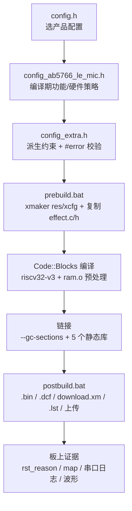
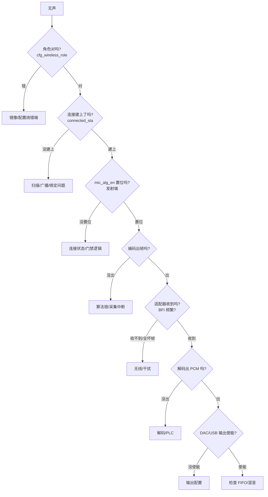
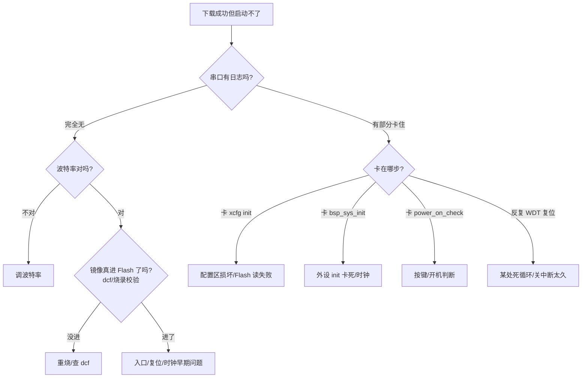

# AB5766 工程化调试与验证 面试题库

> 本篇是四篇专题题库的第四篇，和 [00_项目基础与面试表达.md](../00_项目基础与面试表达.md) 共用底座。
>
> 阅读前提：你已经读过 00 文档的「证据等级 E0–E3、预编译库边界、表达边界」三节，本篇不再重复解释。
>
> 本篇聚焦「**怎么证明一个改动真的生效了**」——构建链、链接产物、内存段、map/反汇编定位、启动复位证据、看门狗、测试方法和故障树。这是高级岗位最拉开差距的部分：能把「编译过了」一路追到「板上跑起来是这样」。

---

## 〇 本篇地图



口头讲法：「工程化这条线，我从配置开始讲。`config.h` 选产品，`config_ab5766_le_mic.h` 定编译期功能，`config_extra.h` 做派生和编译期校验；然后 prebuild 生成资源和音效表，Code::Blocks 编译加链接，postbuild 打包成 .bin/.dcf/download.xm 还能自动上传。最后落到板上，靠复位原因、map、串口日志、波形这一串证据确认改动真的生效。」

---

## 一、工程配置与构建链

### Q4.1.1 一套固件怎么选成「领夹麦」这个产品的？

**面试官问题**：你这个工程支持好几种产品，具体怎么选中当前这个配置的？

**先说结论**：靠 `config.h` 里的一个宏 `USER_CONFIG` 选，当前选的是 `CONFIG_AB5766_LE_MIC`，它会 include 进 `config_ab5766_le_mic.h` 这个产品配置头文件，编译期所有功能开关都在里面。

**大白话解释**：就像一个开关板，`config.h` 是总闸，底下挂着三个产品配置文件——领夹麦、AB5706A 麦、K 歌音箱。把 `USER_CONFIG` 设成哪个编号，编译器就把对应那个配置文件拉进来，其他两个根本不参与编译。这样一套代码能出多个产品，不用维护多个工程。当前选的 0 号就是领夹麦。

**项目证据**：[config.h:17](../../projects/microphone/config.h#L17) `#define USER_CONFIG CONFIG_AB5766_LE_MIC`；[config.h:19-27](../../projects/microphone/config.h#L19-L27) 的 `#if` 链按 `USER_CONFIG` include 对应配置文件，`#else` 分支兜底还是领夹麦。

**设计取舍**：用 `#if` + `#include` 而不是多工程，省的是工程维护成本——三个产品共用 `driver/bsp/functions/modules` 全部源码，差异只在配置头。代价是配置头之间不能同时编译，切产品要改一行重编。

**追问与回答**：*如果我加第四个产品怎么办？* 在 `config.h` 加一个 `#define CONFIG_XXX 4` 和对应 `#elif` 分支，再写一个新的 `config_xxx.h`。重点是 `config_extra.h` 里的派生校验要兼容新配置——比如 `FRAME_SIZE_MIN` 的采样率分支、Flash 对齐检查，新产品如果用了没覆盖的采样率，`config_extra.h` 会直接 `#error` 拦住，这是好事。

**事实边界**：`config.h` 的选产品逻辑是 E1（可见源码），「当前编译进镜像的是领夹麦」是 E2（map 能看到领夹麦的段和符号）。

**面试收尾句**：所以产品选择是编译期一刀切，运行时改不了，这点决定了下面所有功能开关都得在编译期定下来。

---

### Q4.1.2 编译期有哪些「配错了直接报错」的护栏？

**面试官问题**：这种宏驱动的工程，配错了很容易编译过了但跑炸，你们有没有编译期校验？

**先说结论**：有，主要在 `config_extra.h`，用 `#error` 在编译期拦住几类典型错误——Flash 对齐、FOTA 起址对齐、采样率/帧大小的整除关系、TX 间隔和组合帧的耦合关系。

**大白话解释**：`config_extra.h` 不是写新功能，是写「校验规则」。比如你把 48k 采样配成帧大小不是 60 的倍数，它直接 `#error`，编译都过不了，不用等上板炸。这比运行时崩溃强多了——编译器替你把错拦在写代码这一步。

**项目证据**：
- [config_extra.h:23-25](../../projects/microphone/config_extra.h#L23-L25) `FLASH_RESERVE_SIZE` 必须是 4096 的整数倍，否则 `#error`；
- [config_extra.h:27-31](../../projects/microphone/config_extra.h#L27-L31) `AB_FOT_EN` 开了则 `FOT_PACK_START` 也要 4096 对齐；
- [config_extra.h:80-99](../../projects/microphone/config_extra.h#L80-L99) 按采样率定 `FRAME_SIZE_MIN`（48k→60），再校验 `WIRELESS_MIC_SAMPLES_SELECT >= FRAME_SIZE_MIN` 且整除；
- [config_extra.h:124-138](../../projects/microphone/config_extra.h#L124-L138) TX 间隔必须被 DFU 间隔整除、连接间隔必须被 TX 间隔整除，否则 `#error`。

**设计取舍**：把校验放编译期（`#error`）而不是运行时 `assert`，因为嵌入式上板调试成本高，能在一秒一次的编译里拦住的错就不留到现场。代价是校验逻辑和功能宏强耦合，改一个参数要顺着看几条 `#if`，新人上手门槛高。

**追问与回答**：*48k 配 120 样点为什么合法？* 48k 对应 `FRAME_SIZE_MIN=60`，120 ≥ 60 且 120 % 60 == 0，所以过校验。120 正好是 60 的两倍，意味着一个 LC3S 帧里能塞 2 个 1.25ms 的最小传输单元——这也是 `COMB_NB = TX_INTERVAL/DFU_TX_INTERVAL = 4/2 = 2` 的来源。

**事实边界**：这些 `#error` 是 E1（看得见的校验逻辑）；「当前配置确实通过了校验」是 E2（能编出镜像就说明过了）。

**面试收尾句**：所以配置改动我会先盯编译能不能过——过不了往往是 `config_extra.h` 在拦我，过了再去想运行时对不对。

---

### Q4.1.3 prebuild 在编译前做了什么？为什么要提前生成 effect.c？

**面试官问题**：你提到工程编译前会跑一个 prebuild 脚本，它干什么？

**先说结论**：prebuild 调 `riscv32-elf-xmaker` 生成资源表 `res` 和配置表 `xcfg` 两个产物，再把生成的 `effect.c`/`effect.h` 复制到工程目录，供后面编译音效模块时 include。

**大白话解释**：音效参数不是纯手写的 C 代码，有一部分是用厂商工具 `xmaker` 从 `.xm` 描述文件「生成」出来的——就是音效系数表。prebuild 在编译前先跑这个生成动作，把生成出来的 `effect.c/effect.h` 摆到工程目录，编译器才找得到。否则音效模块编译会找不到符号。

**项目证据**：[prebuild.bat](../../projects/microphone/Output/bin/prebuild.bat) 共 13 行：`riscv32-elf-xmaker -b res.xm` → `riscv32-elf-xmaker -b xcfg.xm` → `copy effect.c ..\..\effect.c` → `copy effect.h ..\..\effect.h`，每步 `|| goto err`，失败则 `exit /b 1`。

**设计取舍**：把生成动作放 prebuild 而不是手工提前跑，是为了让 Code::Blocks「打开就编译」——构建系统自动保证依赖。代价是 `effect.c/effect.h` 是**生成产物**，不是手写源码，改音效要改 `.xm` 再重生成，不能直接改那两个 C 文件（会被下次 prebuild 覆盖）。

**追问与回答**：*如果 xmaker 没装会怎样？* prebuild 第一步就 `goto err` 退出码 1，Code::Blocks 编译会停在 prebuild 阶段，不会往下编。所以构建环境必须带 RV32 工具链里的 xmaker，这是环境依赖，不是代码问题。

**事实边界**：prebuild 行为是 E1（脚本可见）；`effect.c/effect.h` 是生成文件属于 E2 产物（在工程目录能看到，但不是手写）——这点和 CLAUDE.md「`Output/` 含生成文件、并非全部手写」的提醒一致。

**面试收尾句**：所以音效这块有个「生成再编译」的环节，改音效参数得走 .xm，不能硬改 effect.c。

---

### Q4.1.4 这个工程为什么只有 Debug 目标？

**面试官问题**：一般工程都有 Debug/Release 两个目标，你这里为什么只有 Debug？

**先说结论**：`.cbp` 里只定义了 `Debug` 一个目标，编译器是 `riscv32-v3`，没有单独的 Release 配置。优化级别 `-Os` 是直接写在 Debug 目标里的，所以这个「Debug」其实已经是带尺寸优化的发布配置。

**大白话解释**：这个 SDK 没有走「Debug 调试版 + Release 发布版」那套二分法。它就一个目标，开 `-Os` 尺寸优化，同时保留调试需要的符号和 map。换句话说它的「Debug」已经是给产品用的镜像，不是那种带 `-O0` 全调试信息的开发版。这跟嵌入式 SDK 习惯有关——Flash 紧张，随时都要 `-Os`。

**项目证据**：[app.cbp](../../projects/microphone/app.cbp) 仅 `<Target title="Debug">`，compiler=`riscv32-v3`，编译选项含 `-Os`；输出 `Output/bin/app.rv32`，对象目录 `Output/obj/`。

**设计取舍**：单目标省了「Debug 能跑 Release 跑不了」的切换 bug，代价是没有一个纯 `-O0` 全调试版用来单步——真要单步得临时改优化级别。对这个项目规模够用，因为定位主要靠串口日志、map、反汇编，不是靠源码级单步。

**追问与回答**：*-Os 会不会让调试信息错位？* 会有行号对不齐的风险，所以我看反汇编多于源码单步。map 和 `app.lst`（objdump 反汇编）是可靠的，符号地址以 map 为准；源码行号在 `-Os` 下只能参考。

**事实边界**：`.cbp` 目标结构是 E1；实际优化效果是 E2（看 map 段大小、看反汇编指令）。

**面试收尾句**：单目标加 `-Os` 是这个 SDK 的惯例，我适应下来的方式是定位以 map 和反汇编为准，不依赖源码行号单步。

---

## 二、链接与镜像产物

### Q4.2.1 从编译到能烧的镜像，中间有几个产物？各自干什么？

**面试官问题**：你这个工程编译完能烧进芯片的到底是哪个文件？中间这些后缀都是什么？

**先说结论**：核心链路是 `app.rv32`（链接器输出的 ELF）→ `app.bin`（裸二进制）→ `app.dcf`（带校验的下载镜像）→ `download.xm`（整片下载描述）。辅助有 `map.txt`（符号/段映射）和 `app.lst`（反汇编）。

**大白话解释**：链接器吐出来的 `app.rv32` 是标准 ELF，里面有段有符号但带调试头，直接烧不划算；`objcopy` 把它剥成纯二进制 `app.bin`；但烧录工具不认裸 bin，要 `xmaker` 打包成 `app.dcf`——这个带 CRC/校验，是真正递给烧录工具的。`download.xm` 是整片烧录描述，把多个镜像段串起来。`map.txt` 给我看符号在哪、段多大；`app.lst` 给我看反汇编指令。

**项目证据**：[postbuild.bat](../../projects/microphone/Output/bin/postbuild.bat)：
- `riscv32-elf-objcopy -O binary app.rv32 app.bin` → .bin；
- `riscv32-elf-xmaker -b appxm.o` → .dcf；
- `riscv32-elf-xmaker -b download.xm` → download 镜像；
- `if exist "...\riscv32-elf-objdump.exe" (riscv32-elf-objdump -h -d -t app.rv32 > app.lst)` → 反汇编（仅工具链在位时）。

**设计取舍**：保留完整 ELF（`app.rv32`）当中间产物，是因为它含符号表能生成 map 和反汇编；最终烧录用紧凑的 `.dcf`。多一道 `xmaker` 打包而不是直接烧 bin，是为了校验和分段——Flash 里有多个段、不同 LMA，需要一个描述文件把它们摆对位置。

**追问与回答**：*`.dcf` 和 `.bin` 有什么实质区别？* `.bin` 就是镜像内容裸字节；`.dcf` 是 `xmaker` 按 `appxm.o` 描述打包的，会带校验头和段定位信息，烧录工具靠它知道「这段写 Flash 哪个地址」。所以烧录用 `.dcf`，离线分析用 `.bin` 或 `app.rv32`。

**事实边界**：产物链是 E1（脚本可见）；每个产物的实际内容是 E2（能打开看，map/lst 能读）。

**面试收尾句**：所以我的定位习惯是——符号问题看 map，指令问题看 lst，烧录问题看 dcf 有没有生成成功。

---

### Q4.2.2 postbuild 还会自动上传？这个自动上传怎么触发的？

**面试官问题**：你说 postbuild 会自动上传到板子，这个是写死的吗？

**先说结论**：不是写死，是条件触发——只有当 `C:\upload\upload.bat` 这个文件存在时，postbuild 才调它，并以 `-D AB5766 app.dcf` 为参数。这台机器没装这个脚本就不上传。

**大白话解释**：postbuild 最后留了个「钩子」：如果开发机根目录有 `C:\upload\upload.bat`，说明你装了自动烧录工具，构建完直接 `call` 它把 `.dcf` 推下去；没有就跳过。这是个「有就用、没有不报错」的软依赖，团队里装了上传工具的人构建完自动烧，没装的人只生成镜像。

**项目证据**：[postbuild.bat](../../projects/microphone/Output/bin/postbuild.bat) 中 `if exist C:\upload\upload.bat (call C:\upload\upload.bat -D AB5766 app.dcf)`——`-D AB5766` 是设备型号参数，`app.dcf` 是要烧的镜像。

**设计取舍**：用文件存在性做开关而不是环境变量或配置项，简单粗暴但够用——嵌入式小团队常用这种方式做「个人构建环境」差异化。代价是路径写死在 `C:\`，换 Linux 构建就失效，但这个 SDK 本来就是 Windows + Code::Blocks + RV32 工具链。

**追问与回答**：*这个自动上传有失败处理吗？* 脚本里就是 `call`，没接 `|| goto err`，所以上传失败不会让 postbuild 报错退出——这点我标记过，属于构建健壮性的边界，但对开发流程影响不大，因为构建产物已经生成，手动烧也能烧。

**事实边界**：触发条件是 E1（脚本可见）；「这台机器实际有没有触发上传」取决于本机 `C:\upload\` 是否存在，是环境相关，不能当项目事实说。

**面试收尾句**：自动上传是个本机钩子，不算工程特性，我提它是因为它影响我的调试节奏——装了就改完即烧，迭代快。

---

### Q4.2.3 `app.lst` 为什么有时有有时没有？

**面试官问题**：反汇编文件不是每次都有，为什么？

**先说结论**：`app.lst` 的生成条件是「RV32 工具链的 `riscv32-elf-objdump.exe` 在预期 Windows 路径下能找到」，找不到就跳过。所以工具链没装好或路径不对时没有 lst。

**大白话解释**：postbuild 里生成 lst 是用 `if exist "...riscv32-elf-objdump.exe"` 守着的，objdump 不在就跳过这步。反汇编是给我做指令级定位用的，没有它我得靠 map 猜指令，定位会慢一档。

**项目证据**：[postbuild.bat](../../projects/microphone/Output/bin/postbuild.bat) `if exist "...\riscv32-elf-objdump.exe" (riscv32-elf-objdump -h -d -t app.rv32 > app.lst)`——`-h` 段头、`-d` 反汇编、`-t` 符号表，三个一起重定向到 lst。

**设计取舍**：把反汇编设成可选产物，是因为它体积大、且只对调试有用，不强依赖工具链路径能让「只编译不反汇编」的快速构建也能跑通。代价是环境没配全的人拿不到 lst，定位能力降级。

**追问与回答**：*没有 lst 怎么做指令级定位？* 退而求其次用 map 的符号地址，配合 `app.rv32` 自己（ELF 也能被其他 objdump/Readelf 工具读），或者临时把工具链路径配对重生成一次 lst。我自己习惯把工具链路径配死，保证每次都有 lst。

**事实边界**：生成条件是 E1；lst 内容是 E2（反汇编是工具从镜像生成的客观结果）。

**面试收尾句**：lst 是我定位的利器，所以我会确保构建环境里 objdump 一定在，不让它变成「有时有有时没」。

---

## 三、编译/链接选项语义

### Q4.3.1 `-march=rv32imc_zba_zbb_zbc_zbs_zca_zcb_zcmp_xbs1` 这一串是什么意思？

**面试官问题**：你编译选项里这一长串 march 是什么？

**先说结论**：它指定目标 RISC-V 架构和扩展子集——`rv32` 是 32 位，`imc` 是整型 I + 乘除 M + 压缩 C 基础，后面 `_zba/zbb/zbc/zbs` 是 Bitmanip 位操作扩展，`_zca/zcb/zcmp` 是压缩指令相关扩展，`_xbs1` 是厂商自定义扩展。

**大白话解释**：`-march` 就是告诉编译器「这块芯片认得哪些指令」。AB5766 这个核除了标准 RISC-V 指令，还支持一堆位操作加速指令（zba 这些用于地址生成、位计数、置位清位），还有压缩指令让代码更紧凑，还有一个厂商自己的 `_xbs1` 扩展。编译器知道这些就能用上，不知道就退回基础指令，代码会变大变慢。

**项目证据**：[app.cbp](../../projects/microphone/app.cbp) 编译选项含 `-march=rv32imc_zba_zbb_zbc_zbs_zca_zcb_zcmp_xbs1`；配合 `-Os` 尺寸优化，压缩指令 `_zca/zcb/zcmp` 对省 Flash 有直接贡献。

**设计取舍**：开全扩展换代码密度和性能，代价是可移植性差——这套 march 只能在这颗核上跑，换芯片要重配 march 重编。对单芯片产品这是合理取舍。

**追问与回答**：*`_xbs1` 这种厂商扩展会不会影响调试？* 会，标准 objdump 不一定认厂商自定义指令的反编码，可能显示成 `.word 0x...`。这也是我为什么 lst 里看到不认识的指令要回厂商文档查，不能默认它是标准 RISC-V。

**事实边界**：march 字符串是 E1（编译选项可见）；某条指令到底有没有被用上是 E2（反汇编能看到具体指令编码）。

**面试收尾句**：march 这串我背不全没关系，但要知道它分「标准基础 + 位操作扩展 + 压缩扩展 + 厂商扩展」四类，这是理解代码密度和指令定位的基础。

---

### Q4.3.2 `-ffunction-sections` 和 `--gc-sections` 是怎么配合省 Flash 的？

**面试官问题**：你说靠这两个选项省 Flash，具体怎么省的？

**先说结论**：`-ffunction-sections` 让每个函数各占一个段，`--gc-sections` 让链接器把没人引用的段当垃圾回收掉。两个配合，未用到的函数不进最终镜像。

**大白话解释**：默认编译器把一堆函数塞进同一个 `.text` 段，链接器没法单独删某个函数。开了 `-ffunction-sections` 后每个函数变成 `.text.func_name` 独立小段；链接时 `--gc-sections` 从入口 `_start` 开始沿调用图找，凡是没被引用到的函数段直接丢掉。结果就是「写了但没用」的代码不占 Flash——对 SDK 这种「一个工程配多种产品、每个产品只用到部分功能」的场景特别有用。

**项目证据**：[app.cbp](../../projects/microphone/app.cbp) 编译选项含 `-ffunction-sections`；链接选项含 `--gc-sections`；入口在 [ram.ld](../../projects/microphone/ram.ld) `ENTRY(_start)`。

**设计取舍**：省 Flash 的代价是段数量暴涨、map 变长、链接稍慢，还可能误删「看起来没人调但其实被间接调用」的函数。这个项目里间接调用的主要是 STRONG/WEAK 覆盖和预编译库里的回调——这些靠 `KEEP` 或链接脚本里的段保留规则保护，不走 gc。

**追问与回答**：*gc-sections 会不会把我写的一个回调函数删掉，导致运行时找不到符号？* 会，如果这个回调只被预编译库「按名字」调用、源码里看不到直接引用，gc 就可能删它。规避方式是把它放进链接脚本里有 `KEEP` 的段，或者在 strong_symbol/库里用 `RETAIN`。本项目的 STRONG 覆盖函数都挂到特定段（如 `AT(.com_text.timer)`），这些段被保留规则覆盖，不会被误删。

**事实边界**：选项语义是 E1；某个函数到底进没进镜像要查 map（E2），不能凭「我写了」就认为它在。

**面试收尾句**：这两个选项是我省 Flash 的主力，但也是「编译过了却运行时缺函数」的潜在来源，所以我养成习惯——改完功能先在 map 里 grep 函数名确认它还在。

---

### Q4.3.3 链接五个静态库，各自什么作用？为什么要预编译？

**面试官问题**：你链接了 platform/libc/libm/libgcc/libbtstack 五个库，这些是干嘛的，为什么是预编译的？

**先说结论**：`libplatform.a` 是厂商平台驱动/底层，`libbtstack.a` 是蓝牙协议栈，`libc.a`/`libm.a`/`libgcc.a` 是 C 运行时/数学库/编译器软实现。预编译是因为前两个是厂商私有（不开放源码），后三个是工具链自带。

**大白话解释**：嵌入式工程分「我们能改的源码」和「拿过来直接链接的库」。`libplatform` 和 `libbtstack` 是芯片厂给的，闭源，我们只能看到头文件和链接符号——LC3S 编解码、PLC、PACC、BLE 调度这些核心都在里面。`libc/libm/libgcc` 是 RISC-V 工具链自带的运行时支持，比如除法、浮点、memcpy 这些。链接器把它们和我们的 `.o` 拼成最终镜像。

**项目证据**：[app.cbp](../../projects/microphone/app.cbp) 链接库列表 `libplatform.a`、`libm.a`、`libc.a`、`libgcc.a`、`libbtstack.a`；CLAUDE.md「链接 `libs/` 下预编译的平台、C 运行时和蓝牙协议栈静态库」。

**设计取舍**：用静态库预编译而不是给源码，是厂商保护 IP 的常规做法；对我们来说好处是构建快、行为稳定，代价是看不到内部实现——出问题只能从接口和外部行为推断，不能改内部。这也正是 00 文档「预编译库边界」那一节的来由。

**追问与回答**：*静态库和源码在 gc-sections 上的行为一样吗？* 一样按段引用规则回收，但库内部的符号如果只被库内部引用、外面看不到，链接器一样能回收——所以不是「库里的东西一定全进镜像」，未用到的库函数也会被 gc 掉。这点对省 Flash 有利。

**事实边界**：库的存在和分类是 E1（cbp 列表）；库内部实现是「不可见」，只能说到接口（00 文档已定义边界）。

**面试收尾句**：五个库里真正「不可见」的是 platform 和 btstack，这两个是我讲项目时最注意不夸大的地方——只说接口和外部行为。

---

### Q4.3.4 `-Wno-array-bounds` 和 `-Wno-address-of-packed-member` 关掉这两个警告意味着什么？

**面试官问题**：编译选项里关了两个警告，关警告是不是在藏问题？

**先说结论**：不是藏问题，是 SDK 里大量用了 `packed` 结构体和跨边界数组访问，这两个警告在这种用法下会刷屏误报，关掉是权衡噪音和真实问题。但关警告有代价——真越界也会被静音。

**大白话解释**：`-Wno-array-bounds` 关数组越界警告，`-Wno-address-of-packed-member` 关「取 packed 结构体成员地址可能未对齐」的警告。这个 SDK 处理协议帧、配置结构时大量用 `__packed`，取成员地址做指针确实可能未对齐，编译器每次都警告；但代码里实际是按字节访问或 memcpy，并没有真踩对齐陷阱。留着警告就全是噪音，开发者反而看不见真问题，所以关掉。

**项目证据**：[app.cbp](../../projects/microphone/app.cbp) 编译选项含 `-Wno-array-bounds -Wno-address-of-packed-member`，同时 `-Wall` 开着其他警告。

**设计取舍**：保留 `-Wall` 抓绝大多数问题，只关这两个高频误报。代价是如果哪天真写了个越界或对齐解引用，警告也不响了——所以这类代码我审查时会更人工盯，不指望编译器提醒。

**追问与回答**：*那你怎么防止 packed 结构体真出对齐问题？* 靠编码规范：packed 成员一律用 `memcpy` 进出、或逐字节访问，不解引用成 `u32*` 直接读写。代码 review 时这也是我的一个检查点。

**事实边界**：选项含义是 E1；某处访问是不是真有问题要看源码逻辑（E1）或运行时表现（E3），不能凭「警告关了」下结论。

**面试收尾句**：关警告是噪音权衡，不是放任 bug，我对这两类用法的审查反而更紧。

---

## 四、内存段放置与双角色 RAM 复用

### Q4.4.1 `ram.ld` 怎么把 RAM 切成几块？base 地址是多少？

**面试官问题**：你这个芯片 RAM 怎么布局的，链接脚本怎么切的？

**先说结论**：Flash 基址 `__base=0x10000000`，RAM 从 `0x10000` 段起：`__stack_vma=0x10800`(1k 栈)、`__comm_ram_vma=0x10c00`(27k/30k 公共代码)、`__adapter_ram_vma=comm_ram+size`(角色代码)，再往上是 `__mram_vma=0x18000`(32k 声学 mram)。`ENTRY(_start)` 是链接起点。

**大白话解释**：链接脚本 `ram.ld` 先定 Flash 根 `0x10000000`，然后从 `0x10600` 起给 RAM 划区：最底下是 cache/stack 用的 loader 区，往上 1k 是中断栈，再往上一大块是「公共代码」comm（两个角色都要用的），comm 上面就是「角色专用」区（适配器或发射端的代码各占一块）。另外 `0x18000` 起有 32k 是声学专用 mram，放回声/混响的大系数。

**项目证据**：[ram.ld](../../projects/microphone/ram.ld) `ENTRY(_start)`、`__base=0x10000000`、`__comm_ram_vma=0x10c00`、`__comm_ram_size`(27k ESBC or 30k)、`__stack_vma=0x10800`/1k、`__adapter_ram_vma=__comm_ram_vma+__comm_ram_size`、`__mram_vma=0x18000`/32k。

**设计取舍**：手工分区而不是让链接器自动摆，是因为这块芯片 RAM 区有功能约束——mram 是声学专用、cache/stack 在固定低地址、角色代码要能被搬运。自动摆满足不了这些硬约束，只能手写脚本。

**追问与回答**：*comm 为什么要 27k 和 30k 两个分支？* 注释提到 `ESBC` 条件——某项功能开时 comm 多占 3k。这是给「开了某个编译期功能 comm 就要变大」留的余量，链接脚本按条件算 size 保证不溢出。

**事实边界**：布局是 E1（脚本可见）；实际每个段在镜像里多大、起止地址是 E2（map.txt 里精确到字节）。

**面试收尾句**：内存布局我心里有个图——Flash 从 0x10000000，RAM 从 0x10000 段往上是 stack/comm/角色/mram，这是讲双角色复用的前提。

---

### Q4.4.2 发射端和适配器的代码 RAM 地址一样？这不冲突吗？

**面试官问题**：你之前说两套角色代码在 RAM 里各占一段，又说 VMA 一样，到底一样还是不一样？

**先说结论**：**VMA 一样，LMA 不一样**。`__emit_ram_vma = __adapter_ram_vma`——两套角色代码运行时都搬到同一段 RAM 地址跑；但它们在 Flash 里的存放位置（LMA）是不同的两段。运行时只有一个角色在跑，所以不冲突。

**大白话解释**：这是这个工程我最欣赏的一个设计。VMA 是「运行时的虚拟地址」，LMA 是「在 Flash 里的实际存放地址」。两套角色代码在 Flash 里是两段不同的地方（LMA 不同），但启动时按当前角色，只把对应那一套从 Flash 搬到同一段 RAM（VMA 相同）去执行。因为同一时刻只有一个角色在跑，RAM 复用不冲突——省的就是「本来要给两套角色各留一段 RAM」的那份空间。

**项目证据**：[ram.ld](../../projects/microphone/ram.ld) `__emit_ram_vma = __adapter_ram_vma`（同一个值，RAM 复用），同样 `__test_ram_vma = __adapter_ram_vma`（测试模式也复用）；而 `__comm_adapter_lma` 和 `__comm_emit_lma` 是分别 `LOADADDR(.code_adapter)` 和 `LOADADDR(.code_emit)`——**LMA 不同**。段定义 `.code_adapter > comm_adapter AT > flash`、`.code_emit > comm_emit AT > flash`，`AT > flash` 就是说「运行在 comm 段、但实际装载来自 flash」。

**设计取舍**：RAM 复用换省内存，代价是切换角色要重新搬运代码、不能两套同时在内存。对「一个镜像一个角色」的产品正好合适；但如果未来要「同一设备同时既当麦又当适配器」就不行了，得改成两段独立 VMA。

**追问与回答**：*「搬到 RAM」这个动作谁做的？* 是启动阶段由平台库的搬移代码（startup/init）按当前角色做的，我们源码看不到细节（属于预编译平台库），但从 ram.ld 的 `AT > flash` 和 LMA 标注能推出「有这段搬运」。我把它归到「平台库负责、我靠段标注配合」的边界。

**事实边界**：VMA 相同 / LMA 不同是 E1（脚本白纸黑字）；运行时实际搬运行为属于平台库内部（不可见），但可由 E3 验证——切角色后看 RAM 内容变化、或跑出对应角色的功能。

**面试收尾句**：VMA 相同 LMA 不同是这个双角色设计的核心，一句话就是「Flash 各存一份、RAM 同址复用、运行时搬一份」。

---

### Q4.4.3 回声和混响为什么能共用同一段 mram？

**面试官问题**：回声和混响系数都挺大，你怎么塞得下？是不是共用内存？

**先说结论**：是的，`.mram_echo` 和 `.mram_reverb` 都定位在 `__mram_vma=0x18000`、且都 `. = 0x6000`（24k），**两者同址**——因为当前配置回声和混响不会同时开，谁开谁用这段 mram，省的是「各留 24k」那份。

**大白话解释**：mram 是声学专用 RAM，回声和混响各需要大约 24k 放延迟线/系数。但产品上回声和混响是互斥效果（同时开会糊），`config_extra.h` 里甚至有「两个都开就把回声延迟清零」的逻辑。既然互斥，就让它们共用同一段 24k mram，谁使能谁占用。ram.ld 里两个段都 `. = 0x6000` 起在同一段，就是同址复用。

**项目证据**：[ram.ld](../../projects/microphone/ram.ld) `.mram_echo __mram_vma (NOLOAD) { . = 0x6000; }` 和 `.mram_reverb __mram_vma (NOLOAD) { . = 0x6000; }`——同 `__mram_vma`、同 `0x6000`；[config_extra.h:146-149](../../projects/microphone/config_extra.h#L146-L149) `#if WIRELESS_MIC_ECHO_EN && WIRELESS_MIC_ROOM_REVERB_EN #undef WIRELESS_MIC_ECHO_DELAY #define ... 0`——同时开时回声延迟被清零，进一步说明二者互斥语义；ram.ld 注释（30-34 行）也说 0x18000-0x1e000 在两者都关时可释放。

**设计取舍**：同址复用省 24k，代价是回声和混响不能并存、且切效果时要保证前一个把 mram 释放干净再装载后一个，否则数据残留串味。这是「功能互斥换内存」的典型取舍。

**追问与回答**：*当前配置开回声或混响了吗？* 都没开。当前 `config_ab5766_le_mic.h` 里 ECHO 和 ROOM_REVERB 默认 0，所以这段 mram 实际是空闲可释放的——ram.ld 注释明说两者都关时这 32k 可释放给别的用。

**事实边界**：同址复用是 E1；当前两者都关、mram 空闲是 E0+E1（配置宏 + 脚本注释）；「切效果时残留有没有清干净」要 E3 测，属于未深究边界。

**面试收尾句**：mram 这段同址复用和双角色 RAM 复用是同一种思路——互斥的资源同址共享，这个项目里内存就是这么抠出来的。

---

### Q4.4.4 `AT > flash` 这个标注到底是什么，为什么代码里到处是 `AT(.xxx)`？

**面试官问题**：我看你源码里很多函数前面有 `AT(.com_text.xxx)`，链接脚本里又有 `AT > flash`，这俩 AT 是一回事吗？

**先说结论**：不是一回事但相关。源码里的 `AT(.段名)` 是**把函数/变量放到指定段**的编译器标注；链接脚本里的 `> 段 AT > flash` 是**指定这个段的 VMA 在 RAM、LMA 在 Flash**。前者决定「放哪个段」，后者决定「段在哪运行、从哪装载」。

**大白话解释**：源码 `AT(.com_text.timer)` 像贴标签——「这个函数请放进 `.com_text.timer` 段」。链接脚本 `.code_comm > comm AT > flash` 像排座位——「`.code_comm` 这一段运行时坐在 comm（RAM）这个位置，但它的内容实际存在 flash 里，启动时搬过去」。两步配合：源码贴段标签 → 链接脚本按段分座位。CLAUDE.md 也特别提醒「移动时序或内存敏感代码时保留这些 AT 标注」，因为标签一错段就错位。

**项目证据**：源码侧如 [strong_symbol.c](../../projects/microphone/strong_symbol.c) `AT(.com_text.timer) STRONG void usr_tmr5ms_thread_callback(void)`、[bsp_sys.c](../../bsp/bsp_sys.c) `AT(.text.bsp.sys.init) void bsp_sys_init(void)`；链接脚本侧 [ram.ld](../../projects/microphone/ram.ld) `.code_comm ... > comm AT > flash`、`.code_emit ... > comm_emit AT > flash`。

**设计取舍**：用段标注精细控制放置，是为了把「热路径」「冷路径」「角色专用」「公共」分开，让 RAM 只装当前要用的、Flash 按角色分。代价是开发时要懂段语义，乱贴 AT 会让函数跑到不该去的段，引发 RAM 溢出或跨角色调用问题。

**追问与回答**：*如果我给一个函数贴错 AT 会怎样？* 轻则它被分到错段（比如把发射端函数贴进 comm 公共段，结果适配器跑时也把它搬进 RAM 白占地方），重则跨角色调用时那段没被装载、跑到未初始化 RAM 崩溃。所以 AT 我改的时候特别小心，能不动就不动，动了要在 map 里确认函数落点对。

**事实边界**：标注语义是 E1；实际落点要 map 确认（E2）。

**面试收尾句**：源码 AT 是贴段标签、链接脚本 AT 是排座位，两者配合把代码精准放进 RAM/Flash，这也是 CLAUDE.md 反复强调「移动代码要保留 AT」的原因。

---

## 五、map / 反汇编 / 符号定位

### Q4.5.1 怎么用 map 确认「我加的功能真的进了镜像」？

**面试官问题**：你说编译过不等于进镜像，具体怎么查？

**先说结论**：在 `map.txt` 里 grep 函数名/段名——如果它在 map 里有地址和 size，就是进了镜像；如果只出现在「Discarded input sections」或干脆没出现，就是被 `--gc-sections` 回收了或根本没编进去。

**大白话解释**：map 是链接器吐的「最终账本」，列了每个段、每个符号的起止地址和大小。我加了个函数，编译过了，但它到底有没有进最终镜像？去 map 里搜它的名字——搜到带地址的就是进了；搜到在「Discarded」区就是被 gc 当垃圾删了；搜不到就是连目标文件都没参与链接。这一步能拦住「我以为加了、其实没生效」的低级错。

**项目证据**：[app.cbp](../../projects/microphone/app.cbp) 链接选项 `-Map=Output\bin\map.txt`；map 格式上分「Memory Configuration」「Linker script and memory map」「Discarded input sections」几段，未引用段会进 Discarded。

**设计取舍**：靠 map 人工确认而不是自动化校验，是因为 gc 行为依赖整体调用图，自动化「这个函数必须在」的断言容易误报。代价是靠人盯，容易漏——所以我的习惯是改完功能第一件事 map grep，养成肌肉记忆。

**追问与回答**：*如果一个函数是被预编译库按名字回调的，map 里能看到它被引用吗？* 看到它在镜像里有地址（进了），但「被谁引用」在 map 里不一定清楚——因为引用方在库里，库内部的引用关系 map 不会展开。所以这种情况我只确认「它在镜像里」，引用对不对要靠运行时行为（E3）。

**事实边界**：map 内容是 E2（链接器客观产物）；「在镜像里」和「被正确调用」是两件事，前者 E2 可证，后者可能要 E3。

**面试收尾句**：map grep 是我每次改完功能的第一道确认，五秒钟的事，能拦掉一大类「编译过了但没生效」。

---

### Q4.5.2 「函数被 gc-sections 误删」怎么排查、怎么修？

**面试官问题**：你提到 gc 可能误删回调，真遇到了怎么定位？

**先说结论**：现象是「运行时找不到符号或跳转到未装载区域」，定位是 map 里搜函数名看它在不在 Discarded、在不在镜像；修法是把它放进链接脚本里 `KEEP` 的段，或者确保有一条从 `_start` 可达的引用路径。

**大白话解释**：典型场景——我写了个回调 `foo_cb`，源码里没有任何地方直接调它，因为它是要被预编译库「按名字」调的。链接器从 `_start` 顺着调用图找，找不到谁引用 `foo_cb`，就把它当垃圾删了。运行时库去调这个名字，要么找不到、要么跳到一片没装载的 RAM。修法是告诉链接器「这个段要保留」——在 ram.ld 里给它的段加 `KEEP()`，或者人为造一个引用。

**项目证据**：本项目规避方式见 [strong_symbol.c](../../projects/microphone/strong_symbol.c)——STRONG 覆盖函数都带 `AT(.com_text.xxx)` 或 `AT(.text.xxx)` 段标注，这些段在 ram.ld 里有对应的放置规则（`.code_comm` 等被保留进镜像）；[ram.ld](../../projects/microphone/ram.ld) 里段定义配合保留。STRONG 符号通过链接器「强符号覆盖弱符号」机制被库引用，本身就有引用关系，不会被 gc。

**设计取舍**：用 `KEEP`/段保留规则是稳妥的修法，比「人为造引用」干净；代价是要懂链接脚本段语义。我不轻易用 `KEEP`，因为 KEEP 的段不会被回收，滥用反而让 gc 失效、Flash 膨胀。

**追问与回答**：*怎么区分「被误删」和「我根本没写对」？* 先看编译有没有警告「defined but not used」——如果连这个警告都没有、函数也确实没进 map，那是被库引用但 gc 没识别，是误删；如果有未使用警告、map 里在 Discarded，那是真没人用，该删。两者修法不同。

**事实边界**：Discarded 列表是 E2；「是不是误删」要结合「这个函数该不该被引用」的源码意图（E1）判断。

**面试收尾句**：gc 误删是 SDK 二次开发里隐蔽的坑，我的防线是 map grep + 给库回调函数挂受保护段。

---

### Q4.5.3 map 里怎么看出 RAM 有没有溢出？

**面试官问题**：开了新算法，怎么提前知道 RAM 会不会爆？

**先说结论**：看 map 里各段（`.data_comm`/`.data_emit`/`.data_adapter`/`bss`/`heap`）的 size 之和有没有超过 ram.ld 给的段上限，特别是角色专用段不能超过 `__adapter_ram_size`。链接器一般会在溢出时报错，但临界状态下 map 能提前看余量。

**大白话解释**：ram.ld 给每段划了上限（比如 comm 27k/30k、mram 32k），链接器如果塞超了会直接报「section will not fit」链接失败。但有时候是「勉强放下、运行时堆栈一涨就溢」，所以我会看 map 里 `.data_emit` 这些数据段实际占多少、离上限还剩多少，留够堆栈和 heap 的余量。

**项目证据**：[ram.ld](../../projects/microphone/ram.ld) `__comm_ram_size`(27k/30k)、`__adapter_ram_size=(61k-__comm_ram_size)`；`bsp_sys.c` 的 [code_info_dump()](../../bsp/bsp_sys.c#L17-L30) 在启动时打印 comm/heap/bss/bram 的 range 和 size——这是运行时确认内存占用的官方出口。

**设计取舍**：靠链接器硬上限 + 启动时 `code_info_dump` 软确认双重保险。链接器拦硬溢出，`code_info_dump` 看运行时实际占用和余量。代价是 `code_info_dump` 要在串口能看到（`BSP_UART_DEBUG_EN`），关了调试串口就看不到。

**追问与回答**：*如果开算法后链接报「RAM 溢出」怎么办？* 先看是哪个段溢——角色段溢就检查是不是把不该进这个角色的代码/数据放进来了（AT 贴错）；comm 溢就检查是不是把角色专用的东西误放公共段。实在不行才动 ram.ld 调段大小，但调段大小是高危操作，要保证不破坏双角色复用的 VMA/LMA 关系。

**事实边界**：段上限是 E1（脚本）；实际占用是 E2（map + 启动日志 `code_info_dump`）。

**面试收尾句**：RAM 余量我看两处——编译期 map、运行时 `code_info_dump` 的串口输出，两处对得上才放心。

---

## 六、启动与复位证据链

### Q4.6.1 从上电到进状态机，main 里这几步顺序能讲一遍吗？

**面试官问题**：你项目启动第一段代码干了什么，按顺序说。

**先说结论**：`main()` 顺序是：`sys_rst_init(WK0_10S_RESET)` 记录复位原因 → 打印 Hello/SDK/LIBS/SW_VERSION → `sys_rst_dump` 解释复位原因 → `lowpdr_get_wakeup_source` 记唤醒源 → `code_info_dump` 打内存段 → `bsp_sys_init` 板级初始化 → `func_run` 进不返回的状态机。

**大白话解释**：上电第一件事不是干活，是「搞清楚自己怎么醒的」——复位原因（硬复位、看门狗、唤醒）先记下来打印出来，因为后面如果设备异常重启，这个原因是定位根因的第一线索。然后打印版本号（SDK、库、软件版本），方便确认烧的是哪个版本。再看唤醒源（是按键唤醒还是 VUSB 唤醒还是出仓唤醒），这影响开机判断。接着打印内存段占用，最后才做板级初始化、进状态机跑业务。

**项目证据**：[main.c](../../projects/microphone/main.c)：
```
sys_cb.rst_reason = sys_rst_init(WK0_10S_RESET);
printf("Hello AB5766: %08x\n", sys_cb.rst_reason);
printf("SDK: v%04X LIBS: v%04X\n", SDK_VERSION, LIBS_VERSION);
sys_rst_dump(sys_cb.rst_reason);
sys_cb.wakeup_reason = lowpdr_get_wakeup_source();
printf("SW_VERSION: %s\n", SW_VERSION);
code_info_dump();
bsp_sys_init();
func_run();
```

**设计取舍**：把复位原因/版本/内存诊断放最前，是为了「哪怕后续崩了，前面这些打印也能留下现场」。代价是启动多几个 printf 的耗时——但对这种不是极致低功耗启动的场景可接受。`WK0_10S_RESET` 当前配成 0（关），所以传进去是关闭 WK pin 10 秒复位功能。

**追问与回答**：*为什么复位原因这么重要？* 因为无线设备很多「偶发重启」问题，根因就藏在复位原因里——是看门狗超时（代码卡死）、是软复位（主动重启）、还是异常。`sys_rst_dump` 把复位原因解释成人话打印出来，现场拿到日志就知道是哪类。

**事实边界**：启动序列是 E1；复位原因的实际值是 E3（串口日志能看到）。

**面试收尾句**：启动头几行打印不是废话，是「出问题时留给自己的现场」，复位原因和版本号是定位的第一手线索。

---

### Q4.6.2 `bsp_sys_init` 里加载 xcfg、设时钟、注册定时器，顺序为什么这样？

**面试官问题**：板级初始化这几步，为什么是这个顺序？

**先说结论**：`bsp_sys_init` 顺序是：`xcfg_init` 加载运行时配置 → 用配置里的地址做随机种子 → `bsp_var_init`（含开机判断、OSC 电容回退）→ `wireless_mic_var_init` → `pmu_init` → 各外设 init（ADC/按键/LED/充电/电压检测）→ `power_on_check` 开机判断 → `sys_clk_set(SYS_CLK_SEL)` 设初始 24M → `bsp_param_init`/`xosc_init` → 开 5ms 定时器 → 最后设 `func_cb.sta = FUNC_BT`。

**大白话解释**：核心原则是「先拿配置再初始化」——必须先 `xcfg_init` 把运行时配置加载进来，后面所有外设初始化才能读到正确的参数（比如 PMU 电压、OSC 电容、按键配置）。然后做开机判断 `power_on_check`（要不要真的开机），通过了才设时钟、开定时器。时钟放 `power_on_check` 之后是因为开机判断里有 `WDT_CLR` + 按键扫描循环，那段时间还不需要高时钟。

**项目证据**：[bsp_sys.c](../../bsp/bsp_sys.c) `bsp_sys_init()`（199-267 行）：先 `if (!xcfg_init(...)) printf("xcfg init error")`，再 `sys_get_rand_key_init(rand_seed)`，再 `bsp_var_init()`→`wireless_mic_var_init()`→`pmu_init(cfg_pmu_get())`→条件编译的各 `bsp_*_init`→`power_on_check()`→`sys_clk_set(SYS_CLK_SEL)`→`bsp_param_init()`→`xosc_init()`→`sys_set_tmr_enable(1,1)`→最后 `func_cb.sta = FUNC_BT`。

**设计取舍**：`xcfg_init` 失败只 printf 不 halt，是因为要保证「配置加载失败也能跑起来用默认值」，不至于变砖——但配置错了行为会异常，所以这个 printf 是要关注的警告。时钟放后段是为了开机判断期间省功耗。

**追问与回答**：*`sys_get_rand_key_init` 用 xcfg 的 le_addr 做种子，这安全吗？* 这只是个启动随机种子，不是密码学用途，用蓝牙地址（每个设备不同）做种子保证不同设备随机序列不同即可，不要求密码学强度。这块属于平台库接口，我点到为止不展开内部。

**事实边界**：顺序是 E1；运行时实际初始化成功与否看串口日志（E3），特别是 `xcfg init error` 这条。

**面试收尾句**：板级初始化顺序一句话——「先加载配置，再按配置初始化外设，最后开机判断通过才设时钟开定时器」，配置先行是核心。

---

### Q4.6.3 设备异常重启了，你怎么从日志反推是看门狗还是别的？

**面试官问题**：客户说设备自己重启了，你拿到日志怎么定位？

**先说结论**：看启动时 `sys_rst_dump` 打印的复位原因字段——如果是看门狗复位位，说明代码卡死喂不上狗；如果是软复位位，说明是主动 `func_pwroff`/重连触发的；如果是唤醒复位，说明是低功耗唤醒。复位原因是第一分诊。

**大白话解释**：设备重启分好几种，每种根因方向完全不同。看门狗复位 = 主循环卡死（死循环、关中断太久、外设阻塞），方向查代码哪里会卡；软复位 = 代码主动调的复位（比如断连重连、参数改了要重启），方向查谁触发的复位；唤醒复位 = 从休眠醒来的正常路径，要确认是不是误唤醒。`sys_rst_dump` 会把这些位解释成文字打印，我看这行就知道往哪个方向查。

**项目证据**：[main.c](../../projects/microphone/main.c) `sys_cb.rst_reason = sys_rst_init(...)` 后 `sys_rst_dump(sys_cb.rst_reason)`——复位原因被记录并解释打印；复位类型由平台库定义（WDT/软复位/唤醒等，枚举属于预编译库接口）。

**设计取舍**：靠复位原因分诊而不是每次全量排查，省时间。代价是看门狗复位只能告诉你「卡死了」，卡在哪还要靠别的证据（比如在关键路径加打印、看最后一条日志）。所以我会配合在长路径加阶段性 printf，卡死时最后的 printf 就是卡点。

**追问与回答**：*看门狗复位和代码主动复位怎么区分？* 复位原因位不同——看门狗有专门的 WDT 复位位，软复位有软件复位位，`sys_rst_dump` 会区分打印。如果两者都可能，要结合「最后的日志」看：卡死型 WDT 复位前日志会停在某个点，软复位前一般有主动打印。

**事实边界**：复位原因枚举属于预编译平台库接口（E1 头文件可见，内部判定不可见）；具体值靠 E3 串口日志确认。

**面试收尾句**：复位原因是我定位异常重启的第一分诊，方向对了再往下查，比无头苍蝇全量排查快得多。

---

## 七、STRONG/WEAK 覆盖与平台回调

### Q4.7.1 STRONG/WEAK 是什么机制？为什么要用它覆盖库？

**面试官问题**：你源码里函数前面写 STRONG，这是什么意思？

**先说结论**：STRONG/WEAK 是链接器的符号强弱机制——预编译库里很多函数定义成 WEAK（弱符号），我在自己源码里定义同名 STRONG（强符号）函数，链接器优先选我的，等于「在不改库源码的前提下改库行为」。

**大白话解释**：厂商给的库是预编译的，源码看不到改不了。但库里很多回调函数定义成「弱」的——意思是「如果没有别人定义，就用我库里的默认实现；如果有人定义了同名的强版本，就用那个人的」。我在 `strong_symbol.c` 里写同名函数标 STRONG，链接器一看「有强的」，就丢掉库里的弱版本用我的。这样不改库就能 hook 库的行为——比如把库默认的空回调换成我的实际实现。

**项目证据**：[strong_symbol.c](../../projects/microphone/strong_symbol.c) 头部注释「定义库里面部分 WEAK 函数的 Strong 函数，动态关闭库代码」；例子 `STRONG void usr_tmr5ms_thread_callback(void) { usr_tmr5ms_thread_do(); }` 覆盖库的弱版本。

**设计取舍**：用 STRONG 覆盖而不是改库，是因为库闭源改不了；用强弱而不是宏开关，是因为链接器自动选强符号，不用在每个调用点 `#ifdef`。代价是要懂库定义了哪些 WEAK 钩子（看头文件/文档），乱覆盖会改变库的内部时序，高风险。

**追问与回答**：*STRONG 覆盖的函数会被 gc-sections 误删吗？* 不会——STRONG 符号被库里的弱符号引用链关联，有引用关系，gc 不会删。这也是为什么库回调适合用 STRONG 覆盖而不是另起名字。

**事实边界**：机制是 E1（符号定义可见）；「覆盖真的生效」要 map 确认强符号进镜像、弱符号被替换（E2）。

**面试收尾句**：STRONG/WEAK 是不改库就能 hook 库的官方手段，这个项目里所有「平台回调」都靠它接进来。

---

### Q4.7.2 5 毫秒 tick 是怎么挂上去的？

**面试官问题**：你总说 5 毫秒 tick 驱动周期工作，这个 tick 怎么来的？

**先说结论**：平台库有个 WEAK 的 `usr_tmr5ms_thread_callback`，`strong_symbol.c` 里用 STRONG 覆盖成调 `usr_tmr5ms_thread_do()`，后者在 `bsp_sys.c` 里实现，按计数分频出 10ms/50ms/100ms/500ms/1s 各档周期任务。`bsp_sys_init` 里 `sys_set_tmr_enable(1,1)` 开定时器后才生效。

**大白话解释**：硬件有个 5ms 周期的定时器中断，库在 ISR 里调一个回调「问用户要不要在这个 tick 做点事」。库默认这个回调是空的（弱符号），我在 `strong_symbol.c` 里覆盖它，让它调我的 `usr_tmr5ms_thread_do`。这个函数里我用一个计数器 `tmr5ms_cnt` 做软件分频——每 2 个 tick（10ms）扫一次 LED、每 10 个（50ms）扫按键、每 20 个（100ms）处理低功耗超时、每 100 个（500ms）发一条系统消息、每 200 个（1s）发一条 1 秒消息。一个 5ms 硬件 tick 派生出整套周期调度。

**项目证据**：
- [strong_symbol.c](../../projects/microphone/strong_symbol.c) `AT(.com_text.timer) STRONG void usr_tmr5ms_thread_callback(void) { usr_tmr5ms_thread_do(); }`；
- [bsp_sys.c](../../bsp/bsp_sys.c) `usr_tmr5ms_thread_do()`（60-97 行）：`tmr5ms_cnt++`，然后 `%2`→dled_scan_10ms、`%10`→led_scan、`bsp_key_scan`、`%20`→lowpwr_tout_ticks、`%100`→`MSG_SYS_500MS`、`%200`→`MSG_SYS_1S`；
- [bsp_sys.c](../../bsp/bsp_sys.c) `sys_set_tmr_enable(1, 1)` 在 `bsp_sys_init` 末尾开启。

**设计取舍**：用软件分频而不是每个周期一个硬件定时器，省硬件定时器资源、所有周期任务集中在一条回调里好维护。代价是回调里任务太多会拉长 5ms 中断响应——所以这里只放轻量扫描，重活（算法）走别的 kick 路径，不在 5ms 回调里做。

**追问与回答**：*5ms 回调里能调 printf 吗？* 尽量不调——printf 串口输出可能阻塞或耗时不确定，在定时器回调里会拖累 tick 周期。要打印走「置标志 + 主循环里打」的模式。`usr_tmr5ms_thread_do` 里就只发消息、扫描，没有重打印。

**事实边界**：tick 挂载机制是 E1；实际 5ms 周期准不准要 E3 测（示波器量或日志时间戳），库内部定时器精度属于不可见边界。

**面试收尾句**：5ms tick 是这个项目周期调度的根，一个硬件 tick 软件分频出 10ms 到 1s 全套周期，集中又省资源。

---

### Q4.7.3 `os_spiflash_addr_check` 这个 STRONG 覆盖在防什么？

**面试官问题**：你覆盖了一个 Flash 地址检查函数，防的是什么？

**先说结论**：它防止误擦除/误写 Flash 的关键区——配置区（CM_START/CM_SIZE）、FOTA 升级包区（FOT_PACK_START，如果开了 FOTA）、还有 0x1000-0x2000 这段。任何写 Flash 前库会调这个检查，地址落在保护区就返回 false 拒绝。

**大白话解释**：Flash 上有几个绝对不能误写的区——运行时配置存在 CM 区、OTA 升级包存在 FOTA 区、还有一段系统保留。库每次要写 Flash 前会问这个 STRONG 函数「这个地址能不能写」，我写检查逻辑：地址在这些保护区里就 printf 报错并返回 false，库就不写了。这是个安全网，防止代码 bug 把配置或 OTA 包写花导致变砖。

**项目证据**：[strong_symbol.c](../../projects/microphone/strong_symbol.c) `AT(.com_text.spiflash) STRONG bool os_spiflash_addr_check(u32 addr, uint len)`——检查 CM_START/CM_SIZE、`#if AB_FOT_EN` 的 FOT_PACK_START、0x1000-0x2000，命中则 printf error + return false。

**设计取舍**：把地址检查做成 STRONG 覆盖库的钩子，是因为库本身不知道「这块产品把哪些区划成保护区」，由我们产品侧定义。代价是检查逻辑要和 ram.ld/config 的 Flash 划分严格一致，否则该护的没护、不该拦的拦了。

**追问与回答**：*这个检查会拖慢正常 Flash 写吗？* 极小——就是几个地址比较，远比 Flash 写本身快，不是性能瓶颈。而且它只在「写之前」调一次，正常写不在保护区直接 return true 放行。

**事实边界**：检查逻辑是 E1；保护区边界和 ram.ld/config 一致性是 E1 跨文件核对；「真误写时能不能拦住」要 E3 故意触发测试（一般不主动测，靠代码审查保证）。

**面试收尾句**：这个 Flash 地址检查是防误写变砖的安全网，产品侧定义保护区、库写前问一下，典型的 STRONG 覆盖用法。

---

### Q4.7.4 `pacc_effect_freq_shift_init` 被覆盖成空函数是什么操作？

**面试官问题**：你把一个初始化函数覆盖成空的，这是在干嘛？

**先说结论**：当频移功能（FREQ_SHIFT2 和 ADAPTER_FREQ_SHIFT）都关时，把库的 `pacc_effect_freq_shift_init` 覆盖成空 stub——等于「动态关闭库里的频移初始化」，让库的频移代码不实际生效，省掉无用初始化。

**大白话解释**：库里有频移功能（变调/移频），默认会调初始化函数做一堆寄存器配置。但当前产品没开频移，这套初始化是浪费且可能引入副作用。直接改库不行（闭源），就在 `strong_symbol.c` 里把 `pacc_effect_freq_shift_init` 定义成空函数——STRONG 覆盖后，库调它等于调了个空函数，什么也不做。这是一种「用空覆盖来禁用库功能」的技巧。

**项目证据**：[strong_symbol.c](../../projects/microphone/strong_symbol.c) `#if (!WIRELESS_FREQ_SHIFT2_EN && !ADAPTER_FREQ_SHIFT_EN) void pacc_effect_freq_shift_init(...) {}`——条件是两个频移宏都关，定义成空函数。

**设计取舍**：用空覆盖禁用而不是改配置宏，是因为库的初始化调用是写死在库启动流程里的，宏关不掉调用本身，只能把「被调用的函数」变成空的。代价是要清楚「空覆盖后库的相关状态机可能仍以为频移开了」，所以这块要和库的其他频移接口一起看，避免状态不一致——这也是我标记过要小心验证的边界。

**追问与回答**：*为什么不直接关宏让它不调？* 因为这个调用在库内部启动流程，我们改不到那个调用点。能改的只有「被调函数体」，所以用空覆盖。如果库提供了「整体禁用频移」的宏当然更好，没有就只能这样。

**事实边界**：空覆盖是 E1；「覆盖后库频移功能真的不生效」要 E3 测（确认没有残留的移频效果），属于「源码意图明确但运行时库状态需验证」的边界。

**面试收尾句**：空覆盖是「禁用库功能」的取巧手段，能用但要注意库状态一致性，我把它当半成品方案，有官方禁用宏就换官方的。

---

## 八、看门狗与安全寄存器

### Q4.8.1 看门狗这套 API 为什么写寄存器都要带个 0x0a / 0x05 密钥？

**面试官问题**：你看门狗驱动里写寄存器总要先写个 0x0a 或 0x05，这是什么套路？

**先说结论**：这是 AB5766 的「安全写」机制——看门狗寄存器关键位不能直接写，要先写一个密钥值（0x0a 表示「写使能」、0x05 表示「部分操作使能」）才能改对应位，防止程序跑飞误关看门狗。

**大白话解释**：看门狗是「防程序卡死」的最后防线，最怕的就是程序跑飞后误操作把看门狗关了、然后真卡死再没人复位。芯片设计上给看门狗控制寄存器加了「密钥」——你要改它的使能位、复位位，必须先把一个特定值（0x0a 或 0x05）写进密钥字段，硬件才认。跑飞的程序随机写寄存器很难正好写出这个密钥，所以误关狗的概率极低。这是硬件级的安全保护。

**项目证据**：[driver_wdt.c](../../driver/driver_wdt.c)：
- `wdt_cmd`：使能时 `temp_reg |= (0x01<<WDTCON_WDTEN_LSB)`，禁用时 `clear + (0x0a<<LSB)`（0x0a 是关狗密钥）；
- `wdt_it_cmd`：开中断用 0x05、关中断用 0x0a；
- `wdt_clk_select`/`wdt_time_select`：同样用 0x05/0x0a 配合；
- `wdt_clear()`：`wdt->con = (uint32_t)0x0a;`——喂狗就是写 0x0a。

**设计取舍**：硬件密钥保护换来「误关狗概率极低」的安全性，代价是驱动代码要严格按密钥顺序写，写错密钥位操作就静默失败。所以这套 API 每个操作都精确配了密钥值，不能乱改。

**追问与回答**：*喂狗为什么写 0x0a 就行，不用写完整寄存器？* 因为「喂狗（清看门狗计数器）」这个动作硬件设计成「写密钥 0x0a 即触发清计数」，不需要改其他位——这是最频繁的操作，设计成单次写密钥最高效。

**事实边界**：密钥值和操作语义是 E1（驱动可见）；「密钥保护真的防住了误关」是硬件行为（E3 才能验证，一般不主动测）。

**面试收尾句**：看门狗的 0x0a/0x05 密钥是芯片级安全写机制，防跑飞误关狗，驱动每个操作都按密钥配，我不能乱改这套写法。

---

### Q4.8.2 喂狗在哪些地方做？为什么主循环和开机判断都要喂？

**面试官问题**：喂狗点怎么选的？

**先说结论**：喂狗点在两类地方：一是主循环周期工作里（`func_process` 开头 `WDT_CLR()`），保证正常跑时定期喂；二是任何可能长时间停留的循环里（如 `power_on_check` 的开机等待循环、休眠循环 `sfunc_sleep_do` 里都有 `WDT_CLR()`），防止单点卡住触发复位。

**大白话解释**：看门狗定时器一直在倒计时，倒到 0 就复位芯片。喂狗就是「定期把计数器清零」，告诉硬件「我还活着」。喂狗点要覆盖所有可能长时间占用的代码路径——主循环每轮喂一次（正常跑不会超时），开机判断那个 while 循环可能卡很久，里面每轮也喂，休眠循环同理。漏一个喂狗点，那条路径跑久了就会误触发看门狗复位。

**项目证据**：
- [func.c](../../functions/func.c) `func_process()` 开头 `WDT_CLR()`——主循环每轮喂；
- [bsp_sys.c](../../bsp/bsp_sys.c) `power_on_check()` 的 while 循环里 `WDT_CLR(); delay_5ms(1);`——开机等待循环喂；
- [func_lowpwr.c](../../functions/func_lowpwr.c) `sfunc_sleep_do()` 的 while 循环里 `WDT_CLR()`——休眠循环喂。

**设计取舍**：多点喂狗保证不误触发，代价是「如果代码卡死在某两喂狗点之间但又不长」，看门狗救不了——所以看门狗超时时间不能设太长（太长卡死久才复位）、也不能太短（短了正常路径来不及喂）。`wdt_time_select` 选的这个时间要大于最长正常路径耗时、小于「用户能容忍卡死」的时间。

**追问与回答**：*那开机判断卡住会喂狗，不是等于卡死也不复位？* `power_on_check` 里喂狗是因为「按住开机键等够时间」是正常流程不是卡死，喂狗是预期的。但里面也有 `cnt_up > 5 就 func_pwroff()` 的保护——按键不是开机键就计数，超过阈值直接关机，所以不会真无限卡。

**事实边界**：喂狗点是 E1；看门狗超时实际值和最长路径耗时的关系要 E3 测（设超时时间要量最长正常路径）。

**面试收尾句**：喂狗点覆盖所有长停留路径，主循环 + 开机等待 + 休眠循环，漏一个就可能误触发看门狗复位。

---

### Q4.8.3 看门狗复位和「软关机」是一回事吗？

**面试官问题**：看门狗复位和你们说的关机是一回事吗？

**先说结论**：不是。看门狗复位是硬件强制重启整个芯片（重新走 main），软关机 `func_pwroff` 是进低功耗待机状态（等唤醒源唤醒），不重走启动链。两者复位原因、恢复路径完全不同。

**大白话解释**：看门狗复位 = 「芯片硬重启」，和拔电再上电类似，main 从头跑，所有状态丢失重来，复位原因位是 WDT。软关机 = 「让芯片睡很深但不断电」，保留少量唤醒检测，等按键/VUSB/出仓唤醒再醒，醒来走唤醒路径不是完整 main。所以看门狗是「异常恢复」，软关机是「正常待机」，方向相反。

**项目证据**：[func_lowpwr.c](../../functions/func_lowpwr.c) `func_pwroff()`（408-433 行）`sys_set_tmr_enable(0,0)` 关定时器、关 LED、`lowpwr_pwroff_wakeup_config()` 配唤醒源、按 `SYS_PWROFF_MODE`（当前 PWROFF_MODE2，VDDIO 不掉电）进低功耗——这是软关机；看门狗复位见 [driver_wdt.c](../../driver/driver_wdt.c)，复位后 main 重走，复位原因位是 WDT。

**设计取舍**：软关机选 PWROFF_MODE2（VDDIO 不掉电）是为了唤醒快、唤醒后 IO 状态保留多，代价是关机时仍有一点点漏电功耗（比掉电模式高）。如果产品追求极致待机功耗会选 MODE1（VDDIO 掉电），但唤醒慢、要重配更多外设。

**追问与回答**：*软关机后唤醒，走的是 main 还是别的？* 走唤醒路径——`main` 里 `sys_rst_init` 会区分「复位」还是「唤醒」，唤醒时复位原因位不同，后续可能跳过部分初始化直接进功能。具体唤醒路径细节在平台库（不可见），但 `lowpdr_get_wakeup_source` 拿到的唤醒源会影响开机判断逻辑（比如出仓唤醒要不要自动开机）。

**事实边界**：软关机流程是 E1；唤醒路径细节属于平台库（不可见），只能说到「唤醒源影响开机判断」这个接口层面。

**面试收尾句**：看门狗复位是硬重启走 main、软关机是低功耗待等唤醒，两个方向相反，复位原因位也不同，这是区分「异常重启」和「正常待机」的关键。

---

## 九、证据链与现场调试

### Q4.9.1 你改一个功能，从代码到板上确认，完整的证据链是什么？

**面试官问题**：你说你有四级证据，完整走一遍是什么样的？

**先说结论**：E0 配置宏改对 → E1 源码调用关系正确 → E2 map 确认符号和段进了镜像、gc 没误删 → E3 板上串口日志/波形/音频抓取确认行为符合预期。四级一层比一层贵但一层比一层硬。

**大白话解释**：E0 最便宜——打开配置文件看宏改没改对，秒级；E1 看源码调用链对不对，分钟级；E2 编完看 map，分钟级，能拦住「编了但没进镜像」；E3 最贵——上板、接串口、抓波形、双板联调，但只有 E3 能证明「真的跑起来是这样」。我的习惯是前面三级快速过、把能拦的错拦在前面，E3 只验关键改动，不每个小改都上板。

**项目证据**：00 文档「证据等级规范」表已定义四级；本项目 E2 出口是 `map.txt`、`app.lst`，E3 出口是串口日志（`bsp_uart_debug_init`）、`code_info_dump` 输出、连接日志（`TRACE("adapter, con_sta..."`）、DAC 波形、USB Mic 音频抓取。

**设计取舍**：分层证据是为了「便宜的错误早发现」——E0/E1 能发现配置和逻辑错，E2 能发现链接错，不用每次都上板。代价是「过了 E0/E1/E2 不等于 E3 通过」，所以关键改动必须走到 E3，不能停在 E2 就宣称完成。

**追问与回答**：*有没有过了 E0-E2 但 E3 失败的典型？* 有，最典型是「时序耦合」类——比如改了连接间隔，map 看着没问题，但板上因为时序变了出现丢包或无声。这类问题 E0-E2 根本看不出来，只能 E3。所以涉及无线时序、音频时序的改动，我一定走 E3。

**事实边界**：四级是方法论（E0-E3 定义见 00 文档）；每级在本项目的具体出口见上面证据。

**面试收尾句**：四级证据链不是每次都全走，但关键改动一定走到 E3，前面三级是把便宜的错误提前拦掉的过滤器。

---

### Q4.9.2 串口调试日志关了会怎样？`code_info_dump` 还能看到吗？

**面试官问题**：你总说看串口日志，要是产品上把串口关了怎么办？

**先说结论**：`BSP_UART_DEBUG_EN` 关时，`config_extra.h` 把所有 `printf/printk` 宏重定义成空，串口日志全没了，`code_info_dump` 的输出也跟着消失（因为它内部就是 printf）。所以关调试串口 = 失去绝大多数运行时可见证据，定位能力大幅降级。

**大白话解释**：这个 SDK 的调试日志全是 `printf`，而 `printf` 在 `BSP_UART_DEBUG_EN=0` 时被宏替换成空——编译期就抹掉了，不是运行时静默。好处是关了串口零开销零 Flash（连字符串都不进镜像）；坏处是产品固件如果关了串口，板上黑盒，出问题只能靠现象和复现，没有日志线索。所以开发期一定开串口，量产才考虑关。

**项目证据**：[config_extra.h:170-193](../../projects/microphone/config_extra.h#L170-L193) `#if !BSP_UART_DEBUG_EN` 把 `printf/vprintf/print_r/.../printk/...` 全 `#define(...)` 成空；[strong_symbol.c](../../projects/microphone/strong_symbol.c) 里 `#if BSP_UART_DEBUG_EN` 走 `bsp_uart_debug_init()`、`#else` 走 `my_printf_init(uart_debug_putchar)` 且 `uart_debug_putchar` 是空——双保险保证关串口时无输出。

**设计取舍**：用编译期宏抹掉 printf 而不是运行时开关，是为了量产固件彻底无开销。代价是开发版和量产版是「不同编译产物」，量产问题不能用量产固件直接调试，要换开串口的版本复现——这是嵌入式调试的常规麻烦。

**追问与回答**：*那量产固件出问题怎么调试？* 拿同样的代码开 `BSP_UART_DEBUG_EN` 重编一版「调试固件」复现问题，用调试固件抓日志定位，确认后再回到量产固件验证。所以「调试固件」和「量产固件」是两个镜像，问题要在调试固件上复现。

**事实边界**：宏抹 printf 是 E1；「关串口后日志消失」是编译期确定的 E2 行为。

**面试收尾句**：串口日志是这个项目运行时证据的主力，关了就基本黑盒，所以调试固件和量产固件分开编、问题在调试固件上复现是常规流程。

---

### Q4.9.3 cache miss 怎么监控？为什么预留了这个回调但当前是空的？

**面试官问题**：你 `bsp_sys.c` 里有个 cache miss 回调但是空的，怎么回事？

**先说结论**：平台库提供「切 Flash（cache miss）」回调钩子，项目预留了 `debug_dump_info_cache_miss_callback` 但函数体被注释掉了——等于「占位但不统计」。这是有意保留的调试口子，需要时取消注释就能统计 cache miss 次数和地址，判断是否 Flash 执行性能瓶颈。

**大白话解释**：RISC-V 从 Flash 取指令要走 cache，cache 没命中（miss）就要慢速读 Flash，频繁 miss 会让代码跑慢。库提供了「每次 cache miss 调一个回调」的钩子，我在 `bsp_sys.c` 里写了这个回调框架（计数 + 周期打印 miss 次数和地址），但日常运行时把计数和打印注释掉了——因为统计本身有开销，常态不开。需要排查「某段代码为什么跑慢」时，取消注释就能看到是不是 cache miss 频繁。

**项目证据**：[bsp_sys.c](../../bsp/bsp_sys.c) `debug_dump_info_cache_miss_callback(u32 miss_addr)`（37-46 行）：函数体里 `sys_cb.cache_miss_cnt++` 和周期打印逻辑都被注释掉，注释还留了 `cache_miss_str`/`miss_addr_str` 两个格式串（也注释）。标注 `AT(.com_rodata.miss)` 说明本来是要放只读数据段的。

**设计取舍**：预留钩子但不启用，是为了「平时零开销、需要时秒级启用」。代价是常态下 cache miss 完全不可见——如果真有性能问题且没人想起开这个钩子，就会漏掉。所以这是「有意识的可观测性留白」，不是疏忽。

**追问与回答**：*cache miss 频繁一般是什么原因？* 通常是「热点代码跨多个 Flash 页、cache 容量装不下」或「执行路径不连续跳来跳去」。修法是把热路径代码集中放同一段（ram.ld 段调整或 AT 标注），或把热代码搬 RAM 执行。这个项目角色代码本来就是搬 RAM 跑的，所以热路径在 RAM 不走 Flash cache，miss 主要发生在 comm/flash 段代码。

**事实边界**：钩子存在是 E1；当前注释掉不统计是 E1；启用后实际 miss 频率是 E3。

**面试收尾句**：cache miss 钩子是预留的性能观测口，平时关着省开销，排查性能时才开，这是「可观测性按需启用」的典型做法。

---

## 十、测试方法

### Q4.10.1 双板联调怎么组织？怎么保证是单变量？

**面试官问题**：你验证主要靠双板联调，具体怎么做？

**先说结论**：一对板子（一个当麦、一个当适配器），每次只改一个变量（发射端配置、接收端配置、或算法参数其一），另一端固定当参照，对比改动前后的音频/连接表现。改完先在调试固件上复现，再量化对比。

**大白话解释**：双板联调最怕「两端都改、出问题不知道是谁的锅」。我的纪律是单变量——比如要验证发射端 EQ 参数，发射端改、适配器固定用已知好的版本，这样出声变化只能归因于发射端。反之验证接收端混音就反过来。连接和音频表现用串口日志 + 音频采集卡量化（不要靠耳朵主观听），有前后对比数据。

**项目证据**：双角色设计见 [func.c](../../functions/func.c) `wireless_role_is_adapter()` 分派，同一镜像烧两块板分别当麦/适配器；连接日志见 [func_adapter.c](../../functions/func_adapter.c) `TRACE("adapter, con_sta(%d)...")`、[func_mic_emit.c](../../functions/func_mic_emit.c) `TRACE("emit, con_sta(%d)...")`——两端的连接状态都有日志出口可量化。

**设计取舍**：单变量纪律慢但归因清晰；两端同时改快但出问题难定位。这个项目规模下我选慢而清晰。代价是迭代速度受限，但调试返工更少，总账更省。

**追问与回答**：*没有第二块板怎么办？* 退而求其次用「同一块板不同角色」分两次测——先烧适配器固件连已知好的麦，再烧麦固件连已知好的适配器，分别验证两端。但这需要已知好的对照设备，纯自闭环测不了双角色交互。

**事实边界**：双板方法是流程（非代码事实）；连接状态日志是 E1+E3（源码有 TRACE、板上能抓到）。

**面试收尾句**：双板联调我的铁律是单变量，一次只动一端，另一端当参照，这样出问题归因才干净。

---

### Q4.10.2 丢包/短包/重复包怎么测？怎么造这些场景？

**面试官问题**：你说做了丢包补偿，怎么验证补偿有效？

**先说结论**：造可控丢包环境（拉远距离、加金属遮挡、或用干扰源），在串口日志看 BFI 标志翻转、在音频采集卡抓 USB Mic 输出听有没有断续/异音，对比开 PLC 和关 PLC 的表现。短包/重复包靠抓包工具或改协议栈配置造场景，看处理路径有没有崩。

**大白话解释**：丢包最简单的造法就是物理上让链路变差——拉远、遮挡、旁边开微波炉或别的 2.4G 设备干扰。这时串口日志里 BFI 位会频繁翻转（坏帧标志），音频输出如果不补偿就会有明显断续或机械音。我对比「开 PLC」和「关 PLC」两种编译，同样丢包条件下听输出差异——PLC 开了断续应明显减轻。短包/重复包是协议层异常，更难造，一般靠专用抓包/测试模式注入。

**项目证据**：BFI 处理逻辑见 [modules/wireless/mic_proc.c](../../modules/wireless/mic_proc.c)（03 文档已详述）`mic_dec_prco_cb` 看 BFI 决定解不解码、`plc_soft_process(..., last_bfi[idx]||bfi, idx)` 双条件触发 PLC；日志侧 [func_adapter.c](../../functions/func_adapter.c) 连接状态 TRACE 能看到链路质量变化。

**设计取舍**：物理造丢包便宜但不精确（每次丢包率不同），专用工具精确但贵。这个项目我主要用物理法做定性验证（PLC 开关对比听感），定量丢包率测试属于「待条件具备」的边界，不夸大。

**追问与回答**：*怎么区分「PLC 有效」和「本来丢包就不严重」？* 必须对比——同一丢包场景，关 PLC 听一次、开 PLC 听一次，输出差异就是 PLC 的贡献。不做对比单听一次没意义，因为不知道「不补偿会多糟」。这就是单变量原则在测试里的应用。

**事实边界**：PLC 逻辑是 E1；丢包场景下 PLC 实际效果是 E3（听感+采集卡对比）；「PLC 算法内部为什么这么补偿」属于预编译库边界（不可见）。

**面试收尾句**：丢包验证核心是「造场景 + 开关 PLC 对比」，单变量对比能干净地证明 PLC 的贡献，不靠单次主观听感。

---

### Q4.10.3 功耗和长稳测试怎么做？

**面试官问题**：低功耗是你的卖点，怎么测功耗和长时间稳定性？

**先说结论**：功耗用电源串万用表/功耗分析仪测不同状态（连接态/待机/软关机）的电流；长稳测试让设备连续跑连接+音频+N 小时，监控有没有内存泄漏、看门狗复位、连接掉线累积。两者都靠串口日志长期记录 + 自动统计异常。

**大白话解释**：功耗分几个状态测——连接并传音频时最费电、空闲待机时省电、软关机最省。每个状态用功耗仪量电流，对比设计预期。长稳是「放着跑几天看会不会出事」——内存有没有慢慢漏（heap 越用越少）、连接会不会累积掉线不恢复、会不会偶发看门狗复位。靠串口日志持续记录，事后统计异常次数和时间点。

**项目证据**：功耗相关状态切换见 [func_lowpwr.c](../../functions/func_lowpwr.c)（sleep_process/sfunc_sleep/func_pwroff 三档低功耗）、[func_mic_emit.c](../../functions/func_mic_emit.c) 连接后 `sys_clk_req(INDEX_DECODE, SYS_160M)` 拉高时钟、断开 `sys_clk_free(INDEX_DECODE)` 降回（00 文档已述）；长稳监控靠 `code_info_dump` 周期输出内存占用 + 连接状态 TRACE 累积记录。

**设计取舍**：功耗用硬件量（精确但要有仪器），长稳靠日志统计（便宜但慢）。这个项目我标过——具体功耗数值和长稳小时数属于「待 E3 实测」的边界，面试里我不报具体 μA 数和小时数除非真测过。

**追问与回答**：*长稳发现内存泄漏怎么定位？* 看 `code_info_dump` 的 heap size 随时间变化——如果 heap 持续下降就是泄漏。然后回看哪段代码 malloc 没配对 free，本项目动态分配不多（主要在协议栈和库内），所以泄漏点通常在库的回调路径，要靠二分禁用功能定位。

**事实边界**：功耗状态切换逻辑是 E1；具体功耗数值是 E3（需实测，我不臆测）；长稳异常是否发生是 E3。

**面试收尾句**：功耗要硬件量、长稳要日志跑，两者都属 E3，我面试里只说方法论不报没测过的具体数字，这是诚实边界。

---

## 十一、故障树

### Q4.11.1 「编译成功但设备无声」怎么排查？

**面试官问题**：编完烧进去，板子起来了但没声音，你怎么查？

**先说结论**：按数据流分段定位——先确认角色对不对（麦还是适配器）→ 看连接状态有没有建上 → 看采集/编码链有没有跑（`mic_alg_en` 置位没）→ 看无线有没有发/收 → 看解码/PLC 有没有出 PCM → 看 DAC/USB Mic 输出使能没。每段有对应的串口日志或 map 符号证据。

**大白话解释**：无声是最常见的「链路某段断了」问题，不能瞎试。我沿数据流从前往后逐段确认：发射端 SDADC 采进来了吗（DMA 中断在跑没）→ 算法使能 `mic_alg_en` 置位了吗（没连上不会置位）→ LC3S 编码出帧了吗 → 无线发出去了吗 → 适配器收到了吗（连接状态）→ 解码出 PCM 了吗 → DAC/USB 输出开了吗。哪段证据缺失，问题就在哪段。下面给一棵故障树。

**项目证据**：数据流见 00 文档发射端/接收端数据流图；`mic_alg_en` 门禁见 [func_mic_emit.c](../../functions/func_mic_emit.c) 连上置位、断开清零；连接状态日志 [func_adapter.c](../../functions/func_adapter.c)/[func_mic_emit.c](../../functions/func_mic_emit.c) 的 TRACE。



**设计取舍**：按数据流逐段定位而不是「凭经验改一处试一次」，是因为无声原因太多，逐段定位虽然慢但必中。代价是要求每段都有可观测证据（日志/标志），所以平时就要保证日志齐全——关了串口的量产固件就难定位。

**追问与回答**：*最隐蔽的无声原因是什么？* 是「连接建上了、算法也置位了、但 `mic_alg_en` 和时钟资源装载时序错位」——连上瞬间时钟还没拉到 160M 算法就开始跑，算力不够出错帧。这类问题要靠连接事件回调和状态机时序的细看，不是数据流某段「断」而是「时序错」。

**事实边界**：数据流分段是 E1+E2（源码+map）；具体无声根因要 E3 串口日志定位。

**面试收尾句**：无声我沿数据流逐段定位，每段有证据就必能找到断点，最怕的是时序错位类、不是断点类，那要细看连接事件和资源装载时序。

---

### Q4.11.2 「下载成功但设备启动不了」怎么排查？

**面试官问题**：镜像烧进去了但板子没反应，怎么查？

**先说结论**：先分「完全无日志」还是「有部分日志卡住」。完全无日志查启动链最早期（复位/时钟/串口波特率/镜像入口）；有部分日志卡住看卡在哪一步（xcfg init/bsp_sys_init/func_run）。复位原因是关键线索——如果是看门狗复位说明启动中卡死喂不上狗。

**大白话解释**：下载成功不等于能启动。我第一件事是接串口看有没有打印——一点没有，可能是串口波特率不对、或者镜像根本没进 Flash、或者启动早期就死了；有部分打印但卡住，那打印停在哪就是卡点。复位原因也很关键——如果反复看门狗复位，说明启动到某处卡死，看门狗兜底复位，又重启又卡死，死循环。

**项目证据**：启动早期日志见 [main.c](../../projects/microphone/main.c) Hello/SDK/LIBS/SW_VERSION/sys_rst_dump/wakeup_reason/code_info_dump——这些是「启动早期活没活」的标志；卡死兜底见 [driver_wdt.c](../../driver/driver_wdt.c) 看门狗复位。



**设计取舍**：先分「有无日志」再细查，是因为两类问题排查方向完全不同——无日志查硬件/烧录/最早期，有日志查卡点。这样比「上来就全量排查」快。

**追问与回答**：*反复看门狗复位怎么破？* 接串口抓复位原因确认是 WDT，然后看「每次重启前最后的日志停在哪」——那个停点附近就是卡死点。如果连日志都来不及打就复位，要在启动更早期加 printf 缩小范围，二分定位。

**事实边界**：启动链是 E1；卡点是 E3（串口日志）；镜像是否进 Flash 是 E2（烧录校验/读回）。

**面试收尾句**：下载成功不等于启动成功，我第一件事接串口分「有无日志」，无日志查早期、有日志查卡点，复位原因是分诊关键。

---

### Q4.11.3 「打开新算法后 RAM 溢出」怎么处理？

**面试官问题**：我开了个新音效，链接报 RAM 不够，怎么办？

**先说结论**：先看是哪个段溢——角色数据段溢就检查是不是有数据误放公共段或反之（AT 贴错）；公共段溢看是不是该进角色段的东西进了 comm；mram 溢看是不是两个互斥音效同时开了。实在不行才动 ram.ld 调段大小，但调段是高危操作要保证不破坏双角色 VMA/LMA 复用关系。

**大白话解释**：开了新算法，它要数据缓冲、要系数，链接器把数据段塞超了就报「section will not fit」。但「溢出」分几种——是新算法的数据真的多到放不下（真不够），还是它被放错了段（本该进角色段却进了公共段，把公共段挤爆）。先分清是「真不够」还是「放错段」。放错段改 AT 标注就行；真不够才考虑调 ram.ld 给段加空间，但加空间要从别的段抠，且不能破坏双角色同 VMA 复用的关系——这是高危操作。

**项目证据**：段划分见 [ram.ld](../../projects/microphone/ram.ld) 各段 size 定义和 `__adapter_ram_size`；运行时占用确认见 [bsp_sys.c](../../bsp/bsp_sys.c) `code_info_dump` 打印各段 range/size；段标注影响见源码各 `AT(.xxx)`。

**设计取舍**：优先「改段标注让数据进对段」而不是「加段大小」，因为加段大小要从别处抠、且破坏现有平衡。代价是要求开发者懂段语义，知道新算法的数据该进哪个段——这要查 ram.ld 看哪些段是为这类数据留的。

**追问与回答**：*调 ram.ld 加段大小最怕动错什么？* 最怕动 `__emit_ram_vma = __adapter_ram_vma` 这个复用关系——如果不小心把它们改成不同 VMA，双角色复用就破了，两套角色代码要各占一段 RAM，总 RAM 可能不够。所以调 ram.ld 我先备份、改完一定在 map 里确认所有 VMA/LMA 关系没破。

**事实边界**：段定义是 E1；溢出报错和实际占用是 E2（链接器报错 + map + code_info_dump）；「调段大小后双角色还能正常复用」要 E3 测（切角色都跑通）。

**面试收尾句**：RAM 溢出我先分「真不够」还是「放错段」，放错段改 AT、真不够才动 ram.ld，而动 ram.ld 最怕破坏双角色 VMA 复用，改完必在 map 验关系。

---

## 十二、现场问题复盘与回滚

### Q4.12.1 现场反馈一个问题，你的复盘流程是什么？

**面试官问题**：客户或测试反馈一个 bug，你怎么从反馈到根因到修复？

**先说结论**：四步——复现（拿日志/场景描述在调试固件上稳定复现）→ 定位（沿证据链 E0-E3 缩小到根因）→ 修复+回归（改完单变量验证不退化）→ 沉淀（写记录、必要时加防护）。每步都要有可追溯的证据，不只靠记忆。

**大白话解释**：现场问题最怕「改了好像好了又好像没复现就提交」——没复现就改等于盲改。我的纪律是必须先稳定复现，拿到日志和触发条件；然后沿证据链定位根因（不是现象）；修复后做回归——不只验证这个 bug 没了，还要验证没引入新问题；最后沉淀，把根因和修复写进记录，必要时加防御代码或编译期校验防同类问题再发。

**项目证据**：证据链见 00 文档 E0-E3；本项目的记录沉淀见 `docs/plan/` 下的执行记录和 `docs/SDK/` 下的架构文档（仓库已有）；调试固件见 Q4.9.2（开 `BSP_UART_DEBUG_EN` 重编）。

**设计取舍**：强制复现再改，慢但可靠——有时候复现要花很久，但不复现改了也不放心。代价是有些偶发问题复现成本极高，这时候要靠「加日志长期抓」而不是等当场复现。

**追问与回答**：*复现不了的问题怎么办？* 两招——一是「加日志长期抓」，在可疑路径加 printf 让用户跑一段时间等下次触发留下现场；二是「构造相似场景」主动诱发，比如怀疑是长时间运行内存泄漏就跑长稳。绝不靠猜改。

**事实边界**：流程是方法论；每步证据按 E0-E3 分级。

**面试收尾句**：现场问题我的底线是「不复现不改」，复现 → 定位 → 回归 → 沉淀四步走，每步留证据，不靠记忆靠记录。

---

### Q4.12.2 怎么做回滚？改坏了怎么快速回到已知好的状态？

**面试官问题**：改完发现更糟了，怎么回退？

**先说结论**：靠 git 版本控制——改动前确保工作区在已知好的提交上，改坏了 `git checkout` 回退，或者构建产物保留上一版 `.dcf` 直接重烧。关键是「改动前一定有可回退的锚点」，不在未提交状态上叠加多层改动。

**大白话解释**：回滚的前提是「有可回退点」。我在动源码前确保当前是干净提交，改完测坏了 `git checkout .` 或 `git reset` 回到改动前；如果是已经烧到板上的固件出问题，保留上一版能跑的 `.dcf`，直接重烧回去最快。最怕的是「在没提交的状态上连续改了好几处」，改坏了不知道哪个改动是元凶、也回不到干净点。所以小步提交是我的纪律。

**项目证据**：仓库是 git（当前 branch_02），改动前看 `git status` 确认起点；构建产物 `.dcf` 在 `Output/bin/`，可保留历史版本重烧。

**设计取舍**：小步提交+保留产物版本，回滚快，代价是提交粒度细、产物要手动留档。但比「大改动一次性提交、坏了回不去」安全得多。

**追问与回答**：*文档改动也要这么谨慎吗？* 文档回滚成本低（不影响设备），但我也遵循「改前确认起点」的习惯——避免在多个未提交改动上叠加，回滚时能精确到「撤掉这次改的」而不是「全丢」。不过文档不像固件有「烧坏设备」风险，所以节奏可以宽松些。

**事实边界**：git 版本控制是工具事实（E1 仓库状态）；回滚后设备是否回到已知好状态要 E3 验证。

**面试收尾句**：回滚靠 git 小步提交 + 保留上一版 dcf 重烧，核心是改动前一定有锚点，绝不在未提交状态上叠加多层改动。

---

## 十三、工程化高级追问

### Q4.13.1 你们没有 CI 和单测，怎么保证改动不退化？

**面试官问题**：嵌入式没法跑 CI 单测，你怎么防回归？

**先说结论**：靠「分层证据 + 回归清单」人工兜底——关键改动必走 E3 双板验证，维护一份「核心场景回归清单」（连接、音频、丢包、双麦、低功耗、开关机），每次改动后照单逐项过；改动小步提交便于二分定位退化点。没有自动化但有纪律化。

**大白话解释**：嵌入式确实难做自动化单测（硬件相关、没法在 CI 跑真板），但这不等于放任。我的替代是「回归清单」——把核心场景列成清单，每次改动后人工逐项验证，像测试用例一样照单跑。配合小步提交，万一某步引入退化，二分提交能快速锁定是哪步坏的。没有自动 CI，但有「人肉 CI」的纪律。

**项目证据**：本项目回归场景覆盖见前述各题——连接（func_adapter/func_mic_emit TRACE）、音频（USB Mic 采集卡）、丢包（BFI/PLC）、双麦（混音）、低功耗（func_lowpwr）、开关机（power_on_check/func_pwroff）；小步提交靠 git。

**设计取舍**：人工回归清单慢、靠人执行容易漏，但嵌入式硬件相关场景自动化成本极高。代价是要承认「人工回归有遗漏风险」，所以清单要聚焦最高频/最高风险场景，不是面面俱到。

**追问与回答**：*有没有哪部分能自动化？* 纯逻辑层（配置派生校验、数据结构操作）其实能脱离硬件写主机端单测，但这个 SDK 没有把逻辑层和硬件层解耦到能单测的程度，所以实际没做。如果让我改进，会把 `config_extra.h` 的派生逻辑、片段拼接这类纯算法抽出来做主机端单测，这是可改进方向。

**事实边界**：回归清单是方法论；每项的 E3 验证靠实测。

**面试收尾句**：没 CI 不等于没纪律，回归清单 + 小步提交 + 分层证据是我在嵌入式环境下的「人肉 CI」，并承认纯逻辑层抽单测是可改进方向。

---

### Q4.13.2 你怎么和厂商支持协作排查预编译库的问题？

**面试官问题**：库出问题你又看不到源码，怎么和厂商配合？

**先说结论**：先把问题收敛到「确实在库边界内」——用 map/反汇编/日志排除我自己调用错的嫌疑，再给厂商提「可复现最小用例 + 日志 + 复现步骤 + 我已排查的边界」，而不是直接问「库这里有 bug 吗」。厂商支持最怕收到没复现步骤的问题。

**大白话解释**：库出问题，第一步不是找厂商，是先自证清白——确认我对库的调用方式、参数、时序都对，问题现象确实指向库内部。然后把问题打包成「最小可复现」——剥离掉一切无关代码，只留触发问题的最小路径，附上日志和复现步骤。厂商拿到能直接跑的最小用例，定位效率高得多。如果我只丢一句「这个 API 有问题」，厂商没法帮我。

**项目证据**：库边界见 00 文档「预编译库边界」表；自证手段见前述 map/lst/log 分层证据；`strong_symbol.c` 的 STRONG 覆盖是「在库外做调整」的合法手段，优先于直接怀疑库。

**设计取舍**：先自证再找厂商，慢但高效——自己排查清了再找厂商，对方能直接进核心问题。代价是前期要花时间排查，但总周期比「一遇到就问、被反问回来又查」短。

**追问与回答**：*怎么判断「确实在库内」还是「我调用错」？* 看接口契约——头文件定义的参数范围、调用时机、前后置条件，我对照确认自己没违反。如果完全符合契约还出问题，那倾向库内；如果发现我某个参数越界或时序不对，那先改自己。`os_spiflash_addr_check` 这种 STRONG 钩子就是「库给我机会自定义边界」的体现，先看是不是这类钩子没配对。

**事实边界**：库接口契约是 E1（头文件）；「问题在库内」是排除法结论（自证清白后的推断），不是直接证据，要诚实说「我已排除调用侧，倾向库内」而不是「我确认库有 bug」。

**面试收尾句**：和厂商协作我的原则是「先自证清白、再提可复现最小用例」，把问题收敛到库边界内再交付，比直接问效率高得多。

---

### Q4.13.3 这个项目你觉得工程化上最该改进的是什么？

**面试官问题**：批评一下你自己项目的工程化短板。

**先说结论**：三个——一是缺自动化回归（全靠人工清单，易漏）、二是缺主机端单测（纯逻辑层没解耦出来测）、三是构建健壮性有缝隙（postbuild 自动上传无失败处理、lst 依赖工具链路径）。这些都是我清楚但受限于 SDK 结构和团队规模没做的。

**大白话解释**：坦诚说短板比粉饰有价值。第一，回归全人工，清单靠人执行，漏了就是漏了，没有自动兜底；第二，像 `config_extra.h` 派生校验、PCM 片段拼接这种纯逻辑，本来能在主机端写单测快速验证，但 SDK 没把逻辑和硬件解耦，实际没做；第三，postbuild 的自动上传没接失败处理、lst 依赖工具链路径存在性，这些构建健壮性的小缝我标记了但没修。承认这些比说「都很好」诚实。

**项目证据**：回归清单见 Q4.13.1；单测缺失见 Q4.13.1 追问；postbuild 健壮性见 Q4.2.2（自动上传无 `|| goto err`）、Q4.2.3（lst 路径依赖）。

**设计取舍**：承认短板是为了展示判断力——高级岗位看重「知不知道哪里该改进」，不是「一切完美」。这些改进受限于 SDK 结构（逻辑硬件耦合）和团队规模（没专人做 CI），但作为个人我能推动的是「逐步把纯逻辑抽出来做主机端单测」。

**追问与回答**：*如果给你资源你最先做哪个？* 最先做主机端单测——把 `config_extra.h` 派生逻辑、片段拼接这类纯算法抽成可独立编译的模块，在 PC 上跑单测。这个收益最大（每次改配置立刻验证派生对不对）、且不依赖硬件、可纳入 CI。回归自动化次之，因为它要硬件在环、成本高。

**事实边界**：短板是诚实自评，每条都有前述证据支撑，不是空泛批评。

**面试收尾句**：我的工程化短板是「缺自动回归、缺主机单测、构建健壮性有缝」，最想先做主机端单测把纯逻辑抽出来纳入 CI，这是收益最大且我能推动的。

---

## 十四、事实边界与总结

### Q4.14.1 本篇哪些结论是已验证、哪些是边界？

**面试官问题**：（自查）你这一篇说的这些，哪些是有把握的？

**先说结论**：构建/链接/段放置/启动链/STRONG 覆盖/WDT 这些「源码和脚本可见」的部分是 E1/E2 有把握；运行时实际行为（丢包下 PLC 效果、功耗数值、长稳时长、cache miss 频率、双角色切换搬运细节）属 E3 或库内不可见，我均标注为边界，不报具体数字。

**大白话解释**：这篇讲工程化，最容易吹牛的是「我验证过什么什么」。我的纪律是——能指着 map/脚本/源码说的（E1/E2）我就说有把握；要上板量、要长期跑、要看库内部的（E3/不可见），我明确说「待验证」或「属库边界」，不编数字。下面列清楚。

**已验证边界清单**（本篇标注的待验证/不可见项）：
1. **postbuild 自动上传失败无处理**（Q4.2.2）——脚本无 `|| goto err`，属构建健壮性缝隙，我标记未修；
2. **`effect.c/effect.h` 是生成产物非手写**（Q4.1.3）——改音效走 .xm，不可直改；
3. **厂商扩展 `_xbs1` 反编码**（Q4.3.1）——标准 objdump 可能不认，要看厂商文档；
4. **gc 误删判定**（Q4.5.2）——要结合「该不该被引用」的源码意图判断，非自动；
5. **双角色 RAM 搬运细节**（Q4.4.2）——属平台库内部不可见，只能由 E3 切角色验证；
6. **mram 切效果残留清理**（Q4.4.3）——「残留有没有清干净」要 E3 测，未深究；
7. **`pacc_effect_freq_shift_init` 空覆盖后库状态一致性**（Q4.7.4）——源码意图明确但库内部状态需 E3 验；
8. **看门狗密钥保护的防误关效果**（Q4.8.1）——硬件行为，E3 才能验，一般不主动测；
9. **cache miss 钩子启用后实际频率**（Q4.9.3）——当前注释掉，启用后才能 E3 量；
10. **功耗具体数值与长稳小时数**（Q4.10.3）——需 E3 实测，我不报未测数字；
11. **PLC 丢包补偿的定量效果**（Q4.10.2）——物理造包不精确，定量属「待条件具备」边界；
12. **调试固件复现量产问题**（Q4.9.2）——关串口量产固件黑盒，要换调试固件复现，复现成功率非 100%。

**项目证据**：各条已在对应题目标注出处。

**设计取舍**：显式列边界清单而不是混在正文里，是为了面试时心里有数——被追问「这个你验证过吗」时能立刻区分「验证过」和「边界」，不至于把边界说成验证过。

**追问与回答**：*为什么主动暴露这么多没验证的？* 因为高级面试官会追问细节，编一个「全验证过」的圆话术迟早露馅；主动说「这几个我没 E3 验证、理由是…」反而展示判断力和诚实，这是 00 文档「表达边界」和「别说都搞定了」两条禁忌的落地。

**事实边界**：本清单是元层面的「证据分级自陈」。

**面试收尾句**：这篇我讲工程化，核心就是把「验证过」和「边界」分清——能指着脚本/源码说的有把握，要上板量或看库内部的不编，主动暴露边界比圆话术更能展示判断力。

---

## 附：本篇与其他篇的交叉引用

| 本篇主题 | 依赖的其他篇 |
|---|---|
| 证据等级 E0-E3、预编译库边界、表达边界 | [00 项目基础与面试表达](../00_项目基础与面试表达.md) 第 7-9 节 |
| 启动链 / 状态机 / 内存分区 | [01 嵌入式架构与启动](../01_嵌入式架构与启动/AB5766_嵌入式架构与启动面试题库.md) |
| 连接状态 / 双角色 / BFI / 重传 | [02 无线协议与双角色](../02_无线协议与双角色/AB5766_无线协议与双角色面试题库.md) |
| 数据流 / mic_alg_en / PLC / 混音 | [03 音频算法与数据流](../03_音频算法与数据流/AB5766_音频算法与数据流面试题库.md) |

> 本篇是四篇的收口——把前三篇的结论落到「怎么证明」上。复习时建议最后看本篇，看完能回答「你怎么验证一个改动」这个高级岗位必问题。

---

*本篇基于 AB5766 LE Mic 固件 `branch_02` 的 `app.cbp`、`ram.ld`、`main.c`、`strong_symbol.c`、`bsp_sys.c`、`func.c`、`func_mic_emit.c`、`func_adapter.c`、`func_lowpwr.c`、`config.h`、`config_extra.h`、`prebuild.bat`、`postbuild.bat`、`driver_wdt.c` 整理。所有源码引用以当前分支为准；预编译库内部不臆测；标注「待验证」的边界以双板/实测为准。*
