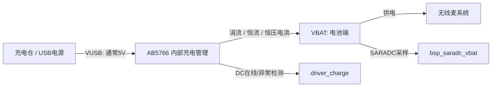
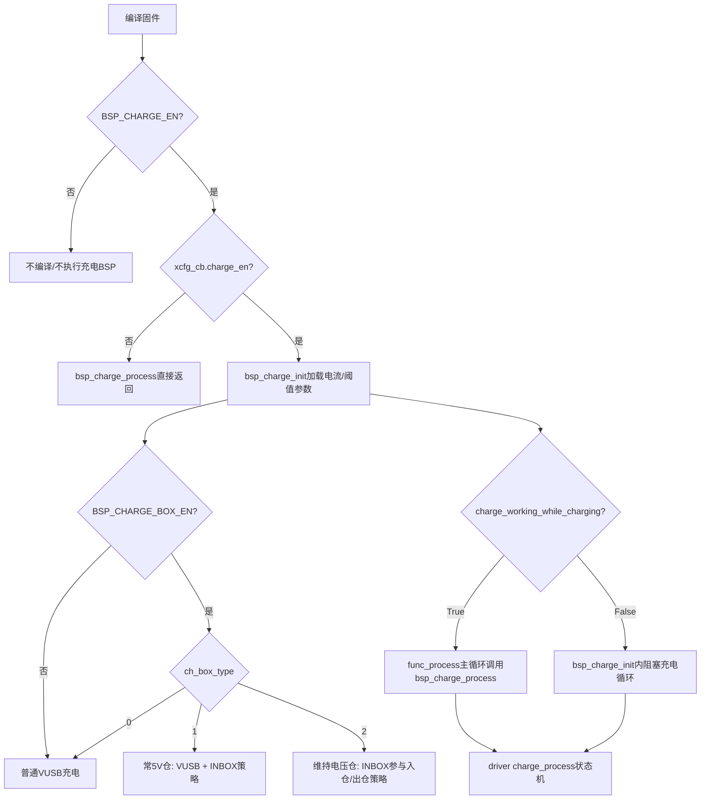
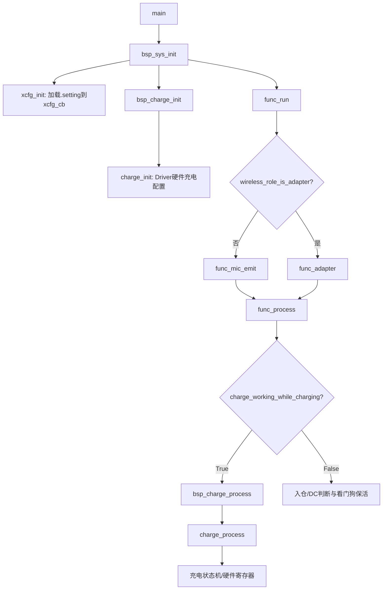
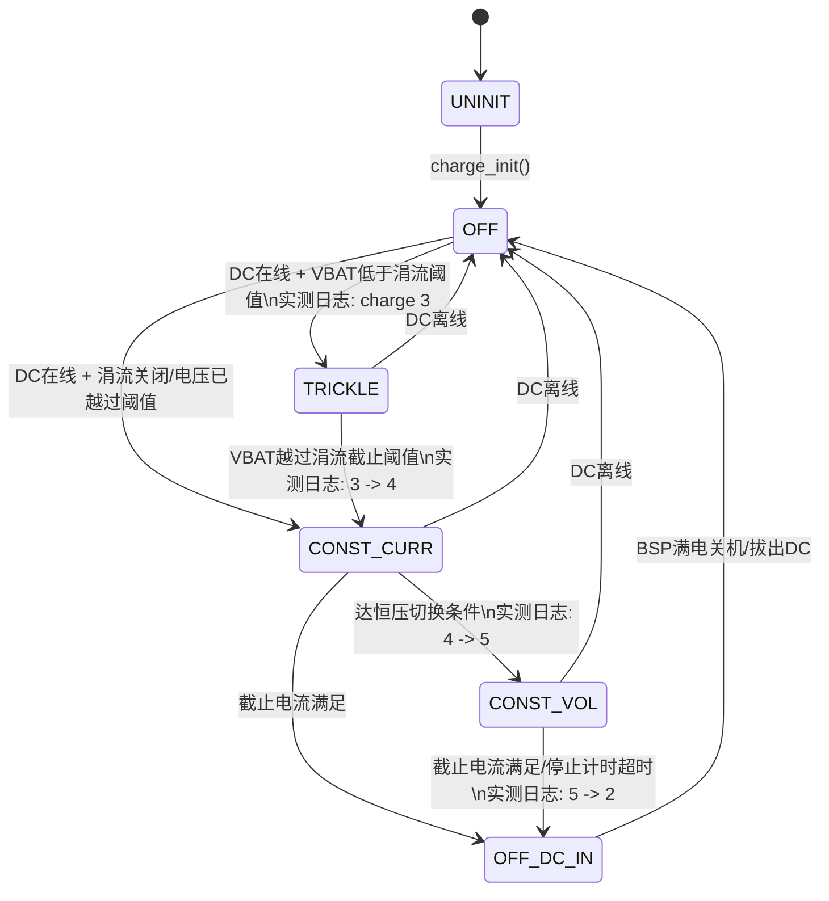
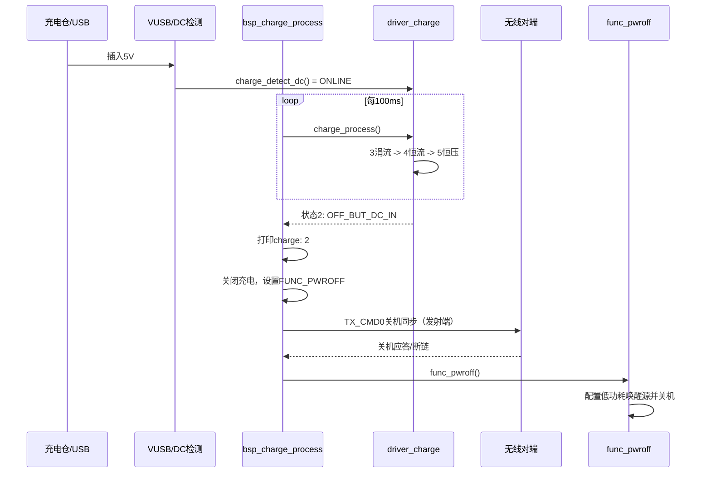
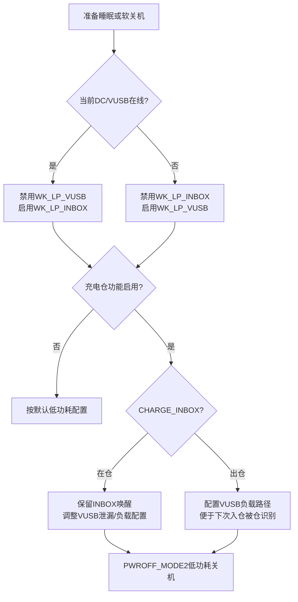

# AB5766 充电仓代码解析与测试指南

> **版本**：V0.1（基于 branch_01 当前源码与已执行测试）  
> **目的**：从 SDK 源码角度说明 AB5766 无线麦的充电与充电仓实现，包括配置、状态机、入仓/出仓检测、低功耗唤醒、满电关机和测试观测点。  
> **原厂依据**：[SDK开发指南.pdf](../SDK/SDK开发指南.pdf) 第 5.4 节《充电及电量》。  
> **实测记录**：[充电仓功能测试.md](../test/充电仓功能测试.md)。  
> **测试计划**：[AB5766_LE_Mic_充电仓功能测试计划.md](../plan/AB5766_LE_Mic_充电仓功能测试计划.md)。

---

## 1. 阅读范围与结论边界

AB5766 的“充电”与“充电仓”不是同一层能力：

- **充电功能**：芯片通过 VUSB 输入给 VBAT 端电池充电，完成涓流、恒流、恒压、充满停止等状态机。
- **充电仓功能**：在充电功能基础上，使用 INBOX/VUSB 信号识别设备是否在仓内，并在入仓、出仓、满电关机、低功耗唤醒时采用不同策略。

当前工程已经打开：

- `BSP_CHARGE_EN = 1`：充电功能编译开关；
- `BSP_CHARGE_BOX_EN = 1`：充电仓专属路径编译开关；
- `BSP_VBAT_DETECT_EN = 1`：VBAT SARADC 采样与低电逻辑；
- `BSP_UART_DEBUG_EN = GPIO_PB3`：PB3 默认调试串口，1500000 baud。

见 [config_ab5766_le_mic.h:24-39](../../projects/microphone/config_ab5766_le_mic.h#L24-L39)。

### 1.1 已完成的实测证据

当前实测已直接捕获发射端完整充电状态迁移：

```text
charge: 3  →  charge: 4  →  charge: 5  →  charge: 2
涓流            恒流            恒压            充满/停充
                                              → charge full, enter pwroff
                                              → func_pwroff
```

同时已验证 VUSB 唤醒、异常 DC 电压告警、低电关机与发射端关机同步对端等路径。详细日志与结论见 [充电仓功能测试.md](../test/充电仓功能测试.md)。

### 1.2 不能过度解读的结论

下列充电仓专属用例尚需用真实仓或 INBOX 工装直接验证，不能因普通 5V 直充通过就视为完成：

- INBOX 入仓检测；
- 维持电压仓（`ch_box_type=2`）的入仓关机；
- INBOX 下降沿出仓唤醒；
- 仓内低功耗唤醒源切换；
- 关机过程发生唤醒 pending 时的 reset 边界；
- 充电中拔出、反复插拔、复充、长稳循环。

---

## 2. 术语、信号与硬件模型

| 名称 | 硬件含义 | SDK 中的用途 |
| --- | --- | --- |
| **VBAT** | 电池端，给系统供电，也是被充电的一端 | SARADC 测电池电压；决定涓流/恒流/恒压状态机切换条件 |
| **VUSB / VBUS / DC** | USB 或充电仓提供的充电输入，通常 5V | `CHARGE_DC_IN()` / `charge_detect_dc()` 判定是否可充电与是否异常 |
| **INBOX** | 充电仓在仓状态信号 | `CHARGE_INBOX()` 判入仓；用于维持电压仓、出仓唤醒及关机后策略 |
| **DC IN** | VUSB/DC 在线标志 | 充电状态机是否推进的前置条件 |
| **常 5V 仓** | 设备在仓内 VUSB 持续为 5V | `ch_box_type=1` |
| **维持电压仓** | 充满或仓低电时 VUSB 可降为维持电压 | `ch_box_type=2`，需结合 INBOX 判定 |

### 2.1 VUSB 与 VBAT 的关系



当 VUSB 高于 VBAT 一定裕量（原厂文档说明通常需高于电池电压 0.2V 以上）且检测正常时，充电状态机才会推进。VUSB 拔出后，充电停止，系统由 VBAT 供电。

> **工装提示**：可调电源模拟 VBAT 时，充电电流会灌入该电源。普通单向稳压电源可能无法吸收反灌电流，导致 VBAT 被顶高，串口 ADC 读数不等于真实电池静置电压。充电电流、截止电压和温升验收必须用万用表、电流表或可吸收电流的电源/电子负载辅助测量。

### 2.2 INBOX 与 DC 的寄存器来源

[bsp_charge.h](../../bsp/bsp_charge.h) 定义了两个核心宏：

```c
#define CHARGE_DC_IN()     ((RTCCON >> 19) & 0x02)
#define CHARGE_INBOX()     ((RTCCON >> 22) & 0x01)
```

- `CHARGE_DC_IN()`：读取 `RTCCON[20]`，代表 VUSB/DC 在线；
- `CHARGE_INBOX()`：读取 `RTCCON[22]`，代表设备在仓内。

两者不能混为一谈：常 5V 仓内两者都可能有效；维持电压仓/仓低电时，VUSB 可能不能被识别为有效充电输入，但 INBOX 仍可用于判断入仓。

---

## 3. 配置：编译开关、运行时参数与仓类型

### 3.1 编译期宏

| 宏 | 当前值 | 作用 |
| --- | ---: | --- |
| `BSP_CHARGE_EN` | 1 | 编译 BSP 充电初始化和周期处理 |
| `BSP_CHARGE_BOX_EN` | 1 | 编译 INBOX、仓内关机与唤醒修正逻辑 |
| `BSP_VBAT_DETECT_EN` | 1 | 编译 VBAT SARADC 检测、低电提示/关机 |
| `SYS_PWROFF_MODE` | `PWROFF_MODE2` | 软件关机时 VDDIO 不掉电，支持低功耗唤醒 |
| `BSP_UART_DEBUG_EN` | `GPIO_PB3` | PB3 调试串口输出 |

### 3.2 `.setting` → `xcfg_cb` 运行时参数

参数位于 `projects/microphone/xcfg.h`，由烧录配置区加载到 `xcfg_cb`。实际参数值应以烧录到具体板子的 `.setting` 为准。

| 参数 | 作用 | 关键代码位置 |
| --- | --- | --- |
| `charge_en` | 充电运行时总开关；为 0 时 `bsp_charge_process()` 直接返回 | [bsp_charge.c:116-118](../../bsp/bsp_charge.c#L116-L118) |
| `charge_trick_en` | 允许低 VBAT 时走涓流 | [bsp_charge.c:56-57](../../bsp/bsp_charge.c#L56-L57) |
| `charge_constant_curr` | 恒流电流档位 | [bsp_charge.c:46](../../bsp/bsp_charge.c#L46) |
| `charge_trickle_curr` | 涓流电流档位 | [bsp_charge.c:56](../../bsp/bsp_charge.c#L56) |
| `charge_stop_curr` | 截止电流档位 | [bsp_charge.c:47](../../bsp/bsp_charge.c#L47) |
| `charge_stop_time` | 达截止电压后、截止电流未满足时的停充兜底时间 | Driver 配置接口 `charge_cutoff_vol_to_stop_time_set()` |
| `charge_dc_in_rst` | 插入 DC/VUSB 是否复位 | [bsp_charge.c:50-54](../../bsp/bsp_charge.c#L50-L54) |
| `charge_working_while_charging` | True=边充边工作；False=阻塞充电 | [bsp_charge.c:64](../../bsp/bsp_charge.c#L64) |
| `ch_box_type` | 0=禁用、1=常 5V 仓、2=维持电压仓 | [xcfg.h:35](../../projects/microphone/xcfg.h#L35) |
| `poweron_vusb_out_en` | VUSB/INBOX 唤醒后是否允许自动开机 | [bsp_sys.c:157-163](../../bsp/bsp_sys.c#L157-L163) |

系统初始化时，只有 `charge_en` 为真才会把 `xcfg_cb.ch_box_type` 写入 `sys_cb.charge_box_type`；否则充电仓功能被强制视为关闭，见 [bsp_sys.c:129-131](../../bsp/bsp_sys.c#L129-L131)。

### 3.3 参数到运行路径的总览



---

## 4. 分层代码架构与主调用链

| 层级 | 文件 | 主要职责 |
| --- | --- | --- |
| Driver | [driver_charge.h](../../driver/driver_charge.h)、`driver_charge.c` | 定义状态/电流/电压枚举，直接操作充电硬件、DC 检测和状态机 |
| BSP | [bsp_charge.h](../../bsp/bsp_charge.h)、[bsp_charge.c](../../bsp/bsp_charge.c) | 将产品 `.setting` 映射到 Driver，驱动 100ms 轮询，联动 LED、低功耗、满电关机 |
| Function | [func.c](../../functions/func.c) | 根据“边充边工作”配置调用 BSP；根据角色进入 emit/adapter |
| Low Power | [func_lowpwr.c](../../functions/func_lowpwr.c) | 入睡/关机时切换 VUSB 与 INBOX 唤醒源，处理仓内 VUSB 负载策略 |
| System | [bsp_sys.c](../../bsp/bsp_sys.c) | 初始化 `charge_box_type`；读取 wakeup pending，决定是否自动开机 |
| VBAT 检测 | [bsp_saradc_vbat.c](../../bsp/bsp_saradc_vbat.c) | 10bit SARADC 采样、滤波、低电提示/低电关机、`[vbat]` 调试打印 |

### 4.1 初始化与正常运行调用链



`bsp_charge_init()` 位于 [bsp_charge.c:29-106](../../bsp/bsp_charge.c#L29-L106)。边充边工作模式下，公共 `func_process()` 每次主循环都调用 `bsp_charge_process()`，见 [func.c:44-72](../../functions/func.c#L44-L72)。

### 4.2 BSP 100ms 调度与产品策略

`bsp_charge_process()`（[bsp_charge.c:110-169](../../bsp/bsp_charge.c#L110-L169)）的顺序非常重要：

1. `charge_en==0` 直接返回；
2. 读取当前 `charge_get_status()`；
3. 与 `charge_status_last` 对比，只有状态变化才打印 `charge: x` 并更新 LED；
4. 充电中（状态大于 2）重置休眠与自动关机延时；
5. 若状态为 2，打印充满日志、关闭充电、请求 `FUNC_PWROFF`；
6. 每 100ms 调一次 Driver 的 `charge_process()` 推进底层状态机；
7. 每 2 秒检查一次 `ONLINE_BUT_ERR`，异常时打印 `[charge] CHARGE LINE VOLTAGE ERROR!!!`。

> 因为“先读取旧状态、后调用 `charge_process()` 推进”的顺序，新状态通常会在下一次 BSP 调度中才触发 LED、日志和满电关机策略。

---

## 5. 充电状态机：6 个状态与状态迁移

状态定义在 [driver_charge.h:35-42](../../driver/driver_charge.h#L35-L42)。

| 值 | 枚举 | 含义 | 日志/测试状态 |
| ---: | --- | --- | --- |
| 0 | `CHARGE_STA_UNINIT` | Driver 未初始化 | 一般只在初始化前短暂存在 |
| 1 | `CHARGE_STA_OFF` | 未充电、DC 离线或软件已关闭充电 | `charge: 1` |
| 2 | `CHARGE_STA_OFF_BUT_DC_IN` | 已停止充电但 DC 仍在线；通常是满电 | `charge: 2` |
| 3 | `CHARGE_STA_ON_TRICKLE` | 涓流充电 | `charge: 3` |
| 4 | `CHARGE_STA_ON_CON_CURR` | 恒流充电 | `charge: 4` |
| 5 | `CHARGE_STA_ON_CON_VOL` | 恒压充电 | `charge: 5` |



### 5.1 底层状态机的关键条件

底层入口是 `charge_process()`，在线状态推进在 `charge_DC_online_handle()`，结束检测在 `charge_detect_off_condition()`（均位于 `driver_charge.c`）。其核心行为是：

- DC/VUSB 状态先进行去抖，只有 `CHARGE_DC_STATUS_ONLINE` 才启动充电；
- 低于涓流阈值且启用涓流时，进入 `CHARGE_STA_ON_TRICKLE`；
- 电压越过涓流阈值后，进入 `CHARGE_STA_ON_CON_CURR`；
- 达到截止电压的累计条件，进入恒压；
- 截止电流满足累计条件，或达到截止电压后的停止计时超时，进入状态 2；
- DC 不在线时，活动状态回到 `CHARGE_STA_OFF`。

Driver 内部存在去抖/累计计数，因此阶段切换不是一次 ADC 采样即发生：DC 在线确认、涓流阈值确认和截止电压/电流确认都需要多次连续满足条件。

### 5.2 为什么 `charge: x` 不连续打印

`charge: x` 是 [bsp_charge.c:121-124](../../bsp/bsp_charge.c#L121-L124) 中的状态变化日志，只有 `charge_get_status()` 与上一状态不同才输出。它是**状态迁移证据**，不是实时采样。

持续观测 VBAT 使用 `[vbat] xxxx mV`；当前测试固件在 [bsp_saradc_vbat.c](../../bsp/bsp_saradc_vbat.c) 中增加了 1 秒周期打印。ADC 有滤波，且底层比较器与 ADC 采样精度/时序不同，因此 `charge: 5` 的切换点不必与串口显示的某一个精确毫伏数完全一致。

### 5.3 LED、低功耗和充满关机

- 状态变化时，状态 ≥4 调 `led_charge_on()`；其他状态调用 `led_charge_off()`，见 [bsp_charge.c:120-130](../../bsp/bsp_charge.c#L120-L130)。按当前实现，涓流状态 3 不会点亮充电灯。
- 状态 >2 时调用 `lowpwr_pwroff_delay_reset()` 与 `lowpwr_sleep_delay_reset()`，避免充电过程中因空闲被关机/休眠，见 [bsp_charge.c:132-135](../../bsp/bsp_charge.c#L132-L135)。
- 状态 2 出现时，当前工程固定 `CHARGE_FULL_PWROFF_EN=1`：打印 `-->charge full, enter pwroff`、执行 `charge_status_update(CHARGE_STA_OFF)` 并设置 `FUNC_PWROFF`，见 [bsp_charge.c:137-143](../../bsp/bsp_charge.c#L137-L143)。
- `RECHARGE_EN` 当前为 0，复充逻辑未编译执行；若启用，VBAT 低于 4.2V 时可从停充状态重新进恒流，见 [bsp_charge.c:9-15](../../bsp/bsp_charge.c#L9-L15) 和 [bsp_charge.c:150-160](../../bsp/bsp_charge.c#L150-L160)。

---

## 6. 入仓、充满和关机时序

### 6.1 常 5V 入仓 → 充电 → 满电关机



实测已经捕获 `3 → 4 → 5 → 2 → func_pwroff`，详见 [测试记录 T3](../test/充电仓功能测试.md)。

### 6.2 阻塞充电模式的仓内处理

当 `charge_working_while_charging=False`，`bsp_charge_init()` 会在 DC 在线期间循环调用 `bsp_charge_process()`，而不是直接进入无线/音频功能。充满后：

1. 若启用充电仓，代码最多等待约 500ms，持续检查 `CHARGE_INBOX()`；
2. 目的：设备刚出仓时 VUSB 可能没有立刻跌落，需区分“仍在仓内”还是“已出仓瞬态”；
3. 如果已请求关机或仍在仓内，执行 `func_pwroff()`。

对应代码：[bsp_charge.c:64-105](../../bsp/bsp_charge.c#L64-L105)。

---

## 7. 充电仓专属：INBOX、出仓唤醒与低功耗

### 7.1 常 5V 仓与维持电压仓

| `ch_box_type` | 说明 | 核心依赖 | 重点测试 |
| ---: | --- | --- | --- |
| 0 | 禁用充电仓策略 | 普通 VUSB/DC | 普通插拔充电 |
| 1 | 常 5V 仓 | VUSB/DC + INBOX | 入仓充电、满电关机、出仓唤醒 |
| 2 | 维持电压仓 | INBOX 尤其关键 | 仓低电/满电 VUSB 不足 5V 时的入仓关机与出仓唤醒 |

在 `charge_working_while_charging=False` 的普通功能循环中，若充电仓已启用，代码会以 `CHARGE_INBOX()` 替代单纯的 `charge_detect_dc()==ONLINE` 作为入仓判定，专门兼容“仓低电时 VUSB 无法升到 5V”的场景，见 [func.c:54-69](../../functions/func.c#L54-L69)。

### 7.2 睡眠/关机时唤醒源互斥切换



- 进入睡眠前，DC 在线时启用 `WK_LP_INBOX`、禁用 `WK_LP_VUSB`；DC 离线时反过来，见 [func_lowpwr.c:151-208](../../functions/func_lowpwr.c#L151-L208)。
- `func_pwroff()` 会在最终关机前设置低功耗唤醒配置，见 [func_lowpwr.c:352-389](../../functions/func_lowpwr.c#L352-L389) 和 [func_lowpwr.c:407-432](../../functions/func_lowpwr.c#L407-L432)。
- 启动后，`power_on_check()` 按 `WK_LP_INBOX_PENDING`、`WK_LP_VUSB_PENDING` 和 `poweron_vusb_out_en` 决定是否不按键直接自动开机，见 [bsp_sys.c:152-196](../../bsp/bsp_sys.c#L152-L196)。

### 7.3 出仓唤醒与关机 pending 风险

原厂 PDF 第 5.4.3 的关键限制：**芯片不能在关机过程中同时处理新的唤醒 pending**。如果正在关机时对应唤醒源触发，系统可能立刻 reset，表现为关机失败或连续重启。

- 使用 VUSB 唤醒时，应确保 VUSB 已下降后再关机；
- 使用 INBOX 下降沿出仓唤醒时，仓内需要维持合适的 VUSB 电压条件；
- 真实仓测试必须覆盖“关机中插入/拔出”的边界，不应只测稳定状态。

接收端曾观测到插入 5V 时出现两次 `Hello Platform`；目前作为待复测现象记录，不可直接归因于该限制，详见 [测试记录](../test/充电仓功能测试.md)。

---

## 8. 运行模式：边充边工作与阻塞充电

| 模式 | 配置 | 调度位置 | 用户可见行为 | 推荐测试 |
| --- | --- | --- | --- | --- |
| 边充边工作 | `charge_working_while_charging=True` | `func_process()` 周期调用 `bsp_charge_process()` | 无线/音频继续运行，同时充电；充满后再请求关机 | 三段状态机、无线连接共存、拔插稳定性 |
| 阻塞充电 | `charge_working_while_charging=False` | `bsp_charge_init()` 内部 while 循环 | 充电期间不进正常功能；适合“放仓即关机充电”产品 | 入仓/出仓、满电关机、INBOX 去抖 |

边充边工作在 [func.c:49-53](../../functions/func.c#L49-L53)；阻塞充电入口在 [bsp_charge.c:64-75](../../bsp/bsp_charge.c#L64-L75)。

---

## 9. 测试日志如何映射到源码

| 日志/现象 | 源码行为 | 已验证情况 |
| --- | --- | --- |
| `charge: 3 → 4 → 5 → 2` | Driver 状态机推进，BSP 在状态变化时打印 | ✅ 发射端完整实测 |
| `-->charge full, enter pwroff` | 状态 2 时 BSP 请求满电关机 | ✅ emit/adapter 均已实测 |
| `func_pwroff` | 系统完成低功耗软关机 | ✅ 已实测 |
| `VUSB_RST` / `VUSB_WK` | VUSB 插入复位/唤醒 | ✅ 接收端已实测；双重启待复测 |
| `[charge] CHARGE LINE VOLTAGE ERROR!!!` | DC 在线但电压异常，BSP 每 2 秒巡检打印 | ✅ 已复现异常路径 |
| `EVT_LPWR_OFF` | VBAT 低电关机事件 | ✅ 已实测，属放电侧闭环 |
| `[vbat] xxxx mV` | SARADC VBAT 采样/滤波后的调试观测 | ✅ 已打印；精度仍需万用表对点 |

完整用例状态、截图和待办以 [充电仓功能测试.md](../test/充电仓功能测试.md) 为准。

---

## 10. 调试与测试快速排查

| 症状 | 优先检查 | 解释/动作 |
| --- | --- | --- |
| 不出现 `charge: 3/4/5` | VUSB 是否达到有效窗口；`charge_en` 是否为 True | `charge: x` 只有状态变化才打印；检查 PB3 1.5M、DC 在线、VUSB 是否高于 VBAT 足够裕量 |
| 持续报 `CHARGE LINE VOLTAGE ERROR` | VUSB 实际电压、纹波、接线与电源能力 | `charge_detect_dc()` 是 `ONLINE_BUT_ERR`；先用稳定 5V 复测 |
| 低 VBAT 不进涓流 | `charge_trick_en`、VBAT 实测、状态机去抖时间 | 确认低于涓流阈值并等待状态机累计确认 |
| 充满不关机 | `CHARGE_FULL_PWROFF_EN`、状态是否到 2、`charge_stop_curr`/`charge_stop_time` | 当前工程该宏为 1；查看是否出现 `charge: 2` 和满电日志 |
| 入仓未识别 | `BSP_CHARGE_BOX_EN`、`ch_box_type`、RTCCON INBOX 位、仓触点 | 常 5V 仓先查 VUSB；维持电压仓必须直接验证 INBOX |
| 出仓不自动开机 | `WK_LP_INBOX/VUSB` pending、`poweron_vusb_out_en`、仓维持电压 | 出仓唤醒与自动开机不是同一条件；需抓唤醒原因与配置 |
| 充电中 ADC 电压异常高 | 可调电源是否被反灌、测点是否为真实电池端 | 断开 VUSB 静置后用万用表复测；不能仅按 `[vbat]` 判断容量 |
| 插入 5V 连续重启 | `charge_dc_in_rst`、VUSB 上电边沿、唤醒 pending | 对照 `VUSB_RST/VUSB_WK` 日志，固定电源和接线后重复试验 |

---

## 11. 代码阅读索引

| 主题 | 首选入口 |
| --- | --- |
| 状态枚举、电流/电压档位、公开 API | [driver_charge.h](../../driver/driver_charge.h) |
| Driver 状态机与硬件寄存器控制 | `driver/driver_charge.c` |
| 产品充电配置、日志、LED、满电关机 | [bsp_charge.c](../../bsp/bsp_charge.c) |
| VUSB/INBOX 宏、仓类型定义 | [bsp_charge.h](../../bsp/bsp_charge.h) |
| 充电在主循环中的调度 | [func.c](../../functions/func.c) |
| 睡眠/关机唤醒源和仓内策略 | [func_lowpwr.c](../../functions/func_lowpwr.c) |
| 唤醒原因后的自动开机判断 | [bsp_sys.c](../../bsp/bsp_sys.c) |
| 电池 ADC 检测、滤波和低电关机 | [bsp_saradc_vbat.c](../../bsp/bsp_saradc_vbat.c) |
| 已执行用例与原始日志 | [充电仓功能测试.md](../test/充电仓功能测试.md) |
