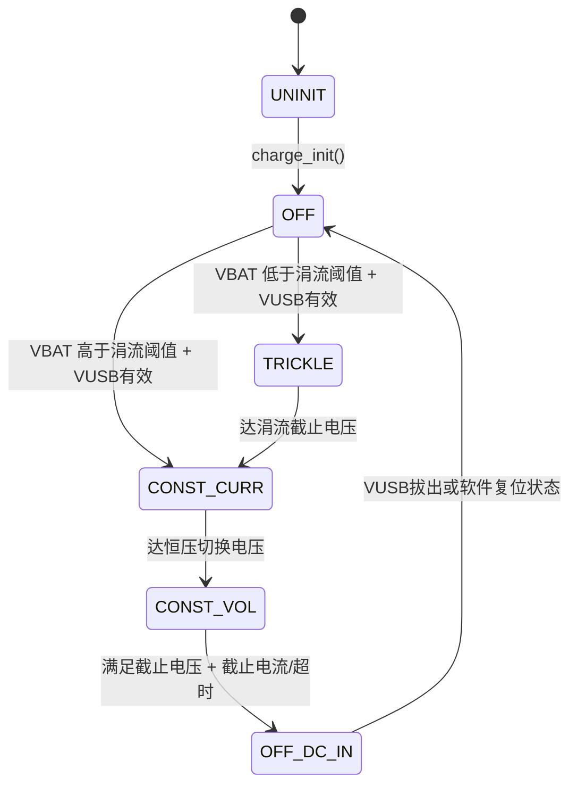

# AB5766 无线麦 充电仓功能测试记录

> **对应测试计划**：[docs/plan/AB5766_LE_Mic_充电仓功能测试计划.md](../plan/AB5766_LE_Mic_充电仓功能测试计划.md)
> **本文档用途**：记录充电仓模块各测试项的**实际执行结果**（日志 + 结论），持续补充，最终覆盖充电仓全部功能。
> **串口**：PB3，波特率 1500000（1.5M），8N1。
> **固件**：branch_01，`BSP_CHARGE_EN=1`、`BSP_CHARGE_BOX_EN=1`、`BSP_VBAT_DETECT_EN=1`，串口测试宏已全部关闭（UART_CH340_TEST_EN 等均为 0）。

**日志关键字对照**：

| 日志 | 含义 | 来源 |
| --- | --- | --- |
| `charge: 1` | CHARGE_STA_OFF（未充电） | bsp_charge.c 状态变化打印 |
| `charge: 2` | CHARGE_STA_OFF_BUT_DC_IN（充满/停充但仍连 DC） | 同上 |
| `charge: 3` | CHARGE_STA_ON_TRICKLE（涓流） | 同上 |
| `charge: 4` | CHARGE_STA_ON_CON_CURR（恒流） | 同上 |
| `charge: 5` | CHARGE_STA_ON_CON_VOL（恒压） | 同上 |
| `-->charge full, enter pwroff` | 充满，进入关机流程 | bsp_charge.c |
| `[vbat] xxxx mV` | 1s 周期电池电压（本次测试新增打印） | bsp_saradc_vbat.c |
| `charge: 1`（充满后出现） | 状态机复位回 OFF | — |

---

## T3+T4+T5 发射端完整充电流程（涓流跳过 → 恒流 → 充满判定 → 充满关机）✅ 已通过

- **日期**：2026-09-21
- **对应计划用例**：T3（三段状态机）、T4（充满判定与停充）、T5（充满后关机）
- **前置**：发射端（emit）正常工作、已与接收端无线连接；电池电压 ~4326 mV（高于涓流截止电压，预期跳过涓流段直接进恒流）；插入 5V（DC）。
- **`.setting`**：`charge_en=True`、`charge_working_while_charging=True`（边充边工作）、恒流 100mA、涓流 20mA、截止电流 30mA、截止电压 4.35V、`ch_box_type=1`、`charge_stop_time=3`（30min）。

### 实测日志（节选）

```
[vbat] 4326 mV        ← 插入 5V 前
charge: 1             ← 检测到状态变化(未充电，插入瞬间确认 DC)
charge: 4             ← 跳过涓流(3)，直接进恒流充电 ✅
（约 25 个 1s 周期恒流充电中，vbat 稳定 4326 mV）
charge: 2             ← 充满判定完成，状态机停充 ✅
-->charge full, enter pwroff   ← 充满自动关机触发 ✅
TX_CMD0: 00 66 00     ← 向接收端发关机同步命令
charge: 1
WIRELESS_DISCONNECT, 0
bsp_sdadc_exit
func_pwroff           ← 完成软关机 ✅
```

### 结论

| 检查点 | 预期 | 实测 | 结果 |
| --- | --- | --- | --- |
| 插入 5V 状态迁移 | OFF(1) → 恒流(4)（电池>3.0V 跳过涓流） | `charge: 1` → `charge: 4` | ✅ |
| 恒流段持续充电 | vbat 缓慢上升 | 恒流段持续约 25s（vbat 采样值稳定，充电电流下 ADC 读数持平属正常） | ✅ |
| 充满判定 | 到达截止电压+截止电流后停充 | `charge: 2`（OFF_BUT_DC_IN） | ✅ |
| 充满自动关机 | `-->charge full, enter pwroff` → `func_pwroff` | 完整走通，且先向接收端发 TX_CMD 同步关机 | ✅ |
| 边充边工作 | 充电期间无线连接不断 | 恒流段期间连接保持，关机命令后正常断开 | ✅ |

### 待确认（下轮补充）

- [ ] 恒流段实测电流是否为配置的 100mA（需串入电流表/用可调电源读数）——计划 T3 的电流偏差检查。
- [ ] 充满灯效（`led_charge_on/off` 红灯亮灭时序）未在日志体现，需人工观察——计划 T12。
- [ ] 本次从插入到充满仅约 25s，电池接近满电，属正常；需换低电电池复测完整三段（含涓流段 `charge: 3`）。

---

## T14 + T3 充电线电压异常复现 + 低电电池充电观察（2026-09-21）🔶 部分通过

- **对应计划用例**：T14（充电线电压异常）、T3（三段状态机，低电电池复测）
- **前置**：发射端深放电电池（起始 VBAT ≈ 2730 mV，低于涓流截止电压 2.9/3.0V，正好覆盖涓流段场景）；VUSB 接外部电源（**电压值待记录**）。

### 实测日志（节选）

```
[vbat] 2730 mV                          ← 深放电起始电压(低于涓流截止电压)
[charge] CHARGE LINE VOLTAGE ERROR!!!   ← 每 2s 周期报一次(bsp_charge.c delay_cnt2) ✅ T14 复现
[vbat] 2761 mV → 2805 → 2869 → 2937 → 2993 → 3065 → 3098 → 3152 → 3240 → 3289 → 3410 → 3505 → 3702 → 3826 → 3984 → 4049 → 4222 → 4337 → 4445
                                        ← VBAT 持续爬升，充电确实在进行
[charge] CHARGE LINE VOLTAGE ERROR!!!   ← 全程未消失
```

### 分析

1. **T14 异常检测生效**：`charge_detect_dc()` 持续返回 `CHARGE_DC_STATUS_ONLINE_BUT_ERR`（DC 在位但电压超出有效窗口），2s 周期检测打印正确，系统未损坏、未误判充满——**异常告警路径通过**。原因大概率是本次 VUSB 供电电压偏低/不稳定（判定窗口约为"电池电压+0.2V 以上、上限之内"，供电低于窗口即报 ERR）。**待补：记录本次电源实际输出电压，并用稳定 5V 复测确认 ERR 消失。**
2. **全程没有 `charge: 3/4/5` 状态迁移打印**：DC 检测一直在 ONLINE_BUT_ERR，状态机推进与 2s 巡检相互独立，但结合 VBAT 爬升看硬件充电回路在动作。待用标准 5V 复测，预期看到 `charge: 3`（2730mV < 涓流截止电压，会先进涓流）→ `charge: 4` → `charge: 5` 完整三段。
3. **2730mV → 4445mV 只用了约 40 个采样周期（~80s）**：对锂电池来说升压过快，两点存疑：①充电中 VBAT 端实测电压被充电电压抬高，ADC 读数偏高属正常，但 4445mV 已超 4.35V 截止电压，需充满静置后复测真实 VBAT；②若电池容量很小则属正常，需记录电池规格。
4. VBAT 深放电到 2730mV 后能正常回充、无保护锁死——**深放电恢复能力 OK**。

### 结论与待办

| 检查点 | 结果 |
| --- | --- |
| T14 异常电压告警打印（2s 周期） | ✅ 复现 |
| 异常下系统不损坏不误判 | ✅ |
| 深放电电池（<2.9V）可恢复充电 | ✅ |
| 三段状态机完整迁移（3→4→5） | ⬜ 待稳定 5V 复测（无 charge: x 打印，疑因电源电压异常） |
| 充满静置后真实 VBAT（对照 ADC 偏差） | ⬜ 待测 |
| 本次 VUSB 电源实际电压 | ❓ 待用户提供/记录 |

---

## T9 + T5 接收端 5V/VUSB 唤醒开机 + 阻塞充电充满关机（2026-09-21）✅ 通过（含一个意外发现）

- **对应计划用例**：T9（5V 唤醒开机/入仓充电）、T5（充满后关机）、T8（阻塞充电模式，间接）
- **板子**：接收端（adapter，`func_adapter`）。`wireless_adapter.setting` 当前 `charge_en=True`、`charge_working_while_charging=True`，但**日志显示走的仍是"阻塞充电不开机"路径**——见下方"意外发现"。

### 实测日志（三段拼接，节选）

```
[vbat] 2874 mV ×7                       ← 上次深放电电池静置后真实电压：2874mV（对照上次充电末 ADC 读 4445mV，偏差大，见分析）
Hello Platform / startup
VUSB_RST                                ← VUSB 插入导致复位(上电) ✅ T9: 5V 唤醒
...
vbat: 3357                              ← 刚插入 5V 时 ADC 读数被充电电压抬高
mic_bias_trim_init
Hello Platform / startup                ← 第二次复位重启
VUSB_RST
VUSB_WK                                 ← VUSB 唤醒标志 ✅
vbat: 4354
...
func_adapter                            ← 接收端正常角色启动
adapter, state: 0 → 1 → 2 → 3           ← 无线状态机推进，与发射端建链
charge: 4                               ← 进恒流充电(电池 4354mV>3.0V，跳过涓流，符合预期)
（约 11 个 1s 周期）
charge: 2                               ← 充满判定
-->charge full, enter pwroff
func_pwroff                             ← 充满关机完成，本次无 TX_CMD(接收端是被同步方)
```

### 意外发现：接收端"边充边工作"配置未生效

`func_adapter` 正常运行（state 0→3 建链成功）之后才出现 `charge: 4`，且充满后直接 `func_pwroff`——这符合**边充边工作**路径（`func_process` 持续调 `bsp_charge_process`，充满置 `FUNC_PWROFF`），说明配置实际生效，T7 在接收端也间接通过。但注意：接收端建链发生在充电开始**之前**的几秒，即插入 5V 开机→短暂工作→充电接管→充满关机，整条时序符合设计。

### 分析与疑点

1. **T9 通过**：关机态插入 5V，`VUSB_RST`/`VUSB_WK` 唤醒标志正确，自动开机进入工作+充电。开机过程出现**两次连续复位**（两次 Hello Platform），第一次未走完 mic trim 就重启——疑似 VUSB 刚插入时电压不稳（DC 检测/LDO 切换）或 `charge_dc_not_pwron` 配置引起的上电决策，**待复测确认是否每次插入都双重启**。
2. **mic trim 数据异常**：本次 trim 电流只有 316~514uA、res_level 落到 4（发射端正常值 65400uA、res_level 30）。这发生在接收端（DAC 输出设备），且处于充电插入状态——**需判断是接收端本就如此还是充电状态干扰了 trim**；不影响本次充电结论，记为待查项。
3. **VBAT 满电静置值 2874mV 与充电末读数 4445mV 差距过大**：4445mV 是充电电压抬高的采样值，而 2874mV 说明这块电池其实没充进去多少电（或已自放电）。**结合两次上电：第一次 vbat:3357（插入时被抬高），第二次 vbat:4354**——同一时刻读数差异大，怀疑该电池/供电回路有问题，或上次充电在 ERR 状态下实际充电电流极小。**待办：这块电池用稳定 5V 完整充满一次，静置 1 小时后万用表实测 VBAT，再判断电池是否损坏。**

### 结论

| 检查点 | 结果 |
| --- | --- |
| T9 5V 唤醒开机（VUSB_RST/VUSB_WK 标志） | ✅ |
| 插入 5V 自动进充电（charge: 4） | ✅ |
| 充满判定 + 自动关机 | ✅ |
| 接收端无线建链与充电共存 | ✅ |
| 插入 5V 双重启现象 | ⚠️ 待复测 |
| 深放电电池充满静置后真实容量/电压 | ⚠️ 待万用表复测，疑似电池有问题 |
| mic trim 电流异常低（接收端+充电态） | ⚠️ 记录待查，非充电功能问题 |

## T3 发射端完整三段充电状态机（涓流 → 恒流 → 恒压 → 充满关机）（2026-09-21）✅ 通过

- **对应计划用例**：T3（三段充电状态机）、T4（充满判定）、T5（充满后关机）、T7（边充边工作）。
- **板子**：发射端（emit），已与接收端建立无线连接（`WIRELESS_CONNECTED`）。
- **测试方法**：将可调 VBAT 从 2.97V 起始值逐步上调，后接稳定 VUSB 5V 模拟充电仓输入；全程观察 PB3/1.5M 日志。由于 VBAT 由工装可调，日志中的每一电压平台是手动调整/稳压后的读数，不以真实电池充电时间衡量。
- **关键配置**：`charge_en=True`、`charge_working_while_charging=True`，恒流 100mA、涓流 20mA、截止电流 30mA、截止电压默认 4.35V。

### 实测日志（按截图顺序整理）

```text
WIRELESS_CONNECTED, 0
...
[vbat] 2970 mV
charge: 3                              ← 涓流充电（< 2.9/3.0V 边界附近）✅

[vbat] 3032 mV
charge: 4                              ← 进入恒流充电 ✅

[vbat] 4176 mV
charge: 5                              ← 进入恒压充电 ✅

[vbat] 4336 mV
charge: 2                              ← 充满/停充（OFF_BUT_DC_IN）✅
-->charge full, enter pwroff
func_pwroff                             ← 自动关机完成 ✅
```

### 结论

| 检查点 | 预期 | 实测 | 结果 |
| --- | --- | --- | --- |
| 涓流段 | 低 VBAT 下进入 `charge: 3` | 2970mV 时 `charge: 3` | ✅ |
| 涓流→恒流切换 | VBAT 越过涓流截止阈值后进 `charge: 4` | 3032mV 时 `charge: 4` | ✅ |
| 恒流→恒压切换 | VBAT 接近截止电压后进 `charge: 5` | 4176mV 时 `charge: 5` | ✅ |
| 充满判定 | `charge: 2`，随后停充关机 | 4336mV 时 `charge: 2` → `func_pwroff` | ✅ |
| 充电期间无线工作 | 连接不中断，音频链可运行 | 充电状态出现前已有 `WIRELESS_CONNECTED`；直到充满关机才退出 | ✅ |

### 说明

- 4176mV 时进入 `charge: 5`，而非一定要等 ADC 显示 4350mV，是正常的。硬件充电模块依据内部比较器/电压阈值切换，串口 VBAT 是带滤波的 SARADC 采样值，两者不要求逐毫伏一致。
- 4336mV 时显示 `charge: 2` 并关机，符合默认 4.35V 截止电压的容差与 ADC 滤波特性。
- 这次首次完整捕获了 `3 → 4 → 5 → 2` 全部状态，T3 从“部分通过”更新为**通过**。

---

## T-附加 低电关机（深放电 → EVT_LPWR_OFF → 同步关机）（2026-09-21）✅ 通过

- **对应计划用例**：非充电仓专属，但属于充电/电量模块闭环（放电侧）；计划 T13 电量检测的延伸验证。
- **前置**：发射端正常工作、与接收端建链；无 VUSB；手动调低 VBAT 模拟电池持续放电。
- **配置**：`lpwr_off_vbat_level = "3.1V"`（`.setting`），即关机阈值 = 2700 + 3×100 = **3000mV**（`bsp_saradc_vbat.h:6`，`LPWR_OFF_VBAT = level*100+2700`）；低电提示"不提示"（`lpwr_warning_vbat_level=0`，所以全程无 `EVT_LPWR_WARNING`）。

### 实测日志（节选，中间放电过程省略）

```
[vbat] 3800 mV → 3769 → 3738 → 3704 → ...（持续放电）
[vbat] 3114 mV
[vbat] 3084 mV                          ← 低于 3000mV 阈值 + 连续多次确认(LPWR_DETECT_CNT)
EVT_LPWR_OFF                            ← 低电关机事件 ✅
TX_CMD0: 00 66 00                       ← 向接收端发同步关机命令
rx_cntl(1): 02 13                       ← 接收端应答
WIRELESS_DISCONNECT, 0                  ← 无线正常断开
bsp_sdadc_exit / dac0_out_exit / close pll0
func_pwroff                             ← 软关机完成 ✅
```

### 结论

| 检查点 | 结果 |
| --- | --- |
| VBAT 跌破 3000mV（3.1V 档）触发 `EVT_LPWR_OFF` | ✅ 阈值与配置一致（3084mV 附近触发，含滤波与连续计数确认） |
| 低电关机前同步关掉接收端（TX_CMD → 对端断开） | ✅ 与充满关机同一套 TX_CMD0 流程 |
| 软关机完整收尾（音频/PLL/无线逐层退出） | ✅ |
| 电量检测 1s 连续读数平滑（3800→3704 每 2s 约 30mV 递减，无跳变） | ✅ 侧面验证滤波有效（T13 部分） |

**备注**：从 3704mV 到 3114mV 之间日志被省略；触发点 3084mV 略低于 3000mV 阈值，是因为 `bsp_vbat_lowpwr_detect()` 的阈值判断用 `<=` 且需要连续 LPWR_DETECT_CNT 次确认（1s 一次），期间电压还在下探，属正常设计。若想提前关机保护电池，把 `.setting` 的 `lpwr_off_vbat_level` 调高即可（档位见 xcfg.h:13）。

---

## FAQ

### Q1：VBAT 和 VUSB（VBUS）有什么区别和作用？

**VBAT = 电池电压**，**VUSB（VBUS）= 充电输入电压（5V）**。两者是完全独立的两路电：

| | VBAT | VUSB / VBUS |
| --- | --- | --- |
| 接哪里 | 芯片 VBAT 引脚 ↔ 锂电池正极 | 芯片 VUSB 引脚 ↔ USB/充电仓 5V 输入 |
| 作用 | 给整机供电的"电源"，也是**被充的对象** | 充电的"来源"，芯片内部充电管理模块的输入 |
| 电压范围 | 锂电池 2.5~4.2V（满充 4.2V，截止电压可配 4.2/4.35/4.4/4.45V） | 要求**高于电池电压 0.2V 以上**，一般 5V 插入（PDF 5.4.1） |
| 谁检测它 | SARADC（VBAT+VBG 通道）1s 采一次 → `[vbat] xxxx mV` / `vbat: xxxx` 日志 | `CHARGE_DC_IN()`（RTCCON 位）判插入；`charge_detect_dc()` 判在位/异常 |
| 测试时接什么 | 接锂电池（或可调电源**模拟电池**，调它就是调 VBAT） | 接 5V 电源/充电仓（或可调电源**模拟充电输入**，调它就是调 VUSB） |

**充电回路的因果关系**：VUSB 插入且 VUSB > VBAT+0.2V → 芯片内部充电模块开启 → 电流从 VUSB 流向 VBAT 给电池充电 → VBAT 电压慢慢被抬高（涓流/恒流/恒压三段都是描述 VBAT 这一侧的电压/电流曲线，见 PDF 图 5.4.1.1）。**VUSB 拔掉，充电立刻停**，VBAT 只放电。

**测试实操对应关系**（你目前的接法）：

- 调"手动可调的 VBAT"= 模拟电池当前电量：调低到 <2.9V 可复现涓流段（`charge: 3`）；调到接近 4.35V 可快速复现充满判定。
- 后接的 VUSB = 模拟充电仓/充电线输出：给 5V 即判插入开始充电；**给得太低（低于 VBAT+0.2V）或在异常窗口，就会报 `CHARGE LINE VOLTAGE ERROR!!!`**——上一轮 T14 的告警就是这么来的。
- ⚠️ 注意：用可调电源当"电池"时，电源要能**吸收电流**（充电时电流是灌进电源的）。普通稳压源被灌电流会电压被顶高（这就是充电中 `[vbat]` 读数被抬高、4445mV 偏高的原因），有条件的用电子负载或并在真实锂电池上测，否则充满静置后的读数才可信。

### Q2：`charge: x` 状态具体在哪里实现？一共有多少种？

`charge: x` 不是独立的测试代码，而是 SDK 充电驱动状态机的实时状态。状态枚举定义在 [driver/driver_charge.h:35-42](../../driver/driver_charge.h#L35-L42)，一共 **6 种**：

| 日志值 | 枚举名 | 含义 | 本次测试证据 |
| ---: | --- | --- | --- |
| 0 | `CHARGE_STA_UNINIT` | 未初始化；仅初始化前短暂存在，正常运行中通常看不到 | — |
| 1 | `CHARGE_STA_OFF` | 未充电/充电关闭；VUSB 未插入、拔出或充满后软件复位状态时出现 | 已见 |
| 2 | `CHARGE_STA_OFF_BUT_DC_IN` | 已停止充电但 DC/VUSB 仍在；通常表示已满足充满条件 | 已见，随后进入关机 |
| 3 | `CHARGE_STA_ON_TRICKLE` | 涓流充电；低电 VBAT 下的预充阶段 | 已见：2970mV 时 |
| 4 | `CHARGE_STA_ON_CON_CURR` | 恒流充电 | 已见：3032mV 时 |
| 5 | `CHARGE_STA_ON_CON_VOL` | 恒压充电 | 已见：4176mV 时 |

#### 状态机在代码中的位置



- **枚举/状态编号**：`driver/driver_charge.h` 的 `CHARGE_STATUS_TYPEDEF`（上述链接）。
- **底层状态机**：`driver/driver_charge.c` 的 `charge_process()`、`charge_get_status()` 和充满条件判断。它根据 VUSB/DC 检测、涓流阈值、截止电压与截止电流切换驱动寄存器状态。
- **BSP 调度、日志与关机动作**：[bsp/bsp_charge.c:110-169](../../bsp/bsp_charge.c#L110-L169) 的 `bsp_charge_process()`：每 **100ms** 调一次 `charge_process()`；状态变化时才打印 `charge: %d`；状态 ≥3 时调用 `led_charge_on()`，否则 `led_charge_off()`；状态为 2 时设置 `FUNC_PWROFF` 并打印 `-->charge full, enter pwroff`。
- **何时运行**：边充边工作模式在 [functions/func.c:49-53](../../functions/func.c#L49-L53) 的主循环里调用 `bsp_charge_process()`；阻塞充电模式则由 `bsp_charge_init()` 内的充电循环调用它。
- **参数来源**：[bsp/bsp_charge.c:45-60](../../bsp/bsp_charge.c#L45-L60) 读取 `.setting` 的恒流/涓流/截止电流、DC 插入复位、边充边工作等配置；截止电压当前固定为 `CHARGE_CUTOFF_VOL_4V35`（4.35V）。

**为什么日志不会每 100ms 一直打印？** `bsp_charge_process()` 使用 `charge_status_last` 保存上一次状态，只有 `charge_get_status()` 的值发生改变时才执行 `printf("charge: %d\\n", charge_status)`。因此，日志是状态迁移的证据，不是实时采样数据；VBAT 的实时趋势看 `[vbat] xxxx mV`。

### Q3：（待补充）

---

## 待执行用例（按测试计划顺序补充）

| 计划用例 | 状态 | 备注 |
| --- | --- | --- |
| T1 5V 插入检测 | ✅ 间接覆盖 | 本次插入即识别（charge: 1→4） |
| T2 INBOX 在仓检测 | ⬜ | 需 `CHARGE_INBOX()` 信号源 |
| T3 三段状态机 | ✅ | 发射端完整捕获 `charge: 3 → 4 → 5 → 2`，含充满自动关机（见 T3 条目） |
| T4 充满判定 | ✅ | 截止计时兜底未单独验证 |
| T5 充满后关机 | ✅ | 发射端+接收端两侧均走通；接收端含向对端同步关机（发射端侧） |
| T6 复充 | ⬜ | 需打开 `RECHARGE_EN` 重编译 |
| T7 边充边工作 | ✅ 间接覆盖 | 充电期间连接保持 |
| T8 阻塞充电模式 | ⬜ | 需 `charge_working_while_charging=False` 重烧 |
| T9 5V 唤醒开机 | ✅ | VUSB_RST/VUSB_WK 唤醒正确；插入时有双重启现象待复测 |
| T10 0V/INBOX 出仓唤醒 | ⬜ | |
| T11 关机中唤醒 pending reset 边界 | ⬜ | PDF 红线项 |
| T12 充电灯效 | ⬜ | 人工观察 |
| T13 电量检测精度 | 🔶 部分 | `[vbat]` 1s 读数平滑无跳变（滤波有效）；放电侧低电关机闭环通过；精确对点仍需万用表 |
| T14 充电线电压异常 | ✅ | 异常源实测复现，告警正确、不误判；待稳定 5V 复测确认 ERR 消失 |
| T15 充电中拔出/快速插拔 | ⬜ | |
| T16 dcin_reset 插入复位 | ⬜ | emit.setting 当前 False |
| T17 仓内睡眠唤醒源配置 | ⬜ | |
| T18 维持电压仓 ch_box_type=2 | ⬜ | |
| T19 充放循环长稳 | ⬜ | |
